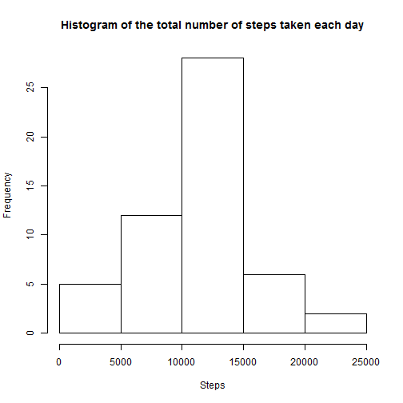
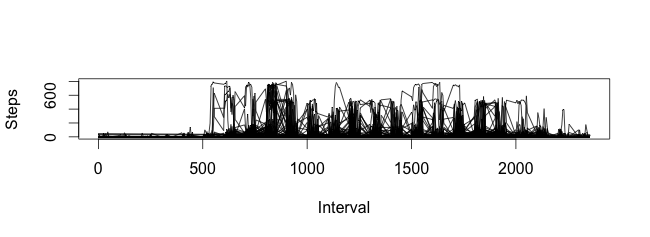
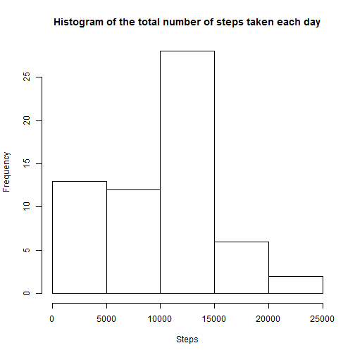

---------------------------------------------------------
        title: "Reproducible Research: Peer Assessment 1"
output: 
        html_document:
        keep_md: true
-----------------------------------------------------------
        
       
## Loading and preprocessing the data

```r
dat <- read.csv("activity.csv",stringsAsFactors=F, header=T)
print(colSums(is.na(dat)))
```

```
##    steps     date interval 
##     2304        0        0
```

```r
library(lubridate)
dat[,2] <- as.Date(dat[,2])
```

## What is mean total number of steps taken per day?

```r
## Ignoring missing values
dat_steps <- dat[complete.cases(dat),]
print(colSums(is.na(dat_steps)))
```

```
##    steps     date interval 
##        0        0        0
```

```r
#1.Calculate the total number of steps taken per day
steps <- tapply(dat_steps[,1],dat_steps[,2],sum)

#2.Make a histogram of the total number of steps taken each day
hist(steps, main="Histogram of the total number of steps taken each day",
     xlab = "Steps")
```

 

```r
#3.Calculate and report the mean and median of the total number of steps taken
#per day
steps_mean <- tapply(dat_steps[,1],dat_steps[,2], mean)
steps_median <- tapply(dat_steps[,1],dat_steps[,2], median)
```



## What is the average daily activity pattern?

```r
#1.Make a time series plot (i.e. type = "l") of the 5-minute interval (x-axis) 
#and the average number of steps taken, averaged across all days (y-axis)
plot(x=dat_steps[,3],y=dat_steps[,1],type="l")
```

 

```r
#2.Which 5-minute interval, on average across all the days in the dataset,
#contains the maximum number of steps?
dat_steps[which.max(dat_steps[,1]),]
```

```
##       steps       date interval
## 16492   806 2012-11-27      615
```

 


## Imputing missing values

```r
#1.Calculate the total number of rows with NAs
colSums(is.na(dat))
```

```
##    steps     date interval 
##     2304        0        0
```

```r
#2.Filling in all of the missing values in the dataset. 
dat_impute <- dat
colSums(is.na(dat_impute))
```

```
##    steps     date interval 
##     2304        0        0
```

```r
dat_impute[,1] <- randomForest::na.roughfix(dat_impute[,1])
colSums(is.na(dat_impute))
```

```
##    steps     date interval 
##        0        0        0
```

```r
#3.Create a new dataset that is equal to the original dataset but with the missing data filled in.
nrow(dat_impute)
```

```
## [1] 17568
```

```r
#4.Make a histogram of the total number of steps taken each day 
impute_steps <- tapply(dat_impute[,1],dat_impute[,2],sum)
hist(impute_steps, main="Histogram of the total number of steps taken each day",xlab = "Steps")
```

 

```r
#Calculate the mean and median total number of steps taken per day
impute_steps_mean <- tapply(dat_impute[,1],dat_impute[,2], mean)
impute_steps_median <- tapply(dat_impute[,1],dat_impute[,2], median)

#Do these values differ from the estimates from the first part of the assignment? What is the impact of imputing missing data on the estimates of the total daily number of steps?

#The number of rows have increased since we have included all the NA entires. On imputing the missing values, the dates(2012-10-01, 2012-11-09, 2012-11-10 and 2012-11-30) are assigned values 0 ie mean step value of all the dates 
```

 


## Are there differences in activity patterns between weekdays and weekends?

```r
#1.Create "weekday" and "weekend" indicating whether a given date is a weekday or weekend day.
weekname <- weekdays(dat_impute[,2])
for(i in 1:length(weekname)){
     if(weekname %in% c("Saturday","Sunday")){
     dat_impute$w_name <- "weekend"
}else{
      dat_impute$w_name <- "weekday"  
}
   names(dat_impute)
}
```

```
## Warning in if (weekname %in% c("Saturday", "Sunday")) {: the condition has
## length > 1 and only the first element will be used
```

```
## Warning in if (weekname %in% c("Saturday", "Sunday")) {: the condition has
## length > 1 and only the first element will be used
```

```
## Warning in if (weekname %in% c("Saturday", "Sunday")) {: the condition has
## length > 1 and only the first element will be used
```

```
## Warning in if (weekname %in% c("Saturday", "Sunday")) {: the condition has
## length > 1 and only the first element will be used
```

```
## Warning in if (weekname %in% c("Saturday", "Sunday")) {: the condition has
## length > 1 and only the first element will be used
```

```
## Warning in if (weekname %in% c("Saturday", "Sunday")) {: the condition has
## length > 1 and only the first element will be used
```

```
## Warning in if (weekname %in% c("Saturday", "Sunday")) {: the condition has
## length > 1 and only the first element will be used
```

```
## Warning in if (weekname %in% c("Saturday", "Sunday")) {: the condition has
## length > 1 and only the first element will be used
```

```
## Warning in if (weekname %in% c("Saturday", "Sunday")) {: the condition has
## length > 1 and only the first element will be used
```

```
## Warning in if (weekname %in% c("Saturday", "Sunday")) {: the condition has
## length > 1 and only the first element will be used
```

```
## Warning in if (weekname %in% c("Saturday", "Sunday")) {: the condition has
## length > 1 and only the first element will be used
```

```
## Warning in if (weekname %in% c("Saturday", "Sunday")) {: the condition has
## length > 1 and only the first element will be used
```

```
## Warning in if (weekname %in% c("Saturday", "Sunday")) {: the condition has
## length > 1 and only the first element will be used
```

```
## Warning in if (weekname %in% c("Saturday", "Sunday")) {: the condition has
## length > 1 and only the first element will be used
```

```
## Warning in if (weekname %in% c("Saturday", "Sunday")) {: the condition has
## length > 1 and only the first element will be used
```

```
## Warning in if (weekname %in% c("Saturday", "Sunday")) {: the condition has
## length > 1 and only the first element will be used
```

```
## Warning in if (weekname %in% c("Saturday", "Sunday")) {: the condition has
## length > 1 and only the first element will be used
```

```
## Warning in if (weekname %in% c("Saturday", "Sunday")) {: the condition has
## length > 1 and only the first element will be used
```

```
## Warning in if (weekname %in% c("Saturday", "Sunday")) {: the condition has
## length > 1 and only the first element will be used
```

```
## Warning in if (weekname %in% c("Saturday", "Sunday")) {: the condition has
## length > 1 and only the first element will be used
```

```
## Warning in if (weekname %in% c("Saturday", "Sunday")) {: the condition has
## length > 1 and only the first element will be used
```

```
## Warning in if (weekname %in% c("Saturday", "Sunday")) {: the condition has
## length > 1 and only the first element will be used
```

```
## Warning in if (weekname %in% c("Saturday", "Sunday")) {: the condition has
## length > 1 and only the first element will be used
```

```
## Warning in if (weekname %in% c("Saturday", "Sunday")) {: the condition has
## length > 1 and only the first element will be used
```

```
## Warning in if (weekname %in% c("Saturday", "Sunday")) {: the condition has
## length > 1 and only the first element will be used
```

```
## Warning in if (weekname %in% c("Saturday", "Sunday")) {: the condition has
## length > 1 and only the first element will be used
```

```
## Warning in if (weekname %in% c("Saturday", "Sunday")) {: the condition has
## length > 1 and only the first element will be used
```

```
## Warning in if (weekname %in% c("Saturday", "Sunday")) {: the condition has
## length > 1 and only the first element will be used
```

```
## Warning in if (weekname %in% c("Saturday", "Sunday")) {: the condition has
## length > 1 and only the first element will be used
```

```
## Warning in if (weekname %in% c("Saturday", "Sunday")) {: the condition has
## length > 1 and only the first element will be used
```

```
## Warning in if (weekname %in% c("Saturday", "Sunday")) {: the condition has
## length > 1 and only the first element will be used
```

```
## Warning in if (weekname %in% c("Saturday", "Sunday")) {: the condition has
## length > 1 and only the first element will be used
```

```
## Warning in if (weekname %in% c("Saturday", "Sunday")) {: the condition has
## length > 1 and only the first element will be used
```

```
## Warning in if (weekname %in% c("Saturday", "Sunday")) {: the condition has
## length > 1 and only the first element will be used
```

```
## Warning in if (weekname %in% c("Saturday", "Sunday")) {: the condition has
## length > 1 and only the first element will be used
```

```
## Warning in if (weekname %in% c("Saturday", "Sunday")) {: the condition has
## length > 1 and only the first element will be used
```

```
## Warning in if (weekname %in% c("Saturday", "Sunday")) {: the condition has
## length > 1 and only the first element will be used
```

```
## Warning in if (weekname %in% c("Saturday", "Sunday")) {: the condition has
## length > 1 and only the first element will be used
```

```
## Warning in if (weekname %in% c("Saturday", "Sunday")) {: the condition has
## length > 1 and only the first element will be used
```

```
## Warning in if (weekname %in% c("Saturday", "Sunday")) {: the condition has
## length > 1 and only the first element will be used
```

```
## Warning in if (weekname %in% c("Saturday", "Sunday")) {: the condition has
## length > 1 and only the first element will be used
```

```
## Warning in if (weekname %in% c("Saturday", "Sunday")) {: the condition has
## length > 1 and only the first element will be used
```

```
## Warning in if (weekname %in% c("Saturday", "Sunday")) {: the condition has
## length > 1 and only the first element will be used
```

```
## Warning in if (weekname %in% c("Saturday", "Sunday")) {: the condition has
## length > 1 and only the first element will be used
```

```
## Warning in if (weekname %in% c("Saturday", "Sunday")) {: the condition has
## length > 1 and only the first element will be used
```

```
## Warning in if (weekname %in% c("Saturday", "Sunday")) {: the condition has
## length > 1 and only the first element will be used
```

```
## Warning in if (weekname %in% c("Saturday", "Sunday")) {: the condition has
## length > 1 and only the first element will be used
```

```
## Warning in if (weekname %in% c("Saturday", "Sunday")) {: the condition has
## length > 1 and only the first element will be used
```

```
## Warning in if (weekname %in% c("Saturday", "Sunday")) {: the condition has
## length > 1 and only the first element will be used
```

```
## Warning in if (weekname %in% c("Saturday", "Sunday")) {: the condition has
## length > 1 and only the first element will be used
```

```
## Warning in if (weekname %in% c("Saturday", "Sunday")) {: the condition has
## length > 1 and only the first element will be used
```

```
## Warning in if (weekname %in% c("Saturday", "Sunday")) {: the condition has
## length > 1 and only the first element will be used
```

```
## Warning in if (weekname %in% c("Saturday", "Sunday")) {: the condition has
## length > 1 and only the first element will be used
```

```
## Warning in if (weekname %in% c("Saturday", "Sunday")) {: the condition has
## length > 1 and only the first element will be used
```

```
## Warning in if (weekname %in% c("Saturday", "Sunday")) {: the condition has
## length > 1 and only the first element will be used
```

```
## Warning in if (weekname %in% c("Saturday", "Sunday")) {: the condition has
## length > 1 and only the first element will be used
```

```
## Warning in if (weekname %in% c("Saturday", "Sunday")) {: the condition has
## length > 1 and only the first element will be used
```

```
## Warning in if (weekname %in% c("Saturday", "Sunday")) {: the condition has
## length > 1 and only the first element will be used
```

```
## Warning in if (weekname %in% c("Saturday", "Sunday")) {: the condition has
## length > 1 and only the first element will be used
```

```
## Warning in if (weekname %in% c("Saturday", "Sunday")) {: the condition has
## length > 1 and only the first element will be used
```

```
## Warning in if (weekname %in% c("Saturday", "Sunday")) {: the condition has
## length > 1 and only the first element will be used
```

```
## Warning in if (weekname %in% c("Saturday", "Sunday")) {: the condition has
## length > 1 and only the first element will be used
```

```
## Warning in if (weekname %in% c("Saturday", "Sunday")) {: the condition has
## length > 1 and only the first element will be used
```

```
## Warning in if (weekname %in% c("Saturday", "Sunday")) {: the condition has
## length > 1 and only the first element will be used
```

```
## Warning in if (weekname %in% c("Saturday", "Sunday")) {: the condition has
## length > 1 and only the first element will be used
```

```
## Warning in if (weekname %in% c("Saturday", "Sunday")) {: the condition has
## length > 1 and only the first element will be used
```

```
## Warning in if (weekname %in% c("Saturday", "Sunday")) {: the condition has
## length > 1 and only the first element will be used
```

```
## Warning in if (weekname %in% c("Saturday", "Sunday")) {: the condition has
## length > 1 and only the first element will be used
```

```
## Warning in if (weekname %in% c("Saturday", "Sunday")) {: the condition has
## length > 1 and only the first element will be used
```

```
## Warning in if (weekname %in% c("Saturday", "Sunday")) {: the condition has
## length > 1 and only the first element will be used
```

```
## Warning in if (weekname %in% c("Saturday", "Sunday")) {: the condition has
## length > 1 and only the first element will be used
```

```
## Warning in if (weekname %in% c("Saturday", "Sunday")) {: the condition has
## length > 1 and only the first element will be used
```

```
## Warning in if (weekname %in% c("Saturday", "Sunday")) {: the condition has
## length > 1 and only the first element will be used
```

```
## Warning in if (weekname %in% c("Saturday", "Sunday")) {: the condition has
## length > 1 and only the first element will be used
```

```
## Warning in if (weekname %in% c("Saturday", "Sunday")) {: the condition has
## length > 1 and only the first element will be used
```

```
## Warning in if (weekname %in% c("Saturday", "Sunday")) {: the condition has
## length > 1 and only the first element will be used
```

```
## Warning in if (weekname %in% c("Saturday", "Sunday")) {: the condition has
## length > 1 and only the first element will be used
```

```
## Warning in if (weekname %in% c("Saturday", "Sunday")) {: the condition has
## length > 1 and only the first element will be used
```

```
## Warning in if (weekname %in% c("Saturday", "Sunday")) {: the condition has
## length > 1 and only the first element will be used
```

```
## Warning in if (weekname %in% c("Saturday", "Sunday")) {: the condition has
## length > 1 and only the first element will be used
```

```
## Warning in if (weekname %in% c("Saturday", "Sunday")) {: the condition has
## length > 1 and only the first element will be used
```

```
## Warning in if (weekname %in% c("Saturday", "Sunday")) {: the condition has
## length > 1 and only the first element will be used
```

```
## Warning in if (weekname %in% c("Saturday", "Sunday")) {: the condition has
## length > 1 and only the first element will be used
```

```
## Warning in if (weekname %in% c("Saturday", "Sunday")) {: the condition has
## length > 1 and only the first element will be used
```

```
## Warning in if (weekname %in% c("Saturday", "Sunday")) {: the condition has
## length > 1 and only the first element will be used
```

```
## Warning in if (weekname %in% c("Saturday", "Sunday")) {: the condition has
## length > 1 and only the first element will be used
```

```
## Warning in if (weekname %in% c("Saturday", "Sunday")) {: the condition has
## length > 1 and only the first element will be used
```

```
## Warning in if (weekname %in% c("Saturday", "Sunday")) {: the condition has
## length > 1 and only the first element will be used
```

```
## Warning in if (weekname %in% c("Saturday", "Sunday")) {: the condition has
## length > 1 and only the first element will be used
```

```
## Warning in if (weekname %in% c("Saturday", "Sunday")) {: the condition has
## length > 1 and only the first element will be used
```

```
## Warning in if (weekname %in% c("Saturday", "Sunday")) {: the condition has
## length > 1 and only the first element will be used
```

```
## Warning in if (weekname %in% c("Saturday", "Sunday")) {: the condition has
## length > 1 and only the first element will be used
```

```
## Warning in if (weekname %in% c("Saturday", "Sunday")) {: the condition has
## length > 1 and only the first element will be used
```

```
## Warning in if (weekname %in% c("Saturday", "Sunday")) {: the condition has
## length > 1 and only the first element will be used
```

```
## Warning in if (weekname %in% c("Saturday", "Sunday")) {: the condition has
## length > 1 and only the first element will be used
```

```
## Warning in if (weekname %in% c("Saturday", "Sunday")) {: the condition has
## length > 1 and only the first element will be used
```

```
## Warning in if (weekname %in% c("Saturday", "Sunday")) {: the condition has
## length > 1 and only the first element will be used
```

```
## Warning in if (weekname %in% c("Saturday", "Sunday")) {: the condition has
## length > 1 and only the first element will be used
```

```
## Warning in if (weekname %in% c("Saturday", "Sunday")) {: the condition has
## length > 1 and only the first element will be used
```

```
## Warning in if (weekname %in% c("Saturday", "Sunday")) {: the condition has
## length > 1 and only the first element will be used
```

```
## Warning in if (weekname %in% c("Saturday", "Sunday")) {: the condition has
## length > 1 and only the first element will be used
```

```
## Warning in if (weekname %in% c("Saturday", "Sunday")) {: the condition has
## length > 1 and only the first element will be used
```

```
## Warning in if (weekname %in% c("Saturday", "Sunday")) {: the condition has
## length > 1 and only the first element will be used
```

```
## Warning in if (weekname %in% c("Saturday", "Sunday")) {: the condition has
## length > 1 and only the first element will be used
```

```
## Warning in if (weekname %in% c("Saturday", "Sunday")) {: the condition has
## length > 1 and only the first element will be used
```

```
## Warning in if (weekname %in% c("Saturday", "Sunday")) {: the condition has
## length > 1 and only the first element will be used
```

```
## Warning in if (weekname %in% c("Saturday", "Sunday")) {: the condition has
## length > 1 and only the first element will be used
```

```
## Warning in if (weekname %in% c("Saturday", "Sunday")) {: the condition has
## length > 1 and only the first element will be used
```

```
## Warning in if (weekname %in% c("Saturday", "Sunday")) {: the condition has
## length > 1 and only the first element will be used
```

```
## Warning in if (weekname %in% c("Saturday", "Sunday")) {: the condition has
## length > 1 and only the first element will be used
```

```
## Warning in if (weekname %in% c("Saturday", "Sunday")) {: the condition has
## length > 1 and only the first element will be used
```

```
## Warning in if (weekname %in% c("Saturday", "Sunday")) {: the condition has
## length > 1 and only the first element will be used
```

```
## Warning in if (weekname %in% c("Saturday", "Sunday")) {: the condition has
## length > 1 and only the first element will be used
```

```
## Warning in if (weekname %in% c("Saturday", "Sunday")) {: the condition has
## length > 1 and only the first element will be used
```

```
## Warning in if (weekname %in% c("Saturday", "Sunday")) {: the condition has
## length > 1 and only the first element will be used
```

```
## Warning in if (weekname %in% c("Saturday", "Sunday")) {: the condition has
## length > 1 and only the first element will be used
```

```
## Warning in if (weekname %in% c("Saturday", "Sunday")) {: the condition has
## length > 1 and only the first element will be used
```

```
## Warning in if (weekname %in% c("Saturday", "Sunday")) {: the condition has
## length > 1 and only the first element will be used
```

```
## Warning in if (weekname %in% c("Saturday", "Sunday")) {: the condition has
## length > 1 and only the first element will be used
```

```
## Warning in if (weekname %in% c("Saturday", "Sunday")) {: the condition has
## length > 1 and only the first element will be used
```

```
## Warning in if (weekname %in% c("Saturday", "Sunday")) {: the condition has
## length > 1 and only the first element will be used
```

```
## Warning in if (weekname %in% c("Saturday", "Sunday")) {: the condition has
## length > 1 and only the first element will be used
```

```
## Warning in if (weekname %in% c("Saturday", "Sunday")) {: the condition has
## length > 1 and only the first element will be used
```

```
## Warning in if (weekname %in% c("Saturday", "Sunday")) {: the condition has
## length > 1 and only the first element will be used
```

```
## Warning in if (weekname %in% c("Saturday", "Sunday")) {: the condition has
## length > 1 and only the first element will be used
```

```
## Warning in if (weekname %in% c("Saturday", "Sunday")) {: the condition has
## length > 1 and only the first element will be used
```

```
## Warning in if (weekname %in% c("Saturday", "Sunday")) {: the condition has
## length > 1 and only the first element will be used
```

```
## Warning in if (weekname %in% c("Saturday", "Sunday")) {: the condition has
## length > 1 and only the first element will be used
```

```
## Warning in if (weekname %in% c("Saturday", "Sunday")) {: the condition has
## length > 1 and only the first element will be used
```

```
## Warning in if (weekname %in% c("Saturday", "Sunday")) {: the condition has
## length > 1 and only the first element will be used
```

```
## Warning in if (weekname %in% c("Saturday", "Sunday")) {: the condition has
## length > 1 and only the first element will be used
```

```
## Warning in if (weekname %in% c("Saturday", "Sunday")) {: the condition has
## length > 1 and only the first element will be used
```

```
## Warning in if (weekname %in% c("Saturday", "Sunday")) {: the condition has
## length > 1 and only the first element will be used
```

```
## Warning in if (weekname %in% c("Saturday", "Sunday")) {: the condition has
## length > 1 and only the first element will be used
```

```
## Warning in if (weekname %in% c("Saturday", "Sunday")) {: the condition has
## length > 1 and only the first element will be used
```

```
## Warning in if (weekname %in% c("Saturday", "Sunday")) {: the condition has
## length > 1 and only the first element will be used
```

```
## Warning in if (weekname %in% c("Saturday", "Sunday")) {: the condition has
## length > 1 and only the first element will be used
```

```
## Warning in if (weekname %in% c("Saturday", "Sunday")) {: the condition has
## length > 1 and only the first element will be used
```

```
## Warning in if (weekname %in% c("Saturday", "Sunday")) {: the condition has
## length > 1 and only the first element will be used
```

```
## Warning in if (weekname %in% c("Saturday", "Sunday")) {: the condition has
## length > 1 and only the first element will be used
```

```
## Warning in if (weekname %in% c("Saturday", "Sunday")) {: the condition has
## length > 1 and only the first element will be used
```

```
## Warning in if (weekname %in% c("Saturday", "Sunday")) {: the condition has
## length > 1 and only the first element will be used
```

```
## Warning in if (weekname %in% c("Saturday", "Sunday")) {: the condition has
## length > 1 and only the first element will be used
```

```
## Warning in if (weekname %in% c("Saturday", "Sunday")) {: the condition has
## length > 1 and only the first element will be used
```

```
## Warning in if (weekname %in% c("Saturday", "Sunday")) {: the condition has
## length > 1 and only the first element will be used
```

```
## Warning in if (weekname %in% c("Saturday", "Sunday")) {: the condition has
## length > 1 and only the first element will be used
```

```
## Warning in if (weekname %in% c("Saturday", "Sunday")) {: the condition has
## length > 1 and only the first element will be used
```

```
## Warning in if (weekname %in% c("Saturday", "Sunday")) {: the condition has
## length > 1 and only the first element will be used
```

```
## Warning in if (weekname %in% c("Saturday", "Sunday")) {: the condition has
## length > 1 and only the first element will be used
```

```
## Warning in if (weekname %in% c("Saturday", "Sunday")) {: the condition has
## length > 1 and only the first element will be used
```

```
## Warning in if (weekname %in% c("Saturday", "Sunday")) {: the condition has
## length > 1 and only the first element will be used
```

```
## Warning in if (weekname %in% c("Saturday", "Sunday")) {: the condition has
## length > 1 and only the first element will be used
```

```
## Warning in if (weekname %in% c("Saturday", "Sunday")) {: the condition has
## length > 1 and only the first element will be used
```

```
## Warning in if (weekname %in% c("Saturday", "Sunday")) {: the condition has
## length > 1 and only the first element will be used
```

```
## Warning in if (weekname %in% c("Saturday", "Sunday")) {: the condition has
## length > 1 and only the first element will be used
```

```
## Warning in if (weekname %in% c("Saturday", "Sunday")) {: the condition has
## length > 1 and only the first element will be used
```

```
## Warning in if (weekname %in% c("Saturday", "Sunday")) {: the condition has
## length > 1 and only the first element will be used
```

```
## Warning in if (weekname %in% c("Saturday", "Sunday")) {: the condition has
## length > 1 and only the first element will be used
```

```
## Warning in if (weekname %in% c("Saturday", "Sunday")) {: the condition has
## length > 1 and only the first element will be used
```

```
## Warning in if (weekname %in% c("Saturday", "Sunday")) {: the condition has
## length > 1 and only the first element will be used
```

```
## Warning in if (weekname %in% c("Saturday", "Sunday")) {: the condition has
## length > 1 and only the first element will be used
```

```
## Warning in if (weekname %in% c("Saturday", "Sunday")) {: the condition has
## length > 1 and only the first element will be used
```

```
## Warning in if (weekname %in% c("Saturday", "Sunday")) {: the condition has
## length > 1 and only the first element will be used
```

```
## Warning in if (weekname %in% c("Saturday", "Sunday")) {: the condition has
## length > 1 and only the first element will be used
```

```
## Warning in if (weekname %in% c("Saturday", "Sunday")) {: the condition has
## length > 1 and only the first element will be used
```

```
## Warning in if (weekname %in% c("Saturday", "Sunday")) {: the condition has
## length > 1 and only the first element will be used
```

```
## Warning in if (weekname %in% c("Saturday", "Sunday")) {: the condition has
## length > 1 and only the first element will be used
```

```
## Warning in if (weekname %in% c("Saturday", "Sunday")) {: the condition has
## length > 1 and only the first element will be used
```

```
## Warning in if (weekname %in% c("Saturday", "Sunday")) {: the condition has
## length > 1 and only the first element will be used
```

```
## Warning in if (weekname %in% c("Saturday", "Sunday")) {: the condition has
## length > 1 and only the first element will be used
```

```
## Warning in if (weekname %in% c("Saturday", "Sunday")) {: the condition has
## length > 1 and only the first element will be used
```

```
## Warning in if (weekname %in% c("Saturday", "Sunday")) {: the condition has
## length > 1 and only the first element will be used
```

```
## Warning in if (weekname %in% c("Saturday", "Sunday")) {: the condition has
## length > 1 and only the first element will be used
```

```
## Warning in if (weekname %in% c("Saturday", "Sunday")) {: the condition has
## length > 1 and only the first element will be used
```

```
## Warning in if (weekname %in% c("Saturday", "Sunday")) {: the condition has
## length > 1 and only the first element will be used
```

```
## Warning in if (weekname %in% c("Saturday", "Sunday")) {: the condition has
## length > 1 and only the first element will be used
```

```
## Warning in if (weekname %in% c("Saturday", "Sunday")) {: the condition has
## length > 1 and only the first element will be used
```

```
## Warning in if (weekname %in% c("Saturday", "Sunday")) {: the condition has
## length > 1 and only the first element will be used
```

```
## Warning in if (weekname %in% c("Saturday", "Sunday")) {: the condition has
## length > 1 and only the first element will be used
```

```
## Warning in if (weekname %in% c("Saturday", "Sunday")) {: the condition has
## length > 1 and only the first element will be used
```

```
## Warning in if (weekname %in% c("Saturday", "Sunday")) {: the condition has
## length > 1 and only the first element will be used
```

```
## Warning in if (weekname %in% c("Saturday", "Sunday")) {: the condition has
## length > 1 and only the first element will be used
```

```
## Warning in if (weekname %in% c("Saturday", "Sunday")) {: the condition has
## length > 1 and only the first element will be used
```

```
## Warning in if (weekname %in% c("Saturday", "Sunday")) {: the condition has
## length > 1 and only the first element will be used
```

```
## Warning in if (weekname %in% c("Saturday", "Sunday")) {: the condition has
## length > 1 and only the first element will be used
```

```
## Warning in if (weekname %in% c("Saturday", "Sunday")) {: the condition has
## length > 1 and only the first element will be used
```

```
## Warning in if (weekname %in% c("Saturday", "Sunday")) {: the condition has
## length > 1 and only the first element will be used
```

```
## Warning in if (weekname %in% c("Saturday", "Sunday")) {: the condition has
## length > 1 and only the first element will be used
```

```
## Warning in if (weekname %in% c("Saturday", "Sunday")) {: the condition has
## length > 1 and only the first element will be used
```

```
## Warning in if (weekname %in% c("Saturday", "Sunday")) {: the condition has
## length > 1 and only the first element will be used
```

```
## Warning in if (weekname %in% c("Saturday", "Sunday")) {: the condition has
## length > 1 and only the first element will be used
```

```
## Warning in if (weekname %in% c("Saturday", "Sunday")) {: the condition has
## length > 1 and only the first element will be used
```

```
## Warning in if (weekname %in% c("Saturday", "Sunday")) {: the condition has
## length > 1 and only the first element will be used
```

```
## Warning in if (weekname %in% c("Saturday", "Sunday")) {: the condition has
## length > 1 and only the first element will be used
```

```
## Warning in if (weekname %in% c("Saturday", "Sunday")) {: the condition has
## length > 1 and only the first element will be used
```

```
## Warning in if (weekname %in% c("Saturday", "Sunday")) {: the condition has
## length > 1 and only the first element will be used
```

```
## Warning in if (weekname %in% c("Saturday", "Sunday")) {: the condition has
## length > 1 and only the first element will be used
```

```
## Warning in if (weekname %in% c("Saturday", "Sunday")) {: the condition has
## length > 1 and only the first element will be used
```

```
## Warning in if (weekname %in% c("Saturday", "Sunday")) {: the condition has
## length > 1 and only the first element will be used
```

```
## Warning in if (weekname %in% c("Saturday", "Sunday")) {: the condition has
## length > 1 and only the first element will be used
```

```
## Warning in if (weekname %in% c("Saturday", "Sunday")) {: the condition has
## length > 1 and only the first element will be used
```

```
## Warning in if (weekname %in% c("Saturday", "Sunday")) {: the condition has
## length > 1 and only the first element will be used
```

```
## Warning in if (weekname %in% c("Saturday", "Sunday")) {: the condition has
## length > 1 and only the first element will be used
```

```
## Warning in if (weekname %in% c("Saturday", "Sunday")) {: the condition has
## length > 1 and only the first element will be used
```

```
## Warning in if (weekname %in% c("Saturday", "Sunday")) {: the condition has
## length > 1 and only the first element will be used
```

```
## Warning in if (weekname %in% c("Saturday", "Sunday")) {: the condition has
## length > 1 and only the first element will be used
```

```
## Warning in if (weekname %in% c("Saturday", "Sunday")) {: the condition has
## length > 1 and only the first element will be used
```

```
## Warning in if (weekname %in% c("Saturday", "Sunday")) {: the condition has
## length > 1 and only the first element will be used
```

```
## Warning in if (weekname %in% c("Saturday", "Sunday")) {: the condition has
## length > 1 and only the first element will be used
```

```
## Warning in if (weekname %in% c("Saturday", "Sunday")) {: the condition has
## length > 1 and only the first element will be used
```

```
## Warning in if (weekname %in% c("Saturday", "Sunday")) {: the condition has
## length > 1 and only the first element will be used
```

```
## Warning in if (weekname %in% c("Saturday", "Sunday")) {: the condition has
## length > 1 and only the first element will be used
```

```
## Warning in if (weekname %in% c("Saturday", "Sunday")) {: the condition has
## length > 1 and only the first element will be used
```

```
## Warning in if (weekname %in% c("Saturday", "Sunday")) {: the condition has
## length > 1 and only the first element will be used
```

```
## Warning in if (weekname %in% c("Saturday", "Sunday")) {: the condition has
## length > 1 and only the first element will be used
```

```
## Warning in if (weekname %in% c("Saturday", "Sunday")) {: the condition has
## length > 1 and only the first element will be used
```

```
## Warning in if (weekname %in% c("Saturday", "Sunday")) {: the condition has
## length > 1 and only the first element will be used
```

```
## Warning in if (weekname %in% c("Saturday", "Sunday")) {: the condition has
## length > 1 and only the first element will be used
```

```
## Warning in if (weekname %in% c("Saturday", "Sunday")) {: the condition has
## length > 1 and only the first element will be used
```

```
## Warning in if (weekname %in% c("Saturday", "Sunday")) {: the condition has
## length > 1 and only the first element will be used
```

```
## Warning in if (weekname %in% c("Saturday", "Sunday")) {: the condition has
## length > 1 and only the first element will be used
```

```
## Warning in if (weekname %in% c("Saturday", "Sunday")) {: the condition has
## length > 1 and only the first element will be used
```

```
## Warning in if (weekname %in% c("Saturday", "Sunday")) {: the condition has
## length > 1 and only the first element will be used
```

```
## Warning in if (weekname %in% c("Saturday", "Sunday")) {: the condition has
## length > 1 and only the first element will be used
```

```
## Warning in if (weekname %in% c("Saturday", "Sunday")) {: the condition has
## length > 1 and only the first element will be used
```

```
## Warning in if (weekname %in% c("Saturday", "Sunday")) {: the condition has
## length > 1 and only the first element will be used
```

```
## Warning in if (weekname %in% c("Saturday", "Sunday")) {: the condition has
## length > 1 and only the first element will be used
```

```
## Warning in if (weekname %in% c("Saturday", "Sunday")) {: the condition has
## length > 1 and only the first element will be used
```

```
## Warning in if (weekname %in% c("Saturday", "Sunday")) {: the condition has
## length > 1 and only the first element will be used
```

```
## Warning in if (weekname %in% c("Saturday", "Sunday")) {: the condition has
## length > 1 and only the first element will be used
```

```
## Warning in if (weekname %in% c("Saturday", "Sunday")) {: the condition has
## length > 1 and only the first element will be used
```

```
## Warning in if (weekname %in% c("Saturday", "Sunday")) {: the condition has
## length > 1 and only the first element will be used
```

```
## Warning in if (weekname %in% c("Saturday", "Sunday")) {: the condition has
## length > 1 and only the first element will be used
```

```
## Warning in if (weekname %in% c("Saturday", "Sunday")) {: the condition has
## length > 1 and only the first element will be used
```

```
## Warning in if (weekname %in% c("Saturday", "Sunday")) {: the condition has
## length > 1 and only the first element will be used
```

```
## Warning in if (weekname %in% c("Saturday", "Sunday")) {: the condition has
## length > 1 and only the first element will be used
```

```
## Warning in if (weekname %in% c("Saturday", "Sunday")) {: the condition has
## length > 1 and only the first element will be used
```

```
## Warning in if (weekname %in% c("Saturday", "Sunday")) {: the condition has
## length > 1 and only the first element will be used
```

```
## Warning in if (weekname %in% c("Saturday", "Sunday")) {: the condition has
## length > 1 and only the first element will be used
```

```
## Warning in if (weekname %in% c("Saturday", "Sunday")) {: the condition has
## length > 1 and only the first element will be used
```

```
## Warning in if (weekname %in% c("Saturday", "Sunday")) {: the condition has
## length > 1 and only the first element will be used
```

```
## Warning in if (weekname %in% c("Saturday", "Sunday")) {: the condition has
## length > 1 and only the first element will be used
```

```
## Warning in if (weekname %in% c("Saturday", "Sunday")) {: the condition has
## length > 1 and only the first element will be used
```

```
## Warning in if (weekname %in% c("Saturday", "Sunday")) {: the condition has
## length > 1 and only the first element will be used
```

```
## Warning in if (weekname %in% c("Saturday", "Sunday")) {: the condition has
## length > 1 and only the first element will be used
```

```
## Warning in if (weekname %in% c("Saturday", "Sunday")) {: the condition has
## length > 1 and only the first element will be used
```

```
## Warning in if (weekname %in% c("Saturday", "Sunday")) {: the condition has
## length > 1 and only the first element will be used
```

```
## Warning in if (weekname %in% c("Saturday", "Sunday")) {: the condition has
## length > 1 and only the first element will be used
```

```
## Warning in if (weekname %in% c("Saturday", "Sunday")) {: the condition has
## length > 1 and only the first element will be used
```

```
## Warning in if (weekname %in% c("Saturday", "Sunday")) {: the condition has
## length > 1 and only the first element will be used
```

```
## Warning in if (weekname %in% c("Saturday", "Sunday")) {: the condition has
## length > 1 and only the first element will be used
```

```
## Warning in if (weekname %in% c("Saturday", "Sunday")) {: the condition has
## length > 1 and only the first element will be used
```

```
## Warning in if (weekname %in% c("Saturday", "Sunday")) {: the condition has
## length > 1 and only the first element will be used
```

```
## Warning in if (weekname %in% c("Saturday", "Sunday")) {: the condition has
## length > 1 and only the first element will be used
```

```
## Warning in if (weekname %in% c("Saturday", "Sunday")) {: the condition has
## length > 1 and only the first element will be used
```

```
## Warning in if (weekname %in% c("Saturday", "Sunday")) {: the condition has
## length > 1 and only the first element will be used
```

```
## Warning in if (weekname %in% c("Saturday", "Sunday")) {: the condition has
## length > 1 and only the first element will be used
```

```
## Warning in if (weekname %in% c("Saturday", "Sunday")) {: the condition has
## length > 1 and only the first element will be used
```

```
## Warning in if (weekname %in% c("Saturday", "Sunday")) {: the condition has
## length > 1 and only the first element will be used
```

```
## Warning in if (weekname %in% c("Saturday", "Sunday")) {: the condition has
## length > 1 and only the first element will be used
```

```
## Warning in if (weekname %in% c("Saturday", "Sunday")) {: the condition has
## length > 1 and only the first element will be used
```

```
## Warning in if (weekname %in% c("Saturday", "Sunday")) {: the condition has
## length > 1 and only the first element will be used
```

```
## Warning in if (weekname %in% c("Saturday", "Sunday")) {: the condition has
## length > 1 and only the first element will be used
```

```
## Warning in if (weekname %in% c("Saturday", "Sunday")) {: the condition has
## length > 1 and only the first element will be used
```

```
## Warning in if (weekname %in% c("Saturday", "Sunday")) {: the condition has
## length > 1 and only the first element will be used
```

```
## Warning in if (weekname %in% c("Saturday", "Sunday")) {: the condition has
## length > 1 and only the first element will be used
```

```
## Warning in if (weekname %in% c("Saturday", "Sunday")) {: the condition has
## length > 1 and only the first element will be used
```

```
## Warning in if (weekname %in% c("Saturday", "Sunday")) {: the condition has
## length > 1 and only the first element will be used
```

```
## Warning in if (weekname %in% c("Saturday", "Sunday")) {: the condition has
## length > 1 and only the first element will be used
```

```
## Warning in if (weekname %in% c("Saturday", "Sunday")) {: the condition has
## length > 1 and only the first element will be used
```

```
## Warning in if (weekname %in% c("Saturday", "Sunday")) {: the condition has
## length > 1 and only the first element will be used
```

```
## Warning in if (weekname %in% c("Saturday", "Sunday")) {: the condition has
## length > 1 and only the first element will be used
```

```
## Warning in if (weekname %in% c("Saturday", "Sunday")) {: the condition has
## length > 1 and only the first element will be used
```

```
## Warning in if (weekname %in% c("Saturday", "Sunday")) {: the condition has
## length > 1 and only the first element will be used
```

```
## Warning in if (weekname %in% c("Saturday", "Sunday")) {: the condition has
## length > 1 and only the first element will be used
```

```
## Warning in if (weekname %in% c("Saturday", "Sunday")) {: the condition has
## length > 1 and only the first element will be used
```

```
## Warning in if (weekname %in% c("Saturday", "Sunday")) {: the condition has
## length > 1 and only the first element will be used
```

```
## Warning in if (weekname %in% c("Saturday", "Sunday")) {: the condition has
## length > 1 and only the first element will be used
```

```
## Warning in if (weekname %in% c("Saturday", "Sunday")) {: the condition has
## length > 1 and only the first element will be used
```

```
## Warning in if (weekname %in% c("Saturday", "Sunday")) {: the condition has
## length > 1 and only the first element will be used
```

```
## Warning in if (weekname %in% c("Saturday", "Sunday")) {: the condition has
## length > 1 and only the first element will be used
```

```
## Warning in if (weekname %in% c("Saturday", "Sunday")) {: the condition has
## length > 1 and only the first element will be used
```

```
## Warning in if (weekname %in% c("Saturday", "Sunday")) {: the condition has
## length > 1 and only the first element will be used
```

```
## Warning in if (weekname %in% c("Saturday", "Sunday")) {: the condition has
## length > 1 and only the first element will be used
```

```
## Warning in if (weekname %in% c("Saturday", "Sunday")) {: the condition has
## length > 1 and only the first element will be used
```

```
## Warning in if (weekname %in% c("Saturday", "Sunday")) {: the condition has
## length > 1 and only the first element will be used
```

```
## Warning in if (weekname %in% c("Saturday", "Sunday")) {: the condition has
## length > 1 and only the first element will be used
```

```
## Warning in if (weekname %in% c("Saturday", "Sunday")) {: the condition has
## length > 1 and only the first element will be used
```

```
## Warning in if (weekname %in% c("Saturday", "Sunday")) {: the condition has
## length > 1 and only the first element will be used
```

```
## Warning in if (weekname %in% c("Saturday", "Sunday")) {: the condition has
## length > 1 and only the first element will be used
```

```
## Warning in if (weekname %in% c("Saturday", "Sunday")) {: the condition has
## length > 1 and only the first element will be used
```

```
## Warning in if (weekname %in% c("Saturday", "Sunday")) {: the condition has
## length > 1 and only the first element will be used
```

```
## Warning in if (weekname %in% c("Saturday", "Sunday")) {: the condition has
## length > 1 and only the first element will be used
```

```
## Warning in if (weekname %in% c("Saturday", "Sunday")) {: the condition has
## length > 1 and only the first element will be used
```

```
## Warning in if (weekname %in% c("Saturday", "Sunday")) {: the condition has
## length > 1 and only the first element will be used
```

```
## Warning in if (weekname %in% c("Saturday", "Sunday")) {: the condition has
## length > 1 and only the first element will be used
```

```
## Warning in if (weekname %in% c("Saturday", "Sunday")) {: the condition has
## length > 1 and only the first element will be used
```

```
## Warning in if (weekname %in% c("Saturday", "Sunday")) {: the condition has
## length > 1 and only the first element will be used
```

```
## Warning in if (weekname %in% c("Saturday", "Sunday")) {: the condition has
## length > 1 and only the first element will be used
```

```
## Warning in if (weekname %in% c("Saturday", "Sunday")) {: the condition has
## length > 1 and only the first element will be used
```

```
## Warning in if (weekname %in% c("Saturday", "Sunday")) {: the condition has
## length > 1 and only the first element will be used
```

```
## Warning in if (weekname %in% c("Saturday", "Sunday")) {: the condition has
## length > 1 and only the first element will be used
```

```
## Warning in if (weekname %in% c("Saturday", "Sunday")) {: the condition has
## length > 1 and only the first element will be used
```

```
## Warning in if (weekname %in% c("Saturday", "Sunday")) {: the condition has
## length > 1 and only the first element will be used
```

```
## Warning in if (weekname %in% c("Saturday", "Sunday")) {: the condition has
## length > 1 and only the first element will be used
```

```
## Warning in if (weekname %in% c("Saturday", "Sunday")) {: the condition has
## length > 1 and only the first element will be used
```

```
## Warning in if (weekname %in% c("Saturday", "Sunday")) {: the condition has
## length > 1 and only the first element will be used
```

```
## Warning in if (weekname %in% c("Saturday", "Sunday")) {: the condition has
## length > 1 and only the first element will be used
```

```
## Warning in if (weekname %in% c("Saturday", "Sunday")) {: the condition has
## length > 1 and only the first element will be used
```

```
## Warning in if (weekname %in% c("Saturday", "Sunday")) {: the condition has
## length > 1 and only the first element will be used
```

```
## Warning in if (weekname %in% c("Saturday", "Sunday")) {: the condition has
## length > 1 and only the first element will be used
```

```
## Warning in if (weekname %in% c("Saturday", "Sunday")) {: the condition has
## length > 1 and only the first element will be used
```

```
## Warning in if (weekname %in% c("Saturday", "Sunday")) {: the condition has
## length > 1 and only the first element will be used
```

```
## Warning in if (weekname %in% c("Saturday", "Sunday")) {: the condition has
## length > 1 and only the first element will be used
```

```
## Warning in if (weekname %in% c("Saturday", "Sunday")) {: the condition has
## length > 1 and only the first element will be used
```

```
## Warning in if (weekname %in% c("Saturday", "Sunday")) {: the condition has
## length > 1 and only the first element will be used
```

```
## Warning in if (weekname %in% c("Saturday", "Sunday")) {: the condition has
## length > 1 and only the first element will be used
```

```
## Warning in if (weekname %in% c("Saturday", "Sunday")) {: the condition has
## length > 1 and only the first element will be used
```

```
## Warning in if (weekname %in% c("Saturday", "Sunday")) {: the condition has
## length > 1 and only the first element will be used
```

```
## Warning in if (weekname %in% c("Saturday", "Sunday")) {: the condition has
## length > 1 and only the first element will be used
```

```
## Warning in if (weekname %in% c("Saturday", "Sunday")) {: the condition has
## length > 1 and only the first element will be used
```

```
## Warning in if (weekname %in% c("Saturday", "Sunday")) {: the condition has
## length > 1 and only the first element will be used
```

```
## Warning in if (weekname %in% c("Saturday", "Sunday")) {: the condition has
## length > 1 and only the first element will be used
```

```
## Warning in if (weekname %in% c("Saturday", "Sunday")) {: the condition has
## length > 1 and only the first element will be used
```

```
## Warning in if (weekname %in% c("Saturday", "Sunday")) {: the condition has
## length > 1 and only the first element will be used
```

```
## Warning in if (weekname %in% c("Saturday", "Sunday")) {: the condition has
## length > 1 and only the first element will be used
```

```
## Warning in if (weekname %in% c("Saturday", "Sunday")) {: the condition has
## length > 1 and only the first element will be used
```

```
## Warning in if (weekname %in% c("Saturday", "Sunday")) {: the condition has
## length > 1 and only the first element will be used
```

```
## Warning in if (weekname %in% c("Saturday", "Sunday")) {: the condition has
## length > 1 and only the first element will be used
```

```
## Warning in if (weekname %in% c("Saturday", "Sunday")) {: the condition has
## length > 1 and only the first element will be used
```

```
## Warning in if (weekname %in% c("Saturday", "Sunday")) {: the condition has
## length > 1 and only the first element will be used
```

```
## Warning in if (weekname %in% c("Saturday", "Sunday")) {: the condition has
## length > 1 and only the first element will be used
```

```
## Warning in if (weekname %in% c("Saturday", "Sunday")) {: the condition has
## length > 1 and only the first element will be used
```

```
## Warning in if (weekname %in% c("Saturday", "Sunday")) {: the condition has
## length > 1 and only the first element will be used
```

```
## Warning in if (weekname %in% c("Saturday", "Sunday")) {: the condition has
## length > 1 and only the first element will be used
```

```
## Warning in if (weekname %in% c("Saturday", "Sunday")) {: the condition has
## length > 1 and only the first element will be used
```

```
## Warning in if (weekname %in% c("Saturday", "Sunday")) {: the condition has
## length > 1 and only the first element will be used
```

```
## Warning in if (weekname %in% c("Saturday", "Sunday")) {: the condition has
## length > 1 and only the first element will be used
```

```
## Warning in if (weekname %in% c("Saturday", "Sunday")) {: the condition has
## length > 1 and only the first element will be used
```

```
## Warning in if (weekname %in% c("Saturday", "Sunday")) {: the condition has
## length > 1 and only the first element will be used
```

```
## Warning in if (weekname %in% c("Saturday", "Sunday")) {: the condition has
## length > 1 and only the first element will be used
```

```
## Warning in if (weekname %in% c("Saturday", "Sunday")) {: the condition has
## length > 1 and only the first element will be used
```

```
## Warning in if (weekname %in% c("Saturday", "Sunday")) {: the condition has
## length > 1 and only the first element will be used
```

```
## Warning in if (weekname %in% c("Saturday", "Sunday")) {: the condition has
## length > 1 and only the first element will be used
```

```
## Warning in if (weekname %in% c("Saturday", "Sunday")) {: the condition has
## length > 1 and only the first element will be used
```

```
## Warning in if (weekname %in% c("Saturday", "Sunday")) {: the condition has
## length > 1 and only the first element will be used
```

```
## Warning in if (weekname %in% c("Saturday", "Sunday")) {: the condition has
## length > 1 and only the first element will be used
```

```
## Warning in if (weekname %in% c("Saturday", "Sunday")) {: the condition has
## length > 1 and only the first element will be used
```

```
## Warning in if (weekname %in% c("Saturday", "Sunday")) {: the condition has
## length > 1 and only the first element will be used
```

```
## Warning in if (weekname %in% c("Saturday", "Sunday")) {: the condition has
## length > 1 and only the first element will be used
```

```
## Warning in if (weekname %in% c("Saturday", "Sunday")) {: the condition has
## length > 1 and only the first element will be used
```

```
## Warning in if (weekname %in% c("Saturday", "Sunday")) {: the condition has
## length > 1 and only the first element will be used
```

```
## Warning in if (weekname %in% c("Saturday", "Sunday")) {: the condition has
## length > 1 and only the first element will be used
```

```
## Warning in if (weekname %in% c("Saturday", "Sunday")) {: the condition has
## length > 1 and only the first element will be used
```

```
## Warning in if (weekname %in% c("Saturday", "Sunday")) {: the condition has
## length > 1 and only the first element will be used
```

```
## Warning in if (weekname %in% c("Saturday", "Sunday")) {: the condition has
## length > 1 and only the first element will be used
```

```
## Warning in if (weekname %in% c("Saturday", "Sunday")) {: the condition has
## length > 1 and only the first element will be used
```

```
## Warning in if (weekname %in% c("Saturday", "Sunday")) {: the condition has
## length > 1 and only the first element will be used
```

```
## Warning in if (weekname %in% c("Saturday", "Sunday")) {: the condition has
## length > 1 and only the first element will be used
```

```
## Warning in if (weekname %in% c("Saturday", "Sunday")) {: the condition has
## length > 1 and only the first element will be used
```

```
## Warning in if (weekname %in% c("Saturday", "Sunday")) {: the condition has
## length > 1 and only the first element will be used
```

```
## Warning in if (weekname %in% c("Saturday", "Sunday")) {: the condition has
## length > 1 and only the first element will be used
```

```
## Warning in if (weekname %in% c("Saturday", "Sunday")) {: the condition has
## length > 1 and only the first element will be used
```

```
## Warning in if (weekname %in% c("Saturday", "Sunday")) {: the condition has
## length > 1 and only the first element will be used
```

```
## Warning in if (weekname %in% c("Saturday", "Sunday")) {: the condition has
## length > 1 and only the first element will be used
```

```
## Warning in if (weekname %in% c("Saturday", "Sunday")) {: the condition has
## length > 1 and only the first element will be used
```

```
## Warning in if (weekname %in% c("Saturday", "Sunday")) {: the condition has
## length > 1 and only the first element will be used
```

```
## Warning in if (weekname %in% c("Saturday", "Sunday")) {: the condition has
## length > 1 and only the first element will be used
```

```
## Warning in if (weekname %in% c("Saturday", "Sunday")) {: the condition has
## length > 1 and only the first element will be used
```

```
## Warning in if (weekname %in% c("Saturday", "Sunday")) {: the condition has
## length > 1 and only the first element will be used
```

```
## Warning in if (weekname %in% c("Saturday", "Sunday")) {: the condition has
## length > 1 and only the first element will be used
```

```
## Warning in if (weekname %in% c("Saturday", "Sunday")) {: the condition has
## length > 1 and only the first element will be used
```

```
## Warning in if (weekname %in% c("Saturday", "Sunday")) {: the condition has
## length > 1 and only the first element will be used
```

```
## Warning in if (weekname %in% c("Saturday", "Sunday")) {: the condition has
## length > 1 and only the first element will be used
```

```
## Warning in if (weekname %in% c("Saturday", "Sunday")) {: the condition has
## length > 1 and only the first element will be used
```

```
## Warning in if (weekname %in% c("Saturday", "Sunday")) {: the condition has
## length > 1 and only the first element will be used
```

```
## Warning in if (weekname %in% c("Saturday", "Sunday")) {: the condition has
## length > 1 and only the first element will be used
```

```
## Warning in if (weekname %in% c("Saturday", "Sunday")) {: the condition has
## length > 1 and only the first element will be used
```

```
## Warning in if (weekname %in% c("Saturday", "Sunday")) {: the condition has
## length > 1 and only the first element will be used
```

```
## Warning in if (weekname %in% c("Saturday", "Sunday")) {: the condition has
## length > 1 and only the first element will be used
```

```
## Warning in if (weekname %in% c("Saturday", "Sunday")) {: the condition has
## length > 1 and only the first element will be used
```

```
## Warning in if (weekname %in% c("Saturday", "Sunday")) {: the condition has
## length > 1 and only the first element will be used
```

```
## Warning in if (weekname %in% c("Saturday", "Sunday")) {: the condition has
## length > 1 and only the first element will be used
```

```
## Warning in if (weekname %in% c("Saturday", "Sunday")) {: the condition has
## length > 1 and only the first element will be used
```

```
## Warning in if (weekname %in% c("Saturday", "Sunday")) {: the condition has
## length > 1 and only the first element will be used
```

```
## Warning in if (weekname %in% c("Saturday", "Sunday")) {: the condition has
## length > 1 and only the first element will be used
```

```
## Warning in if (weekname %in% c("Saturday", "Sunday")) {: the condition has
## length > 1 and only the first element will be used
```

```
## Warning in if (weekname %in% c("Saturday", "Sunday")) {: the condition has
## length > 1 and only the first element will be used
```

```
## Warning in if (weekname %in% c("Saturday", "Sunday")) {: the condition has
## length > 1 and only the first element will be used
```

```
## Warning in if (weekname %in% c("Saturday", "Sunday")) {: the condition has
## length > 1 and only the first element will be used
```

```
## Warning in if (weekname %in% c("Saturday", "Sunday")) {: the condition has
## length > 1 and only the first element will be used
```

```
## Warning in if (weekname %in% c("Saturday", "Sunday")) {: the condition has
## length > 1 and only the first element will be used
```

```
## Warning in if (weekname %in% c("Saturday", "Sunday")) {: the condition has
## length > 1 and only the first element will be used
```

```
## Warning in if (weekname %in% c("Saturday", "Sunday")) {: the condition has
## length > 1 and only the first element will be used
```

```
## Warning in if (weekname %in% c("Saturday", "Sunday")) {: the condition has
## length > 1 and only the first element will be used
```

```
## Warning in if (weekname %in% c("Saturday", "Sunday")) {: the condition has
## length > 1 and only the first element will be used
```

```
## Warning in if (weekname %in% c("Saturday", "Sunday")) {: the condition has
## length > 1 and only the first element will be used
```

```
## Warning in if (weekname %in% c("Saturday", "Sunday")) {: the condition has
## length > 1 and only the first element will be used
```

```
## Warning in if (weekname %in% c("Saturday", "Sunday")) {: the condition has
## length > 1 and only the first element will be used
```

```
## Warning in if (weekname %in% c("Saturday", "Sunday")) {: the condition has
## length > 1 and only the first element will be used
```

```
## Warning in if (weekname %in% c("Saturday", "Sunday")) {: the condition has
## length > 1 and only the first element will be used
```

```
## Warning in if (weekname %in% c("Saturday", "Sunday")) {: the condition has
## length > 1 and only the first element will be used
```

```
## Warning in if (weekname %in% c("Saturday", "Sunday")) {: the condition has
## length > 1 and only the first element will be used
```

```
## Warning in if (weekname %in% c("Saturday", "Sunday")) {: the condition has
## length > 1 and only the first element will be used
```

```
## Warning in if (weekname %in% c("Saturday", "Sunday")) {: the condition has
## length > 1 and only the first element will be used
```

```
## Warning in if (weekname %in% c("Saturday", "Sunday")) {: the condition has
## length > 1 and only the first element will be used
```

```
## Warning in if (weekname %in% c("Saturday", "Sunday")) {: the condition has
## length > 1 and only the first element will be used
```

```
## Warning in if (weekname %in% c("Saturday", "Sunday")) {: the condition has
## length > 1 and only the first element will be used
```

```
## Warning in if (weekname %in% c("Saturday", "Sunday")) {: the condition has
## length > 1 and only the first element will be used
```

```
## Warning in if (weekname %in% c("Saturday", "Sunday")) {: the condition has
## length > 1 and only the first element will be used
```

```
## Warning in if (weekname %in% c("Saturday", "Sunday")) {: the condition has
## length > 1 and only the first element will be used
```

```
## Warning in if (weekname %in% c("Saturday", "Sunday")) {: the condition has
## length > 1 and only the first element will be used
```

```
## Warning in if (weekname %in% c("Saturday", "Sunday")) {: the condition has
## length > 1 and only the first element will be used
```

```
## Warning in if (weekname %in% c("Saturday", "Sunday")) {: the condition has
## length > 1 and only the first element will be used
```

```
## Warning in if (weekname %in% c("Saturday", "Sunday")) {: the condition has
## length > 1 and only the first element will be used
```

```
## Warning in if (weekname %in% c("Saturday", "Sunday")) {: the condition has
## length > 1 and only the first element will be used
```

```
## Warning in if (weekname %in% c("Saturday", "Sunday")) {: the condition has
## length > 1 and only the first element will be used
```

```
## Warning in if (weekname %in% c("Saturday", "Sunday")) {: the condition has
## length > 1 and only the first element will be used
```

```
## Warning in if (weekname %in% c("Saturday", "Sunday")) {: the condition has
## length > 1 and only the first element will be used
```

```
## Warning in if (weekname %in% c("Saturday", "Sunday")) {: the condition has
## length > 1 and only the first element will be used
```

```
## Warning in if (weekname %in% c("Saturday", "Sunday")) {: the condition has
## length > 1 and only the first element will be used
```

```
## Warning in if (weekname %in% c("Saturday", "Sunday")) {: the condition has
## length > 1 and only the first element will be used
```

```
## Warning in if (weekname %in% c("Saturday", "Sunday")) {: the condition has
## length > 1 and only the first element will be used
```

```
## Warning in if (weekname %in% c("Saturday", "Sunday")) {: the condition has
## length > 1 and only the first element will be used
```

```
## Warning in if (weekname %in% c("Saturday", "Sunday")) {: the condition has
## length > 1 and only the first element will be used
```

```
## Warning in if (weekname %in% c("Saturday", "Sunday")) {: the condition has
## length > 1 and only the first element will be used
```

```
## Warning in if (weekname %in% c("Saturday", "Sunday")) {: the condition has
## length > 1 and only the first element will be used
```

```
## Warning in if (weekname %in% c("Saturday", "Sunday")) {: the condition has
## length > 1 and only the first element will be used
```

```
## Warning in if (weekname %in% c("Saturday", "Sunday")) {: the condition has
## length > 1 and only the first element will be used
```

```
## Warning in if (weekname %in% c("Saturday", "Sunday")) {: the condition has
## length > 1 and only the first element will be used
```

```
## Warning in if (weekname %in% c("Saturday", "Sunday")) {: the condition has
## length > 1 and only the first element will be used
```

```
## Warning in if (weekname %in% c("Saturday", "Sunday")) {: the condition has
## length > 1 and only the first element will be used
```

```
## Warning in if (weekname %in% c("Saturday", "Sunday")) {: the condition has
## length > 1 and only the first element will be used
```

```
## Warning in if (weekname %in% c("Saturday", "Sunday")) {: the condition has
## length > 1 and only the first element will be used
```

```
## Warning in if (weekname %in% c("Saturday", "Sunday")) {: the condition has
## length > 1 and only the first element will be used
```

```
## Warning in if (weekname %in% c("Saturday", "Sunday")) {: the condition has
## length > 1 and only the first element will be used
```

```
## Warning in if (weekname %in% c("Saturday", "Sunday")) {: the condition has
## length > 1 and only the first element will be used
```

```
## Warning in if (weekname %in% c("Saturday", "Sunday")) {: the condition has
## length > 1 and only the first element will be used
```

```
## Warning in if (weekname %in% c("Saturday", "Sunday")) {: the condition has
## length > 1 and only the first element will be used
```

```
## Warning in if (weekname %in% c("Saturday", "Sunday")) {: the condition has
## length > 1 and only the first element will be used
```

```
## Warning in if (weekname %in% c("Saturday", "Sunday")) {: the condition has
## length > 1 and only the first element will be used
```

```
## Warning in if (weekname %in% c("Saturday", "Sunday")) {: the condition has
## length > 1 and only the first element will be used
```

```
## Warning in if (weekname %in% c("Saturday", "Sunday")) {: the condition has
## length > 1 and only the first element will be used
```

```
## Warning in if (weekname %in% c("Saturday", "Sunday")) {: the condition has
## length > 1 and only the first element will be used
```

```
## Warning in if (weekname %in% c("Saturday", "Sunday")) {: the condition has
## length > 1 and only the first element will be used
```

```
## Warning in if (weekname %in% c("Saturday", "Sunday")) {: the condition has
## length > 1 and only the first element will be used
```

```
## Warning in if (weekname %in% c("Saturday", "Sunday")) {: the condition has
## length > 1 and only the first element will be used
```

```
## Warning in if (weekname %in% c("Saturday", "Sunday")) {: the condition has
## length > 1 and only the first element will be used
```

```
## Warning in if (weekname %in% c("Saturday", "Sunday")) {: the condition has
## length > 1 and only the first element will be used
```

```
## Warning in if (weekname %in% c("Saturday", "Sunday")) {: the condition has
## length > 1 and only the first element will be used
```

```
## Warning in if (weekname %in% c("Saturday", "Sunday")) {: the condition has
## length > 1 and only the first element will be used
```

```
## Warning in if (weekname %in% c("Saturday", "Sunday")) {: the condition has
## length > 1 and only the first element will be used
```

```
## Warning in if (weekname %in% c("Saturday", "Sunday")) {: the condition has
## length > 1 and only the first element will be used
```

```
## Warning in if (weekname %in% c("Saturday", "Sunday")) {: the condition has
## length > 1 and only the first element will be used
```

```
## Warning in if (weekname %in% c("Saturday", "Sunday")) {: the condition has
## length > 1 and only the first element will be used
```

```
## Warning in if (weekname %in% c("Saturday", "Sunday")) {: the condition has
## length > 1 and only the first element will be used
```

```
## Warning in if (weekname %in% c("Saturday", "Sunday")) {: the condition has
## length > 1 and only the first element will be used
```

```
## Warning in if (weekname %in% c("Saturday", "Sunday")) {: the condition has
## length > 1 and only the first element will be used
```

```
## Warning in if (weekname %in% c("Saturday", "Sunday")) {: the condition has
## length > 1 and only the first element will be used
```

```
## Warning in if (weekname %in% c("Saturday", "Sunday")) {: the condition has
## length > 1 and only the first element will be used
```

```
## Warning in if (weekname %in% c("Saturday", "Sunday")) {: the condition has
## length > 1 and only the first element will be used
```

```
## Warning in if (weekname %in% c("Saturday", "Sunday")) {: the condition has
## length > 1 and only the first element will be used
```

```
## Warning in if (weekname %in% c("Saturday", "Sunday")) {: the condition has
## length > 1 and only the first element will be used
```

```
## Warning in if (weekname %in% c("Saturday", "Sunday")) {: the condition has
## length > 1 and only the first element will be used
```

```
## Warning in if (weekname %in% c("Saturday", "Sunday")) {: the condition has
## length > 1 and only the first element will be used
```

```
## Warning in if (weekname %in% c("Saturday", "Sunday")) {: the condition has
## length > 1 and only the first element will be used
```

```
## Warning in if (weekname %in% c("Saturday", "Sunday")) {: the condition has
## length > 1 and only the first element will be used
```

```
## Warning in if (weekname %in% c("Saturday", "Sunday")) {: the condition has
## length > 1 and only the first element will be used
```

```
## Warning in if (weekname %in% c("Saturday", "Sunday")) {: the condition has
## length > 1 and only the first element will be used
```

```
## Warning in if (weekname %in% c("Saturday", "Sunday")) {: the condition has
## length > 1 and only the first element will be used
```

```
## Warning in if (weekname %in% c("Saturday", "Sunday")) {: the condition has
## length > 1 and only the first element will be used
```

```
## Warning in if (weekname %in% c("Saturday", "Sunday")) {: the condition has
## length > 1 and only the first element will be used
```

```
## Warning in if (weekname %in% c("Saturday", "Sunday")) {: the condition has
## length > 1 and only the first element will be used
```

```
## Warning in if (weekname %in% c("Saturday", "Sunday")) {: the condition has
## length > 1 and only the first element will be used
```

```
## Warning in if (weekname %in% c("Saturday", "Sunday")) {: the condition has
## length > 1 and only the first element will be used
```

```
## Warning in if (weekname %in% c("Saturday", "Sunday")) {: the condition has
## length > 1 and only the first element will be used
```

```
## Warning in if (weekname %in% c("Saturday", "Sunday")) {: the condition has
## length > 1 and only the first element will be used
```

```
## Warning in if (weekname %in% c("Saturday", "Sunday")) {: the condition has
## length > 1 and only the first element will be used
```

```
## Warning in if (weekname %in% c("Saturday", "Sunday")) {: the condition has
## length > 1 and only the first element will be used
```

```
## Warning in if (weekname %in% c("Saturday", "Sunday")) {: the condition has
## length > 1 and only the first element will be used
```

```
## Warning in if (weekname %in% c("Saturday", "Sunday")) {: the condition has
## length > 1 and only the first element will be used
```

```
## Warning in if (weekname %in% c("Saturday", "Sunday")) {: the condition has
## length > 1 and only the first element will be used
```

```
## Warning in if (weekname %in% c("Saturday", "Sunday")) {: the condition has
## length > 1 and only the first element will be used
```

```
## Warning in if (weekname %in% c("Saturday", "Sunday")) {: the condition has
## length > 1 and only the first element will be used
```

```
## Warning in if (weekname %in% c("Saturday", "Sunday")) {: the condition has
## length > 1 and only the first element will be used
```

```
## Warning in if (weekname %in% c("Saturday", "Sunday")) {: the condition has
## length > 1 and only the first element will be used
```

```
## Warning in if (weekname %in% c("Saturday", "Sunday")) {: the condition has
## length > 1 and only the first element will be used
```

```
## Warning in if (weekname %in% c("Saturday", "Sunday")) {: the condition has
## length > 1 and only the first element will be used
```

```
## Warning in if (weekname %in% c("Saturday", "Sunday")) {: the condition has
## length > 1 and only the first element will be used
```

```
## Warning in if (weekname %in% c("Saturday", "Sunday")) {: the condition has
## length > 1 and only the first element will be used
```

```
## Warning in if (weekname %in% c("Saturday", "Sunday")) {: the condition has
## length > 1 and only the first element will be used
```

```
## Warning in if (weekname %in% c("Saturday", "Sunday")) {: the condition has
## length > 1 and only the first element will be used
```

```
## Warning in if (weekname %in% c("Saturday", "Sunday")) {: the condition has
## length > 1 and only the first element will be used
```

```
## Warning in if (weekname %in% c("Saturday", "Sunday")) {: the condition has
## length > 1 and only the first element will be used
```

```
## Warning in if (weekname %in% c("Saturday", "Sunday")) {: the condition has
## length > 1 and only the first element will be used
```

```
## Warning in if (weekname %in% c("Saturday", "Sunday")) {: the condition has
## length > 1 and only the first element will be used
```

```
## Warning in if (weekname %in% c("Saturday", "Sunday")) {: the condition has
## length > 1 and only the first element will be used
```

```
## Warning in if (weekname %in% c("Saturday", "Sunday")) {: the condition has
## length > 1 and only the first element will be used
```

```
## Warning in if (weekname %in% c("Saturday", "Sunday")) {: the condition has
## length > 1 and only the first element will be used
```

```
## Warning in if (weekname %in% c("Saturday", "Sunday")) {: the condition has
## length > 1 and only the first element will be used
```

```
## Warning in if (weekname %in% c("Saturday", "Sunday")) {: the condition has
## length > 1 and only the first element will be used
```

```
## Warning in if (weekname %in% c("Saturday", "Sunday")) {: the condition has
## length > 1 and only the first element will be used
```

```
## Warning in if (weekname %in% c("Saturday", "Sunday")) {: the condition has
## length > 1 and only the first element will be used
```

```
## Warning in if (weekname %in% c("Saturday", "Sunday")) {: the condition has
## length > 1 and only the first element will be used
```

```
## Warning in if (weekname %in% c("Saturday", "Sunday")) {: the condition has
## length > 1 and only the first element will be used
```

```
## Warning in if (weekname %in% c("Saturday", "Sunday")) {: the condition has
## length > 1 and only the first element will be used
```

```
## Warning in if (weekname %in% c("Saturday", "Sunday")) {: the condition has
## length > 1 and only the first element will be used
```

```
## Warning in if (weekname %in% c("Saturday", "Sunday")) {: the condition has
## length > 1 and only the first element will be used
```

```
## Warning in if (weekname %in% c("Saturday", "Sunday")) {: the condition has
## length > 1 and only the first element will be used
```

```
## Warning in if (weekname %in% c("Saturday", "Sunday")) {: the condition has
## length > 1 and only the first element will be used
```

```
## Warning in if (weekname %in% c("Saturday", "Sunday")) {: the condition has
## length > 1 and only the first element will be used
```

```
## Warning in if (weekname %in% c("Saturday", "Sunday")) {: the condition has
## length > 1 and only the first element will be used
```

```
## Warning in if (weekname %in% c("Saturday", "Sunday")) {: the condition has
## length > 1 and only the first element will be used
```

```
## Warning in if (weekname %in% c("Saturday", "Sunday")) {: the condition has
## length > 1 and only the first element will be used
```

```
## Warning in if (weekname %in% c("Saturday", "Sunday")) {: the condition has
## length > 1 and only the first element will be used
```

```
## Warning in if (weekname %in% c("Saturday", "Sunday")) {: the condition has
## length > 1 and only the first element will be used
```

```
## Warning in if (weekname %in% c("Saturday", "Sunday")) {: the condition has
## length > 1 and only the first element will be used
```

```
## Warning in if (weekname %in% c("Saturday", "Sunday")) {: the condition has
## length > 1 and only the first element will be used
```

```
## Warning in if (weekname %in% c("Saturday", "Sunday")) {: the condition has
## length > 1 and only the first element will be used
```

```
## Warning in if (weekname %in% c("Saturday", "Sunday")) {: the condition has
## length > 1 and only the first element will be used
```

```
## Warning in if (weekname %in% c("Saturday", "Sunday")) {: the condition has
## length > 1 and only the first element will be used
```

```
## Warning in if (weekname %in% c("Saturday", "Sunday")) {: the condition has
## length > 1 and only the first element will be used
```

```
## Warning in if (weekname %in% c("Saturday", "Sunday")) {: the condition has
## length > 1 and only the first element will be used
```

```
## Warning in if (weekname %in% c("Saturday", "Sunday")) {: the condition has
## length > 1 and only the first element will be used
```

```
## Warning in if (weekname %in% c("Saturday", "Sunday")) {: the condition has
## length > 1 and only the first element will be used
```

```
## Warning in if (weekname %in% c("Saturday", "Sunday")) {: the condition has
## length > 1 and only the first element will be used
```

```
## Warning in if (weekname %in% c("Saturday", "Sunday")) {: the condition has
## length > 1 and only the first element will be used
```

```
## Warning in if (weekname %in% c("Saturday", "Sunday")) {: the condition has
## length > 1 and only the first element will be used
```

```
## Warning in if (weekname %in% c("Saturday", "Sunday")) {: the condition has
## length > 1 and only the first element will be used
```

```
## Warning in if (weekname %in% c("Saturday", "Sunday")) {: the condition has
## length > 1 and only the first element will be used
```

```
## Warning in if (weekname %in% c("Saturday", "Sunday")) {: the condition has
## length > 1 and only the first element will be used
```

```
## Warning in if (weekname %in% c("Saturday", "Sunday")) {: the condition has
## length > 1 and only the first element will be used
```

```
## Warning in if (weekname %in% c("Saturday", "Sunday")) {: the condition has
## length > 1 and only the first element will be used
```

```
## Warning in if (weekname %in% c("Saturday", "Sunday")) {: the condition has
## length > 1 and only the first element will be used
```

```
## Warning in if (weekname %in% c("Saturday", "Sunday")) {: the condition has
## length > 1 and only the first element will be used
```

```
## Warning in if (weekname %in% c("Saturday", "Sunday")) {: the condition has
## length > 1 and only the first element will be used
```

```
## Warning in if (weekname %in% c("Saturday", "Sunday")) {: the condition has
## length > 1 and only the first element will be used
```

```
## Warning in if (weekname %in% c("Saturday", "Sunday")) {: the condition has
## length > 1 and only the first element will be used
```

```
## Warning in if (weekname %in% c("Saturday", "Sunday")) {: the condition has
## length > 1 and only the first element will be used
```

```
## Warning in if (weekname %in% c("Saturday", "Sunday")) {: the condition has
## length > 1 and only the first element will be used
```

```
## Warning in if (weekname %in% c("Saturday", "Sunday")) {: the condition has
## length > 1 and only the first element will be used
```

```
## Warning in if (weekname %in% c("Saturday", "Sunday")) {: the condition has
## length > 1 and only the first element will be used
```

```
## Warning in if (weekname %in% c("Saturday", "Sunday")) {: the condition has
## length > 1 and only the first element will be used
```

```
## Warning in if (weekname %in% c("Saturday", "Sunday")) {: the condition has
## length > 1 and only the first element will be used
```

```
## Warning in if (weekname %in% c("Saturday", "Sunday")) {: the condition has
## length > 1 and only the first element will be used
```

```
## Warning in if (weekname %in% c("Saturday", "Sunday")) {: the condition has
## length > 1 and only the first element will be used
```

```
## Warning in if (weekname %in% c("Saturday", "Sunday")) {: the condition has
## length > 1 and only the first element will be used
```

```
## Warning in if (weekname %in% c("Saturday", "Sunday")) {: the condition has
## length > 1 and only the first element will be used
```

```
## Warning in if (weekname %in% c("Saturday", "Sunday")) {: the condition has
## length > 1 and only the first element will be used
```

```
## Warning in if (weekname %in% c("Saturday", "Sunday")) {: the condition has
## length > 1 and only the first element will be used
```

```
## Warning in if (weekname %in% c("Saturday", "Sunday")) {: the condition has
## length > 1 and only the first element will be used
```

```
## Warning in if (weekname %in% c("Saturday", "Sunday")) {: the condition has
## length > 1 and only the first element will be used
```

```
## Warning in if (weekname %in% c("Saturday", "Sunday")) {: the condition has
## length > 1 and only the first element will be used
```

```
## Warning in if (weekname %in% c("Saturday", "Sunday")) {: the condition has
## length > 1 and only the first element will be used
```

```
## Warning in if (weekname %in% c("Saturday", "Sunday")) {: the condition has
## length > 1 and only the first element will be used
```

```
## Warning in if (weekname %in% c("Saturday", "Sunday")) {: the condition has
## length > 1 and only the first element will be used
```

```
## Warning in if (weekname %in% c("Saturday", "Sunday")) {: the condition has
## length > 1 and only the first element will be used
```

```
## Warning in if (weekname %in% c("Saturday", "Sunday")) {: the condition has
## length > 1 and only the first element will be used
```

```
## Warning in if (weekname %in% c("Saturday", "Sunday")) {: the condition has
## length > 1 and only the first element will be used
```

```
## Warning in if (weekname %in% c("Saturday", "Sunday")) {: the condition has
## length > 1 and only the first element will be used
```

```
## Warning in if (weekname %in% c("Saturday", "Sunday")) {: the condition has
## length > 1 and only the first element will be used
```

```
## Warning in if (weekname %in% c("Saturday", "Sunday")) {: the condition has
## length > 1 and only the first element will be used
```

```
## Warning in if (weekname %in% c("Saturday", "Sunday")) {: the condition has
## length > 1 and only the first element will be used
```

```
## Warning in if (weekname %in% c("Saturday", "Sunday")) {: the condition has
## length > 1 and only the first element will be used
```

```
## Warning in if (weekname %in% c("Saturday", "Sunday")) {: the condition has
## length > 1 and only the first element will be used
```

```
## Warning in if (weekname %in% c("Saturday", "Sunday")) {: the condition has
## length > 1 and only the first element will be used
```

```
## Warning in if (weekname %in% c("Saturday", "Sunday")) {: the condition has
## length > 1 and only the first element will be used
```

```
## Warning in if (weekname %in% c("Saturday", "Sunday")) {: the condition has
## length > 1 and only the first element will be used
```

```
## Warning in if (weekname %in% c("Saturday", "Sunday")) {: the condition has
## length > 1 and only the first element will be used
```

```
## Warning in if (weekname %in% c("Saturday", "Sunday")) {: the condition has
## length > 1 and only the first element will be used
```

```
## Warning in if (weekname %in% c("Saturday", "Sunday")) {: the condition has
## length > 1 and only the first element will be used
```

```
## Warning in if (weekname %in% c("Saturday", "Sunday")) {: the condition has
## length > 1 and only the first element will be used
```

```
## Warning in if (weekname %in% c("Saturday", "Sunday")) {: the condition has
## length > 1 and only the first element will be used
```

```
## Warning in if (weekname %in% c("Saturday", "Sunday")) {: the condition has
## length > 1 and only the first element will be used
```

```
## Warning in if (weekname %in% c("Saturday", "Sunday")) {: the condition has
## length > 1 and only the first element will be used
```

```
## Warning in if (weekname %in% c("Saturday", "Sunday")) {: the condition has
## length > 1 and only the first element will be used
```

```
## Warning in if (weekname %in% c("Saturday", "Sunday")) {: the condition has
## length > 1 and only the first element will be used
```

```
## Warning in if (weekname %in% c("Saturday", "Sunday")) {: the condition has
## length > 1 and only the first element will be used
```

```
## Warning in if (weekname %in% c("Saturday", "Sunday")) {: the condition has
## length > 1 and only the first element will be used
```

```
## Warning in if (weekname %in% c("Saturday", "Sunday")) {: the condition has
## length > 1 and only the first element will be used
```

```
## Warning in if (weekname %in% c("Saturday", "Sunday")) {: the condition has
## length > 1 and only the first element will be used
```

```
## Warning in if (weekname %in% c("Saturday", "Sunday")) {: the condition has
## length > 1 and only the first element will be used
```

```
## Warning in if (weekname %in% c("Saturday", "Sunday")) {: the condition has
## length > 1 and only the first element will be used
```

```
## Warning in if (weekname %in% c("Saturday", "Sunday")) {: the condition has
## length > 1 and only the first element will be used
```

```
## Warning in if (weekname %in% c("Saturday", "Sunday")) {: the condition has
## length > 1 and only the first element will be used
```

```
## Warning in if (weekname %in% c("Saturday", "Sunday")) {: the condition has
## length > 1 and only the first element will be used
```

```
## Warning in if (weekname %in% c("Saturday", "Sunday")) {: the condition has
## length > 1 and only the first element will be used
```

```
## Warning in if (weekname %in% c("Saturday", "Sunday")) {: the condition has
## length > 1 and only the first element will be used
```

```
## Warning in if (weekname %in% c("Saturday", "Sunday")) {: the condition has
## length > 1 and only the first element will be used
```

```
## Warning in if (weekname %in% c("Saturday", "Sunday")) {: the condition has
## length > 1 and only the first element will be used
```

```
## Warning in if (weekname %in% c("Saturday", "Sunday")) {: the condition has
## length > 1 and only the first element will be used
```

```
## Warning in if (weekname %in% c("Saturday", "Sunday")) {: the condition has
## length > 1 and only the first element will be used
```

```
## Warning in if (weekname %in% c("Saturday", "Sunday")) {: the condition has
## length > 1 and only the first element will be used
```

```
## Warning in if (weekname %in% c("Saturday", "Sunday")) {: the condition has
## length > 1 and only the first element will be used
```

```
## Warning in if (weekname %in% c("Saturday", "Sunday")) {: the condition has
## length > 1 and only the first element will be used
```

```
## Warning in if (weekname %in% c("Saturday", "Sunday")) {: the condition has
## length > 1 and only the first element will be used
```

```
## Warning in if (weekname %in% c("Saturday", "Sunday")) {: the condition has
## length > 1 and only the first element will be used
```

```
## Warning in if (weekname %in% c("Saturday", "Sunday")) {: the condition has
## length > 1 and only the first element will be used
```

```
## Warning in if (weekname %in% c("Saturday", "Sunday")) {: the condition has
## length > 1 and only the first element will be used
```

```
## Warning in if (weekname %in% c("Saturday", "Sunday")) {: the condition has
## length > 1 and only the first element will be used
```

```
## Warning in if (weekname %in% c("Saturday", "Sunday")) {: the condition has
## length > 1 and only the first element will be used
```

```
## Warning in if (weekname %in% c("Saturday", "Sunday")) {: the condition has
## length > 1 and only the first element will be used
```

```
## Warning in if (weekname %in% c("Saturday", "Sunday")) {: the condition has
## length > 1 and only the first element will be used
```

```
## Warning in if (weekname %in% c("Saturday", "Sunday")) {: the condition has
## length > 1 and only the first element will be used
```

```
## Warning in if (weekname %in% c("Saturday", "Sunday")) {: the condition has
## length > 1 and only the first element will be used
```

```
## Warning in if (weekname %in% c("Saturday", "Sunday")) {: the condition has
## length > 1 and only the first element will be used
```

```
## Warning in if (weekname %in% c("Saturday", "Sunday")) {: the condition has
## length > 1 and only the first element will be used
```

```
## Warning in if (weekname %in% c("Saturday", "Sunday")) {: the condition has
## length > 1 and only the first element will be used
```

```
## Warning in if (weekname %in% c("Saturday", "Sunday")) {: the condition has
## length > 1 and only the first element will be used
```

```
## Warning in if (weekname %in% c("Saturday", "Sunday")) {: the condition has
## length > 1 and only the first element will be used
```

```
## Warning in if (weekname %in% c("Saturday", "Sunday")) {: the condition has
## length > 1 and only the first element will be used
```

```
## Warning in if (weekname %in% c("Saturday", "Sunday")) {: the condition has
## length > 1 and only the first element will be used
```

```
## Warning in if (weekname %in% c("Saturday", "Sunday")) {: the condition has
## length > 1 and only the first element will be used
```

```
## Warning in if (weekname %in% c("Saturday", "Sunday")) {: the condition has
## length > 1 and only the first element will be used
```

```
## Warning in if (weekname %in% c("Saturday", "Sunday")) {: the condition has
## length > 1 and only the first element will be used
```

```
## Warning in if (weekname %in% c("Saturday", "Sunday")) {: the condition has
## length > 1 and only the first element will be used
```

```
## Warning in if (weekname %in% c("Saturday", "Sunday")) {: the condition has
## length > 1 and only the first element will be used
```

```
## Warning in if (weekname %in% c("Saturday", "Sunday")) {: the condition has
## length > 1 and only the first element will be used
```

```
## Warning in if (weekname %in% c("Saturday", "Sunday")) {: the condition has
## length > 1 and only the first element will be used
```

```
## Warning in if (weekname %in% c("Saturday", "Sunday")) {: the condition has
## length > 1 and only the first element will be used
```

```
## Warning in if (weekname %in% c("Saturday", "Sunday")) {: the condition has
## length > 1 and only the first element will be used
```

```
## Warning in if (weekname %in% c("Saturday", "Sunday")) {: the condition has
## length > 1 and only the first element will be used
```

```
## Warning in if (weekname %in% c("Saturday", "Sunday")) {: the condition has
## length > 1 and only the first element will be used
```

```
## Warning in if (weekname %in% c("Saturday", "Sunday")) {: the condition has
## length > 1 and only the first element will be used
```

```
## Warning in if (weekname %in% c("Saturday", "Sunday")) {: the condition has
## length > 1 and only the first element will be used
```

```
## Warning in if (weekname %in% c("Saturday", "Sunday")) {: the condition has
## length > 1 and only the first element will be used
```

```
## Warning in if (weekname %in% c("Saturday", "Sunday")) {: the condition has
## length > 1 and only the first element will be used
```

```
## Warning in if (weekname %in% c("Saturday", "Sunday")) {: the condition has
## length > 1 and only the first element will be used
```

```
## Warning in if (weekname %in% c("Saturday", "Sunday")) {: the condition has
## length > 1 and only the first element will be used
```

```
## Warning in if (weekname %in% c("Saturday", "Sunday")) {: the condition has
## length > 1 and only the first element will be used
```

```
## Warning in if (weekname %in% c("Saturday", "Sunday")) {: the condition has
## length > 1 and only the first element will be used
```

```
## Warning in if (weekname %in% c("Saturday", "Sunday")) {: the condition has
## length > 1 and only the first element will be used
```

```
## Warning in if (weekname %in% c("Saturday", "Sunday")) {: the condition has
## length > 1 and only the first element will be used
```

```
## Warning in if (weekname %in% c("Saturday", "Sunday")) {: the condition has
## length > 1 and only the first element will be used
```

```
## Warning in if (weekname %in% c("Saturday", "Sunday")) {: the condition has
## length > 1 and only the first element will be used
```

```
## Warning in if (weekname %in% c("Saturday", "Sunday")) {: the condition has
## length > 1 and only the first element will be used
```

```
## Warning in if (weekname %in% c("Saturday", "Sunday")) {: the condition has
## length > 1 and only the first element will be used
```

```
## Warning in if (weekname %in% c("Saturday", "Sunday")) {: the condition has
## length > 1 and only the first element will be used
```

```
## Warning in if (weekname %in% c("Saturday", "Sunday")) {: the condition has
## length > 1 and only the first element will be used
```

```
## Warning in if (weekname %in% c("Saturday", "Sunday")) {: the condition has
## length > 1 and only the first element will be used
```

```
## Warning in if (weekname %in% c("Saturday", "Sunday")) {: the condition has
## length > 1 and only the first element will be used
```

```
## Warning in if (weekname %in% c("Saturday", "Sunday")) {: the condition has
## length > 1 and only the first element will be used
```

```
## Warning in if (weekname %in% c("Saturday", "Sunday")) {: the condition has
## length > 1 and only the first element will be used
```

```
## Warning in if (weekname %in% c("Saturday", "Sunday")) {: the condition has
## length > 1 and only the first element will be used
```

```
## Warning in if (weekname %in% c("Saturday", "Sunday")) {: the condition has
## length > 1 and only the first element will be used
```

```
## Warning in if (weekname %in% c("Saturday", "Sunday")) {: the condition has
## length > 1 and only the first element will be used
```

```
## Warning in if (weekname %in% c("Saturday", "Sunday")) {: the condition has
## length > 1 and only the first element will be used
```

```
## Warning in if (weekname %in% c("Saturday", "Sunday")) {: the condition has
## length > 1 and only the first element will be used
```

```
## Warning in if (weekname %in% c("Saturday", "Sunday")) {: the condition has
## length > 1 and only the first element will be used
```

```
## Warning in if (weekname %in% c("Saturday", "Sunday")) {: the condition has
## length > 1 and only the first element will be used
```

```
## Warning in if (weekname %in% c("Saturday", "Sunday")) {: the condition has
## length > 1 and only the first element will be used
```

```
## Warning in if (weekname %in% c("Saturday", "Sunday")) {: the condition has
## length > 1 and only the first element will be used
```

```
## Warning in if (weekname %in% c("Saturday", "Sunday")) {: the condition has
## length > 1 and only the first element will be used
```

```
## Warning in if (weekname %in% c("Saturday", "Sunday")) {: the condition has
## length > 1 and only the first element will be used
```

```
## Warning in if (weekname %in% c("Saturday", "Sunday")) {: the condition has
## length > 1 and only the first element will be used
```

```
## Warning in if (weekname %in% c("Saturday", "Sunday")) {: the condition has
## length > 1 and only the first element will be used
```

```
## Warning in if (weekname %in% c("Saturday", "Sunday")) {: the condition has
## length > 1 and only the first element will be used
```

```
## Warning in if (weekname %in% c("Saturday", "Sunday")) {: the condition has
## length > 1 and only the first element will be used
```

```
## Warning in if (weekname %in% c("Saturday", "Sunday")) {: the condition has
## length > 1 and only the first element will be used
```

```
## Warning in if (weekname %in% c("Saturday", "Sunday")) {: the condition has
## length > 1 and only the first element will be used
```

```
## Warning in if (weekname %in% c("Saturday", "Sunday")) {: the condition has
## length > 1 and only the first element will be used
```

```
## Warning in if (weekname %in% c("Saturday", "Sunday")) {: the condition has
## length > 1 and only the first element will be used
```

```
## Warning in if (weekname %in% c("Saturday", "Sunday")) {: the condition has
## length > 1 and only the first element will be used
```

```
## Warning in if (weekname %in% c("Saturday", "Sunday")) {: the condition has
## length > 1 and only the first element will be used
```

```
## Warning in if (weekname %in% c("Saturday", "Sunday")) {: the condition has
## length > 1 and only the first element will be used
```

```
## Warning in if (weekname %in% c("Saturday", "Sunday")) {: the condition has
## length > 1 and only the first element will be used
```

```
## Warning in if (weekname %in% c("Saturday", "Sunday")) {: the condition has
## length > 1 and only the first element will be used
```

```
## Warning in if (weekname %in% c("Saturday", "Sunday")) {: the condition has
## length > 1 and only the first element will be used
```

```
## Warning in if (weekname %in% c("Saturday", "Sunday")) {: the condition has
## length > 1 and only the first element will be used
```

```
## Warning in if (weekname %in% c("Saturday", "Sunday")) {: the condition has
## length > 1 and only the first element will be used
```

```
## Warning in if (weekname %in% c("Saturday", "Sunday")) {: the condition has
## length > 1 and only the first element will be used
```

```
## Warning in if (weekname %in% c("Saturday", "Sunday")) {: the condition has
## length > 1 and only the first element will be used
```

```
## Warning in if (weekname %in% c("Saturday", "Sunday")) {: the condition has
## length > 1 and only the first element will be used
```

```
## Warning in if (weekname %in% c("Saturday", "Sunday")) {: the condition has
## length > 1 and only the first element will be used
```

```
## Warning in if (weekname %in% c("Saturday", "Sunday")) {: the condition has
## length > 1 and only the first element will be used
```

```
## Warning in if (weekname %in% c("Saturday", "Sunday")) {: the condition has
## length > 1 and only the first element will be used
```

```
## Warning in if (weekname %in% c("Saturday", "Sunday")) {: the condition has
## length > 1 and only the first element will be used
```

```
## Warning in if (weekname %in% c("Saturday", "Sunday")) {: the condition has
## length > 1 and only the first element will be used
```

```
## Warning in if (weekname %in% c("Saturday", "Sunday")) {: the condition has
## length > 1 and only the first element will be used
```

```
## Warning in if (weekname %in% c("Saturday", "Sunday")) {: the condition has
## length > 1 and only the first element will be used
```

```
## Warning in if (weekname %in% c("Saturday", "Sunday")) {: the condition has
## length > 1 and only the first element will be used
```

```
## Warning in if (weekname %in% c("Saturday", "Sunday")) {: the condition has
## length > 1 and only the first element will be used
```

```
## Warning in if (weekname %in% c("Saturday", "Sunday")) {: the condition has
## length > 1 and only the first element will be used
```

```
## Warning in if (weekname %in% c("Saturday", "Sunday")) {: the condition has
## length > 1 and only the first element will be used
```

```
## Warning in if (weekname %in% c("Saturday", "Sunday")) {: the condition has
## length > 1 and only the first element will be used
```

```
## Warning in if (weekname %in% c("Saturday", "Sunday")) {: the condition has
## length > 1 and only the first element will be used
```

```
## Warning in if (weekname %in% c("Saturday", "Sunday")) {: the condition has
## length > 1 and only the first element will be used
```

```
## Warning in if (weekname %in% c("Saturday", "Sunday")) {: the condition has
## length > 1 and only the first element will be used
```

```
## Warning in if (weekname %in% c("Saturday", "Sunday")) {: the condition has
## length > 1 and only the first element will be used
```

```
## Warning in if (weekname %in% c("Saturday", "Sunday")) {: the condition has
## length > 1 and only the first element will be used
```

```
## Warning in if (weekname %in% c("Saturday", "Sunday")) {: the condition has
## length > 1 and only the first element will be used
```

```
## Warning in if (weekname %in% c("Saturday", "Sunday")) {: the condition has
## length > 1 and only the first element will be used
```

```
## Warning in if (weekname %in% c("Saturday", "Sunday")) {: the condition has
## length > 1 and only the first element will be used
```

```
## Warning in if (weekname %in% c("Saturday", "Sunday")) {: the condition has
## length > 1 and only the first element will be used
```

```
## Warning in if (weekname %in% c("Saturday", "Sunday")) {: the condition has
## length > 1 and only the first element will be used
```

```
## Warning in if (weekname %in% c("Saturday", "Sunday")) {: the condition has
## length > 1 and only the first element will be used
```

```
## Warning in if (weekname %in% c("Saturday", "Sunday")) {: the condition has
## length > 1 and only the first element will be used
```

```
## Warning in if (weekname %in% c("Saturday", "Sunday")) {: the condition has
## length > 1 and only the first element will be used
```

```
## Warning in if (weekname %in% c("Saturday", "Sunday")) {: the condition has
## length > 1 and only the first element will be used
```

```
## Warning in if (weekname %in% c("Saturday", "Sunday")) {: the condition has
## length > 1 and only the first element will be used
```

```
## Warning in if (weekname %in% c("Saturday", "Sunday")) {: the condition has
## length > 1 and only the first element will be used
```

```
## Warning in if (weekname %in% c("Saturday", "Sunday")) {: the condition has
## length > 1 and only the first element will be used
```

```
## Warning in if (weekname %in% c("Saturday", "Sunday")) {: the condition has
## length > 1 and only the first element will be used
```

```
## Warning in if (weekname %in% c("Saturday", "Sunday")) {: the condition has
## length > 1 and only the first element will be used
```

```
## Warning in if (weekname %in% c("Saturday", "Sunday")) {: the condition has
## length > 1 and only the first element will be used
```

```
## Warning in if (weekname %in% c("Saturday", "Sunday")) {: the condition has
## length > 1 and only the first element will be used
```

```
## Warning in if (weekname %in% c("Saturday", "Sunday")) {: the condition has
## length > 1 and only the first element will be used
```

```
## Warning in if (weekname %in% c("Saturday", "Sunday")) {: the condition has
## length > 1 and only the first element will be used
```

```
## Warning in if (weekname %in% c("Saturday", "Sunday")) {: the condition has
## length > 1 and only the first element will be used
```

```
## Warning in if (weekname %in% c("Saturday", "Sunday")) {: the condition has
## length > 1 and only the first element will be used
```

```
## Warning in if (weekname %in% c("Saturday", "Sunday")) {: the condition has
## length > 1 and only the first element will be used
```

```
## Warning in if (weekname %in% c("Saturday", "Sunday")) {: the condition has
## length > 1 and only the first element will be used
```

```
## Warning in if (weekname %in% c("Saturday", "Sunday")) {: the condition has
## length > 1 and only the first element will be used
```

```
## Warning in if (weekname %in% c("Saturday", "Sunday")) {: the condition has
## length > 1 and only the first element will be used
```

```
## Warning in if (weekname %in% c("Saturday", "Sunday")) {: the condition has
## length > 1 and only the first element will be used
```

```
## Warning in if (weekname %in% c("Saturday", "Sunday")) {: the condition has
## length > 1 and only the first element will be used
```

```
## Warning in if (weekname %in% c("Saturday", "Sunday")) {: the condition has
## length > 1 and only the first element will be used
```

```
## Warning in if (weekname %in% c("Saturday", "Sunday")) {: the condition has
## length > 1 and only the first element will be used
```

```
## Warning in if (weekname %in% c("Saturday", "Sunday")) {: the condition has
## length > 1 and only the first element will be used
```

```
## Warning in if (weekname %in% c("Saturday", "Sunday")) {: the condition has
## length > 1 and only the first element will be used
```

```
## Warning in if (weekname %in% c("Saturday", "Sunday")) {: the condition has
## length > 1 and only the first element will be used
```

```
## Warning in if (weekname %in% c("Saturday", "Sunday")) {: the condition has
## length > 1 and only the first element will be used
```

```
## Warning in if (weekname %in% c("Saturday", "Sunday")) {: the condition has
## length > 1 and only the first element will be used
```

```
## Warning in if (weekname %in% c("Saturday", "Sunday")) {: the condition has
## length > 1 and only the first element will be used
```

```
## Warning in if (weekname %in% c("Saturday", "Sunday")) {: the condition has
## length > 1 and only the first element will be used
```

```
## Warning in if (weekname %in% c("Saturday", "Sunday")) {: the condition has
## length > 1 and only the first element will be used
```

```
## Warning in if (weekname %in% c("Saturday", "Sunday")) {: the condition has
## length > 1 and only the first element will be used
```

```
## Warning in if (weekname %in% c("Saturday", "Sunday")) {: the condition has
## length > 1 and only the first element will be used
```

```
## Warning in if (weekname %in% c("Saturday", "Sunday")) {: the condition has
## length > 1 and only the first element will be used
```

```
## Warning in if (weekname %in% c("Saturday", "Sunday")) {: the condition has
## length > 1 and only the first element will be used
```

```
## Warning in if (weekname %in% c("Saturday", "Sunday")) {: the condition has
## length > 1 and only the first element will be used
```

```
## Warning in if (weekname %in% c("Saturday", "Sunday")) {: the condition has
## length > 1 and only the first element will be used
```

```
## Warning in if (weekname %in% c("Saturday", "Sunday")) {: the condition has
## length > 1 and only the first element will be used
```

```
## Warning in if (weekname %in% c("Saturday", "Sunday")) {: the condition has
## length > 1 and only the first element will be used
```

```
## Warning in if (weekname %in% c("Saturday", "Sunday")) {: the condition has
## length > 1 and only the first element will be used
```

```
## Warning in if (weekname %in% c("Saturday", "Sunday")) {: the condition has
## length > 1 and only the first element will be used
```

```
## Warning in if (weekname %in% c("Saturday", "Sunday")) {: the condition has
## length > 1 and only the first element will be used
```

```
## Warning in if (weekname %in% c("Saturday", "Sunday")) {: the condition has
## length > 1 and only the first element will be used
```

```
## Warning in if (weekname %in% c("Saturday", "Sunday")) {: the condition has
## length > 1 and only the first element will be used
```

```
## Warning in if (weekname %in% c("Saturday", "Sunday")) {: the condition has
## length > 1 and only the first element will be used
```

```
## Warning in if (weekname %in% c("Saturday", "Sunday")) {: the condition has
## length > 1 and only the first element will be used
```

```
## Warning in if (weekname %in% c("Saturday", "Sunday")) {: the condition has
## length > 1 and only the first element will be used
```

```
## Warning in if (weekname %in% c("Saturday", "Sunday")) {: the condition has
## length > 1 and only the first element will be used
```

```
## Warning in if (weekname %in% c("Saturday", "Sunday")) {: the condition has
## length > 1 and only the first element will be used
```

```
## Warning in if (weekname %in% c("Saturday", "Sunday")) {: the condition has
## length > 1 and only the first element will be used
```

```
## Warning in if (weekname %in% c("Saturday", "Sunday")) {: the condition has
## length > 1 and only the first element will be used
```

```
## Warning in if (weekname %in% c("Saturday", "Sunday")) {: the condition has
## length > 1 and only the first element will be used
```

```
## Warning in if (weekname %in% c("Saturday", "Sunday")) {: the condition has
## length > 1 and only the first element will be used
```

```
## Warning in if (weekname %in% c("Saturday", "Sunday")) {: the condition has
## length > 1 and only the first element will be used
```

```
## Warning in if (weekname %in% c("Saturday", "Sunday")) {: the condition has
## length > 1 and only the first element will be used
```

```
## Warning in if (weekname %in% c("Saturday", "Sunday")) {: the condition has
## length > 1 and only the first element will be used
```

```
## Warning in if (weekname %in% c("Saturday", "Sunday")) {: the condition has
## length > 1 and only the first element will be used
```

```
## Warning in if (weekname %in% c("Saturday", "Sunday")) {: the condition has
## length > 1 and only the first element will be used
```

```
## Warning in if (weekname %in% c("Saturday", "Sunday")) {: the condition has
## length > 1 and only the first element will be used
```

```
## Warning in if (weekname %in% c("Saturday", "Sunday")) {: the condition has
## length > 1 and only the first element will be used
```

```
## Warning in if (weekname %in% c("Saturday", "Sunday")) {: the condition has
## length > 1 and only the first element will be used
```

```
## Warning in if (weekname %in% c("Saturday", "Sunday")) {: the condition has
## length > 1 and only the first element will be used
```

```
## Warning in if (weekname %in% c("Saturday", "Sunday")) {: the condition has
## length > 1 and only the first element will be used
```

```
## Warning in if (weekname %in% c("Saturday", "Sunday")) {: the condition has
## length > 1 and only the first element will be used
```

```
## Warning in if (weekname %in% c("Saturday", "Sunday")) {: the condition has
## length > 1 and only the first element will be used
```

```
## Warning in if (weekname %in% c("Saturday", "Sunday")) {: the condition has
## length > 1 and only the first element will be used
```

```
## Warning in if (weekname %in% c("Saturday", "Sunday")) {: the condition has
## length > 1 and only the first element will be used
```

```
## Warning in if (weekname %in% c("Saturday", "Sunday")) {: the condition has
## length > 1 and only the first element will be used
```

```
## Warning in if (weekname %in% c("Saturday", "Sunday")) {: the condition has
## length > 1 and only the first element will be used
```

```
## Warning in if (weekname %in% c("Saturday", "Sunday")) {: the condition has
## length > 1 and only the first element will be used
```

```
## Warning in if (weekname %in% c("Saturday", "Sunday")) {: the condition has
## length > 1 and only the first element will be used
```

```
## Warning in if (weekname %in% c("Saturday", "Sunday")) {: the condition has
## length > 1 and only the first element will be used
```

```
## Warning in if (weekname %in% c("Saturday", "Sunday")) {: the condition has
## length > 1 and only the first element will be used
```

```
## Warning in if (weekname %in% c("Saturday", "Sunday")) {: the condition has
## length > 1 and only the first element will be used
```

```
## Warning in if (weekname %in% c("Saturday", "Sunday")) {: the condition has
## length > 1 and only the first element will be used
```

```
## Warning in if (weekname %in% c("Saturday", "Sunday")) {: the condition has
## length > 1 and only the first element will be used
```

```
## Warning in if (weekname %in% c("Saturday", "Sunday")) {: the condition has
## length > 1 and only the first element will be used
```

```
## Warning in if (weekname %in% c("Saturday", "Sunday")) {: the condition has
## length > 1 and only the first element will be used
```

```
## Warning in if (weekname %in% c("Saturday", "Sunday")) {: the condition has
## length > 1 and only the first element will be used
```

```
## Warning in if (weekname %in% c("Saturday", "Sunday")) {: the condition has
## length > 1 and only the first element will be used
```

```
## Warning in if (weekname %in% c("Saturday", "Sunday")) {: the condition has
## length > 1 and only the first element will be used
```

```
## Warning in if (weekname %in% c("Saturday", "Sunday")) {: the condition has
## length > 1 and only the first element will be used
```

```
## Warning in if (weekname %in% c("Saturday", "Sunday")) {: the condition has
## length > 1 and only the first element will be used
```

```
## Warning in if (weekname %in% c("Saturday", "Sunday")) {: the condition has
## length > 1 and only the first element will be used
```

```
## Warning in if (weekname %in% c("Saturday", "Sunday")) {: the condition has
## length > 1 and only the first element will be used
```

```
## Warning in if (weekname %in% c("Saturday", "Sunday")) {: the condition has
## length > 1 and only the first element will be used
```

```
## Warning in if (weekname %in% c("Saturday", "Sunday")) {: the condition has
## length > 1 and only the first element will be used
```

```
## Warning in if (weekname %in% c("Saturday", "Sunday")) {: the condition has
## length > 1 and only the first element will be used
```

```
## Warning in if (weekname %in% c("Saturday", "Sunday")) {: the condition has
## length > 1 and only the first element will be used
```

```
## Warning in if (weekname %in% c("Saturday", "Sunday")) {: the condition has
## length > 1 and only the first element will be used
```

```
## Warning in if (weekname %in% c("Saturday", "Sunday")) {: the condition has
## length > 1 and only the first element will be used
```

```
## Warning in if (weekname %in% c("Saturday", "Sunday")) {: the condition has
## length > 1 and only the first element will be used
```

```
## Warning in if (weekname %in% c("Saturday", "Sunday")) {: the condition has
## length > 1 and only the first element will be used
```

```
## Warning in if (weekname %in% c("Saturday", "Sunday")) {: the condition has
## length > 1 and only the first element will be used
```

```
## Warning in if (weekname %in% c("Saturday", "Sunday")) {: the condition has
## length > 1 and only the first element will be used
```

```
## Warning in if (weekname %in% c("Saturday", "Sunday")) {: the condition has
## length > 1 and only the first element will be used
```

```
## Warning in if (weekname %in% c("Saturday", "Sunday")) {: the condition has
## length > 1 and only the first element will be used
```

```
## Warning in if (weekname %in% c("Saturday", "Sunday")) {: the condition has
## length > 1 and only the first element will be used
```

```
## Warning in if (weekname %in% c("Saturday", "Sunday")) {: the condition has
## length > 1 and only the first element will be used
```

```
## Warning in if (weekname %in% c("Saturday", "Sunday")) {: the condition has
## length > 1 and only the first element will be used
```

```
## Warning in if (weekname %in% c("Saturday", "Sunday")) {: the condition has
## length > 1 and only the first element will be used
```

```
## Warning in if (weekname %in% c("Saturday", "Sunday")) {: the condition has
## length > 1 and only the first element will be used
```

```
## Warning in if (weekname %in% c("Saturday", "Sunday")) {: the condition has
## length > 1 and only the first element will be used
```

```
## Warning in if (weekname %in% c("Saturday", "Sunday")) {: the condition has
## length > 1 and only the first element will be used
```

```
## Warning in if (weekname %in% c("Saturday", "Sunday")) {: the condition has
## length > 1 and only the first element will be used
```

```
## Warning in if (weekname %in% c("Saturday", "Sunday")) {: the condition has
## length > 1 and only the first element will be used
```

```
## Warning in if (weekname %in% c("Saturday", "Sunday")) {: the condition has
## length > 1 and only the first element will be used
```

```
## Warning in if (weekname %in% c("Saturday", "Sunday")) {: the condition has
## length > 1 and only the first element will be used
```

```
## Warning in if (weekname %in% c("Saturday", "Sunday")) {: the condition has
## length > 1 and only the first element will be used
```

```
## Warning in if (weekname %in% c("Saturday", "Sunday")) {: the condition has
## length > 1 and only the first element will be used
```

```
## Warning in if (weekname %in% c("Saturday", "Sunday")) {: the condition has
## length > 1 and only the first element will be used
```

```
## Warning in if (weekname %in% c("Saturday", "Sunday")) {: the condition has
## length > 1 and only the first element will be used
```

```
## Warning in if (weekname %in% c("Saturday", "Sunday")) {: the condition has
## length > 1 and only the first element will be used
```

```
## Warning in if (weekname %in% c("Saturday", "Sunday")) {: the condition has
## length > 1 and only the first element will be used
```

```
## Warning in if (weekname %in% c("Saturday", "Sunday")) {: the condition has
## length > 1 and only the first element will be used
```

```
## Warning in if (weekname %in% c("Saturday", "Sunday")) {: the condition has
## length > 1 and only the first element will be used
```

```
## Warning in if (weekname %in% c("Saturday", "Sunday")) {: the condition has
## length > 1 and only the first element will be used
```

```
## Warning in if (weekname %in% c("Saturday", "Sunday")) {: the condition has
## length > 1 and only the first element will be used
```

```
## Warning in if (weekname %in% c("Saturday", "Sunday")) {: the condition has
## length > 1 and only the first element will be used
```

```
## Warning in if (weekname %in% c("Saturday", "Sunday")) {: the condition has
## length > 1 and only the first element will be used
```

```
## Warning in if (weekname %in% c("Saturday", "Sunday")) {: the condition has
## length > 1 and only the first element will be used
```

```
## Warning in if (weekname %in% c("Saturday", "Sunday")) {: the condition has
## length > 1 and only the first element will be used
```

```
## Warning in if (weekname %in% c("Saturday", "Sunday")) {: the condition has
## length > 1 and only the first element will be used
```

```
## Warning in if (weekname %in% c("Saturday", "Sunday")) {: the condition has
## length > 1 and only the first element will be used
```

```
## Warning in if (weekname %in% c("Saturday", "Sunday")) {: the condition has
## length > 1 and only the first element will be used
```

```
## Warning in if (weekname %in% c("Saturday", "Sunday")) {: the condition has
## length > 1 and only the first element will be used
```

```
## Warning in if (weekname %in% c("Saturday", "Sunday")) {: the condition has
## length > 1 and only the first element will be used
```

```
## Warning in if (weekname %in% c("Saturday", "Sunday")) {: the condition has
## length > 1 and only the first element will be used
```

```
## Warning in if (weekname %in% c("Saturday", "Sunday")) {: the condition has
## length > 1 and only the first element will be used
```

```
## Warning in if (weekname %in% c("Saturday", "Sunday")) {: the condition has
## length > 1 and only the first element will be used
```

```
## Warning in if (weekname %in% c("Saturday", "Sunday")) {: the condition has
## length > 1 and only the first element will be used
```

```
## Warning in if (weekname %in% c("Saturday", "Sunday")) {: the condition has
## length > 1 and only the first element will be used
```

```
## Warning in if (weekname %in% c("Saturday", "Sunday")) {: the condition has
## length > 1 and only the first element will be used
```

```
## Warning in if (weekname %in% c("Saturday", "Sunday")) {: the condition has
## length > 1 and only the first element will be used
```

```
## Warning in if (weekname %in% c("Saturday", "Sunday")) {: the condition has
## length > 1 and only the first element will be used
```

```
## Warning in if (weekname %in% c("Saturday", "Sunday")) {: the condition has
## length > 1 and only the first element will be used
```

```
## Warning in if (weekname %in% c("Saturday", "Sunday")) {: the condition has
## length > 1 and only the first element will be used
```

```
## Warning in if (weekname %in% c("Saturday", "Sunday")) {: the condition has
## length > 1 and only the first element will be used
```

```
## Warning in if (weekname %in% c("Saturday", "Sunday")) {: the condition has
## length > 1 and only the first element will be used
```

```
## Warning in if (weekname %in% c("Saturday", "Sunday")) {: the condition has
## length > 1 and only the first element will be used
```

```
## Warning in if (weekname %in% c("Saturday", "Sunday")) {: the condition has
## length > 1 and only the first element will be used
```

```
## Warning in if (weekname %in% c("Saturday", "Sunday")) {: the condition has
## length > 1 and only the first element will be used
```

```
## Warning in if (weekname %in% c("Saturday", "Sunday")) {: the condition has
## length > 1 and only the first element will be used
```

```
## Warning in if (weekname %in% c("Saturday", "Sunday")) {: the condition has
## length > 1 and only the first element will be used
```

```
## Warning in if (weekname %in% c("Saturday", "Sunday")) {: the condition has
## length > 1 and only the first element will be used
```

```
## Warning in if (weekname %in% c("Saturday", "Sunday")) {: the condition has
## length > 1 and only the first element will be used
```

```
## Warning in if (weekname %in% c("Saturday", "Sunday")) {: the condition has
## length > 1 and only the first element will be used
```

```
## Warning in if (weekname %in% c("Saturday", "Sunday")) {: the condition has
## length > 1 and only the first element will be used
```

```
## Warning in if (weekname %in% c("Saturday", "Sunday")) {: the condition has
## length > 1 and only the first element will be used
```

```
## Warning in if (weekname %in% c("Saturday", "Sunday")) {: the condition has
## length > 1 and only the first element will be used
```

```
## Warning in if (weekname %in% c("Saturday", "Sunday")) {: the condition has
## length > 1 and only the first element will be used
```

```
## Warning in if (weekname %in% c("Saturday", "Sunday")) {: the condition has
## length > 1 and only the first element will be used
```

```
## Warning in if (weekname %in% c("Saturday", "Sunday")) {: the condition has
## length > 1 and only the first element will be used
```

```
## Warning in if (weekname %in% c("Saturday", "Sunday")) {: the condition has
## length > 1 and only the first element will be used
```

```
## Warning in if (weekname %in% c("Saturday", "Sunday")) {: the condition has
## length > 1 and only the first element will be used
```

```
## Warning in if (weekname %in% c("Saturday", "Sunday")) {: the condition has
## length > 1 and only the first element will be used
```

```
## Warning in if (weekname %in% c("Saturday", "Sunday")) {: the condition has
## length > 1 and only the first element will be used
```

```
## Warning in if (weekname %in% c("Saturday", "Sunday")) {: the condition has
## length > 1 and only the first element will be used
```

```
## Warning in if (weekname %in% c("Saturday", "Sunday")) {: the condition has
## length > 1 and only the first element will be used
```

```
## Warning in if (weekname %in% c("Saturday", "Sunday")) {: the condition has
## length > 1 and only the first element will be used
```

```
## Warning in if (weekname %in% c("Saturday", "Sunday")) {: the condition has
## length > 1 and only the first element will be used
```

```
## Warning in if (weekname %in% c("Saturday", "Sunday")) {: the condition has
## length > 1 and only the first element will be used
```

```
## Warning in if (weekname %in% c("Saturday", "Sunday")) {: the condition has
## length > 1 and only the first element will be used
```

```
## Warning in if (weekname %in% c("Saturday", "Sunday")) {: the condition has
## length > 1 and only the first element will be used
```

```
## Warning in if (weekname %in% c("Saturday", "Sunday")) {: the condition has
## length > 1 and only the first element will be used
```

```
## Warning in if (weekname %in% c("Saturday", "Sunday")) {: the condition has
## length > 1 and only the first element will be used
```

```
## Warning in if (weekname %in% c("Saturday", "Sunday")) {: the condition has
## length > 1 and only the first element will be used
```

```
## Warning in if (weekname %in% c("Saturday", "Sunday")) {: the condition has
## length > 1 and only the first element will be used
```

```
## Warning in if (weekname %in% c("Saturday", "Sunday")) {: the condition has
## length > 1 and only the first element will be used
```

```
## Warning in if (weekname %in% c("Saturday", "Sunday")) {: the condition has
## length > 1 and only the first element will be used
```

```
## Warning in if (weekname %in% c("Saturday", "Sunday")) {: the condition has
## length > 1 and only the first element will be used
```

```
## Warning in if (weekname %in% c("Saturday", "Sunday")) {: the condition has
## length > 1 and only the first element will be used
```

```
## Warning in if (weekname %in% c("Saturday", "Sunday")) {: the condition has
## length > 1 and only the first element will be used
```

```
## Warning in if (weekname %in% c("Saturday", "Sunday")) {: the condition has
## length > 1 and only the first element will be used
```

```
## Warning in if (weekname %in% c("Saturday", "Sunday")) {: the condition has
## length > 1 and only the first element will be used
```

```
## Warning in if (weekname %in% c("Saturday", "Sunday")) {: the condition has
## length > 1 and only the first element will be used
```

```
## Warning in if (weekname %in% c("Saturday", "Sunday")) {: the condition has
## length > 1 and only the first element will be used
```

```
## Warning in if (weekname %in% c("Saturday", "Sunday")) {: the condition has
## length > 1 and only the first element will be used
```

```
## Warning in if (weekname %in% c("Saturday", "Sunday")) {: the condition has
## length > 1 and only the first element will be used
```

```
## Warning in if (weekname %in% c("Saturday", "Sunday")) {: the condition has
## length > 1 and only the first element will be used
```

```
## Warning in if (weekname %in% c("Saturday", "Sunday")) {: the condition has
## length > 1 and only the first element will be used
```

```
## Warning in if (weekname %in% c("Saturday", "Sunday")) {: the condition has
## length > 1 and only the first element will be used
```

```
## Warning in if (weekname %in% c("Saturday", "Sunday")) {: the condition has
## length > 1 and only the first element will be used
```

```
## Warning in if (weekname %in% c("Saturday", "Sunday")) {: the condition has
## length > 1 and only the first element will be used
```

```
## Warning in if (weekname %in% c("Saturday", "Sunday")) {: the condition has
## length > 1 and only the first element will be used
```

```
## Warning in if (weekname %in% c("Saturday", "Sunday")) {: the condition has
## length > 1 and only the first element will be used
```

```
## Warning in if (weekname %in% c("Saturday", "Sunday")) {: the condition has
## length > 1 and only the first element will be used
```

```
## Warning in if (weekname %in% c("Saturday", "Sunday")) {: the condition has
## length > 1 and only the first element will be used
```

```
## Warning in if (weekname %in% c("Saturday", "Sunday")) {: the condition has
## length > 1 and only the first element will be used
```

```
## Warning in if (weekname %in% c("Saturday", "Sunday")) {: the condition has
## length > 1 and only the first element will be used
```

```
## Warning in if (weekname %in% c("Saturday", "Sunday")) {: the condition has
## length > 1 and only the first element will be used
```

```
## Warning in if (weekname %in% c("Saturday", "Sunday")) {: the condition has
## length > 1 and only the first element will be used
```

```
## Warning in if (weekname %in% c("Saturday", "Sunday")) {: the condition has
## length > 1 and only the first element will be used
```

```
## Warning in if (weekname %in% c("Saturday", "Sunday")) {: the condition has
## length > 1 and only the first element will be used
```

```
## Warning in if (weekname %in% c("Saturday", "Sunday")) {: the condition has
## length > 1 and only the first element will be used
```

```
## Warning in if (weekname %in% c("Saturday", "Sunday")) {: the condition has
## length > 1 and only the first element will be used
```

```
## Warning in if (weekname %in% c("Saturday", "Sunday")) {: the condition has
## length > 1 and only the first element will be used
```

```
## Warning in if (weekname %in% c("Saturday", "Sunday")) {: the condition has
## length > 1 and only the first element will be used
```

```
## Warning in if (weekname %in% c("Saturday", "Sunday")) {: the condition has
## length > 1 and only the first element will be used
```

```
## Warning in if (weekname %in% c("Saturday", "Sunday")) {: the condition has
## length > 1 and only the first element will be used
```

```
## Warning in if (weekname %in% c("Saturday", "Sunday")) {: the condition has
## length > 1 and only the first element will be used
```

```
## Warning in if (weekname %in% c("Saturday", "Sunday")) {: the condition has
## length > 1 and only the first element will be used
```

```
## Warning in if (weekname %in% c("Saturday", "Sunday")) {: the condition has
## length > 1 and only the first element will be used
```

```
## Warning in if (weekname %in% c("Saturday", "Sunday")) {: the condition has
## length > 1 and only the first element will be used
```

```
## Warning in if (weekname %in% c("Saturday", "Sunday")) {: the condition has
## length > 1 and only the first element will be used
```

```
## Warning in if (weekname %in% c("Saturday", "Sunday")) {: the condition has
## length > 1 and only the first element will be used
```

```
## Warning in if (weekname %in% c("Saturday", "Sunday")) {: the condition has
## length > 1 and only the first element will be used
```

```
## Warning in if (weekname %in% c("Saturday", "Sunday")) {: the condition has
## length > 1 and only the first element will be used
```

```
## Warning in if (weekname %in% c("Saturday", "Sunday")) {: the condition has
## length > 1 and only the first element will be used
```

```
## Warning in if (weekname %in% c("Saturday", "Sunday")) {: the condition has
## length > 1 and only the first element will be used
```

```
## Warning in if (weekname %in% c("Saturday", "Sunday")) {: the condition has
## length > 1 and only the first element will be used
```

```
## Warning in if (weekname %in% c("Saturday", "Sunday")) {: the condition has
## length > 1 and only the first element will be used
```

```
## Warning in if (weekname %in% c("Saturday", "Sunday")) {: the condition has
## length > 1 and only the first element will be used
```

```
## Warning in if (weekname %in% c("Saturday", "Sunday")) {: the condition has
## length > 1 and only the first element will be used
```

```
## Warning in if (weekname %in% c("Saturday", "Sunday")) {: the condition has
## length > 1 and only the first element will be used
```

```
## Warning in if (weekname %in% c("Saturday", "Sunday")) {: the condition has
## length > 1 and only the first element will be used
```

```
## Warning in if (weekname %in% c("Saturday", "Sunday")) {: the condition has
## length > 1 and only the first element will be used
```

```
## Warning in if (weekname %in% c("Saturday", "Sunday")) {: the condition has
## length > 1 and only the first element will be used
```

```
## Warning in if (weekname %in% c("Saturday", "Sunday")) {: the condition has
## length > 1 and only the first element will be used
```

```
## Warning in if (weekname %in% c("Saturday", "Sunday")) {: the condition has
## length > 1 and only the first element will be used
```

```
## Warning in if (weekname %in% c("Saturday", "Sunday")) {: the condition has
## length > 1 and only the first element will be used
```

```
## Warning in if (weekname %in% c("Saturday", "Sunday")) {: the condition has
## length > 1 and only the first element will be used
```

```
## Warning in if (weekname %in% c("Saturday", "Sunday")) {: the condition has
## length > 1 and only the first element will be used
```

```
## Warning in if (weekname %in% c("Saturday", "Sunday")) {: the condition has
## length > 1 and only the first element will be used
```

```
## Warning in if (weekname %in% c("Saturday", "Sunday")) {: the condition has
## length > 1 and only the first element will be used
```

```
## Warning in if (weekname %in% c("Saturday", "Sunday")) {: the condition has
## length > 1 and only the first element will be used
```

```
## Warning in if (weekname %in% c("Saturday", "Sunday")) {: the condition has
## length > 1 and only the first element will be used
```

```
## Warning in if (weekname %in% c("Saturday", "Sunday")) {: the condition has
## length > 1 and only the first element will be used
```

```
## Warning in if (weekname %in% c("Saturday", "Sunday")) {: the condition has
## length > 1 and only the first element will be used
```

```
## Warning in if (weekname %in% c("Saturday", "Sunday")) {: the condition has
## length > 1 and only the first element will be used
```

```
## Warning in if (weekname %in% c("Saturday", "Sunday")) {: the condition has
## length > 1 and only the first element will be used
```

```
## Warning in if (weekname %in% c("Saturday", "Sunday")) {: the condition has
## length > 1 and only the first element will be used
```

```
## Warning in if (weekname %in% c("Saturday", "Sunday")) {: the condition has
## length > 1 and only the first element will be used
```

```
## Warning in if (weekname %in% c("Saturday", "Sunday")) {: the condition has
## length > 1 and only the first element will be used
```

```
## Warning in if (weekname %in% c("Saturday", "Sunday")) {: the condition has
## length > 1 and only the first element will be used
```

```
## Warning in if (weekname %in% c("Saturday", "Sunday")) {: the condition has
## length > 1 and only the first element will be used
```

```
## Warning in if (weekname %in% c("Saturday", "Sunday")) {: the condition has
## length > 1 and only the first element will be used
```

```
## Warning in if (weekname %in% c("Saturday", "Sunday")) {: the condition has
## length > 1 and only the first element will be used
```

```
## Warning in if (weekname %in% c("Saturday", "Sunday")) {: the condition has
## length > 1 and only the first element will be used
```

```
## Warning in if (weekname %in% c("Saturday", "Sunday")) {: the condition has
## length > 1 and only the first element will be used
```

```
## Warning in if (weekname %in% c("Saturday", "Sunday")) {: the condition has
## length > 1 and only the first element will be used
```

```
## Warning in if (weekname %in% c("Saturday", "Sunday")) {: the condition has
## length > 1 and only the first element will be used
```

```
## Warning in if (weekname %in% c("Saturday", "Sunday")) {: the condition has
## length > 1 and only the first element will be used
```

```
## Warning in if (weekname %in% c("Saturday", "Sunday")) {: the condition has
## length > 1 and only the first element will be used
```

```
## Warning in if (weekname %in% c("Saturday", "Sunday")) {: the condition has
## length > 1 and only the first element will be used
```

```
## Warning in if (weekname %in% c("Saturday", "Sunday")) {: the condition has
## length > 1 and only the first element will be used
```

```
## Warning in if (weekname %in% c("Saturday", "Sunday")) {: the condition has
## length > 1 and only the first element will be used
```

```
## Warning in if (weekname %in% c("Saturday", "Sunday")) {: the condition has
## length > 1 and only the first element will be used
```

```
## Warning in if (weekname %in% c("Saturday", "Sunday")) {: the condition has
## length > 1 and only the first element will be used
```

```
## Warning in if (weekname %in% c("Saturday", "Sunday")) {: the condition has
## length > 1 and only the first element will be used
```

```
## Warning in if (weekname %in% c("Saturday", "Sunday")) {: the condition has
## length > 1 and only the first element will be used
```

```
## Warning in if (weekname %in% c("Saturday", "Sunday")) {: the condition has
## length > 1 and only the first element will be used
```

```
## Warning in if (weekname %in% c("Saturday", "Sunday")) {: the condition has
## length > 1 and only the first element will be used
```

```
## Warning in if (weekname %in% c("Saturday", "Sunday")) {: the condition has
## length > 1 and only the first element will be used
```

```
## Warning in if (weekname %in% c("Saturday", "Sunday")) {: the condition has
## length > 1 and only the first element will be used
```

```
## Warning in if (weekname %in% c("Saturday", "Sunday")) {: the condition has
## length > 1 and only the first element will be used
```

```
## Warning in if (weekname %in% c("Saturday", "Sunday")) {: the condition has
## length > 1 and only the first element will be used
```

```
## Warning in if (weekname %in% c("Saturday", "Sunday")) {: the condition has
## length > 1 and only the first element will be used
```

```
## Warning in if (weekname %in% c("Saturday", "Sunday")) {: the condition has
## length > 1 and only the first element will be used
```

```
## Warning in if (weekname %in% c("Saturday", "Sunday")) {: the condition has
## length > 1 and only the first element will be used
```

```
## Warning in if (weekname %in% c("Saturday", "Sunday")) {: the condition has
## length > 1 and only the first element will be used
```

```
## Warning in if (weekname %in% c("Saturday", "Sunday")) {: the condition has
## length > 1 and only the first element will be used
```

```
## Warning in if (weekname %in% c("Saturday", "Sunday")) {: the condition has
## length > 1 and only the first element will be used
```

```
## Warning in if (weekname %in% c("Saturday", "Sunday")) {: the condition has
## length > 1 and only the first element will be used
```

```
## Warning in if (weekname %in% c("Saturday", "Sunday")) {: the condition has
## length > 1 and only the first element will be used
```

```
## Warning in if (weekname %in% c("Saturday", "Sunday")) {: the condition has
## length > 1 and only the first element will be used
```

```
## Warning in if (weekname %in% c("Saturday", "Sunday")) {: the condition has
## length > 1 and only the first element will be used
```

```
## Warning in if (weekname %in% c("Saturday", "Sunday")) {: the condition has
## length > 1 and only the first element will be used
```

```
## Warning in if (weekname %in% c("Saturday", "Sunday")) {: the condition has
## length > 1 and only the first element will be used
```

```
## Warning in if (weekname %in% c("Saturday", "Sunday")) {: the condition has
## length > 1 and only the first element will be used
```

```
## Warning in if (weekname %in% c("Saturday", "Sunday")) {: the condition has
## length > 1 and only the first element will be used
```

```
## Warning in if (weekname %in% c("Saturday", "Sunday")) {: the condition has
## length > 1 and only the first element will be used
```

```
## Warning in if (weekname %in% c("Saturday", "Sunday")) {: the condition has
## length > 1 and only the first element will be used
```

```
## Warning in if (weekname %in% c("Saturday", "Sunday")) {: the condition has
## length > 1 and only the first element will be used
```

```
## Warning in if (weekname %in% c("Saturday", "Sunday")) {: the condition has
## length > 1 and only the first element will be used
```

```
## Warning in if (weekname %in% c("Saturday", "Sunday")) {: the condition has
## length > 1 and only the first element will be used
```

```
## Warning in if (weekname %in% c("Saturday", "Sunday")) {: the condition has
## length > 1 and only the first element will be used
```

```
## Warning in if (weekname %in% c("Saturday", "Sunday")) {: the condition has
## length > 1 and only the first element will be used
```

```
## Warning in if (weekname %in% c("Saturday", "Sunday")) {: the condition has
## length > 1 and only the first element will be used
```

```
## Warning in if (weekname %in% c("Saturday", "Sunday")) {: the condition has
## length > 1 and only the first element will be used
```

```
## Warning in if (weekname %in% c("Saturday", "Sunday")) {: the condition has
## length > 1 and only the first element will be used
```

```
## Warning in if (weekname %in% c("Saturday", "Sunday")) {: the condition has
## length > 1 and only the first element will be used
```

```
## Warning in if (weekname %in% c("Saturday", "Sunday")) {: the condition has
## length > 1 and only the first element will be used
```

```
## Warning in if (weekname %in% c("Saturday", "Sunday")) {: the condition has
## length > 1 and only the first element will be used
```

```
## Warning in if (weekname %in% c("Saturday", "Sunday")) {: the condition has
## length > 1 and only the first element will be used
```

```
## Warning in if (weekname %in% c("Saturday", "Sunday")) {: the condition has
## length > 1 and only the first element will be used
```

```
## Warning in if (weekname %in% c("Saturday", "Sunday")) {: the condition has
## length > 1 and only the first element will be used
```

```
## Warning in if (weekname %in% c("Saturday", "Sunday")) {: the condition has
## length > 1 and only the first element will be used
```

```
## Warning in if (weekname %in% c("Saturday", "Sunday")) {: the condition has
## length > 1 and only the first element will be used
```

```
## Warning in if (weekname %in% c("Saturday", "Sunday")) {: the condition has
## length > 1 and only the first element will be used
```

```
## Warning in if (weekname %in% c("Saturday", "Sunday")) {: the condition has
## length > 1 and only the first element will be used
```

```
## Warning in if (weekname %in% c("Saturday", "Sunday")) {: the condition has
## length > 1 and only the first element will be used
```

```
## Warning in if (weekname %in% c("Saturday", "Sunday")) {: the condition has
## length > 1 and only the first element will be used
```

```
## Warning in if (weekname %in% c("Saturday", "Sunday")) {: the condition has
## length > 1 and only the first element will be used
```

```
## Warning in if (weekname %in% c("Saturday", "Sunday")) {: the condition has
## length > 1 and only the first element will be used
```

```
## Warning in if (weekname %in% c("Saturday", "Sunday")) {: the condition has
## length > 1 and only the first element will be used
```

```
## Warning in if (weekname %in% c("Saturday", "Sunday")) {: the condition has
## length > 1 and only the first element will be used
```

```
## Warning in if (weekname %in% c("Saturday", "Sunday")) {: the condition has
## length > 1 and only the first element will be used
```

```
## Warning in if (weekname %in% c("Saturday", "Sunday")) {: the condition has
## length > 1 and only the first element will be used
```

```
## Warning in if (weekname %in% c("Saturday", "Sunday")) {: the condition has
## length > 1 and only the first element will be used
```

```
## Warning in if (weekname %in% c("Saturday", "Sunday")) {: the condition has
## length > 1 and only the first element will be used
```

```
## Warning in if (weekname %in% c("Saturday", "Sunday")) {: the condition has
## length > 1 and only the first element will be used
```

```
## Warning in if (weekname %in% c("Saturday", "Sunday")) {: the condition has
## length > 1 and only the first element will be used
```

```
## Warning in if (weekname %in% c("Saturday", "Sunday")) {: the condition has
## length > 1 and only the first element will be used
```

```
## Warning in if (weekname %in% c("Saturday", "Sunday")) {: the condition has
## length > 1 and only the first element will be used
```

```
## Warning in if (weekname %in% c("Saturday", "Sunday")) {: the condition has
## length > 1 and only the first element will be used
```

```
## Warning in if (weekname %in% c("Saturday", "Sunday")) {: the condition has
## length > 1 and only the first element will be used
```

```
## Warning in if (weekname %in% c("Saturday", "Sunday")) {: the condition has
## length > 1 and only the first element will be used
```

```
## Warning in if (weekname %in% c("Saturday", "Sunday")) {: the condition has
## length > 1 and only the first element will be used
```

```
## Warning in if (weekname %in% c("Saturday", "Sunday")) {: the condition has
## length > 1 and only the first element will be used
```

```
## Warning in if (weekname %in% c("Saturday", "Sunday")) {: the condition has
## length > 1 and only the first element will be used
```

```
## Warning in if (weekname %in% c("Saturday", "Sunday")) {: the condition has
## length > 1 and only the first element will be used
```

```
## Warning in if (weekname %in% c("Saturday", "Sunday")) {: the condition has
## length > 1 and only the first element will be used
```

```
## Warning in if (weekname %in% c("Saturday", "Sunday")) {: the condition has
## length > 1 and only the first element will be used
```

```
## Warning in if (weekname %in% c("Saturday", "Sunday")) {: the condition has
## length > 1 and only the first element will be used
```

```
## Warning in if (weekname %in% c("Saturday", "Sunday")) {: the condition has
## length > 1 and only the first element will be used
```

```
## Warning in if (weekname %in% c("Saturday", "Sunday")) {: the condition has
## length > 1 and only the first element will be used
```

```
## Warning in if (weekname %in% c("Saturday", "Sunday")) {: the condition has
## length > 1 and only the first element will be used
```

```
## Warning in if (weekname %in% c("Saturday", "Sunday")) {: the condition has
## length > 1 and only the first element will be used
```

```
## Warning in if (weekname %in% c("Saturday", "Sunday")) {: the condition has
## length > 1 and only the first element will be used
```

```
## Warning in if (weekname %in% c("Saturday", "Sunday")) {: the condition has
## length > 1 and only the first element will be used
```

```
## Warning in if (weekname %in% c("Saturday", "Sunday")) {: the condition has
## length > 1 and only the first element will be used
```

```
## Warning in if (weekname %in% c("Saturday", "Sunday")) {: the condition has
## length > 1 and only the first element will be used
```

```
## Warning in if (weekname %in% c("Saturday", "Sunday")) {: the condition has
## length > 1 and only the first element will be used
```

```
## Warning in if (weekname %in% c("Saturday", "Sunday")) {: the condition has
## length > 1 and only the first element will be used
```

```
## Warning in if (weekname %in% c("Saturday", "Sunday")) {: the condition has
## length > 1 and only the first element will be used
```

```
## Warning in if (weekname %in% c("Saturday", "Sunday")) {: the condition has
## length > 1 and only the first element will be used
```

```
## Warning in if (weekname %in% c("Saturday", "Sunday")) {: the condition has
## length > 1 and only the first element will be used
```

```
## Warning in if (weekname %in% c("Saturday", "Sunday")) {: the condition has
## length > 1 and only the first element will be used
```

```
## Warning in if (weekname %in% c("Saturday", "Sunday")) {: the condition has
## length > 1 and only the first element will be used
```

```
## Warning in if (weekname %in% c("Saturday", "Sunday")) {: the condition has
## length > 1 and only the first element will be used
```

```
## Warning in if (weekname %in% c("Saturday", "Sunday")) {: the condition has
## length > 1 and only the first element will be used
```

```
## Warning in if (weekname %in% c("Saturday", "Sunday")) {: the condition has
## length > 1 and only the first element will be used
```

```
## Warning in if (weekname %in% c("Saturday", "Sunday")) {: the condition has
## length > 1 and only the first element will be used
```

```
## Warning in if (weekname %in% c("Saturday", "Sunday")) {: the condition has
## length > 1 and only the first element will be used
```

```
## Warning in if (weekname %in% c("Saturday", "Sunday")) {: the condition has
## length > 1 and only the first element will be used
```

```
## Warning in if (weekname %in% c("Saturday", "Sunday")) {: the condition has
## length > 1 and only the first element will be used
```

```
## Warning in if (weekname %in% c("Saturday", "Sunday")) {: the condition has
## length > 1 and only the first element will be used
```

```
## Warning in if (weekname %in% c("Saturday", "Sunday")) {: the condition has
## length > 1 and only the first element will be used
```

```
## Warning in if (weekname %in% c("Saturday", "Sunday")) {: the condition has
## length > 1 and only the first element will be used
```

```
## Warning in if (weekname %in% c("Saturday", "Sunday")) {: the condition has
## length > 1 and only the first element will be used
```

```
## Warning in if (weekname %in% c("Saturday", "Sunday")) {: the condition has
## length > 1 and only the first element will be used
```

```
## Warning in if (weekname %in% c("Saturday", "Sunday")) {: the condition has
## length > 1 and only the first element will be used
```

```
## Warning in if (weekname %in% c("Saturday", "Sunday")) {: the condition has
## length > 1 and only the first element will be used
```

```
## Warning in if (weekname %in% c("Saturday", "Sunday")) {: the condition has
## length > 1 and only the first element will be used
```

```
## Warning in if (weekname %in% c("Saturday", "Sunday")) {: the condition has
## length > 1 and only the first element will be used
```

```
## Warning in if (weekname %in% c("Saturday", "Sunday")) {: the condition has
## length > 1 and only the first element will be used
```

```
## Warning in if (weekname %in% c("Saturday", "Sunday")) {: the condition has
## length > 1 and only the first element will be used
```

```
## Warning in if (weekname %in% c("Saturday", "Sunday")) {: the condition has
## length > 1 and only the first element will be used
```

```
## Warning in if (weekname %in% c("Saturday", "Sunday")) {: the condition has
## length > 1 and only the first element will be used
```

```
## Warning in if (weekname %in% c("Saturday", "Sunday")) {: the condition has
## length > 1 and only the first element will be used
```

```
## Warning in if (weekname %in% c("Saturday", "Sunday")) {: the condition has
## length > 1 and only the first element will be used
```

```
## Warning in if (weekname %in% c("Saturday", "Sunday")) {: the condition has
## length > 1 and only the first element will be used
```

```
## Warning in if (weekname %in% c("Saturday", "Sunday")) {: the condition has
## length > 1 and only the first element will be used
```

```
## Warning in if (weekname %in% c("Saturday", "Sunday")) {: the condition has
## length > 1 and only the first element will be used
```

```
## Warning in if (weekname %in% c("Saturday", "Sunday")) {: the condition has
## length > 1 and only the first element will be used
```

```
## Warning in if (weekname %in% c("Saturday", "Sunday")) {: the condition has
## length > 1 and only the first element will be used
```

```
## Warning in if (weekname %in% c("Saturday", "Sunday")) {: the condition has
## length > 1 and only the first element will be used
```

```
## Warning in if (weekname %in% c("Saturday", "Sunday")) {: the condition has
## length > 1 and only the first element will be used
```

```
## Warning in if (weekname %in% c("Saturday", "Sunday")) {: the condition has
## length > 1 and only the first element will be used
```

```
## Warning in if (weekname %in% c("Saturday", "Sunday")) {: the condition has
## length > 1 and only the first element will be used
```

```
## Warning in if (weekname %in% c("Saturday", "Sunday")) {: the condition has
## length > 1 and only the first element will be used
```

```
## Warning in if (weekname %in% c("Saturday", "Sunday")) {: the condition has
## length > 1 and only the first element will be used
```

```
## Warning in if (weekname %in% c("Saturday", "Sunday")) {: the condition has
## length > 1 and only the first element will be used
```

```
## Warning in if (weekname %in% c("Saturday", "Sunday")) {: the condition has
## length > 1 and only the first element will be used
```

```
## Warning in if (weekname %in% c("Saturday", "Sunday")) {: the condition has
## length > 1 and only the first element will be used
```

```
## Warning in if (weekname %in% c("Saturday", "Sunday")) {: the condition has
## length > 1 and only the first element will be used
```

```
## Warning in if (weekname %in% c("Saturday", "Sunday")) {: the condition has
## length > 1 and only the first element will be used
```

```
## Warning in if (weekname %in% c("Saturday", "Sunday")) {: the condition has
## length > 1 and only the first element will be used
```

```
## Warning in if (weekname %in% c("Saturday", "Sunday")) {: the condition has
## length > 1 and only the first element will be used
```

```
## Warning in if (weekname %in% c("Saturday", "Sunday")) {: the condition has
## length > 1 and only the first element will be used
```

```
## Warning in if (weekname %in% c("Saturday", "Sunday")) {: the condition has
## length > 1 and only the first element will be used
```

```
## Warning in if (weekname %in% c("Saturday", "Sunday")) {: the condition has
## length > 1 and only the first element will be used
```

```
## Warning in if (weekname %in% c("Saturday", "Sunday")) {: the condition has
## length > 1 and only the first element will be used
```

```
## Warning in if (weekname %in% c("Saturday", "Sunday")) {: the condition has
## length > 1 and only the first element will be used
```

```
## Warning in if (weekname %in% c("Saturday", "Sunday")) {: the condition has
## length > 1 and only the first element will be used
```

```
## Warning in if (weekname %in% c("Saturday", "Sunday")) {: the condition has
## length > 1 and only the first element will be used
```

```
## Warning in if (weekname %in% c("Saturday", "Sunday")) {: the condition has
## length > 1 and only the first element will be used
```

```
## Warning in if (weekname %in% c("Saturday", "Sunday")) {: the condition has
## length > 1 and only the first element will be used
```

```
## Warning in if (weekname %in% c("Saturday", "Sunday")) {: the condition has
## length > 1 and only the first element will be used
```

```
## Warning in if (weekname %in% c("Saturday", "Sunday")) {: the condition has
## length > 1 and only the first element will be used
```

```
## Warning in if (weekname %in% c("Saturday", "Sunday")) {: the condition has
## length > 1 and only the first element will be used
```

```
## Warning in if (weekname %in% c("Saturday", "Sunday")) {: the condition has
## length > 1 and only the first element will be used
```

```
## Warning in if (weekname %in% c("Saturday", "Sunday")) {: the condition has
## length > 1 and only the first element will be used
```

```
## Warning in if (weekname %in% c("Saturday", "Sunday")) {: the condition has
## length > 1 and only the first element will be used
```

```
## Warning in if (weekname %in% c("Saturday", "Sunday")) {: the condition has
## length > 1 and only the first element will be used
```

```
## Warning in if (weekname %in% c("Saturday", "Sunday")) {: the condition has
## length > 1 and only the first element will be used
```

```
## Warning in if (weekname %in% c("Saturday", "Sunday")) {: the condition has
## length > 1 and only the first element will be used
```

```
## Warning in if (weekname %in% c("Saturday", "Sunday")) {: the condition has
## length > 1 and only the first element will be used
```

```
## Warning in if (weekname %in% c("Saturday", "Sunday")) {: the condition has
## length > 1 and only the first element will be used
```

```
## Warning in if (weekname %in% c("Saturday", "Sunday")) {: the condition has
## length > 1 and only the first element will be used
```

```
## Warning in if (weekname %in% c("Saturday", "Sunday")) {: the condition has
## length > 1 and only the first element will be used
```

```
## Warning in if (weekname %in% c("Saturday", "Sunday")) {: the condition has
## length > 1 and only the first element will be used
```

```
## Warning in if (weekname %in% c("Saturday", "Sunday")) {: the condition has
## length > 1 and only the first element will be used
```

```
## Warning in if (weekname %in% c("Saturday", "Sunday")) {: the condition has
## length > 1 and only the first element will be used
```

```
## Warning in if (weekname %in% c("Saturday", "Sunday")) {: the condition has
## length > 1 and only the first element will be used
```

```
## Warning in if (weekname %in% c("Saturday", "Sunday")) {: the condition has
## length > 1 and only the first element will be used
```

```
## Warning in if (weekname %in% c("Saturday", "Sunday")) {: the condition has
## length > 1 and only the first element will be used
```

```
## Warning in if (weekname %in% c("Saturday", "Sunday")) {: the condition has
## length > 1 and only the first element will be used
```

```
## Warning in if (weekname %in% c("Saturday", "Sunday")) {: the condition has
## length > 1 and only the first element will be used
```

```
## Warning in if (weekname %in% c("Saturday", "Sunday")) {: the condition has
## length > 1 and only the first element will be used
```

```
## Warning in if (weekname %in% c("Saturday", "Sunday")) {: the condition has
## length > 1 and only the first element will be used
```

```
## Warning in if (weekname %in% c("Saturday", "Sunday")) {: the condition has
## length > 1 and only the first element will be used
```

```
## Warning in if (weekname %in% c("Saturday", "Sunday")) {: the condition has
## length > 1 and only the first element will be used
```

```
## Warning in if (weekname %in% c("Saturday", "Sunday")) {: the condition has
## length > 1 and only the first element will be used
```

```
## Warning in if (weekname %in% c("Saturday", "Sunday")) {: the condition has
## length > 1 and only the first element will be used
```

```
## Warning in if (weekname %in% c("Saturday", "Sunday")) {: the condition has
## length > 1 and only the first element will be used
```

```
## Warning in if (weekname %in% c("Saturday", "Sunday")) {: the condition has
## length > 1 and only the first element will be used
```

```
## Warning in if (weekname %in% c("Saturday", "Sunday")) {: the condition has
## length > 1 and only the first element will be used
```

```
## Warning in if (weekname %in% c("Saturday", "Sunday")) {: the condition has
## length > 1 and only the first element will be used
```

```
## Warning in if (weekname %in% c("Saturday", "Sunday")) {: the condition has
## length > 1 and only the first element will be used
```

```
## Warning in if (weekname %in% c("Saturday", "Sunday")) {: the condition has
## length > 1 and only the first element will be used
```

```
## Warning in if (weekname %in% c("Saturday", "Sunday")) {: the condition has
## length > 1 and only the first element will be used
```

```
## Warning in if (weekname %in% c("Saturday", "Sunday")) {: the condition has
## length > 1 and only the first element will be used
```

```
## Warning in if (weekname %in% c("Saturday", "Sunday")) {: the condition has
## length > 1 and only the first element will be used
```

```
## Warning in if (weekname %in% c("Saturday", "Sunday")) {: the condition has
## length > 1 and only the first element will be used
```

```
## Warning in if (weekname %in% c("Saturday", "Sunday")) {: the condition has
## length > 1 and only the first element will be used
```

```
## Warning in if (weekname %in% c("Saturday", "Sunday")) {: the condition has
## length > 1 and only the first element will be used
```

```
## Warning in if (weekname %in% c("Saturday", "Sunday")) {: the condition has
## length > 1 and only the first element will be used
```

```
## Warning in if (weekname %in% c("Saturday", "Sunday")) {: the condition has
## length > 1 and only the first element will be used
```

```
## Warning in if (weekname %in% c("Saturday", "Sunday")) {: the condition has
## length > 1 and only the first element will be used
```

```
## Warning in if (weekname %in% c("Saturday", "Sunday")) {: the condition has
## length > 1 and only the first element will be used
```

```
## Warning in if (weekname %in% c("Saturday", "Sunday")) {: the condition has
## length > 1 and only the first element will be used
```

```
## Warning in if (weekname %in% c("Saturday", "Sunday")) {: the condition has
## length > 1 and only the first element will be used
```

```
## Warning in if (weekname %in% c("Saturday", "Sunday")) {: the condition has
## length > 1 and only the first element will be used
```

```
## Warning in if (weekname %in% c("Saturday", "Sunday")) {: the condition has
## length > 1 and only the first element will be used
```

```
## Warning in if (weekname %in% c("Saturday", "Sunday")) {: the condition has
## length > 1 and only the first element will be used
```

```
## Warning in if (weekname %in% c("Saturday", "Sunday")) {: the condition has
## length > 1 and only the first element will be used
```

```
## Warning in if (weekname %in% c("Saturday", "Sunday")) {: the condition has
## length > 1 and only the first element will be used
```

```
## Warning in if (weekname %in% c("Saturday", "Sunday")) {: the condition has
## length > 1 and only the first element will be used
```

```
## Warning in if (weekname %in% c("Saturday", "Sunday")) {: the condition has
## length > 1 and only the first element will be used
```

```
## Warning in if (weekname %in% c("Saturday", "Sunday")) {: the condition has
## length > 1 and only the first element will be used
```

```
## Warning in if (weekname %in% c("Saturday", "Sunday")) {: the condition has
## length > 1 and only the first element will be used
```

```
## Warning in if (weekname %in% c("Saturday", "Sunday")) {: the condition has
## length > 1 and only the first element will be used
```

```
## Warning in if (weekname %in% c("Saturday", "Sunday")) {: the condition has
## length > 1 and only the first element will be used
```

```
## Warning in if (weekname %in% c("Saturday", "Sunday")) {: the condition has
## length > 1 and only the first element will be used
```

```
## Warning in if (weekname %in% c("Saturday", "Sunday")) {: the condition has
## length > 1 and only the first element will be used
```

```
## Warning in if (weekname %in% c("Saturday", "Sunday")) {: the condition has
## length > 1 and only the first element will be used
```

```
## Warning in if (weekname %in% c("Saturday", "Sunday")) {: the condition has
## length > 1 and only the first element will be used
```

```
## Warning in if (weekname %in% c("Saturday", "Sunday")) {: the condition has
## length > 1 and only the first element will be used
```

```
## Warning in if (weekname %in% c("Saturday", "Sunday")) {: the condition has
## length > 1 and only the first element will be used
```

```
## Warning in if (weekname %in% c("Saturday", "Sunday")) {: the condition has
## length > 1 and only the first element will be used
```

```
## Warning in if (weekname %in% c("Saturday", "Sunday")) {: the condition has
## length > 1 and only the first element will be used
```

```
## Warning in if (weekname %in% c("Saturday", "Sunday")) {: the condition has
## length > 1 and only the first element will be used
```

```
## Warning in if (weekname %in% c("Saturday", "Sunday")) {: the condition has
## length > 1 and only the first element will be used
```

```
## Warning in if (weekname %in% c("Saturday", "Sunday")) {: the condition has
## length > 1 and only the first element will be used
```

```
## Warning in if (weekname %in% c("Saturday", "Sunday")) {: the condition has
## length > 1 and only the first element will be used
```

```
## Warning in if (weekname %in% c("Saturday", "Sunday")) {: the condition has
## length > 1 and only the first element will be used
```

```
## Warning in if (weekname %in% c("Saturday", "Sunday")) {: the condition has
## length > 1 and only the first element will be used
```

```
## Warning in if (weekname %in% c("Saturday", "Sunday")) {: the condition has
## length > 1 and only the first element will be used
```

```
## Warning in if (weekname %in% c("Saturday", "Sunday")) {: the condition has
## length > 1 and only the first element will be used
```

```
## Warning in if (weekname %in% c("Saturday", "Sunday")) {: the condition has
## length > 1 and only the first element will be used
```

```
## Warning in if (weekname %in% c("Saturday", "Sunday")) {: the condition has
## length > 1 and only the first element will be used
```

```
## Warning in if (weekname %in% c("Saturday", "Sunday")) {: the condition has
## length > 1 and only the first element will be used
```

```
## Warning in if (weekname %in% c("Saturday", "Sunday")) {: the condition has
## length > 1 and only the first element will be used
```

```
## Warning in if (weekname %in% c("Saturday", "Sunday")) {: the condition has
## length > 1 and only the first element will be used
```

```
## Warning in if (weekname %in% c("Saturday", "Sunday")) {: the condition has
## length > 1 and only the first element will be used
```

```
## Warning in if (weekname %in% c("Saturday", "Sunday")) {: the condition has
## length > 1 and only the first element will be used
```

```
## Warning in if (weekname %in% c("Saturday", "Sunday")) {: the condition has
## length > 1 and only the first element will be used
```

```
## Warning in if (weekname %in% c("Saturday", "Sunday")) {: the condition has
## length > 1 and only the first element will be used
```

```
## Warning in if (weekname %in% c("Saturday", "Sunday")) {: the condition has
## length > 1 and only the first element will be used
```

```
## Warning in if (weekname %in% c("Saturday", "Sunday")) {: the condition has
## length > 1 and only the first element will be used
```

```
## Warning in if (weekname %in% c("Saturday", "Sunday")) {: the condition has
## length > 1 and only the first element will be used
```

```
## Warning in if (weekname %in% c("Saturday", "Sunday")) {: the condition has
## length > 1 and only the first element will be used
```

```
## Warning in if (weekname %in% c("Saturday", "Sunday")) {: the condition has
## length > 1 and only the first element will be used
```

```
## Warning in if (weekname %in% c("Saturday", "Sunday")) {: the condition has
## length > 1 and only the first element will be used
```

```
## Warning in if (weekname %in% c("Saturday", "Sunday")) {: the condition has
## length > 1 and only the first element will be used
```

```
## Warning in if (weekname %in% c("Saturday", "Sunday")) {: the condition has
## length > 1 and only the first element will be used
```

```
## Warning in if (weekname %in% c("Saturday", "Sunday")) {: the condition has
## length > 1 and only the first element will be used
```

```
## Warning in if (weekname %in% c("Saturday", "Sunday")) {: the condition has
## length > 1 and only the first element will be used
```

```
## Warning in if (weekname %in% c("Saturday", "Sunday")) {: the condition has
## length > 1 and only the first element will be used
```

```
## Warning in if (weekname %in% c("Saturday", "Sunday")) {: the condition has
## length > 1 and only the first element will be used
```

```
## Warning in if (weekname %in% c("Saturday", "Sunday")) {: the condition has
## length > 1 and only the first element will be used
```

```
## Warning in if (weekname %in% c("Saturday", "Sunday")) {: the condition has
## length > 1 and only the first element will be used
```

```
## Warning in if (weekname %in% c("Saturday", "Sunday")) {: the condition has
## length > 1 and only the first element will be used
```

```
## Warning in if (weekname %in% c("Saturday", "Sunday")) {: the condition has
## length > 1 and only the first element will be used
```

```
## Warning in if (weekname %in% c("Saturday", "Sunday")) {: the condition has
## length > 1 and only the first element will be used
```

```
## Warning in if (weekname %in% c("Saturday", "Sunday")) {: the condition has
## length > 1 and only the first element will be used
```

```
## Warning in if (weekname %in% c("Saturday", "Sunday")) {: the condition has
## length > 1 and only the first element will be used
```

```
## Warning in if (weekname %in% c("Saturday", "Sunday")) {: the condition has
## length > 1 and only the first element will be used
```

```
## Warning in if (weekname %in% c("Saturday", "Sunday")) {: the condition has
## length > 1 and only the first element will be used
```

```
## Warning in if (weekname %in% c("Saturday", "Sunday")) {: the condition has
## length > 1 and only the first element will be used
```

```
## Warning in if (weekname %in% c("Saturday", "Sunday")) {: the condition has
## length > 1 and only the first element will be used
```

```
## Warning in if (weekname %in% c("Saturday", "Sunday")) {: the condition has
## length > 1 and only the first element will be used
```

```
## Warning in if (weekname %in% c("Saturday", "Sunday")) {: the condition has
## length > 1 and only the first element will be used
```

```
## Warning in if (weekname %in% c("Saturday", "Sunday")) {: the condition has
## length > 1 and only the first element will be used
```

```
## Warning in if (weekname %in% c("Saturday", "Sunday")) {: the condition has
## length > 1 and only the first element will be used
```

```
## Warning in if (weekname %in% c("Saturday", "Sunday")) {: the condition has
## length > 1 and only the first element will be used
```

```
## Warning in if (weekname %in% c("Saturday", "Sunday")) {: the condition has
## length > 1 and only the first element will be used
```

```
## Warning in if (weekname %in% c("Saturday", "Sunday")) {: the condition has
## length > 1 and only the first element will be used
```

```
## Warning in if (weekname %in% c("Saturday", "Sunday")) {: the condition has
## length > 1 and only the first element will be used
```

```
## Warning in if (weekname %in% c("Saturday", "Sunday")) {: the condition has
## length > 1 and only the first element will be used
```

```
## Warning in if (weekname %in% c("Saturday", "Sunday")) {: the condition has
## length > 1 and only the first element will be used
```

```
## Warning in if (weekname %in% c("Saturday", "Sunday")) {: the condition has
## length > 1 and only the first element will be used
```

```
## Warning in if (weekname %in% c("Saturday", "Sunday")) {: the condition has
## length > 1 and only the first element will be used
```

```
## Warning in if (weekname %in% c("Saturday", "Sunday")) {: the condition has
## length > 1 and only the first element will be used
```

```
## Warning in if (weekname %in% c("Saturday", "Sunday")) {: the condition has
## length > 1 and only the first element will be used
```

```
## Warning in if (weekname %in% c("Saturday", "Sunday")) {: the condition has
## length > 1 and only the first element will be used
```

```
## Warning in if (weekname %in% c("Saturday", "Sunday")) {: the condition has
## length > 1 and only the first element will be used
```

```
## Warning in if (weekname %in% c("Saturday", "Sunday")) {: the condition has
## length > 1 and only the first element will be used
```

```
## Warning in if (weekname %in% c("Saturday", "Sunday")) {: the condition has
## length > 1 and only the first element will be used
```

```
## Warning in if (weekname %in% c("Saturday", "Sunday")) {: the condition has
## length > 1 and only the first element will be used
```

```
## Warning in if (weekname %in% c("Saturday", "Sunday")) {: the condition has
## length > 1 and only the first element will be used
```

```
## Warning in if (weekname %in% c("Saturday", "Sunday")) {: the condition has
## length > 1 and only the first element will be used
```

```
## Warning in if (weekname %in% c("Saturday", "Sunday")) {: the condition has
## length > 1 and only the first element will be used
```

```
## Warning in if (weekname %in% c("Saturday", "Sunday")) {: the condition has
## length > 1 and only the first element will be used
```

```
## Warning in if (weekname %in% c("Saturday", "Sunday")) {: the condition has
## length > 1 and only the first element will be used
```

```
## Warning in if (weekname %in% c("Saturday", "Sunday")) {: the condition has
## length > 1 and only the first element will be used
```

```
## Warning in if (weekname %in% c("Saturday", "Sunday")) {: the condition has
## length > 1 and only the first element will be used
```

```
## Warning in if (weekname %in% c("Saturday", "Sunday")) {: the condition has
## length > 1 and only the first element will be used
```

```
## Warning in if (weekname %in% c("Saturday", "Sunday")) {: the condition has
## length > 1 and only the first element will be used
```

```
## Warning in if (weekname %in% c("Saturday", "Sunday")) {: the condition has
## length > 1 and only the first element will be used
```

```
## Warning in if (weekname %in% c("Saturday", "Sunday")) {: the condition has
## length > 1 and only the first element will be used
```

```
## Warning in if (weekname %in% c("Saturday", "Sunday")) {: the condition has
## length > 1 and only the first element will be used
```

```
## Warning in if (weekname %in% c("Saturday", "Sunday")) {: the condition has
## length > 1 and only the first element will be used
```

```
## Warning in if (weekname %in% c("Saturday", "Sunday")) {: the condition has
## length > 1 and only the first element will be used
```

```
## Warning in if (weekname %in% c("Saturday", "Sunday")) {: the condition has
## length > 1 and only the first element will be used
```

```
## Warning in if (weekname %in% c("Saturday", "Sunday")) {: the condition has
## length > 1 and only the first element will be used
```

```
## Warning in if (weekname %in% c("Saturday", "Sunday")) {: the condition has
## length > 1 and only the first element will be used
```

```
## Warning in if (weekname %in% c("Saturday", "Sunday")) {: the condition has
## length > 1 and only the first element will be used
```

```
## Warning in if (weekname %in% c("Saturday", "Sunday")) {: the condition has
## length > 1 and only the first element will be used
```

```
## Warning in if (weekname %in% c("Saturday", "Sunday")) {: the condition has
## length > 1 and only the first element will be used
```

```
## Warning in if (weekname %in% c("Saturday", "Sunday")) {: the condition has
## length > 1 and only the first element will be used
```

```
## Warning in if (weekname %in% c("Saturday", "Sunday")) {: the condition has
## length > 1 and only the first element will be used
```

```
## Warning in if (weekname %in% c("Saturday", "Sunday")) {: the condition has
## length > 1 and only the first element will be used
```

```
## Warning in if (weekname %in% c("Saturday", "Sunday")) {: the condition has
## length > 1 and only the first element will be used
```

```
## Warning in if (weekname %in% c("Saturday", "Sunday")) {: the condition has
## length > 1 and only the first element will be used
```

```
## Warning in if (weekname %in% c("Saturday", "Sunday")) {: the condition has
## length > 1 and only the first element will be used
```

```
## Warning in if (weekname %in% c("Saturday", "Sunday")) {: the condition has
## length > 1 and only the first element will be used
```

```
## Warning in if (weekname %in% c("Saturday", "Sunday")) {: the condition has
## length > 1 and only the first element will be used
```

```
## Warning in if (weekname %in% c("Saturday", "Sunday")) {: the condition has
## length > 1 and only the first element will be used
```

```
## Warning in if (weekname %in% c("Saturday", "Sunday")) {: the condition has
## length > 1 and only the first element will be used
```

```
## Warning in if (weekname %in% c("Saturday", "Sunday")) {: the condition has
## length > 1 and only the first element will be used
```

```
## Warning in if (weekname %in% c("Saturday", "Sunday")) {: the condition has
## length > 1 and only the first element will be used
```

```
## Warning in if (weekname %in% c("Saturday", "Sunday")) {: the condition has
## length > 1 and only the first element will be used
```

```
## Warning in if (weekname %in% c("Saturday", "Sunday")) {: the condition has
## length > 1 and only the first element will be used
```

```
## Warning in if (weekname %in% c("Saturday", "Sunday")) {: the condition has
## length > 1 and only the first element will be used
```

```
## Warning in if (weekname %in% c("Saturday", "Sunday")) {: the condition has
## length > 1 and only the first element will be used
```

```
## Warning in if (weekname %in% c("Saturday", "Sunday")) {: the condition has
## length > 1 and only the first element will be used
```

```
## Warning in if (weekname %in% c("Saturday", "Sunday")) {: the condition has
## length > 1 and only the first element will be used
```

```
## Warning in if (weekname %in% c("Saturday", "Sunday")) {: the condition has
## length > 1 and only the first element will be used
```

```
## Warning in if (weekname %in% c("Saturday", "Sunday")) {: the condition has
## length > 1 and only the first element will be used
```

```
## Warning in if (weekname %in% c("Saturday", "Sunday")) {: the condition has
## length > 1 and only the first element will be used
```

```
## Warning in if (weekname %in% c("Saturday", "Sunday")) {: the condition has
## length > 1 and only the first element will be used
```

```
## Warning in if (weekname %in% c("Saturday", "Sunday")) {: the condition has
## length > 1 and only the first element will be used
```

```
## Warning in if (weekname %in% c("Saturday", "Sunday")) {: the condition has
## length > 1 and only the first element will be used
```

```
## Warning in if (weekname %in% c("Saturday", "Sunday")) {: the condition has
## length > 1 and only the first element will be used
```

```
## Warning in if (weekname %in% c("Saturday", "Sunday")) {: the condition has
## length > 1 and only the first element will be used
```

```
## Warning in if (weekname %in% c("Saturday", "Sunday")) {: the condition has
## length > 1 and only the first element will be used
```

```
## Warning in if (weekname %in% c("Saturday", "Sunday")) {: the condition has
## length > 1 and only the first element will be used
```

```
## Warning in if (weekname %in% c("Saturday", "Sunday")) {: the condition has
## length > 1 and only the first element will be used
```

```
## Warning in if (weekname %in% c("Saturday", "Sunday")) {: the condition has
## length > 1 and only the first element will be used
```

```
## Warning in if (weekname %in% c("Saturday", "Sunday")) {: the condition has
## length > 1 and only the first element will be used
```

```
## Warning in if (weekname %in% c("Saturday", "Sunday")) {: the condition has
## length > 1 and only the first element will be used
```

```
## Warning in if (weekname %in% c("Saturday", "Sunday")) {: the condition has
## length > 1 and only the first element will be used
```

```
## Warning in if (weekname %in% c("Saturday", "Sunday")) {: the condition has
## length > 1 and only the first element will be used
```

```
## Warning in if (weekname %in% c("Saturday", "Sunday")) {: the condition has
## length > 1 and only the first element will be used
```

```
## Warning in if (weekname %in% c("Saturday", "Sunday")) {: the condition has
## length > 1 and only the first element will be used
```

```
## Warning in if (weekname %in% c("Saturday", "Sunday")) {: the condition has
## length > 1 and only the first element will be used
```

```
## Warning in if (weekname %in% c("Saturday", "Sunday")) {: the condition has
## length > 1 and only the first element will be used
```

```
## Warning in if (weekname %in% c("Saturday", "Sunday")) {: the condition has
## length > 1 and only the first element will be used
```

```
## Warning in if (weekname %in% c("Saturday", "Sunday")) {: the condition has
## length > 1 and only the first element will be used
```

```
## Warning in if (weekname %in% c("Saturday", "Sunday")) {: the condition has
## length > 1 and only the first element will be used
```

```
## Warning in if (weekname %in% c("Saturday", "Sunday")) {: the condition has
## length > 1 and only the first element will be used
```

```
## Warning in if (weekname %in% c("Saturday", "Sunday")) {: the condition has
## length > 1 and only the first element will be used
```

```
## Warning in if (weekname %in% c("Saturday", "Sunday")) {: the condition has
## length > 1 and only the first element will be used
```

```
## Warning in if (weekname %in% c("Saturday", "Sunday")) {: the condition has
## length > 1 and only the first element will be used
```

```
## Warning in if (weekname %in% c("Saturday", "Sunday")) {: the condition has
## length > 1 and only the first element will be used
```

```
## Warning in if (weekname %in% c("Saturday", "Sunday")) {: the condition has
## length > 1 and only the first element will be used
```

```
## Warning in if (weekname %in% c("Saturday", "Sunday")) {: the condition has
## length > 1 and only the first element will be used
```

```
## Warning in if (weekname %in% c("Saturday", "Sunday")) {: the condition has
## length > 1 and only the first element will be used
```

```
## Warning in if (weekname %in% c("Saturday", "Sunday")) {: the condition has
## length > 1 and only the first element will be used
```

```
## Warning in if (weekname %in% c("Saturday", "Sunday")) {: the condition has
## length > 1 and only the first element will be used
```

```
## Warning in if (weekname %in% c("Saturday", "Sunday")) {: the condition has
## length > 1 and only the first element will be used
```

```
## Warning in if (weekname %in% c("Saturday", "Sunday")) {: the condition has
## length > 1 and only the first element will be used
```

```
## Warning in if (weekname %in% c("Saturday", "Sunday")) {: the condition has
## length > 1 and only the first element will be used
```

```
## Warning in if (weekname %in% c("Saturday", "Sunday")) {: the condition has
## length > 1 and only the first element will be used
```

```
## Warning in if (weekname %in% c("Saturday", "Sunday")) {: the condition has
## length > 1 and only the first element will be used
```

```
## Warning in if (weekname %in% c("Saturday", "Sunday")) {: the condition has
## length > 1 and only the first element will be used
```

```
## Warning in if (weekname %in% c("Saturday", "Sunday")) {: the condition has
## length > 1 and only the first element will be used
```

```
## Warning in if (weekname %in% c("Saturday", "Sunday")) {: the condition has
## length > 1 and only the first element will be used
```

```
## Warning in if (weekname %in% c("Saturday", "Sunday")) {: the condition has
## length > 1 and only the first element will be used
```

```
## Warning in if (weekname %in% c("Saturday", "Sunday")) {: the condition has
## length > 1 and only the first element will be used
```

```
## Warning in if (weekname %in% c("Saturday", "Sunday")) {: the condition has
## length > 1 and only the first element will be used
```

```
## Warning in if (weekname %in% c("Saturday", "Sunday")) {: the condition has
## length > 1 and only the first element will be used
```

```
## Warning in if (weekname %in% c("Saturday", "Sunday")) {: the condition has
## length > 1 and only the first element will be used
```

```
## Warning in if (weekname %in% c("Saturday", "Sunday")) {: the condition has
## length > 1 and only the first element will be used
```

```
## Warning in if (weekname %in% c("Saturday", "Sunday")) {: the condition has
## length > 1 and only the first element will be used
```

```
## Warning in if (weekname %in% c("Saturday", "Sunday")) {: the condition has
## length > 1 and only the first element will be used
```

```
## Warning in if (weekname %in% c("Saturday", "Sunday")) {: the condition has
## length > 1 and only the first element will be used
```

```
## Warning in if (weekname %in% c("Saturday", "Sunday")) {: the condition has
## length > 1 and only the first element will be used
```

```
## Warning in if (weekname %in% c("Saturday", "Sunday")) {: the condition has
## length > 1 and only the first element will be used
```

```
## Warning in if (weekname %in% c("Saturday", "Sunday")) {: the condition has
## length > 1 and only the first element will be used
```

```
## Warning in if (weekname %in% c("Saturday", "Sunday")) {: the condition has
## length > 1 and only the first element will be used
```

```
## Warning in if (weekname %in% c("Saturday", "Sunday")) {: the condition has
## length > 1 and only the first element will be used
```

```
## Warning in if (weekname %in% c("Saturday", "Sunday")) {: the condition has
## length > 1 and only the first element will be used
```

```
## Warning in if (weekname %in% c("Saturday", "Sunday")) {: the condition has
## length > 1 and only the first element will be used
```

```
## Warning in if (weekname %in% c("Saturday", "Sunday")) {: the condition has
## length > 1 and only the first element will be used
```

```
## Warning in if (weekname %in% c("Saturday", "Sunday")) {: the condition has
## length > 1 and only the first element will be used
```

```
## Warning in if (weekname %in% c("Saturday", "Sunday")) {: the condition has
## length > 1 and only the first element will be used
```

```
## Warning in if (weekname %in% c("Saturday", "Sunday")) {: the condition has
## length > 1 and only the first element will be used
```

```
## Warning in if (weekname %in% c("Saturday", "Sunday")) {: the condition has
## length > 1 and only the first element will be used
```

```
## Warning in if (weekname %in% c("Saturday", "Sunday")) {: the condition has
## length > 1 and only the first element will be used
```

```
## Warning in if (weekname %in% c("Saturday", "Sunday")) {: the condition has
## length > 1 and only the first element will be used
```

```
## Warning in if (weekname %in% c("Saturday", "Sunday")) {: the condition has
## length > 1 and only the first element will be used
```

```
## Warning in if (weekname %in% c("Saturday", "Sunday")) {: the condition has
## length > 1 and only the first element will be used
```

```
## Warning in if (weekname %in% c("Saturday", "Sunday")) {: the condition has
## length > 1 and only the first element will be used
```

```
## Warning in if (weekname %in% c("Saturday", "Sunday")) {: the condition has
## length > 1 and only the first element will be used
```

```
## Warning in if (weekname %in% c("Saturday", "Sunday")) {: the condition has
## length > 1 and only the first element will be used
```

```
## Warning in if (weekname %in% c("Saturday", "Sunday")) {: the condition has
## length > 1 and only the first element will be used
```

```
## Warning in if (weekname %in% c("Saturday", "Sunday")) {: the condition has
## length > 1 and only the first element will be used
```

```
## Warning in if (weekname %in% c("Saturday", "Sunday")) {: the condition has
## length > 1 and only the first element will be used
```

```
## Warning in if (weekname %in% c("Saturday", "Sunday")) {: the condition has
## length > 1 and only the first element will be used
```

```
## Warning in if (weekname %in% c("Saturday", "Sunday")) {: the condition has
## length > 1 and only the first element will be used
```

```
## Warning in if (weekname %in% c("Saturday", "Sunday")) {: the condition has
## length > 1 and only the first element will be used
```

```
## Warning in if (weekname %in% c("Saturday", "Sunday")) {: the condition has
## length > 1 and only the first element will be used
```

```
## Warning in if (weekname %in% c("Saturday", "Sunday")) {: the condition has
## length > 1 and only the first element will be used
```

```
## Warning in if (weekname %in% c("Saturday", "Sunday")) {: the condition has
## length > 1 and only the first element will be used
```

```
## Warning in if (weekname %in% c("Saturday", "Sunday")) {: the condition has
## length > 1 and only the first element will be used
```

```
## Warning in if (weekname %in% c("Saturday", "Sunday")) {: the condition has
## length > 1 and only the first element will be used
```

```
## Warning in if (weekname %in% c("Saturday", "Sunday")) {: the condition has
## length > 1 and only the first element will be used
```

```
## Warning in if (weekname %in% c("Saturday", "Sunday")) {: the condition has
## length > 1 and only the first element will be used
```

```
## Warning in if (weekname %in% c("Saturday", "Sunday")) {: the condition has
## length > 1 and only the first element will be used
```

```
## Warning in if (weekname %in% c("Saturday", "Sunday")) {: the condition has
## length > 1 and only the first element will be used
```

```
## Warning in if (weekname %in% c("Saturday", "Sunday")) {: the condition has
## length > 1 and only the first element will be used
```

```
## Warning in if (weekname %in% c("Saturday", "Sunday")) {: the condition has
## length > 1 and only the first element will be used
```

```
## Warning in if (weekname %in% c("Saturday", "Sunday")) {: the condition has
## length > 1 and only the first element will be used
```

```
## Warning in if (weekname %in% c("Saturday", "Sunday")) {: the condition has
## length > 1 and only the first element will be used
```

```
## Warning in if (weekname %in% c("Saturday", "Sunday")) {: the condition has
## length > 1 and only the first element will be used
```

```
## Warning in if (weekname %in% c("Saturday", "Sunday")) {: the condition has
## length > 1 and only the first element will be used
```

```
## Warning in if (weekname %in% c("Saturday", "Sunday")) {: the condition has
## length > 1 and only the first element will be used
```

```
## Warning in if (weekname %in% c("Saturday", "Sunday")) {: the condition has
## length > 1 and only the first element will be used
```

```
## Warning in if (weekname %in% c("Saturday", "Sunday")) {: the condition has
## length > 1 and only the first element will be used
```

```
## Warning in if (weekname %in% c("Saturday", "Sunday")) {: the condition has
## length > 1 and only the first element will be used
```

```
## Warning in if (weekname %in% c("Saturday", "Sunday")) {: the condition has
## length > 1 and only the first element will be used
```

```
## Warning in if (weekname %in% c("Saturday", "Sunday")) {: the condition has
## length > 1 and only the first element will be used
```

```
## Warning in if (weekname %in% c("Saturday", "Sunday")) {: the condition has
## length > 1 and only the first element will be used
```

```
## Warning in if (weekname %in% c("Saturday", "Sunday")) {: the condition has
## length > 1 and only the first element will be used
```

```
## Warning in if (weekname %in% c("Saturday", "Sunday")) {: the condition has
## length > 1 and only the first element will be used
```

```
## Warning in if (weekname %in% c("Saturday", "Sunday")) {: the condition has
## length > 1 and only the first element will be used
```

```
## Warning in if (weekname %in% c("Saturday", "Sunday")) {: the condition has
## length > 1 and only the first element will be used
```

```
## Warning in if (weekname %in% c("Saturday", "Sunday")) {: the condition has
## length > 1 and only the first element will be used
```

```
## Warning in if (weekname %in% c("Saturday", "Sunday")) {: the condition has
## length > 1 and only the first element will be used
```

```
## Warning in if (weekname %in% c("Saturday", "Sunday")) {: the condition has
## length > 1 and only the first element will be used
```

```
## Warning in if (weekname %in% c("Saturday", "Sunday")) {: the condition has
## length > 1 and only the first element will be used
```

```
## Warning in if (weekname %in% c("Saturday", "Sunday")) {: the condition has
## length > 1 and only the first element will be used
```

```
## Warning in if (weekname %in% c("Saturday", "Sunday")) {: the condition has
## length > 1 and only the first element will be used
```

```
## Warning in if (weekname %in% c("Saturday", "Sunday")) {: the condition has
## length > 1 and only the first element will be used
```

```
## Warning in if (weekname %in% c("Saturday", "Sunday")) {: the condition has
## length > 1 and only the first element will be used
```

```
## Warning in if (weekname %in% c("Saturday", "Sunday")) {: the condition has
## length > 1 and only the first element will be used
```

```
## Warning in if (weekname %in% c("Saturday", "Sunday")) {: the condition has
## length > 1 and only the first element will be used
```

```
## Warning in if (weekname %in% c("Saturday", "Sunday")) {: the condition has
## length > 1 and only the first element will be used
```

```
## Warning in if (weekname %in% c("Saturday", "Sunday")) {: the condition has
## length > 1 and only the first element will be used
```

```
## Warning in if (weekname %in% c("Saturday", "Sunday")) {: the condition has
## length > 1 and only the first element will be used
```

```
## Warning in if (weekname %in% c("Saturday", "Sunday")) {: the condition has
## length > 1 and only the first element will be used
```

```
## Warning in if (weekname %in% c("Saturday", "Sunday")) {: the condition has
## length > 1 and only the first element will be used
```

```
## Warning in if (weekname %in% c("Saturday", "Sunday")) {: the condition has
## length > 1 and only the first element will be used
```

```
## Warning in if (weekname %in% c("Saturday", "Sunday")) {: the condition has
## length > 1 and only the first element will be used
```

```
## Warning in if (weekname %in% c("Saturday", "Sunday")) {: the condition has
## length > 1 and only the first element will be used
```

```
## Warning in if (weekname %in% c("Saturday", "Sunday")) {: the condition has
## length > 1 and only the first element will be used
```

```
## Warning in if (weekname %in% c("Saturday", "Sunday")) {: the condition has
## length > 1 and only the first element will be used
```

```
## Warning in if (weekname %in% c("Saturday", "Sunday")) {: the condition has
## length > 1 and only the first element will be used
```

```
## Warning in if (weekname %in% c("Saturday", "Sunday")) {: the condition has
## length > 1 and only the first element will be used
```

```
## Warning in if (weekname %in% c("Saturday", "Sunday")) {: the condition has
## length > 1 and only the first element will be used
```

```
## Warning in if (weekname %in% c("Saturday", "Sunday")) {: the condition has
## length > 1 and only the first element will be used
```

```
## Warning in if (weekname %in% c("Saturday", "Sunday")) {: the condition has
## length > 1 and only the first element will be used
```

```
## Warning in if (weekname %in% c("Saturday", "Sunday")) {: the condition has
## length > 1 and only the first element will be used
```

```
## Warning in if (weekname %in% c("Saturday", "Sunday")) {: the condition has
## length > 1 and only the first element will be used
```

```
## Warning in if (weekname %in% c("Saturday", "Sunday")) {: the condition has
## length > 1 and only the first element will be used
```

```
## Warning in if (weekname %in% c("Saturday", "Sunday")) {: the condition has
## length > 1 and only the first element will be used
```

```
## Warning in if (weekname %in% c("Saturday", "Sunday")) {: the condition has
## length > 1 and only the first element will be used
```

```
## Warning in if (weekname %in% c("Saturday", "Sunday")) {: the condition has
## length > 1 and only the first element will be used
```

```
## Warning in if (weekname %in% c("Saturday", "Sunday")) {: the condition has
## length > 1 and only the first element will be used
```

```
## Warning in if (weekname %in% c("Saturday", "Sunday")) {: the condition has
## length > 1 and only the first element will be used
```

```
## Warning in if (weekname %in% c("Saturday", "Sunday")) {: the condition has
## length > 1 and only the first element will be used
```

```
## Warning in if (weekname %in% c("Saturday", "Sunday")) {: the condition has
## length > 1 and only the first element will be used
```

```
## Warning in if (weekname %in% c("Saturday", "Sunday")) {: the condition has
## length > 1 and only the first element will be used
```

```
## Warning in if (weekname %in% c("Saturday", "Sunday")) {: the condition has
## length > 1 and only the first element will be used
```

```
## Warning in if (weekname %in% c("Saturday", "Sunday")) {: the condition has
## length > 1 and only the first element will be used
```

```
## Warning in if (weekname %in% c("Saturday", "Sunday")) {: the condition has
## length > 1 and only the first element will be used
```

```
## Warning in if (weekname %in% c("Saturday", "Sunday")) {: the condition has
## length > 1 and only the first element will be used
```

```
## Warning in if (weekname %in% c("Saturday", "Sunday")) {: the condition has
## length > 1 and only the first element will be used
```

```
## Warning in if (weekname %in% c("Saturday", "Sunday")) {: the condition has
## length > 1 and only the first element will be used
```

```
## Warning in if (weekname %in% c("Saturday", "Sunday")) {: the condition has
## length > 1 and only the first element will be used
```

```
## Warning in if (weekname %in% c("Saturday", "Sunday")) {: the condition has
## length > 1 and only the first element will be used
```

```
## Warning in if (weekname %in% c("Saturday", "Sunday")) {: the condition has
## length > 1 and only the first element will be used
```

```
## Warning in if (weekname %in% c("Saturday", "Sunday")) {: the condition has
## length > 1 and only the first element will be used
```

```
## Warning in if (weekname %in% c("Saturday", "Sunday")) {: the condition has
## length > 1 and only the first element will be used
```

```
## Warning in if (weekname %in% c("Saturday", "Sunday")) {: the condition has
## length > 1 and only the first element will be used
```

```
## Warning in if (weekname %in% c("Saturday", "Sunday")) {: the condition has
## length > 1 and only the first element will be used
```

```
## Warning in if (weekname %in% c("Saturday", "Sunday")) {: the condition has
## length > 1 and only the first element will be used
```

```
## Warning in if (weekname %in% c("Saturday", "Sunday")) {: the condition has
## length > 1 and only the first element will be used
```

```
## Warning in if (weekname %in% c("Saturday", "Sunday")) {: the condition has
## length > 1 and only the first element will be used
```

```
## Warning in if (weekname %in% c("Saturday", "Sunday")) {: the condition has
## length > 1 and only the first element will be used
```

```
## Warning in if (weekname %in% c("Saturday", "Sunday")) {: the condition has
## length > 1 and only the first element will be used
```

```
## Warning in if (weekname %in% c("Saturday", "Sunday")) {: the condition has
## length > 1 and only the first element will be used
```

```
## Warning in if (weekname %in% c("Saturday", "Sunday")) {: the condition has
## length > 1 and only the first element will be used
```

```
## Warning in if (weekname %in% c("Saturday", "Sunday")) {: the condition has
## length > 1 and only the first element will be used
```

```
## Warning in if (weekname %in% c("Saturday", "Sunday")) {: the condition has
## length > 1 and only the first element will be used
```

```
## Warning in if (weekname %in% c("Saturday", "Sunday")) {: the condition has
## length > 1 and only the first element will be used
```

```
## Warning in if (weekname %in% c("Saturday", "Sunday")) {: the condition has
## length > 1 and only the first element will be used
```

```
## Warning in if (weekname %in% c("Saturday", "Sunday")) {: the condition has
## length > 1 and only the first element will be used
```

```
## Warning in if (weekname %in% c("Saturday", "Sunday")) {: the condition has
## length > 1 and only the first element will be used
```

```
## Warning in if (weekname %in% c("Saturday", "Sunday")) {: the condition has
## length > 1 and only the first element will be used
```

```
## Warning in if (weekname %in% c("Saturday", "Sunday")) {: the condition has
## length > 1 and only the first element will be used
```

```
## Warning in if (weekname %in% c("Saturday", "Sunday")) {: the condition has
## length > 1 and only the first element will be used
```

```
## Warning in if (weekname %in% c("Saturday", "Sunday")) {: the condition has
## length > 1 and only the first element will be used
```

```
## Warning in if (weekname %in% c("Saturday", "Sunday")) {: the condition has
## length > 1 and only the first element will be used
```

```
## Warning in if (weekname %in% c("Saturday", "Sunday")) {: the condition has
## length > 1 and only the first element will be used
```

```
## Warning in if (weekname %in% c("Saturday", "Sunday")) {: the condition has
## length > 1 and only the first element will be used
```

```
## Warning in if (weekname %in% c("Saturday", "Sunday")) {: the condition has
## length > 1 and only the first element will be used
```

```
## Warning in if (weekname %in% c("Saturday", "Sunday")) {: the condition has
## length > 1 and only the first element will be used
```

```
## Warning in if (weekname %in% c("Saturday", "Sunday")) {: the condition has
## length > 1 and only the first element will be used
```

```
## Warning in if (weekname %in% c("Saturday", "Sunday")) {: the condition has
## length > 1 and only the first element will be used
```

```
## Warning in if (weekname %in% c("Saturday", "Sunday")) {: the condition has
## length > 1 and only the first element will be used
```

```
## Warning in if (weekname %in% c("Saturday", "Sunday")) {: the condition has
## length > 1 and only the first element will be used
```

```
## Warning in if (weekname %in% c("Saturday", "Sunday")) {: the condition has
## length > 1 and only the first element will be used
```

```
## Warning in if (weekname %in% c("Saturday", "Sunday")) {: the condition has
## length > 1 and only the first element will be used
```

```
## Warning in if (weekname %in% c("Saturday", "Sunday")) {: the condition has
## length > 1 and only the first element will be used
```

```
## Warning in if (weekname %in% c("Saturday", "Sunday")) {: the condition has
## length > 1 and only the first element will be used
```

```
## Warning in if (weekname %in% c("Saturday", "Sunday")) {: the condition has
## length > 1 and only the first element will be used
```

```
## Warning in if (weekname %in% c("Saturday", "Sunday")) {: the condition has
## length > 1 and only the first element will be used
```

```
## Warning in if (weekname %in% c("Saturday", "Sunday")) {: the condition has
## length > 1 and only the first element will be used
```

```
## Warning in if (weekname %in% c("Saturday", "Sunday")) {: the condition has
## length > 1 and only the first element will be used
```

```
## Warning in if (weekname %in% c("Saturday", "Sunday")) {: the condition has
## length > 1 and only the first element will be used
```

```
## Warning in if (weekname %in% c("Saturday", "Sunday")) {: the condition has
## length > 1 and only the first element will be used
```

```
## Warning in if (weekname %in% c("Saturday", "Sunday")) {: the condition has
## length > 1 and only the first element will be used
```

```
## Warning in if (weekname %in% c("Saturday", "Sunday")) {: the condition has
## length > 1 and only the first element will be used
```

```
## Warning in if (weekname %in% c("Saturday", "Sunday")) {: the condition has
## length > 1 and only the first element will be used
```

```
## Warning in if (weekname %in% c("Saturday", "Sunday")) {: the condition has
## length > 1 and only the first element will be used
```

```
## Warning in if (weekname %in% c("Saturday", "Sunday")) {: the condition has
## length > 1 and only the first element will be used
```

```
## Warning in if (weekname %in% c("Saturday", "Sunday")) {: the condition has
## length > 1 and only the first element will be used
```

```
## Warning in if (weekname %in% c("Saturday", "Sunday")) {: the condition has
## length > 1 and only the first element will be used
```

```
## Warning in if (weekname %in% c("Saturday", "Sunday")) {: the condition has
## length > 1 and only the first element will be used
```

```
## Warning in if (weekname %in% c("Saturday", "Sunday")) {: the condition has
## length > 1 and only the first element will be used
```

```
## Warning in if (weekname %in% c("Saturday", "Sunday")) {: the condition has
## length > 1 and only the first element will be used
```

```
## Warning in if (weekname %in% c("Saturday", "Sunday")) {: the condition has
## length > 1 and only the first element will be used
```

```
## Warning in if (weekname %in% c("Saturday", "Sunday")) {: the condition has
## length > 1 and only the first element will be used
```

```
## Warning in if (weekname %in% c("Saturday", "Sunday")) {: the condition has
## length > 1 and only the first element will be used
```

```
## Warning in if (weekname %in% c("Saturday", "Sunday")) {: the condition has
## length > 1 and only the first element will be used
```

```
## Warning in if (weekname %in% c("Saturday", "Sunday")) {: the condition has
## length > 1 and only the first element will be used
```

```
## Warning in if (weekname %in% c("Saturday", "Sunday")) {: the condition has
## length > 1 and only the first element will be used
```

```
## Warning in if (weekname %in% c("Saturday", "Sunday")) {: the condition has
## length > 1 and only the first element will be used
```

```
## Warning in if (weekname %in% c("Saturday", "Sunday")) {: the condition has
## length > 1 and only the first element will be used
```

```
## Warning in if (weekname %in% c("Saturday", "Sunday")) {: the condition has
## length > 1 and only the first element will be used
```

```
## Warning in if (weekname %in% c("Saturday", "Sunday")) {: the condition has
## length > 1 and only the first element will be used
```

```
## Warning in if (weekname %in% c("Saturday", "Sunday")) {: the condition has
## length > 1 and only the first element will be used
```

```
## Warning in if (weekname %in% c("Saturday", "Sunday")) {: the condition has
## length > 1 and only the first element will be used
```

```
## Warning in if (weekname %in% c("Saturday", "Sunday")) {: the condition has
## length > 1 and only the first element will be used
```

```
## Warning in if (weekname %in% c("Saturday", "Sunday")) {: the condition has
## length > 1 and only the first element will be used
```

```
## Warning in if (weekname %in% c("Saturday", "Sunday")) {: the condition has
## length > 1 and only the first element will be used
```

```
## Warning in if (weekname %in% c("Saturday", "Sunday")) {: the condition has
## length > 1 and only the first element will be used
```

```
## Warning in if (weekname %in% c("Saturday", "Sunday")) {: the condition has
## length > 1 and only the first element will be used
```

```
## Warning in if (weekname %in% c("Saturday", "Sunday")) {: the condition has
## length > 1 and only the first element will be used
```

```
## Warning in if (weekname %in% c("Saturday", "Sunday")) {: the condition has
## length > 1 and only the first element will be used
```

```
## Warning in if (weekname %in% c("Saturday", "Sunday")) {: the condition has
## length > 1 and only the first element will be used
```

```
## Warning in if (weekname %in% c("Saturday", "Sunday")) {: the condition has
## length > 1 and only the first element will be used
```

```
## Warning in if (weekname %in% c("Saturday", "Sunday")) {: the condition has
## length > 1 and only the first element will be used
```

```
## Warning in if (weekname %in% c("Saturday", "Sunday")) {: the condition has
## length > 1 and only the first element will be used
```

```
## Warning in if (weekname %in% c("Saturday", "Sunday")) {: the condition has
## length > 1 and only the first element will be used
```

```
## Warning in if (weekname %in% c("Saturday", "Sunday")) {: the condition has
## length > 1 and only the first element will be used
```

```
## Warning in if (weekname %in% c("Saturday", "Sunday")) {: the condition has
## length > 1 and only the first element will be used
```

```
## Warning in if (weekname %in% c("Saturday", "Sunday")) {: the condition has
## length > 1 and only the first element will be used
```

```
## Warning in if (weekname %in% c("Saturday", "Sunday")) {: the condition has
## length > 1 and only the first element will be used
```

```
## Warning in if (weekname %in% c("Saturday", "Sunday")) {: the condition has
## length > 1 and only the first element will be used
```

```
## Warning in if (weekname %in% c("Saturday", "Sunday")) {: the condition has
## length > 1 and only the first element will be used
```

```
## Warning in if (weekname %in% c("Saturday", "Sunday")) {: the condition has
## length > 1 and only the first element will be used
```

```
## Warning in if (weekname %in% c("Saturday", "Sunday")) {: the condition has
## length > 1 and only the first element will be used
```

```
## Warning in if (weekname %in% c("Saturday", "Sunday")) {: the condition has
## length > 1 and only the first element will be used
```

```
## Warning in if (weekname %in% c("Saturday", "Sunday")) {: the condition has
## length > 1 and only the first element will be used
```

```
## Warning in if (weekname %in% c("Saturday", "Sunday")) {: the condition has
## length > 1 and only the first element will be used
```

```
## Warning in if (weekname %in% c("Saturday", "Sunday")) {: the condition has
## length > 1 and only the first element will be used
```

```
## Warning in if (weekname %in% c("Saturday", "Sunday")) {: the condition has
## length > 1 and only the first element will be used
```

```
## Warning in if (weekname %in% c("Saturday", "Sunday")) {: the condition has
## length > 1 and only the first element will be used
```

```
## Warning in if (weekname %in% c("Saturday", "Sunday")) {: the condition has
## length > 1 and only the first element will be used
```

```
## Warning in if (weekname %in% c("Saturday", "Sunday")) {: the condition has
## length > 1 and only the first element will be used
```

```
## Warning in if (weekname %in% c("Saturday", "Sunday")) {: the condition has
## length > 1 and only the first element will be used
```

```
## Warning in if (weekname %in% c("Saturday", "Sunday")) {: the condition has
## length > 1 and only the first element will be used
```

```
## Warning in if (weekname %in% c("Saturday", "Sunday")) {: the condition has
## length > 1 and only the first element will be used
```

```
## Warning in if (weekname %in% c("Saturday", "Sunday")) {: the condition has
## length > 1 and only the first element will be used
```

```
## Warning in if (weekname %in% c("Saturday", "Sunday")) {: the condition has
## length > 1 and only the first element will be used
```

```
## Warning in if (weekname %in% c("Saturday", "Sunday")) {: the condition has
## length > 1 and only the first element will be used
```

```
## Warning in if (weekname %in% c("Saturday", "Sunday")) {: the condition has
## length > 1 and only the first element will be used
```

```
## Warning in if (weekname %in% c("Saturday", "Sunday")) {: the condition has
## length > 1 and only the first element will be used
```

```
## Warning in if (weekname %in% c("Saturday", "Sunday")) {: the condition has
## length > 1 and only the first element will be used
```

```
## Warning in if (weekname %in% c("Saturday", "Sunday")) {: the condition has
## length > 1 and only the first element will be used
```

```
## Warning in if (weekname %in% c("Saturday", "Sunday")) {: the condition has
## length > 1 and only the first element will be used
```

```
## Warning in if (weekname %in% c("Saturday", "Sunday")) {: the condition has
## length > 1 and only the first element will be used
```

```
## Warning in if (weekname %in% c("Saturday", "Sunday")) {: the condition has
## length > 1 and only the first element will be used
```

```
## Warning in if (weekname %in% c("Saturday", "Sunday")) {: the condition has
## length > 1 and only the first element will be used
```

```
## Warning in if (weekname %in% c("Saturday", "Sunday")) {: the condition has
## length > 1 and only the first element will be used
```

```
## Warning in if (weekname %in% c("Saturday", "Sunday")) {: the condition has
## length > 1 and only the first element will be used
```

```
## Warning in if (weekname %in% c("Saturday", "Sunday")) {: the condition has
## length > 1 and only the first element will be used
```

```
## Warning in if (weekname %in% c("Saturday", "Sunday")) {: the condition has
## length > 1 and only the first element will be used
```

```
## Warning in if (weekname %in% c("Saturday", "Sunday")) {: the condition has
## length > 1 and only the first element will be used
```

```
## Warning in if (weekname %in% c("Saturday", "Sunday")) {: the condition has
## length > 1 and only the first element will be used
```

```
## Warning in if (weekname %in% c("Saturday", "Sunday")) {: the condition has
## length > 1 and only the first element will be used
```

```
## Warning in if (weekname %in% c("Saturday", "Sunday")) {: the condition has
## length > 1 and only the first element will be used
```

```
## Warning in if (weekname %in% c("Saturday", "Sunday")) {: the condition has
## length > 1 and only the first element will be used
```

```
## Warning in if (weekname %in% c("Saturday", "Sunday")) {: the condition has
## length > 1 and only the first element will be used
```

```
## Warning in if (weekname %in% c("Saturday", "Sunday")) {: the condition has
## length > 1 and only the first element will be used
```

```
## Warning in if (weekname %in% c("Saturday", "Sunday")) {: the condition has
## length > 1 and only the first element will be used
```

```
## Warning in if (weekname %in% c("Saturday", "Sunday")) {: the condition has
## length > 1 and only the first element will be used
```

```
## Warning in if (weekname %in% c("Saturday", "Sunday")) {: the condition has
## length > 1 and only the first element will be used
```

```
## Warning in if (weekname %in% c("Saturday", "Sunday")) {: the condition has
## length > 1 and only the first element will be used
```

```
## Warning in if (weekname %in% c("Saturday", "Sunday")) {: the condition has
## length > 1 and only the first element will be used
```

```
## Warning in if (weekname %in% c("Saturday", "Sunday")) {: the condition has
## length > 1 and only the first element will be used
```

```
## Warning in if (weekname %in% c("Saturday", "Sunday")) {: the condition has
## length > 1 and only the first element will be used
```

```
## Warning in if (weekname %in% c("Saturday", "Sunday")) {: the condition has
## length > 1 and only the first element will be used
```

```
## Warning in if (weekname %in% c("Saturday", "Sunday")) {: the condition has
## length > 1 and only the first element will be used
```

```
## Warning in if (weekname %in% c("Saturday", "Sunday")) {: the condition has
## length > 1 and only the first element will be used
```

```
## Warning in if (weekname %in% c("Saturday", "Sunday")) {: the condition has
## length > 1 and only the first element will be used
```

```
## Warning in if (weekname %in% c("Saturday", "Sunday")) {: the condition has
## length > 1 and only the first element will be used
```

```
## Warning in if (weekname %in% c("Saturday", "Sunday")) {: the condition has
## length > 1 and only the first element will be used
```

```
## Warning in if (weekname %in% c("Saturday", "Sunday")) {: the condition has
## length > 1 and only the first element will be used
```

```
## Warning in if (weekname %in% c("Saturday", "Sunday")) {: the condition has
## length > 1 and only the first element will be used
```

```
## Warning in if (weekname %in% c("Saturday", "Sunday")) {: the condition has
## length > 1 and only the first element will be used
```

```
## Warning in if (weekname %in% c("Saturday", "Sunday")) {: the condition has
## length > 1 and only the first element will be used
```

```
## Warning in if (weekname %in% c("Saturday", "Sunday")) {: the condition has
## length > 1 and only the first element will be used
```

```
## Warning in if (weekname %in% c("Saturday", "Sunday")) {: the condition has
## length > 1 and only the first element will be used
```

```
## Warning in if (weekname %in% c("Saturday", "Sunday")) {: the condition has
## length > 1 and only the first element will be used
```

```
## Warning in if (weekname %in% c("Saturday", "Sunday")) {: the condition has
## length > 1 and only the first element will be used
```

```
## Warning in if (weekname %in% c("Saturday", "Sunday")) {: the condition has
## length > 1 and only the first element will be used
```

```
## Warning in if (weekname %in% c("Saturday", "Sunday")) {: the condition has
## length > 1 and only the first element will be used
```

```
## Warning in if (weekname %in% c("Saturday", "Sunday")) {: the condition has
## length > 1 and only the first element will be used
```

```
## Warning in if (weekname %in% c("Saturday", "Sunday")) {: the condition has
## length > 1 and only the first element will be used
```

```
## Warning in if (weekname %in% c("Saturday", "Sunday")) {: the condition has
## length > 1 and only the first element will be used
```

```
## Warning in if (weekname %in% c("Saturday", "Sunday")) {: the condition has
## length > 1 and only the first element will be used
```

```
## Warning in if (weekname %in% c("Saturday", "Sunday")) {: the condition has
## length > 1 and only the first element will be used
```

```
## Warning in if (weekname %in% c("Saturday", "Sunday")) {: the condition has
## length > 1 and only the first element will be used
```

```
## Warning in if (weekname %in% c("Saturday", "Sunday")) {: the condition has
## length > 1 and only the first element will be used
```

```
## Warning in if (weekname %in% c("Saturday", "Sunday")) {: the condition has
## length > 1 and only the first element will be used
```

```
## Warning in if (weekname %in% c("Saturday", "Sunday")) {: the condition has
## length > 1 and only the first element will be used
```

```
## Warning in if (weekname %in% c("Saturday", "Sunday")) {: the condition has
## length > 1 and only the first element will be used
```

```
## Warning in if (weekname %in% c("Saturday", "Sunday")) {: the condition has
## length > 1 and only the first element will be used
```

```
## Warning in if (weekname %in% c("Saturday", "Sunday")) {: the condition has
## length > 1 and only the first element will be used
```

```
## Warning in if (weekname %in% c("Saturday", "Sunday")) {: the condition has
## length > 1 and only the first element will be used
```

```
## Warning in if (weekname %in% c("Saturday", "Sunday")) {: the condition has
## length > 1 and only the first element will be used
```

```
## Warning in if (weekname %in% c("Saturday", "Sunday")) {: the condition has
## length > 1 and only the first element will be used
```

```
## Warning in if (weekname %in% c("Saturday", "Sunday")) {: the condition has
## length > 1 and only the first element will be used
```

```
## Warning in if (weekname %in% c("Saturday", "Sunday")) {: the condition has
## length > 1 and only the first element will be used
```

```
## Warning in if (weekname %in% c("Saturday", "Sunday")) {: the condition has
## length > 1 and only the first element will be used
```

```
## Warning in if (weekname %in% c("Saturday", "Sunday")) {: the condition has
## length > 1 and only the first element will be used
```

```
## Warning in if (weekname %in% c("Saturday", "Sunday")) {: the condition has
## length > 1 and only the first element will be used
```

```
## Warning in if (weekname %in% c("Saturday", "Sunday")) {: the condition has
## length > 1 and only the first element will be used
```

```
## Warning in if (weekname %in% c("Saturday", "Sunday")) {: the condition has
## length > 1 and only the first element will be used
```

```
## Warning in if (weekname %in% c("Saturday", "Sunday")) {: the condition has
## length > 1 and only the first element will be used
```

```
## Warning in if (weekname %in% c("Saturday", "Sunday")) {: the condition has
## length > 1 and only the first element will be used
```

```
## Warning in if (weekname %in% c("Saturday", "Sunday")) {: the condition has
## length > 1 and only the first element will be used
```

```
## Warning in if (weekname %in% c("Saturday", "Sunday")) {: the condition has
## length > 1 and only the first element will be used
```

```
## Warning in if (weekname %in% c("Saturday", "Sunday")) {: the condition has
## length > 1 and only the first element will be used
```

```
## Warning in if (weekname %in% c("Saturday", "Sunday")) {: the condition has
## length > 1 and only the first element will be used
```

```
## Warning in if (weekname %in% c("Saturday", "Sunday")) {: the condition has
## length > 1 and only the first element will be used
```

```
## Warning in if (weekname %in% c("Saturday", "Sunday")) {: the condition has
## length > 1 and only the first element will be used
```

```
## Warning in if (weekname %in% c("Saturday", "Sunday")) {: the condition has
## length > 1 and only the first element will be used
```

```
## Warning in if (weekname %in% c("Saturday", "Sunday")) {: the condition has
## length > 1 and only the first element will be used
```

```
## Warning in if (weekname %in% c("Saturday", "Sunday")) {: the condition has
## length > 1 and only the first element will be used
```

```
## Warning in if (weekname %in% c("Saturday", "Sunday")) {: the condition has
## length > 1 and only the first element will be used
```

```
## Warning in if (weekname %in% c("Saturday", "Sunday")) {: the condition has
## length > 1 and only the first element will be used
```

```
## Warning in if (weekname %in% c("Saturday", "Sunday")) {: the condition has
## length > 1 and only the first element will be used
```

```
## Warning in if (weekname %in% c("Saturday", "Sunday")) {: the condition has
## length > 1 and only the first element will be used
```

```
## Warning in if (weekname %in% c("Saturday", "Sunday")) {: the condition has
## length > 1 and only the first element will be used
```

```
## Warning in if (weekname %in% c("Saturday", "Sunday")) {: the condition has
## length > 1 and only the first element will be used
```

```
## Warning in if (weekname %in% c("Saturday", "Sunday")) {: the condition has
## length > 1 and only the first element will be used
```

```
## Warning in if (weekname %in% c("Saturday", "Sunday")) {: the condition has
## length > 1 and only the first element will be used
```

```
## Warning in if (weekname %in% c("Saturday", "Sunday")) {: the condition has
## length > 1 and only the first element will be used
```

```
## Warning in if (weekname %in% c("Saturday", "Sunday")) {: the condition has
## length > 1 and only the first element will be used
```

```
## Warning in if (weekname %in% c("Saturday", "Sunday")) {: the condition has
## length > 1 and only the first element will be used
```

```
## Warning in if (weekname %in% c("Saturday", "Sunday")) {: the condition has
## length > 1 and only the first element will be used
```

```
## Warning in if (weekname %in% c("Saturday", "Sunday")) {: the condition has
## length > 1 and only the first element will be used
```

```
## Warning in if (weekname %in% c("Saturday", "Sunday")) {: the condition has
## length > 1 and only the first element will be used
```

```
## Warning in if (weekname %in% c("Saturday", "Sunday")) {: the condition has
## length > 1 and only the first element will be used
```

```
## Warning in if (weekname %in% c("Saturday", "Sunday")) {: the condition has
## length > 1 and only the first element will be used
```

```
## Warning in if (weekname %in% c("Saturday", "Sunday")) {: the condition has
## length > 1 and only the first element will be used
```

```
## Warning in if (weekname %in% c("Saturday", "Sunday")) {: the condition has
## length > 1 and only the first element will be used
```

```
## Warning in if (weekname %in% c("Saturday", "Sunday")) {: the condition has
## length > 1 and only the first element will be used
```

```
## Warning in if (weekname %in% c("Saturday", "Sunday")) {: the condition has
## length > 1 and only the first element will be used
```

```
## Warning in if (weekname %in% c("Saturday", "Sunday")) {: the condition has
## length > 1 and only the first element will be used
```

```
## Warning in if (weekname %in% c("Saturday", "Sunday")) {: the condition has
## length > 1 and only the first element will be used
```

```
## Warning in if (weekname %in% c("Saturday", "Sunday")) {: the condition has
## length > 1 and only the first element will be used
```

```
## Warning in if (weekname %in% c("Saturday", "Sunday")) {: the condition has
## length > 1 and only the first element will be used
```

```
## Warning in if (weekname %in% c("Saturday", "Sunday")) {: the condition has
## length > 1 and only the first element will be used
```

```
## Warning in if (weekname %in% c("Saturday", "Sunday")) {: the condition has
## length > 1 and only the first element will be used
```

```
## Warning in if (weekname %in% c("Saturday", "Sunday")) {: the condition has
## length > 1 and only the first element will be used
```

```
## Warning in if (weekname %in% c("Saturday", "Sunday")) {: the condition has
## length > 1 and only the first element will be used
```

```
## Warning in if (weekname %in% c("Saturday", "Sunday")) {: the condition has
## length > 1 and only the first element will be used
```

```
## Warning in if (weekname %in% c("Saturday", "Sunday")) {: the condition has
## length > 1 and only the first element will be used
```

```
## Warning in if (weekname %in% c("Saturday", "Sunday")) {: the condition has
## length > 1 and only the first element will be used
```

```
## Warning in if (weekname %in% c("Saturday", "Sunday")) {: the condition has
## length > 1 and only the first element will be used
```

```
## Warning in if (weekname %in% c("Saturday", "Sunday")) {: the condition has
## length > 1 and only the first element will be used
```

```
## Warning in if (weekname %in% c("Saturday", "Sunday")) {: the condition has
## length > 1 and only the first element will be used
```

```
## Warning in if (weekname %in% c("Saturday", "Sunday")) {: the condition has
## length > 1 and only the first element will be used
```

```
## Warning in if (weekname %in% c("Saturday", "Sunday")) {: the condition has
## length > 1 and only the first element will be used
```

```
## Warning in if (weekname %in% c("Saturday", "Sunday")) {: the condition has
## length > 1 and only the first element will be used
```

```
## Warning in if (weekname %in% c("Saturday", "Sunday")) {: the condition has
## length > 1 and only the first element will be used
```

```
## Warning in if (weekname %in% c("Saturday", "Sunday")) {: the condition has
## length > 1 and only the first element will be used
```

```
## Warning in if (weekname %in% c("Saturday", "Sunday")) {: the condition has
## length > 1 and only the first element will be used
```

```
## Warning in if (weekname %in% c("Saturday", "Sunday")) {: the condition has
## length > 1 and only the first element will be used
```

```
## Warning in if (weekname %in% c("Saturday", "Sunday")) {: the condition has
## length > 1 and only the first element will be used
```

```
## Warning in if (weekname %in% c("Saturday", "Sunday")) {: the condition has
## length > 1 and only the first element will be used
```

```
## Warning in if (weekname %in% c("Saturday", "Sunday")) {: the condition has
## length > 1 and only the first element will be used
```

```
## Warning in if (weekname %in% c("Saturday", "Sunday")) {: the condition has
## length > 1 and only the first element will be used
```

```
## Warning in if (weekname %in% c("Saturday", "Sunday")) {: the condition has
## length > 1 and only the first element will be used
```

```
## Warning in if (weekname %in% c("Saturday", "Sunday")) {: the condition has
## length > 1 and only the first element will be used
```

```
## Warning in if (weekname %in% c("Saturday", "Sunday")) {: the condition has
## length > 1 and only the first element will be used
```

```
## Warning in if (weekname %in% c("Saturday", "Sunday")) {: the condition has
## length > 1 and only the first element will be used
```

```
## Warning in if (weekname %in% c("Saturday", "Sunday")) {: the condition has
## length > 1 and only the first element will be used
```

```
## Warning in if (weekname %in% c("Saturday", "Sunday")) {: the condition has
## length > 1 and only the first element will be used
```

```
## Warning in if (weekname %in% c("Saturday", "Sunday")) {: the condition has
## length > 1 and only the first element will be used
```

```
## Warning in if (weekname %in% c("Saturday", "Sunday")) {: the condition has
## length > 1 and only the first element will be used
```

```
## Warning in if (weekname %in% c("Saturday", "Sunday")) {: the condition has
## length > 1 and only the first element will be used
```

```
## Warning in if (weekname %in% c("Saturday", "Sunday")) {: the condition has
## length > 1 and only the first element will be used
```

```
## Warning in if (weekname %in% c("Saturday", "Sunday")) {: the condition has
## length > 1 and only the first element will be used
```

```
## Warning in if (weekname %in% c("Saturday", "Sunday")) {: the condition has
## length > 1 and only the first element will be used
```

```
## Warning in if (weekname %in% c("Saturday", "Sunday")) {: the condition has
## length > 1 and only the first element will be used
```

```
## Warning in if (weekname %in% c("Saturday", "Sunday")) {: the condition has
## length > 1 and only the first element will be used
```

```
## Warning in if (weekname %in% c("Saturday", "Sunday")) {: the condition has
## length > 1 and only the first element will be used
```

```
## Warning in if (weekname %in% c("Saturday", "Sunday")) {: the condition has
## length > 1 and only the first element will be used
```

```
## Warning in if (weekname %in% c("Saturday", "Sunday")) {: the condition has
## length > 1 and only the first element will be used
```

```
## Warning in if (weekname %in% c("Saturday", "Sunday")) {: the condition has
## length > 1 and only the first element will be used
```

```
## Warning in if (weekname %in% c("Saturday", "Sunday")) {: the condition has
## length > 1 and only the first element will be used
```

```
## Warning in if (weekname %in% c("Saturday", "Sunday")) {: the condition has
## length > 1 and only the first element will be used
```

```
## Warning in if (weekname %in% c("Saturday", "Sunday")) {: the condition has
## length > 1 and only the first element will be used
```

```
## Warning in if (weekname %in% c("Saturday", "Sunday")) {: the condition has
## length > 1 and only the first element will be used
```

```
## Warning in if (weekname %in% c("Saturday", "Sunday")) {: the condition has
## length > 1 and only the first element will be used
```

```
## Warning in if (weekname %in% c("Saturday", "Sunday")) {: the condition has
## length > 1 and only the first element will be used
```

```
## Warning in if (weekname %in% c("Saturday", "Sunday")) {: the condition has
## length > 1 and only the first element will be used
```

```
## Warning in if (weekname %in% c("Saturday", "Sunday")) {: the condition has
## length > 1 and only the first element will be used
```

```
## Warning in if (weekname %in% c("Saturday", "Sunday")) {: the condition has
## length > 1 and only the first element will be used
```

```
## Warning in if (weekname %in% c("Saturday", "Sunday")) {: the condition has
## length > 1 and only the first element will be used
```

```
## Warning in if (weekname %in% c("Saturday", "Sunday")) {: the condition has
## length > 1 and only the first element will be used
```

```
## Warning in if (weekname %in% c("Saturday", "Sunday")) {: the condition has
## length > 1 and only the first element will be used
```

```
## Warning in if (weekname %in% c("Saturday", "Sunday")) {: the condition has
## length > 1 and only the first element will be used
```

```
## Warning in if (weekname %in% c("Saturday", "Sunday")) {: the condition has
## length > 1 and only the first element will be used
```

```
## Warning in if (weekname %in% c("Saturday", "Sunday")) {: the condition has
## length > 1 and only the first element will be used
```

```
## Warning in if (weekname %in% c("Saturday", "Sunday")) {: the condition has
## length > 1 and only the first element will be used
```

```
## Warning in if (weekname %in% c("Saturday", "Sunday")) {: the condition has
## length > 1 and only the first element will be used
```

```
## Warning in if (weekname %in% c("Saturday", "Sunday")) {: the condition has
## length > 1 and only the first element will be used
```

```
## Warning in if (weekname %in% c("Saturday", "Sunday")) {: the condition has
## length > 1 and only the first element will be used
```

```
## Warning in if (weekname %in% c("Saturday", "Sunday")) {: the condition has
## length > 1 and only the first element will be used
```

```
## Warning in if (weekname %in% c("Saturday", "Sunday")) {: the condition has
## length > 1 and only the first element will be used
```

```
## Warning in if (weekname %in% c("Saturday", "Sunday")) {: the condition has
## length > 1 and only the first element will be used
```

```
## Warning in if (weekname %in% c("Saturday", "Sunday")) {: the condition has
## length > 1 and only the first element will be used
```

```
## Warning in if (weekname %in% c("Saturday", "Sunday")) {: the condition has
## length > 1 and only the first element will be used
```

```
## Warning in if (weekname %in% c("Saturday", "Sunday")) {: the condition has
## length > 1 and only the first element will be used
```

```
## Warning in if (weekname %in% c("Saturday", "Sunday")) {: the condition has
## length > 1 and only the first element will be used
```

```
## Warning in if (weekname %in% c("Saturday", "Sunday")) {: the condition has
## length > 1 and only the first element will be used
```

```
## Warning in if (weekname %in% c("Saturday", "Sunday")) {: the condition has
## length > 1 and only the first element will be used
```

```
## Warning in if (weekname %in% c("Saturday", "Sunday")) {: the condition has
## length > 1 and only the first element will be used
```

```
## Warning in if (weekname %in% c("Saturday", "Sunday")) {: the condition has
## length > 1 and only the first element will be used
```

```
## Warning in if (weekname %in% c("Saturday", "Sunday")) {: the condition has
## length > 1 and only the first element will be used
```

```
## Warning in if (weekname %in% c("Saturday", "Sunday")) {: the condition has
## length > 1 and only the first element will be used
```

```
## Warning in if (weekname %in% c("Saturday", "Sunday")) {: the condition has
## length > 1 and only the first element will be used
```

```
## Warning in if (weekname %in% c("Saturday", "Sunday")) {: the condition has
## length > 1 and only the first element will be used
```

```
## Warning in if (weekname %in% c("Saturday", "Sunday")) {: the condition has
## length > 1 and only the first element will be used
```

```
## Warning in if (weekname %in% c("Saturday", "Sunday")) {: the condition has
## length > 1 and only the first element will be used
```

```
## Warning in if (weekname %in% c("Saturday", "Sunday")) {: the condition has
## length > 1 and only the first element will be used
```

```
## Warning in if (weekname %in% c("Saturday", "Sunday")) {: the condition has
## length > 1 and only the first element will be used
```

```
## Warning in if (weekname %in% c("Saturday", "Sunday")) {: the condition has
## length > 1 and only the first element will be used
```

```
## Warning in if (weekname %in% c("Saturday", "Sunday")) {: the condition has
## length > 1 and only the first element will be used
```

```
## Warning in if (weekname %in% c("Saturday", "Sunday")) {: the condition has
## length > 1 and only the first element will be used
```

```
## Warning in if (weekname %in% c("Saturday", "Sunday")) {: the condition has
## length > 1 and only the first element will be used
```

```
## Warning in if (weekname %in% c("Saturday", "Sunday")) {: the condition has
## length > 1 and only the first element will be used
```

```
## Warning in if (weekname %in% c("Saturday", "Sunday")) {: the condition has
## length > 1 and only the first element will be used
```

```
## Warning in if (weekname %in% c("Saturday", "Sunday")) {: the condition has
## length > 1 and only the first element will be used
```

```
## Warning in if (weekname %in% c("Saturday", "Sunday")) {: the condition has
## length > 1 and only the first element will be used
```

```
## Warning in if (weekname %in% c("Saturday", "Sunday")) {: the condition has
## length > 1 and only the first element will be used
```

```
## Warning in if (weekname %in% c("Saturday", "Sunday")) {: the condition has
## length > 1 and only the first element will be used
```

```
## Warning in if (weekname %in% c("Saturday", "Sunday")) {: the condition has
## length > 1 and only the first element will be used
```

```
## Warning in if (weekname %in% c("Saturday", "Sunday")) {: the condition has
## length > 1 and only the first element will be used
```

```
## Warning in if (weekname %in% c("Saturday", "Sunday")) {: the condition has
## length > 1 and only the first element will be used
```

```
## Warning in if (weekname %in% c("Saturday", "Sunday")) {: the condition has
## length > 1 and only the first element will be used
```

```
## Warning in if (weekname %in% c("Saturday", "Sunday")) {: the condition has
## length > 1 and only the first element will be used
```

```
## Warning in if (weekname %in% c("Saturday", "Sunday")) {: the condition has
## length > 1 and only the first element will be used
```

```
## Warning in if (weekname %in% c("Saturday", "Sunday")) {: the condition has
## length > 1 and only the first element will be used
```

```
## Warning in if (weekname %in% c("Saturday", "Sunday")) {: the condition has
## length > 1 and only the first element will be used
```

```
## Warning in if (weekname %in% c("Saturday", "Sunday")) {: the condition has
## length > 1 and only the first element will be used
```

```
## Warning in if (weekname %in% c("Saturday", "Sunday")) {: the condition has
## length > 1 and only the first element will be used
```

```
## Warning in if (weekname %in% c("Saturday", "Sunday")) {: the condition has
## length > 1 and only the first element will be used
```

```
## Warning in if (weekname %in% c("Saturday", "Sunday")) {: the condition has
## length > 1 and only the first element will be used
```

```
## Warning in if (weekname %in% c("Saturday", "Sunday")) {: the condition has
## length > 1 and only the first element will be used
```

```
## Warning in if (weekname %in% c("Saturday", "Sunday")) {: the condition has
## length > 1 and only the first element will be used
```

```
## Warning in if (weekname %in% c("Saturday", "Sunday")) {: the condition has
## length > 1 and only the first element will be used
```

```
## Warning in if (weekname %in% c("Saturday", "Sunday")) {: the condition has
## length > 1 and only the first element will be used
```

```
## Warning in if (weekname %in% c("Saturday", "Sunday")) {: the condition has
## length > 1 and only the first element will be used
```

```
## Warning in if (weekname %in% c("Saturday", "Sunday")) {: the condition has
## length > 1 and only the first element will be used
```

```
## Warning in if (weekname %in% c("Saturday", "Sunday")) {: the condition has
## length > 1 and only the first element will be used
```

```
## Warning in if (weekname %in% c("Saturday", "Sunday")) {: the condition has
## length > 1 and only the first element will be used
```

```
## Warning in if (weekname %in% c("Saturday", "Sunday")) {: the condition has
## length > 1 and only the first element will be used
```

```
## Warning in if (weekname %in% c("Saturday", "Sunday")) {: the condition has
## length > 1 and only the first element will be used
```

```
## Warning in if (weekname %in% c("Saturday", "Sunday")) {: the condition has
## length > 1 and only the first element will be used
```

```
## Warning in if (weekname %in% c("Saturday", "Sunday")) {: the condition has
## length > 1 and only the first element will be used
```

```
## Warning in if (weekname %in% c("Saturday", "Sunday")) {: the condition has
## length > 1 and only the first element will be used
```

```
## Warning in if (weekname %in% c("Saturday", "Sunday")) {: the condition has
## length > 1 and only the first element will be used
```

```
## Warning in if (weekname %in% c("Saturday", "Sunday")) {: the condition has
## length > 1 and only the first element will be used
```

```
## Warning in if (weekname %in% c("Saturday", "Sunday")) {: the condition has
## length > 1 and only the first element will be used
```

```
## Warning in if (weekname %in% c("Saturday", "Sunday")) {: the condition has
## length > 1 and only the first element will be used
```

```
## Warning in if (weekname %in% c("Saturday", "Sunday")) {: the condition has
## length > 1 and only the first element will be used
```

```
## Warning in if (weekname %in% c("Saturday", "Sunday")) {: the condition has
## length > 1 and only the first element will be used
```

```
## Warning in if (weekname %in% c("Saturday", "Sunday")) {: the condition has
## length > 1 and only the first element will be used
```

```
## Warning in if (weekname %in% c("Saturday", "Sunday")) {: the condition has
## length > 1 and only the first element will be used
```

```
## Warning in if (weekname %in% c("Saturday", "Sunday")) {: the condition has
## length > 1 and only the first element will be used
```

```
## Warning in if (weekname %in% c("Saturday", "Sunday")) {: the condition has
## length > 1 and only the first element will be used
```

```
## Warning in if (weekname %in% c("Saturday", "Sunday")) {: the condition has
## length > 1 and only the first element will be used
```

```
## Warning in if (weekname %in% c("Saturday", "Sunday")) {: the condition has
## length > 1 and only the first element will be used
```

```
## Warning in if (weekname %in% c("Saturday", "Sunday")) {: the condition has
## length > 1 and only the first element will be used
```

```
## Warning in if (weekname %in% c("Saturday", "Sunday")) {: the condition has
## length > 1 and only the first element will be used
```

```
## Warning in if (weekname %in% c("Saturday", "Sunday")) {: the condition has
## length > 1 and only the first element will be used
```

```
## Warning in if (weekname %in% c("Saturday", "Sunday")) {: the condition has
## length > 1 and only the first element will be used
```

```
## Warning in if (weekname %in% c("Saturday", "Sunday")) {: the condition has
## length > 1 and only the first element will be used
```

```
## Warning in if (weekname %in% c("Saturday", "Sunday")) {: the condition has
## length > 1 and only the first element will be used
```

```
## Warning in if (weekname %in% c("Saturday", "Sunday")) {: the condition has
## length > 1 and only the first element will be used
```

```
## Warning in if (weekname %in% c("Saturday", "Sunday")) {: the condition has
## length > 1 and only the first element will be used
```

```
## Warning in if (weekname %in% c("Saturday", "Sunday")) {: the condition has
## length > 1 and only the first element will be used
```

```
## Warning in if (weekname %in% c("Saturday", "Sunday")) {: the condition has
## length > 1 and only the first element will be used
```

```
## Warning in if (weekname %in% c("Saturday", "Sunday")) {: the condition has
## length > 1 and only the first element will be used
```

```
## Warning in if (weekname %in% c("Saturday", "Sunday")) {: the condition has
## length > 1 and only the first element will be used
```

```
## Warning in if (weekname %in% c("Saturday", "Sunday")) {: the condition has
## length > 1 and only the first element will be used
```

```
## Warning in if (weekname %in% c("Saturday", "Sunday")) {: the condition has
## length > 1 and only the first element will be used
```

```
## Warning in if (weekname %in% c("Saturday", "Sunday")) {: the condition has
## length > 1 and only the first element will be used
```

```
## Warning in if (weekname %in% c("Saturday", "Sunday")) {: the condition has
## length > 1 and only the first element will be used
```

```
## Warning in if (weekname %in% c("Saturday", "Sunday")) {: the condition has
## length > 1 and only the first element will be used
```

```
## Warning in if (weekname %in% c("Saturday", "Sunday")) {: the condition has
## length > 1 and only the first element will be used
```

```
## Warning in if (weekname %in% c("Saturday", "Sunday")) {: the condition has
## length > 1 and only the first element will be used
```

```
## Warning in if (weekname %in% c("Saturday", "Sunday")) {: the condition has
## length > 1 and only the first element will be used
```

```
## Warning in if (weekname %in% c("Saturday", "Sunday")) {: the condition has
## length > 1 and only the first element will be used
```

```
## Warning in if (weekname %in% c("Saturday", "Sunday")) {: the condition has
## length > 1 and only the first element will be used
```

```
## Warning in if (weekname %in% c("Saturday", "Sunday")) {: the condition has
## length > 1 and only the first element will be used
```

```
## Warning in if (weekname %in% c("Saturday", "Sunday")) {: the condition has
## length > 1 and only the first element will be used
```

```
## Warning in if (weekname %in% c("Saturday", "Sunday")) {: the condition has
## length > 1 and only the first element will be used
```

```
## Warning in if (weekname %in% c("Saturday", "Sunday")) {: the condition has
## length > 1 and only the first element will be used
```

```
## Warning in if (weekname %in% c("Saturday", "Sunday")) {: the condition has
## length > 1 and only the first element will be used
```

```
## Warning in if (weekname %in% c("Saturday", "Sunday")) {: the condition has
## length > 1 and only the first element will be used
```

```
## Warning in if (weekname %in% c("Saturday", "Sunday")) {: the condition has
## length > 1 and only the first element will be used
```

```
## Warning in if (weekname %in% c("Saturday", "Sunday")) {: the condition has
## length > 1 and only the first element will be used
```

```
## Warning in if (weekname %in% c("Saturday", "Sunday")) {: the condition has
## length > 1 and only the first element will be used
```

```
## Warning in if (weekname %in% c("Saturday", "Sunday")) {: the condition has
## length > 1 and only the first element will be used
```

```
## Warning in if (weekname %in% c("Saturday", "Sunday")) {: the condition has
## length > 1 and only the first element will be used
```

```
## Warning in if (weekname %in% c("Saturday", "Sunday")) {: the condition has
## length > 1 and only the first element will be used
```

```
## Warning in if (weekname %in% c("Saturday", "Sunday")) {: the condition has
## length > 1 and only the first element will be used
```

```
## Warning in if (weekname %in% c("Saturday", "Sunday")) {: the condition has
## length > 1 and only the first element will be used
```

```
## Warning in if (weekname %in% c("Saturday", "Sunday")) {: the condition has
## length > 1 and only the first element will be used
```

```
## Warning in if (weekname %in% c("Saturday", "Sunday")) {: the condition has
## length > 1 and only the first element will be used
```

```
## Warning in if (weekname %in% c("Saturday", "Sunday")) {: the condition has
## length > 1 and only the first element will be used
```

```
## Warning in if (weekname %in% c("Saturday", "Sunday")) {: the condition has
## length > 1 and only the first element will be used
```

```
## Warning in if (weekname %in% c("Saturday", "Sunday")) {: the condition has
## length > 1 and only the first element will be used
```

```
## Warning in if (weekname %in% c("Saturday", "Sunday")) {: the condition has
## length > 1 and only the first element will be used
```

```
## Warning in if (weekname %in% c("Saturday", "Sunday")) {: the condition has
## length > 1 and only the first element will be used
```

```
## Warning in if (weekname %in% c("Saturday", "Sunday")) {: the condition has
## length > 1 and only the first element will be used
```

```
## Warning in if (weekname %in% c("Saturday", "Sunday")) {: the condition has
## length > 1 and only the first element will be used
```

```
## Warning in if (weekname %in% c("Saturday", "Sunday")) {: the condition has
## length > 1 and only the first element will be used
```

```
## Warning in if (weekname %in% c("Saturday", "Sunday")) {: the condition has
## length > 1 and only the first element will be used
```

```
## Warning in if (weekname %in% c("Saturday", "Sunday")) {: the condition has
## length > 1 and only the first element will be used
```

```
## Warning in if (weekname %in% c("Saturday", "Sunday")) {: the condition has
## length > 1 and only the first element will be used
```

```
## Warning in if (weekname %in% c("Saturday", "Sunday")) {: the condition has
## length > 1 and only the first element will be used
```

```
## Warning in if (weekname %in% c("Saturday", "Sunday")) {: the condition has
## length > 1 and only the first element will be used
```

```
## Warning in if (weekname %in% c("Saturday", "Sunday")) {: the condition has
## length > 1 and only the first element will be used
```

```
## Warning in if (weekname %in% c("Saturday", "Sunday")) {: the condition has
## length > 1 and only the first element will be used
```

```
## Warning in if (weekname %in% c("Saturday", "Sunday")) {: the condition has
## length > 1 and only the first element will be used
```

```
## Warning in if (weekname %in% c("Saturday", "Sunday")) {: the condition has
## length > 1 and only the first element will be used
```

```
## Warning in if (weekname %in% c("Saturday", "Sunday")) {: the condition has
## length > 1 and only the first element will be used
```

```
## Warning in if (weekname %in% c("Saturday", "Sunday")) {: the condition has
## length > 1 and only the first element will be used
```

```
## Warning in if (weekname %in% c("Saturday", "Sunday")) {: the condition has
## length > 1 and only the first element will be used
```

```
## Warning in if (weekname %in% c("Saturday", "Sunday")) {: the condition has
## length > 1 and only the first element will be used
```

```
## Warning in if (weekname %in% c("Saturday", "Sunday")) {: the condition has
## length > 1 and only the first element will be used
```

```
## Warning in if (weekname %in% c("Saturday", "Sunday")) {: the condition has
## length > 1 and only the first element will be used
```

```
## Warning in if (weekname %in% c("Saturday", "Sunday")) {: the condition has
## length > 1 and only the first element will be used
```

```
## Warning in if (weekname %in% c("Saturday", "Sunday")) {: the condition has
## length > 1 and only the first element will be used
```

```
## Warning in if (weekname %in% c("Saturday", "Sunday")) {: the condition has
## length > 1 and only the first element will be used
```

```
## Warning in if (weekname %in% c("Saturday", "Sunday")) {: the condition has
## length > 1 and only the first element will be used
```

```
## Warning in if (weekname %in% c("Saturday", "Sunday")) {: the condition has
## length > 1 and only the first element will be used
```

```
## Warning in if (weekname %in% c("Saturday", "Sunday")) {: the condition has
## length > 1 and only the first element will be used
```

```
## Warning in if (weekname %in% c("Saturday", "Sunday")) {: the condition has
## length > 1 and only the first element will be used
```

```
## Warning in if (weekname %in% c("Saturday", "Sunday")) {: the condition has
## length > 1 and only the first element will be used
```

```
## Warning in if (weekname %in% c("Saturday", "Sunday")) {: the condition has
## length > 1 and only the first element will be used
```

```
## Warning in if (weekname %in% c("Saturday", "Sunday")) {: the condition has
## length > 1 and only the first element will be used
```

```
## Warning in if (weekname %in% c("Saturday", "Sunday")) {: the condition has
## length > 1 and only the first element will be used
```

```
## Warning in if (weekname %in% c("Saturday", "Sunday")) {: the condition has
## length > 1 and only the first element will be used
```

```
## Warning in if (weekname %in% c("Saturday", "Sunday")) {: the condition has
## length > 1 and only the first element will be used
```

```
## Warning in if (weekname %in% c("Saturday", "Sunday")) {: the condition has
## length > 1 and only the first element will be used
```

```
## Warning in if (weekname %in% c("Saturday", "Sunday")) {: the condition has
## length > 1 and only the first element will be used
```

```
## Warning in if (weekname %in% c("Saturday", "Sunday")) {: the condition has
## length > 1 and only the first element will be used
```

```
## Warning in if (weekname %in% c("Saturday", "Sunday")) {: the condition has
## length > 1 and only the first element will be used
```

```
## Warning in if (weekname %in% c("Saturday", "Sunday")) {: the condition has
## length > 1 and only the first element will be used
```

```
## Warning in if (weekname %in% c("Saturday", "Sunday")) {: the condition has
## length > 1 and only the first element will be used
```

```
## Warning in if (weekname %in% c("Saturday", "Sunday")) {: the condition has
## length > 1 and only the first element will be used
```

```
## Warning in if (weekname %in% c("Saturday", "Sunday")) {: the condition has
## length > 1 and only the first element will be used
```

```
## Warning in if (weekname %in% c("Saturday", "Sunday")) {: the condition has
## length > 1 and only the first element will be used
```

```
## Warning in if (weekname %in% c("Saturday", "Sunday")) {: the condition has
## length > 1 and only the first element will be used
```

```
## Warning in if (weekname %in% c("Saturday", "Sunday")) {: the condition has
## length > 1 and only the first element will be used
```

```
## Warning in if (weekname %in% c("Saturday", "Sunday")) {: the condition has
## length > 1 and only the first element will be used
```

```
## Warning in if (weekname %in% c("Saturday", "Sunday")) {: the condition has
## length > 1 and only the first element will be used
```

```
## Warning in if (weekname %in% c("Saturday", "Sunday")) {: the condition has
## length > 1 and only the first element will be used
```

```
## Warning in if (weekname %in% c("Saturday", "Sunday")) {: the condition has
## length > 1 and only the first element will be used
```

```
## Warning in if (weekname %in% c("Saturday", "Sunday")) {: the condition has
## length > 1 and only the first element will be used
```

```
## Warning in if (weekname %in% c("Saturday", "Sunday")) {: the condition has
## length > 1 and only the first element will be used
```

```
## Warning in if (weekname %in% c("Saturday", "Sunday")) {: the condition has
## length > 1 and only the first element will be used
```

```
## Warning in if (weekname %in% c("Saturday", "Sunday")) {: the condition has
## length > 1 and only the first element will be used
```

```
## Warning in if (weekname %in% c("Saturday", "Sunday")) {: the condition has
## length > 1 and only the first element will be used
```

```
## Warning in if (weekname %in% c("Saturday", "Sunday")) {: the condition has
## length > 1 and only the first element will be used
```

```
## Warning in if (weekname %in% c("Saturday", "Sunday")) {: the condition has
## length > 1 and only the first element will be used
```

```
## Warning in if (weekname %in% c("Saturday", "Sunday")) {: the condition has
## length > 1 and only the first element will be used
```

```
## Warning in if (weekname %in% c("Saturday", "Sunday")) {: the condition has
## length > 1 and only the first element will be used
```

```
## Warning in if (weekname %in% c("Saturday", "Sunday")) {: the condition has
## length > 1 and only the first element will be used
```

```
## Warning in if (weekname %in% c("Saturday", "Sunday")) {: the condition has
## length > 1 and only the first element will be used
```

```
## Warning in if (weekname %in% c("Saturday", "Sunday")) {: the condition has
## length > 1 and only the first element will be used
```

```
## Warning in if (weekname %in% c("Saturday", "Sunday")) {: the condition has
## length > 1 and only the first element will be used
```

```
## Warning in if (weekname %in% c("Saturday", "Sunday")) {: the condition has
## length > 1 and only the first element will be used
```

```
## Warning in if (weekname %in% c("Saturday", "Sunday")) {: the condition has
## length > 1 and only the first element will be used
```

```
## Warning in if (weekname %in% c("Saturday", "Sunday")) {: the condition has
## length > 1 and only the first element will be used
```

```
## Warning in if (weekname %in% c("Saturday", "Sunday")) {: the condition has
## length > 1 and only the first element will be used
```

```
## Warning in if (weekname %in% c("Saturday", "Sunday")) {: the condition has
## length > 1 and only the first element will be used
```

```
## Warning in if (weekname %in% c("Saturday", "Sunday")) {: the condition has
## length > 1 and only the first element will be used
```

```
## Warning in if (weekname %in% c("Saturday", "Sunday")) {: the condition has
## length > 1 and only the first element will be used
```

```
## Warning in if (weekname %in% c("Saturday", "Sunday")) {: the condition has
## length > 1 and only the first element will be used
```

```
## Warning in if (weekname %in% c("Saturday", "Sunday")) {: the condition has
## length > 1 and only the first element will be used
```

```
## Warning in if (weekname %in% c("Saturday", "Sunday")) {: the condition has
## length > 1 and only the first element will be used
```

```
## Warning in if (weekname %in% c("Saturday", "Sunday")) {: the condition has
## length > 1 and only the first element will be used
```

```
## Warning in if (weekname %in% c("Saturday", "Sunday")) {: the condition has
## length > 1 and only the first element will be used
```

```
## Warning in if (weekname %in% c("Saturday", "Sunday")) {: the condition has
## length > 1 and only the first element will be used
```

```
## Warning in if (weekname %in% c("Saturday", "Sunday")) {: the condition has
## length > 1 and only the first element will be used
```

```
## Warning in if (weekname %in% c("Saturday", "Sunday")) {: the condition has
## length > 1 and only the first element will be used
```

```
## Warning in if (weekname %in% c("Saturday", "Sunday")) {: the condition has
## length > 1 and only the first element will be used
```

```
## Warning in if (weekname %in% c("Saturday", "Sunday")) {: the condition has
## length > 1 and only the first element will be used
```

```
## Warning in if (weekname %in% c("Saturday", "Sunday")) {: the condition has
## length > 1 and only the first element will be used
```

```
## Warning in if (weekname %in% c("Saturday", "Sunday")) {: the condition has
## length > 1 and only the first element will be used
```

```
## Warning in if (weekname %in% c("Saturday", "Sunday")) {: the condition has
## length > 1 and only the first element will be used
```

```
## Warning in if (weekname %in% c("Saturday", "Sunday")) {: the condition has
## length > 1 and only the first element will be used
```

```
## Warning in if (weekname %in% c("Saturday", "Sunday")) {: the condition has
## length > 1 and only the first element will be used
```

```
## Warning in if (weekname %in% c("Saturday", "Sunday")) {: the condition has
## length > 1 and only the first element will be used
```

```
## Warning in if (weekname %in% c("Saturday", "Sunday")) {: the condition has
## length > 1 and only the first element will be used
```

```
## Warning in if (weekname %in% c("Saturday", "Sunday")) {: the condition has
## length > 1 and only the first element will be used
```

```
## Warning in if (weekname %in% c("Saturday", "Sunday")) {: the condition has
## length > 1 and only the first element will be used
```

```
## Warning in if (weekname %in% c("Saturday", "Sunday")) {: the condition has
## length > 1 and only the first element will be used
```

```
## Warning in if (weekname %in% c("Saturday", "Sunday")) {: the condition has
## length > 1 and only the first element will be used
```

```
## Warning in if (weekname %in% c("Saturday", "Sunday")) {: the condition has
## length > 1 and only the first element will be used
```

```
## Warning in if (weekname %in% c("Saturday", "Sunday")) {: the condition has
## length > 1 and only the first element will be used
```

```
## Warning in if (weekname %in% c("Saturday", "Sunday")) {: the condition has
## length > 1 and only the first element will be used
```

```
## Warning in if (weekname %in% c("Saturday", "Sunday")) {: the condition has
## length > 1 and only the first element will be used
```

```
## Warning in if (weekname %in% c("Saturday", "Sunday")) {: the condition has
## length > 1 and only the first element will be used
```

```
## Warning in if (weekname %in% c("Saturday", "Sunday")) {: the condition has
## length > 1 and only the first element will be used
```

```
## Warning in if (weekname %in% c("Saturday", "Sunday")) {: the condition has
## length > 1 and only the first element will be used
```

```
## Warning in if (weekname %in% c("Saturday", "Sunday")) {: the condition has
## length > 1 and only the first element will be used
```

```
## Warning in if (weekname %in% c("Saturday", "Sunday")) {: the condition has
## length > 1 and only the first element will be used
```

```
## Warning in if (weekname %in% c("Saturday", "Sunday")) {: the condition has
## length > 1 and only the first element will be used
```

```
## Warning in if (weekname %in% c("Saturday", "Sunday")) {: the condition has
## length > 1 and only the first element will be used
```

```
## Warning in if (weekname %in% c("Saturday", "Sunday")) {: the condition has
## length > 1 and only the first element will be used
```

```
## Warning in if (weekname %in% c("Saturday", "Sunday")) {: the condition has
## length > 1 and only the first element will be used
```

```
## Warning in if (weekname %in% c("Saturday", "Sunday")) {: the condition has
## length > 1 and only the first element will be used
```

```
## Warning in if (weekname %in% c("Saturday", "Sunday")) {: the condition has
## length > 1 and only the first element will be used
```

```
## Warning in if (weekname %in% c("Saturday", "Sunday")) {: the condition has
## length > 1 and only the first element will be used
```

```
## Warning in if (weekname %in% c("Saturday", "Sunday")) {: the condition has
## length > 1 and only the first element will be used
```

```
## Warning in if (weekname %in% c("Saturday", "Sunday")) {: the condition has
## length > 1 and only the first element will be used
```

```
## Warning in if (weekname %in% c("Saturday", "Sunday")) {: the condition has
## length > 1 and only the first element will be used
```

```
## Warning in if (weekname %in% c("Saturday", "Sunday")) {: the condition has
## length > 1 and only the first element will be used
```

```
## Warning in if (weekname %in% c("Saturday", "Sunday")) {: the condition has
## length > 1 and only the first element will be used
```

```
## Warning in if (weekname %in% c("Saturday", "Sunday")) {: the condition has
## length > 1 and only the first element will be used
```

```
## Warning in if (weekname %in% c("Saturday", "Sunday")) {: the condition has
## length > 1 and only the first element will be used
```

```
## Warning in if (weekname %in% c("Saturday", "Sunday")) {: the condition has
## length > 1 and only the first element will be used
```

```
## Warning in if (weekname %in% c("Saturday", "Sunday")) {: the condition has
## length > 1 and only the first element will be used
```

```
## Warning in if (weekname %in% c("Saturday", "Sunday")) {: the condition has
## length > 1 and only the first element will be used
```

```
## Warning in if (weekname %in% c("Saturday", "Sunday")) {: the condition has
## length > 1 and only the first element will be used
```

```
## Warning in if (weekname %in% c("Saturday", "Sunday")) {: the condition has
## length > 1 and only the first element will be used
```

```
## Warning in if (weekname %in% c("Saturday", "Sunday")) {: the condition has
## length > 1 and only the first element will be used
```

```
## Warning in if (weekname %in% c("Saturday", "Sunday")) {: the condition has
## length > 1 and only the first element will be used
```

```
## Warning in if (weekname %in% c("Saturday", "Sunday")) {: the condition has
## length > 1 and only the first element will be used
```

```
## Warning in if (weekname %in% c("Saturday", "Sunday")) {: the condition has
## length > 1 and only the first element will be used
```

```
## Warning in if (weekname %in% c("Saturday", "Sunday")) {: the condition has
## length > 1 and only the first element will be used
```

```
## Warning in if (weekname %in% c("Saturday", "Sunday")) {: the condition has
## length > 1 and only the first element will be used
```

```
## Warning in if (weekname %in% c("Saturday", "Sunday")) {: the condition has
## length > 1 and only the first element will be used
```

```
## Warning in if (weekname %in% c("Saturday", "Sunday")) {: the condition has
## length > 1 and only the first element will be used
```

```
## Warning in if (weekname %in% c("Saturday", "Sunday")) {: the condition has
## length > 1 and only the first element will be used
```

```
## Warning in if (weekname %in% c("Saturday", "Sunday")) {: the condition has
## length > 1 and only the first element will be used
```

```
## Warning in if (weekname %in% c("Saturday", "Sunday")) {: the condition has
## length > 1 and only the first element will be used
```

```
## Warning in if (weekname %in% c("Saturday", "Sunday")) {: the condition has
## length > 1 and only the first element will be used
```

```
## Warning in if (weekname %in% c("Saturday", "Sunday")) {: the condition has
## length > 1 and only the first element will be used
```

```
## Warning in if (weekname %in% c("Saturday", "Sunday")) {: the condition has
## length > 1 and only the first element will be used
```

```
## Warning in if (weekname %in% c("Saturday", "Sunday")) {: the condition has
## length > 1 and only the first element will be used
```

```
## Warning in if (weekname %in% c("Saturday", "Sunday")) {: the condition has
## length > 1 and only the first element will be used
```

```
## Warning in if (weekname %in% c("Saturday", "Sunday")) {: the condition has
## length > 1 and only the first element will be used
```

```
## Warning in if (weekname %in% c("Saturday", "Sunday")) {: the condition has
## length > 1 and only the first element will be used
```

```
## Warning in if (weekname %in% c("Saturday", "Sunday")) {: the condition has
## length > 1 and only the first element will be used
```

```
## Warning in if (weekname %in% c("Saturday", "Sunday")) {: the condition has
## length > 1 and only the first element will be used
```

```
## Warning in if (weekname %in% c("Saturday", "Sunday")) {: the condition has
## length > 1 and only the first element will be used
```

```
## Warning in if (weekname %in% c("Saturday", "Sunday")) {: the condition has
## length > 1 and only the first element will be used
```

```
## Warning in if (weekname %in% c("Saturday", "Sunday")) {: the condition has
## length > 1 and only the first element will be used
```

```
## Warning in if (weekname %in% c("Saturday", "Sunday")) {: the condition has
## length > 1 and only the first element will be used
```

```
## Warning in if (weekname %in% c("Saturday", "Sunday")) {: the condition has
## length > 1 and only the first element will be used
```

```
## Warning in if (weekname %in% c("Saturday", "Sunday")) {: the condition has
## length > 1 and only the first element will be used
```

```
## Warning in if (weekname %in% c("Saturday", "Sunday")) {: the condition has
## length > 1 and only the first element will be used
```

```
## Warning in if (weekname %in% c("Saturday", "Sunday")) {: the condition has
## length > 1 and only the first element will be used
```

```
## Warning in if (weekname %in% c("Saturday", "Sunday")) {: the condition has
## length > 1 and only the first element will be used
```

```
## Warning in if (weekname %in% c("Saturday", "Sunday")) {: the condition has
## length > 1 and only the first element will be used
```

```
## Warning in if (weekname %in% c("Saturday", "Sunday")) {: the condition has
## length > 1 and only the first element will be used
```

```
## Warning in if (weekname %in% c("Saturday", "Sunday")) {: the condition has
## length > 1 and only the first element will be used
```

```
## Warning in if (weekname %in% c("Saturday", "Sunday")) {: the condition has
## length > 1 and only the first element will be used
```

```
## Warning in if (weekname %in% c("Saturday", "Sunday")) {: the condition has
## length > 1 and only the first element will be used
```

```
## Warning in if (weekname %in% c("Saturday", "Sunday")) {: the condition has
## length > 1 and only the first element will be used
```

```
## Warning in if (weekname %in% c("Saturday", "Sunday")) {: the condition has
## length > 1 and only the first element will be used
```

```
## Warning in if (weekname %in% c("Saturday", "Sunday")) {: the condition has
## length > 1 and only the first element will be used
```

```
## Warning in if (weekname %in% c("Saturday", "Sunday")) {: the condition has
## length > 1 and only the first element will be used
```

```
## Warning in if (weekname %in% c("Saturday", "Sunday")) {: the condition has
## length > 1 and only the first element will be used
```

```
## Warning in if (weekname %in% c("Saturday", "Sunday")) {: the condition has
## length > 1 and only the first element will be used
```

```
## Warning in if (weekname %in% c("Saturday", "Sunday")) {: the condition has
## length > 1 and only the first element will be used
```

```
## Warning in if (weekname %in% c("Saturday", "Sunday")) {: the condition has
## length > 1 and only the first element will be used
```

```
## Warning in if (weekname %in% c("Saturday", "Sunday")) {: the condition has
## length > 1 and only the first element will be used
```

```
## Warning in if (weekname %in% c("Saturday", "Sunday")) {: the condition has
## length > 1 and only the first element will be used
```

```
## Warning in if (weekname %in% c("Saturday", "Sunday")) {: the condition has
## length > 1 and only the first element will be used
```

```
## Warning in if (weekname %in% c("Saturday", "Sunday")) {: the condition has
## length > 1 and only the first element will be used
```

```
## Warning in if (weekname %in% c("Saturday", "Sunday")) {: the condition has
## length > 1 and only the first element will be used
```

```
## Warning in if (weekname %in% c("Saturday", "Sunday")) {: the condition has
## length > 1 and only the first element will be used
```

```
## Warning in if (weekname %in% c("Saturday", "Sunday")) {: the condition has
## length > 1 and only the first element will be used
```

```
## Warning in if (weekname %in% c("Saturday", "Sunday")) {: the condition has
## length > 1 and only the first element will be used
```

```
## Warning in if (weekname %in% c("Saturday", "Sunday")) {: the condition has
## length > 1 and only the first element will be used
```

```
## Warning in if (weekname %in% c("Saturday", "Sunday")) {: the condition has
## length > 1 and only the first element will be used
```

```
## Warning in if (weekname %in% c("Saturday", "Sunday")) {: the condition has
## length > 1 and only the first element will be used
```

```
## Warning in if (weekname %in% c("Saturday", "Sunday")) {: the condition has
## length > 1 and only the first element will be used
```

```
## Warning in if (weekname %in% c("Saturday", "Sunday")) {: the condition has
## length > 1 and only the first element will be used
```

```
## Warning in if (weekname %in% c("Saturday", "Sunday")) {: the condition has
## length > 1 and only the first element will be used
```

```
## Warning in if (weekname %in% c("Saturday", "Sunday")) {: the condition has
## length > 1 and only the first element will be used
```

```
## Warning in if (weekname %in% c("Saturday", "Sunday")) {: the condition has
## length > 1 and only the first element will be used
```

```
## Warning in if (weekname %in% c("Saturday", "Sunday")) {: the condition has
## length > 1 and only the first element will be used
```

```
## Warning in if (weekname %in% c("Saturday", "Sunday")) {: the condition has
## length > 1 and only the first element will be used
```

```
## Warning in if (weekname %in% c("Saturday", "Sunday")) {: the condition has
## length > 1 and only the first element will be used
```

```
## Warning in if (weekname %in% c("Saturday", "Sunday")) {: the condition has
## length > 1 and only the first element will be used
```

```
## Warning in if (weekname %in% c("Saturday", "Sunday")) {: the condition has
## length > 1 and only the first element will be used
```

```
## Warning in if (weekname %in% c("Saturday", "Sunday")) {: the condition has
## length > 1 and only the first element will be used
```

```
## Warning in if (weekname %in% c("Saturday", "Sunday")) {: the condition has
## length > 1 and only the first element will be used
```

```
## Warning in if (weekname %in% c("Saturday", "Sunday")) {: the condition has
## length > 1 and only the first element will be used
```

```
## Warning in if (weekname %in% c("Saturday", "Sunday")) {: the condition has
## length > 1 and only the first element will be used
```

```
## Warning in if (weekname %in% c("Saturday", "Sunday")) {: the condition has
## length > 1 and only the first element will be used
```

```
## Warning in if (weekname %in% c("Saturday", "Sunday")) {: the condition has
## length > 1 and only the first element will be used
```

```
## Warning in if (weekname %in% c("Saturday", "Sunday")) {: the condition has
## length > 1 and only the first element will be used
```

```
## Warning in if (weekname %in% c("Saturday", "Sunday")) {: the condition has
## length > 1 and only the first element will be used
```

```
## Warning in if (weekname %in% c("Saturday", "Sunday")) {: the condition has
## length > 1 and only the first element will be used
```

```
## Warning in if (weekname %in% c("Saturday", "Sunday")) {: the condition has
## length > 1 and only the first element will be used
```

```
## Warning in if (weekname %in% c("Saturday", "Sunday")) {: the condition has
## length > 1 and only the first element will be used
```

```
## Warning in if (weekname %in% c("Saturday", "Sunday")) {: the condition has
## length > 1 and only the first element will be used
```

```
## Warning in if (weekname %in% c("Saturday", "Sunday")) {: the condition has
## length > 1 and only the first element will be used
```

```
## Warning in if (weekname %in% c("Saturday", "Sunday")) {: the condition has
## length > 1 and only the first element will be used
```

```
## Warning in if (weekname %in% c("Saturday", "Sunday")) {: the condition has
## length > 1 and only the first element will be used
```

```
## Warning in if (weekname %in% c("Saturday", "Sunday")) {: the condition has
## length > 1 and only the first element will be used
```

```
## Warning in if (weekname %in% c("Saturday", "Sunday")) {: the condition has
## length > 1 and only the first element will be used
```

```
## Warning in if (weekname %in% c("Saturday", "Sunday")) {: the condition has
## length > 1 and only the first element will be used
```

```
## Warning in if (weekname %in% c("Saturday", "Sunday")) {: the condition has
## length > 1 and only the first element will be used
```

```
## Warning in if (weekname %in% c("Saturday", "Sunday")) {: the condition has
## length > 1 and only the first element will be used
```

```
## Warning in if (weekname %in% c("Saturday", "Sunday")) {: the condition has
## length > 1 and only the first element will be used
```

```
## Warning in if (weekname %in% c("Saturday", "Sunday")) {: the condition has
## length > 1 and only the first element will be used
```

```
## Warning in if (weekname %in% c("Saturday", "Sunday")) {: the condition has
## length > 1 and only the first element will be used
```

```
## Warning in if (weekname %in% c("Saturday", "Sunday")) {: the condition has
## length > 1 and only the first element will be used
```

```
## Warning in if (weekname %in% c("Saturday", "Sunday")) {: the condition has
## length > 1 and only the first element will be used
```

```
## Warning in if (weekname %in% c("Saturday", "Sunday")) {: the condition has
## length > 1 and only the first element will be used
```

```
## Warning in if (weekname %in% c("Saturday", "Sunday")) {: the condition has
## length > 1 and only the first element will be used
```

```
## Warning in if (weekname %in% c("Saturday", "Sunday")) {: the condition has
## length > 1 and only the first element will be used
```

```
## Warning in if (weekname %in% c("Saturday", "Sunday")) {: the condition has
## length > 1 and only the first element will be used
```

```
## Warning in if (weekname %in% c("Saturday", "Sunday")) {: the condition has
## length > 1 and only the first element will be used
```

```
## Warning in if (weekname %in% c("Saturday", "Sunday")) {: the condition has
## length > 1 and only the first element will be used
```

```
## Warning in if (weekname %in% c("Saturday", "Sunday")) {: the condition has
## length > 1 and only the first element will be used
```

```
## Warning in if (weekname %in% c("Saturday", "Sunday")) {: the condition has
## length > 1 and only the first element will be used
```

```
## Warning in if (weekname %in% c("Saturday", "Sunday")) {: the condition has
## length > 1 and only the first element will be used
```

```
## Warning in if (weekname %in% c("Saturday", "Sunday")) {: the condition has
## length > 1 and only the first element will be used
```

```
## Warning in if (weekname %in% c("Saturday", "Sunday")) {: the condition has
## length > 1 and only the first element will be used
```

```
## Warning in if (weekname %in% c("Saturday", "Sunday")) {: the condition has
## length > 1 and only the first element will be used
```

```
## Warning in if (weekname %in% c("Saturday", "Sunday")) {: the condition has
## length > 1 and only the first element will be used
```

```
## Warning in if (weekname %in% c("Saturday", "Sunday")) {: the condition has
## length > 1 and only the first element will be used
```

```
## Warning in if (weekname %in% c("Saturday", "Sunday")) {: the condition has
## length > 1 and only the first element will be used
```

```
## Warning in if (weekname %in% c("Saturday", "Sunday")) {: the condition has
## length > 1 and only the first element will be used
```

```
## Warning in if (weekname %in% c("Saturday", "Sunday")) {: the condition has
## length > 1 and only the first element will be used
```

```
## Warning in if (weekname %in% c("Saturday", "Sunday")) {: the condition has
## length > 1 and only the first element will be used
```

```
## Warning in if (weekname %in% c("Saturday", "Sunday")) {: the condition has
## length > 1 and only the first element will be used
```

```
## Warning in if (weekname %in% c("Saturday", "Sunday")) {: the condition has
## length > 1 and only the first element will be used
```

```
## Warning in if (weekname %in% c("Saturday", "Sunday")) {: the condition has
## length > 1 and only the first element will be used
```

```
## Warning in if (weekname %in% c("Saturday", "Sunday")) {: the condition has
## length > 1 and only the first element will be used
```

```
## Warning in if (weekname %in% c("Saturday", "Sunday")) {: the condition has
## length > 1 and only the first element will be used
```

```
## Warning in if (weekname %in% c("Saturday", "Sunday")) {: the condition has
## length > 1 and only the first element will be used
```

```
## Warning in if (weekname %in% c("Saturday", "Sunday")) {: the condition has
## length > 1 and only the first element will be used
```

```
## Warning in if (weekname %in% c("Saturday", "Sunday")) {: the condition has
## length > 1 and only the first element will be used
```

```
## Warning in if (weekname %in% c("Saturday", "Sunday")) {: the condition has
## length > 1 and only the first element will be used
```

```
## Warning in if (weekname %in% c("Saturday", "Sunday")) {: the condition has
## length > 1 and only the first element will be used
```

```
## Warning in if (weekname %in% c("Saturday", "Sunday")) {: the condition has
## length > 1 and only the first element will be used
```

```
## Warning in if (weekname %in% c("Saturday", "Sunday")) {: the condition has
## length > 1 and only the first element will be used
```

```
## Warning in if (weekname %in% c("Saturday", "Sunday")) {: the condition has
## length > 1 and only the first element will be used
```

```
## Warning in if (weekname %in% c("Saturday", "Sunday")) {: the condition has
## length > 1 and only the first element will be used
```

```
## Warning in if (weekname %in% c("Saturday", "Sunday")) {: the condition has
## length > 1 and only the first element will be used
```

```
## Warning in if (weekname %in% c("Saturday", "Sunday")) {: the condition has
## length > 1 and only the first element will be used
```

```
## Warning in if (weekname %in% c("Saturday", "Sunday")) {: the condition has
## length > 1 and only the first element will be used
```

```
## Warning in if (weekname %in% c("Saturday", "Sunday")) {: the condition has
## length > 1 and only the first element will be used
```

```
## Warning in if (weekname %in% c("Saturday", "Sunday")) {: the condition has
## length > 1 and only the first element will be used
```

```
## Warning in if (weekname %in% c("Saturday", "Sunday")) {: the condition has
## length > 1 and only the first element will be used
```

```
## Warning in if (weekname %in% c("Saturday", "Sunday")) {: the condition has
## length > 1 and only the first element will be used
```

```
## Warning in if (weekname %in% c("Saturday", "Sunday")) {: the condition has
## length > 1 and only the first element will be used
```

```
## Warning in if (weekname %in% c("Saturday", "Sunday")) {: the condition has
## length > 1 and only the first element will be used
```

```
## Warning in if (weekname %in% c("Saturday", "Sunday")) {: the condition has
## length > 1 and only the first element will be used
```

```
## Warning in if (weekname %in% c("Saturday", "Sunday")) {: the condition has
## length > 1 and only the first element will be used
```

```
## Warning in if (weekname %in% c("Saturday", "Sunday")) {: the condition has
## length > 1 and only the first element will be used
```

```
## Warning in if (weekname %in% c("Saturday", "Sunday")) {: the condition has
## length > 1 and only the first element will be used
```

```
## Warning in if (weekname %in% c("Saturday", "Sunday")) {: the condition has
## length > 1 and only the first element will be used
```

```
## Warning in if (weekname %in% c("Saturday", "Sunday")) {: the condition has
## length > 1 and only the first element will be used
```

```
## Warning in if (weekname %in% c("Saturday", "Sunday")) {: the condition has
## length > 1 and only the first element will be used
```

```
## Warning in if (weekname %in% c("Saturday", "Sunday")) {: the condition has
## length > 1 and only the first element will be used
```

```
## Warning in if (weekname %in% c("Saturday", "Sunday")) {: the condition has
## length > 1 and only the first element will be used
```

```
## Warning in if (weekname %in% c("Saturday", "Sunday")) {: the condition has
## length > 1 and only the first element will be used
```

```
## Warning in if (weekname %in% c("Saturday", "Sunday")) {: the condition has
## length > 1 and only the first element will be used
```

```
## Warning in if (weekname %in% c("Saturday", "Sunday")) {: the condition has
## length > 1 and only the first element will be used
```

```
## Warning in if (weekname %in% c("Saturday", "Sunday")) {: the condition has
## length > 1 and only the first element will be used
```

```
## Warning in if (weekname %in% c("Saturday", "Sunday")) {: the condition has
## length > 1 and only the first element will be used
```

```
## Warning in if (weekname %in% c("Saturday", "Sunday")) {: the condition has
## length > 1 and only the first element will be used
```

```
## Warning in if (weekname %in% c("Saturday", "Sunday")) {: the condition has
## length > 1 and only the first element will be used
```

```
## Warning in if (weekname %in% c("Saturday", "Sunday")) {: the condition has
## length > 1 and only the first element will be used
```

```
## Warning in if (weekname %in% c("Saturday", "Sunday")) {: the condition has
## length > 1 and only the first element will be used
```

```
## Warning in if (weekname %in% c("Saturday", "Sunday")) {: the condition has
## length > 1 and only the first element will be used
```

```
## Warning in if (weekname %in% c("Saturday", "Sunday")) {: the condition has
## length > 1 and only the first element will be used
```

```
## Warning in if (weekname %in% c("Saturday", "Sunday")) {: the condition has
## length > 1 and only the first element will be used
```

```
## Warning in if (weekname %in% c("Saturday", "Sunday")) {: the condition has
## length > 1 and only the first element will be used
```

```
## Warning in if (weekname %in% c("Saturday", "Sunday")) {: the condition has
## length > 1 and only the first element will be used
```

```
## Warning in if (weekname %in% c("Saturday", "Sunday")) {: the condition has
## length > 1 and only the first element will be used
```

```
## Warning in if (weekname %in% c("Saturday", "Sunday")) {: the condition has
## length > 1 and only the first element will be used
```

```
## Warning in if (weekname %in% c("Saturday", "Sunday")) {: the condition has
## length > 1 and only the first element will be used
```

```
## Warning in if (weekname %in% c("Saturday", "Sunday")) {: the condition has
## length > 1 and only the first element will be used
```

```
## Warning in if (weekname %in% c("Saturday", "Sunday")) {: the condition has
## length > 1 and only the first element will be used
```

```
## Warning in if (weekname %in% c("Saturday", "Sunday")) {: the condition has
## length > 1 and only the first element will be used
```

```
## Warning in if (weekname %in% c("Saturday", "Sunday")) {: the condition has
## length > 1 and only the first element will be used
```

```
## Warning in if (weekname %in% c("Saturday", "Sunday")) {: the condition has
## length > 1 and only the first element will be used
```

```
## Warning in if (weekname %in% c("Saturday", "Sunday")) {: the condition has
## length > 1 and only the first element will be used
```

```
## Warning in if (weekname %in% c("Saturday", "Sunday")) {: the condition has
## length > 1 and only the first element will be used
```

```
## Warning in if (weekname %in% c("Saturday", "Sunday")) {: the condition has
## length > 1 and only the first element will be used
```

```
## Warning in if (weekname %in% c("Saturday", "Sunday")) {: the condition has
## length > 1 and only the first element will be used
```

```
## Warning in if (weekname %in% c("Saturday", "Sunday")) {: the condition has
## length > 1 and only the first element will be used
```

```
## Warning in if (weekname %in% c("Saturday", "Sunday")) {: the condition has
## length > 1 and only the first element will be used
```

```
## Warning in if (weekname %in% c("Saturday", "Sunday")) {: the condition has
## length > 1 and only the first element will be used
```

```
## Warning in if (weekname %in% c("Saturday", "Sunday")) {: the condition has
## length > 1 and only the first element will be used
```

```
## Warning in if (weekname %in% c("Saturday", "Sunday")) {: the condition has
## length > 1 and only the first element will be used
```

```
## Warning in if (weekname %in% c("Saturday", "Sunday")) {: the condition has
## length > 1 and only the first element will be used
```

```
## Warning in if (weekname %in% c("Saturday", "Sunday")) {: the condition has
## length > 1 and only the first element will be used
```

```
## Warning in if (weekname %in% c("Saturday", "Sunday")) {: the condition has
## length > 1 and only the first element will be used
```

```
## Warning in if (weekname %in% c("Saturday", "Sunday")) {: the condition has
## length > 1 and only the first element will be used
```

```
## Warning in if (weekname %in% c("Saturday", "Sunday")) {: the condition has
## length > 1 and only the first element will be used
```

```
## Warning in if (weekname %in% c("Saturday", "Sunday")) {: the condition has
## length > 1 and only the first element will be used
```

```
## Warning in if (weekname %in% c("Saturday", "Sunday")) {: the condition has
## length > 1 and only the first element will be used
```

```
## Warning in if (weekname %in% c("Saturday", "Sunday")) {: the condition has
## length > 1 and only the first element will be used
```

```
## Warning in if (weekname %in% c("Saturday", "Sunday")) {: the condition has
## length > 1 and only the first element will be used
```

```
## Warning in if (weekname %in% c("Saturday", "Sunday")) {: the condition has
## length > 1 and only the first element will be used
```

```
## Warning in if (weekname %in% c("Saturday", "Sunday")) {: the condition has
## length > 1 and only the first element will be used
```

```
## Warning in if (weekname %in% c("Saturday", "Sunday")) {: the condition has
## length > 1 and only the first element will be used
```

```
## Warning in if (weekname %in% c("Saturday", "Sunday")) {: the condition has
## length > 1 and only the first element will be used
```

```
## Warning in if (weekname %in% c("Saturday", "Sunday")) {: the condition has
## length > 1 and only the first element will be used
```

```
## Warning in if (weekname %in% c("Saturday", "Sunday")) {: the condition has
## length > 1 and only the first element will be used
```

```
## Warning in if (weekname %in% c("Saturday", "Sunday")) {: the condition has
## length > 1 and only the first element will be used
```

```
## Warning in if (weekname %in% c("Saturday", "Sunday")) {: the condition has
## length > 1 and only the first element will be used
```

```
## Warning in if (weekname %in% c("Saturday", "Sunday")) {: the condition has
## length > 1 and only the first element will be used
```

```
## Warning in if (weekname %in% c("Saturday", "Sunday")) {: the condition has
## length > 1 and only the first element will be used
```

```
## Warning in if (weekname %in% c("Saturday", "Sunday")) {: the condition has
## length > 1 and only the first element will be used
```

```
## Warning in if (weekname %in% c("Saturday", "Sunday")) {: the condition has
## length > 1 and only the first element will be used
```

```
## Warning in if (weekname %in% c("Saturday", "Sunday")) {: the condition has
## length > 1 and only the first element will be used
```

```
## Warning in if (weekname %in% c("Saturday", "Sunday")) {: the condition has
## length > 1 and only the first element will be used
```

```
## Warning in if (weekname %in% c("Saturday", "Sunday")) {: the condition has
## length > 1 and only the first element will be used
```

```
## Warning in if (weekname %in% c("Saturday", "Sunday")) {: the condition has
## length > 1 and only the first element will be used
```

```
## Warning in if (weekname %in% c("Saturday", "Sunday")) {: the condition has
## length > 1 and only the first element will be used
```

```
## Warning in if (weekname %in% c("Saturday", "Sunday")) {: the condition has
## length > 1 and only the first element will be used
```

```
## Warning in if (weekname %in% c("Saturday", "Sunday")) {: the condition has
## length > 1 and only the first element will be used
```

```
## Warning in if (weekname %in% c("Saturday", "Sunday")) {: the condition has
## length > 1 and only the first element will be used
```

```
## Warning in if (weekname %in% c("Saturday", "Sunday")) {: the condition has
## length > 1 and only the first element will be used
```

```
## Warning in if (weekname %in% c("Saturday", "Sunday")) {: the condition has
## length > 1 and only the first element will be used
```

```
## Warning in if (weekname %in% c("Saturday", "Sunday")) {: the condition has
## length > 1 and only the first element will be used
```

```
## Warning in if (weekname %in% c("Saturday", "Sunday")) {: the condition has
## length > 1 and only the first element will be used
```

```
## Warning in if (weekname %in% c("Saturday", "Sunday")) {: the condition has
## length > 1 and only the first element will be used
```

```
## Warning in if (weekname %in% c("Saturday", "Sunday")) {: the condition has
## length > 1 and only the first element will be used
```

```
## Warning in if (weekname %in% c("Saturday", "Sunday")) {: the condition has
## length > 1 and only the first element will be used
```

```
## Warning in if (weekname %in% c("Saturday", "Sunday")) {: the condition has
## length > 1 and only the first element will be used
```

```
## Warning in if (weekname %in% c("Saturday", "Sunday")) {: the condition has
## length > 1 and only the first element will be used
```

```
## Warning in if (weekname %in% c("Saturday", "Sunday")) {: the condition has
## length > 1 and only the first element will be used
```

```
## Warning in if (weekname %in% c("Saturday", "Sunday")) {: the condition has
## length > 1 and only the first element will be used
```

```
## Warning in if (weekname %in% c("Saturday", "Sunday")) {: the condition has
## length > 1 and only the first element will be used
```

```
## Warning in if (weekname %in% c("Saturday", "Sunday")) {: the condition has
## length > 1 and only the first element will be used
```

```
## Warning in if (weekname %in% c("Saturday", "Sunday")) {: the condition has
## length > 1 and only the first element will be used
```

```
## Warning in if (weekname %in% c("Saturday", "Sunday")) {: the condition has
## length > 1 and only the first element will be used
```

```
## Warning in if (weekname %in% c("Saturday", "Sunday")) {: the condition has
## length > 1 and only the first element will be used
```

```
## Warning in if (weekname %in% c("Saturday", "Sunday")) {: the condition has
## length > 1 and only the first element will be used
```

```
## Warning in if (weekname %in% c("Saturday", "Sunday")) {: the condition has
## length > 1 and only the first element will be used
```

```
## Warning in if (weekname %in% c("Saturday", "Sunday")) {: the condition has
## length > 1 and only the first element will be used
```

```
## Warning in if (weekname %in% c("Saturday", "Sunday")) {: the condition has
## length > 1 and only the first element will be used
```

```
## Warning in if (weekname %in% c("Saturday", "Sunday")) {: the condition has
## length > 1 and only the first element will be used
```

```
## Warning in if (weekname %in% c("Saturday", "Sunday")) {: the condition has
## length > 1 and only the first element will be used
```

```
## Warning in if (weekname %in% c("Saturday", "Sunday")) {: the condition has
## length > 1 and only the first element will be used
```

```
## Warning in if (weekname %in% c("Saturday", "Sunday")) {: the condition has
## length > 1 and only the first element will be used
```

```
## Warning in if (weekname %in% c("Saturday", "Sunday")) {: the condition has
## length > 1 and only the first element will be used
```

```
## Warning in if (weekname %in% c("Saturday", "Sunday")) {: the condition has
## length > 1 and only the first element will be used
```

```
## Warning in if (weekname %in% c("Saturday", "Sunday")) {: the condition has
## length > 1 and only the first element will be used
```

```
## Warning in if (weekname %in% c("Saturday", "Sunday")) {: the condition has
## length > 1 and only the first element will be used
```

```
## Warning in if (weekname %in% c("Saturday", "Sunday")) {: the condition has
## length > 1 and only the first element will be used
```

```
## Warning in if (weekname %in% c("Saturday", "Sunday")) {: the condition has
## length > 1 and only the first element will be used
```

```
## Warning in if (weekname %in% c("Saturday", "Sunday")) {: the condition has
## length > 1 and only the first element will be used
```

```
## Warning in if (weekname %in% c("Saturday", "Sunday")) {: the condition has
## length > 1 and only the first element will be used
```

```
## Warning in if (weekname %in% c("Saturday", "Sunday")) {: the condition has
## length > 1 and only the first element will be used
```

```
## Warning in if (weekname %in% c("Saturday", "Sunday")) {: the condition has
## length > 1 and only the first element will be used
```

```
## Warning in if (weekname %in% c("Saturday", "Sunday")) {: the condition has
## length > 1 and only the first element will be used
```

```
## Warning in if (weekname %in% c("Saturday", "Sunday")) {: the condition has
## length > 1 and only the first element will be used
```

```
## Warning in if (weekname %in% c("Saturday", "Sunday")) {: the condition has
## length > 1 and only the first element will be used
```

```
## Warning in if (weekname %in% c("Saturday", "Sunday")) {: the condition has
## length > 1 and only the first element will be used
```

```
## Warning in if (weekname %in% c("Saturday", "Sunday")) {: the condition has
## length > 1 and only the first element will be used
```

```
## Warning in if (weekname %in% c("Saturday", "Sunday")) {: the condition has
## length > 1 and only the first element will be used
```

```
## Warning in if (weekname %in% c("Saturday", "Sunday")) {: the condition has
## length > 1 and only the first element will be used
```

```
## Warning in if (weekname %in% c("Saturday", "Sunday")) {: the condition has
## length > 1 and only the first element will be used
```

```
## Warning in if (weekname %in% c("Saturday", "Sunday")) {: the condition has
## length > 1 and only the first element will be used
```

```
## Warning in if (weekname %in% c("Saturday", "Sunday")) {: the condition has
## length > 1 and only the first element will be used
```

```
## Warning in if (weekname %in% c("Saturday", "Sunday")) {: the condition has
## length > 1 and only the first element will be used
```

```
## Warning in if (weekname %in% c("Saturday", "Sunday")) {: the condition has
## length > 1 and only the first element will be used
```

```
## Warning in if (weekname %in% c("Saturday", "Sunday")) {: the condition has
## length > 1 and only the first element will be used
```

```
## Warning in if (weekname %in% c("Saturday", "Sunday")) {: the condition has
## length > 1 and only the first element will be used
```

```
## Warning in if (weekname %in% c("Saturday", "Sunday")) {: the condition has
## length > 1 and only the first element will be used
```

```
## Warning in if (weekname %in% c("Saturday", "Sunday")) {: the condition has
## length > 1 and only the first element will be used
```

```
## Warning in if (weekname %in% c("Saturday", "Sunday")) {: the condition has
## length > 1 and only the first element will be used
```

```
## Warning in if (weekname %in% c("Saturday", "Sunday")) {: the condition has
## length > 1 and only the first element will be used
```

```
## Warning in if (weekname %in% c("Saturday", "Sunday")) {: the condition has
## length > 1 and only the first element will be used
```

```
## Warning in if (weekname %in% c("Saturday", "Sunday")) {: the condition has
## length > 1 and only the first element will be used
```

```
## Warning in if (weekname %in% c("Saturday", "Sunday")) {: the condition has
## length > 1 and only the first element will be used
```

```
## Warning in if (weekname %in% c("Saturday", "Sunday")) {: the condition has
## length > 1 and only the first element will be used
```

```
## Warning in if (weekname %in% c("Saturday", "Sunday")) {: the condition has
## length > 1 and only the first element will be used
```

```
## Warning in if (weekname %in% c("Saturday", "Sunday")) {: the condition has
## length > 1 and only the first element will be used
```

```
## Warning in if (weekname %in% c("Saturday", "Sunday")) {: the condition has
## length > 1 and only the first element will be used
```

```
## Warning in if (weekname %in% c("Saturday", "Sunday")) {: the condition has
## length > 1 and only the first element will be used
```

```
## Warning in if (weekname %in% c("Saturday", "Sunday")) {: the condition has
## length > 1 and only the first element will be used
```

```
## Warning in if (weekname %in% c("Saturday", "Sunday")) {: the condition has
## length > 1 and only the first element will be used
```

```
## Warning in if (weekname %in% c("Saturday", "Sunday")) {: the condition has
## length > 1 and only the first element will be used
```

```
## Warning in if (weekname %in% c("Saturday", "Sunday")) {: the condition has
## length > 1 and only the first element will be used
```

```
## Warning in if (weekname %in% c("Saturday", "Sunday")) {: the condition has
## length > 1 and only the first element will be used
```

```
## Warning in if (weekname %in% c("Saturday", "Sunday")) {: the condition has
## length > 1 and only the first element will be used
```

```
## Warning in if (weekname %in% c("Saturday", "Sunday")) {: the condition has
## length > 1 and only the first element will be used
```

```
## Warning in if (weekname %in% c("Saturday", "Sunday")) {: the condition has
## length > 1 and only the first element will be used
```

```
## Warning in if (weekname %in% c("Saturday", "Sunday")) {: the condition has
## length > 1 and only the first element will be used
```

```
## Warning in if (weekname %in% c("Saturday", "Sunday")) {: the condition has
## length > 1 and only the first element will be used
```

```
## Warning in if (weekname %in% c("Saturday", "Sunday")) {: the condition has
## length > 1 and only the first element will be used
```

```
## Warning in if (weekname %in% c("Saturday", "Sunday")) {: the condition has
## length > 1 and only the first element will be used
```

```
## Warning in if (weekname %in% c("Saturday", "Sunday")) {: the condition has
## length > 1 and only the first element will be used
```

```
## Warning in if (weekname %in% c("Saturday", "Sunday")) {: the condition has
## length > 1 and only the first element will be used
```

```
## Warning in if (weekname %in% c("Saturday", "Sunday")) {: the condition has
## length > 1 and only the first element will be used
```

```
## Warning in if (weekname %in% c("Saturday", "Sunday")) {: the condition has
## length > 1 and only the first element will be used
```

```
## Warning in if (weekname %in% c("Saturday", "Sunday")) {: the condition has
## length > 1 and only the first element will be used
```

```
## Warning in if (weekname %in% c("Saturday", "Sunday")) {: the condition has
## length > 1 and only the first element will be used
```

```
## Warning in if (weekname %in% c("Saturday", "Sunday")) {: the condition has
## length > 1 and only the first element will be used
```

```
## Warning in if (weekname %in% c("Saturday", "Sunday")) {: the condition has
## length > 1 and only the first element will be used
```

```
## Warning in if (weekname %in% c("Saturday", "Sunday")) {: the condition has
## length > 1 and only the first element will be used
```

```
## Warning in if (weekname %in% c("Saturday", "Sunday")) {: the condition has
## length > 1 and only the first element will be used
```

```
## Warning in if (weekname %in% c("Saturday", "Sunday")) {: the condition has
## length > 1 and only the first element will be used
```

```
## Warning in if (weekname %in% c("Saturday", "Sunday")) {: the condition has
## length > 1 and only the first element will be used
```

```
## Warning in if (weekname %in% c("Saturday", "Sunday")) {: the condition has
## length > 1 and only the first element will be used
```

```
## Warning in if (weekname %in% c("Saturday", "Sunday")) {: the condition has
## length > 1 and only the first element will be used
```

```
## Warning in if (weekname %in% c("Saturday", "Sunday")) {: the condition has
## length > 1 and only the first element will be used
```

```
## Warning in if (weekname %in% c("Saturday", "Sunday")) {: the condition has
## length > 1 and only the first element will be used
```

```
## Warning in if (weekname %in% c("Saturday", "Sunday")) {: the condition has
## length > 1 and only the first element will be used
```

```
## Warning in if (weekname %in% c("Saturday", "Sunday")) {: the condition has
## length > 1 and only the first element will be used
```

```
## Warning in if (weekname %in% c("Saturday", "Sunday")) {: the condition has
## length > 1 and only the first element will be used
```

```
## Warning in if (weekname %in% c("Saturday", "Sunday")) {: the condition has
## length > 1 and only the first element will be used
```

```
## Warning in if (weekname %in% c("Saturday", "Sunday")) {: the condition has
## length > 1 and only the first element will be used
```

```
## Warning in if (weekname %in% c("Saturday", "Sunday")) {: the condition has
## length > 1 and only the first element will be used
```

```
## Warning in if (weekname %in% c("Saturday", "Sunday")) {: the condition has
## length > 1 and only the first element will be used
```

```
## Warning in if (weekname %in% c("Saturday", "Sunday")) {: the condition has
## length > 1 and only the first element will be used
```

```
## Warning in if (weekname %in% c("Saturday", "Sunday")) {: the condition has
## length > 1 and only the first element will be used
```

```
## Warning in if (weekname %in% c("Saturday", "Sunday")) {: the condition has
## length > 1 and only the first element will be used
```

```
## Warning in if (weekname %in% c("Saturday", "Sunday")) {: the condition has
## length > 1 and only the first element will be used
```

```
## Warning in if (weekname %in% c("Saturday", "Sunday")) {: the condition has
## length > 1 and only the first element will be used
```

```
## Warning in if (weekname %in% c("Saturday", "Sunday")) {: the condition has
## length > 1 and only the first element will be used
```

```
## Warning in if (weekname %in% c("Saturday", "Sunday")) {: the condition has
## length > 1 and only the first element will be used
```

```
## Warning in if (weekname %in% c("Saturday", "Sunday")) {: the condition has
## length > 1 and only the first element will be used
```

```
## Warning in if (weekname %in% c("Saturday", "Sunday")) {: the condition has
## length > 1 and only the first element will be used
```

```
## Warning in if (weekname %in% c("Saturday", "Sunday")) {: the condition has
## length > 1 and only the first element will be used
```

```
## Warning in if (weekname %in% c("Saturday", "Sunday")) {: the condition has
## length > 1 and only the first element will be used
```

```
## Warning in if (weekname %in% c("Saturday", "Sunday")) {: the condition has
## length > 1 and only the first element will be used
```

```
## Warning in if (weekname %in% c("Saturday", "Sunday")) {: the condition has
## length > 1 and only the first element will be used
```

```
## Warning in if (weekname %in% c("Saturday", "Sunday")) {: the condition has
## length > 1 and only the first element will be used
```

```
## Warning in if (weekname %in% c("Saturday", "Sunday")) {: the condition has
## length > 1 and only the first element will be used
```

```
## Warning in if (weekname %in% c("Saturday", "Sunday")) {: the condition has
## length > 1 and only the first element will be used
```

```
## Warning in if (weekname %in% c("Saturday", "Sunday")) {: the condition has
## length > 1 and only the first element will be used
```

```
## Warning in if (weekname %in% c("Saturday", "Sunday")) {: the condition has
## length > 1 and only the first element will be used
```

```
## Warning in if (weekname %in% c("Saturday", "Sunday")) {: the condition has
## length > 1 and only the first element will be used
```

```
## Warning in if (weekname %in% c("Saturday", "Sunday")) {: the condition has
## length > 1 and only the first element will be used
```

```
## Warning in if (weekname %in% c("Saturday", "Sunday")) {: the condition has
## length > 1 and only the first element will be used
```

```
## Warning in if (weekname %in% c("Saturday", "Sunday")) {: the condition has
## length > 1 and only the first element will be used
```

```
## Warning in if (weekname %in% c("Saturday", "Sunday")) {: the condition has
## length > 1 and only the first element will be used
```

```
## Warning in if (weekname %in% c("Saturday", "Sunday")) {: the condition has
## length > 1 and only the first element will be used
```

```
## Warning in if (weekname %in% c("Saturday", "Sunday")) {: the condition has
## length > 1 and only the first element will be used
```

```
## Warning in if (weekname %in% c("Saturday", "Sunday")) {: the condition has
## length > 1 and only the first element will be used
```

```
## Warning in if (weekname %in% c("Saturday", "Sunday")) {: the condition has
## length > 1 and only the first element will be used
```

```
## Warning in if (weekname %in% c("Saturday", "Sunday")) {: the condition has
## length > 1 and only the first element will be used
```

```
## Warning in if (weekname %in% c("Saturday", "Sunday")) {: the condition has
## length > 1 and only the first element will be used
```

```
## Warning in if (weekname %in% c("Saturday", "Sunday")) {: the condition has
## length > 1 and only the first element will be used
```

```
## Warning in if (weekname %in% c("Saturday", "Sunday")) {: the condition has
## length > 1 and only the first element will be used
```

```
## Warning in if (weekname %in% c("Saturday", "Sunday")) {: the condition has
## length > 1 and only the first element will be used
```

```
## Warning in if (weekname %in% c("Saturday", "Sunday")) {: the condition has
## length > 1 and only the first element will be used
```

```
## Warning in if (weekname %in% c("Saturday", "Sunday")) {: the condition has
## length > 1 and only the first element will be used
```

```
## Warning in if (weekname %in% c("Saturday", "Sunday")) {: the condition has
## length > 1 and only the first element will be used
```

```
## Warning in if (weekname %in% c("Saturday", "Sunday")) {: the condition has
## length > 1 and only the first element will be used
```

```
## Warning in if (weekname %in% c("Saturday", "Sunday")) {: the condition has
## length > 1 and only the first element will be used
```

```
## Warning in if (weekname %in% c("Saturday", "Sunday")) {: the condition has
## length > 1 and only the first element will be used
```

```
## Warning in if (weekname %in% c("Saturday", "Sunday")) {: the condition has
## length > 1 and only the first element will be used
```

```
## Warning in if (weekname %in% c("Saturday", "Sunday")) {: the condition has
## length > 1 and only the first element will be used
```

```
## Warning in if (weekname %in% c("Saturday", "Sunday")) {: the condition has
## length > 1 and only the first element will be used
```

```
## Warning in if (weekname %in% c("Saturday", "Sunday")) {: the condition has
## length > 1 and only the first element will be used
```

```
## Warning in if (weekname %in% c("Saturday", "Sunday")) {: the condition has
## length > 1 and only the first element will be used
```

```
## Warning in if (weekname %in% c("Saturday", "Sunday")) {: the condition has
## length > 1 and only the first element will be used
```

```
## Warning in if (weekname %in% c("Saturday", "Sunday")) {: the condition has
## length > 1 and only the first element will be used
```

```
## Warning in if (weekname %in% c("Saturday", "Sunday")) {: the condition has
## length > 1 and only the first element will be used
```

```
## Warning in if (weekname %in% c("Saturday", "Sunday")) {: the condition has
## length > 1 and only the first element will be used
```

```
## Warning in if (weekname %in% c("Saturday", "Sunday")) {: the condition has
## length > 1 and only the first element will be used
```

```
## Warning in if (weekname %in% c("Saturday", "Sunday")) {: the condition has
## length > 1 and only the first element will be used
```

```
## Warning in if (weekname %in% c("Saturday", "Sunday")) {: the condition has
## length > 1 and only the first element will be used
```

```
## Warning in if (weekname %in% c("Saturday", "Sunday")) {: the condition has
## length > 1 and only the first element will be used
```

```
## Warning in if (weekname %in% c("Saturday", "Sunday")) {: the condition has
## length > 1 and only the first element will be used
```

```
## Warning in if (weekname %in% c("Saturday", "Sunday")) {: the condition has
## length > 1 and only the first element will be used
```

```
## Warning in if (weekname %in% c("Saturday", "Sunday")) {: the condition has
## length > 1 and only the first element will be used
```

```
## Warning in if (weekname %in% c("Saturday", "Sunday")) {: the condition has
## length > 1 and only the first element will be used
```

```
## Warning in if (weekname %in% c("Saturday", "Sunday")) {: the condition has
## length > 1 and only the first element will be used
```

```
## Warning in if (weekname %in% c("Saturday", "Sunday")) {: the condition has
## length > 1 and only the first element will be used
```

```
## Warning in if (weekname %in% c("Saturday", "Sunday")) {: the condition has
## length > 1 and only the first element will be used
```

```
## Warning in if (weekname %in% c("Saturday", "Sunday")) {: the condition has
## length > 1 and only the first element will be used
```

```
## Warning in if (weekname %in% c("Saturday", "Sunday")) {: the condition has
## length > 1 and only the first element will be used
```

```
## Warning in if (weekname %in% c("Saturday", "Sunday")) {: the condition has
## length > 1 and only the first element will be used
```

```
## Warning in if (weekname %in% c("Saturday", "Sunday")) {: the condition has
## length > 1 and only the first element will be used
```

```
## Warning in if (weekname %in% c("Saturday", "Sunday")) {: the condition has
## length > 1 and only the first element will be used
```

```
## Warning in if (weekname %in% c("Saturday", "Sunday")) {: the condition has
## length > 1 and only the first element will be used
```

```
## Warning in if (weekname %in% c("Saturday", "Sunday")) {: the condition has
## length > 1 and only the first element will be used
```

```
## Warning in if (weekname %in% c("Saturday", "Sunday")) {: the condition has
## length > 1 and only the first element will be used
```

```
## Warning in if (weekname %in% c("Saturday", "Sunday")) {: the condition has
## length > 1 and only the first element will be used
```

```
## Warning in if (weekname %in% c("Saturday", "Sunday")) {: the condition has
## length > 1 and only the first element will be used
```

```
## Warning in if (weekname %in% c("Saturday", "Sunday")) {: the condition has
## length > 1 and only the first element will be used
```

```
## Warning in if (weekname %in% c("Saturday", "Sunday")) {: the condition has
## length > 1 and only the first element will be used
```

```
## Warning in if (weekname %in% c("Saturday", "Sunday")) {: the condition has
## length > 1 and only the first element will be used
```

```
## Warning in if (weekname %in% c("Saturday", "Sunday")) {: the condition has
## length > 1 and only the first element will be used
```

```
## Warning in if (weekname %in% c("Saturday", "Sunday")) {: the condition has
## length > 1 and only the first element will be used
```

```
## Warning in if (weekname %in% c("Saturday", "Sunday")) {: the condition has
## length > 1 and only the first element will be used
```

```
## Warning in if (weekname %in% c("Saturday", "Sunday")) {: the condition has
## length > 1 and only the first element will be used
```

```
## Warning in if (weekname %in% c("Saturday", "Sunday")) {: the condition has
## length > 1 and only the first element will be used
```

```
## Warning in if (weekname %in% c("Saturday", "Sunday")) {: the condition has
## length > 1 and only the first element will be used
```

```
## Warning in if (weekname %in% c("Saturday", "Sunday")) {: the condition has
## length > 1 and only the first element will be used
```

```
## Warning in if (weekname %in% c("Saturday", "Sunday")) {: the condition has
## length > 1 and only the first element will be used
```

```
## Warning in if (weekname %in% c("Saturday", "Sunday")) {: the condition has
## length > 1 and only the first element will be used
```

```
## Warning in if (weekname %in% c("Saturday", "Sunday")) {: the condition has
## length > 1 and only the first element will be used
```

```
## Warning in if (weekname %in% c("Saturday", "Sunday")) {: the condition has
## length > 1 and only the first element will be used
```

```
## Warning in if (weekname %in% c("Saturday", "Sunday")) {: the condition has
## length > 1 and only the first element will be used
```

```
## Warning in if (weekname %in% c("Saturday", "Sunday")) {: the condition has
## length > 1 and only the first element will be used
```

```
## Warning in if (weekname %in% c("Saturday", "Sunday")) {: the condition has
## length > 1 and only the first element will be used
```

```
## Warning in if (weekname %in% c("Saturday", "Sunday")) {: the condition has
## length > 1 and only the first element will be used
```

```
## Warning in if (weekname %in% c("Saturday", "Sunday")) {: the condition has
## length > 1 and only the first element will be used
```

```
## Warning in if (weekname %in% c("Saturday", "Sunday")) {: the condition has
## length > 1 and only the first element will be used
```

```
## Warning in if (weekname %in% c("Saturday", "Sunday")) {: the condition has
## length > 1 and only the first element will be used
```

```
## Warning in if (weekname %in% c("Saturday", "Sunday")) {: the condition has
## length > 1 and only the first element will be used
```

```
## Warning in if (weekname %in% c("Saturday", "Sunday")) {: the condition has
## length > 1 and only the first element will be used
```

```
## Warning in if (weekname %in% c("Saturday", "Sunday")) {: the condition has
## length > 1 and only the first element will be used
```

```
## Warning in if (weekname %in% c("Saturday", "Sunday")) {: the condition has
## length > 1 and only the first element will be used
```

```
## Warning in if (weekname %in% c("Saturday", "Sunday")) {: the condition has
## length > 1 and only the first element will be used
```

```
## Warning in if (weekname %in% c("Saturday", "Sunday")) {: the condition has
## length > 1 and only the first element will be used
```

```
## Warning in if (weekname %in% c("Saturday", "Sunday")) {: the condition has
## length > 1 and only the first element will be used
```

```
## Warning in if (weekname %in% c("Saturday", "Sunday")) {: the condition has
## length > 1 and only the first element will be used
```

```
## Warning in if (weekname %in% c("Saturday", "Sunday")) {: the condition has
## length > 1 and only the first element will be used
```

```
## Warning in if (weekname %in% c("Saturday", "Sunday")) {: the condition has
## length > 1 and only the first element will be used
```

```
## Warning in if (weekname %in% c("Saturday", "Sunday")) {: the condition has
## length > 1 and only the first element will be used
```

```
## Warning in if (weekname %in% c("Saturday", "Sunday")) {: the condition has
## length > 1 and only the first element will be used
```

```
## Warning in if (weekname %in% c("Saturday", "Sunday")) {: the condition has
## length > 1 and only the first element will be used
```

```
## Warning in if (weekname %in% c("Saturday", "Sunday")) {: the condition has
## length > 1 and only the first element will be used
```

```
## Warning in if (weekname %in% c("Saturday", "Sunday")) {: the condition has
## length > 1 and only the first element will be used
```

```
## Warning in if (weekname %in% c("Saturday", "Sunday")) {: the condition has
## length > 1 and only the first element will be used
```

```
## Warning in if (weekname %in% c("Saturday", "Sunday")) {: the condition has
## length > 1 and only the first element will be used
```

```
## Warning in if (weekname %in% c("Saturday", "Sunday")) {: the condition has
## length > 1 and only the first element will be used
```

```
## Warning in if (weekname %in% c("Saturday", "Sunday")) {: the condition has
## length > 1 and only the first element will be used
```

```
## Warning in if (weekname %in% c("Saturday", "Sunday")) {: the condition has
## length > 1 and only the first element will be used
```

```
## Warning in if (weekname %in% c("Saturday", "Sunday")) {: the condition has
## length > 1 and only the first element will be used
```

```
## Warning in if (weekname %in% c("Saturday", "Sunday")) {: the condition has
## length > 1 and only the first element will be used
```

```
## Warning in if (weekname %in% c("Saturday", "Sunday")) {: the condition has
## length > 1 and only the first element will be used
```

```
## Warning in if (weekname %in% c("Saturday", "Sunday")) {: the condition has
## length > 1 and only the first element will be used
```

```
## Warning in if (weekname %in% c("Saturday", "Sunday")) {: the condition has
## length > 1 and only the first element will be used
```

```
## Warning in if (weekname %in% c("Saturday", "Sunday")) {: the condition has
## length > 1 and only the first element will be used
```

```
## Warning in if (weekname %in% c("Saturday", "Sunday")) {: the condition has
## length > 1 and only the first element will be used
```

```
## Warning in if (weekname %in% c("Saturday", "Sunday")) {: the condition has
## length > 1 and only the first element will be used
```

```
## Warning in if (weekname %in% c("Saturday", "Sunday")) {: the condition has
## length > 1 and only the first element will be used
```

```
## Warning in if (weekname %in% c("Saturday", "Sunday")) {: the condition has
## length > 1 and only the first element will be used
```

```
## Warning in if (weekname %in% c("Saturday", "Sunday")) {: the condition has
## length > 1 and only the first element will be used
```

```
## Warning in if (weekname %in% c("Saturday", "Sunday")) {: the condition has
## length > 1 and only the first element will be used
```

```
## Warning in if (weekname %in% c("Saturday", "Sunday")) {: the condition has
## length > 1 and only the first element will be used
```

```
## Warning in if (weekname %in% c("Saturday", "Sunday")) {: the condition has
## length > 1 and only the first element will be used
```

```
## Warning in if (weekname %in% c("Saturday", "Sunday")) {: the condition has
## length > 1 and only the first element will be used
```

```
## Warning in if (weekname %in% c("Saturday", "Sunday")) {: the condition has
## length > 1 and only the first element will be used
```

```
## Warning in if (weekname %in% c("Saturday", "Sunday")) {: the condition has
## length > 1 and only the first element will be used
```

```
## Warning in if (weekname %in% c("Saturday", "Sunday")) {: the condition has
## length > 1 and only the first element will be used
```

```
## Warning in if (weekname %in% c("Saturday", "Sunday")) {: the condition has
## length > 1 and only the first element will be used
```

```
## Warning in if (weekname %in% c("Saturday", "Sunday")) {: the condition has
## length > 1 and only the first element will be used
```

```
## Warning in if (weekname %in% c("Saturday", "Sunday")) {: the condition has
## length > 1 and only the first element will be used
```

```
## Warning in if (weekname %in% c("Saturday", "Sunday")) {: the condition has
## length > 1 and only the first element will be used
```

```
## Warning in if (weekname %in% c("Saturday", "Sunday")) {: the condition has
## length > 1 and only the first element will be used
```

```
## Warning in if (weekname %in% c("Saturday", "Sunday")) {: the condition has
## length > 1 and only the first element will be used
```

```
## Warning in if (weekname %in% c("Saturday", "Sunday")) {: the condition has
## length > 1 and only the first element will be used
```

```
## Warning in if (weekname %in% c("Saturday", "Sunday")) {: the condition has
## length > 1 and only the first element will be used
```

```
## Warning in if (weekname %in% c("Saturday", "Sunday")) {: the condition has
## length > 1 and only the first element will be used
```

```
## Warning in if (weekname %in% c("Saturday", "Sunday")) {: the condition has
## length > 1 and only the first element will be used
```

```
## Warning in if (weekname %in% c("Saturday", "Sunday")) {: the condition has
## length > 1 and only the first element will be used
```

```
## Warning in if (weekname %in% c("Saturday", "Sunday")) {: the condition has
## length > 1 and only the first element will be used
```

```
## Warning in if (weekname %in% c("Saturday", "Sunday")) {: the condition has
## length > 1 and only the first element will be used
```

```
## Warning in if (weekname %in% c("Saturday", "Sunday")) {: the condition has
## length > 1 and only the first element will be used
```

```
## Warning in if (weekname %in% c("Saturday", "Sunday")) {: the condition has
## length > 1 and only the first element will be used
```

```
## Warning in if (weekname %in% c("Saturday", "Sunday")) {: the condition has
## length > 1 and only the first element will be used
```

```
## Warning in if (weekname %in% c("Saturday", "Sunday")) {: the condition has
## length > 1 and only the first element will be used
```

```
## Warning in if (weekname %in% c("Saturday", "Sunday")) {: the condition has
## length > 1 and only the first element will be used
```

```
## Warning in if (weekname %in% c("Saturday", "Sunday")) {: the condition has
## length > 1 and only the first element will be used
```

```
## Warning in if (weekname %in% c("Saturday", "Sunday")) {: the condition has
## length > 1 and only the first element will be used
```

```
## Warning in if (weekname %in% c("Saturday", "Sunday")) {: the condition has
## length > 1 and only the first element will be used
```

```
## Warning in if (weekname %in% c("Saturday", "Sunday")) {: the condition has
## length > 1 and only the first element will be used
```

```
## Warning in if (weekname %in% c("Saturday", "Sunday")) {: the condition has
## length > 1 and only the first element will be used
```

```
## Warning in if (weekname %in% c("Saturday", "Sunday")) {: the condition has
## length > 1 and only the first element will be used
```

```
## Warning in if (weekname %in% c("Saturday", "Sunday")) {: the condition has
## length > 1 and only the first element will be used
```

```
## Warning in if (weekname %in% c("Saturday", "Sunday")) {: the condition has
## length > 1 and only the first element will be used
```

```
## Warning in if (weekname %in% c("Saturday", "Sunday")) {: the condition has
## length > 1 and only the first element will be used
```

```
## Warning in if (weekname %in% c("Saturday", "Sunday")) {: the condition has
## length > 1 and only the first element will be used
```

```
## Warning in if (weekname %in% c("Saturday", "Sunday")) {: the condition has
## length > 1 and only the first element will be used
```

```
## Warning in if (weekname %in% c("Saturday", "Sunday")) {: the condition has
## length > 1 and only the first element will be used
```

```
## Warning in if (weekname %in% c("Saturday", "Sunday")) {: the condition has
## length > 1 and only the first element will be used
```

```
## Warning in if (weekname %in% c("Saturday", "Sunday")) {: the condition has
## length > 1 and only the first element will be used
```

```
## Warning in if (weekname %in% c("Saturday", "Sunday")) {: the condition has
## length > 1 and only the first element will be used
```

```
## Warning in if (weekname %in% c("Saturday", "Sunday")) {: the condition has
## length > 1 and only the first element will be used
```

```
## Warning in if (weekname %in% c("Saturday", "Sunday")) {: the condition has
## length > 1 and only the first element will be used
```

```
## Warning in if (weekname %in% c("Saturday", "Sunday")) {: the condition has
## length > 1 and only the first element will be used
```

```
## Warning in if (weekname %in% c("Saturday", "Sunday")) {: the condition has
## length > 1 and only the first element will be used
```

```
## Warning in if (weekname %in% c("Saturday", "Sunday")) {: the condition has
## length > 1 and only the first element will be used
```

```
## Warning in if (weekname %in% c("Saturday", "Sunday")) {: the condition has
## length > 1 and only the first element will be used
```

```
## Warning in if (weekname %in% c("Saturday", "Sunday")) {: the condition has
## length > 1 and only the first element will be used
```

```
## Warning in if (weekname %in% c("Saturday", "Sunday")) {: the condition has
## length > 1 and only the first element will be used
```

```
## Warning in if (weekname %in% c("Saturday", "Sunday")) {: the condition has
## length > 1 and only the first element will be used
```

```
## Warning in if (weekname %in% c("Saturday", "Sunday")) {: the condition has
## length > 1 and only the first element will be used
```

```
## Warning in if (weekname %in% c("Saturday", "Sunday")) {: the condition has
## length > 1 and only the first element will be used
```

```
## Warning in if (weekname %in% c("Saturday", "Sunday")) {: the condition has
## length > 1 and only the first element will be used
```

```
## Warning in if (weekname %in% c("Saturday", "Sunday")) {: the condition has
## length > 1 and only the first element will be used
```

```
## Warning in if (weekname %in% c("Saturday", "Sunday")) {: the condition has
## length > 1 and only the first element will be used
```

```
## Warning in if (weekname %in% c("Saturday", "Sunday")) {: the condition has
## length > 1 and only the first element will be used
```

```
## Warning in if (weekname %in% c("Saturday", "Sunday")) {: the condition has
## length > 1 and only the first element will be used
```

```
## Warning in if (weekname %in% c("Saturday", "Sunday")) {: the condition has
## length > 1 and only the first element will be used
```

```
## Warning in if (weekname %in% c("Saturday", "Sunday")) {: the condition has
## length > 1 and only the first element will be used
```

```
## Warning in if (weekname %in% c("Saturday", "Sunday")) {: the condition has
## length > 1 and only the first element will be used
```

```
## Warning in if (weekname %in% c("Saturday", "Sunday")) {: the condition has
## length > 1 and only the first element will be used
```

```
## Warning in if (weekname %in% c("Saturday", "Sunday")) {: the condition has
## length > 1 and only the first element will be used
```

```
## Warning in if (weekname %in% c("Saturday", "Sunday")) {: the condition has
## length > 1 and only the first element will be used
```

```
## Warning in if (weekname %in% c("Saturday", "Sunday")) {: the condition has
## length > 1 and only the first element will be used
```

```
## Warning in if (weekname %in% c("Saturday", "Sunday")) {: the condition has
## length > 1 and only the first element will be used
```

```
## Warning in if (weekname %in% c("Saturday", "Sunday")) {: the condition has
## length > 1 and only the first element will be used
```

```
## Warning in if (weekname %in% c("Saturday", "Sunday")) {: the condition has
## length > 1 and only the first element will be used
```

```
## Warning in if (weekname %in% c("Saturday", "Sunday")) {: the condition has
## length > 1 and only the first element will be used
```

```
## Warning in if (weekname %in% c("Saturday", "Sunday")) {: the condition has
## length > 1 and only the first element will be used
```

```
## Warning in if (weekname %in% c("Saturday", "Sunday")) {: the condition has
## length > 1 and only the first element will be used
```

```
## Warning in if (weekname %in% c("Saturday", "Sunday")) {: the condition has
## length > 1 and only the first element will be used
```

```
## Warning in if (weekname %in% c("Saturday", "Sunday")) {: the condition has
## length > 1 and only the first element will be used
```

```
## Warning in if (weekname %in% c("Saturday", "Sunday")) {: the condition has
## length > 1 and only the first element will be used
```

```
## Warning in if (weekname %in% c("Saturday", "Sunday")) {: the condition has
## length > 1 and only the first element will be used
```

```
## Warning in if (weekname %in% c("Saturday", "Sunday")) {: the condition has
## length > 1 and only the first element will be used
```

```
## Warning in if (weekname %in% c("Saturday", "Sunday")) {: the condition has
## length > 1 and only the first element will be used
```

```
## Warning in if (weekname %in% c("Saturday", "Sunday")) {: the condition has
## length > 1 and only the first element will be used
```

```
## Warning in if (weekname %in% c("Saturday", "Sunday")) {: the condition has
## length > 1 and only the first element will be used
```

```
## Warning in if (weekname %in% c("Saturday", "Sunday")) {: the condition has
## length > 1 and only the first element will be used
```

```
## Warning in if (weekname %in% c("Saturday", "Sunday")) {: the condition has
## length > 1 and only the first element will be used
```

```
## Warning in if (weekname %in% c("Saturday", "Sunday")) {: the condition has
## length > 1 and only the first element will be used
```

```
## Warning in if (weekname %in% c("Saturday", "Sunday")) {: the condition has
## length > 1 and only the first element will be used
```

```
## Warning in if (weekname %in% c("Saturday", "Sunday")) {: the condition has
## length > 1 and only the first element will be used
```

```
## Warning in if (weekname %in% c("Saturday", "Sunday")) {: the condition has
## length > 1 and only the first element will be used
```

```
## Warning in if (weekname %in% c("Saturday", "Sunday")) {: the condition has
## length > 1 and only the first element will be used
```

```
## Warning in if (weekname %in% c("Saturday", "Sunday")) {: the condition has
## length > 1 and only the first element will be used
```

```
## Warning in if (weekname %in% c("Saturday", "Sunday")) {: the condition has
## length > 1 and only the first element will be used
```

```
## Warning in if (weekname %in% c("Saturday", "Sunday")) {: the condition has
## length > 1 and only the first element will be used
```

```
## Warning in if (weekname %in% c("Saturday", "Sunday")) {: the condition has
## length > 1 and only the first element will be used
```

```
## Warning in if (weekname %in% c("Saturday", "Sunday")) {: the condition has
## length > 1 and only the first element will be used
```

```
## Warning in if (weekname %in% c("Saturday", "Sunday")) {: the condition has
## length > 1 and only the first element will be used
```

```
## Warning in if (weekname %in% c("Saturday", "Sunday")) {: the condition has
## length > 1 and only the first element will be used
```

```
## Warning in if (weekname %in% c("Saturday", "Sunday")) {: the condition has
## length > 1 and only the first element will be used
```

```
## Warning in if (weekname %in% c("Saturday", "Sunday")) {: the condition has
## length > 1 and only the first element will be used
```

```
## Warning in if (weekname %in% c("Saturday", "Sunday")) {: the condition has
## length > 1 and only the first element will be used
```

```
## Warning in if (weekname %in% c("Saturday", "Sunday")) {: the condition has
## length > 1 and only the first element will be used
```

```
## Warning in if (weekname %in% c("Saturday", "Sunday")) {: the condition has
## length > 1 and only the first element will be used
```

```
## Warning in if (weekname %in% c("Saturday", "Sunday")) {: the condition has
## length > 1 and only the first element will be used
```

```
## Warning in if (weekname %in% c("Saturday", "Sunday")) {: the condition has
## length > 1 and only the first element will be used
```

```
## Warning in if (weekname %in% c("Saturday", "Sunday")) {: the condition has
## length > 1 and only the first element will be used
```

```
## Warning in if (weekname %in% c("Saturday", "Sunday")) {: the condition has
## length > 1 and only the first element will be used
```

```
## Warning in if (weekname %in% c("Saturday", "Sunday")) {: the condition has
## length > 1 and only the first element will be used
```

```
## Warning in if (weekname %in% c("Saturday", "Sunday")) {: the condition has
## length > 1 and only the first element will be used
```

```
## Warning in if (weekname %in% c("Saturday", "Sunday")) {: the condition has
## length > 1 and only the first element will be used
```

```
## Warning in if (weekname %in% c("Saturday", "Sunday")) {: the condition has
## length > 1 and only the first element will be used
```

```
## Warning in if (weekname %in% c("Saturday", "Sunday")) {: the condition has
## length > 1 and only the first element will be used
```

```
## Warning in if (weekname %in% c("Saturday", "Sunday")) {: the condition has
## length > 1 and only the first element will be used
```

```
## Warning in if (weekname %in% c("Saturday", "Sunday")) {: the condition has
## length > 1 and only the first element will be used
```

```
## Warning in if (weekname %in% c("Saturday", "Sunday")) {: the condition has
## length > 1 and only the first element will be used
```

```
## Warning in if (weekname %in% c("Saturday", "Sunday")) {: the condition has
## length > 1 and only the first element will be used
```

```
## Warning in if (weekname %in% c("Saturday", "Sunday")) {: the condition has
## length > 1 and only the first element will be used
```

```
## Warning in if (weekname %in% c("Saturday", "Sunday")) {: the condition has
## length > 1 and only the first element will be used
```

```
## Warning in if (weekname %in% c("Saturday", "Sunday")) {: the condition has
## length > 1 and only the first element will be used
```

```
## Warning in if (weekname %in% c("Saturday", "Sunday")) {: the condition has
## length > 1 and only the first element will be used
```

```
## Warning in if (weekname %in% c("Saturday", "Sunday")) {: the condition has
## length > 1 and only the first element will be used
```

```
## Warning in if (weekname %in% c("Saturday", "Sunday")) {: the condition has
## length > 1 and only the first element will be used
```

```
## Warning in if (weekname %in% c("Saturday", "Sunday")) {: the condition has
## length > 1 and only the first element will be used
```

```
## Warning in if (weekname %in% c("Saturday", "Sunday")) {: the condition has
## length > 1 and only the first element will be used
```

```
## Warning in if (weekname %in% c("Saturday", "Sunday")) {: the condition has
## length > 1 and only the first element will be used
```

```
## Warning in if (weekname %in% c("Saturday", "Sunday")) {: the condition has
## length > 1 and only the first element will be used
```

```
## Warning in if (weekname %in% c("Saturday", "Sunday")) {: the condition has
## length > 1 and only the first element will be used
```

```
## Warning in if (weekname %in% c("Saturday", "Sunday")) {: the condition has
## length > 1 and only the first element will be used
```

```
## Warning in if (weekname %in% c("Saturday", "Sunday")) {: the condition has
## length > 1 and only the first element will be used
```

```
## Warning in if (weekname %in% c("Saturday", "Sunday")) {: the condition has
## length > 1 and only the first element will be used
```

```
## Warning in if (weekname %in% c("Saturday", "Sunday")) {: the condition has
## length > 1 and only the first element will be used
```

```
## Warning in if (weekname %in% c("Saturday", "Sunday")) {: the condition has
## length > 1 and only the first element will be used
```

```
## Warning in if (weekname %in% c("Saturday", "Sunday")) {: the condition has
## length > 1 and only the first element will be used
```

```
## Warning in if (weekname %in% c("Saturday", "Sunday")) {: the condition has
## length > 1 and only the first element will be used
```

```
## Warning in if (weekname %in% c("Saturday", "Sunday")) {: the condition has
## length > 1 and only the first element will be used
```

```
## Warning in if (weekname %in% c("Saturday", "Sunday")) {: the condition has
## length > 1 and only the first element will be used
```

```
## Warning in if (weekname %in% c("Saturday", "Sunday")) {: the condition has
## length > 1 and only the first element will be used
```

```
## Warning in if (weekname %in% c("Saturday", "Sunday")) {: the condition has
## length > 1 and only the first element will be used
```

```
## Warning in if (weekname %in% c("Saturday", "Sunday")) {: the condition has
## length > 1 and only the first element will be used
```

```
## Warning in if (weekname %in% c("Saturday", "Sunday")) {: the condition has
## length > 1 and only the first element will be used
```

```
## Warning in if (weekname %in% c("Saturday", "Sunday")) {: the condition has
## length > 1 and only the first element will be used
```

```
## Warning in if (weekname %in% c("Saturday", "Sunday")) {: the condition has
## length > 1 and only the first element will be used
```

```
## Warning in if (weekname %in% c("Saturday", "Sunday")) {: the condition has
## length > 1 and only the first element will be used
```

```
## Warning in if (weekname %in% c("Saturday", "Sunday")) {: the condition has
## length > 1 and only the first element will be used
```

```
## Warning in if (weekname %in% c("Saturday", "Sunday")) {: the condition has
## length > 1 and only the first element will be used
```

```
## Warning in if (weekname %in% c("Saturday", "Sunday")) {: the condition has
## length > 1 and only the first element will be used
```

```
## Warning in if (weekname %in% c("Saturday", "Sunday")) {: the condition has
## length > 1 and only the first element will be used
```

```
## Warning in if (weekname %in% c("Saturday", "Sunday")) {: the condition has
## length > 1 and only the first element will be used
```

```
## Warning in if (weekname %in% c("Saturday", "Sunday")) {: the condition has
## length > 1 and only the first element will be used
```

```
## Warning in if (weekname %in% c("Saturday", "Sunday")) {: the condition has
## length > 1 and only the first element will be used
```

```
## Warning in if (weekname %in% c("Saturday", "Sunday")) {: the condition has
## length > 1 and only the first element will be used
```

```
## Warning in if (weekname %in% c("Saturday", "Sunday")) {: the condition has
## length > 1 and only the first element will be used
```

```
## Warning in if (weekname %in% c("Saturday", "Sunday")) {: the condition has
## length > 1 and only the first element will be used
```

```
## Warning in if (weekname %in% c("Saturday", "Sunday")) {: the condition has
## length > 1 and only the first element will be used
```

```
## Warning in if (weekname %in% c("Saturday", "Sunday")) {: the condition has
## length > 1 and only the first element will be used
```

```
## Warning in if (weekname %in% c("Saturday", "Sunday")) {: the condition has
## length > 1 and only the first element will be used
```

```
## Warning in if (weekname %in% c("Saturday", "Sunday")) {: the condition has
## length > 1 and only the first element will be used
```

```
## Warning in if (weekname %in% c("Saturday", "Sunday")) {: the condition has
## length > 1 and only the first element will be used
```

```
## Warning in if (weekname %in% c("Saturday", "Sunday")) {: the condition has
## length > 1 and only the first element will be used
```

```
## Warning in if (weekname %in% c("Saturday", "Sunday")) {: the condition has
## length > 1 and only the first element will be used
```

```
## Warning in if (weekname %in% c("Saturday", "Sunday")) {: the condition has
## length > 1 and only the first element will be used
```

```
## Warning in if (weekname %in% c("Saturday", "Sunday")) {: the condition has
## length > 1 and only the first element will be used
```

```
## Warning in if (weekname %in% c("Saturday", "Sunday")) {: the condition has
## length > 1 and only the first element will be used
```

```
## Warning in if (weekname %in% c("Saturday", "Sunday")) {: the condition has
## length > 1 and only the first element will be used
```

```
## Warning in if (weekname %in% c("Saturday", "Sunday")) {: the condition has
## length > 1 and only the first element will be used
```

```
## Warning in if (weekname %in% c("Saturday", "Sunday")) {: the condition has
## length > 1 and only the first element will be used
```

```
## Warning in if (weekname %in% c("Saturday", "Sunday")) {: the condition has
## length > 1 and only the first element will be used
```

```
## Warning in if (weekname %in% c("Saturday", "Sunday")) {: the condition has
## length > 1 and only the first element will be used
```

```
## Warning in if (weekname %in% c("Saturday", "Sunday")) {: the condition has
## length > 1 and only the first element will be used
```

```
## Warning in if (weekname %in% c("Saturday", "Sunday")) {: the condition has
## length > 1 and only the first element will be used
```

```
## Warning in if (weekname %in% c("Saturday", "Sunday")) {: the condition has
## length > 1 and only the first element will be used
```

```
## Warning in if (weekname %in% c("Saturday", "Sunday")) {: the condition has
## length > 1 and only the first element will be used
```

```
## Warning in if (weekname %in% c("Saturday", "Sunday")) {: the condition has
## length > 1 and only the first element will be used
```

```
## Warning in if (weekname %in% c("Saturday", "Sunday")) {: the condition has
## length > 1 and only the first element will be used
```

```
## Warning in if (weekname %in% c("Saturday", "Sunday")) {: the condition has
## length > 1 and only the first element will be used
```

```
## Warning in if (weekname %in% c("Saturday", "Sunday")) {: the condition has
## length > 1 and only the first element will be used
```

```
## Warning in if (weekname %in% c("Saturday", "Sunday")) {: the condition has
## length > 1 and only the first element will be used
```

```
## Warning in if (weekname %in% c("Saturday", "Sunday")) {: the condition has
## length > 1 and only the first element will be used
```

```
## Warning in if (weekname %in% c("Saturday", "Sunday")) {: the condition has
## length > 1 and only the first element will be used
```

```
## Warning in if (weekname %in% c("Saturday", "Sunday")) {: the condition has
## length > 1 and only the first element will be used
```

```
## Warning in if (weekname %in% c("Saturday", "Sunday")) {: the condition has
## length > 1 and only the first element will be used
```

```
## Warning in if (weekname %in% c("Saturday", "Sunday")) {: the condition has
## length > 1 and only the first element will be used
```

```
## Warning in if (weekname %in% c("Saturday", "Sunday")) {: the condition has
## length > 1 and only the first element will be used
```

```
## Warning in if (weekname %in% c("Saturday", "Sunday")) {: the condition has
## length > 1 and only the first element will be used
```

```
## Warning in if (weekname %in% c("Saturday", "Sunday")) {: the condition has
## length > 1 and only the first element will be used
```

```
## Warning in if (weekname %in% c("Saturday", "Sunday")) {: the condition has
## length > 1 and only the first element will be used
```

```
## Warning in if (weekname %in% c("Saturday", "Sunday")) {: the condition has
## length > 1 and only the first element will be used
```

```
## Warning in if (weekname %in% c("Saturday", "Sunday")) {: the condition has
## length > 1 and only the first element will be used
```

```
## Warning in if (weekname %in% c("Saturday", "Sunday")) {: the condition has
## length > 1 and only the first element will be used
```

```
## Warning in if (weekname %in% c("Saturday", "Sunday")) {: the condition has
## length > 1 and only the first element will be used
```

```
## Warning in if (weekname %in% c("Saturday", "Sunday")) {: the condition has
## length > 1 and only the first element will be used
```

```
## Warning in if (weekname %in% c("Saturday", "Sunday")) {: the condition has
## length > 1 and only the first element will be used
```

```
## Warning in if (weekname %in% c("Saturday", "Sunday")) {: the condition has
## length > 1 and only the first element will be used
```

```
## Warning in if (weekname %in% c("Saturday", "Sunday")) {: the condition has
## length > 1 and only the first element will be used
```

```
## Warning in if (weekname %in% c("Saturday", "Sunday")) {: the condition has
## length > 1 and only the first element will be used
```

```
## Warning in if (weekname %in% c("Saturday", "Sunday")) {: the condition has
## length > 1 and only the first element will be used
```

```
## Warning in if (weekname %in% c("Saturday", "Sunday")) {: the condition has
## length > 1 and only the first element will be used
```

```
## Warning in if (weekname %in% c("Saturday", "Sunday")) {: the condition has
## length > 1 and only the first element will be used
```

```
## Warning in if (weekname %in% c("Saturday", "Sunday")) {: the condition has
## length > 1 and only the first element will be used
```

```
## Warning in if (weekname %in% c("Saturday", "Sunday")) {: the condition has
## length > 1 and only the first element will be used
```

```
## Warning in if (weekname %in% c("Saturday", "Sunday")) {: the condition has
## length > 1 and only the first element will be used
```

```
## Warning in if (weekname %in% c("Saturday", "Sunday")) {: the condition has
## length > 1 and only the first element will be used
```

```
## Warning in if (weekname %in% c("Saturday", "Sunday")) {: the condition has
## length > 1 and only the first element will be used
```

```
## Warning in if (weekname %in% c("Saturday", "Sunday")) {: the condition has
## length > 1 and only the first element will be used
```

```
## Warning in if (weekname %in% c("Saturday", "Sunday")) {: the condition has
## length > 1 and only the first element will be used
```

```
## Warning in if (weekname %in% c("Saturday", "Sunday")) {: the condition has
## length > 1 and only the first element will be used
```

```
## Warning in if (weekname %in% c("Saturday", "Sunday")) {: the condition has
## length > 1 and only the first element will be used
```

```
## Warning in if (weekname %in% c("Saturday", "Sunday")) {: the condition has
## length > 1 and only the first element will be used
```

```
## Warning in if (weekname %in% c("Saturday", "Sunday")) {: the condition has
## length > 1 and only the first element will be used
```

```
## Warning in if (weekname %in% c("Saturday", "Sunday")) {: the condition has
## length > 1 and only the first element will be used
```

```
## Warning in if (weekname %in% c("Saturday", "Sunday")) {: the condition has
## length > 1 and only the first element will be used
```

```
## Warning in if (weekname %in% c("Saturday", "Sunday")) {: the condition has
## length > 1 and only the first element will be used
```

```
## Warning in if (weekname %in% c("Saturday", "Sunday")) {: the condition has
## length > 1 and only the first element will be used
```

```
## Warning in if (weekname %in% c("Saturday", "Sunday")) {: the condition has
## length > 1 and only the first element will be used
```

```
## Warning in if (weekname %in% c("Saturday", "Sunday")) {: the condition has
## length > 1 and only the first element will be used
```

```
## Warning in if (weekname %in% c("Saturday", "Sunday")) {: the condition has
## length > 1 and only the first element will be used
```

```
## Warning in if (weekname %in% c("Saturday", "Sunday")) {: the condition has
## length > 1 and only the first element will be used
```

```
## Warning in if (weekname %in% c("Saturday", "Sunday")) {: the condition has
## length > 1 and only the first element will be used
```

```
## Warning in if (weekname %in% c("Saturday", "Sunday")) {: the condition has
## length > 1 and only the first element will be used
```

```
## Warning in if (weekname %in% c("Saturday", "Sunday")) {: the condition has
## length > 1 and only the first element will be used
```

```
## Warning in if (weekname %in% c("Saturday", "Sunday")) {: the condition has
## length > 1 and only the first element will be used
```

```
## Warning in if (weekname %in% c("Saturday", "Sunday")) {: the condition has
## length > 1 and only the first element will be used
```

```
## Warning in if (weekname %in% c("Saturday", "Sunday")) {: the condition has
## length > 1 and only the first element will be used
```

```
## Warning in if (weekname %in% c("Saturday", "Sunday")) {: the condition has
## length > 1 and only the first element will be used
```

```
## Warning in if (weekname %in% c("Saturday", "Sunday")) {: the condition has
## length > 1 and only the first element will be used
```

```
## Warning in if (weekname %in% c("Saturday", "Sunday")) {: the condition has
## length > 1 and only the first element will be used
```

```
## Warning in if (weekname %in% c("Saturday", "Sunday")) {: the condition has
## length > 1 and only the first element will be used
```

```
## Warning in if (weekname %in% c("Saturday", "Sunday")) {: the condition has
## length > 1 and only the first element will be used
```

```
## Warning in if (weekname %in% c("Saturday", "Sunday")) {: the condition has
## length > 1 and only the first element will be used
```

```
## Warning in if (weekname %in% c("Saturday", "Sunday")) {: the condition has
## length > 1 and only the first element will be used
```

```
## Warning in if (weekname %in% c("Saturday", "Sunday")) {: the condition has
## length > 1 and only the first element will be used
```

```
## Warning in if (weekname %in% c("Saturday", "Sunday")) {: the condition has
## length > 1 and only the first element will be used
```

```
## Warning in if (weekname %in% c("Saturday", "Sunday")) {: the condition has
## length > 1 and only the first element will be used
```

```
## Warning in if (weekname %in% c("Saturday", "Sunday")) {: the condition has
## length > 1 and only the first element will be used
```

```
## Warning in if (weekname %in% c("Saturday", "Sunday")) {: the condition has
## length > 1 and only the first element will be used
```

```
## Warning in if (weekname %in% c("Saturday", "Sunday")) {: the condition has
## length > 1 and only the first element will be used
```

```
## Warning in if (weekname %in% c("Saturday", "Sunday")) {: the condition has
## length > 1 and only the first element will be used
```

```
## Warning in if (weekname %in% c("Saturday", "Sunday")) {: the condition has
## length > 1 and only the first element will be used
```

```
## Warning in if (weekname %in% c("Saturday", "Sunday")) {: the condition has
## length > 1 and only the first element will be used
```

```
## Warning in if (weekname %in% c("Saturday", "Sunday")) {: the condition has
## length > 1 and only the first element will be used
```

```
## Warning in if (weekname %in% c("Saturday", "Sunday")) {: the condition has
## length > 1 and only the first element will be used
```

```
## Warning in if (weekname %in% c("Saturday", "Sunday")) {: the condition has
## length > 1 and only the first element will be used
```

```
## Warning in if (weekname %in% c("Saturday", "Sunday")) {: the condition has
## length > 1 and only the first element will be used
```

```
## Warning in if (weekname %in% c("Saturday", "Sunday")) {: the condition has
## length > 1 and only the first element will be used
```

```
## Warning in if (weekname %in% c("Saturday", "Sunday")) {: the condition has
## length > 1 and only the first element will be used
```

```
## Warning in if (weekname %in% c("Saturday", "Sunday")) {: the condition has
## length > 1 and only the first element will be used
```

```
## Warning in if (weekname %in% c("Saturday", "Sunday")) {: the condition has
## length > 1 and only the first element will be used
```

```
## Warning in if (weekname %in% c("Saturday", "Sunday")) {: the condition has
## length > 1 and only the first element will be used
```

```
## Warning in if (weekname %in% c("Saturday", "Sunday")) {: the condition has
## length > 1 and only the first element will be used
```

```
## Warning in if (weekname %in% c("Saturday", "Sunday")) {: the condition has
## length > 1 and only the first element will be used
```

```
## Warning in if (weekname %in% c("Saturday", "Sunday")) {: the condition has
## length > 1 and only the first element will be used
```

```
## Warning in if (weekname %in% c("Saturday", "Sunday")) {: the condition has
## length > 1 and only the first element will be used
```

```
## Warning in if (weekname %in% c("Saturday", "Sunday")) {: the condition has
## length > 1 and only the first element will be used
```

```
## Warning in if (weekname %in% c("Saturday", "Sunday")) {: the condition has
## length > 1 and only the first element will be used
```

```
## Warning in if (weekname %in% c("Saturday", "Sunday")) {: the condition has
## length > 1 and only the first element will be used
```

```
## Warning in if (weekname %in% c("Saturday", "Sunday")) {: the condition has
## length > 1 and only the first element will be used
```

```
## Warning in if (weekname %in% c("Saturday", "Sunday")) {: the condition has
## length > 1 and only the first element will be used
```

```
## Warning in if (weekname %in% c("Saturday", "Sunday")) {: the condition has
## length > 1 and only the first element will be used
```

```
## Warning in if (weekname %in% c("Saturday", "Sunday")) {: the condition has
## length > 1 and only the first element will be used
```

```
## Warning in if (weekname %in% c("Saturday", "Sunday")) {: the condition has
## length > 1 and only the first element will be used
```

```
## Warning in if (weekname %in% c("Saturday", "Sunday")) {: the condition has
## length > 1 and only the first element will be used
```

```
## Warning in if (weekname %in% c("Saturday", "Sunday")) {: the condition has
## length > 1 and only the first element will be used
```

```
## Warning in if (weekname %in% c("Saturday", "Sunday")) {: the condition has
## length > 1 and only the first element will be used
```

```
## Warning in if (weekname %in% c("Saturday", "Sunday")) {: the condition has
## length > 1 and only the first element will be used
```

```
## Warning in if (weekname %in% c("Saturday", "Sunday")) {: the condition has
## length > 1 and only the first element will be used
```

```
## Warning in if (weekname %in% c("Saturday", "Sunday")) {: the condition has
## length > 1 and only the first element will be used
```

```
## Warning in if (weekname %in% c("Saturday", "Sunday")) {: the condition has
## length > 1 and only the first element will be used
```

```
## Warning in if (weekname %in% c("Saturday", "Sunday")) {: the condition has
## length > 1 and only the first element will be used
```

```
## Warning in if (weekname %in% c("Saturday", "Sunday")) {: the condition has
## length > 1 and only the first element will be used
```

```
## Warning in if (weekname %in% c("Saturday", "Sunday")) {: the condition has
## length > 1 and only the first element will be used
```

```
## Warning in if (weekname %in% c("Saturday", "Sunday")) {: the condition has
## length > 1 and only the first element will be used
```

```
## Warning in if (weekname %in% c("Saturday", "Sunday")) {: the condition has
## length > 1 and only the first element will be used
```

```
## Warning in if (weekname %in% c("Saturday", "Sunday")) {: the condition has
## length > 1 and only the first element will be used
```

```
## Warning in if (weekname %in% c("Saturday", "Sunday")) {: the condition has
## length > 1 and only the first element will be used
```

```
## Warning in if (weekname %in% c("Saturday", "Sunday")) {: the condition has
## length > 1 and only the first element will be used
```

```
## Warning in if (weekname %in% c("Saturday", "Sunday")) {: the condition has
## length > 1 and only the first element will be used
```

```
## Warning in if (weekname %in% c("Saturday", "Sunday")) {: the condition has
## length > 1 and only the first element will be used
```

```
## Warning in if (weekname %in% c("Saturday", "Sunday")) {: the condition has
## length > 1 and only the first element will be used
```

```
## Warning in if (weekname %in% c("Saturday", "Sunday")) {: the condition has
## length > 1 and only the first element will be used
```

```
## Warning in if (weekname %in% c("Saturday", "Sunday")) {: the condition has
## length > 1 and only the first element will be used
```

```
## Warning in if (weekname %in% c("Saturday", "Sunday")) {: the condition has
## length > 1 and only the first element will be used
```

```
## Warning in if (weekname %in% c("Saturday", "Sunday")) {: the condition has
## length > 1 and only the first element will be used
```

```
## Warning in if (weekname %in% c("Saturday", "Sunday")) {: the condition has
## length > 1 and only the first element will be used
```

```
## Warning in if (weekname %in% c("Saturday", "Sunday")) {: the condition has
## length > 1 and only the first element will be used
```

```
## Warning in if (weekname %in% c("Saturday", "Sunday")) {: the condition has
## length > 1 and only the first element will be used
```

```
## Warning in if (weekname %in% c("Saturday", "Sunday")) {: the condition has
## length > 1 and only the first element will be used
```

```
## Warning in if (weekname %in% c("Saturday", "Sunday")) {: the condition has
## length > 1 and only the first element will be used
```

```
## Warning in if (weekname %in% c("Saturday", "Sunday")) {: the condition has
## length > 1 and only the first element will be used
```

```
## Warning in if (weekname %in% c("Saturday", "Sunday")) {: the condition has
## length > 1 and only the first element will be used
```

```
## Warning in if (weekname %in% c("Saturday", "Sunday")) {: the condition has
## length > 1 and only the first element will be used
```

```
## Warning in if (weekname %in% c("Saturday", "Sunday")) {: the condition has
## length > 1 and only the first element will be used
```

```
## Warning in if (weekname %in% c("Saturday", "Sunday")) {: the condition has
## length > 1 and only the first element will be used
```

```
## Warning in if (weekname %in% c("Saturday", "Sunday")) {: the condition has
## length > 1 and only the first element will be used
```

```
## Warning in if (weekname %in% c("Saturday", "Sunday")) {: the condition has
## length > 1 and only the first element will be used
```

```
## Warning in if (weekname %in% c("Saturday", "Sunday")) {: the condition has
## length > 1 and only the first element will be used
```

```
## Warning in if (weekname %in% c("Saturday", "Sunday")) {: the condition has
## length > 1 and only the first element will be used
```

```
## Warning in if (weekname %in% c("Saturday", "Sunday")) {: the condition has
## length > 1 and only the first element will be used
```

```
## Warning in if (weekname %in% c("Saturday", "Sunday")) {: the condition has
## length > 1 and only the first element will be used
```

```
## Warning in if (weekname %in% c("Saturday", "Sunday")) {: the condition has
## length > 1 and only the first element will be used
```

```
## Warning in if (weekname %in% c("Saturday", "Sunday")) {: the condition has
## length > 1 and only the first element will be used
```

```
## Warning in if (weekname %in% c("Saturday", "Sunday")) {: the condition has
## length > 1 and only the first element will be used
```

```
## Warning in if (weekname %in% c("Saturday", "Sunday")) {: the condition has
## length > 1 and only the first element will be used
```

```
## Warning in if (weekname %in% c("Saturday", "Sunday")) {: the condition has
## length > 1 and only the first element will be used
```

```
## Warning in if (weekname %in% c("Saturday", "Sunday")) {: the condition has
## length > 1 and only the first element will be used
```

```
## Warning in if (weekname %in% c("Saturday", "Sunday")) {: the condition has
## length > 1 and only the first element will be used
```

```
## Warning in if (weekname %in% c("Saturday", "Sunday")) {: the condition has
## length > 1 and only the first element will be used
```

```
## Warning in if (weekname %in% c("Saturday", "Sunday")) {: the condition has
## length > 1 and only the first element will be used
```

```
## Warning in if (weekname %in% c("Saturday", "Sunday")) {: the condition has
## length > 1 and only the first element will be used
```

```
## Warning in if (weekname %in% c("Saturday", "Sunday")) {: the condition has
## length > 1 and only the first element will be used
```

```
## Warning in if (weekname %in% c("Saturday", "Sunday")) {: the condition has
## length > 1 and only the first element will be used
```

```
## Warning in if (weekname %in% c("Saturday", "Sunday")) {: the condition has
## length > 1 and only the first element will be used
```

```
## Warning in if (weekname %in% c("Saturday", "Sunday")) {: the condition has
## length > 1 and only the first element will be used
```

```
## Warning in if (weekname %in% c("Saturday", "Sunday")) {: the condition has
## length > 1 and only the first element will be used
```

```
## Warning in if (weekname %in% c("Saturday", "Sunday")) {: the condition has
## length > 1 and only the first element will be used
```

```
## Warning in if (weekname %in% c("Saturday", "Sunday")) {: the condition has
## length > 1 and only the first element will be used
```

```
## Warning in if (weekname %in% c("Saturday", "Sunday")) {: the condition has
## length > 1 and only the first element will be used
```

```
## Warning in if (weekname %in% c("Saturday", "Sunday")) {: the condition has
## length > 1 and only the first element will be used
```

```
## Warning in if (weekname %in% c("Saturday", "Sunday")) {: the condition has
## length > 1 and only the first element will be used
```

```
## Warning in if (weekname %in% c("Saturday", "Sunday")) {: the condition has
## length > 1 and only the first element will be used
```

```
## Warning in if (weekname %in% c("Saturday", "Sunday")) {: the condition has
## length > 1 and only the first element will be used
```

```
## Warning in if (weekname %in% c("Saturday", "Sunday")) {: the condition has
## length > 1 and only the first element will be used
```

```
## Warning in if (weekname %in% c("Saturday", "Sunday")) {: the condition has
## length > 1 and only the first element will be used
```

```
## Warning in if (weekname %in% c("Saturday", "Sunday")) {: the condition has
## length > 1 and only the first element will be used
```

```
## Warning in if (weekname %in% c("Saturday", "Sunday")) {: the condition has
## length > 1 and only the first element will be used
```

```
## Warning in if (weekname %in% c("Saturday", "Sunday")) {: the condition has
## length > 1 and only the first element will be used
```

```
## Warning in if (weekname %in% c("Saturday", "Sunday")) {: the condition has
## length > 1 and only the first element will be used
```

```
## Warning in if (weekname %in% c("Saturday", "Sunday")) {: the condition has
## length > 1 and only the first element will be used
```

```
## Warning in if (weekname %in% c("Saturday", "Sunday")) {: the condition has
## length > 1 and only the first element will be used
```

```
## Warning in if (weekname %in% c("Saturday", "Sunday")) {: the condition has
## length > 1 and only the first element will be used
```

```
## Warning in if (weekname %in% c("Saturday", "Sunday")) {: the condition has
## length > 1 and only the first element will be used
```

```
## Warning in if (weekname %in% c("Saturday", "Sunday")) {: the condition has
## length > 1 and only the first element will be used
```

```
## Warning in if (weekname %in% c("Saturday", "Sunday")) {: the condition has
## length > 1 and only the first element will be used
```

```
## Warning in if (weekname %in% c("Saturday", "Sunday")) {: the condition has
## length > 1 and only the first element will be used
```

```
## Warning in if (weekname %in% c("Saturday", "Sunday")) {: the condition has
## length > 1 and only the first element will be used
```

```
## Warning in if (weekname %in% c("Saturday", "Sunday")) {: the condition has
## length > 1 and only the first element will be used
```

```
## Warning in if (weekname %in% c("Saturday", "Sunday")) {: the condition has
## length > 1 and only the first element will be used
```

```
## Warning in if (weekname %in% c("Saturday", "Sunday")) {: the condition has
## length > 1 and only the first element will be used
```

```
## Warning in if (weekname %in% c("Saturday", "Sunday")) {: the condition has
## length > 1 and only the first element will be used
```

```
## Warning in if (weekname %in% c("Saturday", "Sunday")) {: the condition has
## length > 1 and only the first element will be used
```

```
## Warning in if (weekname %in% c("Saturday", "Sunday")) {: the condition has
## length > 1 and only the first element will be used
```

```
## Warning in if (weekname %in% c("Saturday", "Sunday")) {: the condition has
## length > 1 and only the first element will be used
```

```
## Warning in if (weekname %in% c("Saturday", "Sunday")) {: the condition has
## length > 1 and only the first element will be used
```

```
## Warning in if (weekname %in% c("Saturday", "Sunday")) {: the condition has
## length > 1 and only the first element will be used
```

```
## Warning in if (weekname %in% c("Saturday", "Sunday")) {: the condition has
## length > 1 and only the first element will be used
```

```
## Warning in if (weekname %in% c("Saturday", "Sunday")) {: the condition has
## length > 1 and only the first element will be used
```

```
## Warning in if (weekname %in% c("Saturday", "Sunday")) {: the condition has
## length > 1 and only the first element will be used
```

```
## Warning in if (weekname %in% c("Saturday", "Sunday")) {: the condition has
## length > 1 and only the first element will be used
```

```
## Warning in if (weekname %in% c("Saturday", "Sunday")) {: the condition has
## length > 1 and only the first element will be used
```

```
## Warning in if (weekname %in% c("Saturday", "Sunday")) {: the condition has
## length > 1 and only the first element will be used
```

```
## Warning in if (weekname %in% c("Saturday", "Sunday")) {: the condition has
## length > 1 and only the first element will be used
```

```
## Warning in if (weekname %in% c("Saturday", "Sunday")) {: the condition has
## length > 1 and only the first element will be used
```

```
## Warning in if (weekname %in% c("Saturday", "Sunday")) {: the condition has
## length > 1 and only the first element will be used
```

```
## Warning in if (weekname %in% c("Saturday", "Sunday")) {: the condition has
## length > 1 and only the first element will be used
```

```
## Warning in if (weekname %in% c("Saturday", "Sunday")) {: the condition has
## length > 1 and only the first element will be used
```

```
## Warning in if (weekname %in% c("Saturday", "Sunday")) {: the condition has
## length > 1 and only the first element will be used
```

```
## Warning in if (weekname %in% c("Saturday", "Sunday")) {: the condition has
## length > 1 and only the first element will be used
```

```
## Warning in if (weekname %in% c("Saturday", "Sunday")) {: the condition has
## length > 1 and only the first element will be used
```

```
## Warning in if (weekname %in% c("Saturday", "Sunday")) {: the condition has
## length > 1 and only the first element will be used
```

```
## Warning in if (weekname %in% c("Saturday", "Sunday")) {: the condition has
## length > 1 and only the first element will be used
```

```
## Warning in if (weekname %in% c("Saturday", "Sunday")) {: the condition has
## length > 1 and only the first element will be used
```

```
## Warning in if (weekname %in% c("Saturday", "Sunday")) {: the condition has
## length > 1 and only the first element will be used
```

```
## Warning in if (weekname %in% c("Saturday", "Sunday")) {: the condition has
## length > 1 and only the first element will be used
```

```
## Warning in if (weekname %in% c("Saturday", "Sunday")) {: the condition has
## length > 1 and only the first element will be used
```

```
## Warning in if (weekname %in% c("Saturday", "Sunday")) {: the condition has
## length > 1 and only the first element will be used
```

```
## Warning in if (weekname %in% c("Saturday", "Sunday")) {: the condition has
## length > 1 and only the first element will be used
```

```
## Warning in if (weekname %in% c("Saturday", "Sunday")) {: the condition has
## length > 1 and only the first element will be used
```

```
## Warning in if (weekname %in% c("Saturday", "Sunday")) {: the condition has
## length > 1 and only the first element will be used
```

```
## Warning in if (weekname %in% c("Saturday", "Sunday")) {: the condition has
## length > 1 and only the first element will be used
```

```
## Warning in if (weekname %in% c("Saturday", "Sunday")) {: the condition has
## length > 1 and only the first element will be used
```

```
## Warning in if (weekname %in% c("Saturday", "Sunday")) {: the condition has
## length > 1 and only the first element will be used
```

```
## Warning in if (weekname %in% c("Saturday", "Sunday")) {: the condition has
## length > 1 and only the first element will be used
```

```
## Warning in if (weekname %in% c("Saturday", "Sunday")) {: the condition has
## length > 1 and only the first element will be used
```

```
## Warning in if (weekname %in% c("Saturday", "Sunday")) {: the condition has
## length > 1 and only the first element will be used
```

```
## Warning in if (weekname %in% c("Saturday", "Sunday")) {: the condition has
## length > 1 and only the first element will be used
```

```
## Warning in if (weekname %in% c("Saturday", "Sunday")) {: the condition has
## length > 1 and only the first element will be used
```

```
## Warning in if (weekname %in% c("Saturday", "Sunday")) {: the condition has
## length > 1 and only the first element will be used
```

```
## Warning in if (weekname %in% c("Saturday", "Sunday")) {: the condition has
## length > 1 and only the first element will be used
```

```
## Warning in if (weekname %in% c("Saturday", "Sunday")) {: the condition has
## length > 1 and only the first element will be used
```

```
## Warning in if (weekname %in% c("Saturday", "Sunday")) {: the condition has
## length > 1 and only the first element will be used
```

```
## Warning in if (weekname %in% c("Saturday", "Sunday")) {: the condition has
## length > 1 and only the first element will be used
```

```
## Warning in if (weekname %in% c("Saturday", "Sunday")) {: the condition has
## length > 1 and only the first element will be used
```

```
## Warning in if (weekname %in% c("Saturday", "Sunday")) {: the condition has
## length > 1 and only the first element will be used
```

```
## Warning in if (weekname %in% c("Saturday", "Sunday")) {: the condition has
## length > 1 and only the first element will be used
```

```
## Warning in if (weekname %in% c("Saturday", "Sunday")) {: the condition has
## length > 1 and only the first element will be used
```

```
## Warning in if (weekname %in% c("Saturday", "Sunday")) {: the condition has
## length > 1 and only the first element will be used
```

```
## Warning in if (weekname %in% c("Saturday", "Sunday")) {: the condition has
## length > 1 and only the first element will be used
```

```
## Warning in if (weekname %in% c("Saturday", "Sunday")) {: the condition has
## length > 1 and only the first element will be used
```

```
## Warning in if (weekname %in% c("Saturday", "Sunday")) {: the condition has
## length > 1 and only the first element will be used
```

```
## Warning in if (weekname %in% c("Saturday", "Sunday")) {: the condition has
## length > 1 and only the first element will be used
```

```
## Warning in if (weekname %in% c("Saturday", "Sunday")) {: the condition has
## length > 1 and only the first element will be used
```

```
## Warning in if (weekname %in% c("Saturday", "Sunday")) {: the condition has
## length > 1 and only the first element will be used
```

```
## Warning in if (weekname %in% c("Saturday", "Sunday")) {: the condition has
## length > 1 and only the first element will be used
```

```
## Warning in if (weekname %in% c("Saturday", "Sunday")) {: the condition has
## length > 1 and only the first element will be used
```

```
## Warning in if (weekname %in% c("Saturday", "Sunday")) {: the condition has
## length > 1 and only the first element will be used
```

```
## Warning in if (weekname %in% c("Saturday", "Sunday")) {: the condition has
## length > 1 and only the first element will be used
```

```
## Warning in if (weekname %in% c("Saturday", "Sunday")) {: the condition has
## length > 1 and only the first element will be used
```

```
## Warning in if (weekname %in% c("Saturday", "Sunday")) {: the condition has
## length > 1 and only the first element will be used
```

```
## Warning in if (weekname %in% c("Saturday", "Sunday")) {: the condition has
## length > 1 and only the first element will be used
```

```
## Warning in if (weekname %in% c("Saturday", "Sunday")) {: the condition has
## length > 1 and only the first element will be used
```

```
## Warning in if (weekname %in% c("Saturday", "Sunday")) {: the condition has
## length > 1 and only the first element will be used
```

```
## Warning in if (weekname %in% c("Saturday", "Sunday")) {: the condition has
## length > 1 and only the first element will be used
```

```
## Warning in if (weekname %in% c("Saturday", "Sunday")) {: the condition has
## length > 1 and only the first element will be used
```

```
## Warning in if (weekname %in% c("Saturday", "Sunday")) {: the condition has
## length > 1 and only the first element will be used
```

```
## Warning in if (weekname %in% c("Saturday", "Sunday")) {: the condition has
## length > 1 and only the first element will be used
```

```
## Warning in if (weekname %in% c("Saturday", "Sunday")) {: the condition has
## length > 1 and only the first element will be used
```

```
## Warning in if (weekname %in% c("Saturday", "Sunday")) {: the condition has
## length > 1 and only the first element will be used
```

```
## Warning in if (weekname %in% c("Saturday", "Sunday")) {: the condition has
## length > 1 and only the first element will be used
```

```
## Warning in if (weekname %in% c("Saturday", "Sunday")) {: the condition has
## length > 1 and only the first element will be used
```

```
## Warning in if (weekname %in% c("Saturday", "Sunday")) {: the condition has
## length > 1 and only the first element will be used
```

```
## Warning in if (weekname %in% c("Saturday", "Sunday")) {: the condition has
## length > 1 and only the first element will be used
```

```
## Warning in if (weekname %in% c("Saturday", "Sunday")) {: the condition has
## length > 1 and only the first element will be used
```

```
## Warning in if (weekname %in% c("Saturday", "Sunday")) {: the condition has
## length > 1 and only the first element will be used
```

```
## Warning in if (weekname %in% c("Saturday", "Sunday")) {: the condition has
## length > 1 and only the first element will be used
```

```
## Warning in if (weekname %in% c("Saturday", "Sunday")) {: the condition has
## length > 1 and only the first element will be used
```

```
## Warning in if (weekname %in% c("Saturday", "Sunday")) {: the condition has
## length > 1 and only the first element will be used
```

```
## Warning in if (weekname %in% c("Saturday", "Sunday")) {: the condition has
## length > 1 and only the first element will be used
```

```
## Warning in if (weekname %in% c("Saturday", "Sunday")) {: the condition has
## length > 1 and only the first element will be used
```

```
## Warning in if (weekname %in% c("Saturday", "Sunday")) {: the condition has
## length > 1 and only the first element will be used
```

```
## Warning in if (weekname %in% c("Saturday", "Sunday")) {: the condition has
## length > 1 and only the first element will be used
```

```
## Warning in if (weekname %in% c("Saturday", "Sunday")) {: the condition has
## length > 1 and only the first element will be used
```

```
## Warning in if (weekname %in% c("Saturday", "Sunday")) {: the condition has
## length > 1 and only the first element will be used
```

```
## Warning in if (weekname %in% c("Saturday", "Sunday")) {: the condition has
## length > 1 and only the first element will be used
```

```
## Warning in if (weekname %in% c("Saturday", "Sunday")) {: the condition has
## length > 1 and only the first element will be used
```

```
## Warning in if (weekname %in% c("Saturday", "Sunday")) {: the condition has
## length > 1 and only the first element will be used
```

```
## Warning in if (weekname %in% c("Saturday", "Sunday")) {: the condition has
## length > 1 and only the first element will be used
```

```
## Warning in if (weekname %in% c("Saturday", "Sunday")) {: the condition has
## length > 1 and only the first element will be used
```

```
## Warning in if (weekname %in% c("Saturday", "Sunday")) {: the condition has
## length > 1 and only the first element will be used
```

```
## Warning in if (weekname %in% c("Saturday", "Sunday")) {: the condition has
## length > 1 and only the first element will be used
```

```
## Warning in if (weekname %in% c("Saturday", "Sunday")) {: the condition has
## length > 1 and only the first element will be used
```

```
## Warning in if (weekname %in% c("Saturday", "Sunday")) {: the condition has
## length > 1 and only the first element will be used
```

```
## Warning in if (weekname %in% c("Saturday", "Sunday")) {: the condition has
## length > 1 and only the first element will be used
```

```
## Warning in if (weekname %in% c("Saturday", "Sunday")) {: the condition has
## length > 1 and only the first element will be used
```

```
## Warning in if (weekname %in% c("Saturday", "Sunday")) {: the condition has
## length > 1 and only the first element will be used
```

```
## Warning in if (weekname %in% c("Saturday", "Sunday")) {: the condition has
## length > 1 and only the first element will be used
```

```
## Warning in if (weekname %in% c("Saturday", "Sunday")) {: the condition has
## length > 1 and only the first element will be used
```

```
## Warning in if (weekname %in% c("Saturday", "Sunday")) {: the condition has
## length > 1 and only the first element will be used
```

```
## Warning in if (weekname %in% c("Saturday", "Sunday")) {: the condition has
## length > 1 and only the first element will be used
```

```
## Warning in if (weekname %in% c("Saturday", "Sunday")) {: the condition has
## length > 1 and only the first element will be used
```

```
## Warning in if (weekname %in% c("Saturday", "Sunday")) {: the condition has
## length > 1 and only the first element will be used
```

```
## Warning in if (weekname %in% c("Saturday", "Sunday")) {: the condition has
## length > 1 and only the first element will be used
```

```
## Warning in if (weekname %in% c("Saturday", "Sunday")) {: the condition has
## length > 1 and only the first element will be used
```

```
## Warning in if (weekname %in% c("Saturday", "Sunday")) {: the condition has
## length > 1 and only the first element will be used
```

```
## Warning in if (weekname %in% c("Saturday", "Sunday")) {: the condition has
## length > 1 and only the first element will be used
```

```
## Warning in if (weekname %in% c("Saturday", "Sunday")) {: the condition has
## length > 1 and only the first element will be used
```

```
## Warning in if (weekname %in% c("Saturday", "Sunday")) {: the condition has
## length > 1 and only the first element will be used
```

```
## Warning in if (weekname %in% c("Saturday", "Sunday")) {: the condition has
## length > 1 and only the first element will be used
```

```
## Warning in if (weekname %in% c("Saturday", "Sunday")) {: the condition has
## length > 1 and only the first element will be used
```

```
## Warning in if (weekname %in% c("Saturday", "Sunday")) {: the condition has
## length > 1 and only the first element will be used
```

```
## Warning in if (weekname %in% c("Saturday", "Sunday")) {: the condition has
## length > 1 and only the first element will be used
```

```
## Warning in if (weekname %in% c("Saturday", "Sunday")) {: the condition has
## length > 1 and only the first element will be used
```

```
## Warning in if (weekname %in% c("Saturday", "Sunday")) {: the condition has
## length > 1 and only the first element will be used
```

```
## Warning in if (weekname %in% c("Saturday", "Sunday")) {: the condition has
## length > 1 and only the first element will be used
```

```
## Warning in if (weekname %in% c("Saturday", "Sunday")) {: the condition has
## length > 1 and only the first element will be used
```

```
## Warning in if (weekname %in% c("Saturday", "Sunday")) {: the condition has
## length > 1 and only the first element will be used
```

```
## Warning in if (weekname %in% c("Saturday", "Sunday")) {: the condition has
## length > 1 and only the first element will be used
```

```
## Warning in if (weekname %in% c("Saturday", "Sunday")) {: the condition has
## length > 1 and only the first element will be used
```

```
## Warning in if (weekname %in% c("Saturday", "Sunday")) {: the condition has
## length > 1 and only the first element will be used
```

```
## Warning in if (weekname %in% c("Saturday", "Sunday")) {: the condition has
## length > 1 and only the first element will be used
```

```
## Warning in if (weekname %in% c("Saturday", "Sunday")) {: the condition has
## length > 1 and only the first element will be used
```

```
## Warning in if (weekname %in% c("Saturday", "Sunday")) {: the condition has
## length > 1 and only the first element will be used
```

```
## Warning in if (weekname %in% c("Saturday", "Sunday")) {: the condition has
## length > 1 and only the first element will be used
```

```
## Warning in if (weekname %in% c("Saturday", "Sunday")) {: the condition has
## length > 1 and only the first element will be used
```

```
## Warning in if (weekname %in% c("Saturday", "Sunday")) {: the condition has
## length > 1 and only the first element will be used
```

```
## Warning in if (weekname %in% c("Saturday", "Sunday")) {: the condition has
## length > 1 and only the first element will be used
```

```
## Warning in if (weekname %in% c("Saturday", "Sunday")) {: the condition has
## length > 1 and only the first element will be used
```

```
## Warning in if (weekname %in% c("Saturday", "Sunday")) {: the condition has
## length > 1 and only the first element will be used
```

```
## Warning in if (weekname %in% c("Saturday", "Sunday")) {: the condition has
## length > 1 and only the first element will be used
```

```
## Warning in if (weekname %in% c("Saturday", "Sunday")) {: the condition has
## length > 1 and only the first element will be used
```

```
## Warning in if (weekname %in% c("Saturday", "Sunday")) {: the condition has
## length > 1 and only the first element will be used
```

```
## Warning in if (weekname %in% c("Saturday", "Sunday")) {: the condition has
## length > 1 and only the first element will be used
```

```
## Warning in if (weekname %in% c("Saturday", "Sunday")) {: the condition has
## length > 1 and only the first element will be used
```

```
## Warning in if (weekname %in% c("Saturday", "Sunday")) {: the condition has
## length > 1 and only the first element will be used
```

```
## Warning in if (weekname %in% c("Saturday", "Sunday")) {: the condition has
## length > 1 and only the first element will be used
```

```
## Warning in if (weekname %in% c("Saturday", "Sunday")) {: the condition has
## length > 1 and only the first element will be used
```

```
## Warning in if (weekname %in% c("Saturday", "Sunday")) {: the condition has
## length > 1 and only the first element will be used
```

```
## Warning in if (weekname %in% c("Saturday", "Sunday")) {: the condition has
## length > 1 and only the first element will be used
```

```
## Warning in if (weekname %in% c("Saturday", "Sunday")) {: the condition has
## length > 1 and only the first element will be used
```

```
## Warning in if (weekname %in% c("Saturday", "Sunday")) {: the condition has
## length > 1 and only the first element will be used
```

```
## Warning in if (weekname %in% c("Saturday", "Sunday")) {: the condition has
## length > 1 and only the first element will be used
```

```
## Warning in if (weekname %in% c("Saturday", "Sunday")) {: the condition has
## length > 1 and only the first element will be used
```

```
## Warning in if (weekname %in% c("Saturday", "Sunday")) {: the condition has
## length > 1 and only the first element will be used
```

```
## Warning in if (weekname %in% c("Saturday", "Sunday")) {: the condition has
## length > 1 and only the first element will be used
```

```
## Warning in if (weekname %in% c("Saturday", "Sunday")) {: the condition has
## length > 1 and only the first element will be used
```

```
## Warning in if (weekname %in% c("Saturday", "Sunday")) {: the condition has
## length > 1 and only the first element will be used
```

```
## Warning in if (weekname %in% c("Saturday", "Sunday")) {: the condition has
## length > 1 and only the first element will be used
```

```
## Warning in if (weekname %in% c("Saturday", "Sunday")) {: the condition has
## length > 1 and only the first element will be used
```

```
## Warning in if (weekname %in% c("Saturday", "Sunday")) {: the condition has
## length > 1 and only the first element will be used
```

```
## Warning in if (weekname %in% c("Saturday", "Sunday")) {: the condition has
## length > 1 and only the first element will be used
```

```
## Warning in if (weekname %in% c("Saturday", "Sunday")) {: the condition has
## length > 1 and only the first element will be used
```

```
## Warning in if (weekname %in% c("Saturday", "Sunday")) {: the condition has
## length > 1 and only the first element will be used
```

```
## Warning in if (weekname %in% c("Saturday", "Sunday")) {: the condition has
## length > 1 and only the first element will be used
```

```
## Warning in if (weekname %in% c("Saturday", "Sunday")) {: the condition has
## length > 1 and only the first element will be used
```

```
## Warning in if (weekname %in% c("Saturday", "Sunday")) {: the condition has
## length > 1 and only the first element will be used
```

```
## Warning in if (weekname %in% c("Saturday", "Sunday")) {: the condition has
## length > 1 and only the first element will be used
```

```
## Warning in if (weekname %in% c("Saturday", "Sunday")) {: the condition has
## length > 1 and only the first element will be used
```

```
## Warning in if (weekname %in% c("Saturday", "Sunday")) {: the condition has
## length > 1 and only the first element will be used
```

```
## Warning in if (weekname %in% c("Saturday", "Sunday")) {: the condition has
## length > 1 and only the first element will be used
```

```
## Warning in if (weekname %in% c("Saturday", "Sunday")) {: the condition has
## length > 1 and only the first element will be used
```

```
## Warning in if (weekname %in% c("Saturday", "Sunday")) {: the condition has
## length > 1 and only the first element will be used
```

```
## Warning in if (weekname %in% c("Saturday", "Sunday")) {: the condition has
## length > 1 and only the first element will be used
```

```
## Warning in if (weekname %in% c("Saturday", "Sunday")) {: the condition has
## length > 1 and only the first element will be used
```

```
## Warning in if (weekname %in% c("Saturday", "Sunday")) {: the condition has
## length > 1 and only the first element will be used
```

```
## Warning in if (weekname %in% c("Saturday", "Sunday")) {: the condition has
## length > 1 and only the first element will be used
```

```
## Warning in if (weekname %in% c("Saturday", "Sunday")) {: the condition has
## length > 1 and only the first element will be used
```

```
## Warning in if (weekname %in% c("Saturday", "Sunday")) {: the condition has
## length > 1 and only the first element will be used
```

```
## Warning in if (weekname %in% c("Saturday", "Sunday")) {: the condition has
## length > 1 and only the first element will be used
```

```
## Warning in if (weekname %in% c("Saturday", "Sunday")) {: the condition has
## length > 1 and only the first element will be used
```

```
## Warning in if (weekname %in% c("Saturday", "Sunday")) {: the condition has
## length > 1 and only the first element will be used
```

```
## Warning in if (weekname %in% c("Saturday", "Sunday")) {: the condition has
## length > 1 and only the first element will be used
```

```
## Warning in if (weekname %in% c("Saturday", "Sunday")) {: the condition has
## length > 1 and only the first element will be used
```

```
## Warning in if (weekname %in% c("Saturday", "Sunday")) {: the condition has
## length > 1 and only the first element will be used
```

```
## Warning in if (weekname %in% c("Saturday", "Sunday")) {: the condition has
## length > 1 and only the first element will be used
```

```
## Warning in if (weekname %in% c("Saturday", "Sunday")) {: the condition has
## length > 1 and only the first element will be used
```

```
## Warning in if (weekname %in% c("Saturday", "Sunday")) {: the condition has
## length > 1 and only the first element will be used
```

```
## Warning in if (weekname %in% c("Saturday", "Sunday")) {: the condition has
## length > 1 and only the first element will be used
```

```
## Warning in if (weekname %in% c("Saturday", "Sunday")) {: the condition has
## length > 1 and only the first element will be used
```

```
## Warning in if (weekname %in% c("Saturday", "Sunday")) {: the condition has
## length > 1 and only the first element will be used
```

```
## Warning in if (weekname %in% c("Saturday", "Sunday")) {: the condition has
## length > 1 and only the first element will be used
```

```
## Warning in if (weekname %in% c("Saturday", "Sunday")) {: the condition has
## length > 1 and only the first element will be used
```

```
## Warning in if (weekname %in% c("Saturday", "Sunday")) {: the condition has
## length > 1 and only the first element will be used
```

```
## Warning in if (weekname %in% c("Saturday", "Sunday")) {: the condition has
## length > 1 and only the first element will be used
```

```
## Warning in if (weekname %in% c("Saturday", "Sunday")) {: the condition has
## length > 1 and only the first element will be used
```

```
## Warning in if (weekname %in% c("Saturday", "Sunday")) {: the condition has
## length > 1 and only the first element will be used
```

```
## Warning in if (weekname %in% c("Saturday", "Sunday")) {: the condition has
## length > 1 and only the first element will be used
```

```
## Warning in if (weekname %in% c("Saturday", "Sunday")) {: the condition has
## length > 1 and only the first element will be used
```

```
## Warning in if (weekname %in% c("Saturday", "Sunday")) {: the condition has
## length > 1 and only the first element will be used
```

```
## Warning in if (weekname %in% c("Saturday", "Sunday")) {: the condition has
## length > 1 and only the first element will be used
```

```
## Warning in if (weekname %in% c("Saturday", "Sunday")) {: the condition has
## length > 1 and only the first element will be used
```

```
## Warning in if (weekname %in% c("Saturday", "Sunday")) {: the condition has
## length > 1 and only the first element will be used
```

```
## Warning in if (weekname %in% c("Saturday", "Sunday")) {: the condition has
## length > 1 and only the first element will be used
```

```
## Warning in if (weekname %in% c("Saturday", "Sunday")) {: the condition has
## length > 1 and only the first element will be used
```

```
## Warning in if (weekname %in% c("Saturday", "Sunday")) {: the condition has
## length > 1 and only the first element will be used
```

```
## Warning in if (weekname %in% c("Saturday", "Sunday")) {: the condition has
## length > 1 and only the first element will be used
```

```
## Warning in if (weekname %in% c("Saturday", "Sunday")) {: the condition has
## length > 1 and only the first element will be used
```

```
## Warning in if (weekname %in% c("Saturday", "Sunday")) {: the condition has
## length > 1 and only the first element will be used
```

```
## Warning in if (weekname %in% c("Saturday", "Sunday")) {: the condition has
## length > 1 and only the first element will be used
```

```
## Warning in if (weekname %in% c("Saturday", "Sunday")) {: the condition has
## length > 1 and only the first element will be used
```

```
## Warning in if (weekname %in% c("Saturday", "Sunday")) {: the condition has
## length > 1 and only the first element will be used
```

```
## Warning in if (weekname %in% c("Saturday", "Sunday")) {: the condition has
## length > 1 and only the first element will be used
```

```
## Warning in if (weekname %in% c("Saturday", "Sunday")) {: the condition has
## length > 1 and only the first element will be used
```

```
## Warning in if (weekname %in% c("Saturday", "Sunday")) {: the condition has
## length > 1 and only the first element will be used
```

```
## Warning in if (weekname %in% c("Saturday", "Sunday")) {: the condition has
## length > 1 and only the first element will be used
```

```
## Warning in if (weekname %in% c("Saturday", "Sunday")) {: the condition has
## length > 1 and only the first element will be used
```

```
## Warning in if (weekname %in% c("Saturday", "Sunday")) {: the condition has
## length > 1 and only the first element will be used
```

```
## Warning in if (weekname %in% c("Saturday", "Sunday")) {: the condition has
## length > 1 and only the first element will be used
```

```
## Warning in if (weekname %in% c("Saturday", "Sunday")) {: the condition has
## length > 1 and only the first element will be used
```

```
## Warning in if (weekname %in% c("Saturday", "Sunday")) {: the condition has
## length > 1 and only the first element will be used
```

```
## Warning in if (weekname %in% c("Saturday", "Sunday")) {: the condition has
## length > 1 and only the first element will be used
```

```
## Warning in if (weekname %in% c("Saturday", "Sunday")) {: the condition has
## length > 1 and only the first element will be used
```

```
## Warning in if (weekname %in% c("Saturday", "Sunday")) {: the condition has
## length > 1 and only the first element will be used
```

```
## Warning in if (weekname %in% c("Saturday", "Sunday")) {: the condition has
## length > 1 and only the first element will be used
```

```
## Warning in if (weekname %in% c("Saturday", "Sunday")) {: the condition has
## length > 1 and only the first element will be used
```

```
## Warning in if (weekname %in% c("Saturday", "Sunday")) {: the condition has
## length > 1 and only the first element will be used
```

```
## Warning in if (weekname %in% c("Saturday", "Sunday")) {: the condition has
## length > 1 and only the first element will be used
```

```
## Warning in if (weekname %in% c("Saturday", "Sunday")) {: the condition has
## length > 1 and only the first element will be used
```

```
## Warning in if (weekname %in% c("Saturday", "Sunday")) {: the condition has
## length > 1 and only the first element will be used
```

```
## Warning in if (weekname %in% c("Saturday", "Sunday")) {: the condition has
## length > 1 and only the first element will be used
```

```
## Warning in if (weekname %in% c("Saturday", "Sunday")) {: the condition has
## length > 1 and only the first element will be used
```

```
## Warning in if (weekname %in% c("Saturday", "Sunday")) {: the condition has
## length > 1 and only the first element will be used
```

```
## Warning in if (weekname %in% c("Saturday", "Sunday")) {: the condition has
## length > 1 and only the first element will be used
```

```
## Warning in if (weekname %in% c("Saturday", "Sunday")) {: the condition has
## length > 1 and only the first element will be used
```

```
## Warning in if (weekname %in% c("Saturday", "Sunday")) {: the condition has
## length > 1 and only the first element will be used
```

```
## Warning in if (weekname %in% c("Saturday", "Sunday")) {: the condition has
## length > 1 and only the first element will be used
```

```
## Warning in if (weekname %in% c("Saturday", "Sunday")) {: the condition has
## length > 1 and only the first element will be used
```

```
## Warning in if (weekname %in% c("Saturday", "Sunday")) {: the condition has
## length > 1 and only the first element will be used
```

```
## Warning in if (weekname %in% c("Saturday", "Sunday")) {: the condition has
## length > 1 and only the first element will be used
```

```
## Warning in if (weekname %in% c("Saturday", "Sunday")) {: the condition has
## length > 1 and only the first element will be used
```

```
## Warning in if (weekname %in% c("Saturday", "Sunday")) {: the condition has
## length > 1 and only the first element will be used
```

```
## Warning in if (weekname %in% c("Saturday", "Sunday")) {: the condition has
## length > 1 and only the first element will be used
```

```
## Warning in if (weekname %in% c("Saturday", "Sunday")) {: the condition has
## length > 1 and only the first element will be used
```

```
## Warning in if (weekname %in% c("Saturday", "Sunday")) {: the condition has
## length > 1 and only the first element will be used
```

```
## Warning in if (weekname %in% c("Saturday", "Sunday")) {: the condition has
## length > 1 and only the first element will be used
```

```
## Warning in if (weekname %in% c("Saturday", "Sunday")) {: the condition has
## length > 1 and only the first element will be used
```

```
## Warning in if (weekname %in% c("Saturday", "Sunday")) {: the condition has
## length > 1 and only the first element will be used
```

```
## Warning in if (weekname %in% c("Saturday", "Sunday")) {: the condition has
## length > 1 and only the first element will be used
```

```
## Warning in if (weekname %in% c("Saturday", "Sunday")) {: the condition has
## length > 1 and only the first element will be used
```

```
## Warning in if (weekname %in% c("Saturday", "Sunday")) {: the condition has
## length > 1 and only the first element will be used
```

```
## Warning in if (weekname %in% c("Saturday", "Sunday")) {: the condition has
## length > 1 and only the first element will be used
```

```
## Warning in if (weekname %in% c("Saturday", "Sunday")) {: the condition has
## length > 1 and only the first element will be used
```

```
## Warning in if (weekname %in% c("Saturday", "Sunday")) {: the condition has
## length > 1 and only the first element will be used
```

```
## Warning in if (weekname %in% c("Saturday", "Sunday")) {: the condition has
## length > 1 and only the first element will be used
```

```
## Warning in if (weekname %in% c("Saturday", "Sunday")) {: the condition has
## length > 1 and only the first element will be used
```

```
## Warning in if (weekname %in% c("Saturday", "Sunday")) {: the condition has
## length > 1 and only the first element will be used
```

```
## Warning in if (weekname %in% c("Saturday", "Sunday")) {: the condition has
## length > 1 and only the first element will be used
```

```
## Warning in if (weekname %in% c("Saturday", "Sunday")) {: the condition has
## length > 1 and only the first element will be used
```

```
## Warning in if (weekname %in% c("Saturday", "Sunday")) {: the condition has
## length > 1 and only the first element will be used
```

```
## Warning in if (weekname %in% c("Saturday", "Sunday")) {: the condition has
## length > 1 and only the first element will be used
```

```
## Warning in if (weekname %in% c("Saturday", "Sunday")) {: the condition has
## length > 1 and only the first element will be used
```

```
## Warning in if (weekname %in% c("Saturday", "Sunday")) {: the condition has
## length > 1 and only the first element will be used
```

```
## Warning in if (weekname %in% c("Saturday", "Sunday")) {: the condition has
## length > 1 and only the first element will be used
```

```
## Warning in if (weekname %in% c("Saturday", "Sunday")) {: the condition has
## length > 1 and only the first element will be used
```

```
## Warning in if (weekname %in% c("Saturday", "Sunday")) {: the condition has
## length > 1 and only the first element will be used
```

```
## Warning in if (weekname %in% c("Saturday", "Sunday")) {: the condition has
## length > 1 and only the first element will be used
```

```
## Warning in if (weekname %in% c("Saturday", "Sunday")) {: the condition has
## length > 1 and only the first element will be used
```

```
## Warning in if (weekname %in% c("Saturday", "Sunday")) {: the condition has
## length > 1 and only the first element will be used
```

```
## Warning in if (weekname %in% c("Saturday", "Sunday")) {: the condition has
## length > 1 and only the first element will be used
```

```
## Warning in if (weekname %in% c("Saturday", "Sunday")) {: the condition has
## length > 1 and only the first element will be used
```

```
## Warning in if (weekname %in% c("Saturday", "Sunday")) {: the condition has
## length > 1 and only the first element will be used
```

```
## Warning in if (weekname %in% c("Saturday", "Sunday")) {: the condition has
## length > 1 and only the first element will be used
```

```
## Warning in if (weekname %in% c("Saturday", "Sunday")) {: the condition has
## length > 1 and only the first element will be used
```

```
## Warning in if (weekname %in% c("Saturday", "Sunday")) {: the condition has
## length > 1 and only the first element will be used
```

```
## Warning in if (weekname %in% c("Saturday", "Sunday")) {: the condition has
## length > 1 and only the first element will be used
```

```
## Warning in if (weekname %in% c("Saturday", "Sunday")) {: the condition has
## length > 1 and only the first element will be used
```

```
## Warning in if (weekname %in% c("Saturday", "Sunday")) {: the condition has
## length > 1 and only the first element will be used
```

```
## Warning in if (weekname %in% c("Saturday", "Sunday")) {: the condition has
## length > 1 and only the first element will be used
```

```
## Warning in if (weekname %in% c("Saturday", "Sunday")) {: the condition has
## length > 1 and only the first element will be used
```

```
## Warning in if (weekname %in% c("Saturday", "Sunday")) {: the condition has
## length > 1 and only the first element will be used
```

```
## Warning in if (weekname %in% c("Saturday", "Sunday")) {: the condition has
## length > 1 and only the first element will be used
```

```
## Warning in if (weekname %in% c("Saturday", "Sunday")) {: the condition has
## length > 1 and only the first element will be used
```

```
## Warning in if (weekname %in% c("Saturday", "Sunday")) {: the condition has
## length > 1 and only the first element will be used
```

```
## Warning in if (weekname %in% c("Saturday", "Sunday")) {: the condition has
## length > 1 and only the first element will be used
```

```
## Warning in if (weekname %in% c("Saturday", "Sunday")) {: the condition has
## length > 1 and only the first element will be used
```

```
## Warning in if (weekname %in% c("Saturday", "Sunday")) {: the condition has
## length > 1 and only the first element will be used
```

```
## Warning in if (weekname %in% c("Saturday", "Sunday")) {: the condition has
## length > 1 and only the first element will be used
```

```
## Warning in if (weekname %in% c("Saturday", "Sunday")) {: the condition has
## length > 1 and only the first element will be used
```

```
## Warning in if (weekname %in% c("Saturday", "Sunday")) {: the condition has
## length > 1 and only the first element will be used
```

```
## Warning in if (weekname %in% c("Saturday", "Sunday")) {: the condition has
## length > 1 and only the first element will be used
```

```
## Warning in if (weekname %in% c("Saturday", "Sunday")) {: the condition has
## length > 1 and only the first element will be used
```

```
## Warning in if (weekname %in% c("Saturday", "Sunday")) {: the condition has
## length > 1 and only the first element will be used
```

```
## Warning in if (weekname %in% c("Saturday", "Sunday")) {: the condition has
## length > 1 and only the first element will be used
```

```
## Warning in if (weekname %in% c("Saturday", "Sunday")) {: the condition has
## length > 1 and only the first element will be used
```

```
## Warning in if (weekname %in% c("Saturday", "Sunday")) {: the condition has
## length > 1 and only the first element will be used
```

```
## Warning in if (weekname %in% c("Saturday", "Sunday")) {: the condition has
## length > 1 and only the first element will be used
```

```
## Warning in if (weekname %in% c("Saturday", "Sunday")) {: the condition has
## length > 1 and only the first element will be used
```

```
## Warning in if (weekname %in% c("Saturday", "Sunday")) {: the condition has
## length > 1 and only the first element will be used
```

```
## Warning in if (weekname %in% c("Saturday", "Sunday")) {: the condition has
## length > 1 and only the first element will be used
```

```
## Warning in if (weekname %in% c("Saturday", "Sunday")) {: the condition has
## length > 1 and only the first element will be used
```

```
## Warning in if (weekname %in% c("Saturday", "Sunday")) {: the condition has
## length > 1 and only the first element will be used
```

```
## Warning in if (weekname %in% c("Saturday", "Sunday")) {: the condition has
## length > 1 and only the first element will be used
```

```
## Warning in if (weekname %in% c("Saturday", "Sunday")) {: the condition has
## length > 1 and only the first element will be used
```

```
## Warning in if (weekname %in% c("Saturday", "Sunday")) {: the condition has
## length > 1 and only the first element will be used
```

```
## Warning in if (weekname %in% c("Saturday", "Sunday")) {: the condition has
## length > 1 and only the first element will be used
```

```
## Warning in if (weekname %in% c("Saturday", "Sunday")) {: the condition has
## length > 1 and only the first element will be used
```

```
## Warning in if (weekname %in% c("Saturday", "Sunday")) {: the condition has
## length > 1 and only the first element will be used
```

```
## Warning in if (weekname %in% c("Saturday", "Sunday")) {: the condition has
## length > 1 and only the first element will be used
```

```
## Warning in if (weekname %in% c("Saturday", "Sunday")) {: the condition has
## length > 1 and only the first element will be used
```

```
## Warning in if (weekname %in% c("Saturday", "Sunday")) {: the condition has
## length > 1 and only the first element will be used
```

```
## Warning in if (weekname %in% c("Saturday", "Sunday")) {: the condition has
## length > 1 and only the first element will be used
```

```
## Warning in if (weekname %in% c("Saturday", "Sunday")) {: the condition has
## length > 1 and only the first element will be used
```

```
## Warning in if (weekname %in% c("Saturday", "Sunday")) {: the condition has
## length > 1 and only the first element will be used
```

```
## Warning in if (weekname %in% c("Saturday", "Sunday")) {: the condition has
## length > 1 and only the first element will be used
```

```
## Warning in if (weekname %in% c("Saturday", "Sunday")) {: the condition has
## length > 1 and only the first element will be used
```

```
## Warning in if (weekname %in% c("Saturday", "Sunday")) {: the condition has
## length > 1 and only the first element will be used
```

```
## Warning in if (weekname %in% c("Saturday", "Sunday")) {: the condition has
## length > 1 and only the first element will be used
```

```
## Warning in if (weekname %in% c("Saturday", "Sunday")) {: the condition has
## length > 1 and only the first element will be used
```

```
## Warning in if (weekname %in% c("Saturday", "Sunday")) {: the condition has
## length > 1 and only the first element will be used
```

```
## Warning in if (weekname %in% c("Saturday", "Sunday")) {: the condition has
## length > 1 and only the first element will be used
```

```
## Warning in if (weekname %in% c("Saturday", "Sunday")) {: the condition has
## length > 1 and only the first element will be used
```

```
## Warning in if (weekname %in% c("Saturday", "Sunday")) {: the condition has
## length > 1 and only the first element will be used
```

```
## Warning in if (weekname %in% c("Saturday", "Sunday")) {: the condition has
## length > 1 and only the first element will be used
```

```
## Warning in if (weekname %in% c("Saturday", "Sunday")) {: the condition has
## length > 1 and only the first element will be used
```

```
## Warning in if (weekname %in% c("Saturday", "Sunday")) {: the condition has
## length > 1 and only the first element will be used
```

```
## Warning in if (weekname %in% c("Saturday", "Sunday")) {: the condition has
## length > 1 and only the first element will be used
```

```
## Warning in if (weekname %in% c("Saturday", "Sunday")) {: the condition has
## length > 1 and only the first element will be used
```

```
## Warning in if (weekname %in% c("Saturday", "Sunday")) {: the condition has
## length > 1 and only the first element will be used
```

```
## Warning in if (weekname %in% c("Saturday", "Sunday")) {: the condition has
## length > 1 and only the first element will be used
```

```
## Warning in if (weekname %in% c("Saturday", "Sunday")) {: the condition has
## length > 1 and only the first element will be used
```

```
## Warning in if (weekname %in% c("Saturday", "Sunday")) {: the condition has
## length > 1 and only the first element will be used
```

```
## Warning in if (weekname %in% c("Saturday", "Sunday")) {: the condition has
## length > 1 and only the first element will be used
```

```
## Warning in if (weekname %in% c("Saturday", "Sunday")) {: the condition has
## length > 1 and only the first element will be used
```

```
## Warning in if (weekname %in% c("Saturday", "Sunday")) {: the condition has
## length > 1 and only the first element will be used
```

```
## Warning in if (weekname %in% c("Saturday", "Sunday")) {: the condition has
## length > 1 and only the first element will be used
```

```
## Warning in if (weekname %in% c("Saturday", "Sunday")) {: the condition has
## length > 1 and only the first element will be used
```

```
## Warning in if (weekname %in% c("Saturday", "Sunday")) {: the condition has
## length > 1 and only the first element will be used
```

```
## Warning in if (weekname %in% c("Saturday", "Sunday")) {: the condition has
## length > 1 and only the first element will be used
```

```
## Warning in if (weekname %in% c("Saturday", "Sunday")) {: the condition has
## length > 1 and only the first element will be used
```

```
## Warning in if (weekname %in% c("Saturday", "Sunday")) {: the condition has
## length > 1 and only the first element will be used
```

```
## Warning in if (weekname %in% c("Saturday", "Sunday")) {: the condition has
## length > 1 and only the first element will be used
```

```
## Warning in if (weekname %in% c("Saturday", "Sunday")) {: the condition has
## length > 1 and only the first element will be used
```

```
## Warning in if (weekname %in% c("Saturday", "Sunday")) {: the condition has
## length > 1 and only the first element will be used
```

```
## Warning in if (weekname %in% c("Saturday", "Sunday")) {: the condition has
## length > 1 and only the first element will be used
```

```
## Warning in if (weekname %in% c("Saturday", "Sunday")) {: the condition has
## length > 1 and only the first element will be used
```

```
## Warning in if (weekname %in% c("Saturday", "Sunday")) {: the condition has
## length > 1 and only the first element will be used
```

```
## Warning in if (weekname %in% c("Saturday", "Sunday")) {: the condition has
## length > 1 and only the first element will be used
```

```
## Warning in if (weekname %in% c("Saturday", "Sunday")) {: the condition has
## length > 1 and only the first element will be used
```

```
## Warning in if (weekname %in% c("Saturday", "Sunday")) {: the condition has
## length > 1 and only the first element will be used
```

```
## Warning in if (weekname %in% c("Saturday", "Sunday")) {: the condition has
## length > 1 and only the first element will be used
```

```
## Warning in if (weekname %in% c("Saturday", "Sunday")) {: the condition has
## length > 1 and only the first element will be used
```

```
## Warning in if (weekname %in% c("Saturday", "Sunday")) {: the condition has
## length > 1 and only the first element will be used
```

```
## Warning in if (weekname %in% c("Saturday", "Sunday")) {: the condition has
## length > 1 and only the first element will be used
```

```
## Warning in if (weekname %in% c("Saturday", "Sunday")) {: the condition has
## length > 1 and only the first element will be used
```

```
## Warning in if (weekname %in% c("Saturday", "Sunday")) {: the condition has
## length > 1 and only the first element will be used
```

```
## Warning in if (weekname %in% c("Saturday", "Sunday")) {: the condition has
## length > 1 and only the first element will be used
```

```
## Warning in if (weekname %in% c("Saturday", "Sunday")) {: the condition has
## length > 1 and only the first element will be used
```

```
## Warning in if (weekname %in% c("Saturday", "Sunday")) {: the condition has
## length > 1 and only the first element will be used
```

```
## Warning in if (weekname %in% c("Saturday", "Sunday")) {: the condition has
## length > 1 and only the first element will be used
```

```
## Warning in if (weekname %in% c("Saturday", "Sunday")) {: the condition has
## length > 1 and only the first element will be used
```

```
## Warning in if (weekname %in% c("Saturday", "Sunday")) {: the condition has
## length > 1 and only the first element will be used
```

```
## Warning in if (weekname %in% c("Saturday", "Sunday")) {: the condition has
## length > 1 and only the first element will be used
```

```
## Warning in if (weekname %in% c("Saturday", "Sunday")) {: the condition has
## length > 1 and only the first element will be used
```

```
## Warning in if (weekname %in% c("Saturday", "Sunday")) {: the condition has
## length > 1 and only the first element will be used
```

```
## Warning in if (weekname %in% c("Saturday", "Sunday")) {: the condition has
## length > 1 and only the first element will be used
```

```
## Warning in if (weekname %in% c("Saturday", "Sunday")) {: the condition has
## length > 1 and only the first element will be used
```

```
## Warning in if (weekname %in% c("Saturday", "Sunday")) {: the condition has
## length > 1 and only the first element will be used
```

```
## Warning in if (weekname %in% c("Saturday", "Sunday")) {: the condition has
## length > 1 and only the first element will be used
```

```
## Warning in if (weekname %in% c("Saturday", "Sunday")) {: the condition has
## length > 1 and only the first element will be used
```

```
## Warning in if (weekname %in% c("Saturday", "Sunday")) {: the condition has
## length > 1 and only the first element will be used
```

```
## Warning in if (weekname %in% c("Saturday", "Sunday")) {: the condition has
## length > 1 and only the first element will be used
```

```
## Warning in if (weekname %in% c("Saturday", "Sunday")) {: the condition has
## length > 1 and only the first element will be used
```

```
## Warning in if (weekname %in% c("Saturday", "Sunday")) {: the condition has
## length > 1 and only the first element will be used
```

```
## Warning in if (weekname %in% c("Saturday", "Sunday")) {: the condition has
## length > 1 and only the first element will be used
```

```
## Warning in if (weekname %in% c("Saturday", "Sunday")) {: the condition has
## length > 1 and only the first element will be used
```

```
## Warning in if (weekname %in% c("Saturday", "Sunday")) {: the condition has
## length > 1 and only the first element will be used
```

```
## Warning in if (weekname %in% c("Saturday", "Sunday")) {: the condition has
## length > 1 and only the first element will be used
```

```
## Warning in if (weekname %in% c("Saturday", "Sunday")) {: the condition has
## length > 1 and only the first element will be used
```

```
## Warning in if (weekname %in% c("Saturday", "Sunday")) {: the condition has
## length > 1 and only the first element will be used
```

```
## Warning in if (weekname %in% c("Saturday", "Sunday")) {: the condition has
## length > 1 and only the first element will be used
```

```
## Warning in if (weekname %in% c("Saturday", "Sunday")) {: the condition has
## length > 1 and only the first element will be used
```

```
## Warning in if (weekname %in% c("Saturday", "Sunday")) {: the condition has
## length > 1 and only the first element will be used
```

```
## Warning in if (weekname %in% c("Saturday", "Sunday")) {: the condition has
## length > 1 and only the first element will be used
```

```
## Warning in if (weekname %in% c("Saturday", "Sunday")) {: the condition has
## length > 1 and only the first element will be used
```

```
## Warning in if (weekname %in% c("Saturday", "Sunday")) {: the condition has
## length > 1 and only the first element will be used
```

```
## Warning in if (weekname %in% c("Saturday", "Sunday")) {: the condition has
## length > 1 and only the first element will be used
```

```
## Warning in if (weekname %in% c("Saturday", "Sunday")) {: the condition has
## length > 1 and only the first element will be used
```

```
## Warning in if (weekname %in% c("Saturday", "Sunday")) {: the condition has
## length > 1 and only the first element will be used
```

```
## Warning in if (weekname %in% c("Saturday", "Sunday")) {: the condition has
## length > 1 and only the first element will be used
```

```
## Warning in if (weekname %in% c("Saturday", "Sunday")) {: the condition has
## length > 1 and only the first element will be used
```

```
## Warning in if (weekname %in% c("Saturday", "Sunday")) {: the condition has
## length > 1 and only the first element will be used
```

```
## Warning in if (weekname %in% c("Saturday", "Sunday")) {: the condition has
## length > 1 and only the first element will be used
```

```
## Warning in if (weekname %in% c("Saturday", "Sunday")) {: the condition has
## length > 1 and only the first element will be used
```

```
## Warning in if (weekname %in% c("Saturday", "Sunday")) {: the condition has
## length > 1 and only the first element will be used
```

```
## Warning in if (weekname %in% c("Saturday", "Sunday")) {: the condition has
## length > 1 and only the first element will be used
```

```
## Warning in if (weekname %in% c("Saturday", "Sunday")) {: the condition has
## length > 1 and only the first element will be used
```

```
## Warning in if (weekname %in% c("Saturday", "Sunday")) {: the condition has
## length > 1 and only the first element will be used
```

```
## Warning in if (weekname %in% c("Saturday", "Sunday")) {: the condition has
## length > 1 and only the first element will be used
```

```
## Warning in if (weekname %in% c("Saturday", "Sunday")) {: the condition has
## length > 1 and only the first element will be used
```

```
## Warning in if (weekname %in% c("Saturday", "Sunday")) {: the condition has
## length > 1 and only the first element will be used
```

```
## Warning in if (weekname %in% c("Saturday", "Sunday")) {: the condition has
## length > 1 and only the first element will be used
```

```
## Warning in if (weekname %in% c("Saturday", "Sunday")) {: the condition has
## length > 1 and only the first element will be used
```

```
## Warning in if (weekname %in% c("Saturday", "Sunday")) {: the condition has
## length > 1 and only the first element will be used
```

```
## Warning in if (weekname %in% c("Saturday", "Sunday")) {: the condition has
## length > 1 and only the first element will be used
```

```
## Warning in if (weekname %in% c("Saturday", "Sunday")) {: the condition has
## length > 1 and only the first element will be used
```

```
## Warning in if (weekname %in% c("Saturday", "Sunday")) {: the condition has
## length > 1 and only the first element will be used
```

```
## Warning in if (weekname %in% c("Saturday", "Sunday")) {: the condition has
## length > 1 and only the first element will be used
```

```
## Warning in if (weekname %in% c("Saturday", "Sunday")) {: the condition has
## length > 1 and only the first element will be used
```

```
## Warning in if (weekname %in% c("Saturday", "Sunday")) {: the condition has
## length > 1 and only the first element will be used
```

```
## Warning in if (weekname %in% c("Saturday", "Sunday")) {: the condition has
## length > 1 and only the first element will be used
```

```
## Warning in if (weekname %in% c("Saturday", "Sunday")) {: the condition has
## length > 1 and only the first element will be used
```

```
## Warning in if (weekname %in% c("Saturday", "Sunday")) {: the condition has
## length > 1 and only the first element will be used
```

```
## Warning in if (weekname %in% c("Saturday", "Sunday")) {: the condition has
## length > 1 and only the first element will be used
```

```
## Warning in if (weekname %in% c("Saturday", "Sunday")) {: the condition has
## length > 1 and only the first element will be used
```

```
## Warning in if (weekname %in% c("Saturday", "Sunday")) {: the condition has
## length > 1 and only the first element will be used
```

```
## Warning in if (weekname %in% c("Saturday", "Sunday")) {: the condition has
## length > 1 and only the first element will be used
```

```
## Warning in if (weekname %in% c("Saturday", "Sunday")) {: the condition has
## length > 1 and only the first element will be used
```

```
## Warning in if (weekname %in% c("Saturday", "Sunday")) {: the condition has
## length > 1 and only the first element will be used
```

```
## Warning in if (weekname %in% c("Saturday", "Sunday")) {: the condition has
## length > 1 and only the first element will be used
```

```
## Warning in if (weekname %in% c("Saturday", "Sunday")) {: the condition has
## length > 1 and only the first element will be used
```

```
## Warning in if (weekname %in% c("Saturday", "Sunday")) {: the condition has
## length > 1 and only the first element will be used
```

```
## Warning in if (weekname %in% c("Saturday", "Sunday")) {: the condition has
## length > 1 and only the first element will be used
```

```
## Warning in if (weekname %in% c("Saturday", "Sunday")) {: the condition has
## length > 1 and only the first element will be used
```

```
## Warning in if (weekname %in% c("Saturday", "Sunday")) {: the condition has
## length > 1 and only the first element will be used
```

```
## Warning in if (weekname %in% c("Saturday", "Sunday")) {: the condition has
## length > 1 and only the first element will be used
```

```
## Warning in if (weekname %in% c("Saturday", "Sunday")) {: the condition has
## length > 1 and only the first element will be used
```

```
## Warning in if (weekname %in% c("Saturday", "Sunday")) {: the condition has
## length > 1 and only the first element will be used
```

```
## Warning in if (weekname %in% c("Saturday", "Sunday")) {: the condition has
## length > 1 and only the first element will be used
```

```
## Warning in if (weekname %in% c("Saturday", "Sunday")) {: the condition has
## length > 1 and only the first element will be used
```

```
## Warning in if (weekname %in% c("Saturday", "Sunday")) {: the condition has
## length > 1 and only the first element will be used
```

```
## Warning in if (weekname %in% c("Saturday", "Sunday")) {: the condition has
## length > 1 and only the first element will be used
```

```
## Warning in if (weekname %in% c("Saturday", "Sunday")) {: the condition has
## length > 1 and only the first element will be used
```

```
## Warning in if (weekname %in% c("Saturday", "Sunday")) {: the condition has
## length > 1 and only the first element will be used
```

```
## Warning in if (weekname %in% c("Saturday", "Sunday")) {: the condition has
## length > 1 and only the first element will be used
```

```
## Warning in if (weekname %in% c("Saturday", "Sunday")) {: the condition has
## length > 1 and only the first element will be used
```

```
## Warning in if (weekname %in% c("Saturday", "Sunday")) {: the condition has
## length > 1 and only the first element will be used
```

```
## Warning in if (weekname %in% c("Saturday", "Sunday")) {: the condition has
## length > 1 and only the first element will be used
```

```
## Warning in if (weekname %in% c("Saturday", "Sunday")) {: the condition has
## length > 1 and only the first element will be used
```

```
## Warning in if (weekname %in% c("Saturday", "Sunday")) {: the condition has
## length > 1 and only the first element will be used
```

```
## Warning in if (weekname %in% c("Saturday", "Sunday")) {: the condition has
## length > 1 and only the first element will be used
```

```
## Warning in if (weekname %in% c("Saturday", "Sunday")) {: the condition has
## length > 1 and only the first element will be used
```

```
## Warning in if (weekname %in% c("Saturday", "Sunday")) {: the condition has
## length > 1 and only the first element will be used
```

```
## Warning in if (weekname %in% c("Saturday", "Sunday")) {: the condition has
## length > 1 and only the first element will be used
```

```
## Warning in if (weekname %in% c("Saturday", "Sunday")) {: the condition has
## length > 1 and only the first element will be used
```

```
## Warning in if (weekname %in% c("Saturday", "Sunday")) {: the condition has
## length > 1 and only the first element will be used
```

```
## Warning in if (weekname %in% c("Saturday", "Sunday")) {: the condition has
## length > 1 and only the first element will be used
```

```
## Warning in if (weekname %in% c("Saturday", "Sunday")) {: the condition has
## length > 1 and only the first element will be used
```

```
## Warning in if (weekname %in% c("Saturday", "Sunday")) {: the condition has
## length > 1 and only the first element will be used
```

```
## Warning in if (weekname %in% c("Saturday", "Sunday")) {: the condition has
## length > 1 and only the first element will be used
```

```
## Warning in if (weekname %in% c("Saturday", "Sunday")) {: the condition has
## length > 1 and only the first element will be used
```

```
## Warning in if (weekname %in% c("Saturday", "Sunday")) {: the condition has
## length > 1 and only the first element will be used
```

```
## Warning in if (weekname %in% c("Saturday", "Sunday")) {: the condition has
## length > 1 and only the first element will be used
```

```
## Warning in if (weekname %in% c("Saturday", "Sunday")) {: the condition has
## length > 1 and only the first element will be used
```

```
## Warning in if (weekname %in% c("Saturday", "Sunday")) {: the condition has
## length > 1 and only the first element will be used
```

```
## Warning in if (weekname %in% c("Saturday", "Sunday")) {: the condition has
## length > 1 and only the first element will be used
```

```
## Warning in if (weekname %in% c("Saturday", "Sunday")) {: the condition has
## length > 1 and only the first element will be used
```

```
## Warning in if (weekname %in% c("Saturday", "Sunday")) {: the condition has
## length > 1 and only the first element will be used
```

```
## Warning in if (weekname %in% c("Saturday", "Sunday")) {: the condition has
## length > 1 and only the first element will be used
```

```
## Warning in if (weekname %in% c("Saturday", "Sunday")) {: the condition has
## length > 1 and only the first element will be used
```

```
## Warning in if (weekname %in% c("Saturday", "Sunday")) {: the condition has
## length > 1 and only the first element will be used
```

```
## Warning in if (weekname %in% c("Saturday", "Sunday")) {: the condition has
## length > 1 and only the first element will be used
```

```
## Warning in if (weekname %in% c("Saturday", "Sunday")) {: the condition has
## length > 1 and only the first element will be used
```

```
## Warning in if (weekname %in% c("Saturday", "Sunday")) {: the condition has
## length > 1 and only the first element will be used
```

```
## Warning in if (weekname %in% c("Saturday", "Sunday")) {: the condition has
## length > 1 and only the first element will be used
```

```
## Warning in if (weekname %in% c("Saturday", "Sunday")) {: the condition has
## length > 1 and only the first element will be used
```

```
## Warning in if (weekname %in% c("Saturday", "Sunday")) {: the condition has
## length > 1 and only the first element will be used
```

```
## Warning in if (weekname %in% c("Saturday", "Sunday")) {: the condition has
## length > 1 and only the first element will be used
```

```
## Warning in if (weekname %in% c("Saturday", "Sunday")) {: the condition has
## length > 1 and only the first element will be used
```

```
## Warning in if (weekname %in% c("Saturday", "Sunday")) {: the condition has
## length > 1 and only the first element will be used
```

```
## Warning in if (weekname %in% c("Saturday", "Sunday")) {: the condition has
## length > 1 and only the first element will be used
```

```
## Warning in if (weekname %in% c("Saturday", "Sunday")) {: the condition has
## length > 1 and only the first element will be used
```

```
## Warning in if (weekname %in% c("Saturday", "Sunday")) {: the condition has
## length > 1 and only the first element will be used
```

```
## Warning in if (weekname %in% c("Saturday", "Sunday")) {: the condition has
## length > 1 and only the first element will be used
```

```
## Warning in if (weekname %in% c("Saturday", "Sunday")) {: the condition has
## length > 1 and only the first element will be used
```

```
## Warning in if (weekname %in% c("Saturday", "Sunday")) {: the condition has
## length > 1 and only the first element will be used
```

```
## Warning in if (weekname %in% c("Saturday", "Sunday")) {: the condition has
## length > 1 and only the first element will be used
```

```
## Warning in if (weekname %in% c("Saturday", "Sunday")) {: the condition has
## length > 1 and only the first element will be used
```

```
## Warning in if (weekname %in% c("Saturday", "Sunday")) {: the condition has
## length > 1 and only the first element will be used
```

```
## Warning in if (weekname %in% c("Saturday", "Sunday")) {: the condition has
## length > 1 and only the first element will be used
```

```
## Warning in if (weekname %in% c("Saturday", "Sunday")) {: the condition has
## length > 1 and only the first element will be used
```

```
## Warning in if (weekname %in% c("Saturday", "Sunday")) {: the condition has
## length > 1 and only the first element will be used
```

```
## Warning in if (weekname %in% c("Saturday", "Sunday")) {: the condition has
## length > 1 and only the first element will be used
```

```
## Warning in if (weekname %in% c("Saturday", "Sunday")) {: the condition has
## length > 1 and only the first element will be used
```

```
## Warning in if (weekname %in% c("Saturday", "Sunday")) {: the condition has
## length > 1 and only the first element will be used
```

```
## Warning in if (weekname %in% c("Saturday", "Sunday")) {: the condition has
## length > 1 and only the first element will be used
```

```
## Warning in if (weekname %in% c("Saturday", "Sunday")) {: the condition has
## length > 1 and only the first element will be used
```

```
## Warning in if (weekname %in% c("Saturday", "Sunday")) {: the condition has
## length > 1 and only the first element will be used
```

```
## Warning in if (weekname %in% c("Saturday", "Sunday")) {: the condition has
## length > 1 and only the first element will be used
```

```
## Warning in if (weekname %in% c("Saturday", "Sunday")) {: the condition has
## length > 1 and only the first element will be used
```

```
## Warning in if (weekname %in% c("Saturday", "Sunday")) {: the condition has
## length > 1 and only the first element will be used
```

```
## Warning in if (weekname %in% c("Saturday", "Sunday")) {: the condition has
## length > 1 and only the first element will be used
```

```
## Warning in if (weekname %in% c("Saturday", "Sunday")) {: the condition has
## length > 1 and only the first element will be used
```

```
## Warning in if (weekname %in% c("Saturday", "Sunday")) {: the condition has
## length > 1 and only the first element will be used
```

```
## Warning in if (weekname %in% c("Saturday", "Sunday")) {: the condition has
## length > 1 and only the first element will be used
```

```
## Warning in if (weekname %in% c("Saturday", "Sunday")) {: the condition has
## length > 1 and only the first element will be used
```

```
## Warning in if (weekname %in% c("Saturday", "Sunday")) {: the condition has
## length > 1 and only the first element will be used
```

```
## Warning in if (weekname %in% c("Saturday", "Sunday")) {: the condition has
## length > 1 and only the first element will be used
```

```
## Warning in if (weekname %in% c("Saturday", "Sunday")) {: the condition has
## length > 1 and only the first element will be used
```

```
## Warning in if (weekname %in% c("Saturday", "Sunday")) {: the condition has
## length > 1 and only the first element will be used
```

```
## Warning in if (weekname %in% c("Saturday", "Sunday")) {: the condition has
## length > 1 and only the first element will be used
```

```
## Warning in if (weekname %in% c("Saturday", "Sunday")) {: the condition has
## length > 1 and only the first element will be used
```

```
## Warning in if (weekname %in% c("Saturday", "Sunday")) {: the condition has
## length > 1 and only the first element will be used
```

```
## Warning in if (weekname %in% c("Saturday", "Sunday")) {: the condition has
## length > 1 and only the first element will be used
```

```
## Warning in if (weekname %in% c("Saturday", "Sunday")) {: the condition has
## length > 1 and only the first element will be used
```

```
## Warning in if (weekname %in% c("Saturday", "Sunday")) {: the condition has
## length > 1 and only the first element will be used
```

```
## Warning in if (weekname %in% c("Saturday", "Sunday")) {: the condition has
## length > 1 and only the first element will be used
```

```
## Warning in if (weekname %in% c("Saturday", "Sunday")) {: the condition has
## length > 1 and only the first element will be used
```

```
## Warning in if (weekname %in% c("Saturday", "Sunday")) {: the condition has
## length > 1 and only the first element will be used
```

```
## Warning in if (weekname %in% c("Saturday", "Sunday")) {: the condition has
## length > 1 and only the first element will be used
```

```
## Warning in if (weekname %in% c("Saturday", "Sunday")) {: the condition has
## length > 1 and only the first element will be used
```

```
## Warning in if (weekname %in% c("Saturday", "Sunday")) {: the condition has
## length > 1 and only the first element will be used
```

```
## Warning in if (weekname %in% c("Saturday", "Sunday")) {: the condition has
## length > 1 and only the first element will be used
```

```
## Warning in if (weekname %in% c("Saturday", "Sunday")) {: the condition has
## length > 1 and only the first element will be used
```

```
## Warning in if (weekname %in% c("Saturday", "Sunday")) {: the condition has
## length > 1 and only the first element will be used
```

```
## Warning in if (weekname %in% c("Saturday", "Sunday")) {: the condition has
## length > 1 and only the first element will be used
```

```
## Warning in if (weekname %in% c("Saturday", "Sunday")) {: the condition has
## length > 1 and only the first element will be used
```

```
## Warning in if (weekname %in% c("Saturday", "Sunday")) {: the condition has
## length > 1 and only the first element will be used
```

```
## Warning in if (weekname %in% c("Saturday", "Sunday")) {: the condition has
## length > 1 and only the first element will be used
```

```
## Warning in if (weekname %in% c("Saturday", "Sunday")) {: the condition has
## length > 1 and only the first element will be used
```

```
## Warning in if (weekname %in% c("Saturday", "Sunday")) {: the condition has
## length > 1 and only the first element will be used
```

```
## Warning in if (weekname %in% c("Saturday", "Sunday")) {: the condition has
## length > 1 and only the first element will be used
```

```
## Warning in if (weekname %in% c("Saturday", "Sunday")) {: the condition has
## length > 1 and only the first element will be used
```

```
## Warning in if (weekname %in% c("Saturday", "Sunday")) {: the condition has
## length > 1 and only the first element will be used
```

```
## Warning in if (weekname %in% c("Saturday", "Sunday")) {: the condition has
## length > 1 and only the first element will be used
```

```
## Warning in if (weekname %in% c("Saturday", "Sunday")) {: the condition has
## length > 1 and only the first element will be used
```

```
## Warning in if (weekname %in% c("Saturday", "Sunday")) {: the condition has
## length > 1 and only the first element will be used
```

```
## Warning in if (weekname %in% c("Saturday", "Sunday")) {: the condition has
## length > 1 and only the first element will be used
```

```
## Warning in if (weekname %in% c("Saturday", "Sunday")) {: the condition has
## length > 1 and only the first element will be used
```

```
## Warning in if (weekname %in% c("Saturday", "Sunday")) {: the condition has
## length > 1 and only the first element will be used
```

```
## Warning in if (weekname %in% c("Saturday", "Sunday")) {: the condition has
## length > 1 and only the first element will be used
```

```
## Warning in if (weekname %in% c("Saturday", "Sunday")) {: the condition has
## length > 1 and only the first element will be used
```

```
## Warning in if (weekname %in% c("Saturday", "Sunday")) {: the condition has
## length > 1 and only the first element will be used
```

```
## Warning in if (weekname %in% c("Saturday", "Sunday")) {: the condition has
## length > 1 and only the first element will be used
```

```
## Warning in if (weekname %in% c("Saturday", "Sunday")) {: the condition has
## length > 1 and only the first element will be used
```

```
## Warning in if (weekname %in% c("Saturday", "Sunday")) {: the condition has
## length > 1 and only the first element will be used
```

```
## Warning in if (weekname %in% c("Saturday", "Sunday")) {: the condition has
## length > 1 and only the first element will be used
```

```
## Warning in if (weekname %in% c("Saturday", "Sunday")) {: the condition has
## length > 1 and only the first element will be used
```

```
## Warning in if (weekname %in% c("Saturday", "Sunday")) {: the condition has
## length > 1 and only the first element will be used
```

```
## Warning in if (weekname %in% c("Saturday", "Sunday")) {: the condition has
## length > 1 and only the first element will be used
```

```
## Warning in if (weekname %in% c("Saturday", "Sunday")) {: the condition has
## length > 1 and only the first element will be used
```

```
## Warning in if (weekname %in% c("Saturday", "Sunday")) {: the condition has
## length > 1 and only the first element will be used
```

```
## Warning in if (weekname %in% c("Saturday", "Sunday")) {: the condition has
## length > 1 and only the first element will be used
```

```
## Warning in if (weekname %in% c("Saturday", "Sunday")) {: the condition has
## length > 1 and only the first element will be used
```

```
## Warning in if (weekname %in% c("Saturday", "Sunday")) {: the condition has
## length > 1 and only the first element will be used
```

```
## Warning in if (weekname %in% c("Saturday", "Sunday")) {: the condition has
## length > 1 and only the first element will be used
```

```
## Warning in if (weekname %in% c("Saturday", "Sunday")) {: the condition has
## length > 1 and only the first element will be used
```

```
## Warning in if (weekname %in% c("Saturday", "Sunday")) {: the condition has
## length > 1 and only the first element will be used
```

```
## Warning in if (weekname %in% c("Saturday", "Sunday")) {: the condition has
## length > 1 and only the first element will be used
```

```
## Warning in if (weekname %in% c("Saturday", "Sunday")) {: the condition has
## length > 1 and only the first element will be used
```

```
## Warning in if (weekname %in% c("Saturday", "Sunday")) {: the condition has
## length > 1 and only the first element will be used
```

```
## Warning in if (weekname %in% c("Saturday", "Sunday")) {: the condition has
## length > 1 and only the first element will be used
```

```
## Warning in if (weekname %in% c("Saturday", "Sunday")) {: the condition has
## length > 1 and only the first element will be used
```

```
## Warning in if (weekname %in% c("Saturday", "Sunday")) {: the condition has
## length > 1 and only the first element will be used
```

```
## Warning in if (weekname %in% c("Saturday", "Sunday")) {: the condition has
## length > 1 and only the first element will be used
```

```
## Warning in if (weekname %in% c("Saturday", "Sunday")) {: the condition has
## length > 1 and only the first element will be used
```

```
## Warning in if (weekname %in% c("Saturday", "Sunday")) {: the condition has
## length > 1 and only the first element will be used
```

```
## Warning in if (weekname %in% c("Saturday", "Sunday")) {: the condition has
## length > 1 and only the first element will be used
```

```
## Warning in if (weekname %in% c("Saturday", "Sunday")) {: the condition has
## length > 1 and only the first element will be used
```

```
## Warning in if (weekname %in% c("Saturday", "Sunday")) {: the condition has
## length > 1 and only the first element will be used
```

```
## Warning in if (weekname %in% c("Saturday", "Sunday")) {: the condition has
## length > 1 and only the first element will be used
```

```
## Warning in if (weekname %in% c("Saturday", "Sunday")) {: the condition has
## length > 1 and only the first element will be used
```

```
## Warning in if (weekname %in% c("Saturday", "Sunday")) {: the condition has
## length > 1 and only the first element will be used
```

```
## Warning in if (weekname %in% c("Saturday", "Sunday")) {: the condition has
## length > 1 and only the first element will be used
```

```
## Warning in if (weekname %in% c("Saturday", "Sunday")) {: the condition has
## length > 1 and only the first element will be used
```

```
## Warning in if (weekname %in% c("Saturday", "Sunday")) {: the condition has
## length > 1 and only the first element will be used
```

```
## Warning in if (weekname %in% c("Saturday", "Sunday")) {: the condition has
## length > 1 and only the first element will be used
```

```
## Warning in if (weekname %in% c("Saturday", "Sunday")) {: the condition has
## length > 1 and only the first element will be used
```

```
## Warning in if (weekname %in% c("Saturday", "Sunday")) {: the condition has
## length > 1 and only the first element will be used
```

```
## Warning in if (weekname %in% c("Saturday", "Sunday")) {: the condition has
## length > 1 and only the first element will be used
```

```
## Warning in if (weekname %in% c("Saturday", "Sunday")) {: the condition has
## length > 1 and only the first element will be used
```

```
## Warning in if (weekname %in% c("Saturday", "Sunday")) {: the condition has
## length > 1 and only the first element will be used
```

```
## Warning in if (weekname %in% c("Saturday", "Sunday")) {: the condition has
## length > 1 and only the first element will be used
```

```
## Warning in if (weekname %in% c("Saturday", "Sunday")) {: the condition has
## length > 1 and only the first element will be used
```

```
## Warning in if (weekname %in% c("Saturday", "Sunday")) {: the condition has
## length > 1 and only the first element will be used
```

```
## Warning in if (weekname %in% c("Saturday", "Sunday")) {: the condition has
## length > 1 and only the first element will be used
```

```
## Warning in if (weekname %in% c("Saturday", "Sunday")) {: the condition has
## length > 1 and only the first element will be used
```

```
## Warning in if (weekname %in% c("Saturday", "Sunday")) {: the condition has
## length > 1 and only the first element will be used
```

```
## Warning in if (weekname %in% c("Saturday", "Sunday")) {: the condition has
## length > 1 and only the first element will be used
```

```
## Warning in if (weekname %in% c("Saturday", "Sunday")) {: the condition has
## length > 1 and only the first element will be used
```

```
## Warning in if (weekname %in% c("Saturday", "Sunday")) {: the condition has
## length > 1 and only the first element will be used
```

```
## Warning in if (weekname %in% c("Saturday", "Sunday")) {: the condition has
## length > 1 and only the first element will be used
```

```
## Warning in if (weekname %in% c("Saturday", "Sunday")) {: the condition has
## length > 1 and only the first element will be used
```

```
## Warning in if (weekname %in% c("Saturday", "Sunday")) {: the condition has
## length > 1 and only the first element will be used
```

```
## Warning in if (weekname %in% c("Saturday", "Sunday")) {: the condition has
## length > 1 and only the first element will be used
```

```
## Warning in if (weekname %in% c("Saturday", "Sunday")) {: the condition has
## length > 1 and only the first element will be used
```

```
## Warning in if (weekname %in% c("Saturday", "Sunday")) {: the condition has
## length > 1 and only the first element will be used
```

```
## Warning in if (weekname %in% c("Saturday", "Sunday")) {: the condition has
## length > 1 and only the first element will be used
```

```
## Warning in if (weekname %in% c("Saturday", "Sunday")) {: the condition has
## length > 1 and only the first element will be used
```

```
## Warning in if (weekname %in% c("Saturday", "Sunday")) {: the condition has
## length > 1 and only the first element will be used
```

```
## Warning in if (weekname %in% c("Saturday", "Sunday")) {: the condition has
## length > 1 and only the first element will be used
```

```
## Warning in if (weekname %in% c("Saturday", "Sunday")) {: the condition has
## length > 1 and only the first element will be used
```

```
## Warning in if (weekname %in% c("Saturday", "Sunday")) {: the condition has
## length > 1 and only the first element will be used
```

```
## Warning in if (weekname %in% c("Saturday", "Sunday")) {: the condition has
## length > 1 and only the first element will be used
```

```
## Warning in if (weekname %in% c("Saturday", "Sunday")) {: the condition has
## length > 1 and only the first element will be used
```

```
## Warning in if (weekname %in% c("Saturday", "Sunday")) {: the condition has
## length > 1 and only the first element will be used
```

```
## Warning in if (weekname %in% c("Saturday", "Sunday")) {: the condition has
## length > 1 and only the first element will be used
```

```
## Warning in if (weekname %in% c("Saturday", "Sunday")) {: the condition has
## length > 1 and only the first element will be used
```

```
## Warning in if (weekname %in% c("Saturday", "Sunday")) {: the condition has
## length > 1 and only the first element will be used
```

```
## Warning in if (weekname %in% c("Saturday", "Sunday")) {: the condition has
## length > 1 and only the first element will be used
```

```
## Warning in if (weekname %in% c("Saturday", "Sunday")) {: the condition has
## length > 1 and only the first element will be used
```

```
## Warning in if (weekname %in% c("Saturday", "Sunday")) {: the condition has
## length > 1 and only the first element will be used
```

```
## Warning in if (weekname %in% c("Saturday", "Sunday")) {: the condition has
## length > 1 and only the first element will be used
```

```
## Warning in if (weekname %in% c("Saturday", "Sunday")) {: the condition has
## length > 1 and only the first element will be used
```

```
## Warning in if (weekname %in% c("Saturday", "Sunday")) {: the condition has
## length > 1 and only the first element will be used
```

```
## Warning in if (weekname %in% c("Saturday", "Sunday")) {: the condition has
## length > 1 and only the first element will be used
```

```
## Warning in if (weekname %in% c("Saturday", "Sunday")) {: the condition has
## length > 1 and only the first element will be used
```

```
## Warning in if (weekname %in% c("Saturday", "Sunday")) {: the condition has
## length > 1 and only the first element will be used
```

```
## Warning in if (weekname %in% c("Saturday", "Sunday")) {: the condition has
## length > 1 and only the first element will be used
```

```
## Warning in if (weekname %in% c("Saturday", "Sunday")) {: the condition has
## length > 1 and only the first element will be used
```

```
## Warning in if (weekname %in% c("Saturday", "Sunday")) {: the condition has
## length > 1 and only the first element will be used
```

```
## Warning in if (weekname %in% c("Saturday", "Sunday")) {: the condition has
## length > 1 and only the first element will be used
```

```
## Warning in if (weekname %in% c("Saturday", "Sunday")) {: the condition has
## length > 1 and only the first element will be used
```

```
## Warning in if (weekname %in% c("Saturday", "Sunday")) {: the condition has
## length > 1 and only the first element will be used
```

```
## Warning in if (weekname %in% c("Saturday", "Sunday")) {: the condition has
## length > 1 and only the first element will be used
```

```
## Warning in if (weekname %in% c("Saturday", "Sunday")) {: the condition has
## length > 1 and only the first element will be used
```

```
## Warning in if (weekname %in% c("Saturday", "Sunday")) {: the condition has
## length > 1 and only the first element will be used
```

```
## Warning in if (weekname %in% c("Saturday", "Sunday")) {: the condition has
## length > 1 and only the first element will be used
```

```
## Warning in if (weekname %in% c("Saturday", "Sunday")) {: the condition has
## length > 1 and only the first element will be used
```

```
## Warning in if (weekname %in% c("Saturday", "Sunday")) {: the condition has
## length > 1 and only the first element will be used
```

```
## Warning in if (weekname %in% c("Saturday", "Sunday")) {: the condition has
## length > 1 and only the first element will be used
```

```
## Warning in if (weekname %in% c("Saturday", "Sunday")) {: the condition has
## length > 1 and only the first element will be used
```

```
## Warning in if (weekname %in% c("Saturday", "Sunday")) {: the condition has
## length > 1 and only the first element will be used
```

```
## Warning in if (weekname %in% c("Saturday", "Sunday")) {: the condition has
## length > 1 and only the first element will be used
```

```
## Warning in if (weekname %in% c("Saturday", "Sunday")) {: the condition has
## length > 1 and only the first element will be used
```

```
## Warning in if (weekname %in% c("Saturday", "Sunday")) {: the condition has
## length > 1 and only the first element will be used
```

```
## Warning in if (weekname %in% c("Saturday", "Sunday")) {: the condition has
## length > 1 and only the first element will be used
```

```
## Warning in if (weekname %in% c("Saturday", "Sunday")) {: the condition has
## length > 1 and only the first element will be used
```

```
## Warning in if (weekname %in% c("Saturday", "Sunday")) {: the condition has
## length > 1 and only the first element will be used
```

```
## Warning in if (weekname %in% c("Saturday", "Sunday")) {: the condition has
## length > 1 and only the first element will be used
```

```
## Warning in if (weekname %in% c("Saturday", "Sunday")) {: the condition has
## length > 1 and only the first element will be used
```

```
## Warning in if (weekname %in% c("Saturday", "Sunday")) {: the condition has
## length > 1 and only the first element will be used
```

```
## Warning in if (weekname %in% c("Saturday", "Sunday")) {: the condition has
## length > 1 and only the first element will be used
```

```
## Warning in if (weekname %in% c("Saturday", "Sunday")) {: the condition has
## length > 1 and only the first element will be used
```

```
## Warning in if (weekname %in% c("Saturday", "Sunday")) {: the condition has
## length > 1 and only the first element will be used
```

```
## Warning in if (weekname %in% c("Saturday", "Sunday")) {: the condition has
## length > 1 and only the first element will be used
```

```
## Warning in if (weekname %in% c("Saturday", "Sunday")) {: the condition has
## length > 1 and only the first element will be used
```

```
## Warning in if (weekname %in% c("Saturday", "Sunday")) {: the condition has
## length > 1 and only the first element will be used
```

```
## Warning in if (weekname %in% c("Saturday", "Sunday")) {: the condition has
## length > 1 and only the first element will be used
```

```
## Warning in if (weekname %in% c("Saturday", "Sunday")) {: the condition has
## length > 1 and only the first element will be used
```

```
## Warning in if (weekname %in% c("Saturday", "Sunday")) {: the condition has
## length > 1 and only the first element will be used
```

```
## Warning in if (weekname %in% c("Saturday", "Sunday")) {: the condition has
## length > 1 and only the first element will be used
```

```
## Warning in if (weekname %in% c("Saturday", "Sunday")) {: the condition has
## length > 1 and only the first element will be used
```

```
## Warning in if (weekname %in% c("Saturday", "Sunday")) {: the condition has
## length > 1 and only the first element will be used
```

```
## Warning in if (weekname %in% c("Saturday", "Sunday")) {: the condition has
## length > 1 and only the first element will be used
```

```
## Warning in if (weekname %in% c("Saturday", "Sunday")) {: the condition has
## length > 1 and only the first element will be used
```

```
## Warning in if (weekname %in% c("Saturday", "Sunday")) {: the condition has
## length > 1 and only the first element will be used
```

```
## Warning in if (weekname %in% c("Saturday", "Sunday")) {: the condition has
## length > 1 and only the first element will be used
```

```
## Warning in if (weekname %in% c("Saturday", "Sunday")) {: the condition has
## length > 1 and only the first element will be used
```

```
## Warning in if (weekname %in% c("Saturday", "Sunday")) {: the condition has
## length > 1 and only the first element will be used
```

```
## Warning in if (weekname %in% c("Saturday", "Sunday")) {: the condition has
## length > 1 and only the first element will be used
```

```
## Warning in if (weekname %in% c("Saturday", "Sunday")) {: the condition has
## length > 1 and only the first element will be used
```

```
## Warning in if (weekname %in% c("Saturday", "Sunday")) {: the condition has
## length > 1 and only the first element will be used
```

```
## Warning in if (weekname %in% c("Saturday", "Sunday")) {: the condition has
## length > 1 and only the first element will be used
```

```
## Warning in if (weekname %in% c("Saturday", "Sunday")) {: the condition has
## length > 1 and only the first element will be used
```

```
## Warning in if (weekname %in% c("Saturday", "Sunday")) {: the condition has
## length > 1 and only the first element will be used
```

```
## Warning in if (weekname %in% c("Saturday", "Sunday")) {: the condition has
## length > 1 and only the first element will be used
```

```
## Warning in if (weekname %in% c("Saturday", "Sunday")) {: the condition has
## length > 1 and only the first element will be used
```

```
## Warning in if (weekname %in% c("Saturday", "Sunday")) {: the condition has
## length > 1 and only the first element will be used
```

```
## Warning in if (weekname %in% c("Saturday", "Sunday")) {: the condition has
## length > 1 and only the first element will be used
```

```
## Warning in if (weekname %in% c("Saturday", "Sunday")) {: the condition has
## length > 1 and only the first element will be used
```

```
## Warning in if (weekname %in% c("Saturday", "Sunday")) {: the condition has
## length > 1 and only the first element will be used
```

```
## Warning in if (weekname %in% c("Saturday", "Sunday")) {: the condition has
## length > 1 and only the first element will be used
```

```
## Warning in if (weekname %in% c("Saturday", "Sunday")) {: the condition has
## length > 1 and only the first element will be used
```

```
## Warning in if (weekname %in% c("Saturday", "Sunday")) {: the condition has
## length > 1 and only the first element will be used
```

```
## Warning in if (weekname %in% c("Saturday", "Sunday")) {: the condition has
## length > 1 and only the first element will be used
```

```
## Warning in if (weekname %in% c("Saturday", "Sunday")) {: the condition has
## length > 1 and only the first element will be used
```

```
## Warning in if (weekname %in% c("Saturday", "Sunday")) {: the condition has
## length > 1 and only the first element will be used
```

```
## Warning in if (weekname %in% c("Saturday", "Sunday")) {: the condition has
## length > 1 and only the first element will be used
```

```
## Warning in if (weekname %in% c("Saturday", "Sunday")) {: the condition has
## length > 1 and only the first element will be used
```

```
## Warning in if (weekname %in% c("Saturday", "Sunday")) {: the condition has
## length > 1 and only the first element will be used
```

```
## Warning in if (weekname %in% c("Saturday", "Sunday")) {: the condition has
## length > 1 and only the first element will be used
```

```
## Warning in if (weekname %in% c("Saturday", "Sunday")) {: the condition has
## length > 1 and only the first element will be used
```

```
## Warning in if (weekname %in% c("Saturday", "Sunday")) {: the condition has
## length > 1 and only the first element will be used
```

```
## Warning in if (weekname %in% c("Saturday", "Sunday")) {: the condition has
## length > 1 and only the first element will be used
```

```
## Warning in if (weekname %in% c("Saturday", "Sunday")) {: the condition has
## length > 1 and only the first element will be used
```

```
## Warning in if (weekname %in% c("Saturday", "Sunday")) {: the condition has
## length > 1 and only the first element will be used
```

```
## Warning in if (weekname %in% c("Saturday", "Sunday")) {: the condition has
## length > 1 and only the first element will be used
```

```
## Warning in if (weekname %in% c("Saturday", "Sunday")) {: the condition has
## length > 1 and only the first element will be used
```

```
## Warning in if (weekname %in% c("Saturday", "Sunday")) {: the condition has
## length > 1 and only the first element will be used
```

```
## Warning in if (weekname %in% c("Saturday", "Sunday")) {: the condition has
## length > 1 and only the first element will be used
```

```
## Warning in if (weekname %in% c("Saturday", "Sunday")) {: the condition has
## length > 1 and only the first element will be used
```

```
## Warning in if (weekname %in% c("Saturday", "Sunday")) {: the condition has
## length > 1 and only the first element will be used
```

```
## Warning in if (weekname %in% c("Saturday", "Sunday")) {: the condition has
## length > 1 and only the first element will be used
```

```
## Warning in if (weekname %in% c("Saturday", "Sunday")) {: the condition has
## length > 1 and only the first element will be used
```

```
## Warning in if (weekname %in% c("Saturday", "Sunday")) {: the condition has
## length > 1 and only the first element will be used
```

```
## Warning in if (weekname %in% c("Saturday", "Sunday")) {: the condition has
## length > 1 and only the first element will be used
```

```
## Warning in if (weekname %in% c("Saturday", "Sunday")) {: the condition has
## length > 1 and only the first element will be used
```

```
## Warning in if (weekname %in% c("Saturday", "Sunday")) {: the condition has
## length > 1 and only the first element will be used
```

```
## Warning in if (weekname %in% c("Saturday", "Sunday")) {: the condition has
## length > 1 and only the first element will be used
```

```
## Warning in if (weekname %in% c("Saturday", "Sunday")) {: the condition has
## length > 1 and only the first element will be used
```

```
## Warning in if (weekname %in% c("Saturday", "Sunday")) {: the condition has
## length > 1 and only the first element will be used
```

```
## Warning in if (weekname %in% c("Saturday", "Sunday")) {: the condition has
## length > 1 and only the first element will be used
```

```
## Warning in if (weekname %in% c("Saturday", "Sunday")) {: the condition has
## length > 1 and only the first element will be used
```

```
## Warning in if (weekname %in% c("Saturday", "Sunday")) {: the condition has
## length > 1 and only the first element will be used
```

```
## Warning in if (weekname %in% c("Saturday", "Sunday")) {: the condition has
## length > 1 and only the first element will be used
```

```
## Warning in if (weekname %in% c("Saturday", "Sunday")) {: the condition has
## length > 1 and only the first element will be used
```

```
## Warning in if (weekname %in% c("Saturday", "Sunday")) {: the condition has
## length > 1 and only the first element will be used
```

```
## Warning in if (weekname %in% c("Saturday", "Sunday")) {: the condition has
## length > 1 and only the first element will be used
```

```
## Warning in if (weekname %in% c("Saturday", "Sunday")) {: the condition has
## length > 1 and only the first element will be used
```

```
## Warning in if (weekname %in% c("Saturday", "Sunday")) {: the condition has
## length > 1 and only the first element will be used
```

```
## Warning in if (weekname %in% c("Saturday", "Sunday")) {: the condition has
## length > 1 and only the first element will be used
```

```
## Warning in if (weekname %in% c("Saturday", "Sunday")) {: the condition has
## length > 1 and only the first element will be used
```

```
## Warning in if (weekname %in% c("Saturday", "Sunday")) {: the condition has
## length > 1 and only the first element will be used
```

```
## Warning in if (weekname %in% c("Saturday", "Sunday")) {: the condition has
## length > 1 and only the first element will be used
```

```
## Warning in if (weekname %in% c("Saturday", "Sunday")) {: the condition has
## length > 1 and only the first element will be used
```

```
## Warning in if (weekname %in% c("Saturday", "Sunday")) {: the condition has
## length > 1 and only the first element will be used
```

```
## Warning in if (weekname %in% c("Saturday", "Sunday")) {: the condition has
## length > 1 and only the first element will be used
```

```
## Warning in if (weekname %in% c("Saturday", "Sunday")) {: the condition has
## length > 1 and only the first element will be used
```

```
## Warning in if (weekname %in% c("Saturday", "Sunday")) {: the condition has
## length > 1 and only the first element will be used
```

```
## Warning in if (weekname %in% c("Saturday", "Sunday")) {: the condition has
## length > 1 and only the first element will be used
```

```
## Warning in if (weekname %in% c("Saturday", "Sunday")) {: the condition has
## length > 1 and only the first element will be used
```

```
## Warning in if (weekname %in% c("Saturday", "Sunday")) {: the condition has
## length > 1 and only the first element will be used
```

```
## Warning in if (weekname %in% c("Saturday", "Sunday")) {: the condition has
## length > 1 and only the first element will be used
```

```
## Warning in if (weekname %in% c("Saturday", "Sunday")) {: the condition has
## length > 1 and only the first element will be used
```

```
## Warning in if (weekname %in% c("Saturday", "Sunday")) {: the condition has
## length > 1 and only the first element will be used
```

```
## Warning in if (weekname %in% c("Saturday", "Sunday")) {: the condition has
## length > 1 and only the first element will be used
```

```
## Warning in if (weekname %in% c("Saturday", "Sunday")) {: the condition has
## length > 1 and only the first element will be used
```

```
## Warning in if (weekname %in% c("Saturday", "Sunday")) {: the condition has
## length > 1 and only the first element will be used
```

```
## Warning in if (weekname %in% c("Saturday", "Sunday")) {: the condition has
## length > 1 and only the first element will be used
```

```
## Warning in if (weekname %in% c("Saturday", "Sunday")) {: the condition has
## length > 1 and only the first element will be used
```

```
## Warning in if (weekname %in% c("Saturday", "Sunday")) {: the condition has
## length > 1 and only the first element will be used
```

```
## Warning in if (weekname %in% c("Saturday", "Sunday")) {: the condition has
## length > 1 and only the first element will be used
```

```
## Warning in if (weekname %in% c("Saturday", "Sunday")) {: the condition has
## length > 1 and only the first element will be used
```

```
## Warning in if (weekname %in% c("Saturday", "Sunday")) {: the condition has
## length > 1 and only the first element will be used
```

```
## Warning in if (weekname %in% c("Saturday", "Sunday")) {: the condition has
## length > 1 and only the first element will be used
```

```
## Warning in if (weekname %in% c("Saturday", "Sunday")) {: the condition has
## length > 1 and only the first element will be used
```

```
## Warning in if (weekname %in% c("Saturday", "Sunday")) {: the condition has
## length > 1 and only the first element will be used
```

```
## Warning in if (weekname %in% c("Saturday", "Sunday")) {: the condition has
## length > 1 and only the first element will be used
```

```
## Warning in if (weekname %in% c("Saturday", "Sunday")) {: the condition has
## length > 1 and only the first element will be used
```

```
## Warning in if (weekname %in% c("Saturday", "Sunday")) {: the condition has
## length > 1 and only the first element will be used
```

```
## Warning in if (weekname %in% c("Saturday", "Sunday")) {: the condition has
## length > 1 and only the first element will be used
```

```
## Warning in if (weekname %in% c("Saturday", "Sunday")) {: the condition has
## length > 1 and only the first element will be used
```

```
## Warning in if (weekname %in% c("Saturday", "Sunday")) {: the condition has
## length > 1 and only the first element will be used
```

```
## Warning in if (weekname %in% c("Saturday", "Sunday")) {: the condition has
## length > 1 and only the first element will be used
```

```
## Warning in if (weekname %in% c("Saturday", "Sunday")) {: the condition has
## length > 1 and only the first element will be used
```

```
## Warning in if (weekname %in% c("Saturday", "Sunday")) {: the condition has
## length > 1 and only the first element will be used
```

```
## Warning in if (weekname %in% c("Saturday", "Sunday")) {: the condition has
## length > 1 and only the first element will be used
```

```
## Warning in if (weekname %in% c("Saturday", "Sunday")) {: the condition has
## length > 1 and only the first element will be used
```

```
## Warning in if (weekname %in% c("Saturday", "Sunday")) {: the condition has
## length > 1 and only the first element will be used
```

```
## Warning in if (weekname %in% c("Saturday", "Sunday")) {: the condition has
## length > 1 and only the first element will be used
```

```
## Warning in if (weekname %in% c("Saturday", "Sunday")) {: the condition has
## length > 1 and only the first element will be used
```

```
## Warning in if (weekname %in% c("Saturday", "Sunday")) {: the condition has
## length > 1 and only the first element will be used
```

```
## Warning in if (weekname %in% c("Saturday", "Sunday")) {: the condition has
## length > 1 and only the first element will be used
```

```
## Warning in if (weekname %in% c("Saturday", "Sunday")) {: the condition has
## length > 1 and only the first element will be used
```

```
## Warning in if (weekname %in% c("Saturday", "Sunday")) {: the condition has
## length > 1 and only the first element will be used
```

```
## Warning in if (weekname %in% c("Saturday", "Sunday")) {: the condition has
## length > 1 and only the first element will be used
```

```
## Warning in if (weekname %in% c("Saturday", "Sunday")) {: the condition has
## length > 1 and only the first element will be used
```

```
## Warning in if (weekname %in% c("Saturday", "Sunday")) {: the condition has
## length > 1 and only the first element will be used
```

```
## Warning in if (weekname %in% c("Saturday", "Sunday")) {: the condition has
## length > 1 and only the first element will be used
```

```
## Warning in if (weekname %in% c("Saturday", "Sunday")) {: the condition has
## length > 1 and only the first element will be used
```

```
## Warning in if (weekname %in% c("Saturday", "Sunday")) {: the condition has
## length > 1 and only the first element will be used
```

```
## Warning in if (weekname %in% c("Saturday", "Sunday")) {: the condition has
## length > 1 and only the first element will be used
```

```
## Warning in if (weekname %in% c("Saturday", "Sunday")) {: the condition has
## length > 1 and only the first element will be used
```

```
## Warning in if (weekname %in% c("Saturday", "Sunday")) {: the condition has
## length > 1 and only the first element will be used
```

```
## Warning in if (weekname %in% c("Saturday", "Sunday")) {: the condition has
## length > 1 and only the first element will be used
```

```
## Warning in if (weekname %in% c("Saturday", "Sunday")) {: the condition has
## length > 1 and only the first element will be used
```

```
## Warning in if (weekname %in% c("Saturday", "Sunday")) {: the condition has
## length > 1 and only the first element will be used
```

```
## Warning in if (weekname %in% c("Saturday", "Sunday")) {: the condition has
## length > 1 and only the first element will be used
```

```
## Warning in if (weekname %in% c("Saturday", "Sunday")) {: the condition has
## length > 1 and only the first element will be used
```

```
## Warning in if (weekname %in% c("Saturday", "Sunday")) {: the condition has
## length > 1 and only the first element will be used
```

```
## Warning in if (weekname %in% c("Saturday", "Sunday")) {: the condition has
## length > 1 and only the first element will be used
```

```
## Warning in if (weekname %in% c("Saturday", "Sunday")) {: the condition has
## length > 1 and only the first element will be used
```

```
## Warning in if (weekname %in% c("Saturday", "Sunday")) {: the condition has
## length > 1 and only the first element will be used
```

```
## Warning in if (weekname %in% c("Saturday", "Sunday")) {: the condition has
## length > 1 and only the first element will be used
```

```
## Warning in if (weekname %in% c("Saturday", "Sunday")) {: the condition has
## length > 1 and only the first element will be used
```

```
## Warning in if (weekname %in% c("Saturday", "Sunday")) {: the condition has
## length > 1 and only the first element will be used
```

```
## Warning in if (weekname %in% c("Saturday", "Sunday")) {: the condition has
## length > 1 and only the first element will be used
```

```
## Warning in if (weekname %in% c("Saturday", "Sunday")) {: the condition has
## length > 1 and only the first element will be used
```

```
## Warning in if (weekname %in% c("Saturday", "Sunday")) {: the condition has
## length > 1 and only the first element will be used
```

```
## Warning in if (weekname %in% c("Saturday", "Sunday")) {: the condition has
## length > 1 and only the first element will be used
```

```
## Warning in if (weekname %in% c("Saturday", "Sunday")) {: the condition has
## length > 1 and only the first element will be used
```

```
## Warning in if (weekname %in% c("Saturday", "Sunday")) {: the condition has
## length > 1 and only the first element will be used
```

```
## Warning in if (weekname %in% c("Saturday", "Sunday")) {: the condition has
## length > 1 and only the first element will be used
```

```
## Warning in if (weekname %in% c("Saturday", "Sunday")) {: the condition has
## length > 1 and only the first element will be used
```

```
## Warning in if (weekname %in% c("Saturday", "Sunday")) {: the condition has
## length > 1 and only the first element will be used
```

```
## Warning in if (weekname %in% c("Saturday", "Sunday")) {: the condition has
## length > 1 and only the first element will be used
```

```
## Warning in if (weekname %in% c("Saturday", "Sunday")) {: the condition has
## length > 1 and only the first element will be used
```

```
## Warning in if (weekname %in% c("Saturday", "Sunday")) {: the condition has
## length > 1 and only the first element will be used
```

```
## Warning in if (weekname %in% c("Saturday", "Sunday")) {: the condition has
## length > 1 and only the first element will be used
```

```
## Warning in if (weekname %in% c("Saturday", "Sunday")) {: the condition has
## length > 1 and only the first element will be used
```

```
## Warning in if (weekname %in% c("Saturday", "Sunday")) {: the condition has
## length > 1 and only the first element will be used
```

```
## Warning in if (weekname %in% c("Saturday", "Sunday")) {: the condition has
## length > 1 and only the first element will be used
```

```
## Warning in if (weekname %in% c("Saturday", "Sunday")) {: the condition has
## length > 1 and only the first element will be used
```

```
## Warning in if (weekname %in% c("Saturday", "Sunday")) {: the condition has
## length > 1 and only the first element will be used
```

```
## Warning in if (weekname %in% c("Saturday", "Sunday")) {: the condition has
## length > 1 and only the first element will be used
```

```
## Warning in if (weekname %in% c("Saturday", "Sunday")) {: the condition has
## length > 1 and only the first element will be used
```

```
## Warning in if (weekname %in% c("Saturday", "Sunday")) {: the condition has
## length > 1 and only the first element will be used
```

```
## Warning in if (weekname %in% c("Saturday", "Sunday")) {: the condition has
## length > 1 and only the first element will be used
```

```
## Warning in if (weekname %in% c("Saturday", "Sunday")) {: the condition has
## length > 1 and only the first element will be used
```

```
## Warning in if (weekname %in% c("Saturday", "Sunday")) {: the condition has
## length > 1 and only the first element will be used
```

```
## Warning in if (weekname %in% c("Saturday", "Sunday")) {: the condition has
## length > 1 and only the first element will be used
```

```
## Warning in if (weekname %in% c("Saturday", "Sunday")) {: the condition has
## length > 1 and only the first element will be used
```

```
## Warning in if (weekname %in% c("Saturday", "Sunday")) {: the condition has
## length > 1 and only the first element will be used
```

```
## Warning in if (weekname %in% c("Saturday", "Sunday")) {: the condition has
## length > 1 and only the first element will be used
```

```
## Warning in if (weekname %in% c("Saturday", "Sunday")) {: the condition has
## length > 1 and only the first element will be used
```

```
## Warning in if (weekname %in% c("Saturday", "Sunday")) {: the condition has
## length > 1 and only the first element will be used
```

```
## Warning in if (weekname %in% c("Saturday", "Sunday")) {: the condition has
## length > 1 and only the first element will be used
```

```
## Warning in if (weekname %in% c("Saturday", "Sunday")) {: the condition has
## length > 1 and only the first element will be used
```

```
## Warning in if (weekname %in% c("Saturday", "Sunday")) {: the condition has
## length > 1 and only the first element will be used
```

```
## Warning in if (weekname %in% c("Saturday", "Sunday")) {: the condition has
## length > 1 and only the first element will be used
```

```
## Warning in if (weekname %in% c("Saturday", "Sunday")) {: the condition has
## length > 1 and only the first element will be used
```

```
## Warning in if (weekname %in% c("Saturday", "Sunday")) {: the condition has
## length > 1 and only the first element will be used
```

```
## Warning in if (weekname %in% c("Saturday", "Sunday")) {: the condition has
## length > 1 and only the first element will be used
```

```
## Warning in if (weekname %in% c("Saturday", "Sunday")) {: the condition has
## length > 1 and only the first element will be used
```

```
## Warning in if (weekname %in% c("Saturday", "Sunday")) {: the condition has
## length > 1 and only the first element will be used
```

```
## Warning in if (weekname %in% c("Saturday", "Sunday")) {: the condition has
## length > 1 and only the first element will be used
```

```
## Warning in if (weekname %in% c("Saturday", "Sunday")) {: the condition has
## length > 1 and only the first element will be used
```

```
## Warning in if (weekname %in% c("Saturday", "Sunday")) {: the condition has
## length > 1 and only the first element will be used
```

```
## Warning in if (weekname %in% c("Saturday", "Sunday")) {: the condition has
## length > 1 and only the first element will be used
```

```
## Warning in if (weekname %in% c("Saturday", "Sunday")) {: the condition has
## length > 1 and only the first element will be used
```

```
## Warning in if (weekname %in% c("Saturday", "Sunday")) {: the condition has
## length > 1 and only the first element will be used
```

```
## Warning in if (weekname %in% c("Saturday", "Sunday")) {: the condition has
## length > 1 and only the first element will be used
```

```
## Warning in if (weekname %in% c("Saturday", "Sunday")) {: the condition has
## length > 1 and only the first element will be used
```

```
## Warning in if (weekname %in% c("Saturday", "Sunday")) {: the condition has
## length > 1 and only the first element will be used
```

```
## Warning in if (weekname %in% c("Saturday", "Sunday")) {: the condition has
## length > 1 and only the first element will be used
```

```
## Warning in if (weekname %in% c("Saturday", "Sunday")) {: the condition has
## length > 1 and only the first element will be used
```

```
## Warning in if (weekname %in% c("Saturday", "Sunday")) {: the condition has
## length > 1 and only the first element will be used
```

```
## Warning in if (weekname %in% c("Saturday", "Sunday")) {: the condition has
## length > 1 and only the first element will be used
```

```
## Warning in if (weekname %in% c("Saturday", "Sunday")) {: the condition has
## length > 1 and only the first element will be used
```

```
## Warning in if (weekname %in% c("Saturday", "Sunday")) {: the condition has
## length > 1 and only the first element will be used
```

```
## Warning in if (weekname %in% c("Saturday", "Sunday")) {: the condition has
## length > 1 and only the first element will be used
```

```
## Warning in if (weekname %in% c("Saturday", "Sunday")) {: the condition has
## length > 1 and only the first element will be used
```

```
## Warning in if (weekname %in% c("Saturday", "Sunday")) {: the condition has
## length > 1 and only the first element will be used
```

```
## Warning in if (weekname %in% c("Saturday", "Sunday")) {: the condition has
## length > 1 and only the first element will be used
```

```
## Warning in if (weekname %in% c("Saturday", "Sunday")) {: the condition has
## length > 1 and only the first element will be used
```

```
## Warning in if (weekname %in% c("Saturday", "Sunday")) {: the condition has
## length > 1 and only the first element will be used
```

```
## Warning in if (weekname %in% c("Saturday", "Sunday")) {: the condition has
## length > 1 and only the first element will be used
```

```
## Warning in if (weekname %in% c("Saturday", "Sunday")) {: the condition has
## length > 1 and only the first element will be used
```

```
## Warning in if (weekname %in% c("Saturday", "Sunday")) {: the condition has
## length > 1 and only the first element will be used
```

```
## Warning in if (weekname %in% c("Saturday", "Sunday")) {: the condition has
## length > 1 and only the first element will be used
```

```
## Warning in if (weekname %in% c("Saturday", "Sunday")) {: the condition has
## length > 1 and only the first element will be used
```

```
## Warning in if (weekname %in% c("Saturday", "Sunday")) {: the condition has
## length > 1 and only the first element will be used
```

```
## Warning in if (weekname %in% c("Saturday", "Sunday")) {: the condition has
## length > 1 and only the first element will be used
```

```
## Warning in if (weekname %in% c("Saturday", "Sunday")) {: the condition has
## length > 1 and only the first element will be used
```

```
## Warning in if (weekname %in% c("Saturday", "Sunday")) {: the condition has
## length > 1 and only the first element will be used
```

```
## Warning in if (weekname %in% c("Saturday", "Sunday")) {: the condition has
## length > 1 and only the first element will be used
```

```
## Warning in if (weekname %in% c("Saturday", "Sunday")) {: the condition has
## length > 1 and only the first element will be used
```

```
## Warning in if (weekname %in% c("Saturday", "Sunday")) {: the condition has
## length > 1 and only the first element will be used
```

```
## Warning in if (weekname %in% c("Saturday", "Sunday")) {: the condition has
## length > 1 and only the first element will be used
```

```
## Warning in if (weekname %in% c("Saturday", "Sunday")) {: the condition has
## length > 1 and only the first element will be used
```

```
## Warning in if (weekname %in% c("Saturday", "Sunday")) {: the condition has
## length > 1 and only the first element will be used
```

```
## Warning in if (weekname %in% c("Saturday", "Sunday")) {: the condition has
## length > 1 and only the first element will be used
```

```
## Warning in if (weekname %in% c("Saturday", "Sunday")) {: the condition has
## length > 1 and only the first element will be used
```

```
## Warning in if (weekname %in% c("Saturday", "Sunday")) {: the condition has
## length > 1 and only the first element will be used
```

```
## Warning in if (weekname %in% c("Saturday", "Sunday")) {: the condition has
## length > 1 and only the first element will be used
```

```
## Warning in if (weekname %in% c("Saturday", "Sunday")) {: the condition has
## length > 1 and only the first element will be used
```

```
## Warning in if (weekname %in% c("Saturday", "Sunday")) {: the condition has
## length > 1 and only the first element will be used
```

```
## Warning in if (weekname %in% c("Saturday", "Sunday")) {: the condition has
## length > 1 and only the first element will be used
```

```
## Warning in if (weekname %in% c("Saturday", "Sunday")) {: the condition has
## length > 1 and only the first element will be used
```

```
## Warning in if (weekname %in% c("Saturday", "Sunday")) {: the condition has
## length > 1 and only the first element will be used
```

```
## Warning in if (weekname %in% c("Saturday", "Sunday")) {: the condition has
## length > 1 and only the first element will be used
```

```
## Warning in if (weekname %in% c("Saturday", "Sunday")) {: the condition has
## length > 1 and only the first element will be used
```

```
## Warning in if (weekname %in% c("Saturday", "Sunday")) {: the condition has
## length > 1 and only the first element will be used
```

```
## Warning in if (weekname %in% c("Saturday", "Sunday")) {: the condition has
## length > 1 and only the first element will be used
```

```
## Warning in if (weekname %in% c("Saturday", "Sunday")) {: the condition has
## length > 1 and only the first element will be used
```

```
## Warning in if (weekname %in% c("Saturday", "Sunday")) {: the condition has
## length > 1 and only the first element will be used
```

```
## Warning in if (weekname %in% c("Saturday", "Sunday")) {: the condition has
## length > 1 and only the first element will be used
```

```
## Warning in if (weekname %in% c("Saturday", "Sunday")) {: the condition has
## length > 1 and only the first element will be used
```

```
## Warning in if (weekname %in% c("Saturday", "Sunday")) {: the condition has
## length > 1 and only the first element will be used
```

```
## Warning in if (weekname %in% c("Saturday", "Sunday")) {: the condition has
## length > 1 and only the first element will be used
```

```
## Warning in if (weekname %in% c("Saturday", "Sunday")) {: the condition has
## length > 1 and only the first element will be used
```

```
## Warning in if (weekname %in% c("Saturday", "Sunday")) {: the condition has
## length > 1 and only the first element will be used
```

```
## Warning in if (weekname %in% c("Saturday", "Sunday")) {: the condition has
## length > 1 and only the first element will be used
```

```
## Warning in if (weekname %in% c("Saturday", "Sunday")) {: the condition has
## length > 1 and only the first element will be used
```

```
## Warning in if (weekname %in% c("Saturday", "Sunday")) {: the condition has
## length > 1 and only the first element will be used
```

```
## Warning in if (weekname %in% c("Saturday", "Sunday")) {: the condition has
## length > 1 and only the first element will be used
```

```
## Warning in if (weekname %in% c("Saturday", "Sunday")) {: the condition has
## length > 1 and only the first element will be used
```

```
## Warning in if (weekname %in% c("Saturday", "Sunday")) {: the condition has
## length > 1 and only the first element will be used
```

```
## Warning in if (weekname %in% c("Saturday", "Sunday")) {: the condition has
## length > 1 and only the first element will be used
```

```
## Warning in if (weekname %in% c("Saturday", "Sunday")) {: the condition has
## length > 1 and only the first element will be used
```

```
## Warning in if (weekname %in% c("Saturday", "Sunday")) {: the condition has
## length > 1 and only the first element will be used
```

```
## Warning in if (weekname %in% c("Saturday", "Sunday")) {: the condition has
## length > 1 and only the first element will be used
```

```
## Warning in if (weekname %in% c("Saturday", "Sunday")) {: the condition has
## length > 1 and only the first element will be used
```

```
## Warning in if (weekname %in% c("Saturday", "Sunday")) {: the condition has
## length > 1 and only the first element will be used
```

```
## Warning in if (weekname %in% c("Saturday", "Sunday")) {: the condition has
## length > 1 and only the first element will be used
```

```
## Warning in if (weekname %in% c("Saturday", "Sunday")) {: the condition has
## length > 1 and only the first element will be used
```

```
## Warning in if (weekname %in% c("Saturday", "Sunday")) {: the condition has
## length > 1 and only the first element will be used
```

```
## Warning in if (weekname %in% c("Saturday", "Sunday")) {: the condition has
## length > 1 and only the first element will be used
```

```
## Warning in if (weekname %in% c("Saturday", "Sunday")) {: the condition has
## length > 1 and only the first element will be used
```

```
## Warning in if (weekname %in% c("Saturday", "Sunday")) {: the condition has
## length > 1 and only the first element will be used
```

```
## Warning in if (weekname %in% c("Saturday", "Sunday")) {: the condition has
## length > 1 and only the first element will be used
```

```
## Warning in if (weekname %in% c("Saturday", "Sunday")) {: the condition has
## length > 1 and only the first element will be used
```

```
## Warning in if (weekname %in% c("Saturday", "Sunday")) {: the condition has
## length > 1 and only the first element will be used
```

```
## Warning in if (weekname %in% c("Saturday", "Sunday")) {: the condition has
## length > 1 and only the first element will be used
```

```
## Warning in if (weekname %in% c("Saturday", "Sunday")) {: the condition has
## length > 1 and only the first element will be used
```

```
## Warning in if (weekname %in% c("Saturday", "Sunday")) {: the condition has
## length > 1 and only the first element will be used
```

```
## Warning in if (weekname %in% c("Saturday", "Sunday")) {: the condition has
## length > 1 and only the first element will be used
```

```
## Warning in if (weekname %in% c("Saturday", "Sunday")) {: the condition has
## length > 1 and only the first element will be used
```

```
## Warning in if (weekname %in% c("Saturday", "Sunday")) {: the condition has
## length > 1 and only the first element will be used
```

```
## Warning in if (weekname %in% c("Saturday", "Sunday")) {: the condition has
## length > 1 and only the first element will be used
```

```
## Warning in if (weekname %in% c("Saturday", "Sunday")) {: the condition has
## length > 1 and only the first element will be used
```

```
## Warning in if (weekname %in% c("Saturday", "Sunday")) {: the condition has
## length > 1 and only the first element will be used
```

```
## Warning in if (weekname %in% c("Saturday", "Sunday")) {: the condition has
## length > 1 and only the first element will be used
```

```
## Warning in if (weekname %in% c("Saturday", "Sunday")) {: the condition has
## length > 1 and only the first element will be used
```

```
## Warning in if (weekname %in% c("Saturday", "Sunday")) {: the condition has
## length > 1 and only the first element will be used
```

```
## Warning in if (weekname %in% c("Saturday", "Sunday")) {: the condition has
## length > 1 and only the first element will be used
```

```
## Warning in if (weekname %in% c("Saturday", "Sunday")) {: the condition has
## length > 1 and only the first element will be used
```

```
## Warning in if (weekname %in% c("Saturday", "Sunday")) {: the condition has
## length > 1 and only the first element will be used
```

```
## Warning in if (weekname %in% c("Saturday", "Sunday")) {: the condition has
## length > 1 and only the first element will be used
```

```
## Warning in if (weekname %in% c("Saturday", "Sunday")) {: the condition has
## length > 1 and only the first element will be used
```

```
## Warning in if (weekname %in% c("Saturday", "Sunday")) {: the condition has
## length > 1 and only the first element will be used
```

```
## Warning in if (weekname %in% c("Saturday", "Sunday")) {: the condition has
## length > 1 and only the first element will be used
```

```
## Warning in if (weekname %in% c("Saturday", "Sunday")) {: the condition has
## length > 1 and only the first element will be used
```

```
## Warning in if (weekname %in% c("Saturday", "Sunday")) {: the condition has
## length > 1 and only the first element will be used
```

```
## Warning in if (weekname %in% c("Saturday", "Sunday")) {: the condition has
## length > 1 and only the first element will be used
```

```
## Warning in if (weekname %in% c("Saturday", "Sunday")) {: the condition has
## length > 1 and only the first element will be used
```

```
## Warning in if (weekname %in% c("Saturday", "Sunday")) {: the condition has
## length > 1 and only the first element will be used
```

```
## Warning in if (weekname %in% c("Saturday", "Sunday")) {: the condition has
## length > 1 and only the first element will be used
```

```
## Warning in if (weekname %in% c("Saturday", "Sunday")) {: the condition has
## length > 1 and only the first element will be used
```

```
## Warning in if (weekname %in% c("Saturday", "Sunday")) {: the condition has
## length > 1 and only the first element will be used
```

```
## Warning in if (weekname %in% c("Saturday", "Sunday")) {: the condition has
## length > 1 and only the first element will be used
```

```
## Warning in if (weekname %in% c("Saturday", "Sunday")) {: the condition has
## length > 1 and only the first element will be used
```

```
## Warning in if (weekname %in% c("Saturday", "Sunday")) {: the condition has
## length > 1 and only the first element will be used
```

```
## Warning in if (weekname %in% c("Saturday", "Sunday")) {: the condition has
## length > 1 and only the first element will be used
```

```
## Warning in if (weekname %in% c("Saturday", "Sunday")) {: the condition has
## length > 1 and only the first element will be used
```

```
## Warning in if (weekname %in% c("Saturday", "Sunday")) {: the condition has
## length > 1 and only the first element will be used
```

```
## Warning in if (weekname %in% c("Saturday", "Sunday")) {: the condition has
## length > 1 and only the first element will be used
```

```
## Warning in if (weekname %in% c("Saturday", "Sunday")) {: the condition has
## length > 1 and only the first element will be used
```

```
## Warning in if (weekname %in% c("Saturday", "Sunday")) {: the condition has
## length > 1 and only the first element will be used
```

```
## Warning in if (weekname %in% c("Saturday", "Sunday")) {: the condition has
## length > 1 and only the first element will be used
```

```
## Warning in if (weekname %in% c("Saturday", "Sunday")) {: the condition has
## length > 1 and only the first element will be used
```

```
## Warning in if (weekname %in% c("Saturday", "Sunday")) {: the condition has
## length > 1 and only the first element will be used
```

```
## Warning in if (weekname %in% c("Saturday", "Sunday")) {: the condition has
## length > 1 and only the first element will be used
```

```
## Warning in if (weekname %in% c("Saturday", "Sunday")) {: the condition has
## length > 1 and only the first element will be used
```

```
## Warning in if (weekname %in% c("Saturday", "Sunday")) {: the condition has
## length > 1 and only the first element will be used
```

```
## Warning in if (weekname %in% c("Saturday", "Sunday")) {: the condition has
## length > 1 and only the first element will be used
```

```
## Warning in if (weekname %in% c("Saturday", "Sunday")) {: the condition has
## length > 1 and only the first element will be used
```

```
## Warning in if (weekname %in% c("Saturday", "Sunday")) {: the condition has
## length > 1 and only the first element will be used
```

```
## Warning in if (weekname %in% c("Saturday", "Sunday")) {: the condition has
## length > 1 and only the first element will be used
```

```
## Warning in if (weekname %in% c("Saturday", "Sunday")) {: the condition has
## length > 1 and only the first element will be used
```

```
## Warning in if (weekname %in% c("Saturday", "Sunday")) {: the condition has
## length > 1 and only the first element will be used
```

```
## Warning in if (weekname %in% c("Saturday", "Sunday")) {: the condition has
## length > 1 and only the first element will be used
```

```
## Warning in if (weekname %in% c("Saturday", "Sunday")) {: the condition has
## length > 1 and only the first element will be used
```

```
## Warning in if (weekname %in% c("Saturday", "Sunday")) {: the condition has
## length > 1 and only the first element will be used
```

```
## Warning in if (weekname %in% c("Saturday", "Sunday")) {: the condition has
## length > 1 and only the first element will be used
```

```
## Warning in if (weekname %in% c("Saturday", "Sunday")) {: the condition has
## length > 1 and only the first element will be used
```

```
## Warning in if (weekname %in% c("Saturday", "Sunday")) {: the condition has
## length > 1 and only the first element will be used
```

```
## Warning in if (weekname %in% c("Saturday", "Sunday")) {: the condition has
## length > 1 and only the first element will be used
```

```
## Warning in if (weekname %in% c("Saturday", "Sunday")) {: the condition has
## length > 1 and only the first element will be used
```

```
## Warning in if (weekname %in% c("Saturday", "Sunday")) {: the condition has
## length > 1 and only the first element will be used
```

```
## Warning in if (weekname %in% c("Saturday", "Sunday")) {: the condition has
## length > 1 and only the first element will be used
```

```
## Warning in if (weekname %in% c("Saturday", "Sunday")) {: the condition has
## length > 1 and only the first element will be used
```

```
## Warning in if (weekname %in% c("Saturday", "Sunday")) {: the condition has
## length > 1 and only the first element will be used
```

```
## Warning in if (weekname %in% c("Saturday", "Sunday")) {: the condition has
## length > 1 and only the first element will be used
```

```
## Warning in if (weekname %in% c("Saturday", "Sunday")) {: the condition has
## length > 1 and only the first element will be used
```

```
## Warning in if (weekname %in% c("Saturday", "Sunday")) {: the condition has
## length > 1 and only the first element will be used
```

```
## Warning in if (weekname %in% c("Saturday", "Sunday")) {: the condition has
## length > 1 and only the first element will be used
```

```
## Warning in if (weekname %in% c("Saturday", "Sunday")) {: the condition has
## length > 1 and only the first element will be used
```

```
## Warning in if (weekname %in% c("Saturday", "Sunday")) {: the condition has
## length > 1 and only the first element will be used
```

```
## Warning in if (weekname %in% c("Saturday", "Sunday")) {: the condition has
## length > 1 and only the first element will be used
```

```
## Warning in if (weekname %in% c("Saturday", "Sunday")) {: the condition has
## length > 1 and only the first element will be used
```

```
## Warning in if (weekname %in% c("Saturday", "Sunday")) {: the condition has
## length > 1 and only the first element will be used
```

```
## Warning in if (weekname %in% c("Saturday", "Sunday")) {: the condition has
## length > 1 and only the first element will be used
```

```
## Warning in if (weekname %in% c("Saturday", "Sunday")) {: the condition has
## length > 1 and only the first element will be used
```

```
## Warning in if (weekname %in% c("Saturday", "Sunday")) {: the condition has
## length > 1 and only the first element will be used
```

```
## Warning in if (weekname %in% c("Saturday", "Sunday")) {: the condition has
## length > 1 and only the first element will be used
```

```
## Warning in if (weekname %in% c("Saturday", "Sunday")) {: the condition has
## length > 1 and only the first element will be used
```

```
## Warning in if (weekname %in% c("Saturday", "Sunday")) {: the condition has
## length > 1 and only the first element will be used
```

```
## Warning in if (weekname %in% c("Saturday", "Sunday")) {: the condition has
## length > 1 and only the first element will be used
```

```
## Warning in if (weekname %in% c("Saturday", "Sunday")) {: the condition has
## length > 1 and only the first element will be used
```

```
## Warning in if (weekname %in% c("Saturday", "Sunday")) {: the condition has
## length > 1 and only the first element will be used
```

```
## Warning in if (weekname %in% c("Saturday", "Sunday")) {: the condition has
## length > 1 and only the first element will be used
```

```
## Warning in if (weekname %in% c("Saturday", "Sunday")) {: the condition has
## length > 1 and only the first element will be used
```

```
## Warning in if (weekname %in% c("Saturday", "Sunday")) {: the condition has
## length > 1 and only the first element will be used
```

```
## Warning in if (weekname %in% c("Saturday", "Sunday")) {: the condition has
## length > 1 and only the first element will be used
```

```
## Warning in if (weekname %in% c("Saturday", "Sunday")) {: the condition has
## length > 1 and only the first element will be used
```

```
## Warning in if (weekname %in% c("Saturday", "Sunday")) {: the condition has
## length > 1 and only the first element will be used
```

```
## Warning in if (weekname %in% c("Saturday", "Sunday")) {: the condition has
## length > 1 and only the first element will be used
```

```
## Warning in if (weekname %in% c("Saturday", "Sunday")) {: the condition has
## length > 1 and only the first element will be used
```

```
## Warning in if (weekname %in% c("Saturday", "Sunday")) {: the condition has
## length > 1 and only the first element will be used
```

```
## Warning in if (weekname %in% c("Saturday", "Sunday")) {: the condition has
## length > 1 and only the first element will be used
```

```
## Warning in if (weekname %in% c("Saturday", "Sunday")) {: the condition has
## length > 1 and only the first element will be used
```

```
## Warning in if (weekname %in% c("Saturday", "Sunday")) {: the condition has
## length > 1 and only the first element will be used
```

```
## Warning in if (weekname %in% c("Saturday", "Sunday")) {: the condition has
## length > 1 and only the first element will be used
```

```
## Warning in if (weekname %in% c("Saturday", "Sunday")) {: the condition has
## length > 1 and only the first element will be used
```

```
## Warning in if (weekname %in% c("Saturday", "Sunday")) {: the condition has
## length > 1 and only the first element will be used
```

```
## Warning in if (weekname %in% c("Saturday", "Sunday")) {: the condition has
## length > 1 and only the first element will be used
```

```
## Warning in if (weekname %in% c("Saturday", "Sunday")) {: the condition has
## length > 1 and only the first element will be used
```

```
## Warning in if (weekname %in% c("Saturday", "Sunday")) {: the condition has
## length > 1 and only the first element will be used
```

```
## Warning in if (weekname %in% c("Saturday", "Sunday")) {: the condition has
## length > 1 and only the first element will be used
```

```
## Warning in if (weekname %in% c("Saturday", "Sunday")) {: the condition has
## length > 1 and only the first element will be used
```

```
## Warning in if (weekname %in% c("Saturday", "Sunday")) {: the condition has
## length > 1 and only the first element will be used
```

```
## Warning in if (weekname %in% c("Saturday", "Sunday")) {: the condition has
## length > 1 and only the first element will be used
```

```
## Warning in if (weekname %in% c("Saturday", "Sunday")) {: the condition has
## length > 1 and only the first element will be used
```

```
## Warning in if (weekname %in% c("Saturday", "Sunday")) {: the condition has
## length > 1 and only the first element will be used
```

```
## Warning in if (weekname %in% c("Saturday", "Sunday")) {: the condition has
## length > 1 and only the first element will be used
```

```
## Warning in if (weekname %in% c("Saturday", "Sunday")) {: the condition has
## length > 1 and only the first element will be used
```

```
## Warning in if (weekname %in% c("Saturday", "Sunday")) {: the condition has
## length > 1 and only the first element will be used
```

```
## Warning in if (weekname %in% c("Saturday", "Sunday")) {: the condition has
## length > 1 and only the first element will be used
```

```
## Warning in if (weekname %in% c("Saturday", "Sunday")) {: the condition has
## length > 1 and only the first element will be used
```

```
## Warning in if (weekname %in% c("Saturday", "Sunday")) {: the condition has
## length > 1 and only the first element will be used
```

```
## Warning in if (weekname %in% c("Saturday", "Sunday")) {: the condition has
## length > 1 and only the first element will be used
```

```
## Warning in if (weekname %in% c("Saturday", "Sunday")) {: the condition has
## length > 1 and only the first element will be used
```

```
## Warning in if (weekname %in% c("Saturday", "Sunday")) {: the condition has
## length > 1 and only the first element will be used
```

```
## Warning in if (weekname %in% c("Saturday", "Sunday")) {: the condition has
## length > 1 and only the first element will be used
```

```
## Warning in if (weekname %in% c("Saturday", "Sunday")) {: the condition has
## length > 1 and only the first element will be used
```

```
## Warning in if (weekname %in% c("Saturday", "Sunday")) {: the condition has
## length > 1 and only the first element will be used
```

```
## Warning in if (weekname %in% c("Saturday", "Sunday")) {: the condition has
## length > 1 and only the first element will be used
```

```
## Warning in if (weekname %in% c("Saturday", "Sunday")) {: the condition has
## length > 1 and only the first element will be used
```

```
## Warning in if (weekname %in% c("Saturday", "Sunday")) {: the condition has
## length > 1 and only the first element will be used
```

```
## Warning in if (weekname %in% c("Saturday", "Sunday")) {: the condition has
## length > 1 and only the first element will be used
```

```
## Warning in if (weekname %in% c("Saturday", "Sunday")) {: the condition has
## length > 1 and only the first element will be used
```

```
## Warning in if (weekname %in% c("Saturday", "Sunday")) {: the condition has
## length > 1 and only the first element will be used
```

```
## Warning in if (weekname %in% c("Saturday", "Sunday")) {: the condition has
## length > 1 and only the first element will be used
```

```
## Warning in if (weekname %in% c("Saturday", "Sunday")) {: the condition has
## length > 1 and only the first element will be used
```

```
## Warning in if (weekname %in% c("Saturday", "Sunday")) {: the condition has
## length > 1 and only the first element will be used
```

```
## Warning in if (weekname %in% c("Saturday", "Sunday")) {: the condition has
## length > 1 and only the first element will be used
```

```
## Warning in if (weekname %in% c("Saturday", "Sunday")) {: the condition has
## length > 1 and only the first element will be used
```

```
## Warning in if (weekname %in% c("Saturday", "Sunday")) {: the condition has
## length > 1 and only the first element will be used
```

```
## Warning in if (weekname %in% c("Saturday", "Sunday")) {: the condition has
## length > 1 and only the first element will be used
```

```
## Warning in if (weekname %in% c("Saturday", "Sunday")) {: the condition has
## length > 1 and only the first element will be used
```

```
## Warning in if (weekname %in% c("Saturday", "Sunday")) {: the condition has
## length > 1 and only the first element will be used
```

```
## Warning in if (weekname %in% c("Saturday", "Sunday")) {: the condition has
## length > 1 and only the first element will be used
```

```
## Warning in if (weekname %in% c("Saturday", "Sunday")) {: the condition has
## length > 1 and only the first element will be used
```

```
## Warning in if (weekname %in% c("Saturday", "Sunday")) {: the condition has
## length > 1 and only the first element will be used
```

```
## Warning in if (weekname %in% c("Saturday", "Sunday")) {: the condition has
## length > 1 and only the first element will be used
```

```
## Warning in if (weekname %in% c("Saturday", "Sunday")) {: the condition has
## length > 1 and only the first element will be used
```

```
## Warning in if (weekname %in% c("Saturday", "Sunday")) {: the condition has
## length > 1 and only the first element will be used
```

```
## Warning in if (weekname %in% c("Saturday", "Sunday")) {: the condition has
## length > 1 and only the first element will be used
```

```
## Warning in if (weekname %in% c("Saturday", "Sunday")) {: the condition has
## length > 1 and only the first element will be used
```

```
## Warning in if (weekname %in% c("Saturday", "Sunday")) {: the condition has
## length > 1 and only the first element will be used
```

```
## Warning in if (weekname %in% c("Saturday", "Sunday")) {: the condition has
## length > 1 and only the first element will be used
```

```
## Warning in if (weekname %in% c("Saturday", "Sunday")) {: the condition has
## length > 1 and only the first element will be used
```

```
## Warning in if (weekname %in% c("Saturday", "Sunday")) {: the condition has
## length > 1 and only the first element will be used
```

```
## Warning in if (weekname %in% c("Saturday", "Sunday")) {: the condition has
## length > 1 and only the first element will be used
```

```
## Warning in if (weekname %in% c("Saturday", "Sunday")) {: the condition has
## length > 1 and only the first element will be used
```

```
## Warning in if (weekname %in% c("Saturday", "Sunday")) {: the condition has
## length > 1 and only the first element will be used
```

```
## Warning in if (weekname %in% c("Saturday", "Sunday")) {: the condition has
## length > 1 and only the first element will be used
```

```
## Warning in if (weekname %in% c("Saturday", "Sunday")) {: the condition has
## length > 1 and only the first element will be used
```

```
## Warning in if (weekname %in% c("Saturday", "Sunday")) {: the condition has
## length > 1 and only the first element will be used
```

```
## Warning in if (weekname %in% c("Saturday", "Sunday")) {: the condition has
## length > 1 and only the first element will be used
```

```
## Warning in if (weekname %in% c("Saturday", "Sunday")) {: the condition has
## length > 1 and only the first element will be used
```

```
## Warning in if (weekname %in% c("Saturday", "Sunday")) {: the condition has
## length > 1 and only the first element will be used
```

```
## Warning in if (weekname %in% c("Saturday", "Sunday")) {: the condition has
## length > 1 and only the first element will be used
```

```
## Warning in if (weekname %in% c("Saturday", "Sunday")) {: the condition has
## length > 1 and only the first element will be used
```

```
## Warning in if (weekname %in% c("Saturday", "Sunday")) {: the condition has
## length > 1 and only the first element will be used
```

```
## Warning in if (weekname %in% c("Saturday", "Sunday")) {: the condition has
## length > 1 and only the first element will be used
```

```
## Warning in if (weekname %in% c("Saturday", "Sunday")) {: the condition has
## length > 1 and only the first element will be used
```

```
## Warning in if (weekname %in% c("Saturday", "Sunday")) {: the condition has
## length > 1 and only the first element will be used
```

```
## Warning in if (weekname %in% c("Saturday", "Sunday")) {: the condition has
## length > 1 and only the first element will be used
```

```
## Warning in if (weekname %in% c("Saturday", "Sunday")) {: the condition has
## length > 1 and only the first element will be used
```

```
## Warning in if (weekname %in% c("Saturday", "Sunday")) {: the condition has
## length > 1 and only the first element will be used
```

```
## Warning in if (weekname %in% c("Saturday", "Sunday")) {: the condition has
## length > 1 and only the first element will be used
```

```
## Warning in if (weekname %in% c("Saturday", "Sunday")) {: the condition has
## length > 1 and only the first element will be used
```

```
## Warning in if (weekname %in% c("Saturday", "Sunday")) {: the condition has
## length > 1 and only the first element will be used
```

```
## Warning in if (weekname %in% c("Saturday", "Sunday")) {: the condition has
## length > 1 and only the first element will be used
```

```
## Warning in if (weekname %in% c("Saturday", "Sunday")) {: the condition has
## length > 1 and only the first element will be used
```

```
## Warning in if (weekname %in% c("Saturday", "Sunday")) {: the condition has
## length > 1 and only the first element will be used
```

```
## Warning in if (weekname %in% c("Saturday", "Sunday")) {: the condition has
## length > 1 and only the first element will be used
```

```
## Warning in if (weekname %in% c("Saturday", "Sunday")) {: the condition has
## length > 1 and only the first element will be used
```

```
## Warning in if (weekname %in% c("Saturday", "Sunday")) {: the condition has
## length > 1 and only the first element will be used
```

```
## Warning in if (weekname %in% c("Saturday", "Sunday")) {: the condition has
## length > 1 and only the first element will be used
```

```
## Warning in if (weekname %in% c("Saturday", "Sunday")) {: the condition has
## length > 1 and only the first element will be used
```

```
## Warning in if (weekname %in% c("Saturday", "Sunday")) {: the condition has
## length > 1 and only the first element will be used
```

```
## Warning in if (weekname %in% c("Saturday", "Sunday")) {: the condition has
## length > 1 and only the first element will be used
```

```
## Warning in if (weekname %in% c("Saturday", "Sunday")) {: the condition has
## length > 1 and only the first element will be used
```

```
## Warning in if (weekname %in% c("Saturday", "Sunday")) {: the condition has
## length > 1 and only the first element will be used
```

```
## Warning in if (weekname %in% c("Saturday", "Sunday")) {: the condition has
## length > 1 and only the first element will be used
```

```
## Warning in if (weekname %in% c("Saturday", "Sunday")) {: the condition has
## length > 1 and only the first element will be used
```

```
## Warning in if (weekname %in% c("Saturday", "Sunday")) {: the condition has
## length > 1 and only the first element will be used
```

```
## Warning in if (weekname %in% c("Saturday", "Sunday")) {: the condition has
## length > 1 and only the first element will be used
```

```
## Warning in if (weekname %in% c("Saturday", "Sunday")) {: the condition has
## length > 1 and only the first element will be used
```

```
## Warning in if (weekname %in% c("Saturday", "Sunday")) {: the condition has
## length > 1 and only the first element will be used
```

```
## Warning in if (weekname %in% c("Saturday", "Sunday")) {: the condition has
## length > 1 and only the first element will be used
```

```
## Warning in if (weekname %in% c("Saturday", "Sunday")) {: the condition has
## length > 1 and only the first element will be used
```

```
## Warning in if (weekname %in% c("Saturday", "Sunday")) {: the condition has
## length > 1 and only the first element will be used
```

```
## Warning in if (weekname %in% c("Saturday", "Sunday")) {: the condition has
## length > 1 and only the first element will be used
```

```
## Warning in if (weekname %in% c("Saturday", "Sunday")) {: the condition has
## length > 1 and only the first element will be used
```

```
## Warning in if (weekname %in% c("Saturday", "Sunday")) {: the condition has
## length > 1 and only the first element will be used
```

```
## Warning in if (weekname %in% c("Saturday", "Sunday")) {: the condition has
## length > 1 and only the first element will be used
```

```
## Warning in if (weekname %in% c("Saturday", "Sunday")) {: the condition has
## length > 1 and only the first element will be used
```

```
## Warning in if (weekname %in% c("Saturday", "Sunday")) {: the condition has
## length > 1 and only the first element will be used
```

```
## Warning in if (weekname %in% c("Saturday", "Sunday")) {: the condition has
## length > 1 and only the first element will be used
```

```
## Warning in if (weekname %in% c("Saturday", "Sunday")) {: the condition has
## length > 1 and only the first element will be used
```

```
## Warning in if (weekname %in% c("Saturday", "Sunday")) {: the condition has
## length > 1 and only the first element will be used
```

```
## Warning in if (weekname %in% c("Saturday", "Sunday")) {: the condition has
## length > 1 and only the first element will be used
```

```
## Warning in if (weekname %in% c("Saturday", "Sunday")) {: the condition has
## length > 1 and only the first element will be used
```

```
## Warning in if (weekname %in% c("Saturday", "Sunday")) {: the condition has
## length > 1 and only the first element will be used
```

```
## Warning in if (weekname %in% c("Saturday", "Sunday")) {: the condition has
## length > 1 and only the first element will be used
```

```
## Warning in if (weekname %in% c("Saturday", "Sunday")) {: the condition has
## length > 1 and only the first element will be used
```

```
## Warning in if (weekname %in% c("Saturday", "Sunday")) {: the condition has
## length > 1 and only the first element will be used
```

```
## Warning in if (weekname %in% c("Saturday", "Sunday")) {: the condition has
## length > 1 and only the first element will be used
```

```
## Warning in if (weekname %in% c("Saturday", "Sunday")) {: the condition has
## length > 1 and only the first element will be used
```

```
## Warning in if (weekname %in% c("Saturday", "Sunday")) {: the condition has
## length > 1 and only the first element will be used
```

```
## Warning in if (weekname %in% c("Saturday", "Sunday")) {: the condition has
## length > 1 and only the first element will be used
```

```
## Warning in if (weekname %in% c("Saturday", "Sunday")) {: the condition has
## length > 1 and only the first element will be used
```

```
## Warning in if (weekname %in% c("Saturday", "Sunday")) {: the condition has
## length > 1 and only the first element will be used
```

```
## Warning in if (weekname %in% c("Saturday", "Sunday")) {: the condition has
## length > 1 and only the first element will be used
```

```
## Warning in if (weekname %in% c("Saturday", "Sunday")) {: the condition has
## length > 1 and only the first element will be used
```

```
## Warning in if (weekname %in% c("Saturday", "Sunday")) {: the condition has
## length > 1 and only the first element will be used
```

```
## Warning in if (weekname %in% c("Saturday", "Sunday")) {: the condition has
## length > 1 and only the first element will be used
```

```
## Warning in if (weekname %in% c("Saturday", "Sunday")) {: the condition has
## length > 1 and only the first element will be used
```

```
## Warning in if (weekname %in% c("Saturday", "Sunday")) {: the condition has
## length > 1 and only the first element will be used
```

```
## Warning in if (weekname %in% c("Saturday", "Sunday")) {: the condition has
## length > 1 and only the first element will be used
```

```
## Warning in if (weekname %in% c("Saturday", "Sunday")) {: the condition has
## length > 1 and only the first element will be used
```

```
## Warning in if (weekname %in% c("Saturday", "Sunday")) {: the condition has
## length > 1 and only the first element will be used
```

```
## Warning in if (weekname %in% c("Saturday", "Sunday")) {: the condition has
## length > 1 and only the first element will be used
```

```
## Warning in if (weekname %in% c("Saturday", "Sunday")) {: the condition has
## length > 1 and only the first element will be used
```

```
## Warning in if (weekname %in% c("Saturday", "Sunday")) {: the condition has
## length > 1 and only the first element will be used
```

```
## Warning in if (weekname %in% c("Saturday", "Sunday")) {: the condition has
## length > 1 and only the first element will be used
```

```
## Warning in if (weekname %in% c("Saturday", "Sunday")) {: the condition has
## length > 1 and only the first element will be used
```

```
## Warning in if (weekname %in% c("Saturday", "Sunday")) {: the condition has
## length > 1 and only the first element will be used
```

```
## Warning in if (weekname %in% c("Saturday", "Sunday")) {: the condition has
## length > 1 and only the first element will be used
```

```
## Warning in if (weekname %in% c("Saturday", "Sunday")) {: the condition has
## length > 1 and only the first element will be used
```

```
## Warning in if (weekname %in% c("Saturday", "Sunday")) {: the condition has
## length > 1 and only the first element will be used
```

```
## Warning in if (weekname %in% c("Saturday", "Sunday")) {: the condition has
## length > 1 and only the first element will be used
```

```
## Warning in if (weekname %in% c("Saturday", "Sunday")) {: the condition has
## length > 1 and only the first element will be used
```

```
## Warning in if (weekname %in% c("Saturday", "Sunday")) {: the condition has
## length > 1 and only the first element will be used
```

```
## Warning in if (weekname %in% c("Saturday", "Sunday")) {: the condition has
## length > 1 and only the first element will be used
```

```
## Warning in if (weekname %in% c("Saturday", "Sunday")) {: the condition has
## length > 1 and only the first element will be used
```

```
## Warning in if (weekname %in% c("Saturday", "Sunday")) {: the condition has
## length > 1 and only the first element will be used
```

```
## Warning in if (weekname %in% c("Saturday", "Sunday")) {: the condition has
## length > 1 and only the first element will be used
```

```
## Warning in if (weekname %in% c("Saturday", "Sunday")) {: the condition has
## length > 1 and only the first element will be used
```

```
## Warning in if (weekname %in% c("Saturday", "Sunday")) {: the condition has
## length > 1 and only the first element will be used
```

```
## Warning in if (weekname %in% c("Saturday", "Sunday")) {: the condition has
## length > 1 and only the first element will be used
```

```
## Warning in if (weekname %in% c("Saturday", "Sunday")) {: the condition has
## length > 1 and only the first element will be used
```

```
## Warning in if (weekname %in% c("Saturday", "Sunday")) {: the condition has
## length > 1 and only the first element will be used
```

```
## Warning in if (weekname %in% c("Saturday", "Sunday")) {: the condition has
## length > 1 and only the first element will be used
```

```
## Warning in if (weekname %in% c("Saturday", "Sunday")) {: the condition has
## length > 1 and only the first element will be used
```

```
## Warning in if (weekname %in% c("Saturday", "Sunday")) {: the condition has
## length > 1 and only the first element will be used
```

```
## Warning in if (weekname %in% c("Saturday", "Sunday")) {: the condition has
## length > 1 and only the first element will be used
```

```
## Warning in if (weekname %in% c("Saturday", "Sunday")) {: the condition has
## length > 1 and only the first element will be used
```

```
## Warning in if (weekname %in% c("Saturday", "Sunday")) {: the condition has
## length > 1 and only the first element will be used
```

```
## Warning in if (weekname %in% c("Saturday", "Sunday")) {: the condition has
## length > 1 and only the first element will be used
```

```
## Warning in if (weekname %in% c("Saturday", "Sunday")) {: the condition has
## length > 1 and only the first element will be used
```

```
## Warning in if (weekname %in% c("Saturday", "Sunday")) {: the condition has
## length > 1 and only the first element will be used
```

```
## Warning in if (weekname %in% c("Saturday", "Sunday")) {: the condition has
## length > 1 and only the first element will be used
```

```
## Warning in if (weekname %in% c("Saturday", "Sunday")) {: the condition has
## length > 1 and only the first element will be used
```

```
## Warning in if (weekname %in% c("Saturday", "Sunday")) {: the condition has
## length > 1 and only the first element will be used
```

```
## Warning in if (weekname %in% c("Saturday", "Sunday")) {: the condition has
## length > 1 and only the first element will be used
```

```
## Warning in if (weekname %in% c("Saturday", "Sunday")) {: the condition has
## length > 1 and only the first element will be used
```

```
## Warning in if (weekname %in% c("Saturday", "Sunday")) {: the condition has
## length > 1 and only the first element will be used
```

```
## Warning in if (weekname %in% c("Saturday", "Sunday")) {: the condition has
## length > 1 and only the first element will be used
```

```
## Warning in if (weekname %in% c("Saturday", "Sunday")) {: the condition has
## length > 1 and only the first element will be used
```

```
## Warning in if (weekname %in% c("Saturday", "Sunday")) {: the condition has
## length > 1 and only the first element will be used
```

```
## Warning in if (weekname %in% c("Saturday", "Sunday")) {: the condition has
## length > 1 and only the first element will be used
```

```
## Warning in if (weekname %in% c("Saturday", "Sunday")) {: the condition has
## length > 1 and only the first element will be used
```

```
## Warning in if (weekname %in% c("Saturday", "Sunday")) {: the condition has
## length > 1 and only the first element will be used
```

```
## Warning in if (weekname %in% c("Saturday", "Sunday")) {: the condition has
## length > 1 and only the first element will be used
```

```
## Warning in if (weekname %in% c("Saturday", "Sunday")) {: the condition has
## length > 1 and only the first element will be used
```

```
## Warning in if (weekname %in% c("Saturday", "Sunday")) {: the condition has
## length > 1 and only the first element will be used
```

```
## Warning in if (weekname %in% c("Saturday", "Sunday")) {: the condition has
## length > 1 and only the first element will be used
```

```
## Warning in if (weekname %in% c("Saturday", "Sunday")) {: the condition has
## length > 1 and only the first element will be used
```

```
## Warning in if (weekname %in% c("Saturday", "Sunday")) {: the condition has
## length > 1 and only the first element will be used
```

```
## Warning in if (weekname %in% c("Saturday", "Sunday")) {: the condition has
## length > 1 and only the first element will be used
```

```
## Warning in if (weekname %in% c("Saturday", "Sunday")) {: the condition has
## length > 1 and only the first element will be used
```

```
## Warning in if (weekname %in% c("Saturday", "Sunday")) {: the condition has
## length > 1 and only the first element will be used
```

```
## Warning in if (weekname %in% c("Saturday", "Sunday")) {: the condition has
## length > 1 and only the first element will be used
```

```
## Warning in if (weekname %in% c("Saturday", "Sunday")) {: the condition has
## length > 1 and only the first element will be used
```

```
## Warning in if (weekname %in% c("Saturday", "Sunday")) {: the condition has
## length > 1 and only the first element will be used
```

```
## Warning in if (weekname %in% c("Saturday", "Sunday")) {: the condition has
## length > 1 and only the first element will be used
```

```
## Warning in if (weekname %in% c("Saturday", "Sunday")) {: the condition has
## length > 1 and only the first element will be used
```

```
## Warning in if (weekname %in% c("Saturday", "Sunday")) {: the condition has
## length > 1 and only the first element will be used
```

```
## Warning in if (weekname %in% c("Saturday", "Sunday")) {: the condition has
## length > 1 and only the first element will be used
```

```
## Warning in if (weekname %in% c("Saturday", "Sunday")) {: the condition has
## length > 1 and only the first element will be used
```

```
## Warning in if (weekname %in% c("Saturday", "Sunday")) {: the condition has
## length > 1 and only the first element will be used
```

```
## Warning in if (weekname %in% c("Saturday", "Sunday")) {: the condition has
## length > 1 and only the first element will be used
```

```
## Warning in if (weekname %in% c("Saturday", "Sunday")) {: the condition has
## length > 1 and only the first element will be used
```

```
## Warning in if (weekname %in% c("Saturday", "Sunday")) {: the condition has
## length > 1 and only the first element will be used
```

```
## Warning in if (weekname %in% c("Saturday", "Sunday")) {: the condition has
## length > 1 and only the first element will be used
```

```
## Warning in if (weekname %in% c("Saturday", "Sunday")) {: the condition has
## length > 1 and only the first element will be used
```

```
## Warning in if (weekname %in% c("Saturday", "Sunday")) {: the condition has
## length > 1 and only the first element will be used
```

```
## Warning in if (weekname %in% c("Saturday", "Sunday")) {: the condition has
## length > 1 and only the first element will be used
```

```
## Warning in if (weekname %in% c("Saturday", "Sunday")) {: the condition has
## length > 1 and only the first element will be used
```

```
## Warning in if (weekname %in% c("Saturday", "Sunday")) {: the condition has
## length > 1 and only the first element will be used
```

```
## Warning in if (weekname %in% c("Saturday", "Sunday")) {: the condition has
## length > 1 and only the first element will be used
```

```
## Warning in if (weekname %in% c("Saturday", "Sunday")) {: the condition has
## length > 1 and only the first element will be used
```

```
## Warning in if (weekname %in% c("Saturday", "Sunday")) {: the condition has
## length > 1 and only the first element will be used
```

```
## Warning in if (weekname %in% c("Saturday", "Sunday")) {: the condition has
## length > 1 and only the first element will be used
```

```
## Warning in if (weekname %in% c("Saturday", "Sunday")) {: the condition has
## length > 1 and only the first element will be used
```

```
## Warning in if (weekname %in% c("Saturday", "Sunday")) {: the condition has
## length > 1 and only the first element will be used
```

```
## Warning in if (weekname %in% c("Saturday", "Sunday")) {: the condition has
## length > 1 and only the first element will be used
```

```
## Warning in if (weekname %in% c("Saturday", "Sunday")) {: the condition has
## length > 1 and only the first element will be used
```

```
## Warning in if (weekname %in% c("Saturday", "Sunday")) {: the condition has
## length > 1 and only the first element will be used
```

```
## Warning in if (weekname %in% c("Saturday", "Sunday")) {: the condition has
## length > 1 and only the first element will be used
```

```
## Warning in if (weekname %in% c("Saturday", "Sunday")) {: the condition has
## length > 1 and only the first element will be used
```

```
## Warning in if (weekname %in% c("Saturday", "Sunday")) {: the condition has
## length > 1 and only the first element will be used
```

```
## Warning in if (weekname %in% c("Saturday", "Sunday")) {: the condition has
## length > 1 and only the first element will be used
```

```
## Warning in if (weekname %in% c("Saturday", "Sunday")) {: the condition has
## length > 1 and only the first element will be used
```

```
## Warning in if (weekname %in% c("Saturday", "Sunday")) {: the condition has
## length > 1 and only the first element will be used
```

```
## Warning in if (weekname %in% c("Saturday", "Sunday")) {: the condition has
## length > 1 and only the first element will be used
```

```
## Warning in if (weekname %in% c("Saturday", "Sunday")) {: the condition has
## length > 1 and only the first element will be used
```

```
## Warning in if (weekname %in% c("Saturday", "Sunday")) {: the condition has
## length > 1 and only the first element will be used
```

```
## Warning in if (weekname %in% c("Saturday", "Sunday")) {: the condition has
## length > 1 and only the first element will be used
```

```
## Warning in if (weekname %in% c("Saturday", "Sunday")) {: the condition has
## length > 1 and only the first element will be used
```

```
## Warning in if (weekname %in% c("Saturday", "Sunday")) {: the condition has
## length > 1 and only the first element will be used
```

```
## Warning in if (weekname %in% c("Saturday", "Sunday")) {: the condition has
## length > 1 and only the first element will be used
```

```
## Warning in if (weekname %in% c("Saturday", "Sunday")) {: the condition has
## length > 1 and only the first element will be used
```

```
## Warning in if (weekname %in% c("Saturday", "Sunday")) {: the condition has
## length > 1 and only the first element will be used
```

```
## Warning in if (weekname %in% c("Saturday", "Sunday")) {: the condition has
## length > 1 and only the first element will be used
```

```
## Warning in if (weekname %in% c("Saturday", "Sunday")) {: the condition has
## length > 1 and only the first element will be used
```

```
## Warning in if (weekname %in% c("Saturday", "Sunday")) {: the condition has
## length > 1 and only the first element will be used
```

```
## Warning in if (weekname %in% c("Saturday", "Sunday")) {: the condition has
## length > 1 and only the first element will be used
```

```
## Warning in if (weekname %in% c("Saturday", "Sunday")) {: the condition has
## length > 1 and only the first element will be used
```

```
## Warning in if (weekname %in% c("Saturday", "Sunday")) {: the condition has
## length > 1 and only the first element will be used
```

```
## Warning in if (weekname %in% c("Saturday", "Sunday")) {: the condition has
## length > 1 and only the first element will be used
```

```
## Warning in if (weekname %in% c("Saturday", "Sunday")) {: the condition has
## length > 1 and only the first element will be used
```

```
## Warning in if (weekname %in% c("Saturday", "Sunday")) {: the condition has
## length > 1 and only the first element will be used
```

```
## Warning in if (weekname %in% c("Saturday", "Sunday")) {: the condition has
## length > 1 and only the first element will be used
```

```
## Warning in if (weekname %in% c("Saturday", "Sunday")) {: the condition has
## length > 1 and only the first element will be used
```

```
## Warning in if (weekname %in% c("Saturday", "Sunday")) {: the condition has
## length > 1 and only the first element will be used
```

```
## Warning in if (weekname %in% c("Saturday", "Sunday")) {: the condition has
## length > 1 and only the first element will be used
```

```
## Warning in if (weekname %in% c("Saturday", "Sunday")) {: the condition has
## length > 1 and only the first element will be used
```

```
## Warning in if (weekname %in% c("Saturday", "Sunday")) {: the condition has
## length > 1 and only the first element will be used
```

```
## Warning in if (weekname %in% c("Saturday", "Sunday")) {: the condition has
## length > 1 and only the first element will be used
```

```
## Warning in if (weekname %in% c("Saturday", "Sunday")) {: the condition has
## length > 1 and only the first element will be used
```

```
## Warning in if (weekname %in% c("Saturday", "Sunday")) {: the condition has
## length > 1 and only the first element will be used
```

```
## Warning in if (weekname %in% c("Saturday", "Sunday")) {: the condition has
## length > 1 and only the first element will be used
```

```
## Warning in if (weekname %in% c("Saturday", "Sunday")) {: the condition has
## length > 1 and only the first element will be used
```

```
## Warning in if (weekname %in% c("Saturday", "Sunday")) {: the condition has
## length > 1 and only the first element will be used
```

```
## Warning in if (weekname %in% c("Saturday", "Sunday")) {: the condition has
## length > 1 and only the first element will be used
```

```
## Warning in if (weekname %in% c("Saturday", "Sunday")) {: the condition has
## length > 1 and only the first element will be used
```

```
## Warning in if (weekname %in% c("Saturday", "Sunday")) {: the condition has
## length > 1 and only the first element will be used
```

```
## Warning in if (weekname %in% c("Saturday", "Sunday")) {: the condition has
## length > 1 and only the first element will be used
```

```
## Warning in if (weekname %in% c("Saturday", "Sunday")) {: the condition has
## length > 1 and only the first element will be used
```

```
## Warning in if (weekname %in% c("Saturday", "Sunday")) {: the condition has
## length > 1 and only the first element will be used
```

```
## Warning in if (weekname %in% c("Saturday", "Sunday")) {: the condition has
## length > 1 and only the first element will be used
```

```
## Warning in if (weekname %in% c("Saturday", "Sunday")) {: the condition has
## length > 1 and only the first element will be used
```

```
## Warning in if (weekname %in% c("Saturday", "Sunday")) {: the condition has
## length > 1 and only the first element will be used
```

```
## Warning in if (weekname %in% c("Saturday", "Sunday")) {: the condition has
## length > 1 and only the first element will be used
```

```
## Warning in if (weekname %in% c("Saturday", "Sunday")) {: the condition has
## length > 1 and only the first element will be used
```

```
## Warning in if (weekname %in% c("Saturday", "Sunday")) {: the condition has
## length > 1 and only the first element will be used
```

```
## Warning in if (weekname %in% c("Saturday", "Sunday")) {: the condition has
## length > 1 and only the first element will be used
```

```
## Warning in if (weekname %in% c("Saturday", "Sunday")) {: the condition has
## length > 1 and only the first element will be used
```

```
## Warning in if (weekname %in% c("Saturday", "Sunday")) {: the condition has
## length > 1 and only the first element will be used
```

```
## Warning in if (weekname %in% c("Saturday", "Sunday")) {: the condition has
## length > 1 and only the first element will be used
```

```
## Warning in if (weekname %in% c("Saturday", "Sunday")) {: the condition has
## length > 1 and only the first element will be used
```

```
## Warning in if (weekname %in% c("Saturday", "Sunday")) {: the condition has
## length > 1 and only the first element will be used
```

```
## Warning in if (weekname %in% c("Saturday", "Sunday")) {: the condition has
## length > 1 and only the first element will be used
```

```
## Warning in if (weekname %in% c("Saturday", "Sunday")) {: the condition has
## length > 1 and only the first element will be used
```

```
## Warning in if (weekname %in% c("Saturday", "Sunday")) {: the condition has
## length > 1 and only the first element will be used
```

```
## Warning in if (weekname %in% c("Saturday", "Sunday")) {: the condition has
## length > 1 and only the first element will be used
```

```
## Warning in if (weekname %in% c("Saturday", "Sunday")) {: the condition has
## length > 1 and only the first element will be used
```

```
## Warning in if (weekname %in% c("Saturday", "Sunday")) {: the condition has
## length > 1 and only the first element will be used
```

```
## Warning in if (weekname %in% c("Saturday", "Sunday")) {: the condition has
## length > 1 and only the first element will be used
```

```
## Warning in if (weekname %in% c("Saturday", "Sunday")) {: the condition has
## length > 1 and only the first element will be used
```

```
## Warning in if (weekname %in% c("Saturday", "Sunday")) {: the condition has
## length > 1 and only the first element will be used
```

```
## Warning in if (weekname %in% c("Saturday", "Sunday")) {: the condition has
## length > 1 and only the first element will be used
```

```
## Warning in if (weekname %in% c("Saturday", "Sunday")) {: the condition has
## length > 1 and only the first element will be used
```

```
## Warning in if (weekname %in% c("Saturday", "Sunday")) {: the condition has
## length > 1 and only the first element will be used
```

```
## Warning in if (weekname %in% c("Saturday", "Sunday")) {: the condition has
## length > 1 and only the first element will be used
```

```
## Warning in if (weekname %in% c("Saturday", "Sunday")) {: the condition has
## length > 1 and only the first element will be used
```

```
## Warning in if (weekname %in% c("Saturday", "Sunday")) {: the condition has
## length > 1 and only the first element will be used
```

```
## Warning in if (weekname %in% c("Saturday", "Sunday")) {: the condition has
## length > 1 and only the first element will be used
```

```
## Warning in if (weekname %in% c("Saturday", "Sunday")) {: the condition has
## length > 1 and only the first element will be used
```

```
## Warning in if (weekname %in% c("Saturday", "Sunday")) {: the condition has
## length > 1 and only the first element will be used
```

```
## Warning in if (weekname %in% c("Saturday", "Sunday")) {: the condition has
## length > 1 and only the first element will be used
```

```
## Warning in if (weekname %in% c("Saturday", "Sunday")) {: the condition has
## length > 1 and only the first element will be used
```

```
## Warning in if (weekname %in% c("Saturday", "Sunday")) {: the condition has
## length > 1 and only the first element will be used
```

```
## Warning in if (weekname %in% c("Saturday", "Sunday")) {: the condition has
## length > 1 and only the first element will be used
```

```
## Warning in if (weekname %in% c("Saturday", "Sunday")) {: the condition has
## length > 1 and only the first element will be used
```

```
## Warning in if (weekname %in% c("Saturday", "Sunday")) {: the condition has
## length > 1 and only the first element will be used
```

```
## Warning in if (weekname %in% c("Saturday", "Sunday")) {: the condition has
## length > 1 and only the first element will be used
```

```
## Warning in if (weekname %in% c("Saturday", "Sunday")) {: the condition has
## length > 1 and only the first element will be used
```

```
## Warning in if (weekname %in% c("Saturday", "Sunday")) {: the condition has
## length > 1 and only the first element will be used
```

```
## Warning in if (weekname %in% c("Saturday", "Sunday")) {: the condition has
## length > 1 and only the first element will be used
```

```
## Warning in if (weekname %in% c("Saturday", "Sunday")) {: the condition has
## length > 1 and only the first element will be used
```

```
## Warning in if (weekname %in% c("Saturday", "Sunday")) {: the condition has
## length > 1 and only the first element will be used
```

```
## Warning in if (weekname %in% c("Saturday", "Sunday")) {: the condition has
## length > 1 and only the first element will be used
```

```
## Warning in if (weekname %in% c("Saturday", "Sunday")) {: the condition has
## length > 1 and only the first element will be used
```

```
## Warning in if (weekname %in% c("Saturday", "Sunday")) {: the condition has
## length > 1 and only the first element will be used
```

```
## Warning in if (weekname %in% c("Saturday", "Sunday")) {: the condition has
## length > 1 and only the first element will be used
```

```
## Warning in if (weekname %in% c("Saturday", "Sunday")) {: the condition has
## length > 1 and only the first element will be used
```

```
## Warning in if (weekname %in% c("Saturday", "Sunday")) {: the condition has
## length > 1 and only the first element will be used
```

```
## Warning in if (weekname %in% c("Saturday", "Sunday")) {: the condition has
## length > 1 and only the first element will be used
```

```
## Warning in if (weekname %in% c("Saturday", "Sunday")) {: the condition has
## length > 1 and only the first element will be used
```

```
## Warning in if (weekname %in% c("Saturday", "Sunday")) {: the condition has
## length > 1 and only the first element will be used
```

```
## Warning in if (weekname %in% c("Saturday", "Sunday")) {: the condition has
## length > 1 and only the first element will be used
```

```
## Warning in if (weekname %in% c("Saturday", "Sunday")) {: the condition has
## length > 1 and only the first element will be used
```

```
## Warning in if (weekname %in% c("Saturday", "Sunday")) {: the condition has
## length > 1 and only the first element will be used
```

```
## Warning in if (weekname %in% c("Saturday", "Sunday")) {: the condition has
## length > 1 and only the first element will be used
```

```
## Warning in if (weekname %in% c("Saturday", "Sunday")) {: the condition has
## length > 1 and only the first element will be used
```

```
## Warning in if (weekname %in% c("Saturday", "Sunday")) {: the condition has
## length > 1 and only the first element will be used
```

```
## Warning in if (weekname %in% c("Saturday", "Sunday")) {: the condition has
## length > 1 and only the first element will be used
```

```
## Warning in if (weekname %in% c("Saturday", "Sunday")) {: the condition has
## length > 1 and only the first element will be used
```

```
## Warning in if (weekname %in% c("Saturday", "Sunday")) {: the condition has
## length > 1 and only the first element will be used
```

```
## Warning in if (weekname %in% c("Saturday", "Sunday")) {: the condition has
## length > 1 and only the first element will be used
```

```
## Warning in if (weekname %in% c("Saturday", "Sunday")) {: the condition has
## length > 1 and only the first element will be used
```

```
## Warning in if (weekname %in% c("Saturday", "Sunday")) {: the condition has
## length > 1 and only the first element will be used
```

```
## Warning in if (weekname %in% c("Saturday", "Sunday")) {: the condition has
## length > 1 and only the first element will be used
```

```
## Warning in if (weekname %in% c("Saturday", "Sunday")) {: the condition has
## length > 1 and only the first element will be used
```

```
## Warning in if (weekname %in% c("Saturday", "Sunday")) {: the condition has
## length > 1 and only the first element will be used
```

```
## Warning in if (weekname %in% c("Saturday", "Sunday")) {: the condition has
## length > 1 and only the first element will be used
```

```
## Warning in if (weekname %in% c("Saturday", "Sunday")) {: the condition has
## length > 1 and only the first element will be used
```

```
## Warning in if (weekname %in% c("Saturday", "Sunday")) {: the condition has
## length > 1 and only the first element will be used
```

```
## Warning in if (weekname %in% c("Saturday", "Sunday")) {: the condition has
## length > 1 and only the first element will be used
```

```
## Warning in if (weekname %in% c("Saturday", "Sunday")) {: the condition has
## length > 1 and only the first element will be used
```

```
## Warning in if (weekname %in% c("Saturday", "Sunday")) {: the condition has
## length > 1 and only the first element will be used
```

```
## Warning in if (weekname %in% c("Saturday", "Sunday")) {: the condition has
## length > 1 and only the first element will be used
```

```
## Warning in if (weekname %in% c("Saturday", "Sunday")) {: the condition has
## length > 1 and only the first element will be used
```

```
## Warning in if (weekname %in% c("Saturday", "Sunday")) {: the condition has
## length > 1 and only the first element will be used
```

```
## Warning in if (weekname %in% c("Saturday", "Sunday")) {: the condition has
## length > 1 and only the first element will be used
```

```
## Warning in if (weekname %in% c("Saturday", "Sunday")) {: the condition has
## length > 1 and only the first element will be used
```

```
## Warning in if (weekname %in% c("Saturday", "Sunday")) {: the condition has
## length > 1 and only the first element will be used
```

```
## Warning in if (weekname %in% c("Saturday", "Sunday")) {: the condition has
## length > 1 and only the first element will be used
```

```
## Warning in if (weekname %in% c("Saturday", "Sunday")) {: the condition has
## length > 1 and only the first element will be used
```

```
## Warning in if (weekname %in% c("Saturday", "Sunday")) {: the condition has
## length > 1 and only the first element will be used
```

```
## Warning in if (weekname %in% c("Saturday", "Sunday")) {: the condition has
## length > 1 and only the first element will be used
```

```
## Warning in if (weekname %in% c("Saturday", "Sunday")) {: the condition has
## length > 1 and only the first element will be used
```

```
## Warning in if (weekname %in% c("Saturday", "Sunday")) {: the condition has
## length > 1 and only the first element will be used
```

```
## Warning in if (weekname %in% c("Saturday", "Sunday")) {: the condition has
## length > 1 and only the first element will be used
```

```
## Warning in if (weekname %in% c("Saturday", "Sunday")) {: the condition has
## length > 1 and only the first element will be used
```

```
## Warning in if (weekname %in% c("Saturday", "Sunday")) {: the condition has
## length > 1 and only the first element will be used
```

```
## Warning in if (weekname %in% c("Saturday", "Sunday")) {: the condition has
## length > 1 and only the first element will be used
```

```
## Warning in if (weekname %in% c("Saturday", "Sunday")) {: the condition has
## length > 1 and only the first element will be used
```

```
## Warning in if (weekname %in% c("Saturday", "Sunday")) {: the condition has
## length > 1 and only the first element will be used
```

```
## Warning in if (weekname %in% c("Saturday", "Sunday")) {: the condition has
## length > 1 and only the first element will be used
```

```
## Warning in if (weekname %in% c("Saturday", "Sunday")) {: the condition has
## length > 1 and only the first element will be used
```

```
## Warning in if (weekname %in% c("Saturday", "Sunday")) {: the condition has
## length > 1 and only the first element will be used
```

```
## Warning in if (weekname %in% c("Saturday", "Sunday")) {: the condition has
## length > 1 and only the first element will be used
```

```
## Warning in if (weekname %in% c("Saturday", "Sunday")) {: the condition has
## length > 1 and only the first element will be used
```

```
## Warning in if (weekname %in% c("Saturday", "Sunday")) {: the condition has
## length > 1 and only the first element will be used
```

```
## Warning in if (weekname %in% c("Saturday", "Sunday")) {: the condition has
## length > 1 and only the first element will be used
```

```
## Warning in if (weekname %in% c("Saturday", "Sunday")) {: the condition has
## length > 1 and only the first element will be used
```

```
## Warning in if (weekname %in% c("Saturday", "Sunday")) {: the condition has
## length > 1 and only the first element will be used
```

```
## Warning in if (weekname %in% c("Saturday", "Sunday")) {: the condition has
## length > 1 and only the first element will be used
```

```
## Warning in if (weekname %in% c("Saturday", "Sunday")) {: the condition has
## length > 1 and only the first element will be used
```

```
## Warning in if (weekname %in% c("Saturday", "Sunday")) {: the condition has
## length > 1 and only the first element will be used
```

```
## Warning in if (weekname %in% c("Saturday", "Sunday")) {: the condition has
## length > 1 and only the first element will be used
```

```
## Warning in if (weekname %in% c("Saturday", "Sunday")) {: the condition has
## length > 1 and only the first element will be used
```

```
## Warning in if (weekname %in% c("Saturday", "Sunday")) {: the condition has
## length > 1 and only the first element will be used
```

```
## Warning in if (weekname %in% c("Saturday", "Sunday")) {: the condition has
## length > 1 and only the first element will be used
```

```
## Warning in if (weekname %in% c("Saturday", "Sunday")) {: the condition has
## length > 1 and only the first element will be used
```

```
## Warning in if (weekname %in% c("Saturday", "Sunday")) {: the condition has
## length > 1 and only the first element will be used
```

```
## Warning in if (weekname %in% c("Saturday", "Sunday")) {: the condition has
## length > 1 and only the first element will be used
```

```
## Warning in if (weekname %in% c("Saturday", "Sunday")) {: the condition has
## length > 1 and only the first element will be used
```

```
## Warning in if (weekname %in% c("Saturday", "Sunday")) {: the condition has
## length > 1 and only the first element will be used
```

```
## Warning in if (weekname %in% c("Saturday", "Sunday")) {: the condition has
## length > 1 and only the first element will be used
```

```
## Warning in if (weekname %in% c("Saturday", "Sunday")) {: the condition has
## length > 1 and only the first element will be used
```

```
## Warning in if (weekname %in% c("Saturday", "Sunday")) {: the condition has
## length > 1 and only the first element will be used
```

```
## Warning in if (weekname %in% c("Saturday", "Sunday")) {: the condition has
## length > 1 and only the first element will be used
```

```
## Warning in if (weekname %in% c("Saturday", "Sunday")) {: the condition has
## length > 1 and only the first element will be used
```

```
## Warning in if (weekname %in% c("Saturday", "Sunday")) {: the condition has
## length > 1 and only the first element will be used
```

```
## Warning in if (weekname %in% c("Saturday", "Sunday")) {: the condition has
## length > 1 and only the first element will be used
```

```
## Warning in if (weekname %in% c("Saturday", "Sunday")) {: the condition has
## length > 1 and only the first element will be used
```

```
## Warning in if (weekname %in% c("Saturday", "Sunday")) {: the condition has
## length > 1 and only the first element will be used
```

```
## Warning in if (weekname %in% c("Saturday", "Sunday")) {: the condition has
## length > 1 and only the first element will be used
```

```
## Warning in if (weekname %in% c("Saturday", "Sunday")) {: the condition has
## length > 1 and only the first element will be used
```

```
## Warning in if (weekname %in% c("Saturday", "Sunday")) {: the condition has
## length > 1 and only the first element will be used
```

```
## Warning in if (weekname %in% c("Saturday", "Sunday")) {: the condition has
## length > 1 and only the first element will be used
```

```
## Warning in if (weekname %in% c("Saturday", "Sunday")) {: the condition has
## length > 1 and only the first element will be used
```

```
## Warning in if (weekname %in% c("Saturday", "Sunday")) {: the condition has
## length > 1 and only the first element will be used
```

```
## Warning in if (weekname %in% c("Saturday", "Sunday")) {: the condition has
## length > 1 and only the first element will be used
```

```
## Warning in if (weekname %in% c("Saturday", "Sunday")) {: the condition has
## length > 1 and only the first element will be used
```

```
## Warning in if (weekname %in% c("Saturday", "Sunday")) {: the condition has
## length > 1 and only the first element will be used
```

```
## Warning in if (weekname %in% c("Saturday", "Sunday")) {: the condition has
## length > 1 and only the first element will be used
```

```
## Warning in if (weekname %in% c("Saturday", "Sunday")) {: the condition has
## length > 1 and only the first element will be used
```

```
## Warning in if (weekname %in% c("Saturday", "Sunday")) {: the condition has
## length > 1 and only the first element will be used
```

```
## Warning in if (weekname %in% c("Saturday", "Sunday")) {: the condition has
## length > 1 and only the first element will be used
```

```
## Warning in if (weekname %in% c("Saturday", "Sunday")) {: the condition has
## length > 1 and only the first element will be used
```

```
## Warning in if (weekname %in% c("Saturday", "Sunday")) {: the condition has
## length > 1 and only the first element will be used
```

```
## Warning in if (weekname %in% c("Saturday", "Sunday")) {: the condition has
## length > 1 and only the first element will be used
```

```
## Warning in if (weekname %in% c("Saturday", "Sunday")) {: the condition has
## length > 1 and only the first element will be used
```

```
## Warning in if (weekname %in% c("Saturday", "Sunday")) {: the condition has
## length > 1 and only the first element will be used
```

```
## Warning in if (weekname %in% c("Saturday", "Sunday")) {: the condition has
## length > 1 and only the first element will be used
```

```
## Warning in if (weekname %in% c("Saturday", "Sunday")) {: the condition has
## length > 1 and only the first element will be used
```

```
## Warning in if (weekname %in% c("Saturday", "Sunday")) {: the condition has
## length > 1 and only the first element will be used
```

```
## Warning in if (weekname %in% c("Saturday", "Sunday")) {: the condition has
## length > 1 and only the first element will be used
```

```
## Warning in if (weekname %in% c("Saturday", "Sunday")) {: the condition has
## length > 1 and only the first element will be used
```

```
## Warning in if (weekname %in% c("Saturday", "Sunday")) {: the condition has
## length > 1 and only the first element will be used
```

```
## Warning in if (weekname %in% c("Saturday", "Sunday")) {: the condition has
## length > 1 and only the first element will be used
```

```
## Warning in if (weekname %in% c("Saturday", "Sunday")) {: the condition has
## length > 1 and only the first element will be used
```

```
## Warning in if (weekname %in% c("Saturday", "Sunday")) {: the condition has
## length > 1 and only the first element will be used
```

```
## Warning in if (weekname %in% c("Saturday", "Sunday")) {: the condition has
## length > 1 and only the first element will be used
```

```
## Warning in if (weekname %in% c("Saturday", "Sunday")) {: the condition has
## length > 1 and only the first element will be used
```

```
## Warning in if (weekname %in% c("Saturday", "Sunday")) {: the condition has
## length > 1 and only the first element will be used
```

```
## Warning in if (weekname %in% c("Saturday", "Sunday")) {: the condition has
## length > 1 and only the first element will be used
```

```
## Warning in if (weekname %in% c("Saturday", "Sunday")) {: the condition has
## length > 1 and only the first element will be used
```

```
## Warning in if (weekname %in% c("Saturday", "Sunday")) {: the condition has
## length > 1 and only the first element will be used
```

```
## Warning in if (weekname %in% c("Saturday", "Sunday")) {: the condition has
## length > 1 and only the first element will be used
```

```
## Warning in if (weekname %in% c("Saturday", "Sunday")) {: the condition has
## length > 1 and only the first element will be used
```

```
## Warning in if (weekname %in% c("Saturday", "Sunday")) {: the condition has
## length > 1 and only the first element will be used
```

```
## Warning in if (weekname %in% c("Saturday", "Sunday")) {: the condition has
## length > 1 and only the first element will be used
```

```
## Warning in if (weekname %in% c("Saturday", "Sunday")) {: the condition has
## length > 1 and only the first element will be used
```

```
## Warning in if (weekname %in% c("Saturday", "Sunday")) {: the condition has
## length > 1 and only the first element will be used
```

```
## Warning in if (weekname %in% c("Saturday", "Sunday")) {: the condition has
## length > 1 and only the first element will be used
```

```
## Warning in if (weekname %in% c("Saturday", "Sunday")) {: the condition has
## length > 1 and only the first element will be used
```

```
## Warning in if (weekname %in% c("Saturday", "Sunday")) {: the condition has
## length > 1 and only the first element will be used
```

```
## Warning in if (weekname %in% c("Saturday", "Sunday")) {: the condition has
## length > 1 and only the first element will be used
```

```
## Warning in if (weekname %in% c("Saturday", "Sunday")) {: the condition has
## length > 1 and only the first element will be used
```

```
## Warning in if (weekname %in% c("Saturday", "Sunday")) {: the condition has
## length > 1 and only the first element will be used
```

```
## Warning in if (weekname %in% c("Saturday", "Sunday")) {: the condition has
## length > 1 and only the first element will be used
```

```
## Warning in if (weekname %in% c("Saturday", "Sunday")) {: the condition has
## length > 1 and only the first element will be used
```

```
## Warning in if (weekname %in% c("Saturday", "Sunday")) {: the condition has
## length > 1 and only the first element will be used
```

```
## Warning in if (weekname %in% c("Saturday", "Sunday")) {: the condition has
## length > 1 and only the first element will be used
```

```
## Warning in if (weekname %in% c("Saturday", "Sunday")) {: the condition has
## length > 1 and only the first element will be used
```

```
## Warning in if (weekname %in% c("Saturday", "Sunday")) {: the condition has
## length > 1 and only the first element will be used
```

```
## Warning in if (weekname %in% c("Saturday", "Sunday")) {: the condition has
## length > 1 and only the first element will be used
```

```
## Warning in if (weekname %in% c("Saturday", "Sunday")) {: the condition has
## length > 1 and only the first element will be used
```

```
## Warning in if (weekname %in% c("Saturday", "Sunday")) {: the condition has
## length > 1 and only the first element will be used
```

```
## Warning in if (weekname %in% c("Saturday", "Sunday")) {: the condition has
## length > 1 and only the first element will be used
```

```
## Warning in if (weekname %in% c("Saturday", "Sunday")) {: the condition has
## length > 1 and only the first element will be used
```

```
## Warning in if (weekname %in% c("Saturday", "Sunday")) {: the condition has
## length > 1 and only the first element will be used
```

```
## Warning in if (weekname %in% c("Saturday", "Sunday")) {: the condition has
## length > 1 and only the first element will be used
```

```
## Warning in if (weekname %in% c("Saturday", "Sunday")) {: the condition has
## length > 1 and only the first element will be used
```

```
## Warning in if (weekname %in% c("Saturday", "Sunday")) {: the condition has
## length > 1 and only the first element will be used
```

```
## Warning in if (weekname %in% c("Saturday", "Sunday")) {: the condition has
## length > 1 and only the first element will be used
```

```
## Warning in if (weekname %in% c("Saturday", "Sunday")) {: the condition has
## length > 1 and only the first element will be used
```

```
## Warning in if (weekname %in% c("Saturday", "Sunday")) {: the condition has
## length > 1 and only the first element will be used
```

```
## Warning in if (weekname %in% c("Saturday", "Sunday")) {: the condition has
## length > 1 and only the first element will be used
```

```
## Warning in if (weekname %in% c("Saturday", "Sunday")) {: the condition has
## length > 1 and only the first element will be used
```

```
## Warning in if (weekname %in% c("Saturday", "Sunday")) {: the condition has
## length > 1 and only the first element will be used
```

```
## Warning in if (weekname %in% c("Saturday", "Sunday")) {: the condition has
## length > 1 and only the first element will be used
```

```
## Warning in if (weekname %in% c("Saturday", "Sunday")) {: the condition has
## length > 1 and only the first element will be used
```

```
## Warning in if (weekname %in% c("Saturday", "Sunday")) {: the condition has
## length > 1 and only the first element will be used
```

```
## Warning in if (weekname %in% c("Saturday", "Sunday")) {: the condition has
## length > 1 and only the first element will be used
```

```
## Warning in if (weekname %in% c("Saturday", "Sunday")) {: the condition has
## length > 1 and only the first element will be used
```

```
## Warning in if (weekname %in% c("Saturday", "Sunday")) {: the condition has
## length > 1 and only the first element will be used
```

```
## Warning in if (weekname %in% c("Saturday", "Sunday")) {: the condition has
## length > 1 and only the first element will be used
```

```
## Warning in if (weekname %in% c("Saturday", "Sunday")) {: the condition has
## length > 1 and only the first element will be used
```

```
## Warning in if (weekname %in% c("Saturday", "Sunday")) {: the condition has
## length > 1 and only the first element will be used
```

```
## Warning in if (weekname %in% c("Saturday", "Sunday")) {: the condition has
## length > 1 and only the first element will be used
```

```
## Warning in if (weekname %in% c("Saturday", "Sunday")) {: the condition has
## length > 1 and only the first element will be used
```

```
## Warning in if (weekname %in% c("Saturday", "Sunday")) {: the condition has
## length > 1 and only the first element will be used
```

```
## Warning in if (weekname %in% c("Saturday", "Sunday")) {: the condition has
## length > 1 and only the first element will be used
```

```
## Warning in if (weekname %in% c("Saturday", "Sunday")) {: the condition has
## length > 1 and only the first element will be used
```

```
## Warning in if (weekname %in% c("Saturday", "Sunday")) {: the condition has
## length > 1 and only the first element will be used
```

```
## Warning in if (weekname %in% c("Saturday", "Sunday")) {: the condition has
## length > 1 and only the first element will be used
```

```
## Warning in if (weekname %in% c("Saturday", "Sunday")) {: the condition has
## length > 1 and only the first element will be used
```

```
## Warning in if (weekname %in% c("Saturday", "Sunday")) {: the condition has
## length > 1 and only the first element will be used
```

```
## Warning in if (weekname %in% c("Saturday", "Sunday")) {: the condition has
## length > 1 and only the first element will be used
```

```
## Warning in if (weekname %in% c("Saturday", "Sunday")) {: the condition has
## length > 1 and only the first element will be used
```

```
## Warning in if (weekname %in% c("Saturday", "Sunday")) {: the condition has
## length > 1 and only the first element will be used
```

```
## Warning in if (weekname %in% c("Saturday", "Sunday")) {: the condition has
## length > 1 and only the first element will be used
```

```
## Warning in if (weekname %in% c("Saturday", "Sunday")) {: the condition has
## length > 1 and only the first element will be used
```

```
## Warning in if (weekname %in% c("Saturday", "Sunday")) {: the condition has
## length > 1 and only the first element will be used
```

```
## Warning in if (weekname %in% c("Saturday", "Sunday")) {: the condition has
## length > 1 and only the first element will be used
```

```
## Warning in if (weekname %in% c("Saturday", "Sunday")) {: the condition has
## length > 1 and only the first element will be used
```

```
## Warning in if (weekname %in% c("Saturday", "Sunday")) {: the condition has
## length > 1 and only the first element will be used
```

```
## Warning in if (weekname %in% c("Saturday", "Sunday")) {: the condition has
## length > 1 and only the first element will be used
```

```
## Warning in if (weekname %in% c("Saturday", "Sunday")) {: the condition has
## length > 1 and only the first element will be used
```

```
## Warning in if (weekname %in% c("Saturday", "Sunday")) {: the condition has
## length > 1 and only the first element will be used
```

```
## Warning in if (weekname %in% c("Saturday", "Sunday")) {: the condition has
## length > 1 and only the first element will be used
```

```
## Warning in if (weekname %in% c("Saturday", "Sunday")) {: the condition has
## length > 1 and only the first element will be used
```

```
## Warning in if (weekname %in% c("Saturday", "Sunday")) {: the condition has
## length > 1 and only the first element will be used
```

```
## Warning in if (weekname %in% c("Saturday", "Sunday")) {: the condition has
## length > 1 and only the first element will be used
```

```
## Warning in if (weekname %in% c("Saturday", "Sunday")) {: the condition has
## length > 1 and only the first element will be used
```

```
## Warning in if (weekname %in% c("Saturday", "Sunday")) {: the condition has
## length > 1 and only the first element will be used
```

```
## Warning in if (weekname %in% c("Saturday", "Sunday")) {: the condition has
## length > 1 and only the first element will be used
```

```
## Warning in if (weekname %in% c("Saturday", "Sunday")) {: the condition has
## length > 1 and only the first element will be used
```

```
## Warning in if (weekname %in% c("Saturday", "Sunday")) {: the condition has
## length > 1 and only the first element will be used
```

```
## Warning in if (weekname %in% c("Saturday", "Sunday")) {: the condition has
## length > 1 and only the first element will be used
```

```
## Warning in if (weekname %in% c("Saturday", "Sunday")) {: the condition has
## length > 1 and only the first element will be used
```

```
## Warning in if (weekname %in% c("Saturday", "Sunday")) {: the condition has
## length > 1 and only the first element will be used
```

```
## Warning in if (weekname %in% c("Saturday", "Sunday")) {: the condition has
## length > 1 and only the first element will be used
```

```
## Warning in if (weekname %in% c("Saturday", "Sunday")) {: the condition has
## length > 1 and only the first element will be used
```

```
## Warning in if (weekname %in% c("Saturday", "Sunday")) {: the condition has
## length > 1 and only the first element will be used
```

```
## Warning in if (weekname %in% c("Saturday", "Sunday")) {: the condition has
## length > 1 and only the first element will be used
```

```
## Warning in if (weekname %in% c("Saturday", "Sunday")) {: the condition has
## length > 1 and only the first element will be used
```

```
## Warning in if (weekname %in% c("Saturday", "Sunday")) {: the condition has
## length > 1 and only the first element will be used
```

```
## Warning in if (weekname %in% c("Saturday", "Sunday")) {: the condition has
## length > 1 and only the first element will be used
```

```
## Warning in if (weekname %in% c("Saturday", "Sunday")) {: the condition has
## length > 1 and only the first element will be used
```

```
## Warning in if (weekname %in% c("Saturday", "Sunday")) {: the condition has
## length > 1 and only the first element will be used
```

```
## Warning in if (weekname %in% c("Saturday", "Sunday")) {: the condition has
## length > 1 and only the first element will be used
```

```
## Warning in if (weekname %in% c("Saturday", "Sunday")) {: the condition has
## length > 1 and only the first element will be used
```

```
## Warning in if (weekname %in% c("Saturday", "Sunday")) {: the condition has
## length > 1 and only the first element will be used
```

```
## Warning in if (weekname %in% c("Saturday", "Sunday")) {: the condition has
## length > 1 and only the first element will be used
```

```
## Warning in if (weekname %in% c("Saturday", "Sunday")) {: the condition has
## length > 1 and only the first element will be used
```

```
## Warning in if (weekname %in% c("Saturday", "Sunday")) {: the condition has
## length > 1 and only the first element will be used
```

```
## Warning in if (weekname %in% c("Saturday", "Sunday")) {: the condition has
## length > 1 and only the first element will be used
```

```
## Warning in if (weekname %in% c("Saturday", "Sunday")) {: the condition has
## length > 1 and only the first element will be used
```

```
## Warning in if (weekname %in% c("Saturday", "Sunday")) {: the condition has
## length > 1 and only the first element will be used
```

```
## Warning in if (weekname %in% c("Saturday", "Sunday")) {: the condition has
## length > 1 and only the first element will be used
```

```
## Warning in if (weekname %in% c("Saturday", "Sunday")) {: the condition has
## length > 1 and only the first element will be used
```

```
## Warning in if (weekname %in% c("Saturday", "Sunday")) {: the condition has
## length > 1 and only the first element will be used
```

```
## Warning in if (weekname %in% c("Saturday", "Sunday")) {: the condition has
## length > 1 and only the first element will be used
```

```
## Warning in if (weekname %in% c("Saturday", "Sunday")) {: the condition has
## length > 1 and only the first element will be used
```

```
## Warning in if (weekname %in% c("Saturday", "Sunday")) {: the condition has
## length > 1 and only the first element will be used
```

```
## Warning in if (weekname %in% c("Saturday", "Sunday")) {: the condition has
## length > 1 and only the first element will be used
```

```
## Warning in if (weekname %in% c("Saturday", "Sunday")) {: the condition has
## length > 1 and only the first element will be used
```

```
## Warning in if (weekname %in% c("Saturday", "Sunday")) {: the condition has
## length > 1 and only the first element will be used
```

```
## Warning in if (weekname %in% c("Saturday", "Sunday")) {: the condition has
## length > 1 and only the first element will be used
```

```
## Warning in if (weekname %in% c("Saturday", "Sunday")) {: the condition has
## length > 1 and only the first element will be used
```

```
## Warning in if (weekname %in% c("Saturday", "Sunday")) {: the condition has
## length > 1 and only the first element will be used
```

```
## Warning in if (weekname %in% c("Saturday", "Sunday")) {: the condition has
## length > 1 and only the first element will be used
```

```
## Warning in if (weekname %in% c("Saturday", "Sunday")) {: the condition has
## length > 1 and only the first element will be used
```

```
## Warning in if (weekname %in% c("Saturday", "Sunday")) {: the condition has
## length > 1 and only the first element will be used
```

```
## Warning in if (weekname %in% c("Saturday", "Sunday")) {: the condition has
## length > 1 and only the first element will be used
```

```
## Warning in if (weekname %in% c("Saturday", "Sunday")) {: the condition has
## length > 1 and only the first element will be used
```

```
## Warning in if (weekname %in% c("Saturday", "Sunday")) {: the condition has
## length > 1 and only the first element will be used
```

```
## Warning in if (weekname %in% c("Saturday", "Sunday")) {: the condition has
## length > 1 and only the first element will be used
```

```
## Warning in if (weekname %in% c("Saturday", "Sunday")) {: the condition has
## length > 1 and only the first element will be used
```

```
## Warning in if (weekname %in% c("Saturday", "Sunday")) {: the condition has
## length > 1 and only the first element will be used
```

```
## Warning in if (weekname %in% c("Saturday", "Sunday")) {: the condition has
## length > 1 and only the first element will be used
```

```
## Warning in if (weekname %in% c("Saturday", "Sunday")) {: the condition has
## length > 1 and only the first element will be used
```

```
## Warning in if (weekname %in% c("Saturday", "Sunday")) {: the condition has
## length > 1 and only the first element will be used
```

```
## Warning in if (weekname %in% c("Saturday", "Sunday")) {: the condition has
## length > 1 and only the first element will be used
```

```
## Warning in if (weekname %in% c("Saturday", "Sunday")) {: the condition has
## length > 1 and only the first element will be used
```

```
## Warning in if (weekname %in% c("Saturday", "Sunday")) {: the condition has
## length > 1 and only the first element will be used
```

```
## Warning in if (weekname %in% c("Saturday", "Sunday")) {: the condition has
## length > 1 and only the first element will be used
```

```
## Warning in if (weekname %in% c("Saturday", "Sunday")) {: the condition has
## length > 1 and only the first element will be used
```

```
## Warning in if (weekname %in% c("Saturday", "Sunday")) {: the condition has
## length > 1 and only the first element will be used
```

```
## Warning in if (weekname %in% c("Saturday", "Sunday")) {: the condition has
## length > 1 and only the first element will be used
```

```
## Warning in if (weekname %in% c("Saturday", "Sunday")) {: the condition has
## length > 1 and only the first element will be used
```

```
## Warning in if (weekname %in% c("Saturday", "Sunday")) {: the condition has
## length > 1 and only the first element will be used
```

```
## Warning in if (weekname %in% c("Saturday", "Sunday")) {: the condition has
## length > 1 and only the first element will be used
```

```
## Warning in if (weekname %in% c("Saturday", "Sunday")) {: the condition has
## length > 1 and only the first element will be used
```

```
## Warning in if (weekname %in% c("Saturday", "Sunday")) {: the condition has
## length > 1 and only the first element will be used
```

```
## Warning in if (weekname %in% c("Saturday", "Sunday")) {: the condition has
## length > 1 and only the first element will be used
```

```
## Warning in if (weekname %in% c("Saturday", "Sunday")) {: the condition has
## length > 1 and only the first element will be used
```

```
## Warning in if (weekname %in% c("Saturday", "Sunday")) {: the condition has
## length > 1 and only the first element will be used
```

```
## Warning in if (weekname %in% c("Saturday", "Sunday")) {: the condition has
## length > 1 and only the first element will be used
```

```
## Warning in if (weekname %in% c("Saturday", "Sunday")) {: the condition has
## length > 1 and only the first element will be used
```

```
## Warning in if (weekname %in% c("Saturday", "Sunday")) {: the condition has
## length > 1 and only the first element will be used
```

```
## Warning in if (weekname %in% c("Saturday", "Sunday")) {: the condition has
## length > 1 and only the first element will be used
```

```
## Warning in if (weekname %in% c("Saturday", "Sunday")) {: the condition has
## length > 1 and only the first element will be used
```

```
## Warning in if (weekname %in% c("Saturday", "Sunday")) {: the condition has
## length > 1 and only the first element will be used
```

```
## Warning in if (weekname %in% c("Saturday", "Sunday")) {: the condition has
## length > 1 and only the first element will be used
```

```
## Warning in if (weekname %in% c("Saturday", "Sunday")) {: the condition has
## length > 1 and only the first element will be used
```

```
## Warning in if (weekname %in% c("Saturday", "Sunday")) {: the condition has
## length > 1 and only the first element will be used
```

```
## Warning in if (weekname %in% c("Saturday", "Sunday")) {: the condition has
## length > 1 and only the first element will be used
```

```
## Warning in if (weekname %in% c("Saturday", "Sunday")) {: the condition has
## length > 1 and only the first element will be used
```

```
## Warning in if (weekname %in% c("Saturday", "Sunday")) {: the condition has
## length > 1 and only the first element will be used
```

```
## Warning in if (weekname %in% c("Saturday", "Sunday")) {: the condition has
## length > 1 and only the first element will be used
```

```
## Warning in if (weekname %in% c("Saturday", "Sunday")) {: the condition has
## length > 1 and only the first element will be used
```

```
## Warning in if (weekname %in% c("Saturday", "Sunday")) {: the condition has
## length > 1 and only the first element will be used
```

```
## Warning in if (weekname %in% c("Saturday", "Sunday")) {: the condition has
## length > 1 and only the first element will be used
```

```
## Warning in if (weekname %in% c("Saturday", "Sunday")) {: the condition has
## length > 1 and only the first element will be used
```

```
## Warning in if (weekname %in% c("Saturday", "Sunday")) {: the condition has
## length > 1 and only the first element will be used
```

```
## Warning in if (weekname %in% c("Saturday", "Sunday")) {: the condition has
## length > 1 and only the first element will be used
```

```
## Warning in if (weekname %in% c("Saturday", "Sunday")) {: the condition has
## length > 1 and only the first element will be used
```

```
## Warning in if (weekname %in% c("Saturday", "Sunday")) {: the condition has
## length > 1 and only the first element will be used
```

```
## Warning in if (weekname %in% c("Saturday", "Sunday")) {: the condition has
## length > 1 and only the first element will be used
```

```
## Warning in if (weekname %in% c("Saturday", "Sunday")) {: the condition has
## length > 1 and only the first element will be used
```

```
## Warning in if (weekname %in% c("Saturday", "Sunday")) {: the condition has
## length > 1 and only the first element will be used
```

```
## Warning in if (weekname %in% c("Saturday", "Sunday")) {: the condition has
## length > 1 and only the first element will be used
```

```
## Warning in if (weekname %in% c("Saturday", "Sunday")) {: the condition has
## length > 1 and only the first element will be used
```

```
## Warning in if (weekname %in% c("Saturday", "Sunday")) {: the condition has
## length > 1 and only the first element will be used
```

```
## Warning in if (weekname %in% c("Saturday", "Sunday")) {: the condition has
## length > 1 and only the first element will be used
```

```
## Warning in if (weekname %in% c("Saturday", "Sunday")) {: the condition has
## length > 1 and only the first element will be used
```

```
## Warning in if (weekname %in% c("Saturday", "Sunday")) {: the condition has
## length > 1 and only the first element will be used
```

```
## Warning in if (weekname %in% c("Saturday", "Sunday")) {: the condition has
## length > 1 and only the first element will be used
```

```
## Warning in if (weekname %in% c("Saturday", "Sunday")) {: the condition has
## length > 1 and only the first element will be used
```

```
## Warning in if (weekname %in% c("Saturday", "Sunday")) {: the condition has
## length > 1 and only the first element will be used
```

```
## Warning in if (weekname %in% c("Saturday", "Sunday")) {: the condition has
## length > 1 and only the first element will be used
```

```
## Warning in if (weekname %in% c("Saturday", "Sunday")) {: the condition has
## length > 1 and only the first element will be used
```

```
## Warning in if (weekname %in% c("Saturday", "Sunday")) {: the condition has
## length > 1 and only the first element will be used
```

```
## Warning in if (weekname %in% c("Saturday", "Sunday")) {: the condition has
## length > 1 and only the first element will be used
```

```
## Warning in if (weekname %in% c("Saturday", "Sunday")) {: the condition has
## length > 1 and only the first element will be used
```

```
## Warning in if (weekname %in% c("Saturday", "Sunday")) {: the condition has
## length > 1 and only the first element will be used
```

```
## Warning in if (weekname %in% c("Saturday", "Sunday")) {: the condition has
## length > 1 and only the first element will be used
```

```
## Warning in if (weekname %in% c("Saturday", "Sunday")) {: the condition has
## length > 1 and only the first element will be used
```

```
## Warning in if (weekname %in% c("Saturday", "Sunday")) {: the condition has
## length > 1 and only the first element will be used
```

```
## Warning in if (weekname %in% c("Saturday", "Sunday")) {: the condition has
## length > 1 and only the first element will be used
```

```
## Warning in if (weekname %in% c("Saturday", "Sunday")) {: the condition has
## length > 1 and only the first element will be used
```

```
## Warning in if (weekname %in% c("Saturday", "Sunday")) {: the condition has
## length > 1 and only the first element will be used
```

```
## Warning in if (weekname %in% c("Saturday", "Sunday")) {: the condition has
## length > 1 and only the first element will be used
```

```
## Warning in if (weekname %in% c("Saturday", "Sunday")) {: the condition has
## length > 1 and only the first element will be used
```

```
## Warning in if (weekname %in% c("Saturday", "Sunday")) {: the condition has
## length > 1 and only the first element will be used
```

```
## Warning in if (weekname %in% c("Saturday", "Sunday")) {: the condition has
## length > 1 and only the first element will be used
```

```
## Warning in if (weekname %in% c("Saturday", "Sunday")) {: the condition has
## length > 1 and only the first element will be used
```

```
## Warning in if (weekname %in% c("Saturday", "Sunday")) {: the condition has
## length > 1 and only the first element will be used
```

```
## Warning in if (weekname %in% c("Saturday", "Sunday")) {: the condition has
## length > 1 and only the first element will be used
```

```
## Warning in if (weekname %in% c("Saturday", "Sunday")) {: the condition has
## length > 1 and only the first element will be used
```

```
## Warning in if (weekname %in% c("Saturday", "Sunday")) {: the condition has
## length > 1 and only the first element will be used
```

```
## Warning in if (weekname %in% c("Saturday", "Sunday")) {: the condition has
## length > 1 and only the first element will be used
```

```
## Warning in if (weekname %in% c("Saturday", "Sunday")) {: the condition has
## length > 1 and only the first element will be used
```

```
## Warning in if (weekname %in% c("Saturday", "Sunday")) {: the condition has
## length > 1 and only the first element will be used
```

```
## Warning in if (weekname %in% c("Saturday", "Sunday")) {: the condition has
## length > 1 and only the first element will be used
```

```
## Warning in if (weekname %in% c("Saturday", "Sunday")) {: the condition has
## length > 1 and only the first element will be used
```

```
## Warning in if (weekname %in% c("Saturday", "Sunday")) {: the condition has
## length > 1 and only the first element will be used
```

```
## Warning in if (weekname %in% c("Saturday", "Sunday")) {: the condition has
## length > 1 and only the first element will be used
```

```
## Warning in if (weekname %in% c("Saturday", "Sunday")) {: the condition has
## length > 1 and only the first element will be used
```

```
## Warning in if (weekname %in% c("Saturday", "Sunday")) {: the condition has
## length > 1 and only the first element will be used
```

```
## Warning in if (weekname %in% c("Saturday", "Sunday")) {: the condition has
## length > 1 and only the first element will be used
```

```
## Warning in if (weekname %in% c("Saturday", "Sunday")) {: the condition has
## length > 1 and only the first element will be used
```

```
## Warning in if (weekname %in% c("Saturday", "Sunday")) {: the condition has
## length > 1 and only the first element will be used
```

```
## Warning in if (weekname %in% c("Saturday", "Sunday")) {: the condition has
## length > 1 and only the first element will be used
```

```
## Warning in if (weekname %in% c("Saturday", "Sunday")) {: the condition has
## length > 1 and only the first element will be used
```

```
## Warning in if (weekname %in% c("Saturday", "Sunday")) {: the condition has
## length > 1 and only the first element will be used
```

```
## Warning in if (weekname %in% c("Saturday", "Sunday")) {: the condition has
## length > 1 and only the first element will be used
```

```
## Warning in if (weekname %in% c("Saturday", "Sunday")) {: the condition has
## length > 1 and only the first element will be used
```

```
## Warning in if (weekname %in% c("Saturday", "Sunday")) {: the condition has
## length > 1 and only the first element will be used
```

```
## Warning in if (weekname %in% c("Saturday", "Sunday")) {: the condition has
## length > 1 and only the first element will be used
```

```
## Warning in if (weekname %in% c("Saturday", "Sunday")) {: the condition has
## length > 1 and only the first element will be used
```

```
## Warning in if (weekname %in% c("Saturday", "Sunday")) {: the condition has
## length > 1 and only the first element will be used
```

```
## Warning in if (weekname %in% c("Saturday", "Sunday")) {: the condition has
## length > 1 and only the first element will be used
```

```
## Warning in if (weekname %in% c("Saturday", "Sunday")) {: the condition has
## length > 1 and only the first element will be used
```

```
## Warning in if (weekname %in% c("Saturday", "Sunday")) {: the condition has
## length > 1 and only the first element will be used
```

```
## Warning in if (weekname %in% c("Saturday", "Sunday")) {: the condition has
## length > 1 and only the first element will be used
```

```
## Warning in if (weekname %in% c("Saturday", "Sunday")) {: the condition has
## length > 1 and only the first element will be used
```

```
## Warning in if (weekname %in% c("Saturday", "Sunday")) {: the condition has
## length > 1 and only the first element will be used
```

```
## Warning in if (weekname %in% c("Saturday", "Sunday")) {: the condition has
## length > 1 and only the first element will be used
```

```
## Warning in if (weekname %in% c("Saturday", "Sunday")) {: the condition has
## length > 1 and only the first element will be used
```

```
## Warning in if (weekname %in% c("Saturday", "Sunday")) {: the condition has
## length > 1 and only the first element will be used
```

```
## Warning in if (weekname %in% c("Saturday", "Sunday")) {: the condition has
## length > 1 and only the first element will be used
```

```
## Warning in if (weekname %in% c("Saturday", "Sunday")) {: the condition has
## length > 1 and only the first element will be used
```

```
## Warning in if (weekname %in% c("Saturday", "Sunday")) {: the condition has
## length > 1 and only the first element will be used
```

```
## Warning in if (weekname %in% c("Saturday", "Sunday")) {: the condition has
## length > 1 and only the first element will be used
```

```
## Warning in if (weekname %in% c("Saturday", "Sunday")) {: the condition has
## length > 1 and only the first element will be used
```

```
## Warning in if (weekname %in% c("Saturday", "Sunday")) {: the condition has
## length > 1 and only the first element will be used
```

```
## Warning in if (weekname %in% c("Saturday", "Sunday")) {: the condition has
## length > 1 and only the first element will be used
```

```
## Warning in if (weekname %in% c("Saturday", "Sunday")) {: the condition has
## length > 1 and only the first element will be used
```

```
## Warning in if (weekname %in% c("Saturday", "Sunday")) {: the condition has
## length > 1 and only the first element will be used
```

```
## Warning in if (weekname %in% c("Saturday", "Sunday")) {: the condition has
## length > 1 and only the first element will be used
```

```
## Warning in if (weekname %in% c("Saturday", "Sunday")) {: the condition has
## length > 1 and only the first element will be used
```

```
## Warning in if (weekname %in% c("Saturday", "Sunday")) {: the condition has
## length > 1 and only the first element will be used
```

```
## Warning in if (weekname %in% c("Saturday", "Sunday")) {: the condition has
## length > 1 and only the first element will be used
```

```
## Warning in if (weekname %in% c("Saturday", "Sunday")) {: the condition has
## length > 1 and only the first element will be used
```

```
## Warning in if (weekname %in% c("Saturday", "Sunday")) {: the condition has
## length > 1 and only the first element will be used
```

```
## Warning in if (weekname %in% c("Saturday", "Sunday")) {: the condition has
## length > 1 and only the first element will be used
```

```
## Warning in if (weekname %in% c("Saturday", "Sunday")) {: the condition has
## length > 1 and only the first element will be used
```

```
## Warning in if (weekname %in% c("Saturday", "Sunday")) {: the condition has
## length > 1 and only the first element will be used
```

```
## Warning in if (weekname %in% c("Saturday", "Sunday")) {: the condition has
## length > 1 and only the first element will be used
```

```
## Warning in if (weekname %in% c("Saturday", "Sunday")) {: the condition has
## length > 1 and only the first element will be used
```

```
## Warning in if (weekname %in% c("Saturday", "Sunday")) {: the condition has
## length > 1 and only the first element will be used
```

```
## Warning in if (weekname %in% c("Saturday", "Sunday")) {: the condition has
## length > 1 and only the first element will be used
```

```
## Warning in if (weekname %in% c("Saturday", "Sunday")) {: the condition has
## length > 1 and only the first element will be used
```

```
## Warning in if (weekname %in% c("Saturday", "Sunday")) {: the condition has
## length > 1 and only the first element will be used
```

```
## Warning in if (weekname %in% c("Saturday", "Sunday")) {: the condition has
## length > 1 and only the first element will be used
```

```
## Warning in if (weekname %in% c("Saturday", "Sunday")) {: the condition has
## length > 1 and only the first element will be used
```

```
## Warning in if (weekname %in% c("Saturday", "Sunday")) {: the condition has
## length > 1 and only the first element will be used
```

```
## Warning in if (weekname %in% c("Saturday", "Sunday")) {: the condition has
## length > 1 and only the first element will be used
```

```
## Warning in if (weekname %in% c("Saturday", "Sunday")) {: the condition has
## length > 1 and only the first element will be used
```

```
## Warning in if (weekname %in% c("Saturday", "Sunday")) {: the condition has
## length > 1 and only the first element will be used
```

```
## Warning in if (weekname %in% c("Saturday", "Sunday")) {: the condition has
## length > 1 and only the first element will be used
```

```
## Warning in if (weekname %in% c("Saturday", "Sunday")) {: the condition has
## length > 1 and only the first element will be used
```

```
## Warning in if (weekname %in% c("Saturday", "Sunday")) {: the condition has
## length > 1 and only the first element will be used
```

```
## Warning in if (weekname %in% c("Saturday", "Sunday")) {: the condition has
## length > 1 and only the first element will be used
```

```
## Warning in if (weekname %in% c("Saturday", "Sunday")) {: the condition has
## length > 1 and only the first element will be used
```

```
## Warning in if (weekname %in% c("Saturday", "Sunday")) {: the condition has
## length > 1 and only the first element will be used
```

```
## Warning in if (weekname %in% c("Saturday", "Sunday")) {: the condition has
## length > 1 and only the first element will be used
```

```
## Warning in if (weekname %in% c("Saturday", "Sunday")) {: the condition has
## length > 1 and only the first element will be used
```

```
## Warning in if (weekname %in% c("Saturday", "Sunday")) {: the condition has
## length > 1 and only the first element will be used
```

```
## Warning in if (weekname %in% c("Saturday", "Sunday")) {: the condition has
## length > 1 and only the first element will be used
```

```
## Warning in if (weekname %in% c("Saturday", "Sunday")) {: the condition has
## length > 1 and only the first element will be used
```

```
## Warning in if (weekname %in% c("Saturday", "Sunday")) {: the condition has
## length > 1 and only the first element will be used
```

```
## Warning in if (weekname %in% c("Saturday", "Sunday")) {: the condition has
## length > 1 and only the first element will be used
```

```
## Warning in if (weekname %in% c("Saturday", "Sunday")) {: the condition has
## length > 1 and only the first element will be used
```

```
## Warning in if (weekname %in% c("Saturday", "Sunday")) {: the condition has
## length > 1 and only the first element will be used
```

```
## Warning in if (weekname %in% c("Saturday", "Sunday")) {: the condition has
## length > 1 and only the first element will be used
```

```
## Warning in if (weekname %in% c("Saturday", "Sunday")) {: the condition has
## length > 1 and only the first element will be used
```

```
## Warning in if (weekname %in% c("Saturday", "Sunday")) {: the condition has
## length > 1 and only the first element will be used
```

```
## Warning in if (weekname %in% c("Saturday", "Sunday")) {: the condition has
## length > 1 and only the first element will be used
```

```
## Warning in if (weekname %in% c("Saturday", "Sunday")) {: the condition has
## length > 1 and only the first element will be used
```

```
## Warning in if (weekname %in% c("Saturday", "Sunday")) {: the condition has
## length > 1 and only the first element will be used
```

```
## Warning in if (weekname %in% c("Saturday", "Sunday")) {: the condition has
## length > 1 and only the first element will be used
```

```
## Warning in if (weekname %in% c("Saturday", "Sunday")) {: the condition has
## length > 1 and only the first element will be used
```

```
## Warning in if (weekname %in% c("Saturday", "Sunday")) {: the condition has
## length > 1 and only the first element will be used
```

```
## Warning in if (weekname %in% c("Saturday", "Sunday")) {: the condition has
## length > 1 and only the first element will be used
```

```
## Warning in if (weekname %in% c("Saturday", "Sunday")) {: the condition has
## length > 1 and only the first element will be used
```

```
## Warning in if (weekname %in% c("Saturday", "Sunday")) {: the condition has
## length > 1 and only the first element will be used
```

```
## Warning in if (weekname %in% c("Saturday", "Sunday")) {: the condition has
## length > 1 and only the first element will be used
```

```
## Warning in if (weekname %in% c("Saturday", "Sunday")) {: the condition has
## length > 1 and only the first element will be used
```

```
## Warning in if (weekname %in% c("Saturday", "Sunday")) {: the condition has
## length > 1 and only the first element will be used
```

```
## Warning in if (weekname %in% c("Saturday", "Sunday")) {: the condition has
## length > 1 and only the first element will be used
```

```
## Warning in if (weekname %in% c("Saturday", "Sunday")) {: the condition has
## length > 1 and only the first element will be used
```

```
## Warning in if (weekname %in% c("Saturday", "Sunday")) {: the condition has
## length > 1 and only the first element will be used
```

```
## Warning in if (weekname %in% c("Saturday", "Sunday")) {: the condition has
## length > 1 and only the first element will be used
```

```
## Warning in if (weekname %in% c("Saturday", "Sunday")) {: the condition has
## length > 1 and only the first element will be used
```

```
## Warning in if (weekname %in% c("Saturday", "Sunday")) {: the condition has
## length > 1 and only the first element will be used
```

```
## Warning in if (weekname %in% c("Saturday", "Sunday")) {: the condition has
## length > 1 and only the first element will be used
```

```
## Warning in if (weekname %in% c("Saturday", "Sunday")) {: the condition has
## length > 1 and only the first element will be used
```

```
## Warning in if (weekname %in% c("Saturday", "Sunday")) {: the condition has
## length > 1 and only the first element will be used
```

```
## Warning in if (weekname %in% c("Saturday", "Sunday")) {: the condition has
## length > 1 and only the first element will be used
```

```
## Warning in if (weekname %in% c("Saturday", "Sunday")) {: the condition has
## length > 1 and only the first element will be used
```

```
## Warning in if (weekname %in% c("Saturday", "Sunday")) {: the condition has
## length > 1 and only the first element will be used
```

```
## Warning in if (weekname %in% c("Saturday", "Sunday")) {: the condition has
## length > 1 and only the first element will be used
```

```
## Warning in if (weekname %in% c("Saturday", "Sunday")) {: the condition has
## length > 1 and only the first element will be used
```

```
## Warning in if (weekname %in% c("Saturday", "Sunday")) {: the condition has
## length > 1 and only the first element will be used
```

```
## Warning in if (weekname %in% c("Saturday", "Sunday")) {: the condition has
## length > 1 and only the first element will be used
```

```
## Warning in if (weekname %in% c("Saturday", "Sunday")) {: the condition has
## length > 1 and only the first element will be used
```

```
## Warning in if (weekname %in% c("Saturday", "Sunday")) {: the condition has
## length > 1 and only the first element will be used
```

```
## Warning in if (weekname %in% c("Saturday", "Sunday")) {: the condition has
## length > 1 and only the first element will be used
```

```
## Warning in if (weekname %in% c("Saturday", "Sunday")) {: the condition has
## length > 1 and only the first element will be used
```

```
## Warning in if (weekname %in% c("Saturday", "Sunday")) {: the condition has
## length > 1 and only the first element will be used
```

```
## Warning in if (weekname %in% c("Saturday", "Sunday")) {: the condition has
## length > 1 and only the first element will be used
```

```
## Warning in if (weekname %in% c("Saturday", "Sunday")) {: the condition has
## length > 1 and only the first element will be used
```

```
## Warning in if (weekname %in% c("Saturday", "Sunday")) {: the condition has
## length > 1 and only the first element will be used
```

```
## Warning in if (weekname %in% c("Saturday", "Sunday")) {: the condition has
## length > 1 and only the first element will be used
```

```
## Warning in if (weekname %in% c("Saturday", "Sunday")) {: the condition has
## length > 1 and only the first element will be used
```

```
## Warning in if (weekname %in% c("Saturday", "Sunday")) {: the condition has
## length > 1 and only the first element will be used
```

```
## Warning in if (weekname %in% c("Saturday", "Sunday")) {: the condition has
## length > 1 and only the first element will be used
```

```
## Warning in if (weekname %in% c("Saturday", "Sunday")) {: the condition has
## length > 1 and only the first element will be used
```

```
## Warning in if (weekname %in% c("Saturday", "Sunday")) {: the condition has
## length > 1 and only the first element will be used
```

```
## Warning in if (weekname %in% c("Saturday", "Sunday")) {: the condition has
## length > 1 and only the first element will be used
```

```
## Warning in if (weekname %in% c("Saturday", "Sunday")) {: the condition has
## length > 1 and only the first element will be used
```

```
## Warning in if (weekname %in% c("Saturday", "Sunday")) {: the condition has
## length > 1 and only the first element will be used
```

```
## Warning in if (weekname %in% c("Saturday", "Sunday")) {: the condition has
## length > 1 and only the first element will be used
```

```
## Warning in if (weekname %in% c("Saturday", "Sunday")) {: the condition has
## length > 1 and only the first element will be used
```

```
## Warning in if (weekname %in% c("Saturday", "Sunday")) {: the condition has
## length > 1 and only the first element will be used
```

```
## Warning in if (weekname %in% c("Saturday", "Sunday")) {: the condition has
## length > 1 and only the first element will be used
```

```
## Warning in if (weekname %in% c("Saturday", "Sunday")) {: the condition has
## length > 1 and only the first element will be used
```

```
## Warning in if (weekname %in% c("Saturday", "Sunday")) {: the condition has
## length > 1 and only the first element will be used
```

```
## Warning in if (weekname %in% c("Saturday", "Sunday")) {: the condition has
## length > 1 and only the first element will be used
```

```
## Warning in if (weekname %in% c("Saturday", "Sunday")) {: the condition has
## length > 1 and only the first element will be used
```

```
## Warning in if (weekname %in% c("Saturday", "Sunday")) {: the condition has
## length > 1 and only the first element will be used
```

```
## Warning in if (weekname %in% c("Saturday", "Sunday")) {: the condition has
## length > 1 and only the first element will be used
```

```
## Warning in if (weekname %in% c("Saturday", "Sunday")) {: the condition has
## length > 1 and only the first element will be used
```

```
## Warning in if (weekname %in% c("Saturday", "Sunday")) {: the condition has
## length > 1 and only the first element will be used
```

```
## Warning in if (weekname %in% c("Saturday", "Sunday")) {: the condition has
## length > 1 and only the first element will be used
```

```
## Warning in if (weekname %in% c("Saturday", "Sunday")) {: the condition has
## length > 1 and only the first element will be used
```

```
## Warning in if (weekname %in% c("Saturday", "Sunday")) {: the condition has
## length > 1 and only the first element will be used
```

```
## Warning in if (weekname %in% c("Saturday", "Sunday")) {: the condition has
## length > 1 and only the first element will be used
```

```
## Warning in if (weekname %in% c("Saturday", "Sunday")) {: the condition has
## length > 1 and only the first element will be used
```

```
## Warning in if (weekname %in% c("Saturday", "Sunday")) {: the condition has
## length > 1 and only the first element will be used
```

```
## Warning in if (weekname %in% c("Saturday", "Sunday")) {: the condition has
## length > 1 and only the first element will be used
```

```
## Warning in if (weekname %in% c("Saturday", "Sunday")) {: the condition has
## length > 1 and only the first element will be used
```

```
## Warning in if (weekname %in% c("Saturday", "Sunday")) {: the condition has
## length > 1 and only the first element will be used
```

```
## Warning in if (weekname %in% c("Saturday", "Sunday")) {: the condition has
## length > 1 and only the first element will be used
```

```
## Warning in if (weekname %in% c("Saturday", "Sunday")) {: the condition has
## length > 1 and only the first element will be used
```

```
## Warning in if (weekname %in% c("Saturday", "Sunday")) {: the condition has
## length > 1 and only the first element will be used
```

```
## Warning in if (weekname %in% c("Saturday", "Sunday")) {: the condition has
## length > 1 and only the first element will be used
```

```
## Warning in if (weekname %in% c("Saturday", "Sunday")) {: the condition has
## length > 1 and only the first element will be used
```

```
## Warning in if (weekname %in% c("Saturday", "Sunday")) {: the condition has
## length > 1 and only the first element will be used
```

```
## Warning in if (weekname %in% c("Saturday", "Sunday")) {: the condition has
## length > 1 and only the first element will be used
```

```
## Warning in if (weekname %in% c("Saturday", "Sunday")) {: the condition has
## length > 1 and only the first element will be used
```

```
## Warning in if (weekname %in% c("Saturday", "Sunday")) {: the condition has
## length > 1 and only the first element will be used
```

```
## Warning in if (weekname %in% c("Saturday", "Sunday")) {: the condition has
## length > 1 and only the first element will be used
```

```
## Warning in if (weekname %in% c("Saturday", "Sunday")) {: the condition has
## length > 1 and only the first element will be used
```

```
## Warning in if (weekname %in% c("Saturday", "Sunday")) {: the condition has
## length > 1 and only the first element will be used
```

```
## Warning in if (weekname %in% c("Saturday", "Sunday")) {: the condition has
## length > 1 and only the first element will be used
```

```
## Warning in if (weekname %in% c("Saturday", "Sunday")) {: the condition has
## length > 1 and only the first element will be used
```

```
## Warning in if (weekname %in% c("Saturday", "Sunday")) {: the condition has
## length > 1 and only the first element will be used
```

```
## Warning in if (weekname %in% c("Saturday", "Sunday")) {: the condition has
## length > 1 and only the first element will be used
```

```
## Warning in if (weekname %in% c("Saturday", "Sunday")) {: the condition has
## length > 1 and only the first element will be used
```

```
## Warning in if (weekname %in% c("Saturday", "Sunday")) {: the condition has
## length > 1 and only the first element will be used
```

```
## Warning in if (weekname %in% c("Saturday", "Sunday")) {: the condition has
## length > 1 and only the first element will be used
```

```
## Warning in if (weekname %in% c("Saturday", "Sunday")) {: the condition has
## length > 1 and only the first element will be used
```

```
## Warning in if (weekname %in% c("Saturday", "Sunday")) {: the condition has
## length > 1 and only the first element will be used
```

```
## Warning in if (weekname %in% c("Saturday", "Sunday")) {: the condition has
## length > 1 and only the first element will be used
```

```
## Warning in if (weekname %in% c("Saturday", "Sunday")) {: the condition has
## length > 1 and only the first element will be used
```

```
## Warning in if (weekname %in% c("Saturday", "Sunday")) {: the condition has
## length > 1 and only the first element will be used
```

```
## Warning in if (weekname %in% c("Saturday", "Sunday")) {: the condition has
## length > 1 and only the first element will be used
```

```
## Warning in if (weekname %in% c("Saturday", "Sunday")) {: the condition has
## length > 1 and only the first element will be used
```

```
## Warning in if (weekname %in% c("Saturday", "Sunday")) {: the condition has
## length > 1 and only the first element will be used
```

```
## Warning in if (weekname %in% c("Saturday", "Sunday")) {: the condition has
## length > 1 and only the first element will be used
```

```
## Warning in if (weekname %in% c("Saturday", "Sunday")) {: the condition has
## length > 1 and only the first element will be used
```

```
## Warning in if (weekname %in% c("Saturday", "Sunday")) {: the condition has
## length > 1 and only the first element will be used
```

```
## Warning in if (weekname %in% c("Saturday", "Sunday")) {: the condition has
## length > 1 and only the first element will be used
```

```
## Warning in if (weekname %in% c("Saturday", "Sunday")) {: the condition has
## length > 1 and only the first element will be used
```

```
## Warning in if (weekname %in% c("Saturday", "Sunday")) {: the condition has
## length > 1 and only the first element will be used
```

```
## Warning in if (weekname %in% c("Saturday", "Sunday")) {: the condition has
## length > 1 and only the first element will be used
```

```
## Warning in if (weekname %in% c("Saturday", "Sunday")) {: the condition has
## length > 1 and only the first element will be used
```

```
## Warning in if (weekname %in% c("Saturday", "Sunday")) {: the condition has
## length > 1 and only the first element will be used
```

```
## Warning in if (weekname %in% c("Saturday", "Sunday")) {: the condition has
## length > 1 and only the first element will be used
```

```
## Warning in if (weekname %in% c("Saturday", "Sunday")) {: the condition has
## length > 1 and only the first element will be used
```

```
## Warning in if (weekname %in% c("Saturday", "Sunday")) {: the condition has
## length > 1 and only the first element will be used
```

```
## Warning in if (weekname %in% c("Saturday", "Sunday")) {: the condition has
## length > 1 and only the first element will be used
```

```
## Warning in if (weekname %in% c("Saturday", "Sunday")) {: the condition has
## length > 1 and only the first element will be used
```

```
## Warning in if (weekname %in% c("Saturday", "Sunday")) {: the condition has
## length > 1 and only the first element will be used
```

```
## Warning in if (weekname %in% c("Saturday", "Sunday")) {: the condition has
## length > 1 and only the first element will be used
```

```
## Warning in if (weekname %in% c("Saturday", "Sunday")) {: the condition has
## length > 1 and only the first element will be used
```

```
## Warning in if (weekname %in% c("Saturday", "Sunday")) {: the condition has
## length > 1 and only the first element will be used
```

```
## Warning in if (weekname %in% c("Saturday", "Sunday")) {: the condition has
## length > 1 and only the first element will be used
```

```
## Warning in if (weekname %in% c("Saturday", "Sunday")) {: the condition has
## length > 1 and only the first element will be used
```

```
## Warning in if (weekname %in% c("Saturday", "Sunday")) {: the condition has
## length > 1 and only the first element will be used
```

```
## Warning in if (weekname %in% c("Saturday", "Sunday")) {: the condition has
## length > 1 and only the first element will be used
```

```
## Warning in if (weekname %in% c("Saturday", "Sunday")) {: the condition has
## length > 1 and only the first element will be used
```

```
## Warning in if (weekname %in% c("Saturday", "Sunday")) {: the condition has
## length > 1 and only the first element will be used
```

```
## Warning in if (weekname %in% c("Saturday", "Sunday")) {: the condition has
## length > 1 and only the first element will be used
```

```
## Warning in if (weekname %in% c("Saturday", "Sunday")) {: the condition has
## length > 1 and only the first element will be used
```

```
## Warning in if (weekname %in% c("Saturday", "Sunday")) {: the condition has
## length > 1 and only the first element will be used
```

```
## Warning in if (weekname %in% c("Saturday", "Sunday")) {: the condition has
## length > 1 and only the first element will be used
```

```
## Warning in if (weekname %in% c("Saturday", "Sunday")) {: the condition has
## length > 1 and only the first element will be used
```

```
## Warning in if (weekname %in% c("Saturday", "Sunday")) {: the condition has
## length > 1 and only the first element will be used
```

```
## Warning in if (weekname %in% c("Saturday", "Sunday")) {: the condition has
## length > 1 and only the first element will be used
```

```
## Warning in if (weekname %in% c("Saturday", "Sunday")) {: the condition has
## length > 1 and only the first element will be used
```

```
## Warning in if (weekname %in% c("Saturday", "Sunday")) {: the condition has
## length > 1 and only the first element will be used
```

```
## Warning in if (weekname %in% c("Saturday", "Sunday")) {: the condition has
## length > 1 and only the first element will be used
```

```
## Warning in if (weekname %in% c("Saturday", "Sunday")) {: the condition has
## length > 1 and only the first element will be used
```

```
## Warning in if (weekname %in% c("Saturday", "Sunday")) {: the condition has
## length > 1 and only the first element will be used
```

```
## Warning in if (weekname %in% c("Saturday", "Sunday")) {: the condition has
## length > 1 and only the first element will be used
```

```
## Warning in if (weekname %in% c("Saturday", "Sunday")) {: the condition has
## length > 1 and only the first element will be used
```

```
## Warning in if (weekname %in% c("Saturday", "Sunday")) {: the condition has
## length > 1 and only the first element will be used
```

```
## Warning in if (weekname %in% c("Saturday", "Sunday")) {: the condition has
## length > 1 and only the first element will be used
```

```
## Warning in if (weekname %in% c("Saturday", "Sunday")) {: the condition has
## length > 1 and only the first element will be used
```

```
## Warning in if (weekname %in% c("Saturday", "Sunday")) {: the condition has
## length > 1 and only the first element will be used
```

```
## Warning in if (weekname %in% c("Saturday", "Sunday")) {: the condition has
## length > 1 and only the first element will be used
```

```
## Warning in if (weekname %in% c("Saturday", "Sunday")) {: the condition has
## length > 1 and only the first element will be used
```

```
## Warning in if (weekname %in% c("Saturday", "Sunday")) {: the condition has
## length > 1 and only the first element will be used
```

```
## Warning in if (weekname %in% c("Saturday", "Sunday")) {: the condition has
## length > 1 and only the first element will be used
```

```
## Warning in if (weekname %in% c("Saturday", "Sunday")) {: the condition has
## length > 1 and only the first element will be used
```

```
## Warning in if (weekname %in% c("Saturday", "Sunday")) {: the condition has
## length > 1 and only the first element will be used
```

```
## Warning in if (weekname %in% c("Saturday", "Sunday")) {: the condition has
## length > 1 and only the first element will be used
```

```
## Warning in if (weekname %in% c("Saturday", "Sunday")) {: the condition has
## length > 1 and only the first element will be used
```

```
## Warning in if (weekname %in% c("Saturday", "Sunday")) {: the condition has
## length > 1 and only the first element will be used
```

```
## Warning in if (weekname %in% c("Saturday", "Sunday")) {: the condition has
## length > 1 and only the first element will be used
```

```
## Warning in if (weekname %in% c("Saturday", "Sunday")) {: the condition has
## length > 1 and only the first element will be used
```

```
## Warning in if (weekname %in% c("Saturday", "Sunday")) {: the condition has
## length > 1 and only the first element will be used
```

```
## Warning in if (weekname %in% c("Saturday", "Sunday")) {: the condition has
## length > 1 and only the first element will be used
```

```
## Warning in if (weekname %in% c("Saturday", "Sunday")) {: the condition has
## length > 1 and only the first element will be used
```

```
## Warning in if (weekname %in% c("Saturday", "Sunday")) {: the condition has
## length > 1 and only the first element will be used
```

```
## Warning in if (weekname %in% c("Saturday", "Sunday")) {: the condition has
## length > 1 and only the first element will be used
```

```
## Warning in if (weekname %in% c("Saturday", "Sunday")) {: the condition has
## length > 1 and only the first element will be used
```

```
## Warning in if (weekname %in% c("Saturday", "Sunday")) {: the condition has
## length > 1 and only the first element will be used
```

```
## Warning in if (weekname %in% c("Saturday", "Sunday")) {: the condition has
## length > 1 and only the first element will be used
```

```
## Warning in if (weekname %in% c("Saturday", "Sunday")) {: the condition has
## length > 1 and only the first element will be used
```

```
## Warning in if (weekname %in% c("Saturday", "Sunday")) {: the condition has
## length > 1 and only the first element will be used
```

```
## Warning in if (weekname %in% c("Saturday", "Sunday")) {: the condition has
## length > 1 and only the first element will be used
```

```
## Warning in if (weekname %in% c("Saturday", "Sunday")) {: the condition has
## length > 1 and only the first element will be used
```

```
## Warning in if (weekname %in% c("Saturday", "Sunday")) {: the condition has
## length > 1 and only the first element will be used
```

```
## Warning in if (weekname %in% c("Saturday", "Sunday")) {: the condition has
## length > 1 and only the first element will be used
```

```
## Warning in if (weekname %in% c("Saturday", "Sunday")) {: the condition has
## length > 1 and only the first element will be used
```

```
## Warning in if (weekname %in% c("Saturday", "Sunday")) {: the condition has
## length > 1 and only the first element will be used
```

```
## Warning in if (weekname %in% c("Saturday", "Sunday")) {: the condition has
## length > 1 and only the first element will be used
```

```
## Warning in if (weekname %in% c("Saturday", "Sunday")) {: the condition has
## length > 1 and only the first element will be used
```

```
## Warning in if (weekname %in% c("Saturday", "Sunday")) {: the condition has
## length > 1 and only the first element will be used
```

```
## Warning in if (weekname %in% c("Saturday", "Sunday")) {: the condition has
## length > 1 and only the first element will be used
```

```
## Warning in if (weekname %in% c("Saturday", "Sunday")) {: the condition has
## length > 1 and only the first element will be used
```

```
## Warning in if (weekname %in% c("Saturday", "Sunday")) {: the condition has
## length > 1 and only the first element will be used
```

```
## Warning in if (weekname %in% c("Saturday", "Sunday")) {: the condition has
## length > 1 and only the first element will be used
```

```
## Warning in if (weekname %in% c("Saturday", "Sunday")) {: the condition has
## length > 1 and only the first element will be used
```

```
## Warning in if (weekname %in% c("Saturday", "Sunday")) {: the condition has
## length > 1 and only the first element will be used
```

```
## Warning in if (weekname %in% c("Saturday", "Sunday")) {: the condition has
## length > 1 and only the first element will be used
```

```
## Warning in if (weekname %in% c("Saturday", "Sunday")) {: the condition has
## length > 1 and only the first element will be used
```

```
## Warning in if (weekname %in% c("Saturday", "Sunday")) {: the condition has
## length > 1 and only the first element will be used
```

```
## Warning in if (weekname %in% c("Saturday", "Sunday")) {: the condition has
## length > 1 and only the first element will be used
```

```
## Warning in if (weekname %in% c("Saturday", "Sunday")) {: the condition has
## length > 1 and only the first element will be used
```

```
## Warning in if (weekname %in% c("Saturday", "Sunday")) {: the condition has
## length > 1 and only the first element will be used
```

```
## Warning in if (weekname %in% c("Saturday", "Sunday")) {: the condition has
## length > 1 and only the first element will be used
```

```
## Warning in if (weekname %in% c("Saturday", "Sunday")) {: the condition has
## length > 1 and only the first element will be used
```

```
## Warning in if (weekname %in% c("Saturday", "Sunday")) {: the condition has
## length > 1 and only the first element will be used
```

```
## Warning in if (weekname %in% c("Saturday", "Sunday")) {: the condition has
## length > 1 and only the first element will be used
```

```
## Warning in if (weekname %in% c("Saturday", "Sunday")) {: the condition has
## length > 1 and only the first element will be used
```

```
## Warning in if (weekname %in% c("Saturday", "Sunday")) {: the condition has
## length > 1 and only the first element will be used
```

```
## Warning in if (weekname %in% c("Saturday", "Sunday")) {: the condition has
## length > 1 and only the first element will be used
```

```
## Warning in if (weekname %in% c("Saturday", "Sunday")) {: the condition has
## length > 1 and only the first element will be used
```

```
## Warning in if (weekname %in% c("Saturday", "Sunday")) {: the condition has
## length > 1 and only the first element will be used
```

```
## Warning in if (weekname %in% c("Saturday", "Sunday")) {: the condition has
## length > 1 and only the first element will be used
```

```
## Warning in if (weekname %in% c("Saturday", "Sunday")) {: the condition has
## length > 1 and only the first element will be used
```

```
## Warning in if (weekname %in% c("Saturday", "Sunday")) {: the condition has
## length > 1 and only the first element will be used
```

```
## Warning in if (weekname %in% c("Saturday", "Sunday")) {: the condition has
## length > 1 and only the first element will be used
```

```
## Warning in if (weekname %in% c("Saturday", "Sunday")) {: the condition has
## length > 1 and only the first element will be used
```

```
## Warning in if (weekname %in% c("Saturday", "Sunday")) {: the condition has
## length > 1 and only the first element will be used
```

```
## Warning in if (weekname %in% c("Saturday", "Sunday")) {: the condition has
## length > 1 and only the first element will be used
```

```
## Warning in if (weekname %in% c("Saturday", "Sunday")) {: the condition has
## length > 1 and only the first element will be used
```

```
## Warning in if (weekname %in% c("Saturday", "Sunday")) {: the condition has
## length > 1 and only the first element will be used
```

```
## Warning in if (weekname %in% c("Saturday", "Sunday")) {: the condition has
## length > 1 and only the first element will be used
```

```
## Warning in if (weekname %in% c("Saturday", "Sunday")) {: the condition has
## length > 1 and only the first element will be used
```

```
## Warning in if (weekname %in% c("Saturday", "Sunday")) {: the condition has
## length > 1 and only the first element will be used
```

```
## Warning in if (weekname %in% c("Saturday", "Sunday")) {: the condition has
## length > 1 and only the first element will be used
```

```
## Warning in if (weekname %in% c("Saturday", "Sunday")) {: the condition has
## length > 1 and only the first element will be used
```

```
## Warning in if (weekname %in% c("Saturday", "Sunday")) {: the condition has
## length > 1 and only the first element will be used
```

```
## Warning in if (weekname %in% c("Saturday", "Sunday")) {: the condition has
## length > 1 and only the first element will be used
```

```
## Warning in if (weekname %in% c("Saturday", "Sunday")) {: the condition has
## length > 1 and only the first element will be used
```

```
## Warning in if (weekname %in% c("Saturday", "Sunday")) {: the condition has
## length > 1 and only the first element will be used
```

```
## Warning in if (weekname %in% c("Saturday", "Sunday")) {: the condition has
## length > 1 and only the first element will be used
```

```
## Warning in if (weekname %in% c("Saturday", "Sunday")) {: the condition has
## length > 1 and only the first element will be used
```

```
## Warning in if (weekname %in% c("Saturday", "Sunday")) {: the condition has
## length > 1 and only the first element will be used
```

```
## Warning in if (weekname %in% c("Saturday", "Sunday")) {: the condition has
## length > 1 and only the first element will be used
```

```
## Warning in if (weekname %in% c("Saturday", "Sunday")) {: the condition has
## length > 1 and only the first element will be used
```

```
## Warning in if (weekname %in% c("Saturday", "Sunday")) {: the condition has
## length > 1 and only the first element will be used
```

```
## Warning in if (weekname %in% c("Saturday", "Sunday")) {: the condition has
## length > 1 and only the first element will be used
```

```
## Warning in if (weekname %in% c("Saturday", "Sunday")) {: the condition has
## length > 1 and only the first element will be used
```

```
## Warning in if (weekname %in% c("Saturday", "Sunday")) {: the condition has
## length > 1 and only the first element will be used
```

```
## Warning in if (weekname %in% c("Saturday", "Sunday")) {: the condition has
## length > 1 and only the first element will be used
```

```
## Warning in if (weekname %in% c("Saturday", "Sunday")) {: the condition has
## length > 1 and only the first element will be used
```

```
## Warning in if (weekname %in% c("Saturday", "Sunday")) {: the condition has
## length > 1 and only the first element will be used
```

```
## Warning in if (weekname %in% c("Saturday", "Sunday")) {: the condition has
## length > 1 and only the first element will be used
```

```
## Warning in if (weekname %in% c("Saturday", "Sunday")) {: the condition has
## length > 1 and only the first element will be used
```

```
## Warning in if (weekname %in% c("Saturday", "Sunday")) {: the condition has
## length > 1 and only the first element will be used
```

```
## Warning in if (weekname %in% c("Saturday", "Sunday")) {: the condition has
## length > 1 and only the first element will be used
```

```
## Warning in if (weekname %in% c("Saturday", "Sunday")) {: the condition has
## length > 1 and only the first element will be used
```

```
## Warning in if (weekname %in% c("Saturday", "Sunday")) {: the condition has
## length > 1 and only the first element will be used
```

```
## Warning in if (weekname %in% c("Saturday", "Sunday")) {: the condition has
## length > 1 and only the first element will be used
```

```
## Warning in if (weekname %in% c("Saturday", "Sunday")) {: the condition has
## length > 1 and only the first element will be used
```

```
## Warning in if (weekname %in% c("Saturday", "Sunday")) {: the condition has
## length > 1 and only the first element will be used
```

```
## Warning in if (weekname %in% c("Saturday", "Sunday")) {: the condition has
## length > 1 and only the first element will be used
```

```
## Warning in if (weekname %in% c("Saturday", "Sunday")) {: the condition has
## length > 1 and only the first element will be used
```

```
## Warning in if (weekname %in% c("Saturday", "Sunday")) {: the condition has
## length > 1 and only the first element will be used
```

```
## Warning in if (weekname %in% c("Saturday", "Sunday")) {: the condition has
## length > 1 and only the first element will be used
```

```
## Warning in if (weekname %in% c("Saturday", "Sunday")) {: the condition has
## length > 1 and only the first element will be used
```

```
## Warning in if (weekname %in% c("Saturday", "Sunday")) {: the condition has
## length > 1 and only the first element will be used
```

```
## Warning in if (weekname %in% c("Saturday", "Sunday")) {: the condition has
## length > 1 and only the first element will be used
```

```
## Warning in if (weekname %in% c("Saturday", "Sunday")) {: the condition has
## length > 1 and only the first element will be used
```

```
## Warning in if (weekname %in% c("Saturday", "Sunday")) {: the condition has
## length > 1 and only the first element will be used
```

```
## Warning in if (weekname %in% c("Saturday", "Sunday")) {: the condition has
## length > 1 and only the first element will be used
```

```
## Warning in if (weekname %in% c("Saturday", "Sunday")) {: the condition has
## length > 1 and only the first element will be used
```

```
## Warning in if (weekname %in% c("Saturday", "Sunday")) {: the condition has
## length > 1 and only the first element will be used
```

```
## Warning in if (weekname %in% c("Saturday", "Sunday")) {: the condition has
## length > 1 and only the first element will be used
```

```
## Warning in if (weekname %in% c("Saturday", "Sunday")) {: the condition has
## length > 1 and only the first element will be used
```

```
## Warning in if (weekname %in% c("Saturday", "Sunday")) {: the condition has
## length > 1 and only the first element will be used
```

```
## Warning in if (weekname %in% c("Saturday", "Sunday")) {: the condition has
## length > 1 and only the first element will be used
```

```
## Warning in if (weekname %in% c("Saturday", "Sunday")) {: the condition has
## length > 1 and only the first element will be used
```

```
## Warning in if (weekname %in% c("Saturday", "Sunday")) {: the condition has
## length > 1 and only the first element will be used
```

```
## Warning in if (weekname %in% c("Saturday", "Sunday")) {: the condition has
## length > 1 and only the first element will be used
```

```
## Warning in if (weekname %in% c("Saturday", "Sunday")) {: the condition has
## length > 1 and only the first element will be used
```

```
## Warning in if (weekname %in% c("Saturday", "Sunday")) {: the condition has
## length > 1 and only the first element will be used
```

```
## Warning in if (weekname %in% c("Saturday", "Sunday")) {: the condition has
## length > 1 and only the first element will be used
```

```
## Warning in if (weekname %in% c("Saturday", "Sunday")) {: the condition has
## length > 1 and only the first element will be used
```

```
## Warning in if (weekname %in% c("Saturday", "Sunday")) {: the condition has
## length > 1 and only the first element will be used
```

```
## Warning in if (weekname %in% c("Saturday", "Sunday")) {: the condition has
## length > 1 and only the first element will be used
```

```
## Warning in if (weekname %in% c("Saturday", "Sunday")) {: the condition has
## length > 1 and only the first element will be used
```

```
## Warning in if (weekname %in% c("Saturday", "Sunday")) {: the condition has
## length > 1 and only the first element will be used
```

```
## Warning in if (weekname %in% c("Saturday", "Sunday")) {: the condition has
## length > 1 and only the first element will be used
```

```
## Warning in if (weekname %in% c("Saturday", "Sunday")) {: the condition has
## length > 1 and only the first element will be used
```

```
## Warning in if (weekname %in% c("Saturday", "Sunday")) {: the condition has
## length > 1 and only the first element will be used
```

```
## Warning in if (weekname %in% c("Saturday", "Sunday")) {: the condition has
## length > 1 and only the first element will be used
```

```
## Warning in if (weekname %in% c("Saturday", "Sunday")) {: the condition has
## length > 1 and only the first element will be used
```

```
## Warning in if (weekname %in% c("Saturday", "Sunday")) {: the condition has
## length > 1 and only the first element will be used
```

```
## Warning in if (weekname %in% c("Saturday", "Sunday")) {: the condition has
## length > 1 and only the first element will be used
```

```
## Warning in if (weekname %in% c("Saturday", "Sunday")) {: the condition has
## length > 1 and only the first element will be used
```

```
## Warning in if (weekname %in% c("Saturday", "Sunday")) {: the condition has
## length > 1 and only the first element will be used
```

```
## Warning in if (weekname %in% c("Saturday", "Sunday")) {: the condition has
## length > 1 and only the first element will be used
```

```
## Warning in if (weekname %in% c("Saturday", "Sunday")) {: the condition has
## length > 1 and only the first element will be used
```

```
## Warning in if (weekname %in% c("Saturday", "Sunday")) {: the condition has
## length > 1 and only the first element will be used
```

```
## Warning in if (weekname %in% c("Saturday", "Sunday")) {: the condition has
## length > 1 and only the first element will be used
```

```
## Warning in if (weekname %in% c("Saturday", "Sunday")) {: the condition has
## length > 1 and only the first element will be used
```

```
## Warning in if (weekname %in% c("Saturday", "Sunday")) {: the condition has
## length > 1 and only the first element will be used
```

```
## Warning in if (weekname %in% c("Saturday", "Sunday")) {: the condition has
## length > 1 and only the first element will be used
```

```
## Warning in if (weekname %in% c("Saturday", "Sunday")) {: the condition has
## length > 1 and only the first element will be used
```

```
## Warning in if (weekname %in% c("Saturday", "Sunday")) {: the condition has
## length > 1 and only the first element will be used
```

```
## Warning in if (weekname %in% c("Saturday", "Sunday")) {: the condition has
## length > 1 and only the first element will be used
```

```
## Warning in if (weekname %in% c("Saturday", "Sunday")) {: the condition has
## length > 1 and only the first element will be used
```

```
## Warning in if (weekname %in% c("Saturday", "Sunday")) {: the condition has
## length > 1 and only the first element will be used
```

```
## Warning in if (weekname %in% c("Saturday", "Sunday")) {: the condition has
## length > 1 and only the first element will be used
```

```
## Warning in if (weekname %in% c("Saturday", "Sunday")) {: the condition has
## length > 1 and only the first element will be used
```

```
## Warning in if (weekname %in% c("Saturday", "Sunday")) {: the condition has
## length > 1 and only the first element will be used
```

```
## Warning in if (weekname %in% c("Saturday", "Sunday")) {: the condition has
## length > 1 and only the first element will be used
```

```
## Warning in if (weekname %in% c("Saturday", "Sunday")) {: the condition has
## length > 1 and only the first element will be used
```

```
## Warning in if (weekname %in% c("Saturday", "Sunday")) {: the condition has
## length > 1 and only the first element will be used
```

```
## Warning in if (weekname %in% c("Saturday", "Sunday")) {: the condition has
## length > 1 and only the first element will be used
```

```
## Warning in if (weekname %in% c("Saturday", "Sunday")) {: the condition has
## length > 1 and only the first element will be used
```

```
## Warning in if (weekname %in% c("Saturday", "Sunday")) {: the condition has
## length > 1 and only the first element will be used
```

```
## Warning in if (weekname %in% c("Saturday", "Sunday")) {: the condition has
## length > 1 and only the first element will be used
```

```
## Warning in if (weekname %in% c("Saturday", "Sunday")) {: the condition has
## length > 1 and only the first element will be used
```

```
## Warning in if (weekname %in% c("Saturday", "Sunday")) {: the condition has
## length > 1 and only the first element will be used
```

```
## Warning in if (weekname %in% c("Saturday", "Sunday")) {: the condition has
## length > 1 and only the first element will be used
```

```
## Warning in if (weekname %in% c("Saturday", "Sunday")) {: the condition has
## length > 1 and only the first element will be used
```

```
## Warning in if (weekname %in% c("Saturday", "Sunday")) {: the condition has
## length > 1 and only the first element will be used
```

```
## Warning in if (weekname %in% c("Saturday", "Sunday")) {: the condition has
## length > 1 and only the first element will be used
```

```
## Warning in if (weekname %in% c("Saturday", "Sunday")) {: the condition has
## length > 1 and only the first element will be used
```

```
## Warning in if (weekname %in% c("Saturday", "Sunday")) {: the condition has
## length > 1 and only the first element will be used
```

```
## Warning in if (weekname %in% c("Saturday", "Sunday")) {: the condition has
## length > 1 and only the first element will be used
```

```
## Warning in if (weekname %in% c("Saturday", "Sunday")) {: the condition has
## length > 1 and only the first element will be used
```

```
## Warning in if (weekname %in% c("Saturday", "Sunday")) {: the condition has
## length > 1 and only the first element will be used
```

```
## Warning in if (weekname %in% c("Saturday", "Sunday")) {: the condition has
## length > 1 and only the first element will be used
```

```
## Warning in if (weekname %in% c("Saturday", "Sunday")) {: the condition has
## length > 1 and only the first element will be used
```

```
## Warning in if (weekname %in% c("Saturday", "Sunday")) {: the condition has
## length > 1 and only the first element will be used
```

```
## Warning in if (weekname %in% c("Saturday", "Sunday")) {: the condition has
## length > 1 and only the first element will be used
```

```
## Warning in if (weekname %in% c("Saturday", "Sunday")) {: the condition has
## length > 1 and only the first element will be used
```

```
## Warning in if (weekname %in% c("Saturday", "Sunday")) {: the condition has
## length > 1 and only the first element will be used
```

```
## Warning in if (weekname %in% c("Saturday", "Sunday")) {: the condition has
## length > 1 and only the first element will be used
```

```
## Warning in if (weekname %in% c("Saturday", "Sunday")) {: the condition has
## length > 1 and only the first element will be used
```

```
## Warning in if (weekname %in% c("Saturday", "Sunday")) {: the condition has
## length > 1 and only the first element will be used
```

```
## Warning in if (weekname %in% c("Saturday", "Sunday")) {: the condition has
## length > 1 and only the first element will be used
```

```
## Warning in if (weekname %in% c("Saturday", "Sunday")) {: the condition has
## length > 1 and only the first element will be used
```

```
## Warning in if (weekname %in% c("Saturday", "Sunday")) {: the condition has
## length > 1 and only the first element will be used
```

```
## Warning in if (weekname %in% c("Saturday", "Sunday")) {: the condition has
## length > 1 and only the first element will be used
```

```
## Warning in if (weekname %in% c("Saturday", "Sunday")) {: the condition has
## length > 1 and only the first element will be used
```

```
## Warning in if (weekname %in% c("Saturday", "Sunday")) {: the condition has
## length > 1 and only the first element will be used
```

```
## Warning in if (weekname %in% c("Saturday", "Sunday")) {: the condition has
## length > 1 and only the first element will be used
```

```
## Warning in if (weekname %in% c("Saturday", "Sunday")) {: the condition has
## length > 1 and only the first element will be used
```

```
## Warning in if (weekname %in% c("Saturday", "Sunday")) {: the condition has
## length > 1 and only the first element will be used
```

```
## Warning in if (weekname %in% c("Saturday", "Sunday")) {: the condition has
## length > 1 and only the first element will be used
```

```
## Warning in if (weekname %in% c("Saturday", "Sunday")) {: the condition has
## length > 1 and only the first element will be used
```

```
## Warning in if (weekname %in% c("Saturday", "Sunday")) {: the condition has
## length > 1 and only the first element will be used
```

```
## Warning in if (weekname %in% c("Saturday", "Sunday")) {: the condition has
## length > 1 and only the first element will be used
```

```
## Warning in if (weekname %in% c("Saturday", "Sunday")) {: the condition has
## length > 1 and only the first element will be used
```

```
## Warning in if (weekname %in% c("Saturday", "Sunday")) {: the condition has
## length > 1 and only the first element will be used
```

```
## Warning in if (weekname %in% c("Saturday", "Sunday")) {: the condition has
## length > 1 and only the first element will be used
```

```
## Warning in if (weekname %in% c("Saturday", "Sunday")) {: the condition has
## length > 1 and only the first element will be used
```

```
## Warning in if (weekname %in% c("Saturday", "Sunday")) {: the condition has
## length > 1 and only the first element will be used
```

```
## Warning in if (weekname %in% c("Saturday", "Sunday")) {: the condition has
## length > 1 and only the first element will be used
```

```
## Warning in if (weekname %in% c("Saturday", "Sunday")) {: the condition has
## length > 1 and only the first element will be used
```

```
## Warning in if (weekname %in% c("Saturday", "Sunday")) {: the condition has
## length > 1 and only the first element will be used
```

```
## Warning in if (weekname %in% c("Saturday", "Sunday")) {: the condition has
## length > 1 and only the first element will be used
```

```
## Warning in if (weekname %in% c("Saturday", "Sunday")) {: the condition has
## length > 1 and only the first element will be used
```

```
## Warning in if (weekname %in% c("Saturday", "Sunday")) {: the condition has
## length > 1 and only the first element will be used
```

```
## Warning in if (weekname %in% c("Saturday", "Sunday")) {: the condition has
## length > 1 and only the first element will be used
```

```
## Warning in if (weekname %in% c("Saturday", "Sunday")) {: the condition has
## length > 1 and only the first element will be used
```

```
## Warning in if (weekname %in% c("Saturday", "Sunday")) {: the condition has
## length > 1 and only the first element will be used
```

```
## Warning in if (weekname %in% c("Saturday", "Sunday")) {: the condition has
## length > 1 and only the first element will be used
```

```
## Warning in if (weekname %in% c("Saturday", "Sunday")) {: the condition has
## length > 1 and only the first element will be used
```

```
## Warning in if (weekname %in% c("Saturday", "Sunday")) {: the condition has
## length > 1 and only the first element will be used
```

```
## Warning in if (weekname %in% c("Saturday", "Sunday")) {: the condition has
## length > 1 and only the first element will be used
```

```
## Warning in if (weekname %in% c("Saturday", "Sunday")) {: the condition has
## length > 1 and only the first element will be used
```

```
## Warning in if (weekname %in% c("Saturday", "Sunday")) {: the condition has
## length > 1 and only the first element will be used
```

```
## Warning in if (weekname %in% c("Saturday", "Sunday")) {: the condition has
## length > 1 and only the first element will be used
```

```
## Warning in if (weekname %in% c("Saturday", "Sunday")) {: the condition has
## length > 1 and only the first element will be used
```

```
## Warning in if (weekname %in% c("Saturday", "Sunday")) {: the condition has
## length > 1 and only the first element will be used
```

```
## Warning in if (weekname %in% c("Saturday", "Sunday")) {: the condition has
## length > 1 and only the first element will be used
```

```
## Warning in if (weekname %in% c("Saturday", "Sunday")) {: the condition has
## length > 1 and only the first element will be used
```

```
## Warning in if (weekname %in% c("Saturday", "Sunday")) {: the condition has
## length > 1 and only the first element will be used
```

```
## Warning in if (weekname %in% c("Saturday", "Sunday")) {: the condition has
## length > 1 and only the first element will be used
```

```
## Warning in if (weekname %in% c("Saturday", "Sunday")) {: the condition has
## length > 1 and only the first element will be used
```

```
## Warning in if (weekname %in% c("Saturday", "Sunday")) {: the condition has
## length > 1 and only the first element will be used
```

```
## Warning in if (weekname %in% c("Saturday", "Sunday")) {: the condition has
## length > 1 and only the first element will be used
```

```
## Warning in if (weekname %in% c("Saturday", "Sunday")) {: the condition has
## length > 1 and only the first element will be used
```

```
## Warning in if (weekname %in% c("Saturday", "Sunday")) {: the condition has
## length > 1 and only the first element will be used
```

```
## Warning in if (weekname %in% c("Saturday", "Sunday")) {: the condition has
## length > 1 and only the first element will be used
```

```
## Warning in if (weekname %in% c("Saturday", "Sunday")) {: the condition has
## length > 1 and only the first element will be used
```

```
## Warning in if (weekname %in% c("Saturday", "Sunday")) {: the condition has
## length > 1 and only the first element will be used
```

```
## Warning in if (weekname %in% c("Saturday", "Sunday")) {: the condition has
## length > 1 and only the first element will be used
```

```
## Warning in if (weekname %in% c("Saturday", "Sunday")) {: the condition has
## length > 1 and only the first element will be used
```

```
## Warning in if (weekname %in% c("Saturday", "Sunday")) {: the condition has
## length > 1 and only the first element will be used
```

```
## Warning in if (weekname %in% c("Saturday", "Sunday")) {: the condition has
## length > 1 and only the first element will be used
```

```
## Warning in if (weekname %in% c("Saturday", "Sunday")) {: the condition has
## length > 1 and only the first element will be used
```

```
## Warning in if (weekname %in% c("Saturday", "Sunday")) {: the condition has
## length > 1 and only the first element will be used
```

```
## Warning in if (weekname %in% c("Saturday", "Sunday")) {: the condition has
## length > 1 and only the first element will be used
```

```
## Warning in if (weekname %in% c("Saturday", "Sunday")) {: the condition has
## length > 1 and only the first element will be used
```

```
## Warning in if (weekname %in% c("Saturday", "Sunday")) {: the condition has
## length > 1 and only the first element will be used
```

```
## Warning in if (weekname %in% c("Saturday", "Sunday")) {: the condition has
## length > 1 and only the first element will be used
```

```
## Warning in if (weekname %in% c("Saturday", "Sunday")) {: the condition has
## length > 1 and only the first element will be used
```

```
## Warning in if (weekname %in% c("Saturday", "Sunday")) {: the condition has
## length > 1 and only the first element will be used
```

```
## Warning in if (weekname %in% c("Saturday", "Sunday")) {: the condition has
## length > 1 and only the first element will be used
```

```
## Warning in if (weekname %in% c("Saturday", "Sunday")) {: the condition has
## length > 1 and only the first element will be used
```

```
## Warning in if (weekname %in% c("Saturday", "Sunday")) {: the condition has
## length > 1 and only the first element will be used
```

```
## Warning in if (weekname %in% c("Saturday", "Sunday")) {: the condition has
## length > 1 and only the first element will be used
```

```
## Warning in if (weekname %in% c("Saturday", "Sunday")) {: the condition has
## length > 1 and only the first element will be used
```

```
## Warning in if (weekname %in% c("Saturday", "Sunday")) {: the condition has
## length > 1 and only the first element will be used
```

```
## Warning in if (weekname %in% c("Saturday", "Sunday")) {: the condition has
## length > 1 and only the first element will be used
```

```
## Warning in if (weekname %in% c("Saturday", "Sunday")) {: the condition has
## length > 1 and only the first element will be used
```

```
## Warning in if (weekname %in% c("Saturday", "Sunday")) {: the condition has
## length > 1 and only the first element will be used
```

```
## Warning in if (weekname %in% c("Saturday", "Sunday")) {: the condition has
## length > 1 and only the first element will be used
```

```
## Warning in if (weekname %in% c("Saturday", "Sunday")) {: the condition has
## length > 1 and only the first element will be used
```

```
## Warning in if (weekname %in% c("Saturday", "Sunday")) {: the condition has
## length > 1 and only the first element will be used
```

```
## Warning in if (weekname %in% c("Saturday", "Sunday")) {: the condition has
## length > 1 and only the first element will be used
```

```
## Warning in if (weekname %in% c("Saturday", "Sunday")) {: the condition has
## length > 1 and only the first element will be used
```

```
## Warning in if (weekname %in% c("Saturday", "Sunday")) {: the condition has
## length > 1 and only the first element will be used
```

```
## Warning in if (weekname %in% c("Saturday", "Sunday")) {: the condition has
## length > 1 and only the first element will be used
```

```
## Warning in if (weekname %in% c("Saturday", "Sunday")) {: the condition has
## length > 1 and only the first element will be used
```

```
## Warning in if (weekname %in% c("Saturday", "Sunday")) {: the condition has
## length > 1 and only the first element will be used
```

```
## Warning in if (weekname %in% c("Saturday", "Sunday")) {: the condition has
## length > 1 and only the first element will be used
```

```
## Warning in if (weekname %in% c("Saturday", "Sunday")) {: the condition has
## length > 1 and only the first element will be used
```

```
## Warning in if (weekname %in% c("Saturday", "Sunday")) {: the condition has
## length > 1 and only the first element will be used
```

```
## Warning in if (weekname %in% c("Saturday", "Sunday")) {: the condition has
## length > 1 and only the first element will be used
```

```
## Warning in if (weekname %in% c("Saturday", "Sunday")) {: the condition has
## length > 1 and only the first element will be used
```

```
## Warning in if (weekname %in% c("Saturday", "Sunday")) {: the condition has
## length > 1 and only the first element will be used
```

```
## Warning in if (weekname %in% c("Saturday", "Sunday")) {: the condition has
## length > 1 and only the first element will be used
```

```
## Warning in if (weekname %in% c("Saturday", "Sunday")) {: the condition has
## length > 1 and only the first element will be used
```

```
## Warning in if (weekname %in% c("Saturday", "Sunday")) {: the condition has
## length > 1 and only the first element will be used
```

```
## Warning in if (weekname %in% c("Saturday", "Sunday")) {: the condition has
## length > 1 and only the first element will be used
```

```
## Warning in if (weekname %in% c("Saturday", "Sunday")) {: the condition has
## length > 1 and only the first element will be used
```

```
## Warning in if (weekname %in% c("Saturday", "Sunday")) {: the condition has
## length > 1 and only the first element will be used
```

```
## Warning in if (weekname %in% c("Saturday", "Sunday")) {: the condition has
## length > 1 and only the first element will be used
```

```
## Warning in if (weekname %in% c("Saturday", "Sunday")) {: the condition has
## length > 1 and only the first element will be used
```

```
## Warning in if (weekname %in% c("Saturday", "Sunday")) {: the condition has
## length > 1 and only the first element will be used
```

```
## Warning in if (weekname %in% c("Saturday", "Sunday")) {: the condition has
## length > 1 and only the first element will be used
```

```
## Warning in if (weekname %in% c("Saturday", "Sunday")) {: the condition has
## length > 1 and only the first element will be used
```

```
## Warning in if (weekname %in% c("Saturday", "Sunday")) {: the condition has
## length > 1 and only the first element will be used
```

```
## Warning in if (weekname %in% c("Saturday", "Sunday")) {: the condition has
## length > 1 and only the first element will be used
```

```
## Warning in if (weekname %in% c("Saturday", "Sunday")) {: the condition has
## length > 1 and only the first element will be used
```

```
## Warning in if (weekname %in% c("Saturday", "Sunday")) {: the condition has
## length > 1 and only the first element will be used
```

```
## Warning in if (weekname %in% c("Saturday", "Sunday")) {: the condition has
## length > 1 and only the first element will be used
```

```
## Warning in if (weekname %in% c("Saturday", "Sunday")) {: the condition has
## length > 1 and only the first element will be used
```

```
## Warning in if (weekname %in% c("Saturday", "Sunday")) {: the condition has
## length > 1 and only the first element will be used
```

```
## Warning in if (weekname %in% c("Saturday", "Sunday")) {: the condition has
## length > 1 and only the first element will be used
```

```
## Warning in if (weekname %in% c("Saturday", "Sunday")) {: the condition has
## length > 1 and only the first element will be used
```

```
## Warning in if (weekname %in% c("Saturday", "Sunday")) {: the condition has
## length > 1 and only the first element will be used
```

```
## Warning in if (weekname %in% c("Saturday", "Sunday")) {: the condition has
## length > 1 and only the first element will be used
```

```
## Warning in if (weekname %in% c("Saturday", "Sunday")) {: the condition has
## length > 1 and only the first element will be used
```

```
## Warning in if (weekname %in% c("Saturday", "Sunday")) {: the condition has
## length > 1 and only the first element will be used
```

```
## Warning in if (weekname %in% c("Saturday", "Sunday")) {: the condition has
## length > 1 and only the first element will be used
```

```
## Warning in if (weekname %in% c("Saturday", "Sunday")) {: the condition has
## length > 1 and only the first element will be used
```

```
## Warning in if (weekname %in% c("Saturday", "Sunday")) {: the condition has
## length > 1 and only the first element will be used
```

```
## Warning in if (weekname %in% c("Saturday", "Sunday")) {: the condition has
## length > 1 and only the first element will be used
```

```
## Warning in if (weekname %in% c("Saturday", "Sunday")) {: the condition has
## length > 1 and only the first element will be used
```

```
## Warning in if (weekname %in% c("Saturday", "Sunday")) {: the condition has
## length > 1 and only the first element will be used
```

```
## Warning in if (weekname %in% c("Saturday", "Sunday")) {: the condition has
## length > 1 and only the first element will be used
```

```
## Warning in if (weekname %in% c("Saturday", "Sunday")) {: the condition has
## length > 1 and only the first element will be used
```

```
## Warning in if (weekname %in% c("Saturday", "Sunday")) {: the condition has
## length > 1 and only the first element will be used
```

```
## Warning in if (weekname %in% c("Saturday", "Sunday")) {: the condition has
## length > 1 and only the first element will be used
```

```
## Warning in if (weekname %in% c("Saturday", "Sunday")) {: the condition has
## length > 1 and only the first element will be used
```

```
## Warning in if (weekname %in% c("Saturday", "Sunday")) {: the condition has
## length > 1 and only the first element will be used
```

```
## Warning in if (weekname %in% c("Saturday", "Sunday")) {: the condition has
## length > 1 and only the first element will be used
```

```
## Warning in if (weekname %in% c("Saturday", "Sunday")) {: the condition has
## length > 1 and only the first element will be used
```

```
## Warning in if (weekname %in% c("Saturday", "Sunday")) {: the condition has
## length > 1 and only the first element will be used
```

```
## Warning in if (weekname %in% c("Saturday", "Sunday")) {: the condition has
## length > 1 and only the first element will be used
```

```
## Warning in if (weekname %in% c("Saturday", "Sunday")) {: the condition has
## length > 1 and only the first element will be used
```

```
## Warning in if (weekname %in% c("Saturday", "Sunday")) {: the condition has
## length > 1 and only the first element will be used
```

```
## Warning in if (weekname %in% c("Saturday", "Sunday")) {: the condition has
## length > 1 and only the first element will be used
```

```
## Warning in if (weekname %in% c("Saturday", "Sunday")) {: the condition has
## length > 1 and only the first element will be used
```

```
## Warning in if (weekname %in% c("Saturday", "Sunday")) {: the condition has
## length > 1 and only the first element will be used
```

```
## Warning in if (weekname %in% c("Saturday", "Sunday")) {: the condition has
## length > 1 and only the first element will be used
```

```
## Warning in if (weekname %in% c("Saturday", "Sunday")) {: the condition has
## length > 1 and only the first element will be used
```

```
## Warning in if (weekname %in% c("Saturday", "Sunday")) {: the condition has
## length > 1 and only the first element will be used
```

```
## Warning in if (weekname %in% c("Saturday", "Sunday")) {: the condition has
## length > 1 and only the first element will be used
```

```
## Warning in if (weekname %in% c("Saturday", "Sunday")) {: the condition has
## length > 1 and only the first element will be used
```

```
## Warning in if (weekname %in% c("Saturday", "Sunday")) {: the condition has
## length > 1 and only the first element will be used
```

```
## Warning in if (weekname %in% c("Saturday", "Sunday")) {: the condition has
## length > 1 and only the first element will be used
```

```
## Warning in if (weekname %in% c("Saturday", "Sunday")) {: the condition has
## length > 1 and only the first element will be used
```

```
## Warning in if (weekname %in% c("Saturday", "Sunday")) {: the condition has
## length > 1 and only the first element will be used
```

```
## Warning in if (weekname %in% c("Saturday", "Sunday")) {: the condition has
## length > 1 and only the first element will be used
```

```
## Warning in if (weekname %in% c("Saturday", "Sunday")) {: the condition has
## length > 1 and only the first element will be used
```

```
## Warning in if (weekname %in% c("Saturday", "Sunday")) {: the condition has
## length > 1 and only the first element will be used
```

```
## Warning in if (weekname %in% c("Saturday", "Sunday")) {: the condition has
## length > 1 and only the first element will be used
```

```
## Warning in if (weekname %in% c("Saturday", "Sunday")) {: the condition has
## length > 1 and only the first element will be used
```

```
## Warning in if (weekname %in% c("Saturday", "Sunday")) {: the condition has
## length > 1 and only the first element will be used
```

```
## Warning in if (weekname %in% c("Saturday", "Sunday")) {: the condition has
## length > 1 and only the first element will be used
```

```
## Warning in if (weekname %in% c("Saturday", "Sunday")) {: the condition has
## length > 1 and only the first element will be used
```

```
## Warning in if (weekname %in% c("Saturday", "Sunday")) {: the condition has
## length > 1 and only the first element will be used
```

```
## Warning in if (weekname %in% c("Saturday", "Sunday")) {: the condition has
## length > 1 and only the first element will be used
```

```
## Warning in if (weekname %in% c("Saturday", "Sunday")) {: the condition has
## length > 1 and only the first element will be used
```

```
## Warning in if (weekname %in% c("Saturday", "Sunday")) {: the condition has
## length > 1 and only the first element will be used
```

```
## Warning in if (weekname %in% c("Saturday", "Sunday")) {: the condition has
## length > 1 and only the first element will be used
```

```
## Warning in if (weekname %in% c("Saturday", "Sunday")) {: the condition has
## length > 1 and only the first element will be used
```

```
## Warning in if (weekname %in% c("Saturday", "Sunday")) {: the condition has
## length > 1 and only the first element will be used
```

```
## Warning in if (weekname %in% c("Saturday", "Sunday")) {: the condition has
## length > 1 and only the first element will be used
```

```
## Warning in if (weekname %in% c("Saturday", "Sunday")) {: the condition has
## length > 1 and only the first element will be used
```

```
## Warning in if (weekname %in% c("Saturday", "Sunday")) {: the condition has
## length > 1 and only the first element will be used
```

```
## Warning in if (weekname %in% c("Saturday", "Sunday")) {: the condition has
## length > 1 and only the first element will be used
```

```
## Warning in if (weekname %in% c("Saturday", "Sunday")) {: the condition has
## length > 1 and only the first element will be used
```

```
## Warning in if (weekname %in% c("Saturday", "Sunday")) {: the condition has
## length > 1 and only the first element will be used
```

```
## Warning in if (weekname %in% c("Saturday", "Sunday")) {: the condition has
## length > 1 and only the first element will be used
```

```
## Warning in if (weekname %in% c("Saturday", "Sunday")) {: the condition has
## length > 1 and only the first element will be used
```

```
## Warning in if (weekname %in% c("Saturday", "Sunday")) {: the condition has
## length > 1 and only the first element will be used
```

```
## Warning in if (weekname %in% c("Saturday", "Sunday")) {: the condition has
## length > 1 and only the first element will be used
```

```
## Warning in if (weekname %in% c("Saturday", "Sunday")) {: the condition has
## length > 1 and only the first element will be used
```

```
## Warning in if (weekname %in% c("Saturday", "Sunday")) {: the condition has
## length > 1 and only the first element will be used
```

```
## Warning in if (weekname %in% c("Saturday", "Sunday")) {: the condition has
## length > 1 and only the first element will be used
```

```
## Warning in if (weekname %in% c("Saturday", "Sunday")) {: the condition has
## length > 1 and only the first element will be used
```

```
## Warning in if (weekname %in% c("Saturday", "Sunday")) {: the condition has
## length > 1 and only the first element will be used
```

```
## Warning in if (weekname %in% c("Saturday", "Sunday")) {: the condition has
## length > 1 and only the first element will be used
```

```
## Warning in if (weekname %in% c("Saturday", "Sunday")) {: the condition has
## length > 1 and only the first element will be used
```

```
## Warning in if (weekname %in% c("Saturday", "Sunday")) {: the condition has
## length > 1 and only the first element will be used
```

```
## Warning in if (weekname %in% c("Saturday", "Sunday")) {: the condition has
## length > 1 and only the first element will be used
```

```
## Warning in if (weekname %in% c("Saturday", "Sunday")) {: the condition has
## length > 1 and only the first element will be used
```

```
## Warning in if (weekname %in% c("Saturday", "Sunday")) {: the condition has
## length > 1 and only the first element will be used
```

```
## Warning in if (weekname %in% c("Saturday", "Sunday")) {: the condition has
## length > 1 and only the first element will be used
```

```
## Warning in if (weekname %in% c("Saturday", "Sunday")) {: the condition has
## length > 1 and only the first element will be used
```

```
## Warning in if (weekname %in% c("Saturday", "Sunday")) {: the condition has
## length > 1 and only the first element will be used
```

```
## Warning in if (weekname %in% c("Saturday", "Sunday")) {: the condition has
## length > 1 and only the first element will be used
```

```
## Warning in if (weekname %in% c("Saturday", "Sunday")) {: the condition has
## length > 1 and only the first element will be used
```

```
## Warning in if (weekname %in% c("Saturday", "Sunday")) {: the condition has
## length > 1 and only the first element will be used
```

```
## Warning in if (weekname %in% c("Saturday", "Sunday")) {: the condition has
## length > 1 and only the first element will be used
```

```
## Warning in if (weekname %in% c("Saturday", "Sunday")) {: the condition has
## length > 1 and only the first element will be used
```

```
## Warning in if (weekname %in% c("Saturday", "Sunday")) {: the condition has
## length > 1 and only the first element will be used
```

```
## Warning in if (weekname %in% c("Saturday", "Sunday")) {: the condition has
## length > 1 and only the first element will be used
```

```
## Warning in if (weekname %in% c("Saturday", "Sunday")) {: the condition has
## length > 1 and only the first element will be used
```

```
## Warning in if (weekname %in% c("Saturday", "Sunday")) {: the condition has
## length > 1 and only the first element will be used
```

```
## Warning in if (weekname %in% c("Saturday", "Sunday")) {: the condition has
## length > 1 and only the first element will be used
```

```
## Warning in if (weekname %in% c("Saturday", "Sunday")) {: the condition has
## length > 1 and only the first element will be used
```

```
## Warning in if (weekname %in% c("Saturday", "Sunday")) {: the condition has
## length > 1 and only the first element will be used
```

```
## Warning in if (weekname %in% c("Saturday", "Sunday")) {: the condition has
## length > 1 and only the first element will be used
```

```
## Warning in if (weekname %in% c("Saturday", "Sunday")) {: the condition has
## length > 1 and only the first element will be used
```

```
## Warning in if (weekname %in% c("Saturday", "Sunday")) {: the condition has
## length > 1 and only the first element will be used
```

```
## Warning in if (weekname %in% c("Saturday", "Sunday")) {: the condition has
## length > 1 and only the first element will be used
```

```
## Warning in if (weekname %in% c("Saturday", "Sunday")) {: the condition has
## length > 1 and only the first element will be used
```

```
## Warning in if (weekname %in% c("Saturday", "Sunday")) {: the condition has
## length > 1 and only the first element will be used
```

```
## Warning in if (weekname %in% c("Saturday", "Sunday")) {: the condition has
## length > 1 and only the first element will be used
```

```
## Warning in if (weekname %in% c("Saturday", "Sunday")) {: the condition has
## length > 1 and only the first element will be used
```

```
## Warning in if (weekname %in% c("Saturday", "Sunday")) {: the condition has
## length > 1 and only the first element will be used
```

```
## Warning in if (weekname %in% c("Saturday", "Sunday")) {: the condition has
## length > 1 and only the first element will be used
```

```
## Warning in if (weekname %in% c("Saturday", "Sunday")) {: the condition has
## length > 1 and only the first element will be used
```

```
## Warning in if (weekname %in% c("Saturday", "Sunday")) {: the condition has
## length > 1 and only the first element will be used
```

```
## Warning in if (weekname %in% c("Saturday", "Sunday")) {: the condition has
## length > 1 and only the first element will be used
```

```
## Warning in if (weekname %in% c("Saturday", "Sunday")) {: the condition has
## length > 1 and only the first element will be used
```

```
## Warning in if (weekname %in% c("Saturday", "Sunday")) {: the condition has
## length > 1 and only the first element will be used
```

```
## Warning in if (weekname %in% c("Saturday", "Sunday")) {: the condition has
## length > 1 and only the first element will be used
```

```
## Warning in if (weekname %in% c("Saturday", "Sunday")) {: the condition has
## length > 1 and only the first element will be used
```

```
## Warning in if (weekname %in% c("Saturday", "Sunday")) {: the condition has
## length > 1 and only the first element will be used
```

```
## Warning in if (weekname %in% c("Saturday", "Sunday")) {: the condition has
## length > 1 and only the first element will be used
```

```
## Warning in if (weekname %in% c("Saturday", "Sunday")) {: the condition has
## length > 1 and only the first element will be used
```

```
## Warning in if (weekname %in% c("Saturday", "Sunday")) {: the condition has
## length > 1 and only the first element will be used
```

```
## Warning in if (weekname %in% c("Saturday", "Sunday")) {: the condition has
## length > 1 and only the first element will be used
```

```
## Warning in if (weekname %in% c("Saturday", "Sunday")) {: the condition has
## length > 1 and only the first element will be used
```

```
## Warning in if (weekname %in% c("Saturday", "Sunday")) {: the condition has
## length > 1 and only the first element will be used
```

```
## Warning in if (weekname %in% c("Saturday", "Sunday")) {: the condition has
## length > 1 and only the first element will be used
```

```
## Warning in if (weekname %in% c("Saturday", "Sunday")) {: the condition has
## length > 1 and only the first element will be used
```

```
## Warning in if (weekname %in% c("Saturday", "Sunday")) {: the condition has
## length > 1 and only the first element will be used
```

```
## Warning in if (weekname %in% c("Saturday", "Sunday")) {: the condition has
## length > 1 and only the first element will be used
```

```
## Warning in if (weekname %in% c("Saturday", "Sunday")) {: the condition has
## length > 1 and only the first element will be used
```

```
## Warning in if (weekname %in% c("Saturday", "Sunday")) {: the condition has
## length > 1 and only the first element will be used
```

```
## Warning in if (weekname %in% c("Saturday", "Sunday")) {: the condition has
## length > 1 and only the first element will be used
```

```
## Warning in if (weekname %in% c("Saturday", "Sunday")) {: the condition has
## length > 1 and only the first element will be used
```

```
## Warning in if (weekname %in% c("Saturday", "Sunday")) {: the condition has
## length > 1 and only the first element will be used
```

```
## Warning in if (weekname %in% c("Saturday", "Sunday")) {: the condition has
## length > 1 and only the first element will be used
```

```
## Warning in if (weekname %in% c("Saturday", "Sunday")) {: the condition has
## length > 1 and only the first element will be used
```

```
## Warning in if (weekname %in% c("Saturday", "Sunday")) {: the condition has
## length > 1 and only the first element will be used
```

```
## Warning in if (weekname %in% c("Saturday", "Sunday")) {: the condition has
## length > 1 and only the first element will be used
```

```
## Warning in if (weekname %in% c("Saturday", "Sunday")) {: the condition has
## length > 1 and only the first element will be used
```

```
## Warning in if (weekname %in% c("Saturday", "Sunday")) {: the condition has
## length > 1 and only the first element will be used
```

```
## Warning in if (weekname %in% c("Saturday", "Sunday")) {: the condition has
## length > 1 and only the first element will be used
```

```
## Warning in if (weekname %in% c("Saturday", "Sunday")) {: the condition has
## length > 1 and only the first element will be used
```

```
## Warning in if (weekname %in% c("Saturday", "Sunday")) {: the condition has
## length > 1 and only the first element will be used
```

```
## Warning in if (weekname %in% c("Saturday", "Sunday")) {: the condition has
## length > 1 and only the first element will be used
```

```
## Warning in if (weekname %in% c("Saturday", "Sunday")) {: the condition has
## length > 1 and only the first element will be used
```

```
## Warning in if (weekname %in% c("Saturday", "Sunday")) {: the condition has
## length > 1 and only the first element will be used
```

```
## Warning in if (weekname %in% c("Saturday", "Sunday")) {: the condition has
## length > 1 and only the first element will be used
```

```
## Warning in if (weekname %in% c("Saturday", "Sunday")) {: the condition has
## length > 1 and only the first element will be used
```

```
## Warning in if (weekname %in% c("Saturday", "Sunday")) {: the condition has
## length > 1 and only the first element will be used
```

```
## Warning in if (weekname %in% c("Saturday", "Sunday")) {: the condition has
## length > 1 and only the first element will be used
```

```
## Warning in if (weekname %in% c("Saturday", "Sunday")) {: the condition has
## length > 1 and only the first element will be used
```

```
## Warning in if (weekname %in% c("Saturday", "Sunday")) {: the condition has
## length > 1 and only the first element will be used
```

```
## Warning in if (weekname %in% c("Saturday", "Sunday")) {: the condition has
## length > 1 and only the first element will be used
```

```
## Warning in if (weekname %in% c("Saturday", "Sunday")) {: the condition has
## length > 1 and only the first element will be used
```

```
## Warning in if (weekname %in% c("Saturday", "Sunday")) {: the condition has
## length > 1 and only the first element will be used
```

```
## Warning in if (weekname %in% c("Saturday", "Sunday")) {: the condition has
## length > 1 and only the first element will be used
```

```
## Warning in if (weekname %in% c("Saturday", "Sunday")) {: the condition has
## length > 1 and only the first element will be used
```

```
## Warning in if (weekname %in% c("Saturday", "Sunday")) {: the condition has
## length > 1 and only the first element will be used
```

```
## Warning in if (weekname %in% c("Saturday", "Sunday")) {: the condition has
## length > 1 and only the first element will be used
```

```
## Warning in if (weekname %in% c("Saturday", "Sunday")) {: the condition has
## length > 1 and only the first element will be used
```

```
## Warning in if (weekname %in% c("Saturday", "Sunday")) {: the condition has
## length > 1 and only the first element will be used
```

```
## Warning in if (weekname %in% c("Saturday", "Sunday")) {: the condition has
## length > 1 and only the first element will be used
```

```
## Warning in if (weekname %in% c("Saturday", "Sunday")) {: the condition has
## length > 1 and only the first element will be used
```

```
## Warning in if (weekname %in% c("Saturday", "Sunday")) {: the condition has
## length > 1 and only the first element will be used
```

```
## Warning in if (weekname %in% c("Saturday", "Sunday")) {: the condition has
## length > 1 and only the first element will be used
```

```
## Warning in if (weekname %in% c("Saturday", "Sunday")) {: the condition has
## length > 1 and only the first element will be used
```

```
## Warning in if (weekname %in% c("Saturday", "Sunday")) {: the condition has
## length > 1 and only the first element will be used
```

```
## Warning in if (weekname %in% c("Saturday", "Sunday")) {: the condition has
## length > 1 and only the first element will be used
```

```
## Warning in if (weekname %in% c("Saturday", "Sunday")) {: the condition has
## length > 1 and only the first element will be used
```

```
## Warning in if (weekname %in% c("Saturday", "Sunday")) {: the condition has
## length > 1 and only the first element will be used
```

```
## Warning in if (weekname %in% c("Saturday", "Sunday")) {: the condition has
## length > 1 and only the first element will be used
```

```
## Warning in if (weekname %in% c("Saturday", "Sunday")) {: the condition has
## length > 1 and only the first element will be used
```

```
## Warning in if (weekname %in% c("Saturday", "Sunday")) {: the condition has
## length > 1 and only the first element will be used
```

```
## Warning in if (weekname %in% c("Saturday", "Sunday")) {: the condition has
## length > 1 and only the first element will be used
```

```
## Warning in if (weekname %in% c("Saturday", "Sunday")) {: the condition has
## length > 1 and only the first element will be used
```

```
## Warning in if (weekname %in% c("Saturday", "Sunday")) {: the condition has
## length > 1 and only the first element will be used
```

```
## Warning in if (weekname %in% c("Saturday", "Sunday")) {: the condition has
## length > 1 and only the first element will be used
```

```
## Warning in if (weekname %in% c("Saturday", "Sunday")) {: the condition has
## length > 1 and only the first element will be used
```

```
## Warning in if (weekname %in% c("Saturday", "Sunday")) {: the condition has
## length > 1 and only the first element will be used
```

```
## Warning in if (weekname %in% c("Saturday", "Sunday")) {: the condition has
## length > 1 and only the first element will be used
```

```
## Warning in if (weekname %in% c("Saturday", "Sunday")) {: the condition has
## length > 1 and only the first element will be used
```

```
## Warning in if (weekname %in% c("Saturday", "Sunday")) {: the condition has
## length > 1 and only the first element will be used
```

```
## Warning in if (weekname %in% c("Saturday", "Sunday")) {: the condition has
## length > 1 and only the first element will be used
```

```
## Warning in if (weekname %in% c("Saturday", "Sunday")) {: the condition has
## length > 1 and only the first element will be used
```

```
## Warning in if (weekname %in% c("Saturday", "Sunday")) {: the condition has
## length > 1 and only the first element will be used
```

```
## Warning in if (weekname %in% c("Saturday", "Sunday")) {: the condition has
## length > 1 and only the first element will be used
```

```
## Warning in if (weekname %in% c("Saturday", "Sunday")) {: the condition has
## length > 1 and only the first element will be used
```

```
## Warning in if (weekname %in% c("Saturday", "Sunday")) {: the condition has
## length > 1 and only the first element will be used
```

```
## Warning in if (weekname %in% c("Saturday", "Sunday")) {: the condition has
## length > 1 and only the first element will be used
```

```
## Warning in if (weekname %in% c("Saturday", "Sunday")) {: the condition has
## length > 1 and only the first element will be used
```

```
## Warning in if (weekname %in% c("Saturday", "Sunday")) {: the condition has
## length > 1 and only the first element will be used
```

```
## Warning in if (weekname %in% c("Saturday", "Sunday")) {: the condition has
## length > 1 and only the first element will be used
```

```
## Warning in if (weekname %in% c("Saturday", "Sunday")) {: the condition has
## length > 1 and only the first element will be used
```

```
## Warning in if (weekname %in% c("Saturday", "Sunday")) {: the condition has
## length > 1 and only the first element will be used
```

```
## Warning in if (weekname %in% c("Saturday", "Sunday")) {: the condition has
## length > 1 and only the first element will be used
```

```
## Warning in if (weekname %in% c("Saturday", "Sunday")) {: the condition has
## length > 1 and only the first element will be used
```

```
## Warning in if (weekname %in% c("Saturday", "Sunday")) {: the condition has
## length > 1 and only the first element will be used
```

```
## Warning in if (weekname %in% c("Saturday", "Sunday")) {: the condition has
## length > 1 and only the first element will be used
```

```
## Warning in if (weekname %in% c("Saturday", "Sunday")) {: the condition has
## length > 1 and only the first element will be used
```

```
## Warning in if (weekname %in% c("Saturday", "Sunday")) {: the condition has
## length > 1 and only the first element will be used
```

```
## Warning in if (weekname %in% c("Saturday", "Sunday")) {: the condition has
## length > 1 and only the first element will be used
```

```
## Warning in if (weekname %in% c("Saturday", "Sunday")) {: the condition has
## length > 1 and only the first element will be used
```

```
## Warning in if (weekname %in% c("Saturday", "Sunday")) {: the condition has
## length > 1 and only the first element will be used
```

```
## Warning in if (weekname %in% c("Saturday", "Sunday")) {: the condition has
## length > 1 and only the first element will be used
```

```
## Warning in if (weekname %in% c("Saturday", "Sunday")) {: the condition has
## length > 1 and only the first element will be used
```

```
## Warning in if (weekname %in% c("Saturday", "Sunday")) {: the condition has
## length > 1 and only the first element will be used
```

```
## Warning in if (weekname %in% c("Saturday", "Sunday")) {: the condition has
## length > 1 and only the first element will be used
```

```
## Warning in if (weekname %in% c("Saturday", "Sunday")) {: the condition has
## length > 1 and only the first element will be used
```

```
## Warning in if (weekname %in% c("Saturday", "Sunday")) {: the condition has
## length > 1 and only the first element will be used
```

```
## Warning in if (weekname %in% c("Saturday", "Sunday")) {: the condition has
## length > 1 and only the first element will be used
```

```
## Warning in if (weekname %in% c("Saturday", "Sunday")) {: the condition has
## length > 1 and only the first element will be used
```

```
## Warning in if (weekname %in% c("Saturday", "Sunday")) {: the condition has
## length > 1 and only the first element will be used
```

```
## Warning in if (weekname %in% c("Saturday", "Sunday")) {: the condition has
## length > 1 and only the first element will be used
```

```
## Warning in if (weekname %in% c("Saturday", "Sunday")) {: the condition has
## length > 1 and only the first element will be used
```

```
## Warning in if (weekname %in% c("Saturday", "Sunday")) {: the condition has
## length > 1 and only the first element will be used
```

```
## Warning in if (weekname %in% c("Saturday", "Sunday")) {: the condition has
## length > 1 and only the first element will be used
```

```
## Warning in if (weekname %in% c("Saturday", "Sunday")) {: the condition has
## length > 1 and only the first element will be used
```

```
## Warning in if (weekname %in% c("Saturday", "Sunday")) {: the condition has
## length > 1 and only the first element will be used
```

```
## Warning in if (weekname %in% c("Saturday", "Sunday")) {: the condition has
## length > 1 and only the first element will be used
```

```
## Warning in if (weekname %in% c("Saturday", "Sunday")) {: the condition has
## length > 1 and only the first element will be used
```

```
## Warning in if (weekname %in% c("Saturday", "Sunday")) {: the condition has
## length > 1 and only the first element will be used
```

```
## Warning in if (weekname %in% c("Saturday", "Sunday")) {: the condition has
## length > 1 and only the first element will be used
```

```
## Warning in if (weekname %in% c("Saturday", "Sunday")) {: the condition has
## length > 1 and only the first element will be used
```

```
## Warning in if (weekname %in% c("Saturday", "Sunday")) {: the condition has
## length > 1 and only the first element will be used
```

```
## Warning in if (weekname %in% c("Saturday", "Sunday")) {: the condition has
## length > 1 and only the first element will be used
```

```
## Warning in if (weekname %in% c("Saturday", "Sunday")) {: the condition has
## length > 1 and only the first element will be used
```

```
## Warning in if (weekname %in% c("Saturday", "Sunday")) {: the condition has
## length > 1 and only the first element will be used
```

```
## Warning in if (weekname %in% c("Saturday", "Sunday")) {: the condition has
## length > 1 and only the first element will be used
```

```
## Warning in if (weekname %in% c("Saturday", "Sunday")) {: the condition has
## length > 1 and only the first element will be used
```

```
## Warning in if (weekname %in% c("Saturday", "Sunday")) {: the condition has
## length > 1 and only the first element will be used
```

```
## Warning in if (weekname %in% c("Saturday", "Sunday")) {: the condition has
## length > 1 and only the first element will be used
```

```
## Warning in if (weekname %in% c("Saturday", "Sunday")) {: the condition has
## length > 1 and only the first element will be used
```

```
## Warning in if (weekname %in% c("Saturday", "Sunday")) {: the condition has
## length > 1 and only the first element will be used
```

```
## Warning in if (weekname %in% c("Saturday", "Sunday")) {: the condition has
## length > 1 and only the first element will be used
```

```
## Warning in if (weekname %in% c("Saturday", "Sunday")) {: the condition has
## length > 1 and only the first element will be used
```

```
## Warning in if (weekname %in% c("Saturday", "Sunday")) {: the condition has
## length > 1 and only the first element will be used
```

```
## Warning in if (weekname %in% c("Saturday", "Sunday")) {: the condition has
## length > 1 and only the first element will be used
```

```
## Warning in if (weekname %in% c("Saturday", "Sunday")) {: the condition has
## length > 1 and only the first element will be used
```

```
## Warning in if (weekname %in% c("Saturday", "Sunday")) {: the condition has
## length > 1 and only the first element will be used
```

```
## Warning in if (weekname %in% c("Saturday", "Sunday")) {: the condition has
## length > 1 and only the first element will be used
```

```
## Warning in if (weekname %in% c("Saturday", "Sunday")) {: the condition has
## length > 1 and only the first element will be used
```

```
## Warning in if (weekname %in% c("Saturday", "Sunday")) {: the condition has
## length > 1 and only the first element will be used
```

```
## Warning in if (weekname %in% c("Saturday", "Sunday")) {: the condition has
## length > 1 and only the first element will be used
```

```
## Warning in if (weekname %in% c("Saturday", "Sunday")) {: the condition has
## length > 1 and only the first element will be used
```

```
## Warning in if (weekname %in% c("Saturday", "Sunday")) {: the condition has
## length > 1 and only the first element will be used
```

```
## Warning in if (weekname %in% c("Saturday", "Sunday")) {: the condition has
## length > 1 and only the first element will be used
```

```
## Warning in if (weekname %in% c("Saturday", "Sunday")) {: the condition has
## length > 1 and only the first element will be used
```

```
## Warning in if (weekname %in% c("Saturday", "Sunday")) {: the condition has
## length > 1 and only the first element will be used
```

```
## Warning in if (weekname %in% c("Saturday", "Sunday")) {: the condition has
## length > 1 and only the first element will be used
```

```
## Warning in if (weekname %in% c("Saturday", "Sunday")) {: the condition has
## length > 1 and only the first element will be used
```

```
## Warning in if (weekname %in% c("Saturday", "Sunday")) {: the condition has
## length > 1 and only the first element will be used
```

```
## Warning in if (weekname %in% c("Saturday", "Sunday")) {: the condition has
## length > 1 and only the first element will be used
```

```
## Warning in if (weekname %in% c("Saturday", "Sunday")) {: the condition has
## length > 1 and only the first element will be used
```

```
## Warning in if (weekname %in% c("Saturday", "Sunday")) {: the condition has
## length > 1 and only the first element will be used
```

```
## Warning in if (weekname %in% c("Saturday", "Sunday")) {: the condition has
## length > 1 and only the first element will be used
```

```
## Warning in if (weekname %in% c("Saturday", "Sunday")) {: the condition has
## length > 1 and only the first element will be used
```

```
## Warning in if (weekname %in% c("Saturday", "Sunday")) {: the condition has
## length > 1 and only the first element will be used
```

```
## Warning in if (weekname %in% c("Saturday", "Sunday")) {: the condition has
## length > 1 and only the first element will be used
```

```
## Warning in if (weekname %in% c("Saturday", "Sunday")) {: the condition has
## length > 1 and only the first element will be used
```

```
## Warning in if (weekname %in% c("Saturday", "Sunday")) {: the condition has
## length > 1 and only the first element will be used
```

```
## Warning in if (weekname %in% c("Saturday", "Sunday")) {: the condition has
## length > 1 and only the first element will be used
```

```
## Warning in if (weekname %in% c("Saturday", "Sunday")) {: the condition has
## length > 1 and only the first element will be used
```

```
## Warning in if (weekname %in% c("Saturday", "Sunday")) {: the condition has
## length > 1 and only the first element will be used
```

```
## Warning in if (weekname %in% c("Saturday", "Sunday")) {: the condition has
## length > 1 and only the first element will be used
```

```
## Warning in if (weekname %in% c("Saturday", "Sunday")) {: the condition has
## length > 1 and only the first element will be used
```

```
## Warning in if (weekname %in% c("Saturday", "Sunday")) {: the condition has
## length > 1 and only the first element will be used
```

```
## Warning in if (weekname %in% c("Saturday", "Sunday")) {: the condition has
## length > 1 and only the first element will be used
```

```
## Warning in if (weekname %in% c("Saturday", "Sunday")) {: the condition has
## length > 1 and only the first element will be used
```

```
## Warning in if (weekname %in% c("Saturday", "Sunday")) {: the condition has
## length > 1 and only the first element will be used
```

```
## Warning in if (weekname %in% c("Saturday", "Sunday")) {: the condition has
## length > 1 and only the first element will be used
```

```
## Warning in if (weekname %in% c("Saturday", "Sunday")) {: the condition has
## length > 1 and only the first element will be used
```

```
## Warning in if (weekname %in% c("Saturday", "Sunday")) {: the condition has
## length > 1 and only the first element will be used
```

```
## Warning in if (weekname %in% c("Saturday", "Sunday")) {: the condition has
## length > 1 and only the first element will be used
```

```
## Warning in if (weekname %in% c("Saturday", "Sunday")) {: the condition has
## length > 1 and only the first element will be used
```

```
## Warning in if (weekname %in% c("Saturday", "Sunday")) {: the condition has
## length > 1 and only the first element will be used
```

```
## Warning in if (weekname %in% c("Saturday", "Sunday")) {: the condition has
## length > 1 and only the first element will be used
```

```
## Warning in if (weekname %in% c("Saturday", "Sunday")) {: the condition has
## length > 1 and only the first element will be used
```

```
## Warning in if (weekname %in% c("Saturday", "Sunday")) {: the condition has
## length > 1 and only the first element will be used
```

```
## Warning in if (weekname %in% c("Saturday", "Sunday")) {: the condition has
## length > 1 and only the first element will be used
```

```
## Warning in if (weekname %in% c("Saturday", "Sunday")) {: the condition has
## length > 1 and only the first element will be used
```

```
## Warning in if (weekname %in% c("Saturday", "Sunday")) {: the condition has
## length > 1 and only the first element will be used
```

```
## Warning in if (weekname %in% c("Saturday", "Sunday")) {: the condition has
## length > 1 and only the first element will be used
```

```
## Warning in if (weekname %in% c("Saturday", "Sunday")) {: the condition has
## length > 1 and only the first element will be used
```

```
## Warning in if (weekname %in% c("Saturday", "Sunday")) {: the condition has
## length > 1 and only the first element will be used
```

```
## Warning in if (weekname %in% c("Saturday", "Sunday")) {: the condition has
## length > 1 and only the first element will be used
```

```
## Warning in if (weekname %in% c("Saturday", "Sunday")) {: the condition has
## length > 1 and only the first element will be used
```

```
## Warning in if (weekname %in% c("Saturday", "Sunday")) {: the condition has
## length > 1 and only the first element will be used
```

```
## Warning in if (weekname %in% c("Saturday", "Sunday")) {: the condition has
## length > 1 and only the first element will be used
```

```
## Warning in if (weekname %in% c("Saturday", "Sunday")) {: the condition has
## length > 1 and only the first element will be used
```

```
## Warning in if (weekname %in% c("Saturday", "Sunday")) {: the condition has
## length > 1 and only the first element will be used
```

```
## Warning in if (weekname %in% c("Saturday", "Sunday")) {: the condition has
## length > 1 and only the first element will be used
```

```
## Warning in if (weekname %in% c("Saturday", "Sunday")) {: the condition has
## length > 1 and only the first element will be used
```

```
## Warning in if (weekname %in% c("Saturday", "Sunday")) {: the condition has
## length > 1 and only the first element will be used
```

```
## Warning in if (weekname %in% c("Saturday", "Sunday")) {: the condition has
## length > 1 and only the first element will be used
```

```
## Warning in if (weekname %in% c("Saturday", "Sunday")) {: the condition has
## length > 1 and only the first element will be used
```

```
## Warning in if (weekname %in% c("Saturday", "Sunday")) {: the condition has
## length > 1 and only the first element will be used
```

```
## Warning in if (weekname %in% c("Saturday", "Sunday")) {: the condition has
## length > 1 and only the first element will be used
```

```
## Warning in if (weekname %in% c("Saturday", "Sunday")) {: the condition has
## length > 1 and only the first element will be used
```

```
## Warning in if (weekname %in% c("Saturday", "Sunday")) {: the condition has
## length > 1 and only the first element will be used
```

```
## Warning in if (weekname %in% c("Saturday", "Sunday")) {: the condition has
## length > 1 and only the first element will be used
```

```
## Warning in if (weekname %in% c("Saturday", "Sunday")) {: the condition has
## length > 1 and only the first element will be used
```

```
## Warning in if (weekname %in% c("Saturday", "Sunday")) {: the condition has
## length > 1 and only the first element will be used
```

```
## Warning in if (weekname %in% c("Saturday", "Sunday")) {: the condition has
## length > 1 and only the first element will be used
```

```
## Warning in if (weekname %in% c("Saturday", "Sunday")) {: the condition has
## length > 1 and only the first element will be used
```

```
## Warning in if (weekname %in% c("Saturday", "Sunday")) {: the condition has
## length > 1 and only the first element will be used
```

```
## Warning in if (weekname %in% c("Saturday", "Sunday")) {: the condition has
## length > 1 and only the first element will be used
```

```
## Warning in if (weekname %in% c("Saturday", "Sunday")) {: the condition has
## length > 1 and only the first element will be used
```

```
## Warning in if (weekname %in% c("Saturday", "Sunday")) {: the condition has
## length > 1 and only the first element will be used
```

```
## Warning in if (weekname %in% c("Saturday", "Sunday")) {: the condition has
## length > 1 and only the first element will be used
```

```
## Warning in if (weekname %in% c("Saturday", "Sunday")) {: the condition has
## length > 1 and only the first element will be used
```

```
## Warning in if (weekname %in% c("Saturday", "Sunday")) {: the condition has
## length > 1 and only the first element will be used
```

```
## Warning in if (weekname %in% c("Saturday", "Sunday")) {: the condition has
## length > 1 and only the first element will be used
```

```
## Warning in if (weekname %in% c("Saturday", "Sunday")) {: the condition has
## length > 1 and only the first element will be used
```

```
## Warning in if (weekname %in% c("Saturday", "Sunday")) {: the condition has
## length > 1 and only the first element will be used
```

```
## Warning in if (weekname %in% c("Saturday", "Sunday")) {: the condition has
## length > 1 and only the first element will be used
```

```
## Warning in if (weekname %in% c("Saturday", "Sunday")) {: the condition has
## length > 1 and only the first element will be used
```

```
## Warning in if (weekname %in% c("Saturday", "Sunday")) {: the condition has
## length > 1 and only the first element will be used
```

```
## Warning in if (weekname %in% c("Saturday", "Sunday")) {: the condition has
## length > 1 and only the first element will be used
```

```
## Warning in if (weekname %in% c("Saturday", "Sunday")) {: the condition has
## length > 1 and only the first element will be used
```

```
## Warning in if (weekname %in% c("Saturday", "Sunday")) {: the condition has
## length > 1 and only the first element will be used
```

```
## Warning in if (weekname %in% c("Saturday", "Sunday")) {: the condition has
## length > 1 and only the first element will be used
```

```
## Warning in if (weekname %in% c("Saturday", "Sunday")) {: the condition has
## length > 1 and only the first element will be used
```

```
## Warning in if (weekname %in% c("Saturday", "Sunday")) {: the condition has
## length > 1 and only the first element will be used
```

```
## Warning in if (weekname %in% c("Saturday", "Sunday")) {: the condition has
## length > 1 and only the first element will be used
```

```
## Warning in if (weekname %in% c("Saturday", "Sunday")) {: the condition has
## length > 1 and only the first element will be used
```

```
## Warning in if (weekname %in% c("Saturday", "Sunday")) {: the condition has
## length > 1 and only the first element will be used
```

```
## Warning in if (weekname %in% c("Saturday", "Sunday")) {: the condition has
## length > 1 and only the first element will be used
```

```
## Warning in if (weekname %in% c("Saturday", "Sunday")) {: the condition has
## length > 1 and only the first element will be used
```

```
## Warning in if (weekname %in% c("Saturday", "Sunday")) {: the condition has
## length > 1 and only the first element will be used
```

```
## Warning in if (weekname %in% c("Saturday", "Sunday")) {: the condition has
## length > 1 and only the first element will be used
```

```
## Warning in if (weekname %in% c("Saturday", "Sunday")) {: the condition has
## length > 1 and only the first element will be used
```

```
## Warning in if (weekname %in% c("Saturday", "Sunday")) {: the condition has
## length > 1 and only the first element will be used
```

```
## Warning in if (weekname %in% c("Saturday", "Sunday")) {: the condition has
## length > 1 and only the first element will be used
```

```
## Warning in if (weekname %in% c("Saturday", "Sunday")) {: the condition has
## length > 1 and only the first element will be used
```

```
## Warning in if (weekname %in% c("Saturday", "Sunday")) {: the condition has
## length > 1 and only the first element will be used
```

```
## Warning in if (weekname %in% c("Saturday", "Sunday")) {: the condition has
## length > 1 and only the first element will be used
```

```
## Warning in if (weekname %in% c("Saturday", "Sunday")) {: the condition has
## length > 1 and only the first element will be used
```

```
## Warning in if (weekname %in% c("Saturday", "Sunday")) {: the condition has
## length > 1 and only the first element will be used
```

```
## Warning in if (weekname %in% c("Saturday", "Sunday")) {: the condition has
## length > 1 and only the first element will be used
```

```
## Warning in if (weekname %in% c("Saturday", "Sunday")) {: the condition has
## length > 1 and only the first element will be used
```

```
## Warning in if (weekname %in% c("Saturday", "Sunday")) {: the condition has
## length > 1 and only the first element will be used
```

```
## Warning in if (weekname %in% c("Saturday", "Sunday")) {: the condition has
## length > 1 and only the first element will be used
```

```
## Warning in if (weekname %in% c("Saturday", "Sunday")) {: the condition has
## length > 1 and only the first element will be used
```

```
## Warning in if (weekname %in% c("Saturday", "Sunday")) {: the condition has
## length > 1 and only the first element will be used
```

```
## Warning in if (weekname %in% c("Saturday", "Sunday")) {: the condition has
## length > 1 and only the first element will be used
```

```
## Warning in if (weekname %in% c("Saturday", "Sunday")) {: the condition has
## length > 1 and only the first element will be used
```

```
## Warning in if (weekname %in% c("Saturday", "Sunday")) {: the condition has
## length > 1 and only the first element will be used
```

```
## Warning in if (weekname %in% c("Saturday", "Sunday")) {: the condition has
## length > 1 and only the first element will be used
```

```
## Warning in if (weekname %in% c("Saturday", "Sunday")) {: the condition has
## length > 1 and only the first element will be used
```

```
## Warning in if (weekname %in% c("Saturday", "Sunday")) {: the condition has
## length > 1 and only the first element will be used
```

```
## Warning in if (weekname %in% c("Saturday", "Sunday")) {: the condition has
## length > 1 and only the first element will be used
```

```
## Warning in if (weekname %in% c("Saturday", "Sunday")) {: the condition has
## length > 1 and only the first element will be used
```

```
## Warning in if (weekname %in% c("Saturday", "Sunday")) {: the condition has
## length > 1 and only the first element will be used
```

```
## Warning in if (weekname %in% c("Saturday", "Sunday")) {: the condition has
## length > 1 and only the first element will be used
```

```
## Warning in if (weekname %in% c("Saturday", "Sunday")) {: the condition has
## length > 1 and only the first element will be used
```

```
## Warning in if (weekname %in% c("Saturday", "Sunday")) {: the condition has
## length > 1 and only the first element will be used
```

```
## Warning in if (weekname %in% c("Saturday", "Sunday")) {: the condition has
## length > 1 and only the first element will be used
```

```
## Warning in if (weekname %in% c("Saturday", "Sunday")) {: the condition has
## length > 1 and only the first element will be used
```

```
## Warning in if (weekname %in% c("Saturday", "Sunday")) {: the condition has
## length > 1 and only the first element will be used
```

```
## Warning in if (weekname %in% c("Saturday", "Sunday")) {: the condition has
## length > 1 and only the first element will be used
```

```
## Warning in if (weekname %in% c("Saturday", "Sunday")) {: the condition has
## length > 1 and only the first element will be used
```

```
## Warning in if (weekname %in% c("Saturday", "Sunday")) {: the condition has
## length > 1 and only the first element will be used
```

```
## Warning in if (weekname %in% c("Saturday", "Sunday")) {: the condition has
## length > 1 and only the first element will be used
```

```
## Warning in if (weekname %in% c("Saturday", "Sunday")) {: the condition has
## length > 1 and only the first element will be used
```

```
## Warning in if (weekname %in% c("Saturday", "Sunday")) {: the condition has
## length > 1 and only the first element will be used
```

```
## Warning in if (weekname %in% c("Saturday", "Sunday")) {: the condition has
## length > 1 and only the first element will be used
```

```
## Warning in if (weekname %in% c("Saturday", "Sunday")) {: the condition has
## length > 1 and only the first element will be used
```

```
## Warning in if (weekname %in% c("Saturday", "Sunday")) {: the condition has
## length > 1 and only the first element will be used
```

```
## Warning in if (weekname %in% c("Saturday", "Sunday")) {: the condition has
## length > 1 and only the first element will be used
```

```
## Warning in if (weekname %in% c("Saturday", "Sunday")) {: the condition has
## length > 1 and only the first element will be used
```

```
## Warning in if (weekname %in% c("Saturday", "Sunday")) {: the condition has
## length > 1 and only the first element will be used
```

```
## Warning in if (weekname %in% c("Saturday", "Sunday")) {: the condition has
## length > 1 and only the first element will be used
```

```
## Warning in if (weekname %in% c("Saturday", "Sunday")) {: the condition has
## length > 1 and only the first element will be used
```

```
## Warning in if (weekname %in% c("Saturday", "Sunday")) {: the condition has
## length > 1 and only the first element will be used
```

```
## Warning in if (weekname %in% c("Saturday", "Sunday")) {: the condition has
## length > 1 and only the first element will be used
```

```
## Warning in if (weekname %in% c("Saturday", "Sunday")) {: the condition has
## length > 1 and only the first element will be used
```

```
## Warning in if (weekname %in% c("Saturday", "Sunday")) {: the condition has
## length > 1 and only the first element will be used
```

```
## Warning in if (weekname %in% c("Saturday", "Sunday")) {: the condition has
## length > 1 and only the first element will be used
```

```
## Warning in if (weekname %in% c("Saturday", "Sunday")) {: the condition has
## length > 1 and only the first element will be used
```

```
## Warning in if (weekname %in% c("Saturday", "Sunday")) {: the condition has
## length > 1 and only the first element will be used
```

```
## Warning in if (weekname %in% c("Saturday", "Sunday")) {: the condition has
## length > 1 and only the first element will be used
```

```
## Warning in if (weekname %in% c("Saturday", "Sunday")) {: the condition has
## length > 1 and only the first element will be used
```

```
## Warning in if (weekname %in% c("Saturday", "Sunday")) {: the condition has
## length > 1 and only the first element will be used
```

```
## Warning in if (weekname %in% c("Saturday", "Sunday")) {: the condition has
## length > 1 and only the first element will be used
```

```
## Warning in if (weekname %in% c("Saturday", "Sunday")) {: the condition has
## length > 1 and only the first element will be used
```

```
## Warning in if (weekname %in% c("Saturday", "Sunday")) {: the condition has
## length > 1 and only the first element will be used
```

```
## Warning in if (weekname %in% c("Saturday", "Sunday")) {: the condition has
## length > 1 and only the first element will be used
```

```
## Warning in if (weekname %in% c("Saturday", "Sunday")) {: the condition has
## length > 1 and only the first element will be used
```

```
## Warning in if (weekname %in% c("Saturday", "Sunday")) {: the condition has
## length > 1 and only the first element will be used
```

```
## Warning in if (weekname %in% c("Saturday", "Sunday")) {: the condition has
## length > 1 and only the first element will be used
```

```
## Warning in if (weekname %in% c("Saturday", "Sunday")) {: the condition has
## length > 1 and only the first element will be used
```

```
## Warning in if (weekname %in% c("Saturday", "Sunday")) {: the condition has
## length > 1 and only the first element will be used
```

```
## Warning in if (weekname %in% c("Saturday", "Sunday")) {: the condition has
## length > 1 and only the first element will be used
```

```
## Warning in if (weekname %in% c("Saturday", "Sunday")) {: the condition has
## length > 1 and only the first element will be used
```

```
## Warning in if (weekname %in% c("Saturday", "Sunday")) {: the condition has
## length > 1 and only the first element will be used
```

```
## Warning in if (weekname %in% c("Saturday", "Sunday")) {: the condition has
## length > 1 and only the first element will be used
```

```
## Warning in if (weekname %in% c("Saturday", "Sunday")) {: the condition has
## length > 1 and only the first element will be used
```

```
## Warning in if (weekname %in% c("Saturday", "Sunday")) {: the condition has
## length > 1 and only the first element will be used
```

```
## Warning in if (weekname %in% c("Saturday", "Sunday")) {: the condition has
## length > 1 and only the first element will be used
```

```
## Warning in if (weekname %in% c("Saturday", "Sunday")) {: the condition has
## length > 1 and only the first element will be used
```

```
## Warning in if (weekname %in% c("Saturday", "Sunday")) {: the condition has
## length > 1 and only the first element will be used
```

```
## Warning in if (weekname %in% c("Saturday", "Sunday")) {: the condition has
## length > 1 and only the first element will be used
```

```
## Warning in if (weekname %in% c("Saturday", "Sunday")) {: the condition has
## length > 1 and only the first element will be used
```

```
## Warning in if (weekname %in% c("Saturday", "Sunday")) {: the condition has
## length > 1 and only the first element will be used
```

```
## Warning in if (weekname %in% c("Saturday", "Sunday")) {: the condition has
## length > 1 and only the first element will be used
```

```
## Warning in if (weekname %in% c("Saturday", "Sunday")) {: the condition has
## length > 1 and only the first element will be used
```

```
## Warning in if (weekname %in% c("Saturday", "Sunday")) {: the condition has
## length > 1 and only the first element will be used
```

```
## Warning in if (weekname %in% c("Saturday", "Sunday")) {: the condition has
## length > 1 and only the first element will be used
```

```
## Warning in if (weekname %in% c("Saturday", "Sunday")) {: the condition has
## length > 1 and only the first element will be used
```

```
## Warning in if (weekname %in% c("Saturday", "Sunday")) {: the condition has
## length > 1 and only the first element will be used
```

```
## Warning in if (weekname %in% c("Saturday", "Sunday")) {: the condition has
## length > 1 and only the first element will be used
```

```
## Warning in if (weekname %in% c("Saturday", "Sunday")) {: the condition has
## length > 1 and only the first element will be used
```

```
## Warning in if (weekname %in% c("Saturday", "Sunday")) {: the condition has
## length > 1 and only the first element will be used
```

```
## Warning in if (weekname %in% c("Saturday", "Sunday")) {: the condition has
## length > 1 and only the first element will be used
```

```
## Warning in if (weekname %in% c("Saturday", "Sunday")) {: the condition has
## length > 1 and only the first element will be used
```

```
## Warning in if (weekname %in% c("Saturday", "Sunday")) {: the condition has
## length > 1 and only the first element will be used
```

```
## Warning in if (weekname %in% c("Saturday", "Sunday")) {: the condition has
## length > 1 and only the first element will be used
```

```
## Warning in if (weekname %in% c("Saturday", "Sunday")) {: the condition has
## length > 1 and only the first element will be used
```

```
## Warning in if (weekname %in% c("Saturday", "Sunday")) {: the condition has
## length > 1 and only the first element will be used
```

```
## Warning in if (weekname %in% c("Saturday", "Sunday")) {: the condition has
## length > 1 and only the first element will be used
```

```
## Warning in if (weekname %in% c("Saturday", "Sunday")) {: the condition has
## length > 1 and only the first element will be used
```

```
## Warning in if (weekname %in% c("Saturday", "Sunday")) {: the condition has
## length > 1 and only the first element will be used
```

```
## Warning in if (weekname %in% c("Saturday", "Sunday")) {: the condition has
## length > 1 and only the first element will be used
```

```
## Warning in if (weekname %in% c("Saturday", "Sunday")) {: the condition has
## length > 1 and only the first element will be used
```

```
## Warning in if (weekname %in% c("Saturday", "Sunday")) {: the condition has
## length > 1 and only the first element will be used
```

```
## Warning in if (weekname %in% c("Saturday", "Sunday")) {: the condition has
## length > 1 and only the first element will be used
```

```
## Warning in if (weekname %in% c("Saturday", "Sunday")) {: the condition has
## length > 1 and only the first element will be used
```

```
## Warning in if (weekname %in% c("Saturday", "Sunday")) {: the condition has
## length > 1 and only the first element will be used
```

```
## Warning in if (weekname %in% c("Saturday", "Sunday")) {: the condition has
## length > 1 and only the first element will be used
```

```
## Warning in if (weekname %in% c("Saturday", "Sunday")) {: the condition has
## length > 1 and only the first element will be used
```

```
## Warning in if (weekname %in% c("Saturday", "Sunday")) {: the condition has
## length > 1 and only the first element will be used
```

```
## Warning in if (weekname %in% c("Saturday", "Sunday")) {: the condition has
## length > 1 and only the first element will be used
```

```
## Warning in if (weekname %in% c("Saturday", "Sunday")) {: the condition has
## length > 1 and only the first element will be used
```

```
## Warning in if (weekname %in% c("Saturday", "Sunday")) {: the condition has
## length > 1 and only the first element will be used
```

```
## Warning in if (weekname %in% c("Saturday", "Sunday")) {: the condition has
## length > 1 and only the first element will be used
```

```
## Warning in if (weekname %in% c("Saturday", "Sunday")) {: the condition has
## length > 1 and only the first element will be used
```

```
## Warning in if (weekname %in% c("Saturday", "Sunday")) {: the condition has
## length > 1 and only the first element will be used
```

```
## Warning in if (weekname %in% c("Saturday", "Sunday")) {: the condition has
## length > 1 and only the first element will be used
```

```
## Warning in if (weekname %in% c("Saturday", "Sunday")) {: the condition has
## length > 1 and only the first element will be used
```

```
## Warning in if (weekname %in% c("Saturday", "Sunday")) {: the condition has
## length > 1 and only the first element will be used
```

```
## Warning in if (weekname %in% c("Saturday", "Sunday")) {: the condition has
## length > 1 and only the first element will be used
```

```
## Warning in if (weekname %in% c("Saturday", "Sunday")) {: the condition has
## length > 1 and only the first element will be used
```

```
## Warning in if (weekname %in% c("Saturday", "Sunday")) {: the condition has
## length > 1 and only the first element will be used
```

```
## Warning in if (weekname %in% c("Saturday", "Sunday")) {: the condition has
## length > 1 and only the first element will be used
```

```
## Warning in if (weekname %in% c("Saturday", "Sunday")) {: the condition has
## length > 1 and only the first element will be used
```

```
## Warning in if (weekname %in% c("Saturday", "Sunday")) {: the condition has
## length > 1 and only the first element will be used
```

```
## Warning in if (weekname %in% c("Saturday", "Sunday")) {: the condition has
## length > 1 and only the first element will be used
```

```
## Warning in if (weekname %in% c("Saturday", "Sunday")) {: the condition has
## length > 1 and only the first element will be used
```

```
## Warning in if (weekname %in% c("Saturday", "Sunday")) {: the condition has
## length > 1 and only the first element will be used
```

```
## Warning in if (weekname %in% c("Saturday", "Sunday")) {: the condition has
## length > 1 and only the first element will be used
```

```
## Warning in if (weekname %in% c("Saturday", "Sunday")) {: the condition has
## length > 1 and only the first element will be used
```

```
## Warning in if (weekname %in% c("Saturday", "Sunday")) {: the condition has
## length > 1 and only the first element will be used
```

```
## Warning in if (weekname %in% c("Saturday", "Sunday")) {: the condition has
## length > 1 and only the first element will be used
```

```
## Warning in if (weekname %in% c("Saturday", "Sunday")) {: the condition has
## length > 1 and only the first element will be used
```

```
## Warning in if (weekname %in% c("Saturday", "Sunday")) {: the condition has
## length > 1 and only the first element will be used
```

```
## Warning in if (weekname %in% c("Saturday", "Sunday")) {: the condition has
## length > 1 and only the first element will be used
```

```
## Warning in if (weekname %in% c("Saturday", "Sunday")) {: the condition has
## length > 1 and only the first element will be used
```

```
## Warning in if (weekname %in% c("Saturday", "Sunday")) {: the condition has
## length > 1 and only the first element will be used
```

```
## Warning in if (weekname %in% c("Saturday", "Sunday")) {: the condition has
## length > 1 and only the first element will be used
```

```
## Warning in if (weekname %in% c("Saturday", "Sunday")) {: the condition has
## length > 1 and only the first element will be used
```

```
## Warning in if (weekname %in% c("Saturday", "Sunday")) {: the condition has
## length > 1 and only the first element will be used
```

```
## Warning in if (weekname %in% c("Saturday", "Sunday")) {: the condition has
## length > 1 and only the first element will be used
```

```
## Warning in if (weekname %in% c("Saturday", "Sunday")) {: the condition has
## length > 1 and only the first element will be used
```

```
## Warning in if (weekname %in% c("Saturday", "Sunday")) {: the condition has
## length > 1 and only the first element will be used
```

```
## Warning in if (weekname %in% c("Saturday", "Sunday")) {: the condition has
## length > 1 and only the first element will be used
```

```
## Warning in if (weekname %in% c("Saturday", "Sunday")) {: the condition has
## length > 1 and only the first element will be used
```

```
## Warning in if (weekname %in% c("Saturday", "Sunday")) {: the condition has
## length > 1 and only the first element will be used
```

```
## Warning in if (weekname %in% c("Saturday", "Sunday")) {: the condition has
## length > 1 and only the first element will be used
```

```
## Warning in if (weekname %in% c("Saturday", "Sunday")) {: the condition has
## length > 1 and only the first element will be used
```

```
## Warning in if (weekname %in% c("Saturday", "Sunday")) {: the condition has
## length > 1 and only the first element will be used
```

```
## Warning in if (weekname %in% c("Saturday", "Sunday")) {: the condition has
## length > 1 and only the first element will be used
```

```
## Warning in if (weekname %in% c("Saturday", "Sunday")) {: the condition has
## length > 1 and only the first element will be used
```

```
## Warning in if (weekname %in% c("Saturday", "Sunday")) {: the condition has
## length > 1 and only the first element will be used
```

```
## Warning in if (weekname %in% c("Saturday", "Sunday")) {: the condition has
## length > 1 and only the first element will be used
```

```
## Warning in if (weekname %in% c("Saturday", "Sunday")) {: the condition has
## length > 1 and only the first element will be used
```

```
## Warning in if (weekname %in% c("Saturday", "Sunday")) {: the condition has
## length > 1 and only the first element will be used
```

```
## Warning in if (weekname %in% c("Saturday", "Sunday")) {: the condition has
## length > 1 and only the first element will be used
```

```
## Warning in if (weekname %in% c("Saturday", "Sunday")) {: the condition has
## length > 1 and only the first element will be used
```

```
## Warning in if (weekname %in% c("Saturday", "Sunday")) {: the condition has
## length > 1 and only the first element will be used
```

```
## Warning in if (weekname %in% c("Saturday", "Sunday")) {: the condition has
## length > 1 and only the first element will be used
```

```
## Warning in if (weekname %in% c("Saturday", "Sunday")) {: the condition has
## length > 1 and only the first element will be used
```

```
## Warning in if (weekname %in% c("Saturday", "Sunday")) {: the condition has
## length > 1 and only the first element will be used
```

```
## Warning in if (weekname %in% c("Saturday", "Sunday")) {: the condition has
## length > 1 and only the first element will be used
```

```
## Warning in if (weekname %in% c("Saturday", "Sunday")) {: the condition has
## length > 1 and only the first element will be used
```

```
## Warning in if (weekname %in% c("Saturday", "Sunday")) {: the condition has
## length > 1 and only the first element will be used
```

```
## Warning in if (weekname %in% c("Saturday", "Sunday")) {: the condition has
## length > 1 and only the first element will be used
```

```
## Warning in if (weekname %in% c("Saturday", "Sunday")) {: the condition has
## length > 1 and only the first element will be used
```

```
## Warning in if (weekname %in% c("Saturday", "Sunday")) {: the condition has
## length > 1 and only the first element will be used
```

```
## Warning in if (weekname %in% c("Saturday", "Sunday")) {: the condition has
## length > 1 and only the first element will be used
```

```
## Warning in if (weekname %in% c("Saturday", "Sunday")) {: the condition has
## length > 1 and only the first element will be used
```

```
## Warning in if (weekname %in% c("Saturday", "Sunday")) {: the condition has
## length > 1 and only the first element will be used
```

```
## Warning in if (weekname %in% c("Saturday", "Sunday")) {: the condition has
## length > 1 and only the first element will be used
```

```
## Warning in if (weekname %in% c("Saturday", "Sunday")) {: the condition has
## length > 1 and only the first element will be used
```

```
## Warning in if (weekname %in% c("Saturday", "Sunday")) {: the condition has
## length > 1 and only the first element will be used
```

```
## Warning in if (weekname %in% c("Saturday", "Sunday")) {: the condition has
## length > 1 and only the first element will be used
```

```
## Warning in if (weekname %in% c("Saturday", "Sunday")) {: the condition has
## length > 1 and only the first element will be used
```

```
## Warning in if (weekname %in% c("Saturday", "Sunday")) {: the condition has
## length > 1 and only the first element will be used
```

```
## Warning in if (weekname %in% c("Saturday", "Sunday")) {: the condition has
## length > 1 and only the first element will be used
```

```
## Warning in if (weekname %in% c("Saturday", "Sunday")) {: the condition has
## length > 1 and only the first element will be used
```

```
## Warning in if (weekname %in% c("Saturday", "Sunday")) {: the condition has
## length > 1 and only the first element will be used
```

```
## Warning in if (weekname %in% c("Saturday", "Sunday")) {: the condition has
## length > 1 and only the first element will be used
```

```
## Warning in if (weekname %in% c("Saturday", "Sunday")) {: the condition has
## length > 1 and only the first element will be used
```

```
## Warning in if (weekname %in% c("Saturday", "Sunday")) {: the condition has
## length > 1 and only the first element will be used
```

```
## Warning in if (weekname %in% c("Saturday", "Sunday")) {: the condition has
## length > 1 and only the first element will be used
```

```
## Warning in if (weekname %in% c("Saturday", "Sunday")) {: the condition has
## length > 1 and only the first element will be used
```

```
## Warning in if (weekname %in% c("Saturday", "Sunday")) {: the condition has
## length > 1 and only the first element will be used
```

```
## Warning in if (weekname %in% c("Saturday", "Sunday")) {: the condition has
## length > 1 and only the first element will be used
```

```
## Warning in if (weekname %in% c("Saturday", "Sunday")) {: the condition has
## length > 1 and only the first element will be used
```

```
## Warning in if (weekname %in% c("Saturday", "Sunday")) {: the condition has
## length > 1 and only the first element will be used
```

```
## Warning in if (weekname %in% c("Saturday", "Sunday")) {: the condition has
## length > 1 and only the first element will be used
```

```
## Warning in if (weekname %in% c("Saturday", "Sunday")) {: the condition has
## length > 1 and only the first element will be used
```

```
## Warning in if (weekname %in% c("Saturday", "Sunday")) {: the condition has
## length > 1 and only the first element will be used
```

```
## Warning in if (weekname %in% c("Saturday", "Sunday")) {: the condition has
## length > 1 and only the first element will be used
```

```
## Warning in if (weekname %in% c("Saturday", "Sunday")) {: the condition has
## length > 1 and only the first element will be used
```

```
## Warning in if (weekname %in% c("Saturday", "Sunday")) {: the condition has
## length > 1 and only the first element will be used
```

```
## Warning in if (weekname %in% c("Saturday", "Sunday")) {: the condition has
## length > 1 and only the first element will be used
```

```
## Warning in if (weekname %in% c("Saturday", "Sunday")) {: the condition has
## length > 1 and only the first element will be used
```

```
## Warning in if (weekname %in% c("Saturday", "Sunday")) {: the condition has
## length > 1 and only the first element will be used
```

```
## Warning in if (weekname %in% c("Saturday", "Sunday")) {: the condition has
## length > 1 and only the first element will be used
```

```
## Warning in if (weekname %in% c("Saturday", "Sunday")) {: the condition has
## length > 1 and only the first element will be used
```

```
## Warning in if (weekname %in% c("Saturday", "Sunday")) {: the condition has
## length > 1 and only the first element will be used
```

```
## Warning in if (weekname %in% c("Saturday", "Sunday")) {: the condition has
## length > 1 and only the first element will be used
```

```
## Warning in if (weekname %in% c("Saturday", "Sunday")) {: the condition has
## length > 1 and only the first element will be used
```

```
## Warning in if (weekname %in% c("Saturday", "Sunday")) {: the condition has
## length > 1 and only the first element will be used
```

```
## Warning in if (weekname %in% c("Saturday", "Sunday")) {: the condition has
## length > 1 and only the first element will be used
```

```
## Warning in if (weekname %in% c("Saturday", "Sunday")) {: the condition has
## length > 1 and only the first element will be used
```

```
## Warning in if (weekname %in% c("Saturday", "Sunday")) {: the condition has
## length > 1 and only the first element will be used
```

```
## Warning in if (weekname %in% c("Saturday", "Sunday")) {: the condition has
## length > 1 and only the first element will be used
```

```
## Warning in if (weekname %in% c("Saturday", "Sunday")) {: the condition has
## length > 1 and only the first element will be used
```

```
## Warning in if (weekname %in% c("Saturday", "Sunday")) {: the condition has
## length > 1 and only the first element will be used
```

```
## Warning in if (weekname %in% c("Saturday", "Sunday")) {: the condition has
## length > 1 and only the first element will be used
```

```
## Warning in if (weekname %in% c("Saturday", "Sunday")) {: the condition has
## length > 1 and only the first element will be used
```

```
## Warning in if (weekname %in% c("Saturday", "Sunday")) {: the condition has
## length > 1 and only the first element will be used
```

```
## Warning in if (weekname %in% c("Saturday", "Sunday")) {: the condition has
## length > 1 and only the first element will be used
```

```
## Warning in if (weekname %in% c("Saturday", "Sunday")) {: the condition has
## length > 1 and only the first element will be used
```

```
## Warning in if (weekname %in% c("Saturday", "Sunday")) {: the condition has
## length > 1 and only the first element will be used
```

```
## Warning in if (weekname %in% c("Saturday", "Sunday")) {: the condition has
## length > 1 and only the first element will be used
```

```
## Warning in if (weekname %in% c("Saturday", "Sunday")) {: the condition has
## length > 1 and only the first element will be used
```

```
## Warning in if (weekname %in% c("Saturday", "Sunday")) {: the condition has
## length > 1 and only the first element will be used
```

```
## Warning in if (weekname %in% c("Saturday", "Sunday")) {: the condition has
## length > 1 and only the first element will be used
```

```
## Warning in if (weekname %in% c("Saturday", "Sunday")) {: the condition has
## length > 1 and only the first element will be used
```

```
## Warning in if (weekname %in% c("Saturday", "Sunday")) {: the condition has
## length > 1 and only the first element will be used
```

```
## Warning in if (weekname %in% c("Saturday", "Sunday")) {: the condition has
## length > 1 and only the first element will be used
```

```
## Warning in if (weekname %in% c("Saturday", "Sunday")) {: the condition has
## length > 1 and only the first element will be used
```

```
## Warning in if (weekname %in% c("Saturday", "Sunday")) {: the condition has
## length > 1 and only the first element will be used
```

```
## Warning in if (weekname %in% c("Saturday", "Sunday")) {: the condition has
## length > 1 and only the first element will be used
```

```
## Warning in if (weekname %in% c("Saturday", "Sunday")) {: the condition has
## length > 1 and only the first element will be used
```

```
## Warning in if (weekname %in% c("Saturday", "Sunday")) {: the condition has
## length > 1 and only the first element will be used
```

```
## Warning in if (weekname %in% c("Saturday", "Sunday")) {: the condition has
## length > 1 and only the first element will be used
```

```
## Warning in if (weekname %in% c("Saturday", "Sunday")) {: the condition has
## length > 1 and only the first element will be used
```

```
## Warning in if (weekname %in% c("Saturday", "Sunday")) {: the condition has
## length > 1 and only the first element will be used
```

```
## Warning in if (weekname %in% c("Saturday", "Sunday")) {: the condition has
## length > 1 and only the first element will be used
```

```
## Warning in if (weekname %in% c("Saturday", "Sunday")) {: the condition has
## length > 1 and only the first element will be used
```

```
## Warning in if (weekname %in% c("Saturday", "Sunday")) {: the condition has
## length > 1 and only the first element will be used
```

```
## Warning in if (weekname %in% c("Saturday", "Sunday")) {: the condition has
## length > 1 and only the first element will be used
```

```
## Warning in if (weekname %in% c("Saturday", "Sunday")) {: the condition has
## length > 1 and only the first element will be used
```

```
## Warning in if (weekname %in% c("Saturday", "Sunday")) {: the condition has
## length > 1 and only the first element will be used
```

```
## Warning in if (weekname %in% c("Saturday", "Sunday")) {: the condition has
## length > 1 and only the first element will be used
```

```
## Warning in if (weekname %in% c("Saturday", "Sunday")) {: the condition has
## length > 1 and only the first element will be used
```

```
## Warning in if (weekname %in% c("Saturday", "Sunday")) {: the condition has
## length > 1 and only the first element will be used
```

```
## Warning in if (weekname %in% c("Saturday", "Sunday")) {: the condition has
## length > 1 and only the first element will be used
```

```
## Warning in if (weekname %in% c("Saturday", "Sunday")) {: the condition has
## length > 1 and only the first element will be used
```

```
## Warning in if (weekname %in% c("Saturday", "Sunday")) {: the condition has
## length > 1 and only the first element will be used
```

```
## Warning in if (weekname %in% c("Saturday", "Sunday")) {: the condition has
## length > 1 and only the first element will be used
```

```
## Warning in if (weekname %in% c("Saturday", "Sunday")) {: the condition has
## length > 1 and only the first element will be used
```

```
## Warning in if (weekname %in% c("Saturday", "Sunday")) {: the condition has
## length > 1 and only the first element will be used
```

```
## Warning in if (weekname %in% c("Saturday", "Sunday")) {: the condition has
## length > 1 and only the first element will be used
```

```
## Warning in if (weekname %in% c("Saturday", "Sunday")) {: the condition has
## length > 1 and only the first element will be used
```

```
## Warning in if (weekname %in% c("Saturday", "Sunday")) {: the condition has
## length > 1 and only the first element will be used
```

```
## Warning in if (weekname %in% c("Saturday", "Sunday")) {: the condition has
## length > 1 and only the first element will be used
```

```
## Warning in if (weekname %in% c("Saturday", "Sunday")) {: the condition has
## length > 1 and only the first element will be used
```

```
## Warning in if (weekname %in% c("Saturday", "Sunday")) {: the condition has
## length > 1 and only the first element will be used
```

```
## Warning in if (weekname %in% c("Saturday", "Sunday")) {: the condition has
## length > 1 and only the first element will be used
```

```
## Warning in if (weekname %in% c("Saturday", "Sunday")) {: the condition has
## length > 1 and only the first element will be used
```

```
## Warning in if (weekname %in% c("Saturday", "Sunday")) {: the condition has
## length > 1 and only the first element will be used
```

```
## Warning in if (weekname %in% c("Saturday", "Sunday")) {: the condition has
## length > 1 and only the first element will be used
```

```
## Warning in if (weekname %in% c("Saturday", "Sunday")) {: the condition has
## length > 1 and only the first element will be used
```

```
## Warning in if (weekname %in% c("Saturday", "Sunday")) {: the condition has
## length > 1 and only the first element will be used
```

```
## Warning in if (weekname %in% c("Saturday", "Sunday")) {: the condition has
## length > 1 and only the first element will be used
```

```
## Warning in if (weekname %in% c("Saturday", "Sunday")) {: the condition has
## length > 1 and only the first element will be used
```

```
## Warning in if (weekname %in% c("Saturday", "Sunday")) {: the condition has
## length > 1 and only the first element will be used
```

```
## Warning in if (weekname %in% c("Saturday", "Sunday")) {: the condition has
## length > 1 and only the first element will be used
```

```
## Warning in if (weekname %in% c("Saturday", "Sunday")) {: the condition has
## length > 1 and only the first element will be used
```

```
## Warning in if (weekname %in% c("Saturday", "Sunday")) {: the condition has
## length > 1 and only the first element will be used
```

```
## Warning in if (weekname %in% c("Saturday", "Sunday")) {: the condition has
## length > 1 and only the first element will be used
```

```
## Warning in if (weekname %in% c("Saturday", "Sunday")) {: the condition has
## length > 1 and only the first element will be used
```

```
## Warning in if (weekname %in% c("Saturday", "Sunday")) {: the condition has
## length > 1 and only the first element will be used
```

```
## Warning in if (weekname %in% c("Saturday", "Sunday")) {: the condition has
## length > 1 and only the first element will be used
```

```
## Warning in if (weekname %in% c("Saturday", "Sunday")) {: the condition has
## length > 1 and only the first element will be used
```

```
## Warning in if (weekname %in% c("Saturday", "Sunday")) {: the condition has
## length > 1 and only the first element will be used
```

```
## Warning in if (weekname %in% c("Saturday", "Sunday")) {: the condition has
## length > 1 and only the first element will be used
```

```
## Warning in if (weekname %in% c("Saturday", "Sunday")) {: the condition has
## length > 1 and only the first element will be used
```

```
## Warning in if (weekname %in% c("Saturday", "Sunday")) {: the condition has
## length > 1 and only the first element will be used
```

```
## Warning in if (weekname %in% c("Saturday", "Sunday")) {: the condition has
## length > 1 and only the first element will be used
```

```
## Warning in if (weekname %in% c("Saturday", "Sunday")) {: the condition has
## length > 1 and only the first element will be used
```

```
## Warning in if (weekname %in% c("Saturday", "Sunday")) {: the condition has
## length > 1 and only the first element will be used
```

```
## Warning in if (weekname %in% c("Saturday", "Sunday")) {: the condition has
## length > 1 and only the first element will be used
```

```
## Warning in if (weekname %in% c("Saturday", "Sunday")) {: the condition has
## length > 1 and only the first element will be used
```

```
## Warning in if (weekname %in% c("Saturday", "Sunday")) {: the condition has
## length > 1 and only the first element will be used
```

```
## Warning in if (weekname %in% c("Saturday", "Sunday")) {: the condition has
## length > 1 and only the first element will be used
```

```
## Warning in if (weekname %in% c("Saturday", "Sunday")) {: the condition has
## length > 1 and only the first element will be used
```

```
## Warning in if (weekname %in% c("Saturday", "Sunday")) {: the condition has
## length > 1 and only the first element will be used
```

```
## Warning in if (weekname %in% c("Saturday", "Sunday")) {: the condition has
## length > 1 and only the first element will be used
```

```
## Warning in if (weekname %in% c("Saturday", "Sunday")) {: the condition has
## length > 1 and only the first element will be used
```

```
## Warning in if (weekname %in% c("Saturday", "Sunday")) {: the condition has
## length > 1 and only the first element will be used
```

```
## Warning in if (weekname %in% c("Saturday", "Sunday")) {: the condition has
## length > 1 and only the first element will be used
```

```
## Warning in if (weekname %in% c("Saturday", "Sunday")) {: the condition has
## length > 1 and only the first element will be used
```

```
## Warning in if (weekname %in% c("Saturday", "Sunday")) {: the condition has
## length > 1 and only the first element will be used
```

```
## Warning in if (weekname %in% c("Saturday", "Sunday")) {: the condition has
## length > 1 and only the first element will be used
```

```
## Warning in if (weekname %in% c("Saturday", "Sunday")) {: the condition has
## length > 1 and only the first element will be used
```

```
## Warning in if (weekname %in% c("Saturday", "Sunday")) {: the condition has
## length > 1 and only the first element will be used
```

```
## Warning in if (weekname %in% c("Saturday", "Sunday")) {: the condition has
## length > 1 and only the first element will be used
```

```
## Warning in if (weekname %in% c("Saturday", "Sunday")) {: the condition has
## length > 1 and only the first element will be used
```

```
## Warning in if (weekname %in% c("Saturday", "Sunday")) {: the condition has
## length > 1 and only the first element will be used
```

```
## Warning in if (weekname %in% c("Saturday", "Sunday")) {: the condition has
## length > 1 and only the first element will be used
```

```
## Warning in if (weekname %in% c("Saturday", "Sunday")) {: the condition has
## length > 1 and only the first element will be used
```

```
## Warning in if (weekname %in% c("Saturday", "Sunday")) {: the condition has
## length > 1 and only the first element will be used
```

```
## Warning in if (weekname %in% c("Saturday", "Sunday")) {: the condition has
## length > 1 and only the first element will be used
```

```
## Warning in if (weekname %in% c("Saturday", "Sunday")) {: the condition has
## length > 1 and only the first element will be used
```

```
## Warning in if (weekname %in% c("Saturday", "Sunday")) {: the condition has
## length > 1 and only the first element will be used
```

```
## Warning in if (weekname %in% c("Saturday", "Sunday")) {: the condition has
## length > 1 and only the first element will be used
```

```
## Warning in if (weekname %in% c("Saturday", "Sunday")) {: the condition has
## length > 1 and only the first element will be used
```

```
## Warning in if (weekname %in% c("Saturday", "Sunday")) {: the condition has
## length > 1 and only the first element will be used
```

```
## Warning in if (weekname %in% c("Saturday", "Sunday")) {: the condition has
## length > 1 and only the first element will be used
```

```
## Warning in if (weekname %in% c("Saturday", "Sunday")) {: the condition has
## length > 1 and only the first element will be used
```

```
## Warning in if (weekname %in% c("Saturday", "Sunday")) {: the condition has
## length > 1 and only the first element will be used
```

```
## Warning in if (weekname %in% c("Saturday", "Sunday")) {: the condition has
## length > 1 and only the first element will be used
```

```
## Warning in if (weekname %in% c("Saturday", "Sunday")) {: the condition has
## length > 1 and only the first element will be used
```

```
## Warning in if (weekname %in% c("Saturday", "Sunday")) {: the condition has
## length > 1 and only the first element will be used
```

```
## Warning in if (weekname %in% c("Saturday", "Sunday")) {: the condition has
## length > 1 and only the first element will be used
```

```
## Warning in if (weekname %in% c("Saturday", "Sunday")) {: the condition has
## length > 1 and only the first element will be used
```

```
## Warning in if (weekname %in% c("Saturday", "Sunday")) {: the condition has
## length > 1 and only the first element will be used
```

```
## Warning in if (weekname %in% c("Saturday", "Sunday")) {: the condition has
## length > 1 and only the first element will be used
```

```
## Warning in if (weekname %in% c("Saturday", "Sunday")) {: the condition has
## length > 1 and only the first element will be used
```

```
## Warning in if (weekname %in% c("Saturday", "Sunday")) {: the condition has
## length > 1 and only the first element will be used
```

```
## Warning in if (weekname %in% c("Saturday", "Sunday")) {: the condition has
## length > 1 and only the first element will be used
```

```
## Warning in if (weekname %in% c("Saturday", "Sunday")) {: the condition has
## length > 1 and only the first element will be used
```

```
## Warning in if (weekname %in% c("Saturday", "Sunday")) {: the condition has
## length > 1 and only the first element will be used
```

```
## Warning in if (weekname %in% c("Saturday", "Sunday")) {: the condition has
## length > 1 and only the first element will be used
```

```
## Warning in if (weekname %in% c("Saturday", "Sunday")) {: the condition has
## length > 1 and only the first element will be used
```

```
## Warning in if (weekname %in% c("Saturday", "Sunday")) {: the condition has
## length > 1 and only the first element will be used
```

```
## Warning in if (weekname %in% c("Saturday", "Sunday")) {: the condition has
## length > 1 and only the first element will be used
```

```
## Warning in if (weekname %in% c("Saturday", "Sunday")) {: the condition has
## length > 1 and only the first element will be used
```

```
## Warning in if (weekname %in% c("Saturday", "Sunday")) {: the condition has
## length > 1 and only the first element will be used
```

```
## Warning in if (weekname %in% c("Saturday", "Sunday")) {: the condition has
## length > 1 and only the first element will be used
```

```
## Warning in if (weekname %in% c("Saturday", "Sunday")) {: the condition has
## length > 1 and only the first element will be used
```

```
## Warning in if (weekname %in% c("Saturday", "Sunday")) {: the condition has
## length > 1 and only the first element will be used
```

```
## Warning in if (weekname %in% c("Saturday", "Sunday")) {: the condition has
## length > 1 and only the first element will be used
```

```
## Warning in if (weekname %in% c("Saturday", "Sunday")) {: the condition has
## length > 1 and only the first element will be used
```

```
## Warning in if (weekname %in% c("Saturday", "Sunday")) {: the condition has
## length > 1 and only the first element will be used
```

```
## Warning in if (weekname %in% c("Saturday", "Sunday")) {: the condition has
## length > 1 and only the first element will be used
```

```
## Warning in if (weekname %in% c("Saturday", "Sunday")) {: the condition has
## length > 1 and only the first element will be used
```

```
## Warning in if (weekname %in% c("Saturday", "Sunday")) {: the condition has
## length > 1 and only the first element will be used
```

```
## Warning in if (weekname %in% c("Saturday", "Sunday")) {: the condition has
## length > 1 and only the first element will be used
```

```
## Warning in if (weekname %in% c("Saturday", "Sunday")) {: the condition has
## length > 1 and only the first element will be used
```

```
## Warning in if (weekname %in% c("Saturday", "Sunday")) {: the condition has
## length > 1 and only the first element will be used
```

```
## Warning in if (weekname %in% c("Saturday", "Sunday")) {: the condition has
## length > 1 and only the first element will be used
```

```
## Warning in if (weekname %in% c("Saturday", "Sunday")) {: the condition has
## length > 1 and only the first element will be used
```

```
## Warning in if (weekname %in% c("Saturday", "Sunday")) {: the condition has
## length > 1 and only the first element will be used
```

```
## Warning in if (weekname %in% c("Saturday", "Sunday")) {: the condition has
## length > 1 and only the first element will be used
```

```
## Warning in if (weekname %in% c("Saturday", "Sunday")) {: the condition has
## length > 1 and only the first element will be used
```

```
## Warning in if (weekname %in% c("Saturday", "Sunday")) {: the condition has
## length > 1 and only the first element will be used
```

```
## Warning in if (weekname %in% c("Saturday", "Sunday")) {: the condition has
## length > 1 and only the first element will be used
```

```
## Warning in if (weekname %in% c("Saturday", "Sunday")) {: the condition has
## length > 1 and only the first element will be used
```

```
## Warning in if (weekname %in% c("Saturday", "Sunday")) {: the condition has
## length > 1 and only the first element will be used
```

```
## Warning in if (weekname %in% c("Saturday", "Sunday")) {: the condition has
## length > 1 and only the first element will be used
```

```
## Warning in if (weekname %in% c("Saturday", "Sunday")) {: the condition has
## length > 1 and only the first element will be used
```

```
## Warning in if (weekname %in% c("Saturday", "Sunday")) {: the condition has
## length > 1 and only the first element will be used
```

```
## Warning in if (weekname %in% c("Saturday", "Sunday")) {: the condition has
## length > 1 and only the first element will be used
```

```
## Warning in if (weekname %in% c("Saturday", "Sunday")) {: the condition has
## length > 1 and only the first element will be used
```

```
## Warning in if (weekname %in% c("Saturday", "Sunday")) {: the condition has
## length > 1 and only the first element will be used
```

```
## Warning in if (weekname %in% c("Saturday", "Sunday")) {: the condition has
## length > 1 and only the first element will be used
```

```
## Warning in if (weekname %in% c("Saturday", "Sunday")) {: the condition has
## length > 1 and only the first element will be used
```

```
## Warning in if (weekname %in% c("Saturday", "Sunday")) {: the condition has
## length > 1 and only the first element will be used
```

```
## Warning in if (weekname %in% c("Saturday", "Sunday")) {: the condition has
## length > 1 and only the first element will be used
```

```
## Warning in if (weekname %in% c("Saturday", "Sunday")) {: the condition has
## length > 1 and only the first element will be used
```

```
## Warning in if (weekname %in% c("Saturday", "Sunday")) {: the condition has
## length > 1 and only the first element will be used
```

```
## Warning in if (weekname %in% c("Saturday", "Sunday")) {: the condition has
## length > 1 and only the first element will be used
```

```
## Warning in if (weekname %in% c("Saturday", "Sunday")) {: the condition has
## length > 1 and only the first element will be used
```

```
## Warning in if (weekname %in% c("Saturday", "Sunday")) {: the condition has
## length > 1 and only the first element will be used
```

```
## Warning in if (weekname %in% c("Saturday", "Sunday")) {: the condition has
## length > 1 and only the first element will be used
```

```
## Warning in if (weekname %in% c("Saturday", "Sunday")) {: the condition has
## length > 1 and only the first element will be used
```

```
## Warning in if (weekname %in% c("Saturday", "Sunday")) {: the condition has
## length > 1 and only the first element will be used
```

```
## Warning in if (weekname %in% c("Saturday", "Sunday")) {: the condition has
## length > 1 and only the first element will be used
```

```
## Warning in if (weekname %in% c("Saturday", "Sunday")) {: the condition has
## length > 1 and only the first element will be used
```

```
## Warning in if (weekname %in% c("Saturday", "Sunday")) {: the condition has
## length > 1 and only the first element will be used
```

```
## Warning in if (weekname %in% c("Saturday", "Sunday")) {: the condition has
## length > 1 and only the first element will be used
```

```
## Warning in if (weekname %in% c("Saturday", "Sunday")) {: the condition has
## length > 1 and only the first element will be used
```

```
## Warning in if (weekname %in% c("Saturday", "Sunday")) {: the condition has
## length > 1 and only the first element will be used
```

```
## Warning in if (weekname %in% c("Saturday", "Sunday")) {: the condition has
## length > 1 and only the first element will be used
```

```
## Warning in if (weekname %in% c("Saturday", "Sunday")) {: the condition has
## length > 1 and only the first element will be used
```

```
## Warning in if (weekname %in% c("Saturday", "Sunday")) {: the condition has
## length > 1 and only the first element will be used
```

```
## Warning in if (weekname %in% c("Saturday", "Sunday")) {: the condition has
## length > 1 and only the first element will be used
```

```
## Warning in if (weekname %in% c("Saturday", "Sunday")) {: the condition has
## length > 1 and only the first element will be used
```

```
## Warning in if (weekname %in% c("Saturday", "Sunday")) {: the condition has
## length > 1 and only the first element will be used
```

```
## Warning in if (weekname %in% c("Saturday", "Sunday")) {: the condition has
## length > 1 and only the first element will be used
```

```
## Warning in if (weekname %in% c("Saturday", "Sunday")) {: the condition has
## length > 1 and only the first element will be used
```

```
## Warning in if (weekname %in% c("Saturday", "Sunday")) {: the condition has
## length > 1 and only the first element will be used
```

```
## Warning in if (weekname %in% c("Saturday", "Sunday")) {: the condition has
## length > 1 and only the first element will be used
```

```
## Warning in if (weekname %in% c("Saturday", "Sunday")) {: the condition has
## length > 1 and only the first element will be used
```

```
## Warning in if (weekname %in% c("Saturday", "Sunday")) {: the condition has
## length > 1 and only the first element will be used
```

```
## Warning in if (weekname %in% c("Saturday", "Sunday")) {: the condition has
## length > 1 and only the first element will be used
```

```
## Warning in if (weekname %in% c("Saturday", "Sunday")) {: the condition has
## length > 1 and only the first element will be used
```

```
## Warning in if (weekname %in% c("Saturday", "Sunday")) {: the condition has
## length > 1 and only the first element will be used
```

```
## Warning in if (weekname %in% c("Saturday", "Sunday")) {: the condition has
## length > 1 and only the first element will be used
```

```
## Warning in if (weekname %in% c("Saturday", "Sunday")) {: the condition has
## length > 1 and only the first element will be used
```

```
## Warning in if (weekname %in% c("Saturday", "Sunday")) {: the condition has
## length > 1 and only the first element will be used
```

```
## Warning in if (weekname %in% c("Saturday", "Sunday")) {: the condition has
## length > 1 and only the first element will be used
```

```
## Warning in if (weekname %in% c("Saturday", "Sunday")) {: the condition has
## length > 1 and only the first element will be used
```

```
## Warning in if (weekname %in% c("Saturday", "Sunday")) {: the condition has
## length > 1 and only the first element will be used
```

```
## Warning in if (weekname %in% c("Saturday", "Sunday")) {: the condition has
## length > 1 and only the first element will be used
```

```
## Warning in if (weekname %in% c("Saturday", "Sunday")) {: the condition has
## length > 1 and only the first element will be used
```

```
## Warning in if (weekname %in% c("Saturday", "Sunday")) {: the condition has
## length > 1 and only the first element will be used
```

```
## Warning in if (weekname %in% c("Saturday", "Sunday")) {: the condition has
## length > 1 and only the first element will be used
```

```
## Warning in if (weekname %in% c("Saturday", "Sunday")) {: the condition has
## length > 1 and only the first element will be used
```

```
## Warning in if (weekname %in% c("Saturday", "Sunday")) {: the condition has
## length > 1 and only the first element will be used
```

```
## Warning in if (weekname %in% c("Saturday", "Sunday")) {: the condition has
## length > 1 and only the first element will be used
```

```
## Warning in if (weekname %in% c("Saturday", "Sunday")) {: the condition has
## length > 1 and only the first element will be used
```

```
## Warning in if (weekname %in% c("Saturday", "Sunday")) {: the condition has
## length > 1 and only the first element will be used
```

```
## Warning in if (weekname %in% c("Saturday", "Sunday")) {: the condition has
## length > 1 and only the first element will be used
```

```
## Warning in if (weekname %in% c("Saturday", "Sunday")) {: the condition has
## length > 1 and only the first element will be used
```

```
## Warning in if (weekname %in% c("Saturday", "Sunday")) {: the condition has
## length > 1 and only the first element will be used
```

```
## Warning in if (weekname %in% c("Saturday", "Sunday")) {: the condition has
## length > 1 and only the first element will be used
```

```
## Warning in if (weekname %in% c("Saturday", "Sunday")) {: the condition has
## length > 1 and only the first element will be used
```

```
## Warning in if (weekname %in% c("Saturday", "Sunday")) {: the condition has
## length > 1 and only the first element will be used
```

```
## Warning in if (weekname %in% c("Saturday", "Sunday")) {: the condition has
## length > 1 and only the first element will be used
```

```
## Warning in if (weekname %in% c("Saturday", "Sunday")) {: the condition has
## length > 1 and only the first element will be used
```

```
## Warning in if (weekname %in% c("Saturday", "Sunday")) {: the condition has
## length > 1 and only the first element will be used
```

```
## Warning in if (weekname %in% c("Saturday", "Sunday")) {: the condition has
## length > 1 and only the first element will be used
```

```
## Warning in if (weekname %in% c("Saturday", "Sunday")) {: the condition has
## length > 1 and only the first element will be used
```

```
## Warning in if (weekname %in% c("Saturday", "Sunday")) {: the condition has
## length > 1 and only the first element will be used
```

```
## Warning in if (weekname %in% c("Saturday", "Sunday")) {: the condition has
## length > 1 and only the first element will be used
```

```
## Warning in if (weekname %in% c("Saturday", "Sunday")) {: the condition has
## length > 1 and only the first element will be used
```

```
## Warning in if (weekname %in% c("Saturday", "Sunday")) {: the condition has
## length > 1 and only the first element will be used
```

```
## Warning in if (weekname %in% c("Saturday", "Sunday")) {: the condition has
## length > 1 and only the first element will be used
```

```
## Warning in if (weekname %in% c("Saturday", "Sunday")) {: the condition has
## length > 1 and only the first element will be used
```

```
## Warning in if (weekname %in% c("Saturday", "Sunday")) {: the condition has
## length > 1 and only the first element will be used
```

```
## Warning in if (weekname %in% c("Saturday", "Sunday")) {: the condition has
## length > 1 and only the first element will be used
```

```
## Warning in if (weekname %in% c("Saturday", "Sunday")) {: the condition has
## length > 1 and only the first element will be used
```

```
## Warning in if (weekname %in% c("Saturday", "Sunday")) {: the condition has
## length > 1 and only the first element will be used
```

```
## Warning in if (weekname %in% c("Saturday", "Sunday")) {: the condition has
## length > 1 and only the first element will be used
```

```
## Warning in if (weekname %in% c("Saturday", "Sunday")) {: the condition has
## length > 1 and only the first element will be used
```

```
## Warning in if (weekname %in% c("Saturday", "Sunday")) {: the condition has
## length > 1 and only the first element will be used
```

```
## Warning in if (weekname %in% c("Saturday", "Sunday")) {: the condition has
## length > 1 and only the first element will be used
```

```
## Warning in if (weekname %in% c("Saturday", "Sunday")) {: the condition has
## length > 1 and only the first element will be used
```

```
## Warning in if (weekname %in% c("Saturday", "Sunday")) {: the condition has
## length > 1 and only the first element will be used
```

```
## Warning in if (weekname %in% c("Saturday", "Sunday")) {: the condition has
## length > 1 and only the first element will be used
```

```
## Warning in if (weekname %in% c("Saturday", "Sunday")) {: the condition has
## length > 1 and only the first element will be used
```

```
## Warning in if (weekname %in% c("Saturday", "Sunday")) {: the condition has
## length > 1 and only the first element will be used
```

```
## Warning in if (weekname %in% c("Saturday", "Sunday")) {: the condition has
## length > 1 and only the first element will be used
```

```
## Warning in if (weekname %in% c("Saturday", "Sunday")) {: the condition has
## length > 1 and only the first element will be used
```

```
## Warning in if (weekname %in% c("Saturday", "Sunday")) {: the condition has
## length > 1 and only the first element will be used
```

```
## Warning in if (weekname %in% c("Saturday", "Sunday")) {: the condition has
## length > 1 and only the first element will be used
```

```
## Warning in if (weekname %in% c("Saturday", "Sunday")) {: the condition has
## length > 1 and only the first element will be used
```

```
## Warning in if (weekname %in% c("Saturday", "Sunday")) {: the condition has
## length > 1 and only the first element will be used
```

```
## Warning in if (weekname %in% c("Saturday", "Sunday")) {: the condition has
## length > 1 and only the first element will be used
```

```
## Warning in if (weekname %in% c("Saturday", "Sunday")) {: the condition has
## length > 1 and only the first element will be used
```

```
## Warning in if (weekname %in% c("Saturday", "Sunday")) {: the condition has
## length > 1 and only the first element will be used
```

```
## Warning in if (weekname %in% c("Saturday", "Sunday")) {: the condition has
## length > 1 and only the first element will be used
```

```
## Warning in if (weekname %in% c("Saturday", "Sunday")) {: the condition has
## length > 1 and only the first element will be used
```

```
## Warning in if (weekname %in% c("Saturday", "Sunday")) {: the condition has
## length > 1 and only the first element will be used
```

```
## Warning in if (weekname %in% c("Saturday", "Sunday")) {: the condition has
## length > 1 and only the first element will be used
```

```
## Warning in if (weekname %in% c("Saturday", "Sunday")) {: the condition has
## length > 1 and only the first element will be used
```

```
## Warning in if (weekname %in% c("Saturday", "Sunday")) {: the condition has
## length > 1 and only the first element will be used
```

```
## Warning in if (weekname %in% c("Saturday", "Sunday")) {: the condition has
## length > 1 and only the first element will be used
```

```
## Warning in if (weekname %in% c("Saturday", "Sunday")) {: the condition has
## length > 1 and only the first element will be used
```

```
## Warning in if (weekname %in% c("Saturday", "Sunday")) {: the condition has
## length > 1 and only the first element will be used
```

```
## Warning in if (weekname %in% c("Saturday", "Sunday")) {: the condition has
## length > 1 and only the first element will be used
```

```
## Warning in if (weekname %in% c("Saturday", "Sunday")) {: the condition has
## length > 1 and only the first element will be used
```

```
## Warning in if (weekname %in% c("Saturday", "Sunday")) {: the condition has
## length > 1 and only the first element will be used
```

```
## Warning in if (weekname %in% c("Saturday", "Sunday")) {: the condition has
## length > 1 and only the first element will be used
```

```
## Warning in if (weekname %in% c("Saturday", "Sunday")) {: the condition has
## length > 1 and only the first element will be used
```

```
## Warning in if (weekname %in% c("Saturday", "Sunday")) {: the condition has
## length > 1 and only the first element will be used
```

```
## Warning in if (weekname %in% c("Saturday", "Sunday")) {: the condition has
## length > 1 and only the first element will be used
```

```
## Warning in if (weekname %in% c("Saturday", "Sunday")) {: the condition has
## length > 1 and only the first element will be used
```

```
## Warning in if (weekname %in% c("Saturday", "Sunday")) {: the condition has
## length > 1 and only the first element will be used
```

```
## Warning in if (weekname %in% c("Saturday", "Sunday")) {: the condition has
## length > 1 and only the first element will be used
```

```
## Warning in if (weekname %in% c("Saturday", "Sunday")) {: the condition has
## length > 1 and only the first element will be used
```

```
## Warning in if (weekname %in% c("Saturday", "Sunday")) {: the condition has
## length > 1 and only the first element will be used
```

```
## Warning in if (weekname %in% c("Saturday", "Sunday")) {: the condition has
## length > 1 and only the first element will be used
```

```
## Warning in if (weekname %in% c("Saturday", "Sunday")) {: the condition has
## length > 1 and only the first element will be used
```

```
## Warning in if (weekname %in% c("Saturday", "Sunday")) {: the condition has
## length > 1 and only the first element will be used
```

```
## Warning in if (weekname %in% c("Saturday", "Sunday")) {: the condition has
## length > 1 and only the first element will be used
```

```
## Warning in if (weekname %in% c("Saturday", "Sunday")) {: the condition has
## length > 1 and only the first element will be used
```

```
## Warning in if (weekname %in% c("Saturday", "Sunday")) {: the condition has
## length > 1 and only the first element will be used
```

```
## Warning in if (weekname %in% c("Saturday", "Sunday")) {: the condition has
## length > 1 and only the first element will be used
```

```
## Warning in if (weekname %in% c("Saturday", "Sunday")) {: the condition has
## length > 1 and only the first element will be used
```

```
## Warning in if (weekname %in% c("Saturday", "Sunday")) {: the condition has
## length > 1 and only the first element will be used
```

```
## Warning in if (weekname %in% c("Saturday", "Sunday")) {: the condition has
## length > 1 and only the first element will be used
```

```
## Warning in if (weekname %in% c("Saturday", "Sunday")) {: the condition has
## length > 1 and only the first element will be used
```

```
## Warning in if (weekname %in% c("Saturday", "Sunday")) {: the condition has
## length > 1 and only the first element will be used
```

```
## Warning in if (weekname %in% c("Saturday", "Sunday")) {: the condition has
## length > 1 and only the first element will be used
```

```
## Warning in if (weekname %in% c("Saturday", "Sunday")) {: the condition has
## length > 1 and only the first element will be used
```

```
## Warning in if (weekname %in% c("Saturday", "Sunday")) {: the condition has
## length > 1 and only the first element will be used
```

```
## Warning in if (weekname %in% c("Saturday", "Sunday")) {: the condition has
## length > 1 and only the first element will be used
```

```
## Warning in if (weekname %in% c("Saturday", "Sunday")) {: the condition has
## length > 1 and only the first element will be used
```

```
## Warning in if (weekname %in% c("Saturday", "Sunday")) {: the condition has
## length > 1 and only the first element will be used
```

```
## Warning in if (weekname %in% c("Saturday", "Sunday")) {: the condition has
## length > 1 and only the first element will be used
```

```
## Warning in if (weekname %in% c("Saturday", "Sunday")) {: the condition has
## length > 1 and only the first element will be used
```

```
## Warning in if (weekname %in% c("Saturday", "Sunday")) {: the condition has
## length > 1 and only the first element will be used
```

```
## Warning in if (weekname %in% c("Saturday", "Sunday")) {: the condition has
## length > 1 and only the first element will be used
```

```
## Warning in if (weekname %in% c("Saturday", "Sunday")) {: the condition has
## length > 1 and only the first element will be used
```

```
## Warning in if (weekname %in% c("Saturday", "Sunday")) {: the condition has
## length > 1 and only the first element will be used
```

```
## Warning in if (weekname %in% c("Saturday", "Sunday")) {: the condition has
## length > 1 and only the first element will be used
```

```
## Warning in if (weekname %in% c("Saturday", "Sunday")) {: the condition has
## length > 1 and only the first element will be used
```

```
## Warning in if (weekname %in% c("Saturday", "Sunday")) {: the condition has
## length > 1 and only the first element will be used
```

```
## Warning in if (weekname %in% c("Saturday", "Sunday")) {: the condition has
## length > 1 and only the first element will be used
```

```
## Warning in if (weekname %in% c("Saturday", "Sunday")) {: the condition has
## length > 1 and only the first element will be used
```

```
## Warning in if (weekname %in% c("Saturday", "Sunday")) {: the condition has
## length > 1 and only the first element will be used
```

```
## Warning in if (weekname %in% c("Saturday", "Sunday")) {: the condition has
## length > 1 and only the first element will be used
```

```
## Warning in if (weekname %in% c("Saturday", "Sunday")) {: the condition has
## length > 1 and only the first element will be used
```

```
## Warning in if (weekname %in% c("Saturday", "Sunday")) {: the condition has
## length > 1 and only the first element will be used
```

```
## Warning in if (weekname %in% c("Saturday", "Sunday")) {: the condition has
## length > 1 and only the first element will be used
```

```
## Warning in if (weekname %in% c("Saturday", "Sunday")) {: the condition has
## length > 1 and only the first element will be used
```

```
## Warning in if (weekname %in% c("Saturday", "Sunday")) {: the condition has
## length > 1 and only the first element will be used
```

```
## Warning in if (weekname %in% c("Saturday", "Sunday")) {: the condition has
## length > 1 and only the first element will be used
```

```
## Warning in if (weekname %in% c("Saturday", "Sunday")) {: the condition has
## length > 1 and only the first element will be used
```

```
## Warning in if (weekname %in% c("Saturday", "Sunday")) {: the condition has
## length > 1 and only the first element will be used
```

```
## Warning in if (weekname %in% c("Saturday", "Sunday")) {: the condition has
## length > 1 and only the first element will be used
```

```
## Warning in if (weekname %in% c("Saturday", "Sunday")) {: the condition has
## length > 1 and only the first element will be used
```

```
## Warning in if (weekname %in% c("Saturday", "Sunday")) {: the condition has
## length > 1 and only the first element will be used
```

```
## Warning in if (weekname %in% c("Saturday", "Sunday")) {: the condition has
## length > 1 and only the first element will be used
```

```
## Warning in if (weekname %in% c("Saturday", "Sunday")) {: the condition has
## length > 1 and only the first element will be used
```

```
## Warning in if (weekname %in% c("Saturday", "Sunday")) {: the condition has
## length > 1 and only the first element will be used
```

```
## Warning in if (weekname %in% c("Saturday", "Sunday")) {: the condition has
## length > 1 and only the first element will be used
```

```
## Warning in if (weekname %in% c("Saturday", "Sunday")) {: the condition has
## length > 1 and only the first element will be used
```

```
## Warning in if (weekname %in% c("Saturday", "Sunday")) {: the condition has
## length > 1 and only the first element will be used
```

```
## Warning in if (weekname %in% c("Saturday", "Sunday")) {: the condition has
## length > 1 and only the first element will be used
```

```
## Warning in if (weekname %in% c("Saturday", "Sunday")) {: the condition has
## length > 1 and only the first element will be used
```

```
## Warning in if (weekname %in% c("Saturday", "Sunday")) {: the condition has
## length > 1 and only the first element will be used
```

```
## Warning in if (weekname %in% c("Saturday", "Sunday")) {: the condition has
## length > 1 and only the first element will be used
```

```
## Warning in if (weekname %in% c("Saturday", "Sunday")) {: the condition has
## length > 1 and only the first element will be used
```

```
## Warning in if (weekname %in% c("Saturday", "Sunday")) {: the condition has
## length > 1 and only the first element will be used
```

```
## Warning in if (weekname %in% c("Saturday", "Sunday")) {: the condition has
## length > 1 and only the first element will be used
```

```
## Warning in if (weekname %in% c("Saturday", "Sunday")) {: the condition has
## length > 1 and only the first element will be used
```

```
## Warning in if (weekname %in% c("Saturday", "Sunday")) {: the condition has
## length > 1 and only the first element will be used
```

```
## Warning in if (weekname %in% c("Saturday", "Sunday")) {: the condition has
## length > 1 and only the first element will be used
```

```
## Warning in if (weekname %in% c("Saturday", "Sunday")) {: the condition has
## length > 1 and only the first element will be used
```

```
## Warning in if (weekname %in% c("Saturday", "Sunday")) {: the condition has
## length > 1 and only the first element will be used
```

```
## Warning in if (weekname %in% c("Saturday", "Sunday")) {: the condition has
## length > 1 and only the first element will be used
```

```
## Warning in if (weekname %in% c("Saturday", "Sunday")) {: the condition has
## length > 1 and only the first element will be used
```

```
## Warning in if (weekname %in% c("Saturday", "Sunday")) {: the condition has
## length > 1 and only the first element will be used
```

```
## Warning in if (weekname %in% c("Saturday", "Sunday")) {: the condition has
## length > 1 and only the first element will be used
```

```
## Warning in if (weekname %in% c("Saturday", "Sunday")) {: the condition has
## length > 1 and only the first element will be used
```

```
## Warning in if (weekname %in% c("Saturday", "Sunday")) {: the condition has
## length > 1 and only the first element will be used
```

```
## Warning in if (weekname %in% c("Saturday", "Sunday")) {: the condition has
## length > 1 and only the first element will be used
```

```
## Warning in if (weekname %in% c("Saturday", "Sunday")) {: the condition has
## length > 1 and only the first element will be used
```

```
## Warning in if (weekname %in% c("Saturday", "Sunday")) {: the condition has
## length > 1 and only the first element will be used
```

```
## Warning in if (weekname %in% c("Saturday", "Sunday")) {: the condition has
## length > 1 and only the first element will be used
```

```
## Warning in if (weekname %in% c("Saturday", "Sunday")) {: the condition has
## length > 1 and only the first element will be used
```

```
## Warning in if (weekname %in% c("Saturday", "Sunday")) {: the condition has
## length > 1 and only the first element will be used
```

```
## Warning in if (weekname %in% c("Saturday", "Sunday")) {: the condition has
## length > 1 and only the first element will be used
```

```
## Warning in if (weekname %in% c("Saturday", "Sunday")) {: the condition has
## length > 1 and only the first element will be used
```

```
## Warning in if (weekname %in% c("Saturday", "Sunday")) {: the condition has
## length > 1 and only the first element will be used
```

```
## Warning in if (weekname %in% c("Saturday", "Sunday")) {: the condition has
## length > 1 and only the first element will be used
```

```
## Warning in if (weekname %in% c("Saturday", "Sunday")) {: the condition has
## length > 1 and only the first element will be used
```

```
## Warning in if (weekname %in% c("Saturday", "Sunday")) {: the condition has
## length > 1 and only the first element will be used
```

```
## Warning in if (weekname %in% c("Saturday", "Sunday")) {: the condition has
## length > 1 and only the first element will be used
```

```
## Warning in if (weekname %in% c("Saturday", "Sunday")) {: the condition has
## length > 1 and only the first element will be used
```

```
## Warning in if (weekname %in% c("Saturday", "Sunday")) {: the condition has
## length > 1 and only the first element will be used
```

```
## Warning in if (weekname %in% c("Saturday", "Sunday")) {: the condition has
## length > 1 and only the first element will be used
```

```
## Warning in if (weekname %in% c("Saturday", "Sunday")) {: the condition has
## length > 1 and only the first element will be used
```

```
## Warning in if (weekname %in% c("Saturday", "Sunday")) {: the condition has
## length > 1 and only the first element will be used
```

```
## Warning in if (weekname %in% c("Saturday", "Sunday")) {: the condition has
## length > 1 and only the first element will be used
```

```
## Warning in if (weekname %in% c("Saturday", "Sunday")) {: the condition has
## length > 1 and only the first element will be used
```

```
## Warning in if (weekname %in% c("Saturday", "Sunday")) {: the condition has
## length > 1 and only the first element will be used
```

```
## Warning in if (weekname %in% c("Saturday", "Sunday")) {: the condition has
## length > 1 and only the first element will be used
```

```
## Warning in if (weekname %in% c("Saturday", "Sunday")) {: the condition has
## length > 1 and only the first element will be used
```

```
## Warning in if (weekname %in% c("Saturday", "Sunday")) {: the condition has
## length > 1 and only the first element will be used
```

```
## Warning in if (weekname %in% c("Saturday", "Sunday")) {: the condition has
## length > 1 and only the first element will be used
```

```
## Warning in if (weekname %in% c("Saturday", "Sunday")) {: the condition has
## length > 1 and only the first element will be used
```

```
## Warning in if (weekname %in% c("Saturday", "Sunday")) {: the condition has
## length > 1 and only the first element will be used
```

```
## Warning in if (weekname %in% c("Saturday", "Sunday")) {: the condition has
## length > 1 and only the first element will be used
```

```
## Warning in if (weekname %in% c("Saturday", "Sunday")) {: the condition has
## length > 1 and only the first element will be used
```

```
## Warning in if (weekname %in% c("Saturday", "Sunday")) {: the condition has
## length > 1 and only the first element will be used
```

```
## Warning in if (weekname %in% c("Saturday", "Sunday")) {: the condition has
## length > 1 and only the first element will be used
```

```
## Warning in if (weekname %in% c("Saturday", "Sunday")) {: the condition has
## length > 1 and only the first element will be used
```

```
## Warning in if (weekname %in% c("Saturday", "Sunday")) {: the condition has
## length > 1 and only the first element will be used
```

```
## Warning in if (weekname %in% c("Saturday", "Sunday")) {: the condition has
## length > 1 and only the first element will be used
```

```
## Warning in if (weekname %in% c("Saturday", "Sunday")) {: the condition has
## length > 1 and only the first element will be used
```

```
## Warning in if (weekname %in% c("Saturday", "Sunday")) {: the condition has
## length > 1 and only the first element will be used
```

```
## Warning in if (weekname %in% c("Saturday", "Sunday")) {: the condition has
## length > 1 and only the first element will be used
```

```
## Warning in if (weekname %in% c("Saturday", "Sunday")) {: the condition has
## length > 1 and only the first element will be used
```

```
## Warning in if (weekname %in% c("Saturday", "Sunday")) {: the condition has
## length > 1 and only the first element will be used
```

```
## Warning in if (weekname %in% c("Saturday", "Sunday")) {: the condition has
## length > 1 and only the first element will be used
```

```
## Warning in if (weekname %in% c("Saturday", "Sunday")) {: the condition has
## length > 1 and only the first element will be used
```

```
## Warning in if (weekname %in% c("Saturday", "Sunday")) {: the condition has
## length > 1 and only the first element will be used
```

```
## Warning in if (weekname %in% c("Saturday", "Sunday")) {: the condition has
## length > 1 and only the first element will be used
```

```
## Warning in if (weekname %in% c("Saturday", "Sunday")) {: the condition has
## length > 1 and only the first element will be used
```

```
## Warning in if (weekname %in% c("Saturday", "Sunday")) {: the condition has
## length > 1 and only the first element will be used
```

```
## Warning in if (weekname %in% c("Saturday", "Sunday")) {: the condition has
## length > 1 and only the first element will be used
```

```
## Warning in if (weekname %in% c("Saturday", "Sunday")) {: the condition has
## length > 1 and only the first element will be used
```

```
## Warning in if (weekname %in% c("Saturday", "Sunday")) {: the condition has
## length > 1 and only the first element will be used
```

```
## Warning in if (weekname %in% c("Saturday", "Sunday")) {: the condition has
## length > 1 and only the first element will be used
```

```
## Warning in if (weekname %in% c("Saturday", "Sunday")) {: the condition has
## length > 1 and only the first element will be used
```

```
## Warning in if (weekname %in% c("Saturday", "Sunday")) {: the condition has
## length > 1 and only the first element will be used
```

```
## Warning in if (weekname %in% c("Saturday", "Sunday")) {: the condition has
## length > 1 and only the first element will be used
```

```
## Warning in if (weekname %in% c("Saturday", "Sunday")) {: the condition has
## length > 1 and only the first element will be used
```

```
## Warning in if (weekname %in% c("Saturday", "Sunday")) {: the condition has
## length > 1 and only the first element will be used
```

```
## Warning in if (weekname %in% c("Saturday", "Sunday")) {: the condition has
## length > 1 and only the first element will be used
```

```
## Warning in if (weekname %in% c("Saturday", "Sunday")) {: the condition has
## length > 1 and only the first element will be used
```

```
## Warning in if (weekname %in% c("Saturday", "Sunday")) {: the condition has
## length > 1 and only the first element will be used
```

```
## Warning in if (weekname %in% c("Saturday", "Sunday")) {: the condition has
## length > 1 and only the first element will be used
```

```
## Warning in if (weekname %in% c("Saturday", "Sunday")) {: the condition has
## length > 1 and only the first element will be used
```

```
## Warning in if (weekname %in% c("Saturday", "Sunday")) {: the condition has
## length > 1 and only the first element will be used
```

```
## Warning in if (weekname %in% c("Saturday", "Sunday")) {: the condition has
## length > 1 and only the first element will be used
```

```
## Warning in if (weekname %in% c("Saturday", "Sunday")) {: the condition has
## length > 1 and only the first element will be used
```

```
## Warning in if (weekname %in% c("Saturday", "Sunday")) {: the condition has
## length > 1 and only the first element will be used
```

```
## Warning in if (weekname %in% c("Saturday", "Sunday")) {: the condition has
## length > 1 and only the first element will be used
```

```
## Warning in if (weekname %in% c("Saturday", "Sunday")) {: the condition has
## length > 1 and only the first element will be used
```

```
## Warning in if (weekname %in% c("Saturday", "Sunday")) {: the condition has
## length > 1 and only the first element will be used
```

```
## Warning in if (weekname %in% c("Saturday", "Sunday")) {: the condition has
## length > 1 and only the first element will be used
```

```
## Warning in if (weekname %in% c("Saturday", "Sunday")) {: the condition has
## length > 1 and only the first element will be used
```

```
## Warning in if (weekname %in% c("Saturday", "Sunday")) {: the condition has
## length > 1 and only the first element will be used
```

```
## Warning in if (weekname %in% c("Saturday", "Sunday")) {: the condition has
## length > 1 and only the first element will be used
```

```
## Warning in if (weekname %in% c("Saturday", "Sunday")) {: the condition has
## length > 1 and only the first element will be used
```

```
## Warning in if (weekname %in% c("Saturday", "Sunday")) {: the condition has
## length > 1 and only the first element will be used
```

```
## Warning in if (weekname %in% c("Saturday", "Sunday")) {: the condition has
## length > 1 and only the first element will be used
```

```
## Warning in if (weekname %in% c("Saturday", "Sunday")) {: the condition has
## length > 1 and only the first element will be used
```

```
## Warning in if (weekname %in% c("Saturday", "Sunday")) {: the condition has
## length > 1 and only the first element will be used
```

```
## Warning in if (weekname %in% c("Saturday", "Sunday")) {: the condition has
## length > 1 and only the first element will be used
```

```
## Warning in if (weekname %in% c("Saturday", "Sunday")) {: the condition has
## length > 1 and only the first element will be used
```

```
## Warning in if (weekname %in% c("Saturday", "Sunday")) {: the condition has
## length > 1 and only the first element will be used
```

```
## Warning in if (weekname %in% c("Saturday", "Sunday")) {: the condition has
## length > 1 and only the first element will be used
```

```
## Warning in if (weekname %in% c("Saturday", "Sunday")) {: the condition has
## length > 1 and only the first element will be used
```

```
## Warning in if (weekname %in% c("Saturday", "Sunday")) {: the condition has
## length > 1 and only the first element will be used
```

```
## Warning in if (weekname %in% c("Saturday", "Sunday")) {: the condition has
## length > 1 and only the first element will be used
```

```
## Warning in if (weekname %in% c("Saturday", "Sunday")) {: the condition has
## length > 1 and only the first element will be used
```

```
## Warning in if (weekname %in% c("Saturday", "Sunday")) {: the condition has
## length > 1 and only the first element will be used
```

```
## Warning in if (weekname %in% c("Saturday", "Sunday")) {: the condition has
## length > 1 and only the first element will be used
```

```
## Warning in if (weekname %in% c("Saturday", "Sunday")) {: the condition has
## length > 1 and only the first element will be used
```

```
## Warning in if (weekname %in% c("Saturday", "Sunday")) {: the condition has
## length > 1 and only the first element will be used
```

```
## Warning in if (weekname %in% c("Saturday", "Sunday")) {: the condition has
## length > 1 and only the first element will be used
```

```
## Warning in if (weekname %in% c("Saturday", "Sunday")) {: the condition has
## length > 1 and only the first element will be used
```

```
## Warning in if (weekname %in% c("Saturday", "Sunday")) {: the condition has
## length > 1 and only the first element will be used
```

```
## Warning in if (weekname %in% c("Saturday", "Sunday")) {: the condition has
## length > 1 and only the first element will be used
```

```
## Warning in if (weekname %in% c("Saturday", "Sunday")) {: the condition has
## length > 1 and only the first element will be used
```

```
## Warning in if (weekname %in% c("Saturday", "Sunday")) {: the condition has
## length > 1 and only the first element will be used
```

```
## Warning in if (weekname %in% c("Saturday", "Sunday")) {: the condition has
## length > 1 and only the first element will be used
```

```
## Warning in if (weekname %in% c("Saturday", "Sunday")) {: the condition has
## length > 1 and only the first element will be used
```

```
## Warning in if (weekname %in% c("Saturday", "Sunday")) {: the condition has
## length > 1 and only the first element will be used
```

```
## Warning in if (weekname %in% c("Saturday", "Sunday")) {: the condition has
## length > 1 and only the first element will be used
```

```
## Warning in if (weekname %in% c("Saturday", "Sunday")) {: the condition has
## length > 1 and only the first element will be used
```

```
## Warning in if (weekname %in% c("Saturday", "Sunday")) {: the condition has
## length > 1 and only the first element will be used
```

```
## Warning in if (weekname %in% c("Saturday", "Sunday")) {: the condition has
## length > 1 and only the first element will be used
```

```
## Warning in if (weekname %in% c("Saturday", "Sunday")) {: the condition has
## length > 1 and only the first element will be used
```

```
## Warning in if (weekname %in% c("Saturday", "Sunday")) {: the condition has
## length > 1 and only the first element will be used
```

```
## Warning in if (weekname %in% c("Saturday", "Sunday")) {: the condition has
## length > 1 and only the first element will be used
```

```
## Warning in if (weekname %in% c("Saturday", "Sunday")) {: the condition has
## length > 1 and only the first element will be used
```

```
## Warning in if (weekname %in% c("Saturday", "Sunday")) {: the condition has
## length > 1 and only the first element will be used
```

```
## Warning in if (weekname %in% c("Saturday", "Sunday")) {: the condition has
## length > 1 and only the first element will be used
```

```
## Warning in if (weekname %in% c("Saturday", "Sunday")) {: the condition has
## length > 1 and only the first element will be used
```

```
## Warning in if (weekname %in% c("Saturday", "Sunday")) {: the condition has
## length > 1 and only the first element will be used
```

```
## Warning in if (weekname %in% c("Saturday", "Sunday")) {: the condition has
## length > 1 and only the first element will be used
```

```
## Warning in if (weekname %in% c("Saturday", "Sunday")) {: the condition has
## length > 1 and only the first element will be used
```

```
## Warning in if (weekname %in% c("Saturday", "Sunday")) {: the condition has
## length > 1 and only the first element will be used
```

```
## Warning in if (weekname %in% c("Saturday", "Sunday")) {: the condition has
## length > 1 and only the first element will be used
```

```
## Warning in if (weekname %in% c("Saturday", "Sunday")) {: the condition has
## length > 1 and only the first element will be used
```

```
## Warning in if (weekname %in% c("Saturday", "Sunday")) {: the condition has
## length > 1 and only the first element will be used
```

```
## Warning in if (weekname %in% c("Saturday", "Sunday")) {: the condition has
## length > 1 and only the first element will be used
```

```
## Warning in if (weekname %in% c("Saturday", "Sunday")) {: the condition has
## length > 1 and only the first element will be used
```

```
## Warning in if (weekname %in% c("Saturday", "Sunday")) {: the condition has
## length > 1 and only the first element will be used
```

```
## Warning in if (weekname %in% c("Saturday", "Sunday")) {: the condition has
## length > 1 and only the first element will be used
```

```
## Warning in if (weekname %in% c("Saturday", "Sunday")) {: the condition has
## length > 1 and only the first element will be used
```

```
## Warning in if (weekname %in% c("Saturday", "Sunday")) {: the condition has
## length > 1 and only the first element will be used
```

```
## Warning in if (weekname %in% c("Saturday", "Sunday")) {: the condition has
## length > 1 and only the first element will be used
```

```
## Warning in if (weekname %in% c("Saturday", "Sunday")) {: the condition has
## length > 1 and only the first element will be used
```

```
## Warning in if (weekname %in% c("Saturday", "Sunday")) {: the condition has
## length > 1 and only the first element will be used
```

```
## Warning in if (weekname %in% c("Saturday", "Sunday")) {: the condition has
## length > 1 and only the first element will be used
```

```
## Warning in if (weekname %in% c("Saturday", "Sunday")) {: the condition has
## length > 1 and only the first element will be used
```

```
## Warning in if (weekname %in% c("Saturday", "Sunday")) {: the condition has
## length > 1 and only the first element will be used
```

```
## Warning in if (weekname %in% c("Saturday", "Sunday")) {: the condition has
## length > 1 and only the first element will be used
```

```
## Warning in if (weekname %in% c("Saturday", "Sunday")) {: the condition has
## length > 1 and only the first element will be used
```

```
## Warning in if (weekname %in% c("Saturday", "Sunday")) {: the condition has
## length > 1 and only the first element will be used
```

```
## Warning in if (weekname %in% c("Saturday", "Sunday")) {: the condition has
## length > 1 and only the first element will be used
```

```
## Warning in if (weekname %in% c("Saturday", "Sunday")) {: the condition has
## length > 1 and only the first element will be used
```

```
## Warning in if (weekname %in% c("Saturday", "Sunday")) {: the condition has
## length > 1 and only the first element will be used
```

```
## Warning in if (weekname %in% c("Saturday", "Sunday")) {: the condition has
## length > 1 and only the first element will be used
```

```
## Warning in if (weekname %in% c("Saturday", "Sunday")) {: the condition has
## length > 1 and only the first element will be used
```

```
## Warning in if (weekname %in% c("Saturday", "Sunday")) {: the condition has
## length > 1 and only the first element will be used
```

```
## Warning in if (weekname %in% c("Saturday", "Sunday")) {: the condition has
## length > 1 and only the first element will be used
```

```
## Warning in if (weekname %in% c("Saturday", "Sunday")) {: the condition has
## length > 1 and only the first element will be used
```

```
## Warning in if (weekname %in% c("Saturday", "Sunday")) {: the condition has
## length > 1 and only the first element will be used
```

```
## Warning in if (weekname %in% c("Saturday", "Sunday")) {: the condition has
## length > 1 and only the first element will be used
```

```
## Warning in if (weekname %in% c("Saturday", "Sunday")) {: the condition has
## length > 1 and only the first element will be used
```

```
## Warning in if (weekname %in% c("Saturday", "Sunday")) {: the condition has
## length > 1 and only the first element will be used
```

```
## Warning in if (weekname %in% c("Saturday", "Sunday")) {: the condition has
## length > 1 and only the first element will be used
```

```
## Warning in if (weekname %in% c("Saturday", "Sunday")) {: the condition has
## length > 1 and only the first element will be used
```

```
## Warning in if (weekname %in% c("Saturday", "Sunday")) {: the condition has
## length > 1 and only the first element will be used
```

```
## Warning in if (weekname %in% c("Saturday", "Sunday")) {: the condition has
## length > 1 and only the first element will be used
```

```
## Warning in if (weekname %in% c("Saturday", "Sunday")) {: the condition has
## length > 1 and only the first element will be used
```

```
## Warning in if (weekname %in% c("Saturday", "Sunday")) {: the condition has
## length > 1 and only the first element will be used
```

```
## Warning in if (weekname %in% c("Saturday", "Sunday")) {: the condition has
## length > 1 and only the first element will be used
```

```
## Warning in if (weekname %in% c("Saturday", "Sunday")) {: the condition has
## length > 1 and only the first element will be used
```

```
## Warning in if (weekname %in% c("Saturday", "Sunday")) {: the condition has
## length > 1 and only the first element will be used
```

```
## Warning in if (weekname %in% c("Saturday", "Sunday")) {: the condition has
## length > 1 and only the first element will be used
```

```
## Warning in if (weekname %in% c("Saturday", "Sunday")) {: the condition has
## length > 1 and only the first element will be used
```

```
## Warning in if (weekname %in% c("Saturday", "Sunday")) {: the condition has
## length > 1 and only the first element will be used
```

```
## Warning in if (weekname %in% c("Saturday", "Sunday")) {: the condition has
## length > 1 and only the first element will be used
```

```
## Warning in if (weekname %in% c("Saturday", "Sunday")) {: the condition has
## length > 1 and only the first element will be used
```

```
## Warning in if (weekname %in% c("Saturday", "Sunday")) {: the condition has
## length > 1 and only the first element will be used
```

```
## Warning in if (weekname %in% c("Saturday", "Sunday")) {: the condition has
## length > 1 and only the first element will be used
```

```
## Warning in if (weekname %in% c("Saturday", "Sunday")) {: the condition has
## length > 1 and only the first element will be used
```

```
## Warning in if (weekname %in% c("Saturday", "Sunday")) {: the condition has
## length > 1 and only the first element will be used
```

```
## Warning in if (weekname %in% c("Saturday", "Sunday")) {: the condition has
## length > 1 and only the first element will be used
```

```
## Warning in if (weekname %in% c("Saturday", "Sunday")) {: the condition has
## length > 1 and only the first element will be used
```

```
## Warning in if (weekname %in% c("Saturday", "Sunday")) {: the condition has
## length > 1 and only the first element will be used
```

```
## Warning in if (weekname %in% c("Saturday", "Sunday")) {: the condition has
## length > 1 and only the first element will be used
```

```
## Warning in if (weekname %in% c("Saturday", "Sunday")) {: the condition has
## length > 1 and only the first element will be used
```

```
## Warning in if (weekname %in% c("Saturday", "Sunday")) {: the condition has
## length > 1 and only the first element will be used
```

```
## Warning in if (weekname %in% c("Saturday", "Sunday")) {: the condition has
## length > 1 and only the first element will be used
```

```
## Warning in if (weekname %in% c("Saturday", "Sunday")) {: the condition has
## length > 1 and only the first element will be used
```

```
## Warning in if (weekname %in% c("Saturday", "Sunday")) {: the condition has
## length > 1 and only the first element will be used
```

```
## Warning in if (weekname %in% c("Saturday", "Sunday")) {: the condition has
## length > 1 and only the first element will be used
```

```
## Warning in if (weekname %in% c("Saturday", "Sunday")) {: the condition has
## length > 1 and only the first element will be used
```

```
## Warning in if (weekname %in% c("Saturday", "Sunday")) {: the condition has
## length > 1 and only the first element will be used
```

```
## Warning in if (weekname %in% c("Saturday", "Sunday")) {: the condition has
## length > 1 and only the first element will be used
```

```
## Warning in if (weekname %in% c("Saturday", "Sunday")) {: the condition has
## length > 1 and only the first element will be used
```

```
## Warning in if (weekname %in% c("Saturday", "Sunday")) {: the condition has
## length > 1 and only the first element will be used
```

```
## Warning in if (weekname %in% c("Saturday", "Sunday")) {: the condition has
## length > 1 and only the first element will be used
```

```
## Warning in if (weekname %in% c("Saturday", "Sunday")) {: the condition has
## length > 1 and only the first element will be used
```

```
## Warning in if (weekname %in% c("Saturday", "Sunday")) {: the condition has
## length > 1 and only the first element will be used
```

```
## Warning in if (weekname %in% c("Saturday", "Sunday")) {: the condition has
## length > 1 and only the first element will be used
```

```
## Warning in if (weekname %in% c("Saturday", "Sunday")) {: the condition has
## length > 1 and only the first element will be used
```

```
## Warning in if (weekname %in% c("Saturday", "Sunday")) {: the condition has
## length > 1 and only the first element will be used
```

```
## Warning in if (weekname %in% c("Saturday", "Sunday")) {: the condition has
## length > 1 and only the first element will be used
```

```
## Warning in if (weekname %in% c("Saturday", "Sunday")) {: the condition has
## length > 1 and only the first element will be used
```

```
## Warning in if (weekname %in% c("Saturday", "Sunday")) {: the condition has
## length > 1 and only the first element will be used
```

```
## Warning in if (weekname %in% c("Saturday", "Sunday")) {: the condition has
## length > 1 and only the first element will be used
```

```
## Warning in if (weekname %in% c("Saturday", "Sunday")) {: the condition has
## length > 1 and only the first element will be used
```

```
## Warning in if (weekname %in% c("Saturday", "Sunday")) {: the condition has
## length > 1 and only the first element will be used
```

```
## Warning in if (weekname %in% c("Saturday", "Sunday")) {: the condition has
## length > 1 and only the first element will be used
```

```
## Warning in if (weekname %in% c("Saturday", "Sunday")) {: the condition has
## length > 1 and only the first element will be used
```

```
## Warning in if (weekname %in% c("Saturday", "Sunday")) {: the condition has
## length > 1 and only the first element will be used
```

```
## Warning in if (weekname %in% c("Saturday", "Sunday")) {: the condition has
## length > 1 and only the first element will be used
```

```
## Warning in if (weekname %in% c("Saturday", "Sunday")) {: the condition has
## length > 1 and only the first element will be used
```

```
## Warning in if (weekname %in% c("Saturday", "Sunday")) {: the condition has
## length > 1 and only the first element will be used
```

```
## Warning in if (weekname %in% c("Saturday", "Sunday")) {: the condition has
## length > 1 and only the first element will be used
```

```
## Warning in if (weekname %in% c("Saturday", "Sunday")) {: the condition has
## length > 1 and only the first element will be used
```

```
## Warning in if (weekname %in% c("Saturday", "Sunday")) {: the condition has
## length > 1 and only the first element will be used
```

```
## Warning in if (weekname %in% c("Saturday", "Sunday")) {: the condition has
## length > 1 and only the first element will be used
```

```
## Warning in if (weekname %in% c("Saturday", "Sunday")) {: the condition has
## length > 1 and only the first element will be used
```

```
## Warning in if (weekname %in% c("Saturday", "Sunday")) {: the condition has
## length > 1 and only the first element will be used
```

```
## Warning in if (weekname %in% c("Saturday", "Sunday")) {: the condition has
## length > 1 and only the first element will be used
```

```
## Warning in if (weekname %in% c("Saturday", "Sunday")) {: the condition has
## length > 1 and only the first element will be used
```

```
## Warning in if (weekname %in% c("Saturday", "Sunday")) {: the condition has
## length > 1 and only the first element will be used
```

```
## Warning in if (weekname %in% c("Saturday", "Sunday")) {: the condition has
## length > 1 and only the first element will be used
```

```
## Warning in if (weekname %in% c("Saturday", "Sunday")) {: the condition has
## length > 1 and only the first element will be used
```

```
## Warning in if (weekname %in% c("Saturday", "Sunday")) {: the condition has
## length > 1 and only the first element will be used
```

```
## Warning in if (weekname %in% c("Saturday", "Sunday")) {: the condition has
## length > 1 and only the first element will be used
```

```
## Warning in if (weekname %in% c("Saturday", "Sunday")) {: the condition has
## length > 1 and only the first element will be used
```

```
## Warning in if (weekname %in% c("Saturday", "Sunday")) {: the condition has
## length > 1 and only the first element will be used
```

```
## Warning in if (weekname %in% c("Saturday", "Sunday")) {: the condition has
## length > 1 and only the first element will be used
```

```
## Warning in if (weekname %in% c("Saturday", "Sunday")) {: the condition has
## length > 1 and only the first element will be used
```

```
## Warning in if (weekname %in% c("Saturday", "Sunday")) {: the condition has
## length > 1 and only the first element will be used
```

```
## Warning in if (weekname %in% c("Saturday", "Sunday")) {: the condition has
## length > 1 and only the first element will be used
```

```
## Warning in if (weekname %in% c("Saturday", "Sunday")) {: the condition has
## length > 1 and only the first element will be used
```

```
## Warning in if (weekname %in% c("Saturday", "Sunday")) {: the condition has
## length > 1 and only the first element will be used
```

```
## Warning in if (weekname %in% c("Saturday", "Sunday")) {: the condition has
## length > 1 and only the first element will be used
```

```
## Warning in if (weekname %in% c("Saturday", "Sunday")) {: the condition has
## length > 1 and only the first element will be used
```

```
## Warning in if (weekname %in% c("Saturday", "Sunday")) {: the condition has
## length > 1 and only the first element will be used
```

```
## Warning in if (weekname %in% c("Saturday", "Sunday")) {: the condition has
## length > 1 and only the first element will be used
```

```
## Warning in if (weekname %in% c("Saturday", "Sunday")) {: the condition has
## length > 1 and only the first element will be used
```

```
## Warning in if (weekname %in% c("Saturday", "Sunday")) {: the condition has
## length > 1 and only the first element will be used
```

```
## Warning in if (weekname %in% c("Saturday", "Sunday")) {: the condition has
## length > 1 and only the first element will be used
```

```
## Warning in if (weekname %in% c("Saturday", "Sunday")) {: the condition has
## length > 1 and only the first element will be used
```

```
## Warning in if (weekname %in% c("Saturday", "Sunday")) {: the condition has
## length > 1 and only the first element will be used
```

```
## Warning in if (weekname %in% c("Saturday", "Sunday")) {: the condition has
## length > 1 and only the first element will be used
```

```
## Warning in if (weekname %in% c("Saturday", "Sunday")) {: the condition has
## length > 1 and only the first element will be used
```

```
## Warning in if (weekname %in% c("Saturday", "Sunday")) {: the condition has
## length > 1 and only the first element will be used
```

```
## Warning in if (weekname %in% c("Saturday", "Sunday")) {: the condition has
## length > 1 and only the first element will be used
```

```
## Warning in if (weekname %in% c("Saturday", "Sunday")) {: the condition has
## length > 1 and only the first element will be used
```

```
## Warning in if (weekname %in% c("Saturday", "Sunday")) {: the condition has
## length > 1 and only the first element will be used
```

```
## Warning in if (weekname %in% c("Saturday", "Sunday")) {: the condition has
## length > 1 and only the first element will be used
```

```
## Warning in if (weekname %in% c("Saturday", "Sunday")) {: the condition has
## length > 1 and only the first element will be used
```

```
## Warning in if (weekname %in% c("Saturday", "Sunday")) {: the condition has
## length > 1 and only the first element will be used
```

```
## Warning in if (weekname %in% c("Saturday", "Sunday")) {: the condition has
## length > 1 and only the first element will be used
```

```
## Warning in if (weekname %in% c("Saturday", "Sunday")) {: the condition has
## length > 1 and only the first element will be used
```

```
## Warning in if (weekname %in% c("Saturday", "Sunday")) {: the condition has
## length > 1 and only the first element will be used
```

```
## Warning in if (weekname %in% c("Saturday", "Sunday")) {: the condition has
## length > 1 and only the first element will be used
```

```
## Warning in if (weekname %in% c("Saturday", "Sunday")) {: the condition has
## length > 1 and only the first element will be used
```

```
## Warning in if (weekname %in% c("Saturday", "Sunday")) {: the condition has
## length > 1 and only the first element will be used
```

```
## Warning in if (weekname %in% c("Saturday", "Sunday")) {: the condition has
## length > 1 and only the first element will be used
```

```
## Warning in if (weekname %in% c("Saturday", "Sunday")) {: the condition has
## length > 1 and only the first element will be used
```

```
## Warning in if (weekname %in% c("Saturday", "Sunday")) {: the condition has
## length > 1 and only the first element will be used
```

```
## Warning in if (weekname %in% c("Saturday", "Sunday")) {: the condition has
## length > 1 and only the first element will be used
```

```
## Warning in if (weekname %in% c("Saturday", "Sunday")) {: the condition has
## length > 1 and only the first element will be used
```

```
## Warning in if (weekname %in% c("Saturday", "Sunday")) {: the condition has
## length > 1 and only the first element will be used
```

```
## Warning in if (weekname %in% c("Saturday", "Sunday")) {: the condition has
## length > 1 and only the first element will be used
```

```
## Warning in if (weekname %in% c("Saturday", "Sunday")) {: the condition has
## length > 1 and only the first element will be used
```

```
## Warning in if (weekname %in% c("Saturday", "Sunday")) {: the condition has
## length > 1 and only the first element will be used
```

```
## Warning in if (weekname %in% c("Saturday", "Sunday")) {: the condition has
## length > 1 and only the first element will be used
```

```
## Warning in if (weekname %in% c("Saturday", "Sunday")) {: the condition has
## length > 1 and only the first element will be used
```

```
## Warning in if (weekname %in% c("Saturday", "Sunday")) {: the condition has
## length > 1 and only the first element will be used
```

```
## Warning in if (weekname %in% c("Saturday", "Sunday")) {: the condition has
## length > 1 and only the first element will be used
```

```
## Warning in if (weekname %in% c("Saturday", "Sunday")) {: the condition has
## length > 1 and only the first element will be used
```

```
## Warning in if (weekname %in% c("Saturday", "Sunday")) {: the condition has
## length > 1 and only the first element will be used
```

```
## Warning in if (weekname %in% c("Saturday", "Sunday")) {: the condition has
## length > 1 and only the first element will be used
```

```
## Warning in if (weekname %in% c("Saturday", "Sunday")) {: the condition has
## length > 1 and only the first element will be used
```

```
## Warning in if (weekname %in% c("Saturday", "Sunday")) {: the condition has
## length > 1 and only the first element will be used
```

```
## Warning in if (weekname %in% c("Saturday", "Sunday")) {: the condition has
## length > 1 and only the first element will be used
```

```
## Warning in if (weekname %in% c("Saturday", "Sunday")) {: the condition has
## length > 1 and only the first element will be used
```

```
## Warning in if (weekname %in% c("Saturday", "Sunday")) {: the condition has
## length > 1 and only the first element will be used
```

```
## Warning in if (weekname %in% c("Saturday", "Sunday")) {: the condition has
## length > 1 and only the first element will be used
```

```
## Warning in if (weekname %in% c("Saturday", "Sunday")) {: the condition has
## length > 1 and only the first element will be used
```

```
## Warning in if (weekname %in% c("Saturday", "Sunday")) {: the condition has
## length > 1 and only the first element will be used
```

```
## Warning in if (weekname %in% c("Saturday", "Sunday")) {: the condition has
## length > 1 and only the first element will be used
```

```
## Warning in if (weekname %in% c("Saturday", "Sunday")) {: the condition has
## length > 1 and only the first element will be used
```

```
## Warning in if (weekname %in% c("Saturday", "Sunday")) {: the condition has
## length > 1 and only the first element will be used
```

```
## Warning in if (weekname %in% c("Saturday", "Sunday")) {: the condition has
## length > 1 and only the first element will be used
```

```
## Warning in if (weekname %in% c("Saturday", "Sunday")) {: the condition has
## length > 1 and only the first element will be used
```

```
## Warning in if (weekname %in% c("Saturday", "Sunday")) {: the condition has
## length > 1 and only the first element will be used
```

```
## Warning in if (weekname %in% c("Saturday", "Sunday")) {: the condition has
## length > 1 and only the first element will be used
```

```
## Warning in if (weekname %in% c("Saturday", "Sunday")) {: the condition has
## length > 1 and only the first element will be used
```

```
## Warning in if (weekname %in% c("Saturday", "Sunday")) {: the condition has
## length > 1 and only the first element will be used
```

```
## Warning in if (weekname %in% c("Saturday", "Sunday")) {: the condition has
## length > 1 and only the first element will be used
```

```
## Warning in if (weekname %in% c("Saturday", "Sunday")) {: the condition has
## length > 1 and only the first element will be used
```

```
## Warning in if (weekname %in% c("Saturday", "Sunday")) {: the condition has
## length > 1 and only the first element will be used
```

```
## Warning in if (weekname %in% c("Saturday", "Sunday")) {: the condition has
## length > 1 and only the first element will be used
```

```
## Warning in if (weekname %in% c("Saturday", "Sunday")) {: the condition has
## length > 1 and only the first element will be used
```

```
## Warning in if (weekname %in% c("Saturday", "Sunday")) {: the condition has
## length > 1 and only the first element will be used
```

```
## Warning in if (weekname %in% c("Saturday", "Sunday")) {: the condition has
## length > 1 and only the first element will be used
```

```
## Warning in if (weekname %in% c("Saturday", "Sunday")) {: the condition has
## length > 1 and only the first element will be used
```

```
## Warning in if (weekname %in% c("Saturday", "Sunday")) {: the condition has
## length > 1 and only the first element will be used
```

```
## Warning in if (weekname %in% c("Saturday", "Sunday")) {: the condition has
## length > 1 and only the first element will be used
```

```
## Warning in if (weekname %in% c("Saturday", "Sunday")) {: the condition has
## length > 1 and only the first element will be used
```

```
## Warning in if (weekname %in% c("Saturday", "Sunday")) {: the condition has
## length > 1 and only the first element will be used
```

```
## Warning in if (weekname %in% c("Saturday", "Sunday")) {: the condition has
## length > 1 and only the first element will be used
```

```
## Warning in if (weekname %in% c("Saturday", "Sunday")) {: the condition has
## length > 1 and only the first element will be used
```

```
## Warning in if (weekname %in% c("Saturday", "Sunday")) {: the condition has
## length > 1 and only the first element will be used
```

```
## Warning in if (weekname %in% c("Saturday", "Sunday")) {: the condition has
## length > 1 and only the first element will be used
```

```
## Warning in if (weekname %in% c("Saturday", "Sunday")) {: the condition has
## length > 1 and only the first element will be used
```

```
## Warning in if (weekname %in% c("Saturday", "Sunday")) {: the condition has
## length > 1 and only the first element will be used
```

```
## Warning in if (weekname %in% c("Saturday", "Sunday")) {: the condition has
## length > 1 and only the first element will be used
```

```
## Warning in if (weekname %in% c("Saturday", "Sunday")) {: the condition has
## length > 1 and only the first element will be used
```

```
## Warning in if (weekname %in% c("Saturday", "Sunday")) {: the condition has
## length > 1 and only the first element will be used
```

```
## Warning in if (weekname %in% c("Saturday", "Sunday")) {: the condition has
## length > 1 and only the first element will be used
```

```
## Warning in if (weekname %in% c("Saturday", "Sunday")) {: the condition has
## length > 1 and only the first element will be used
```

```
## Warning in if (weekname %in% c("Saturday", "Sunday")) {: the condition has
## length > 1 and only the first element will be used
```

```
## Warning in if (weekname %in% c("Saturday", "Sunday")) {: the condition has
## length > 1 and only the first element will be used
```

```
## Warning in if (weekname %in% c("Saturday", "Sunday")) {: the condition has
## length > 1 and only the first element will be used
```

```
## Warning in if (weekname %in% c("Saturday", "Sunday")) {: the condition has
## length > 1 and only the first element will be used
```

```
## Warning in if (weekname %in% c("Saturday", "Sunday")) {: the condition has
## length > 1 and only the first element will be used
```

```
## Warning in if (weekname %in% c("Saturday", "Sunday")) {: the condition has
## length > 1 and only the first element will be used
```

```
## Warning in if (weekname %in% c("Saturday", "Sunday")) {: the condition has
## length > 1 and only the first element will be used
```

```
## Warning in if (weekname %in% c("Saturday", "Sunday")) {: the condition has
## length > 1 and only the first element will be used
```

```
## Warning in if (weekname %in% c("Saturday", "Sunday")) {: the condition has
## length > 1 and only the first element will be used
```

```
## Warning in if (weekname %in% c("Saturday", "Sunday")) {: the condition has
## length > 1 and only the first element will be used
```

```
## Warning in if (weekname %in% c("Saturday", "Sunday")) {: the condition has
## length > 1 and only the first element will be used
```

```
## Warning in if (weekname %in% c("Saturday", "Sunday")) {: the condition has
## length > 1 and only the first element will be used
```

```
## Warning in if (weekname %in% c("Saturday", "Sunday")) {: the condition has
## length > 1 and only the first element will be used
```

```
## Warning in if (weekname %in% c("Saturday", "Sunday")) {: the condition has
## length > 1 and only the first element will be used
```

```
## Warning in if (weekname %in% c("Saturday", "Sunday")) {: the condition has
## length > 1 and only the first element will be used
```

```
## Warning in if (weekname %in% c("Saturday", "Sunday")) {: the condition has
## length > 1 and only the first element will be used
```

```
## Warning in if (weekname %in% c("Saturday", "Sunday")) {: the condition has
## length > 1 and only the first element will be used
```

```
## Warning in if (weekname %in% c("Saturday", "Sunday")) {: the condition has
## length > 1 and only the first element will be used
```

```
## Warning in if (weekname %in% c("Saturday", "Sunday")) {: the condition has
## length > 1 and only the first element will be used
```

```
## Warning in if (weekname %in% c("Saturday", "Sunday")) {: the condition has
## length > 1 and only the first element will be used
```

```
## Warning in if (weekname %in% c("Saturday", "Sunday")) {: the condition has
## length > 1 and only the first element will be used
```

```
## Warning in if (weekname %in% c("Saturday", "Sunday")) {: the condition has
## length > 1 and only the first element will be used
```

```
## Warning in if (weekname %in% c("Saturday", "Sunday")) {: the condition has
## length > 1 and only the first element will be used
```

```
## Warning in if (weekname %in% c("Saturday", "Sunday")) {: the condition has
## length > 1 and only the first element will be used
```

```
## Warning in if (weekname %in% c("Saturday", "Sunday")) {: the condition has
## length > 1 and only the first element will be used
```

```
## Warning in if (weekname %in% c("Saturday", "Sunday")) {: the condition has
## length > 1 and only the first element will be used
```

```
## Warning in if (weekname %in% c("Saturday", "Sunday")) {: the condition has
## length > 1 and only the first element will be used
```

```
## Warning in if (weekname %in% c("Saturday", "Sunday")) {: the condition has
## length > 1 and only the first element will be used
```

```
## Warning in if (weekname %in% c("Saturday", "Sunday")) {: the condition has
## length > 1 and only the first element will be used
```

```
## Warning in if (weekname %in% c("Saturday", "Sunday")) {: the condition has
## length > 1 and only the first element will be used
```

```
## Warning in if (weekname %in% c("Saturday", "Sunday")) {: the condition has
## length > 1 and only the first element will be used
```

```
## Warning in if (weekname %in% c("Saturday", "Sunday")) {: the condition has
## length > 1 and only the first element will be used
```

```
## Warning in if (weekname %in% c("Saturday", "Sunday")) {: the condition has
## length > 1 and only the first element will be used
```

```
## Warning in if (weekname %in% c("Saturday", "Sunday")) {: the condition has
## length > 1 and only the first element will be used
```

```
## Warning in if (weekname %in% c("Saturday", "Sunday")) {: the condition has
## length > 1 and only the first element will be used
```

```
## Warning in if (weekname %in% c("Saturday", "Sunday")) {: the condition has
## length > 1 and only the first element will be used
```

```
## Warning in if (weekname %in% c("Saturday", "Sunday")) {: the condition has
## length > 1 and only the first element will be used
```

```
## Warning in if (weekname %in% c("Saturday", "Sunday")) {: the condition has
## length > 1 and only the first element will be used
```

```
## Warning in if (weekname %in% c("Saturday", "Sunday")) {: the condition has
## length > 1 and only the first element will be used
```

```
## Warning in if (weekname %in% c("Saturday", "Sunday")) {: the condition has
## length > 1 and only the first element will be used
```

```
## Warning in if (weekname %in% c("Saturday", "Sunday")) {: the condition has
## length > 1 and only the first element will be used
```

```
## Warning in if (weekname %in% c("Saturday", "Sunday")) {: the condition has
## length > 1 and only the first element will be used
```

```
## Warning in if (weekname %in% c("Saturday", "Sunday")) {: the condition has
## length > 1 and only the first element will be used
```

```
## Warning in if (weekname %in% c("Saturday", "Sunday")) {: the condition has
## length > 1 and only the first element will be used
```

```
## Warning in if (weekname %in% c("Saturday", "Sunday")) {: the condition has
## length > 1 and only the first element will be used
```

```
## Warning in if (weekname %in% c("Saturday", "Sunday")) {: the condition has
## length > 1 and only the first element will be used
```

```
## Warning in if (weekname %in% c("Saturday", "Sunday")) {: the condition has
## length > 1 and only the first element will be used
```

```
## Warning in if (weekname %in% c("Saturday", "Sunday")) {: the condition has
## length > 1 and only the first element will be used
```

```
## Warning in if (weekname %in% c("Saturday", "Sunday")) {: the condition has
## length > 1 and only the first element will be used
```

```
## Warning in if (weekname %in% c("Saturday", "Sunday")) {: the condition has
## length > 1 and only the first element will be used
```

```
## Warning in if (weekname %in% c("Saturday", "Sunday")) {: the condition has
## length > 1 and only the first element will be used
```

```
## Warning in if (weekname %in% c("Saturday", "Sunday")) {: the condition has
## length > 1 and only the first element will be used
```

```
## Warning in if (weekname %in% c("Saturday", "Sunday")) {: the condition has
## length > 1 and only the first element will be used
```

```
## Warning in if (weekname %in% c("Saturday", "Sunday")) {: the condition has
## length > 1 and only the first element will be used
```

```
## Warning in if (weekname %in% c("Saturday", "Sunday")) {: the condition has
## length > 1 and only the first element will be used
```

```
## Warning in if (weekname %in% c("Saturday", "Sunday")) {: the condition has
## length > 1 and only the first element will be used
```

```
## Warning in if (weekname %in% c("Saturday", "Sunday")) {: the condition has
## length > 1 and only the first element will be used
```

```
## Warning in if (weekname %in% c("Saturday", "Sunday")) {: the condition has
## length > 1 and only the first element will be used
```

```
## Warning in if (weekname %in% c("Saturday", "Sunday")) {: the condition has
## length > 1 and only the first element will be used
```

```
## Warning in if (weekname %in% c("Saturday", "Sunday")) {: the condition has
## length > 1 and only the first element will be used
```

```
## Warning in if (weekname %in% c("Saturday", "Sunday")) {: the condition has
## length > 1 and only the first element will be used
```

```
## Warning in if (weekname %in% c("Saturday", "Sunday")) {: the condition has
## length > 1 and only the first element will be used
```

```
## Warning in if (weekname %in% c("Saturday", "Sunday")) {: the condition has
## length > 1 and only the first element will be used
```

```
## Warning in if (weekname %in% c("Saturday", "Sunday")) {: the condition has
## length > 1 and only the first element will be used
```

```
## Warning in if (weekname %in% c("Saturday", "Sunday")) {: the condition has
## length > 1 and only the first element will be used
```

```
## Warning in if (weekname %in% c("Saturday", "Sunday")) {: the condition has
## length > 1 and only the first element will be used
```

```
## Warning in if (weekname %in% c("Saturday", "Sunday")) {: the condition has
## length > 1 and only the first element will be used
```

```
## Warning in if (weekname %in% c("Saturday", "Sunday")) {: the condition has
## length > 1 and only the first element will be used
```

```
## Warning in if (weekname %in% c("Saturday", "Sunday")) {: the condition has
## length > 1 and only the first element will be used
```

```
## Warning in if (weekname %in% c("Saturday", "Sunday")) {: the condition has
## length > 1 and only the first element will be used
```

```
## Warning in if (weekname %in% c("Saturday", "Sunday")) {: the condition has
## length > 1 and only the first element will be used
```

```
## Warning in if (weekname %in% c("Saturday", "Sunday")) {: the condition has
## length > 1 and only the first element will be used
```

```
## Warning in if (weekname %in% c("Saturday", "Sunday")) {: the condition has
## length > 1 and only the first element will be used
```

```
## Warning in if (weekname %in% c("Saturday", "Sunday")) {: the condition has
## length > 1 and only the first element will be used
```

```
## Warning in if (weekname %in% c("Saturday", "Sunday")) {: the condition has
## length > 1 and only the first element will be used
```

```
## Warning in if (weekname %in% c("Saturday", "Sunday")) {: the condition has
## length > 1 and only the first element will be used
```

```
## Warning in if (weekname %in% c("Saturday", "Sunday")) {: the condition has
## length > 1 and only the first element will be used
```

```
## Warning in if (weekname %in% c("Saturday", "Sunday")) {: the condition has
## length > 1 and only the first element will be used
```

```
## Warning in if (weekname %in% c("Saturday", "Sunday")) {: the condition has
## length > 1 and only the first element will be used
```

```
## Warning in if (weekname %in% c("Saturday", "Sunday")) {: the condition has
## length > 1 and only the first element will be used
```

```
## Warning in if (weekname %in% c("Saturday", "Sunday")) {: the condition has
## length > 1 and only the first element will be used
```

```
## Warning in if (weekname %in% c("Saturday", "Sunday")) {: the condition has
## length > 1 and only the first element will be used
```

```
## Warning in if (weekname %in% c("Saturday", "Sunday")) {: the condition has
## length > 1 and only the first element will be used
```

```
## Warning in if (weekname %in% c("Saturday", "Sunday")) {: the condition has
## length > 1 and only the first element will be used
```

```
## Warning in if (weekname %in% c("Saturday", "Sunday")) {: the condition has
## length > 1 and only the first element will be used
```

```
## Warning in if (weekname %in% c("Saturday", "Sunday")) {: the condition has
## length > 1 and only the first element will be used
```

```
## Warning in if (weekname %in% c("Saturday", "Sunday")) {: the condition has
## length > 1 and only the first element will be used
```

```
## Warning in if (weekname %in% c("Saturday", "Sunday")) {: the condition has
## length > 1 and only the first element will be used
```

```
## Warning in if (weekname %in% c("Saturday", "Sunday")) {: the condition has
## length > 1 and only the first element will be used
```

```
## Warning in if (weekname %in% c("Saturday", "Sunday")) {: the condition has
## length > 1 and only the first element will be used
```

```
## Warning in if (weekname %in% c("Saturday", "Sunday")) {: the condition has
## length > 1 and only the first element will be used
```

```
## Warning in if (weekname %in% c("Saturday", "Sunday")) {: the condition has
## length > 1 and only the first element will be used
```

```
## Warning in if (weekname %in% c("Saturday", "Sunday")) {: the condition has
## length > 1 and only the first element will be used
```

```
## Warning in if (weekname %in% c("Saturday", "Sunday")) {: the condition has
## length > 1 and only the first element will be used
```

```
## Warning in if (weekname %in% c("Saturday", "Sunday")) {: the condition has
## length > 1 and only the first element will be used
```

```
## Warning in if (weekname %in% c("Saturday", "Sunday")) {: the condition has
## length > 1 and only the first element will be used
```

```
## Warning in if (weekname %in% c("Saturday", "Sunday")) {: the condition has
## length > 1 and only the first element will be used
```

```
## Warning in if (weekname %in% c("Saturday", "Sunday")) {: the condition has
## length > 1 and only the first element will be used
```

```
## Warning in if (weekname %in% c("Saturday", "Sunday")) {: the condition has
## length > 1 and only the first element will be used
```

```
## Warning in if (weekname %in% c("Saturday", "Sunday")) {: the condition has
## length > 1 and only the first element will be used
```

```
## Warning in if (weekname %in% c("Saturday", "Sunday")) {: the condition has
## length > 1 and only the first element will be used
```

```
## Warning in if (weekname %in% c("Saturday", "Sunday")) {: the condition has
## length > 1 and only the first element will be used
```

```
## Warning in if (weekname %in% c("Saturday", "Sunday")) {: the condition has
## length > 1 and only the first element will be used
```

```
## Warning in if (weekname %in% c("Saturday", "Sunday")) {: the condition has
## length > 1 and only the first element will be used
```

```
## Warning in if (weekname %in% c("Saturday", "Sunday")) {: the condition has
## length > 1 and only the first element will be used
```

```
## Warning in if (weekname %in% c("Saturday", "Sunday")) {: the condition has
## length > 1 and only the first element will be used
```

```
## Warning in if (weekname %in% c("Saturday", "Sunday")) {: the condition has
## length > 1 and only the first element will be used
```

```
## Warning in if (weekname %in% c("Saturday", "Sunday")) {: the condition has
## length > 1 and only the first element will be used
```

```
## Warning in if (weekname %in% c("Saturday", "Sunday")) {: the condition has
## length > 1 and only the first element will be used
```

```
## Warning in if (weekname %in% c("Saturday", "Sunday")) {: the condition has
## length > 1 and only the first element will be used
```

```
## Warning in if (weekname %in% c("Saturday", "Sunday")) {: the condition has
## length > 1 and only the first element will be used
```

```
## Warning in if (weekname %in% c("Saturday", "Sunday")) {: the condition has
## length > 1 and only the first element will be used
```

```
## Warning in if (weekname %in% c("Saturday", "Sunday")) {: the condition has
## length > 1 and only the first element will be used
```

```
## Warning in if (weekname %in% c("Saturday", "Sunday")) {: the condition has
## length > 1 and only the first element will be used
```

```
## Warning in if (weekname %in% c("Saturday", "Sunday")) {: the condition has
## length > 1 and only the first element will be used
```

```
## Warning in if (weekname %in% c("Saturday", "Sunday")) {: the condition has
## length > 1 and only the first element will be used
```

```
## Warning in if (weekname %in% c("Saturday", "Sunday")) {: the condition has
## length > 1 and only the first element will be used
```

```
## Warning in if (weekname %in% c("Saturday", "Sunday")) {: the condition has
## length > 1 and only the first element will be used
```

```
## Warning in if (weekname %in% c("Saturday", "Sunday")) {: the condition has
## length > 1 and only the first element will be used
```

```
## Warning in if (weekname %in% c("Saturday", "Sunday")) {: the condition has
## length > 1 and only the first element will be used
```

```
## Warning in if (weekname %in% c("Saturday", "Sunday")) {: the condition has
## length > 1 and only the first element will be used
```

```
## Warning in if (weekname %in% c("Saturday", "Sunday")) {: the condition has
## length > 1 and only the first element will be used
```

```
## Warning in if (weekname %in% c("Saturday", "Sunday")) {: the condition has
## length > 1 and only the first element will be used
```

```
## Warning in if (weekname %in% c("Saturday", "Sunday")) {: the condition has
## length > 1 and only the first element will be used
```

```
## Warning in if (weekname %in% c("Saturday", "Sunday")) {: the condition has
## length > 1 and only the first element will be used
```

```
## Warning in if (weekname %in% c("Saturday", "Sunday")) {: the condition has
## length > 1 and only the first element will be used
```

```
## Warning in if (weekname %in% c("Saturday", "Sunday")) {: the condition has
## length > 1 and only the first element will be used
```

```
## Warning in if (weekname %in% c("Saturday", "Sunday")) {: the condition has
## length > 1 and only the first element will be used
```

```
## Warning in if (weekname %in% c("Saturday", "Sunday")) {: the condition has
## length > 1 and only the first element will be used
```

```
## Warning in if (weekname %in% c("Saturday", "Sunday")) {: the condition has
## length > 1 and only the first element will be used
```

```
## Warning in if (weekname %in% c("Saturday", "Sunday")) {: the condition has
## length > 1 and only the first element will be used
```

```
## Warning in if (weekname %in% c("Saturday", "Sunday")) {: the condition has
## length > 1 and only the first element will be used
```

```
## Warning in if (weekname %in% c("Saturday", "Sunday")) {: the condition has
## length > 1 and only the first element will be used
```

```
## Warning in if (weekname %in% c("Saturday", "Sunday")) {: the condition has
## length > 1 and only the first element will be used
```

```
## Warning in if (weekname %in% c("Saturday", "Sunday")) {: the condition has
## length > 1 and only the first element will be used
```

```
## Warning in if (weekname %in% c("Saturday", "Sunday")) {: the condition has
## length > 1 and only the first element will be used
```

```
## Warning in if (weekname %in% c("Saturday", "Sunday")) {: the condition has
## length > 1 and only the first element will be used
```

```
## Warning in if (weekname %in% c("Saturday", "Sunday")) {: the condition has
## length > 1 and only the first element will be used
```

```
## Warning in if (weekname %in% c("Saturday", "Sunday")) {: the condition has
## length > 1 and only the first element will be used
```

```
## Warning in if (weekname %in% c("Saturday", "Sunday")) {: the condition has
## length > 1 and only the first element will be used
```

```
## Warning in if (weekname %in% c("Saturday", "Sunday")) {: the condition has
## length > 1 and only the first element will be used
```

```
## Warning in if (weekname %in% c("Saturday", "Sunday")) {: the condition has
## length > 1 and only the first element will be used
```

```
## Warning in if (weekname %in% c("Saturday", "Sunday")) {: the condition has
## length > 1 and only the first element will be used
```

```
## Warning in if (weekname %in% c("Saturday", "Sunday")) {: the condition has
## length > 1 and only the first element will be used
```

```
## Warning in if (weekname %in% c("Saturday", "Sunday")) {: the condition has
## length > 1 and only the first element will be used
```

```
## Warning in if (weekname %in% c("Saturday", "Sunday")) {: the condition has
## length > 1 and only the first element will be used
```

```
## Warning in if (weekname %in% c("Saturday", "Sunday")) {: the condition has
## length > 1 and only the first element will be used
```

```
## Warning in if (weekname %in% c("Saturday", "Sunday")) {: the condition has
## length > 1 and only the first element will be used
```

```
## Warning in if (weekname %in% c("Saturday", "Sunday")) {: the condition has
## length > 1 and only the first element will be used
```

```
## Warning in if (weekname %in% c("Saturday", "Sunday")) {: the condition has
## length > 1 and only the first element will be used
```

```
## Warning in if (weekname %in% c("Saturday", "Sunday")) {: the condition has
## length > 1 and only the first element will be used
```

```
## Warning in if (weekname %in% c("Saturday", "Sunday")) {: the condition has
## length > 1 and only the first element will be used
```

```
## Warning in if (weekname %in% c("Saturday", "Sunday")) {: the condition has
## length > 1 and only the first element will be used
```

```
## Warning in if (weekname %in% c("Saturday", "Sunday")) {: the condition has
## length > 1 and only the first element will be used
```

```
## Warning in if (weekname %in% c("Saturday", "Sunday")) {: the condition has
## length > 1 and only the first element will be used
```

```
## Warning in if (weekname %in% c("Saturday", "Sunday")) {: the condition has
## length > 1 and only the first element will be used
```

```
## Warning in if (weekname %in% c("Saturday", "Sunday")) {: the condition has
## length > 1 and only the first element will be used
```

```
## Warning in if (weekname %in% c("Saturday", "Sunday")) {: the condition has
## length > 1 and only the first element will be used
```

```
## Warning in if (weekname %in% c("Saturday", "Sunday")) {: the condition has
## length > 1 and only the first element will be used
```

```
## Warning in if (weekname %in% c("Saturday", "Sunday")) {: the condition has
## length > 1 and only the first element will be used
```

```
## Warning in if (weekname %in% c("Saturday", "Sunday")) {: the condition has
## length > 1 and only the first element will be used
```

```
## Warning in if (weekname %in% c("Saturday", "Sunday")) {: the condition has
## length > 1 and only the first element will be used
```

```
## Warning in if (weekname %in% c("Saturday", "Sunday")) {: the condition has
## length > 1 and only the first element will be used
```

```
## Warning in if (weekname %in% c("Saturday", "Sunday")) {: the condition has
## length > 1 and only the first element will be used
```

```
## Warning in if (weekname %in% c("Saturday", "Sunday")) {: the condition has
## length > 1 and only the first element will be used
```

```
## Warning in if (weekname %in% c("Saturday", "Sunday")) {: the condition has
## length > 1 and only the first element will be used
```

```
## Warning in if (weekname %in% c("Saturday", "Sunday")) {: the condition has
## length > 1 and only the first element will be used
```

```
## Warning in if (weekname %in% c("Saturday", "Sunday")) {: the condition has
## length > 1 and only the first element will be used
```

```
## Warning in if (weekname %in% c("Saturday", "Sunday")) {: the condition has
## length > 1 and only the first element will be used
```

```
## Warning in if (weekname %in% c("Saturday", "Sunday")) {: the condition has
## length > 1 and only the first element will be used
```

```
## Warning in if (weekname %in% c("Saturday", "Sunday")) {: the condition has
## length > 1 and only the first element will be used
```

```
## Warning in if (weekname %in% c("Saturday", "Sunday")) {: the condition has
## length > 1 and only the first element will be used
```

```
## Warning in if (weekname %in% c("Saturday", "Sunday")) {: the condition has
## length > 1 and only the first element will be used
```

```
## Warning in if (weekname %in% c("Saturday", "Sunday")) {: the condition has
## length > 1 and only the first element will be used
```

```
## Warning in if (weekname %in% c("Saturday", "Sunday")) {: the condition has
## length > 1 and only the first element will be used
```

```
## Warning in if (weekname %in% c("Saturday", "Sunday")) {: the condition has
## length > 1 and only the first element will be used
```

```
## Warning in if (weekname %in% c("Saturday", "Sunday")) {: the condition has
## length > 1 and only the first element will be used
```

```
## Warning in if (weekname %in% c("Saturday", "Sunday")) {: the condition has
## length > 1 and only the first element will be used
```

```
## Warning in if (weekname %in% c("Saturday", "Sunday")) {: the condition has
## length > 1 and only the first element will be used
```

```
## Warning in if (weekname %in% c("Saturday", "Sunday")) {: the condition has
## length > 1 and only the first element will be used
```

```
## Warning in if (weekname %in% c("Saturday", "Sunday")) {: the condition has
## length > 1 and only the first element will be used
```

```
## Warning in if (weekname %in% c("Saturday", "Sunday")) {: the condition has
## length > 1 and only the first element will be used
```

```
## Warning in if (weekname %in% c("Saturday", "Sunday")) {: the condition has
## length > 1 and only the first element will be used
```

```
## Warning in if (weekname %in% c("Saturday", "Sunday")) {: the condition has
## length > 1 and only the first element will be used
```

```
## Warning in if (weekname %in% c("Saturday", "Sunday")) {: the condition has
## length > 1 and only the first element will be used
```

```
## Warning in if (weekname %in% c("Saturday", "Sunday")) {: the condition has
## length > 1 and only the first element will be used
```

```
## Warning in if (weekname %in% c("Saturday", "Sunday")) {: the condition has
## length > 1 and only the first element will be used
```

```
## Warning in if (weekname %in% c("Saturday", "Sunday")) {: the condition has
## length > 1 and only the first element will be used
```

```
## Warning in if (weekname %in% c("Saturday", "Sunday")) {: the condition has
## length > 1 and only the first element will be used
```

```
## Warning in if (weekname %in% c("Saturday", "Sunday")) {: the condition has
## length > 1 and only the first element will be used
```

```
## Warning in if (weekname %in% c("Saturday", "Sunday")) {: the condition has
## length > 1 and only the first element will be used
```

```
## Warning in if (weekname %in% c("Saturday", "Sunday")) {: the condition has
## length > 1 and only the first element will be used
```

```
## Warning in if (weekname %in% c("Saturday", "Sunday")) {: the condition has
## length > 1 and only the first element will be used
```

```
## Warning in if (weekname %in% c("Saturday", "Sunday")) {: the condition has
## length > 1 and only the first element will be used
```

```
## Warning in if (weekname %in% c("Saturday", "Sunday")) {: the condition has
## length > 1 and only the first element will be used
```

```
## Warning in if (weekname %in% c("Saturday", "Sunday")) {: the condition has
## length > 1 and only the first element will be used
```

```
## Warning in if (weekname %in% c("Saturday", "Sunday")) {: the condition has
## length > 1 and only the first element will be used
```

```
## Warning in if (weekname %in% c("Saturday", "Sunday")) {: the condition has
## length > 1 and only the first element will be used
```

```
## Warning in if (weekname %in% c("Saturday", "Sunday")) {: the condition has
## length > 1 and only the first element will be used
```

```
## Warning in if (weekname %in% c("Saturday", "Sunday")) {: the condition has
## length > 1 and only the first element will be used
```

```
## Warning in if (weekname %in% c("Saturday", "Sunday")) {: the condition has
## length > 1 and only the first element will be used
```

```
## Warning in if (weekname %in% c("Saturday", "Sunday")) {: the condition has
## length > 1 and only the first element will be used
```

```
## Warning in if (weekname %in% c("Saturday", "Sunday")) {: the condition has
## length > 1 and only the first element will be used
```

```
## Warning in if (weekname %in% c("Saturday", "Sunday")) {: the condition has
## length > 1 and only the first element will be used
```

```
## Warning in if (weekname %in% c("Saturday", "Sunday")) {: the condition has
## length > 1 and only the first element will be used
```

```
## Warning in if (weekname %in% c("Saturday", "Sunday")) {: the condition has
## length > 1 and only the first element will be used
```

```
## Warning in if (weekname %in% c("Saturday", "Sunday")) {: the condition has
## length > 1 and only the first element will be used
```

```
## Warning in if (weekname %in% c("Saturday", "Sunday")) {: the condition has
## length > 1 and only the first element will be used
```

```
## Warning in if (weekname %in% c("Saturday", "Sunday")) {: the condition has
## length > 1 and only the first element will be used
```

```
## Warning in if (weekname %in% c("Saturday", "Sunday")) {: the condition has
## length > 1 and only the first element will be used
```

```
## Warning in if (weekname %in% c("Saturday", "Sunday")) {: the condition has
## length > 1 and only the first element will be used
```

```
## Warning in if (weekname %in% c("Saturday", "Sunday")) {: the condition has
## length > 1 and only the first element will be used
```

```
## Warning in if (weekname %in% c("Saturday", "Sunday")) {: the condition has
## length > 1 and only the first element will be used
```

```
## Warning in if (weekname %in% c("Saturday", "Sunday")) {: the condition has
## length > 1 and only the first element will be used
```

```
## Warning in if (weekname %in% c("Saturday", "Sunday")) {: the condition has
## length > 1 and only the first element will be used
```

```
## Warning in if (weekname %in% c("Saturday", "Sunday")) {: the condition has
## length > 1 and only the first element will be used
```

```
## Warning in if (weekname %in% c("Saturday", "Sunday")) {: the condition has
## length > 1 and only the first element will be used
```

```
## Warning in if (weekname %in% c("Saturday", "Sunday")) {: the condition has
## length > 1 and only the first element will be used
```

```
## Warning in if (weekname %in% c("Saturday", "Sunday")) {: the condition has
## length > 1 and only the first element will be used
```

```
## Warning in if (weekname %in% c("Saturday", "Sunday")) {: the condition has
## length > 1 and only the first element will be used
```

```
## Warning in if (weekname %in% c("Saturday", "Sunday")) {: the condition has
## length > 1 and only the first element will be used
```

```
## Warning in if (weekname %in% c("Saturday", "Sunday")) {: the condition has
## length > 1 and only the first element will be used
```

```
## Warning in if (weekname %in% c("Saturday", "Sunday")) {: the condition has
## length > 1 and only the first element will be used
```

```
## Warning in if (weekname %in% c("Saturday", "Sunday")) {: the condition has
## length > 1 and only the first element will be used
```

```
## Warning in if (weekname %in% c("Saturday", "Sunday")) {: the condition has
## length > 1 and only the first element will be used
```

```
## Warning in if (weekname %in% c("Saturday", "Sunday")) {: the condition has
## length > 1 and only the first element will be used
```

```
## Warning in if (weekname %in% c("Saturday", "Sunday")) {: the condition has
## length > 1 and only the first element will be used
```

```
## Warning in if (weekname %in% c("Saturday", "Sunday")) {: the condition has
## length > 1 and only the first element will be used
```

```
## Warning in if (weekname %in% c("Saturday", "Sunday")) {: the condition has
## length > 1 and only the first element will be used
```

```
## Warning in if (weekname %in% c("Saturday", "Sunday")) {: the condition has
## length > 1 and only the first element will be used
```

```
## Warning in if (weekname %in% c("Saturday", "Sunday")) {: the condition has
## length > 1 and only the first element will be used
```

```
## Warning in if (weekname %in% c("Saturday", "Sunday")) {: the condition has
## length > 1 and only the first element will be used
```

```
## Warning in if (weekname %in% c("Saturday", "Sunday")) {: the condition has
## length > 1 and only the first element will be used
```

```
## Warning in if (weekname %in% c("Saturday", "Sunday")) {: the condition has
## length > 1 and only the first element will be used
```

```
## Warning in if (weekname %in% c("Saturday", "Sunday")) {: the condition has
## length > 1 and only the first element will be used
```

```
## Warning in if (weekname %in% c("Saturday", "Sunday")) {: the condition has
## length > 1 and only the first element will be used
```

```
## Warning in if (weekname %in% c("Saturday", "Sunday")) {: the condition has
## length > 1 and only the first element will be used
```

```
## Warning in if (weekname %in% c("Saturday", "Sunday")) {: the condition has
## length > 1 and only the first element will be used
```

```
## Warning in if (weekname %in% c("Saturday", "Sunday")) {: the condition has
## length > 1 and only the first element will be used
```

```
## Warning in if (weekname %in% c("Saturday", "Sunday")) {: the condition has
## length > 1 and only the first element will be used
```

```
## Warning in if (weekname %in% c("Saturday", "Sunday")) {: the condition has
## length > 1 and only the first element will be used
```

```
## Warning in if (weekname %in% c("Saturday", "Sunday")) {: the condition has
## length > 1 and only the first element will be used
```

```
## Warning in if (weekname %in% c("Saturday", "Sunday")) {: the condition has
## length > 1 and only the first element will be used
```

```
## Warning in if (weekname %in% c("Saturday", "Sunday")) {: the condition has
## length > 1 and only the first element will be used
```

```
## Warning in if (weekname %in% c("Saturday", "Sunday")) {: the condition has
## length > 1 and only the first element will be used
```

```
## Warning in if (weekname %in% c("Saturday", "Sunday")) {: the condition has
## length > 1 and only the first element will be used
```

```
## Warning in if (weekname %in% c("Saturday", "Sunday")) {: the condition has
## length > 1 and only the first element will be used
```

```
## Warning in if (weekname %in% c("Saturday", "Sunday")) {: the condition has
## length > 1 and only the first element will be used
```

```
## Warning in if (weekname %in% c("Saturday", "Sunday")) {: the condition has
## length > 1 and only the first element will be used
```

```
## Warning in if (weekname %in% c("Saturday", "Sunday")) {: the condition has
## length > 1 and only the first element will be used
```

```
## Warning in if (weekname %in% c("Saturday", "Sunday")) {: the condition has
## length > 1 and only the first element will be used
```

```
## Warning in if (weekname %in% c("Saturday", "Sunday")) {: the condition has
## length > 1 and only the first element will be used
```

```
## Warning in if (weekname %in% c("Saturday", "Sunday")) {: the condition has
## length > 1 and only the first element will be used
```

```
## Warning in if (weekname %in% c("Saturday", "Sunday")) {: the condition has
## length > 1 and only the first element will be used
```

```
## Warning in if (weekname %in% c("Saturday", "Sunday")) {: the condition has
## length > 1 and only the first element will be used
```

```
## Warning in if (weekname %in% c("Saturday", "Sunday")) {: the condition has
## length > 1 and only the first element will be used
```

```
## Warning in if (weekname %in% c("Saturday", "Sunday")) {: the condition has
## length > 1 and only the first element will be used
```

```
## Warning in if (weekname %in% c("Saturday", "Sunday")) {: the condition has
## length > 1 and only the first element will be used
```

```
## Warning in if (weekname %in% c("Saturday", "Sunday")) {: the condition has
## length > 1 and only the first element will be used
```

```
## Warning in if (weekname %in% c("Saturday", "Sunday")) {: the condition has
## length > 1 and only the first element will be used
```

```
## Warning in if (weekname %in% c("Saturday", "Sunday")) {: the condition has
## length > 1 and only the first element will be used
```

```
## Warning in if (weekname %in% c("Saturday", "Sunday")) {: the condition has
## length > 1 and only the first element will be used
```

```
## Warning in if (weekname %in% c("Saturday", "Sunday")) {: the condition has
## length > 1 and only the first element will be used
```

```
## Warning in if (weekname %in% c("Saturday", "Sunday")) {: the condition has
## length > 1 and only the first element will be used
```

```
## Warning in if (weekname %in% c("Saturday", "Sunday")) {: the condition has
## length > 1 and only the first element will be used
```

```
## Warning in if (weekname %in% c("Saturday", "Sunday")) {: the condition has
## length > 1 and only the first element will be used
```

```
## Warning in if (weekname %in% c("Saturday", "Sunday")) {: the condition has
## length > 1 and only the first element will be used
```

```
## Warning in if (weekname %in% c("Saturday", "Sunday")) {: the condition has
## length > 1 and only the first element will be used
```

```
## Warning in if (weekname %in% c("Saturday", "Sunday")) {: the condition has
## length > 1 and only the first element will be used
```

```
## Warning in if (weekname %in% c("Saturday", "Sunday")) {: the condition has
## length > 1 and only the first element will be used
```

```
## Warning in if (weekname %in% c("Saturday", "Sunday")) {: the condition has
## length > 1 and only the first element will be used
```

```
## Warning in if (weekname %in% c("Saturday", "Sunday")) {: the condition has
## length > 1 and only the first element will be used
```

```
## Warning in if (weekname %in% c("Saturday", "Sunday")) {: the condition has
## length > 1 and only the first element will be used
```

```
## Warning in if (weekname %in% c("Saturday", "Sunday")) {: the condition has
## length > 1 and only the first element will be used
```

```
## Warning in if (weekname %in% c("Saturday", "Sunday")) {: the condition has
## length > 1 and only the first element will be used
```

```
## Warning in if (weekname %in% c("Saturday", "Sunday")) {: the condition has
## length > 1 and only the first element will be used
```

```
## Warning in if (weekname %in% c("Saturday", "Sunday")) {: the condition has
## length > 1 and only the first element will be used
```

```
## Warning in if (weekname %in% c("Saturday", "Sunday")) {: the condition has
## length > 1 and only the first element will be used
```

```
## Warning in if (weekname %in% c("Saturday", "Sunday")) {: the condition has
## length > 1 and only the first element will be used
```

```
## Warning in if (weekname %in% c("Saturday", "Sunday")) {: the condition has
## length > 1 and only the first element will be used
```

```
## Warning in if (weekname %in% c("Saturday", "Sunday")) {: the condition has
## length > 1 and only the first element will be used
```

```
## Warning in if (weekname %in% c("Saturday", "Sunday")) {: the condition has
## length > 1 and only the first element will be used
```

```
## Warning in if (weekname %in% c("Saturday", "Sunday")) {: the condition has
## length > 1 and only the first element will be used
```

```
## Warning in if (weekname %in% c("Saturday", "Sunday")) {: the condition has
## length > 1 and only the first element will be used
```

```
## Warning in if (weekname %in% c("Saturday", "Sunday")) {: the condition has
## length > 1 and only the first element will be used
```

```
## Warning in if (weekname %in% c("Saturday", "Sunday")) {: the condition has
## length > 1 and only the first element will be used
```

```
## Warning in if (weekname %in% c("Saturday", "Sunday")) {: the condition has
## length > 1 and only the first element will be used
```

```
## Warning in if (weekname %in% c("Saturday", "Sunday")) {: the condition has
## length > 1 and only the first element will be used
```

```
## Warning in if (weekname %in% c("Saturday", "Sunday")) {: the condition has
## length > 1 and only the first element will be used
```

```
## Warning in if (weekname %in% c("Saturday", "Sunday")) {: the condition has
## length > 1 and only the first element will be used
```

```
## Warning in if (weekname %in% c("Saturday", "Sunday")) {: the condition has
## length > 1 and only the first element will be used
```

```
## Warning in if (weekname %in% c("Saturday", "Sunday")) {: the condition has
## length > 1 and only the first element will be used
```

```
## Warning in if (weekname %in% c("Saturday", "Sunday")) {: the condition has
## length > 1 and only the first element will be used
```

```
## Warning in if (weekname %in% c("Saturday", "Sunday")) {: the condition has
## length > 1 and only the first element will be used
```

```
## Warning in if (weekname %in% c("Saturday", "Sunday")) {: the condition has
## length > 1 and only the first element will be used
```

```
## Warning in if (weekname %in% c("Saturday", "Sunday")) {: the condition has
## length > 1 and only the first element will be used
```

```
## Warning in if (weekname %in% c("Saturday", "Sunday")) {: the condition has
## length > 1 and only the first element will be used
```

```
## Warning in if (weekname %in% c("Saturday", "Sunday")) {: the condition has
## length > 1 and only the first element will be used
```

```
## Warning in if (weekname %in% c("Saturday", "Sunday")) {: the condition has
## length > 1 and only the first element will be used
```

```
## Warning in if (weekname %in% c("Saturday", "Sunday")) {: the condition has
## length > 1 and only the first element will be used
```

```
## Warning in if (weekname %in% c("Saturday", "Sunday")) {: the condition has
## length > 1 and only the first element will be used
```

```
## Warning in if (weekname %in% c("Saturday", "Sunday")) {: the condition has
## length > 1 and only the first element will be used
```

```
## Warning in if (weekname %in% c("Saturday", "Sunday")) {: the condition has
## length > 1 and only the first element will be used
```

```
## Warning in if (weekname %in% c("Saturday", "Sunday")) {: the condition has
## length > 1 and only the first element will be used
```

```
## Warning in if (weekname %in% c("Saturday", "Sunday")) {: the condition has
## length > 1 and only the first element will be used
```

```
## Warning in if (weekname %in% c("Saturday", "Sunday")) {: the condition has
## length > 1 and only the first element will be used
```

```
## Warning in if (weekname %in% c("Saturday", "Sunday")) {: the condition has
## length > 1 and only the first element will be used
```

```
## Warning in if (weekname %in% c("Saturday", "Sunday")) {: the condition has
## length > 1 and only the first element will be used
```

```
## Warning in if (weekname %in% c("Saturday", "Sunday")) {: the condition has
## length > 1 and only the first element will be used
```

```
## Warning in if (weekname %in% c("Saturday", "Sunday")) {: the condition has
## length > 1 and only the first element will be used
```

```
## Warning in if (weekname %in% c("Saturday", "Sunday")) {: the condition has
## length > 1 and only the first element will be used
```

```
## Warning in if (weekname %in% c("Saturday", "Sunday")) {: the condition has
## length > 1 and only the first element will be used
```

```
## Warning in if (weekname %in% c("Saturday", "Sunday")) {: the condition has
## length > 1 and only the first element will be used
```

```
## Warning in if (weekname %in% c("Saturday", "Sunday")) {: the condition has
## length > 1 and only the first element will be used
```

```
## Warning in if (weekname %in% c("Saturday", "Sunday")) {: the condition has
## length > 1 and only the first element will be used
```

```
## Warning in if (weekname %in% c("Saturday", "Sunday")) {: the condition has
## length > 1 and only the first element will be used
```

```
## Warning in if (weekname %in% c("Saturday", "Sunday")) {: the condition has
## length > 1 and only the first element will be used
```

```
## Warning in if (weekname %in% c("Saturday", "Sunday")) {: the condition has
## length > 1 and only the first element will be used
```

```
## Warning in if (weekname %in% c("Saturday", "Sunday")) {: the condition has
## length > 1 and only the first element will be used
```

```
## Warning in if (weekname %in% c("Saturday", "Sunday")) {: the condition has
## length > 1 and only the first element will be used
```

```
## Warning in if (weekname %in% c("Saturday", "Sunday")) {: the condition has
## length > 1 and only the first element will be used
```

```
## Warning in if (weekname %in% c("Saturday", "Sunday")) {: the condition has
## length > 1 and only the first element will be used
```

```
## Warning in if (weekname %in% c("Saturday", "Sunday")) {: the condition has
## length > 1 and only the first element will be used
```

```
## Warning in if (weekname %in% c("Saturday", "Sunday")) {: the condition has
## length > 1 and only the first element will be used
```

```
## Warning in if (weekname %in% c("Saturday", "Sunday")) {: the condition has
## length > 1 and only the first element will be used
```

```
## Warning in if (weekname %in% c("Saturday", "Sunday")) {: the condition has
## length > 1 and only the first element will be used
```

```
## Warning in if (weekname %in% c("Saturday", "Sunday")) {: the condition has
## length > 1 and only the first element will be used
```

```
## Warning in if (weekname %in% c("Saturday", "Sunday")) {: the condition has
## length > 1 and only the first element will be used
```

```
## Warning in if (weekname %in% c("Saturday", "Sunday")) {: the condition has
## length > 1 and only the first element will be used
```

```
## Warning in if (weekname %in% c("Saturday", "Sunday")) {: the condition has
## length > 1 and only the first element will be used
```

```
## Warning in if (weekname %in% c("Saturday", "Sunday")) {: the condition has
## length > 1 and only the first element will be used
```

```
## Warning in if (weekname %in% c("Saturday", "Sunday")) {: the condition has
## length > 1 and only the first element will be used
```

```
## Warning in if (weekname %in% c("Saturday", "Sunday")) {: the condition has
## length > 1 and only the first element will be used
```

```
## Warning in if (weekname %in% c("Saturday", "Sunday")) {: the condition has
## length > 1 and only the first element will be used
```

```
## Warning in if (weekname %in% c("Saturday", "Sunday")) {: the condition has
## length > 1 and only the first element will be used
```

```
## Warning in if (weekname %in% c("Saturday", "Sunday")) {: the condition has
## length > 1 and only the first element will be used
```

```
## Warning in if (weekname %in% c("Saturday", "Sunday")) {: the condition has
## length > 1 and only the first element will be used
```

```
## Warning in if (weekname %in% c("Saturday", "Sunday")) {: the condition has
## length > 1 and only the first element will be used
```

```
## Warning in if (weekname %in% c("Saturday", "Sunday")) {: the condition has
## length > 1 and only the first element will be used
```

```
## Warning in if (weekname %in% c("Saturday", "Sunday")) {: the condition has
## length > 1 and only the first element will be used
```

```
## Warning in if (weekname %in% c("Saturday", "Sunday")) {: the condition has
## length > 1 and only the first element will be used
```

```
## Warning in if (weekname %in% c("Saturday", "Sunday")) {: the condition has
## length > 1 and only the first element will be used
```

```
## Warning in if (weekname %in% c("Saturday", "Sunday")) {: the condition has
## length > 1 and only the first element will be used
```

```
## Warning in if (weekname %in% c("Saturday", "Sunday")) {: the condition has
## length > 1 and only the first element will be used
```

```
## Warning in if (weekname %in% c("Saturday", "Sunday")) {: the condition has
## length > 1 and only the first element will be used
```

```
## Warning in if (weekname %in% c("Saturday", "Sunday")) {: the condition has
## length > 1 and only the first element will be used
```

```
## Warning in if (weekname %in% c("Saturday", "Sunday")) {: the condition has
## length > 1 and only the first element will be used
```

```
## Warning in if (weekname %in% c("Saturday", "Sunday")) {: the condition has
## length > 1 and only the first element will be used
```

```
## Warning in if (weekname %in% c("Saturday", "Sunday")) {: the condition has
## length > 1 and only the first element will be used
```

```
## Warning in if (weekname %in% c("Saturday", "Sunday")) {: the condition has
## length > 1 and only the first element will be used
```

```
## Warning in if (weekname %in% c("Saturday", "Sunday")) {: the condition has
## length > 1 and only the first element will be used
```

```
## Warning in if (weekname %in% c("Saturday", "Sunday")) {: the condition has
## length > 1 and only the first element will be used
```

```
## Warning in if (weekname %in% c("Saturday", "Sunday")) {: the condition has
## length > 1 and only the first element will be used
```

```
## Warning in if (weekname %in% c("Saturday", "Sunday")) {: the condition has
## length > 1 and only the first element will be used
```

```
## Warning in if (weekname %in% c("Saturday", "Sunday")) {: the condition has
## length > 1 and only the first element will be used
```

```
## Warning in if (weekname %in% c("Saturday", "Sunday")) {: the condition has
## length > 1 and only the first element will be used
```

```
## Warning in if (weekname %in% c("Saturday", "Sunday")) {: the condition has
## length > 1 and only the first element will be used
```

```
## Warning in if (weekname %in% c("Saturday", "Sunday")) {: the condition has
## length > 1 and only the first element will be used
```

```
## Warning in if (weekname %in% c("Saturday", "Sunday")) {: the condition has
## length > 1 and only the first element will be used
```

```
## Warning in if (weekname %in% c("Saturday", "Sunday")) {: the condition has
## length > 1 and only the first element will be used
```

```
## Warning in if (weekname %in% c("Saturday", "Sunday")) {: the condition has
## length > 1 and only the first element will be used
```

```
## Warning in if (weekname %in% c("Saturday", "Sunday")) {: the condition has
## length > 1 and only the first element will be used
```

```
## Warning in if (weekname %in% c("Saturday", "Sunday")) {: the condition has
## length > 1 and only the first element will be used
```

```
## Warning in if (weekname %in% c("Saturday", "Sunday")) {: the condition has
## length > 1 and only the first element will be used
```

```
## Warning in if (weekname %in% c("Saturday", "Sunday")) {: the condition has
## length > 1 and only the first element will be used
```

```
## Warning in if (weekname %in% c("Saturday", "Sunday")) {: the condition has
## length > 1 and only the first element will be used
```

```
## Warning in if (weekname %in% c("Saturday", "Sunday")) {: the condition has
## length > 1 and only the first element will be used
```

```
## Warning in if (weekname %in% c("Saturday", "Sunday")) {: the condition has
## length > 1 and only the first element will be used
```

```
## Warning in if (weekname %in% c("Saturday", "Sunday")) {: the condition has
## length > 1 and only the first element will be used
```

```
## Warning in if (weekname %in% c("Saturday", "Sunday")) {: the condition has
## length > 1 and only the first element will be used
```

```
## Warning in if (weekname %in% c("Saturday", "Sunday")) {: the condition has
## length > 1 and only the first element will be used
```

```
## Warning in if (weekname %in% c("Saturday", "Sunday")) {: the condition has
## length > 1 and only the first element will be used
```

```
## Warning in if (weekname %in% c("Saturday", "Sunday")) {: the condition has
## length > 1 and only the first element will be used
```

```
## Warning in if (weekname %in% c("Saturday", "Sunday")) {: the condition has
## length > 1 and only the first element will be used
```

```
## Warning in if (weekname %in% c("Saturday", "Sunday")) {: the condition has
## length > 1 and only the first element will be used
```

```
## Warning in if (weekname %in% c("Saturday", "Sunday")) {: the condition has
## length > 1 and only the first element will be used
```

```
## Warning in if (weekname %in% c("Saturday", "Sunday")) {: the condition has
## length > 1 and only the first element will be used
```

```
## Warning in if (weekname %in% c("Saturday", "Sunday")) {: the condition has
## length > 1 and only the first element will be used
```

```
## Warning in if (weekname %in% c("Saturday", "Sunday")) {: the condition has
## length > 1 and only the first element will be used
```

```
## Warning in if (weekname %in% c("Saturday", "Sunday")) {: the condition has
## length > 1 and only the first element will be used
```

```
## Warning in if (weekname %in% c("Saturday", "Sunday")) {: the condition has
## length > 1 and only the first element will be used
```

```
## Warning in if (weekname %in% c("Saturday", "Sunday")) {: the condition has
## length > 1 and only the first element will be used
```

```
## Warning in if (weekname %in% c("Saturday", "Sunday")) {: the condition has
## length > 1 and only the first element will be used
```

```
## Warning in if (weekname %in% c("Saturday", "Sunday")) {: the condition has
## length > 1 and only the first element will be used
```

```
## Warning in if (weekname %in% c("Saturday", "Sunday")) {: the condition has
## length > 1 and only the first element will be used
```

```
## Warning in if (weekname %in% c("Saturday", "Sunday")) {: the condition has
## length > 1 and only the first element will be used
```

```
## Warning in if (weekname %in% c("Saturday", "Sunday")) {: the condition has
## length > 1 and only the first element will be used
```

```
## Warning in if (weekname %in% c("Saturday", "Sunday")) {: the condition has
## length > 1 and only the first element will be used
```

```
## Warning in if (weekname %in% c("Saturday", "Sunday")) {: the condition has
## length > 1 and only the first element will be used
```

```
## Warning in if (weekname %in% c("Saturday", "Sunday")) {: the condition has
## length > 1 and only the first element will be used
```

```
## Warning in if (weekname %in% c("Saturday", "Sunday")) {: the condition has
## length > 1 and only the first element will be used
```

```
## Warning in if (weekname %in% c("Saturday", "Sunday")) {: the condition has
## length > 1 and only the first element will be used
```

```
## Warning in if (weekname %in% c("Saturday", "Sunday")) {: the condition has
## length > 1 and only the first element will be used
```

```
## Warning in if (weekname %in% c("Saturday", "Sunday")) {: the condition has
## length > 1 and only the first element will be used
```

```
## Warning in if (weekname %in% c("Saturday", "Sunday")) {: the condition has
## length > 1 and only the first element will be used
```

```
## Warning in if (weekname %in% c("Saturday", "Sunday")) {: the condition has
## length > 1 and only the first element will be used
```

```
## Warning in if (weekname %in% c("Saturday", "Sunday")) {: the condition has
## length > 1 and only the first element will be used
```

```
## Warning in if (weekname %in% c("Saturday", "Sunday")) {: the condition has
## length > 1 and only the first element will be used
```

```
## Warning in if (weekname %in% c("Saturday", "Sunday")) {: the condition has
## length > 1 and only the first element will be used
```

```
## Warning in if (weekname %in% c("Saturday", "Sunday")) {: the condition has
## length > 1 and only the first element will be used
```

```
## Warning in if (weekname %in% c("Saturday", "Sunday")) {: the condition has
## length > 1 and only the first element will be used
```

```
## Warning in if (weekname %in% c("Saturday", "Sunday")) {: the condition has
## length > 1 and only the first element will be used
```

```
## Warning in if (weekname %in% c("Saturday", "Sunday")) {: the condition has
## length > 1 and only the first element will be used
```

```
## Warning in if (weekname %in% c("Saturday", "Sunday")) {: the condition has
## length > 1 and only the first element will be used
```

```
## Warning in if (weekname %in% c("Saturday", "Sunday")) {: the condition has
## length > 1 and only the first element will be used
```

```
## Warning in if (weekname %in% c("Saturday", "Sunday")) {: the condition has
## length > 1 and only the first element will be used
```

```
## Warning in if (weekname %in% c("Saturday", "Sunday")) {: the condition has
## length > 1 and only the first element will be used
```

```
## Warning in if (weekname %in% c("Saturday", "Sunday")) {: the condition has
## length > 1 and only the first element will be used
```

```
## Warning in if (weekname %in% c("Saturday", "Sunday")) {: the condition has
## length > 1 and only the first element will be used
```

```
## Warning in if (weekname %in% c("Saturday", "Sunday")) {: the condition has
## length > 1 and only the first element will be used
```

```
## Warning in if (weekname %in% c("Saturday", "Sunday")) {: the condition has
## length > 1 and only the first element will be used
```

```
## Warning in if (weekname %in% c("Saturday", "Sunday")) {: the condition has
## length > 1 and only the first element will be used
```

```
## Warning in if (weekname %in% c("Saturday", "Sunday")) {: the condition has
## length > 1 and only the first element will be used
```

```
## Warning in if (weekname %in% c("Saturday", "Sunday")) {: the condition has
## length > 1 and only the first element will be used
```

```
## Warning in if (weekname %in% c("Saturday", "Sunday")) {: the condition has
## length > 1 and only the first element will be used
```

```
## Warning in if (weekname %in% c("Saturday", "Sunday")) {: the condition has
## length > 1 and only the first element will be used
```

```
## Warning in if (weekname %in% c("Saturday", "Sunday")) {: the condition has
## length > 1 and only the first element will be used
```

```
## Warning in if (weekname %in% c("Saturday", "Sunday")) {: the condition has
## length > 1 and only the first element will be used
```

```
## Warning in if (weekname %in% c("Saturday", "Sunday")) {: the condition has
## length > 1 and only the first element will be used
```

```
## Warning in if (weekname %in% c("Saturday", "Sunday")) {: the condition has
## length > 1 and only the first element will be used
```

```
## Warning in if (weekname %in% c("Saturday", "Sunday")) {: the condition has
## length > 1 and only the first element will be used
```

```
## Warning in if (weekname %in% c("Saturday", "Sunday")) {: the condition has
## length > 1 and only the first element will be used
```

```
## Warning in if (weekname %in% c("Saturday", "Sunday")) {: the condition has
## length > 1 and only the first element will be used
```

```
## Warning in if (weekname %in% c("Saturday", "Sunday")) {: the condition has
## length > 1 and only the first element will be used
```

```
## Warning in if (weekname %in% c("Saturday", "Sunday")) {: the condition has
## length > 1 and only the first element will be used
```

```
## Warning in if (weekname %in% c("Saturday", "Sunday")) {: the condition has
## length > 1 and only the first element will be used
```

```
## Warning in if (weekname %in% c("Saturday", "Sunday")) {: the condition has
## length > 1 and only the first element will be used
```

```
## Warning in if (weekname %in% c("Saturday", "Sunday")) {: the condition has
## length > 1 and only the first element will be used
```

```
## Warning in if (weekname %in% c("Saturday", "Sunday")) {: the condition has
## length > 1 and only the first element will be used
```

```
## Warning in if (weekname %in% c("Saturday", "Sunday")) {: the condition has
## length > 1 and only the first element will be used
```

```
## Warning in if (weekname %in% c("Saturday", "Sunday")) {: the condition has
## length > 1 and only the first element will be used
```

```
## Warning in if (weekname %in% c("Saturday", "Sunday")) {: the condition has
## length > 1 and only the first element will be used
```

```
## Warning in if (weekname %in% c("Saturday", "Sunday")) {: the condition has
## length > 1 and only the first element will be used
```

```
## Warning in if (weekname %in% c("Saturday", "Sunday")) {: the condition has
## length > 1 and only the first element will be used
```

```
## Warning in if (weekname %in% c("Saturday", "Sunday")) {: the condition has
## length > 1 and only the first element will be used
```

```
## Warning in if (weekname %in% c("Saturday", "Sunday")) {: the condition has
## length > 1 and only the first element will be used
```

```
## Warning in if (weekname %in% c("Saturday", "Sunday")) {: the condition has
## length > 1 and only the first element will be used
```

```
## Warning in if (weekname %in% c("Saturday", "Sunday")) {: the condition has
## length > 1 and only the first element will be used
```

```
## Warning in if (weekname %in% c("Saturday", "Sunday")) {: the condition has
## length > 1 and only the first element will be used
```

```
## Warning in if (weekname %in% c("Saturday", "Sunday")) {: the condition has
## length > 1 and only the first element will be used
```

```
## Warning in if (weekname %in% c("Saturday", "Sunday")) {: the condition has
## length > 1 and only the first element will be used
```

```
## Warning in if (weekname %in% c("Saturday", "Sunday")) {: the condition has
## length > 1 and only the first element will be used
```

```
## Warning in if (weekname %in% c("Saturday", "Sunday")) {: the condition has
## length > 1 and only the first element will be used
```

```
## Warning in if (weekname %in% c("Saturday", "Sunday")) {: the condition has
## length > 1 and only the first element will be used
```

```
## Warning in if (weekname %in% c("Saturday", "Sunday")) {: the condition has
## length > 1 and only the first element will be used
```

```
## Warning in if (weekname %in% c("Saturday", "Sunday")) {: the condition has
## length > 1 and only the first element will be used
```

```
## Warning in if (weekname %in% c("Saturday", "Sunday")) {: the condition has
## length > 1 and only the first element will be used
```

```
## Warning in if (weekname %in% c("Saturday", "Sunday")) {: the condition has
## length > 1 and only the first element will be used
```

```
## Warning in if (weekname %in% c("Saturday", "Sunday")) {: the condition has
## length > 1 and only the first element will be used
```

```
## Warning in if (weekname %in% c("Saturday", "Sunday")) {: the condition has
## length > 1 and only the first element will be used
```

```
## Warning in if (weekname %in% c("Saturday", "Sunday")) {: the condition has
## length > 1 and only the first element will be used
```

```
## Warning in if (weekname %in% c("Saturday", "Sunday")) {: the condition has
## length > 1 and only the first element will be used
```

```
## Warning in if (weekname %in% c("Saturday", "Sunday")) {: the condition has
## length > 1 and only the first element will be used
```

```
## Warning in if (weekname %in% c("Saturday", "Sunday")) {: the condition has
## length > 1 and only the first element will be used
```

```
## Warning in if (weekname %in% c("Saturday", "Sunday")) {: the condition has
## length > 1 and only the first element will be used
```

```
## Warning in if (weekname %in% c("Saturday", "Sunday")) {: the condition has
## length > 1 and only the first element will be used
```

```
## Warning in if (weekname %in% c("Saturday", "Sunday")) {: the condition has
## length > 1 and only the first element will be used
```

```
## Warning in if (weekname %in% c("Saturday", "Sunday")) {: the condition has
## length > 1 and only the first element will be used
```

```
## Warning in if (weekname %in% c("Saturday", "Sunday")) {: the condition has
## length > 1 and only the first element will be used
```

```
## Warning in if (weekname %in% c("Saturday", "Sunday")) {: the condition has
## length > 1 and only the first element will be used
```

```
## Warning in if (weekname %in% c("Saturday", "Sunday")) {: the condition has
## length > 1 and only the first element will be used
```

```
## Warning in if (weekname %in% c("Saturday", "Sunday")) {: the condition has
## length > 1 and only the first element will be used
```

```
## Warning in if (weekname %in% c("Saturday", "Sunday")) {: the condition has
## length > 1 and only the first element will be used
```

```
## Warning in if (weekname %in% c("Saturday", "Sunday")) {: the condition has
## length > 1 and only the first element will be used
```

```
## Warning in if (weekname %in% c("Saturday", "Sunday")) {: the condition has
## length > 1 and only the first element will be used
```

```
## Warning in if (weekname %in% c("Saturday", "Sunday")) {: the condition has
## length > 1 and only the first element will be used
```

```
## Warning in if (weekname %in% c("Saturday", "Sunday")) {: the condition has
## length > 1 and only the first element will be used
```

```
## Warning in if (weekname %in% c("Saturday", "Sunday")) {: the condition has
## length > 1 and only the first element will be used
```

```
## Warning in if (weekname %in% c("Saturday", "Sunday")) {: the condition has
## length > 1 and only the first element will be used
```

```
## Warning in if (weekname %in% c("Saturday", "Sunday")) {: the condition has
## length > 1 and only the first element will be used
```

```
## Warning in if (weekname %in% c("Saturday", "Sunday")) {: the condition has
## length > 1 and only the first element will be used
```

```
## Warning in if (weekname %in% c("Saturday", "Sunday")) {: the condition has
## length > 1 and only the first element will be used
```

```
## Warning in if (weekname %in% c("Saturday", "Sunday")) {: the condition has
## length > 1 and only the first element will be used
```

```
## Warning in if (weekname %in% c("Saturday", "Sunday")) {: the condition has
## length > 1 and only the first element will be used
```

```
## Warning in if (weekname %in% c("Saturday", "Sunday")) {: the condition has
## length > 1 and only the first element will be used
```

```
## Warning in if (weekname %in% c("Saturday", "Sunday")) {: the condition has
## length > 1 and only the first element will be used
```

```
## Warning in if (weekname %in% c("Saturday", "Sunday")) {: the condition has
## length > 1 and only the first element will be used
```

```
## Warning in if (weekname %in% c("Saturday", "Sunday")) {: the condition has
## length > 1 and only the first element will be used
```

```
## Warning in if (weekname %in% c("Saturday", "Sunday")) {: the condition has
## length > 1 and only the first element will be used
```

```
## Warning in if (weekname %in% c("Saturday", "Sunday")) {: the condition has
## length > 1 and only the first element will be used
```

```
## Warning in if (weekname %in% c("Saturday", "Sunday")) {: the condition has
## length > 1 and only the first element will be used
```

```
## Warning in if (weekname %in% c("Saturday", "Sunday")) {: the condition has
## length > 1 and only the first element will be used
```

```
## Warning in if (weekname %in% c("Saturday", "Sunday")) {: the condition has
## length > 1 and only the first element will be used
```

```
## Warning in if (weekname %in% c("Saturday", "Sunday")) {: the condition has
## length > 1 and only the first element will be used
```

```
## Warning in if (weekname %in% c("Saturday", "Sunday")) {: the condition has
## length > 1 and only the first element will be used
```

```
## Warning in if (weekname %in% c("Saturday", "Sunday")) {: the condition has
## length > 1 and only the first element will be used
```

```
## Warning in if (weekname %in% c("Saturday", "Sunday")) {: the condition has
## length > 1 and only the first element will be used
```

```
## Warning in if (weekname %in% c("Saturday", "Sunday")) {: the condition has
## length > 1 and only the first element will be used
```

```
## Warning in if (weekname %in% c("Saturday", "Sunday")) {: the condition has
## length > 1 and only the first element will be used
```

```
## Warning in if (weekname %in% c("Saturday", "Sunday")) {: the condition has
## length > 1 and only the first element will be used
```

```
## Warning in if (weekname %in% c("Saturday", "Sunday")) {: the condition has
## length > 1 and only the first element will be used
```

```
## Warning in if (weekname %in% c("Saturday", "Sunday")) {: the condition has
## length > 1 and only the first element will be used
```

```
## Warning in if (weekname %in% c("Saturday", "Sunday")) {: the condition has
## length > 1 and only the first element will be used
```

```
## Warning in if (weekname %in% c("Saturday", "Sunday")) {: the condition has
## length > 1 and only the first element will be used
```

```
## Warning in if (weekname %in% c("Saturday", "Sunday")) {: the condition has
## length > 1 and only the first element will be used
```

```
## Warning in if (weekname %in% c("Saturday", "Sunday")) {: the condition has
## length > 1 and only the first element will be used
```

```
## Warning in if (weekname %in% c("Saturday", "Sunday")) {: the condition has
## length > 1 and only the first element will be used
```

```
## Warning in if (weekname %in% c("Saturday", "Sunday")) {: the condition has
## length > 1 and only the first element will be used
```

```
## Warning in if (weekname %in% c("Saturday", "Sunday")) {: the condition has
## length > 1 and only the first element will be used
```

```
## Warning in if (weekname %in% c("Saturday", "Sunday")) {: the condition has
## length > 1 and only the first element will be used
```

```
## Warning in if (weekname %in% c("Saturday", "Sunday")) {: the condition has
## length > 1 and only the first element will be used
```

```
## Warning in if (weekname %in% c("Saturday", "Sunday")) {: the condition has
## length > 1 and only the first element will be used
```

```
## Warning in if (weekname %in% c("Saturday", "Sunday")) {: the condition has
## length > 1 and only the first element will be used
```

```
## Warning in if (weekname %in% c("Saturday", "Sunday")) {: the condition has
## length > 1 and only the first element will be used
```

```
## Warning in if (weekname %in% c("Saturday", "Sunday")) {: the condition has
## length > 1 and only the first element will be used
```

```
## Warning in if (weekname %in% c("Saturday", "Sunday")) {: the condition has
## length > 1 and only the first element will be used
```

```
## Warning in if (weekname %in% c("Saturday", "Sunday")) {: the condition has
## length > 1 and only the first element will be used
```

```
## Warning in if (weekname %in% c("Saturday", "Sunday")) {: the condition has
## length > 1 and only the first element will be used
```

```
## Warning in if (weekname %in% c("Saturday", "Sunday")) {: the condition has
## length > 1 and only the first element will be used
```

```
## Warning in if (weekname %in% c("Saturday", "Sunday")) {: the condition has
## length > 1 and only the first element will be used
```

```
## Warning in if (weekname %in% c("Saturday", "Sunday")) {: the condition has
## length > 1 and only the first element will be used
```

```
## Warning in if (weekname %in% c("Saturday", "Sunday")) {: the condition has
## length > 1 and only the first element will be used
```

```
## Warning in if (weekname %in% c("Saturday", "Sunday")) {: the condition has
## length > 1 and only the first element will be used
```

```
## Warning in if (weekname %in% c("Saturday", "Sunday")) {: the condition has
## length > 1 and only the first element will be used
```

```
## Warning in if (weekname %in% c("Saturday", "Sunday")) {: the condition has
## length > 1 and only the first element will be used
```

```
## Warning in if (weekname %in% c("Saturday", "Sunday")) {: the condition has
## length > 1 and only the first element will be used
```

```
## Warning in if (weekname %in% c("Saturday", "Sunday")) {: the condition has
## length > 1 and only the first element will be used
```

```
## Warning in if (weekname %in% c("Saturday", "Sunday")) {: the condition has
## length > 1 and only the first element will be used
```

```
## Warning in if (weekname %in% c("Saturday", "Sunday")) {: the condition has
## length > 1 and only the first element will be used
```

```
## Warning in if (weekname %in% c("Saturday", "Sunday")) {: the condition has
## length > 1 and only the first element will be used
```

```
## Warning in if (weekname %in% c("Saturday", "Sunday")) {: the condition has
## length > 1 and only the first element will be used
```

```
## Warning in if (weekname %in% c("Saturday", "Sunday")) {: the condition has
## length > 1 and only the first element will be used
```

```
## Warning in if (weekname %in% c("Saturday", "Sunday")) {: the condition has
## length > 1 and only the first element will be used
```

```
## Warning in if (weekname %in% c("Saturday", "Sunday")) {: the condition has
## length > 1 and only the first element will be used
```

```
## Warning in if (weekname %in% c("Saturday", "Sunday")) {: the condition has
## length > 1 and only the first element will be used
```

```
## Warning in if (weekname %in% c("Saturday", "Sunday")) {: the condition has
## length > 1 and only the first element will be used
```

```
## Warning in if (weekname %in% c("Saturday", "Sunday")) {: the condition has
## length > 1 and only the first element will be used
```

```
## Warning in if (weekname %in% c("Saturday", "Sunday")) {: the condition has
## length > 1 and only the first element will be used
```

```
## Warning in if (weekname %in% c("Saturday", "Sunday")) {: the condition has
## length > 1 and only the first element will be used
```

```
## Warning in if (weekname %in% c("Saturday", "Sunday")) {: the condition has
## length > 1 and only the first element will be used
```

```
## Warning in if (weekname %in% c("Saturday", "Sunday")) {: the condition has
## length > 1 and only the first element will be used
```

```
## Warning in if (weekname %in% c("Saturday", "Sunday")) {: the condition has
## length > 1 and only the first element will be used
```

```
## Warning in if (weekname %in% c("Saturday", "Sunday")) {: the condition has
## length > 1 and only the first element will be used
```

```
## Warning in if (weekname %in% c("Saturday", "Sunday")) {: the condition has
## length > 1 and only the first element will be used
```

```
## Warning in if (weekname %in% c("Saturday", "Sunday")) {: the condition has
## length > 1 and only the first element will be used
```

```
## Warning in if (weekname %in% c("Saturday", "Sunday")) {: the condition has
## length > 1 and only the first element will be used
```

```
## Warning in if (weekname %in% c("Saturday", "Sunday")) {: the condition has
## length > 1 and only the first element will be used
```

```
## Warning in if (weekname %in% c("Saturday", "Sunday")) {: the condition has
## length > 1 and only the first element will be used
```

```
## Warning in if (weekname %in% c("Saturday", "Sunday")) {: the condition has
## length > 1 and only the first element will be used
```

```
## Warning in if (weekname %in% c("Saturday", "Sunday")) {: the condition has
## length > 1 and only the first element will be used
```

```
## Warning in if (weekname %in% c("Saturday", "Sunday")) {: the condition has
## length > 1 and only the first element will be used
```

```
## Warning in if (weekname %in% c("Saturday", "Sunday")) {: the condition has
## length > 1 and only the first element will be used
```

```
## Warning in if (weekname %in% c("Saturday", "Sunday")) {: the condition has
## length > 1 and only the first element will be used
```

```
## Warning in if (weekname %in% c("Saturday", "Sunday")) {: the condition has
## length > 1 and only the first element will be used
```

```
## Warning in if (weekname %in% c("Saturday", "Sunday")) {: the condition has
## length > 1 and only the first element will be used
```

```
## Warning in if (weekname %in% c("Saturday", "Sunday")) {: the condition has
## length > 1 and only the first element will be used
```

```
## Warning in if (weekname %in% c("Saturday", "Sunday")) {: the condition has
## length > 1 and only the first element will be used
```

```
## Warning in if (weekname %in% c("Saturday", "Sunday")) {: the condition has
## length > 1 and only the first element will be used
```

```
## Warning in if (weekname %in% c("Saturday", "Sunday")) {: the condition has
## length > 1 and only the first element will be used
```

```
## Warning in if (weekname %in% c("Saturday", "Sunday")) {: the condition has
## length > 1 and only the first element will be used
```

```
## Warning in if (weekname %in% c("Saturday", "Sunday")) {: the condition has
## length > 1 and only the first element will be used
```

```
## Warning in if (weekname %in% c("Saturday", "Sunday")) {: the condition has
## length > 1 and only the first element will be used
```

```
## Warning in if (weekname %in% c("Saturday", "Sunday")) {: the condition has
## length > 1 and only the first element will be used
```

```
## Warning in if (weekname %in% c("Saturday", "Sunday")) {: the condition has
## length > 1 and only the first element will be used
```

```
## Warning in if (weekname %in% c("Saturday", "Sunday")) {: the condition has
## length > 1 and only the first element will be used
```

```
## Warning in if (weekname %in% c("Saturday", "Sunday")) {: the condition has
## length > 1 and only the first element will be used
```

```
## Warning in if (weekname %in% c("Saturday", "Sunday")) {: the condition has
## length > 1 and only the first element will be used
```

```
## Warning in if (weekname %in% c("Saturday", "Sunday")) {: the condition has
## length > 1 and only the first element will be used
```

```
## Warning in if (weekname %in% c("Saturday", "Sunday")) {: the condition has
## length > 1 and only the first element will be used
```

```
## Warning in if (weekname %in% c("Saturday", "Sunday")) {: the condition has
## length > 1 and only the first element will be used
```

```
## Warning in if (weekname %in% c("Saturday", "Sunday")) {: the condition has
## length > 1 and only the first element will be used
```

```
## Warning in if (weekname %in% c("Saturday", "Sunday")) {: the condition has
## length > 1 and only the first element will be used
```

```
## Warning in if (weekname %in% c("Saturday", "Sunday")) {: the condition has
## length > 1 and only the first element will be used
```

```
## Warning in if (weekname %in% c("Saturday", "Sunday")) {: the condition has
## length > 1 and only the first element will be used
```

```
## Warning in if (weekname %in% c("Saturday", "Sunday")) {: the condition has
## length > 1 and only the first element will be used
```

```
## Warning in if (weekname %in% c("Saturday", "Sunday")) {: the condition has
## length > 1 and only the first element will be used
```

```
## Warning in if (weekname %in% c("Saturday", "Sunday")) {: the condition has
## length > 1 and only the first element will be used
```

```
## Warning in if (weekname %in% c("Saturday", "Sunday")) {: the condition has
## length > 1 and only the first element will be used
```

```
## Warning in if (weekname %in% c("Saturday", "Sunday")) {: the condition has
## length > 1 and only the first element will be used
```

```
## Warning in if (weekname %in% c("Saturday", "Sunday")) {: the condition has
## length > 1 and only the first element will be used
```

```
## Warning in if (weekname %in% c("Saturday", "Sunday")) {: the condition has
## length > 1 and only the first element will be used
```

```
## Warning in if (weekname %in% c("Saturday", "Sunday")) {: the condition has
## length > 1 and only the first element will be used
```

```
## Warning in if (weekname %in% c("Saturday", "Sunday")) {: the condition has
## length > 1 and only the first element will be used
```

```
## Warning in if (weekname %in% c("Saturday", "Sunday")) {: the condition has
## length > 1 and only the first element will be used
```

```
## Warning in if (weekname %in% c("Saturday", "Sunday")) {: the condition has
## length > 1 and only the first element will be used
```

```
## Warning in if (weekname %in% c("Saturday", "Sunday")) {: the condition has
## length > 1 and only the first element will be used
```

```
## Warning in if (weekname %in% c("Saturday", "Sunday")) {: the condition has
## length > 1 and only the first element will be used
```

```
## Warning in if (weekname %in% c("Saturday", "Sunday")) {: the condition has
## length > 1 and only the first element will be used
```

```
## Warning in if (weekname %in% c("Saturday", "Sunday")) {: the condition has
## length > 1 and only the first element will be used
```

```
## Warning in if (weekname %in% c("Saturday", "Sunday")) {: the condition has
## length > 1 and only the first element will be used
```

```
## Warning in if (weekname %in% c("Saturday", "Sunday")) {: the condition has
## length > 1 and only the first element will be used
```

```
## Warning in if (weekname %in% c("Saturday", "Sunday")) {: the condition has
## length > 1 and only the first element will be used
```

```
## Warning in if (weekname %in% c("Saturday", "Sunday")) {: the condition has
## length > 1 and only the first element will be used
```

```
## Warning in if (weekname %in% c("Saturday", "Sunday")) {: the condition has
## length > 1 and only the first element will be used
```

```
## Warning in if (weekname %in% c("Saturday", "Sunday")) {: the condition has
## length > 1 and only the first element will be used
```

```
## Warning in if (weekname %in% c("Saturday", "Sunday")) {: the condition has
## length > 1 and only the first element will be used
```

```
## Warning in if (weekname %in% c("Saturday", "Sunday")) {: the condition has
## length > 1 and only the first element will be used
```

```
## Warning in if (weekname %in% c("Saturday", "Sunday")) {: the condition has
## length > 1 and only the first element will be used
```

```
## Warning in if (weekname %in% c("Saturday", "Sunday")) {: the condition has
## length > 1 and only the first element will be used
```

```
## Warning in if (weekname %in% c("Saturday", "Sunday")) {: the condition has
## length > 1 and only the first element will be used
```

```
## Warning in if (weekname %in% c("Saturday", "Sunday")) {: the condition has
## length > 1 and only the first element will be used
```

```
## Warning in if (weekname %in% c("Saturday", "Sunday")) {: the condition has
## length > 1 and only the first element will be used
```

```
## Warning in if (weekname %in% c("Saturday", "Sunday")) {: the condition has
## length > 1 and only the first element will be used
```

```
## Warning in if (weekname %in% c("Saturday", "Sunday")) {: the condition has
## length > 1 and only the first element will be used
```

```
## Warning in if (weekname %in% c("Saturday", "Sunday")) {: the condition has
## length > 1 and only the first element will be used
```

```
## Warning in if (weekname %in% c("Saturday", "Sunday")) {: the condition has
## length > 1 and only the first element will be used
```

```
## Warning in if (weekname %in% c("Saturday", "Sunday")) {: the condition has
## length > 1 and only the first element will be used
```

```
## Warning in if (weekname %in% c("Saturday", "Sunday")) {: the condition has
## length > 1 and only the first element will be used
```

```
## Warning in if (weekname %in% c("Saturday", "Sunday")) {: the condition has
## length > 1 and only the first element will be used
```

```
## Warning in if (weekname %in% c("Saturday", "Sunday")) {: the condition has
## length > 1 and only the first element will be used
```

```
## Warning in if (weekname %in% c("Saturday", "Sunday")) {: the condition has
## length > 1 and only the first element will be used
```

```
## Warning in if (weekname %in% c("Saturday", "Sunday")) {: the condition has
## length > 1 and only the first element will be used
```

```
## Warning in if (weekname %in% c("Saturday", "Sunday")) {: the condition has
## length > 1 and only the first element will be used
```

```
## Warning in if (weekname %in% c("Saturday", "Sunday")) {: the condition has
## length > 1 and only the first element will be used
```

```
## Warning in if (weekname %in% c("Saturday", "Sunday")) {: the condition has
## length > 1 and only the first element will be used
```

```
## Warning in if (weekname %in% c("Saturday", "Sunday")) {: the condition has
## length > 1 and only the first element will be used
```

```
## Warning in if (weekname %in% c("Saturday", "Sunday")) {: the condition has
## length > 1 and only the first element will be used
```

```
## Warning in if (weekname %in% c("Saturday", "Sunday")) {: the condition has
## length > 1 and only the first element will be used
```

```
## Warning in if (weekname %in% c("Saturday", "Sunday")) {: the condition has
## length > 1 and only the first element will be used
```

```
## Warning in if (weekname %in% c("Saturday", "Sunday")) {: the condition has
## length > 1 and only the first element will be used
```

```
## Warning in if (weekname %in% c("Saturday", "Sunday")) {: the condition has
## length > 1 and only the first element will be used
```

```
## Warning in if (weekname %in% c("Saturday", "Sunday")) {: the condition has
## length > 1 and only the first element will be used
```

```
## Warning in if (weekname %in% c("Saturday", "Sunday")) {: the condition has
## length > 1 and only the first element will be used
```

```
## Warning in if (weekname %in% c("Saturday", "Sunday")) {: the condition has
## length > 1 and only the first element will be used
```

```
## Warning in if (weekname %in% c("Saturday", "Sunday")) {: the condition has
## length > 1 and only the first element will be used
```

```
## Warning in if (weekname %in% c("Saturday", "Sunday")) {: the condition has
## length > 1 and only the first element will be used
```

```
## Warning in if (weekname %in% c("Saturday", "Sunday")) {: the condition has
## length > 1 and only the first element will be used
```

```
## Warning in if (weekname %in% c("Saturday", "Sunday")) {: the condition has
## length > 1 and only the first element will be used
```

```
## Warning in if (weekname %in% c("Saturday", "Sunday")) {: the condition has
## length > 1 and only the first element will be used
```

```
## Warning in if (weekname %in% c("Saturday", "Sunday")) {: the condition has
## length > 1 and only the first element will be used
```

```
## Warning in if (weekname %in% c("Saturday", "Sunday")) {: the condition has
## length > 1 and only the first element will be used
```

```
## Warning in if (weekname %in% c("Saturday", "Sunday")) {: the condition has
## length > 1 and only the first element will be used
```

```
## Warning in if (weekname %in% c("Saturday", "Sunday")) {: the condition has
## length > 1 and only the first element will be used
```

```
## Warning in if (weekname %in% c("Saturday", "Sunday")) {: the condition has
## length > 1 and only the first element will be used
```

```
## Warning in if (weekname %in% c("Saturday", "Sunday")) {: the condition has
## length > 1 and only the first element will be used
```

```
## Warning in if (weekname %in% c("Saturday", "Sunday")) {: the condition has
## length > 1 and only the first element will be used
```

```
## Warning in if (weekname %in% c("Saturday", "Sunday")) {: the condition has
## length > 1 and only the first element will be used
```

```
## Warning in if (weekname %in% c("Saturday", "Sunday")) {: the condition has
## length > 1 and only the first element will be used
```

```
## Warning in if (weekname %in% c("Saturday", "Sunday")) {: the condition has
## length > 1 and only the first element will be used
```

```
## Warning in if (weekname %in% c("Saturday", "Sunday")) {: the condition has
## length > 1 and only the first element will be used
```

```
## Warning in if (weekname %in% c("Saturday", "Sunday")) {: the condition has
## length > 1 and only the first element will be used
```

```
## Warning in if (weekname %in% c("Saturday", "Sunday")) {: the condition has
## length > 1 and only the first element will be used
```

```
## Warning in if (weekname %in% c("Saturday", "Sunday")) {: the condition has
## length > 1 and only the first element will be used
```

```
## Warning in if (weekname %in% c("Saturday", "Sunday")) {: the condition has
## length > 1 and only the first element will be used
```

```
## Warning in if (weekname %in% c("Saturday", "Sunday")) {: the condition has
## length > 1 and only the first element will be used
```

```
## Warning in if (weekname %in% c("Saturday", "Sunday")) {: the condition has
## length > 1 and only the first element will be used
```

```
## Warning in if (weekname %in% c("Saturday", "Sunday")) {: the condition has
## length > 1 and only the first element will be used
```

```
## Warning in if (weekname %in% c("Saturday", "Sunday")) {: the condition has
## length > 1 and only the first element will be used
```

```
## Warning in if (weekname %in% c("Saturday", "Sunday")) {: the condition has
## length > 1 and only the first element will be used
```

```
## Warning in if (weekname %in% c("Saturday", "Sunday")) {: the condition has
## length > 1 and only the first element will be used
```

```
## Warning in if (weekname %in% c("Saturday", "Sunday")) {: the condition has
## length > 1 and only the first element will be used
```

```
## Warning in if (weekname %in% c("Saturday", "Sunday")) {: the condition has
## length > 1 and only the first element will be used
```

```
## Warning in if (weekname %in% c("Saturday", "Sunday")) {: the condition has
## length > 1 and only the first element will be used
```

```
## Warning in if (weekname %in% c("Saturday", "Sunday")) {: the condition has
## length > 1 and only the first element will be used
```

```
## Warning in if (weekname %in% c("Saturday", "Sunday")) {: the condition has
## length > 1 and only the first element will be used
```

```
## Warning in if (weekname %in% c("Saturday", "Sunday")) {: the condition has
## length > 1 and only the first element will be used
```

```
## Warning in if (weekname %in% c("Saturday", "Sunday")) {: the condition has
## length > 1 and only the first element will be used
```

```
## Warning in if (weekname %in% c("Saturday", "Sunday")) {: the condition has
## length > 1 and only the first element will be used
```

```
## Warning in if (weekname %in% c("Saturday", "Sunday")) {: the condition has
## length > 1 and only the first element will be used
```

```
## Warning in if (weekname %in% c("Saturday", "Sunday")) {: the condition has
## length > 1 and only the first element will be used
```

```
## Warning in if (weekname %in% c("Saturday", "Sunday")) {: the condition has
## length > 1 and only the first element will be used
```

```
## Warning in if (weekname %in% c("Saturday", "Sunday")) {: the condition has
## length > 1 and only the first element will be used
```

```
## Warning in if (weekname %in% c("Saturday", "Sunday")) {: the condition has
## length > 1 and only the first element will be used
```

```
## Warning in if (weekname %in% c("Saturday", "Sunday")) {: the condition has
## length > 1 and only the first element will be used
```

```
## Warning in if (weekname %in% c("Saturday", "Sunday")) {: the condition has
## length > 1 and only the first element will be used
```

```
## Warning in if (weekname %in% c("Saturday", "Sunday")) {: the condition has
## length > 1 and only the first element will be used
```

```
## Warning in if (weekname %in% c("Saturday", "Sunday")) {: the condition has
## length > 1 and only the first element will be used
```

```
## Warning in if (weekname %in% c("Saturday", "Sunday")) {: the condition has
## length > 1 and only the first element will be used
```

```
## Warning in if (weekname %in% c("Saturday", "Sunday")) {: the condition has
## length > 1 and only the first element will be used
```

```
## Warning in if (weekname %in% c("Saturday", "Sunday")) {: the condition has
## length > 1 and only the first element will be used
```

```
## Warning in if (weekname %in% c("Saturday", "Sunday")) {: the condition has
## length > 1 and only the first element will be used
```

```
## Warning in if (weekname %in% c("Saturday", "Sunday")) {: the condition has
## length > 1 and only the first element will be used
```

```
## Warning in if (weekname %in% c("Saturday", "Sunday")) {: the condition has
## length > 1 and only the first element will be used
```

```
## Warning in if (weekname %in% c("Saturday", "Sunday")) {: the condition has
## length > 1 and only the first element will be used
```

```
## Warning in if (weekname %in% c("Saturday", "Sunday")) {: the condition has
## length > 1 and only the first element will be used
```

```
## Warning in if (weekname %in% c("Saturday", "Sunday")) {: the condition has
## length > 1 and only the first element will be used
```

```
## Warning in if (weekname %in% c("Saturday", "Sunday")) {: the condition has
## length > 1 and only the first element will be used
```

```
## Warning in if (weekname %in% c("Saturday", "Sunday")) {: the condition has
## length > 1 and only the first element will be used
```

```
## Warning in if (weekname %in% c("Saturday", "Sunday")) {: the condition has
## length > 1 and only the first element will be used
```

```
## Warning in if (weekname %in% c("Saturday", "Sunday")) {: the condition has
## length > 1 and only the first element will be used
```

```
## Warning in if (weekname %in% c("Saturday", "Sunday")) {: the condition has
## length > 1 and only the first element will be used
```

```
## Warning in if (weekname %in% c("Saturday", "Sunday")) {: the condition has
## length > 1 and only the first element will be used
```

```
## Warning in if (weekname %in% c("Saturday", "Sunday")) {: the condition has
## length > 1 and only the first element will be used
```

```
## Warning in if (weekname %in% c("Saturday", "Sunday")) {: the condition has
## length > 1 and only the first element will be used
```

```
## Warning in if (weekname %in% c("Saturday", "Sunday")) {: the condition has
## length > 1 and only the first element will be used
```

```
## Warning in if (weekname %in% c("Saturday", "Sunday")) {: the condition has
## length > 1 and only the first element will be used
```

```
## Warning in if (weekname %in% c("Saturday", "Sunday")) {: the condition has
## length > 1 and only the first element will be used
```

```
## Warning in if (weekname %in% c("Saturday", "Sunday")) {: the condition has
## length > 1 and only the first element will be used
```

```
## Warning in if (weekname %in% c("Saturday", "Sunday")) {: the condition has
## length > 1 and only the first element will be used
```

```
## Warning in if (weekname %in% c("Saturday", "Sunday")) {: the condition has
## length > 1 and only the first element will be used
```

```
## Warning in if (weekname %in% c("Saturday", "Sunday")) {: the condition has
## length > 1 and only the first element will be used
```

```
## Warning in if (weekname %in% c("Saturday", "Sunday")) {: the condition has
## length > 1 and only the first element will be used
```

```
## Warning in if (weekname %in% c("Saturday", "Sunday")) {: the condition has
## length > 1 and only the first element will be used
```

```
## Warning in if (weekname %in% c("Saturday", "Sunday")) {: the condition has
## length > 1 and only the first element will be used
```

```
## Warning in if (weekname %in% c("Saturday", "Sunday")) {: the condition has
## length > 1 and only the first element will be used
```

```
## Warning in if (weekname %in% c("Saturday", "Sunday")) {: the condition has
## length > 1 and only the first element will be used
```

```
## Warning in if (weekname %in% c("Saturday", "Sunday")) {: the condition has
## length > 1 and only the first element will be used
```

```
## Warning in if (weekname %in% c("Saturday", "Sunday")) {: the condition has
## length > 1 and only the first element will be used
```

```
## Warning in if (weekname %in% c("Saturday", "Sunday")) {: the condition has
## length > 1 and only the first element will be used
```

```
## Warning in if (weekname %in% c("Saturday", "Sunday")) {: the condition has
## length > 1 and only the first element will be used
```

```
## Warning in if (weekname %in% c("Saturday", "Sunday")) {: the condition has
## length > 1 and only the first element will be used
```

```
## Warning in if (weekname %in% c("Saturday", "Sunday")) {: the condition has
## length > 1 and only the first element will be used
```

```
## Warning in if (weekname %in% c("Saturday", "Sunday")) {: the condition has
## length > 1 and only the first element will be used
```

```
## Warning in if (weekname %in% c("Saturday", "Sunday")) {: the condition has
## length > 1 and only the first element will be used
```

```
## Warning in if (weekname %in% c("Saturday", "Sunday")) {: the condition has
## length > 1 and only the first element will be used
```

```
## Warning in if (weekname %in% c("Saturday", "Sunday")) {: the condition has
## length > 1 and only the first element will be used
```

```
## Warning in if (weekname %in% c("Saturday", "Sunday")) {: the condition has
## length > 1 and only the first element will be used
```

```
## Warning in if (weekname %in% c("Saturday", "Sunday")) {: the condition has
## length > 1 and only the first element will be used
```

```
## Warning in if (weekname %in% c("Saturday", "Sunday")) {: the condition has
## length > 1 and only the first element will be used
```

```
## Warning in if (weekname %in% c("Saturday", "Sunday")) {: the condition has
## length > 1 and only the first element will be used
```

```
## Warning in if (weekname %in% c("Saturday", "Sunday")) {: the condition has
## length > 1 and only the first element will be used
```

```
## Warning in if (weekname %in% c("Saturday", "Sunday")) {: the condition has
## length > 1 and only the first element will be used
```

```
## Warning in if (weekname %in% c("Saturday", "Sunday")) {: the condition has
## length > 1 and only the first element will be used
```

```
## Warning in if (weekname %in% c("Saturday", "Sunday")) {: the condition has
## length > 1 and only the first element will be used
```

```
## Warning in if (weekname %in% c("Saturday", "Sunday")) {: the condition has
## length > 1 and only the first element will be used
```

```
## Warning in if (weekname %in% c("Saturday", "Sunday")) {: the condition has
## length > 1 and only the first element will be used
```

```
## Warning in if (weekname %in% c("Saturday", "Sunday")) {: the condition has
## length > 1 and only the first element will be used
```

```
## Warning in if (weekname %in% c("Saturday", "Sunday")) {: the condition has
## length > 1 and only the first element will be used
```

```
## Warning in if (weekname %in% c("Saturday", "Sunday")) {: the condition has
## length > 1 and only the first element will be used
```

```
## Warning in if (weekname %in% c("Saturday", "Sunday")) {: the condition has
## length > 1 and only the first element will be used
```

```
## Warning in if (weekname %in% c("Saturday", "Sunday")) {: the condition has
## length > 1 and only the first element will be used
```

```
## Warning in if (weekname %in% c("Saturday", "Sunday")) {: the condition has
## length > 1 and only the first element will be used
```

```
## Warning in if (weekname %in% c("Saturday", "Sunday")) {: the condition has
## length > 1 and only the first element will be used
```

```
## Warning in if (weekname %in% c("Saturday", "Sunday")) {: the condition has
## length > 1 and only the first element will be used
```

```
## Warning in if (weekname %in% c("Saturday", "Sunday")) {: the condition has
## length > 1 and only the first element will be used
```

```
## Warning in if (weekname %in% c("Saturday", "Sunday")) {: the condition has
## length > 1 and only the first element will be used
```

```
## Warning in if (weekname %in% c("Saturday", "Sunday")) {: the condition has
## length > 1 and only the first element will be used
```

```
## Warning in if (weekname %in% c("Saturday", "Sunday")) {: the condition has
## length > 1 and only the first element will be used
```

```
## Warning in if (weekname %in% c("Saturday", "Sunday")) {: the condition has
## length > 1 and only the first element will be used
```

```
## Warning in if (weekname %in% c("Saturday", "Sunday")) {: the condition has
## length > 1 and only the first element will be used
```

```
## Warning in if (weekname %in% c("Saturday", "Sunday")) {: the condition has
## length > 1 and only the first element will be used
```

```
## Warning in if (weekname %in% c("Saturday", "Sunday")) {: the condition has
## length > 1 and only the first element will be used
```

```
## Warning in if (weekname %in% c("Saturday", "Sunday")) {: the condition has
## length > 1 and only the first element will be used
```

```
## Warning in if (weekname %in% c("Saturday", "Sunday")) {: the condition has
## length > 1 and only the first element will be used
```

```
## Warning in if (weekname %in% c("Saturday", "Sunday")) {: the condition has
## length > 1 and only the first element will be used
```

```
## Warning in if (weekname %in% c("Saturday", "Sunday")) {: the condition has
## length > 1 and only the first element will be used
```

```
## Warning in if (weekname %in% c("Saturday", "Sunday")) {: the condition has
## length > 1 and only the first element will be used
```

```
## Warning in if (weekname %in% c("Saturday", "Sunday")) {: the condition has
## length > 1 and only the first element will be used
```

```
## Warning in if (weekname %in% c("Saturday", "Sunday")) {: the condition has
## length > 1 and only the first element will be used
```

```
## Warning in if (weekname %in% c("Saturday", "Sunday")) {: the condition has
## length > 1 and only the first element will be used
```

```
## Warning in if (weekname %in% c("Saturday", "Sunday")) {: the condition has
## length > 1 and only the first element will be used
```

```
## Warning in if (weekname %in% c("Saturday", "Sunday")) {: the condition has
## length > 1 and only the first element will be used
```

```
## Warning in if (weekname %in% c("Saturday", "Sunday")) {: the condition has
## length > 1 and only the first element will be used
```

```
## Warning in if (weekname %in% c("Saturday", "Sunday")) {: the condition has
## length > 1 and only the first element will be used
```

```
## Warning in if (weekname %in% c("Saturday", "Sunday")) {: the condition has
## length > 1 and only the first element will be used
```

```
## Warning in if (weekname %in% c("Saturday", "Sunday")) {: the condition has
## length > 1 and only the first element will be used
```

```
## Warning in if (weekname %in% c("Saturday", "Sunday")) {: the condition has
## length > 1 and only the first element will be used
```

```
## Warning in if (weekname %in% c("Saturday", "Sunday")) {: the condition has
## length > 1 and only the first element will be used
```

```
## Warning in if (weekname %in% c("Saturday", "Sunday")) {: the condition has
## length > 1 and only the first element will be used
```

```
## Warning in if (weekname %in% c("Saturday", "Sunday")) {: the condition has
## length > 1 and only the first element will be used
```

```
## Warning in if (weekname %in% c("Saturday", "Sunday")) {: the condition has
## length > 1 and only the first element will be used
```

```
## Warning in if (weekname %in% c("Saturday", "Sunday")) {: the condition has
## length > 1 and only the first element will be used
```

```
## Warning in if (weekname %in% c("Saturday", "Sunday")) {: the condition has
## length > 1 and only the first element will be used
```

```
## Warning in if (weekname %in% c("Saturday", "Sunday")) {: the condition has
## length > 1 and only the first element will be used
```

```
## Warning in if (weekname %in% c("Saturday", "Sunday")) {: the condition has
## length > 1 and only the first element will be used
```

```
## Warning in if (weekname %in% c("Saturday", "Sunday")) {: the condition has
## length > 1 and only the first element will be used
```

```
## Warning in if (weekname %in% c("Saturday", "Sunday")) {: the condition has
## length > 1 and only the first element will be used
```

```
## Warning in if (weekname %in% c("Saturday", "Sunday")) {: the condition has
## length > 1 and only the first element will be used
```

```
## Warning in if (weekname %in% c("Saturday", "Sunday")) {: the condition has
## length > 1 and only the first element will be used
```

```
## Warning in if (weekname %in% c("Saturday", "Sunday")) {: the condition has
## length > 1 and only the first element will be used
```

```
## Warning in if (weekname %in% c("Saturday", "Sunday")) {: the condition has
## length > 1 and only the first element will be used
```

```
## Warning in if (weekname %in% c("Saturday", "Sunday")) {: the condition has
## length > 1 and only the first element will be used
```

```
## Warning in if (weekname %in% c("Saturday", "Sunday")) {: the condition has
## length > 1 and only the first element will be used
```

```
## Warning in if (weekname %in% c("Saturday", "Sunday")) {: the condition has
## length > 1 and only the first element will be used
```

```
## Warning in if (weekname %in% c("Saturday", "Sunday")) {: the condition has
## length > 1 and only the first element will be used
```

```
## Warning in if (weekname %in% c("Saturday", "Sunday")) {: the condition has
## length > 1 and only the first element will be used
```

```
## Warning in if (weekname %in% c("Saturday", "Sunday")) {: the condition has
## length > 1 and only the first element will be used
```

```
## Warning in if (weekname %in% c("Saturday", "Sunday")) {: the condition has
## length > 1 and only the first element will be used
```

```
## Warning in if (weekname %in% c("Saturday", "Sunday")) {: the condition has
## length > 1 and only the first element will be used
```

```
## Warning in if (weekname %in% c("Saturday", "Sunday")) {: the condition has
## length > 1 and only the first element will be used
```

```
## Warning in if (weekname %in% c("Saturday", "Sunday")) {: the condition has
## length > 1 and only the first element will be used
```

```
## Warning in if (weekname %in% c("Saturday", "Sunday")) {: the condition has
## length > 1 and only the first element will be used
```

```
## Warning in if (weekname %in% c("Saturday", "Sunday")) {: the condition has
## length > 1 and only the first element will be used
```

```
## Warning in if (weekname %in% c("Saturday", "Sunday")) {: the condition has
## length > 1 and only the first element will be used
```

```
## Warning in if (weekname %in% c("Saturday", "Sunday")) {: the condition has
## length > 1 and only the first element will be used
```

```
## Warning in if (weekname %in% c("Saturday", "Sunday")) {: the condition has
## length > 1 and only the first element will be used
```

```
## Warning in if (weekname %in% c("Saturday", "Sunday")) {: the condition has
## length > 1 and only the first element will be used
```

```
## Warning in if (weekname %in% c("Saturday", "Sunday")) {: the condition has
## length > 1 and only the first element will be used
```

```
## Warning in if (weekname %in% c("Saturday", "Sunday")) {: the condition has
## length > 1 and only the first element will be used
```

```
## Warning in if (weekname %in% c("Saturday", "Sunday")) {: the condition has
## length > 1 and only the first element will be used
```

```
## Warning in if (weekname %in% c("Saturday", "Sunday")) {: the condition has
## length > 1 and only the first element will be used
```

```
## Warning in if (weekname %in% c("Saturday", "Sunday")) {: the condition has
## length > 1 and only the first element will be used
```

```
## Warning in if (weekname %in% c("Saturday", "Sunday")) {: the condition has
## length > 1 and only the first element will be used
```

```
## Warning in if (weekname %in% c("Saturday", "Sunday")) {: the condition has
## length > 1 and only the first element will be used
```

```
## Warning in if (weekname %in% c("Saturday", "Sunday")) {: the condition has
## length > 1 and only the first element will be used
```

```
## Warning in if (weekname %in% c("Saturday", "Sunday")) {: the condition has
## length > 1 and only the first element will be used
```

```
## Warning in if (weekname %in% c("Saturday", "Sunday")) {: the condition has
## length > 1 and only the first element will be used
```

```
## Warning in if (weekname %in% c("Saturday", "Sunday")) {: the condition has
## length > 1 and only the first element will be used
```

```
## Warning in if (weekname %in% c("Saturday", "Sunday")) {: the condition has
## length > 1 and only the first element will be used
```

```
## Warning in if (weekname %in% c("Saturday", "Sunday")) {: the condition has
## length > 1 and only the first element will be used
```

```
## Warning in if (weekname %in% c("Saturday", "Sunday")) {: the condition has
## length > 1 and only the first element will be used
```

```
## Warning in if (weekname %in% c("Saturday", "Sunday")) {: the condition has
## length > 1 and only the first element will be used
```

```
## Warning in if (weekname %in% c("Saturday", "Sunday")) {: the condition has
## length > 1 and only the first element will be used
```

```
## Warning in if (weekname %in% c("Saturday", "Sunday")) {: the condition has
## length > 1 and only the first element will be used
```

```
## Warning in if (weekname %in% c("Saturday", "Sunday")) {: the condition has
## length > 1 and only the first element will be used
```

```
## Warning in if (weekname %in% c("Saturday", "Sunday")) {: the condition has
## length > 1 and only the first element will be used
```

```
## Warning in if (weekname %in% c("Saturday", "Sunday")) {: the condition has
## length > 1 and only the first element will be used
```

```
## Warning in if (weekname %in% c("Saturday", "Sunday")) {: the condition has
## length > 1 and only the first element will be used
```

```
## Warning in if (weekname %in% c("Saturday", "Sunday")) {: the condition has
## length > 1 and only the first element will be used
```

```
## Warning in if (weekname %in% c("Saturday", "Sunday")) {: the condition has
## length > 1 and only the first element will be used
```

```
## Warning in if (weekname %in% c("Saturday", "Sunday")) {: the condition has
## length > 1 and only the first element will be used
```

```
## Warning in if (weekname %in% c("Saturday", "Sunday")) {: the condition has
## length > 1 and only the first element will be used
```

```
## Warning in if (weekname %in% c("Saturday", "Sunday")) {: the condition has
## length > 1 and only the first element will be used
```

```
## Warning in if (weekname %in% c("Saturday", "Sunday")) {: the condition has
## length > 1 and only the first element will be used
```

```
## Warning in if (weekname %in% c("Saturday", "Sunday")) {: the condition has
## length > 1 and only the first element will be used
```

```
## Warning in if (weekname %in% c("Saturday", "Sunday")) {: the condition has
## length > 1 and only the first element will be used
```

```
## Warning in if (weekname %in% c("Saturday", "Sunday")) {: the condition has
## length > 1 and only the first element will be used
```

```
## Warning in if (weekname %in% c("Saturday", "Sunday")) {: the condition has
## length > 1 and only the first element will be used
```

```
## Warning in if (weekname %in% c("Saturday", "Sunday")) {: the condition has
## length > 1 and only the first element will be used
```

```
## Warning in if (weekname %in% c("Saturday", "Sunday")) {: the condition has
## length > 1 and only the first element will be used
```

```
## Warning in if (weekname %in% c("Saturday", "Sunday")) {: the condition has
## length > 1 and only the first element will be used
```

```
## Warning in if (weekname %in% c("Saturday", "Sunday")) {: the condition has
## length > 1 and only the first element will be used
```

```
## Warning in if (weekname %in% c("Saturday", "Sunday")) {: the condition has
## length > 1 and only the first element will be used
```

```
## Warning in if (weekname %in% c("Saturday", "Sunday")) {: the condition has
## length > 1 and only the first element will be used
```

```
## Warning in if (weekname %in% c("Saturday", "Sunday")) {: the condition has
## length > 1 and only the first element will be used
```

```
## Warning in if (weekname %in% c("Saturday", "Sunday")) {: the condition has
## length > 1 and only the first element will be used
```

```
## Warning in if (weekname %in% c("Saturday", "Sunday")) {: the condition has
## length > 1 and only the first element will be used
```

```
## Warning in if (weekname %in% c("Saturday", "Sunday")) {: the condition has
## length > 1 and only the first element will be used
```

```
## Warning in if (weekname %in% c("Saturday", "Sunday")) {: the condition has
## length > 1 and only the first element will be used
```

```
## Warning in if (weekname %in% c("Saturday", "Sunday")) {: the condition has
## length > 1 and only the first element will be used
```

```
## Warning in if (weekname %in% c("Saturday", "Sunday")) {: the condition has
## length > 1 and only the first element will be used
```

```
## Warning in if (weekname %in% c("Saturday", "Sunday")) {: the condition has
## length > 1 and only the first element will be used
```

```
## Warning in if (weekname %in% c("Saturday", "Sunday")) {: the condition has
## length > 1 and only the first element will be used
```

```
## Warning in if (weekname %in% c("Saturday", "Sunday")) {: the condition has
## length > 1 and only the first element will be used
```

```
## Warning in if (weekname %in% c("Saturday", "Sunday")) {: the condition has
## length > 1 and only the first element will be used
```

```
## Warning in if (weekname %in% c("Saturday", "Sunday")) {: the condition has
## length > 1 and only the first element will be used
```

```
## Warning in if (weekname %in% c("Saturday", "Sunday")) {: the condition has
## length > 1 and only the first element will be used
```

```
## Warning in if (weekname %in% c("Saturday", "Sunday")) {: the condition has
## length > 1 and only the first element will be used
```

```
## Warning in if (weekname %in% c("Saturday", "Sunday")) {: the condition has
## length > 1 and only the first element will be used
```

```
## Warning in if (weekname %in% c("Saturday", "Sunday")) {: the condition has
## length > 1 and only the first element will be used
```

```
## Warning in if (weekname %in% c("Saturday", "Sunday")) {: the condition has
## length > 1 and only the first element will be used
```

```
## Warning in if (weekname %in% c("Saturday", "Sunday")) {: the condition has
## length > 1 and only the first element will be used
```

```
## Warning in if (weekname %in% c("Saturday", "Sunday")) {: the condition has
## length > 1 and only the first element will be used
```

```
## Warning in if (weekname %in% c("Saturday", "Sunday")) {: the condition has
## length > 1 and only the first element will be used
```

```
## Warning in if (weekname %in% c("Saturday", "Sunday")) {: the condition has
## length > 1 and only the first element will be used
```

```
## Warning in if (weekname %in% c("Saturday", "Sunday")) {: the condition has
## length > 1 and only the first element will be used
```

```
## Warning in if (weekname %in% c("Saturday", "Sunday")) {: the condition has
## length > 1 and only the first element will be used
```

```
## Warning in if (weekname %in% c("Saturday", "Sunday")) {: the condition has
## length > 1 and only the first element will be used
```

```
## Warning in if (weekname %in% c("Saturday", "Sunday")) {: the condition has
## length > 1 and only the first element will be used
```

```
## Warning in if (weekname %in% c("Saturday", "Sunday")) {: the condition has
## length > 1 and only the first element will be used
```

```
## Warning in if (weekname %in% c("Saturday", "Sunday")) {: the condition has
## length > 1 and only the first element will be used
```

```
## Warning in if (weekname %in% c("Saturday", "Sunday")) {: the condition has
## length > 1 and only the first element will be used
```

```
## Warning in if (weekname %in% c("Saturday", "Sunday")) {: the condition has
## length > 1 and only the first element will be used
```

```
## Warning in if (weekname %in% c("Saturday", "Sunday")) {: the condition has
## length > 1 and only the first element will be used
```

```
## Warning in if (weekname %in% c("Saturday", "Sunday")) {: the condition has
## length > 1 and only the first element will be used
```

```
## Warning in if (weekname %in% c("Saturday", "Sunday")) {: the condition has
## length > 1 and only the first element will be used
```

```
## Warning in if (weekname %in% c("Saturday", "Sunday")) {: the condition has
## length > 1 and only the first element will be used
```

```
## Warning in if (weekname %in% c("Saturday", "Sunday")) {: the condition has
## length > 1 and only the first element will be used
```

```
## Warning in if (weekname %in% c("Saturday", "Sunday")) {: the condition has
## length > 1 and only the first element will be used
```

```
## Warning in if (weekname %in% c("Saturday", "Sunday")) {: the condition has
## length > 1 and only the first element will be used
```

```
## Warning in if (weekname %in% c("Saturday", "Sunday")) {: the condition has
## length > 1 and only the first element will be used
```

```
## Warning in if (weekname %in% c("Saturday", "Sunday")) {: the condition has
## length > 1 and only the first element will be used
```

```
## Warning in if (weekname %in% c("Saturday", "Sunday")) {: the condition has
## length > 1 and only the first element will be used
```

```
## Warning in if (weekname %in% c("Saturday", "Sunday")) {: the condition has
## length > 1 and only the first element will be used
```

```
## Warning in if (weekname %in% c("Saturday", "Sunday")) {: the condition has
## length > 1 and only the first element will be used
```

```
## Warning in if (weekname %in% c("Saturday", "Sunday")) {: the condition has
## length > 1 and only the first element will be used
```

```
## Warning in if (weekname %in% c("Saturday", "Sunday")) {: the condition has
## length > 1 and only the first element will be used
```

```
## Warning in if (weekname %in% c("Saturday", "Sunday")) {: the condition has
## length > 1 and only the first element will be used
```

```
## Warning in if (weekname %in% c("Saturday", "Sunday")) {: the condition has
## length > 1 and only the first element will be used
```

```
## Warning in if (weekname %in% c("Saturday", "Sunday")) {: the condition has
## length > 1 and only the first element will be used
```

```
## Warning in if (weekname %in% c("Saturday", "Sunday")) {: the condition has
## length > 1 and only the first element will be used
```

```
## Warning in if (weekname %in% c("Saturday", "Sunday")) {: the condition has
## length > 1 and only the first element will be used
```

```
## Warning in if (weekname %in% c("Saturday", "Sunday")) {: the condition has
## length > 1 and only the first element will be used
```

```
## Warning in if (weekname %in% c("Saturday", "Sunday")) {: the condition has
## length > 1 and only the first element will be used
```

```
## Warning in if (weekname %in% c("Saturday", "Sunday")) {: the condition has
## length > 1 and only the first element will be used
```

```
## Warning in if (weekname %in% c("Saturday", "Sunday")) {: the condition has
## length > 1 and only the first element will be used
```

```
## Warning in if (weekname %in% c("Saturday", "Sunday")) {: the condition has
## length > 1 and only the first element will be used
```

```
## Warning in if (weekname %in% c("Saturday", "Sunday")) {: the condition has
## length > 1 and only the first element will be used
```

```
## Warning in if (weekname %in% c("Saturday", "Sunday")) {: the condition has
## length > 1 and only the first element will be used
```

```
## Warning in if (weekname %in% c("Saturday", "Sunday")) {: the condition has
## length > 1 and only the first element will be used
```

```
## Warning in if (weekname %in% c("Saturday", "Sunday")) {: the condition has
## length > 1 and only the first element will be used
```

```
## Warning in if (weekname %in% c("Saturday", "Sunday")) {: the condition has
## length > 1 and only the first element will be used
```

```
## Warning in if (weekname %in% c("Saturday", "Sunday")) {: the condition has
## length > 1 and only the first element will be used
```

```
## Warning in if (weekname %in% c("Saturday", "Sunday")) {: the condition has
## length > 1 and only the first element will be used
```

```
## Warning in if (weekname %in% c("Saturday", "Sunday")) {: the condition has
## length > 1 and only the first element will be used
```

```
## Warning in if (weekname %in% c("Saturday", "Sunday")) {: the condition has
## length > 1 and only the first element will be used
```

```
## Warning in if (weekname %in% c("Saturday", "Sunday")) {: the condition has
## length > 1 and only the first element will be used
```

```
## Warning in if (weekname %in% c("Saturday", "Sunday")) {: the condition has
## length > 1 and only the first element will be used
```

```
## Warning in if (weekname %in% c("Saturday", "Sunday")) {: the condition has
## length > 1 and only the first element will be used
```

```
## Warning in if (weekname %in% c("Saturday", "Sunday")) {: the condition has
## length > 1 and only the first element will be used
```

```
## Warning in if (weekname %in% c("Saturday", "Sunday")) {: the condition has
## length > 1 and only the first element will be used
```

```
## Warning in if (weekname %in% c("Saturday", "Sunday")) {: the condition has
## length > 1 and only the first element will be used
```

```
## Warning in if (weekname %in% c("Saturday", "Sunday")) {: the condition has
## length > 1 and only the first element will be used
```

```
## Warning in if (weekname %in% c("Saturday", "Sunday")) {: the condition has
## length > 1 and only the first element will be used
```

```
## Warning in if (weekname %in% c("Saturday", "Sunday")) {: the condition has
## length > 1 and only the first element will be used
```

```
## Warning in if (weekname %in% c("Saturday", "Sunday")) {: the condition has
## length > 1 and only the first element will be used
```

```
## Warning in if (weekname %in% c("Saturday", "Sunday")) {: the condition has
## length > 1 and only the first element will be used
```

```
## Warning in if (weekname %in% c("Saturday", "Sunday")) {: the condition has
## length > 1 and only the first element will be used
```

```
## Warning in if (weekname %in% c("Saturday", "Sunday")) {: the condition has
## length > 1 and only the first element will be used
```

```
## Warning in if (weekname %in% c("Saturday", "Sunday")) {: the condition has
## length > 1 and only the first element will be used
```

```
## Warning in if (weekname %in% c("Saturday", "Sunday")) {: the condition has
## length > 1 and only the first element will be used
```

```
## Warning in if (weekname %in% c("Saturday", "Sunday")) {: the condition has
## length > 1 and only the first element will be used
```

```
## Warning in if (weekname %in% c("Saturday", "Sunday")) {: the condition has
## length > 1 and only the first element will be used
```

```
## Warning in if (weekname %in% c("Saturday", "Sunday")) {: the condition has
## length > 1 and only the first element will be used
```

```
## Warning in if (weekname %in% c("Saturday", "Sunday")) {: the condition has
## length > 1 and only the first element will be used
```

```
## Warning in if (weekname %in% c("Saturday", "Sunday")) {: the condition has
## length > 1 and only the first element will be used
```

```
## Warning in if (weekname %in% c("Saturday", "Sunday")) {: the condition has
## length > 1 and only the first element will be used
```

```
## Warning in if (weekname %in% c("Saturday", "Sunday")) {: the condition has
## length > 1 and only the first element will be used
```

```
## Warning in if (weekname %in% c("Saturday", "Sunday")) {: the condition has
## length > 1 and only the first element will be used
```

```
## Warning in if (weekname %in% c("Saturday", "Sunday")) {: the condition has
## length > 1 and only the first element will be used
```

```
## Warning in if (weekname %in% c("Saturday", "Sunday")) {: the condition has
## length > 1 and only the first element will be used
```

```
## Warning in if (weekname %in% c("Saturday", "Sunday")) {: the condition has
## length > 1 and only the first element will be used
```

```
## Warning in if (weekname %in% c("Saturday", "Sunday")) {: the condition has
## length > 1 and only the first element will be used
```

```
## Warning in if (weekname %in% c("Saturday", "Sunday")) {: the condition has
## length > 1 and only the first element will be used
```

```
## Warning in if (weekname %in% c("Saturday", "Sunday")) {: the condition has
## length > 1 and only the first element will be used
```

```
## Warning in if (weekname %in% c("Saturday", "Sunday")) {: the condition has
## length > 1 and only the first element will be used
```

```
## Warning in if (weekname %in% c("Saturday", "Sunday")) {: the condition has
## length > 1 and only the first element will be used
```

```
## Warning in if (weekname %in% c("Saturday", "Sunday")) {: the condition has
## length > 1 and only the first element will be used
```

```
## Warning in if (weekname %in% c("Saturday", "Sunday")) {: the condition has
## length > 1 and only the first element will be used
```

```
## Warning in if (weekname %in% c("Saturday", "Sunday")) {: the condition has
## length > 1 and only the first element will be used
```

```
## Warning in if (weekname %in% c("Saturday", "Sunday")) {: the condition has
## length > 1 and only the first element will be used
```

```
## Warning in if (weekname %in% c("Saturday", "Sunday")) {: the condition has
## length > 1 and only the first element will be used
```

```
## Warning in if (weekname %in% c("Saturday", "Sunday")) {: the condition has
## length > 1 and only the first element will be used
```

```
## Warning in if (weekname %in% c("Saturday", "Sunday")) {: the condition has
## length > 1 and only the first element will be used
```

```
## Warning in if (weekname %in% c("Saturday", "Sunday")) {: the condition has
## length > 1 and only the first element will be used
```

```
## Warning in if (weekname %in% c("Saturday", "Sunday")) {: the condition has
## length > 1 and only the first element will be used
```

```
## Warning in if (weekname %in% c("Saturday", "Sunday")) {: the condition has
## length > 1 and only the first element will be used
```

```
## Warning in if (weekname %in% c("Saturday", "Sunday")) {: the condition has
## length > 1 and only the first element will be used
```

```
## Warning in if (weekname %in% c("Saturday", "Sunday")) {: the condition has
## length > 1 and only the first element will be used
```

```
## Warning in if (weekname %in% c("Saturday", "Sunday")) {: the condition has
## length > 1 and only the first element will be used
```

```
## Warning in if (weekname %in% c("Saturday", "Sunday")) {: the condition has
## length > 1 and only the first element will be used
```

```
## Warning in if (weekname %in% c("Saturday", "Sunday")) {: the condition has
## length > 1 and only the first element will be used
```

```
## Warning in if (weekname %in% c("Saturday", "Sunday")) {: the condition has
## length > 1 and only the first element will be used
```

```
## Warning in if (weekname %in% c("Saturday", "Sunday")) {: the condition has
## length > 1 and only the first element will be used
```

```
## Warning in if (weekname %in% c("Saturday", "Sunday")) {: the condition has
## length > 1 and only the first element will be used
```

```
## Warning in if (weekname %in% c("Saturday", "Sunday")) {: the condition has
## length > 1 and only the first element will be used
```

```
## Warning in if (weekname %in% c("Saturday", "Sunday")) {: the condition has
## length > 1 and only the first element will be used
```

```
## Warning in if (weekname %in% c("Saturday", "Sunday")) {: the condition has
## length > 1 and only the first element will be used
```

```
## Warning in if (weekname %in% c("Saturday", "Sunday")) {: the condition has
## length > 1 and only the first element will be used
```

```
## Warning in if (weekname %in% c("Saturday", "Sunday")) {: the condition has
## length > 1 and only the first element will be used
```

```
## Warning in if (weekname %in% c("Saturday", "Sunday")) {: the condition has
## length > 1 and only the first element will be used
```

```
## Warning in if (weekname %in% c("Saturday", "Sunday")) {: the condition has
## length > 1 and only the first element will be used
```

```
## Warning in if (weekname %in% c("Saturday", "Sunday")) {: the condition has
## length > 1 and only the first element will be used
```

```
## Warning in if (weekname %in% c("Saturday", "Sunday")) {: the condition has
## length > 1 and only the first element will be used
```

```
## Warning in if (weekname %in% c("Saturday", "Sunday")) {: the condition has
## length > 1 and only the first element will be used
```

```
## Warning in if (weekname %in% c("Saturday", "Sunday")) {: the condition has
## length > 1 and only the first element will be used
```

```
## Warning in if (weekname %in% c("Saturday", "Sunday")) {: the condition has
## length > 1 and only the first element will be used
```

```
## Warning in if (weekname %in% c("Saturday", "Sunday")) {: the condition has
## length > 1 and only the first element will be used
```

```
## Warning in if (weekname %in% c("Saturday", "Sunday")) {: the condition has
## length > 1 and only the first element will be used
```

```
## Warning in if (weekname %in% c("Saturday", "Sunday")) {: the condition has
## length > 1 and only the first element will be used
```

```
## Warning in if (weekname %in% c("Saturday", "Sunday")) {: the condition has
## length > 1 and only the first element will be used
```

```
## Warning in if (weekname %in% c("Saturday", "Sunday")) {: the condition has
## length > 1 and only the first element will be used
```

```
## Warning in if (weekname %in% c("Saturday", "Sunday")) {: the condition has
## length > 1 and only the first element will be used
```

```
## Warning in if (weekname %in% c("Saturday", "Sunday")) {: the condition has
## length > 1 and only the first element will be used
```

```
## Warning in if (weekname %in% c("Saturday", "Sunday")) {: the condition has
## length > 1 and only the first element will be used
```

```
## Warning in if (weekname %in% c("Saturday", "Sunday")) {: the condition has
## length > 1 and only the first element will be used
```

```
## Warning in if (weekname %in% c("Saturday", "Sunday")) {: the condition has
## length > 1 and only the first element will be used
```

```
## Warning in if (weekname %in% c("Saturday", "Sunday")) {: the condition has
## length > 1 and only the first element will be used
```

```
## Warning in if (weekname %in% c("Saturday", "Sunday")) {: the condition has
## length > 1 and only the first element will be used
```

```
## Warning in if (weekname %in% c("Saturday", "Sunday")) {: the condition has
## length > 1 and only the first element will be used
```

```
## Warning in if (weekname %in% c("Saturday", "Sunday")) {: the condition has
## length > 1 and only the first element will be used
```

```
## Warning in if (weekname %in% c("Saturday", "Sunday")) {: the condition has
## length > 1 and only the first element will be used
```

```
## Warning in if (weekname %in% c("Saturday", "Sunday")) {: the condition has
## length > 1 and only the first element will be used
```

```
## Warning in if (weekname %in% c("Saturday", "Sunday")) {: the condition has
## length > 1 and only the first element will be used
```

```
## Warning in if (weekname %in% c("Saturday", "Sunday")) {: the condition has
## length > 1 and only the first element will be used
```

```
## Warning in if (weekname %in% c("Saturday", "Sunday")) {: the condition has
## length > 1 and only the first element will be used
```

```
## Warning in if (weekname %in% c("Saturday", "Sunday")) {: the condition has
## length > 1 and only the first element will be used
```

```
## Warning in if (weekname %in% c("Saturday", "Sunday")) {: the condition has
## length > 1 and only the first element will be used
```

```
## Warning in if (weekname %in% c("Saturday", "Sunday")) {: the condition has
## length > 1 and only the first element will be used
```

```
## Warning in if (weekname %in% c("Saturday", "Sunday")) {: the condition has
## length > 1 and only the first element will be used
```

```
## Warning in if (weekname %in% c("Saturday", "Sunday")) {: the condition has
## length > 1 and only the first element will be used
```

```
## Warning in if (weekname %in% c("Saturday", "Sunday")) {: the condition has
## length > 1 and only the first element will be used
```

```
## Warning in if (weekname %in% c("Saturday", "Sunday")) {: the condition has
## length > 1 and only the first element will be used
```

```
## Warning in if (weekname %in% c("Saturday", "Sunday")) {: the condition has
## length > 1 and only the first element will be used
```

```
## Warning in if (weekname %in% c("Saturday", "Sunday")) {: the condition has
## length > 1 and only the first element will be used
```

```
## Warning in if (weekname %in% c("Saturday", "Sunday")) {: the condition has
## length > 1 and only the first element will be used
```

```
## Warning in if (weekname %in% c("Saturday", "Sunday")) {: the condition has
## length > 1 and only the first element will be used
```

```
## Warning in if (weekname %in% c("Saturday", "Sunday")) {: the condition has
## length > 1 and only the first element will be used
```

```
## Warning in if (weekname %in% c("Saturday", "Sunday")) {: the condition has
## length > 1 and only the first element will be used
```

```
## Warning in if (weekname %in% c("Saturday", "Sunday")) {: the condition has
## length > 1 and only the first element will be used
```

```
## Warning in if (weekname %in% c("Saturday", "Sunday")) {: the condition has
## length > 1 and only the first element will be used
```

```
## Warning in if (weekname %in% c("Saturday", "Sunday")) {: the condition has
## length > 1 and only the first element will be used
```

```
## Warning in if (weekname %in% c("Saturday", "Sunday")) {: the condition has
## length > 1 and only the first element will be used
```

```
## Warning in if (weekname %in% c("Saturday", "Sunday")) {: the condition has
## length > 1 and only the first element will be used
```

```
## Warning in if (weekname %in% c("Saturday", "Sunday")) {: the condition has
## length > 1 and only the first element will be used
```

```
## Warning in if (weekname %in% c("Saturday", "Sunday")) {: the condition has
## length > 1 and only the first element will be used
```

```
## Warning in if (weekname %in% c("Saturday", "Sunday")) {: the condition has
## length > 1 and only the first element will be used
```

```
## Warning in if (weekname %in% c("Saturday", "Sunday")) {: the condition has
## length > 1 and only the first element will be used
```

```
## Warning in if (weekname %in% c("Saturday", "Sunday")) {: the condition has
## length > 1 and only the first element will be used
```

```
## Warning in if (weekname %in% c("Saturday", "Sunday")) {: the condition has
## length > 1 and only the first element will be used
```

```
## Warning in if (weekname %in% c("Saturday", "Sunday")) {: the condition has
## length > 1 and only the first element will be used
```

```
## Warning in if (weekname %in% c("Saturday", "Sunday")) {: the condition has
## length > 1 and only the first element will be used
```

```
## Warning in if (weekname %in% c("Saturday", "Sunday")) {: the condition has
## length > 1 and only the first element will be used
```

```
## Warning in if (weekname %in% c("Saturday", "Sunday")) {: the condition has
## length > 1 and only the first element will be used
```

```
## Warning in if (weekname %in% c("Saturday", "Sunday")) {: the condition has
## length > 1 and only the first element will be used
```

```
## Warning in if (weekname %in% c("Saturday", "Sunday")) {: the condition has
## length > 1 and only the first element will be used
```

```
## Warning in if (weekname %in% c("Saturday", "Sunday")) {: the condition has
## length > 1 and only the first element will be used
```

```
## Warning in if (weekname %in% c("Saturday", "Sunday")) {: the condition has
## length > 1 and only the first element will be used
```

```
## Warning in if (weekname %in% c("Saturday", "Sunday")) {: the condition has
## length > 1 and only the first element will be used
```

```
## Warning in if (weekname %in% c("Saturday", "Sunday")) {: the condition has
## length > 1 and only the first element will be used
```

```
## Warning in if (weekname %in% c("Saturday", "Sunday")) {: the condition has
## length > 1 and only the first element will be used
```

```
## Warning in if (weekname %in% c("Saturday", "Sunday")) {: the condition has
## length > 1 and only the first element will be used
```

```
## Warning in if (weekname %in% c("Saturday", "Sunday")) {: the condition has
## length > 1 and only the first element will be used
```

```
## Warning in if (weekname %in% c("Saturday", "Sunday")) {: the condition has
## length > 1 and only the first element will be used
```

```
## Warning in if (weekname %in% c("Saturday", "Sunday")) {: the condition has
## length > 1 and only the first element will be used
```

```
## Warning in if (weekname %in% c("Saturday", "Sunday")) {: the condition has
## length > 1 and only the first element will be used
```

```
## Warning in if (weekname %in% c("Saturday", "Sunday")) {: the condition has
## length > 1 and only the first element will be used
```

```
## Warning in if (weekname %in% c("Saturday", "Sunday")) {: the condition has
## length > 1 and only the first element will be used
```

```
## Warning in if (weekname %in% c("Saturday", "Sunday")) {: the condition has
## length > 1 and only the first element will be used
```

```
## Warning in if (weekname %in% c("Saturday", "Sunday")) {: the condition has
## length > 1 and only the first element will be used
```

```
## Warning in if (weekname %in% c("Saturday", "Sunday")) {: the condition has
## length > 1 and only the first element will be used
```

```
## Warning in if (weekname %in% c("Saturday", "Sunday")) {: the condition has
## length > 1 and only the first element will be used
```

```
## Warning in if (weekname %in% c("Saturday", "Sunday")) {: the condition has
## length > 1 and only the first element will be used
```

```
## Warning in if (weekname %in% c("Saturday", "Sunday")) {: the condition has
## length > 1 and only the first element will be used
```

```
## Warning in if (weekname %in% c("Saturday", "Sunday")) {: the condition has
## length > 1 and only the first element will be used
```

```
## Warning in if (weekname %in% c("Saturday", "Sunday")) {: the condition has
## length > 1 and only the first element will be used
```

```
## Warning in if (weekname %in% c("Saturday", "Sunday")) {: the condition has
## length > 1 and only the first element will be used
```

```
## Warning in if (weekname %in% c("Saturday", "Sunday")) {: the condition has
## length > 1 and only the first element will be used
```

```
## Warning in if (weekname %in% c("Saturday", "Sunday")) {: the condition has
## length > 1 and only the first element will be used
```

```
## Warning in if (weekname %in% c("Saturday", "Sunday")) {: the condition has
## length > 1 and only the first element will be used
```

```
## Warning in if (weekname %in% c("Saturday", "Sunday")) {: the condition has
## length > 1 and only the first element will be used
```

```
## Warning in if (weekname %in% c("Saturday", "Sunday")) {: the condition has
## length > 1 and only the first element will be used
```

```
## Warning in if (weekname %in% c("Saturday", "Sunday")) {: the condition has
## length > 1 and only the first element will be used
```

```
## Warning in if (weekname %in% c("Saturday", "Sunday")) {: the condition has
## length > 1 and only the first element will be used
```

```
## Warning in if (weekname %in% c("Saturday", "Sunday")) {: the condition has
## length > 1 and only the first element will be used
```

```
## Warning in if (weekname %in% c("Saturday", "Sunday")) {: the condition has
## length > 1 and only the first element will be used
```

```
## Warning in if (weekname %in% c("Saturday", "Sunday")) {: the condition has
## length > 1 and only the first element will be used
```

```
## Warning in if (weekname %in% c("Saturday", "Sunday")) {: the condition has
## length > 1 and only the first element will be used
```

```
## Warning in if (weekname %in% c("Saturday", "Sunday")) {: the condition has
## length > 1 and only the first element will be used
```

```
## Warning in if (weekname %in% c("Saturday", "Sunday")) {: the condition has
## length > 1 and only the first element will be used
```

```
## Warning in if (weekname %in% c("Saturday", "Sunday")) {: the condition has
## length > 1 and only the first element will be used
```

```
## Warning in if (weekname %in% c("Saturday", "Sunday")) {: the condition has
## length > 1 and only the first element will be used
```

```
## Warning in if (weekname %in% c("Saturday", "Sunday")) {: the condition has
## length > 1 and only the first element will be used
```

```
## Warning in if (weekname %in% c("Saturday", "Sunday")) {: the condition has
## length > 1 and only the first element will be used
```

```
## Warning in if (weekname %in% c("Saturday", "Sunday")) {: the condition has
## length > 1 and only the first element will be used
```

```
## Warning in if (weekname %in% c("Saturday", "Sunday")) {: the condition has
## length > 1 and only the first element will be used
```

```
## Warning in if (weekname %in% c("Saturday", "Sunday")) {: the condition has
## length > 1 and only the first element will be used
```

```
## Warning in if (weekname %in% c("Saturday", "Sunday")) {: the condition has
## length > 1 and only the first element will be used
```

```
## Warning in if (weekname %in% c("Saturday", "Sunday")) {: the condition has
## length > 1 and only the first element will be used
```

```
## Warning in if (weekname %in% c("Saturday", "Sunday")) {: the condition has
## length > 1 and only the first element will be used
```

```
## Warning in if (weekname %in% c("Saturday", "Sunday")) {: the condition has
## length > 1 and only the first element will be used
```

```
## Warning in if (weekname %in% c("Saturday", "Sunday")) {: the condition has
## length > 1 and only the first element will be used
```

```
## Warning in if (weekname %in% c("Saturday", "Sunday")) {: the condition has
## length > 1 and only the first element will be used
```

```
## Warning in if (weekname %in% c("Saturday", "Sunday")) {: the condition has
## length > 1 and only the first element will be used
```

```
## Warning in if (weekname %in% c("Saturday", "Sunday")) {: the condition has
## length > 1 and only the first element will be used
```

```
## Warning in if (weekname %in% c("Saturday", "Sunday")) {: the condition has
## length > 1 and only the first element will be used
```

```
## Warning in if (weekname %in% c("Saturday", "Sunday")) {: the condition has
## length > 1 and only the first element will be used
```

```
## Warning in if (weekname %in% c("Saturday", "Sunday")) {: the condition has
## length > 1 and only the first element will be used
```

```
## Warning in if (weekname %in% c("Saturday", "Sunday")) {: the condition has
## length > 1 and only the first element will be used
```

```
## Warning in if (weekname %in% c("Saturday", "Sunday")) {: the condition has
## length > 1 and only the first element will be used
```

```
## Warning in if (weekname %in% c("Saturday", "Sunday")) {: the condition has
## length > 1 and only the first element will be used
```

```
## Warning in if (weekname %in% c("Saturday", "Sunday")) {: the condition has
## length > 1 and only the first element will be used
```

```
## Warning in if (weekname %in% c("Saturday", "Sunday")) {: the condition has
## length > 1 and only the first element will be used
```

```
## Warning in if (weekname %in% c("Saturday", "Sunday")) {: the condition has
## length > 1 and only the first element will be used
```

```
## Warning in if (weekname %in% c("Saturday", "Sunday")) {: the condition has
## length > 1 and only the first element will be used
```

```
## Warning in if (weekname %in% c("Saturday", "Sunday")) {: the condition has
## length > 1 and only the first element will be used
```

```
## Warning in if (weekname %in% c("Saturday", "Sunday")) {: the condition has
## length > 1 and only the first element will be used
```

```
## Warning in if (weekname %in% c("Saturday", "Sunday")) {: the condition has
## length > 1 and only the first element will be used
```

```
## Warning in if (weekname %in% c("Saturday", "Sunday")) {: the condition has
## length > 1 and only the first element will be used
```

```
## Warning in if (weekname %in% c("Saturday", "Sunday")) {: the condition has
## length > 1 and only the first element will be used
```

```
## Warning in if (weekname %in% c("Saturday", "Sunday")) {: the condition has
## length > 1 and only the first element will be used
```

```
## Warning in if (weekname %in% c("Saturday", "Sunday")) {: the condition has
## length > 1 and only the first element will be used
```

```
## Warning in if (weekname %in% c("Saturday", "Sunday")) {: the condition has
## length > 1 and only the first element will be used
```

```
## Warning in if (weekname %in% c("Saturday", "Sunday")) {: the condition has
## length > 1 and only the first element will be used
```

```
## Warning in if (weekname %in% c("Saturday", "Sunday")) {: the condition has
## length > 1 and only the first element will be used
```

```
## Warning in if (weekname %in% c("Saturday", "Sunday")) {: the condition has
## length > 1 and only the first element will be used
```

```
## Warning in if (weekname %in% c("Saturday", "Sunday")) {: the condition has
## length > 1 and only the first element will be used
```

```
## Warning in if (weekname %in% c("Saturday", "Sunday")) {: the condition has
## length > 1 and only the first element will be used
```

```
## Warning in if (weekname %in% c("Saturday", "Sunday")) {: the condition has
## length > 1 and only the first element will be used
```

```
## Warning in if (weekname %in% c("Saturday", "Sunday")) {: the condition has
## length > 1 and only the first element will be used
```

```
## Warning in if (weekname %in% c("Saturday", "Sunday")) {: the condition has
## length > 1 and only the first element will be used
```

```
## Warning in if (weekname %in% c("Saturday", "Sunday")) {: the condition has
## length > 1 and only the first element will be used
```

```
## Warning in if (weekname %in% c("Saturday", "Sunday")) {: the condition has
## length > 1 and only the first element will be used
```

```
## Warning in if (weekname %in% c("Saturday", "Sunday")) {: the condition has
## length > 1 and only the first element will be used
```

```
## Warning in if (weekname %in% c("Saturday", "Sunday")) {: the condition has
## length > 1 and only the first element will be used
```

```
## Warning in if (weekname %in% c("Saturday", "Sunday")) {: the condition has
## length > 1 and only the first element will be used
```

```
## Warning in if (weekname %in% c("Saturday", "Sunday")) {: the condition has
## length > 1 and only the first element will be used
```

```
## Warning in if (weekname %in% c("Saturday", "Sunday")) {: the condition has
## length > 1 and only the first element will be used
```

```
## Warning in if (weekname %in% c("Saturday", "Sunday")) {: the condition has
## length > 1 and only the first element will be used
```

```
## Warning in if (weekname %in% c("Saturday", "Sunday")) {: the condition has
## length > 1 and only the first element will be used
```

```
## Warning in if (weekname %in% c("Saturday", "Sunday")) {: the condition has
## length > 1 and only the first element will be used
```

```
## Warning in if (weekname %in% c("Saturday", "Sunday")) {: the condition has
## length > 1 and only the first element will be used
```

```
## Warning in if (weekname %in% c("Saturday", "Sunday")) {: the condition has
## length > 1 and only the first element will be used
```

```
## Warning in if (weekname %in% c("Saturday", "Sunday")) {: the condition has
## length > 1 and only the first element will be used
```

```
## Warning in if (weekname %in% c("Saturday", "Sunday")) {: the condition has
## length > 1 and only the first element will be used
```

```
## Warning in if (weekname %in% c("Saturday", "Sunday")) {: the condition has
## length > 1 and only the first element will be used
```

```
## Warning in if (weekname %in% c("Saturday", "Sunday")) {: the condition has
## length > 1 and only the first element will be used
```

```
## Warning in if (weekname %in% c("Saturday", "Sunday")) {: the condition has
## length > 1 and only the first element will be used
```

```
## Warning in if (weekname %in% c("Saturday", "Sunday")) {: the condition has
## length > 1 and only the first element will be used
```

```
## Warning in if (weekname %in% c("Saturday", "Sunday")) {: the condition has
## length > 1 and only the first element will be used
```

```
## Warning in if (weekname %in% c("Saturday", "Sunday")) {: the condition has
## length > 1 and only the first element will be used
```

```
## Warning in if (weekname %in% c("Saturday", "Sunday")) {: the condition has
## length > 1 and only the first element will be used
```

```
## Warning in if (weekname %in% c("Saturday", "Sunday")) {: the condition has
## length > 1 and only the first element will be used
```

```
## Warning in if (weekname %in% c("Saturday", "Sunday")) {: the condition has
## length > 1 and only the first element will be used
```

```
## Warning in if (weekname %in% c("Saturday", "Sunday")) {: the condition has
## length > 1 and only the first element will be used
```

```
## Warning in if (weekname %in% c("Saturday", "Sunday")) {: the condition has
## length > 1 and only the first element will be used
```

```
## Warning in if (weekname %in% c("Saturday", "Sunday")) {: the condition has
## length > 1 and only the first element will be used
```

```
## Warning in if (weekname %in% c("Saturday", "Sunday")) {: the condition has
## length > 1 and only the first element will be used
```

```
## Warning in if (weekname %in% c("Saturday", "Sunday")) {: the condition has
## length > 1 and only the first element will be used
```

```
## Warning in if (weekname %in% c("Saturday", "Sunday")) {: the condition has
## length > 1 and only the first element will be used
```

```
## Warning in if (weekname %in% c("Saturday", "Sunday")) {: the condition has
## length > 1 and only the first element will be used
```

```
## Warning in if (weekname %in% c("Saturday", "Sunday")) {: the condition has
## length > 1 and only the first element will be used
```

```
## Warning in if (weekname %in% c("Saturday", "Sunday")) {: the condition has
## length > 1 and only the first element will be used
```

```
## Warning in if (weekname %in% c("Saturday", "Sunday")) {: the condition has
## length > 1 and only the first element will be used
```

```
## Warning in if (weekname %in% c("Saturday", "Sunday")) {: the condition has
## length > 1 and only the first element will be used
```

```
## Warning in if (weekname %in% c("Saturday", "Sunday")) {: the condition has
## length > 1 and only the first element will be used
```

```
## Warning in if (weekname %in% c("Saturday", "Sunday")) {: the condition has
## length > 1 and only the first element will be used
```

```
## Warning in if (weekname %in% c("Saturday", "Sunday")) {: the condition has
## length > 1 and only the first element will be used
```

```
## Warning in if (weekname %in% c("Saturday", "Sunday")) {: the condition has
## length > 1 and only the first element will be used
```

```
## Warning in if (weekname %in% c("Saturday", "Sunday")) {: the condition has
## length > 1 and only the first element will be used
```

```
## Warning in if (weekname %in% c("Saturday", "Sunday")) {: the condition has
## length > 1 and only the first element will be used
```

```
## Warning in if (weekname %in% c("Saturday", "Sunday")) {: the condition has
## length > 1 and only the first element will be used
```

```
## Warning in if (weekname %in% c("Saturday", "Sunday")) {: the condition has
## length > 1 and only the first element will be used
```

```
## Warning in if (weekname %in% c("Saturday", "Sunday")) {: the condition has
## length > 1 and only the first element will be used
```

```
## Warning in if (weekname %in% c("Saturday", "Sunday")) {: the condition has
## length > 1 and only the first element will be used
```

```
## Warning in if (weekname %in% c("Saturday", "Sunday")) {: the condition has
## length > 1 and only the first element will be used
```

```
## Warning in if (weekname %in% c("Saturday", "Sunday")) {: the condition has
## length > 1 and only the first element will be used
```

```
## Warning in if (weekname %in% c("Saturday", "Sunday")) {: the condition has
## length > 1 and only the first element will be used
```

```
## Warning in if (weekname %in% c("Saturday", "Sunday")) {: the condition has
## length > 1 and only the first element will be used
```

```
## Warning in if (weekname %in% c("Saturday", "Sunday")) {: the condition has
## length > 1 and only the first element will be used
```

```
## Warning in if (weekname %in% c("Saturday", "Sunday")) {: the condition has
## length > 1 and only the first element will be used
```

```
## Warning in if (weekname %in% c("Saturday", "Sunday")) {: the condition has
## length > 1 and only the first element will be used
```

```
## Warning in if (weekname %in% c("Saturday", "Sunday")) {: the condition has
## length > 1 and only the first element will be used
```

```
## Warning in if (weekname %in% c("Saturday", "Sunday")) {: the condition has
## length > 1 and only the first element will be used
```

```
## Warning in if (weekname %in% c("Saturday", "Sunday")) {: the condition has
## length > 1 and only the first element will be used
```

```
## Warning in if (weekname %in% c("Saturday", "Sunday")) {: the condition has
## length > 1 and only the first element will be used
```

```
## Warning in if (weekname %in% c("Saturday", "Sunday")) {: the condition has
## length > 1 and only the first element will be used
```

```
## Warning in if (weekname %in% c("Saturday", "Sunday")) {: the condition has
## length > 1 and only the first element will be used
```

```
## Warning in if (weekname %in% c("Saturday", "Sunday")) {: the condition has
## length > 1 and only the first element will be used
```

```
## Warning in if (weekname %in% c("Saturday", "Sunday")) {: the condition has
## length > 1 and only the first element will be used
```

```
## Warning in if (weekname %in% c("Saturday", "Sunday")) {: the condition has
## length > 1 and only the first element will be used
```

```
## Warning in if (weekname %in% c("Saturday", "Sunday")) {: the condition has
## length > 1 and only the first element will be used
```

```
## Warning in if (weekname %in% c("Saturday", "Sunday")) {: the condition has
## length > 1 and only the first element will be used
```

```
## Warning in if (weekname %in% c("Saturday", "Sunday")) {: the condition has
## length > 1 and only the first element will be used
```

```
## Warning in if (weekname %in% c("Saturday", "Sunday")) {: the condition has
## length > 1 and only the first element will be used
```

```
## Warning in if (weekname %in% c("Saturday", "Sunday")) {: the condition has
## length > 1 and only the first element will be used
```

```
## Warning in if (weekname %in% c("Saturday", "Sunday")) {: the condition has
## length > 1 and only the first element will be used
```

```
## Warning in if (weekname %in% c("Saturday", "Sunday")) {: the condition has
## length > 1 and only the first element will be used
```

```
## Warning in if (weekname %in% c("Saturday", "Sunday")) {: the condition has
## length > 1 and only the first element will be used
```

```
## Warning in if (weekname %in% c("Saturday", "Sunday")) {: the condition has
## length > 1 and only the first element will be used
```

```
## Warning in if (weekname %in% c("Saturday", "Sunday")) {: the condition has
## length > 1 and only the first element will be used
```

```
## Warning in if (weekname %in% c("Saturday", "Sunday")) {: the condition has
## length > 1 and only the first element will be used
```

```
## Warning in if (weekname %in% c("Saturday", "Sunday")) {: the condition has
## length > 1 and only the first element will be used
```

```
## Warning in if (weekname %in% c("Saturday", "Sunday")) {: the condition has
## length > 1 and only the first element will be used
```

```
## Warning in if (weekname %in% c("Saturday", "Sunday")) {: the condition has
## length > 1 and only the first element will be used
```

```
## Warning in if (weekname %in% c("Saturday", "Sunday")) {: the condition has
## length > 1 and only the first element will be used
```

```
## Warning in if (weekname %in% c("Saturday", "Sunday")) {: the condition has
## length > 1 and only the first element will be used
```

```
## Warning in if (weekname %in% c("Saturday", "Sunday")) {: the condition has
## length > 1 and only the first element will be used
```

```
## Warning in if (weekname %in% c("Saturday", "Sunday")) {: the condition has
## length > 1 and only the first element will be used
```

```
## Warning in if (weekname %in% c("Saturday", "Sunday")) {: the condition has
## length > 1 and only the first element will be used
```

```
## Warning in if (weekname %in% c("Saturday", "Sunday")) {: the condition has
## length > 1 and only the first element will be used
```

```
## Warning in if (weekname %in% c("Saturday", "Sunday")) {: the condition has
## length > 1 and only the first element will be used
```

```
## Warning in if (weekname %in% c("Saturday", "Sunday")) {: the condition has
## length > 1 and only the first element will be used
```

```
## Warning in if (weekname %in% c("Saturday", "Sunday")) {: the condition has
## length > 1 and only the first element will be used
```

```
## Warning in if (weekname %in% c("Saturday", "Sunday")) {: the condition has
## length > 1 and only the first element will be used
```

```
## Warning in if (weekname %in% c("Saturday", "Sunday")) {: the condition has
## length > 1 and only the first element will be used
```

```
## Warning in if (weekname %in% c("Saturday", "Sunday")) {: the condition has
## length > 1 and only the first element will be used
```

```
## Warning in if (weekname %in% c("Saturday", "Sunday")) {: the condition has
## length > 1 and only the first element will be used
```

```
## Warning in if (weekname %in% c("Saturday", "Sunday")) {: the condition has
## length > 1 and only the first element will be used
```

```
## Warning in if (weekname %in% c("Saturday", "Sunday")) {: the condition has
## length > 1 and only the first element will be used
```

```
## Warning in if (weekname %in% c("Saturday", "Sunday")) {: the condition has
## length > 1 and only the first element will be used
```

```
## Warning in if (weekname %in% c("Saturday", "Sunday")) {: the condition has
## length > 1 and only the first element will be used
```

```
## Warning in if (weekname %in% c("Saturday", "Sunday")) {: the condition has
## length > 1 and only the first element will be used
```

```
## Warning in if (weekname %in% c("Saturday", "Sunday")) {: the condition has
## length > 1 and only the first element will be used
```

```
## Warning in if (weekname %in% c("Saturday", "Sunday")) {: the condition has
## length > 1 and only the first element will be used
```

```
## Warning in if (weekname %in% c("Saturday", "Sunday")) {: the condition has
## length > 1 and only the first element will be used
```

```
## Warning in if (weekname %in% c("Saturday", "Sunday")) {: the condition has
## length > 1 and only the first element will be used
```

```
## Warning in if (weekname %in% c("Saturday", "Sunday")) {: the condition has
## length > 1 and only the first element will be used
```

```
## Warning in if (weekname %in% c("Saturday", "Sunday")) {: the condition has
## length > 1 and only the first element will be used
```

```
## Warning in if (weekname %in% c("Saturday", "Sunday")) {: the condition has
## length > 1 and only the first element will be used
```

```
## Warning in if (weekname %in% c("Saturday", "Sunday")) {: the condition has
## length > 1 and only the first element will be used
```

```
## Warning in if (weekname %in% c("Saturday", "Sunday")) {: the condition has
## length > 1 and only the first element will be used
```

```
## Warning in if (weekname %in% c("Saturday", "Sunday")) {: the condition has
## length > 1 and only the first element will be used
```

```
## Warning in if (weekname %in% c("Saturday", "Sunday")) {: the condition has
## length > 1 and only the first element will be used
```

```
## Warning in if (weekname %in% c("Saturday", "Sunday")) {: the condition has
## length > 1 and only the first element will be used
```

```
## Warning in if (weekname %in% c("Saturday", "Sunday")) {: the condition has
## length > 1 and only the first element will be used
```

```
## Warning in if (weekname %in% c("Saturday", "Sunday")) {: the condition has
## length > 1 and only the first element will be used
```

```
## Warning in if (weekname %in% c("Saturday", "Sunday")) {: the condition has
## length > 1 and only the first element will be used
```

```
## Warning in if (weekname %in% c("Saturday", "Sunday")) {: the condition has
## length > 1 and only the first element will be used
```

```
## Warning in if (weekname %in% c("Saturday", "Sunday")) {: the condition has
## length > 1 and only the first element will be used
```

```
## Warning in if (weekname %in% c("Saturday", "Sunday")) {: the condition has
## length > 1 and only the first element will be used
```

```
## Warning in if (weekname %in% c("Saturday", "Sunday")) {: the condition has
## length > 1 and only the first element will be used
```

```
## Warning in if (weekname %in% c("Saturday", "Sunday")) {: the condition has
## length > 1 and only the first element will be used
```

```
## Warning in if (weekname %in% c("Saturday", "Sunday")) {: the condition has
## length > 1 and only the first element will be used
```

```
## Warning in if (weekname %in% c("Saturday", "Sunday")) {: the condition has
## length > 1 and only the first element will be used
```

```
## Warning in if (weekname %in% c("Saturday", "Sunday")) {: the condition has
## length > 1 and only the first element will be used
```

```
## Warning in if (weekname %in% c("Saturday", "Sunday")) {: the condition has
## length > 1 and only the first element will be used
```

```
## Warning in if (weekname %in% c("Saturday", "Sunday")) {: the condition has
## length > 1 and only the first element will be used
```

```
## Warning in if (weekname %in% c("Saturday", "Sunday")) {: the condition has
## length > 1 and only the first element will be used
```

```
## Warning in if (weekname %in% c("Saturday", "Sunday")) {: the condition has
## length > 1 and only the first element will be used
```

```
## Warning in if (weekname %in% c("Saturday", "Sunday")) {: the condition has
## length > 1 and only the first element will be used
```

```
## Warning in if (weekname %in% c("Saturday", "Sunday")) {: the condition has
## length > 1 and only the first element will be used
```

```
## Warning in if (weekname %in% c("Saturday", "Sunday")) {: the condition has
## length > 1 and only the first element will be used
```

```
## Warning in if (weekname %in% c("Saturday", "Sunday")) {: the condition has
## length > 1 and only the first element will be used
```

```
## Warning in if (weekname %in% c("Saturday", "Sunday")) {: the condition has
## length > 1 and only the first element will be used
```

```
## Warning in if (weekname %in% c("Saturday", "Sunday")) {: the condition has
## length > 1 and only the first element will be used
```

```
## Warning in if (weekname %in% c("Saturday", "Sunday")) {: the condition has
## length > 1 and only the first element will be used
```

```
## Warning in if (weekname %in% c("Saturday", "Sunday")) {: the condition has
## length > 1 and only the first element will be used
```

```
## Warning in if (weekname %in% c("Saturday", "Sunday")) {: the condition has
## length > 1 and only the first element will be used
```

```
## Warning in if (weekname %in% c("Saturday", "Sunday")) {: the condition has
## length > 1 and only the first element will be used
```

```
## Warning in if (weekname %in% c("Saturday", "Sunday")) {: the condition has
## length > 1 and only the first element will be used
```

```
## Warning in if (weekname %in% c("Saturday", "Sunday")) {: the condition has
## length > 1 and only the first element will be used
```

```
## Warning in if (weekname %in% c("Saturday", "Sunday")) {: the condition has
## length > 1 and only the first element will be used
```

```
## Warning in if (weekname %in% c("Saturday", "Sunday")) {: the condition has
## length > 1 and only the first element will be used
```

```
## Warning in if (weekname %in% c("Saturday", "Sunday")) {: the condition has
## length > 1 and only the first element will be used
```

```
## Warning in if (weekname %in% c("Saturday", "Sunday")) {: the condition has
## length > 1 and only the first element will be used
```

```
## Warning in if (weekname %in% c("Saturday", "Sunday")) {: the condition has
## length > 1 and only the first element will be used
```

```
## Warning in if (weekname %in% c("Saturday", "Sunday")) {: the condition has
## length > 1 and only the first element will be used
```

```
## Warning in if (weekname %in% c("Saturday", "Sunday")) {: the condition has
## length > 1 and only the first element will be used
```

```
## Warning in if (weekname %in% c("Saturday", "Sunday")) {: the condition has
## length > 1 and only the first element will be used
```

```
## Warning in if (weekname %in% c("Saturday", "Sunday")) {: the condition has
## length > 1 and only the first element will be used
```

```
## Warning in if (weekname %in% c("Saturday", "Sunday")) {: the condition has
## length > 1 and only the first element will be used
```

```
## Warning in if (weekname %in% c("Saturday", "Sunday")) {: the condition has
## length > 1 and only the first element will be used
```

```
## Warning in if (weekname %in% c("Saturday", "Sunday")) {: the condition has
## length > 1 and only the first element will be used
```

```
## Warning in if (weekname %in% c("Saturday", "Sunday")) {: the condition has
## length > 1 and only the first element will be used
```

```
## Warning in if (weekname %in% c("Saturday", "Sunday")) {: the condition has
## length > 1 and only the first element will be used
```

```
## Warning in if (weekname %in% c("Saturday", "Sunday")) {: the condition has
## length > 1 and only the first element will be used
```

```
## Warning in if (weekname %in% c("Saturday", "Sunday")) {: the condition has
## length > 1 and only the first element will be used
```

```
## Warning in if (weekname %in% c("Saturday", "Sunday")) {: the condition has
## length > 1 and only the first element will be used
```

```
## Warning in if (weekname %in% c("Saturday", "Sunday")) {: the condition has
## length > 1 and only the first element will be used
```

```
## Warning in if (weekname %in% c("Saturday", "Sunday")) {: the condition has
## length > 1 and only the first element will be used
```

```
## Warning in if (weekname %in% c("Saturday", "Sunday")) {: the condition has
## length > 1 and only the first element will be used
```

```
## Warning in if (weekname %in% c("Saturday", "Sunday")) {: the condition has
## length > 1 and only the first element will be used
```

```
## Warning in if (weekname %in% c("Saturday", "Sunday")) {: the condition has
## length > 1 and only the first element will be used
```

```
## Warning in if (weekname %in% c("Saturday", "Sunday")) {: the condition has
## length > 1 and only the first element will be used
```

```
## Warning in if (weekname %in% c("Saturday", "Sunday")) {: the condition has
## length > 1 and only the first element will be used
```

```
## Warning in if (weekname %in% c("Saturday", "Sunday")) {: the condition has
## length > 1 and only the first element will be used
```

```
## Warning in if (weekname %in% c("Saturday", "Sunday")) {: the condition has
## length > 1 and only the first element will be used
```

```
## Warning in if (weekname %in% c("Saturday", "Sunday")) {: the condition has
## length > 1 and only the first element will be used
```

```
## Warning in if (weekname %in% c("Saturday", "Sunday")) {: the condition has
## length > 1 and only the first element will be used
```

```
## Warning in if (weekname %in% c("Saturday", "Sunday")) {: the condition has
## length > 1 and only the first element will be used
```

```
## Warning in if (weekname %in% c("Saturday", "Sunday")) {: the condition has
## length > 1 and only the first element will be used
```

```
## Warning in if (weekname %in% c("Saturday", "Sunday")) {: the condition has
## length > 1 and only the first element will be used
```

```
## Warning in if (weekname %in% c("Saturday", "Sunday")) {: the condition has
## length > 1 and only the first element will be used
```

```
## Warning in if (weekname %in% c("Saturday", "Sunday")) {: the condition has
## length > 1 and only the first element will be used
```

```
## Warning in if (weekname %in% c("Saturday", "Sunday")) {: the condition has
## length > 1 and only the first element will be used
```

```
## Warning in if (weekname %in% c("Saturday", "Sunday")) {: the condition has
## length > 1 and only the first element will be used
```

```
## Warning in if (weekname %in% c("Saturday", "Sunday")) {: the condition has
## length > 1 and only the first element will be used
```

```
## Warning in if (weekname %in% c("Saturday", "Sunday")) {: the condition has
## length > 1 and only the first element will be used
```

```
## Warning in if (weekname %in% c("Saturday", "Sunday")) {: the condition has
## length > 1 and only the first element will be used
```

```
## Warning in if (weekname %in% c("Saturday", "Sunday")) {: the condition has
## length > 1 and only the first element will be used
```

```
## Warning in if (weekname %in% c("Saturday", "Sunday")) {: the condition has
## length > 1 and only the first element will be used
```

```
## Warning in if (weekname %in% c("Saturday", "Sunday")) {: the condition has
## length > 1 and only the first element will be used
```

```
## Warning in if (weekname %in% c("Saturday", "Sunday")) {: the condition has
## length > 1 and only the first element will be used
```

```
## Warning in if (weekname %in% c("Saturday", "Sunday")) {: the condition has
## length > 1 and only the first element will be used
```

```
## Warning in if (weekname %in% c("Saturday", "Sunday")) {: the condition has
## length > 1 and only the first element will be used
```

```
## Warning in if (weekname %in% c("Saturday", "Sunday")) {: the condition has
## length > 1 and only the first element will be used
```

```
## Warning in if (weekname %in% c("Saturday", "Sunday")) {: the condition has
## length > 1 and only the first element will be used
```

```
## Warning in if (weekname %in% c("Saturday", "Sunday")) {: the condition has
## length > 1 and only the first element will be used
```

```
## Warning in if (weekname %in% c("Saturday", "Sunday")) {: the condition has
## length > 1 and only the first element will be used
```

```
## Warning in if (weekname %in% c("Saturday", "Sunday")) {: the condition has
## length > 1 and only the first element will be used
```

```
## Warning in if (weekname %in% c("Saturday", "Sunday")) {: the condition has
## length > 1 and only the first element will be used
```

```
## Warning in if (weekname %in% c("Saturday", "Sunday")) {: the condition has
## length > 1 and only the first element will be used
```

```
## Warning in if (weekname %in% c("Saturday", "Sunday")) {: the condition has
## length > 1 and only the first element will be used
```

```
## Warning in if (weekname %in% c("Saturday", "Sunday")) {: the condition has
## length > 1 and only the first element will be used
```

```
## Warning in if (weekname %in% c("Saturday", "Sunday")) {: the condition has
## length > 1 and only the first element will be used
```

```
## Warning in if (weekname %in% c("Saturday", "Sunday")) {: the condition has
## length > 1 and only the first element will be used
```

```
## Warning in if (weekname %in% c("Saturday", "Sunday")) {: the condition has
## length > 1 and only the first element will be used
```

```
## Warning in if (weekname %in% c("Saturday", "Sunday")) {: the condition has
## length > 1 and only the first element will be used
```

```
## Warning in if (weekname %in% c("Saturday", "Sunday")) {: the condition has
## length > 1 and only the first element will be used
```

```
## Warning in if (weekname %in% c("Saturday", "Sunday")) {: the condition has
## length > 1 and only the first element will be used
```

```
## Warning in if (weekname %in% c("Saturday", "Sunday")) {: the condition has
## length > 1 and only the first element will be used
```

```
## Warning in if (weekname %in% c("Saturday", "Sunday")) {: the condition has
## length > 1 and only the first element will be used
```

```
## Warning in if (weekname %in% c("Saturday", "Sunday")) {: the condition has
## length > 1 and only the first element will be used
```

```
## Warning in if (weekname %in% c("Saturday", "Sunday")) {: the condition has
## length > 1 and only the first element will be used
```

```
## Warning in if (weekname %in% c("Saturday", "Sunday")) {: the condition has
## length > 1 and only the first element will be used
```

```
## Warning in if (weekname %in% c("Saturday", "Sunday")) {: the condition has
## length > 1 and only the first element will be used
```

```
## Warning in if (weekname %in% c("Saturday", "Sunday")) {: the condition has
## length > 1 and only the first element will be used
```

```
## Warning in if (weekname %in% c("Saturday", "Sunday")) {: the condition has
## length > 1 and only the first element will be used
```

```
## Warning in if (weekname %in% c("Saturday", "Sunday")) {: the condition has
## length > 1 and only the first element will be used
```

```
## Warning in if (weekname %in% c("Saturday", "Sunday")) {: the condition has
## length > 1 and only the first element will be used
```

```
## Warning in if (weekname %in% c("Saturday", "Sunday")) {: the condition has
## length > 1 and only the first element will be used
```

```
## Warning in if (weekname %in% c("Saturday", "Sunday")) {: the condition has
## length > 1 and only the first element will be used
```

```
## Warning in if (weekname %in% c("Saturday", "Sunday")) {: the condition has
## length > 1 and only the first element will be used
```

```
## Warning in if (weekname %in% c("Saturday", "Sunday")) {: the condition has
## length > 1 and only the first element will be used
```

```
## Warning in if (weekname %in% c("Saturday", "Sunday")) {: the condition has
## length > 1 and only the first element will be used
```

```
## Warning in if (weekname %in% c("Saturday", "Sunday")) {: the condition has
## length > 1 and only the first element will be used
```

```
## Warning in if (weekname %in% c("Saturday", "Sunday")) {: the condition has
## length > 1 and only the first element will be used
```

```
## Warning in if (weekname %in% c("Saturday", "Sunday")) {: the condition has
## length > 1 and only the first element will be used
```

```
## Warning in if (weekname %in% c("Saturday", "Sunday")) {: the condition has
## length > 1 and only the first element will be used
```

```
## Warning in if (weekname %in% c("Saturday", "Sunday")) {: the condition has
## length > 1 and only the first element will be used
```

```
## Warning in if (weekname %in% c("Saturday", "Sunday")) {: the condition has
## length > 1 and only the first element will be used
```

```
## Warning in if (weekname %in% c("Saturday", "Sunday")) {: the condition has
## length > 1 and only the first element will be used
```

```
## Warning in if (weekname %in% c("Saturday", "Sunday")) {: the condition has
## length > 1 and only the first element will be used
```

```
## Warning in if (weekname %in% c("Saturday", "Sunday")) {: the condition has
## length > 1 and only the first element will be used
```

```
## Warning in if (weekname %in% c("Saturday", "Sunday")) {: the condition has
## length > 1 and only the first element will be used
```

```
## Warning in if (weekname %in% c("Saturday", "Sunday")) {: the condition has
## length > 1 and only the first element will be used
```

```
## Warning in if (weekname %in% c("Saturday", "Sunday")) {: the condition has
## length > 1 and only the first element will be used
```

```
## Warning in if (weekname %in% c("Saturday", "Sunday")) {: the condition has
## length > 1 and only the first element will be used
```

```
## Warning in if (weekname %in% c("Saturday", "Sunday")) {: the condition has
## length > 1 and only the first element will be used
```

```
## Warning in if (weekname %in% c("Saturday", "Sunday")) {: the condition has
## length > 1 and only the first element will be used
```

```
## Warning in if (weekname %in% c("Saturday", "Sunday")) {: the condition has
## length > 1 and only the first element will be used
```

```
## Warning in if (weekname %in% c("Saturday", "Sunday")) {: the condition has
## length > 1 and only the first element will be used
```

```
## Warning in if (weekname %in% c("Saturday", "Sunday")) {: the condition has
## length > 1 and only the first element will be used
```

```
## Warning in if (weekname %in% c("Saturday", "Sunday")) {: the condition has
## length > 1 and only the first element will be used
```

```
## Warning in if (weekname %in% c("Saturday", "Sunday")) {: the condition has
## length > 1 and only the first element will be used
```

```
## Warning in if (weekname %in% c("Saturday", "Sunday")) {: the condition has
## length > 1 and only the first element will be used
```

```
## Warning in if (weekname %in% c("Saturday", "Sunday")) {: the condition has
## length > 1 and only the first element will be used
```

```
## Warning in if (weekname %in% c("Saturday", "Sunday")) {: the condition has
## length > 1 and only the first element will be used
```

```
## Warning in if (weekname %in% c("Saturday", "Sunday")) {: the condition has
## length > 1 and only the first element will be used
```

```
## Warning in if (weekname %in% c("Saturday", "Sunday")) {: the condition has
## length > 1 and only the first element will be used
```

```
## Warning in if (weekname %in% c("Saturday", "Sunday")) {: the condition has
## length > 1 and only the first element will be used
```

```
## Warning in if (weekname %in% c("Saturday", "Sunday")) {: the condition has
## length > 1 and only the first element will be used
```

```
## Warning in if (weekname %in% c("Saturday", "Sunday")) {: the condition has
## length > 1 and only the first element will be used
```

```
## Warning in if (weekname %in% c("Saturday", "Sunday")) {: the condition has
## length > 1 and only the first element will be used
```

```
## Warning in if (weekname %in% c("Saturday", "Sunday")) {: the condition has
## length > 1 and only the first element will be used
```

```
## Warning in if (weekname %in% c("Saturday", "Sunday")) {: the condition has
## length > 1 and only the first element will be used
```

```
## Warning in if (weekname %in% c("Saturday", "Sunday")) {: the condition has
## length > 1 and only the first element will be used
```

```
## Warning in if (weekname %in% c("Saturday", "Sunday")) {: the condition has
## length > 1 and only the first element will be used
```

```
## Warning in if (weekname %in% c("Saturday", "Sunday")) {: the condition has
## length > 1 and only the first element will be used
```

```
## Warning in if (weekname %in% c("Saturday", "Sunday")) {: the condition has
## length > 1 and only the first element will be used
```

```
## Warning in if (weekname %in% c("Saturday", "Sunday")) {: the condition has
## length > 1 and only the first element will be used
```

```
## Warning in if (weekname %in% c("Saturday", "Sunday")) {: the condition has
## length > 1 and only the first element will be used
```

```
## Warning in if (weekname %in% c("Saturday", "Sunday")) {: the condition has
## length > 1 and only the first element will be used
```

```
## Warning in if (weekname %in% c("Saturday", "Sunday")) {: the condition has
## length > 1 and only the first element will be used
```

```
## Warning in if (weekname %in% c("Saturday", "Sunday")) {: the condition has
## length > 1 and only the first element will be used
```

```
## Warning in if (weekname %in% c("Saturday", "Sunday")) {: the condition has
## length > 1 and only the first element will be used
```

```
## Warning in if (weekname %in% c("Saturday", "Sunday")) {: the condition has
## length > 1 and only the first element will be used
```

```
## Warning in if (weekname %in% c("Saturday", "Sunday")) {: the condition has
## length > 1 and only the first element will be used
```

```
## Warning in if (weekname %in% c("Saturday", "Sunday")) {: the condition has
## length > 1 and only the first element will be used
```

```
## Warning in if (weekname %in% c("Saturday", "Sunday")) {: the condition has
## length > 1 and only the first element will be used
```

```
## Warning in if (weekname %in% c("Saturday", "Sunday")) {: the condition has
## length > 1 and only the first element will be used
```

```
## Warning in if (weekname %in% c("Saturday", "Sunday")) {: the condition has
## length > 1 and only the first element will be used
```

```
## Warning in if (weekname %in% c("Saturday", "Sunday")) {: the condition has
## length > 1 and only the first element will be used
```

```
## Warning in if (weekname %in% c("Saturday", "Sunday")) {: the condition has
## length > 1 and only the first element will be used
```

```
## Warning in if (weekname %in% c("Saturday", "Sunday")) {: the condition has
## length > 1 and only the first element will be used
```

```
## Warning in if (weekname %in% c("Saturday", "Sunday")) {: the condition has
## length > 1 and only the first element will be used
```

```
## Warning in if (weekname %in% c("Saturday", "Sunday")) {: the condition has
## length > 1 and only the first element will be used
```

```
## Warning in if (weekname %in% c("Saturday", "Sunday")) {: the condition has
## length > 1 and only the first element will be used
```

```
## Warning in if (weekname %in% c("Saturday", "Sunday")) {: the condition has
## length > 1 and only the first element will be used
```

```
## Warning in if (weekname %in% c("Saturday", "Sunday")) {: the condition has
## length > 1 and only the first element will be used
```

```
## Warning in if (weekname %in% c("Saturday", "Sunday")) {: the condition has
## length > 1 and only the first element will be used
```

```
## Warning in if (weekname %in% c("Saturday", "Sunday")) {: the condition has
## length > 1 and only the first element will be used
```

```
## Warning in if (weekname %in% c("Saturday", "Sunday")) {: the condition has
## length > 1 and only the first element will be used
```

```
## Warning in if (weekname %in% c("Saturday", "Sunday")) {: the condition has
## length > 1 and only the first element will be used
```

```
## Warning in if (weekname %in% c("Saturday", "Sunday")) {: the condition has
## length > 1 and only the first element will be used
```

```
## Warning in if (weekname %in% c("Saturday", "Sunday")) {: the condition has
## length > 1 and only the first element will be used
```

```
## Warning in if (weekname %in% c("Saturday", "Sunday")) {: the condition has
## length > 1 and only the first element will be used
```

```
## Warning in if (weekname %in% c("Saturday", "Sunday")) {: the condition has
## length > 1 and only the first element will be used
```

```
## Warning in if (weekname %in% c("Saturday", "Sunday")) {: the condition has
## length > 1 and only the first element will be used
```

```
## Warning in if (weekname %in% c("Saturday", "Sunday")) {: the condition has
## length > 1 and only the first element will be used
```

```
## Warning in if (weekname %in% c("Saturday", "Sunday")) {: the condition has
## length > 1 and only the first element will be used
```

```
## Warning in if (weekname %in% c("Saturday", "Sunday")) {: the condition has
## length > 1 and only the first element will be used
```

```
## Warning in if (weekname %in% c("Saturday", "Sunday")) {: the condition has
## length > 1 and only the first element will be used
```

```
## Warning in if (weekname %in% c("Saturday", "Sunday")) {: the condition has
## length > 1 and only the first element will be used
```

```
## Warning in if (weekname %in% c("Saturday", "Sunday")) {: the condition has
## length > 1 and only the first element will be used
```

```
## Warning in if (weekname %in% c("Saturday", "Sunday")) {: the condition has
## length > 1 and only the first element will be used
```

```
## Warning in if (weekname %in% c("Saturday", "Sunday")) {: the condition has
## length > 1 and only the first element will be used
```

```
## Warning in if (weekname %in% c("Saturday", "Sunday")) {: the condition has
## length > 1 and only the first element will be used
```

```
## Warning in if (weekname %in% c("Saturday", "Sunday")) {: the condition has
## length > 1 and only the first element will be used
```

```
## Warning in if (weekname %in% c("Saturday", "Sunday")) {: the condition has
## length > 1 and only the first element will be used
```

```
## Warning in if (weekname %in% c("Saturday", "Sunday")) {: the condition has
## length > 1 and only the first element will be used
```

```
## Warning in if (weekname %in% c("Saturday", "Sunday")) {: the condition has
## length > 1 and only the first element will be used
```

```
## Warning in if (weekname %in% c("Saturday", "Sunday")) {: the condition has
## length > 1 and only the first element will be used
```

```
## Warning in if (weekname %in% c("Saturday", "Sunday")) {: the condition has
## length > 1 and only the first element will be used
```

```
## Warning in if (weekname %in% c("Saturday", "Sunday")) {: the condition has
## length > 1 and only the first element will be used
```

```
## Warning in if (weekname %in% c("Saturday", "Sunday")) {: the condition has
## length > 1 and only the first element will be used
```

```
## Warning in if (weekname %in% c("Saturday", "Sunday")) {: the condition has
## length > 1 and only the first element will be used
```

```
## Warning in if (weekname %in% c("Saturday", "Sunday")) {: the condition has
## length > 1 and only the first element will be used
```

```
## Warning in if (weekname %in% c("Saturday", "Sunday")) {: the condition has
## length > 1 and only the first element will be used
```

```
## Warning in if (weekname %in% c("Saturday", "Sunday")) {: the condition has
## length > 1 and only the first element will be used
```

```
## Warning in if (weekname %in% c("Saturday", "Sunday")) {: the condition has
## length > 1 and only the first element will be used
```

```
## Warning in if (weekname %in% c("Saturday", "Sunday")) {: the condition has
## length > 1 and only the first element will be used
```

```
## Warning in if (weekname %in% c("Saturday", "Sunday")) {: the condition has
## length > 1 and only the first element will be used
```

```
## Warning in if (weekname %in% c("Saturday", "Sunday")) {: the condition has
## length > 1 and only the first element will be used
```

```
## Warning in if (weekname %in% c("Saturday", "Sunday")) {: the condition has
## length > 1 and only the first element will be used
```

```
## Warning in if (weekname %in% c("Saturday", "Sunday")) {: the condition has
## length > 1 and only the first element will be used
```

```
## Warning in if (weekname %in% c("Saturday", "Sunday")) {: the condition has
## length > 1 and only the first element will be used
```

```
## Warning in if (weekname %in% c("Saturday", "Sunday")) {: the condition has
## length > 1 and only the first element will be used
```

```
## Warning in if (weekname %in% c("Saturday", "Sunday")) {: the condition has
## length > 1 and only the first element will be used
```

```
## Warning in if (weekname %in% c("Saturday", "Sunday")) {: the condition has
## length > 1 and only the first element will be used
```

```
## Warning in if (weekname %in% c("Saturday", "Sunday")) {: the condition has
## length > 1 and only the first element will be used
```

```
## Warning in if (weekname %in% c("Saturday", "Sunday")) {: the condition has
## length > 1 and only the first element will be used
```

```
## Warning in if (weekname %in% c("Saturday", "Sunday")) {: the condition has
## length > 1 and only the first element will be used
```

```
## Warning in if (weekname %in% c("Saturday", "Sunday")) {: the condition has
## length > 1 and only the first element will be used
```

```
## Warning in if (weekname %in% c("Saturday", "Sunday")) {: the condition has
## length > 1 and only the first element will be used
```

```
## Warning in if (weekname %in% c("Saturday", "Sunday")) {: the condition has
## length > 1 and only the first element will be used
```

```
## Warning in if (weekname %in% c("Saturday", "Sunday")) {: the condition has
## length > 1 and only the first element will be used
```

```
## Warning in if (weekname %in% c("Saturday", "Sunday")) {: the condition has
## length > 1 and only the first element will be used
```

```
## Warning in if (weekname %in% c("Saturday", "Sunday")) {: the condition has
## length > 1 and only the first element will be used
```

```
## Warning in if (weekname %in% c("Saturday", "Sunday")) {: the condition has
## length > 1 and only the first element will be used
```

```
## Warning in if (weekname %in% c("Saturday", "Sunday")) {: the condition has
## length > 1 and only the first element will be used
```

```
## Warning in if (weekname %in% c("Saturday", "Sunday")) {: the condition has
## length > 1 and only the first element will be used
```

```
## Warning in if (weekname %in% c("Saturday", "Sunday")) {: the condition has
## length > 1 and only the first element will be used
```

```
## Warning in if (weekname %in% c("Saturday", "Sunday")) {: the condition has
## length > 1 and only the first element will be used
```

```
## Warning in if (weekname %in% c("Saturday", "Sunday")) {: the condition has
## length > 1 and only the first element will be used
```

```
## Warning in if (weekname %in% c("Saturday", "Sunday")) {: the condition has
## length > 1 and only the first element will be used
```

```
## Warning in if (weekname %in% c("Saturday", "Sunday")) {: the condition has
## length > 1 and only the first element will be used
```

```
## Warning in if (weekname %in% c("Saturday", "Sunday")) {: the condition has
## length > 1 and only the first element will be used
```

```
## Warning in if (weekname %in% c("Saturday", "Sunday")) {: the condition has
## length > 1 and only the first element will be used
```

```
## Warning in if (weekname %in% c("Saturday", "Sunday")) {: the condition has
## length > 1 and only the first element will be used
```

```
## Warning in if (weekname %in% c("Saturday", "Sunday")) {: the condition has
## length > 1 and only the first element will be used
```

```
## Warning in if (weekname %in% c("Saturday", "Sunday")) {: the condition has
## length > 1 and only the first element will be used
```

```
## Warning in if (weekname %in% c("Saturday", "Sunday")) {: the condition has
## length > 1 and only the first element will be used
```

```
## Warning in if (weekname %in% c("Saturday", "Sunday")) {: the condition has
## length > 1 and only the first element will be used
```

```
## Warning in if (weekname %in% c("Saturday", "Sunday")) {: the condition has
## length > 1 and only the first element will be used
```

```
## Warning in if (weekname %in% c("Saturday", "Sunday")) {: the condition has
## length > 1 and only the first element will be used
```

```
## Warning in if (weekname %in% c("Saturday", "Sunday")) {: the condition has
## length > 1 and only the first element will be used
```

```
## Warning in if (weekname %in% c("Saturday", "Sunday")) {: the condition has
## length > 1 and only the first element will be used
```

```
## Warning in if (weekname %in% c("Saturday", "Sunday")) {: the condition has
## length > 1 and only the first element will be used
```

```
## Warning in if (weekname %in% c("Saturday", "Sunday")) {: the condition has
## length > 1 and only the first element will be used
```

```
## Warning in if (weekname %in% c("Saturday", "Sunday")) {: the condition has
## length > 1 and only the first element will be used
```

```
## Warning in if (weekname %in% c("Saturday", "Sunday")) {: the condition has
## length > 1 and only the first element will be used
```

```
## Warning in if (weekname %in% c("Saturday", "Sunday")) {: the condition has
## length > 1 and only the first element will be used
```

```
## Warning in if (weekname %in% c("Saturday", "Sunday")) {: the condition has
## length > 1 and only the first element will be used
```

```
## Warning in if (weekname %in% c("Saturday", "Sunday")) {: the condition has
## length > 1 and only the first element will be used
```

```
## Warning in if (weekname %in% c("Saturday", "Sunday")) {: the condition has
## length > 1 and only the first element will be used
```

```
## Warning in if (weekname %in% c("Saturday", "Sunday")) {: the condition has
## length > 1 and only the first element will be used
```

```
## Warning in if (weekname %in% c("Saturday", "Sunday")) {: the condition has
## length > 1 and only the first element will be used
```

```
## Warning in if (weekname %in% c("Saturday", "Sunday")) {: the condition has
## length > 1 and only the first element will be used
```

```
## Warning in if (weekname %in% c("Saturday", "Sunday")) {: the condition has
## length > 1 and only the first element will be used
```

```
## Warning in if (weekname %in% c("Saturday", "Sunday")) {: the condition has
## length > 1 and only the first element will be used
```

```
## Warning in if (weekname %in% c("Saturday", "Sunday")) {: the condition has
## length > 1 and only the first element will be used
```

```
## Warning in if (weekname %in% c("Saturday", "Sunday")) {: the condition has
## length > 1 and only the first element will be used
```

```
## Warning in if (weekname %in% c("Saturday", "Sunday")) {: the condition has
## length > 1 and only the first element will be used
```

```
## Warning in if (weekname %in% c("Saturday", "Sunday")) {: the condition has
## length > 1 and only the first element will be used
```

```
## Warning in if (weekname %in% c("Saturday", "Sunday")) {: the condition has
## length > 1 and only the first element will be used
```

```
## Warning in if (weekname %in% c("Saturday", "Sunday")) {: the condition has
## length > 1 and only the first element will be used
```

```
## Warning in if (weekname %in% c("Saturday", "Sunday")) {: the condition has
## length > 1 and only the first element will be used
```

```
## Warning in if (weekname %in% c("Saturday", "Sunday")) {: the condition has
## length > 1 and only the first element will be used
```

```
## Warning in if (weekname %in% c("Saturday", "Sunday")) {: the condition has
## length > 1 and only the first element will be used
```

```
## Warning in if (weekname %in% c("Saturday", "Sunday")) {: the condition has
## length > 1 and only the first element will be used
```

```
## Warning in if (weekname %in% c("Saturday", "Sunday")) {: the condition has
## length > 1 and only the first element will be used
```

```
## Warning in if (weekname %in% c("Saturday", "Sunday")) {: the condition has
## length > 1 and only the first element will be used
```

```
## Warning in if (weekname %in% c("Saturday", "Sunday")) {: the condition has
## length > 1 and only the first element will be used
```

```
## Warning in if (weekname %in% c("Saturday", "Sunday")) {: the condition has
## length > 1 and only the first element will be used
```

```
## Warning in if (weekname %in% c("Saturday", "Sunday")) {: the condition has
## length > 1 and only the first element will be used
```

```
## Warning in if (weekname %in% c("Saturday", "Sunday")) {: the condition has
## length > 1 and only the first element will be used
```

```
## Warning in if (weekname %in% c("Saturday", "Sunday")) {: the condition has
## length > 1 and only the first element will be used
```

```
## Warning in if (weekname %in% c("Saturday", "Sunday")) {: the condition has
## length > 1 and only the first element will be used
```

```
## Warning in if (weekname %in% c("Saturday", "Sunday")) {: the condition has
## length > 1 and only the first element will be used
```

```
## Warning in if (weekname %in% c("Saturday", "Sunday")) {: the condition has
## length > 1 and only the first element will be used
```

```
## Warning in if (weekname %in% c("Saturday", "Sunday")) {: the condition has
## length > 1 and only the first element will be used
```

```
## Warning in if (weekname %in% c("Saturday", "Sunday")) {: the condition has
## length > 1 and only the first element will be used
```

```
## Warning in if (weekname %in% c("Saturday", "Sunday")) {: the condition has
## length > 1 and only the first element will be used
```

```
## Warning in if (weekname %in% c("Saturday", "Sunday")) {: the condition has
## length > 1 and only the first element will be used
```

```
## Warning in if (weekname %in% c("Saturday", "Sunday")) {: the condition has
## length > 1 and only the first element will be used
```

```
## Warning in if (weekname %in% c("Saturday", "Sunday")) {: the condition has
## length > 1 and only the first element will be used
```

```
## Warning in if (weekname %in% c("Saturday", "Sunday")) {: the condition has
## length > 1 and only the first element will be used
```

```
## Warning in if (weekname %in% c("Saturday", "Sunday")) {: the condition has
## length > 1 and only the first element will be used
```

```
## Warning in if (weekname %in% c("Saturday", "Sunday")) {: the condition has
## length > 1 and only the first element will be used
```

```
## Warning in if (weekname %in% c("Saturday", "Sunday")) {: the condition has
## length > 1 and only the first element will be used
```

```
## Warning in if (weekname %in% c("Saturday", "Sunday")) {: the condition has
## length > 1 and only the first element will be used
```

```
## Warning in if (weekname %in% c("Saturday", "Sunday")) {: the condition has
## length > 1 and only the first element will be used
```

```
## Warning in if (weekname %in% c("Saturday", "Sunday")) {: the condition has
## length > 1 and only the first element will be used
```

```
## Warning in if (weekname %in% c("Saturday", "Sunday")) {: the condition has
## length > 1 and only the first element will be used
```

```
## Warning in if (weekname %in% c("Saturday", "Sunday")) {: the condition has
## length > 1 and only the first element will be used
```

```
## Warning in if (weekname %in% c("Saturday", "Sunday")) {: the condition has
## length > 1 and only the first element will be used
```

```
## Warning in if (weekname %in% c("Saturday", "Sunday")) {: the condition has
## length > 1 and only the first element will be used
```

```
## Warning in if (weekname %in% c("Saturday", "Sunday")) {: the condition has
## length > 1 and only the first element will be used
```

```
## Warning in if (weekname %in% c("Saturday", "Sunday")) {: the condition has
## length > 1 and only the first element will be used
```

```
## Warning in if (weekname %in% c("Saturday", "Sunday")) {: the condition has
## length > 1 and only the first element will be used
```

```
## Warning in if (weekname %in% c("Saturday", "Sunday")) {: the condition has
## length > 1 and only the first element will be used
```

```
## Warning in if (weekname %in% c("Saturday", "Sunday")) {: the condition has
## length > 1 and only the first element will be used
```

```
## Warning in if (weekname %in% c("Saturday", "Sunday")) {: the condition has
## length > 1 and only the first element will be used
```

```
## Warning in if (weekname %in% c("Saturday", "Sunday")) {: the condition has
## length > 1 and only the first element will be used
```

```
## Warning in if (weekname %in% c("Saturday", "Sunday")) {: the condition has
## length > 1 and only the first element will be used
```

```
## Warning in if (weekname %in% c("Saturday", "Sunday")) {: the condition has
## length > 1 and only the first element will be used
```

```
## Warning in if (weekname %in% c("Saturday", "Sunday")) {: the condition has
## length > 1 and only the first element will be used
```

```
## Warning in if (weekname %in% c("Saturday", "Sunday")) {: the condition has
## length > 1 and only the first element will be used
```

```
## Warning in if (weekname %in% c("Saturday", "Sunday")) {: the condition has
## length > 1 and only the first element will be used
```

```
## Warning in if (weekname %in% c("Saturday", "Sunday")) {: the condition has
## length > 1 and only the first element will be used
```

```
## Warning in if (weekname %in% c("Saturday", "Sunday")) {: the condition has
## length > 1 and only the first element will be used
```

```
## Warning in if (weekname %in% c("Saturday", "Sunday")) {: the condition has
## length > 1 and only the first element will be used
```

```
## Warning in if (weekname %in% c("Saturday", "Sunday")) {: the condition has
## length > 1 and only the first element will be used
```

```
## Warning in if (weekname %in% c("Saturday", "Sunday")) {: the condition has
## length > 1 and only the first element will be used
```

```
## Warning in if (weekname %in% c("Saturday", "Sunday")) {: the condition has
## length > 1 and only the first element will be used
```

```
## Warning in if (weekname %in% c("Saturday", "Sunday")) {: the condition has
## length > 1 and only the first element will be used
```

```
## Warning in if (weekname %in% c("Saturday", "Sunday")) {: the condition has
## length > 1 and only the first element will be used
```

```
## Warning in if (weekname %in% c("Saturday", "Sunday")) {: the condition has
## length > 1 and only the first element will be used
```

```
## Warning in if (weekname %in% c("Saturday", "Sunday")) {: the condition has
## length > 1 and only the first element will be used
```

```
## Warning in if (weekname %in% c("Saturday", "Sunday")) {: the condition has
## length > 1 and only the first element will be used
```

```
## Warning in if (weekname %in% c("Saturday", "Sunday")) {: the condition has
## length > 1 and only the first element will be used
```

```
## Warning in if (weekname %in% c("Saturday", "Sunday")) {: the condition has
## length > 1 and only the first element will be used
```

```
## Warning in if (weekname %in% c("Saturday", "Sunday")) {: the condition has
## length > 1 and only the first element will be used
```

```
## Warning in if (weekname %in% c("Saturday", "Sunday")) {: the condition has
## length > 1 and only the first element will be used
```

```
## Warning in if (weekname %in% c("Saturday", "Sunday")) {: the condition has
## length > 1 and only the first element will be used
```

```
## Warning in if (weekname %in% c("Saturday", "Sunday")) {: the condition has
## length > 1 and only the first element will be used
```

```
## Warning in if (weekname %in% c("Saturday", "Sunday")) {: the condition has
## length > 1 and only the first element will be used
```

```
## Warning in if (weekname %in% c("Saturday", "Sunday")) {: the condition has
## length > 1 and only the first element will be used
```

```
## Warning in if (weekname %in% c("Saturday", "Sunday")) {: the condition has
## length > 1 and only the first element will be used
```

```
## Warning in if (weekname %in% c("Saturday", "Sunday")) {: the condition has
## length > 1 and only the first element will be used
```

```
## Warning in if (weekname %in% c("Saturday", "Sunday")) {: the condition has
## length > 1 and only the first element will be used
```

```
## Warning in if (weekname %in% c("Saturday", "Sunday")) {: the condition has
## length > 1 and only the first element will be used
```

```
## Warning in if (weekname %in% c("Saturday", "Sunday")) {: the condition has
## length > 1 and only the first element will be used
```

```
## Warning in if (weekname %in% c("Saturday", "Sunday")) {: the condition has
## length > 1 and only the first element will be used
```

```
## Warning in if (weekname %in% c("Saturday", "Sunday")) {: the condition has
## length > 1 and only the first element will be used
```

```
## Warning in if (weekname %in% c("Saturday", "Sunday")) {: the condition has
## length > 1 and only the first element will be used
```

```
## Warning in if (weekname %in% c("Saturday", "Sunday")) {: the condition has
## length > 1 and only the first element will be used
```

```
## Warning in if (weekname %in% c("Saturday", "Sunday")) {: the condition has
## length > 1 and only the first element will be used
```

```
## Warning in if (weekname %in% c("Saturday", "Sunday")) {: the condition has
## length > 1 and only the first element will be used
```

```
## Warning in if (weekname %in% c("Saturday", "Sunday")) {: the condition has
## length > 1 and only the first element will be used
```

```
## Warning in if (weekname %in% c("Saturday", "Sunday")) {: the condition has
## length > 1 and only the first element will be used
```

```
## Warning in if (weekname %in% c("Saturday", "Sunday")) {: the condition has
## length > 1 and only the first element will be used
```

```
## Warning in if (weekname %in% c("Saturday", "Sunday")) {: the condition has
## length > 1 and only the first element will be used
```

```
## Warning in if (weekname %in% c("Saturday", "Sunday")) {: the condition has
## length > 1 and only the first element will be used
```

```
## Warning in if (weekname %in% c("Saturday", "Sunday")) {: the condition has
## length > 1 and only the first element will be used
```

```
## Warning in if (weekname %in% c("Saturday", "Sunday")) {: the condition has
## length > 1 and only the first element will be used
```

```
## Warning in if (weekname %in% c("Saturday", "Sunday")) {: the condition has
## length > 1 and only the first element will be used
```

```
## Warning in if (weekname %in% c("Saturday", "Sunday")) {: the condition has
## length > 1 and only the first element will be used
```

```
## Warning in if (weekname %in% c("Saturday", "Sunday")) {: the condition has
## length > 1 and only the first element will be used
```

```
## Warning in if (weekname %in% c("Saturday", "Sunday")) {: the condition has
## length > 1 and only the first element will be used
```

```
## Warning in if (weekname %in% c("Saturday", "Sunday")) {: the condition has
## length > 1 and only the first element will be used
```

```
## Warning in if (weekname %in% c("Saturday", "Sunday")) {: the condition has
## length > 1 and only the first element will be used
```

```
## Warning in if (weekname %in% c("Saturday", "Sunday")) {: the condition has
## length > 1 and only the first element will be used
```

```
## Warning in if (weekname %in% c("Saturday", "Sunday")) {: the condition has
## length > 1 and only the first element will be used
```

```
## Warning in if (weekname %in% c("Saturday", "Sunday")) {: the condition has
## length > 1 and only the first element will be used
```

```
## Warning in if (weekname %in% c("Saturday", "Sunday")) {: the condition has
## length > 1 and only the first element will be used
```

```
## Warning in if (weekname %in% c("Saturday", "Sunday")) {: the condition has
## length > 1 and only the first element will be used
```

```
## Warning in if (weekname %in% c("Saturday", "Sunday")) {: the condition has
## length > 1 and only the first element will be used
```

```
## Warning in if (weekname %in% c("Saturday", "Sunday")) {: the condition has
## length > 1 and only the first element will be used
```

```
## Warning in if (weekname %in% c("Saturday", "Sunday")) {: the condition has
## length > 1 and only the first element will be used
```

```
## Warning in if (weekname %in% c("Saturday", "Sunday")) {: the condition has
## length > 1 and only the first element will be used
```

```
## Warning in if (weekname %in% c("Saturday", "Sunday")) {: the condition has
## length > 1 and only the first element will be used
```

```
## Warning in if (weekname %in% c("Saturday", "Sunday")) {: the condition has
## length > 1 and only the first element will be used
```

```
## Warning in if (weekname %in% c("Saturday", "Sunday")) {: the condition has
## length > 1 and only the first element will be used
```

```
## Warning in if (weekname %in% c("Saturday", "Sunday")) {: the condition has
## length > 1 and only the first element will be used
```

```
## Warning in if (weekname %in% c("Saturday", "Sunday")) {: the condition has
## length > 1 and only the first element will be used
```

```
## Warning in if (weekname %in% c("Saturday", "Sunday")) {: the condition has
## length > 1 and only the first element will be used
```

```
## Warning in if (weekname %in% c("Saturday", "Sunday")) {: the condition has
## length > 1 and only the first element will be used
```

```
## Warning in if (weekname %in% c("Saturday", "Sunday")) {: the condition has
## length > 1 and only the first element will be used
```

```
## Warning in if (weekname %in% c("Saturday", "Sunday")) {: the condition has
## length > 1 and only the first element will be used
```

```
## Warning in if (weekname %in% c("Saturday", "Sunday")) {: the condition has
## length > 1 and only the first element will be used
```

```
## Warning in if (weekname %in% c("Saturday", "Sunday")) {: the condition has
## length > 1 and only the first element will be used
```

```
## Warning in if (weekname %in% c("Saturday", "Sunday")) {: the condition has
## length > 1 and only the first element will be used
```

```
## Warning in if (weekname %in% c("Saturday", "Sunday")) {: the condition has
## length > 1 and only the first element will be used
```

```
## Warning in if (weekname %in% c("Saturday", "Sunday")) {: the condition has
## length > 1 and only the first element will be used
```

```
## Warning in if (weekname %in% c("Saturday", "Sunday")) {: the condition has
## length > 1 and only the first element will be used
```

```
## Warning in if (weekname %in% c("Saturday", "Sunday")) {: the condition has
## length > 1 and only the first element will be used
```

```
## Warning in if (weekname %in% c("Saturday", "Sunday")) {: the condition has
## length > 1 and only the first element will be used
```

```
## Warning in if (weekname %in% c("Saturday", "Sunday")) {: the condition has
## length > 1 and only the first element will be used
```

```
## Warning in if (weekname %in% c("Saturday", "Sunday")) {: the condition has
## length > 1 and only the first element will be used
```

```
## Warning in if (weekname %in% c("Saturday", "Sunday")) {: the condition has
## length > 1 and only the first element will be used
```

```
## Warning in if (weekname %in% c("Saturday", "Sunday")) {: the condition has
## length > 1 and only the first element will be used
```

```
## Warning in if (weekname %in% c("Saturday", "Sunday")) {: the condition has
## length > 1 and only the first element will be used
```

```
## Warning in if (weekname %in% c("Saturday", "Sunday")) {: the condition has
## length > 1 and only the first element will be used
```

```
## Warning in if (weekname %in% c("Saturday", "Sunday")) {: the condition has
## length > 1 and only the first element will be used
```

```
## Warning in if (weekname %in% c("Saturday", "Sunday")) {: the condition has
## length > 1 and only the first element will be used
```

```
## Warning in if (weekname %in% c("Saturday", "Sunday")) {: the condition has
## length > 1 and only the first element will be used
```

```
## Warning in if (weekname %in% c("Saturday", "Sunday")) {: the condition has
## length > 1 and only the first element will be used
```

```
## Warning in if (weekname %in% c("Saturday", "Sunday")) {: the condition has
## length > 1 and only the first element will be used
```

```
## Warning in if (weekname %in% c("Saturday", "Sunday")) {: the condition has
## length > 1 and only the first element will be used
```

```
## Warning in if (weekname %in% c("Saturday", "Sunday")) {: the condition has
## length > 1 and only the first element will be used
```

```
## Warning in if (weekname %in% c("Saturday", "Sunday")) {: the condition has
## length > 1 and only the first element will be used
```

```
## Warning in if (weekname %in% c("Saturday", "Sunday")) {: the condition has
## length > 1 and only the first element will be used
```

```
## Warning in if (weekname %in% c("Saturday", "Sunday")) {: the condition has
## length > 1 and only the first element will be used
```

```
## Warning in if (weekname %in% c("Saturday", "Sunday")) {: the condition has
## length > 1 and only the first element will be used
```

```
## Warning in if (weekname %in% c("Saturday", "Sunday")) {: the condition has
## length > 1 and only the first element will be used
```

```
## Warning in if (weekname %in% c("Saturday", "Sunday")) {: the condition has
## length > 1 and only the first element will be used
```

```
## Warning in if (weekname %in% c("Saturday", "Sunday")) {: the condition has
## length > 1 and only the first element will be used
```

```
## Warning in if (weekname %in% c("Saturday", "Sunday")) {: the condition has
## length > 1 and only the first element will be used
```

```
## Warning in if (weekname %in% c("Saturday", "Sunday")) {: the condition has
## length > 1 and only the first element will be used
```

```
## Warning in if (weekname %in% c("Saturday", "Sunday")) {: the condition has
## length > 1 and only the first element will be used
```

```
## Warning in if (weekname %in% c("Saturday", "Sunday")) {: the condition has
## length > 1 and only the first element will be used
```

```
## Warning in if (weekname %in% c("Saturday", "Sunday")) {: the condition has
## length > 1 and only the first element will be used
```

```
## Warning in if (weekname %in% c("Saturday", "Sunday")) {: the condition has
## length > 1 and only the first element will be used
```

```
## Warning in if (weekname %in% c("Saturday", "Sunday")) {: the condition has
## length > 1 and only the first element will be used
```

```
## Warning in if (weekname %in% c("Saturday", "Sunday")) {: the condition has
## length > 1 and only the first element will be used
```

```
## Warning in if (weekname %in% c("Saturday", "Sunday")) {: the condition has
## length > 1 and only the first element will be used
```

```
## Warning in if (weekname %in% c("Saturday", "Sunday")) {: the condition has
## length > 1 and only the first element will be used
```

```
## Warning in if (weekname %in% c("Saturday", "Sunday")) {: the condition has
## length > 1 and only the first element will be used
```

```
## Warning in if (weekname %in% c("Saturday", "Sunday")) {: the condition has
## length > 1 and only the first element will be used
```

```
## Warning in if (weekname %in% c("Saturday", "Sunday")) {: the condition has
## length > 1 and only the first element will be used
```

```
## Warning in if (weekname %in% c("Saturday", "Sunday")) {: the condition has
## length > 1 and only the first element will be used
```

```
## Warning in if (weekname %in% c("Saturday", "Sunday")) {: the condition has
## length > 1 and only the first element will be used
```

```
## Warning in if (weekname %in% c("Saturday", "Sunday")) {: the condition has
## length > 1 and only the first element will be used
```

```
## Warning in if (weekname %in% c("Saturday", "Sunday")) {: the condition has
## length > 1 and only the first element will be used
```

```
## Warning in if (weekname %in% c("Saturday", "Sunday")) {: the condition has
## length > 1 and only the first element will be used
```

```
## Warning in if (weekname %in% c("Saturday", "Sunday")) {: the condition has
## length > 1 and only the first element will be used
```

```
## Warning in if (weekname %in% c("Saturday", "Sunday")) {: the condition has
## length > 1 and only the first element will be used
```

```
## Warning in if (weekname %in% c("Saturday", "Sunday")) {: the condition has
## length > 1 and only the first element will be used
```

```
## Warning in if (weekname %in% c("Saturday", "Sunday")) {: the condition has
## length > 1 and only the first element will be used
```

```
## Warning in if (weekname %in% c("Saturday", "Sunday")) {: the condition has
## length > 1 and only the first element will be used
```

```
## Warning in if (weekname %in% c("Saturday", "Sunday")) {: the condition has
## length > 1 and only the first element will be used
```

```
## Warning in if (weekname %in% c("Saturday", "Sunday")) {: the condition has
## length > 1 and only the first element will be used
```

```
## Warning in if (weekname %in% c("Saturday", "Sunday")) {: the condition has
## length > 1 and only the first element will be used
```

```
## Warning in if (weekname %in% c("Saturday", "Sunday")) {: the condition has
## length > 1 and only the first element will be used
```

```
## Warning in if (weekname %in% c("Saturday", "Sunday")) {: the condition has
## length > 1 and only the first element will be used
```

```
## Warning in if (weekname %in% c("Saturday", "Sunday")) {: the condition has
## length > 1 and only the first element will be used
```

```
## Warning in if (weekname %in% c("Saturday", "Sunday")) {: the condition has
## length > 1 and only the first element will be used
```

```
## Warning in if (weekname %in% c("Saturday", "Sunday")) {: the condition has
## length > 1 and only the first element will be used
```

```
## Warning in if (weekname %in% c("Saturday", "Sunday")) {: the condition has
## length > 1 and only the first element will be used
```

```
## Warning in if (weekname %in% c("Saturday", "Sunday")) {: the condition has
## length > 1 and only the first element will be used
```

```
## Warning in if (weekname %in% c("Saturday", "Sunday")) {: the condition has
## length > 1 and only the first element will be used
```

```
## Warning in if (weekname %in% c("Saturday", "Sunday")) {: the condition has
## length > 1 and only the first element will be used
```

```
## Warning in if (weekname %in% c("Saturday", "Sunday")) {: the condition has
## length > 1 and only the first element will be used
```

```
## Warning in if (weekname %in% c("Saturday", "Sunday")) {: the condition has
## length > 1 and only the first element will be used
```

```
## Warning in if (weekname %in% c("Saturday", "Sunday")) {: the condition has
## length > 1 and only the first element will be used
```

```
## Warning in if (weekname %in% c("Saturday", "Sunday")) {: the condition has
## length > 1 and only the first element will be used
```

```
## Warning in if (weekname %in% c("Saturday", "Sunday")) {: the condition has
## length > 1 and only the first element will be used
```

```
## Warning in if (weekname %in% c("Saturday", "Sunday")) {: the condition has
## length > 1 and only the first element will be used
```

```
## Warning in if (weekname %in% c("Saturday", "Sunday")) {: the condition has
## length > 1 and only the first element will be used
```

```
## Warning in if (weekname %in% c("Saturday", "Sunday")) {: the condition has
## length > 1 and only the first element will be used
```

```
## Warning in if (weekname %in% c("Saturday", "Sunday")) {: the condition has
## length > 1 and only the first element will be used
```

```
## Warning in if (weekname %in% c("Saturday", "Sunday")) {: the condition has
## length > 1 and only the first element will be used
```

```
## Warning in if (weekname %in% c("Saturday", "Sunday")) {: the condition has
## length > 1 and only the first element will be used
```

```
## Warning in if (weekname %in% c("Saturday", "Sunday")) {: the condition has
## length > 1 and only the first element will be used
```

```
## Warning in if (weekname %in% c("Saturday", "Sunday")) {: the condition has
## length > 1 and only the first element will be used
```

```
## Warning in if (weekname %in% c("Saturday", "Sunday")) {: the condition has
## length > 1 and only the first element will be used
```

```
## Warning in if (weekname %in% c("Saturday", "Sunday")) {: the condition has
## length > 1 and only the first element will be used
```

```
## Warning in if (weekname %in% c("Saturday", "Sunday")) {: the condition has
## length > 1 and only the first element will be used
```

```
## Warning in if (weekname %in% c("Saturday", "Sunday")) {: the condition has
## length > 1 and only the first element will be used
```

```
## Warning in if (weekname %in% c("Saturday", "Sunday")) {: the condition has
## length > 1 and only the first element will be used
```

```
## Warning in if (weekname %in% c("Saturday", "Sunday")) {: the condition has
## length > 1 and only the first element will be used
```

```
## Warning in if (weekname %in% c("Saturday", "Sunday")) {: the condition has
## length > 1 and only the first element will be used
```

```
## Warning in if (weekname %in% c("Saturday", "Sunday")) {: the condition has
## length > 1 and only the first element will be used
```

```
## Warning in if (weekname %in% c("Saturday", "Sunday")) {: the condition has
## length > 1 and only the first element will be used
```

```
## Warning in if (weekname %in% c("Saturday", "Sunday")) {: the condition has
## length > 1 and only the first element will be used
```

```
## Warning in if (weekname %in% c("Saturday", "Sunday")) {: the condition has
## length > 1 and only the first element will be used
```

```
## Warning in if (weekname %in% c("Saturday", "Sunday")) {: the condition has
## length > 1 and only the first element will be used
```

```
## Warning in if (weekname %in% c("Saturday", "Sunday")) {: the condition has
## length > 1 and only the first element will be used
```

```
## Warning in if (weekname %in% c("Saturday", "Sunday")) {: the condition has
## length > 1 and only the first element will be used
```

```
## Warning in if (weekname %in% c("Saturday", "Sunday")) {: the condition has
## length > 1 and only the first element will be used
```

```
## Warning in if (weekname %in% c("Saturday", "Sunday")) {: the condition has
## length > 1 and only the first element will be used
```

```
## Warning in if (weekname %in% c("Saturday", "Sunday")) {: the condition has
## length > 1 and only the first element will be used
```

```
## Warning in if (weekname %in% c("Saturday", "Sunday")) {: the condition has
## length > 1 and only the first element will be used
```

```
## Warning in if (weekname %in% c("Saturday", "Sunday")) {: the condition has
## length > 1 and only the first element will be used
```

```
## Warning in if (weekname %in% c("Saturday", "Sunday")) {: the condition has
## length > 1 and only the first element will be used
```

```
## Warning in if (weekname %in% c("Saturday", "Sunday")) {: the condition has
## length > 1 and only the first element will be used
```

```
## Warning in if (weekname %in% c("Saturday", "Sunday")) {: the condition has
## length > 1 and only the first element will be used
```

```
## Warning in if (weekname %in% c("Saturday", "Sunday")) {: the condition has
## length > 1 and only the first element will be used
```

```
## Warning in if (weekname %in% c("Saturday", "Sunday")) {: the condition has
## length > 1 and only the first element will be used
```

```
## Warning in if (weekname %in% c("Saturday", "Sunday")) {: the condition has
## length > 1 and only the first element will be used
```

```
## Warning in if (weekname %in% c("Saturday", "Sunday")) {: the condition has
## length > 1 and only the first element will be used
```

```
## Warning in if (weekname %in% c("Saturday", "Sunday")) {: the condition has
## length > 1 and only the first element will be used
```

```
## Warning in if (weekname %in% c("Saturday", "Sunday")) {: the condition has
## length > 1 and only the first element will be used
```

```
## Warning in if (weekname %in% c("Saturday", "Sunday")) {: the condition has
## length > 1 and only the first element will be used
```

```
## Warning in if (weekname %in% c("Saturday", "Sunday")) {: the condition has
## length > 1 and only the first element will be used
```

```
## Warning in if (weekname %in% c("Saturday", "Sunday")) {: the condition has
## length > 1 and only the first element will be used
```

```
## Warning in if (weekname %in% c("Saturday", "Sunday")) {: the condition has
## length > 1 and only the first element will be used
```

```
## Warning in if (weekname %in% c("Saturday", "Sunday")) {: the condition has
## length > 1 and only the first element will be used
```

```
## Warning in if (weekname %in% c("Saturday", "Sunday")) {: the condition has
## length > 1 and only the first element will be used
```

```
## Warning in if (weekname %in% c("Saturday", "Sunday")) {: the condition has
## length > 1 and only the first element will be used
```

```
## Warning in if (weekname %in% c("Saturday", "Sunday")) {: the condition has
## length > 1 and only the first element will be used
```

```
## Warning in if (weekname %in% c("Saturday", "Sunday")) {: the condition has
## length > 1 and only the first element will be used
```

```
## Warning in if (weekname %in% c("Saturday", "Sunday")) {: the condition has
## length > 1 and only the first element will be used
```

```
## Warning in if (weekname %in% c("Saturday", "Sunday")) {: the condition has
## length > 1 and only the first element will be used
```

```
## Warning in if (weekname %in% c("Saturday", "Sunday")) {: the condition has
## length > 1 and only the first element will be used
```

```
## Warning in if (weekname %in% c("Saturday", "Sunday")) {: the condition has
## length > 1 and only the first element will be used
```

```
## Warning in if (weekname %in% c("Saturday", "Sunday")) {: the condition has
## length > 1 and only the first element will be used
```

```
## Warning in if (weekname %in% c("Saturday", "Sunday")) {: the condition has
## length > 1 and only the first element will be used
```

```
## Warning in if (weekname %in% c("Saturday", "Sunday")) {: the condition has
## length > 1 and only the first element will be used
```

```
## Warning in if (weekname %in% c("Saturday", "Sunday")) {: the condition has
## length > 1 and only the first element will be used
```

```
## Warning in if (weekname %in% c("Saturday", "Sunday")) {: the condition has
## length > 1 and only the first element will be used
```

```
## Warning in if (weekname %in% c("Saturday", "Sunday")) {: the condition has
## length > 1 and only the first element will be used
```

```
## Warning in if (weekname %in% c("Saturday", "Sunday")) {: the condition has
## length > 1 and only the first element will be used
```

```
## Warning in if (weekname %in% c("Saturday", "Sunday")) {: the condition has
## length > 1 and only the first element will be used
```

```
## Warning in if (weekname %in% c("Saturday", "Sunday")) {: the condition has
## length > 1 and only the first element will be used
```

```
## Warning in if (weekname %in% c("Saturday", "Sunday")) {: the condition has
## length > 1 and only the first element will be used
```

```
## Warning in if (weekname %in% c("Saturday", "Sunday")) {: the condition has
## length > 1 and only the first element will be used
```

```
## Warning in if (weekname %in% c("Saturday", "Sunday")) {: the condition has
## length > 1 and only the first element will be used
```

```
## Warning in if (weekname %in% c("Saturday", "Sunday")) {: the condition has
## length > 1 and only the first element will be used
```

```
## Warning in if (weekname %in% c("Saturday", "Sunday")) {: the condition has
## length > 1 and only the first element will be used
```

```
## Warning in if (weekname %in% c("Saturday", "Sunday")) {: the condition has
## length > 1 and only the first element will be used
```

```
## Warning in if (weekname %in% c("Saturday", "Sunday")) {: the condition has
## length > 1 and only the first element will be used
```

```
## Warning in if (weekname %in% c("Saturday", "Sunday")) {: the condition has
## length > 1 and only the first element will be used
```

```
## Warning in if (weekname %in% c("Saturday", "Sunday")) {: the condition has
## length > 1 and only the first element will be used
```

```
## Warning in if (weekname %in% c("Saturday", "Sunday")) {: the condition has
## length > 1 and only the first element will be used
```

```
## Warning in if (weekname %in% c("Saturday", "Sunday")) {: the condition has
## length > 1 and only the first element will be used
```

```
## Warning in if (weekname %in% c("Saturday", "Sunday")) {: the condition has
## length > 1 and only the first element will be used
```

```
## Warning in if (weekname %in% c("Saturday", "Sunday")) {: the condition has
## length > 1 and only the first element will be used
```

```
## Warning in if (weekname %in% c("Saturday", "Sunday")) {: the condition has
## length > 1 and only the first element will be used
```

```
## Warning in if (weekname %in% c("Saturday", "Sunday")) {: the condition has
## length > 1 and only the first element will be used
```

```
## Warning in if (weekname %in% c("Saturday", "Sunday")) {: the condition has
## length > 1 and only the first element will be used
```

```
## Warning in if (weekname %in% c("Saturday", "Sunday")) {: the condition has
## length > 1 and only the first element will be used
```

```
## Warning in if (weekname %in% c("Saturday", "Sunday")) {: the condition has
## length > 1 and only the first element will be used
```

```
## Warning in if (weekname %in% c("Saturday", "Sunday")) {: the condition has
## length > 1 and only the first element will be used
```

```
## Warning in if (weekname %in% c("Saturday", "Sunday")) {: the condition has
## length > 1 and only the first element will be used
```

```
## Warning in if (weekname %in% c("Saturday", "Sunday")) {: the condition has
## length > 1 and only the first element will be used
```

```
## Warning in if (weekname %in% c("Saturday", "Sunday")) {: the condition has
## length > 1 and only the first element will be used
```

```
## Warning in if (weekname %in% c("Saturday", "Sunday")) {: the condition has
## length > 1 and only the first element will be used
```

```
## Warning in if (weekname %in% c("Saturday", "Sunday")) {: the condition has
## length > 1 and only the first element will be used
```

```
## Warning in if (weekname %in% c("Saturday", "Sunday")) {: the condition has
## length > 1 and only the first element will be used
```

```
## Warning in if (weekname %in% c("Saturday", "Sunday")) {: the condition has
## length > 1 and only the first element will be used
```

```
## Warning in if (weekname %in% c("Saturday", "Sunday")) {: the condition has
## length > 1 and only the first element will be used
```

```
## Warning in if (weekname %in% c("Saturday", "Sunday")) {: the condition has
## length > 1 and only the first element will be used
```

```
## Warning in if (weekname %in% c("Saturday", "Sunday")) {: the condition has
## length > 1 and only the first element will be used
```

```
## Warning in if (weekname %in% c("Saturday", "Sunday")) {: the condition has
## length > 1 and only the first element will be used
```

```
## Warning in if (weekname %in% c("Saturday", "Sunday")) {: the condition has
## length > 1 and only the first element will be used
```

```
## Warning in if (weekname %in% c("Saturday", "Sunday")) {: the condition has
## length > 1 and only the first element will be used
```

```
## Warning in if (weekname %in% c("Saturday", "Sunday")) {: the condition has
## length > 1 and only the first element will be used
```

```
## Warning in if (weekname %in% c("Saturday", "Sunday")) {: the condition has
## length > 1 and only the first element will be used
```

```
## Warning in if (weekname %in% c("Saturday", "Sunday")) {: the condition has
## length > 1 and only the first element will be used
```

```
## Warning in if (weekname %in% c("Saturday", "Sunday")) {: the condition has
## length > 1 and only the first element will be used
```

```
## Warning in if (weekname %in% c("Saturday", "Sunday")) {: the condition has
## length > 1 and only the first element will be used
```

```
## Warning in if (weekname %in% c("Saturday", "Sunday")) {: the condition has
## length > 1 and only the first element will be used
```

```
## Warning in if (weekname %in% c("Saturday", "Sunday")) {: the condition has
## length > 1 and only the first element will be used
```

```
## Warning in if (weekname %in% c("Saturday", "Sunday")) {: the condition has
## length > 1 and only the first element will be used
```

```
## Warning in if (weekname %in% c("Saturday", "Sunday")) {: the condition has
## length > 1 and only the first element will be used
```

```
## Warning in if (weekname %in% c("Saturday", "Sunday")) {: the condition has
## length > 1 and only the first element will be used
```

```
## Warning in if (weekname %in% c("Saturday", "Sunday")) {: the condition has
## length > 1 and only the first element will be used
```

```
## Warning in if (weekname %in% c("Saturday", "Sunday")) {: the condition has
## length > 1 and only the first element will be used
```

```
## Warning in if (weekname %in% c("Saturday", "Sunday")) {: the condition has
## length > 1 and only the first element will be used
```

```
## Warning in if (weekname %in% c("Saturday", "Sunday")) {: the condition has
## length > 1 and only the first element will be used
```

```
## Warning in if (weekname %in% c("Saturday", "Sunday")) {: the condition has
## length > 1 and only the first element will be used
```

```
## Warning in if (weekname %in% c("Saturday", "Sunday")) {: the condition has
## length > 1 and only the first element will be used
```

```
## Warning in if (weekname %in% c("Saturday", "Sunday")) {: the condition has
## length > 1 and only the first element will be used
```

```
## Warning in if (weekname %in% c("Saturday", "Sunday")) {: the condition has
## length > 1 and only the first element will be used
```

```
## Warning in if (weekname %in% c("Saturday", "Sunday")) {: the condition has
## length > 1 and only the first element will be used
```

```
## Warning in if (weekname %in% c("Saturday", "Sunday")) {: the condition has
## length > 1 and only the first element will be used
```

```
## Warning in if (weekname %in% c("Saturday", "Sunday")) {: the condition has
## length > 1 and only the first element will be used
```

```
## Warning in if (weekname %in% c("Saturday", "Sunday")) {: the condition has
## length > 1 and only the first element will be used
```

```
## Warning in if (weekname %in% c("Saturday", "Sunday")) {: the condition has
## length > 1 and only the first element will be used
```

```
## Warning in if (weekname %in% c("Saturday", "Sunday")) {: the condition has
## length > 1 and only the first element will be used
```

```
## Warning in if (weekname %in% c("Saturday", "Sunday")) {: the condition has
## length > 1 and only the first element will be used
```

```
## Warning in if (weekname %in% c("Saturday", "Sunday")) {: the condition has
## length > 1 and only the first element will be used
```

```
## Warning in if (weekname %in% c("Saturday", "Sunday")) {: the condition has
## length > 1 and only the first element will be used
```

```
## Warning in if (weekname %in% c("Saturday", "Sunday")) {: the condition has
## length > 1 and only the first element will be used
```

```
## Warning in if (weekname %in% c("Saturday", "Sunday")) {: the condition has
## length > 1 and only the first element will be used
```

```
## Warning in if (weekname %in% c("Saturday", "Sunday")) {: the condition has
## length > 1 and only the first element will be used
```

```
## Warning in if (weekname %in% c("Saturday", "Sunday")) {: the condition has
## length > 1 and only the first element will be used
```

```
## Warning in if (weekname %in% c("Saturday", "Sunday")) {: the condition has
## length > 1 and only the first element will be used
```

```
## Warning in if (weekname %in% c("Saturday", "Sunday")) {: the condition has
## length > 1 and only the first element will be used
```

```
## Warning in if (weekname %in% c("Saturday", "Sunday")) {: the condition has
## length > 1 and only the first element will be used
```

```
## Warning in if (weekname %in% c("Saturday", "Sunday")) {: the condition has
## length > 1 and only the first element will be used
```

```
## Warning in if (weekname %in% c("Saturday", "Sunday")) {: the condition has
## length > 1 and only the first element will be used
```

```
## Warning in if (weekname %in% c("Saturday", "Sunday")) {: the condition has
## length > 1 and only the first element will be used
```

```
## Warning in if (weekname %in% c("Saturday", "Sunday")) {: the condition has
## length > 1 and only the first element will be used
```

```
## Warning in if (weekname %in% c("Saturday", "Sunday")) {: the condition has
## length > 1 and only the first element will be used
```

```
## Warning in if (weekname %in% c("Saturday", "Sunday")) {: the condition has
## length > 1 and only the first element will be used
```

```
## Warning in if (weekname %in% c("Saturday", "Sunday")) {: the condition has
## length > 1 and only the first element will be used
```

```
## Warning in if (weekname %in% c("Saturday", "Sunday")) {: the condition has
## length > 1 and only the first element will be used
```

```
## Warning in if (weekname %in% c("Saturday", "Sunday")) {: the condition has
## length > 1 and only the first element will be used
```

```
## Warning in if (weekname %in% c("Saturday", "Sunday")) {: the condition has
## length > 1 and only the first element will be used
```

```
## Warning in if (weekname %in% c("Saturday", "Sunday")) {: the condition has
## length > 1 and only the first element will be used
```

```
## Warning in if (weekname %in% c("Saturday", "Sunday")) {: the condition has
## length > 1 and only the first element will be used
```

```
## Warning in if (weekname %in% c("Saturday", "Sunday")) {: the condition has
## length > 1 and only the first element will be used
```

```
## Warning in if (weekname %in% c("Saturday", "Sunday")) {: the condition has
## length > 1 and only the first element will be used
```

```
## Warning in if (weekname %in% c("Saturday", "Sunday")) {: the condition has
## length > 1 and only the first element will be used
```

```
## Warning in if (weekname %in% c("Saturday", "Sunday")) {: the condition has
## length > 1 and only the first element will be used
```

```
## Warning in if (weekname %in% c("Saturday", "Sunday")) {: the condition has
## length > 1 and only the first element will be used
```

```
## Warning in if (weekname %in% c("Saturday", "Sunday")) {: the condition has
## length > 1 and only the first element will be used
```

```
## Warning in if (weekname %in% c("Saturday", "Sunday")) {: the condition has
## length > 1 and only the first element will be used
```

```
## Warning in if (weekname %in% c("Saturday", "Sunday")) {: the condition has
## length > 1 and only the first element will be used
```

```
## Warning in if (weekname %in% c("Saturday", "Sunday")) {: the condition has
## length > 1 and only the first element will be used
```

```
## Warning in if (weekname %in% c("Saturday", "Sunday")) {: the condition has
## length > 1 and only the first element will be used
```

```
## Warning in if (weekname %in% c("Saturday", "Sunday")) {: the condition has
## length > 1 and only the first element will be used
```

```
## Warning in if (weekname %in% c("Saturday", "Sunday")) {: the condition has
## length > 1 and only the first element will be used
```

```
## Warning in if (weekname %in% c("Saturday", "Sunday")) {: the condition has
## length > 1 and only the first element will be used
```

```
## Warning in if (weekname %in% c("Saturday", "Sunday")) {: the condition has
## length > 1 and only the first element will be used
```

```
## Warning in if (weekname %in% c("Saturday", "Sunday")) {: the condition has
## length > 1 and only the first element will be used
```

```
## Warning in if (weekname %in% c("Saturday", "Sunday")) {: the condition has
## length > 1 and only the first element will be used
```

```
## Warning in if (weekname %in% c("Saturday", "Sunday")) {: the condition has
## length > 1 and only the first element will be used
```

```
## Warning in if (weekname %in% c("Saturday", "Sunday")) {: the condition has
## length > 1 and only the first element will be used
```

```
## Warning in if (weekname %in% c("Saturday", "Sunday")) {: the condition has
## length > 1 and only the first element will be used
```

```
## Warning in if (weekname %in% c("Saturday", "Sunday")) {: the condition has
## length > 1 and only the first element will be used
```

```
## Warning in if (weekname %in% c("Saturday", "Sunday")) {: the condition has
## length > 1 and only the first element will be used
```

```
## Warning in if (weekname %in% c("Saturday", "Sunday")) {: the condition has
## length > 1 and only the first element will be used
```

```
## Warning in if (weekname %in% c("Saturday", "Sunday")) {: the condition has
## length > 1 and only the first element will be used
```

```
## Warning in if (weekname %in% c("Saturday", "Sunday")) {: the condition has
## length > 1 and only the first element will be used
```

```
## Warning in if (weekname %in% c("Saturday", "Sunday")) {: the condition has
## length > 1 and only the first element will be used
```

```
## Warning in if (weekname %in% c("Saturday", "Sunday")) {: the condition has
## length > 1 and only the first element will be used
```

```
## Warning in if (weekname %in% c("Saturday", "Sunday")) {: the condition has
## length > 1 and only the first element will be used
```

```
## Warning in if (weekname %in% c("Saturday", "Sunday")) {: the condition has
## length > 1 and only the first element will be used
```

```
## Warning in if (weekname %in% c("Saturday", "Sunday")) {: the condition has
## length > 1 and only the first element will be used
```

```
## Warning in if (weekname %in% c("Saturday", "Sunday")) {: the condition has
## length > 1 and only the first element will be used
```

```
## Warning in if (weekname %in% c("Saturday", "Sunday")) {: the condition has
## length > 1 and only the first element will be used
```

```
## Warning in if (weekname %in% c("Saturday", "Sunday")) {: the condition has
## length > 1 and only the first element will be used
```

```
## Warning in if (weekname %in% c("Saturday", "Sunday")) {: the condition has
## length > 1 and only the first element will be used
```

```
## Warning in if (weekname %in% c("Saturday", "Sunday")) {: the condition has
## length > 1 and only the first element will be used
```

```
## Warning in if (weekname %in% c("Saturday", "Sunday")) {: the condition has
## length > 1 and only the first element will be used
```

```
## Warning in if (weekname %in% c("Saturday", "Sunday")) {: the condition has
## length > 1 and only the first element will be used
```

```
## Warning in if (weekname %in% c("Saturday", "Sunday")) {: the condition has
## length > 1 and only the first element will be used
```

```
## Warning in if (weekname %in% c("Saturday", "Sunday")) {: the condition has
## length > 1 and only the first element will be used
```

```
## Warning in if (weekname %in% c("Saturday", "Sunday")) {: the condition has
## length > 1 and only the first element will be used
```

```
## Warning in if (weekname %in% c("Saturday", "Sunday")) {: the condition has
## length > 1 and only the first element will be used
```

```
## Warning in if (weekname %in% c("Saturday", "Sunday")) {: the condition has
## length > 1 and only the first element will be used
```

```
## Warning in if (weekname %in% c("Saturday", "Sunday")) {: the condition has
## length > 1 and only the first element will be used
```

```
## Warning in if (weekname %in% c("Saturday", "Sunday")) {: the condition has
## length > 1 and only the first element will be used
```

```
## Warning in if (weekname %in% c("Saturday", "Sunday")) {: the condition has
## length > 1 and only the first element will be used
```

```
## Warning in if (weekname %in% c("Saturday", "Sunday")) {: the condition has
## length > 1 and only the first element will be used
```

```
## Warning in if (weekname %in% c("Saturday", "Sunday")) {: the condition has
## length > 1 and only the first element will be used
```

```
## Warning in if (weekname %in% c("Saturday", "Sunday")) {: the condition has
## length > 1 and only the first element will be used
```

```
## Warning in if (weekname %in% c("Saturday", "Sunday")) {: the condition has
## length > 1 and only the first element will be used
```

```
## Warning in if (weekname %in% c("Saturday", "Sunday")) {: the condition has
## length > 1 and only the first element will be used
```

```
## Warning in if (weekname %in% c("Saturday", "Sunday")) {: the condition has
## length > 1 and only the first element will be used
```

```
## Warning in if (weekname %in% c("Saturday", "Sunday")) {: the condition has
## length > 1 and only the first element will be used
```

```
## Warning in if (weekname %in% c("Saturday", "Sunday")) {: the condition has
## length > 1 and only the first element will be used
```

```
## Warning in if (weekname %in% c("Saturday", "Sunday")) {: the condition has
## length > 1 and only the first element will be used
```

```
## Warning in if (weekname %in% c("Saturday", "Sunday")) {: the condition has
## length > 1 and only the first element will be used
```

```
## Warning in if (weekname %in% c("Saturday", "Sunday")) {: the condition has
## length > 1 and only the first element will be used
```

```
## Warning in if (weekname %in% c("Saturday", "Sunday")) {: the condition has
## length > 1 and only the first element will be used
```

```
## Warning in if (weekname %in% c("Saturday", "Sunday")) {: the condition has
## length > 1 and only the first element will be used
```

```
## Warning in if (weekname %in% c("Saturday", "Sunday")) {: the condition has
## length > 1 and only the first element will be used
```

```
## Warning in if (weekname %in% c("Saturday", "Sunday")) {: the condition has
## length > 1 and only the first element will be used
```

```
## Warning in if (weekname %in% c("Saturday", "Sunday")) {: the condition has
## length > 1 and only the first element will be used
```

```
## Warning in if (weekname %in% c("Saturday", "Sunday")) {: the condition has
## length > 1 and only the first element will be used
```

```
## Warning in if (weekname %in% c("Saturday", "Sunday")) {: the condition has
## length > 1 and only the first element will be used
```

```
## Warning in if (weekname %in% c("Saturday", "Sunday")) {: the condition has
## length > 1 and only the first element will be used
```

```
## Warning in if (weekname %in% c("Saturday", "Sunday")) {: the condition has
## length > 1 and only the first element will be used
```

```
## Warning in if (weekname %in% c("Saturday", "Sunday")) {: the condition has
## length > 1 and only the first element will be used
```

```
## Warning in if (weekname %in% c("Saturday", "Sunday")) {: the condition has
## length > 1 and only the first element will be used
```

```
## Warning in if (weekname %in% c("Saturday", "Sunday")) {: the condition has
## length > 1 and only the first element will be used
```

```
## Warning in if (weekname %in% c("Saturday", "Sunday")) {: the condition has
## length > 1 and only the first element will be used
```

```
## Warning in if (weekname %in% c("Saturday", "Sunday")) {: the condition has
## length > 1 and only the first element will be used
```

```
## Warning in if (weekname %in% c("Saturday", "Sunday")) {: the condition has
## length > 1 and only the first element will be used
```

```
## Warning in if (weekname %in% c("Saturday", "Sunday")) {: the condition has
## length > 1 and only the first element will be used
```

```
## Warning in if (weekname %in% c("Saturday", "Sunday")) {: the condition has
## length > 1 and only the first element will be used
```

```
## Warning in if (weekname %in% c("Saturday", "Sunday")) {: the condition has
## length > 1 and only the first element will be used
```

```
## Warning in if (weekname %in% c("Saturday", "Sunday")) {: the condition has
## length > 1 and only the first element will be used
```

```
## Warning in if (weekname %in% c("Saturday", "Sunday")) {: the condition has
## length > 1 and only the first element will be used
```

```
## Warning in if (weekname %in% c("Saturday", "Sunday")) {: the condition has
## length > 1 and only the first element will be used
```

```
## Warning in if (weekname %in% c("Saturday", "Sunday")) {: the condition has
## length > 1 and only the first element will be used
```

```
## Warning in if (weekname %in% c("Saturday", "Sunday")) {: the condition has
## length > 1 and only the first element will be used
```

```
## Warning in if (weekname %in% c("Saturday", "Sunday")) {: the condition has
## length > 1 and only the first element will be used
```

```
## Warning in if (weekname %in% c("Saturday", "Sunday")) {: the condition has
## length > 1 and only the first element will be used
```

```
## Warning in if (weekname %in% c("Saturday", "Sunday")) {: the condition has
## length > 1 and only the first element will be used
```

```
## Warning in if (weekname %in% c("Saturday", "Sunday")) {: the condition has
## length > 1 and only the first element will be used
```

```
## Warning in if (weekname %in% c("Saturday", "Sunday")) {: the condition has
## length > 1 and only the first element will be used
```

```
## Warning in if (weekname %in% c("Saturday", "Sunday")) {: the condition has
## length > 1 and only the first element will be used
```

```
## Warning in if (weekname %in% c("Saturday", "Sunday")) {: the condition has
## length > 1 and only the first element will be used
```

```
## Warning in if (weekname %in% c("Saturday", "Sunday")) {: the condition has
## length > 1 and only the first element will be used
```

```
## Warning in if (weekname %in% c("Saturday", "Sunday")) {: the condition has
## length > 1 and only the first element will be used
```

```
## Warning in if (weekname %in% c("Saturday", "Sunday")) {: the condition has
## length > 1 and only the first element will be used
```

```
## Warning in if (weekname %in% c("Saturday", "Sunday")) {: the condition has
## length > 1 and only the first element will be used
```

```
## Warning in if (weekname %in% c("Saturday", "Sunday")) {: the condition has
## length > 1 and only the first element will be used
```

```
## Warning in if (weekname %in% c("Saturday", "Sunday")) {: the condition has
## length > 1 and only the first element will be used
```

```
## Warning in if (weekname %in% c("Saturday", "Sunday")) {: the condition has
## length > 1 and only the first element will be used
```

```
## Warning in if (weekname %in% c("Saturday", "Sunday")) {: the condition has
## length > 1 and only the first element will be used
```

```
## Warning in if (weekname %in% c("Saturday", "Sunday")) {: the condition has
## length > 1 and only the first element will be used
```

```
## Warning in if (weekname %in% c("Saturday", "Sunday")) {: the condition has
## length > 1 and only the first element will be used
```

```
## Warning in if (weekname %in% c("Saturday", "Sunday")) {: the condition has
## length > 1 and only the first element will be used
```

```
## Warning in if (weekname %in% c("Saturday", "Sunday")) {: the condition has
## length > 1 and only the first element will be used
```

```
## Warning in if (weekname %in% c("Saturday", "Sunday")) {: the condition has
## length > 1 and only the first element will be used
```

```
## Warning in if (weekname %in% c("Saturday", "Sunday")) {: the condition has
## length > 1 and only the first element will be used
```

```
## Warning in if (weekname %in% c("Saturday", "Sunday")) {: the condition has
## length > 1 and only the first element will be used
```

```
## Warning in if (weekname %in% c("Saturday", "Sunday")) {: the condition has
## length > 1 and only the first element will be used
```

```
## Warning in if (weekname %in% c("Saturday", "Sunday")) {: the condition has
## length > 1 and only the first element will be used
```

```
## Warning in if (weekname %in% c("Saturday", "Sunday")) {: the condition has
## length > 1 and only the first element will be used
```

```
## Warning in if (weekname %in% c("Saturday", "Sunday")) {: the condition has
## length > 1 and only the first element will be used
```

```
## Warning in if (weekname %in% c("Saturday", "Sunday")) {: the condition has
## length > 1 and only the first element will be used
```

```
## Warning in if (weekname %in% c("Saturday", "Sunday")) {: the condition has
## length > 1 and only the first element will be used
```

```
## Warning in if (weekname %in% c("Saturday", "Sunday")) {: the condition has
## length > 1 and only the first element will be used
```

```
## Warning in if (weekname %in% c("Saturday", "Sunday")) {: the condition has
## length > 1 and only the first element will be used
```

```
## Warning in if (weekname %in% c("Saturday", "Sunday")) {: the condition has
## length > 1 and only the first element will be used
```

```
## Warning in if (weekname %in% c("Saturday", "Sunday")) {: the condition has
## length > 1 and only the first element will be used
```

```
## Warning in if (weekname %in% c("Saturday", "Sunday")) {: the condition has
## length > 1 and only the first element will be used
```

```
## Warning in if (weekname %in% c("Saturday", "Sunday")) {: the condition has
## length > 1 and only the first element will be used
```

```
## Warning in if (weekname %in% c("Saturday", "Sunday")) {: the condition has
## length > 1 and only the first element will be used
```

```
## Warning in if (weekname %in% c("Saturday", "Sunday")) {: the condition has
## length > 1 and only the first element will be used
```

```
## Warning in if (weekname %in% c("Saturday", "Sunday")) {: the condition has
## length > 1 and only the first element will be used
```

```
## Warning in if (weekname %in% c("Saturday", "Sunday")) {: the condition has
## length > 1 and only the first element will be used
```

```
## Warning in if (weekname %in% c("Saturday", "Sunday")) {: the condition has
## length > 1 and only the first element will be used
```

```
## Warning in if (weekname %in% c("Saturday", "Sunday")) {: the condition has
## length > 1 and only the first element will be used
```

```
## Warning in if (weekname %in% c("Saturday", "Sunday")) {: the condition has
## length > 1 and only the first element will be used
```

```
## Warning in if (weekname %in% c("Saturday", "Sunday")) {: the condition has
## length > 1 and only the first element will be used
```

```
## Warning in if (weekname %in% c("Saturday", "Sunday")) {: the condition has
## length > 1 and only the first element will be used
```

```
## Warning in if (weekname %in% c("Saturday", "Sunday")) {: the condition has
## length > 1 and only the first element will be used
```

```
## Warning in if (weekname %in% c("Saturday", "Sunday")) {: the condition has
## length > 1 and only the first element will be used
```

```
## Warning in if (weekname %in% c("Saturday", "Sunday")) {: the condition has
## length > 1 and only the first element will be used
```

```
## Warning in if (weekname %in% c("Saturday", "Sunday")) {: the condition has
## length > 1 and only the first element will be used
```

```
## Warning in if (weekname %in% c("Saturday", "Sunday")) {: the condition has
## length > 1 and only the first element will be used
```

```
## Warning in if (weekname %in% c("Saturday", "Sunday")) {: the condition has
## length > 1 and only the first element will be used
```

```
## Warning in if (weekname %in% c("Saturday", "Sunday")) {: the condition has
## length > 1 and only the first element will be used
```

```
## Warning in if (weekname %in% c("Saturday", "Sunday")) {: the condition has
## length > 1 and only the first element will be used
```

```
## Warning in if (weekname %in% c("Saturday", "Sunday")) {: the condition has
## length > 1 and only the first element will be used
```

```
## Warning in if (weekname %in% c("Saturday", "Sunday")) {: the condition has
## length > 1 and only the first element will be used
```

```
## Warning in if (weekname %in% c("Saturday", "Sunday")) {: the condition has
## length > 1 and only the first element will be used
```

```
## Warning in if (weekname %in% c("Saturday", "Sunday")) {: the condition has
## length > 1 and only the first element will be used
```

```
## Warning in if (weekname %in% c("Saturday", "Sunday")) {: the condition has
## length > 1 and only the first element will be used
```

```
## Warning in if (weekname %in% c("Saturday", "Sunday")) {: the condition has
## length > 1 and only the first element will be used
```

```
## Warning in if (weekname %in% c("Saturday", "Sunday")) {: the condition has
## length > 1 and only the first element will be used
```

```
## Warning in if (weekname %in% c("Saturday", "Sunday")) {: the condition has
## length > 1 and only the first element will be used
```

```
## Warning in if (weekname %in% c("Saturday", "Sunday")) {: the condition has
## length > 1 and only the first element will be used
```

```
## Warning in if (weekname %in% c("Saturday", "Sunday")) {: the condition has
## length > 1 and only the first element will be used
```

```
## Warning in if (weekname %in% c("Saturday", "Sunday")) {: the condition has
## length > 1 and only the first element will be used
```

```
## Warning in if (weekname %in% c("Saturday", "Sunday")) {: the condition has
## length > 1 and only the first element will be used
```

```
## Warning in if (weekname %in% c("Saturday", "Sunday")) {: the condition has
## length > 1 and only the first element will be used
```

```
## Warning in if (weekname %in% c("Saturday", "Sunday")) {: the condition has
## length > 1 and only the first element will be used
```

```
## Warning in if (weekname %in% c("Saturday", "Sunday")) {: the condition has
## length > 1 and only the first element will be used
```

```
## Warning in if (weekname %in% c("Saturday", "Sunday")) {: the condition has
## length > 1 and only the first element will be used
```

```
## Warning in if (weekname %in% c("Saturday", "Sunday")) {: the condition has
## length > 1 and only the first element will be used
```

```
## Warning in if (weekname %in% c("Saturday", "Sunday")) {: the condition has
## length > 1 and only the first element will be used
```

```
## Warning in if (weekname %in% c("Saturday", "Sunday")) {: the condition has
## length > 1 and only the first element will be used
```

```
## Warning in if (weekname %in% c("Saturday", "Sunday")) {: the condition has
## length > 1 and only the first element will be used
```

```
## Warning in if (weekname %in% c("Saturday", "Sunday")) {: the condition has
## length > 1 and only the first element will be used
```

```
## Warning in if (weekname %in% c("Saturday", "Sunday")) {: the condition has
## length > 1 and only the first element will be used
```

```
## Warning in if (weekname %in% c("Saturday", "Sunday")) {: the condition has
## length > 1 and only the first element will be used
```

```
## Warning in if (weekname %in% c("Saturday", "Sunday")) {: the condition has
## length > 1 and only the first element will be used
```

```
## Warning in if (weekname %in% c("Saturday", "Sunday")) {: the condition has
## length > 1 and only the first element will be used
```

```
## Warning in if (weekname %in% c("Saturday", "Sunday")) {: the condition has
## length > 1 and only the first element will be used
```

```
## Warning in if (weekname %in% c("Saturday", "Sunday")) {: the condition has
## length > 1 and only the first element will be used
```

```
## Warning in if (weekname %in% c("Saturday", "Sunday")) {: the condition has
## length > 1 and only the first element will be used
```

```
## Warning in if (weekname %in% c("Saturday", "Sunday")) {: the condition has
## length > 1 and only the first element will be used
```

```
## Warning in if (weekname %in% c("Saturday", "Sunday")) {: the condition has
## length > 1 and only the first element will be used
```

```
## Warning in if (weekname %in% c("Saturday", "Sunday")) {: the condition has
## length > 1 and only the first element will be used
```

```
## Warning in if (weekname %in% c("Saturday", "Sunday")) {: the condition has
## length > 1 and only the first element will be used
```

```
## Warning in if (weekname %in% c("Saturday", "Sunday")) {: the condition has
## length > 1 and only the first element will be used
```

```
## Warning in if (weekname %in% c("Saturday", "Sunday")) {: the condition has
## length > 1 and only the first element will be used
```

```
## Warning in if (weekname %in% c("Saturday", "Sunday")) {: the condition has
## length > 1 and only the first element will be used
```

```
## Warning in if (weekname %in% c("Saturday", "Sunday")) {: the condition has
## length > 1 and only the first element will be used
```

```
## Warning in if (weekname %in% c("Saturday", "Sunday")) {: the condition has
## length > 1 and only the first element will be used
```

```
## Warning in if (weekname %in% c("Saturday", "Sunday")) {: the condition has
## length > 1 and only the first element will be used
```

```
## Warning in if (weekname %in% c("Saturday", "Sunday")) {: the condition has
## length > 1 and only the first element will be used
```

```
## Warning in if (weekname %in% c("Saturday", "Sunday")) {: the condition has
## length > 1 and only the first element will be used
```

```
## Warning in if (weekname %in% c("Saturday", "Sunday")) {: the condition has
## length > 1 and only the first element will be used
```

```
## Warning in if (weekname %in% c("Saturday", "Sunday")) {: the condition has
## length > 1 and only the first element will be used
```

```
## Warning in if (weekname %in% c("Saturday", "Sunday")) {: the condition has
## length > 1 and only the first element will be used
```

```
## Warning in if (weekname %in% c("Saturday", "Sunday")) {: the condition has
## length > 1 and only the first element will be used
```

```
## Warning in if (weekname %in% c("Saturday", "Sunday")) {: the condition has
## length > 1 and only the first element will be used
```

```
## Warning in if (weekname %in% c("Saturday", "Sunday")) {: the condition has
## length > 1 and only the first element will be used
```

```
## Warning in if (weekname %in% c("Saturday", "Sunday")) {: the condition has
## length > 1 and only the first element will be used
```

```
## Warning in if (weekname %in% c("Saturday", "Sunday")) {: the condition has
## length > 1 and only the first element will be used
```

```
## Warning in if (weekname %in% c("Saturday", "Sunday")) {: the condition has
## length > 1 and only the first element will be used
```

```
## Warning in if (weekname %in% c("Saturday", "Sunday")) {: the condition has
## length > 1 and only the first element will be used
```

```
## Warning in if (weekname %in% c("Saturday", "Sunday")) {: the condition has
## length > 1 and only the first element will be used
```

```
## Warning in if (weekname %in% c("Saturday", "Sunday")) {: the condition has
## length > 1 and only the first element will be used
```

```
## Warning in if (weekname %in% c("Saturday", "Sunday")) {: the condition has
## length > 1 and only the first element will be used
```

```
## Warning in if (weekname %in% c("Saturday", "Sunday")) {: the condition has
## length > 1 and only the first element will be used
```

```
## Warning in if (weekname %in% c("Saturday", "Sunday")) {: the condition has
## length > 1 and only the first element will be used
```

```
## Warning in if (weekname %in% c("Saturday", "Sunday")) {: the condition has
## length > 1 and only the first element will be used
```

```
## Warning in if (weekname %in% c("Saturday", "Sunday")) {: the condition has
## length > 1 and only the first element will be used
```

```
## Warning in if (weekname %in% c("Saturday", "Sunday")) {: the condition has
## length > 1 and only the first element will be used
```

```
## Warning in if (weekname %in% c("Saturday", "Sunday")) {: the condition has
## length > 1 and only the first element will be used
```

```
## Warning in if (weekname %in% c("Saturday", "Sunday")) {: the condition has
## length > 1 and only the first element will be used
```

```
## Warning in if (weekname %in% c("Saturday", "Sunday")) {: the condition has
## length > 1 and only the first element will be used
```

```
## Warning in if (weekname %in% c("Saturday", "Sunday")) {: the condition has
## length > 1 and only the first element will be used
```

```
## Warning in if (weekname %in% c("Saturday", "Sunday")) {: the condition has
## length > 1 and only the first element will be used
```

```
## Warning in if (weekname %in% c("Saturday", "Sunday")) {: the condition has
## length > 1 and only the first element will be used
```

```
## Warning in if (weekname %in% c("Saturday", "Sunday")) {: the condition has
## length > 1 and only the first element will be used
```

```
## Warning in if (weekname %in% c("Saturday", "Sunday")) {: the condition has
## length > 1 and only the first element will be used
```

```
## Warning in if (weekname %in% c("Saturday", "Sunday")) {: the condition has
## length > 1 and only the first element will be used
```

```
## Warning in if (weekname %in% c("Saturday", "Sunday")) {: the condition has
## length > 1 and only the first element will be used
```

```
## Warning in if (weekname %in% c("Saturday", "Sunday")) {: the condition has
## length > 1 and only the first element will be used
```

```
## Warning in if (weekname %in% c("Saturday", "Sunday")) {: the condition has
## length > 1 and only the first element will be used
```

```
## Warning in if (weekname %in% c("Saturday", "Sunday")) {: the condition has
## length > 1 and only the first element will be used
```

```
## Warning in if (weekname %in% c("Saturday", "Sunday")) {: the condition has
## length > 1 and only the first element will be used
```

```
## Warning in if (weekname %in% c("Saturday", "Sunday")) {: the condition has
## length > 1 and only the first element will be used
```

```
## Warning in if (weekname %in% c("Saturday", "Sunday")) {: the condition has
## length > 1 and only the first element will be used
```

```
## Warning in if (weekname %in% c("Saturday", "Sunday")) {: the condition has
## length > 1 and only the first element will be used
```

```
## Warning in if (weekname %in% c("Saturday", "Sunday")) {: the condition has
## length > 1 and only the first element will be used
```

```
## Warning in if (weekname %in% c("Saturday", "Sunday")) {: the condition has
## length > 1 and only the first element will be used
```

```
## Warning in if (weekname %in% c("Saturday", "Sunday")) {: the condition has
## length > 1 and only the first element will be used
```

```
## Warning in if (weekname %in% c("Saturday", "Sunday")) {: the condition has
## length > 1 and only the first element will be used
```

```
## Warning in if (weekname %in% c("Saturday", "Sunday")) {: the condition has
## length > 1 and only the first element will be used
```

```
## Warning in if (weekname %in% c("Saturday", "Sunday")) {: the condition has
## length > 1 and only the first element will be used
```

```
## Warning in if (weekname %in% c("Saturday", "Sunday")) {: the condition has
## length > 1 and only the first element will be used
```

```
## Warning in if (weekname %in% c("Saturday", "Sunday")) {: the condition has
## length > 1 and only the first element will be used
```

```
## Warning in if (weekname %in% c("Saturday", "Sunday")) {: the condition has
## length > 1 and only the first element will be used
```

```
## Warning in if (weekname %in% c("Saturday", "Sunday")) {: the condition has
## length > 1 and only the first element will be used
```

```
## Warning in if (weekname %in% c("Saturday", "Sunday")) {: the condition has
## length > 1 and only the first element will be used
```

```
## Warning in if (weekname %in% c("Saturday", "Sunday")) {: the condition has
## length > 1 and only the first element will be used
```

```
## Warning in if (weekname %in% c("Saturday", "Sunday")) {: the condition has
## length > 1 and only the first element will be used
```

```
## Warning in if (weekname %in% c("Saturday", "Sunday")) {: the condition has
## length > 1 and only the first element will be used
```

```
## Warning in if (weekname %in% c("Saturday", "Sunday")) {: the condition has
## length > 1 and only the first element will be used
```

```
## Warning in if (weekname %in% c("Saturday", "Sunday")) {: the condition has
## length > 1 and only the first element will be used
```

```
## Warning in if (weekname %in% c("Saturday", "Sunday")) {: the condition has
## length > 1 and only the first element will be used
```

```
## Warning in if (weekname %in% c("Saturday", "Sunday")) {: the condition has
## length > 1 and only the first element will be used
```

```
## Warning in if (weekname %in% c("Saturday", "Sunday")) {: the condition has
## length > 1 and only the first element will be used
```

```
## Warning in if (weekname %in% c("Saturday", "Sunday")) {: the condition has
## length > 1 and only the first element will be used
```

```
## Warning in if (weekname %in% c("Saturday", "Sunday")) {: the condition has
## length > 1 and only the first element will be used
```

```
## Warning in if (weekname %in% c("Saturday", "Sunday")) {: the condition has
## length > 1 and only the first element will be used
```

```
## Warning in if (weekname %in% c("Saturday", "Sunday")) {: the condition has
## length > 1 and only the first element will be used
```

```
## Warning in if (weekname %in% c("Saturday", "Sunday")) {: the condition has
## length > 1 and only the first element will be used
```

```
## Warning in if (weekname %in% c("Saturday", "Sunday")) {: the condition has
## length > 1 and only the first element will be used
```

```
## Warning in if (weekname %in% c("Saturday", "Sunday")) {: the condition has
## length > 1 and only the first element will be used
```

```
## Warning in if (weekname %in% c("Saturday", "Sunday")) {: the condition has
## length > 1 and only the first element will be used
```

```
## Warning in if (weekname %in% c("Saturday", "Sunday")) {: the condition has
## length > 1 and only the first element will be used
```

```
## Warning in if (weekname %in% c("Saturday", "Sunday")) {: the condition has
## length > 1 and only the first element will be used
```

```
## Warning in if (weekname %in% c("Saturday", "Sunday")) {: the condition has
## length > 1 and only the first element will be used
```

```
## Warning in if (weekname %in% c("Saturday", "Sunday")) {: the condition has
## length > 1 and only the first element will be used
```

```
## Warning in if (weekname %in% c("Saturday", "Sunday")) {: the condition has
## length > 1 and only the first element will be used
```

```
## Warning in if (weekname %in% c("Saturday", "Sunday")) {: the condition has
## length > 1 and only the first element will be used
```

```
## Warning in if (weekname %in% c("Saturday", "Sunday")) {: the condition has
## length > 1 and only the first element will be used
```

```
## Warning in if (weekname %in% c("Saturday", "Sunday")) {: the condition has
## length > 1 and only the first element will be used
```

```
## Warning in if (weekname %in% c("Saturday", "Sunday")) {: the condition has
## length > 1 and only the first element will be used
```

```
## Warning in if (weekname %in% c("Saturday", "Sunday")) {: the condition has
## length > 1 and only the first element will be used
```

```
## Warning in if (weekname %in% c("Saturday", "Sunday")) {: the condition has
## length > 1 and only the first element will be used
```

```
## Warning in if (weekname %in% c("Saturday", "Sunday")) {: the condition has
## length > 1 and only the first element will be used
```

```
## Warning in if (weekname %in% c("Saturday", "Sunday")) {: the condition has
## length > 1 and only the first element will be used
```

```
## Warning in if (weekname %in% c("Saturday", "Sunday")) {: the condition has
## length > 1 and only the first element will be used
```

```
## Warning in if (weekname %in% c("Saturday", "Sunday")) {: the condition has
## length > 1 and only the first element will be used
```

```
## Warning in if (weekname %in% c("Saturday", "Sunday")) {: the condition has
## length > 1 and only the first element will be used
```

```
## Warning in if (weekname %in% c("Saturday", "Sunday")) {: the condition has
## length > 1 and only the first element will be used
```

```
## Warning in if (weekname %in% c("Saturday", "Sunday")) {: the condition has
## length > 1 and only the first element will be used
```

```
## Warning in if (weekname %in% c("Saturday", "Sunday")) {: the condition has
## length > 1 and only the first element will be used
```

```
## Warning in if (weekname %in% c("Saturday", "Sunday")) {: the condition has
## length > 1 and only the first element will be used
```

```
## Warning in if (weekname %in% c("Saturday", "Sunday")) {: the condition has
## length > 1 and only the first element will be used
```

```
## Warning in if (weekname %in% c("Saturday", "Sunday")) {: the condition has
## length > 1 and only the first element will be used
```

```
## Warning in if (weekname %in% c("Saturday", "Sunday")) {: the condition has
## length > 1 and only the first element will be used
```

```
## Warning in if (weekname %in% c("Saturday", "Sunday")) {: the condition has
## length > 1 and only the first element will be used
```

```
## Warning in if (weekname %in% c("Saturday", "Sunday")) {: the condition has
## length > 1 and only the first element will be used
```

```
## Warning in if (weekname %in% c("Saturday", "Sunday")) {: the condition has
## length > 1 and only the first element will be used
```

```
## Warning in if (weekname %in% c("Saturday", "Sunday")) {: the condition has
## length > 1 and only the first element will be used
```

```
## Warning in if (weekname %in% c("Saturday", "Sunday")) {: the condition has
## length > 1 and only the first element will be used
```

```
## Warning in if (weekname %in% c("Saturday", "Sunday")) {: the condition has
## length > 1 and only the first element will be used
```

```
## Warning in if (weekname %in% c("Saturday", "Sunday")) {: the condition has
## length > 1 and only the first element will be used
```

```
## Warning in if (weekname %in% c("Saturday", "Sunday")) {: the condition has
## length > 1 and only the first element will be used
```

```
## Warning in if (weekname %in% c("Saturday", "Sunday")) {: the condition has
## length > 1 and only the first element will be used
```

```
## Warning in if (weekname %in% c("Saturday", "Sunday")) {: the condition has
## length > 1 and only the first element will be used
```

```
## Warning in if (weekname %in% c("Saturday", "Sunday")) {: the condition has
## length > 1 and only the first element will be used
```

```
## Warning in if (weekname %in% c("Saturday", "Sunday")) {: the condition has
## length > 1 and only the first element will be used
```

```
## Warning in if (weekname %in% c("Saturday", "Sunday")) {: the condition has
## length > 1 and only the first element will be used
```

```
## Warning in if (weekname %in% c("Saturday", "Sunday")) {: the condition has
## length > 1 and only the first element will be used
```

```
## Warning in if (weekname %in% c("Saturday", "Sunday")) {: the condition has
## length > 1 and only the first element will be used
```

```
## Warning in if (weekname %in% c("Saturday", "Sunday")) {: the condition has
## length > 1 and only the first element will be used
```

```
## Warning in if (weekname %in% c("Saturday", "Sunday")) {: the condition has
## length > 1 and only the first element will be used
```

```
## Warning in if (weekname %in% c("Saturday", "Sunday")) {: the condition has
## length > 1 and only the first element will be used
```

```
## Warning in if (weekname %in% c("Saturday", "Sunday")) {: the condition has
## length > 1 and only the first element will be used
```

```
## Warning in if (weekname %in% c("Saturday", "Sunday")) {: the condition has
## length > 1 and only the first element will be used
```

```
## Warning in if (weekname %in% c("Saturday", "Sunday")) {: the condition has
## length > 1 and only the first element will be used
```

```
## Warning in if (weekname %in% c("Saturday", "Sunday")) {: the condition has
## length > 1 and only the first element will be used
```

```
## Warning in if (weekname %in% c("Saturday", "Sunday")) {: the condition has
## length > 1 and only the first element will be used
```

```
## Warning in if (weekname %in% c("Saturday", "Sunday")) {: the condition has
## length > 1 and only the first element will be used
```

```
## Warning in if (weekname %in% c("Saturday", "Sunday")) {: the condition has
## length > 1 and only the first element will be used
```

```
## Warning in if (weekname %in% c("Saturday", "Sunday")) {: the condition has
## length > 1 and only the first element will be used
```

```
## Warning in if (weekname %in% c("Saturday", "Sunday")) {: the condition has
## length > 1 and only the first element will be used
```

```
## Warning in if (weekname %in% c("Saturday", "Sunday")) {: the condition has
## length > 1 and only the first element will be used
```

```
## Warning in if (weekname %in% c("Saturday", "Sunday")) {: the condition has
## length > 1 and only the first element will be used
```

```
## Warning in if (weekname %in% c("Saturday", "Sunday")) {: the condition has
## length > 1 and only the first element will be used
```

```
## Warning in if (weekname %in% c("Saturday", "Sunday")) {: the condition has
## length > 1 and only the first element will be used
```

```
## Warning in if (weekname %in% c("Saturday", "Sunday")) {: the condition has
## length > 1 and only the first element will be used
```

```
## Warning in if (weekname %in% c("Saturday", "Sunday")) {: the condition has
## length > 1 and only the first element will be used
```

```
## Warning in if (weekname %in% c("Saturday", "Sunday")) {: the condition has
## length > 1 and only the first element will be used
```

```
## Warning in if (weekname %in% c("Saturday", "Sunday")) {: the condition has
## length > 1 and only the first element will be used
```

```
## Warning in if (weekname %in% c("Saturday", "Sunday")) {: the condition has
## length > 1 and only the first element will be used
```

```
## Warning in if (weekname %in% c("Saturday", "Sunday")) {: the condition has
## length > 1 and only the first element will be used
```

```
## Warning in if (weekname %in% c("Saturday", "Sunday")) {: the condition has
## length > 1 and only the first element will be used
```

```
## Warning in if (weekname %in% c("Saturday", "Sunday")) {: the condition has
## length > 1 and only the first element will be used
```

```
## Warning in if (weekname %in% c("Saturday", "Sunday")) {: the condition has
## length > 1 and only the first element will be used
```

```
## Warning in if (weekname %in% c("Saturday", "Sunday")) {: the condition has
## length > 1 and only the first element will be used
```

```
## Warning in if (weekname %in% c("Saturday", "Sunday")) {: the condition has
## length > 1 and only the first element will be used
```

```
## Warning in if (weekname %in% c("Saturday", "Sunday")) {: the condition has
## length > 1 and only the first element will be used
```

```
## Warning in if (weekname %in% c("Saturday", "Sunday")) {: the condition has
## length > 1 and only the first element will be used
```

```
## Warning in if (weekname %in% c("Saturday", "Sunday")) {: the condition has
## length > 1 and only the first element will be used
```

```
## Warning in if (weekname %in% c("Saturday", "Sunday")) {: the condition has
## length > 1 and only the first element will be used
```

```
## Warning in if (weekname %in% c("Saturday", "Sunday")) {: the condition has
## length > 1 and only the first element will be used
```

```
## Warning in if (weekname %in% c("Saturday", "Sunday")) {: the condition has
## length > 1 and only the first element will be used
```

```
## Warning in if (weekname %in% c("Saturday", "Sunday")) {: the condition has
## length > 1 and only the first element will be used
```

```
## Warning in if (weekname %in% c("Saturday", "Sunday")) {: the condition has
## length > 1 and only the first element will be used
```

```
## Warning in if (weekname %in% c("Saturday", "Sunday")) {: the condition has
## length > 1 and only the first element will be used
```

```
## Warning in if (weekname %in% c("Saturday", "Sunday")) {: the condition has
## length > 1 and only the first element will be used
```

```
## Warning in if (weekname %in% c("Saturday", "Sunday")) {: the condition has
## length > 1 and only the first element will be used
```

```
## Warning in if (weekname %in% c("Saturday", "Sunday")) {: the condition has
## length > 1 and only the first element will be used
```

```
## Warning in if (weekname %in% c("Saturday", "Sunday")) {: the condition has
## length > 1 and only the first element will be used
```

```
## Warning in if (weekname %in% c("Saturday", "Sunday")) {: the condition has
## length > 1 and only the first element will be used
```

```
## Warning in if (weekname %in% c("Saturday", "Sunday")) {: the condition has
## length > 1 and only the first element will be used
```

```
## Warning in if (weekname %in% c("Saturday", "Sunday")) {: the condition has
## length > 1 and only the first element will be used
```

```
## Warning in if (weekname %in% c("Saturday", "Sunday")) {: the condition has
## length > 1 and only the first element will be used
```

```
## Warning in if (weekname %in% c("Saturday", "Sunday")) {: the condition has
## length > 1 and only the first element will be used
```

```
## Warning in if (weekname %in% c("Saturday", "Sunday")) {: the condition has
## length > 1 and only the first element will be used
```

```
## Warning in if (weekname %in% c("Saturday", "Sunday")) {: the condition has
## length > 1 and only the first element will be used
```

```
## Warning in if (weekname %in% c("Saturday", "Sunday")) {: the condition has
## length > 1 and only the first element will be used
```

```
## Warning in if (weekname %in% c("Saturday", "Sunday")) {: the condition has
## length > 1 and only the first element will be used
```

```
## Warning in if (weekname %in% c("Saturday", "Sunday")) {: the condition has
## length > 1 and only the first element will be used
```

```
## Warning in if (weekname %in% c("Saturday", "Sunday")) {: the condition has
## length > 1 and only the first element will be used
```

```
## Warning in if (weekname %in% c("Saturday", "Sunday")) {: the condition has
## length > 1 and only the first element will be used
```

```
## Warning in if (weekname %in% c("Saturday", "Sunday")) {: the condition has
## length > 1 and only the first element will be used
```

```
## Warning in if (weekname %in% c("Saturday", "Sunday")) {: the condition has
## length > 1 and only the first element will be used
```

```
## Warning in if (weekname %in% c("Saturday", "Sunday")) {: the condition has
## length > 1 and only the first element will be used
```

```
## Warning in if (weekname %in% c("Saturday", "Sunday")) {: the condition has
## length > 1 and only the first element will be used
```

```
## Warning in if (weekname %in% c("Saturday", "Sunday")) {: the condition has
## length > 1 and only the first element will be used
```

```
## Warning in if (weekname %in% c("Saturday", "Sunday")) {: the condition has
## length > 1 and only the first element will be used
```

```
## Warning in if (weekname %in% c("Saturday", "Sunday")) {: the condition has
## length > 1 and only the first element will be used
```

```
## Warning in if (weekname %in% c("Saturday", "Sunday")) {: the condition has
## length > 1 and only the first element will be used
```

```
## Warning in if (weekname %in% c("Saturday", "Sunday")) {: the condition has
## length > 1 and only the first element will be used
```

```
## Warning in if (weekname %in% c("Saturday", "Sunday")) {: the condition has
## length > 1 and only the first element will be used
```

```
## Warning in if (weekname %in% c("Saturday", "Sunday")) {: the condition has
## length > 1 and only the first element will be used
```

```
## Warning in if (weekname %in% c("Saturday", "Sunday")) {: the condition has
## length > 1 and only the first element will be used
```

```
## Warning in if (weekname %in% c("Saturday", "Sunday")) {: the condition has
## length > 1 and only the first element will be used
```

```
## Warning in if (weekname %in% c("Saturday", "Sunday")) {: the condition has
## length > 1 and only the first element will be used
```

```
## Warning in if (weekname %in% c("Saturday", "Sunday")) {: the condition has
## length > 1 and only the first element will be used
```

```
## Warning in if (weekname %in% c("Saturday", "Sunday")) {: the condition has
## length > 1 and only the first element will be used
```

```
## Warning in if (weekname %in% c("Saturday", "Sunday")) {: the condition has
## length > 1 and only the first element will be used
```

```
## Warning in if (weekname %in% c("Saturday", "Sunday")) {: the condition has
## length > 1 and only the first element will be used
```

```
## Warning in if (weekname %in% c("Saturday", "Sunday")) {: the condition has
## length > 1 and only the first element will be used
```

```
## Warning in if (weekname %in% c("Saturday", "Sunday")) {: the condition has
## length > 1 and only the first element will be used
```

```
## Warning in if (weekname %in% c("Saturday", "Sunday")) {: the condition has
## length > 1 and only the first element will be used
```

```
## Warning in if (weekname %in% c("Saturday", "Sunday")) {: the condition has
## length > 1 and only the first element will be used
```

```
## Warning in if (weekname %in% c("Saturday", "Sunday")) {: the condition has
## length > 1 and only the first element will be used
```

```
## Warning in if (weekname %in% c("Saturday", "Sunday")) {: the condition has
## length > 1 and only the first element will be used
```

```
## Warning in if (weekname %in% c("Saturday", "Sunday")) {: the condition has
## length > 1 and only the first element will be used
```

```
## Warning in if (weekname %in% c("Saturday", "Sunday")) {: the condition has
## length > 1 and only the first element will be used
```

```
## Warning in if (weekname %in% c("Saturday", "Sunday")) {: the condition has
## length > 1 and only the first element will be used
```

```
## Warning in if (weekname %in% c("Saturday", "Sunday")) {: the condition has
## length > 1 and only the first element will be used
```

```
## Warning in if (weekname %in% c("Saturday", "Sunday")) {: the condition has
## length > 1 and only the first element will be used
```

```
## Warning in if (weekname %in% c("Saturday", "Sunday")) {: the condition has
## length > 1 and only the first element will be used
```

```
## Warning in if (weekname %in% c("Saturday", "Sunday")) {: the condition has
## length > 1 and only the first element will be used
```

```
## Warning in if (weekname %in% c("Saturday", "Sunday")) {: the condition has
## length > 1 and only the first element will be used
```

```
## Warning in if (weekname %in% c("Saturday", "Sunday")) {: the condition has
## length > 1 and only the first element will be used
```

```
## Warning in if (weekname %in% c("Saturday", "Sunday")) {: the condition has
## length > 1 and only the first element will be used
```

```
## Warning in if (weekname %in% c("Saturday", "Sunday")) {: the condition has
## length > 1 and only the first element will be used
```

```
## Warning in if (weekname %in% c("Saturday", "Sunday")) {: the condition has
## length > 1 and only the first element will be used
```

```
## Warning in if (weekname %in% c("Saturday", "Sunday")) {: the condition has
## length > 1 and only the first element will be used
```

```
## Warning in if (weekname %in% c("Saturday", "Sunday")) {: the condition has
## length > 1 and only the first element will be used
```

```
## Warning in if (weekname %in% c("Saturday", "Sunday")) {: the condition has
## length > 1 and only the first element will be used
```

```
## Warning in if (weekname %in% c("Saturday", "Sunday")) {: the condition has
## length > 1 and only the first element will be used
```

```
## Warning in if (weekname %in% c("Saturday", "Sunday")) {: the condition has
## length > 1 and only the first element will be used
```

```
## Warning in if (weekname %in% c("Saturday", "Sunday")) {: the condition has
## length > 1 and only the first element will be used
```

```
## Warning in if (weekname %in% c("Saturday", "Sunday")) {: the condition has
## length > 1 and only the first element will be used
```

```
## Warning in if (weekname %in% c("Saturday", "Sunday")) {: the condition has
## length > 1 and only the first element will be used
```

```
## Warning in if (weekname %in% c("Saturday", "Sunday")) {: the condition has
## length > 1 and only the first element will be used
```

```
## Warning in if (weekname %in% c("Saturday", "Sunday")) {: the condition has
## length > 1 and only the first element will be used
```

```
## Warning in if (weekname %in% c("Saturday", "Sunday")) {: the condition has
## length > 1 and only the first element will be used
```

```
## Warning in if (weekname %in% c("Saturday", "Sunday")) {: the condition has
## length > 1 and only the first element will be used
```

```
## Warning in if (weekname %in% c("Saturday", "Sunday")) {: the condition has
## length > 1 and only the first element will be used
```

```
## Warning in if (weekname %in% c("Saturday", "Sunday")) {: the condition has
## length > 1 and only the first element will be used
```

```
## Warning in if (weekname %in% c("Saturday", "Sunday")) {: the condition has
## length > 1 and only the first element will be used
```

```
## Warning in if (weekname %in% c("Saturday", "Sunday")) {: the condition has
## length > 1 and only the first element will be used
```

```
## Warning in if (weekname %in% c("Saturday", "Sunday")) {: the condition has
## length > 1 and only the first element will be used
```

```
## Warning in if (weekname %in% c("Saturday", "Sunday")) {: the condition has
## length > 1 and only the first element will be used
```

```
## Warning in if (weekname %in% c("Saturday", "Sunday")) {: the condition has
## length > 1 and only the first element will be used
```

```
## Warning in if (weekname %in% c("Saturday", "Sunday")) {: the condition has
## length > 1 and only the first element will be used
```

```
## Warning in if (weekname %in% c("Saturday", "Sunday")) {: the condition has
## length > 1 and only the first element will be used
```

```
## Warning in if (weekname %in% c("Saturday", "Sunday")) {: the condition has
## length > 1 and only the first element will be used
```

```
## Warning in if (weekname %in% c("Saturday", "Sunday")) {: the condition has
## length > 1 and only the first element will be used
```

```
## Warning in if (weekname %in% c("Saturday", "Sunday")) {: the condition has
## length > 1 and only the first element will be used
```

```
## Warning in if (weekname %in% c("Saturday", "Sunday")) {: the condition has
## length > 1 and only the first element will be used
```

```
## Warning in if (weekname %in% c("Saturday", "Sunday")) {: the condition has
## length > 1 and only the first element will be used
```

```
## Warning in if (weekname %in% c("Saturday", "Sunday")) {: the condition has
## length > 1 and only the first element will be used
```

```
## Warning in if (weekname %in% c("Saturday", "Sunday")) {: the condition has
## length > 1 and only the first element will be used
```

```
## Warning in if (weekname %in% c("Saturday", "Sunday")) {: the condition has
## length > 1 and only the first element will be used
```

```
## Warning in if (weekname %in% c("Saturday", "Sunday")) {: the condition has
## length > 1 and only the first element will be used
```

```
## Warning in if (weekname %in% c("Saturday", "Sunday")) {: the condition has
## length > 1 and only the first element will be used
```

```
## Warning in if (weekname %in% c("Saturday", "Sunday")) {: the condition has
## length > 1 and only the first element will be used
```

```
## Warning in if (weekname %in% c("Saturday", "Sunday")) {: the condition has
## length > 1 and only the first element will be used
```

```
## Warning in if (weekname %in% c("Saturday", "Sunday")) {: the condition has
## length > 1 and only the first element will be used
```

```
## Warning in if (weekname %in% c("Saturday", "Sunday")) {: the condition has
## length > 1 and only the first element will be used
```

```
## Warning in if (weekname %in% c("Saturday", "Sunday")) {: the condition has
## length > 1 and only the first element will be used
```

```
## Warning in if (weekname %in% c("Saturday", "Sunday")) {: the condition has
## length > 1 and only the first element will be used
```

```
## Warning in if (weekname %in% c("Saturday", "Sunday")) {: the condition has
## length > 1 and only the first element will be used
```

```
## Warning in if (weekname %in% c("Saturday", "Sunday")) {: the condition has
## length > 1 and only the first element will be used
```

```
## Warning in if (weekname %in% c("Saturday", "Sunday")) {: the condition has
## length > 1 and only the first element will be used
```

```
## Warning in if (weekname %in% c("Saturday", "Sunday")) {: the condition has
## length > 1 and only the first element will be used
```

```
## Warning in if (weekname %in% c("Saturday", "Sunday")) {: the condition has
## length > 1 and only the first element will be used
```

```
## Warning in if (weekname %in% c("Saturday", "Sunday")) {: the condition has
## length > 1 and only the first element will be used
```

```
## Warning in if (weekname %in% c("Saturday", "Sunday")) {: the condition has
## length > 1 and only the first element will be used
```

```
## Warning in if (weekname %in% c("Saturday", "Sunday")) {: the condition has
## length > 1 and only the first element will be used
```

```
## Warning in if (weekname %in% c("Saturday", "Sunday")) {: the condition has
## length > 1 and only the first element will be used
```

```
## Warning in if (weekname %in% c("Saturday", "Sunday")) {: the condition has
## length > 1 and only the first element will be used
```

```
## Warning in if (weekname %in% c("Saturday", "Sunday")) {: the condition has
## length > 1 and only the first element will be used
```

```
## Warning in if (weekname %in% c("Saturday", "Sunday")) {: the condition has
## length > 1 and only the first element will be used
```

```
## Warning in if (weekname %in% c("Saturday", "Sunday")) {: the condition has
## length > 1 and only the first element will be used
```

```
## Warning in if (weekname %in% c("Saturday", "Sunday")) {: the condition has
## length > 1 and only the first element will be used
```

```
## Warning in if (weekname %in% c("Saturday", "Sunday")) {: the condition has
## length > 1 and only the first element will be used
```

```
## Warning in if (weekname %in% c("Saturday", "Sunday")) {: the condition has
## length > 1 and only the first element will be used
```

```
## Warning in if (weekname %in% c("Saturday", "Sunday")) {: the condition has
## length > 1 and only the first element will be used
```

```
## Warning in if (weekname %in% c("Saturday", "Sunday")) {: the condition has
## length > 1 and only the first element will be used
```

```
## Warning in if (weekname %in% c("Saturday", "Sunday")) {: the condition has
## length > 1 and only the first element will be used
```

```
## Warning in if (weekname %in% c("Saturday", "Sunday")) {: the condition has
## length > 1 and only the first element will be used
```

```
## Warning in if (weekname %in% c("Saturday", "Sunday")) {: the condition has
## length > 1 and only the first element will be used
```

```
## Warning in if (weekname %in% c("Saturday", "Sunday")) {: the condition has
## length > 1 and only the first element will be used
```

```
## Warning in if (weekname %in% c("Saturday", "Sunday")) {: the condition has
## length > 1 and only the first element will be used
```

```
## Warning in if (weekname %in% c("Saturday", "Sunday")) {: the condition has
## length > 1 and only the first element will be used
```

```
## Warning in if (weekname %in% c("Saturday", "Sunday")) {: the condition has
## length > 1 and only the first element will be used
```

```
## Warning in if (weekname %in% c("Saturday", "Sunday")) {: the condition has
## length > 1 and only the first element will be used
```

```
## Warning in if (weekname %in% c("Saturday", "Sunday")) {: the condition has
## length > 1 and only the first element will be used
```

```
## Warning in if (weekname %in% c("Saturday", "Sunday")) {: the condition has
## length > 1 and only the first element will be used
```

```
## Warning in if (weekname %in% c("Saturday", "Sunday")) {: the condition has
## length > 1 and only the first element will be used
```

```
## Warning in if (weekname %in% c("Saturday", "Sunday")) {: the condition has
## length > 1 and only the first element will be used
```

```
## Warning in if (weekname %in% c("Saturday", "Sunday")) {: the condition has
## length > 1 and only the first element will be used
```

```
## Warning in if (weekname %in% c("Saturday", "Sunday")) {: the condition has
## length > 1 and only the first element will be used
```

```
## Warning in if (weekname %in% c("Saturday", "Sunday")) {: the condition has
## length > 1 and only the first element will be used
```

```
## Warning in if (weekname %in% c("Saturday", "Sunday")) {: the condition has
## length > 1 and only the first element will be used
```

```
## Warning in if (weekname %in% c("Saturday", "Sunday")) {: the condition has
## length > 1 and only the first element will be used
```

```
## Warning in if (weekname %in% c("Saturday", "Sunday")) {: the condition has
## length > 1 and only the first element will be used
```

```
## Warning in if (weekname %in% c("Saturday", "Sunday")) {: the condition has
## length > 1 and only the first element will be used
```

```
## Warning in if (weekname %in% c("Saturday", "Sunday")) {: the condition has
## length > 1 and only the first element will be used
```

```
## Warning in if (weekname %in% c("Saturday", "Sunday")) {: the condition has
## length > 1 and only the first element will be used
```

```
## Warning in if (weekname %in% c("Saturday", "Sunday")) {: the condition has
## length > 1 and only the first element will be used
```

```
## Warning in if (weekname %in% c("Saturday", "Sunday")) {: the condition has
## length > 1 and only the first element will be used
```

```
## Warning in if (weekname %in% c("Saturday", "Sunday")) {: the condition has
## length > 1 and only the first element will be used
```

```
## Warning in if (weekname %in% c("Saturday", "Sunday")) {: the condition has
## length > 1 and only the first element will be used
```

```
## Warning in if (weekname %in% c("Saturday", "Sunday")) {: the condition has
## length > 1 and only the first element will be used
```

```
## Warning in if (weekname %in% c("Saturday", "Sunday")) {: the condition has
## length > 1 and only the first element will be used
```

```
## Warning in if (weekname %in% c("Saturday", "Sunday")) {: the condition has
## length > 1 and only the first element will be used
```

```
## Warning in if (weekname %in% c("Saturday", "Sunday")) {: the condition has
## length > 1 and only the first element will be used
```

```
## Warning in if (weekname %in% c("Saturday", "Sunday")) {: the condition has
## length > 1 and only the first element will be used
```

```
## Warning in if (weekname %in% c("Saturday", "Sunday")) {: the condition has
## length > 1 and only the first element will be used
```

```
## Warning in if (weekname %in% c("Saturday", "Sunday")) {: the condition has
## length > 1 and only the first element will be used
```

```
## Warning in if (weekname %in% c("Saturday", "Sunday")) {: the condition has
## length > 1 and only the first element will be used
```

```
## Warning in if (weekname %in% c("Saturday", "Sunday")) {: the condition has
## length > 1 and only the first element will be used
```

```
## Warning in if (weekname %in% c("Saturday", "Sunday")) {: the condition has
## length > 1 and only the first element will be used
```

```
## Warning in if (weekname %in% c("Saturday", "Sunday")) {: the condition has
## length > 1 and only the first element will be used
```

```
## Warning in if (weekname %in% c("Saturday", "Sunday")) {: the condition has
## length > 1 and only the first element will be used
```

```
## Warning in if (weekname %in% c("Saturday", "Sunday")) {: the condition has
## length > 1 and only the first element will be used
```

```
## Warning in if (weekname %in% c("Saturday", "Sunday")) {: the condition has
## length > 1 and only the first element will be used
```

```
## Warning in if (weekname %in% c("Saturday", "Sunday")) {: the condition has
## length > 1 and only the first element will be used
```

```
## Warning in if (weekname %in% c("Saturday", "Sunday")) {: the condition has
## length > 1 and only the first element will be used
```

```
## Warning in if (weekname %in% c("Saturday", "Sunday")) {: the condition has
## length > 1 and only the first element will be used
```

```
## Warning in if (weekname %in% c("Saturday", "Sunday")) {: the condition has
## length > 1 and only the first element will be used
```

```
## Warning in if (weekname %in% c("Saturday", "Sunday")) {: the condition has
## length > 1 and only the first element will be used
```

```
## Warning in if (weekname %in% c("Saturday", "Sunday")) {: the condition has
## length > 1 and only the first element will be used
```

```
## Warning in if (weekname %in% c("Saturday", "Sunday")) {: the condition has
## length > 1 and only the first element will be used
```

```
## Warning in if (weekname %in% c("Saturday", "Sunday")) {: the condition has
## length > 1 and only the first element will be used
```

```
## Warning in if (weekname %in% c("Saturday", "Sunday")) {: the condition has
## length > 1 and only the first element will be used
```

```
## Warning in if (weekname %in% c("Saturday", "Sunday")) {: the condition has
## length > 1 and only the first element will be used
```

```
## Warning in if (weekname %in% c("Saturday", "Sunday")) {: the condition has
## length > 1 and only the first element will be used
```

```
## Warning in if (weekname %in% c("Saturday", "Sunday")) {: the condition has
## length > 1 and only the first element will be used
```

```
## Warning in if (weekname %in% c("Saturday", "Sunday")) {: the condition has
## length > 1 and only the first element will be used
```

```
## Warning in if (weekname %in% c("Saturday", "Sunday")) {: the condition has
## length > 1 and only the first element will be used
```

```
## Warning in if (weekname %in% c("Saturday", "Sunday")) {: the condition has
## length > 1 and only the first element will be used
```

```
## Warning in if (weekname %in% c("Saturday", "Sunday")) {: the condition has
## length > 1 and only the first element will be used
```

```
## Warning in if (weekname %in% c("Saturday", "Sunday")) {: the condition has
## length > 1 and only the first element will be used
```

```
## Warning in if (weekname %in% c("Saturday", "Sunday")) {: the condition has
## length > 1 and only the first element will be used
```

```
## Warning in if (weekname %in% c("Saturday", "Sunday")) {: the condition has
## length > 1 and only the first element will be used
```

```
## Warning in if (weekname %in% c("Saturday", "Sunday")) {: the condition has
## length > 1 and only the first element will be used
```

```
## Warning in if (weekname %in% c("Saturday", "Sunday")) {: the condition has
## length > 1 and only the first element will be used
```

```
## Warning in if (weekname %in% c("Saturday", "Sunday")) {: the condition has
## length > 1 and only the first element will be used
```

```
## Warning in if (weekname %in% c("Saturday", "Sunday")) {: the condition has
## length > 1 and only the first element will be used
```

```
## Warning in if (weekname %in% c("Saturday", "Sunday")) {: the condition has
## length > 1 and only the first element will be used
```

```
## Warning in if (weekname %in% c("Saturday", "Sunday")) {: the condition has
## length > 1 and only the first element will be used
```

```
## Warning in if (weekname %in% c("Saturday", "Sunday")) {: the condition has
## length > 1 and only the first element will be used
```

```
## Warning in if (weekname %in% c("Saturday", "Sunday")) {: the condition has
## length > 1 and only the first element will be used
```

```
## Warning in if (weekname %in% c("Saturday", "Sunday")) {: the condition has
## length > 1 and only the first element will be used
```

```
## Warning in if (weekname %in% c("Saturday", "Sunday")) {: the condition has
## length > 1 and only the first element will be used
```

```
## Warning in if (weekname %in% c("Saturday", "Sunday")) {: the condition has
## length > 1 and only the first element will be used
```

```
## Warning in if (weekname %in% c("Saturday", "Sunday")) {: the condition has
## length > 1 and only the first element will be used
```

```
## Warning in if (weekname %in% c("Saturday", "Sunday")) {: the condition has
## length > 1 and only the first element will be used
```

```
## Warning in if (weekname %in% c("Saturday", "Sunday")) {: the condition has
## length > 1 and only the first element will be used
```

```
## Warning in if (weekname %in% c("Saturday", "Sunday")) {: the condition has
## length > 1 and only the first element will be used
```

```
## Warning in if (weekname %in% c("Saturday", "Sunday")) {: the condition has
## length > 1 and only the first element will be used
```

```
## Warning in if (weekname %in% c("Saturday", "Sunday")) {: the condition has
## length > 1 and only the first element will be used
```

```
## Warning in if (weekname %in% c("Saturday", "Sunday")) {: the condition has
## length > 1 and only the first element will be used
```

```
## Warning in if (weekname %in% c("Saturday", "Sunday")) {: the condition has
## length > 1 and only the first element will be used
```

```
## Warning in if (weekname %in% c("Saturday", "Sunday")) {: the condition has
## length > 1 and only the first element will be used
```

```
## Warning in if (weekname %in% c("Saturday", "Sunday")) {: the condition has
## length > 1 and only the first element will be used
```

```
## Warning in if (weekname %in% c("Saturday", "Sunday")) {: the condition has
## length > 1 and only the first element will be used
```

```
## Warning in if (weekname %in% c("Saturday", "Sunday")) {: the condition has
## length > 1 and only the first element will be used
```

```
## Warning in if (weekname %in% c("Saturday", "Sunday")) {: the condition has
## length > 1 and only the first element will be used
```

```
## Warning in if (weekname %in% c("Saturday", "Sunday")) {: the condition has
## length > 1 and only the first element will be used
```

```
## Warning in if (weekname %in% c("Saturday", "Sunday")) {: the condition has
## length > 1 and only the first element will be used
```

```
## Warning in if (weekname %in% c("Saturday", "Sunday")) {: the condition has
## length > 1 and only the first element will be used
```

```
## Warning in if (weekname %in% c("Saturday", "Sunday")) {: the condition has
## length > 1 and only the first element will be used
```

```
## Warning in if (weekname %in% c("Saturday", "Sunday")) {: the condition has
## length > 1 and only the first element will be used
```

```
## Warning in if (weekname %in% c("Saturday", "Sunday")) {: the condition has
## length > 1 and only the first element will be used
```

```
## Warning in if (weekname %in% c("Saturday", "Sunday")) {: the condition has
## length > 1 and only the first element will be used
```

```
## Warning in if (weekname %in% c("Saturday", "Sunday")) {: the condition has
## length > 1 and only the first element will be used
```

```
## Warning in if (weekname %in% c("Saturday", "Sunday")) {: the condition has
## length > 1 and only the first element will be used
```

```
## Warning in if (weekname %in% c("Saturday", "Sunday")) {: the condition has
## length > 1 and only the first element will be used
```

```
## Warning in if (weekname %in% c("Saturday", "Sunday")) {: the condition has
## length > 1 and only the first element will be used
```

```
## Warning in if (weekname %in% c("Saturday", "Sunday")) {: the condition has
## length > 1 and only the first element will be used
```

```
## Warning in if (weekname %in% c("Saturday", "Sunday")) {: the condition has
## length > 1 and only the first element will be used
```

```
## Warning in if (weekname %in% c("Saturday", "Sunday")) {: the condition has
## length > 1 and only the first element will be used
```

```
## Warning in if (weekname %in% c("Saturday", "Sunday")) {: the condition has
## length > 1 and only the first element will be used
```

```
## Warning in if (weekname %in% c("Saturday", "Sunday")) {: the condition has
## length > 1 and only the first element will be used
```

```
## Warning in if (weekname %in% c("Saturday", "Sunday")) {: the condition has
## length > 1 and only the first element will be used
```

```
## Warning in if (weekname %in% c("Saturday", "Sunday")) {: the condition has
## length > 1 and only the first element will be used
```

```
## Warning in if (weekname %in% c("Saturday", "Sunday")) {: the condition has
## length > 1 and only the first element will be used
```

```
## Warning in if (weekname %in% c("Saturday", "Sunday")) {: the condition has
## length > 1 and only the first element will be used
```

```
## Warning in if (weekname %in% c("Saturday", "Sunday")) {: the condition has
## length > 1 and only the first element will be used
```

```
## Warning in if (weekname %in% c("Saturday", "Sunday")) {: the condition has
## length > 1 and only the first element will be used
```

```
## Warning in if (weekname %in% c("Saturday", "Sunday")) {: the condition has
## length > 1 and only the first element will be used
```

```
## Warning in if (weekname %in% c("Saturday", "Sunday")) {: the condition has
## length > 1 and only the first element will be used
```

```
## Warning in if (weekname %in% c("Saturday", "Sunday")) {: the condition has
## length > 1 and only the first element will be used
```

```
## Warning in if (weekname %in% c("Saturday", "Sunday")) {: the condition has
## length > 1 and only the first element will be used
```

```
## Warning in if (weekname %in% c("Saturday", "Sunday")) {: the condition has
## length > 1 and only the first element will be used
```

```
## Warning in if (weekname %in% c("Saturday", "Sunday")) {: the condition has
## length > 1 and only the first element will be used
```

```
## Warning in if (weekname %in% c("Saturday", "Sunday")) {: the condition has
## length > 1 and only the first element will be used
```

```
## Warning in if (weekname %in% c("Saturday", "Sunday")) {: the condition has
## length > 1 and only the first element will be used
```

```
## Warning in if (weekname %in% c("Saturday", "Sunday")) {: the condition has
## length > 1 and only the first element will be used
```

```
## Warning in if (weekname %in% c("Saturday", "Sunday")) {: the condition has
## length > 1 and only the first element will be used
```

```
## Warning in if (weekname %in% c("Saturday", "Sunday")) {: the condition has
## length > 1 and only the first element will be used
```

```
## Warning in if (weekname %in% c("Saturday", "Sunday")) {: the condition has
## length > 1 and only the first element will be used
```

```
## Warning in if (weekname %in% c("Saturday", "Sunday")) {: the condition has
## length > 1 and only the first element will be used
```

```
## Warning in if (weekname %in% c("Saturday", "Sunday")) {: the condition has
## length > 1 and only the first element will be used
```

```
## Warning in if (weekname %in% c("Saturday", "Sunday")) {: the condition has
## length > 1 and only the first element will be used
```

```
## Warning in if (weekname %in% c("Saturday", "Sunday")) {: the condition has
## length > 1 and only the first element will be used
```

```
## Warning in if (weekname %in% c("Saturday", "Sunday")) {: the condition has
## length > 1 and only the first element will be used
```

```
## Warning in if (weekname %in% c("Saturday", "Sunday")) {: the condition has
## length > 1 and only the first element will be used
```

```
## Warning in if (weekname %in% c("Saturday", "Sunday")) {: the condition has
## length > 1 and only the first element will be used
```

```
## Warning in if (weekname %in% c("Saturday", "Sunday")) {: the condition has
## length > 1 and only the first element will be used
```

```
## Warning in if (weekname %in% c("Saturday", "Sunday")) {: the condition has
## length > 1 and only the first element will be used
```

```
## Warning in if (weekname %in% c("Saturday", "Sunday")) {: the condition has
## length > 1 and only the first element will be used
```

```
## Warning in if (weekname %in% c("Saturday", "Sunday")) {: the condition has
## length > 1 and only the first element will be used
```

```
## Warning in if (weekname %in% c("Saturday", "Sunday")) {: the condition has
## length > 1 and only the first element will be used
```

```
## Warning in if (weekname %in% c("Saturday", "Sunday")) {: the condition has
## length > 1 and only the first element will be used
```

```
## Warning in if (weekname %in% c("Saturday", "Sunday")) {: the condition has
## length > 1 and only the first element will be used
```

```
## Warning in if (weekname %in% c("Saturday", "Sunday")) {: the condition has
## length > 1 and only the first element will be used
```

```
## Warning in if (weekname %in% c("Saturday", "Sunday")) {: the condition has
## length > 1 and only the first element will be used
```

```
## Warning in if (weekname %in% c("Saturday", "Sunday")) {: the condition has
## length > 1 and only the first element will be used
```

```
## Warning in if (weekname %in% c("Saturday", "Sunday")) {: the condition has
## length > 1 and only the first element will be used
```

```
## Warning in if (weekname %in% c("Saturday", "Sunday")) {: the condition has
## length > 1 and only the first element will be used
```

```
## Warning in if (weekname %in% c("Saturday", "Sunday")) {: the condition has
## length > 1 and only the first element will be used
```

```
## Warning in if (weekname %in% c("Saturday", "Sunday")) {: the condition has
## length > 1 and only the first element will be used
```

```
## Warning in if (weekname %in% c("Saturday", "Sunday")) {: the condition has
## length > 1 and only the first element will be used
```

```
## Warning in if (weekname %in% c("Saturday", "Sunday")) {: the condition has
## length > 1 and only the first element will be used
```

```
## Warning in if (weekname %in% c("Saturday", "Sunday")) {: the condition has
## length > 1 and only the first element will be used
```

```
## Warning in if (weekname %in% c("Saturday", "Sunday")) {: the condition has
## length > 1 and only the first element will be used
```

```
## Warning in if (weekname %in% c("Saturday", "Sunday")) {: the condition has
## length > 1 and only the first element will be used
```

```
## Warning in if (weekname %in% c("Saturday", "Sunday")) {: the condition has
## length > 1 and only the first element will be used
```

```
## Warning in if (weekname %in% c("Saturday", "Sunday")) {: the condition has
## length > 1 and only the first element will be used
```

```
## Warning in if (weekname %in% c("Saturday", "Sunday")) {: the condition has
## length > 1 and only the first element will be used
```

```
## Warning in if (weekname %in% c("Saturday", "Sunday")) {: the condition has
## length > 1 and only the first element will be used
```

```
## Warning in if (weekname %in% c("Saturday", "Sunday")) {: the condition has
## length > 1 and only the first element will be used
```

```
## Warning in if (weekname %in% c("Saturday", "Sunday")) {: the condition has
## length > 1 and only the first element will be used
```

```
## Warning in if (weekname %in% c("Saturday", "Sunday")) {: the condition has
## length > 1 and only the first element will be used
```

```
## Warning in if (weekname %in% c("Saturday", "Sunday")) {: the condition has
## length > 1 and only the first element will be used
```

```
## Warning in if (weekname %in% c("Saturday", "Sunday")) {: the condition has
## length > 1 and only the first element will be used
```

```
## Warning in if (weekname %in% c("Saturday", "Sunday")) {: the condition has
## length > 1 and only the first element will be used
```

```
## Warning in if (weekname %in% c("Saturday", "Sunday")) {: the condition has
## length > 1 and only the first element will be used
```

```
## Warning in if (weekname %in% c("Saturday", "Sunday")) {: the condition has
## length > 1 and only the first element will be used
```

```
## Warning in if (weekname %in% c("Saturday", "Sunday")) {: the condition has
## length > 1 and only the first element will be used
```

```
## Warning in if (weekname %in% c("Saturday", "Sunday")) {: the condition has
## length > 1 and only the first element will be used
```

```
## Warning in if (weekname %in% c("Saturday", "Sunday")) {: the condition has
## length > 1 and only the first element will be used
```

```
## Warning in if (weekname %in% c("Saturday", "Sunday")) {: the condition has
## length > 1 and only the first element will be used
```

```
## Warning in if (weekname %in% c("Saturday", "Sunday")) {: the condition has
## length > 1 and only the first element will be used
```

```
## Warning in if (weekname %in% c("Saturday", "Sunday")) {: the condition has
## length > 1 and only the first element will be used
```

```
## Warning in if (weekname %in% c("Saturday", "Sunday")) {: the condition has
## length > 1 and only the first element will be used
```

```
## Warning in if (weekname %in% c("Saturday", "Sunday")) {: the condition has
## length > 1 and only the first element will be used
```

```
## Warning in if (weekname %in% c("Saturday", "Sunday")) {: the condition has
## length > 1 and only the first element will be used
```

```
## Warning in if (weekname %in% c("Saturday", "Sunday")) {: the condition has
## length > 1 and only the first element will be used
```

```
## Warning in if (weekname %in% c("Saturday", "Sunday")) {: the condition has
## length > 1 and only the first element will be used
```

```
## Warning in if (weekname %in% c("Saturday", "Sunday")) {: the condition has
## length > 1 and only the first element will be used
```

```
## Warning in if (weekname %in% c("Saturday", "Sunday")) {: the condition has
## length > 1 and only the first element will be used
```

```
## Warning in if (weekname %in% c("Saturday", "Sunday")) {: the condition has
## length > 1 and only the first element will be used
```

```
## Warning in if (weekname %in% c("Saturday", "Sunday")) {: the condition has
## length > 1 and only the first element will be used
```

```
## Warning in if (weekname %in% c("Saturday", "Sunday")) {: the condition has
## length > 1 and only the first element will be used
```

```
## Warning in if (weekname %in% c("Saturday", "Sunday")) {: the condition has
## length > 1 and only the first element will be used
```

```
## Warning in if (weekname %in% c("Saturday", "Sunday")) {: the condition has
## length > 1 and only the first element will be used
```

```
## Warning in if (weekname %in% c("Saturday", "Sunday")) {: the condition has
## length > 1 and only the first element will be used
```

```
## Warning in if (weekname %in% c("Saturday", "Sunday")) {: the condition has
## length > 1 and only the first element will be used
```

```
## Warning in if (weekname %in% c("Saturday", "Sunday")) {: the condition has
## length > 1 and only the first element will be used
```

```
## Warning in if (weekname %in% c("Saturday", "Sunday")) {: the condition has
## length > 1 and only the first element will be used
```

```
## Warning in if (weekname %in% c("Saturday", "Sunday")) {: the condition has
## length > 1 and only the first element will be used
```

```
## Warning in if (weekname %in% c("Saturday", "Sunday")) {: the condition has
## length > 1 and only the first element will be used
```

```
## Warning in if (weekname %in% c("Saturday", "Sunday")) {: the condition has
## length > 1 and only the first element will be used
```

```
## Warning in if (weekname %in% c("Saturday", "Sunday")) {: the condition has
## length > 1 and only the first element will be used
```

```
## Warning in if (weekname %in% c("Saturday", "Sunday")) {: the condition has
## length > 1 and only the first element will be used
```

```
## Warning in if (weekname %in% c("Saturday", "Sunday")) {: the condition has
## length > 1 and only the first element will be used
```

```
## Warning in if (weekname %in% c("Saturday", "Sunday")) {: the condition has
## length > 1 and only the first element will be used
```

```
## Warning in if (weekname %in% c("Saturday", "Sunday")) {: the condition has
## length > 1 and only the first element will be used
```

```
## Warning in if (weekname %in% c("Saturday", "Sunday")) {: the condition has
## length > 1 and only the first element will be used
```

```
## Warning in if (weekname %in% c("Saturday", "Sunday")) {: the condition has
## length > 1 and only the first element will be used
```

```
## Warning in if (weekname %in% c("Saturday", "Sunday")) {: the condition has
## length > 1 and only the first element will be used
```

```
## Warning in if (weekname %in% c("Saturday", "Sunday")) {: the condition has
## length > 1 and only the first element will be used
```

```
## Warning in if (weekname %in% c("Saturday", "Sunday")) {: the condition has
## length > 1 and only the first element will be used
```

```
## Warning in if (weekname %in% c("Saturday", "Sunday")) {: the condition has
## length > 1 and only the first element will be used
```

```
## Warning in if (weekname %in% c("Saturday", "Sunday")) {: the condition has
## length > 1 and only the first element will be used
```

```
## Warning in if (weekname %in% c("Saturday", "Sunday")) {: the condition has
## length > 1 and only the first element will be used
```

```
## Warning in if (weekname %in% c("Saturday", "Sunday")) {: the condition has
## length > 1 and only the first element will be used
```

```
## Warning in if (weekname %in% c("Saturday", "Sunday")) {: the condition has
## length > 1 and only the first element will be used
```

```
## Warning in if (weekname %in% c("Saturday", "Sunday")) {: the condition has
## length > 1 and only the first element will be used
```

```
## Warning in if (weekname %in% c("Saturday", "Sunday")) {: the condition has
## length > 1 and only the first element will be used
```

```
## Warning in if (weekname %in% c("Saturday", "Sunday")) {: the condition has
## length > 1 and only the first element will be used
```

```
## Warning in if (weekname %in% c("Saturday", "Sunday")) {: the condition has
## length > 1 and only the first element will be used
```

```
## Warning in if (weekname %in% c("Saturday", "Sunday")) {: the condition has
## length > 1 and only the first element will be used
```

```
## Warning in if (weekname %in% c("Saturday", "Sunday")) {: the condition has
## length > 1 and only the first element will be used
```

```
## Warning in if (weekname %in% c("Saturday", "Sunday")) {: the condition has
## length > 1 and only the first element will be used
```

```
## Warning in if (weekname %in% c("Saturday", "Sunday")) {: the condition has
## length > 1 and only the first element will be used
```

```
## Warning in if (weekname %in% c("Saturday", "Sunday")) {: the condition has
## length > 1 and only the first element will be used
```

```
## Warning in if (weekname %in% c("Saturday", "Sunday")) {: the condition has
## length > 1 and only the first element will be used
```

```
## Warning in if (weekname %in% c("Saturday", "Sunday")) {: the condition has
## length > 1 and only the first element will be used
```

```
## Warning in if (weekname %in% c("Saturday", "Sunday")) {: the condition has
## length > 1 and only the first element will be used
```

```
## Warning in if (weekname %in% c("Saturday", "Sunday")) {: the condition has
## length > 1 and only the first element will be used
```

```
## Warning in if (weekname %in% c("Saturday", "Sunday")) {: the condition has
## length > 1 and only the first element will be used
```

```
## Warning in if (weekname %in% c("Saturday", "Sunday")) {: the condition has
## length > 1 and only the first element will be used
```

```
## Warning in if (weekname %in% c("Saturday", "Sunday")) {: the condition has
## length > 1 and only the first element will be used
```

```
## Warning in if (weekname %in% c("Saturday", "Sunday")) {: the condition has
## length > 1 and only the first element will be used
```

```
## Warning in if (weekname %in% c("Saturday", "Sunday")) {: the condition has
## length > 1 and only the first element will be used
```

```
## Warning in if (weekname %in% c("Saturday", "Sunday")) {: the condition has
## length > 1 and only the first element will be used
```

```
## Warning in if (weekname %in% c("Saturday", "Sunday")) {: the condition has
## length > 1 and only the first element will be used
```

```
## Warning in if (weekname %in% c("Saturday", "Sunday")) {: the condition has
## length > 1 and only the first element will be used
```

```
## Warning in if (weekname %in% c("Saturday", "Sunday")) {: the condition has
## length > 1 and only the first element will be used
```

```
## Warning in if (weekname %in% c("Saturday", "Sunday")) {: the condition has
## length > 1 and only the first element will be used
```

```
## Warning in if (weekname %in% c("Saturday", "Sunday")) {: the condition has
## length > 1 and only the first element will be used
```

```
## Warning in if (weekname %in% c("Saturday", "Sunday")) {: the condition has
## length > 1 and only the first element will be used
```

```
## Warning in if (weekname %in% c("Saturday", "Sunday")) {: the condition has
## length > 1 and only the first element will be used
```

```
## Warning in if (weekname %in% c("Saturday", "Sunday")) {: the condition has
## length > 1 and only the first element will be used
```

```
## Warning in if (weekname %in% c("Saturday", "Sunday")) {: the condition has
## length > 1 and only the first element will be used
```

```
## Warning in if (weekname %in% c("Saturday", "Sunday")) {: the condition has
## length > 1 and only the first element will be used
```

```
## Warning in if (weekname %in% c("Saturday", "Sunday")) {: the condition has
## length > 1 and only the first element will be used
```

```
## Warning in if (weekname %in% c("Saturday", "Sunday")) {: the condition has
## length > 1 and only the first element will be used
```

```
## Warning in if (weekname %in% c("Saturday", "Sunday")) {: the condition has
## length > 1 and only the first element will be used
```

```
## Warning in if (weekname %in% c("Saturday", "Sunday")) {: the condition has
## length > 1 and only the first element will be used
```

```
## Warning in if (weekname %in% c("Saturday", "Sunday")) {: the condition has
## length > 1 and only the first element will be used
```

```
## Warning in if (weekname %in% c("Saturday", "Sunday")) {: the condition has
## length > 1 and only the first element will be used
```

```
## Warning in if (weekname %in% c("Saturday", "Sunday")) {: the condition has
## length > 1 and only the first element will be used
```

```
## Warning in if (weekname %in% c("Saturday", "Sunday")) {: the condition has
## length > 1 and only the first element will be used
```

```
## Warning in if (weekname %in% c("Saturday", "Sunday")) {: the condition has
## length > 1 and only the first element will be used
```

```
## Warning in if (weekname %in% c("Saturday", "Sunday")) {: the condition has
## length > 1 and only the first element will be used
```

```
## Warning in if (weekname %in% c("Saturday", "Sunday")) {: the condition has
## length > 1 and only the first element will be used
```

```
## Warning in if (weekname %in% c("Saturday", "Sunday")) {: the condition has
## length > 1 and only the first element will be used
```

```
## Warning in if (weekname %in% c("Saturday", "Sunday")) {: the condition has
## length > 1 and only the first element will be used
```

```
## Warning in if (weekname %in% c("Saturday", "Sunday")) {: the condition has
## length > 1 and only the first element will be used
```

```
## Warning in if (weekname %in% c("Saturday", "Sunday")) {: the condition has
## length > 1 and only the first element will be used
```

```
## Warning in if (weekname %in% c("Saturday", "Sunday")) {: the condition has
## length > 1 and only the first element will be used
```

```
## Warning in if (weekname %in% c("Saturday", "Sunday")) {: the condition has
## length > 1 and only the first element will be used
```

```
## Warning in if (weekname %in% c("Saturday", "Sunday")) {: the condition has
## length > 1 and only the first element will be used
```

```
## Warning in if (weekname %in% c("Saturday", "Sunday")) {: the condition has
## length > 1 and only the first element will be used
```

```
## Warning in if (weekname %in% c("Saturday", "Sunday")) {: the condition has
## length > 1 and only the first element will be used
```

```
## Warning in if (weekname %in% c("Saturday", "Sunday")) {: the condition has
## length > 1 and only the first element will be used
```

```
## Warning in if (weekname %in% c("Saturday", "Sunday")) {: the condition has
## length > 1 and only the first element will be used
```

```
## Warning in if (weekname %in% c("Saturday", "Sunday")) {: the condition has
## length > 1 and only the first element will be used
```

```
## Warning in if (weekname %in% c("Saturday", "Sunday")) {: the condition has
## length > 1 and only the first element will be used
```

```
## Warning in if (weekname %in% c("Saturday", "Sunday")) {: the condition has
## length > 1 and only the first element will be used
```

```
## Warning in if (weekname %in% c("Saturday", "Sunday")) {: the condition has
## length > 1 and only the first element will be used
```

```
## Warning in if (weekname %in% c("Saturday", "Sunday")) {: the condition has
## length > 1 and only the first element will be used
```

```
## Warning in if (weekname %in% c("Saturday", "Sunday")) {: the condition has
## length > 1 and only the first element will be used
```

```
## Warning in if (weekname %in% c("Saturday", "Sunday")) {: the condition has
## length > 1 and only the first element will be used
```

```
## Warning in if (weekname %in% c("Saturday", "Sunday")) {: the condition has
## length > 1 and only the first element will be used
```

```
## Warning in if (weekname %in% c("Saturday", "Sunday")) {: the condition has
## length > 1 and only the first element will be used
```

```
## Warning in if (weekname %in% c("Saturday", "Sunday")) {: the condition has
## length > 1 and only the first element will be used
```

```
## Warning in if (weekname %in% c("Saturday", "Sunday")) {: the condition has
## length > 1 and only the first element will be used
```

```
## Warning in if (weekname %in% c("Saturday", "Sunday")) {: the condition has
## length > 1 and only the first element will be used
```

```
## Warning in if (weekname %in% c("Saturday", "Sunday")) {: the condition has
## length > 1 and only the first element will be used
```

```
## Warning in if (weekname %in% c("Saturday", "Sunday")) {: the condition has
## length > 1 and only the first element will be used
```

```
## Warning in if (weekname %in% c("Saturday", "Sunday")) {: the condition has
## length > 1 and only the first element will be used
```

```
## Warning in if (weekname %in% c("Saturday", "Sunday")) {: the condition has
## length > 1 and only the first element will be used
```

```
## Warning in if (weekname %in% c("Saturday", "Sunday")) {: the condition has
## length > 1 and only the first element will be used
```

```
## Warning in if (weekname %in% c("Saturday", "Sunday")) {: the condition has
## length > 1 and only the first element will be used
```

```
## Warning in if (weekname %in% c("Saturday", "Sunday")) {: the condition has
## length > 1 and only the first element will be used
```

```
## Warning in if (weekname %in% c("Saturday", "Sunday")) {: the condition has
## length > 1 and only the first element will be used
```

```
## Warning in if (weekname %in% c("Saturday", "Sunday")) {: the condition has
## length > 1 and only the first element will be used
```

```
## Warning in if (weekname %in% c("Saturday", "Sunday")) {: the condition has
## length > 1 and only the first element will be used
```

```
## Warning in if (weekname %in% c("Saturday", "Sunday")) {: the condition has
## length > 1 and only the first element will be used
```

```
## Warning in if (weekname %in% c("Saturday", "Sunday")) {: the condition has
## length > 1 and only the first element will be used
```

```
## Warning in if (weekname %in% c("Saturday", "Sunday")) {: the condition has
## length > 1 and only the first element will be used
```

```
## Warning in if (weekname %in% c("Saturday", "Sunday")) {: the condition has
## length > 1 and only the first element will be used
```

```
## Warning in if (weekname %in% c("Saturday", "Sunday")) {: the condition has
## length > 1 and only the first element will be used
```

```
## Warning in if (weekname %in% c("Saturday", "Sunday")) {: the condition has
## length > 1 and only the first element will be used
```

```
## Warning in if (weekname %in% c("Saturday", "Sunday")) {: the condition has
## length > 1 and only the first element will be used
```

```
## Warning in if (weekname %in% c("Saturday", "Sunday")) {: the condition has
## length > 1 and only the first element will be used
```

```
## Warning in if (weekname %in% c("Saturday", "Sunday")) {: the condition has
## length > 1 and only the first element will be used
```

```
## Warning in if (weekname %in% c("Saturday", "Sunday")) {: the condition has
## length > 1 and only the first element will be used
```

```
## Warning in if (weekname %in% c("Saturday", "Sunday")) {: the condition has
## length > 1 and only the first element will be used
```

```
## Warning in if (weekname %in% c("Saturday", "Sunday")) {: the condition has
## length > 1 and only the first element will be used
```

```
## Warning in if (weekname %in% c("Saturday", "Sunday")) {: the condition has
## length > 1 and only the first element will be used
```

```
## Warning in if (weekname %in% c("Saturday", "Sunday")) {: the condition has
## length > 1 and only the first element will be used
```

```
## Warning in if (weekname %in% c("Saturday", "Sunday")) {: the condition has
## length > 1 and only the first element will be used
```

```
## Warning in if (weekname %in% c("Saturday", "Sunday")) {: the condition has
## length > 1 and only the first element will be used
```

```
## Warning in if (weekname %in% c("Saturday", "Sunday")) {: the condition has
## length > 1 and only the first element will be used
```

```
## Warning in if (weekname %in% c("Saturday", "Sunday")) {: the condition has
## length > 1 and only the first element will be used
```

```
## Warning in if (weekname %in% c("Saturday", "Sunday")) {: the condition has
## length > 1 and only the first element will be used
```

```
## Warning in if (weekname %in% c("Saturday", "Sunday")) {: the condition has
## length > 1 and only the first element will be used
```

```
## Warning in if (weekname %in% c("Saturday", "Sunday")) {: the condition has
## length > 1 and only the first element will be used
```

```
## Warning in if (weekname %in% c("Saturday", "Sunday")) {: the condition has
## length > 1 and only the first element will be used
```

```
## Warning in if (weekname %in% c("Saturday", "Sunday")) {: the condition has
## length > 1 and only the first element will be used
```

```
## Warning in if (weekname %in% c("Saturday", "Sunday")) {: the condition has
## length > 1 and only the first element will be used
```

```
## Warning in if (weekname %in% c("Saturday", "Sunday")) {: the condition has
## length > 1 and only the first element will be used
```

```
## Warning in if (weekname %in% c("Saturday", "Sunday")) {: the condition has
## length > 1 and only the first element will be used
```

```
## Warning in if (weekname %in% c("Saturday", "Sunday")) {: the condition has
## length > 1 and only the first element will be used
```

```
## Warning in if (weekname %in% c("Saturday", "Sunday")) {: the condition has
## length > 1 and only the first element will be used
```

```
## Warning in if (weekname %in% c("Saturday", "Sunday")) {: the condition has
## length > 1 and only the first element will be used
```

```
## Warning in if (weekname %in% c("Saturday", "Sunday")) {: the condition has
## length > 1 and only the first element will be used
```

```
## Warning in if (weekname %in% c("Saturday", "Sunday")) {: the condition has
## length > 1 and only the first element will be used
```

```
## Warning in if (weekname %in% c("Saturday", "Sunday")) {: the condition has
## length > 1 and only the first element will be used
```

```
## Warning in if (weekname %in% c("Saturday", "Sunday")) {: the condition has
## length > 1 and only the first element will be used
```

```
## Warning in if (weekname %in% c("Saturday", "Sunday")) {: the condition has
## length > 1 and only the first element will be used
```

```
## Warning in if (weekname %in% c("Saturday", "Sunday")) {: the condition has
## length > 1 and only the first element will be used
```

```
## Warning in if (weekname %in% c("Saturday", "Sunday")) {: the condition has
## length > 1 and only the first element will be used
```

```
## Warning in if (weekname %in% c("Saturday", "Sunday")) {: the condition has
## length > 1 and only the first element will be used
```

```
## Warning in if (weekname %in% c("Saturday", "Sunday")) {: the condition has
## length > 1 and only the first element will be used
```

```
## Warning in if (weekname %in% c("Saturday", "Sunday")) {: the condition has
## length > 1 and only the first element will be used
```

```
## Warning in if (weekname %in% c("Saturday", "Sunday")) {: the condition has
## length > 1 and only the first element will be used
```

```
## Warning in if (weekname %in% c("Saturday", "Sunday")) {: the condition has
## length > 1 and only the first element will be used
```

```
## Warning in if (weekname %in% c("Saturday", "Sunday")) {: the condition has
## length > 1 and only the first element will be used
```

```
## Warning in if (weekname %in% c("Saturday", "Sunday")) {: the condition has
## length > 1 and only the first element will be used
```

```
## Warning in if (weekname %in% c("Saturday", "Sunday")) {: the condition has
## length > 1 and only the first element will be used
```

```
## Warning in if (weekname %in% c("Saturday", "Sunday")) {: the condition has
## length > 1 and only the first element will be used
```

```
## Warning in if (weekname %in% c("Saturday", "Sunday")) {: the condition has
## length > 1 and only the first element will be used
```

```
## Warning in if (weekname %in% c("Saturday", "Sunday")) {: the condition has
## length > 1 and only the first element will be used
```

```
## Warning in if (weekname %in% c("Saturday", "Sunday")) {: the condition has
## length > 1 and only the first element will be used
```

```
## Warning in if (weekname %in% c("Saturday", "Sunday")) {: the condition has
## length > 1 and only the first element will be used
```

```
## Warning in if (weekname %in% c("Saturday", "Sunday")) {: the condition has
## length > 1 and only the first element will be used
```

```
## Warning in if (weekname %in% c("Saturday", "Sunday")) {: the condition has
## length > 1 and only the first element will be used
```

```
## Warning in if (weekname %in% c("Saturday", "Sunday")) {: the condition has
## length > 1 and only the first element will be used
```

```
## Warning in if (weekname %in% c("Saturday", "Sunday")) {: the condition has
## length > 1 and only the first element will be used
```

```
## Warning in if (weekname %in% c("Saturday", "Sunday")) {: the condition has
## length > 1 and only the first element will be used
```

```
## Warning in if (weekname %in% c("Saturday", "Sunday")) {: the condition has
## length > 1 and only the first element will be used
```

```
## Warning in if (weekname %in% c("Saturday", "Sunday")) {: the condition has
## length > 1 and only the first element will be used
```

```
## Warning in if (weekname %in% c("Saturday", "Sunday")) {: the condition has
## length > 1 and only the first element will be used
```

```
## Warning in if (weekname %in% c("Saturday", "Sunday")) {: the condition has
## length > 1 and only the first element will be used
```

```
## Warning in if (weekname %in% c("Saturday", "Sunday")) {: the condition has
## length > 1 and only the first element will be used
```

```
## Warning in if (weekname %in% c("Saturday", "Sunday")) {: the condition has
## length > 1 and only the first element will be used
```

```
## Warning in if (weekname %in% c("Saturday", "Sunday")) {: the condition has
## length > 1 and only the first element will be used
```

```
## Warning in if (weekname %in% c("Saturday", "Sunday")) {: the condition has
## length > 1 and only the first element will be used
```

```
## Warning in if (weekname %in% c("Saturday", "Sunday")) {: the condition has
## length > 1 and only the first element will be used
```

```
## Warning in if (weekname %in% c("Saturday", "Sunday")) {: the condition has
## length > 1 and only the first element will be used
```

```
## Warning in if (weekname %in% c("Saturday", "Sunday")) {: the condition has
## length > 1 and only the first element will be used
```

```
## Warning in if (weekname %in% c("Saturday", "Sunday")) {: the condition has
## length > 1 and only the first element will be used
```

```
## Warning in if (weekname %in% c("Saturday", "Sunday")) {: the condition has
## length > 1 and only the first element will be used
```

```
## Warning in if (weekname %in% c("Saturday", "Sunday")) {: the condition has
## length > 1 and only the first element will be used
```

```
## Warning in if (weekname %in% c("Saturday", "Sunday")) {: the condition has
## length > 1 and only the first element will be used
```

```
## Warning in if (weekname %in% c("Saturday", "Sunday")) {: the condition has
## length > 1 and only the first element will be used
```

```
## Warning in if (weekname %in% c("Saturday", "Sunday")) {: the condition has
## length > 1 and only the first element will be used
```

```
## Warning in if (weekname %in% c("Saturday", "Sunday")) {: the condition has
## length > 1 and only the first element will be used
```

```
## Warning in if (weekname %in% c("Saturday", "Sunday")) {: the condition has
## length > 1 and only the first element will be used
```

```
## Warning in if (weekname %in% c("Saturday", "Sunday")) {: the condition has
## length > 1 and only the first element will be used
```

```
## Warning in if (weekname %in% c("Saturday", "Sunday")) {: the condition has
## length > 1 and only the first element will be used
```

```
## Warning in if (weekname %in% c("Saturday", "Sunday")) {: the condition has
## length > 1 and only the first element will be used
```

```
## Warning in if (weekname %in% c("Saturday", "Sunday")) {: the condition has
## length > 1 and only the first element will be used
```

```
## Warning in if (weekname %in% c("Saturday", "Sunday")) {: the condition has
## length > 1 and only the first element will be used
```

```
## Warning in if (weekname %in% c("Saturday", "Sunday")) {: the condition has
## length > 1 and only the first element will be used
```

```
## Warning in if (weekname %in% c("Saturday", "Sunday")) {: the condition has
## length > 1 and only the first element will be used
```

```
## Warning in if (weekname %in% c("Saturday", "Sunday")) {: the condition has
## length > 1 and only the first element will be used
```

```
## Warning in if (weekname %in% c("Saturday", "Sunday")) {: the condition has
## length > 1 and only the first element will be used
```

```
## Warning in if (weekname %in% c("Saturday", "Sunday")) {: the condition has
## length > 1 and only the first element will be used
```

```
## Warning in if (weekname %in% c("Saturday", "Sunday")) {: the condition has
## length > 1 and only the first element will be used
```

```
## Warning in if (weekname %in% c("Saturday", "Sunday")) {: the condition has
## length > 1 and only the first element will be used
```

```
## Warning in if (weekname %in% c("Saturday", "Sunday")) {: the condition has
## length > 1 and only the first element will be used
```

```
## Warning in if (weekname %in% c("Saturday", "Sunday")) {: the condition has
## length > 1 and only the first element will be used
```

```
## Warning in if (weekname %in% c("Saturday", "Sunday")) {: the condition has
## length > 1 and only the first element will be used
```

```
## Warning in if (weekname %in% c("Saturday", "Sunday")) {: the condition has
## length > 1 and only the first element will be used
```

```
## Warning in if (weekname %in% c("Saturday", "Sunday")) {: the condition has
## length > 1 and only the first element will be used
```

```
## Warning in if (weekname %in% c("Saturday", "Sunday")) {: the condition has
## length > 1 and only the first element will be used
```

```
## Warning in if (weekname %in% c("Saturday", "Sunday")) {: the condition has
## length > 1 and only the first element will be used
```

```
## Warning in if (weekname %in% c("Saturday", "Sunday")) {: the condition has
## length > 1 and only the first element will be used
```

```
## Warning in if (weekname %in% c("Saturday", "Sunday")) {: the condition has
## length > 1 and only the first element will be used
```

```
## Warning in if (weekname %in% c("Saturday", "Sunday")) {: the condition has
## length > 1 and only the first element will be used
```

```
## Warning in if (weekname %in% c("Saturday", "Sunday")) {: the condition has
## length > 1 and only the first element will be used
```

```
## Warning in if (weekname %in% c("Saturday", "Sunday")) {: the condition has
## length > 1 and only the first element will be used
```

```
## Warning in if (weekname %in% c("Saturday", "Sunday")) {: the condition has
## length > 1 and only the first element will be used
```

```
## Warning in if (weekname %in% c("Saturday", "Sunday")) {: the condition has
## length > 1 and only the first element will be used
```

```
## Warning in if (weekname %in% c("Saturday", "Sunday")) {: the condition has
## length > 1 and only the first element will be used
```

```
## Warning in if (weekname %in% c("Saturday", "Sunday")) {: the condition has
## length > 1 and only the first element will be used
```

```
## Warning in if (weekname %in% c("Saturday", "Sunday")) {: the condition has
## length > 1 and only the first element will be used
```

```
## Warning in if (weekname %in% c("Saturday", "Sunday")) {: the condition has
## length > 1 and only the first element will be used
```

```
## Warning in if (weekname %in% c("Saturday", "Sunday")) {: the condition has
## length > 1 and only the first element will be used
```

```
## Warning in if (weekname %in% c("Saturday", "Sunday")) {: the condition has
## length > 1 and only the first element will be used
```

```
## Warning in if (weekname %in% c("Saturday", "Sunday")) {: the condition has
## length > 1 and only the first element will be used
```

```
## Warning in if (weekname %in% c("Saturday", "Sunday")) {: the condition has
## length > 1 and only the first element will be used
```

```
## Warning in if (weekname %in% c("Saturday", "Sunday")) {: the condition has
## length > 1 and only the first element will be used
```

```
## Warning in if (weekname %in% c("Saturday", "Sunday")) {: the condition has
## length > 1 and only the first element will be used
```

```
## Warning in if (weekname %in% c("Saturday", "Sunday")) {: the condition has
## length > 1 and only the first element will be used
```

```
## Warning in if (weekname %in% c("Saturday", "Sunday")) {: the condition has
## length > 1 and only the first element will be used
```

```
## Warning in if (weekname %in% c("Saturday", "Sunday")) {: the condition has
## length > 1 and only the first element will be used
```

```
## Warning in if (weekname %in% c("Saturday", "Sunday")) {: the condition has
## length > 1 and only the first element will be used
```

```
## Warning in if (weekname %in% c("Saturday", "Sunday")) {: the condition has
## length > 1 and only the first element will be used
```

```
## Warning in if (weekname %in% c("Saturday", "Sunday")) {: the condition has
## length > 1 and only the first element will be used
```

```
## Warning in if (weekname %in% c("Saturday", "Sunday")) {: the condition has
## length > 1 and only the first element will be used
```

```
## Warning in if (weekname %in% c("Saturday", "Sunday")) {: the condition has
## length > 1 and only the first element will be used
```

```
## Warning in if (weekname %in% c("Saturday", "Sunday")) {: the condition has
## length > 1 and only the first element will be used
```

```
## Warning in if (weekname %in% c("Saturday", "Sunday")) {: the condition has
## length > 1 and only the first element will be used
```

```
## Warning in if (weekname %in% c("Saturday", "Sunday")) {: the condition has
## length > 1 and only the first element will be used
```

```
## Warning in if (weekname %in% c("Saturday", "Sunday")) {: the condition has
## length > 1 and only the first element will be used
```

```
## Warning in if (weekname %in% c("Saturday", "Sunday")) {: the condition has
## length > 1 and only the first element will be used
```

```
## Warning in if (weekname %in% c("Saturday", "Sunday")) {: the condition has
## length > 1 and only the first element will be used
```

```
## Warning in if (weekname %in% c("Saturday", "Sunday")) {: the condition has
## length > 1 and only the first element will be used
```

```
## Warning in if (weekname %in% c("Saturday", "Sunday")) {: the condition has
## length > 1 and only the first element will be used
```

```
## Warning in if (weekname %in% c("Saturday", "Sunday")) {: the condition has
## length > 1 and only the first element will be used
```

```
## Warning in if (weekname %in% c("Saturday", "Sunday")) {: the condition has
## length > 1 and only the first element will be used
```

```
## Warning in if (weekname %in% c("Saturday", "Sunday")) {: the condition has
## length > 1 and only the first element will be used
```

```
## Warning in if (weekname %in% c("Saturday", "Sunday")) {: the condition has
## length > 1 and only the first element will be used
```

```
## Warning in if (weekname %in% c("Saturday", "Sunday")) {: the condition has
## length > 1 and only the first element will be used
```

```
## Warning in if (weekname %in% c("Saturday", "Sunday")) {: the condition has
## length > 1 and only the first element will be used
```

```
## Warning in if (weekname %in% c("Saturday", "Sunday")) {: the condition has
## length > 1 and only the first element will be used
```

```
## Warning in if (weekname %in% c("Saturday", "Sunday")) {: the condition has
## length > 1 and only the first element will be used
```

```
## Warning in if (weekname %in% c("Saturday", "Sunday")) {: the condition has
## length > 1 and only the first element will be used
```

```
## Warning in if (weekname %in% c("Saturday", "Sunday")) {: the condition has
## length > 1 and only the first element will be used
```

```
## Warning in if (weekname %in% c("Saturday", "Sunday")) {: the condition has
## length > 1 and only the first element will be used
```

```
## Warning in if (weekname %in% c("Saturday", "Sunday")) {: the condition has
## length > 1 and only the first element will be used
```

```
## Warning in if (weekname %in% c("Saturday", "Sunday")) {: the condition has
## length > 1 and only the first element will be used
```

```
## Warning in if (weekname %in% c("Saturday", "Sunday")) {: the condition has
## length > 1 and only the first element will be used
```

```
## Warning in if (weekname %in% c("Saturday", "Sunday")) {: the condition has
## length > 1 and only the first element will be used
```

```
## Warning in if (weekname %in% c("Saturday", "Sunday")) {: the condition has
## length > 1 and only the first element will be used
```

```
## Warning in if (weekname %in% c("Saturday", "Sunday")) {: the condition has
## length > 1 and only the first element will be used
```

```
## Warning in if (weekname %in% c("Saturday", "Sunday")) {: the condition has
## length > 1 and only the first element will be used
```

```
## Warning in if (weekname %in% c("Saturday", "Sunday")) {: the condition has
## length > 1 and only the first element will be used
```

```
## Warning in if (weekname %in% c("Saturday", "Sunday")) {: the condition has
## length > 1 and only the first element will be used
```

```
## Warning in if (weekname %in% c("Saturday", "Sunday")) {: the condition has
## length > 1 and only the first element will be used
```

```
## Warning in if (weekname %in% c("Saturday", "Sunday")) {: the condition has
## length > 1 and only the first element will be used
```

```
## Warning in if (weekname %in% c("Saturday", "Sunday")) {: the condition has
## length > 1 and only the first element will be used
```

```
## Warning in if (weekname %in% c("Saturday", "Sunday")) {: the condition has
## length > 1 and only the first element will be used
```

```
## Warning in if (weekname %in% c("Saturday", "Sunday")) {: the condition has
## length > 1 and only the first element will be used
```

```
## Warning in if (weekname %in% c("Saturday", "Sunday")) {: the condition has
## length > 1 and only the first element will be used
```

```
## Warning in if (weekname %in% c("Saturday", "Sunday")) {: the condition has
## length > 1 and only the first element will be used
```

```
## Warning in if (weekname %in% c("Saturday", "Sunday")) {: the condition has
## length > 1 and only the first element will be used
```

```
## Warning in if (weekname %in% c("Saturday", "Sunday")) {: the condition has
## length > 1 and only the first element will be used
```

```
## Warning in if (weekname %in% c("Saturday", "Sunday")) {: the condition has
## length > 1 and only the first element will be used
```

```
## Warning in if (weekname %in% c("Saturday", "Sunday")) {: the condition has
## length > 1 and only the first element will be used
```

```
## Warning in if (weekname %in% c("Saturday", "Sunday")) {: the condition has
## length > 1 and only the first element will be used
```

```
## Warning in if (weekname %in% c("Saturday", "Sunday")) {: the condition has
## length > 1 and only the first element will be used
```

```
## Warning in if (weekname %in% c("Saturday", "Sunday")) {: the condition has
## length > 1 and only the first element will be used
```

```
## Warning in if (weekname %in% c("Saturday", "Sunday")) {: the condition has
## length > 1 and only the first element will be used
```

```
## Warning in if (weekname %in% c("Saturday", "Sunday")) {: the condition has
## length > 1 and only the first element will be used
```

```
## Warning in if (weekname %in% c("Saturday", "Sunday")) {: the condition has
## length > 1 and only the first element will be used
```

```
## Warning in if (weekname %in% c("Saturday", "Sunday")) {: the condition has
## length > 1 and only the first element will be used
```

```
## Warning in if (weekname %in% c("Saturday", "Sunday")) {: the condition has
## length > 1 and only the first element will be used
```

```
## Warning in if (weekname %in% c("Saturday", "Sunday")) {: the condition has
## length > 1 and only the first element will be used
```

```
## Warning in if (weekname %in% c("Saturday", "Sunday")) {: the condition has
## length > 1 and only the first element will be used
```

```
## Warning in if (weekname %in% c("Saturday", "Sunday")) {: the condition has
## length > 1 and only the first element will be used
```

```
## Warning in if (weekname %in% c("Saturday", "Sunday")) {: the condition has
## length > 1 and only the first element will be used
```

```
## Warning in if (weekname %in% c("Saturday", "Sunday")) {: the condition has
## length > 1 and only the first element will be used
```

```
## Warning in if (weekname %in% c("Saturday", "Sunday")) {: the condition has
## length > 1 and only the first element will be used
```

```
## Warning in if (weekname %in% c("Saturday", "Sunday")) {: the condition has
## length > 1 and only the first element will be used
```

```
## Warning in if (weekname %in% c("Saturday", "Sunday")) {: the condition has
## length > 1 and only the first element will be used
```

```
## Warning in if (weekname %in% c("Saturday", "Sunday")) {: the condition has
## length > 1 and only the first element will be used
```

```
## Warning in if (weekname %in% c("Saturday", "Sunday")) {: the condition has
## length > 1 and only the first element will be used
```

```
## Warning in if (weekname %in% c("Saturday", "Sunday")) {: the condition has
## length > 1 and only the first element will be used
```

```
## Warning in if (weekname %in% c("Saturday", "Sunday")) {: the condition has
## length > 1 and only the first element will be used
```

```
## Warning in if (weekname %in% c("Saturday", "Sunday")) {: the condition has
## length > 1 and only the first element will be used
```

```
## Warning in if (weekname %in% c("Saturday", "Sunday")) {: the condition has
## length > 1 and only the first element will be used
```

```
## Warning in if (weekname %in% c("Saturday", "Sunday")) {: the condition has
## length > 1 and only the first element will be used
```

```
## Warning in if (weekname %in% c("Saturday", "Sunday")) {: the condition has
## length > 1 and only the first element will be used
```

```
## Warning in if (weekname %in% c("Saturday", "Sunday")) {: the condition has
## length > 1 and only the first element will be used
```

```
## Warning in if (weekname %in% c("Saturday", "Sunday")) {: the condition has
## length > 1 and only the first element will be used
```

```
## Warning in if (weekname %in% c("Saturday", "Sunday")) {: the condition has
## length > 1 and only the first element will be used
```

```
## Warning in if (weekname %in% c("Saturday", "Sunday")) {: the condition has
## length > 1 and only the first element will be used
```

```
## Warning in if (weekname %in% c("Saturday", "Sunday")) {: the condition has
## length > 1 and only the first element will be used
```

```
## Warning in if (weekname %in% c("Saturday", "Sunday")) {: the condition has
## length > 1 and only the first element will be used
```

```
## Warning in if (weekname %in% c("Saturday", "Sunday")) {: the condition has
## length > 1 and only the first element will be used
```

```
## Warning in if (weekname %in% c("Saturday", "Sunday")) {: the condition has
## length > 1 and only the first element will be used
```

```
## Warning in if (weekname %in% c("Saturday", "Sunday")) {: the condition has
## length > 1 and only the first element will be used
```

```
## Warning in if (weekname %in% c("Saturday", "Sunday")) {: the condition has
## length > 1 and only the first element will be used
```

```
## Warning in if (weekname %in% c("Saturday", "Sunday")) {: the condition has
## length > 1 and only the first element will be used
```

```
## Warning in if (weekname %in% c("Saturday", "Sunday")) {: the condition has
## length > 1 and only the first element will be used
```

```
## Warning in if (weekname %in% c("Saturday", "Sunday")) {: the condition has
## length > 1 and only the first element will be used
```

```
## Warning in if (weekname %in% c("Saturday", "Sunday")) {: the condition has
## length > 1 and only the first element will be used
```

```
## Warning in if (weekname %in% c("Saturday", "Sunday")) {: the condition has
## length > 1 and only the first element will be used
```

```
## Warning in if (weekname %in% c("Saturday", "Sunday")) {: the condition has
## length > 1 and only the first element will be used
```

```
## Warning in if (weekname %in% c("Saturday", "Sunday")) {: the condition has
## length > 1 and only the first element will be used
```

```
## Warning in if (weekname %in% c("Saturday", "Sunday")) {: the condition has
## length > 1 and only the first element will be used
```

```
## Warning in if (weekname %in% c("Saturday", "Sunday")) {: the condition has
## length > 1 and only the first element will be used
```

```
## Warning in if (weekname %in% c("Saturday", "Sunday")) {: the condition has
## length > 1 and only the first element will be used
```

```
## Warning in if (weekname %in% c("Saturday", "Sunday")) {: the condition has
## length > 1 and only the first element will be used
```

```
## Warning in if (weekname %in% c("Saturday", "Sunday")) {: the condition has
## length > 1 and only the first element will be used
```

```
## Warning in if (weekname %in% c("Saturday", "Sunday")) {: the condition has
## length > 1 and only the first element will be used
```

```
## Warning in if (weekname %in% c("Saturday", "Sunday")) {: the condition has
## length > 1 and only the first element will be used
```

```
## Warning in if (weekname %in% c("Saturday", "Sunday")) {: the condition has
## length > 1 and only the first element will be used
```

```
## Warning in if (weekname %in% c("Saturday", "Sunday")) {: the condition has
## length > 1 and only the first element will be used
```

```
## Warning in if (weekname %in% c("Saturday", "Sunday")) {: the condition has
## length > 1 and only the first element will be used
```

```
## Warning in if (weekname %in% c("Saturday", "Sunday")) {: the condition has
## length > 1 and only the first element will be used
```

```
## Warning in if (weekname %in% c("Saturday", "Sunday")) {: the condition has
## length > 1 and only the first element will be used
```

```
## Warning in if (weekname %in% c("Saturday", "Sunday")) {: the condition has
## length > 1 and only the first element will be used
```

```
## Warning in if (weekname %in% c("Saturday", "Sunday")) {: the condition has
## length > 1 and only the first element will be used
```

```
## Warning in if (weekname %in% c("Saturday", "Sunday")) {: the condition has
## length > 1 and only the first element will be used
```

```
## Warning in if (weekname %in% c("Saturday", "Sunday")) {: the condition has
## length > 1 and only the first element will be used
```

```
## Warning in if (weekname %in% c("Saturday", "Sunday")) {: the condition has
## length > 1 and only the first element will be used
```

```
## Warning in if (weekname %in% c("Saturday", "Sunday")) {: the condition has
## length > 1 and only the first element will be used
```

```
## Warning in if (weekname %in% c("Saturday", "Sunday")) {: the condition has
## length > 1 and only the first element will be used
```

```
## Warning in if (weekname %in% c("Saturday", "Sunday")) {: the condition has
## length > 1 and only the first element will be used
```

```
## Warning in if (weekname %in% c("Saturday", "Sunday")) {: the condition has
## length > 1 and only the first element will be used
```

```
## Warning in if (weekname %in% c("Saturday", "Sunday")) {: the condition has
## length > 1 and only the first element will be used
```

```
## Warning in if (weekname %in% c("Saturday", "Sunday")) {: the condition has
## length > 1 and only the first element will be used
```

```
## Warning in if (weekname %in% c("Saturday", "Sunday")) {: the condition has
## length > 1 and only the first element will be used
```

```
## Warning in if (weekname %in% c("Saturday", "Sunday")) {: the condition has
## length > 1 and only the first element will be used
```

```
## Warning in if (weekname %in% c("Saturday", "Sunday")) {: the condition has
## length > 1 and only the first element will be used
```

```
## Warning in if (weekname %in% c("Saturday", "Sunday")) {: the condition has
## length > 1 and only the first element will be used
```

```
## Warning in if (weekname %in% c("Saturday", "Sunday")) {: the condition has
## length > 1 and only the first element will be used
```

```
## Warning in if (weekname %in% c("Saturday", "Sunday")) {: the condition has
## length > 1 and only the first element will be used
```

```
## Warning in if (weekname %in% c("Saturday", "Sunday")) {: the condition has
## length > 1 and only the first element will be used
```

```
## Warning in if (weekname %in% c("Saturday", "Sunday")) {: the condition has
## length > 1 and only the first element will be used
```

```
## Warning in if (weekname %in% c("Saturday", "Sunday")) {: the condition has
## length > 1 and only the first element will be used
```

```
## Warning in if (weekname %in% c("Saturday", "Sunday")) {: the condition has
## length > 1 and only the first element will be used
```

```
## Warning in if (weekname %in% c("Saturday", "Sunday")) {: the condition has
## length > 1 and only the first element will be used
```

```
## Warning in if (weekname %in% c("Saturday", "Sunday")) {: the condition has
## length > 1 and only the first element will be used
```

```
## Warning in if (weekname %in% c("Saturday", "Sunday")) {: the condition has
## length > 1 and only the first element will be used
```

```
## Warning in if (weekname %in% c("Saturday", "Sunday")) {: the condition has
## length > 1 and only the first element will be used
```

```
## Warning in if (weekname %in% c("Saturday", "Sunday")) {: the condition has
## length > 1 and only the first element will be used
```

```
## Warning in if (weekname %in% c("Saturday", "Sunday")) {: the condition has
## length > 1 and only the first element will be used
```

```
## Warning in if (weekname %in% c("Saturday", "Sunday")) {: the condition has
## length > 1 and only the first element will be used
```

```
## Warning in if (weekname %in% c("Saturday", "Sunday")) {: the condition has
## length > 1 and only the first element will be used
```

```
## Warning in if (weekname %in% c("Saturday", "Sunday")) {: the condition has
## length > 1 and only the first element will be used
```

```
## Warning in if (weekname %in% c("Saturday", "Sunday")) {: the condition has
## length > 1 and only the first element will be used
```

```
## Warning in if (weekname %in% c("Saturday", "Sunday")) {: the condition has
## length > 1 and only the first element will be used
```

```
## Warning in if (weekname %in% c("Saturday", "Sunday")) {: the condition has
## length > 1 and only the first element will be used
```

```
## Warning in if (weekname %in% c("Saturday", "Sunday")) {: the condition has
## length > 1 and only the first element will be used
```

```
## Warning in if (weekname %in% c("Saturday", "Sunday")) {: the condition has
## length > 1 and only the first element will be used
```

```
## Warning in if (weekname %in% c("Saturday", "Sunday")) {: the condition has
## length > 1 and only the first element will be used
```

```
## Warning in if (weekname %in% c("Saturday", "Sunday")) {: the condition has
## length > 1 and only the first element will be used
```

```
## Warning in if (weekname %in% c("Saturday", "Sunday")) {: the condition has
## length > 1 and only the first element will be used
```

```
## Warning in if (weekname %in% c("Saturday", "Sunday")) {: the condition has
## length > 1 and only the first element will be used
```

```
## Warning in if (weekname %in% c("Saturday", "Sunday")) {: the condition has
## length > 1 and only the first element will be used
```

```
## Warning in if (weekname %in% c("Saturday", "Sunday")) {: the condition has
## length > 1 and only the first element will be used
```

```
## Warning in if (weekname %in% c("Saturday", "Sunday")) {: the condition has
## length > 1 and only the first element will be used
```

```
## Warning in if (weekname %in% c("Saturday", "Sunday")) {: the condition has
## length > 1 and only the first element will be used
```

```
## Warning in if (weekname %in% c("Saturday", "Sunday")) {: the condition has
## length > 1 and only the first element will be used
```

```
## Warning in if (weekname %in% c("Saturday", "Sunday")) {: the condition has
## length > 1 and only the first element will be used
```

```
## Warning in if (weekname %in% c("Saturday", "Sunday")) {: the condition has
## length > 1 and only the first element will be used
```

```
## Warning in if (weekname %in% c("Saturday", "Sunday")) {: the condition has
## length > 1 and only the first element will be used
```

```
## Warning in if (weekname %in% c("Saturday", "Sunday")) {: the condition has
## length > 1 and only the first element will be used
```

```
## Warning in if (weekname %in% c("Saturday", "Sunday")) {: the condition has
## length > 1 and only the first element will be used
```

```
## Warning in if (weekname %in% c("Saturday", "Sunday")) {: the condition has
## length > 1 and only the first element will be used
```

```
## Warning in if (weekname %in% c("Saturday", "Sunday")) {: the condition has
## length > 1 and only the first element will be used
```

```
## Warning in if (weekname %in% c("Saturday", "Sunday")) {: the condition has
## length > 1 and only the first element will be used
```

```
## Warning in if (weekname %in% c("Saturday", "Sunday")) {: the condition has
## length > 1 and only the first element will be used
```

```
## Warning in if (weekname %in% c("Saturday", "Sunday")) {: the condition has
## length > 1 and only the first element will be used
```

```
## Warning in if (weekname %in% c("Saturday", "Sunday")) {: the condition has
## length > 1 and only the first element will be used
```

```
## Warning in if (weekname %in% c("Saturday", "Sunday")) {: the condition has
## length > 1 and only the first element will be used
```

```
## Warning in if (weekname %in% c("Saturday", "Sunday")) {: the condition has
## length > 1 and only the first element will be used
```

```
## Warning in if (weekname %in% c("Saturday", "Sunday")) {: the condition has
## length > 1 and only the first element will be used
```

```
## Warning in if (weekname %in% c("Saturday", "Sunday")) {: the condition has
## length > 1 and only the first element will be used
```

```
## Warning in if (weekname %in% c("Saturday", "Sunday")) {: the condition has
## length > 1 and only the first element will be used
```

```
## Warning in if (weekname %in% c("Saturday", "Sunday")) {: the condition has
## length > 1 and only the first element will be used
```

```
## Warning in if (weekname %in% c("Saturday", "Sunday")) {: the condition has
## length > 1 and only the first element will be used
```

```
## Warning in if (weekname %in% c("Saturday", "Sunday")) {: the condition has
## length > 1 and only the first element will be used
```

```
## Warning in if (weekname %in% c("Saturday", "Sunday")) {: the condition has
## length > 1 and only the first element will be used
```

```
## Warning in if (weekname %in% c("Saturday", "Sunday")) {: the condition has
## length > 1 and only the first element will be used
```

```
## Warning in if (weekname %in% c("Saturday", "Sunday")) {: the condition has
## length > 1 and only the first element will be used
```

```
## Warning in if (weekname %in% c("Saturday", "Sunday")) {: the condition has
## length > 1 and only the first element will be used
```

```
## Warning in if (weekname %in% c("Saturday", "Sunday")) {: the condition has
## length > 1 and only the first element will be used
```

```
## Warning in if (weekname %in% c("Saturday", "Sunday")) {: the condition has
## length > 1 and only the first element will be used
```

```
## Warning in if (weekname %in% c("Saturday", "Sunday")) {: the condition has
## length > 1 and only the first element will be used
```

```
## Warning in if (weekname %in% c("Saturday", "Sunday")) {: the condition has
## length > 1 and only the first element will be used
```

```
## Warning in if (weekname %in% c("Saturday", "Sunday")) {: the condition has
## length > 1 and only the first element will be used
```

```
## Warning in if (weekname %in% c("Saturday", "Sunday")) {: the condition has
## length > 1 and only the first element will be used
```

```
## Warning in if (weekname %in% c("Saturday", "Sunday")) {: the condition has
## length > 1 and only the first element will be used
```

```
## Warning in if (weekname %in% c("Saturday", "Sunday")) {: the condition has
## length > 1 and only the first element will be used
```

```
## Warning in if (weekname %in% c("Saturday", "Sunday")) {: the condition has
## length > 1 and only the first element will be used
```

```
## Warning in if (weekname %in% c("Saturday", "Sunday")) {: the condition has
## length > 1 and only the first element will be used
```

```
## Warning in if (weekname %in% c("Saturday", "Sunday")) {: the condition has
## length > 1 and only the first element will be used
```

```
## Warning in if (weekname %in% c("Saturday", "Sunday")) {: the condition has
## length > 1 and only the first element will be used
```

```
## Warning in if (weekname %in% c("Saturday", "Sunday")) {: the condition has
## length > 1 and only the first element will be used
```

```
## Warning in if (weekname %in% c("Saturday", "Sunday")) {: the condition has
## length > 1 and only the first element will be used
```

```
## Warning in if (weekname %in% c("Saturday", "Sunday")) {: the condition has
## length > 1 and only the first element will be used
```

```
## Warning in if (weekname %in% c("Saturday", "Sunday")) {: the condition has
## length > 1 and only the first element will be used
```

```
## Warning in if (weekname %in% c("Saturday", "Sunday")) {: the condition has
## length > 1 and only the first element will be used
```

```
## Warning in if (weekname %in% c("Saturday", "Sunday")) {: the condition has
## length > 1 and only the first element will be used
```

```
## Warning in if (weekname %in% c("Saturday", "Sunday")) {: the condition has
## length > 1 and only the first element will be used
```

```
## Warning in if (weekname %in% c("Saturday", "Sunday")) {: the condition has
## length > 1 and only the first element will be used
```

```
## Warning in if (weekname %in% c("Saturday", "Sunday")) {: the condition has
## length > 1 and only the first element will be used
```

```
## Warning in if (weekname %in% c("Saturday", "Sunday")) {: the condition has
## length > 1 and only the first element will be used
```

```
## Warning in if (weekname %in% c("Saturday", "Sunday")) {: the condition has
## length > 1 and only the first element will be used
```

```
## Warning in if (weekname %in% c("Saturday", "Sunday")) {: the condition has
## length > 1 and only the first element will be used
```

```
## Warning in if (weekname %in% c("Saturday", "Sunday")) {: the condition has
## length > 1 and only the first element will be used
```

```
## Warning in if (weekname %in% c("Saturday", "Sunday")) {: the condition has
## length > 1 and only the first element will be used
```

```
## Warning in if (weekname %in% c("Saturday", "Sunday")) {: the condition has
## length > 1 and only the first element will be used
```

```
## Warning in if (weekname %in% c("Saturday", "Sunday")) {: the condition has
## length > 1 and only the first element will be used
```

```
## Warning in if (weekname %in% c("Saturday", "Sunday")) {: the condition has
## length > 1 and only the first element will be used
```

```
## Warning in if (weekname %in% c("Saturday", "Sunday")) {: the condition has
## length > 1 and only the first element will be used
```

```
## Warning in if (weekname %in% c("Saturday", "Sunday")) {: the condition has
## length > 1 and only the first element will be used
```

```
## Warning in if (weekname %in% c("Saturday", "Sunday")) {: the condition has
## length > 1 and only the first element will be used
```

```
## Warning in if (weekname %in% c("Saturday", "Sunday")) {: the condition has
## length > 1 and only the first element will be used
```

```
## Warning in if (weekname %in% c("Saturday", "Sunday")) {: the condition has
## length > 1 and only the first element will be used
```

```
## Warning in if (weekname %in% c("Saturday", "Sunday")) {: the condition has
## length > 1 and only the first element will be used
```

```
## Warning in if (weekname %in% c("Saturday", "Sunday")) {: the condition has
## length > 1 and only the first element will be used
```

```
## Warning in if (weekname %in% c("Saturday", "Sunday")) {: the condition has
## length > 1 and only the first element will be used
```

```
## Warning in if (weekname %in% c("Saturday", "Sunday")) {: the condition has
## length > 1 and only the first element will be used
```

```
## Warning in if (weekname %in% c("Saturday", "Sunday")) {: the condition has
## length > 1 and only the first element will be used
```

```
## Warning in if (weekname %in% c("Saturday", "Sunday")) {: the condition has
## length > 1 and only the first element will be used
```

```
## Warning in if (weekname %in% c("Saturday", "Sunday")) {: the condition has
## length > 1 and only the first element will be used
```

```
## Warning in if (weekname %in% c("Saturday", "Sunday")) {: the condition has
## length > 1 and only the first element will be used
```

```
## Warning in if (weekname %in% c("Saturday", "Sunday")) {: the condition has
## length > 1 and only the first element will be used
```

```
## Warning in if (weekname %in% c("Saturday", "Sunday")) {: the condition has
## length > 1 and only the first element will be used
```

```
## Warning in if (weekname %in% c("Saturday", "Sunday")) {: the condition has
## length > 1 and only the first element will be used
```

```
## Warning in if (weekname %in% c("Saturday", "Sunday")) {: the condition has
## length > 1 and only the first element will be used
```

```
## Warning in if (weekname %in% c("Saturday", "Sunday")) {: the condition has
## length > 1 and only the first element will be used
```

```
## Warning in if (weekname %in% c("Saturday", "Sunday")) {: the condition has
## length > 1 and only the first element will be used
```

```
## Warning in if (weekname %in% c("Saturday", "Sunday")) {: the condition has
## length > 1 and only the first element will be used
```

```
## Warning in if (weekname %in% c("Saturday", "Sunday")) {: the condition has
## length > 1 and only the first element will be used
```

```
## Warning in if (weekname %in% c("Saturday", "Sunday")) {: the condition has
## length > 1 and only the first element will be used
```

```
## Warning in if (weekname %in% c("Saturday", "Sunday")) {: the condition has
## length > 1 and only the first element will be used
```

```
## Warning in if (weekname %in% c("Saturday", "Sunday")) {: the condition has
## length > 1 and only the first element will be used
```

```
## Warning in if (weekname %in% c("Saturday", "Sunday")) {: the condition has
## length > 1 and only the first element will be used
```

```
## Warning in if (weekname %in% c("Saturday", "Sunday")) {: the condition has
## length > 1 and only the first element will be used
```

```
## Warning in if (weekname %in% c("Saturday", "Sunday")) {: the condition has
## length > 1 and only the first element will be used
```

```
## Warning in if (weekname %in% c("Saturday", "Sunday")) {: the condition has
## length > 1 and only the first element will be used
```

```
## Warning in if (weekname %in% c("Saturday", "Sunday")) {: the condition has
## length > 1 and only the first element will be used
```

```
## Warning in if (weekname %in% c("Saturday", "Sunday")) {: the condition has
## length > 1 and only the first element will be used
```

```
## Warning in if (weekname %in% c("Saturday", "Sunday")) {: the condition has
## length > 1 and only the first element will be used
```

```
## Warning in if (weekname %in% c("Saturday", "Sunday")) {: the condition has
## length > 1 and only the first element will be used
```

```
## Warning in if (weekname %in% c("Saturday", "Sunday")) {: the condition has
## length > 1 and only the first element will be used
```

```
## Warning in if (weekname %in% c("Saturday", "Sunday")) {: the condition has
## length > 1 and only the first element will be used
```

```
## Warning in if (weekname %in% c("Saturday", "Sunday")) {: the condition has
## length > 1 and only the first element will be used
```

```
## Warning in if (weekname %in% c("Saturday", "Sunday")) {: the condition has
## length > 1 and only the first element will be used
```

```
## Warning in if (weekname %in% c("Saturday", "Sunday")) {: the condition has
## length > 1 and only the first element will be used
```

```
## Warning in if (weekname %in% c("Saturday", "Sunday")) {: the condition has
## length > 1 and only the first element will be used
```

```
## Warning in if (weekname %in% c("Saturday", "Sunday")) {: the condition has
## length > 1 and only the first element will be used
```

```
## Warning in if (weekname %in% c("Saturday", "Sunday")) {: the condition has
## length > 1 and only the first element will be used
```

```
## Warning in if (weekname %in% c("Saturday", "Sunday")) {: the condition has
## length > 1 and only the first element will be used
```

```
## Warning in if (weekname %in% c("Saturday", "Sunday")) {: the condition has
## length > 1 and only the first element will be used
```

```
## Warning in if (weekname %in% c("Saturday", "Sunday")) {: the condition has
## length > 1 and only the first element will be used
```

```
## Warning in if (weekname %in% c("Saturday", "Sunday")) {: the condition has
## length > 1 and only the first element will be used
```

```
## Warning in if (weekname %in% c("Saturday", "Sunday")) {: the condition has
## length > 1 and only the first element will be used
```

```
## Warning in if (weekname %in% c("Saturday", "Sunday")) {: the condition has
## length > 1 and only the first element will be used
```

```
## Warning in if (weekname %in% c("Saturday", "Sunday")) {: the condition has
## length > 1 and only the first element will be used
```

```
## Warning in if (weekname %in% c("Saturday", "Sunday")) {: the condition has
## length > 1 and only the first element will be used
```

```
## Warning in if (weekname %in% c("Saturday", "Sunday")) {: the condition has
## length > 1 and only the first element will be used
```

```
## Warning in if (weekname %in% c("Saturday", "Sunday")) {: the condition has
## length > 1 and only the first element will be used
```

```
## Warning in if (weekname %in% c("Saturday", "Sunday")) {: the condition has
## length > 1 and only the first element will be used
```

```
## Warning in if (weekname %in% c("Saturday", "Sunday")) {: the condition has
## length > 1 and only the first element will be used
```

```
## Warning in if (weekname %in% c("Saturday", "Sunday")) {: the condition has
## length > 1 and only the first element will be used
```

```
## Warning in if (weekname %in% c("Saturday", "Sunday")) {: the condition has
## length > 1 and only the first element will be used
```

```
## Warning in if (weekname %in% c("Saturday", "Sunday")) {: the condition has
## length > 1 and only the first element will be used
```

```
## Warning in if (weekname %in% c("Saturday", "Sunday")) {: the condition has
## length > 1 and only the first element will be used
```

```
## Warning in if (weekname %in% c("Saturday", "Sunday")) {: the condition has
## length > 1 and only the first element will be used
```

```
## Warning in if (weekname %in% c("Saturday", "Sunday")) {: the condition has
## length > 1 and only the first element will be used
```

```
## Warning in if (weekname %in% c("Saturday", "Sunday")) {: the condition has
## length > 1 and only the first element will be used
```

```
## Warning in if (weekname %in% c("Saturday", "Sunday")) {: the condition has
## length > 1 and only the first element will be used
```

```
## Warning in if (weekname %in% c("Saturday", "Sunday")) {: the condition has
## length > 1 and only the first element will be used
```

```
## Warning in if (weekname %in% c("Saturday", "Sunday")) {: the condition has
## length > 1 and only the first element will be used
```

```
## Warning in if (weekname %in% c("Saturday", "Sunday")) {: the condition has
## length > 1 and only the first element will be used
```

```
## Warning in if (weekname %in% c("Saturday", "Sunday")) {: the condition has
## length > 1 and only the first element will be used
```

```
## Warning in if (weekname %in% c("Saturday", "Sunday")) {: the condition has
## length > 1 and only the first element will be used
```

```
## Warning in if (weekname %in% c("Saturday", "Sunday")) {: the condition has
## length > 1 and only the first element will be used
```

```
## Warning in if (weekname %in% c("Saturday", "Sunday")) {: the condition has
## length > 1 and only the first element will be used
```

```
## Warning in if (weekname %in% c("Saturday", "Sunday")) {: the condition has
## length > 1 and only the first element will be used
```

```
## Warning in if (weekname %in% c("Saturday", "Sunday")) {: the condition has
## length > 1 and only the first element will be used
```

```
## Warning in if (weekname %in% c("Saturday", "Sunday")) {: the condition has
## length > 1 and only the first element will be used
```

```
## Warning in if (weekname %in% c("Saturday", "Sunday")) {: the condition has
## length > 1 and only the first element will be used
```

```
## Warning in if (weekname %in% c("Saturday", "Sunday")) {: the condition has
## length > 1 and only the first element will be used
```

```
## Warning in if (weekname %in% c("Saturday", "Sunday")) {: the condition has
## length > 1 and only the first element will be used
```

```
## Warning in if (weekname %in% c("Saturday", "Sunday")) {: the condition has
## length > 1 and only the first element will be used
```

```
## Warning in if (weekname %in% c("Saturday", "Sunday")) {: the condition has
## length > 1 and only the first element will be used
```

```
## Warning in if (weekname %in% c("Saturday", "Sunday")) {: the condition has
## length > 1 and only the first element will be used
```

```
## Warning in if (weekname %in% c("Saturday", "Sunday")) {: the condition has
## length > 1 and only the first element will be used
```

```
## Warning in if (weekname %in% c("Saturday", "Sunday")) {: the condition has
## length > 1 and only the first element will be used
```

```
## Warning in if (weekname %in% c("Saturday", "Sunday")) {: the condition has
## length > 1 and only the first element will be used
```

```
## Warning in if (weekname %in% c("Saturday", "Sunday")) {: the condition has
## length > 1 and only the first element will be used
```

```
## Warning in if (weekname %in% c("Saturday", "Sunday")) {: the condition has
## length > 1 and only the first element will be used
```

```
## Warning in if (weekname %in% c("Saturday", "Sunday")) {: the condition has
## length > 1 and only the first element will be used
```

```
## Warning in if (weekname %in% c("Saturday", "Sunday")) {: the condition has
## length > 1 and only the first element will be used
```

```
## Warning in if (weekname %in% c("Saturday", "Sunday")) {: the condition has
## length > 1 and only the first element will be used
```

```
## Warning in if (weekname %in% c("Saturday", "Sunday")) {: the condition has
## length > 1 and only the first element will be used
```

```
## Warning in if (weekname %in% c("Saturday", "Sunday")) {: the condition has
## length > 1 and only the first element will be used
```

```
## Warning in if (weekname %in% c("Saturday", "Sunday")) {: the condition has
## length > 1 and only the first element will be used
```

```
## Warning in if (weekname %in% c("Saturday", "Sunday")) {: the condition has
## length > 1 and only the first element will be used
```

```
## Warning in if (weekname %in% c("Saturday", "Sunday")) {: the condition has
## length > 1 and only the first element will be used
```

```
## Warning in if (weekname %in% c("Saturday", "Sunday")) {: the condition has
## length > 1 and only the first element will be used
```

```
## Warning in if (weekname %in% c("Saturday", "Sunday")) {: the condition has
## length > 1 and only the first element will be used
```

```
## Warning in if (weekname %in% c("Saturday", "Sunday")) {: the condition has
## length > 1 and only the first element will be used
```

```
## Warning in if (weekname %in% c("Saturday", "Sunday")) {: the condition has
## length > 1 and only the first element will be used
```

```
## Warning in if (weekname %in% c("Saturday", "Sunday")) {: the condition has
## length > 1 and only the first element will be used
```

```
## Warning in if (weekname %in% c("Saturday", "Sunday")) {: the condition has
## length > 1 and only the first element will be used
```

```
## Warning in if (weekname %in% c("Saturday", "Sunday")) {: the condition has
## length > 1 and only the first element will be used
```

```
## Warning in if (weekname %in% c("Saturday", "Sunday")) {: the condition has
## length > 1 and only the first element will be used
```

```
## Warning in if (weekname %in% c("Saturday", "Sunday")) {: the condition has
## length > 1 and only the first element will be used
```

```
## Warning in if (weekname %in% c("Saturday", "Sunday")) {: the condition has
## length > 1 and only the first element will be used
```

```
## Warning in if (weekname %in% c("Saturday", "Sunday")) {: the condition has
## length > 1 and only the first element will be used
```

```
## Warning in if (weekname %in% c("Saturday", "Sunday")) {: the condition has
## length > 1 and only the first element will be used
```

```
## Warning in if (weekname %in% c("Saturday", "Sunday")) {: the condition has
## length > 1 and only the first element will be used
```

```
## Warning in if (weekname %in% c("Saturday", "Sunday")) {: the condition has
## length > 1 and only the first element will be used
```

```
## Warning in if (weekname %in% c("Saturday", "Sunday")) {: the condition has
## length > 1 and only the first element will be used
```

```
## Warning in if (weekname %in% c("Saturday", "Sunday")) {: the condition has
## length > 1 and only the first element will be used
```

```
## Warning in if (weekname %in% c("Saturday", "Sunday")) {: the condition has
## length > 1 and only the first element will be used
```

```
## Warning in if (weekname %in% c("Saturday", "Sunday")) {: the condition has
## length > 1 and only the first element will be used
```

```
## Warning in if (weekname %in% c("Saturday", "Sunday")) {: the condition has
## length > 1 and only the first element will be used
```

```
## Warning in if (weekname %in% c("Saturday", "Sunday")) {: the condition has
## length > 1 and only the first element will be used
```

```
## Warning in if (weekname %in% c("Saturday", "Sunday")) {: the condition has
## length > 1 and only the first element will be used
```

```
## Warning in if (weekname %in% c("Saturday", "Sunday")) {: the condition has
## length > 1 and only the first element will be used
```

```
## Warning in if (weekname %in% c("Saturday", "Sunday")) {: the condition has
## length > 1 and only the first element will be used
```

```
## Warning in if (weekname %in% c("Saturday", "Sunday")) {: the condition has
## length > 1 and only the first element will be used
```

```
## Warning in if (weekname %in% c("Saturday", "Sunday")) {: the condition has
## length > 1 and only the first element will be used
```

```
## Warning in if (weekname %in% c("Saturday", "Sunday")) {: the condition has
## length > 1 and only the first element will be used
```

```
## Warning in if (weekname %in% c("Saturday", "Sunday")) {: the condition has
## length > 1 and only the first element will be used
```

```
## Warning in if (weekname %in% c("Saturday", "Sunday")) {: the condition has
## length > 1 and only the first element will be used
```

```
## Warning in if (weekname %in% c("Saturday", "Sunday")) {: the condition has
## length > 1 and only the first element will be used
```

```
## Warning in if (weekname %in% c("Saturday", "Sunday")) {: the condition has
## length > 1 and only the first element will be used
```

```
## Warning in if (weekname %in% c("Saturday", "Sunday")) {: the condition has
## length > 1 and only the first element will be used
```

```
## Warning in if (weekname %in% c("Saturday", "Sunday")) {: the condition has
## length > 1 and only the first element will be used
```

```
## Warning in if (weekname %in% c("Saturday", "Sunday")) {: the condition has
## length > 1 and only the first element will be used
```

```
## Warning in if (weekname %in% c("Saturday", "Sunday")) {: the condition has
## length > 1 and only the first element will be used
```

```
## Warning in if (weekname %in% c("Saturday", "Sunday")) {: the condition has
## length > 1 and only the first element will be used
```

```
## Warning in if (weekname %in% c("Saturday", "Sunday")) {: the condition has
## length > 1 and only the first element will be used
```

```
## Warning in if (weekname %in% c("Saturday", "Sunday")) {: the condition has
## length > 1 and only the first element will be used
```

```
## Warning in if (weekname %in% c("Saturday", "Sunday")) {: the condition has
## length > 1 and only the first element will be used
```

```
## Warning in if (weekname %in% c("Saturday", "Sunday")) {: the condition has
## length > 1 and only the first element will be used
```

```
## Warning in if (weekname %in% c("Saturday", "Sunday")) {: the condition has
## length > 1 and only the first element will be used
```

```
## Warning in if (weekname %in% c("Saturday", "Sunday")) {: the condition has
## length > 1 and only the first element will be used
```

```
## Warning in if (weekname %in% c("Saturday", "Sunday")) {: the condition has
## length > 1 and only the first element will be used
```

```
## Warning in if (weekname %in% c("Saturday", "Sunday")) {: the condition has
## length > 1 and only the first element will be used
```

```
## Warning in if (weekname %in% c("Saturday", "Sunday")) {: the condition has
## length > 1 and only the first element will be used
```

```
## Warning in if (weekname %in% c("Saturday", "Sunday")) {: the condition has
## length > 1 and only the first element will be used
```

```
## Warning in if (weekname %in% c("Saturday", "Sunday")) {: the condition has
## length > 1 and only the first element will be used
```

```
## Warning in if (weekname %in% c("Saturday", "Sunday")) {: the condition has
## length > 1 and only the first element will be used
```

```
## Warning in if (weekname %in% c("Saturday", "Sunday")) {: the condition has
## length > 1 and only the first element will be used
```

```
## Warning in if (weekname %in% c("Saturday", "Sunday")) {: the condition has
## length > 1 and only the first element will be used
```

```
## Warning in if (weekname %in% c("Saturday", "Sunday")) {: the condition has
## length > 1 and only the first element will be used
```

```
## Warning in if (weekname %in% c("Saturday", "Sunday")) {: the condition has
## length > 1 and only the first element will be used
```

```
## Warning in if (weekname %in% c("Saturday", "Sunday")) {: the condition has
## length > 1 and only the first element will be used
```

```
## Warning in if (weekname %in% c("Saturday", "Sunday")) {: the condition has
## length > 1 and only the first element will be used
```

```
## Warning in if (weekname %in% c("Saturday", "Sunday")) {: the condition has
## length > 1 and only the first element will be used
```

```
## Warning in if (weekname %in% c("Saturday", "Sunday")) {: the condition has
## length > 1 and only the first element will be used
```

```
## Warning in if (weekname %in% c("Saturday", "Sunday")) {: the condition has
## length > 1 and only the first element will be used
```

```
## Warning in if (weekname %in% c("Saturday", "Sunday")) {: the condition has
## length > 1 and only the first element will be used
```

```
## Warning in if (weekname %in% c("Saturday", "Sunday")) {: the condition has
## length > 1 and only the first element will be used
```

```
## Warning in if (weekname %in% c("Saturday", "Sunday")) {: the condition has
## length > 1 and only the first element will be used
```

```
## Warning in if (weekname %in% c("Saturday", "Sunday")) {: the condition has
## length > 1 and only the first element will be used
```

```
## Warning in if (weekname %in% c("Saturday", "Sunday")) {: the condition has
## length > 1 and only the first element will be used
```

```
## Warning in if (weekname %in% c("Saturday", "Sunday")) {: the condition has
## length > 1 and only the first element will be used
```

```
## Warning in if (weekname %in% c("Saturday", "Sunday")) {: the condition has
## length > 1 and only the first element will be used
```

```
## Warning in if (weekname %in% c("Saturday", "Sunday")) {: the condition has
## length > 1 and only the first element will be used
```

```
## Warning in if (weekname %in% c("Saturday", "Sunday")) {: the condition has
## length > 1 and only the first element will be used
```

```
## Warning in if (weekname %in% c("Saturday", "Sunday")) {: the condition has
## length > 1 and only the first element will be used
```

```
## Warning in if (weekname %in% c("Saturday", "Sunday")) {: the condition has
## length > 1 and only the first element will be used
```

```
## Warning in if (weekname %in% c("Saturday", "Sunday")) {: the condition has
## length > 1 and only the first element will be used
```

```
## Warning in if (weekname %in% c("Saturday", "Sunday")) {: the condition has
## length > 1 and only the first element will be used
```

```
## Warning in if (weekname %in% c("Saturday", "Sunday")) {: the condition has
## length > 1 and only the first element will be used
```

```
## Warning in if (weekname %in% c("Saturday", "Sunday")) {: the condition has
## length > 1 and only the first element will be used
```

```
## Warning in if (weekname %in% c("Saturday", "Sunday")) {: the condition has
## length > 1 and only the first element will be used
```

```
## Warning in if (weekname %in% c("Saturday", "Sunday")) {: the condition has
## length > 1 and only the first element will be used
```

```
## Warning in if (weekname %in% c("Saturday", "Sunday")) {: the condition has
## length > 1 and only the first element will be used
```

```
## Warning in if (weekname %in% c("Saturday", "Sunday")) {: the condition has
## length > 1 and only the first element will be used
```

```
## Warning in if (weekname %in% c("Saturday", "Sunday")) {: the condition has
## length > 1 and only the first element will be used
```

```
## Warning in if (weekname %in% c("Saturday", "Sunday")) {: the condition has
## length > 1 and only the first element will be used
```

```
## Warning in if (weekname %in% c("Saturday", "Sunday")) {: the condition has
## length > 1 and only the first element will be used
```

```
## Warning in if (weekname %in% c("Saturday", "Sunday")) {: the condition has
## length > 1 and only the first element will be used
```

```
## Warning in if (weekname %in% c("Saturday", "Sunday")) {: the condition has
## length > 1 and only the first element will be used
```

```
## Warning in if (weekname %in% c("Saturday", "Sunday")) {: the condition has
## length > 1 and only the first element will be used
```

```
## Warning in if (weekname %in% c("Saturday", "Sunday")) {: the condition has
## length > 1 and only the first element will be used
```

```
## Warning in if (weekname %in% c("Saturday", "Sunday")) {: the condition has
## length > 1 and only the first element will be used
```

```
## Warning in if (weekname %in% c("Saturday", "Sunday")) {: the condition has
## length > 1 and only the first element will be used
```

```
## Warning in if (weekname %in% c("Saturday", "Sunday")) {: the condition has
## length > 1 and only the first element will be used
```

```
## Warning in if (weekname %in% c("Saturday", "Sunday")) {: the condition has
## length > 1 and only the first element will be used
```

```
## Warning in if (weekname %in% c("Saturday", "Sunday")) {: the condition has
## length > 1 and only the first element will be used
```

```
## Warning in if (weekname %in% c("Saturday", "Sunday")) {: the condition has
## length > 1 and only the first element will be used
```

```
## Warning in if (weekname %in% c("Saturday", "Sunday")) {: the condition has
## length > 1 and only the first element will be used
```

```
## Warning in if (weekname %in% c("Saturday", "Sunday")) {: the condition has
## length > 1 and only the first element will be used
```

```
## Warning in if (weekname %in% c("Saturday", "Sunday")) {: the condition has
## length > 1 and only the first element will be used
```

```
## Warning in if (weekname %in% c("Saturday", "Sunday")) {: the condition has
## length > 1 and only the first element will be used
```

```
## Warning in if (weekname %in% c("Saturday", "Sunday")) {: the condition has
## length > 1 and only the first element will be used
```

```
## Warning in if (weekname %in% c("Saturday", "Sunday")) {: the condition has
## length > 1 and only the first element will be used
```

```
## Warning in if (weekname %in% c("Saturday", "Sunday")) {: the condition has
## length > 1 and only the first element will be used
```

```
## Warning in if (weekname %in% c("Saturday", "Sunday")) {: the condition has
## length > 1 and only the first element will be used
```

```
## Warning in if (weekname %in% c("Saturday", "Sunday")) {: the condition has
## length > 1 and only the first element will be used
```

```
## Warning in if (weekname %in% c("Saturday", "Sunday")) {: the condition has
## length > 1 and only the first element will be used
```

```
## Warning in if (weekname %in% c("Saturday", "Sunday")) {: the condition has
## length > 1 and only the first element will be used
```

```
## Warning in if (weekname %in% c("Saturday", "Sunday")) {: the condition has
## length > 1 and only the first element will be used
```

```
## Warning in if (weekname %in% c("Saturday", "Sunday")) {: the condition has
## length > 1 and only the first element will be used
```

```
## Warning in if (weekname %in% c("Saturday", "Sunday")) {: the condition has
## length > 1 and only the first element will be used
```

```
## Warning in if (weekname %in% c("Saturday", "Sunday")) {: the condition has
## length > 1 and only the first element will be used
```

```
## Warning in if (weekname %in% c("Saturday", "Sunday")) {: the condition has
## length > 1 and only the first element will be used
```

```
## Warning in if (weekname %in% c("Saturday", "Sunday")) {: the condition has
## length > 1 and only the first element will be used
```

```
## Warning in if (weekname %in% c("Saturday", "Sunday")) {: the condition has
## length > 1 and only the first element will be used
```

```
## Warning in if (weekname %in% c("Saturday", "Sunday")) {: the condition has
## length > 1 and only the first element will be used
```

```
## Warning in if (weekname %in% c("Saturday", "Sunday")) {: the condition has
## length > 1 and only the first element will be used
```

```
## Warning in if (weekname %in% c("Saturday", "Sunday")) {: the condition has
## length > 1 and only the first element will be used
```

```
## Warning in if (weekname %in% c("Saturday", "Sunday")) {: the condition has
## length > 1 and only the first element will be used
```

```
## Warning in if (weekname %in% c("Saturday", "Sunday")) {: the condition has
## length > 1 and only the first element will be used
```

```
## Warning in if (weekname %in% c("Saturday", "Sunday")) {: the condition has
## length > 1 and only the first element will be used
```

```
## Warning in if (weekname %in% c("Saturday", "Sunday")) {: the condition has
## length > 1 and only the first element will be used
```

```
## Warning in if (weekname %in% c("Saturday", "Sunday")) {: the condition has
## length > 1 and only the first element will be used
```

```
## Warning in if (weekname %in% c("Saturday", "Sunday")) {: the condition has
## length > 1 and only the first element will be used
```

```
## Warning in if (weekname %in% c("Saturday", "Sunday")) {: the condition has
## length > 1 and only the first element will be used
```

```
## Warning in if (weekname %in% c("Saturday", "Sunday")) {: the condition has
## length > 1 and only the first element will be used
```

```
## Warning in if (weekname %in% c("Saturday", "Sunday")) {: the condition has
## length > 1 and only the first element will be used
```

```
## Warning in if (weekname %in% c("Saturday", "Sunday")) {: the condition has
## length > 1 and only the first element will be used
```

```
## Warning in if (weekname %in% c("Saturday", "Sunday")) {: the condition has
## length > 1 and only the first element will be used
```

```
## Warning in if (weekname %in% c("Saturday", "Sunday")) {: the condition has
## length > 1 and only the first element will be used
```

```
## Warning in if (weekname %in% c("Saturday", "Sunday")) {: the condition has
## length > 1 and only the first element will be used
```

```
## Warning in if (weekname %in% c("Saturday", "Sunday")) {: the condition has
## length > 1 and only the first element will be used
```

```
## Warning in if (weekname %in% c("Saturday", "Sunday")) {: the condition has
## length > 1 and only the first element will be used
```

```
## Warning in if (weekname %in% c("Saturday", "Sunday")) {: the condition has
## length > 1 and only the first element will be used
```

```
## Warning in if (weekname %in% c("Saturday", "Sunday")) {: the condition has
## length > 1 and only the first element will be used
```

```
## Warning in if (weekname %in% c("Saturday", "Sunday")) {: the condition has
## length > 1 and only the first element will be used
```

```
## Warning in if (weekname %in% c("Saturday", "Sunday")) {: the condition has
## length > 1 and only the first element will be used
```

```
## Warning in if (weekname %in% c("Saturday", "Sunday")) {: the condition has
## length > 1 and only the first element will be used
```

```
## Warning in if (weekname %in% c("Saturday", "Sunday")) {: the condition has
## length > 1 and only the first element will be used
```

```
## Warning in if (weekname %in% c("Saturday", "Sunday")) {: the condition has
## length > 1 and only the first element will be used
```

```
## Warning in if (weekname %in% c("Saturday", "Sunday")) {: the condition has
## length > 1 and only the first element will be used
```

```
## Warning in if (weekname %in% c("Saturday", "Sunday")) {: the condition has
## length > 1 and only the first element will be used
```

```
## Warning in if (weekname %in% c("Saturday", "Sunday")) {: the condition has
## length > 1 and only the first element will be used
```

```
## Warning in if (weekname %in% c("Saturday", "Sunday")) {: the condition has
## length > 1 and only the first element will be used
```

```
## Warning in if (weekname %in% c("Saturday", "Sunday")) {: the condition has
## length > 1 and only the first element will be used
```

```
## Warning in if (weekname %in% c("Saturday", "Sunday")) {: the condition has
## length > 1 and only the first element will be used
```

```
## Warning in if (weekname %in% c("Saturday", "Sunday")) {: the condition has
## length > 1 and only the first element will be used
```

```
## Warning in if (weekname %in% c("Saturday", "Sunday")) {: the condition has
## length > 1 and only the first element will be used
```

```
## Warning in if (weekname %in% c("Saturday", "Sunday")) {: the condition has
## length > 1 and only the first element will be used
```

```
## Warning in if (weekname %in% c("Saturday", "Sunday")) {: the condition has
## length > 1 and only the first element will be used
```

```
## Warning in if (weekname %in% c("Saturday", "Sunday")) {: the condition has
## length > 1 and only the first element will be used
```

```
## Warning in if (weekname %in% c("Saturday", "Sunday")) {: the condition has
## length > 1 and only the first element will be used
```

```
## Warning in if (weekname %in% c("Saturday", "Sunday")) {: the condition has
## length > 1 and only the first element will be used
```

```
## Warning in if (weekname %in% c("Saturday", "Sunday")) {: the condition has
## length > 1 and only the first element will be used
```

```
## Warning in if (weekname %in% c("Saturday", "Sunday")) {: the condition has
## length > 1 and only the first element will be used
```

```
## Warning in if (weekname %in% c("Saturday", "Sunday")) {: the condition has
## length > 1 and only the first element will be used
```

```
## Warning in if (weekname %in% c("Saturday", "Sunday")) {: the condition has
## length > 1 and only the first element will be used
```

```
## Warning in if (weekname %in% c("Saturday", "Sunday")) {: the condition has
## length > 1 and only the first element will be used
```

```
## Warning in if (weekname %in% c("Saturday", "Sunday")) {: the condition has
## length > 1 and only the first element will be used
```

```
## Warning in if (weekname %in% c("Saturday", "Sunday")) {: the condition has
## length > 1 and only the first element will be used
```

```
## Warning in if (weekname %in% c("Saturday", "Sunday")) {: the condition has
## length > 1 and only the first element will be used
```

```
## Warning in if (weekname %in% c("Saturday", "Sunday")) {: the condition has
## length > 1 and only the first element will be used
```

```
## Warning in if (weekname %in% c("Saturday", "Sunday")) {: the condition has
## length > 1 and only the first element will be used
```

```
## Warning in if (weekname %in% c("Saturday", "Sunday")) {: the condition has
## length > 1 and only the first element will be used
```

```
## Warning in if (weekname %in% c("Saturday", "Sunday")) {: the condition has
## length > 1 and only the first element will be used
```

```
## Warning in if (weekname %in% c("Saturday", "Sunday")) {: the condition has
## length > 1 and only the first element will be used
```

```
## Warning in if (weekname %in% c("Saturday", "Sunday")) {: the condition has
## length > 1 and only the first element will be used
```

```
## Warning in if (weekname %in% c("Saturday", "Sunday")) {: the condition has
## length > 1 and only the first element will be used
```

```
## Warning in if (weekname %in% c("Saturday", "Sunday")) {: the condition has
## length > 1 and only the first element will be used
```

```
## Warning in if (weekname %in% c("Saturday", "Sunday")) {: the condition has
## length > 1 and only the first element will be used
```

```
## Warning in if (weekname %in% c("Saturday", "Sunday")) {: the condition has
## length > 1 and only the first element will be used
```

```
## Warning in if (weekname %in% c("Saturday", "Sunday")) {: the condition has
## length > 1 and only the first element will be used
```

```
## Warning in if (weekname %in% c("Saturday", "Sunday")) {: the condition has
## length > 1 and only the first element will be used
```

```
## Warning in if (weekname %in% c("Saturday", "Sunday")) {: the condition has
## length > 1 and only the first element will be used
```

```
## Warning in if (weekname %in% c("Saturday", "Sunday")) {: the condition has
## length > 1 and only the first element will be used
```

```
## Warning in if (weekname %in% c("Saturday", "Sunday")) {: the condition has
## length > 1 and only the first element will be used
```

```
## Warning in if (weekname %in% c("Saturday", "Sunday")) {: the condition has
## length > 1 and only the first element will be used
```

```
## Warning in if (weekname %in% c("Saturday", "Sunday")) {: the condition has
## length > 1 and only the first element will be used
```

```
## Warning in if (weekname %in% c("Saturday", "Sunday")) {: the condition has
## length > 1 and only the first element will be used
```

```
## Warning in if (weekname %in% c("Saturday", "Sunday")) {: the condition has
## length > 1 and only the first element will be used
```

```
## Warning in if (weekname %in% c("Saturday", "Sunday")) {: the condition has
## length > 1 and only the first element will be used
```

```
## Warning in if (weekname %in% c("Saturday", "Sunday")) {: the condition has
## length > 1 and only the first element will be used
```

```
## Warning in if (weekname %in% c("Saturday", "Sunday")) {: the condition has
## length > 1 and only the first element will be used
```

```
## Warning in if (weekname %in% c("Saturday", "Sunday")) {: the condition has
## length > 1 and only the first element will be used
```

```
## Warning in if (weekname %in% c("Saturday", "Sunday")) {: the condition has
## length > 1 and only the first element will be used
```

```
## Warning in if (weekname %in% c("Saturday", "Sunday")) {: the condition has
## length > 1 and only the first element will be used
```

```
## Warning in if (weekname %in% c("Saturday", "Sunday")) {: the condition has
## length > 1 and only the first element will be used
```

```
## Warning in if (weekname %in% c("Saturday", "Sunday")) {: the condition has
## length > 1 and only the first element will be used
```

```
## Warning in if (weekname %in% c("Saturday", "Sunday")) {: the condition has
## length > 1 and only the first element will be used
```

```
## Warning in if (weekname %in% c("Saturday", "Sunday")) {: the condition has
## length > 1 and only the first element will be used
```

```
## Warning in if (weekname %in% c("Saturday", "Sunday")) {: the condition has
## length > 1 and only the first element will be used
```

```
## Warning in if (weekname %in% c("Saturday", "Sunday")) {: the condition has
## length > 1 and only the first element will be used
```

```
## Warning in if (weekname %in% c("Saturday", "Sunday")) {: the condition has
## length > 1 and only the first element will be used
```

```
## Warning in if (weekname %in% c("Saturday", "Sunday")) {: the condition has
## length > 1 and only the first element will be used
```

```
## Warning in if (weekname %in% c("Saturday", "Sunday")) {: the condition has
## length > 1 and only the first element will be used
```

```
## Warning in if (weekname %in% c("Saturday", "Sunday")) {: the condition has
## length > 1 and only the first element will be used
```

```
## Warning in if (weekname %in% c("Saturday", "Sunday")) {: the condition has
## length > 1 and only the first element will be used
```

```
## Warning in if (weekname %in% c("Saturday", "Sunday")) {: the condition has
## length > 1 and only the first element will be used
```

```
## Warning in if (weekname %in% c("Saturday", "Sunday")) {: the condition has
## length > 1 and only the first element will be used
```

```
## Warning in if (weekname %in% c("Saturday", "Sunday")) {: the condition has
## length > 1 and only the first element will be used
```

```
## Warning in if (weekname %in% c("Saturday", "Sunday")) {: the condition has
## length > 1 and only the first element will be used
```

```
## Warning in if (weekname %in% c("Saturday", "Sunday")) {: the condition has
## length > 1 and only the first element will be used
```

```
## Warning in if (weekname %in% c("Saturday", "Sunday")) {: the condition has
## length > 1 and only the first element will be used
```

```
## Warning in if (weekname %in% c("Saturday", "Sunday")) {: the condition has
## length > 1 and only the first element will be used
```

```
## Warning in if (weekname %in% c("Saturday", "Sunday")) {: the condition has
## length > 1 and only the first element will be used
```

```
## Warning in if (weekname %in% c("Saturday", "Sunday")) {: the condition has
## length > 1 and only the first element will be used
```

```
## Warning in if (weekname %in% c("Saturday", "Sunday")) {: the condition has
## length > 1 and only the first element will be used
```

```
## Warning in if (weekname %in% c("Saturday", "Sunday")) {: the condition has
## length > 1 and only the first element will be used
```

```
## Warning in if (weekname %in% c("Saturday", "Sunday")) {: the condition has
## length > 1 and only the first element will be used
```

```
## Warning in if (weekname %in% c("Saturday", "Sunday")) {: the condition has
## length > 1 and only the first element will be used
```

```
## Warning in if (weekname %in% c("Saturday", "Sunday")) {: the condition has
## length > 1 and only the first element will be used
```

```
## Warning in if (weekname %in% c("Saturday", "Sunday")) {: the condition has
## length > 1 and only the first element will be used
```

```
## Warning in if (weekname %in% c("Saturday", "Sunday")) {: the condition has
## length > 1 and only the first element will be used
```

```
## Warning in if (weekname %in% c("Saturday", "Sunday")) {: the condition has
## length > 1 and only the first element will be used
```

```
## Warning in if (weekname %in% c("Saturday", "Sunday")) {: the condition has
## length > 1 and only the first element will be used
```

```
## Warning in if (weekname %in% c("Saturday", "Sunday")) {: the condition has
## length > 1 and only the first element will be used
```

```
## Warning in if (weekname %in% c("Saturday", "Sunday")) {: the condition has
## length > 1 and only the first element will be used
```

```
## Warning in if (weekname %in% c("Saturday", "Sunday")) {: the condition has
## length > 1 and only the first element will be used
```

```
## Warning in if (weekname %in% c("Saturday", "Sunday")) {: the condition has
## length > 1 and only the first element will be used
```

```
## Warning in if (weekname %in% c("Saturday", "Sunday")) {: the condition has
## length > 1 and only the first element will be used
```

```
## Warning in if (weekname %in% c("Saturday", "Sunday")) {: the condition has
## length > 1 and only the first element will be used
```

```
## Warning in if (weekname %in% c("Saturday", "Sunday")) {: the condition has
## length > 1 and only the first element will be used
```

```
## Warning in if (weekname %in% c("Saturday", "Sunday")) {: the condition has
## length > 1 and only the first element will be used
```

```
## Warning in if (weekname %in% c("Saturday", "Sunday")) {: the condition has
## length > 1 and only the first element will be used
```

```
## Warning in if (weekname %in% c("Saturday", "Sunday")) {: the condition has
## length > 1 and only the first element will be used
```

```
## Warning in if (weekname %in% c("Saturday", "Sunday")) {: the condition has
## length > 1 and only the first element will be used
```

```
## Warning in if (weekname %in% c("Saturday", "Sunday")) {: the condition has
## length > 1 and only the first element will be used
```

```
## Warning in if (weekname %in% c("Saturday", "Sunday")) {: the condition has
## length > 1 and only the first element will be used
```

```
## Warning in if (weekname %in% c("Saturday", "Sunday")) {: the condition has
## length > 1 and only the first element will be used
```

```
## Warning in if (weekname %in% c("Saturday", "Sunday")) {: the condition has
## length > 1 and only the first element will be used
```

```
## Warning in if (weekname %in% c("Saturday", "Sunday")) {: the condition has
## length > 1 and only the first element will be used
```

```
## Warning in if (weekname %in% c("Saturday", "Sunday")) {: the condition has
## length > 1 and only the first element will be used
```

```
## Warning in if (weekname %in% c("Saturday", "Sunday")) {: the condition has
## length > 1 and only the first element will be used
```

```
## Warning in if (weekname %in% c("Saturday", "Sunday")) {: the condition has
## length > 1 and only the first element will be used
```

```
## Warning in if (weekname %in% c("Saturday", "Sunday")) {: the condition has
## length > 1 and only the first element will be used
```

```
## Warning in if (weekname %in% c("Saturday", "Sunday")) {: the condition has
## length > 1 and only the first element will be used
```

```
## Warning in if (weekname %in% c("Saturday", "Sunday")) {: the condition has
## length > 1 and only the first element will be used
```

```
## Warning in if (weekname %in% c("Saturday", "Sunday")) {: the condition has
## length > 1 and only the first element will be used
```

```
## Warning in if (weekname %in% c("Saturday", "Sunday")) {: the condition has
## length > 1 and only the first element will be used
```

```
## Warning in if (weekname %in% c("Saturday", "Sunday")) {: the condition has
## length > 1 and only the first element will be used
```

```
## Warning in if (weekname %in% c("Saturday", "Sunday")) {: the condition has
## length > 1 and only the first element will be used
```

```
## Warning in if (weekname %in% c("Saturday", "Sunday")) {: the condition has
## length > 1 and only the first element will be used
```

```
## Warning in if (weekname %in% c("Saturday", "Sunday")) {: the condition has
## length > 1 and only the first element will be used
```

```
## Warning in if (weekname %in% c("Saturday", "Sunday")) {: the condition has
## length > 1 and only the first element will be used
```

```
## Warning in if (weekname %in% c("Saturday", "Sunday")) {: the condition has
## length > 1 and only the first element will be used
```

```
## Warning in if (weekname %in% c("Saturday", "Sunday")) {: the condition has
## length > 1 and only the first element will be used
```

```
## Warning in if (weekname %in% c("Saturday", "Sunday")) {: the condition has
## length > 1 and only the first element will be used
```

```
## Warning in if (weekname %in% c("Saturday", "Sunday")) {: the condition has
## length > 1 and only the first element will be used
```

```
## Warning in if (weekname %in% c("Saturday", "Sunday")) {: the condition has
## length > 1 and only the first element will be used
```

```
## Warning in if (weekname %in% c("Saturday", "Sunday")) {: the condition has
## length > 1 and only the first element will be used
```

```
## Warning in if (weekname %in% c("Saturday", "Sunday")) {: the condition has
## length > 1 and only the first element will be used
```

```
## Warning in if (weekname %in% c("Saturday", "Sunday")) {: the condition has
## length > 1 and only the first element will be used
```

```
## Warning in if (weekname %in% c("Saturday", "Sunday")) {: the condition has
## length > 1 and only the first element will be used
```

```
## Warning in if (weekname %in% c("Saturday", "Sunday")) {: the condition has
## length > 1 and only the first element will be used
```

```
## Warning in if (weekname %in% c("Saturday", "Sunday")) {: the condition has
## length > 1 and only the first element will be used
```

```
## Warning in if (weekname %in% c("Saturday", "Sunday")) {: the condition has
## length > 1 and only the first element will be used
```

```
## Warning in if (weekname %in% c("Saturday", "Sunday")) {: the condition has
## length > 1 and only the first element will be used
```

```
## Warning in if (weekname %in% c("Saturday", "Sunday")) {: the condition has
## length > 1 and only the first element will be used
```

```
## Warning in if (weekname %in% c("Saturday", "Sunday")) {: the condition has
## length > 1 and only the first element will be used
```

```
## Warning in if (weekname %in% c("Saturday", "Sunday")) {: the condition has
## length > 1 and only the first element will be used
```

```
## Warning in if (weekname %in% c("Saturday", "Sunday")) {: the condition has
## length > 1 and only the first element will be used
```

```
## Warning in if (weekname %in% c("Saturday", "Sunday")) {: the condition has
## length > 1 and only the first element will be used
```

```
## Warning in if (weekname %in% c("Saturday", "Sunday")) {: the condition has
## length > 1 and only the first element will be used
```

```
## Warning in if (weekname %in% c("Saturday", "Sunday")) {: the condition has
## length > 1 and only the first element will be used
```

```
## Warning in if (weekname %in% c("Saturday", "Sunday")) {: the condition has
## length > 1 and only the first element will be used
```

```
## Warning in if (weekname %in% c("Saturday", "Sunday")) {: the condition has
## length > 1 and only the first element will be used
```

```
## Warning in if (weekname %in% c("Saturday", "Sunday")) {: the condition has
## length > 1 and only the first element will be used
```

```
## Warning in if (weekname %in% c("Saturday", "Sunday")) {: the condition has
## length > 1 and only the first element will be used
```

```
## Warning in if (weekname %in% c("Saturday", "Sunday")) {: the condition has
## length > 1 and only the first element will be used
```

```
## Warning in if (weekname %in% c("Saturday", "Sunday")) {: the condition has
## length > 1 and only the first element will be used
```

```
## Warning in if (weekname %in% c("Saturday", "Sunday")) {: the condition has
## length > 1 and only the first element will be used
```

```
## Warning in if (weekname %in% c("Saturday", "Sunday")) {: the condition has
## length > 1 and only the first element will be used
```

```
## Warning in if (weekname %in% c("Saturday", "Sunday")) {: the condition has
## length > 1 and only the first element will be used
```

```
## Warning in if (weekname %in% c("Saturday", "Sunday")) {: the condition has
## length > 1 and only the first element will be used
```

```
## Warning in if (weekname %in% c("Saturday", "Sunday")) {: the condition has
## length > 1 and only the first element will be used
```

```
## Warning in if (weekname %in% c("Saturday", "Sunday")) {: the condition has
## length > 1 and only the first element will be used
```

```
## Warning in if (weekname %in% c("Saturday", "Sunday")) {: the condition has
## length > 1 and only the first element will be used
```

```
## Warning in if (weekname %in% c("Saturday", "Sunday")) {: the condition has
## length > 1 and only the first element will be used
```

```
## Warning in if (weekname %in% c("Saturday", "Sunday")) {: the condition has
## length > 1 and only the first element will be used
```

```
## Warning in if (weekname %in% c("Saturday", "Sunday")) {: the condition has
## length > 1 and only the first element will be used
```

```
## Warning in if (weekname %in% c("Saturday", "Sunday")) {: the condition has
## length > 1 and only the first element will be used
```

```
## Warning in if (weekname %in% c("Saturday", "Sunday")) {: the condition has
## length > 1 and only the first element will be used
```

```
## Warning in if (weekname %in% c("Saturday", "Sunday")) {: the condition has
## length > 1 and only the first element will be used
```

```
## Warning in if (weekname %in% c("Saturday", "Sunday")) {: the condition has
## length > 1 and only the first element will be used
```

```
## Warning in if (weekname %in% c("Saturday", "Sunday")) {: the condition has
## length > 1 and only the first element will be used
```

```
## Warning in if (weekname %in% c("Saturday", "Sunday")) {: the condition has
## length > 1 and only the first element will be used
```

```
## Warning in if (weekname %in% c("Saturday", "Sunday")) {: the condition has
## length > 1 and only the first element will be used
```

```
## Warning in if (weekname %in% c("Saturday", "Sunday")) {: the condition has
## length > 1 and only the first element will be used
```

```
## Warning in if (weekname %in% c("Saturday", "Sunday")) {: the condition has
## length > 1 and only the first element will be used
```

```
## Warning in if (weekname %in% c("Saturday", "Sunday")) {: the condition has
## length > 1 and only the first element will be used
```

```
## Warning in if (weekname %in% c("Saturday", "Sunday")) {: the condition has
## length > 1 and only the first element will be used
```

```
## Warning in if (weekname %in% c("Saturday", "Sunday")) {: the condition has
## length > 1 and only the first element will be used
```

```
## Warning in if (weekname %in% c("Saturday", "Sunday")) {: the condition has
## length > 1 and only the first element will be used
```

```
## Warning in if (weekname %in% c("Saturday", "Sunday")) {: the condition has
## length > 1 and only the first element will be used
```

```
## Warning in if (weekname %in% c("Saturday", "Sunday")) {: the condition has
## length > 1 and only the first element will be used
```

```
## Warning in if (weekname %in% c("Saturday", "Sunday")) {: the condition has
## length > 1 and only the first element will be used
```

```
## Warning in if (weekname %in% c("Saturday", "Sunday")) {: the condition has
## length > 1 and only the first element will be used
```

```
## Warning in if (weekname %in% c("Saturday", "Sunday")) {: the condition has
## length > 1 and only the first element will be used
```

```
## Warning in if (weekname %in% c("Saturday", "Sunday")) {: the condition has
## length > 1 and only the first element will be used
```

```
## Warning in if (weekname %in% c("Saturday", "Sunday")) {: the condition has
## length > 1 and only the first element will be used
```

```
## Warning in if (weekname %in% c("Saturday", "Sunday")) {: the condition has
## length > 1 and only the first element will be used
```

```
## Warning in if (weekname %in% c("Saturday", "Sunday")) {: the condition has
## length > 1 and only the first element will be used
```

```
## Warning in if (weekname %in% c("Saturday", "Sunday")) {: the condition has
## length > 1 and only the first element will be used
```

```
## Warning in if (weekname %in% c("Saturday", "Sunday")) {: the condition has
## length > 1 and only the first element will be used
```

```
## Warning in if (weekname %in% c("Saturday", "Sunday")) {: the condition has
## length > 1 and only the first element will be used
```

```
## Warning in if (weekname %in% c("Saturday", "Sunday")) {: the condition has
## length > 1 and only the first element will be used
```

```
## Warning in if (weekname %in% c("Saturday", "Sunday")) {: the condition has
## length > 1 and only the first element will be used
```

```
## Warning in if (weekname %in% c("Saturday", "Sunday")) {: the condition has
## length > 1 and only the first element will be used
```

```
## Warning in if (weekname %in% c("Saturday", "Sunday")) {: the condition has
## length > 1 and only the first element will be used
```

```
## Warning in if (weekname %in% c("Saturday", "Sunday")) {: the condition has
## length > 1 and only the first element will be used
```

```
## Warning in if (weekname %in% c("Saturday", "Sunday")) {: the condition has
## length > 1 and only the first element will be used
```

```
## Warning in if (weekname %in% c("Saturday", "Sunday")) {: the condition has
## length > 1 and only the first element will be used
```

```
## Warning in if (weekname %in% c("Saturday", "Sunday")) {: the condition has
## length > 1 and only the first element will be used
```

```
## Warning in if (weekname %in% c("Saturday", "Sunday")) {: the condition has
## length > 1 and only the first element will be used
```

```
## Warning in if (weekname %in% c("Saturday", "Sunday")) {: the condition has
## length > 1 and only the first element will be used
```

```
## Warning in if (weekname %in% c("Saturday", "Sunday")) {: the condition has
## length > 1 and only the first element will be used
```

```
## Warning in if (weekname %in% c("Saturday", "Sunday")) {: the condition has
## length > 1 and only the first element will be used
```

```
## Warning in if (weekname %in% c("Saturday", "Sunday")) {: the condition has
## length > 1 and only the first element will be used
```

```
## Warning in if (weekname %in% c("Saturday", "Sunday")) {: the condition has
## length > 1 and only the first element will be used
```

```
## Warning in if (weekname %in% c("Saturday", "Sunday")) {: the condition has
## length > 1 and only the first element will be used
```

```
## Warning in if (weekname %in% c("Saturday", "Sunday")) {: the condition has
## length > 1 and only the first element will be used
```

```
## Warning in if (weekname %in% c("Saturday", "Sunday")) {: the condition has
## length > 1 and only the first element will be used
```

```
## Warning in if (weekname %in% c("Saturday", "Sunday")) {: the condition has
## length > 1 and only the first element will be used
```

```
## Warning in if (weekname %in% c("Saturday", "Sunday")) {: the condition has
## length > 1 and only the first element will be used
```

```
## Warning in if (weekname %in% c("Saturday", "Sunday")) {: the condition has
## length > 1 and only the first element will be used
```

```
## Warning in if (weekname %in% c("Saturday", "Sunday")) {: the condition has
## length > 1 and only the first element will be used
```

```
## Warning in if (weekname %in% c("Saturday", "Sunday")) {: the condition has
## length > 1 and only the first element will be used
```

```
## Warning in if (weekname %in% c("Saturday", "Sunday")) {: the condition has
## length > 1 and only the first element will be used
```

```
## Warning in if (weekname %in% c("Saturday", "Sunday")) {: the condition has
## length > 1 and only the first element will be used
```

```
## Warning in if (weekname %in% c("Saturday", "Sunday")) {: the condition has
## length > 1 and only the first element will be used
```

```
## Warning in if (weekname %in% c("Saturday", "Sunday")) {: the condition has
## length > 1 and only the first element will be used
```

```
## Warning in if (weekname %in% c("Saturday", "Sunday")) {: the condition has
## length > 1 and only the first element will be used
```

```
## Warning in if (weekname %in% c("Saturday", "Sunday")) {: the condition has
## length > 1 and only the first element will be used
```

```
## Warning in if (weekname %in% c("Saturday", "Sunday")) {: the condition has
## length > 1 and only the first element will be used
```

```
## Warning in if (weekname %in% c("Saturday", "Sunday")) {: the condition has
## length > 1 and only the first element will be used
```

```
## Warning in if (weekname %in% c("Saturday", "Sunday")) {: the condition has
## length > 1 and only the first element will be used
```

```
## Warning in if (weekname %in% c("Saturday", "Sunday")) {: the condition has
## length > 1 and only the first element will be used
```

```
## Warning in if (weekname %in% c("Saturday", "Sunday")) {: the condition has
## length > 1 and only the first element will be used
```

```
## Warning in if (weekname %in% c("Saturday", "Sunday")) {: the condition has
## length > 1 and only the first element will be used
```

```
## Warning in if (weekname %in% c("Saturday", "Sunday")) {: the condition has
## length > 1 and only the first element will be used
```

```
## Warning in if (weekname %in% c("Saturday", "Sunday")) {: the condition has
## length > 1 and only the first element will be used
```

```
## Warning in if (weekname %in% c("Saturday", "Sunday")) {: the condition has
## length > 1 and only the first element will be used
```

```
## Warning in if (weekname %in% c("Saturday", "Sunday")) {: the condition has
## length > 1 and only the first element will be used
```

```
## Warning in if (weekname %in% c("Saturday", "Sunday")) {: the condition has
## length > 1 and only the first element will be used
```

```
## Warning in if (weekname %in% c("Saturday", "Sunday")) {: the condition has
## length > 1 and only the first element will be used
```

```
## Warning in if (weekname %in% c("Saturday", "Sunday")) {: the condition has
## length > 1 and only the first element will be used
```

```
## Warning in if (weekname %in% c("Saturday", "Sunday")) {: the condition has
## length > 1 and only the first element will be used
```

```
## Warning in if (weekname %in% c("Saturday", "Sunday")) {: the condition has
## length > 1 and only the first element will be used
```

```
## Warning in if (weekname %in% c("Saturday", "Sunday")) {: the condition has
## length > 1 and only the first element will be used
```

```
## Warning in if (weekname %in% c("Saturday", "Sunday")) {: the condition has
## length > 1 and only the first element will be used
```

```
## Warning in if (weekname %in% c("Saturday", "Sunday")) {: the condition has
## length > 1 and only the first element will be used
```

```
## Warning in if (weekname %in% c("Saturday", "Sunday")) {: the condition has
## length > 1 and only the first element will be used
```

```
## Warning in if (weekname %in% c("Saturday", "Sunday")) {: the condition has
## length > 1 and only the first element will be used
```

```
## Warning in if (weekname %in% c("Saturday", "Sunday")) {: the condition has
## length > 1 and only the first element will be used
```

```
## Warning in if (weekname %in% c("Saturday", "Sunday")) {: the condition has
## length > 1 and only the first element will be used
```

```
## Warning in if (weekname %in% c("Saturday", "Sunday")) {: the condition has
## length > 1 and only the first element will be used
```

```
## Warning in if (weekname %in% c("Saturday", "Sunday")) {: the condition has
## length > 1 and only the first element will be used
```

```
## Warning in if (weekname %in% c("Saturday", "Sunday")) {: the condition has
## length > 1 and only the first element will be used
```

```
## Warning in if (weekname %in% c("Saturday", "Sunday")) {: the condition has
## length > 1 and only the first element will be used
```

```
## Warning in if (weekname %in% c("Saturday", "Sunday")) {: the condition has
## length > 1 and only the first element will be used
```

```
## Warning in if (weekname %in% c("Saturday", "Sunday")) {: the condition has
## length > 1 and only the first element will be used
```

```
## Warning in if (weekname %in% c("Saturday", "Sunday")) {: the condition has
## length > 1 and only the first element will be used
```

```
## Warning in if (weekname %in% c("Saturday", "Sunday")) {: the condition has
## length > 1 and only the first element will be used
```

```
## Warning in if (weekname %in% c("Saturday", "Sunday")) {: the condition has
## length > 1 and only the first element will be used
```

```
## Warning in if (weekname %in% c("Saturday", "Sunday")) {: the condition has
## length > 1 and only the first element will be used
```

```
## Warning in if (weekname %in% c("Saturday", "Sunday")) {: the condition has
## length > 1 and only the first element will be used
```

```
## Warning in if (weekname %in% c("Saturday", "Sunday")) {: the condition has
## length > 1 and only the first element will be used
```

```
## Warning in if (weekname %in% c("Saturday", "Sunday")) {: the condition has
## length > 1 and only the first element will be used
```

```
## Warning in if (weekname %in% c("Saturday", "Sunday")) {: the condition has
## length > 1 and only the first element will be used
```

```
## Warning in if (weekname %in% c("Saturday", "Sunday")) {: the condition has
## length > 1 and only the first element will be used
```

```
## Warning in if (weekname %in% c("Saturday", "Sunday")) {: the condition has
## length > 1 and only the first element will be used
```

```
## Warning in if (weekname %in% c("Saturday", "Sunday")) {: the condition has
## length > 1 and only the first element will be used
```

```
## Warning in if (weekname %in% c("Saturday", "Sunday")) {: the condition has
## length > 1 and only the first element will be used
```

```
## Warning in if (weekname %in% c("Saturday", "Sunday")) {: the condition has
## length > 1 and only the first element will be used
```

```
## Warning in if (weekname %in% c("Saturday", "Sunday")) {: the condition has
## length > 1 and only the first element will be used
```

```
## Warning in if (weekname %in% c("Saturday", "Sunday")) {: the condition has
## length > 1 and only the first element will be used
```

```
## Warning in if (weekname %in% c("Saturday", "Sunday")) {: the condition has
## length > 1 and only the first element will be used
```

```
## Warning in if (weekname %in% c("Saturday", "Sunday")) {: the condition has
## length > 1 and only the first element will be used
```

```
## Warning in if (weekname %in% c("Saturday", "Sunday")) {: the condition has
## length > 1 and only the first element will be used
```

```
## Warning in if (weekname %in% c("Saturday", "Sunday")) {: the condition has
## length > 1 and only the first element will be used
```

```
## Warning in if (weekname %in% c("Saturday", "Sunday")) {: the condition has
## length > 1 and only the first element will be used
```

```
## Warning in if (weekname %in% c("Saturday", "Sunday")) {: the condition has
## length > 1 and only the first element will be used
```

```
## Warning in if (weekname %in% c("Saturday", "Sunday")) {: the condition has
## length > 1 and only the first element will be used
```

```
## Warning in if (weekname %in% c("Saturday", "Sunday")) {: the condition has
## length > 1 and only the first element will be used
```

```
## Warning in if (weekname %in% c("Saturday", "Sunday")) {: the condition has
## length > 1 and only the first element will be used
```

```
## Warning in if (weekname %in% c("Saturday", "Sunday")) {: the condition has
## length > 1 and only the first element will be used
```

```
## Warning in if (weekname %in% c("Saturday", "Sunday")) {: the condition has
## length > 1 and only the first element will be used
```

```
## Warning in if (weekname %in% c("Saturday", "Sunday")) {: the condition has
## length > 1 and only the first element will be used
```

```
## Warning in if (weekname %in% c("Saturday", "Sunday")) {: the condition has
## length > 1 and only the first element will be used
```

```
## Warning in if (weekname %in% c("Saturday", "Sunday")) {: the condition has
## length > 1 and only the first element will be used
```

```
## Warning in if (weekname %in% c("Saturday", "Sunday")) {: the condition has
## length > 1 and only the first element will be used
```

```
## Warning in if (weekname %in% c("Saturday", "Sunday")) {: the condition has
## length > 1 and only the first element will be used
```

```
## Warning in if (weekname %in% c("Saturday", "Sunday")) {: the condition has
## length > 1 and only the first element will be used
```

```
## Warning in if (weekname %in% c("Saturday", "Sunday")) {: the condition has
## length > 1 and only the first element will be used
```

```
## Warning in if (weekname %in% c("Saturday", "Sunday")) {: the condition has
## length > 1 and only the first element will be used
```

```
## Warning in if (weekname %in% c("Saturday", "Sunday")) {: the condition has
## length > 1 and only the first element will be used
```

```
## Warning in if (weekname %in% c("Saturday", "Sunday")) {: the condition has
## length > 1 and only the first element will be used
```

```
## Warning in if (weekname %in% c("Saturday", "Sunday")) {: the condition has
## length > 1 and only the first element will be used
```

```
## Warning in if (weekname %in% c("Saturday", "Sunday")) {: the condition has
## length > 1 and only the first element will be used
```

```
## Warning in if (weekname %in% c("Saturday", "Sunday")) {: the condition has
## length > 1 and only the first element will be used
```

```
## Warning in if (weekname %in% c("Saturday", "Sunday")) {: the condition has
## length > 1 and only the first element will be used
```

```
## Warning in if (weekname %in% c("Saturday", "Sunday")) {: the condition has
## length > 1 and only the first element will be used
```

```
## Warning in if (weekname %in% c("Saturday", "Sunday")) {: the condition has
## length > 1 and only the first element will be used
```

```
## Warning in if (weekname %in% c("Saturday", "Sunday")) {: the condition has
## length > 1 and only the first element will be used
```

```
## Warning in if (weekname %in% c("Saturday", "Sunday")) {: the condition has
## length > 1 and only the first element will be used
```

```
## Warning in if (weekname %in% c("Saturday", "Sunday")) {: the condition has
## length > 1 and only the first element will be used
```

```
## Warning in if (weekname %in% c("Saturday", "Sunday")) {: the condition has
## length > 1 and only the first element will be used
```

```
## Warning in if (weekname %in% c("Saturday", "Sunday")) {: the condition has
## length > 1 and only the first element will be used
```

```
## Warning in if (weekname %in% c("Saturday", "Sunday")) {: the condition has
## length > 1 and only the first element will be used
```

```
## Warning in if (weekname %in% c("Saturday", "Sunday")) {: the condition has
## length > 1 and only the first element will be used
```

```
## Warning in if (weekname %in% c("Saturday", "Sunday")) {: the condition has
## length > 1 and only the first element will be used
```

```
## Warning in if (weekname %in% c("Saturday", "Sunday")) {: the condition has
## length > 1 and only the first element will be used
```

```
## Warning in if (weekname %in% c("Saturday", "Sunday")) {: the condition has
## length > 1 and only the first element will be used
```

```
## Warning in if (weekname %in% c("Saturday", "Sunday")) {: the condition has
## length > 1 and only the first element will be used
```

```
## Warning in if (weekname %in% c("Saturday", "Sunday")) {: the condition has
## length > 1 and only the first element will be used
```

```
## Warning in if (weekname %in% c("Saturday", "Sunday")) {: the condition has
## length > 1 and only the first element will be used
```

```
## Warning in if (weekname %in% c("Saturday", "Sunday")) {: the condition has
## length > 1 and only the first element will be used
```

```
## Warning in if (weekname %in% c("Saturday", "Sunday")) {: the condition has
## length > 1 and only the first element will be used
```

```
## Warning in if (weekname %in% c("Saturday", "Sunday")) {: the condition has
## length > 1 and only the first element will be used
```

```
## Warning in if (weekname %in% c("Saturday", "Sunday")) {: the condition has
## length > 1 and only the first element will be used
```

```
## Warning in if (weekname %in% c("Saturday", "Sunday")) {: the condition has
## length > 1 and only the first element will be used
```

```
## Warning in if (weekname %in% c("Saturday", "Sunday")) {: the condition has
## length > 1 and only the first element will be used
```

```
## Warning in if (weekname %in% c("Saturday", "Sunday")) {: the condition has
## length > 1 and only the first element will be used
```

```
## Warning in if (weekname %in% c("Saturday", "Sunday")) {: the condition has
## length > 1 and only the first element will be used
```

```
## Warning in if (weekname %in% c("Saturday", "Sunday")) {: the condition has
## length > 1 and only the first element will be used
```

```
## Warning in if (weekname %in% c("Saturday", "Sunday")) {: the condition has
## length > 1 and only the first element will be used
```

```
## Warning in if (weekname %in% c("Saturday", "Sunday")) {: the condition has
## length > 1 and only the first element will be used
```

```
## Warning in if (weekname %in% c("Saturday", "Sunday")) {: the condition has
## length > 1 and only the first element will be used
```

```
## Warning in if (weekname %in% c("Saturday", "Sunday")) {: the condition has
## length > 1 and only the first element will be used
```

```
## Warning in if (weekname %in% c("Saturday", "Sunday")) {: the condition has
## length > 1 and only the first element will be used
```

```
## Warning in if (weekname %in% c("Saturday", "Sunday")) {: the condition has
## length > 1 and only the first element will be used
```

```
## Warning in if (weekname %in% c("Saturday", "Sunday")) {: the condition has
## length > 1 and only the first element will be used
```

```
## Warning in if (weekname %in% c("Saturday", "Sunday")) {: the condition has
## length > 1 and only the first element will be used
```

```
## Warning in if (weekname %in% c("Saturday", "Sunday")) {: the condition has
## length > 1 and only the first element will be used
```

```
## Warning in if (weekname %in% c("Saturday", "Sunday")) {: the condition has
## length > 1 and only the first element will be used
```

```
## Warning in if (weekname %in% c("Saturday", "Sunday")) {: the condition has
## length > 1 and only the first element will be used
```

```
## Warning in if (weekname %in% c("Saturday", "Sunday")) {: the condition has
## length > 1 and only the first element will be used
```

```
## Warning in if (weekname %in% c("Saturday", "Sunday")) {: the condition has
## length > 1 and only the first element will be used
```

```
## Warning in if (weekname %in% c("Saturday", "Sunday")) {: the condition has
## length > 1 and only the first element will be used
```

```
## Warning in if (weekname %in% c("Saturday", "Sunday")) {: the condition has
## length > 1 and only the first element will be used
```

```
## Warning in if (weekname %in% c("Saturday", "Sunday")) {: the condition has
## length > 1 and only the first element will be used
```

```
## Warning in if (weekname %in% c("Saturday", "Sunday")) {: the condition has
## length > 1 and only the first element will be used
```

```
## Warning in if (weekname %in% c("Saturday", "Sunday")) {: the condition has
## length > 1 and only the first element will be used
```

```
## Warning in if (weekname %in% c("Saturday", "Sunday")) {: the condition has
## length > 1 and only the first element will be used
```

```
## Warning in if (weekname %in% c("Saturday", "Sunday")) {: the condition has
## length > 1 and only the first element will be used
```

```
## Warning in if (weekname %in% c("Saturday", "Sunday")) {: the condition has
## length > 1 and only the first element will be used
```

```
## Warning in if (weekname %in% c("Saturday", "Sunday")) {: the condition has
## length > 1 and only the first element will be used
```

```
## Warning in if (weekname %in% c("Saturday", "Sunday")) {: the condition has
## length > 1 and only the first element will be used
```

```
## Warning in if (weekname %in% c("Saturday", "Sunday")) {: the condition has
## length > 1 and only the first element will be used
```

```
## Warning in if (weekname %in% c("Saturday", "Sunday")) {: the condition has
## length > 1 and only the first element will be used
```

```
## Warning in if (weekname %in% c("Saturday", "Sunday")) {: the condition has
## length > 1 and only the first element will be used
```

```
## Warning in if (weekname %in% c("Saturday", "Sunday")) {: the condition has
## length > 1 and only the first element will be used
```

```
## Warning in if (weekname %in% c("Saturday", "Sunday")) {: the condition has
## length > 1 and only the first element will be used
```

```
## Warning in if (weekname %in% c("Saturday", "Sunday")) {: the condition has
## length > 1 and only the first element will be used
```

```
## Warning in if (weekname %in% c("Saturday", "Sunday")) {: the condition has
## length > 1 and only the first element will be used
```

```
## Warning in if (weekname %in% c("Saturday", "Sunday")) {: the condition has
## length > 1 and only the first element will be used
```

```
## Warning in if (weekname %in% c("Saturday", "Sunday")) {: the condition has
## length > 1 and only the first element will be used
```

```
## Warning in if (weekname %in% c("Saturday", "Sunday")) {: the condition has
## length > 1 and only the first element will be used
```

```
## Warning in if (weekname %in% c("Saturday", "Sunday")) {: the condition has
## length > 1 and only the first element will be used
```

```
## Warning in if (weekname %in% c("Saturday", "Sunday")) {: the condition has
## length > 1 and only the first element will be used
```

```
## Warning in if (weekname %in% c("Saturday", "Sunday")) {: the condition has
## length > 1 and only the first element will be used
```

```
## Warning in if (weekname %in% c("Saturday", "Sunday")) {: the condition has
## length > 1 and only the first element will be used
```

```
## Warning in if (weekname %in% c("Saturday", "Sunday")) {: the condition has
## length > 1 and only the first element will be used
```

```
## Warning in if (weekname %in% c("Saturday", "Sunday")) {: the condition has
## length > 1 and only the first element will be used
```

```
## Warning in if (weekname %in% c("Saturday", "Sunday")) {: the condition has
## length > 1 and only the first element will be used
```

```
## Warning in if (weekname %in% c("Saturday", "Sunday")) {: the condition has
## length > 1 and only the first element will be used
```

```
## Warning in if (weekname %in% c("Saturday", "Sunday")) {: the condition has
## length > 1 and only the first element will be used
```

```
## Warning in if (weekname %in% c("Saturday", "Sunday")) {: the condition has
## length > 1 and only the first element will be used
```

```
## Warning in if (weekname %in% c("Saturday", "Sunday")) {: the condition has
## length > 1 and only the first element will be used
```

```
## Warning in if (weekname %in% c("Saturday", "Sunday")) {: the condition has
## length > 1 and only the first element will be used
```

```
## Warning in if (weekname %in% c("Saturday", "Sunday")) {: the condition has
## length > 1 and only the first element will be used
```

```
## Warning in if (weekname %in% c("Saturday", "Sunday")) {: the condition has
## length > 1 and only the first element will be used
```

```
## Warning in if (weekname %in% c("Saturday", "Sunday")) {: the condition has
## length > 1 and only the first element will be used
```

```
## Warning in if (weekname %in% c("Saturday", "Sunday")) {: the condition has
## length > 1 and only the first element will be used
```

```
## Warning in if (weekname %in% c("Saturday", "Sunday")) {: the condition has
## length > 1 and only the first element will be used
```

```
## Warning in if (weekname %in% c("Saturday", "Sunday")) {: the condition has
## length > 1 and only the first element will be used
```

```
## Warning in if (weekname %in% c("Saturday", "Sunday")) {: the condition has
## length > 1 and only the first element will be used
```

```
## Warning in if (weekname %in% c("Saturday", "Sunday")) {: the condition has
## length > 1 and only the first element will be used
```

```
## Warning in if (weekname %in% c("Saturday", "Sunday")) {: the condition has
## length > 1 and only the first element will be used
```

```
## Warning in if (weekname %in% c("Saturday", "Sunday")) {: the condition has
## length > 1 and only the first element will be used
```

```
## Warning in if (weekname %in% c("Saturday", "Sunday")) {: the condition has
## length > 1 and only the first element will be used
```

```
## Warning in if (weekname %in% c("Saturday", "Sunday")) {: the condition has
## length > 1 and only the first element will be used
```

```
## Warning in if (weekname %in% c("Saturday", "Sunday")) {: the condition has
## length > 1 and only the first element will be used
```

```
## Warning in if (weekname %in% c("Saturday", "Sunday")) {: the condition has
## length > 1 and only the first element will be used
```

```
## Warning in if (weekname %in% c("Saturday", "Sunday")) {: the condition has
## length > 1 and only the first element will be used
```

```
## Warning in if (weekname %in% c("Saturday", "Sunday")) {: the condition has
## length > 1 and only the first element will be used
```

```
## Warning in if (weekname %in% c("Saturday", "Sunday")) {: the condition has
## length > 1 and only the first element will be used
```

```
## Warning in if (weekname %in% c("Saturday", "Sunday")) {: the condition has
## length > 1 and only the first element will be used
```

```
## Warning in if (weekname %in% c("Saturday", "Sunday")) {: the condition has
## length > 1 and only the first element will be used
```

```
## Warning in if (weekname %in% c("Saturday", "Sunday")) {: the condition has
## length > 1 and only the first element will be used
```

```
## Warning in if (weekname %in% c("Saturday", "Sunday")) {: the condition has
## length > 1 and only the first element will be used
```

```
## Warning in if (weekname %in% c("Saturday", "Sunday")) {: the condition has
## length > 1 and only the first element will be used
```

```
## Warning in if (weekname %in% c("Saturday", "Sunday")) {: the condition has
## length > 1 and only the first element will be used
```

```
## Warning in if (weekname %in% c("Saturday", "Sunday")) {: the condition has
## length > 1 and only the first element will be used
```

```
## Warning in if (weekname %in% c("Saturday", "Sunday")) {: the condition has
## length > 1 and only the first element will be used
```

```
## Warning in if (weekname %in% c("Saturday", "Sunday")) {: the condition has
## length > 1 and only the first element will be used
```

```
## Warning in if (weekname %in% c("Saturday", "Sunday")) {: the condition has
## length > 1 and only the first element will be used
```

```
## Warning in if (weekname %in% c("Saturday", "Sunday")) {: the condition has
## length > 1 and only the first element will be used
```

```
## Warning in if (weekname %in% c("Saturday", "Sunday")) {: the condition has
## length > 1 and only the first element will be used
```

```
## Warning in if (weekname %in% c("Saturday", "Sunday")) {: the condition has
## length > 1 and only the first element will be used
```

```
## Warning in if (weekname %in% c("Saturday", "Sunday")) {: the condition has
## length > 1 and only the first element will be used
```

```
## Warning in if (weekname %in% c("Saturday", "Sunday")) {: the condition has
## length > 1 and only the first element will be used
```

```
## Warning in if (weekname %in% c("Saturday", "Sunday")) {: the condition has
## length > 1 and only the first element will be used
```

```
## Warning in if (weekname %in% c("Saturday", "Sunday")) {: the condition has
## length > 1 and only the first element will be used
```

```
## Warning in if (weekname %in% c("Saturday", "Sunday")) {: the condition has
## length > 1 and only the first element will be used
```

```
## Warning in if (weekname %in% c("Saturday", "Sunday")) {: the condition has
## length > 1 and only the first element will be used
```

```
## Warning in if (weekname %in% c("Saturday", "Sunday")) {: the condition has
## length > 1 and only the first element will be used
```

```
## Warning in if (weekname %in% c("Saturday", "Sunday")) {: the condition has
## length > 1 and only the first element will be used
```

```
## Warning in if (weekname %in% c("Saturday", "Sunday")) {: the condition has
## length > 1 and only the first element will be used
```

```
## Warning in if (weekname %in% c("Saturday", "Sunday")) {: the condition has
## length > 1 and only the first element will be used
```

```
## Warning in if (weekname %in% c("Saturday", "Sunday")) {: the condition has
## length > 1 and only the first element will be used
```

```
## Warning in if (weekname %in% c("Saturday", "Sunday")) {: the condition has
## length > 1 and only the first element will be used
```

```
## Warning in if (weekname %in% c("Saturday", "Sunday")) {: the condition has
## length > 1 and only the first element will be used
```

```
## Warning in if (weekname %in% c("Saturday", "Sunday")) {: the condition has
## length > 1 and only the first element will be used
```

```
## Warning in if (weekname %in% c("Saturday", "Sunday")) {: the condition has
## length > 1 and only the first element will be used
```

```
## Warning in if (weekname %in% c("Saturday", "Sunday")) {: the condition has
## length > 1 and only the first element will be used
```

```
## Warning in if (weekname %in% c("Saturday", "Sunday")) {: the condition has
## length > 1 and only the first element will be used
```

```
## Warning in if (weekname %in% c("Saturday", "Sunday")) {: the condition has
## length > 1 and only the first element will be used
```

```
## Warning in if (weekname %in% c("Saturday", "Sunday")) {: the condition has
## length > 1 and only the first element will be used
```

```
## Warning in if (weekname %in% c("Saturday", "Sunday")) {: the condition has
## length > 1 and only the first element will be used
```

```
## Warning in if (weekname %in% c("Saturday", "Sunday")) {: the condition has
## length > 1 and only the first element will be used
```

```
## Warning in if (weekname %in% c("Saturday", "Sunday")) {: the condition has
## length > 1 and only the first element will be used
```

```
## Warning in if (weekname %in% c("Saturday", "Sunday")) {: the condition has
## length > 1 and only the first element will be used
```

```
## Warning in if (weekname %in% c("Saturday", "Sunday")) {: the condition has
## length > 1 and only the first element will be used
```

```
## Warning in if (weekname %in% c("Saturday", "Sunday")) {: the condition has
## length > 1 and only the first element will be used
```

```
## Warning in if (weekname %in% c("Saturday", "Sunday")) {: the condition has
## length > 1 and only the first element will be used
```

```
## Warning in if (weekname %in% c("Saturday", "Sunday")) {: the condition has
## length > 1 and only the first element will be used
```

```
## Warning in if (weekname %in% c("Saturday", "Sunday")) {: the condition has
## length > 1 and only the first element will be used
```

```
## Warning in if (weekname %in% c("Saturday", "Sunday")) {: the condition has
## length > 1 and only the first element will be used
```

```
## Warning in if (weekname %in% c("Saturday", "Sunday")) {: the condition has
## length > 1 and only the first element will be used
```

```
## Warning in if (weekname %in% c("Saturday", "Sunday")) {: the condition has
## length > 1 and only the first element will be used
```

```
## Warning in if (weekname %in% c("Saturday", "Sunday")) {: the condition has
## length > 1 and only the first element will be used
```

```
## Warning in if (weekname %in% c("Saturday", "Sunday")) {: the condition has
## length > 1 and only the first element will be used
```

```
## Warning in if (weekname %in% c("Saturday", "Sunday")) {: the condition has
## length > 1 and only the first element will be used
```

```
## Warning in if (weekname %in% c("Saturday", "Sunday")) {: the condition has
## length > 1 and only the first element will be used
```

```
## Warning in if (weekname %in% c("Saturday", "Sunday")) {: the condition has
## length > 1 and only the first element will be used
```

```
## Warning in if (weekname %in% c("Saturday", "Sunday")) {: the condition has
## length > 1 and only the first element will be used
```

```
## Warning in if (weekname %in% c("Saturday", "Sunday")) {: the condition has
## length > 1 and only the first element will be used
```

```
## Warning in if (weekname %in% c("Saturday", "Sunday")) {: the condition has
## length > 1 and only the first element will be used
```

```
## Warning in if (weekname %in% c("Saturday", "Sunday")) {: the condition has
## length > 1 and only the first element will be used
```

```
## Warning in if (weekname %in% c("Saturday", "Sunday")) {: the condition has
## length > 1 and only the first element will be used
```

```
## Warning in if (weekname %in% c("Saturday", "Sunday")) {: the condition has
## length > 1 and only the first element will be used
```

```
## Warning in if (weekname %in% c("Saturday", "Sunday")) {: the condition has
## length > 1 and only the first element will be used
```

```
## Warning in if (weekname %in% c("Saturday", "Sunday")) {: the condition has
## length > 1 and only the first element will be used
```

```
## Warning in if (weekname %in% c("Saturday", "Sunday")) {: the condition has
## length > 1 and only the first element will be used
```

```
## Warning in if (weekname %in% c("Saturday", "Sunday")) {: the condition has
## length > 1 and only the first element will be used
```

```
## Warning in if (weekname %in% c("Saturday", "Sunday")) {: the condition has
## length > 1 and only the first element will be used
```

```
## Warning in if (weekname %in% c("Saturday", "Sunday")) {: the condition has
## length > 1 and only the first element will be used
```

```
## Warning in if (weekname %in% c("Saturday", "Sunday")) {: the condition has
## length > 1 and only the first element will be used
```

```
## Warning in if (weekname %in% c("Saturday", "Sunday")) {: the condition has
## length > 1 and only the first element will be used
```

```
## Warning in if (weekname %in% c("Saturday", "Sunday")) {: the condition has
## length > 1 and only the first element will be used
```

```
## Warning in if (weekname %in% c("Saturday", "Sunday")) {: the condition has
## length > 1 and only the first element will be used
```

```
## Warning in if (weekname %in% c("Saturday", "Sunday")) {: the condition has
## length > 1 and only the first element will be used
```

```
## Warning in if (weekname %in% c("Saturday", "Sunday")) {: the condition has
## length > 1 and only the first element will be used
```

```
## Warning in if (weekname %in% c("Saturday", "Sunday")) {: the condition has
## length > 1 and only the first element will be used
```

```
## Warning in if (weekname %in% c("Saturday", "Sunday")) {: the condition has
## length > 1 and only the first element will be used
```

```
## Warning in if (weekname %in% c("Saturday", "Sunday")) {: the condition has
## length > 1 and only the first element will be used
```

```
## Warning in if (weekname %in% c("Saturday", "Sunday")) {: the condition has
## length > 1 and only the first element will be used
```

```
## Warning in if (weekname %in% c("Saturday", "Sunday")) {: the condition has
## length > 1 and only the first element will be used
```

```
## Warning in if (weekname %in% c("Saturday", "Sunday")) {: the condition has
## length > 1 and only the first element will be used
```

```
## Warning in if (weekname %in% c("Saturday", "Sunday")) {: the condition has
## length > 1 and only the first element will be used
```

```
## Warning in if (weekname %in% c("Saturday", "Sunday")) {: the condition has
## length > 1 and only the first element will be used
```

```
## Warning in if (weekname %in% c("Saturday", "Sunday")) {: the condition has
## length > 1 and only the first element will be used
```

```
## Warning in if (weekname %in% c("Saturday", "Sunday")) {: the condition has
## length > 1 and only the first element will be used
```

```
## Warning in if (weekname %in% c("Saturday", "Sunday")) {: the condition has
## length > 1 and only the first element will be used
```

```
## Warning in if (weekname %in% c("Saturday", "Sunday")) {: the condition has
## length > 1 and only the first element will be used
```

```
## Warning in if (weekname %in% c("Saturday", "Sunday")) {: the condition has
## length > 1 and only the first element will be used
```

```
## Warning in if (weekname %in% c("Saturday", "Sunday")) {: the condition has
## length > 1 and only the first element will be used
```

```
## Warning in if (weekname %in% c("Saturday", "Sunday")) {: the condition has
## length > 1 and only the first element will be used
```

```
## Warning in if (weekname %in% c("Saturday", "Sunday")) {: the condition has
## length > 1 and only the first element will be used
```

```
## Warning in if (weekname %in% c("Saturday", "Sunday")) {: the condition has
## length > 1 and only the first element will be used
```

```
## Warning in if (weekname %in% c("Saturday", "Sunday")) {: the condition has
## length > 1 and only the first element will be used
```

```
## Warning in if (weekname %in% c("Saturday", "Sunday")) {: the condition has
## length > 1 and only the first element will be used
```

```
## Warning in if (weekname %in% c("Saturday", "Sunday")) {: the condition has
## length > 1 and only the first element will be used
```

```
## Warning in if (weekname %in% c("Saturday", "Sunday")) {: the condition has
## length > 1 and only the first element will be used
```

```
## Warning in if (weekname %in% c("Saturday", "Sunday")) {: the condition has
## length > 1 and only the first element will be used
```

```
## Warning in if (weekname %in% c("Saturday", "Sunday")) {: the condition has
## length > 1 and only the first element will be used
```

```
## Warning in if (weekname %in% c("Saturday", "Sunday")) {: the condition has
## length > 1 and only the first element will be used
```

```
## Warning in if (weekname %in% c("Saturday", "Sunday")) {: the condition has
## length > 1 and only the first element will be used
```

```
## Warning in if (weekname %in% c("Saturday", "Sunday")) {: the condition has
## length > 1 and only the first element will be used
```

```
## Warning in if (weekname %in% c("Saturday", "Sunday")) {: the condition has
## length > 1 and only the first element will be used
```

```
## Warning in if (weekname %in% c("Saturday", "Sunday")) {: the condition has
## length > 1 and only the first element will be used
```

```
## Warning in if (weekname %in% c("Saturday", "Sunday")) {: the condition has
## length > 1 and only the first element will be used
```

```
## Warning in if (weekname %in% c("Saturday", "Sunday")) {: the condition has
## length > 1 and only the first element will be used
```

```
## Warning in if (weekname %in% c("Saturday", "Sunday")) {: the condition has
## length > 1 and only the first element will be used
```

```
## Warning in if (weekname %in% c("Saturday", "Sunday")) {: the condition has
## length > 1 and only the first element will be used
```

```
## Warning in if (weekname %in% c("Saturday", "Sunday")) {: the condition has
## length > 1 and only the first element will be used
```

```
## Warning in if (weekname %in% c("Saturday", "Sunday")) {: the condition has
## length > 1 and only the first element will be used
```

```
## Warning in if (weekname %in% c("Saturday", "Sunday")) {: the condition has
## length > 1 and only the first element will be used
```

```
## Warning in if (weekname %in% c("Saturday", "Sunday")) {: the condition has
## length > 1 and only the first element will be used
```

```
## Warning in if (weekname %in% c("Saturday", "Sunday")) {: the condition has
## length > 1 and only the first element will be used
```

```
## Warning in if (weekname %in% c("Saturday", "Sunday")) {: the condition has
## length > 1 and only the first element will be used
```

```
## Warning in if (weekname %in% c("Saturday", "Sunday")) {: the condition has
## length > 1 and only the first element will be used
```

```
## Warning in if (weekname %in% c("Saturday", "Sunday")) {: the condition has
## length > 1 and only the first element will be used
```

```
## Warning in if (weekname %in% c("Saturday", "Sunday")) {: the condition has
## length > 1 and only the first element will be used
```

```
## Warning in if (weekname %in% c("Saturday", "Sunday")) {: the condition has
## length > 1 and only the first element will be used
```

```
## Warning in if (weekname %in% c("Saturday", "Sunday")) {: the condition has
## length > 1 and only the first element will be used
```

```
## Warning in if (weekname %in% c("Saturday", "Sunday")) {: the condition has
## length > 1 and only the first element will be used
```

```
## Warning in if (weekname %in% c("Saturday", "Sunday")) {: the condition has
## length > 1 and only the first element will be used
```

```
## Warning in if (weekname %in% c("Saturday", "Sunday")) {: the condition has
## length > 1 and only the first element will be used
```

```
## Warning in if (weekname %in% c("Saturday", "Sunday")) {: the condition has
## length > 1 and only the first element will be used
```

```
## Warning in if (weekname %in% c("Saturday", "Sunday")) {: the condition has
## length > 1 and only the first element will be used
```

```
## Warning in if (weekname %in% c("Saturday", "Sunday")) {: the condition has
## length > 1 and only the first element will be used
```

```
## Warning in if (weekname %in% c("Saturday", "Sunday")) {: the condition has
## length > 1 and only the first element will be used
```

```
## Warning in if (weekname %in% c("Saturday", "Sunday")) {: the condition has
## length > 1 and only the first element will be used
```

```
## Warning in if (weekname %in% c("Saturday", "Sunday")) {: the condition has
## length > 1 and only the first element will be used
```

```
## Warning in if (weekname %in% c("Saturday", "Sunday")) {: the condition has
## length > 1 and only the first element will be used
```

```
## Warning in if (weekname %in% c("Saturday", "Sunday")) {: the condition has
## length > 1 and only the first element will be used
```

```
## Warning in if (weekname %in% c("Saturday", "Sunday")) {: the condition has
## length > 1 and only the first element will be used
```

```
## Warning in if (weekname %in% c("Saturday", "Sunday")) {: the condition has
## length > 1 and only the first element will be used
```

```
## Warning in if (weekname %in% c("Saturday", "Sunday")) {: the condition has
## length > 1 and only the first element will be used
```

```
## Warning in if (weekname %in% c("Saturday", "Sunday")) {: the condition has
## length > 1 and only the first element will be used
```

```
## Warning in if (weekname %in% c("Saturday", "Sunday")) {: the condition has
## length > 1 and only the first element will be used
```

```
## Warning in if (weekname %in% c("Saturday", "Sunday")) {: the condition has
## length > 1 and only the first element will be used
```

```
## Warning in if (weekname %in% c("Saturday", "Sunday")) {: the condition has
## length > 1 and only the first element will be used
```

```
## Warning in if (weekname %in% c("Saturday", "Sunday")) {: the condition has
## length > 1 and only the first element will be used
```

```
## Warning in if (weekname %in% c("Saturday", "Sunday")) {: the condition has
## length > 1 and only the first element will be used
```

```
## Warning in if (weekname %in% c("Saturday", "Sunday")) {: the condition has
## length > 1 and only the first element will be used
```

```
## Warning in if (weekname %in% c("Saturday", "Sunday")) {: the condition has
## length > 1 and only the first element will be used
```

```
## Warning in if (weekname %in% c("Saturday", "Sunday")) {: the condition has
## length > 1 and only the first element will be used
```

```
## Warning in if (weekname %in% c("Saturday", "Sunday")) {: the condition has
## length > 1 and only the first element will be used
```

```
## Warning in if (weekname %in% c("Saturday", "Sunday")) {: the condition has
## length > 1 and only the first element will be used
```

```
## Warning in if (weekname %in% c("Saturday", "Sunday")) {: the condition has
## length > 1 and only the first element will be used
```

```
## Warning in if (weekname %in% c("Saturday", "Sunday")) {: the condition has
## length > 1 and only the first element will be used
```

```
## Warning in if (weekname %in% c("Saturday", "Sunday")) {: the condition has
## length > 1 and only the first element will be used
```

```
## Warning in if (weekname %in% c("Saturday", "Sunday")) {: the condition has
## length > 1 and only the first element will be used
```

```
## Warning in if (weekname %in% c("Saturday", "Sunday")) {: the condition has
## length > 1 and only the first element will be used
```

```
## Warning in if (weekname %in% c("Saturday", "Sunday")) {: the condition has
## length > 1 and only the first element will be used
```

```
## Warning in if (weekname %in% c("Saturday", "Sunday")) {: the condition has
## length > 1 and only the first element will be used
```

```
## Warning in if (weekname %in% c("Saturday", "Sunday")) {: the condition has
## length > 1 and only the first element will be used
```

```
## Warning in if (weekname %in% c("Saturday", "Sunday")) {: the condition has
## length > 1 and only the first element will be used
```

```
## Warning in if (weekname %in% c("Saturday", "Sunday")) {: the condition has
## length > 1 and only the first element will be used
```

```
## Warning in if (weekname %in% c("Saturday", "Sunday")) {: the condition has
## length > 1 and only the first element will be used
```

```
## Warning in if (weekname %in% c("Saturday", "Sunday")) {: the condition has
## length > 1 and only the first element will be used
```

```
## Warning in if (weekname %in% c("Saturday", "Sunday")) {: the condition has
## length > 1 and only the first element will be used
```

```
## Warning in if (weekname %in% c("Saturday", "Sunday")) {: the condition has
## length > 1 and only the first element will be used
```

```
## Warning in if (weekname %in% c("Saturday", "Sunday")) {: the condition has
## length > 1 and only the first element will be used
```

```
## Warning in if (weekname %in% c("Saturday", "Sunday")) {: the condition has
## length > 1 and only the first element will be used
```

```
## Warning in if (weekname %in% c("Saturday", "Sunday")) {: the condition has
## length > 1 and only the first element will be used
```

```
## Warning in if (weekname %in% c("Saturday", "Sunday")) {: the condition has
## length > 1 and only the first element will be used
```

```
## Warning in if (weekname %in% c("Saturday", "Sunday")) {: the condition has
## length > 1 and only the first element will be used
```

```
## Warning in if (weekname %in% c("Saturday", "Sunday")) {: the condition has
## length > 1 and only the first element will be used
```

```
## Warning in if (weekname %in% c("Saturday", "Sunday")) {: the condition has
## length > 1 and only the first element will be used
```

```
## Warning in if (weekname %in% c("Saturday", "Sunday")) {: the condition has
## length > 1 and only the first element will be used
```

```
## Warning in if (weekname %in% c("Saturday", "Sunday")) {: the condition has
## length > 1 and only the first element will be used
```

```
## Warning in if (weekname %in% c("Saturday", "Sunday")) {: the condition has
## length > 1 and only the first element will be used
```

```
## Warning in if (weekname %in% c("Saturday", "Sunday")) {: the condition has
## length > 1 and only the first element will be used
```

```
## Warning in if (weekname %in% c("Saturday", "Sunday")) {: the condition has
## length > 1 and only the first element will be used
```

```
## Warning in if (weekname %in% c("Saturday", "Sunday")) {: the condition has
## length > 1 and only the first element will be used
```

```
## Warning in if (weekname %in% c("Saturday", "Sunday")) {: the condition has
## length > 1 and only the first element will be used
```

```
## Warning in if (weekname %in% c("Saturday", "Sunday")) {: the condition has
## length > 1 and only the first element will be used
```

```
## Warning in if (weekname %in% c("Saturday", "Sunday")) {: the condition has
## length > 1 and only the first element will be used
```

```
## Warning in if (weekname %in% c("Saturday", "Sunday")) {: the condition has
## length > 1 and only the first element will be used
```

```
## Warning in if (weekname %in% c("Saturday", "Sunday")) {: the condition has
## length > 1 and only the first element will be used
```

```
## Warning in if (weekname %in% c("Saturday", "Sunday")) {: the condition has
## length > 1 and only the first element will be used
```

```
## Warning in if (weekname %in% c("Saturday", "Sunday")) {: the condition has
## length > 1 and only the first element will be used
```

```
## Warning in if (weekname %in% c("Saturday", "Sunday")) {: the condition has
## length > 1 and only the first element will be used
```

```
## Warning in if (weekname %in% c("Saturday", "Sunday")) {: the condition has
## length > 1 and only the first element will be used
```

```
## Warning in if (weekname %in% c("Saturday", "Sunday")) {: the condition has
## length > 1 and only the first element will be used
```

```
## Warning in if (weekname %in% c("Saturday", "Sunday")) {: the condition has
## length > 1 and only the first element will be used
```

```
## Warning in if (weekname %in% c("Saturday", "Sunday")) {: the condition has
## length > 1 and only the first element will be used
```

```
## Warning in if (weekname %in% c("Saturday", "Sunday")) {: the condition has
## length > 1 and only the first element will be used
```

```
## Warning in if (weekname %in% c("Saturday", "Sunday")) {: the condition has
## length > 1 and only the first element will be used
```

```
## Warning in if (weekname %in% c("Saturday", "Sunday")) {: the condition has
## length > 1 and only the first element will be used
```

```
## Warning in if (weekname %in% c("Saturday", "Sunday")) {: the condition has
## length > 1 and only the first element will be used
```

```
## Warning in if (weekname %in% c("Saturday", "Sunday")) {: the condition has
## length > 1 and only the first element will be used
```

```
## Warning in if (weekname %in% c("Saturday", "Sunday")) {: the condition has
## length > 1 and only the first element will be used
```

```
## Warning in if (weekname %in% c("Saturday", "Sunday")) {: the condition has
## length > 1 and only the first element will be used
```

```
## Warning in if (weekname %in% c("Saturday", "Sunday")) {: the condition has
## length > 1 and only the first element will be used
```

```
## Warning in if (weekname %in% c("Saturday", "Sunday")) {: the condition has
## length > 1 and only the first element will be used
```

```
## Warning in if (weekname %in% c("Saturday", "Sunday")) {: the condition has
## length > 1 and only the first element will be used
```

```
## Warning in if (weekname %in% c("Saturday", "Sunday")) {: the condition has
## length > 1 and only the first element will be used
```

```
## Warning in if (weekname %in% c("Saturday", "Sunday")) {: the condition has
## length > 1 and only the first element will be used
```

```
## Warning in if (weekname %in% c("Saturday", "Sunday")) {: the condition has
## length > 1 and only the first element will be used
```

```
## Warning in if (weekname %in% c("Saturday", "Sunday")) {: the condition has
## length > 1 and only the first element will be used
```

```
## Warning in if (weekname %in% c("Saturday", "Sunday")) {: the condition has
## length > 1 and only the first element will be used
```

```
## Warning in if (weekname %in% c("Saturday", "Sunday")) {: the condition has
## length > 1 and only the first element will be used
```

```
## Warning in if (weekname %in% c("Saturday", "Sunday")) {: the condition has
## length > 1 and only the first element will be used
```

```
## Warning in if (weekname %in% c("Saturday", "Sunday")) {: the condition has
## length > 1 and only the first element will be used
```

```
## Warning in if (weekname %in% c("Saturday", "Sunday")) {: the condition has
## length > 1 and only the first element will be used
```

```
## Warning in if (weekname %in% c("Saturday", "Sunday")) {: the condition has
## length > 1 and only the first element will be used
```

```
## Warning in if (weekname %in% c("Saturday", "Sunday")) {: the condition has
## length > 1 and only the first element will be used
```

```
## Warning in if (weekname %in% c("Saturday", "Sunday")) {: the condition has
## length > 1 and only the first element will be used
```

```
## Warning in if (weekname %in% c("Saturday", "Sunday")) {: the condition has
## length > 1 and only the first element will be used
```

```
## Warning in if (weekname %in% c("Saturday", "Sunday")) {: the condition has
## length > 1 and only the first element will be used
```

```
## Warning in if (weekname %in% c("Saturday", "Sunday")) {: the condition has
## length > 1 and only the first element will be used
```

```
## Warning in if (weekname %in% c("Saturday", "Sunday")) {: the condition has
## length > 1 and only the first element will be used
```

```
## Warning in if (weekname %in% c("Saturday", "Sunday")) {: the condition has
## length > 1 and only the first element will be used
```

```
## Warning in if (weekname %in% c("Saturday", "Sunday")) {: the condition has
## length > 1 and only the first element will be used
```

```
## Warning in if (weekname %in% c("Saturday", "Sunday")) {: the condition has
## length > 1 and only the first element will be used
```

```
## Warning in if (weekname %in% c("Saturday", "Sunday")) {: the condition has
## length > 1 and only the first element will be used
```

```
## Warning in if (weekname %in% c("Saturday", "Sunday")) {: the condition has
## length > 1 and only the first element will be used
```

```
## Warning in if (weekname %in% c("Saturday", "Sunday")) {: the condition has
## length > 1 and only the first element will be used
```

```
## Warning in if (weekname %in% c("Saturday", "Sunday")) {: the condition has
## length > 1 and only the first element will be used
```

```
## Warning in if (weekname %in% c("Saturday", "Sunday")) {: the condition has
## length > 1 and only the first element will be used
```

```
## Warning in if (weekname %in% c("Saturday", "Sunday")) {: the condition has
## length > 1 and only the first element will be used
```

```
## Warning in if (weekname %in% c("Saturday", "Sunday")) {: the condition has
## length > 1 and only the first element will be used
```

```
## Warning in if (weekname %in% c("Saturday", "Sunday")) {: the condition has
## length > 1 and only the first element will be used
```

```
## Warning in if (weekname %in% c("Saturday", "Sunday")) {: the condition has
## length > 1 and only the first element will be used
```

```
## Warning in if (weekname %in% c("Saturday", "Sunday")) {: the condition has
## length > 1 and only the first element will be used
```

```
## Warning in if (weekname %in% c("Saturday", "Sunday")) {: the condition has
## length > 1 and only the first element will be used
```

```
## Warning in if (weekname %in% c("Saturday", "Sunday")) {: the condition has
## length > 1 and only the first element will be used
```

```
## Warning in if (weekname %in% c("Saturday", "Sunday")) {: the condition has
## length > 1 and only the first element will be used
```

```
## Warning in if (weekname %in% c("Saturday", "Sunday")) {: the condition has
## length > 1 and only the first element will be used
```

```
## Warning in if (weekname %in% c("Saturday", "Sunday")) {: the condition has
## length > 1 and only the first element will be used
```

```
## Warning in if (weekname %in% c("Saturday", "Sunday")) {: the condition has
## length > 1 and only the first element will be used
```

```
## Warning in if (weekname %in% c("Saturday", "Sunday")) {: the condition has
## length > 1 and only the first element will be used
```

```
## Warning in if (weekname %in% c("Saturday", "Sunday")) {: the condition has
## length > 1 and only the first element will be used
```

```
## Warning in if (weekname %in% c("Saturday", "Sunday")) {: the condition has
## length > 1 and only the first element will be used
```

```
## Warning in if (weekname %in% c("Saturday", "Sunday")) {: the condition has
## length > 1 and only the first element will be used
```

```
## Warning in if (weekname %in% c("Saturday", "Sunday")) {: the condition has
## length > 1 and only the first element will be used
```

```
## Warning in if (weekname %in% c("Saturday", "Sunday")) {: the condition has
## length > 1 and only the first element will be used
```

```
## Warning in if (weekname %in% c("Saturday", "Sunday")) {: the condition has
## length > 1 and only the first element will be used
```

```
## Warning in if (weekname %in% c("Saturday", "Sunday")) {: the condition has
## length > 1 and only the first element will be used
```

```
## Warning in if (weekname %in% c("Saturday", "Sunday")) {: the condition has
## length > 1 and only the first element will be used
```

```
## Warning in if (weekname %in% c("Saturday", "Sunday")) {: the condition has
## length > 1 and only the first element will be used
```

```
## Warning in if (weekname %in% c("Saturday", "Sunday")) {: the condition has
## length > 1 and only the first element will be used
```

```
## Warning in if (weekname %in% c("Saturday", "Sunday")) {: the condition has
## length > 1 and only the first element will be used
```

```
## Warning in if (weekname %in% c("Saturday", "Sunday")) {: the condition has
## length > 1 and only the first element will be used
```

```
## Warning in if (weekname %in% c("Saturday", "Sunday")) {: the condition has
## length > 1 and only the first element will be used
```

```
## Warning in if (weekname %in% c("Saturday", "Sunday")) {: the condition has
## length > 1 and only the first element will be used
```

```
## Warning in if (weekname %in% c("Saturday", "Sunday")) {: the condition has
## length > 1 and only the first element will be used
```

```
## Warning in if (weekname %in% c("Saturday", "Sunday")) {: the condition has
## length > 1 and only the first element will be used
```

```
## Warning in if (weekname %in% c("Saturday", "Sunday")) {: the condition has
## length > 1 and only the first element will be used
```

```
## Warning in if (weekname %in% c("Saturday", "Sunday")) {: the condition has
## length > 1 and only the first element will be used
```

```
## Warning in if (weekname %in% c("Saturday", "Sunday")) {: the condition has
## length > 1 and only the first element will be used
```

```
## Warning in if (weekname %in% c("Saturday", "Sunday")) {: the condition has
## length > 1 and only the first element will be used
```

```
## Warning in if (weekname %in% c("Saturday", "Sunday")) {: the condition has
## length > 1 and only the first element will be used
```

```
## Warning in if (weekname %in% c("Saturday", "Sunday")) {: the condition has
## length > 1 and only the first element will be used
```

```
## Warning in if (weekname %in% c("Saturday", "Sunday")) {: the condition has
## length > 1 and only the first element will be used
```

```
## Warning in if (weekname %in% c("Saturday", "Sunday")) {: the condition has
## length > 1 and only the first element will be used
```

```
## Warning in if (weekname %in% c("Saturday", "Sunday")) {: the condition has
## length > 1 and only the first element will be used
```

```
## Warning in if (weekname %in% c("Saturday", "Sunday")) {: the condition has
## length > 1 and only the first element will be used
```

```
## Warning in if (weekname %in% c("Saturday", "Sunday")) {: the condition has
## length > 1 and only the first element will be used
```

```
## Warning in if (weekname %in% c("Saturday", "Sunday")) {: the condition has
## length > 1 and only the first element will be used
```

```
## Warning in if (weekname %in% c("Saturday", "Sunday")) {: the condition has
## length > 1 and only the first element will be used
```

```
## Warning in if (weekname %in% c("Saturday", "Sunday")) {: the condition has
## length > 1 and only the first element will be used
```

```
## Warning in if (weekname %in% c("Saturday", "Sunday")) {: the condition has
## length > 1 and only the first element will be used
```

```
## Warning in if (weekname %in% c("Saturday", "Sunday")) {: the condition has
## length > 1 and only the first element will be used
```

```
## Warning in if (weekname %in% c("Saturday", "Sunday")) {: the condition has
## length > 1 and only the first element will be used
```

```
## Warning in if (weekname %in% c("Saturday", "Sunday")) {: the condition has
## length > 1 and only the first element will be used
```

```
## Warning in if (weekname %in% c("Saturday", "Sunday")) {: the condition has
## length > 1 and only the first element will be used
```

```
## Warning in if (weekname %in% c("Saturday", "Sunday")) {: the condition has
## length > 1 and only the first element will be used
```

```
## Warning in if (weekname %in% c("Saturday", "Sunday")) {: the condition has
## length > 1 and only the first element will be used
```

```
## Warning in if (weekname %in% c("Saturday", "Sunday")) {: the condition has
## length > 1 and only the first element will be used
```

```
## Warning in if (weekname %in% c("Saturday", "Sunday")) {: the condition has
## length > 1 and only the first element will be used
```

```
## Warning in if (weekname %in% c("Saturday", "Sunday")) {: the condition has
## length > 1 and only the first element will be used
```

```
## Warning in if (weekname %in% c("Saturday", "Sunday")) {: the condition has
## length > 1 and only the first element will be used
```

```
## Warning in if (weekname %in% c("Saturday", "Sunday")) {: the condition has
## length > 1 and only the first element will be used
```

```
## Warning in if (weekname %in% c("Saturday", "Sunday")) {: the condition has
## length > 1 and only the first element will be used
```

```
## Warning in if (weekname %in% c("Saturday", "Sunday")) {: the condition has
## length > 1 and only the first element will be used
```

```
## Warning in if (weekname %in% c("Saturday", "Sunday")) {: the condition has
## length > 1 and only the first element will be used
```

```
## Warning in if (weekname %in% c("Saturday", "Sunday")) {: the condition has
## length > 1 and only the first element will be used
```

```
## Warning in if (weekname %in% c("Saturday", "Sunday")) {: the condition has
## length > 1 and only the first element will be used
```

```
## Warning in if (weekname %in% c("Saturday", "Sunday")) {: the condition has
## length > 1 and only the first element will be used
```

```
## Warning in if (weekname %in% c("Saturday", "Sunday")) {: the condition has
## length > 1 and only the first element will be used
```

```
## Warning in if (weekname %in% c("Saturday", "Sunday")) {: the condition has
## length > 1 and only the first element will be used
```

```
## Warning in if (weekname %in% c("Saturday", "Sunday")) {: the condition has
## length > 1 and only the first element will be used
```

```
## Warning in if (weekname %in% c("Saturday", "Sunday")) {: the condition has
## length > 1 and only the first element will be used
```

```
## Warning in if (weekname %in% c("Saturday", "Sunday")) {: the condition has
## length > 1 and only the first element will be used
```

```
## Warning in if (weekname %in% c("Saturday", "Sunday")) {: the condition has
## length > 1 and only the first element will be used
```

```
## Warning in if (weekname %in% c("Saturday", "Sunday")) {: the condition has
## length > 1 and only the first element will be used
```

```
## Warning in if (weekname %in% c("Saturday", "Sunday")) {: the condition has
## length > 1 and only the first element will be used
```

```
## Warning in if (weekname %in% c("Saturday", "Sunday")) {: the condition has
## length > 1 and only the first element will be used
```

```
## Warning in if (weekname %in% c("Saturday", "Sunday")) {: the condition has
## length > 1 and only the first element will be used
```

```
## Warning in if (weekname %in% c("Saturday", "Sunday")) {: the condition has
## length > 1 and only the first element will be used
```

```
## Warning in if (weekname %in% c("Saturday", "Sunday")) {: the condition has
## length > 1 and only the first element will be used
```

```
## Warning in if (weekname %in% c("Saturday", "Sunday")) {: the condition has
## length > 1 and only the first element will be used
```

```
## Warning in if (weekname %in% c("Saturday", "Sunday")) {: the condition has
## length > 1 and only the first element will be used
```

```
## Warning in if (weekname %in% c("Saturday", "Sunday")) {: the condition has
## length > 1 and only the first element will be used
```

```
## Warning in if (weekname %in% c("Saturday", "Sunday")) {: the condition has
## length > 1 and only the first element will be used
```

```
## Warning in if (weekname %in% c("Saturday", "Sunday")) {: the condition has
## length > 1 and only the first element will be used
```

```
## Warning in if (weekname %in% c("Saturday", "Sunday")) {: the condition has
## length > 1 and only the first element will be used
```

```
## Warning in if (weekname %in% c("Saturday", "Sunday")) {: the condition has
## length > 1 and only the first element will be used
```

```
## Warning in if (weekname %in% c("Saturday", "Sunday")) {: the condition has
## length > 1 and only the first element will be used
```

```
## Warning in if (weekname %in% c("Saturday", "Sunday")) {: the condition has
## length > 1 and only the first element will be used
```

```
## Warning in if (weekname %in% c("Saturday", "Sunday")) {: the condition has
## length > 1 and only the first element will be used
```

```
## Warning in if (weekname %in% c("Saturday", "Sunday")) {: the condition has
## length > 1 and only the first element will be used
```

```
## Warning in if (weekname %in% c("Saturday", "Sunday")) {: the condition has
## length > 1 and only the first element will be used
```

```
## Warning in if (weekname %in% c("Saturday", "Sunday")) {: the condition has
## length > 1 and only the first element will be used
```

```
## Warning in if (weekname %in% c("Saturday", "Sunday")) {: the condition has
## length > 1 and only the first element will be used
```

```
## Warning in if (weekname %in% c("Saturday", "Sunday")) {: the condition has
## length > 1 and only the first element will be used
```

```
## Warning in if (weekname %in% c("Saturday", "Sunday")) {: the condition has
## length > 1 and only the first element will be used
```

```
## Warning in if (weekname %in% c("Saturday", "Sunday")) {: the condition has
## length > 1 and only the first element will be used
```

```
## Warning in if (weekname %in% c("Saturday", "Sunday")) {: the condition has
## length > 1 and only the first element will be used
```

```
## Warning in if (weekname %in% c("Saturday", "Sunday")) {: the condition has
## length > 1 and only the first element will be used
```

```
## Warning in if (weekname %in% c("Saturday", "Sunday")) {: the condition has
## length > 1 and only the first element will be used
```

```
## Warning in if (weekname %in% c("Saturday", "Sunday")) {: the condition has
## length > 1 and only the first element will be used
```

```
## Warning in if (weekname %in% c("Saturday", "Sunday")) {: the condition has
## length > 1 and only the first element will be used
```

```
## Warning in if (weekname %in% c("Saturday", "Sunday")) {: the condition has
## length > 1 and only the first element will be used
```

```
## Warning in if (weekname %in% c("Saturday", "Sunday")) {: the condition has
## length > 1 and only the first element will be used
```

```
## Warning in if (weekname %in% c("Saturday", "Sunday")) {: the condition has
## length > 1 and only the first element will be used
```

```
## Warning in if (weekname %in% c("Saturday", "Sunday")) {: the condition has
## length > 1 and only the first element will be used
```

```
## Warning in if (weekname %in% c("Saturday", "Sunday")) {: the condition has
## length > 1 and only the first element will be used
```

```
## Warning in if (weekname %in% c("Saturday", "Sunday")) {: the condition has
## length > 1 and only the first element will be used
```

```
## Warning in if (weekname %in% c("Saturday", "Sunday")) {: the condition has
## length > 1 and only the first element will be used
```

```
## Warning in if (weekname %in% c("Saturday", "Sunday")) {: the condition has
## length > 1 and only the first element will be used
```

```
## Warning in if (weekname %in% c("Saturday", "Sunday")) {: the condition has
## length > 1 and only the first element will be used
```

```
## Warning in if (weekname %in% c("Saturday", "Sunday")) {: the condition has
## length > 1 and only the first element will be used
```

```
## Warning in if (weekname %in% c("Saturday", "Sunday")) {: the condition has
## length > 1 and only the first element will be used
```

```
## Warning in if (weekname %in% c("Saturday", "Sunday")) {: the condition has
## length > 1 and only the first element will be used
```

```
## Warning in if (weekname %in% c("Saturday", "Sunday")) {: the condition has
## length > 1 and only the first element will be used
```

```
## Warning in if (weekname %in% c("Saturday", "Sunday")) {: the condition has
## length > 1 and only the first element will be used
```

```
## Warning in if (weekname %in% c("Saturday", "Sunday")) {: the condition has
## length > 1 and only the first element will be used
```

```
## Warning in if (weekname %in% c("Saturday", "Sunday")) {: the condition has
## length > 1 and only the first element will be used
```

```
## Warning in if (weekname %in% c("Saturday", "Sunday")) {: the condition has
## length > 1 and only the first element will be used
```

```
## Warning in if (weekname %in% c("Saturday", "Sunday")) {: the condition has
## length > 1 and only the first element will be used
```

```
## Warning in if (weekname %in% c("Saturday", "Sunday")) {: the condition has
## length > 1 and only the first element will be used
```

```
## Warning in if (weekname %in% c("Saturday", "Sunday")) {: the condition has
## length > 1 and only the first element will be used
```

```
## Warning in if (weekname %in% c("Saturday", "Sunday")) {: the condition has
## length > 1 and only the first element will be used
```

```
## Warning in if (weekname %in% c("Saturday", "Sunday")) {: the condition has
## length > 1 and only the first element will be used
```

```
## Warning in if (weekname %in% c("Saturday", "Sunday")) {: the condition has
## length > 1 and only the first element will be used
```

```
## Warning in if (weekname %in% c("Saturday", "Sunday")) {: the condition has
## length > 1 and only the first element will be used
```

```
## Warning in if (weekname %in% c("Saturday", "Sunday")) {: the condition has
## length > 1 and only the first element will be used
```

```
## Warning in if (weekname %in% c("Saturday", "Sunday")) {: the condition has
## length > 1 and only the first element will be used
```

```
## Warning in if (weekname %in% c("Saturday", "Sunday")) {: the condition has
## length > 1 and only the first element will be used
```

```
## Warning in if (weekname %in% c("Saturday", "Sunday")) {: the condition has
## length > 1 and only the first element will be used
```

```
## Warning in if (weekname %in% c("Saturday", "Sunday")) {: the condition has
## length > 1 and only the first element will be used
```

```
## Warning in if (weekname %in% c("Saturday", "Sunday")) {: the condition has
## length > 1 and only the first element will be used
```

```
## Warning in if (weekname %in% c("Saturday", "Sunday")) {: the condition has
## length > 1 and only the first element will be used
```

```
## Warning in if (weekname %in% c("Saturday", "Sunday")) {: the condition has
## length > 1 and only the first element will be used
```

```
## Warning in if (weekname %in% c("Saturday", "Sunday")) {: the condition has
## length > 1 and only the first element will be used
```

```
## Warning in if (weekname %in% c("Saturday", "Sunday")) {: the condition has
## length > 1 and only the first element will be used
```

```
## Warning in if (weekname %in% c("Saturday", "Sunday")) {: the condition has
## length > 1 and only the first element will be used
```

```
## Warning in if (weekname %in% c("Saturday", "Sunday")) {: the condition has
## length > 1 and only the first element will be used
```

```
## Warning in if (weekname %in% c("Saturday", "Sunday")) {: the condition has
## length > 1 and only the first element will be used
```

```
## Warning in if (weekname %in% c("Saturday", "Sunday")) {: the condition has
## length > 1 and only the first element will be used
```

```
## Warning in if (weekname %in% c("Saturday", "Sunday")) {: the condition has
## length > 1 and only the first element will be used
```

```
## Warning in if (weekname %in% c("Saturday", "Sunday")) {: the condition has
## length > 1 and only the first element will be used
```

```
## Warning in if (weekname %in% c("Saturday", "Sunday")) {: the condition has
## length > 1 and only the first element will be used
```

```
## Warning in if (weekname %in% c("Saturday", "Sunday")) {: the condition has
## length > 1 and only the first element will be used
```

```
## Warning in if (weekname %in% c("Saturday", "Sunday")) {: the condition has
## length > 1 and only the first element will be used
```

```
## Warning in if (weekname %in% c("Saturday", "Sunday")) {: the condition has
## length > 1 and only the first element will be used
```

```
## Warning in if (weekname %in% c("Saturday", "Sunday")) {: the condition has
## length > 1 and only the first element will be used
```

```
## Warning in if (weekname %in% c("Saturday", "Sunday")) {: the condition has
## length > 1 and only the first element will be used
```

```
## Warning in if (weekname %in% c("Saturday", "Sunday")) {: the condition has
## length > 1 and only the first element will be used
```

```
## Warning in if (weekname %in% c("Saturday", "Sunday")) {: the condition has
## length > 1 and only the first element will be used
```

```
## Warning in if (weekname %in% c("Saturday", "Sunday")) {: the condition has
## length > 1 and only the first element will be used
```

```
## Warning in if (weekname %in% c("Saturday", "Sunday")) {: the condition has
## length > 1 and only the first element will be used
```

```
## Warning in if (weekname %in% c("Saturday", "Sunday")) {: the condition has
## length > 1 and only the first element will be used
```

```
## Warning in if (weekname %in% c("Saturday", "Sunday")) {: the condition has
## length > 1 and only the first element will be used
```

```
## Warning in if (weekname %in% c("Saturday", "Sunday")) {: the condition has
## length > 1 and only the first element will be used
```

```
## Warning in if (weekname %in% c("Saturday", "Sunday")) {: the condition has
## length > 1 and only the first element will be used
```

```
## Warning in if (weekname %in% c("Saturday", "Sunday")) {: the condition has
## length > 1 and only the first element will be used
```

```
## Warning in if (weekname %in% c("Saturday", "Sunday")) {: the condition has
## length > 1 and only the first element will be used
```

```
## Warning in if (weekname %in% c("Saturday", "Sunday")) {: the condition has
## length > 1 and only the first element will be used
```

```
## Warning in if (weekname %in% c("Saturday", "Sunday")) {: the condition has
## length > 1 and only the first element will be used
```

```
## Warning in if (weekname %in% c("Saturday", "Sunday")) {: the condition has
## length > 1 and only the first element will be used
```

```
## Warning in if (weekname %in% c("Saturday", "Sunday")) {: the condition has
## length > 1 and only the first element will be used
```

```
## Warning in if (weekname %in% c("Saturday", "Sunday")) {: the condition has
## length > 1 and only the first element will be used
```

```
## Warning in if (weekname %in% c("Saturday", "Sunday")) {: the condition has
## length > 1 and only the first element will be used
```

```
## Warning in if (weekname %in% c("Saturday", "Sunday")) {: the condition has
## length > 1 and only the first element will be used
```

```
## Warning in if (weekname %in% c("Saturday", "Sunday")) {: the condition has
## length > 1 and only the first element will be used
```

```
## Warning in if (weekname %in% c("Saturday", "Sunday")) {: the condition has
## length > 1 and only the first element will be used
```

```
## Warning in if (weekname %in% c("Saturday", "Sunday")) {: the condition has
## length > 1 and only the first element will be used
```

```
## Warning in if (weekname %in% c("Saturday", "Sunday")) {: the condition has
## length > 1 and only the first element will be used
```

```
## Warning in if (weekname %in% c("Saturday", "Sunday")) {: the condition has
## length > 1 and only the first element will be used
```

```
## Warning in if (weekname %in% c("Saturday", "Sunday")) {: the condition has
## length > 1 and only the first element will be used
```

```
## Warning in if (weekname %in% c("Saturday", "Sunday")) {: the condition has
## length > 1 and only the first element will be used
```

```
## Warning in if (weekname %in% c("Saturday", "Sunday")) {: the condition has
## length > 1 and only the first element will be used
```

```
## Warning in if (weekname %in% c("Saturday", "Sunday")) {: the condition has
## length > 1 and only the first element will be used
```

```
## Warning in if (weekname %in% c("Saturday", "Sunday")) {: the condition has
## length > 1 and only the first element will be used
```

```
## Warning in if (weekname %in% c("Saturday", "Sunday")) {: the condition has
## length > 1 and only the first element will be used
```

```
## Warning in if (weekname %in% c("Saturday", "Sunday")) {: the condition has
## length > 1 and only the first element will be used
```

```
## Warning in if (weekname %in% c("Saturday", "Sunday")) {: the condition has
## length > 1 and only the first element will be used
```

```
## Warning in if (weekname %in% c("Saturday", "Sunday")) {: the condition has
## length > 1 and only the first element will be used
```

```
## Warning in if (weekname %in% c("Saturday", "Sunday")) {: the condition has
## length > 1 and only the first element will be used
```

```
## Warning in if (weekname %in% c("Saturday", "Sunday")) {: the condition has
## length > 1 and only the first element will be used
```

```
## Warning in if (weekname %in% c("Saturday", "Sunday")) {: the condition has
## length > 1 and only the first element will be used
```

```
## Warning in if (weekname %in% c("Saturday", "Sunday")) {: the condition has
## length > 1 and only the first element will be used
```

```
## Warning in if (weekname %in% c("Saturday", "Sunday")) {: the condition has
## length > 1 and only the first element will be used
```

```
## Warning in if (weekname %in% c("Saturday", "Sunday")) {: the condition has
## length > 1 and only the first element will be used
```

```
## Warning in if (weekname %in% c("Saturday", "Sunday")) {: the condition has
## length > 1 and only the first element will be used
```

```
## Warning in if (weekname %in% c("Saturday", "Sunday")) {: the condition has
## length > 1 and only the first element will be used
```

```
## Warning in if (weekname %in% c("Saturday", "Sunday")) {: the condition has
## length > 1 and only the first element will be used
```

```
## Warning in if (weekname %in% c("Saturday", "Sunday")) {: the condition has
## length > 1 and only the first element will be used
```

```
## Warning in if (weekname %in% c("Saturday", "Sunday")) {: the condition has
## length > 1 and only the first element will be used
```

```
## Warning in if (weekname %in% c("Saturday", "Sunday")) {: the condition has
## length > 1 and only the first element will be used
```

```
## Warning in if (weekname %in% c("Saturday", "Sunday")) {: the condition has
## length > 1 and only the first element will be used
```

```
## Warning in if (weekname %in% c("Saturday", "Sunday")) {: the condition has
## length > 1 and only the first element will be used
```

```
## Warning in if (weekname %in% c("Saturday", "Sunday")) {: the condition has
## length > 1 and only the first element will be used
```

```
## Warning in if (weekname %in% c("Saturday", "Sunday")) {: the condition has
## length > 1 and only the first element will be used
```

```
## Warning in if (weekname %in% c("Saturday", "Sunday")) {: the condition has
## length > 1 and only the first element will be used
```

```
## Warning in if (weekname %in% c("Saturday", "Sunday")) {: the condition has
## length > 1 and only the first element will be used
```

```
## Warning in if (weekname %in% c("Saturday", "Sunday")) {: the condition has
## length > 1 and only the first element will be used
```

```
## Warning in if (weekname %in% c("Saturday", "Sunday")) {: the condition has
## length > 1 and only the first element will be used
```

```
## Warning in if (weekname %in% c("Saturday", "Sunday")) {: the condition has
## length > 1 and only the first element will be used
```

```
## Warning in if (weekname %in% c("Saturday", "Sunday")) {: the condition has
## length > 1 and only the first element will be used
```

```
## Warning in if (weekname %in% c("Saturday", "Sunday")) {: the condition has
## length > 1 and only the first element will be used
```

```
## Warning in if (weekname %in% c("Saturday", "Sunday")) {: the condition has
## length > 1 and only the first element will be used
```

```
## Warning in if (weekname %in% c("Saturday", "Sunday")) {: the condition has
## length > 1 and only the first element will be used
```

```
## Warning in if (weekname %in% c("Saturday", "Sunday")) {: the condition has
## length > 1 and only the first element will be used
```

```
## Warning in if (weekname %in% c("Saturday", "Sunday")) {: the condition has
## length > 1 and only the first element will be used
```

```
## Warning in if (weekname %in% c("Saturday", "Sunday")) {: the condition has
## length > 1 and only the first element will be used
```

```
## Warning in if (weekname %in% c("Saturday", "Sunday")) {: the condition has
## length > 1 and only the first element will be used
```

```
## Warning in if (weekname %in% c("Saturday", "Sunday")) {: the condition has
## length > 1 and only the first element will be used
```

```
## Warning in if (weekname %in% c("Saturday", "Sunday")) {: the condition has
## length > 1 and only the first element will be used
```

```
## Warning in if (weekname %in% c("Saturday", "Sunday")) {: the condition has
## length > 1 and only the first element will be used
```

```
## Warning in if (weekname %in% c("Saturday", "Sunday")) {: the condition has
## length > 1 and only the first element will be used
```

```
## Warning in if (weekname %in% c("Saturday", "Sunday")) {: the condition has
## length > 1 and only the first element will be used
```

```
## Warning in if (weekname %in% c("Saturday", "Sunday")) {: the condition has
## length > 1 and only the first element will be used
```

```
## Warning in if (weekname %in% c("Saturday", "Sunday")) {: the condition has
## length > 1 and only the first element will be used
```

```
## Warning in if (weekname %in% c("Saturday", "Sunday")) {: the condition has
## length > 1 and only the first element will be used
```

```
## Warning in if (weekname %in% c("Saturday", "Sunday")) {: the condition has
## length > 1 and only the first element will be used
```

```
## Warning in if (weekname %in% c("Saturday", "Sunday")) {: the condition has
## length > 1 and only the first element will be used
```

```
## Warning in if (weekname %in% c("Saturday", "Sunday")) {: the condition has
## length > 1 and only the first element will be used
```

```
## Warning in if (weekname %in% c("Saturday", "Sunday")) {: the condition has
## length > 1 and only the first element will be used
```

```
## Warning in if (weekname %in% c("Saturday", "Sunday")) {: the condition has
## length > 1 and only the first element will be used
```

```
## Warning in if (weekname %in% c("Saturday", "Sunday")) {: the condition has
## length > 1 and only the first element will be used
```

```
## Warning in if (weekname %in% c("Saturday", "Sunday")) {: the condition has
## length > 1 and only the first element will be used
```

```
## Warning in if (weekname %in% c("Saturday", "Sunday")) {: the condition has
## length > 1 and only the first element will be used
```

```
## Warning in if (weekname %in% c("Saturday", "Sunday")) {: the condition has
## length > 1 and only the first element will be used
```

```
## Warning in if (weekname %in% c("Saturday", "Sunday")) {: the condition has
## length > 1 and only the first element will be used
```

```
## Warning in if (weekname %in% c("Saturday", "Sunday")) {: the condition has
## length > 1 and only the first element will be used
```

```
## Warning in if (weekname %in% c("Saturday", "Sunday")) {: the condition has
## length > 1 and only the first element will be used
```

```
## Warning in if (weekname %in% c("Saturday", "Sunday")) {: the condition has
## length > 1 and only the first element will be used
```

```
## Warning in if (weekname %in% c("Saturday", "Sunday")) {: the condition has
## length > 1 and only the first element will be used
```

```
## Warning in if (weekname %in% c("Saturday", "Sunday")) {: the condition has
## length > 1 and only the first element will be used
```

```
## Warning in if (weekname %in% c("Saturday", "Sunday")) {: the condition has
## length > 1 and only the first element will be used
```

```
## Warning in if (weekname %in% c("Saturday", "Sunday")) {: the condition has
## length > 1 and only the first element will be used
```

```
## Warning in if (weekname %in% c("Saturday", "Sunday")) {: the condition has
## length > 1 and only the first element will be used
```

```
## Warning in if (weekname %in% c("Saturday", "Sunday")) {: the condition has
## length > 1 and only the first element will be used
```

```
## Warning in if (weekname %in% c("Saturday", "Sunday")) {: the condition has
## length > 1 and only the first element will be used
```

```
## Warning in if (weekname %in% c("Saturday", "Sunday")) {: the condition has
## length > 1 and only the first element will be used
```

```
## Warning in if (weekname %in% c("Saturday", "Sunday")) {: the condition has
## length > 1 and only the first element will be used
```

```
## Warning in if (weekname %in% c("Saturday", "Sunday")) {: the condition has
## length > 1 and only the first element will be used
```

```
## Warning in if (weekname %in% c("Saturday", "Sunday")) {: the condition has
## length > 1 and only the first element will be used
```

```
## Warning in if (weekname %in% c("Saturday", "Sunday")) {: the condition has
## length > 1 and only the first element will be used
```

```
## Warning in if (weekname %in% c("Saturday", "Sunday")) {: the condition has
## length > 1 and only the first element will be used
```

```
## Warning in if (weekname %in% c("Saturday", "Sunday")) {: the condition has
## length > 1 and only the first element will be used
```

```
## Warning in if (weekname %in% c("Saturday", "Sunday")) {: the condition has
## length > 1 and only the first element will be used
```

```
## Warning in if (weekname %in% c("Saturday", "Sunday")) {: the condition has
## length > 1 and only the first element will be used
```

```
## Warning in if (weekname %in% c("Saturday", "Sunday")) {: the condition has
## length > 1 and only the first element will be used
```

```
## Warning in if (weekname %in% c("Saturday", "Sunday")) {: the condition has
## length > 1 and only the first element will be used
```

```
## Warning in if (weekname %in% c("Saturday", "Sunday")) {: the condition has
## length > 1 and only the first element will be used
```

```
## Warning in if (weekname %in% c("Saturday", "Sunday")) {: the condition has
## length > 1 and only the first element will be used
```

```
## Warning in if (weekname %in% c("Saturday", "Sunday")) {: the condition has
## length > 1 and only the first element will be used
```

```
## Warning in if (weekname %in% c("Saturday", "Sunday")) {: the condition has
## length > 1 and only the first element will be used
```

```
## Warning in if (weekname %in% c("Saturday", "Sunday")) {: the condition has
## length > 1 and only the first element will be used
```

```
## Warning in if (weekname %in% c("Saturday", "Sunday")) {: the condition has
## length > 1 and only the first element will be used
```

```
## Warning in if (weekname %in% c("Saturday", "Sunday")) {: the condition has
## length > 1 and only the first element will be used
```

```
## Warning in if (weekname %in% c("Saturday", "Sunday")) {: the condition has
## length > 1 and only the first element will be used
```

```
## Warning in if (weekname %in% c("Saturday", "Sunday")) {: the condition has
## length > 1 and only the first element will be used
```

```
## Warning in if (weekname %in% c("Saturday", "Sunday")) {: the condition has
## length > 1 and only the first element will be used
```

```
## Warning in if (weekname %in% c("Saturday", "Sunday")) {: the condition has
## length > 1 and only the first element will be used
```

```
## Warning in if (weekname %in% c("Saturday", "Sunday")) {: the condition has
## length > 1 and only the first element will be used
```

```
## Warning in if (weekname %in% c("Saturday", "Sunday")) {: the condition has
## length > 1 and only the first element will be used
```

```
## Warning in if (weekname %in% c("Saturday", "Sunday")) {: the condition has
## length > 1 and only the first element will be used
```

```
## Warning in if (weekname %in% c("Saturday", "Sunday")) {: the condition has
## length > 1 and only the first element will be used
```

```
## Warning in if (weekname %in% c("Saturday", "Sunday")) {: the condition has
## length > 1 and only the first element will be used
```

```
## Warning in if (weekname %in% c("Saturday", "Sunday")) {: the condition has
## length > 1 and only the first element will be used
```

```
## Warning in if (weekname %in% c("Saturday", "Sunday")) {: the condition has
## length > 1 and only the first element will be used
```

```
## Warning in if (weekname %in% c("Saturday", "Sunday")) {: the condition has
## length > 1 and only the first element will be used
```

```
## Warning in if (weekname %in% c("Saturday", "Sunday")) {: the condition has
## length > 1 and only the first element will be used
```

```
## Warning in if (weekname %in% c("Saturday", "Sunday")) {: the condition has
## length > 1 and only the first element will be used
```

```
## Warning in if (weekname %in% c("Saturday", "Sunday")) {: the condition has
## length > 1 and only the first element will be used
```

```
## Warning in if (weekname %in% c("Saturday", "Sunday")) {: the condition has
## length > 1 and only the first element will be used
```

```
## Warning in if (weekname %in% c("Saturday", "Sunday")) {: the condition has
## length > 1 and only the first element will be used
```

```
## Warning in if (weekname %in% c("Saturday", "Sunday")) {: the condition has
## length > 1 and only the first element will be used
```

```
## Warning in if (weekname %in% c("Saturday", "Sunday")) {: the condition has
## length > 1 and only the first element will be used
```

```
## Warning in if (weekname %in% c("Saturday", "Sunday")) {: the condition has
## length > 1 and only the first element will be used
```

```
## Warning in if (weekname %in% c("Saturday", "Sunday")) {: the condition has
## length > 1 and only the first element will be used
```

```
## Warning in if (weekname %in% c("Saturday", "Sunday")) {: the condition has
## length > 1 and only the first element will be used
```

```
## Warning in if (weekname %in% c("Saturday", "Sunday")) {: the condition has
## length > 1 and only the first element will be used
```

```
## Warning in if (weekname %in% c("Saturday", "Sunday")) {: the condition has
## length > 1 and only the first element will be used
```

```
## Warning in if (weekname %in% c("Saturday", "Sunday")) {: the condition has
## length > 1 and only the first element will be used
```

```
## Warning in if (weekname %in% c("Saturday", "Sunday")) {: the condition has
## length > 1 and only the first element will be used
```

```
## Warning in if (weekname %in% c("Saturday", "Sunday")) {: the condition has
## length > 1 and only the first element will be used
```

```
## Warning in if (weekname %in% c("Saturday", "Sunday")) {: the condition has
## length > 1 and only the first element will be used
```

```
## Warning in if (weekname %in% c("Saturday", "Sunday")) {: the condition has
## length > 1 and only the first element will be used
```

```
## Warning in if (weekname %in% c("Saturday", "Sunday")) {: the condition has
## length > 1 and only the first element will be used
```

```
## Warning in if (weekname %in% c("Saturday", "Sunday")) {: the condition has
## length > 1 and only the first element will be used
```

```
## Warning in if (weekname %in% c("Saturday", "Sunday")) {: the condition has
## length > 1 and only the first element will be used
```

```
## Warning in if (weekname %in% c("Saturday", "Sunday")) {: the condition has
## length > 1 and only the first element will be used
```

```
## Warning in if (weekname %in% c("Saturday", "Sunday")) {: the condition has
## length > 1 and only the first element will be used
```

```
## Warning in if (weekname %in% c("Saturday", "Sunday")) {: the condition has
## length > 1 and only the first element will be used
```

```
## Warning in if (weekname %in% c("Saturday", "Sunday")) {: the condition has
## length > 1 and only the first element will be used
```

```
## Warning in if (weekname %in% c("Saturday", "Sunday")) {: the condition has
## length > 1 and only the first element will be used
```

```
## Warning in if (weekname %in% c("Saturday", "Sunday")) {: the condition has
## length > 1 and only the first element will be used
```

```
## Warning in if (weekname %in% c("Saturday", "Sunday")) {: the condition has
## length > 1 and only the first element will be used
```

```
## Warning in if (weekname %in% c("Saturday", "Sunday")) {: the condition has
## length > 1 and only the first element will be used
```

```
## Warning in if (weekname %in% c("Saturday", "Sunday")) {: the condition has
## length > 1 and only the first element will be used
```

```
## Warning in if (weekname %in% c("Saturday", "Sunday")) {: the condition has
## length > 1 and only the first element will be used
```

```
## Warning in if (weekname %in% c("Saturday", "Sunday")) {: the condition has
## length > 1 and only the first element will be used
```

```
## Warning in if (weekname %in% c("Saturday", "Sunday")) {: the condition has
## length > 1 and only the first element will be used
```

```
## Warning in if (weekname %in% c("Saturday", "Sunday")) {: the condition has
## length > 1 and only the first element will be used
```

```
## Warning in if (weekname %in% c("Saturday", "Sunday")) {: the condition has
## length > 1 and only the first element will be used
```

```
## Warning in if (weekname %in% c("Saturday", "Sunday")) {: the condition has
## length > 1 and only the first element will be used
```

```
## Warning in if (weekname %in% c("Saturday", "Sunday")) {: the condition has
## length > 1 and only the first element will be used
```

```
## Warning in if (weekname %in% c("Saturday", "Sunday")) {: the condition has
## length > 1 and only the first element will be used
```

```
## Warning in if (weekname %in% c("Saturday", "Sunday")) {: the condition has
## length > 1 and only the first element will be used
```

```
## Warning in if (weekname %in% c("Saturday", "Sunday")) {: the condition has
## length > 1 and only the first element will be used
```

```
## Warning in if (weekname %in% c("Saturday", "Sunday")) {: the condition has
## length > 1 and only the first element will be used
```

```
## Warning in if (weekname %in% c("Saturday", "Sunday")) {: the condition has
## length > 1 and only the first element will be used
```

```
## Warning in if (weekname %in% c("Saturday", "Sunday")) {: the condition has
## length > 1 and only the first element will be used
```

```
## Warning in if (weekname %in% c("Saturday", "Sunday")) {: the condition has
## length > 1 and only the first element will be used
```

```
## Warning in if (weekname %in% c("Saturday", "Sunday")) {: the condition has
## length > 1 and only the first element will be used
```

```
## Warning in if (weekname %in% c("Saturday", "Sunday")) {: the condition has
## length > 1 and only the first element will be used
```

```
## Warning in if (weekname %in% c("Saturday", "Sunday")) {: the condition has
## length > 1 and only the first element will be used
```

```
## Warning in if (weekname %in% c("Saturday", "Sunday")) {: the condition has
## length > 1 and only the first element will be used
```

```
## Warning in if (weekname %in% c("Saturday", "Sunday")) {: the condition has
## length > 1 and only the first element will be used
```

```
## Warning in if (weekname %in% c("Saturday", "Sunday")) {: the condition has
## length > 1 and only the first element will be used
```

```
## Warning in if (weekname %in% c("Saturday", "Sunday")) {: the condition has
## length > 1 and only the first element will be used
```

```
## Warning in if (weekname %in% c("Saturday", "Sunday")) {: the condition has
## length > 1 and only the first element will be used
```

```
## Warning in if (weekname %in% c("Saturday", "Sunday")) {: the condition has
## length > 1 and only the first element will be used
```

```
## Warning in if (weekname %in% c("Saturday", "Sunday")) {: the condition has
## length > 1 and only the first element will be used
```

```
## Warning in if (weekname %in% c("Saturday", "Sunday")) {: the condition has
## length > 1 and only the first element will be used
```

```
## Warning in if (weekname %in% c("Saturday", "Sunday")) {: the condition has
## length > 1 and only the first element will be used
```

```
## Warning in if (weekname %in% c("Saturday", "Sunday")) {: the condition has
## length > 1 and only the first element will be used
```

```
## Warning in if (weekname %in% c("Saturday", "Sunday")) {: the condition has
## length > 1 and only the first element will be used
```

```
## Warning in if (weekname %in% c("Saturday", "Sunday")) {: the condition has
## length > 1 and only the first element will be used
```

```
## Warning in if (weekname %in% c("Saturday", "Sunday")) {: the condition has
## length > 1 and only the first element will be used
```

```
## Warning in if (weekname %in% c("Saturday", "Sunday")) {: the condition has
## length > 1 and only the first element will be used
```

```
## Warning in if (weekname %in% c("Saturday", "Sunday")) {: the condition has
## length > 1 and only the first element will be used
```

```
## Warning in if (weekname %in% c("Saturday", "Sunday")) {: the condition has
## length > 1 and only the first element will be used
```

```
## Warning in if (weekname %in% c("Saturday", "Sunday")) {: the condition has
## length > 1 and only the first element will be used
```

```
## Warning in if (weekname %in% c("Saturday", "Sunday")) {: the condition has
## length > 1 and only the first element will be used
```

```
## Warning in if (weekname %in% c("Saturday", "Sunday")) {: the condition has
## length > 1 and only the first element will be used
```

```
## Warning in if (weekname %in% c("Saturday", "Sunday")) {: the condition has
## length > 1 and only the first element will be used
```

```
## Warning in if (weekname %in% c("Saturday", "Sunday")) {: the condition has
## length > 1 and only the first element will be used
```

```
## Warning in if (weekname %in% c("Saturday", "Sunday")) {: the condition has
## length > 1 and only the first element will be used
```

```
## Warning in if (weekname %in% c("Saturday", "Sunday")) {: the condition has
## length > 1 and only the first element will be used
```

```
## Warning in if (weekname %in% c("Saturday", "Sunday")) {: the condition has
## length > 1 and only the first element will be used
```

```
## Warning in if (weekname %in% c("Saturday", "Sunday")) {: the condition has
## length > 1 and only the first element will be used
```

```
## Warning in if (weekname %in% c("Saturday", "Sunday")) {: the condition has
## length > 1 and only the first element will be used
```

```
## Warning in if (weekname %in% c("Saturday", "Sunday")) {: the condition has
## length > 1 and only the first element will be used
```

```
## Warning in if (weekname %in% c("Saturday", "Sunday")) {: the condition has
## length > 1 and only the first element will be used
```

```
## Warning in if (weekname %in% c("Saturday", "Sunday")) {: the condition has
## length > 1 and only the first element will be used
```

```
## Warning in if (weekname %in% c("Saturday", "Sunday")) {: the condition has
## length > 1 and only the first element will be used
```

```
## Warning in if (weekname %in% c("Saturday", "Sunday")) {: the condition has
## length > 1 and only the first element will be used
```

```
## Warning in if (weekname %in% c("Saturday", "Sunday")) {: the condition has
## length > 1 and only the first element will be used
```

```
## Warning in if (weekname %in% c("Saturday", "Sunday")) {: the condition has
## length > 1 and only the first element will be used
```

```
## Warning in if (weekname %in% c("Saturday", "Sunday")) {: the condition has
## length > 1 and only the first element will be used
```

```
## Warning in if (weekname %in% c("Saturday", "Sunday")) {: the condition has
## length > 1 and only the first element will be used
```

```
## Warning in if (weekname %in% c("Saturday", "Sunday")) {: the condition has
## length > 1 and only the first element will be used
```

```
## Warning in if (weekname %in% c("Saturday", "Sunday")) {: the condition has
## length > 1 and only the first element will be used
```

```
## Warning in if (weekname %in% c("Saturday", "Sunday")) {: the condition has
## length > 1 and only the first element will be used
```

```
## Warning in if (weekname %in% c("Saturday", "Sunday")) {: the condition has
## length > 1 and only the first element will be used
```

```
## Warning in if (weekname %in% c("Saturday", "Sunday")) {: the condition has
## length > 1 and only the first element will be used
```

```
## Warning in if (weekname %in% c("Saturday", "Sunday")) {: the condition has
## length > 1 and only the first element will be used
```

```
## Warning in if (weekname %in% c("Saturday", "Sunday")) {: the condition has
## length > 1 and only the first element will be used
```

```
## Warning in if (weekname %in% c("Saturday", "Sunday")) {: the condition has
## length > 1 and only the first element will be used
```

```
## Warning in if (weekname %in% c("Saturday", "Sunday")) {: the condition has
## length > 1 and only the first element will be used
```

```
## Warning in if (weekname %in% c("Saturday", "Sunday")) {: the condition has
## length > 1 and only the first element will be used
```

```
## Warning in if (weekname %in% c("Saturday", "Sunday")) {: the condition has
## length > 1 and only the first element will be used
```

```
## Warning in if (weekname %in% c("Saturday", "Sunday")) {: the condition has
## length > 1 and only the first element will be used
```

```
## Warning in if (weekname %in% c("Saturday", "Sunday")) {: the condition has
## length > 1 and only the first element will be used
```

```
## Warning in if (weekname %in% c("Saturday", "Sunday")) {: the condition has
## length > 1 and only the first element will be used
```

```
## Warning in if (weekname %in% c("Saturday", "Sunday")) {: the condition has
## length > 1 and only the first element will be used
```

```
## Warning in if (weekname %in% c("Saturday", "Sunday")) {: the condition has
## length > 1 and only the first element will be used
```

```
## Warning in if (weekname %in% c("Saturday", "Sunday")) {: the condition has
## length > 1 and only the first element will be used
```

```
## Warning in if (weekname %in% c("Saturday", "Sunday")) {: the condition has
## length > 1 and only the first element will be used
```

```
## Warning in if (weekname %in% c("Saturday", "Sunday")) {: the condition has
## length > 1 and only the first element will be used
```

```
## Warning in if (weekname %in% c("Saturday", "Sunday")) {: the condition has
## length > 1 and only the first element will be used
```

```
## Warning in if (weekname %in% c("Saturday", "Sunday")) {: the condition has
## length > 1 and only the first element will be used
```

```
## Warning in if (weekname %in% c("Saturday", "Sunday")) {: the condition has
## length > 1 and only the first element will be used
```

```
## Warning in if (weekname %in% c("Saturday", "Sunday")) {: the condition has
## length > 1 and only the first element will be used
```

```
## Warning in if (weekname %in% c("Saturday", "Sunday")) {: the condition has
## length > 1 and only the first element will be used
```

```
## Warning in if (weekname %in% c("Saturday", "Sunday")) {: the condition has
## length > 1 and only the first element will be used
```

```
## Warning in if (weekname %in% c("Saturday", "Sunday")) {: the condition has
## length > 1 and only the first element will be used
```

```
## Warning in if (weekname %in% c("Saturday", "Sunday")) {: the condition has
## length > 1 and only the first element will be used
```

```
## Warning in if (weekname %in% c("Saturday", "Sunday")) {: the condition has
## length > 1 and only the first element will be used
```

```
## Warning in if (weekname %in% c("Saturday", "Sunday")) {: the condition has
## length > 1 and only the first element will be used
```

```
## Warning in if (weekname %in% c("Saturday", "Sunday")) {: the condition has
## length > 1 and only the first element will be used
```

```
## Warning in if (weekname %in% c("Saturday", "Sunday")) {: the condition has
## length > 1 and only the first element will be used
```

```
## Warning in if (weekname %in% c("Saturday", "Sunday")) {: the condition has
## length > 1 and only the first element will be used
```

```
## Warning in if (weekname %in% c("Saturday", "Sunday")) {: the condition has
## length > 1 and only the first element will be used
```

```
## Warning in if (weekname %in% c("Saturday", "Sunday")) {: the condition has
## length > 1 and only the first element will be used
```

```
## Warning in if (weekname %in% c("Saturday", "Sunday")) {: the condition has
## length > 1 and only the first element will be used
```

```
## Warning in if (weekname %in% c("Saturday", "Sunday")) {: the condition has
## length > 1 and only the first element will be used
```

```
## Warning in if (weekname %in% c("Saturday", "Sunday")) {: the condition has
## length > 1 and only the first element will be used
```

```
## Warning in if (weekname %in% c("Saturday", "Sunday")) {: the condition has
## length > 1 and only the first element will be used
```

```
## Warning in if (weekname %in% c("Saturday", "Sunday")) {: the condition has
## length > 1 and only the first element will be used
```

```
## Warning in if (weekname %in% c("Saturday", "Sunday")) {: the condition has
## length > 1 and only the first element will be used
```

```
## Warning in if (weekname %in% c("Saturday", "Sunday")) {: the condition has
## length > 1 and only the first element will be used
```

```
## Warning in if (weekname %in% c("Saturday", "Sunday")) {: the condition has
## length > 1 and only the first element will be used
```

```
## Warning in if (weekname %in% c("Saturday", "Sunday")) {: the condition has
## length > 1 and only the first element will be used
```

```
## Warning in if (weekname %in% c("Saturday", "Sunday")) {: the condition has
## length > 1 and only the first element will be used
```

```
## Warning in if (weekname %in% c("Saturday", "Sunday")) {: the condition has
## length > 1 and only the first element will be used
```

```
## Warning in if (weekname %in% c("Saturday", "Sunday")) {: the condition has
## length > 1 and only the first element will be used
```

```
## Warning in if (weekname %in% c("Saturday", "Sunday")) {: the condition has
## length > 1 and only the first element will be used
```

```
## Warning in if (weekname %in% c("Saturday", "Sunday")) {: the condition has
## length > 1 and only the first element will be used
```

```
## Warning in if (weekname %in% c("Saturday", "Sunday")) {: the condition has
## length > 1 and only the first element will be used
```

```
## Warning in if (weekname %in% c("Saturday", "Sunday")) {: the condition has
## length > 1 and only the first element will be used
```

```
## Warning in if (weekname %in% c("Saturday", "Sunday")) {: the condition has
## length > 1 and only the first element will be used
```

```
## Warning in if (weekname %in% c("Saturday", "Sunday")) {: the condition has
## length > 1 and only the first element will be used
```

```
## Warning in if (weekname %in% c("Saturday", "Sunday")) {: the condition has
## length > 1 and only the first element will be used
```

```
## Warning in if (weekname %in% c("Saturday", "Sunday")) {: the condition has
## length > 1 and only the first element will be used
```

```
## Warning in if (weekname %in% c("Saturday", "Sunday")) {: the condition has
## length > 1 and only the first element will be used
```

```
## Warning in if (weekname %in% c("Saturday", "Sunday")) {: the condition has
## length > 1 and only the first element will be used
```

```
## Warning in if (weekname %in% c("Saturday", "Sunday")) {: the condition has
## length > 1 and only the first element will be used
```

```
## Warning in if (weekname %in% c("Saturday", "Sunday")) {: the condition has
## length > 1 and only the first element will be used
```

```
## Warning in if (weekname %in% c("Saturday", "Sunday")) {: the condition has
## length > 1 and only the first element will be used
```

```
## Warning in if (weekname %in% c("Saturday", "Sunday")) {: the condition has
## length > 1 and only the first element will be used
```

```
## Warning in if (weekname %in% c("Saturday", "Sunday")) {: the condition has
## length > 1 and only the first element will be used
```

```
## Warning in if (weekname %in% c("Saturday", "Sunday")) {: the condition has
## length > 1 and only the first element will be used
```

```
## Warning in if (weekname %in% c("Saturday", "Sunday")) {: the condition has
## length > 1 and only the first element will be used
```

```
## Warning in if (weekname %in% c("Saturday", "Sunday")) {: the condition has
## length > 1 and only the first element will be used
```

```
## Warning in if (weekname %in% c("Saturday", "Sunday")) {: the condition has
## length > 1 and only the first element will be used
```

```
## Warning in if (weekname %in% c("Saturday", "Sunday")) {: the condition has
## length > 1 and only the first element will be used
```

```
## Warning in if (weekname %in% c("Saturday", "Sunday")) {: the condition has
## length > 1 and only the first element will be used
```

```
## Warning in if (weekname %in% c("Saturday", "Sunday")) {: the condition has
## length > 1 and only the first element will be used
```

```
## Warning in if (weekname %in% c("Saturday", "Sunday")) {: the condition has
## length > 1 and only the first element will be used
```

```
## Warning in if (weekname %in% c("Saturday", "Sunday")) {: the condition has
## length > 1 and only the first element will be used
```

```
## Warning in if (weekname %in% c("Saturday", "Sunday")) {: the condition has
## length > 1 and only the first element will be used
```

```
## Warning in if (weekname %in% c("Saturday", "Sunday")) {: the condition has
## length > 1 and only the first element will be used
```

```
## Warning in if (weekname %in% c("Saturday", "Sunday")) {: the condition has
## length > 1 and only the first element will be used
```

```
## Warning in if (weekname %in% c("Saturday", "Sunday")) {: the condition has
## length > 1 and only the first element will be used
```

```
## Warning in if (weekname %in% c("Saturday", "Sunday")) {: the condition has
## length > 1 and only the first element will be used
```

```
## Warning in if (weekname %in% c("Saturday", "Sunday")) {: the condition has
## length > 1 and only the first element will be used
```

```
## Warning in if (weekname %in% c("Saturday", "Sunday")) {: the condition has
## length > 1 and only the first element will be used
```

```
## Warning in if (weekname %in% c("Saturday", "Sunday")) {: the condition has
## length > 1 and only the first element will be used
```

```
## Warning in if (weekname %in% c("Saturday", "Sunday")) {: the condition has
## length > 1 and only the first element will be used
```

```
## Warning in if (weekname %in% c("Saturday", "Sunday")) {: the condition has
## length > 1 and only the first element will be used
```

```
## Warning in if (weekname %in% c("Saturday", "Sunday")) {: the condition has
## length > 1 and only the first element will be used
```

```
## Warning in if (weekname %in% c("Saturday", "Sunday")) {: the condition has
## length > 1 and only the first element will be used
```

```
## Warning in if (weekname %in% c("Saturday", "Sunday")) {: the condition has
## length > 1 and only the first element will be used
```

```
## Warning in if (weekname %in% c("Saturday", "Sunday")) {: the condition has
## length > 1 and only the first element will be used
```

```
## Warning in if (weekname %in% c("Saturday", "Sunday")) {: the condition has
## length > 1 and only the first element will be used
```

```
## Warning in if (weekname %in% c("Saturday", "Sunday")) {: the condition has
## length > 1 and only the first element will be used
```

```
## Warning in if (weekname %in% c("Saturday", "Sunday")) {: the condition has
## length > 1 and only the first element will be used
```

```
## Warning in if (weekname %in% c("Saturday", "Sunday")) {: the condition has
## length > 1 and only the first element will be used
```

```
## Warning in if (weekname %in% c("Saturday", "Sunday")) {: the condition has
## length > 1 and only the first element will be used
```

```
## Warning in if (weekname %in% c("Saturday", "Sunday")) {: the condition has
## length > 1 and only the first element will be used
```

```
## Warning in if (weekname %in% c("Saturday", "Sunday")) {: the condition has
## length > 1 and only the first element will be used
```

```
## Warning in if (weekname %in% c("Saturday", "Sunday")) {: the condition has
## length > 1 and only the first element will be used
```

```
## Warning in if (weekname %in% c("Saturday", "Sunday")) {: the condition has
## length > 1 and only the first element will be used
```

```
## Warning in if (weekname %in% c("Saturday", "Sunday")) {: the condition has
## length > 1 and only the first element will be used
```

```
## Warning in if (weekname %in% c("Saturday", "Sunday")) {: the condition has
## length > 1 and only the first element will be used
```

```
## Warning in if (weekname %in% c("Saturday", "Sunday")) {: the condition has
## length > 1 and only the first element will be used
```

```
## Warning in if (weekname %in% c("Saturday", "Sunday")) {: the condition has
## length > 1 and only the first element will be used
```

```
## Warning in if (weekname %in% c("Saturday", "Sunday")) {: the condition has
## length > 1 and only the first element will be used
```

```
## Warning in if (weekname %in% c("Saturday", "Sunday")) {: the condition has
## length > 1 and only the first element will be used
```

```
## Warning in if (weekname %in% c("Saturday", "Sunday")) {: the condition has
## length > 1 and only the first element will be used
```

```
## Warning in if (weekname %in% c("Saturday", "Sunday")) {: the condition has
## length > 1 and only the first element will be used
```

```
## Warning in if (weekname %in% c("Saturday", "Sunday")) {: the condition has
## length > 1 and only the first element will be used
```

```
## Warning in if (weekname %in% c("Saturday", "Sunday")) {: the condition has
## length > 1 and only the first element will be used
```

```
## Warning in if (weekname %in% c("Saturday", "Sunday")) {: the condition has
## length > 1 and only the first element will be used
```

```
## Warning in if (weekname %in% c("Saturday", "Sunday")) {: the condition has
## length > 1 and only the first element will be used
```

```
## Warning in if (weekname %in% c("Saturday", "Sunday")) {: the condition has
## length > 1 and only the first element will be used
```

```
## Warning in if (weekname %in% c("Saturday", "Sunday")) {: the condition has
## length > 1 and only the first element will be used
```

```
## Warning in if (weekname %in% c("Saturday", "Sunday")) {: the condition has
## length > 1 and only the first element will be used
```

```
## Warning in if (weekname %in% c("Saturday", "Sunday")) {: the condition has
## length > 1 and only the first element will be used
```

```
## Warning in if (weekname %in% c("Saturday", "Sunday")) {: the condition has
## length > 1 and only the first element will be used
```

```
## Warning in if (weekname %in% c("Saturday", "Sunday")) {: the condition has
## length > 1 and only the first element will be used
```

```
## Warning in if (weekname %in% c("Saturday", "Sunday")) {: the condition has
## length > 1 and only the first element will be used
```

```
## Warning in if (weekname %in% c("Saturday", "Sunday")) {: the condition has
## length > 1 and only the first element will be used
```

```
## Warning in if (weekname %in% c("Saturday", "Sunday")) {: the condition has
## length > 1 and only the first element will be used
```

```
## Warning in if (weekname %in% c("Saturday", "Sunday")) {: the condition has
## length > 1 and only the first element will be used
```

```
## Warning in if (weekname %in% c("Saturday", "Sunday")) {: the condition has
## length > 1 and only the first element will be used
```

```
## Warning in if (weekname %in% c("Saturday", "Sunday")) {: the condition has
## length > 1 and only the first element will be used
```

```
## Warning in if (weekname %in% c("Saturday", "Sunday")) {: the condition has
## length > 1 and only the first element will be used
```

```
## Warning in if (weekname %in% c("Saturday", "Sunday")) {: the condition has
## length > 1 and only the first element will be used
```

```
## Warning in if (weekname %in% c("Saturday", "Sunday")) {: the condition has
## length > 1 and only the first element will be used
```

```
## Warning in if (weekname %in% c("Saturday", "Sunday")) {: the condition has
## length > 1 and only the first element will be used
```

```
## Warning in if (weekname %in% c("Saturday", "Sunday")) {: the condition has
## length > 1 and only the first element will be used
```

```
## Warning in if (weekname %in% c("Saturday", "Sunday")) {: the condition has
## length > 1 and only the first element will be used
```

```
## Warning in if (weekname %in% c("Saturday", "Sunday")) {: the condition has
## length > 1 and only the first element will be used
```

```
## Warning in if (weekname %in% c("Saturday", "Sunday")) {: the condition has
## length > 1 and only the first element will be used
```

```
## Warning in if (weekname %in% c("Saturday", "Sunday")) {: the condition has
## length > 1 and only the first element will be used
```

```
## Warning in if (weekname %in% c("Saturday", "Sunday")) {: the condition has
## length > 1 and only the first element will be used
```

```
## Warning in if (weekname %in% c("Saturday", "Sunday")) {: the condition has
## length > 1 and only the first element will be used
```

```
## Warning in if (weekname %in% c("Saturday", "Sunday")) {: the condition has
## length > 1 and only the first element will be used
```

```
## Warning in if (weekname %in% c("Saturday", "Sunday")) {: the condition has
## length > 1 and only the first element will be used
```

```
## Warning in if (weekname %in% c("Saturday", "Sunday")) {: the condition has
## length > 1 and only the first element will be used
```

```
## Warning in if (weekname %in% c("Saturday", "Sunday")) {: the condition has
## length > 1 and only the first element will be used
```

```
## Warning in if (weekname %in% c("Saturday", "Sunday")) {: the condition has
## length > 1 and only the first element will be used
```

```
## Warning in if (weekname %in% c("Saturday", "Sunday")) {: the condition has
## length > 1 and only the first element will be used
```

```
## Warning in if (weekname %in% c("Saturday", "Sunday")) {: the condition has
## length > 1 and only the first element will be used
```

```
## Warning in if (weekname %in% c("Saturday", "Sunday")) {: the condition has
## length > 1 and only the first element will be used
```

```
## Warning in if (weekname %in% c("Saturday", "Sunday")) {: the condition has
## length > 1 and only the first element will be used
```

```
## Warning in if (weekname %in% c("Saturday", "Sunday")) {: the condition has
## length > 1 and only the first element will be used
```

```
## Warning in if (weekname %in% c("Saturday", "Sunday")) {: the condition has
## length > 1 and only the first element will be used
```

```
## Warning in if (weekname %in% c("Saturday", "Sunday")) {: the condition has
## length > 1 and only the first element will be used
```

```
## Warning in if (weekname %in% c("Saturday", "Sunday")) {: the condition has
## length > 1 and only the first element will be used
```

```
## Warning in if (weekname %in% c("Saturday", "Sunday")) {: the condition has
## length > 1 and only the first element will be used
```

```
## Warning in if (weekname %in% c("Saturday", "Sunday")) {: the condition has
## length > 1 and only the first element will be used
```

```
## Warning in if (weekname %in% c("Saturday", "Sunday")) {: the condition has
## length > 1 and only the first element will be used
```

```
## Warning in if (weekname %in% c("Saturday", "Sunday")) {: the condition has
## length > 1 and only the first element will be used
```

```
## Warning in if (weekname %in% c("Saturday", "Sunday")) {: the condition has
## length > 1 and only the first element will be used
```

```
## Warning in if (weekname %in% c("Saturday", "Sunday")) {: the condition has
## length > 1 and only the first element will be used
```

```
## Warning in if (weekname %in% c("Saturday", "Sunday")) {: the condition has
## length > 1 and only the first element will be used
```

```
## Warning in if (weekname %in% c("Saturday", "Sunday")) {: the condition has
## length > 1 and only the first element will be used
```

```
## Warning in if (weekname %in% c("Saturday", "Sunday")) {: the condition has
## length > 1 and only the first element will be used
```

```
## Warning in if (weekname %in% c("Saturday", "Sunday")) {: the condition has
## length > 1 and only the first element will be used
```

```
## Warning in if (weekname %in% c("Saturday", "Sunday")) {: the condition has
## length > 1 and only the first element will be used
```

```
## Warning in if (weekname %in% c("Saturday", "Sunday")) {: the condition has
## length > 1 and only the first element will be used
```

```
## Warning in if (weekname %in% c("Saturday", "Sunday")) {: the condition has
## length > 1 and only the first element will be used
```

```
## Warning in if (weekname %in% c("Saturday", "Sunday")) {: the condition has
## length > 1 and only the first element will be used
```

```
## Warning in if (weekname %in% c("Saturday", "Sunday")) {: the condition has
## length > 1 and only the first element will be used
```

```
## Warning in if (weekname %in% c("Saturday", "Sunday")) {: the condition has
## length > 1 and only the first element will be used
```

```
## Warning in if (weekname %in% c("Saturday", "Sunday")) {: the condition has
## length > 1 and only the first element will be used
```

```
## Warning in if (weekname %in% c("Saturday", "Sunday")) {: the condition has
## length > 1 and only the first element will be used
```

```
## Warning in if (weekname %in% c("Saturday", "Sunday")) {: the condition has
## length > 1 and only the first element will be used
```

```
## Warning in if (weekname %in% c("Saturday", "Sunday")) {: the condition has
## length > 1 and only the first element will be used
```

```
## Warning in if (weekname %in% c("Saturday", "Sunday")) {: the condition has
## length > 1 and only the first element will be used
```

```
## Warning in if (weekname %in% c("Saturday", "Sunday")) {: the condition has
## length > 1 and only the first element will be used
```

```
## Warning in if (weekname %in% c("Saturday", "Sunday")) {: the condition has
## length > 1 and only the first element will be used
```

```
## Warning in if (weekname %in% c("Saturday", "Sunday")) {: the condition has
## length > 1 and only the first element will be used
```

```
## Warning in if (weekname %in% c("Saturday", "Sunday")) {: the condition has
## length > 1 and only the first element will be used
```

```
## Warning in if (weekname %in% c("Saturday", "Sunday")) {: the condition has
## length > 1 and only the first element will be used
```

```
## Warning in if (weekname %in% c("Saturday", "Sunday")) {: the condition has
## length > 1 and only the first element will be used
```

```
## Warning in if (weekname %in% c("Saturday", "Sunday")) {: the condition has
## length > 1 and only the first element will be used
```

```
## Warning in if (weekname %in% c("Saturday", "Sunday")) {: the condition has
## length > 1 and only the first element will be used
```

```
## Warning in if (weekname %in% c("Saturday", "Sunday")) {: the condition has
## length > 1 and only the first element will be used
```

```
## Warning in if (weekname %in% c("Saturday", "Sunday")) {: the condition has
## length > 1 and only the first element will be used
```

```
## Warning in if (weekname %in% c("Saturday", "Sunday")) {: the condition has
## length > 1 and only the first element will be used
```

```
## Warning in if (weekname %in% c("Saturday", "Sunday")) {: the condition has
## length > 1 and only the first element will be used
```

```
## Warning in if (weekname %in% c("Saturday", "Sunday")) {: the condition has
## length > 1 and only the first element will be used
```

```
## Warning in if (weekname %in% c("Saturday", "Sunday")) {: the condition has
## length > 1 and only the first element will be used
```

```
## Warning in if (weekname %in% c("Saturday", "Sunday")) {: the condition has
## length > 1 and only the first element will be used
```

```
## Warning in if (weekname %in% c("Saturday", "Sunday")) {: the condition has
## length > 1 and only the first element will be used
```

```
## Warning in if (weekname %in% c("Saturday", "Sunday")) {: the condition has
## length > 1 and only the first element will be used
```

```
## Warning in if (weekname %in% c("Saturday", "Sunday")) {: the condition has
## length > 1 and only the first element will be used
```

```
## Warning in if (weekname %in% c("Saturday", "Sunday")) {: the condition has
## length > 1 and only the first element will be used
```

```
## Warning in if (weekname %in% c("Saturday", "Sunday")) {: the condition has
## length > 1 and only the first element will be used
```

```
## Warning in if (weekname %in% c("Saturday", "Sunday")) {: the condition has
## length > 1 and only the first element will be used
```

```
## Warning in if (weekname %in% c("Saturday", "Sunday")) {: the condition has
## length > 1 and only the first element will be used
```

```
## Warning in if (weekname %in% c("Saturday", "Sunday")) {: the condition has
## length > 1 and only the first element will be used
```

```
## Warning in if (weekname %in% c("Saturday", "Sunday")) {: the condition has
## length > 1 and only the first element will be used
```

```
## Warning in if (weekname %in% c("Saturday", "Sunday")) {: the condition has
## length > 1 and only the first element will be used
```

```
## Warning in if (weekname %in% c("Saturday", "Sunday")) {: the condition has
## length > 1 and only the first element will be used
```

```
## Warning in if (weekname %in% c("Saturday", "Sunday")) {: the condition has
## length > 1 and only the first element will be used
```

```
## Warning in if (weekname %in% c("Saturday", "Sunday")) {: the condition has
## length > 1 and only the first element will be used
```

```
## Warning in if (weekname %in% c("Saturday", "Sunday")) {: the condition has
## length > 1 and only the first element will be used
```

```
## Warning in if (weekname %in% c("Saturday", "Sunday")) {: the condition has
## length > 1 and only the first element will be used
```

```
## Warning in if (weekname %in% c("Saturday", "Sunday")) {: the condition has
## length > 1 and only the first element will be used
```

```
## Warning in if (weekname %in% c("Saturday", "Sunday")) {: the condition has
## length > 1 and only the first element will be used
```

```
## Warning in if (weekname %in% c("Saturday", "Sunday")) {: the condition has
## length > 1 and only the first element will be used
```

```
## Warning in if (weekname %in% c("Saturday", "Sunday")) {: the condition has
## length > 1 and only the first element will be used
```

```
## Warning in if (weekname %in% c("Saturday", "Sunday")) {: the condition has
## length > 1 and only the first element will be used
```

```
## Warning in if (weekname %in% c("Saturday", "Sunday")) {: the condition has
## length > 1 and only the first element will be used
```

```
## Warning in if (weekname %in% c("Saturday", "Sunday")) {: the condition has
## length > 1 and only the first element will be used
```

```
## Warning in if (weekname %in% c("Saturday", "Sunday")) {: the condition has
## length > 1 and only the first element will be used
```

```
## Warning in if (weekname %in% c("Saturday", "Sunday")) {: the condition has
## length > 1 and only the first element will be used
```

```
## Warning in if (weekname %in% c("Saturday", "Sunday")) {: the condition has
## length > 1 and only the first element will be used
```

```
## Warning in if (weekname %in% c("Saturday", "Sunday")) {: the condition has
## length > 1 and only the first element will be used
```

```
## Warning in if (weekname %in% c("Saturday", "Sunday")) {: the condition has
## length > 1 and only the first element will be used
```

```
## Warning in if (weekname %in% c("Saturday", "Sunday")) {: the condition has
## length > 1 and only the first element will be used
```

```
## Warning in if (weekname %in% c("Saturday", "Sunday")) {: the condition has
## length > 1 and only the first element will be used
```

```
## Warning in if (weekname %in% c("Saturday", "Sunday")) {: the condition has
## length > 1 and only the first element will be used
```

```
## Warning in if (weekname %in% c("Saturday", "Sunday")) {: the condition has
## length > 1 and only the first element will be used
```

```
## Warning in if (weekname %in% c("Saturday", "Sunday")) {: the condition has
## length > 1 and only the first element will be used
```

```
## Warning in if (weekname %in% c("Saturday", "Sunday")) {: the condition has
## length > 1 and only the first element will be used
```

```
## Warning in if (weekname %in% c("Saturday", "Sunday")) {: the condition has
## length > 1 and only the first element will be used
```

```
## Warning in if (weekname %in% c("Saturday", "Sunday")) {: the condition has
## length > 1 and only the first element will be used
```

```
## Warning in if (weekname %in% c("Saturday", "Sunday")) {: the condition has
## length > 1 and only the first element will be used
```

```
## Warning in if (weekname %in% c("Saturday", "Sunday")) {: the condition has
## length > 1 and only the first element will be used
```

```
## Warning in if (weekname %in% c("Saturday", "Sunday")) {: the condition has
## length > 1 and only the first element will be used
```

```
## Warning in if (weekname %in% c("Saturday", "Sunday")) {: the condition has
## length > 1 and only the first element will be used
```

```
## Warning in if (weekname %in% c("Saturday", "Sunday")) {: the condition has
## length > 1 and only the first element will be used
```

```
## Warning in if (weekname %in% c("Saturday", "Sunday")) {: the condition has
## length > 1 and only the first element will be used
```

```
## Warning in if (weekname %in% c("Saturday", "Sunday")) {: the condition has
## length > 1 and only the first element will be used
```

```
## Warning in if (weekname %in% c("Saturday", "Sunday")) {: the condition has
## length > 1 and only the first element will be used
```

```
## Warning in if (weekname %in% c("Saturday", "Sunday")) {: the condition has
## length > 1 and only the first element will be used
```

```
## Warning in if (weekname %in% c("Saturday", "Sunday")) {: the condition has
## length > 1 and only the first element will be used
```

```
## Warning in if (weekname %in% c("Saturday", "Sunday")) {: the condition has
## length > 1 and only the first element will be used
```

```
## Warning in if (weekname %in% c("Saturday", "Sunday")) {: the condition has
## length > 1 and only the first element will be used
```

```
## Warning in if (weekname %in% c("Saturday", "Sunday")) {: the condition has
## length > 1 and only the first element will be used
```

```
## Warning in if (weekname %in% c("Saturday", "Sunday")) {: the condition has
## length > 1 and only the first element will be used
```

```
## Warning in if (weekname %in% c("Saturday", "Sunday")) {: the condition has
## length > 1 and only the first element will be used
```

```
## Warning in if (weekname %in% c("Saturday", "Sunday")) {: the condition has
## length > 1 and only the first element will be used
```

```
## Warning in if (weekname %in% c("Saturday", "Sunday")) {: the condition has
## length > 1 and only the first element will be used
```

```
## Warning in if (weekname %in% c("Saturday", "Sunday")) {: the condition has
## length > 1 and only the first element will be used
```

```
## Warning in if (weekname %in% c("Saturday", "Sunday")) {: the condition has
## length > 1 and only the first element will be used
```

```
## Warning in if (weekname %in% c("Saturday", "Sunday")) {: the condition has
## length > 1 and only the first element will be used
```

```
## Warning in if (weekname %in% c("Saturday", "Sunday")) {: the condition has
## length > 1 and only the first element will be used
```

```
## Warning in if (weekname %in% c("Saturday", "Sunday")) {: the condition has
## length > 1 and only the first element will be used
```

```
## Warning in if (weekname %in% c("Saturday", "Sunday")) {: the condition has
## length > 1 and only the first element will be used
```

```
## Warning in if (weekname %in% c("Saturday", "Sunday")) {: the condition has
## length > 1 and only the first element will be used
```

```
## Warning in if (weekname %in% c("Saturday", "Sunday")) {: the condition has
## length > 1 and only the first element will be used
```

```
## Warning in if (weekname %in% c("Saturday", "Sunday")) {: the condition has
## length > 1 and only the first element will be used
```

```
## Warning in if (weekname %in% c("Saturday", "Sunday")) {: the condition has
## length > 1 and only the first element will be used
```

```
## Warning in if (weekname %in% c("Saturday", "Sunday")) {: the condition has
## length > 1 and only the first element will be used
```

```
## Warning in if (weekname %in% c("Saturday", "Sunday")) {: the condition has
## length > 1 and only the first element will be used
```

```
## Warning in if (weekname %in% c("Saturday", "Sunday")) {: the condition has
## length > 1 and only the first element will be used
```

```
## Warning in if (weekname %in% c("Saturday", "Sunday")) {: the condition has
## length > 1 and only the first element will be used
```

```
## Warning in if (weekname %in% c("Saturday", "Sunday")) {: the condition has
## length > 1 and only the first element will be used
```

```
## Warning in if (weekname %in% c("Saturday", "Sunday")) {: the condition has
## length > 1 and only the first element will be used
```

```
## Warning in if (weekname %in% c("Saturday", "Sunday")) {: the condition has
## length > 1 and only the first element will be used
```

```
## Warning in if (weekname %in% c("Saturday", "Sunday")) {: the condition has
## length > 1 and only the first element will be used
```

```
## Warning in if (weekname %in% c("Saturday", "Sunday")) {: the condition has
## length > 1 and only the first element will be used
```

```
## Warning in if (weekname %in% c("Saturday", "Sunday")) {: the condition has
## length > 1 and only the first element will be used
```

```
## Warning in if (weekname %in% c("Saturday", "Sunday")) {: the condition has
## length > 1 and only the first element will be used
```

```
## Warning in if (weekname %in% c("Saturday", "Sunday")) {: the condition has
## length > 1 and only the first element will be used
```

```
## Warning in if (weekname %in% c("Saturday", "Sunday")) {: the condition has
## length > 1 and only the first element will be used
```

```
## Warning in if (weekname %in% c("Saturday", "Sunday")) {: the condition has
## length > 1 and only the first element will be used
```

```
## Warning in if (weekname %in% c("Saturday", "Sunday")) {: the condition has
## length > 1 and only the first element will be used
```

```
## Warning in if (weekname %in% c("Saturday", "Sunday")) {: the condition has
## length > 1 and only the first element will be used
```

```
## Warning in if (weekname %in% c("Saturday", "Sunday")) {: the condition has
## length > 1 and only the first element will be used
```

```
## Warning in if (weekname %in% c("Saturday", "Sunday")) {: the condition has
## length > 1 and only the first element will be used
```

```
## Warning in if (weekname %in% c("Saturday", "Sunday")) {: the condition has
## length > 1 and only the first element will be used
```

```
## Warning in if (weekname %in% c("Saturday", "Sunday")) {: the condition has
## length > 1 and only the first element will be used
```

```
## Warning in if (weekname %in% c("Saturday", "Sunday")) {: the condition has
## length > 1 and only the first element will be used
```

```
## Warning in if (weekname %in% c("Saturday", "Sunday")) {: the condition has
## length > 1 and only the first element will be used
```

```
## Warning in if (weekname %in% c("Saturday", "Sunday")) {: the condition has
## length > 1 and only the first element will be used
```

```
## Warning in if (weekname %in% c("Saturday", "Sunday")) {: the condition has
## length > 1 and only the first element will be used
```

```
## Warning in if (weekname %in% c("Saturday", "Sunday")) {: the condition has
## length > 1 and only the first element will be used
```

```
## Warning in if (weekname %in% c("Saturday", "Sunday")) {: the condition has
## length > 1 and only the first element will be used
```

```
## Warning in if (weekname %in% c("Saturday", "Sunday")) {: the condition has
## length > 1 and only the first element will be used
```

```
## Warning in if (weekname %in% c("Saturday", "Sunday")) {: the condition has
## length > 1 and only the first element will be used
```

```
## Warning in if (weekname %in% c("Saturday", "Sunday")) {: the condition has
## length > 1 and only the first element will be used
```

```
## Warning in if (weekname %in% c("Saturday", "Sunday")) {: the condition has
## length > 1 and only the first element will be used
```

```
## Warning in if (weekname %in% c("Saturday", "Sunday")) {: the condition has
## length > 1 and only the first element will be used
```

```
## Warning in if (weekname %in% c("Saturday", "Sunday")) {: the condition has
## length > 1 and only the first element will be used
```

```
## Warning in if (weekname %in% c("Saturday", "Sunday")) {: the condition has
## length > 1 and only the first element will be used
```

```
## Warning in if (weekname %in% c("Saturday", "Sunday")) {: the condition has
## length > 1 and only the first element will be used
```

```
## Warning in if (weekname %in% c("Saturday", "Sunday")) {: the condition has
## length > 1 and only the first element will be used
```

```
## Warning in if (weekname %in% c("Saturday", "Sunday")) {: the condition has
## length > 1 and only the first element will be used
```

```
## Warning in if (weekname %in% c("Saturday", "Sunday")) {: the condition has
## length > 1 and only the first element will be used
```

```
## Warning in if (weekname %in% c("Saturday", "Sunday")) {: the condition has
## length > 1 and only the first element will be used
```

```
## Warning in if (weekname %in% c("Saturday", "Sunday")) {: the condition has
## length > 1 and only the first element will be used
```

```
## Warning in if (weekname %in% c("Saturday", "Sunday")) {: the condition has
## length > 1 and only the first element will be used
```

```
## Warning in if (weekname %in% c("Saturday", "Sunday")) {: the condition has
## length > 1 and only the first element will be used
```

```
## Warning in if (weekname %in% c("Saturday", "Sunday")) {: the condition has
## length > 1 and only the first element will be used
```

```
## Warning in if (weekname %in% c("Saturday", "Sunday")) {: the condition has
## length > 1 and only the first element will be used
```

```
## Warning in if (weekname %in% c("Saturday", "Sunday")) {: the condition has
## length > 1 and only the first element will be used
```

```
## Warning in if (weekname %in% c("Saturday", "Sunday")) {: the condition has
## length > 1 and only the first element will be used
```

```
## Warning in if (weekname %in% c("Saturday", "Sunday")) {: the condition has
## length > 1 and only the first element will be used
```

```
## Warning in if (weekname %in% c("Saturday", "Sunday")) {: the condition has
## length > 1 and only the first element will be used
```

```
## Warning in if (weekname %in% c("Saturday", "Sunday")) {: the condition has
## length > 1 and only the first element will be used
```

```
## Warning in if (weekname %in% c("Saturday", "Sunday")) {: the condition has
## length > 1 and only the first element will be used
```

```
## Warning in if (weekname %in% c("Saturday", "Sunday")) {: the condition has
## length > 1 and only the first element will be used
```

```
## Warning in if (weekname %in% c("Saturday", "Sunday")) {: the condition has
## length > 1 and only the first element will be used
```

```
## Warning in if (weekname %in% c("Saturday", "Sunday")) {: the condition has
## length > 1 and only the first element will be used
```

```
## Warning in if (weekname %in% c("Saturday", "Sunday")) {: the condition has
## length > 1 and only the first element will be used
```

```
## Warning in if (weekname %in% c("Saturday", "Sunday")) {: the condition has
## length > 1 and only the first element will be used
```

```
## Warning in if (weekname %in% c("Saturday", "Sunday")) {: the condition has
## length > 1 and only the first element will be used
```

```
## Warning in if (weekname %in% c("Saturday", "Sunday")) {: the condition has
## length > 1 and only the first element will be used
```

```
## Warning in if (weekname %in% c("Saturday", "Sunday")) {: the condition has
## length > 1 and only the first element will be used
```

```
## Warning in if (weekname %in% c("Saturday", "Sunday")) {: the condition has
## length > 1 and only the first element will be used
```

```
## Warning in if (weekname %in% c("Saturday", "Sunday")) {: the condition has
## length > 1 and only the first element will be used
```

```
## Warning in if (weekname %in% c("Saturday", "Sunday")) {: the condition has
## length > 1 and only the first element will be used
```

```
## Warning in if (weekname %in% c("Saturday", "Sunday")) {: the condition has
## length > 1 and only the first element will be used
```

```
## Warning in if (weekname %in% c("Saturday", "Sunday")) {: the condition has
## length > 1 and only the first element will be used
```

```
## Warning in if (weekname %in% c("Saturday", "Sunday")) {: the condition has
## length > 1 and only the first element will be used
```

```
## Warning in if (weekname %in% c("Saturday", "Sunday")) {: the condition has
## length > 1 and only the first element will be used
```

```
## Warning in if (weekname %in% c("Saturday", "Sunday")) {: the condition has
## length > 1 and only the first element will be used
```

```
## Warning in if (weekname %in% c("Saturday", "Sunday")) {: the condition has
## length > 1 and only the first element will be used
```

```
## Warning in if (weekname %in% c("Saturday", "Sunday")) {: the condition has
## length > 1 and only the first element will be used
```

```
## Warning in if (weekname %in% c("Saturday", "Sunday")) {: the condition has
## length > 1 and only the first element will be used
```

```
## Warning in if (weekname %in% c("Saturday", "Sunday")) {: the condition has
## length > 1 and only the first element will be used
```

```
## Warning in if (weekname %in% c("Saturday", "Sunday")) {: the condition has
## length > 1 and only the first element will be used
```

```
## Warning in if (weekname %in% c("Saturday", "Sunday")) {: the condition has
## length > 1 and only the first element will be used
```

```
## Warning in if (weekname %in% c("Saturday", "Sunday")) {: the condition has
## length > 1 and only the first element will be used
```

```
## Warning in if (weekname %in% c("Saturday", "Sunday")) {: the condition has
## length > 1 and only the first element will be used
```

```
## Warning in if (weekname %in% c("Saturday", "Sunday")) {: the condition has
## length > 1 and only the first element will be used
```

```
## Warning in if (weekname %in% c("Saturday", "Sunday")) {: the condition has
## length > 1 and only the first element will be used
```

```
## Warning in if (weekname %in% c("Saturday", "Sunday")) {: the condition has
## length > 1 and only the first element will be used
```

```
## Warning in if (weekname %in% c("Saturday", "Sunday")) {: the condition has
## length > 1 and only the first element will be used
```

```
## Warning in if (weekname %in% c("Saturday", "Sunday")) {: the condition has
## length > 1 and only the first element will be used
```

```
## Warning in if (weekname %in% c("Saturday", "Sunday")) {: the condition has
## length > 1 and only the first element will be used
```

```
## Warning in if (weekname %in% c("Saturday", "Sunday")) {: the condition has
## length > 1 and only the first element will be used
```

```
## Warning in if (weekname %in% c("Saturday", "Sunday")) {: the condition has
## length > 1 and only the first element will be used
```

```
## Warning in if (weekname %in% c("Saturday", "Sunday")) {: the condition has
## length > 1 and only the first element will be used
```

```
## Warning in if (weekname %in% c("Saturday", "Sunday")) {: the condition has
## length > 1 and only the first element will be used
```

```
## Warning in if (weekname %in% c("Saturday", "Sunday")) {: the condition has
## length > 1 and only the first element will be used
```

```
## Warning in if (weekname %in% c("Saturday", "Sunday")) {: the condition has
## length > 1 and only the first element will be used
```

```
## Warning in if (weekname %in% c("Saturday", "Sunday")) {: the condition has
## length > 1 and only the first element will be used
```

```
## Warning in if (weekname %in% c("Saturday", "Sunday")) {: the condition has
## length > 1 and only the first element will be used
```

```
## Warning in if (weekname %in% c("Saturday", "Sunday")) {: the condition has
## length > 1 and only the first element will be used
```

```
## Warning in if (weekname %in% c("Saturday", "Sunday")) {: the condition has
## length > 1 and only the first element will be used
```

```
## Warning in if (weekname %in% c("Saturday", "Sunday")) {: the condition has
## length > 1 and only the first element will be used
```

```
## Warning in if (weekname %in% c("Saturday", "Sunday")) {: the condition has
## length > 1 and only the first element will be used
```

```
## Warning in if (weekname %in% c("Saturday", "Sunday")) {: the condition has
## length > 1 and only the first element will be used
```

```
## Warning in if (weekname %in% c("Saturday", "Sunday")) {: the condition has
## length > 1 and only the first element will be used
```

```
## Warning in if (weekname %in% c("Saturday", "Sunday")) {: the condition has
## length > 1 and only the first element will be used
```

```
## Warning in if (weekname %in% c("Saturday", "Sunday")) {: the condition has
## length > 1 and only the first element will be used
```

```
## Warning in if (weekname %in% c("Saturday", "Sunday")) {: the condition has
## length > 1 and only the first element will be used
```

```
## Warning in if (weekname %in% c("Saturday", "Sunday")) {: the condition has
## length > 1 and only the first element will be used
```

```
## Warning in if (weekname %in% c("Saturday", "Sunday")) {: the condition has
## length > 1 and only the first element will be used
```

```
## Warning in if (weekname %in% c("Saturday", "Sunday")) {: the condition has
## length > 1 and only the first element will be used
```

```
## Warning in if (weekname %in% c("Saturday", "Sunday")) {: the condition has
## length > 1 and only the first element will be used
```

```
## Warning in if (weekname %in% c("Saturday", "Sunday")) {: the condition has
## length > 1 and only the first element will be used
```

```
## Warning in if (weekname %in% c("Saturday", "Sunday")) {: the condition has
## length > 1 and only the first element will be used
```

```
## Warning in if (weekname %in% c("Saturday", "Sunday")) {: the condition has
## length > 1 and only the first element will be used
```

```
## Warning in if (weekname %in% c("Saturday", "Sunday")) {: the condition has
## length > 1 and only the first element will be used
```

```
## Warning in if (weekname %in% c("Saturday", "Sunday")) {: the condition has
## length > 1 and only the first element will be used
```

```
## Warning in if (weekname %in% c("Saturday", "Sunday")) {: the condition has
## length > 1 and only the first element will be used
```

```
## Warning in if (weekname %in% c("Saturday", "Sunday")) {: the condition has
## length > 1 and only the first element will be used
```

```
## Warning in if (weekname %in% c("Saturday", "Sunday")) {: the condition has
## length > 1 and only the first element will be used
```

```
## Warning in if (weekname %in% c("Saturday", "Sunday")) {: the condition has
## length > 1 and only the first element will be used
```

```
## Warning in if (weekname %in% c("Saturday", "Sunday")) {: the condition has
## length > 1 and only the first element will be used
```

```
## Warning in if (weekname %in% c("Saturday", "Sunday")) {: the condition has
## length > 1 and only the first element will be used
```

```
## Warning in if (weekname %in% c("Saturday", "Sunday")) {: the condition has
## length > 1 and only the first element will be used
```

```
## Warning in if (weekname %in% c("Saturday", "Sunday")) {: the condition has
## length > 1 and only the first element will be used
```

```
## Warning in if (weekname %in% c("Saturday", "Sunday")) {: the condition has
## length > 1 and only the first element will be used
```

```
## Warning in if (weekname %in% c("Saturday", "Sunday")) {: the condition has
## length > 1 and only the first element will be used
```

```
## Warning in if (weekname %in% c("Saturday", "Sunday")) {: the condition has
## length > 1 and only the first element will be used
```

```
## Warning in if (weekname %in% c("Saturday", "Sunday")) {: the condition has
## length > 1 and only the first element will be used
```

```
## Warning in if (weekname %in% c("Saturday", "Sunday")) {: the condition has
## length > 1 and only the first element will be used
```

```
## Warning in if (weekname %in% c("Saturday", "Sunday")) {: the condition has
## length > 1 and only the first element will be used
```

```
## Warning in if (weekname %in% c("Saturday", "Sunday")) {: the condition has
## length > 1 and only the first element will be used
```

```
## Warning in if (weekname %in% c("Saturday", "Sunday")) {: the condition has
## length > 1 and only the first element will be used
```

```
## Warning in if (weekname %in% c("Saturday", "Sunday")) {: the condition has
## length > 1 and only the first element will be used
```

```
## Warning in if (weekname %in% c("Saturday", "Sunday")) {: the condition has
## length > 1 and only the first element will be used
```

```
## Warning in if (weekname %in% c("Saturday", "Sunday")) {: the condition has
## length > 1 and only the first element will be used
```

```
## Warning in if (weekname %in% c("Saturday", "Sunday")) {: the condition has
## length > 1 and only the first element will be used
```

```
## Warning in if (weekname %in% c("Saturday", "Sunday")) {: the condition has
## length > 1 and only the first element will be used
```

```
## Warning in if (weekname %in% c("Saturday", "Sunday")) {: the condition has
## length > 1 and only the first element will be used
```

```
## Warning in if (weekname %in% c("Saturday", "Sunday")) {: the condition has
## length > 1 and only the first element will be used
```

```
## Warning in if (weekname %in% c("Saturday", "Sunday")) {: the condition has
## length > 1 and only the first element will be used
```

```
## Warning in if (weekname %in% c("Saturday", "Sunday")) {: the condition has
## length > 1 and only the first element will be used
```

```
## Warning in if (weekname %in% c("Saturday", "Sunday")) {: the condition has
## length > 1 and only the first element will be used
```

```
## Warning in if (weekname %in% c("Saturday", "Sunday")) {: the condition has
## length > 1 and only the first element will be used
```

```
## Warning in if (weekname %in% c("Saturday", "Sunday")) {: the condition has
## length > 1 and only the first element will be used
```

```
## Warning in if (weekname %in% c("Saturday", "Sunday")) {: the condition has
## length > 1 and only the first element will be used
```

```
## Warning in if (weekname %in% c("Saturday", "Sunday")) {: the condition has
## length > 1 and only the first element will be used
```

```
## Warning in if (weekname %in% c("Saturday", "Sunday")) {: the condition has
## length > 1 and only the first element will be used
```

```
## Warning in if (weekname %in% c("Saturday", "Sunday")) {: the condition has
## length > 1 and only the first element will be used
```

```
## Warning in if (weekname %in% c("Saturday", "Sunday")) {: the condition has
## length > 1 and only the first element will be used
```

```
## Warning in if (weekname %in% c("Saturday", "Sunday")) {: the condition has
## length > 1 and only the first element will be used
```

```
## Warning in if (weekname %in% c("Saturday", "Sunday")) {: the condition has
## length > 1 and only the first element will be used
```

```
## Warning in if (weekname %in% c("Saturday", "Sunday")) {: the condition has
## length > 1 and only the first element will be used
```

```
## Warning in if (weekname %in% c("Saturday", "Sunday")) {: the condition has
## length > 1 and only the first element will be used
```

```
## Warning in if (weekname %in% c("Saturday", "Sunday")) {: the condition has
## length > 1 and only the first element will be used
```

```
## Warning in if (weekname %in% c("Saturday", "Sunday")) {: the condition has
## length > 1 and only the first element will be used
```

```
## Warning in if (weekname %in% c("Saturday", "Sunday")) {: the condition has
## length > 1 and only the first element will be used
```

```
## Warning in if (weekname %in% c("Saturday", "Sunday")) {: the condition has
## length > 1 and only the first element will be used
```

```
## Warning in if (weekname %in% c("Saturday", "Sunday")) {: the condition has
## length > 1 and only the first element will be used
```

```
## Warning in if (weekname %in% c("Saturday", "Sunday")) {: the condition has
## length > 1 and only the first element will be used
```

```
## Warning in if (weekname %in% c("Saturday", "Sunday")) {: the condition has
## length > 1 and only the first element will be used
```

```
## Warning in if (weekname %in% c("Saturday", "Sunday")) {: the condition has
## length > 1 and only the first element will be used
```

```
## Warning in if (weekname %in% c("Saturday", "Sunday")) {: the condition has
## length > 1 and only the first element will be used
```

```
## Warning in if (weekname %in% c("Saturday", "Sunday")) {: the condition has
## length > 1 and only the first element will be used
```

```
## Warning in if (weekname %in% c("Saturday", "Sunday")) {: the condition has
## length > 1 and only the first element will be used
```

```
## Warning in if (weekname %in% c("Saturday", "Sunday")) {: the condition has
## length > 1 and only the first element will be used
```

```
## Warning in if (weekname %in% c("Saturday", "Sunday")) {: the condition has
## length > 1 and only the first element will be used
```

```
## Warning in if (weekname %in% c("Saturday", "Sunday")) {: the condition has
## length > 1 and only the first element will be used
```

```
## Warning in if (weekname %in% c("Saturday", "Sunday")) {: the condition has
## length > 1 and only the first element will be used
```

```
## Warning in if (weekname %in% c("Saturday", "Sunday")) {: the condition has
## length > 1 and only the first element will be used
```

```
## Warning in if (weekname %in% c("Saturday", "Sunday")) {: the condition has
## length > 1 and only the first element will be used
```

```
## Warning in if (weekname %in% c("Saturday", "Sunday")) {: the condition has
## length > 1 and only the first element will be used
```

```
## Warning in if (weekname %in% c("Saturday", "Sunday")) {: the condition has
## length > 1 and only the first element will be used
```

```
## Warning in if (weekname %in% c("Saturday", "Sunday")) {: the condition has
## length > 1 and only the first element will be used
```

```
## Warning in if (weekname %in% c("Saturday", "Sunday")) {: the condition has
## length > 1 and only the first element will be used
```

```
## Warning in if (weekname %in% c("Saturday", "Sunday")) {: the condition has
## length > 1 and only the first element will be used
```

```
## Warning in if (weekname %in% c("Saturday", "Sunday")) {: the condition has
## length > 1 and only the first element will be used
```

```
## Warning in if (weekname %in% c("Saturday", "Sunday")) {: the condition has
## length > 1 and only the first element will be used
```

```
## Warning in if (weekname %in% c("Saturday", "Sunday")) {: the condition has
## length > 1 and only the first element will be used
```

```
## Warning in if (weekname %in% c("Saturday", "Sunday")) {: the condition has
## length > 1 and only the first element will be used
```

```
## Warning in if (weekname %in% c("Saturday", "Sunday")) {: the condition has
## length > 1 and only the first element will be used
```

```
## Warning in if (weekname %in% c("Saturday", "Sunday")) {: the condition has
## length > 1 and only the first element will be used
```

```
## Warning in if (weekname %in% c("Saturday", "Sunday")) {: the condition has
## length > 1 and only the first element will be used
```

```
## Warning in if (weekname %in% c("Saturday", "Sunday")) {: the condition has
## length > 1 and only the first element will be used
```

```
## Warning in if (weekname %in% c("Saturday", "Sunday")) {: the condition has
## length > 1 and only the first element will be used
```

```
## Warning in if (weekname %in% c("Saturday", "Sunday")) {: the condition has
## length > 1 and only the first element will be used
```

```
## Warning in if (weekname %in% c("Saturday", "Sunday")) {: the condition has
## length > 1 and only the first element will be used
```

```
## Warning in if (weekname %in% c("Saturday", "Sunday")) {: the condition has
## length > 1 and only the first element will be used
```

```
## Warning in if (weekname %in% c("Saturday", "Sunday")) {: the condition has
## length > 1 and only the first element will be used
```

```
## Warning in if (weekname %in% c("Saturday", "Sunday")) {: the condition has
## length > 1 and only the first element will be used
```

```
## Warning in if (weekname %in% c("Saturday", "Sunday")) {: the condition has
## length > 1 and only the first element will be used
```

```
## Warning in if (weekname %in% c("Saturday", "Sunday")) {: the condition has
## length > 1 and only the first element will be used
```

```
## Warning in if (weekname %in% c("Saturday", "Sunday")) {: the condition has
## length > 1 and only the first element will be used
```

```
## Warning in if (weekname %in% c("Saturday", "Sunday")) {: the condition has
## length > 1 and only the first element will be used
```

```
## Warning in if (weekname %in% c("Saturday", "Sunday")) {: the condition has
## length > 1 and only the first element will be used
```

```
## Warning in if (weekname %in% c("Saturday", "Sunday")) {: the condition has
## length > 1 and only the first element will be used
```

```
## Warning in if (weekname %in% c("Saturday", "Sunday")) {: the condition has
## length > 1 and only the first element will be used
```

```
## Warning in if (weekname %in% c("Saturday", "Sunday")) {: the condition has
## length > 1 and only the first element will be used
```

```
## Warning in if (weekname %in% c("Saturday", "Sunday")) {: the condition has
## length > 1 and only the first element will be used
```

```
## Warning in if (weekname %in% c("Saturday", "Sunday")) {: the condition has
## length > 1 and only the first element will be used
```

```
## Warning in if (weekname %in% c("Saturday", "Sunday")) {: the condition has
## length > 1 and only the first element will be used
```

```
## Warning in if (weekname %in% c("Saturday", "Sunday")) {: the condition has
## length > 1 and only the first element will be used
```

```
## Warning in if (weekname %in% c("Saturday", "Sunday")) {: the condition has
## length > 1 and only the first element will be used
```

```
## Warning in if (weekname %in% c("Saturday", "Sunday")) {: the condition has
## length > 1 and only the first element will be used
```

```
## Warning in if (weekname %in% c("Saturday", "Sunday")) {: the condition has
## length > 1 and only the first element will be used
```

```
## Warning in if (weekname %in% c("Saturday", "Sunday")) {: the condition has
## length > 1 and only the first element will be used
```

```
## Warning in if (weekname %in% c("Saturday", "Sunday")) {: the condition has
## length > 1 and only the first element will be used
```

```
## Warning in if (weekname %in% c("Saturday", "Sunday")) {: the condition has
## length > 1 and only the first element will be used
```

```
## Warning in if (weekname %in% c("Saturday", "Sunday")) {: the condition has
## length > 1 and only the first element will be used
```

```
## Warning in if (weekname %in% c("Saturday", "Sunday")) {: the condition has
## length > 1 and only the first element will be used
```

```
## Warning in if (weekname %in% c("Saturday", "Sunday")) {: the condition has
## length > 1 and only the first element will be used
```

```
## Warning in if (weekname %in% c("Saturday", "Sunday")) {: the condition has
## length > 1 and only the first element will be used
```

```
## Warning in if (weekname %in% c("Saturday", "Sunday")) {: the condition has
## length > 1 and only the first element will be used
```

```
## Warning in if (weekname %in% c("Saturday", "Sunday")) {: the condition has
## length > 1 and only the first element will be used
```

```
## Warning in if (weekname %in% c("Saturday", "Sunday")) {: the condition has
## length > 1 and only the first element will be used
```

```
## Warning in if (weekname %in% c("Saturday", "Sunday")) {: the condition has
## length > 1 and only the first element will be used
```

```
## Warning in if (weekname %in% c("Saturday", "Sunday")) {: the condition has
## length > 1 and only the first element will be used
```

```
## Warning in if (weekname %in% c("Saturday", "Sunday")) {: the condition has
## length > 1 and only the first element will be used
```

```
## Warning in if (weekname %in% c("Saturday", "Sunday")) {: the condition has
## length > 1 and only the first element will be used
```

```
## Warning in if (weekname %in% c("Saturday", "Sunday")) {: the condition has
## length > 1 and only the first element will be used
```

```
## Warning in if (weekname %in% c("Saturday", "Sunday")) {: the condition has
## length > 1 and only the first element will be used
```

```
## Warning in if (weekname %in% c("Saturday", "Sunday")) {: the condition has
## length > 1 and only the first element will be used
```

```
## Warning in if (weekname %in% c("Saturday", "Sunday")) {: the condition has
## length > 1 and only the first element will be used
```

```
## Warning in if (weekname %in% c("Saturday", "Sunday")) {: the condition has
## length > 1 and only the first element will be used
```

```
## Warning in if (weekname %in% c("Saturday", "Sunday")) {: the condition has
## length > 1 and only the first element will be used
```

```
## Warning in if (weekname %in% c("Saturday", "Sunday")) {: the condition has
## length > 1 and only the first element will be used
```

```
## Warning in if (weekname %in% c("Saturday", "Sunday")) {: the condition has
## length > 1 and only the first element will be used
```

```
## Warning in if (weekname %in% c("Saturday", "Sunday")) {: the condition has
## length > 1 and only the first element will be used
```

```
## Warning in if (weekname %in% c("Saturday", "Sunday")) {: the condition has
## length > 1 and only the first element will be used
```

```
## Warning in if (weekname %in% c("Saturday", "Sunday")) {: the condition has
## length > 1 and only the first element will be used
```

```
## Warning in if (weekname %in% c("Saturday", "Sunday")) {: the condition has
## length > 1 and only the first element will be used
```

```
## Warning in if (weekname %in% c("Saturday", "Sunday")) {: the condition has
## length > 1 and only the first element will be used
```

```
## Warning in if (weekname %in% c("Saturday", "Sunday")) {: the condition has
## length > 1 and only the first element will be used
```

```
## Warning in if (weekname %in% c("Saturday", "Sunday")) {: the condition has
## length > 1 and only the first element will be used
```

```
## Warning in if (weekname %in% c("Saturday", "Sunday")) {: the condition has
## length > 1 and only the first element will be used
```

```
## Warning in if (weekname %in% c("Saturday", "Sunday")) {: the condition has
## length > 1 and only the first element will be used
```

```
## Warning in if (weekname %in% c("Saturday", "Sunday")) {: the condition has
## length > 1 and only the first element will be used
```

```
## Warning in if (weekname %in% c("Saturday", "Sunday")) {: the condition has
## length > 1 and only the first element will be used
```

```
## Warning in if (weekname %in% c("Saturday", "Sunday")) {: the condition has
## length > 1 and only the first element will be used
```

```
## Warning in if (weekname %in% c("Saturday", "Sunday")) {: the condition has
## length > 1 and only the first element will be used
```

```
## Warning in if (weekname %in% c("Saturday", "Sunday")) {: the condition has
## length > 1 and only the first element will be used
```

```
## Warning in if (weekname %in% c("Saturday", "Sunday")) {: the condition has
## length > 1 and only the first element will be used
```

```
## Warning in if (weekname %in% c("Saturday", "Sunday")) {: the condition has
## length > 1 and only the first element will be used
```

```
## Warning in if (weekname %in% c("Saturday", "Sunday")) {: the condition has
## length > 1 and only the first element will be used
```

```
## Warning in if (weekname %in% c("Saturday", "Sunday")) {: the condition has
## length > 1 and only the first element will be used
```

```
## Warning in if (weekname %in% c("Saturday", "Sunday")) {: the condition has
## length > 1 and only the first element will be used
```

```
## Warning in if (weekname %in% c("Saturday", "Sunday")) {: the condition has
## length > 1 and only the first element will be used
```

```
## Warning in if (weekname %in% c("Saturday", "Sunday")) {: the condition has
## length > 1 and only the first element will be used
```

```
## Warning in if (weekname %in% c("Saturday", "Sunday")) {: the condition has
## length > 1 and only the first element will be used
```

```
## Warning in if (weekname %in% c("Saturday", "Sunday")) {: the condition has
## length > 1 and only the first element will be used
```

```
## Warning in if (weekname %in% c("Saturday", "Sunday")) {: the condition has
## length > 1 and only the first element will be used
```

```
## Warning in if (weekname %in% c("Saturday", "Sunday")) {: the condition has
## length > 1 and only the first element will be used
```

```
## Warning in if (weekname %in% c("Saturday", "Sunday")) {: the condition has
## length > 1 and only the first element will be used
```

```
## Warning in if (weekname %in% c("Saturday", "Sunday")) {: the condition has
## length > 1 and only the first element will be used
```

```
## Warning in if (weekname %in% c("Saturday", "Sunday")) {: the condition has
## length > 1 and only the first element will be used
```

```
## Warning in if (weekname %in% c("Saturday", "Sunday")) {: the condition has
## length > 1 and only the first element will be used
```

```
## Warning in if (weekname %in% c("Saturday", "Sunday")) {: the condition has
## length > 1 and only the first element will be used
```

```
## Warning in if (weekname %in% c("Saturday", "Sunday")) {: the condition has
## length > 1 and only the first element will be used
```

```
## Warning in if (weekname %in% c("Saturday", "Sunday")) {: the condition has
## length > 1 and only the first element will be used
```

```
## Warning in if (weekname %in% c("Saturday", "Sunday")) {: the condition has
## length > 1 and only the first element will be used
```

```
## Warning in if (weekname %in% c("Saturday", "Sunday")) {: the condition has
## length > 1 and only the first element will be used
```

```
## Warning in if (weekname %in% c("Saturday", "Sunday")) {: the condition has
## length > 1 and only the first element will be used
```

```
## Warning in if (weekname %in% c("Saturday", "Sunday")) {: the condition has
## length > 1 and only the first element will be used
```

```
## Warning in if (weekname %in% c("Saturday", "Sunday")) {: the condition has
## length > 1 and only the first element will be used
```

```
## Warning in if (weekname %in% c("Saturday", "Sunday")) {: the condition has
## length > 1 and only the first element will be used
```

```
## Warning in if (weekname %in% c("Saturday", "Sunday")) {: the condition has
## length > 1 and only the first element will be used
```

```
## Warning in if (weekname %in% c("Saturday", "Sunday")) {: the condition has
## length > 1 and only the first element will be used
```

```
## Warning in if (weekname %in% c("Saturday", "Sunday")) {: the condition has
## length > 1 and only the first element will be used
```

```
## Warning in if (weekname %in% c("Saturday", "Sunday")) {: the condition has
## length > 1 and only the first element will be used
```

```
## Warning in if (weekname %in% c("Saturday", "Sunday")) {: the condition has
## length > 1 and only the first element will be used
```

```
## Warning in if (weekname %in% c("Saturday", "Sunday")) {: the condition has
## length > 1 and only the first element will be used
```

```
## Warning in if (weekname %in% c("Saturday", "Sunday")) {: the condition has
## length > 1 and only the first element will be used
```

```
## Warning in if (weekname %in% c("Saturday", "Sunday")) {: the condition has
## length > 1 and only the first element will be used
```

```
## Warning in if (weekname %in% c("Saturday", "Sunday")) {: the condition has
## length > 1 and only the first element will be used
```

```
## Warning in if (weekname %in% c("Saturday", "Sunday")) {: the condition has
## length > 1 and only the first element will be used
```

```
## Warning in if (weekname %in% c("Saturday", "Sunday")) {: the condition has
## length > 1 and only the first element will be used
```

```
## Warning in if (weekname %in% c("Saturday", "Sunday")) {: the condition has
## length > 1 and only the first element will be used
```

```
## Warning in if (weekname %in% c("Saturday", "Sunday")) {: the condition has
## length > 1 and only the first element will be used
```

```
## Warning in if (weekname %in% c("Saturday", "Sunday")) {: the condition has
## length > 1 and only the first element will be used
```

```
## Warning in if (weekname %in% c("Saturday", "Sunday")) {: the condition has
## length > 1 and only the first element will be used
```

```
## Warning in if (weekname %in% c("Saturday", "Sunday")) {: the condition has
## length > 1 and only the first element will be used
```

```
## Warning in if (weekname %in% c("Saturday", "Sunday")) {: the condition has
## length > 1 and only the first element will be used
```

```
## Warning in if (weekname %in% c("Saturday", "Sunday")) {: the condition has
## length > 1 and only the first element will be used
```

```
## Warning in if (weekname %in% c("Saturday", "Sunday")) {: the condition has
## length > 1 and only the first element will be used
```

```
## Warning in if (weekname %in% c("Saturday", "Sunday")) {: the condition has
## length > 1 and only the first element will be used
```

```
## Warning in if (weekname %in% c("Saturday", "Sunday")) {: the condition has
## length > 1 and only the first element will be used
```

```
## Warning in if (weekname %in% c("Saturday", "Sunday")) {: the condition has
## length > 1 and only the first element will be used
```

```
## Warning in if (weekname %in% c("Saturday", "Sunday")) {: the condition has
## length > 1 and only the first element will be used
```

```
## Warning in if (weekname %in% c("Saturday", "Sunday")) {: the condition has
## length > 1 and only the first element will be used
```

```
## Warning in if (weekname %in% c("Saturday", "Sunday")) {: the condition has
## length > 1 and only the first element will be used
```

```
## Warning in if (weekname %in% c("Saturday", "Sunday")) {: the condition has
## length > 1 and only the first element will be used
```

```
## Warning in if (weekname %in% c("Saturday", "Sunday")) {: the condition has
## length > 1 and only the first element will be used
```

```
## Warning in if (weekname %in% c("Saturday", "Sunday")) {: the condition has
## length > 1 and only the first element will be used
```

```
## Warning in if (weekname %in% c("Saturday", "Sunday")) {: the condition has
## length > 1 and only the first element will be used
```

```
## Warning in if (weekname %in% c("Saturday", "Sunday")) {: the condition has
## length > 1 and only the first element will be used
```

```
## Warning in if (weekname %in% c("Saturday", "Sunday")) {: the condition has
## length > 1 and only the first element will be used
```

```
## Warning in if (weekname %in% c("Saturday", "Sunday")) {: the condition has
## length > 1 and only the first element will be used
```

```
## Warning in if (weekname %in% c("Saturday", "Sunday")) {: the condition has
## length > 1 and only the first element will be used
```

```
## Warning in if (weekname %in% c("Saturday", "Sunday")) {: the condition has
## length > 1 and only the first element will be used
```

```
## Warning in if (weekname %in% c("Saturday", "Sunday")) {: the condition has
## length > 1 and only the first element will be used
```

```
## Warning in if (weekname %in% c("Saturday", "Sunday")) {: the condition has
## length > 1 and only the first element will be used
```

```
## Warning in if (weekname %in% c("Saturday", "Sunday")) {: the condition has
## length > 1 and only the first element will be used
```

```
## Warning in if (weekname %in% c("Saturday", "Sunday")) {: the condition has
## length > 1 and only the first element will be used
```

```
## Warning in if (weekname %in% c("Saturday", "Sunday")) {: the condition has
## length > 1 and only the first element will be used
```

```
## Warning in if (weekname %in% c("Saturday", "Sunday")) {: the condition has
## length > 1 and only the first element will be used
```

```
## Warning in if (weekname %in% c("Saturday", "Sunday")) {: the condition has
## length > 1 and only the first element will be used
```

```
## Warning in if (weekname %in% c("Saturday", "Sunday")) {: the condition has
## length > 1 and only the first element will be used
```

```
## Warning in if (weekname %in% c("Saturday", "Sunday")) {: the condition has
## length > 1 and only the first element will be used
```

```
## Warning in if (weekname %in% c("Saturday", "Sunday")) {: the condition has
## length > 1 and only the first element will be used
```

```
## Warning in if (weekname %in% c("Saturday", "Sunday")) {: the condition has
## length > 1 and only the first element will be used
```

```
## Warning in if (weekname %in% c("Saturday", "Sunday")) {: the condition has
## length > 1 and only the first element will be used
```

```
## Warning in if (weekname %in% c("Saturday", "Sunday")) {: the condition has
## length > 1 and only the first element will be used
```

```
## Warning in if (weekname %in% c("Saturday", "Sunday")) {: the condition has
## length > 1 and only the first element will be used
```

```
## Warning in if (weekname %in% c("Saturday", "Sunday")) {: the condition has
## length > 1 and only the first element will be used
```

```
## Warning in if (weekname %in% c("Saturday", "Sunday")) {: the condition has
## length > 1 and only the first element will be used
```

```
## Warning in if (weekname %in% c("Saturday", "Sunday")) {: the condition has
## length > 1 and only the first element will be used
```

```
## Warning in if (weekname %in% c("Saturday", "Sunday")) {: the condition has
## length > 1 and only the first element will be used
```

```
## Warning in if (weekname %in% c("Saturday", "Sunday")) {: the condition has
## length > 1 and only the first element will be used
```

```
## Warning in if (weekname %in% c("Saturday", "Sunday")) {: the condition has
## length > 1 and only the first element will be used
```

```
## Warning in if (weekname %in% c("Saturday", "Sunday")) {: the condition has
## length > 1 and only the first element will be used
```

```
## Warning in if (weekname %in% c("Saturday", "Sunday")) {: the condition has
## length > 1 and only the first element will be used
```

```
## Warning in if (weekname %in% c("Saturday", "Sunday")) {: the condition has
## length > 1 and only the first element will be used
```

```
## Warning in if (weekname %in% c("Saturday", "Sunday")) {: the condition has
## length > 1 and only the first element will be used
```

```
## Warning in if (weekname %in% c("Saturday", "Sunday")) {: the condition has
## length > 1 and only the first element will be used
```

```
## Warning in if (weekname %in% c("Saturday", "Sunday")) {: the condition has
## length > 1 and only the first element will be used
```

```
## Warning in if (weekname %in% c("Saturday", "Sunday")) {: the condition has
## length > 1 and only the first element will be used
```

```
## Warning in if (weekname %in% c("Saturday", "Sunday")) {: the condition has
## length > 1 and only the first element will be used
```

```
## Warning in if (weekname %in% c("Saturday", "Sunday")) {: the condition has
## length > 1 and only the first element will be used
```

```
## Warning in if (weekname %in% c("Saturday", "Sunday")) {: the condition has
## length > 1 and only the first element will be used
```

```
## Warning in if (weekname %in% c("Saturday", "Sunday")) {: the condition has
## length > 1 and only the first element will be used
```

```
## Warning in if (weekname %in% c("Saturday", "Sunday")) {: the condition has
## length > 1 and only the first element will be used
```

```
## Warning in if (weekname %in% c("Saturday", "Sunday")) {: the condition has
## length > 1 and only the first element will be used
```

```
## Warning in if (weekname %in% c("Saturday", "Sunday")) {: the condition has
## length > 1 and only the first element will be used
```

```
## Warning in if (weekname %in% c("Saturday", "Sunday")) {: the condition has
## length > 1 and only the first element will be used
```

```
## Warning in if (weekname %in% c("Saturday", "Sunday")) {: the condition has
## length > 1 and only the first element will be used
```

```
## Warning in if (weekname %in% c("Saturday", "Sunday")) {: the condition has
## length > 1 and only the first element will be used
```

```
## Warning in if (weekname %in% c("Saturday", "Sunday")) {: the condition has
## length > 1 and only the first element will be used
```

```
## Warning in if (weekname %in% c("Saturday", "Sunday")) {: the condition has
## length > 1 and only the first element will be used
```

```
## Warning in if (weekname %in% c("Saturday", "Sunday")) {: the condition has
## length > 1 and only the first element will be used
```

```
## Warning in if (weekname %in% c("Saturday", "Sunday")) {: the condition has
## length > 1 and only the first element will be used
```

```
## Warning in if (weekname %in% c("Saturday", "Sunday")) {: the condition has
## length > 1 and only the first element will be used
```

```
## Warning in if (weekname %in% c("Saturday", "Sunday")) {: the condition has
## length > 1 and only the first element will be used
```

```
## Warning in if (weekname %in% c("Saturday", "Sunday")) {: the condition has
## length > 1 and only the first element will be used
```

```
## Warning in if (weekname %in% c("Saturday", "Sunday")) {: the condition has
## length > 1 and only the first element will be used
```

```
## Warning in if (weekname %in% c("Saturday", "Sunday")) {: the condition has
## length > 1 and only the first element will be used
```

```
## Warning in if (weekname %in% c("Saturday", "Sunday")) {: the condition has
## length > 1 and only the first element will be used
```

```
## Warning in if (weekname %in% c("Saturday", "Sunday")) {: the condition has
## length > 1 and only the first element will be used
```

```
## Warning in if (weekname %in% c("Saturday", "Sunday")) {: the condition has
## length > 1 and only the first element will be used
```

```
## Warning in if (weekname %in% c("Saturday", "Sunday")) {: the condition has
## length > 1 and only the first element will be used
```

```
## Warning in if (weekname %in% c("Saturday", "Sunday")) {: the condition has
## length > 1 and only the first element will be used
```

```
## Warning in if (weekname %in% c("Saturday", "Sunday")) {: the condition has
## length > 1 and only the first element will be used
```

```
## Warning in if (weekname %in% c("Saturday", "Sunday")) {: the condition has
## length > 1 and only the first element will be used
```

```
## Warning in if (weekname %in% c("Saturday", "Sunday")) {: the condition has
## length > 1 and only the first element will be used
```

```
## Warning in if (weekname %in% c("Saturday", "Sunday")) {: the condition has
## length > 1 and only the first element will be used
```

```
## Warning in if (weekname %in% c("Saturday", "Sunday")) {: the condition has
## length > 1 and only the first element will be used
```

```
## Warning in if (weekname %in% c("Saturday", "Sunday")) {: the condition has
## length > 1 and only the first element will be used
```

```
## Warning in if (weekname %in% c("Saturday", "Sunday")) {: the condition has
## length > 1 and only the first element will be used
```

```
## Warning in if (weekname %in% c("Saturday", "Sunday")) {: the condition has
## length > 1 and only the first element will be used
```

```
## Warning in if (weekname %in% c("Saturday", "Sunday")) {: the condition has
## length > 1 and only the first element will be used
```

```
## Warning in if (weekname %in% c("Saturday", "Sunday")) {: the condition has
## length > 1 and only the first element will be used
```

```
## Warning in if (weekname %in% c("Saturday", "Sunday")) {: the condition has
## length > 1 and only the first element will be used
```

```
## Warning in if (weekname %in% c("Saturday", "Sunday")) {: the condition has
## length > 1 and only the first element will be used
```

```
## Warning in if (weekname %in% c("Saturday", "Sunday")) {: the condition has
## length > 1 and only the first element will be used
```

```
## Warning in if (weekname %in% c("Saturday", "Sunday")) {: the condition has
## length > 1 and only the first element will be used
```

```
## Warning in if (weekname %in% c("Saturday", "Sunday")) {: the condition has
## length > 1 and only the first element will be used
```

```
## Warning in if (weekname %in% c("Saturday", "Sunday")) {: the condition has
## length > 1 and only the first element will be used
```

```
## Warning in if (weekname %in% c("Saturday", "Sunday")) {: the condition has
## length > 1 and only the first element will be used
```

```
## Warning in if (weekname %in% c("Saturday", "Sunday")) {: the condition has
## length > 1 and only the first element will be used
```

```
## Warning in if (weekname %in% c("Saturday", "Sunday")) {: the condition has
## length > 1 and only the first element will be used
```

```
## Warning in if (weekname %in% c("Saturday", "Sunday")) {: the condition has
## length > 1 and only the first element will be used
```

```
## Warning in if (weekname %in% c("Saturday", "Sunday")) {: the condition has
## length > 1 and only the first element will be used
```

```
## Warning in if (weekname %in% c("Saturday", "Sunday")) {: the condition has
## length > 1 and only the first element will be used
```

```
## Warning in if (weekname %in% c("Saturday", "Sunday")) {: the condition has
## length > 1 and only the first element will be used
```

```
## Warning in if (weekname %in% c("Saturday", "Sunday")) {: the condition has
## length > 1 and only the first element will be used
```

```
## Warning in if (weekname %in% c("Saturday", "Sunday")) {: the condition has
## length > 1 and only the first element will be used
```

```
## Warning in if (weekname %in% c("Saturday", "Sunday")) {: the condition has
## length > 1 and only the first element will be used
```

```
## Warning in if (weekname %in% c("Saturday", "Sunday")) {: the condition has
## length > 1 and only the first element will be used
```

```
## Warning in if (weekname %in% c("Saturday", "Sunday")) {: the condition has
## length > 1 and only the first element will be used
```

```
## Warning in if (weekname %in% c("Saturday", "Sunday")) {: the condition has
## length > 1 and only the first element will be used
```

```
## Warning in if (weekname %in% c("Saturday", "Sunday")) {: the condition has
## length > 1 and only the first element will be used
```

```
## Warning in if (weekname %in% c("Saturday", "Sunday")) {: the condition has
## length > 1 and only the first element will be used
```

```
## Warning in if (weekname %in% c("Saturday", "Sunday")) {: the condition has
## length > 1 and only the first element will be used
```

```
## Warning in if (weekname %in% c("Saturday", "Sunday")) {: the condition has
## length > 1 and only the first element will be used
```

```
## Warning in if (weekname %in% c("Saturday", "Sunday")) {: the condition has
## length > 1 and only the first element will be used
```

```
## Warning in if (weekname %in% c("Saturday", "Sunday")) {: the condition has
## length > 1 and only the first element will be used
```

```
## Warning in if (weekname %in% c("Saturday", "Sunday")) {: the condition has
## length > 1 and only the first element will be used
```

```
## Warning in if (weekname %in% c("Saturday", "Sunday")) {: the condition has
## length > 1 and only the first element will be used
```

```
## Warning in if (weekname %in% c("Saturday", "Sunday")) {: the condition has
## length > 1 and only the first element will be used
```

```
## Warning in if (weekname %in% c("Saturday", "Sunday")) {: the condition has
## length > 1 and only the first element will be used
```

```
## Warning in if (weekname %in% c("Saturday", "Sunday")) {: the condition has
## length > 1 and only the first element will be used
```

```
## Warning in if (weekname %in% c("Saturday", "Sunday")) {: the condition has
## length > 1 and only the first element will be used
```

```
## Warning in if (weekname %in% c("Saturday", "Sunday")) {: the condition has
## length > 1 and only the first element will be used
```

```
## Warning in if (weekname %in% c("Saturday", "Sunday")) {: the condition has
## length > 1 and only the first element will be used
```

```
## Warning in if (weekname %in% c("Saturday", "Sunday")) {: the condition has
## length > 1 and only the first element will be used
```

```
## Warning in if (weekname %in% c("Saturday", "Sunday")) {: the condition has
## length > 1 and only the first element will be used
```

```
## Warning in if (weekname %in% c("Saturday", "Sunday")) {: the condition has
## length > 1 and only the first element will be used
```

```
## Warning in if (weekname %in% c("Saturday", "Sunday")) {: the condition has
## length > 1 and only the first element will be used
```

```
## Warning in if (weekname %in% c("Saturday", "Sunday")) {: the condition has
## length > 1 and only the first element will be used
```

```
## Warning in if (weekname %in% c("Saturday", "Sunday")) {: the condition has
## length > 1 and only the first element will be used
```

```
## Warning in if (weekname %in% c("Saturday", "Sunday")) {: the condition has
## length > 1 and only the first element will be used
```

```
## Warning in if (weekname %in% c("Saturday", "Sunday")) {: the condition has
## length > 1 and only the first element will be used
```

```
## Warning in if (weekname %in% c("Saturday", "Sunday")) {: the condition has
## length > 1 and only the first element will be used
```

```
## Warning in if (weekname %in% c("Saturday", "Sunday")) {: the condition has
## length > 1 and only the first element will be used
```

```
## Warning in if (weekname %in% c("Saturday", "Sunday")) {: the condition has
## length > 1 and only the first element will be used
```

```
## Warning in if (weekname %in% c("Saturday", "Sunday")) {: the condition has
## length > 1 and only the first element will be used
```

```
## Warning in if (weekname %in% c("Saturday", "Sunday")) {: the condition has
## length > 1 and only the first element will be used
```

```
## Warning in if (weekname %in% c("Saturday", "Sunday")) {: the condition has
## length > 1 and only the first element will be used
```

```
## Warning in if (weekname %in% c("Saturday", "Sunday")) {: the condition has
## length > 1 and only the first element will be used
```

```
## Warning in if (weekname %in% c("Saturday", "Sunday")) {: the condition has
## length > 1 and only the first element will be used
```

```
## Warning in if (weekname %in% c("Saturday", "Sunday")) {: the condition has
## length > 1 and only the first element will be used
```

```
## Warning in if (weekname %in% c("Saturday", "Sunday")) {: the condition has
## length > 1 and only the first element will be used
```

```
## Warning in if (weekname %in% c("Saturday", "Sunday")) {: the condition has
## length > 1 and only the first element will be used
```

```
## Warning in if (weekname %in% c("Saturday", "Sunday")) {: the condition has
## length > 1 and only the first element will be used
```

```
## Warning in if (weekname %in% c("Saturday", "Sunday")) {: the condition has
## length > 1 and only the first element will be used
```

```
## Warning in if (weekname %in% c("Saturday", "Sunday")) {: the condition has
## length > 1 and only the first element will be used
```

```
## Warning in if (weekname %in% c("Saturday", "Sunday")) {: the condition has
## length > 1 and only the first element will be used
```

```
## Warning in if (weekname %in% c("Saturday", "Sunday")) {: the condition has
## length > 1 and only the first element will be used
```

```
## Warning in if (weekname %in% c("Saturday", "Sunday")) {: the condition has
## length > 1 and only the first element will be used
```

```
## Warning in if (weekname %in% c("Saturday", "Sunday")) {: the condition has
## length > 1 and only the first element will be used
```

```
## Warning in if (weekname %in% c("Saturday", "Sunday")) {: the condition has
## length > 1 and only the first element will be used
```

```
## Warning in if (weekname %in% c("Saturday", "Sunday")) {: the condition has
## length > 1 and only the first element will be used
```

```
## Warning in if (weekname %in% c("Saturday", "Sunday")) {: the condition has
## length > 1 and only the first element will be used
```

```
## Warning in if (weekname %in% c("Saturday", "Sunday")) {: the condition has
## length > 1 and only the first element will be used
```

```
## Warning in if (weekname %in% c("Saturday", "Sunday")) {: the condition has
## length > 1 and only the first element will be used
```

```
## Warning in if (weekname %in% c("Saturday", "Sunday")) {: the condition has
## length > 1 and only the first element will be used
```

```
## Warning in if (weekname %in% c("Saturday", "Sunday")) {: the condition has
## length > 1 and only the first element will be used
```

```
## Warning in if (weekname %in% c("Saturday", "Sunday")) {: the condition has
## length > 1 and only the first element will be used
```

```
## Warning in if (weekname %in% c("Saturday", "Sunday")) {: the condition has
## length > 1 and only the first element will be used
```

```
## Warning in if (weekname %in% c("Saturday", "Sunday")) {: the condition has
## length > 1 and only the first element will be used
```

```
## Warning in if (weekname %in% c("Saturday", "Sunday")) {: the condition has
## length > 1 and only the first element will be used
```

```
## Warning in if (weekname %in% c("Saturday", "Sunday")) {: the condition has
## length > 1 and only the first element will be used
```

```
## Warning in if (weekname %in% c("Saturday", "Sunday")) {: the condition has
## length > 1 and only the first element will be used
```

```
## Warning in if (weekname %in% c("Saturday", "Sunday")) {: the condition has
## length > 1 and only the first element will be used
```

```
## Warning in if (weekname %in% c("Saturday", "Sunday")) {: the condition has
## length > 1 and only the first element will be used
```

```
## Warning in if (weekname %in% c("Saturday", "Sunday")) {: the condition has
## length > 1 and only the first element will be used
```

```
## Warning in if (weekname %in% c("Saturday", "Sunday")) {: the condition has
## length > 1 and only the first element will be used
```

```
## Warning in if (weekname %in% c("Saturday", "Sunday")) {: the condition has
## length > 1 and only the first element will be used
```

```
## Warning in if (weekname %in% c("Saturday", "Sunday")) {: the condition has
## length > 1 and only the first element will be used
```

```
## Warning in if (weekname %in% c("Saturday", "Sunday")) {: the condition has
## length > 1 and only the first element will be used
```

```
## Warning in if (weekname %in% c("Saturday", "Sunday")) {: the condition has
## length > 1 and only the first element will be used
```

```
## Warning in if (weekname %in% c("Saturday", "Sunday")) {: the condition has
## length > 1 and only the first element will be used
```

```
## Warning in if (weekname %in% c("Saturday", "Sunday")) {: the condition has
## length > 1 and only the first element will be used
```

```
## Warning in if (weekname %in% c("Saturday", "Sunday")) {: the condition has
## length > 1 and only the first element will be used
```

```
## Warning in if (weekname %in% c("Saturday", "Sunday")) {: the condition has
## length > 1 and only the first element will be used
```

```
## Warning in if (weekname %in% c("Saturday", "Sunday")) {: the condition has
## length > 1 and only the first element will be used
```

```
## Warning in if (weekname %in% c("Saturday", "Sunday")) {: the condition has
## length > 1 and only the first element will be used
```

```
## Warning in if (weekname %in% c("Saturday", "Sunday")) {: the condition has
## length > 1 and only the first element will be used
```

```
## Warning in if (weekname %in% c("Saturday", "Sunday")) {: the condition has
## length > 1 and only the first element will be used
```

```
## Warning in if (weekname %in% c("Saturday", "Sunday")) {: the condition has
## length > 1 and only the first element will be used
```

```
## Warning in if (weekname %in% c("Saturday", "Sunday")) {: the condition has
## length > 1 and only the first element will be used
```

```
## Warning in if (weekname %in% c("Saturday", "Sunday")) {: the condition has
## length > 1 and only the first element will be used
```

```
## Warning in if (weekname %in% c("Saturday", "Sunday")) {: the condition has
## length > 1 and only the first element will be used
```

```
## Warning in if (weekname %in% c("Saturday", "Sunday")) {: the condition has
## length > 1 and only the first element will be used
```

```
## Warning in if (weekname %in% c("Saturday", "Sunday")) {: the condition has
## length > 1 and only the first element will be used
```

```
## Warning in if (weekname %in% c("Saturday", "Sunday")) {: the condition has
## length > 1 and only the first element will be used
```

```
## Warning in if (weekname %in% c("Saturday", "Sunday")) {: the condition has
## length > 1 and only the first element will be used
```

```
## Warning in if (weekname %in% c("Saturday", "Sunday")) {: the condition has
## length > 1 and only the first element will be used
```

```
## Warning in if (weekname %in% c("Saturday", "Sunday")) {: the condition has
## length > 1 and only the first element will be used
```

```
## Warning in if (weekname %in% c("Saturday", "Sunday")) {: the condition has
## length > 1 and only the first element will be used
```

```
## Warning in if (weekname %in% c("Saturday", "Sunday")) {: the condition has
## length > 1 and only the first element will be used
```

```
## Warning in if (weekname %in% c("Saturday", "Sunday")) {: the condition has
## length > 1 and only the first element will be used
```

```
## Warning in if (weekname %in% c("Saturday", "Sunday")) {: the condition has
## length > 1 and only the first element will be used
```

```
## Warning in if (weekname %in% c("Saturday", "Sunday")) {: the condition has
## length > 1 and only the first element will be used
```

```
## Warning in if (weekname %in% c("Saturday", "Sunday")) {: the condition has
## length > 1 and only the first element will be used
```

```
## Warning in if (weekname %in% c("Saturday", "Sunday")) {: the condition has
## length > 1 and only the first element will be used
```

```
## Warning in if (weekname %in% c("Saturday", "Sunday")) {: the condition has
## length > 1 and only the first element will be used
```

```
## Warning in if (weekname %in% c("Saturday", "Sunday")) {: the condition has
## length > 1 and only the first element will be used
```

```
## Warning in if (weekname %in% c("Saturday", "Sunday")) {: the condition has
## length > 1 and only the first element will be used
```

```
## Warning in if (weekname %in% c("Saturday", "Sunday")) {: the condition has
## length > 1 and only the first element will be used
```

```
## Warning in if (weekname %in% c("Saturday", "Sunday")) {: the condition has
## length > 1 and only the first element will be used
```

```
## Warning in if (weekname %in% c("Saturday", "Sunday")) {: the condition has
## length > 1 and only the first element will be used
```

```
## Warning in if (weekname %in% c("Saturday", "Sunday")) {: the condition has
## length > 1 and only the first element will be used
```

```
## Warning in if (weekname %in% c("Saturday", "Sunday")) {: the condition has
## length > 1 and only the first element will be used
```

```
## Warning in if (weekname %in% c("Saturday", "Sunday")) {: the condition has
## length > 1 and only the first element will be used
```

```
## Warning in if (weekname %in% c("Saturday", "Sunday")) {: the condition has
## length > 1 and only the first element will be used
```

```
## Warning in if (weekname %in% c("Saturday", "Sunday")) {: the condition has
## length > 1 and only the first element will be used
```

```
## Warning in if (weekname %in% c("Saturday", "Sunday")) {: the condition has
## length > 1 and only the first element will be used
```

```
## Warning in if (weekname %in% c("Saturday", "Sunday")) {: the condition has
## length > 1 and only the first element will be used
```

```
## Warning in if (weekname %in% c("Saturday", "Sunday")) {: the condition has
## length > 1 and only the first element will be used
```

```
## Warning in if (weekname %in% c("Saturday", "Sunday")) {: the condition has
## length > 1 and only the first element will be used
```

```
## Warning in if (weekname %in% c("Saturday", "Sunday")) {: the condition has
## length > 1 and only the first element will be used
```

```
## Warning in if (weekname %in% c("Saturday", "Sunday")) {: the condition has
## length > 1 and only the first element will be used
```

```
## Warning in if (weekname %in% c("Saturday", "Sunday")) {: the condition has
## length > 1 and only the first element will be used
```

```
## Warning in if (weekname %in% c("Saturday", "Sunday")) {: the condition has
## length > 1 and only the first element will be used
```

```
## Warning in if (weekname %in% c("Saturday", "Sunday")) {: the condition has
## length > 1 and only the first element will be used
```

```
## Warning in if (weekname %in% c("Saturday", "Sunday")) {: the condition has
## length > 1 and only the first element will be used
```

```
## Warning in if (weekname %in% c("Saturday", "Sunday")) {: the condition has
## length > 1 and only the first element will be used
```

```
## Warning in if (weekname %in% c("Saturday", "Sunday")) {: the condition has
## length > 1 and only the first element will be used
```

```
## Warning in if (weekname %in% c("Saturday", "Sunday")) {: the condition has
## length > 1 and only the first element will be used
```

```
## Warning in if (weekname %in% c("Saturday", "Sunday")) {: the condition has
## length > 1 and only the first element will be used
```

```
## Warning in if (weekname %in% c("Saturday", "Sunday")) {: the condition has
## length > 1 and only the first element will be used
```

```
## Warning in if (weekname %in% c("Saturday", "Sunday")) {: the condition has
## length > 1 and only the first element will be used
```

```
## Warning in if (weekname %in% c("Saturday", "Sunday")) {: the condition has
## length > 1 and only the first element will be used
```

```
## Warning in if (weekname %in% c("Saturday", "Sunday")) {: the condition has
## length > 1 and only the first element will be used
```

```
## Warning in if (weekname %in% c("Saturday", "Sunday")) {: the condition has
## length > 1 and only the first element will be used
```

```
## Warning in if (weekname %in% c("Saturday", "Sunday")) {: the condition has
## length > 1 and only the first element will be used
```

```
## Warning in if (weekname %in% c("Saturday", "Sunday")) {: the condition has
## length > 1 and only the first element will be used
```

```
## Warning in if (weekname %in% c("Saturday", "Sunday")) {: the condition has
## length > 1 and only the first element will be used
```

```
## Warning in if (weekname %in% c("Saturday", "Sunday")) {: the condition has
## length > 1 and only the first element will be used
```

```
## Warning in if (weekname %in% c("Saturday", "Sunday")) {: the condition has
## length > 1 and only the first element will be used
```

```
## Warning in if (weekname %in% c("Saturday", "Sunday")) {: the condition has
## length > 1 and only the first element will be used
```

```
## Warning in if (weekname %in% c("Saturday", "Sunday")) {: the condition has
## length > 1 and only the first element will be used
```

```
## Warning in if (weekname %in% c("Saturday", "Sunday")) {: the condition has
## length > 1 and only the first element will be used
```

```
## Warning in if (weekname %in% c("Saturday", "Sunday")) {: the condition has
## length > 1 and only the first element will be used
```

```
## Warning in if (weekname %in% c("Saturday", "Sunday")) {: the condition has
## length > 1 and only the first element will be used
```

```
## Warning in if (weekname %in% c("Saturday", "Sunday")) {: the condition has
## length > 1 and only the first element will be used
```

```
## Warning in if (weekname %in% c("Saturday", "Sunday")) {: the condition has
## length > 1 and only the first element will be used
```

```
## Warning in if (weekname %in% c("Saturday", "Sunday")) {: the condition has
## length > 1 and only the first element will be used
```

```
## Warning in if (weekname %in% c("Saturday", "Sunday")) {: the condition has
## length > 1 and only the first element will be used
```

```
## Warning in if (weekname %in% c("Saturday", "Sunday")) {: the condition has
## length > 1 and only the first element will be used
```

```
## Warning in if (weekname %in% c("Saturday", "Sunday")) {: the condition has
## length > 1 and only the first element will be used
```

```
## Warning in if (weekname %in% c("Saturday", "Sunday")) {: the condition has
## length > 1 and only the first element will be used
```

```
## Warning in if (weekname %in% c("Saturday", "Sunday")) {: the condition has
## length > 1 and only the first element will be used
```

```
## Warning in if (weekname %in% c("Saturday", "Sunday")) {: the condition has
## length > 1 and only the first element will be used
```

```
## Warning in if (weekname %in% c("Saturday", "Sunday")) {: the condition has
## length > 1 and only the first element will be used
```

```
## Warning in if (weekname %in% c("Saturday", "Sunday")) {: the condition has
## length > 1 and only the first element will be used
```

```
## Warning in if (weekname %in% c("Saturday", "Sunday")) {: the condition has
## length > 1 and only the first element will be used
```

```
## Warning in if (weekname %in% c("Saturday", "Sunday")) {: the condition has
## length > 1 and only the first element will be used
```

```
## Warning in if (weekname %in% c("Saturday", "Sunday")) {: the condition has
## length > 1 and only the first element will be used
```

```
## Warning in if (weekname %in% c("Saturday", "Sunday")) {: the condition has
## length > 1 and only the first element will be used
```

```
## Warning in if (weekname %in% c("Saturday", "Sunday")) {: the condition has
## length > 1 and only the first element will be used
```

```
## Warning in if (weekname %in% c("Saturday", "Sunday")) {: the condition has
## length > 1 and only the first element will be used
```

```
## Warning in if (weekname %in% c("Saturday", "Sunday")) {: the condition has
## length > 1 and only the first element will be used
```

```
## Warning in if (weekname %in% c("Saturday", "Sunday")) {: the condition has
## length > 1 and only the first element will be used
```

```
## Warning in if (weekname %in% c("Saturday", "Sunday")) {: the condition has
## length > 1 and only the first element will be used
```

```
## Warning in if (weekname %in% c("Saturday", "Sunday")) {: the condition has
## length > 1 and only the first element will be used
```

```
## Warning in if (weekname %in% c("Saturday", "Sunday")) {: the condition has
## length > 1 and only the first element will be used
```

```
## Warning in if (weekname %in% c("Saturday", "Sunday")) {: the condition has
## length > 1 and only the first element will be used
```

```
## Warning in if (weekname %in% c("Saturday", "Sunday")) {: the condition has
## length > 1 and only the first element will be used
```

```
## Warning in if (weekname %in% c("Saturday", "Sunday")) {: the condition has
## length > 1 and only the first element will be used
```

```
## Warning in if (weekname %in% c("Saturday", "Sunday")) {: the condition has
## length > 1 and only the first element will be used
```

```
## Warning in if (weekname %in% c("Saturday", "Sunday")) {: the condition has
## length > 1 and only the first element will be used
```

```
## Warning in if (weekname %in% c("Saturday", "Sunday")) {: the condition has
## length > 1 and only the first element will be used
```

```
## Warning in if (weekname %in% c("Saturday", "Sunday")) {: the condition has
## length > 1 and only the first element will be used
```

```
## Warning in if (weekname %in% c("Saturday", "Sunday")) {: the condition has
## length > 1 and only the first element will be used
```

```
## Warning in if (weekname %in% c("Saturday", "Sunday")) {: the condition has
## length > 1 and only the first element will be used
```

```
## Warning in if (weekname %in% c("Saturday", "Sunday")) {: the condition has
## length > 1 and only the first element will be used
```

```
## Warning in if (weekname %in% c("Saturday", "Sunday")) {: the condition has
## length > 1 and only the first element will be used
```

```
## Warning in if (weekname %in% c("Saturday", "Sunday")) {: the condition has
## length > 1 and only the first element will be used
```

```
## Warning in if (weekname %in% c("Saturday", "Sunday")) {: the condition has
## length > 1 and only the first element will be used
```

```
## Warning in if (weekname %in% c("Saturday", "Sunday")) {: the condition has
## length > 1 and only the first element will be used
```

```
## Warning in if (weekname %in% c("Saturday", "Sunday")) {: the condition has
## length > 1 and only the first element will be used
```

```
## Warning in if (weekname %in% c("Saturday", "Sunday")) {: the condition has
## length > 1 and only the first element will be used
```

```
## Warning in if (weekname %in% c("Saturday", "Sunday")) {: the condition has
## length > 1 and only the first element will be used
```

```
## Warning in if (weekname %in% c("Saturday", "Sunday")) {: the condition has
## length > 1 and only the first element will be used
```

```
## Warning in if (weekname %in% c("Saturday", "Sunday")) {: the condition has
## length > 1 and only the first element will be used
```

```
## Warning in if (weekname %in% c("Saturday", "Sunday")) {: the condition has
## length > 1 and only the first element will be used
```

```
## Warning in if (weekname %in% c("Saturday", "Sunday")) {: the condition has
## length > 1 and only the first element will be used
```

```
## Warning in if (weekname %in% c("Saturday", "Sunday")) {: the condition has
## length > 1 and only the first element will be used
```

```
## Warning in if (weekname %in% c("Saturday", "Sunday")) {: the condition has
## length > 1 and only the first element will be used
```

```
## Warning in if (weekname %in% c("Saturday", "Sunday")) {: the condition has
## length > 1 and only the first element will be used
```

```
## Warning in if (weekname %in% c("Saturday", "Sunday")) {: the condition has
## length > 1 and only the first element will be used
```

```
## Warning in if (weekname %in% c("Saturday", "Sunday")) {: the condition has
## length > 1 and only the first element will be used
```

```
## Warning in if (weekname %in% c("Saturday", "Sunday")) {: the condition has
## length > 1 and only the first element will be used
```

```
## Warning in if (weekname %in% c("Saturday", "Sunday")) {: the condition has
## length > 1 and only the first element will be used
```

```
## Warning in if (weekname %in% c("Saturday", "Sunday")) {: the condition has
## length > 1 and only the first element will be used
```

```
## Warning in if (weekname %in% c("Saturday", "Sunday")) {: the condition has
## length > 1 and only the first element will be used
```

```
## Warning in if (weekname %in% c("Saturday", "Sunday")) {: the condition has
## length > 1 and only the first element will be used
```

```
## Warning in if (weekname %in% c("Saturday", "Sunday")) {: the condition has
## length > 1 and only the first element will be used
```

```
## Warning in if (weekname %in% c("Saturday", "Sunday")) {: the condition has
## length > 1 and only the first element will be used
```

```
## Warning in if (weekname %in% c("Saturday", "Sunday")) {: the condition has
## length > 1 and only the first element will be used
```

```
## Warning in if (weekname %in% c("Saturday", "Sunday")) {: the condition has
## length > 1 and only the first element will be used
```

```
## Warning in if (weekname %in% c("Saturday", "Sunday")) {: the condition has
## length > 1 and only the first element will be used
```

```
## Warning in if (weekname %in% c("Saturday", "Sunday")) {: the condition has
## length > 1 and only the first element will be used
```

```
## Warning in if (weekname %in% c("Saturday", "Sunday")) {: the condition has
## length > 1 and only the first element will be used
```

```
## Warning in if (weekname %in% c("Saturday", "Sunday")) {: the condition has
## length > 1 and only the first element will be used
```

```
## Warning in if (weekname %in% c("Saturday", "Sunday")) {: the condition has
## length > 1 and only the first element will be used
```

```
## Warning in if (weekname %in% c("Saturday", "Sunday")) {: the condition has
## length > 1 and only the first element will be used
```

```
## Warning in if (weekname %in% c("Saturday", "Sunday")) {: the condition has
## length > 1 and only the first element will be used
```

```
## Warning in if (weekname %in% c("Saturday", "Sunday")) {: the condition has
## length > 1 and only the first element will be used
```

```
## Warning in if (weekname %in% c("Saturday", "Sunday")) {: the condition has
## length > 1 and only the first element will be used
```

```
## Warning in if (weekname %in% c("Saturday", "Sunday")) {: the condition has
## length > 1 and only the first element will be used
```

```
## Warning in if (weekname %in% c("Saturday", "Sunday")) {: the condition has
## length > 1 and only the first element will be used
```

```
## Warning in if (weekname %in% c("Saturday", "Sunday")) {: the condition has
## length > 1 and only the first element will be used
```

```
## Warning in if (weekname %in% c("Saturday", "Sunday")) {: the condition has
## length > 1 and only the first element will be used
```

```
## Warning in if (weekname %in% c("Saturday", "Sunday")) {: the condition has
## length > 1 and only the first element will be used
```

```
## Warning in if (weekname %in% c("Saturday", "Sunday")) {: the condition has
## length > 1 and only the first element will be used
```

```
## Warning in if (weekname %in% c("Saturday", "Sunday")) {: the condition has
## length > 1 and only the first element will be used
```

```
## Warning in if (weekname %in% c("Saturday", "Sunday")) {: the condition has
## length > 1 and only the first element will be used
```

```
## Warning in if (weekname %in% c("Saturday", "Sunday")) {: the condition has
## length > 1 and only the first element will be used
```

```
## Warning in if (weekname %in% c("Saturday", "Sunday")) {: the condition has
## length > 1 and only the first element will be used
```

```
## Warning in if (weekname %in% c("Saturday", "Sunday")) {: the condition has
## length > 1 and only the first element will be used
```

```
## Warning in if (weekname %in% c("Saturday", "Sunday")) {: the condition has
## length > 1 and only the first element will be used
```

```
## Warning in if (weekname %in% c("Saturday", "Sunday")) {: the condition has
## length > 1 and only the first element will be used
```

```
## Warning in if (weekname %in% c("Saturday", "Sunday")) {: the condition has
## length > 1 and only the first element will be used
```

```
## Warning in if (weekname %in% c("Saturday", "Sunday")) {: the condition has
## length > 1 and only the first element will be used
```

```
## Warning in if (weekname %in% c("Saturday", "Sunday")) {: the condition has
## length > 1 and only the first element will be used
```

```
## Warning in if (weekname %in% c("Saturday", "Sunday")) {: the condition has
## length > 1 and only the first element will be used
```

```
## Warning in if (weekname %in% c("Saturday", "Sunday")) {: the condition has
## length > 1 and only the first element will be used
```

```
## Warning in if (weekname %in% c("Saturday", "Sunday")) {: the condition has
## length > 1 and only the first element will be used
```

```
## Warning in if (weekname %in% c("Saturday", "Sunday")) {: the condition has
## length > 1 and only the first element will be used
```

```
## Warning in if (weekname %in% c("Saturday", "Sunday")) {: the condition has
## length > 1 and only the first element will be used
```

```
## Warning in if (weekname %in% c("Saturday", "Sunday")) {: the condition has
## length > 1 and only the first element will be used
```

```
## Warning in if (weekname %in% c("Saturday", "Sunday")) {: the condition has
## length > 1 and only the first element will be used
```

```
## Warning in if (weekname %in% c("Saturday", "Sunday")) {: the condition has
## length > 1 and only the first element will be used
```

```
## Warning in if (weekname %in% c("Saturday", "Sunday")) {: the condition has
## length > 1 and only the first element will be used
```

```
## Warning in if (weekname %in% c("Saturday", "Sunday")) {: the condition has
## length > 1 and only the first element will be used
```

```
## Warning in if (weekname %in% c("Saturday", "Sunday")) {: the condition has
## length > 1 and only the first element will be used
```

```
## Warning in if (weekname %in% c("Saturday", "Sunday")) {: the condition has
## length > 1 and only the first element will be used
```

```
## Warning in if (weekname %in% c("Saturday", "Sunday")) {: the condition has
## length > 1 and only the first element will be used
```

```
## Warning in if (weekname %in% c("Saturday", "Sunday")) {: the condition has
## length > 1 and only the first element will be used
```

```
## Warning in if (weekname %in% c("Saturday", "Sunday")) {: the condition has
## length > 1 and only the first element will be used
```

```
## Warning in if (weekname %in% c("Saturday", "Sunday")) {: the condition has
## length > 1 and only the first element will be used
```

```
## Warning in if (weekname %in% c("Saturday", "Sunday")) {: the condition has
## length > 1 and only the first element will be used
```

```
## Warning in if (weekname %in% c("Saturday", "Sunday")) {: the condition has
## length > 1 and only the first element will be used
```

```
## Warning in if (weekname %in% c("Saturday", "Sunday")) {: the condition has
## length > 1 and only the first element will be used
```

```
## Warning in if (weekname %in% c("Saturday", "Sunday")) {: the condition has
## length > 1 and only the first element will be used
```

```
## Warning in if (weekname %in% c("Saturday", "Sunday")) {: the condition has
## length > 1 and only the first element will be used
```

```
## Warning in if (weekname %in% c("Saturday", "Sunday")) {: the condition has
## length > 1 and only the first element will be used
```

```
## Warning in if (weekname %in% c("Saturday", "Sunday")) {: the condition has
## length > 1 and only the first element will be used
```

```
## Warning in if (weekname %in% c("Saturday", "Sunday")) {: the condition has
## length > 1 and only the first element will be used
```

```
## Warning in if (weekname %in% c("Saturday", "Sunday")) {: the condition has
## length > 1 and only the first element will be used
```

```
## Warning in if (weekname %in% c("Saturday", "Sunday")) {: the condition has
## length > 1 and only the first element will be used
```

```
## Warning in if (weekname %in% c("Saturday", "Sunday")) {: the condition has
## length > 1 and only the first element will be used
```

```
## Warning in if (weekname %in% c("Saturday", "Sunday")) {: the condition has
## length > 1 and only the first element will be used
```

```
## Warning in if (weekname %in% c("Saturday", "Sunday")) {: the condition has
## length > 1 and only the first element will be used
```

```
## Warning in if (weekname %in% c("Saturday", "Sunday")) {: the condition has
## length > 1 and only the first element will be used
```

```
## Warning in if (weekname %in% c("Saturday", "Sunday")) {: the condition has
## length > 1 and only the first element will be used
```

```
## Warning in if (weekname %in% c("Saturday", "Sunday")) {: the condition has
## length > 1 and only the first element will be used
```

```
## Warning in if (weekname %in% c("Saturday", "Sunday")) {: the condition has
## length > 1 and only the first element will be used
```

```
## Warning in if (weekname %in% c("Saturday", "Sunday")) {: the condition has
## length > 1 and only the first element will be used
```

```
## Warning in if (weekname %in% c("Saturday", "Sunday")) {: the condition has
## length > 1 and only the first element will be used
```

```
## Warning in if (weekname %in% c("Saturday", "Sunday")) {: the condition has
## length > 1 and only the first element will be used
```

```
## Warning in if (weekname %in% c("Saturday", "Sunday")) {: the condition has
## length > 1 and only the first element will be used
```

```
## Warning in if (weekname %in% c("Saturday", "Sunday")) {: the condition has
## length > 1 and only the first element will be used
```

```
## Warning in if (weekname %in% c("Saturday", "Sunday")) {: the condition has
## length > 1 and only the first element will be used
```

```
## Warning in if (weekname %in% c("Saturday", "Sunday")) {: the condition has
## length > 1 and only the first element will be used
```

```
## Warning in if (weekname %in% c("Saturday", "Sunday")) {: the condition has
## length > 1 and only the first element will be used
```

```
## Warning in if (weekname %in% c("Saturday", "Sunday")) {: the condition has
## length > 1 and only the first element will be used
```

```
## Warning in if (weekname %in% c("Saturday", "Sunday")) {: the condition has
## length > 1 and only the first element will be used
```

```
## Warning in if (weekname %in% c("Saturday", "Sunday")) {: the condition has
## length > 1 and only the first element will be used
```

```
## Warning in if (weekname %in% c("Saturday", "Sunday")) {: the condition has
## length > 1 and only the first element will be used
```

```
## Warning in if (weekname %in% c("Saturday", "Sunday")) {: the condition has
## length > 1 and only the first element will be used
```

```
## Warning in if (weekname %in% c("Saturday", "Sunday")) {: the condition has
## length > 1 and only the first element will be used
```

```
## Warning in if (weekname %in% c("Saturday", "Sunday")) {: the condition has
## length > 1 and only the first element will be used
```

```
## Warning in if (weekname %in% c("Saturday", "Sunday")) {: the condition has
## length > 1 and only the first element will be used
```

```
## Warning in if (weekname %in% c("Saturday", "Sunday")) {: the condition has
## length > 1 and only the first element will be used
```

```
## Warning in if (weekname %in% c("Saturday", "Sunday")) {: the condition has
## length > 1 and only the first element will be used
```

```
## Warning in if (weekname %in% c("Saturday", "Sunday")) {: the condition has
## length > 1 and only the first element will be used
```

```
## Warning in if (weekname %in% c("Saturday", "Sunday")) {: the condition has
## length > 1 and only the first element will be used
```

```
## Warning in if (weekname %in% c("Saturday", "Sunday")) {: the condition has
## length > 1 and only the first element will be used
```

```
## Warning in if (weekname %in% c("Saturday", "Sunday")) {: the condition has
## length > 1 and only the first element will be used
```

```
## Warning in if (weekname %in% c("Saturday", "Sunday")) {: the condition has
## length > 1 and only the first element will be used
```

```
## Warning in if (weekname %in% c("Saturday", "Sunday")) {: the condition has
## length > 1 and only the first element will be used
```

```
## Warning in if (weekname %in% c("Saturday", "Sunday")) {: the condition has
## length > 1 and only the first element will be used
```

```
## Warning in if (weekname %in% c("Saturday", "Sunday")) {: the condition has
## length > 1 and only the first element will be used
```

```
## Warning in if (weekname %in% c("Saturday", "Sunday")) {: the condition has
## length > 1 and only the first element will be used
```

```
## Warning in if (weekname %in% c("Saturday", "Sunday")) {: the condition has
## length > 1 and only the first element will be used
```

```
## Warning in if (weekname %in% c("Saturday", "Sunday")) {: the condition has
## length > 1 and only the first element will be used
```

```
## Warning in if (weekname %in% c("Saturday", "Sunday")) {: the condition has
## length > 1 and only the first element will be used
```

```
## Warning in if (weekname %in% c("Saturday", "Sunday")) {: the condition has
## length > 1 and only the first element will be used
```

```
## Warning in if (weekname %in% c("Saturday", "Sunday")) {: the condition has
## length > 1 and only the first element will be used
```

```
## Warning in if (weekname %in% c("Saturday", "Sunday")) {: the condition has
## length > 1 and only the first element will be used
```

```
## Warning in if (weekname %in% c("Saturday", "Sunday")) {: the condition has
## length > 1 and only the first element will be used
```

```
## Warning in if (weekname %in% c("Saturday", "Sunday")) {: the condition has
## length > 1 and only the first element will be used
```

```
## Warning in if (weekname %in% c("Saturday", "Sunday")) {: the condition has
## length > 1 and only the first element will be used
```

```
## Warning in if (weekname %in% c("Saturday", "Sunday")) {: the condition has
## length > 1 and only the first element will be used
```

```
## Warning in if (weekname %in% c("Saturday", "Sunday")) {: the condition has
## length > 1 and only the first element will be used
```

```
## Warning in if (weekname %in% c("Saturday", "Sunday")) {: the condition has
## length > 1 and only the first element will be used
```

```
## Warning in if (weekname %in% c("Saturday", "Sunday")) {: the condition has
## length > 1 and only the first element will be used
```

```
## Warning in if (weekname %in% c("Saturday", "Sunday")) {: the condition has
## length > 1 and only the first element will be used
```

```
## Warning in if (weekname %in% c("Saturday", "Sunday")) {: the condition has
## length > 1 and only the first element will be used
```

```
## Warning in if (weekname %in% c("Saturday", "Sunday")) {: the condition has
## length > 1 and only the first element will be used
```

```
## Warning in if (weekname %in% c("Saturday", "Sunday")) {: the condition has
## length > 1 and only the first element will be used
```

```
## Warning in if (weekname %in% c("Saturday", "Sunday")) {: the condition has
## length > 1 and only the first element will be used
```

```
## Warning in if (weekname %in% c("Saturday", "Sunday")) {: the condition has
## length > 1 and only the first element will be used
```

```
## Warning in if (weekname %in% c("Saturday", "Sunday")) {: the condition has
## length > 1 and only the first element will be used
```

```
## Warning in if (weekname %in% c("Saturday", "Sunday")) {: the condition has
## length > 1 and only the first element will be used
```

```
## Warning in if (weekname %in% c("Saturday", "Sunday")) {: the condition has
## length > 1 and only the first element will be used
```

```
## Warning in if (weekname %in% c("Saturday", "Sunday")) {: the condition has
## length > 1 and only the first element will be used
```

```
## Warning in if (weekname %in% c("Saturday", "Sunday")) {: the condition has
## length > 1 and only the first element will be used
```

```
## Warning in if (weekname %in% c("Saturday", "Sunday")) {: the condition has
## length > 1 and only the first element will be used
```

```
## Warning in if (weekname %in% c("Saturday", "Sunday")) {: the condition has
## length > 1 and only the first element will be used
```

```
## Warning in if (weekname %in% c("Saturday", "Sunday")) {: the condition has
## length > 1 and only the first element will be used
```

```
## Warning in if (weekname %in% c("Saturday", "Sunday")) {: the condition has
## length > 1 and only the first element will be used
```

```
## Warning in if (weekname %in% c("Saturday", "Sunday")) {: the condition has
## length > 1 and only the first element will be used
```

```
## Warning in if (weekname %in% c("Saturday", "Sunday")) {: the condition has
## length > 1 and only the first element will be used
```

```
## Warning in if (weekname %in% c("Saturday", "Sunday")) {: the condition has
## length > 1 and only the first element will be used
```

```
## Warning in if (weekname %in% c("Saturday", "Sunday")) {: the condition has
## length > 1 and only the first element will be used
```

```
## Warning in if (weekname %in% c("Saturday", "Sunday")) {: the condition has
## length > 1 and only the first element will be used
```

```
## Warning in if (weekname %in% c("Saturday", "Sunday")) {: the condition has
## length > 1 and only the first element will be used
```

```
## Warning in if (weekname %in% c("Saturday", "Sunday")) {: the condition has
## length > 1 and only the first element will be used
```

```
## Warning in if (weekname %in% c("Saturday", "Sunday")) {: the condition has
## length > 1 and only the first element will be used
```

```
## Warning in if (weekname %in% c("Saturday", "Sunday")) {: the condition has
## length > 1 and only the first element will be used
```

```
## Warning in if (weekname %in% c("Saturday", "Sunday")) {: the condition has
## length > 1 and only the first element will be used
```

```
## Warning in if (weekname %in% c("Saturday", "Sunday")) {: the condition has
## length > 1 and only the first element will be used
```

```
## Warning in if (weekname %in% c("Saturday", "Sunday")) {: the condition has
## length > 1 and only the first element will be used
```

```
## Warning in if (weekname %in% c("Saturday", "Sunday")) {: the condition has
## length > 1 and only the first element will be used
```

```
## Warning in if (weekname %in% c("Saturday", "Sunday")) {: the condition has
## length > 1 and only the first element will be used
```

```
## Warning in if (weekname %in% c("Saturday", "Sunday")) {: the condition has
## length > 1 and only the first element will be used
```

```
## Warning in if (weekname %in% c("Saturday", "Sunday")) {: the condition has
## length > 1 and only the first element will be used
```

```
## Warning in if (weekname %in% c("Saturday", "Sunday")) {: the condition has
## length > 1 and only the first element will be used
```

```
## Warning in if (weekname %in% c("Saturday", "Sunday")) {: the condition has
## length > 1 and only the first element will be used
```

```
## Warning in if (weekname %in% c("Saturday", "Sunday")) {: the condition has
## length > 1 and only the first element will be used
```

```
## Warning in if (weekname %in% c("Saturday", "Sunday")) {: the condition has
## length > 1 and only the first element will be used
```

```
## Warning in if (weekname %in% c("Saturday", "Sunday")) {: the condition has
## length > 1 and only the first element will be used
```

```
## Warning in if (weekname %in% c("Saturday", "Sunday")) {: the condition has
## length > 1 and only the first element will be used
```

```
## Warning in if (weekname %in% c("Saturday", "Sunday")) {: the condition has
## length > 1 and only the first element will be used
```

```
## Warning in if (weekname %in% c("Saturday", "Sunday")) {: the condition has
## length > 1 and only the first element will be used
```

```
## Warning in if (weekname %in% c("Saturday", "Sunday")) {: the condition has
## length > 1 and only the first element will be used
```

```
## Warning in if (weekname %in% c("Saturday", "Sunday")) {: the condition has
## length > 1 and only the first element will be used
```

```
## Warning in if (weekname %in% c("Saturday", "Sunday")) {: the condition has
## length > 1 and only the first element will be used
```

```
## Warning in if (weekname %in% c("Saturday", "Sunday")) {: the condition has
## length > 1 and only the first element will be used
```

```
## Warning in if (weekname %in% c("Saturday", "Sunday")) {: the condition has
## length > 1 and only the first element will be used
```

```
## Warning in if (weekname %in% c("Saturday", "Sunday")) {: the condition has
## length > 1 and only the first element will be used
```

```
## Warning in if (weekname %in% c("Saturday", "Sunday")) {: the condition has
## length > 1 and only the first element will be used
```

```
## Warning in if (weekname %in% c("Saturday", "Sunday")) {: the condition has
## length > 1 and only the first element will be used
```

```
## Warning in if (weekname %in% c("Saturday", "Sunday")) {: the condition has
## length > 1 and only the first element will be used
```

```
## Warning in if (weekname %in% c("Saturday", "Sunday")) {: the condition has
## length > 1 and only the first element will be used
```

```
## Warning in if (weekname %in% c("Saturday", "Sunday")) {: the condition has
## length > 1 and only the first element will be used
```

```
## Warning in if (weekname %in% c("Saturday", "Sunday")) {: the condition has
## length > 1 and only the first element will be used
```

```
## Warning in if (weekname %in% c("Saturday", "Sunday")) {: the condition has
## length > 1 and only the first element will be used
```

```
## Warning in if (weekname %in% c("Saturday", "Sunday")) {: the condition has
## length > 1 and only the first element will be used
```

```
## Warning in if (weekname %in% c("Saturday", "Sunday")) {: the condition has
## length > 1 and only the first element will be used
```

```
## Warning in if (weekname %in% c("Saturday", "Sunday")) {: the condition has
## length > 1 and only the first element will be used
```

```
## Warning in if (weekname %in% c("Saturday", "Sunday")) {: the condition has
## length > 1 and only the first element will be used
```

```
## Warning in if (weekname %in% c("Saturday", "Sunday")) {: the condition has
## length > 1 and only the first element will be used
```

```
## Warning in if (weekname %in% c("Saturday", "Sunday")) {: the condition has
## length > 1 and only the first element will be used
```

```
## Warning in if (weekname %in% c("Saturday", "Sunday")) {: the condition has
## length > 1 and only the first element will be used
```

```
## Warning in if (weekname %in% c("Saturday", "Sunday")) {: the condition has
## length > 1 and only the first element will be used
```

```
## Warning in if (weekname %in% c("Saturday", "Sunday")) {: the condition has
## length > 1 and only the first element will be used
```

```
## Warning in if (weekname %in% c("Saturday", "Sunday")) {: the condition has
## length > 1 and only the first element will be used
```

```
## Warning in if (weekname %in% c("Saturday", "Sunday")) {: the condition has
## length > 1 and only the first element will be used
```

```
## Warning in if (weekname %in% c("Saturday", "Sunday")) {: the condition has
## length > 1 and only the first element will be used
```

```
## Warning in if (weekname %in% c("Saturday", "Sunday")) {: the condition has
## length > 1 and only the first element will be used
```

```
## Warning in if (weekname %in% c("Saturday", "Sunday")) {: the condition has
## length > 1 and only the first element will be used
```

```
## Warning in if (weekname %in% c("Saturday", "Sunday")) {: the condition has
## length > 1 and only the first element will be used
```

```
## Warning in if (weekname %in% c("Saturday", "Sunday")) {: the condition has
## length > 1 and only the first element will be used
```

```
## Warning in if (weekname %in% c("Saturday", "Sunday")) {: the condition has
## length > 1 and only the first element will be used
```

```
## Warning in if (weekname %in% c("Saturday", "Sunday")) {: the condition has
## length > 1 and only the first element will be used
```

```
## Warning in if (weekname %in% c("Saturday", "Sunday")) {: the condition has
## length > 1 and only the first element will be used
```

```
## Warning in if (weekname %in% c("Saturday", "Sunday")) {: the condition has
## length > 1 and only the first element will be used
```

```
## Warning in if (weekname %in% c("Saturday", "Sunday")) {: the condition has
## length > 1 and only the first element will be used
```

```
## Warning in if (weekname %in% c("Saturday", "Sunday")) {: the condition has
## length > 1 and only the first element will be used
```

```
## Warning in if (weekname %in% c("Saturday", "Sunday")) {: the condition has
## length > 1 and only the first element will be used
```

```
## Warning in if (weekname %in% c("Saturday", "Sunday")) {: the condition has
## length > 1 and only the first element will be used
```

```
## Warning in if (weekname %in% c("Saturday", "Sunday")) {: the condition has
## length > 1 and only the first element will be used
```

```
## Warning in if (weekname %in% c("Saturday", "Sunday")) {: the condition has
## length > 1 and only the first element will be used
```

```
## Warning in if (weekname %in% c("Saturday", "Sunday")) {: the condition has
## length > 1 and only the first element will be used
```

```
## Warning in if (weekname %in% c("Saturday", "Sunday")) {: the condition has
## length > 1 and only the first element will be used
```

```
## Warning in if (weekname %in% c("Saturday", "Sunday")) {: the condition has
## length > 1 and only the first element will be used
```

```
## Warning in if (weekname %in% c("Saturday", "Sunday")) {: the condition has
## length > 1 and only the first element will be used
```

```
## Warning in if (weekname %in% c("Saturday", "Sunday")) {: the condition has
## length > 1 and only the first element will be used
```

```
## Warning in if (weekname %in% c("Saturday", "Sunday")) {: the condition has
## length > 1 and only the first element will be used
```

```
## Warning in if (weekname %in% c("Saturday", "Sunday")) {: the condition has
## length > 1 and only the first element will be used
```

```
## Warning in if (weekname %in% c("Saturday", "Sunday")) {: the condition has
## length > 1 and only the first element will be used
```

```
## Warning in if (weekname %in% c("Saturday", "Sunday")) {: the condition has
## length > 1 and only the first element will be used
```

```
## Warning in if (weekname %in% c("Saturday", "Sunday")) {: the condition has
## length > 1 and only the first element will be used
```

```
## Warning in if (weekname %in% c("Saturday", "Sunday")) {: the condition has
## length > 1 and only the first element will be used
```

```
## Warning in if (weekname %in% c("Saturday", "Sunday")) {: the condition has
## length > 1 and only the first element will be used
```

```
## Warning in if (weekname %in% c("Saturday", "Sunday")) {: the condition has
## length > 1 and only the first element will be used
```

```
## Warning in if (weekname %in% c("Saturday", "Sunday")) {: the condition has
## length > 1 and only the first element will be used
```

```
## Warning in if (weekname %in% c("Saturday", "Sunday")) {: the condition has
## length > 1 and only the first element will be used
```

```
## Warning in if (weekname %in% c("Saturday", "Sunday")) {: the condition has
## length > 1 and only the first element will be used
```

```
## Warning in if (weekname %in% c("Saturday", "Sunday")) {: the condition has
## length > 1 and only the first element will be used
```

```
## Warning in if (weekname %in% c("Saturday", "Sunday")) {: the condition has
## length > 1 and only the first element will be used
```

```
## Warning in if (weekname %in% c("Saturday", "Sunday")) {: the condition has
## length > 1 and only the first element will be used
```

```
## Warning in if (weekname %in% c("Saturday", "Sunday")) {: the condition has
## length > 1 and only the first element will be used
```

```
## Warning in if (weekname %in% c("Saturday", "Sunday")) {: the condition has
## length > 1 and only the first element will be used
```

```
## Warning in if (weekname %in% c("Saturday", "Sunday")) {: the condition has
## length > 1 and only the first element will be used
```

```
## Warning in if (weekname %in% c("Saturday", "Sunday")) {: the condition has
## length > 1 and only the first element will be used
```

```
## Warning in if (weekname %in% c("Saturday", "Sunday")) {: the condition has
## length > 1 and only the first element will be used
```

```
## Warning in if (weekname %in% c("Saturday", "Sunday")) {: the condition has
## length > 1 and only the first element will be used
```

```
## Warning in if (weekname %in% c("Saturday", "Sunday")) {: the condition has
## length > 1 and only the first element will be used
```

```
## Warning in if (weekname %in% c("Saturday", "Sunday")) {: the condition has
## length > 1 and only the first element will be used
```

```
## Warning in if (weekname %in% c("Saturday", "Sunday")) {: the condition has
## length > 1 and only the first element will be used
```

```
## Warning in if (weekname %in% c("Saturday", "Sunday")) {: the condition has
## length > 1 and only the first element will be used
```

```
## Warning in if (weekname %in% c("Saturday", "Sunday")) {: the condition has
## length > 1 and only the first element will be used
```

```
## Warning in if (weekname %in% c("Saturday", "Sunday")) {: the condition has
## length > 1 and only the first element will be used
```

```
## Warning in if (weekname %in% c("Saturday", "Sunday")) {: the condition has
## length > 1 and only the first element will be used
```

```
## Warning in if (weekname %in% c("Saturday", "Sunday")) {: the condition has
## length > 1 and only the first element will be used
```

```
## Warning in if (weekname %in% c("Saturday", "Sunday")) {: the condition has
## length > 1 and only the first element will be used
```

```
## Warning in if (weekname %in% c("Saturday", "Sunday")) {: the condition has
## length > 1 and only the first element will be used
```

```
## Warning in if (weekname %in% c("Saturday", "Sunday")) {: the condition has
## length > 1 and only the first element will be used
```

```
## Warning in if (weekname %in% c("Saturday", "Sunday")) {: the condition has
## length > 1 and only the first element will be used
```

```
## Warning in if (weekname %in% c("Saturday", "Sunday")) {: the condition has
## length > 1 and only the first element will be used
```

```
## Warning in if (weekname %in% c("Saturday", "Sunday")) {: the condition has
## length > 1 and only the first element will be used
```

```
## Warning in if (weekname %in% c("Saturday", "Sunday")) {: the condition has
## length > 1 and only the first element will be used
```

```
## Warning in if (weekname %in% c("Saturday", "Sunday")) {: the condition has
## length > 1 and only the first element will be used
```

```
## Warning in if (weekname %in% c("Saturday", "Sunday")) {: the condition has
## length > 1 and only the first element will be used
```

```
## Warning in if (weekname %in% c("Saturday", "Sunday")) {: the condition has
## length > 1 and only the first element will be used
```

```
## Warning in if (weekname %in% c("Saturday", "Sunday")) {: the condition has
## length > 1 and only the first element will be used
```

```
## Warning in if (weekname %in% c("Saturday", "Sunday")) {: the condition has
## length > 1 and only the first element will be used
```

```
## Warning in if (weekname %in% c("Saturday", "Sunday")) {: the condition has
## length > 1 and only the first element will be used
```

```
## Warning in if (weekname %in% c("Saturday", "Sunday")) {: the condition has
## length > 1 and only the first element will be used
```

```
## Warning in if (weekname %in% c("Saturday", "Sunday")) {: the condition has
## length > 1 and only the first element will be used
```

```
## Warning in if (weekname %in% c("Saturday", "Sunday")) {: the condition has
## length > 1 and only the first element will be used
```

```
## Warning in if (weekname %in% c("Saturday", "Sunday")) {: the condition has
## length > 1 and only the first element will be used
```

```
## Warning in if (weekname %in% c("Saturday", "Sunday")) {: the condition has
## length > 1 and only the first element will be used
```

```
## Warning in if (weekname %in% c("Saturday", "Sunday")) {: the condition has
## length > 1 and only the first element will be used
```

```
## Warning in if (weekname %in% c("Saturday", "Sunday")) {: the condition has
## length > 1 and only the first element will be used
```

```
## Warning in if (weekname %in% c("Saturday", "Sunday")) {: the condition has
## length > 1 and only the first element will be used
```

```
## Warning in if (weekname %in% c("Saturday", "Sunday")) {: the condition has
## length > 1 and only the first element will be used
```

```
## Warning in if (weekname %in% c("Saturday", "Sunday")) {: the condition has
## length > 1 and only the first element will be used
```

```
## Warning in if (weekname %in% c("Saturday", "Sunday")) {: the condition has
## length > 1 and only the first element will be used
```

```
## Warning in if (weekname %in% c("Saturday", "Sunday")) {: the condition has
## length > 1 and only the first element will be used
```

```
## Warning in if (weekname %in% c("Saturday", "Sunday")) {: the condition has
## length > 1 and only the first element will be used
```

```
## Warning in if (weekname %in% c("Saturday", "Sunday")) {: the condition has
## length > 1 and only the first element will be used
```

```
## Warning in if (weekname %in% c("Saturday", "Sunday")) {: the condition has
## length > 1 and only the first element will be used
```

```
## Warning in if (weekname %in% c("Saturday", "Sunday")) {: the condition has
## length > 1 and only the first element will be used
```

```
## Warning in if (weekname %in% c("Saturday", "Sunday")) {: the condition has
## length > 1 and only the first element will be used
```

```
## Warning in if (weekname %in% c("Saturday", "Sunday")) {: the condition has
## length > 1 and only the first element will be used
```

```
## Warning in if (weekname %in% c("Saturday", "Sunday")) {: the condition has
## length > 1 and only the first element will be used
```

```
## Warning in if (weekname %in% c("Saturday", "Sunday")) {: the condition has
## length > 1 and only the first element will be used
```

```
## Warning in if (weekname %in% c("Saturday", "Sunday")) {: the condition has
## length > 1 and only the first element will be used
```

```
## Warning in if (weekname %in% c("Saturday", "Sunday")) {: the condition has
## length > 1 and only the first element will be used
```

```
## Warning in if (weekname %in% c("Saturday", "Sunday")) {: the condition has
## length > 1 and only the first element will be used
```

```
## Warning in if (weekname %in% c("Saturday", "Sunday")) {: the condition has
## length > 1 and only the first element will be used
```

```
## Warning in if (weekname %in% c("Saturday", "Sunday")) {: the condition has
## length > 1 and only the first element will be used
```

```
## Warning in if (weekname %in% c("Saturday", "Sunday")) {: the condition has
## length > 1 and only the first element will be used
```

```
## Warning in if (weekname %in% c("Saturday", "Sunday")) {: the condition has
## length > 1 and only the first element will be used
```

```
## Warning in if (weekname %in% c("Saturday", "Sunday")) {: the condition has
## length > 1 and only the first element will be used
```

```
## Warning in if (weekname %in% c("Saturday", "Sunday")) {: the condition has
## length > 1 and only the first element will be used
```

```
## Warning in if (weekname %in% c("Saturday", "Sunday")) {: the condition has
## length > 1 and only the first element will be used
```

```
## Warning in if (weekname %in% c("Saturday", "Sunday")) {: the condition has
## length > 1 and only the first element will be used
```

```
## Warning in if (weekname %in% c("Saturday", "Sunday")) {: the condition has
## length > 1 and only the first element will be used
```

```
## Warning in if (weekname %in% c("Saturday", "Sunday")) {: the condition has
## length > 1 and only the first element will be used
```

```
## Warning in if (weekname %in% c("Saturday", "Sunday")) {: the condition has
## length > 1 and only the first element will be used
```

```
## Warning in if (weekname %in% c("Saturday", "Sunday")) {: the condition has
## length > 1 and only the first element will be used
```

```
## Warning in if (weekname %in% c("Saturday", "Sunday")) {: the condition has
## length > 1 and only the first element will be used
```

```
## Warning in if (weekname %in% c("Saturday", "Sunday")) {: the condition has
## length > 1 and only the first element will be used
```

```
## Warning in if (weekname %in% c("Saturday", "Sunday")) {: the condition has
## length > 1 and only the first element will be used
```

```
## Warning in if (weekname %in% c("Saturday", "Sunday")) {: the condition has
## length > 1 and only the first element will be used
```

```
## Warning in if (weekname %in% c("Saturday", "Sunday")) {: the condition has
## length > 1 and only the first element will be used
```

```
## Warning in if (weekname %in% c("Saturday", "Sunday")) {: the condition has
## length > 1 and only the first element will be used
```

```
## Warning in if (weekname %in% c("Saturday", "Sunday")) {: the condition has
## length > 1 and only the first element will be used
```

```
## Warning in if (weekname %in% c("Saturday", "Sunday")) {: the condition has
## length > 1 and only the first element will be used
```

```
## Warning in if (weekname %in% c("Saturday", "Sunday")) {: the condition has
## length > 1 and only the first element will be used
```

```
## Warning in if (weekname %in% c("Saturday", "Sunday")) {: the condition has
## length > 1 and only the first element will be used
```

```
## Warning in if (weekname %in% c("Saturday", "Sunday")) {: the condition has
## length > 1 and only the first element will be used
```

```
## Warning in if (weekname %in% c("Saturday", "Sunday")) {: the condition has
## length > 1 and only the first element will be used
```

```
## Warning in if (weekname %in% c("Saturday", "Sunday")) {: the condition has
## length > 1 and only the first element will be used
```

```
## Warning in if (weekname %in% c("Saturday", "Sunday")) {: the condition has
## length > 1 and only the first element will be used
```

```
## Warning in if (weekname %in% c("Saturday", "Sunday")) {: the condition has
## length > 1 and only the first element will be used
```

```
## Warning in if (weekname %in% c("Saturday", "Sunday")) {: the condition has
## length > 1 and only the first element will be used
```

```
## Warning in if (weekname %in% c("Saturday", "Sunday")) {: the condition has
## length > 1 and only the first element will be used
```

```
## Warning in if (weekname %in% c("Saturday", "Sunday")) {: the condition has
## length > 1 and only the first element will be used
```

```
## Warning in if (weekname %in% c("Saturday", "Sunday")) {: the condition has
## length > 1 and only the first element will be used
```

```
## Warning in if (weekname %in% c("Saturday", "Sunday")) {: the condition has
## length > 1 and only the first element will be used
```

```
## Warning in if (weekname %in% c("Saturday", "Sunday")) {: the condition has
## length > 1 and only the first element will be used
```

```
## Warning in if (weekname %in% c("Saturday", "Sunday")) {: the condition has
## length > 1 and only the first element will be used
```

```
## Warning in if (weekname %in% c("Saturday", "Sunday")) {: the condition has
## length > 1 and only the first element will be used
```

```
## Warning in if (weekname %in% c("Saturday", "Sunday")) {: the condition has
## length > 1 and only the first element will be used
```

```
## Warning in if (weekname %in% c("Saturday", "Sunday")) {: the condition has
## length > 1 and only the first element will be used
```

```
## Warning in if (weekname %in% c("Saturday", "Sunday")) {: the condition has
## length > 1 and only the first element will be used
```

```
## Warning in if (weekname %in% c("Saturday", "Sunday")) {: the condition has
## length > 1 and only the first element will be used
```

```
## Warning in if (weekname %in% c("Saturday", "Sunday")) {: the condition has
## length > 1 and only the first element will be used
```

```
## Warning in if (weekname %in% c("Saturday", "Sunday")) {: the condition has
## length > 1 and only the first element will be used
```

```
## Warning in if (weekname %in% c("Saturday", "Sunday")) {: the condition has
## length > 1 and only the first element will be used
```

```
## Warning in if (weekname %in% c("Saturday", "Sunday")) {: the condition has
## length > 1 and only the first element will be used
```

```
## Warning in if (weekname %in% c("Saturday", "Sunday")) {: the condition has
## length > 1 and only the first element will be used
```

```
## Warning in if (weekname %in% c("Saturday", "Sunday")) {: the condition has
## length > 1 and only the first element will be used
```

```
## Warning in if (weekname %in% c("Saturday", "Sunday")) {: the condition has
## length > 1 and only the first element will be used
```

```
## Warning in if (weekname %in% c("Saturday", "Sunday")) {: the condition has
## length > 1 and only the first element will be used
```

```
## Warning in if (weekname %in% c("Saturday", "Sunday")) {: the condition has
## length > 1 and only the first element will be used
```

```
## Warning in if (weekname %in% c("Saturday", "Sunday")) {: the condition has
## length > 1 and only the first element will be used
```

```
## Warning in if (weekname %in% c("Saturday", "Sunday")) {: the condition has
## length > 1 and only the first element will be used
```

```
## Warning in if (weekname %in% c("Saturday", "Sunday")) {: the condition has
## length > 1 and only the first element will be used
```

```
## Warning in if (weekname %in% c("Saturday", "Sunday")) {: the condition has
## length > 1 and only the first element will be used
```

```
## Warning in if (weekname %in% c("Saturday", "Sunday")) {: the condition has
## length > 1 and only the first element will be used
```

```
## Warning in if (weekname %in% c("Saturday", "Sunday")) {: the condition has
## length > 1 and only the first element will be used
```

```
## Warning in if (weekname %in% c("Saturday", "Sunday")) {: the condition has
## length > 1 and only the first element will be used
```

```
## Warning in if (weekname %in% c("Saturday", "Sunday")) {: the condition has
## length > 1 and only the first element will be used
```

```
## Warning in if (weekname %in% c("Saturday", "Sunday")) {: the condition has
## length > 1 and only the first element will be used
```

```
## Warning in if (weekname %in% c("Saturday", "Sunday")) {: the condition has
## length > 1 and only the first element will be used
```

```
## Warning in if (weekname %in% c("Saturday", "Sunday")) {: the condition has
## length > 1 and only the first element will be used
```

```
## Warning in if (weekname %in% c("Saturday", "Sunday")) {: the condition has
## length > 1 and only the first element will be used
```

```
## Warning in if (weekname %in% c("Saturday", "Sunday")) {: the condition has
## length > 1 and only the first element will be used
```

```
## Warning in if (weekname %in% c("Saturday", "Sunday")) {: the condition has
## length > 1 and only the first element will be used
```

```
## Warning in if (weekname %in% c("Saturday", "Sunday")) {: the condition has
## length > 1 and only the first element will be used
```

```
## Warning in if (weekname %in% c("Saturday", "Sunday")) {: the condition has
## length > 1 and only the first element will be used
```

```
## Warning in if (weekname %in% c("Saturday", "Sunday")) {: the condition has
## length > 1 and only the first element will be used
```

```
## Warning in if (weekname %in% c("Saturday", "Sunday")) {: the condition has
## length > 1 and only the first element will be used
```

```
## Warning in if (weekname %in% c("Saturday", "Sunday")) {: the condition has
## length > 1 and only the first element will be used
```

```
## Warning in if (weekname %in% c("Saturday", "Sunday")) {: the condition has
## length > 1 and only the first element will be used
```

```
## Warning in if (weekname %in% c("Saturday", "Sunday")) {: the condition has
## length > 1 and only the first element will be used
```

```
## Warning in if (weekname %in% c("Saturday", "Sunday")) {: the condition has
## length > 1 and only the first element will be used
```

```
## Warning in if (weekname %in% c("Saturday", "Sunday")) {: the condition has
## length > 1 and only the first element will be used
```

```
## Warning in if (weekname %in% c("Saturday", "Sunday")) {: the condition has
## length > 1 and only the first element will be used
```

```
## Warning in if (weekname %in% c("Saturday", "Sunday")) {: the condition has
## length > 1 and only the first element will be used
```

```
## Warning in if (weekname %in% c("Saturday", "Sunday")) {: the condition has
## length > 1 and only the first element will be used
```

```
## Warning in if (weekname %in% c("Saturday", "Sunday")) {: the condition has
## length > 1 and only the first element will be used
```

```
## Warning in if (weekname %in% c("Saturday", "Sunday")) {: the condition has
## length > 1 and only the first element will be used
```

```
## Warning in if (weekname %in% c("Saturday", "Sunday")) {: the condition has
## length > 1 and only the first element will be used
```

```
## Warning in if (weekname %in% c("Saturday", "Sunday")) {: the condition has
## length > 1 and only the first element will be used
```

```
## Warning in if (weekname %in% c("Saturday", "Sunday")) {: the condition has
## length > 1 and only the first element will be used
```

```
## Warning in if (weekname %in% c("Saturday", "Sunday")) {: the condition has
## length > 1 and only the first element will be used
```

```
## Warning in if (weekname %in% c("Saturday", "Sunday")) {: the condition has
## length > 1 and only the first element will be used
```

```
## Warning in if (weekname %in% c("Saturday", "Sunday")) {: the condition has
## length > 1 and only the first element will be used
```

```
## Warning in if (weekname %in% c("Saturday", "Sunday")) {: the condition has
## length > 1 and only the first element will be used
```

```
## Warning in if (weekname %in% c("Saturday", "Sunday")) {: the condition has
## length > 1 and only the first element will be used
```

```
## Warning in if (weekname %in% c("Saturday", "Sunday")) {: the condition has
## length > 1 and only the first element will be used
```

```
## Warning in if (weekname %in% c("Saturday", "Sunday")) {: the condition has
## length > 1 and only the first element will be used
```

```
## Warning in if (weekname %in% c("Saturday", "Sunday")) {: the condition has
## length > 1 and only the first element will be used
```

```
## Warning in if (weekname %in% c("Saturday", "Sunday")) {: the condition has
## length > 1 and only the first element will be used
```

```
## Warning in if (weekname %in% c("Saturday", "Sunday")) {: the condition has
## length > 1 and only the first element will be used
```

```
## Warning in if (weekname %in% c("Saturday", "Sunday")) {: the condition has
## length > 1 and only the first element will be used
```

```
## Warning in if (weekname %in% c("Saturday", "Sunday")) {: the condition has
## length > 1 and only the first element will be used
```

```
## Warning in if (weekname %in% c("Saturday", "Sunday")) {: the condition has
## length > 1 and only the first element will be used
```

```
## Warning in if (weekname %in% c("Saturday", "Sunday")) {: the condition has
## length > 1 and only the first element will be used
```

```
## Warning in if (weekname %in% c("Saturday", "Sunday")) {: the condition has
## length > 1 and only the first element will be used
```

```
## Warning in if (weekname %in% c("Saturday", "Sunday")) {: the condition has
## length > 1 and only the first element will be used
```

```
## Warning in if (weekname %in% c("Saturday", "Sunday")) {: the condition has
## length > 1 and only the first element will be used
```

```
## Warning in if (weekname %in% c("Saturday", "Sunday")) {: the condition has
## length > 1 and only the first element will be used
```

```
## Warning in if (weekname %in% c("Saturday", "Sunday")) {: the condition has
## length > 1 and only the first element will be used
```

```
## Warning in if (weekname %in% c("Saturday", "Sunday")) {: the condition has
## length > 1 and only the first element will be used
```

```
## Warning in if (weekname %in% c("Saturday", "Sunday")) {: the condition has
## length > 1 and only the first element will be used
```

```
## Warning in if (weekname %in% c("Saturday", "Sunday")) {: the condition has
## length > 1 and only the first element will be used
```

```
## Warning in if (weekname %in% c("Saturday", "Sunday")) {: the condition has
## length > 1 and only the first element will be used
```

```
## Warning in if (weekname %in% c("Saturday", "Sunday")) {: the condition has
## length > 1 and only the first element will be used
```

```
## Warning in if (weekname %in% c("Saturday", "Sunday")) {: the condition has
## length > 1 and only the first element will be used
```

```
## Warning in if (weekname %in% c("Saturday", "Sunday")) {: the condition has
## length > 1 and only the first element will be used
```

```
## Warning in if (weekname %in% c("Saturday", "Sunday")) {: the condition has
## length > 1 and only the first element will be used
```

```
## Warning in if (weekname %in% c("Saturday", "Sunday")) {: the condition has
## length > 1 and only the first element will be used
```

```
## Warning in if (weekname %in% c("Saturday", "Sunday")) {: the condition has
## length > 1 and only the first element will be used
```

```
## Warning in if (weekname %in% c("Saturday", "Sunday")) {: the condition has
## length > 1 and only the first element will be used
```

```
## Warning in if (weekname %in% c("Saturday", "Sunday")) {: the condition has
## length > 1 and only the first element will be used
```

```
## Warning in if (weekname %in% c("Saturday", "Sunday")) {: the condition has
## length > 1 and only the first element will be used
```

```
## Warning in if (weekname %in% c("Saturday", "Sunday")) {: the condition has
## length > 1 and only the first element will be used
```

```
## Warning in if (weekname %in% c("Saturday", "Sunday")) {: the condition has
## length > 1 and only the first element will be used
```

```
## Warning in if (weekname %in% c("Saturday", "Sunday")) {: the condition has
## length > 1 and only the first element will be used
```

```
## Warning in if (weekname %in% c("Saturday", "Sunday")) {: the condition has
## length > 1 and only the first element will be used
```

```
## Warning in if (weekname %in% c("Saturday", "Sunday")) {: the condition has
## length > 1 and only the first element will be used
```

```
## Warning in if (weekname %in% c("Saturday", "Sunday")) {: the condition has
## length > 1 and only the first element will be used
```

```
## Warning in if (weekname %in% c("Saturday", "Sunday")) {: the condition has
## length > 1 and only the first element will be used
```

```
## Warning in if (weekname %in% c("Saturday", "Sunday")) {: the condition has
## length > 1 and only the first element will be used
```

```
## Warning in if (weekname %in% c("Saturday", "Sunday")) {: the condition has
## length > 1 and only the first element will be used
```

```
## Warning in if (weekname %in% c("Saturday", "Sunday")) {: the condition has
## length > 1 and only the first element will be used
```

```
## Warning in if (weekname %in% c("Saturday", "Sunday")) {: the condition has
## length > 1 and only the first element will be used
```

```
## Warning in if (weekname %in% c("Saturday", "Sunday")) {: the condition has
## length > 1 and only the first element will be used
```

```
## Warning in if (weekname %in% c("Saturday", "Sunday")) {: the condition has
## length > 1 and only the first element will be used
```

```
## Warning in if (weekname %in% c("Saturday", "Sunday")) {: the condition has
## length > 1 and only the first element will be used
```

```
## Warning in if (weekname %in% c("Saturday", "Sunday")) {: the condition has
## length > 1 and only the first element will be used
```

```
## Warning in if (weekname %in% c("Saturday", "Sunday")) {: the condition has
## length > 1 and only the first element will be used
```

```
## Warning in if (weekname %in% c("Saturday", "Sunday")) {: the condition has
## length > 1 and only the first element will be used
```

```
## Warning in if (weekname %in% c("Saturday", "Sunday")) {: the condition has
## length > 1 and only the first element will be used
```

```
## Warning in if (weekname %in% c("Saturday", "Sunday")) {: the condition has
## length > 1 and only the first element will be used
```

```
## Warning in if (weekname %in% c("Saturday", "Sunday")) {: the condition has
## length > 1 and only the first element will be used
```

```
## Warning in if (weekname %in% c("Saturday", "Sunday")) {: the condition has
## length > 1 and only the first element will be used
```

```
## Warning in if (weekname %in% c("Saturday", "Sunday")) {: the condition has
## length > 1 and only the first element will be used
```

```
## Warning in if (weekname %in% c("Saturday", "Sunday")) {: the condition has
## length > 1 and only the first element will be used
```

```
## Warning in if (weekname %in% c("Saturday", "Sunday")) {: the condition has
## length > 1 and only the first element will be used
```

```
## Warning in if (weekname %in% c("Saturday", "Sunday")) {: the condition has
## length > 1 and only the first element will be used
```

```
## Warning in if (weekname %in% c("Saturday", "Sunday")) {: the condition has
## length > 1 and only the first element will be used
```

```
## Warning in if (weekname %in% c("Saturday", "Sunday")) {: the condition has
## length > 1 and only the first element will be used
```

```
## Warning in if (weekname %in% c("Saturday", "Sunday")) {: the condition has
## length > 1 and only the first element will be used
```

```
## Warning in if (weekname %in% c("Saturday", "Sunday")) {: the condition has
## length > 1 and only the first element will be used
```

```
## Warning in if (weekname %in% c("Saturday", "Sunday")) {: the condition has
## length > 1 and only the first element will be used
```

```
## Warning in if (weekname %in% c("Saturday", "Sunday")) {: the condition has
## length > 1 and only the first element will be used
```

```
## Warning in if (weekname %in% c("Saturday", "Sunday")) {: the condition has
## length > 1 and only the first element will be used
```

```
## Warning in if (weekname %in% c("Saturday", "Sunday")) {: the condition has
## length > 1 and only the first element will be used
```

```
## Warning in if (weekname %in% c("Saturday", "Sunday")) {: the condition has
## length > 1 and only the first element will be used
```

```
## Warning in if (weekname %in% c("Saturday", "Sunday")) {: the condition has
## length > 1 and only the first element will be used
```

```
## Warning in if (weekname %in% c("Saturday", "Sunday")) {: the condition has
## length > 1 and only the first element will be used
```

```
## Warning in if (weekname %in% c("Saturday", "Sunday")) {: the condition has
## length > 1 and only the first element will be used
```

```
## Warning in if (weekname %in% c("Saturday", "Sunday")) {: the condition has
## length > 1 and only the first element will be used
```

```
## Warning in if (weekname %in% c("Saturday", "Sunday")) {: the condition has
## length > 1 and only the first element will be used
```

```
## Warning in if (weekname %in% c("Saturday", "Sunday")) {: the condition has
## length > 1 and only the first element will be used
```

```
## Warning in if (weekname %in% c("Saturday", "Sunday")) {: the condition has
## length > 1 and only the first element will be used
```

```
## Warning in if (weekname %in% c("Saturday", "Sunday")) {: the condition has
## length > 1 and only the first element will be used
```

```
## Warning in if (weekname %in% c("Saturday", "Sunday")) {: the condition has
## length > 1 and only the first element will be used
```

```
## Warning in if (weekname %in% c("Saturday", "Sunday")) {: the condition has
## length > 1 and only the first element will be used
```

```
## Warning in if (weekname %in% c("Saturday", "Sunday")) {: the condition has
## length > 1 and only the first element will be used
```

```
## Warning in if (weekname %in% c("Saturday", "Sunday")) {: the condition has
## length > 1 and only the first element will be used
```

```
## Warning in if (weekname %in% c("Saturday", "Sunday")) {: the condition has
## length > 1 and only the first element will be used
```

```
## Warning in if (weekname %in% c("Saturday", "Sunday")) {: the condition has
## length > 1 and only the first element will be used
```

```
## Warning in if (weekname %in% c("Saturday", "Sunday")) {: the condition has
## length > 1 and only the first element will be used
```

```
## Warning in if (weekname %in% c("Saturday", "Sunday")) {: the condition has
## length > 1 and only the first element will be used
```

```
## Warning in if (weekname %in% c("Saturday", "Sunday")) {: the condition has
## length > 1 and only the first element will be used
```

```
## Warning in if (weekname %in% c("Saturday", "Sunday")) {: the condition has
## length > 1 and only the first element will be used
```

```
## Warning in if (weekname %in% c("Saturday", "Sunday")) {: the condition has
## length > 1 and only the first element will be used
```

```
## Warning in if (weekname %in% c("Saturday", "Sunday")) {: the condition has
## length > 1 and only the first element will be used
```

```
## Warning in if (weekname %in% c("Saturday", "Sunday")) {: the condition has
## length > 1 and only the first element will be used
```

```
## Warning in if (weekname %in% c("Saturday", "Sunday")) {: the condition has
## length > 1 and only the first element will be used
```

```
## Warning in if (weekname %in% c("Saturday", "Sunday")) {: the condition has
## length > 1 and only the first element will be used
```

```
## Warning in if (weekname %in% c("Saturday", "Sunday")) {: the condition has
## length > 1 and only the first element will be used
```

```
## Warning in if (weekname %in% c("Saturday", "Sunday")) {: the condition has
## length > 1 and only the first element will be used
```

```
## Warning in if (weekname %in% c("Saturday", "Sunday")) {: the condition has
## length > 1 and only the first element will be used
```

```
## Warning in if (weekname %in% c("Saturday", "Sunday")) {: the condition has
## length > 1 and only the first element will be used
```

```
## Warning in if (weekname %in% c("Saturday", "Sunday")) {: the condition has
## length > 1 and only the first element will be used
```

```
## Warning in if (weekname %in% c("Saturday", "Sunday")) {: the condition has
## length > 1 and only the first element will be used
```

```
## Warning in if (weekname %in% c("Saturday", "Sunday")) {: the condition has
## length > 1 and only the first element will be used
```

```
## Warning in if (weekname %in% c("Saturday", "Sunday")) {: the condition has
## length > 1 and only the first element will be used
```

```
## Warning in if (weekname %in% c("Saturday", "Sunday")) {: the condition has
## length > 1 and only the first element will be used
```

```
## Warning in if (weekname %in% c("Saturday", "Sunday")) {: the condition has
## length > 1 and only the first element will be used
```

```
## Warning in if (weekname %in% c("Saturday", "Sunday")) {: the condition has
## length > 1 and only the first element will be used
```

```
## Warning in if (weekname %in% c("Saturday", "Sunday")) {: the condition has
## length > 1 and only the first element will be used
```

```
## Warning in if (weekname %in% c("Saturday", "Sunday")) {: the condition has
## length > 1 and only the first element will be used
```

```
## Warning in if (weekname %in% c("Saturday", "Sunday")) {: the condition has
## length > 1 and only the first element will be used
```

```
## Warning in if (weekname %in% c("Saturday", "Sunday")) {: the condition has
## length > 1 and only the first element will be used
```

```
## Warning in if (weekname %in% c("Saturday", "Sunday")) {: the condition has
## length > 1 and only the first element will be used
```

```
## Warning in if (weekname %in% c("Saturday", "Sunday")) {: the condition has
## length > 1 and only the first element will be used
```

```
## Warning in if (weekname %in% c("Saturday", "Sunday")) {: the condition has
## length > 1 and only the first element will be used
```

```
## Warning in if (weekname %in% c("Saturday", "Sunday")) {: the condition has
## length > 1 and only the first element will be used
```

```
## Warning in if (weekname %in% c("Saturday", "Sunday")) {: the condition has
## length > 1 and only the first element will be used
```

```
## Warning in if (weekname %in% c("Saturday", "Sunday")) {: the condition has
## length > 1 and only the first element will be used
```

```
## Warning in if (weekname %in% c("Saturday", "Sunday")) {: the condition has
## length > 1 and only the first element will be used
```

```
## Warning in if (weekname %in% c("Saturday", "Sunday")) {: the condition has
## length > 1 and only the first element will be used
```

```
## Warning in if (weekname %in% c("Saturday", "Sunday")) {: the condition has
## length > 1 and only the first element will be used
```

```
## Warning in if (weekname %in% c("Saturday", "Sunday")) {: the condition has
## length > 1 and only the first element will be used
```

```
## Warning in if (weekname %in% c("Saturday", "Sunday")) {: the condition has
## length > 1 and only the first element will be used
```

```
## Warning in if (weekname %in% c("Saturday", "Sunday")) {: the condition has
## length > 1 and only the first element will be used
```

```
## Warning in if (weekname %in% c("Saturday", "Sunday")) {: the condition has
## length > 1 and only the first element will be used
```

```
## Warning in if (weekname %in% c("Saturday", "Sunday")) {: the condition has
## length > 1 and only the first element will be used
```

```
## Warning in if (weekname %in% c("Saturday", "Sunday")) {: the condition has
## length > 1 and only the first element will be used
```

```
## Warning in if (weekname %in% c("Saturday", "Sunday")) {: the condition has
## length > 1 and only the first element will be used
```

```
## Warning in if (weekname %in% c("Saturday", "Sunday")) {: the condition has
## length > 1 and only the first element will be used
```

```
## Warning in if (weekname %in% c("Saturday", "Sunday")) {: the condition has
## length > 1 and only the first element will be used
```

```
## Warning in if (weekname %in% c("Saturday", "Sunday")) {: the condition has
## length > 1 and only the first element will be used
```

```
## Warning in if (weekname %in% c("Saturday", "Sunday")) {: the condition has
## length > 1 and only the first element will be used
```

```
## Warning in if (weekname %in% c("Saturday", "Sunday")) {: the condition has
## length > 1 and only the first element will be used
```

```
## Warning in if (weekname %in% c("Saturday", "Sunday")) {: the condition has
## length > 1 and only the first element will be used
```

```
## Warning in if (weekname %in% c("Saturday", "Sunday")) {: the condition has
## length > 1 and only the first element will be used
```

```
## Warning in if (weekname %in% c("Saturday", "Sunday")) {: the condition has
## length > 1 and only the first element will be used
```

```
## Warning in if (weekname %in% c("Saturday", "Sunday")) {: the condition has
## length > 1 and only the first element will be used
```

```
## Warning in if (weekname %in% c("Saturday", "Sunday")) {: the condition has
## length > 1 and only the first element will be used
```

```
## Warning in if (weekname %in% c("Saturday", "Sunday")) {: the condition has
## length > 1 and only the first element will be used
```

```
## Warning in if (weekname %in% c("Saturday", "Sunday")) {: the condition has
## length > 1 and only the first element will be used
```

```
## Warning in if (weekname %in% c("Saturday", "Sunday")) {: the condition has
## length > 1 and only the first element will be used
```

```
## Warning in if (weekname %in% c("Saturday", "Sunday")) {: the condition has
## length > 1 and only the first element will be used
```

```
## Warning in if (weekname %in% c("Saturday", "Sunday")) {: the condition has
## length > 1 and only the first element will be used
```

```
## Warning in if (weekname %in% c("Saturday", "Sunday")) {: the condition has
## length > 1 and only the first element will be used
```

```
## Warning in if (weekname %in% c("Saturday", "Sunday")) {: the condition has
## length > 1 and only the first element will be used
```

```
## Warning in if (weekname %in% c("Saturday", "Sunday")) {: the condition has
## length > 1 and only the first element will be used
```

```
## Warning in if (weekname %in% c("Saturday", "Sunday")) {: the condition has
## length > 1 and only the first element will be used
```

```
## Warning in if (weekname %in% c("Saturday", "Sunday")) {: the condition has
## length > 1 and only the first element will be used
```

```
## Warning in if (weekname %in% c("Saturday", "Sunday")) {: the condition has
## length > 1 and only the first element will be used
```

```
## Warning in if (weekname %in% c("Saturday", "Sunday")) {: the condition has
## length > 1 and only the first element will be used
```

```
## Warning in if (weekname %in% c("Saturday", "Sunday")) {: the condition has
## length > 1 and only the first element will be used
```

```
## Warning in if (weekname %in% c("Saturday", "Sunday")) {: the condition has
## length > 1 and only the first element will be used
```

```
## Warning in if (weekname %in% c("Saturday", "Sunday")) {: the condition has
## length > 1 and only the first element will be used
```

```
## Warning in if (weekname %in% c("Saturday", "Sunday")) {: the condition has
## length > 1 and only the first element will be used
```

```
## Warning in if (weekname %in% c("Saturday", "Sunday")) {: the condition has
## length > 1 and only the first element will be used
```

```
## Warning in if (weekname %in% c("Saturday", "Sunday")) {: the condition has
## length > 1 and only the first element will be used
```

```
## Warning in if (weekname %in% c("Saturday", "Sunday")) {: the condition has
## length > 1 and only the first element will be used
```

```
## Warning in if (weekname %in% c("Saturday", "Sunday")) {: the condition has
## length > 1 and only the first element will be used
```

```
## Warning in if (weekname %in% c("Saturday", "Sunday")) {: the condition has
## length > 1 and only the first element will be used
```

```
## Warning in if (weekname %in% c("Saturday", "Sunday")) {: the condition has
## length > 1 and only the first element will be used
```

```
## Warning in if (weekname %in% c("Saturday", "Sunday")) {: the condition has
## length > 1 and only the first element will be used
```

```
## Warning in if (weekname %in% c("Saturday", "Sunday")) {: the condition has
## length > 1 and only the first element will be used
```

```
## Warning in if (weekname %in% c("Saturday", "Sunday")) {: the condition has
## length > 1 and only the first element will be used
```

```
## Warning in if (weekname %in% c("Saturday", "Sunday")) {: the condition has
## length > 1 and only the first element will be used
```

```
## Warning in if (weekname %in% c("Saturday", "Sunday")) {: the condition has
## length > 1 and only the first element will be used
```

```
## Warning in if (weekname %in% c("Saturday", "Sunday")) {: the condition has
## length > 1 and only the first element will be used
```

```
## Warning in if (weekname %in% c("Saturday", "Sunday")) {: the condition has
## length > 1 and only the first element will be used
```

```
## Warning in if (weekname %in% c("Saturday", "Sunday")) {: the condition has
## length > 1 and only the first element will be used
```

```
## Warning in if (weekname %in% c("Saturday", "Sunday")) {: the condition has
## length > 1 and only the first element will be used
```

```
## Warning in if (weekname %in% c("Saturday", "Sunday")) {: the condition has
## length > 1 and only the first element will be used
```

```
## Warning in if (weekname %in% c("Saturday", "Sunday")) {: the condition has
## length > 1 and only the first element will be used
```

```
## Warning in if (weekname %in% c("Saturday", "Sunday")) {: the condition has
## length > 1 and only the first element will be used
```

```
## Warning in if (weekname %in% c("Saturday", "Sunday")) {: the condition has
## length > 1 and only the first element will be used
```

```
## Warning in if (weekname %in% c("Saturday", "Sunday")) {: the condition has
## length > 1 and only the first element will be used
```

```
## Warning in if (weekname %in% c("Saturday", "Sunday")) {: the condition has
## length > 1 and only the first element will be used
```

```
## Warning in if (weekname %in% c("Saturday", "Sunday")) {: the condition has
## length > 1 and only the first element will be used
```

```
## Warning in if (weekname %in% c("Saturday", "Sunday")) {: the condition has
## length > 1 and only the first element will be used
```

```
## Warning in if (weekname %in% c("Saturday", "Sunday")) {: the condition has
## length > 1 and only the first element will be used
```

```
## Warning in if (weekname %in% c("Saturday", "Sunday")) {: the condition has
## length > 1 and only the first element will be used
```

```
## Warning in if (weekname %in% c("Saturday", "Sunday")) {: the condition has
## length > 1 and only the first element will be used
```

```
## Warning in if (weekname %in% c("Saturday", "Sunday")) {: the condition has
## length > 1 and only the first element will be used
```

```
## Warning in if (weekname %in% c("Saturday", "Sunday")) {: the condition has
## length > 1 and only the first element will be used
```

```
## Warning in if (weekname %in% c("Saturday", "Sunday")) {: the condition has
## length > 1 and only the first element will be used
```

```
## Warning in if (weekname %in% c("Saturday", "Sunday")) {: the condition has
## length > 1 and only the first element will be used
```

```
## Warning in if (weekname %in% c("Saturday", "Sunday")) {: the condition has
## length > 1 and only the first element will be used
```

```
## Warning in if (weekname %in% c("Saturday", "Sunday")) {: the condition has
## length > 1 and only the first element will be used
```

```
## Warning in if (weekname %in% c("Saturday", "Sunday")) {: the condition has
## length > 1 and only the first element will be used
```

```
## Warning in if (weekname %in% c("Saturday", "Sunday")) {: the condition has
## length > 1 and only the first element will be used
```

```
## Warning in if (weekname %in% c("Saturday", "Sunday")) {: the condition has
## length > 1 and only the first element will be used
```

```
## Warning in if (weekname %in% c("Saturday", "Sunday")) {: the condition has
## length > 1 and only the first element will be used
```

```
## Warning in if (weekname %in% c("Saturday", "Sunday")) {: the condition has
## length > 1 and only the first element will be used
```

```
## Warning in if (weekname %in% c("Saturday", "Sunday")) {: the condition has
## length > 1 and only the first element will be used
```

```
## Warning in if (weekname %in% c("Saturday", "Sunday")) {: the condition has
## length > 1 and only the first element will be used
```

```
## Warning in if (weekname %in% c("Saturday", "Sunday")) {: the condition has
## length > 1 and only the first element will be used
```

```
## Warning in if (weekname %in% c("Saturday", "Sunday")) {: the condition has
## length > 1 and only the first element will be used
```

```
## Warning in if (weekname %in% c("Saturday", "Sunday")) {: the condition has
## length > 1 and only the first element will be used
```

```
## Warning in if (weekname %in% c("Saturday", "Sunday")) {: the condition has
## length > 1 and only the first element will be used
```

```
## Warning in if (weekname %in% c("Saturday", "Sunday")) {: the condition has
## length > 1 and only the first element will be used
```

```
## Warning in if (weekname %in% c("Saturday", "Sunday")) {: the condition has
## length > 1 and only the first element will be used
```

```
## Warning in if (weekname %in% c("Saturday", "Sunday")) {: the condition has
## length > 1 and only the first element will be used
```

```
## Warning in if (weekname %in% c("Saturday", "Sunday")) {: the condition has
## length > 1 and only the first element will be used
```

```
## Warning in if (weekname %in% c("Saturday", "Sunday")) {: the condition has
## length > 1 and only the first element will be used
```

```
## Warning in if (weekname %in% c("Saturday", "Sunday")) {: the condition has
## length > 1 and only the first element will be used
```

```
## Warning in if (weekname %in% c("Saturday", "Sunday")) {: the condition has
## length > 1 and only the first element will be used
```

```
## Warning in if (weekname %in% c("Saturday", "Sunday")) {: the condition has
## length > 1 and only the first element will be used
```

```
## Warning in if (weekname %in% c("Saturday", "Sunday")) {: the condition has
## length > 1 and only the first element will be used
```

```
## Warning in if (weekname %in% c("Saturday", "Sunday")) {: the condition has
## length > 1 and only the first element will be used
```

```
## Warning in if (weekname %in% c("Saturday", "Sunday")) {: the condition has
## length > 1 and only the first element will be used
```

```
## Warning in if (weekname %in% c("Saturday", "Sunday")) {: the condition has
## length > 1 and only the first element will be used
```

```
## Warning in if (weekname %in% c("Saturday", "Sunday")) {: the condition has
## length > 1 and only the first element will be used
```

```
## Warning in if (weekname %in% c("Saturday", "Sunday")) {: the condition has
## length > 1 and only the first element will be used
```

```
## Warning in if (weekname %in% c("Saturday", "Sunday")) {: the condition has
## length > 1 and only the first element will be used
```

```
## Warning in if (weekname %in% c("Saturday", "Sunday")) {: the condition has
## length > 1 and only the first element will be used
```

```
## Warning in if (weekname %in% c("Saturday", "Sunday")) {: the condition has
## length > 1 and only the first element will be used
```

```
## Warning in if (weekname %in% c("Saturday", "Sunday")) {: the condition has
## length > 1 and only the first element will be used
```

```
## Warning in if (weekname %in% c("Saturday", "Sunday")) {: the condition has
## length > 1 and only the first element will be used
```

```
## Warning in if (weekname %in% c("Saturday", "Sunday")) {: the condition has
## length > 1 and only the first element will be used
```

```
## Warning in if (weekname %in% c("Saturday", "Sunday")) {: the condition has
## length > 1 and only the first element will be used
```

```
## Warning in if (weekname %in% c("Saturday", "Sunday")) {: the condition has
## length > 1 and only the first element will be used
```

```
## Warning in if (weekname %in% c("Saturday", "Sunday")) {: the condition has
## length > 1 and only the first element will be used
```

```
## Warning in if (weekname %in% c("Saturday", "Sunday")) {: the condition has
## length > 1 and only the first element will be used
```

```
## Warning in if (weekname %in% c("Saturday", "Sunday")) {: the condition has
## length > 1 and only the first element will be used
```

```
## Warning in if (weekname %in% c("Saturday", "Sunday")) {: the condition has
## length > 1 and only the first element will be used
```

```
## Warning in if (weekname %in% c("Saturday", "Sunday")) {: the condition has
## length > 1 and only the first element will be used
```

```
## Warning in if (weekname %in% c("Saturday", "Sunday")) {: the condition has
## length > 1 and only the first element will be used
```

```
## Warning in if (weekname %in% c("Saturday", "Sunday")) {: the condition has
## length > 1 and only the first element will be used
```

```
## Warning in if (weekname %in% c("Saturday", "Sunday")) {: the condition has
## length > 1 and only the first element will be used
```

```
## Warning in if (weekname %in% c("Saturday", "Sunday")) {: the condition has
## length > 1 and only the first element will be used
```

```
## Warning in if (weekname %in% c("Saturday", "Sunday")) {: the condition has
## length > 1 and only the first element will be used
```

```
## Warning in if (weekname %in% c("Saturday", "Sunday")) {: the condition has
## length > 1 and only the first element will be used
```

```
## Warning in if (weekname %in% c("Saturday", "Sunday")) {: the condition has
## length > 1 and only the first element will be used
```

```
## Warning in if (weekname %in% c("Saturday", "Sunday")) {: the condition has
## length > 1 and only the first element will be used
```

```
## Warning in if (weekname %in% c("Saturday", "Sunday")) {: the condition has
## length > 1 and only the first element will be used
```

```
## Warning in if (weekname %in% c("Saturday", "Sunday")) {: the condition has
## length > 1 and only the first element will be used
```

```
## Warning in if (weekname %in% c("Saturday", "Sunday")) {: the condition has
## length > 1 and only the first element will be used
```

```
## Warning in if (weekname %in% c("Saturday", "Sunday")) {: the condition has
## length > 1 and only the first element will be used
```

```
## Warning in if (weekname %in% c("Saturday", "Sunday")) {: the condition has
## length > 1 and only the first element will be used
```

```
## Warning in if (weekname %in% c("Saturday", "Sunday")) {: the condition has
## length > 1 and only the first element will be used
```

```
## Warning in if (weekname %in% c("Saturday", "Sunday")) {: the condition has
## length > 1 and only the first element will be used
```

```
## Warning in if (weekname %in% c("Saturday", "Sunday")) {: the condition has
## length > 1 and only the first element will be used
```

```
## Warning in if (weekname %in% c("Saturday", "Sunday")) {: the condition has
## length > 1 and only the first element will be used
```

```
## Warning in if (weekname %in% c("Saturday", "Sunday")) {: the condition has
## length > 1 and only the first element will be used
```

```
## Warning in if (weekname %in% c("Saturday", "Sunday")) {: the condition has
## length > 1 and only the first element will be used
```

```
## Warning in if (weekname %in% c("Saturday", "Sunday")) {: the condition has
## length > 1 and only the first element will be used
```

```
## Warning in if (weekname %in% c("Saturday", "Sunday")) {: the condition has
## length > 1 and only the first element will be used
```

```
## Warning in if (weekname %in% c("Saturday", "Sunday")) {: the condition has
## length > 1 and only the first element will be used
```

```
## Warning in if (weekname %in% c("Saturday", "Sunday")) {: the condition has
## length > 1 and only the first element will be used
```

```
## Warning in if (weekname %in% c("Saturday", "Sunday")) {: the condition has
## length > 1 and only the first element will be used
```

```
## Warning in if (weekname %in% c("Saturday", "Sunday")) {: the condition has
## length > 1 and only the first element will be used
```

```
## Warning in if (weekname %in% c("Saturday", "Sunday")) {: the condition has
## length > 1 and only the first element will be used
```

```
## Warning in if (weekname %in% c("Saturday", "Sunday")) {: the condition has
## length > 1 and only the first element will be used
```

```
## Warning in if (weekname %in% c("Saturday", "Sunday")) {: the condition has
## length > 1 and only the first element will be used
```

```
## Warning in if (weekname %in% c("Saturday", "Sunday")) {: the condition has
## length > 1 and only the first element will be used
```

```
## Warning in if (weekname %in% c("Saturday", "Sunday")) {: the condition has
## length > 1 and only the first element will be used
```

```
## Warning in if (weekname %in% c("Saturday", "Sunday")) {: the condition has
## length > 1 and only the first element will be used
```

```
## Warning in if (weekname %in% c("Saturday", "Sunday")) {: the condition has
## length > 1 and only the first element will be used
```

```
## Warning in if (weekname %in% c("Saturday", "Sunday")) {: the condition has
## length > 1 and only the first element will be used
```

```
## Warning in if (weekname %in% c("Saturday", "Sunday")) {: the condition has
## length > 1 and only the first element will be used
```

```
## Warning in if (weekname %in% c("Saturday", "Sunday")) {: the condition has
## length > 1 and only the first element will be used
```

```
## Warning in if (weekname %in% c("Saturday", "Sunday")) {: the condition has
## length > 1 and only the first element will be used
```

```
## Warning in if (weekname %in% c("Saturday", "Sunday")) {: the condition has
## length > 1 and only the first element will be used
```

```
## Warning in if (weekname %in% c("Saturday", "Sunday")) {: the condition has
## length > 1 and only the first element will be used
```

```
## Warning in if (weekname %in% c("Saturday", "Sunday")) {: the condition has
## length > 1 and only the first element will be used
```

```
## Warning in if (weekname %in% c("Saturday", "Sunday")) {: the condition has
## length > 1 and only the first element will be used
```

```
## Warning in if (weekname %in% c("Saturday", "Sunday")) {: the condition has
## length > 1 and only the first element will be used
```

```
## Warning in if (weekname %in% c("Saturday", "Sunday")) {: the condition has
## length > 1 and only the first element will be used
```

```
## Warning in if (weekname %in% c("Saturday", "Sunday")) {: the condition has
## length > 1 and only the first element will be used
```

```
## Warning in if (weekname %in% c("Saturday", "Sunday")) {: the condition has
## length > 1 and only the first element will be used
```

```
## Warning in if (weekname %in% c("Saturday", "Sunday")) {: the condition has
## length > 1 and only the first element will be used
```

```
## Warning in if (weekname %in% c("Saturday", "Sunday")) {: the condition has
## length > 1 and only the first element will be used
```

```
## Warning in if (weekname %in% c("Saturday", "Sunday")) {: the condition has
## length > 1 and only the first element will be used
```

```
## Warning in if (weekname %in% c("Saturday", "Sunday")) {: the condition has
## length > 1 and only the first element will be used
```

```
## Warning in if (weekname %in% c("Saturday", "Sunday")) {: the condition has
## length > 1 and only the first element will be used
```

```
## Warning in if (weekname %in% c("Saturday", "Sunday")) {: the condition has
## length > 1 and only the first element will be used
```

```
## Warning in if (weekname %in% c("Saturday", "Sunday")) {: the condition has
## length > 1 and only the first element will be used
```

```
## Warning in if (weekname %in% c("Saturday", "Sunday")) {: the condition has
## length > 1 and only the first element will be used
```

```
## Warning in if (weekname %in% c("Saturday", "Sunday")) {: the condition has
## length > 1 and only the first element will be used
```

```
## Warning in if (weekname %in% c("Saturday", "Sunday")) {: the condition has
## length > 1 and only the first element will be used
```

```
## Warning in if (weekname %in% c("Saturday", "Sunday")) {: the condition has
## length > 1 and only the first element will be used
```

```
## Warning in if (weekname %in% c("Saturday", "Sunday")) {: the condition has
## length > 1 and only the first element will be used
```

```
## Warning in if (weekname %in% c("Saturday", "Sunday")) {: the condition has
## length > 1 and only the first element will be used
```

```
## Warning in if (weekname %in% c("Saturday", "Sunday")) {: the condition has
## length > 1 and only the first element will be used
```

```
## Warning in if (weekname %in% c("Saturday", "Sunday")) {: the condition has
## length > 1 and only the first element will be used
```

```
## Warning in if (weekname %in% c("Saturday", "Sunday")) {: the condition has
## length > 1 and only the first element will be used
```

```
## Warning in if (weekname %in% c("Saturday", "Sunday")) {: the condition has
## length > 1 and only the first element will be used
```

```
## Warning in if (weekname %in% c("Saturday", "Sunday")) {: the condition has
## length > 1 and only the first element will be used
```

```
## Warning in if (weekname %in% c("Saturday", "Sunday")) {: the condition has
## length > 1 and only the first element will be used
```

```
## Warning in if (weekname %in% c("Saturday", "Sunday")) {: the condition has
## length > 1 and only the first element will be used
```

```
## Warning in if (weekname %in% c("Saturday", "Sunday")) {: the condition has
## length > 1 and only the first element will be used
```

```
## Warning in if (weekname %in% c("Saturday", "Sunday")) {: the condition has
## length > 1 and only the first element will be used
```

```
## Warning in if (weekname %in% c("Saturday", "Sunday")) {: the condition has
## length > 1 and only the first element will be used
```

```
## Warning in if (weekname %in% c("Saturday", "Sunday")) {: the condition has
## length > 1 and only the first element will be used
```

```
## Warning in if (weekname %in% c("Saturday", "Sunday")) {: the condition has
## length > 1 and only the first element will be used
```

```
## Warning in if (weekname %in% c("Saturday", "Sunday")) {: the condition has
## length > 1 and only the first element will be used
```

```
## Warning in if (weekname %in% c("Saturday", "Sunday")) {: the condition has
## length > 1 and only the first element will be used
```

```
## Warning in if (weekname %in% c("Saturday", "Sunday")) {: the condition has
## length > 1 and only the first element will be used
```

```
## Warning in if (weekname %in% c("Saturday", "Sunday")) {: the condition has
## length > 1 and only the first element will be used
```

```
## Warning in if (weekname %in% c("Saturday", "Sunday")) {: the condition has
## length > 1 and only the first element will be used
```

```
## Warning in if (weekname %in% c("Saturday", "Sunday")) {: the condition has
## length > 1 and only the first element will be used
```

```
## Warning in if (weekname %in% c("Saturday", "Sunday")) {: the condition has
## length > 1 and only the first element will be used
```

```
## Warning in if (weekname %in% c("Saturday", "Sunday")) {: the condition has
## length > 1 and only the first element will be used
```

```
## Warning in if (weekname %in% c("Saturday", "Sunday")) {: the condition has
## length > 1 and only the first element will be used
```

```
## Warning in if (weekname %in% c("Saturday", "Sunday")) {: the condition has
## length > 1 and only the first element will be used
```

```
## Warning in if (weekname %in% c("Saturday", "Sunday")) {: the condition has
## length > 1 and only the first element will be used
```

```
## Warning in if (weekname %in% c("Saturday", "Sunday")) {: the condition has
## length > 1 and only the first element will be used
```

```
## Warning in if (weekname %in% c("Saturday", "Sunday")) {: the condition has
## length > 1 and only the first element will be used
```

```
## Warning in if (weekname %in% c("Saturday", "Sunday")) {: the condition has
## length > 1 and only the first element will be used
```

```
## Warning in if (weekname %in% c("Saturday", "Sunday")) {: the condition has
## length > 1 and only the first element will be used
```

```
## Warning in if (weekname %in% c("Saturday", "Sunday")) {: the condition has
## length > 1 and only the first element will be used
```

```
## Warning in if (weekname %in% c("Saturday", "Sunday")) {: the condition has
## length > 1 and only the first element will be used
```

```
## Warning in if (weekname %in% c("Saturday", "Sunday")) {: the condition has
## length > 1 and only the first element will be used
```

```
## Warning in if (weekname %in% c("Saturday", "Sunday")) {: the condition has
## length > 1 and only the first element will be used
```

```
## Warning in if (weekname %in% c("Saturday", "Sunday")) {: the condition has
## length > 1 and only the first element will be used
```

```
## Warning in if (weekname %in% c("Saturday", "Sunday")) {: the condition has
## length > 1 and only the first element will be used
```

```
## Warning in if (weekname %in% c("Saturday", "Sunday")) {: the condition has
## length > 1 and only the first element will be used
```

```
## Warning in if (weekname %in% c("Saturday", "Sunday")) {: the condition has
## length > 1 and only the first element will be used
```

```
## Warning in if (weekname %in% c("Saturday", "Sunday")) {: the condition has
## length > 1 and only the first element will be used
```

```
## Warning in if (weekname %in% c("Saturday", "Sunday")) {: the condition has
## length > 1 and only the first element will be used
```

```
## Warning in if (weekname %in% c("Saturday", "Sunday")) {: the condition has
## length > 1 and only the first element will be used
```

```
## Warning in if (weekname %in% c("Saturday", "Sunday")) {: the condition has
## length > 1 and only the first element will be used
```

```
## Warning in if (weekname %in% c("Saturday", "Sunday")) {: the condition has
## length > 1 and only the first element will be used
```

```
## Warning in if (weekname %in% c("Saturday", "Sunday")) {: the condition has
## length > 1 and only the first element will be used
```

```
## Warning in if (weekname %in% c("Saturday", "Sunday")) {: the condition has
## length > 1 and only the first element will be used
```

```
## Warning in if (weekname %in% c("Saturday", "Sunday")) {: the condition has
## length > 1 and only the first element will be used
```

```
## Warning in if (weekname %in% c("Saturday", "Sunday")) {: the condition has
## length > 1 and only the first element will be used
```

```
## Warning in if (weekname %in% c("Saturday", "Sunday")) {: the condition has
## length > 1 and only the first element will be used
```

```
## Warning in if (weekname %in% c("Saturday", "Sunday")) {: the condition has
## length > 1 and only the first element will be used
```

```
## Warning in if (weekname %in% c("Saturday", "Sunday")) {: the condition has
## length > 1 and only the first element will be used
```

```
## Warning in if (weekname %in% c("Saturday", "Sunday")) {: the condition has
## length > 1 and only the first element will be used
```

```
## Warning in if (weekname %in% c("Saturday", "Sunday")) {: the condition has
## length > 1 and only the first element will be used
```

```
## Warning in if (weekname %in% c("Saturday", "Sunday")) {: the condition has
## length > 1 and only the first element will be used
```

```
## Warning in if (weekname %in% c("Saturday", "Sunday")) {: the condition has
## length > 1 and only the first element will be used
```

```
## Warning in if (weekname %in% c("Saturday", "Sunday")) {: the condition has
## length > 1 and only the first element will be used
```

```
## Warning in if (weekname %in% c("Saturday", "Sunday")) {: the condition has
## length > 1 and only the first element will be used
```

```
## Warning in if (weekname %in% c("Saturday", "Sunday")) {: the condition has
## length > 1 and only the first element will be used
```

```
## Warning in if (weekname %in% c("Saturday", "Sunday")) {: the condition has
## length > 1 and only the first element will be used
```

```
## Warning in if (weekname %in% c("Saturday", "Sunday")) {: the condition has
## length > 1 and only the first element will be used
```

```
## Warning in if (weekname %in% c("Saturday", "Sunday")) {: the condition has
## length > 1 and only the first element will be used
```

```
## Warning in if (weekname %in% c("Saturday", "Sunday")) {: the condition has
## length > 1 and only the first element will be used
```

```
## Warning in if (weekname %in% c("Saturday", "Sunday")) {: the condition has
## length > 1 and only the first element will be used
```

```
## Warning in if (weekname %in% c("Saturday", "Sunday")) {: the condition has
## length > 1 and only the first element will be used
```

```
## Warning in if (weekname %in% c("Saturday", "Sunday")) {: the condition has
## length > 1 and only the first element will be used
```

```
## Warning in if (weekname %in% c("Saturday", "Sunday")) {: the condition has
## length > 1 and only the first element will be used
```

```
## Warning in if (weekname %in% c("Saturday", "Sunday")) {: the condition has
## length > 1 and only the first element will be used
```

```
## Warning in if (weekname %in% c("Saturday", "Sunday")) {: the condition has
## length > 1 and only the first element will be used
```

```
## Warning in if (weekname %in% c("Saturday", "Sunday")) {: the condition has
## length > 1 and only the first element will be used
```

```
## Warning in if (weekname %in% c("Saturday", "Sunday")) {: the condition has
## length > 1 and only the first element will be used
```

```
## Warning in if (weekname %in% c("Saturday", "Sunday")) {: the condition has
## length > 1 and only the first element will be used
```

```
## Warning in if (weekname %in% c("Saturday", "Sunday")) {: the condition has
## length > 1 and only the first element will be used
```

```
## Warning in if (weekname %in% c("Saturday", "Sunday")) {: the condition has
## length > 1 and only the first element will be used
```

```
## Warning in if (weekname %in% c("Saturday", "Sunday")) {: the condition has
## length > 1 and only the first element will be used
```

```
## Warning in if (weekname %in% c("Saturday", "Sunday")) {: the condition has
## length > 1 and only the first element will be used
```

```
## Warning in if (weekname %in% c("Saturday", "Sunday")) {: the condition has
## length > 1 and only the first element will be used
```

```
## Warning in if (weekname %in% c("Saturday", "Sunday")) {: the condition has
## length > 1 and only the first element will be used
```

```
## Warning in if (weekname %in% c("Saturday", "Sunday")) {: the condition has
## length > 1 and only the first element will be used
```

```
## Warning in if (weekname %in% c("Saturday", "Sunday")) {: the condition has
## length > 1 and only the first element will be used
```

```
## Warning in if (weekname %in% c("Saturday", "Sunday")) {: the condition has
## length > 1 and only the first element will be used
```

```
## Warning in if (weekname %in% c("Saturday", "Sunday")) {: the condition has
## length > 1 and only the first element will be used
```

```
## Warning in if (weekname %in% c("Saturday", "Sunday")) {: the condition has
## length > 1 and only the first element will be used
```

```
## Warning in if (weekname %in% c("Saturday", "Sunday")) {: the condition has
## length > 1 and only the first element will be used
```

```
## Warning in if (weekname %in% c("Saturday", "Sunday")) {: the condition has
## length > 1 and only the first element will be used
```

```
## Warning in if (weekname %in% c("Saturday", "Sunday")) {: the condition has
## length > 1 and only the first element will be used
```

```
## Warning in if (weekname %in% c("Saturday", "Sunday")) {: the condition has
## length > 1 and only the first element will be used
```

```
## Warning in if (weekname %in% c("Saturday", "Sunday")) {: the condition has
## length > 1 and only the first element will be used
```

```
## Warning in if (weekname %in% c("Saturday", "Sunday")) {: the condition has
## length > 1 and only the first element will be used
```

```
## Warning in if (weekname %in% c("Saturday", "Sunday")) {: the condition has
## length > 1 and only the first element will be used
```

```
## Warning in if (weekname %in% c("Saturday", "Sunday")) {: the condition has
## length > 1 and only the first element will be used
```

```
## Warning in if (weekname %in% c("Saturday", "Sunday")) {: the condition has
## length > 1 and only the first element will be used
```

```
## Warning in if (weekname %in% c("Saturday", "Sunday")) {: the condition has
## length > 1 and only the first element will be used
```

```
## Warning in if (weekname %in% c("Saturday", "Sunday")) {: the condition has
## length > 1 and only the first element will be used
```

```
## Warning in if (weekname %in% c("Saturday", "Sunday")) {: the condition has
## length > 1 and only the first element will be used
```

```
## Warning in if (weekname %in% c("Saturday", "Sunday")) {: the condition has
## length > 1 and only the first element will be used
```

```
## Warning in if (weekname %in% c("Saturday", "Sunday")) {: the condition has
## length > 1 and only the first element will be used
```

```
## Warning in if (weekname %in% c("Saturday", "Sunday")) {: the condition has
## length > 1 and only the first element will be used
```

```
## Warning in if (weekname %in% c("Saturday", "Sunday")) {: the condition has
## length > 1 and only the first element will be used
```

```
## Warning in if (weekname %in% c("Saturday", "Sunday")) {: the condition has
## length > 1 and only the first element will be used
```

```
## Warning in if (weekname %in% c("Saturday", "Sunday")) {: the condition has
## length > 1 and only the first element will be used
```

```
## Warning in if (weekname %in% c("Saturday", "Sunday")) {: the condition has
## length > 1 and only the first element will be used
```

```
## Warning in if (weekname %in% c("Saturday", "Sunday")) {: the condition has
## length > 1 and only the first element will be used
```

```
## Warning in if (weekname %in% c("Saturday", "Sunday")) {: the condition has
## length > 1 and only the first element will be used
```

```
## Warning in if (weekname %in% c("Saturday", "Sunday")) {: the condition has
## length > 1 and only the first element will be used
```

```
## Warning in if (weekname %in% c("Saturday", "Sunday")) {: the condition has
## length > 1 and only the first element will be used
```

```
## Warning in if (weekname %in% c("Saturday", "Sunday")) {: the condition has
## length > 1 and only the first element will be used
```

```
## Warning in if (weekname %in% c("Saturday", "Sunday")) {: the condition has
## length > 1 and only the first element will be used
```

```
## Warning in if (weekname %in% c("Saturday", "Sunday")) {: the condition has
## length > 1 and only the first element will be used
```

```
## Warning in if (weekname %in% c("Saturday", "Sunday")) {: the condition has
## length > 1 and only the first element will be used
```

```
## Warning in if (weekname %in% c("Saturday", "Sunday")) {: the condition has
## length > 1 and only the first element will be used
```

```
## Warning in if (weekname %in% c("Saturday", "Sunday")) {: the condition has
## length > 1 and only the first element will be used
```

```
## Warning in if (weekname %in% c("Saturday", "Sunday")) {: the condition has
## length > 1 and only the first element will be used
```

```
## Warning in if (weekname %in% c("Saturday", "Sunday")) {: the condition has
## length > 1 and only the first element will be used
```

```
## Warning in if (weekname %in% c("Saturday", "Sunday")) {: the condition has
## length > 1 and only the first element will be used
```

```
## Warning in if (weekname %in% c("Saturday", "Sunday")) {: the condition has
## length > 1 and only the first element will be used
```

```
## Warning in if (weekname %in% c("Saturday", "Sunday")) {: the condition has
## length > 1 and only the first element will be used
```

```
## Warning in if (weekname %in% c("Saturday", "Sunday")) {: the condition has
## length > 1 and only the first element will be used
```

```
## Warning in if (weekname %in% c("Saturday", "Sunday")) {: the condition has
## length > 1 and only the first element will be used
```

```
## Warning in if (weekname %in% c("Saturday", "Sunday")) {: the condition has
## length > 1 and only the first element will be used
```

```
## Warning in if (weekname %in% c("Saturday", "Sunday")) {: the condition has
## length > 1 and only the first element will be used
```

```
## Warning in if (weekname %in% c("Saturday", "Sunday")) {: the condition has
## length > 1 and only the first element will be used
```

```
## Warning in if (weekname %in% c("Saturday", "Sunday")) {: the condition has
## length > 1 and only the first element will be used
```

```
## Warning in if (weekname %in% c("Saturday", "Sunday")) {: the condition has
## length > 1 and only the first element will be used
```

```
## Warning in if (weekname %in% c("Saturday", "Sunday")) {: the condition has
## length > 1 and only the first element will be used
```

```
## Warning in if (weekname %in% c("Saturday", "Sunday")) {: the condition has
## length > 1 and only the first element will be used
```

```
## Warning in if (weekname %in% c("Saturday", "Sunday")) {: the condition has
## length > 1 and only the first element will be used
```

```
## Warning in if (weekname %in% c("Saturday", "Sunday")) {: the condition has
## length > 1 and only the first element will be used
```

```
## Warning in if (weekname %in% c("Saturday", "Sunday")) {: the condition has
## length > 1 and only the first element will be used
```

```
## Warning in if (weekname %in% c("Saturday", "Sunday")) {: the condition has
## length > 1 and only the first element will be used
```

```
## Warning in if (weekname %in% c("Saturday", "Sunday")) {: the condition has
## length > 1 and only the first element will be used
```

```
## Warning in if (weekname %in% c("Saturday", "Sunday")) {: the condition has
## length > 1 and only the first element will be used
```

```
## Warning in if (weekname %in% c("Saturday", "Sunday")) {: the condition has
## length > 1 and only the first element will be used
```

```
## Warning in if (weekname %in% c("Saturday", "Sunday")) {: the condition has
## length > 1 and only the first element will be used
```

```
## Warning in if (weekname %in% c("Saturday", "Sunday")) {: the condition has
## length > 1 and only the first element will be used
```

```
## Warning in if (weekname %in% c("Saturday", "Sunday")) {: the condition has
## length > 1 and only the first element will be used
```

```
## Warning in if (weekname %in% c("Saturday", "Sunday")) {: the condition has
## length > 1 and only the first element will be used
```

```
## Warning in if (weekname %in% c("Saturday", "Sunday")) {: the condition has
## length > 1 and only the first element will be used
```

```
## Warning in if (weekname %in% c("Saturday", "Sunday")) {: the condition has
## length > 1 and only the first element will be used
```

```
## Warning in if (weekname %in% c("Saturday", "Sunday")) {: the condition has
## length > 1 and only the first element will be used
```

```
## Warning in if (weekname %in% c("Saturday", "Sunday")) {: the condition has
## length > 1 and only the first element will be used
```

```
## Warning in if (weekname %in% c("Saturday", "Sunday")) {: the condition has
## length > 1 and only the first element will be used
```

```
## Warning in if (weekname %in% c("Saturday", "Sunday")) {: the condition has
## length > 1 and only the first element will be used
```

```
## Warning in if (weekname %in% c("Saturday", "Sunday")) {: the condition has
## length > 1 and only the first element will be used
```

```
## Warning in if (weekname %in% c("Saturday", "Sunday")) {: the condition has
## length > 1 and only the first element will be used
```

```
## Warning in if (weekname %in% c("Saturday", "Sunday")) {: the condition has
## length > 1 and only the first element will be used
```

```
## Warning in if (weekname %in% c("Saturday", "Sunday")) {: the condition has
## length > 1 and only the first element will be used
```

```
## Warning in if (weekname %in% c("Saturday", "Sunday")) {: the condition has
## length > 1 and only the first element will be used
```

```
## Warning in if (weekname %in% c("Saturday", "Sunday")) {: the condition has
## length > 1 and only the first element will be used
```

```
## Warning in if (weekname %in% c("Saturday", "Sunday")) {: the condition has
## length > 1 and only the first element will be used
```

```
## Warning in if (weekname %in% c("Saturday", "Sunday")) {: the condition has
## length > 1 and only the first element will be used
```

```
## Warning in if (weekname %in% c("Saturday", "Sunday")) {: the condition has
## length > 1 and only the first element will be used
```

```
## Warning in if (weekname %in% c("Saturday", "Sunday")) {: the condition has
## length > 1 and only the first element will be used
```

```
## Warning in if (weekname %in% c("Saturday", "Sunday")) {: the condition has
## length > 1 and only the first element will be used
```

```
## Warning in if (weekname %in% c("Saturday", "Sunday")) {: the condition has
## length > 1 and only the first element will be used
```

```
## Warning in if (weekname %in% c("Saturday", "Sunday")) {: the condition has
## length > 1 and only the first element will be used
```

```
## Warning in if (weekname %in% c("Saturday", "Sunday")) {: the condition has
## length > 1 and only the first element will be used
```

```
## Warning in if (weekname %in% c("Saturday", "Sunday")) {: the condition has
## length > 1 and only the first element will be used
```

```
## Warning in if (weekname %in% c("Saturday", "Sunday")) {: the condition has
## length > 1 and only the first element will be used
```

```
## Warning in if (weekname %in% c("Saturday", "Sunday")) {: the condition has
## length > 1 and only the first element will be used
```

```
## Warning in if (weekname %in% c("Saturday", "Sunday")) {: the condition has
## length > 1 and only the first element will be used
```

```
## Warning in if (weekname %in% c("Saturday", "Sunday")) {: the condition has
## length > 1 and only the first element will be used
```

```
## Warning in if (weekname %in% c("Saturday", "Sunday")) {: the condition has
## length > 1 and only the first element will be used
```

```
## Warning in if (weekname %in% c("Saturday", "Sunday")) {: the condition has
## length > 1 and only the first element will be used
```

```
## Warning in if (weekname %in% c("Saturday", "Sunday")) {: the condition has
## length > 1 and only the first element will be used
```

```
## Warning in if (weekname %in% c("Saturday", "Sunday")) {: the condition has
## length > 1 and only the first element will be used
```

```
## Warning in if (weekname %in% c("Saturday", "Sunday")) {: the condition has
## length > 1 and only the first element will be used
```

```
## Warning in if (weekname %in% c("Saturday", "Sunday")) {: the condition has
## length > 1 and only the first element will be used
```

```
## Warning in if (weekname %in% c("Saturday", "Sunday")) {: the condition has
## length > 1 and only the first element will be used
```

```
## Warning in if (weekname %in% c("Saturday", "Sunday")) {: the condition has
## length > 1 and only the first element will be used
```

```
## Warning in if (weekname %in% c("Saturday", "Sunday")) {: the condition has
## length > 1 and only the first element will be used
```

```
## Warning in if (weekname %in% c("Saturday", "Sunday")) {: the condition has
## length > 1 and only the first element will be used
```

```
## Warning in if (weekname %in% c("Saturday", "Sunday")) {: the condition has
## length > 1 and only the first element will be used
```

```
## Warning in if (weekname %in% c("Saturday", "Sunday")) {: the condition has
## length > 1 and only the first element will be used
```

```
## Warning in if (weekname %in% c("Saturday", "Sunday")) {: the condition has
## length > 1 and only the first element will be used
```

```
## Warning in if (weekname %in% c("Saturday", "Sunday")) {: the condition has
## length > 1 and only the first element will be used
```

```
## Warning in if (weekname %in% c("Saturday", "Sunday")) {: the condition has
## length > 1 and only the first element will be used
```

```
## Warning in if (weekname %in% c("Saturday", "Sunday")) {: the condition has
## length > 1 and only the first element will be used
```

```
## Warning in if (weekname %in% c("Saturday", "Sunday")) {: the condition has
## length > 1 and only the first element will be used
```

```
## Warning in if (weekname %in% c("Saturday", "Sunday")) {: the condition has
## length > 1 and only the first element will be used
```

```
## Warning in if (weekname %in% c("Saturday", "Sunday")) {: the condition has
## length > 1 and only the first element will be used
```

```
## Warning in if (weekname %in% c("Saturday", "Sunday")) {: the condition has
## length > 1 and only the first element will be used
```

```
## Warning in if (weekname %in% c("Saturday", "Sunday")) {: the condition has
## length > 1 and only the first element will be used
```

```
## Warning in if (weekname %in% c("Saturday", "Sunday")) {: the condition has
## length > 1 and only the first element will be used
```

```
## Warning in if (weekname %in% c("Saturday", "Sunday")) {: the condition has
## length > 1 and only the first element will be used
```

```
## Warning in if (weekname %in% c("Saturday", "Sunday")) {: the condition has
## length > 1 and only the first element will be used
```

```
## Warning in if (weekname %in% c("Saturday", "Sunday")) {: the condition has
## length > 1 and only the first element will be used
```

```
## Warning in if (weekname %in% c("Saturday", "Sunday")) {: the condition has
## length > 1 and only the first element will be used
```

```
## Warning in if (weekname %in% c("Saturday", "Sunday")) {: the condition has
## length > 1 and only the first element will be used
```

```
## Warning in if (weekname %in% c("Saturday", "Sunday")) {: the condition has
## length > 1 and only the first element will be used
```

```
## Warning in if (weekname %in% c("Saturday", "Sunday")) {: the condition has
## length > 1 and only the first element will be used
```

```
## Warning in if (weekname %in% c("Saturday", "Sunday")) {: the condition has
## length > 1 and only the first element will be used
```

```
## Warning in if (weekname %in% c("Saturday", "Sunday")) {: the condition has
## length > 1 and only the first element will be used
```

```
## Warning in if (weekname %in% c("Saturday", "Sunday")) {: the condition has
## length > 1 and only the first element will be used
```

```
## Warning in if (weekname %in% c("Saturday", "Sunday")) {: the condition has
## length > 1 and only the first element will be used
```

```
## Warning in if (weekname %in% c("Saturday", "Sunday")) {: the condition has
## length > 1 and only the first element will be used
```

```
## Warning in if (weekname %in% c("Saturday", "Sunday")) {: the condition has
## length > 1 and only the first element will be used
```

```
## Warning in if (weekname %in% c("Saturday", "Sunday")) {: the condition has
## length > 1 and only the first element will be used
```

```
## Warning in if (weekname %in% c("Saturday", "Sunday")) {: the condition has
## length > 1 and only the first element will be used
```

```
## Warning in if (weekname %in% c("Saturday", "Sunday")) {: the condition has
## length > 1 and only the first element will be used
```

```
## Warning in if (weekname %in% c("Saturday", "Sunday")) {: the condition has
## length > 1 and only the first element will be used
```

```
## Warning in if (weekname %in% c("Saturday", "Sunday")) {: the condition has
## length > 1 and only the first element will be used
```

```
## Warning in if (weekname %in% c("Saturday", "Sunday")) {: the condition has
## length > 1 and only the first element will be used
```

```
## Warning in if (weekname %in% c("Saturday", "Sunday")) {: the condition has
## length > 1 and only the first element will be used
```

```
## Warning in if (weekname %in% c("Saturday", "Sunday")) {: the condition has
## length > 1 and only the first element will be used
```

```
## Warning in if (weekname %in% c("Saturday", "Sunday")) {: the condition has
## length > 1 and only the first element will be used
```

```
## Warning in if (weekname %in% c("Saturday", "Sunday")) {: the condition has
## length > 1 and only the first element will be used
```

```
## Warning in if (weekname %in% c("Saturday", "Sunday")) {: the condition has
## length > 1 and only the first element will be used
```

```
## Warning in if (weekname %in% c("Saturday", "Sunday")) {: the condition has
## length > 1 and only the first element will be used
```

```
## Warning in if (weekname %in% c("Saturday", "Sunday")) {: the condition has
## length > 1 and only the first element will be used
```

```
## Warning in if (weekname %in% c("Saturday", "Sunday")) {: the condition has
## length > 1 and only the first element will be used
```

```
## Warning in if (weekname %in% c("Saturday", "Sunday")) {: the condition has
## length > 1 and only the first element will be used
```

```
## Warning in if (weekname %in% c("Saturday", "Sunday")) {: the condition has
## length > 1 and only the first element will be used
```

```
## Warning in if (weekname %in% c("Saturday", "Sunday")) {: the condition has
## length > 1 and only the first element will be used
```

```
## Warning in if (weekname %in% c("Saturday", "Sunday")) {: the condition has
## length > 1 and only the first element will be used
```

```
## Warning in if (weekname %in% c("Saturday", "Sunday")) {: the condition has
## length > 1 and only the first element will be used
```

```
## Warning in if (weekname %in% c("Saturday", "Sunday")) {: the condition has
## length > 1 and only the first element will be used
```

```
## Warning in if (weekname %in% c("Saturday", "Sunday")) {: the condition has
## length > 1 and only the first element will be used
```

```
## Warning in if (weekname %in% c("Saturday", "Sunday")) {: the condition has
## length > 1 and only the first element will be used
```

```
## Warning in if (weekname %in% c("Saturday", "Sunday")) {: the condition has
## length > 1 and only the first element will be used
```

```
## Warning in if (weekname %in% c("Saturday", "Sunday")) {: the condition has
## length > 1 and only the first element will be used
```

```
## Warning in if (weekname %in% c("Saturday", "Sunday")) {: the condition has
## length > 1 and only the first element will be used
```

```
## Warning in if (weekname %in% c("Saturday", "Sunday")) {: the condition has
## length > 1 and only the first element will be used
```

```
## Warning in if (weekname %in% c("Saturday", "Sunday")) {: the condition has
## length > 1 and only the first element will be used
```

```
## Warning in if (weekname %in% c("Saturday", "Sunday")) {: the condition has
## length > 1 and only the first element will be used
```

```
## Warning in if (weekname %in% c("Saturday", "Sunday")) {: the condition has
## length > 1 and only the first element will be used
```

```
## Warning in if (weekname %in% c("Saturday", "Sunday")) {: the condition has
## length > 1 and only the first element will be used
```

```
## Warning in if (weekname %in% c("Saturday", "Sunday")) {: the condition has
## length > 1 and only the first element will be used
```

```
## Warning in if (weekname %in% c("Saturday", "Sunday")) {: the condition has
## length > 1 and only the first element will be used
```

```
## Warning in if (weekname %in% c("Saturday", "Sunday")) {: the condition has
## length > 1 and only the first element will be used
```

```
## Warning in if (weekname %in% c("Saturday", "Sunday")) {: the condition has
## length > 1 and only the first element will be used
```

```
## Warning in if (weekname %in% c("Saturday", "Sunday")) {: the condition has
## length > 1 and only the first element will be used
```

```
## Warning in if (weekname %in% c("Saturday", "Sunday")) {: the condition has
## length > 1 and only the first element will be used
```

```
## Warning in if (weekname %in% c("Saturday", "Sunday")) {: the condition has
## length > 1 and only the first element will be used
```

```
## Warning in if (weekname %in% c("Saturday", "Sunday")) {: the condition has
## length > 1 and only the first element will be used
```

```
## Warning in if (weekname %in% c("Saturday", "Sunday")) {: the condition has
## length > 1 and only the first element will be used
```

```
## Warning in if (weekname %in% c("Saturday", "Sunday")) {: the condition has
## length > 1 and only the first element will be used
```

```
## Warning in if (weekname %in% c("Saturday", "Sunday")) {: the condition has
## length > 1 and only the first element will be used
```

```
## Warning in if (weekname %in% c("Saturday", "Sunday")) {: the condition has
## length > 1 and only the first element will be used
```

```
## Warning in if (weekname %in% c("Saturday", "Sunday")) {: the condition has
## length > 1 and only the first element will be used
```

```
## Warning in if (weekname %in% c("Saturday", "Sunday")) {: the condition has
## length > 1 and only the first element will be used
```

```
## Warning in if (weekname %in% c("Saturday", "Sunday")) {: the condition has
## length > 1 and only the first element will be used
```

```
## Warning in if (weekname %in% c("Saturday", "Sunday")) {: the condition has
## length > 1 and only the first element will be used
```

```
## Warning in if (weekname %in% c("Saturday", "Sunday")) {: the condition has
## length > 1 and only the first element will be used
```

```
## Warning in if (weekname %in% c("Saturday", "Sunday")) {: the condition has
## length > 1 and only the first element will be used
```

```
## Warning in if (weekname %in% c("Saturday", "Sunday")) {: the condition has
## length > 1 and only the first element will be used
```

```
## Warning in if (weekname %in% c("Saturday", "Sunday")) {: the condition has
## length > 1 and only the first element will be used
```

```
## Warning in if (weekname %in% c("Saturday", "Sunday")) {: the condition has
## length > 1 and only the first element will be used
```

```
## Warning in if (weekname %in% c("Saturday", "Sunday")) {: the condition has
## length > 1 and only the first element will be used
```

```
## Warning in if (weekname %in% c("Saturday", "Sunday")) {: the condition has
## length > 1 and only the first element will be used
```

```
## Warning in if (weekname %in% c("Saturday", "Sunday")) {: the condition has
## length > 1 and only the first element will be used
```

```
## Warning in if (weekname %in% c("Saturday", "Sunday")) {: the condition has
## length > 1 and only the first element will be used
```

```
## Warning in if (weekname %in% c("Saturday", "Sunday")) {: the condition has
## length > 1 and only the first element will be used
```

```
## Warning in if (weekname %in% c("Saturday", "Sunday")) {: the condition has
## length > 1 and only the first element will be used
```

```
## Warning in if (weekname %in% c("Saturday", "Sunday")) {: the condition has
## length > 1 and only the first element will be used
```

```
## Warning in if (weekname %in% c("Saturday", "Sunday")) {: the condition has
## length > 1 and only the first element will be used
```

```
## Warning in if (weekname %in% c("Saturday", "Sunday")) {: the condition has
## length > 1 and only the first element will be used
```

```
## Warning in if (weekname %in% c("Saturday", "Sunday")) {: the condition has
## length > 1 and only the first element will be used
```

```
## Warning in if (weekname %in% c("Saturday", "Sunday")) {: the condition has
## length > 1 and only the first element will be used
```

```
## Warning in if (weekname %in% c("Saturday", "Sunday")) {: the condition has
## length > 1 and only the first element will be used
```

```
## Warning in if (weekname %in% c("Saturday", "Sunday")) {: the condition has
## length > 1 and only the first element will be used
```

```
## Warning in if (weekname %in% c("Saturday", "Sunday")) {: the condition has
## length > 1 and only the first element will be used
```

```
## Warning in if (weekname %in% c("Saturday", "Sunday")) {: the condition has
## length > 1 and only the first element will be used
```

```
## Warning in if (weekname %in% c("Saturday", "Sunday")) {: the condition has
## length > 1 and only the first element will be used
```

```
## Warning in if (weekname %in% c("Saturday", "Sunday")) {: the condition has
## length > 1 and only the first element will be used
```

```
## Warning in if (weekname %in% c("Saturday", "Sunday")) {: the condition has
## length > 1 and only the first element will be used
```

```
## Warning in if (weekname %in% c("Saturday", "Sunday")) {: the condition has
## length > 1 and only the first element will be used
```

```
## Warning in if (weekname %in% c("Saturday", "Sunday")) {: the condition has
## length > 1 and only the first element will be used
```

```
## Warning in if (weekname %in% c("Saturday", "Sunday")) {: the condition has
## length > 1 and only the first element will be used
```

```
## Warning in if (weekname %in% c("Saturday", "Sunday")) {: the condition has
## length > 1 and only the first element will be used
```

```
## Warning in if (weekname %in% c("Saturday", "Sunday")) {: the condition has
## length > 1 and only the first element will be used
```

```
## Warning in if (weekname %in% c("Saturday", "Sunday")) {: the condition has
## length > 1 and only the first element will be used
```

```
## Warning in if (weekname %in% c("Saturday", "Sunday")) {: the condition has
## length > 1 and only the first element will be used
```

```
## Warning in if (weekname %in% c("Saturday", "Sunday")) {: the condition has
## length > 1 and only the first element will be used
```

```
## Warning in if (weekname %in% c("Saturday", "Sunday")) {: the condition has
## length > 1 and only the first element will be used
```

```
## Warning in if (weekname %in% c("Saturday", "Sunday")) {: the condition has
## length > 1 and only the first element will be used
```

```
## Warning in if (weekname %in% c("Saturday", "Sunday")) {: the condition has
## length > 1 and only the first element will be used
```

```
## Warning in if (weekname %in% c("Saturday", "Sunday")) {: the condition has
## length > 1 and only the first element will be used
```

```
## Warning in if (weekname %in% c("Saturday", "Sunday")) {: the condition has
## length > 1 and only the first element will be used
```

```
## Warning in if (weekname %in% c("Saturday", "Sunday")) {: the condition has
## length > 1 and only the first element will be used
```

```
## Warning in if (weekname %in% c("Saturday", "Sunday")) {: the condition has
## length > 1 and only the first element will be used
```

```
## Warning in if (weekname %in% c("Saturday", "Sunday")) {: the condition has
## length > 1 and only the first element will be used
```

```
## Warning in if (weekname %in% c("Saturday", "Sunday")) {: the condition has
## length > 1 and only the first element will be used
```

```
## Warning in if (weekname %in% c("Saturday", "Sunday")) {: the condition has
## length > 1 and only the first element will be used
```

```
## Warning in if (weekname %in% c("Saturday", "Sunday")) {: the condition has
## length > 1 and only the first element will be used
```

```
## Warning in if (weekname %in% c("Saturday", "Sunday")) {: the condition has
## length > 1 and only the first element will be used
```

```
## Warning in if (weekname %in% c("Saturday", "Sunday")) {: the condition has
## length > 1 and only the first element will be used
```

```
## Warning in if (weekname %in% c("Saturday", "Sunday")) {: the condition has
## length > 1 and only the first element will be used
```

```
## Warning in if (weekname %in% c("Saturday", "Sunday")) {: the condition has
## length > 1 and only the first element will be used
```

```
## Warning in if (weekname %in% c("Saturday", "Sunday")) {: the condition has
## length > 1 and only the first element will be used
```

```
## Warning in if (weekname %in% c("Saturday", "Sunday")) {: the condition has
## length > 1 and only the first element will be used
```

```
## Warning in if (weekname %in% c("Saturday", "Sunday")) {: the condition has
## length > 1 and only the first element will be used
```

```
## Warning in if (weekname %in% c("Saturday", "Sunday")) {: the condition has
## length > 1 and only the first element will be used
```

```
## Warning in if (weekname %in% c("Saturday", "Sunday")) {: the condition has
## length > 1 and only the first element will be used
```

```
## Warning in if (weekname %in% c("Saturday", "Sunday")) {: the condition has
## length > 1 and only the first element will be used
```

```
## Warning in if (weekname %in% c("Saturday", "Sunday")) {: the condition has
## length > 1 and only the first element will be used
```

```
## Warning in if (weekname %in% c("Saturday", "Sunday")) {: the condition has
## length > 1 and only the first element will be used
```

```
## Warning in if (weekname %in% c("Saturday", "Sunday")) {: the condition has
## length > 1 and only the first element will be used
```

```
## Warning in if (weekname %in% c("Saturday", "Sunday")) {: the condition has
## length > 1 and only the first element will be used
```

```
## Warning in if (weekname %in% c("Saturday", "Sunday")) {: the condition has
## length > 1 and only the first element will be used
```

```
## Warning in if (weekname %in% c("Saturday", "Sunday")) {: the condition has
## length > 1 and only the first element will be used
```

```
## Warning in if (weekname %in% c("Saturday", "Sunday")) {: the condition has
## length > 1 and only the first element will be used
```

```
## Warning in if (weekname %in% c("Saturday", "Sunday")) {: the condition has
## length > 1 and only the first element will be used
```

```
## Warning in if (weekname %in% c("Saturday", "Sunday")) {: the condition has
## length > 1 and only the first element will be used
```

```
## Warning in if (weekname %in% c("Saturday", "Sunday")) {: the condition has
## length > 1 and only the first element will be used
```

```
## Warning in if (weekname %in% c("Saturday", "Sunday")) {: the condition has
## length > 1 and only the first element will be used
```

```
## Warning in if (weekname %in% c("Saturday", "Sunday")) {: the condition has
## length > 1 and only the first element will be used
```

```
## Warning in if (weekname %in% c("Saturday", "Sunday")) {: the condition has
## length > 1 and only the first element will be used
```

```
## Warning in if (weekname %in% c("Saturday", "Sunday")) {: the condition has
## length > 1 and only the first element will be used
```

```
## Warning in if (weekname %in% c("Saturday", "Sunday")) {: the condition has
## length > 1 and only the first element will be used
```

```
## Warning in if (weekname %in% c("Saturday", "Sunday")) {: the condition has
## length > 1 and only the first element will be used
```

```
## Warning in if (weekname %in% c("Saturday", "Sunday")) {: the condition has
## length > 1 and only the first element will be used
```

```
## Warning in if (weekname %in% c("Saturday", "Sunday")) {: the condition has
## length > 1 and only the first element will be used
```

```
## Warning in if (weekname %in% c("Saturday", "Sunday")) {: the condition has
## length > 1 and only the first element will be used
```

```
## Warning in if (weekname %in% c("Saturday", "Sunday")) {: the condition has
## length > 1 and only the first element will be used
```

```
## Warning in if (weekname %in% c("Saturday", "Sunday")) {: the condition has
## length > 1 and only the first element will be used
```

```
## Warning in if (weekname %in% c("Saturday", "Sunday")) {: the condition has
## length > 1 and only the first element will be used
```

```
## Warning in if (weekname %in% c("Saturday", "Sunday")) {: the condition has
## length > 1 and only the first element will be used
```

```
## Warning in if (weekname %in% c("Saturday", "Sunday")) {: the condition has
## length > 1 and only the first element will be used
```

```
## Warning in if (weekname %in% c("Saturday", "Sunday")) {: the condition has
## length > 1 and only the first element will be used
```

```
## Warning in if (weekname %in% c("Saturday", "Sunday")) {: the condition has
## length > 1 and only the first element will be used
```

```
## Warning in if (weekname %in% c("Saturday", "Sunday")) {: the condition has
## length > 1 and only the first element will be used
```

```
## Warning in if (weekname %in% c("Saturday", "Sunday")) {: the condition has
## length > 1 and only the first element will be used
```

```
## Warning in if (weekname %in% c("Saturday", "Sunday")) {: the condition has
## length > 1 and only the first element will be used
```

```
## Warning in if (weekname %in% c("Saturday", "Sunday")) {: the condition has
## length > 1 and only the first element will be used
```

```
## Warning in if (weekname %in% c("Saturday", "Sunday")) {: the condition has
## length > 1 and only the first element will be used
```

```
## Warning in if (weekname %in% c("Saturday", "Sunday")) {: the condition has
## length > 1 and only the first element will be used
```

```
## Warning in if (weekname %in% c("Saturday", "Sunday")) {: the condition has
## length > 1 and only the first element will be used
```

```
## Warning in if (weekname %in% c("Saturday", "Sunday")) {: the condition has
## length > 1 and only the first element will be used
```

```
## Warning in if (weekname %in% c("Saturday", "Sunday")) {: the condition has
## length > 1 and only the first element will be used
```

```
## Warning in if (weekname %in% c("Saturday", "Sunday")) {: the condition has
## length > 1 and only the first element will be used
```

```
## Warning in if (weekname %in% c("Saturday", "Sunday")) {: the condition has
## length > 1 and only the first element will be used
```

```
## Warning in if (weekname %in% c("Saturday", "Sunday")) {: the condition has
## length > 1 and only the first element will be used
```

```
## Warning in if (weekname %in% c("Saturday", "Sunday")) {: the condition has
## length > 1 and only the first element will be used
```

```
## Warning in if (weekname %in% c("Saturday", "Sunday")) {: the condition has
## length > 1 and only the first element will be used
```

```
## Warning in if (weekname %in% c("Saturday", "Sunday")) {: the condition has
## length > 1 and only the first element will be used
```

```
## Warning in if (weekname %in% c("Saturday", "Sunday")) {: the condition has
## length > 1 and only the first element will be used
```

```
## Warning in if (weekname %in% c("Saturday", "Sunday")) {: the condition has
## length > 1 and only the first element will be used
```

```
## Warning in if (weekname %in% c("Saturday", "Sunday")) {: the condition has
## length > 1 and only the first element will be used
```

```
## Warning in if (weekname %in% c("Saturday", "Sunday")) {: the condition has
## length > 1 and only the first element will be used
```

```
## Warning in if (weekname %in% c("Saturday", "Sunday")) {: the condition has
## length > 1 and only the first element will be used
```

```
## Warning in if (weekname %in% c("Saturday", "Sunday")) {: the condition has
## length > 1 and only the first element will be used
```

```
## Warning in if (weekname %in% c("Saturday", "Sunday")) {: the condition has
## length > 1 and only the first element will be used
```

```
## Warning in if (weekname %in% c("Saturday", "Sunday")) {: the condition has
## length > 1 and only the first element will be used
```

```
## Warning in if (weekname %in% c("Saturday", "Sunday")) {: the condition has
## length > 1 and only the first element will be used
```

```
## Warning in if (weekname %in% c("Saturday", "Sunday")) {: the condition has
## length > 1 and only the first element will be used
```

```
## Warning in if (weekname %in% c("Saturday", "Sunday")) {: the condition has
## length > 1 and only the first element will be used
```

```
## Warning in if (weekname %in% c("Saturday", "Sunday")) {: the condition has
## length > 1 and only the first element will be used
```

```
## Warning in if (weekname %in% c("Saturday", "Sunday")) {: the condition has
## length > 1 and only the first element will be used
```

```
## Warning in if (weekname %in% c("Saturday", "Sunday")) {: the condition has
## length > 1 and only the first element will be used
```

```
## Warning in if (weekname %in% c("Saturday", "Sunday")) {: the condition has
## length > 1 and only the first element will be used
```

```
## Warning in if (weekname %in% c("Saturday", "Sunday")) {: the condition has
## length > 1 and only the first element will be used
```

```
## Warning in if (weekname %in% c("Saturday", "Sunday")) {: the condition has
## length > 1 and only the first element will be used
```

```
## Warning in if (weekname %in% c("Saturday", "Sunday")) {: the condition has
## length > 1 and only the first element will be used
```

```
## Warning in if (weekname %in% c("Saturday", "Sunday")) {: the condition has
## length > 1 and only the first element will be used
```

```
## Warning in if (weekname %in% c("Saturday", "Sunday")) {: the condition has
## length > 1 and only the first element will be used
```

```
## Warning in if (weekname %in% c("Saturday", "Sunday")) {: the condition has
## length > 1 and only the first element will be used
```

```
## Warning in if (weekname %in% c("Saturday", "Sunday")) {: the condition has
## length > 1 and only the first element will be used
```

```
## Warning in if (weekname %in% c("Saturday", "Sunday")) {: the condition has
## length > 1 and only the first element will be used
```

```
## Warning in if (weekname %in% c("Saturday", "Sunday")) {: the condition has
## length > 1 and only the first element will be used
```

```
## Warning in if (weekname %in% c("Saturday", "Sunday")) {: the condition has
## length > 1 and only the first element will be used
```

```
## Warning in if (weekname %in% c("Saturday", "Sunday")) {: the condition has
## length > 1 and only the first element will be used
```

```
## Warning in if (weekname %in% c("Saturday", "Sunday")) {: the condition has
## length > 1 and only the first element will be used
```

```
## Warning in if (weekname %in% c("Saturday", "Sunday")) {: the condition has
## length > 1 and only the first element will be used
```

```
## Warning in if (weekname %in% c("Saturday", "Sunday")) {: the condition has
## length > 1 and only the first element will be used
```

```
## Warning in if (weekname %in% c("Saturday", "Sunday")) {: the condition has
## length > 1 and only the first element will be used
```

```
## Warning in if (weekname %in% c("Saturday", "Sunday")) {: the condition has
## length > 1 and only the first element will be used
```

```
## Warning in if (weekname %in% c("Saturday", "Sunday")) {: the condition has
## length > 1 and only the first element will be used
```

```
## Warning in if (weekname %in% c("Saturday", "Sunday")) {: the condition has
## length > 1 and only the first element will be used
```

```
## Warning in if (weekname %in% c("Saturday", "Sunday")) {: the condition has
## length > 1 and only the first element will be used
```

```
## Warning in if (weekname %in% c("Saturday", "Sunday")) {: the condition has
## length > 1 and only the first element will be used
```

```
## Warning in if (weekname %in% c("Saturday", "Sunday")) {: the condition has
## length > 1 and only the first element will be used
```

```
## Warning in if (weekname %in% c("Saturday", "Sunday")) {: the condition has
## length > 1 and only the first element will be used
```

```
## Warning in if (weekname %in% c("Saturday", "Sunday")) {: the condition has
## length > 1 and only the first element will be used
```

```
## Warning in if (weekname %in% c("Saturday", "Sunday")) {: the condition has
## length > 1 and only the first element will be used
```

```
## Warning in if (weekname %in% c("Saturday", "Sunday")) {: the condition has
## length > 1 and only the first element will be used
```

```
## Warning in if (weekname %in% c("Saturday", "Sunday")) {: the condition has
## length > 1 and only the first element will be used
```

```
## Warning in if (weekname %in% c("Saturday", "Sunday")) {: the condition has
## length > 1 and only the first element will be used
```

```
## Warning in if (weekname %in% c("Saturday", "Sunday")) {: the condition has
## length > 1 and only the first element will be used
```

```
## Warning in if (weekname %in% c("Saturday", "Sunday")) {: the condition has
## length > 1 and only the first element will be used
```

```
## Warning in if (weekname %in% c("Saturday", "Sunday")) {: the condition has
## length > 1 and only the first element will be used
```

```
## Warning in if (weekname %in% c("Saturday", "Sunday")) {: the condition has
## length > 1 and only the first element will be used
```

```
## Warning in if (weekname %in% c("Saturday", "Sunday")) {: the condition has
## length > 1 and only the first element will be used
```

```
## Warning in if (weekname %in% c("Saturday", "Sunday")) {: the condition has
## length > 1 and only the first element will be used
```

```
## Warning in if (weekname %in% c("Saturday", "Sunday")) {: the condition has
## length > 1 and only the first element will be used
```

```
## Warning in if (weekname %in% c("Saturday", "Sunday")) {: the condition has
## length > 1 and only the first element will be used
```

```
## Warning in if (weekname %in% c("Saturday", "Sunday")) {: the condition has
## length > 1 and only the first element will be used
```

```
## Warning in if (weekname %in% c("Saturday", "Sunday")) {: the condition has
## length > 1 and only the first element will be used
```

```
## Warning in if (weekname %in% c("Saturday", "Sunday")) {: the condition has
## length > 1 and only the first element will be used
```

```
## Warning in if (weekname %in% c("Saturday", "Sunday")) {: the condition has
## length > 1 and only the first element will be used
```

```
## Warning in if (weekname %in% c("Saturday", "Sunday")) {: the condition has
## length > 1 and only the first element will be used
```

```
## Warning in if (weekname %in% c("Saturday", "Sunday")) {: the condition has
## length > 1 and only the first element will be used
```

```
## Warning in if (weekname %in% c("Saturday", "Sunday")) {: the condition has
## length > 1 and only the first element will be used
```

```
## Warning in if (weekname %in% c("Saturday", "Sunday")) {: the condition has
## length > 1 and only the first element will be used
```

```
## Warning in if (weekname %in% c("Saturday", "Sunday")) {: the condition has
## length > 1 and only the first element will be used
```

```
## Warning in if (weekname %in% c("Saturday", "Sunday")) {: the condition has
## length > 1 and only the first element will be used
```

```
## Warning in if (weekname %in% c("Saturday", "Sunday")) {: the condition has
## length > 1 and only the first element will be used
```

```
## Warning in if (weekname %in% c("Saturday", "Sunday")) {: the condition has
## length > 1 and only the first element will be used
```

```
## Warning in if (weekname %in% c("Saturday", "Sunday")) {: the condition has
## length > 1 and only the first element will be used
```

```
## Warning in if (weekname %in% c("Saturday", "Sunday")) {: the condition has
## length > 1 and only the first element will be used
```

```
## Warning in if (weekname %in% c("Saturday", "Sunday")) {: the condition has
## length > 1 and only the first element will be used
```

```
## Warning in if (weekname %in% c("Saturday", "Sunday")) {: the condition has
## length > 1 and only the first element will be used
```

```
## Warning in if (weekname %in% c("Saturday", "Sunday")) {: the condition has
## length > 1 and only the first element will be used
```

```
## Warning in if (weekname %in% c("Saturday", "Sunday")) {: the condition has
## length > 1 and only the first element will be used
```

```
## Warning in if (weekname %in% c("Saturday", "Sunday")) {: the condition has
## length > 1 and only the first element will be used
```

```
## Warning in if (weekname %in% c("Saturday", "Sunday")) {: the condition has
## length > 1 and only the first element will be used
```

```
## Warning in if (weekname %in% c("Saturday", "Sunday")) {: the condition has
## length > 1 and only the first element will be used
```

```
## Warning in if (weekname %in% c("Saturday", "Sunday")) {: the condition has
## length > 1 and only the first element will be used
```

```
## Warning in if (weekname %in% c("Saturday", "Sunday")) {: the condition has
## length > 1 and only the first element will be used
```

```
## Warning in if (weekname %in% c("Saturday", "Sunday")) {: the condition has
## length > 1 and only the first element will be used
```

```
## Warning in if (weekname %in% c("Saturday", "Sunday")) {: the condition has
## length > 1 and only the first element will be used
```

```
## Warning in if (weekname %in% c("Saturday", "Sunday")) {: the condition has
## length > 1 and only the first element will be used
```

```
## Warning in if (weekname %in% c("Saturday", "Sunday")) {: the condition has
## length > 1 and only the first element will be used
```

```
## Warning in if (weekname %in% c("Saturday", "Sunday")) {: the condition has
## length > 1 and only the first element will be used
```

```
## Warning in if (weekname %in% c("Saturday", "Sunday")) {: the condition has
## length > 1 and only the first element will be used
```

```
## Warning in if (weekname %in% c("Saturday", "Sunday")) {: the condition has
## length > 1 and only the first element will be used
```

```
## Warning in if (weekname %in% c("Saturday", "Sunday")) {: the condition has
## length > 1 and only the first element will be used
```

```
## Warning in if (weekname %in% c("Saturday", "Sunday")) {: the condition has
## length > 1 and only the first element will be used
```

```
## Warning in if (weekname %in% c("Saturday", "Sunday")) {: the condition has
## length > 1 and only the first element will be used
```

```
## Warning in if (weekname %in% c("Saturday", "Sunday")) {: the condition has
## length > 1 and only the first element will be used
```

```
## Warning in if (weekname %in% c("Saturday", "Sunday")) {: the condition has
## length > 1 and only the first element will be used
```

```
## Warning in if (weekname %in% c("Saturday", "Sunday")) {: the condition has
## length > 1 and only the first element will be used
```

```
## Warning in if (weekname %in% c("Saturday", "Sunday")) {: the condition has
## length > 1 and only the first element will be used
```

```
## Warning in if (weekname %in% c("Saturday", "Sunday")) {: the condition has
## length > 1 and only the first element will be used
```

```
## Warning in if (weekname %in% c("Saturday", "Sunday")) {: the condition has
## length > 1 and only the first element will be used
```

```
## Warning in if (weekname %in% c("Saturday", "Sunday")) {: the condition has
## length > 1 and only the first element will be used
```

```
## Warning in if (weekname %in% c("Saturday", "Sunday")) {: the condition has
## length > 1 and only the first element will be used
```

```
## Warning in if (weekname %in% c("Saturday", "Sunday")) {: the condition has
## length > 1 and only the first element will be used
```

```
## Warning in if (weekname %in% c("Saturday", "Sunday")) {: the condition has
## length > 1 and only the first element will be used
```

```
## Warning in if (weekname %in% c("Saturday", "Sunday")) {: the condition has
## length > 1 and only the first element will be used
```

```
## Warning in if (weekname %in% c("Saturday", "Sunday")) {: the condition has
## length > 1 and only the first element will be used
```

```
## Warning in if (weekname %in% c("Saturday", "Sunday")) {: the condition has
## length > 1 and only the first element will be used
```

```
## Warning in if (weekname %in% c("Saturday", "Sunday")) {: the condition has
## length > 1 and only the first element will be used
```

```
## Warning in if (weekname %in% c("Saturday", "Sunday")) {: the condition has
## length > 1 and only the first element will be used
```

```
## Warning in if (weekname %in% c("Saturday", "Sunday")) {: the condition has
## length > 1 and only the first element will be used
```

```
## Warning in if (weekname %in% c("Saturday", "Sunday")) {: the condition has
## length > 1 and only the first element will be used
```

```
## Warning in if (weekname %in% c("Saturday", "Sunday")) {: the condition has
## length > 1 and only the first element will be used
```

```
## Warning in if (weekname %in% c("Saturday", "Sunday")) {: the condition has
## length > 1 and only the first element will be used
```

```
## Warning in if (weekname %in% c("Saturday", "Sunday")) {: the condition has
## length > 1 and only the first element will be used
```

```
## Warning in if (weekname %in% c("Saturday", "Sunday")) {: the condition has
## length > 1 and only the first element will be used
```

```
## Warning in if (weekname %in% c("Saturday", "Sunday")) {: the condition has
## length > 1 and only the first element will be used
```

```
## Warning in if (weekname %in% c("Saturday", "Sunday")) {: the condition has
## length > 1 and only the first element will be used
```

```
## Warning in if (weekname %in% c("Saturday", "Sunday")) {: the condition has
## length > 1 and only the first element will be used
```

```
## Warning in if (weekname %in% c("Saturday", "Sunday")) {: the condition has
## length > 1 and only the first element will be used
```

```
## Warning in if (weekname %in% c("Saturday", "Sunday")) {: the condition has
## length > 1 and only the first element will be used
```

```
## Warning in if (weekname %in% c("Saturday", "Sunday")) {: the condition has
## length > 1 and only the first element will be used
```

```
## Warning in if (weekname %in% c("Saturday", "Sunday")) {: the condition has
## length > 1 and only the first element will be used
```

```
## Warning in if (weekname %in% c("Saturday", "Sunday")) {: the condition has
## length > 1 and only the first element will be used
```

```
## Warning in if (weekname %in% c("Saturday", "Sunday")) {: the condition has
## length > 1 and only the first element will be used
```

```
## Warning in if (weekname %in% c("Saturday", "Sunday")) {: the condition has
## length > 1 and only the first element will be used
```

```
## Warning in if (weekname %in% c("Saturday", "Sunday")) {: the condition has
## length > 1 and only the first element will be used
```

```
## Warning in if (weekname %in% c("Saturday", "Sunday")) {: the condition has
## length > 1 and only the first element will be used
```

```
## Warning in if (weekname %in% c("Saturday", "Sunday")) {: the condition has
## length > 1 and only the first element will be used
```

```
## Warning in if (weekname %in% c("Saturday", "Sunday")) {: the condition has
## length > 1 and only the first element will be used
```

```
## Warning in if (weekname %in% c("Saturday", "Sunday")) {: the condition has
## length > 1 and only the first element will be used
```

```
## Warning in if (weekname %in% c("Saturday", "Sunday")) {: the condition has
## length > 1 and only the first element will be used
```

```
## Warning in if (weekname %in% c("Saturday", "Sunday")) {: the condition has
## length > 1 and only the first element will be used
```

```
## Warning in if (weekname %in% c("Saturday", "Sunday")) {: the condition has
## length > 1 and only the first element will be used
```

```
## Warning in if (weekname %in% c("Saturday", "Sunday")) {: the condition has
## length > 1 and only the first element will be used
```

```
## Warning in if (weekname %in% c("Saturday", "Sunday")) {: the condition has
## length > 1 and only the first element will be used
```

```
## Warning in if (weekname %in% c("Saturday", "Sunday")) {: the condition has
## length > 1 and only the first element will be used
```

```
## Warning in if (weekname %in% c("Saturday", "Sunday")) {: the condition has
## length > 1 and only the first element will be used
```

```
## Warning in if (weekname %in% c("Saturday", "Sunday")) {: the condition has
## length > 1 and only the first element will be used
```

```
## Warning in if (weekname %in% c("Saturday", "Sunday")) {: the condition has
## length > 1 and only the first element will be used
```

```
## Warning in if (weekname %in% c("Saturday", "Sunday")) {: the condition has
## length > 1 and only the first element will be used
```

```
## Warning in if (weekname %in% c("Saturday", "Sunday")) {: the condition has
## length > 1 and only the first element will be used
```

```
## Warning in if (weekname %in% c("Saturday", "Sunday")) {: the condition has
## length > 1 and only the first element will be used
```

```
## Warning in if (weekname %in% c("Saturday", "Sunday")) {: the condition has
## length > 1 and only the first element will be used
```

```
## Warning in if (weekname %in% c("Saturday", "Sunday")) {: the condition has
## length > 1 and only the first element will be used
```

```
## Warning in if (weekname %in% c("Saturday", "Sunday")) {: the condition has
## length > 1 and only the first element will be used
```

```
## Warning in if (weekname %in% c("Saturday", "Sunday")) {: the condition has
## length > 1 and only the first element will be used
```

```
## Warning in if (weekname %in% c("Saturday", "Sunday")) {: the condition has
## length > 1 and only the first element will be used
```

```
## Warning in if (weekname %in% c("Saturday", "Sunday")) {: the condition has
## length > 1 and only the first element will be used
```

```
## Warning in if (weekname %in% c("Saturday", "Sunday")) {: the condition has
## length > 1 and only the first element will be used
```

```
## Warning in if (weekname %in% c("Saturday", "Sunday")) {: the condition has
## length > 1 and only the first element will be used
```

```
## Warning in if (weekname %in% c("Saturday", "Sunday")) {: the condition has
## length > 1 and only the first element will be used
```

```
## Warning in if (weekname %in% c("Saturday", "Sunday")) {: the condition has
## length > 1 and only the first element will be used
```

```
## Warning in if (weekname %in% c("Saturday", "Sunday")) {: the condition has
## length > 1 and only the first element will be used
```

```
## Warning in if (weekname %in% c("Saturday", "Sunday")) {: the condition has
## length > 1 and only the first element will be used
```

```
## Warning in if (weekname %in% c("Saturday", "Sunday")) {: the condition has
## length > 1 and only the first element will be used
```

```
## Warning in if (weekname %in% c("Saturday", "Sunday")) {: the condition has
## length > 1 and only the first element will be used
```

```
## Warning in if (weekname %in% c("Saturday", "Sunday")) {: the condition has
## length > 1 and only the first element will be used
```

```
## Warning in if (weekname %in% c("Saturday", "Sunday")) {: the condition has
## length > 1 and only the first element will be used
```

```
## Warning in if (weekname %in% c("Saturday", "Sunday")) {: the condition has
## length > 1 and only the first element will be used
```

```
## Warning in if (weekname %in% c("Saturday", "Sunday")) {: the condition has
## length > 1 and only the first element will be used
```

```
## Warning in if (weekname %in% c("Saturday", "Sunday")) {: the condition has
## length > 1 and only the first element will be used
```

```
## Warning in if (weekname %in% c("Saturday", "Sunday")) {: the condition has
## length > 1 and only the first element will be used
```

```
## Warning in if (weekname %in% c("Saturday", "Sunday")) {: the condition has
## length > 1 and only the first element will be used
```

```
## Warning in if (weekname %in% c("Saturday", "Sunday")) {: the condition has
## length > 1 and only the first element will be used
```

```
## Warning in if (weekname %in% c("Saturday", "Sunday")) {: the condition has
## length > 1 and only the first element will be used
```

```
## Warning in if (weekname %in% c("Saturday", "Sunday")) {: the condition has
## length > 1 and only the first element will be used
```

```
## Warning in if (weekname %in% c("Saturday", "Sunday")) {: the condition has
## length > 1 and only the first element will be used
```

```
## Warning in if (weekname %in% c("Saturday", "Sunday")) {: the condition has
## length > 1 and only the first element will be used
```

```
## Warning in if (weekname %in% c("Saturday", "Sunday")) {: the condition has
## length > 1 and only the first element will be used
```

```
## Warning in if (weekname %in% c("Saturday", "Sunday")) {: the condition has
## length > 1 and only the first element will be used
```

```
## Warning in if (weekname %in% c("Saturday", "Sunday")) {: the condition has
## length > 1 and only the first element will be used
```

```
## Warning in if (weekname %in% c("Saturday", "Sunday")) {: the condition has
## length > 1 and only the first element will be used
```

```
## Warning in if (weekname %in% c("Saturday", "Sunday")) {: the condition has
## length > 1 and only the first element will be used
```

```
## Warning in if (weekname %in% c("Saturday", "Sunday")) {: the condition has
## length > 1 and only the first element will be used
```

```
## Warning in if (weekname %in% c("Saturday", "Sunday")) {: the condition has
## length > 1 and only the first element will be used
```

```
## Warning in if (weekname %in% c("Saturday", "Sunday")) {: the condition has
## length > 1 and only the first element will be used
```

```
## Warning in if (weekname %in% c("Saturday", "Sunday")) {: the condition has
## length > 1 and only the first element will be used
```

```
## Warning in if (weekname %in% c("Saturday", "Sunday")) {: the condition has
## length > 1 and only the first element will be used
```

```
## Warning in if (weekname %in% c("Saturday", "Sunday")) {: the condition has
## length > 1 and only the first element will be used
```

```
## Warning in if (weekname %in% c("Saturday", "Sunday")) {: the condition has
## length > 1 and only the first element will be used
```

```
## Warning in if (weekname %in% c("Saturday", "Sunday")) {: the condition has
## length > 1 and only the first element will be used
```

```
## Warning in if (weekname %in% c("Saturday", "Sunday")) {: the condition has
## length > 1 and only the first element will be used
```

```
## Warning in if (weekname %in% c("Saturday", "Sunday")) {: the condition has
## length > 1 and only the first element will be used
```

```
## Warning in if (weekname %in% c("Saturday", "Sunday")) {: the condition has
## length > 1 and only the first element will be used
```

```
## Warning in if (weekname %in% c("Saturday", "Sunday")) {: the condition has
## length > 1 and only the first element will be used
```

```
## Warning in if (weekname %in% c("Saturday", "Sunday")) {: the condition has
## length > 1 and only the first element will be used
```

```
## Warning in if (weekname %in% c("Saturday", "Sunday")) {: the condition has
## length > 1 and only the first element will be used
```

```
## Warning in if (weekname %in% c("Saturday", "Sunday")) {: the condition has
## length > 1 and only the first element will be used
```

```
## Warning in if (weekname %in% c("Saturday", "Sunday")) {: the condition has
## length > 1 and only the first element will be used
```

```
## Warning in if (weekname %in% c("Saturday", "Sunday")) {: the condition has
## length > 1 and only the first element will be used
```

```
## Warning in if (weekname %in% c("Saturday", "Sunday")) {: the condition has
## length > 1 and only the first element will be used
```

```
## Warning in if (weekname %in% c("Saturday", "Sunday")) {: the condition has
## length > 1 and only the first element will be used
```

```
## Warning in if (weekname %in% c("Saturday", "Sunday")) {: the condition has
## length > 1 and only the first element will be used
```

```
## Warning in if (weekname %in% c("Saturday", "Sunday")) {: the condition has
## length > 1 and only the first element will be used
```

```
## Warning in if (weekname %in% c("Saturday", "Sunday")) {: the condition has
## length > 1 and only the first element will be used
```

```
## Warning in if (weekname %in% c("Saturday", "Sunday")) {: the condition has
## length > 1 and only the first element will be used
```

```
## Warning in if (weekname %in% c("Saturday", "Sunday")) {: the condition has
## length > 1 and only the first element will be used
```

```
## Warning in if (weekname %in% c("Saturday", "Sunday")) {: the condition has
## length > 1 and only the first element will be used
```

```
## Warning in if (weekname %in% c("Saturday", "Sunday")) {: the condition has
## length > 1 and only the first element will be used
```

```
## Warning in if (weekname %in% c("Saturday", "Sunday")) {: the condition has
## length > 1 and only the first element will be used
```

```
## Warning in if (weekname %in% c("Saturday", "Sunday")) {: the condition has
## length > 1 and only the first element will be used
```

```
## Warning in if (weekname %in% c("Saturday", "Sunday")) {: the condition has
## length > 1 and only the first element will be used
```

```
## Warning in if (weekname %in% c("Saturday", "Sunday")) {: the condition has
## length > 1 and only the first element will be used
```

```
## Warning in if (weekname %in% c("Saturday", "Sunday")) {: the condition has
## length > 1 and only the first element will be used
```

```
## Warning in if (weekname %in% c("Saturday", "Sunday")) {: the condition has
## length > 1 and only the first element will be used
```

```
## Warning in if (weekname %in% c("Saturday", "Sunday")) {: the condition has
## length > 1 and only the first element will be used
```

```
## Warning in if (weekname %in% c("Saturday", "Sunday")) {: the condition has
## length > 1 and only the first element will be used
```

```
## Warning in if (weekname %in% c("Saturday", "Sunday")) {: the condition has
## length > 1 and only the first element will be used
```

```
## Warning in if (weekname %in% c("Saturday", "Sunday")) {: the condition has
## length > 1 and only the first element will be used
```

```
## Warning in if (weekname %in% c("Saturday", "Sunday")) {: the condition has
## length > 1 and only the first element will be used
```

```
## Warning in if (weekname %in% c("Saturday", "Sunday")) {: the condition has
## length > 1 and only the first element will be used
```

```
## Warning in if (weekname %in% c("Saturday", "Sunday")) {: the condition has
## length > 1 and only the first element will be used
```

```
## Warning in if (weekname %in% c("Saturday", "Sunday")) {: the condition has
## length > 1 and only the first element will be used
```

```
## Warning in if (weekname %in% c("Saturday", "Sunday")) {: the condition has
## length > 1 and only the first element will be used
```

```
## Warning in if (weekname %in% c("Saturday", "Sunday")) {: the condition has
## length > 1 and only the first element will be used
```

```
## Warning in if (weekname %in% c("Saturday", "Sunday")) {: the condition has
## length > 1 and only the first element will be used
```

```
## Warning in if (weekname %in% c("Saturday", "Sunday")) {: the condition has
## length > 1 and only the first element will be used
```

```
## Warning in if (weekname %in% c("Saturday", "Sunday")) {: the condition has
## length > 1 and only the first element will be used
```

```
## Warning in if (weekname %in% c("Saturday", "Sunday")) {: the condition has
## length > 1 and only the first element will be used
```

```
## Warning in if (weekname %in% c("Saturday", "Sunday")) {: the condition has
## length > 1 and only the first element will be used
```

```
## Warning in if (weekname %in% c("Saturday", "Sunday")) {: the condition has
## length > 1 and only the first element will be used
```

```
## Warning in if (weekname %in% c("Saturday", "Sunday")) {: the condition has
## length > 1 and only the first element will be used
```

```
## Warning in if (weekname %in% c("Saturday", "Sunday")) {: the condition has
## length > 1 and only the first element will be used
```

```
## Warning in if (weekname %in% c("Saturday", "Sunday")) {: the condition has
## length > 1 and only the first element will be used
```

```
## Warning in if (weekname %in% c("Saturday", "Sunday")) {: the condition has
## length > 1 and only the first element will be used
```

```
## Warning in if (weekname %in% c("Saturday", "Sunday")) {: the condition has
## length > 1 and only the first element will be used
```

```
## Warning in if (weekname %in% c("Saturday", "Sunday")) {: the condition has
## length > 1 and only the first element will be used
```

```
## Warning in if (weekname %in% c("Saturday", "Sunday")) {: the condition has
## length > 1 and only the first element will be used
```

```
## Warning in if (weekname %in% c("Saturday", "Sunday")) {: the condition has
## length > 1 and only the first element will be used
```

```
## Warning in if (weekname %in% c("Saturday", "Sunday")) {: the condition has
## length > 1 and only the first element will be used
```

```
## Warning in if (weekname %in% c("Saturday", "Sunday")) {: the condition has
## length > 1 and only the first element will be used
```

```
## Warning in if (weekname %in% c("Saturday", "Sunday")) {: the condition has
## length > 1 and only the first element will be used
```

```
## Warning in if (weekname %in% c("Saturday", "Sunday")) {: the condition has
## length > 1 and only the first element will be used
```

```
## Warning in if (weekname %in% c("Saturday", "Sunday")) {: the condition has
## length > 1 and only the first element will be used
```

```
## Warning in if (weekname %in% c("Saturday", "Sunday")) {: the condition has
## length > 1 and only the first element will be used
```

```
## Warning in if (weekname %in% c("Saturday", "Sunday")) {: the condition has
## length > 1 and only the first element will be used
```

```
## Warning in if (weekname %in% c("Saturday", "Sunday")) {: the condition has
## length > 1 and only the first element will be used
```

```
## Warning in if (weekname %in% c("Saturday", "Sunday")) {: the condition has
## length > 1 and only the first element will be used
```

```
## Warning in if (weekname %in% c("Saturday", "Sunday")) {: the condition has
## length > 1 and only the first element will be used
```

```
## Warning in if (weekname %in% c("Saturday", "Sunday")) {: the condition has
## length > 1 and only the first element will be used
```

```
## Warning in if (weekname %in% c("Saturday", "Sunday")) {: the condition has
## length > 1 and only the first element will be used
```

```
## Warning in if (weekname %in% c("Saturday", "Sunday")) {: the condition has
## length > 1 and only the first element will be used
```

```
## Warning in if (weekname %in% c("Saturday", "Sunday")) {: the condition has
## length > 1 and only the first element will be used
```

```
## Warning in if (weekname %in% c("Saturday", "Sunday")) {: the condition has
## length > 1 and only the first element will be used
```

```
## Warning in if (weekname %in% c("Saturday", "Sunday")) {: the condition has
## length > 1 and only the first element will be used
```

```
## Warning in if (weekname %in% c("Saturday", "Sunday")) {: the condition has
## length > 1 and only the first element will be used
```

```
## Warning in if (weekname %in% c("Saturday", "Sunday")) {: the condition has
## length > 1 and only the first element will be used
```

```
## Warning in if (weekname %in% c("Saturday", "Sunday")) {: the condition has
## length > 1 and only the first element will be used
```

```
## Warning in if (weekname %in% c("Saturday", "Sunday")) {: the condition has
## length > 1 and only the first element will be used
```

```
## Warning in if (weekname %in% c("Saturday", "Sunday")) {: the condition has
## length > 1 and only the first element will be used
```

```
## Warning in if (weekname %in% c("Saturday", "Sunday")) {: the condition has
## length > 1 and only the first element will be used
```

```
## Warning in if (weekname %in% c("Saturday", "Sunday")) {: the condition has
## length > 1 and only the first element will be used
```

```
## Warning in if (weekname %in% c("Saturday", "Sunday")) {: the condition has
## length > 1 and only the first element will be used
```

```
## Warning in if (weekname %in% c("Saturday", "Sunday")) {: the condition has
## length > 1 and only the first element will be used
```

```
## Warning in if (weekname %in% c("Saturday", "Sunday")) {: the condition has
## length > 1 and only the first element will be used
```

```
## Warning in if (weekname %in% c("Saturday", "Sunday")) {: the condition has
## length > 1 and only the first element will be used
```

```
## Warning in if (weekname %in% c("Saturday", "Sunday")) {: the condition has
## length > 1 and only the first element will be used
```

```
## Warning in if (weekname %in% c("Saturday", "Sunday")) {: the condition has
## length > 1 and only the first element will be used
```

```
## Warning in if (weekname %in% c("Saturday", "Sunday")) {: the condition has
## length > 1 and only the first element will be used
```

```
## Warning in if (weekname %in% c("Saturday", "Sunday")) {: the condition has
## length > 1 and only the first element will be used
```

```
## Warning in if (weekname %in% c("Saturday", "Sunday")) {: the condition has
## length > 1 and only the first element will be used
```

```
## Warning in if (weekname %in% c("Saturday", "Sunday")) {: the condition has
## length > 1 and only the first element will be used
```

```
## Warning in if (weekname %in% c("Saturday", "Sunday")) {: the condition has
## length > 1 and only the first element will be used
```

```
## Warning in if (weekname %in% c("Saturday", "Sunday")) {: the condition has
## length > 1 and only the first element will be used
```

```
## Warning in if (weekname %in% c("Saturday", "Sunday")) {: the condition has
## length > 1 and only the first element will be used
```

```
## Warning in if (weekname %in% c("Saturday", "Sunday")) {: the condition has
## length > 1 and only the first element will be used
```

```
## Warning in if (weekname %in% c("Saturday", "Sunday")) {: the condition has
## length > 1 and only the first element will be used
```

```
## Warning in if (weekname %in% c("Saturday", "Sunday")) {: the condition has
## length > 1 and only the first element will be used
```

```
## Warning in if (weekname %in% c("Saturday", "Sunday")) {: the condition has
## length > 1 and only the first element will be used
```

```
## Warning in if (weekname %in% c("Saturday", "Sunday")) {: the condition has
## length > 1 and only the first element will be used
```

```
## Warning in if (weekname %in% c("Saturday", "Sunday")) {: the condition has
## length > 1 and only the first element will be used
```

```
## Warning in if (weekname %in% c("Saturday", "Sunday")) {: the condition has
## length > 1 and only the first element will be used
```

```
## Warning in if (weekname %in% c("Saturday", "Sunday")) {: the condition has
## length > 1 and only the first element will be used
```

```
## Warning in if (weekname %in% c("Saturday", "Sunday")) {: the condition has
## length > 1 and only the first element will be used
```

```
## Warning in if (weekname %in% c("Saturday", "Sunday")) {: the condition has
## length > 1 and only the first element will be used
```

```
## Warning in if (weekname %in% c("Saturday", "Sunday")) {: the condition has
## length > 1 and only the first element will be used
```

```
## Warning in if (weekname %in% c("Saturday", "Sunday")) {: the condition has
## length > 1 and only the first element will be used
```

```
## Warning in if (weekname %in% c("Saturday", "Sunday")) {: the condition has
## length > 1 and only the first element will be used
```

```
## Warning in if (weekname %in% c("Saturday", "Sunday")) {: the condition has
## length > 1 and only the first element will be used
```

```
## Warning in if (weekname %in% c("Saturday", "Sunday")) {: the condition has
## length > 1 and only the first element will be used
```

```
## Warning in if (weekname %in% c("Saturday", "Sunday")) {: the condition has
## length > 1 and only the first element will be used
```

```
## Warning in if (weekname %in% c("Saturday", "Sunday")) {: the condition has
## length > 1 and only the first element will be used
```

```
## Warning in if (weekname %in% c("Saturday", "Sunday")) {: the condition has
## length > 1 and only the first element will be used
```

```
## Warning in if (weekname %in% c("Saturday", "Sunday")) {: the condition has
## length > 1 and only the first element will be used
```

```
## Warning in if (weekname %in% c("Saturday", "Sunday")) {: the condition has
## length > 1 and only the first element will be used
```

```
## Warning in if (weekname %in% c("Saturday", "Sunday")) {: the condition has
## length > 1 and only the first element will be used
```

```
## Warning in if (weekname %in% c("Saturday", "Sunday")) {: the condition has
## length > 1 and only the first element will be used
```

```
## Warning in if (weekname %in% c("Saturday", "Sunday")) {: the condition has
## length > 1 and only the first element will be used
```

```
## Warning in if (weekname %in% c("Saturday", "Sunday")) {: the condition has
## length > 1 and only the first element will be used
```

```
## Warning in if (weekname %in% c("Saturday", "Sunday")) {: the condition has
## length > 1 and only the first element will be used
```

```
## Warning in if (weekname %in% c("Saturday", "Sunday")) {: the condition has
## length > 1 and only the first element will be used
```

```
## Warning in if (weekname %in% c("Saturday", "Sunday")) {: the condition has
## length > 1 and only the first element will be used
```

```
## Warning in if (weekname %in% c("Saturday", "Sunday")) {: the condition has
## length > 1 and only the first element will be used
```

```
## Warning in if (weekname %in% c("Saturday", "Sunday")) {: the condition has
## length > 1 and only the first element will be used
```

```
## Warning in if (weekname %in% c("Saturday", "Sunday")) {: the condition has
## length > 1 and only the first element will be used
```

```
## Warning in if (weekname %in% c("Saturday", "Sunday")) {: the condition has
## length > 1 and only the first element will be used
```

```
## Warning in if (weekname %in% c("Saturday", "Sunday")) {: the condition has
## length > 1 and only the first element will be used
```

```
## Warning in if (weekname %in% c("Saturday", "Sunday")) {: the condition has
## length > 1 and only the first element will be used
```

```
## Warning in if (weekname %in% c("Saturday", "Sunday")) {: the condition has
## length > 1 and only the first element will be used
```

```
## Warning in if (weekname %in% c("Saturday", "Sunday")) {: the condition has
## length > 1 and only the first element will be used
```

```
## Warning in if (weekname %in% c("Saturday", "Sunday")) {: the condition has
## length > 1 and only the first element will be used
```

```
## Warning in if (weekname %in% c("Saturday", "Sunday")) {: the condition has
## length > 1 and only the first element will be used
```

```
## Warning in if (weekname %in% c("Saturday", "Sunday")) {: the condition has
## length > 1 and only the first element will be used
```

```
## Warning in if (weekname %in% c("Saturday", "Sunday")) {: the condition has
## length > 1 and only the first element will be used
```

```
## Warning in if (weekname %in% c("Saturday", "Sunday")) {: the condition has
## length > 1 and only the first element will be used
```

```
## Warning in if (weekname %in% c("Saturday", "Sunday")) {: the condition has
## length > 1 and only the first element will be used
```

```
## Warning in if (weekname %in% c("Saturday", "Sunday")) {: the condition has
## length > 1 and only the first element will be used
```

```
## Warning in if (weekname %in% c("Saturday", "Sunday")) {: the condition has
## length > 1 and only the first element will be used
```

```
## Warning in if (weekname %in% c("Saturday", "Sunday")) {: the condition has
## length > 1 and only the first element will be used
```

```
## Warning in if (weekname %in% c("Saturday", "Sunday")) {: the condition has
## length > 1 and only the first element will be used
```

```
## Warning in if (weekname %in% c("Saturday", "Sunday")) {: the condition has
## length > 1 and only the first element will be used
```

```
## Warning in if (weekname %in% c("Saturday", "Sunday")) {: the condition has
## length > 1 and only the first element will be used
```

```
## Warning in if (weekname %in% c("Saturday", "Sunday")) {: the condition has
## length > 1 and only the first element will be used
```

```
## Warning in if (weekname %in% c("Saturday", "Sunday")) {: the condition has
## length > 1 and only the first element will be used
```

```
## Warning in if (weekname %in% c("Saturday", "Sunday")) {: the condition has
## length > 1 and only the first element will be used
```

```
## Warning in if (weekname %in% c("Saturday", "Sunday")) {: the condition has
## length > 1 and only the first element will be used
```

```
## Warning in if (weekname %in% c("Saturday", "Sunday")) {: the condition has
## length > 1 and only the first element will be used
```

```
## Warning in if (weekname %in% c("Saturday", "Sunday")) {: the condition has
## length > 1 and only the first element will be used
```

```
## Warning in if (weekname %in% c("Saturday", "Sunday")) {: the condition has
## length > 1 and only the first element will be used
```

```
## Warning in if (weekname %in% c("Saturday", "Sunday")) {: the condition has
## length > 1 and only the first element will be used
```

```
## Warning in if (weekname %in% c("Saturday", "Sunday")) {: the condition has
## length > 1 and only the first element will be used
```

```
## Warning in if (weekname %in% c("Saturday", "Sunday")) {: the condition has
## length > 1 and only the first element will be used
```

```
## Warning in if (weekname %in% c("Saturday", "Sunday")) {: the condition has
## length > 1 and only the first element will be used
```

```
## Warning in if (weekname %in% c("Saturday", "Sunday")) {: the condition has
## length > 1 and only the first element will be used
```

```
## Warning in if (weekname %in% c("Saturday", "Sunday")) {: the condition has
## length > 1 and only the first element will be used
```

```
## Warning in if (weekname %in% c("Saturday", "Sunday")) {: the condition has
## length > 1 and only the first element will be used
```

```
## Warning in if (weekname %in% c("Saturday", "Sunday")) {: the condition has
## length > 1 and only the first element will be used
```

```
## Warning in if (weekname %in% c("Saturday", "Sunday")) {: the condition has
## length > 1 and only the first element will be used
```

```
## Warning in if (weekname %in% c("Saturday", "Sunday")) {: the condition has
## length > 1 and only the first element will be used
```

```
## Warning in if (weekname %in% c("Saturday", "Sunday")) {: the condition has
## length > 1 and only the first element will be used
```

```
## Warning in if (weekname %in% c("Saturday", "Sunday")) {: the condition has
## length > 1 and only the first element will be used
```

```
## Warning in if (weekname %in% c("Saturday", "Sunday")) {: the condition has
## length > 1 and only the first element will be used
```

```
## Warning in if (weekname %in% c("Saturday", "Sunday")) {: the condition has
## length > 1 and only the first element will be used
```

```
## Warning in if (weekname %in% c("Saturday", "Sunday")) {: the condition has
## length > 1 and only the first element will be used
```

```
## Warning in if (weekname %in% c("Saturday", "Sunday")) {: the condition has
## length > 1 and only the first element will be used
```

```
## Warning in if (weekname %in% c("Saturday", "Sunday")) {: the condition has
## length > 1 and only the first element will be used
```

```
## Warning in if (weekname %in% c("Saturday", "Sunday")) {: the condition has
## length > 1 and only the first element will be used
```

```
## Warning in if (weekname %in% c("Saturday", "Sunday")) {: the condition has
## length > 1 and only the first element will be used
```

```
## Warning in if (weekname %in% c("Saturday", "Sunday")) {: the condition has
## length > 1 and only the first element will be used
```

```
## Warning in if (weekname %in% c("Saturday", "Sunday")) {: the condition has
## length > 1 and only the first element will be used
```

```
## Warning in if (weekname %in% c("Saturday", "Sunday")) {: the condition has
## length > 1 and only the first element will be used
```

```
## Warning in if (weekname %in% c("Saturday", "Sunday")) {: the condition has
## length > 1 and only the first element will be used
```

```
## Warning in if (weekname %in% c("Saturday", "Sunday")) {: the condition has
## length > 1 and only the first element will be used
```

```
## Warning in if (weekname %in% c("Saturday", "Sunday")) {: the condition has
## length > 1 and only the first element will be used
```

```
## Warning in if (weekname %in% c("Saturday", "Sunday")) {: the condition has
## length > 1 and only the first element will be used
```

```
## Warning in if (weekname %in% c("Saturday", "Sunday")) {: the condition has
## length > 1 and only the first element will be used
```

```
## Warning in if (weekname %in% c("Saturday", "Sunday")) {: the condition has
## length > 1 and only the first element will be used
```

```
## Warning in if (weekname %in% c("Saturday", "Sunday")) {: the condition has
## length > 1 and only the first element will be used
```

```
## Warning in if (weekname %in% c("Saturday", "Sunday")) {: the condition has
## length > 1 and only the first element will be used
```

```
## Warning in if (weekname %in% c("Saturday", "Sunday")) {: the condition has
## length > 1 and only the first element will be used
```

```
## Warning in if (weekname %in% c("Saturday", "Sunday")) {: the condition has
## length > 1 and only the first element will be used
```

```
## Warning in if (weekname %in% c("Saturday", "Sunday")) {: the condition has
## length > 1 and only the first element will be used
```

```
## Warning in if (weekname %in% c("Saturday", "Sunday")) {: the condition has
## length > 1 and only the first element will be used
```

```
## Warning in if (weekname %in% c("Saturday", "Sunday")) {: the condition has
## length > 1 and only the first element will be used
```

```
## Warning in if (weekname %in% c("Saturday", "Sunday")) {: the condition has
## length > 1 and only the first element will be used
```

```
## Warning in if (weekname %in% c("Saturday", "Sunday")) {: the condition has
## length > 1 and only the first element will be used
```

```
## Warning in if (weekname %in% c("Saturday", "Sunday")) {: the condition has
## length > 1 and only the first element will be used
```

```
## Warning in if (weekname %in% c("Saturday", "Sunday")) {: the condition has
## length > 1 and only the first element will be used
```

```
## Warning in if (weekname %in% c("Saturday", "Sunday")) {: the condition has
## length > 1 and only the first element will be used
```

```
## Warning in if (weekname %in% c("Saturday", "Sunday")) {: the condition has
## length > 1 and only the first element will be used
```

```
## Warning in if (weekname %in% c("Saturday", "Sunday")) {: the condition has
## length > 1 and only the first element will be used
```

```
## Warning in if (weekname %in% c("Saturday", "Sunday")) {: the condition has
## length > 1 and only the first element will be used
```

```
## Warning in if (weekname %in% c("Saturday", "Sunday")) {: the condition has
## length > 1 and only the first element will be used
```

```
## Warning in if (weekname %in% c("Saturday", "Sunday")) {: the condition has
## length > 1 and only the first element will be used
```

```
## Warning in if (weekname %in% c("Saturday", "Sunday")) {: the condition has
## length > 1 and only the first element will be used
```

```
## Warning in if (weekname %in% c("Saturday", "Sunday")) {: the condition has
## length > 1 and only the first element will be used
```

```
## Warning in if (weekname %in% c("Saturday", "Sunday")) {: the condition has
## length > 1 and only the first element will be used
```

```
## Warning in if (weekname %in% c("Saturday", "Sunday")) {: the condition has
## length > 1 and only the first element will be used
```

```
## Warning in if (weekname %in% c("Saturday", "Sunday")) {: the condition has
## length > 1 and only the first element will be used
```

```
## Warning in if (weekname %in% c("Saturday", "Sunday")) {: the condition has
## length > 1 and only the first element will be used
```

```
## Warning in if (weekname %in% c("Saturday", "Sunday")) {: the condition has
## length > 1 and only the first element will be used
```

```
## Warning in if (weekname %in% c("Saturday", "Sunday")) {: the condition has
## length > 1 and only the first element will be used
```

```
## Warning in if (weekname %in% c("Saturday", "Sunday")) {: the condition has
## length > 1 and only the first element will be used
```

```
## Warning in if (weekname %in% c("Saturday", "Sunday")) {: the condition has
## length > 1 and only the first element will be used
```

```
## Warning in if (weekname %in% c("Saturday", "Sunday")) {: the condition has
## length > 1 and only the first element will be used
```

```
## Warning in if (weekname %in% c("Saturday", "Sunday")) {: the condition has
## length > 1 and only the first element will be used
```

```
## Warning in if (weekname %in% c("Saturday", "Sunday")) {: the condition has
## length > 1 and only the first element will be used
```

```
## Warning in if (weekname %in% c("Saturday", "Sunday")) {: the condition has
## length > 1 and only the first element will be used
```

```
## Warning in if (weekname %in% c("Saturday", "Sunday")) {: the condition has
## length > 1 and only the first element will be used
```

```
## Warning in if (weekname %in% c("Saturday", "Sunday")) {: the condition has
## length > 1 and only the first element will be used
```

```
## Warning in if (weekname %in% c("Saturday", "Sunday")) {: the condition has
## length > 1 and only the first element will be used
```

```
## Warning in if (weekname %in% c("Saturday", "Sunday")) {: the condition has
## length > 1 and only the first element will be used
```

```
## Warning in if (weekname %in% c("Saturday", "Sunday")) {: the condition has
## length > 1 and only the first element will be used
```

```
## Warning in if (weekname %in% c("Saturday", "Sunday")) {: the condition has
## length > 1 and only the first element will be used
```

```
## Warning in if (weekname %in% c("Saturday", "Sunday")) {: the condition has
## length > 1 and only the first element will be used
```

```
## Warning in if (weekname %in% c("Saturday", "Sunday")) {: the condition has
## length > 1 and only the first element will be used
```

```
## Warning in if (weekname %in% c("Saturday", "Sunday")) {: the condition has
## length > 1 and only the first element will be used
```

```
## Warning in if (weekname %in% c("Saturday", "Sunday")) {: the condition has
## length > 1 and only the first element will be used
```

```
## Warning in if (weekname %in% c("Saturday", "Sunday")) {: the condition has
## length > 1 and only the first element will be used
```

```
## Warning in if (weekname %in% c("Saturday", "Sunday")) {: the condition has
## length > 1 and only the first element will be used
```

```
## Warning in if (weekname %in% c("Saturday", "Sunday")) {: the condition has
## length > 1 and only the first element will be used
```

```
## Warning in if (weekname %in% c("Saturday", "Sunday")) {: the condition has
## length > 1 and only the first element will be used
```

```
## Warning in if (weekname %in% c("Saturday", "Sunday")) {: the condition has
## length > 1 and only the first element will be used
```

```
## Warning in if (weekname %in% c("Saturday", "Sunday")) {: the condition has
## length > 1 and only the first element will be used
```

```
## Warning in if (weekname %in% c("Saturday", "Sunday")) {: the condition has
## length > 1 and only the first element will be used
```

```
## Warning in if (weekname %in% c("Saturday", "Sunday")) {: the condition has
## length > 1 and only the first element will be used
```

```
## Warning in if (weekname %in% c("Saturday", "Sunday")) {: the condition has
## length > 1 and only the first element will be used
```

```
## Warning in if (weekname %in% c("Saturday", "Sunday")) {: the condition has
## length > 1 and only the first element will be used
```

```
## Warning in if (weekname %in% c("Saturday", "Sunday")) {: the condition has
## length > 1 and only the first element will be used
```

```
## Warning in if (weekname %in% c("Saturday", "Sunday")) {: the condition has
## length > 1 and only the first element will be used
```

```
## Warning in if (weekname %in% c("Saturday", "Sunday")) {: the condition has
## length > 1 and only the first element will be used
```

```
## Warning in if (weekname %in% c("Saturday", "Sunday")) {: the condition has
## length > 1 and only the first element will be used
```

```
## Warning in if (weekname %in% c("Saturday", "Sunday")) {: the condition has
## length > 1 and only the first element will be used
```

```
## Warning in if (weekname %in% c("Saturday", "Sunday")) {: the condition has
## length > 1 and only the first element will be used
```

```
## Warning in if (weekname %in% c("Saturday", "Sunday")) {: the condition has
## length > 1 and only the first element will be used
```

```
## Warning in if (weekname %in% c("Saturday", "Sunday")) {: the condition has
## length > 1 and only the first element will be used
```

```
## Warning in if (weekname %in% c("Saturday", "Sunday")) {: the condition has
## length > 1 and only the first element will be used
```

```
## Warning in if (weekname %in% c("Saturday", "Sunday")) {: the condition has
## length > 1 and only the first element will be used
```

```
## Warning in if (weekname %in% c("Saturday", "Sunday")) {: the condition has
## length > 1 and only the first element will be used
```

```
## Warning in if (weekname %in% c("Saturday", "Sunday")) {: the condition has
## length > 1 and only the first element will be used
```

```
## Warning in if (weekname %in% c("Saturday", "Sunday")) {: the condition has
## length > 1 and only the first element will be used
```

```
## Warning in if (weekname %in% c("Saturday", "Sunday")) {: the condition has
## length > 1 and only the first element will be used
```

```
## Warning in if (weekname %in% c("Saturday", "Sunday")) {: the condition has
## length > 1 and only the first element will be used
```

```
## Warning in if (weekname %in% c("Saturday", "Sunday")) {: the condition has
## length > 1 and only the first element will be used
```

```
## Warning in if (weekname %in% c("Saturday", "Sunday")) {: the condition has
## length > 1 and only the first element will be used
```

```
## Warning in if (weekname %in% c("Saturday", "Sunday")) {: the condition has
## length > 1 and only the first element will be used
```

```
## Warning in if (weekname %in% c("Saturday", "Sunday")) {: the condition has
## length > 1 and only the first element will be used
```

```
## Warning in if (weekname %in% c("Saturday", "Sunday")) {: the condition has
## length > 1 and only the first element will be used
```

```
## Warning in if (weekname %in% c("Saturday", "Sunday")) {: the condition has
## length > 1 and only the first element will be used
```

```
## Warning in if (weekname %in% c("Saturday", "Sunday")) {: the condition has
## length > 1 and only the first element will be used
```

```
## Warning in if (weekname %in% c("Saturday", "Sunday")) {: the condition has
## length > 1 and only the first element will be used
```

```
## Warning in if (weekname %in% c("Saturday", "Sunday")) {: the condition has
## length > 1 and only the first element will be used
```

```
## Warning in if (weekname %in% c("Saturday", "Sunday")) {: the condition has
## length > 1 and only the first element will be used
```

```
## Warning in if (weekname %in% c("Saturday", "Sunday")) {: the condition has
## length > 1 and only the first element will be used
```

```
## Warning in if (weekname %in% c("Saturday", "Sunday")) {: the condition has
## length > 1 and only the first element will be used
```

```
## Warning in if (weekname %in% c("Saturday", "Sunday")) {: the condition has
## length > 1 and only the first element will be used
```

```
## Warning in if (weekname %in% c("Saturday", "Sunday")) {: the condition has
## length > 1 and only the first element will be used
```

```
## Warning in if (weekname %in% c("Saturday", "Sunday")) {: the condition has
## length > 1 and only the first element will be used
```

```
## Warning in if (weekname %in% c("Saturday", "Sunday")) {: the condition has
## length > 1 and only the first element will be used
```

```
## Warning in if (weekname %in% c("Saturday", "Sunday")) {: the condition has
## length > 1 and only the first element will be used
```

```
## Warning in if (weekname %in% c("Saturday", "Sunday")) {: the condition has
## length > 1 and only the first element will be used
```

```
## Warning in if (weekname %in% c("Saturday", "Sunday")) {: the condition has
## length > 1 and only the first element will be used
```

```
## Warning in if (weekname %in% c("Saturday", "Sunday")) {: the condition has
## length > 1 and only the first element will be used
```

```
## Warning in if (weekname %in% c("Saturday", "Sunday")) {: the condition has
## length > 1 and only the first element will be used
```

```
## Warning in if (weekname %in% c("Saturday", "Sunday")) {: the condition has
## length > 1 and only the first element will be used
```

```
## Warning in if (weekname %in% c("Saturday", "Sunday")) {: the condition has
## length > 1 and only the first element will be used
```

```
## Warning in if (weekname %in% c("Saturday", "Sunday")) {: the condition has
## length > 1 and only the first element will be used
```

```
## Warning in if (weekname %in% c("Saturday", "Sunday")) {: the condition has
## length > 1 and only the first element will be used
```

```
## Warning in if (weekname %in% c("Saturday", "Sunday")) {: the condition has
## length > 1 and only the first element will be used
```

```
## Warning in if (weekname %in% c("Saturday", "Sunday")) {: the condition has
## length > 1 and only the first element will be used
```

```
## Warning in if (weekname %in% c("Saturday", "Sunday")) {: the condition has
## length > 1 and only the first element will be used
```

```
## Warning in if (weekname %in% c("Saturday", "Sunday")) {: the condition has
## length > 1 and only the first element will be used
```

```
## Warning in if (weekname %in% c("Saturday", "Sunday")) {: the condition has
## length > 1 and only the first element will be used
```

```
## Warning in if (weekname %in% c("Saturday", "Sunday")) {: the condition has
## length > 1 and only the first element will be used
```

```
## Warning in if (weekname %in% c("Saturday", "Sunday")) {: the condition has
## length > 1 and only the first element will be used
```

```
## Warning in if (weekname %in% c("Saturday", "Sunday")) {: the condition has
## length > 1 and only the first element will be used
```

```
## Warning in if (weekname %in% c("Saturday", "Sunday")) {: the condition has
## length > 1 and only the first element will be used
```

```
## Warning in if (weekname %in% c("Saturday", "Sunday")) {: the condition has
## length > 1 and only the first element will be used
```

```
## Warning in if (weekname %in% c("Saturday", "Sunday")) {: the condition has
## length > 1 and only the first element will be used
```

```
## Warning in if (weekname %in% c("Saturday", "Sunday")) {: the condition has
## length > 1 and only the first element will be used
```

```
## Warning in if (weekname %in% c("Saturday", "Sunday")) {: the condition has
## length > 1 and only the first element will be used
```

```
## Warning in if (weekname %in% c("Saturday", "Sunday")) {: the condition has
## length > 1 and only the first element will be used
```

```
## Warning in if (weekname %in% c("Saturday", "Sunday")) {: the condition has
## length > 1 and only the first element will be used
```

```
## Warning in if (weekname %in% c("Saturday", "Sunday")) {: the condition has
## length > 1 and only the first element will be used
```

```
## Warning in if (weekname %in% c("Saturday", "Sunday")) {: the condition has
## length > 1 and only the first element will be used
```

```
## Warning in if (weekname %in% c("Saturday", "Sunday")) {: the condition has
## length > 1 and only the first element will be used
```

```
## Warning in if (weekname %in% c("Saturday", "Sunday")) {: the condition has
## length > 1 and only the first element will be used
```

```
## Warning in if (weekname %in% c("Saturday", "Sunday")) {: the condition has
## length > 1 and only the first element will be used
```

```
## Warning in if (weekname %in% c("Saturday", "Sunday")) {: the condition has
## length > 1 and only the first element will be used
```

```
## Warning in if (weekname %in% c("Saturday", "Sunday")) {: the condition has
## length > 1 and only the first element will be used
```

```
## Warning in if (weekname %in% c("Saturday", "Sunday")) {: the condition has
## length > 1 and only the first element will be used
```

```
## Warning in if (weekname %in% c("Saturday", "Sunday")) {: the condition has
## length > 1 and only the first element will be used
```

```
## Warning in if (weekname %in% c("Saturday", "Sunday")) {: the condition has
## length > 1 and only the first element will be used
```

```
## Warning in if (weekname %in% c("Saturday", "Sunday")) {: the condition has
## length > 1 and only the first element will be used
```

```
## Warning in if (weekname %in% c("Saturday", "Sunday")) {: the condition has
## length > 1 and only the first element will be used
```

```
## Warning in if (weekname %in% c("Saturday", "Sunday")) {: the condition has
## length > 1 and only the first element will be used
```

```
## Warning in if (weekname %in% c("Saturday", "Sunday")) {: the condition has
## length > 1 and only the first element will be used
```

```
## Warning in if (weekname %in% c("Saturday", "Sunday")) {: the condition has
## length > 1 and only the first element will be used
```

```
## Warning in if (weekname %in% c("Saturday", "Sunday")) {: the condition has
## length > 1 and only the first element will be used
```

```
## Warning in if (weekname %in% c("Saturday", "Sunday")) {: the condition has
## length > 1 and only the first element will be used
```

```
## Warning in if (weekname %in% c("Saturday", "Sunday")) {: the condition has
## length > 1 and only the first element will be used
```

```
## Warning in if (weekname %in% c("Saturday", "Sunday")) {: the condition has
## length > 1 and only the first element will be used
```

```
## Warning in if (weekname %in% c("Saturday", "Sunday")) {: the condition has
## length > 1 and only the first element will be used
```

```
## Warning in if (weekname %in% c("Saturday", "Sunday")) {: the condition has
## length > 1 and only the first element will be used
```

```
## Warning in if (weekname %in% c("Saturday", "Sunday")) {: the condition has
## length > 1 and only the first element will be used
```

```
## Warning in if (weekname %in% c("Saturday", "Sunday")) {: the condition has
## length > 1 and only the first element will be used
```

```
## Warning in if (weekname %in% c("Saturday", "Sunday")) {: the condition has
## length > 1 and only the first element will be used
```

```
## Warning in if (weekname %in% c("Saturday", "Sunday")) {: the condition has
## length > 1 and only the first element will be used
```

```
## Warning in if (weekname %in% c("Saturday", "Sunday")) {: the condition has
## length > 1 and only the first element will be used
```

```
## Warning in if (weekname %in% c("Saturday", "Sunday")) {: the condition has
## length > 1 and only the first element will be used
```

```
## Warning in if (weekname %in% c("Saturday", "Sunday")) {: the condition has
## length > 1 and only the first element will be used
```

```
## Warning in if (weekname %in% c("Saturday", "Sunday")) {: the condition has
## length > 1 and only the first element will be used
```

```
## Warning in if (weekname %in% c("Saturday", "Sunday")) {: the condition has
## length > 1 and only the first element will be used
```

```
## Warning in if (weekname %in% c("Saturday", "Sunday")) {: the condition has
## length > 1 and only the first element will be used
```

```
## Warning in if (weekname %in% c("Saturday", "Sunday")) {: the condition has
## length > 1 and only the first element will be used
```

```
## Warning in if (weekname %in% c("Saturday", "Sunday")) {: the condition has
## length > 1 and only the first element will be used
```

```
## Warning in if (weekname %in% c("Saturday", "Sunday")) {: the condition has
## length > 1 and only the first element will be used
```

```
## Warning in if (weekname %in% c("Saturday", "Sunday")) {: the condition has
## length > 1 and only the first element will be used
```

```
## Warning in if (weekname %in% c("Saturday", "Sunday")) {: the condition has
## length > 1 and only the first element will be used
```

```
## Warning in if (weekname %in% c("Saturday", "Sunday")) {: the condition has
## length > 1 and only the first element will be used
```

```
## Warning in if (weekname %in% c("Saturday", "Sunday")) {: the condition has
## length > 1 and only the first element will be used
```

```
## Warning in if (weekname %in% c("Saturday", "Sunday")) {: the condition has
## length > 1 and only the first element will be used
```

```
## Warning in if (weekname %in% c("Saturday", "Sunday")) {: the condition has
## length > 1 and only the first element will be used
```

```
## Warning in if (weekname %in% c("Saturday", "Sunday")) {: the condition has
## length > 1 and only the first element will be used
```

```
## Warning in if (weekname %in% c("Saturday", "Sunday")) {: the condition has
## length > 1 and only the first element will be used
```

```
## Warning in if (weekname %in% c("Saturday", "Sunday")) {: the condition has
## length > 1 and only the first element will be used
```

```
## Warning in if (weekname %in% c("Saturday", "Sunday")) {: the condition has
## length > 1 and only the first element will be used
```

```
## Warning in if (weekname %in% c("Saturday", "Sunday")) {: the condition has
## length > 1 and only the first element will be used
```

```
## Warning in if (weekname %in% c("Saturday", "Sunday")) {: the condition has
## length > 1 and only the first element will be used
```

```
## Warning in if (weekname %in% c("Saturday", "Sunday")) {: the condition has
## length > 1 and only the first element will be used
```

```
## Warning in if (weekname %in% c("Saturday", "Sunday")) {: the condition has
## length > 1 and only the first element will be used
```

```
## Warning in if (weekname %in% c("Saturday", "Sunday")) {: the condition has
## length > 1 and only the first element will be used
```

```
## Warning in if (weekname %in% c("Saturday", "Sunday")) {: the condition has
## length > 1 and only the first element will be used
```

```
## Warning in if (weekname %in% c("Saturday", "Sunday")) {: the condition has
## length > 1 and only the first element will be used
```

```
## Warning in if (weekname %in% c("Saturday", "Sunday")) {: the condition has
## length > 1 and only the first element will be used
```

```
## Warning in if (weekname %in% c("Saturday", "Sunday")) {: the condition has
## length > 1 and only the first element will be used
```

```
## Warning in if (weekname %in% c("Saturday", "Sunday")) {: the condition has
## length > 1 and only the first element will be used
```

```
## Warning in if (weekname %in% c("Saturday", "Sunday")) {: the condition has
## length > 1 and only the first element will be used
```

```
## Warning in if (weekname %in% c("Saturday", "Sunday")) {: the condition has
## length > 1 and only the first element will be used
```

```
## Warning in if (weekname %in% c("Saturday", "Sunday")) {: the condition has
## length > 1 and only the first element will be used
```

```
## Warning in if (weekname %in% c("Saturday", "Sunday")) {: the condition has
## length > 1 and only the first element will be used
```

```
## Warning in if (weekname %in% c("Saturday", "Sunday")) {: the condition has
## length > 1 and only the first element will be used
```

```
## Warning in if (weekname %in% c("Saturday", "Sunday")) {: the condition has
## length > 1 and only the first element will be used
```

```
## Warning in if (weekname %in% c("Saturday", "Sunday")) {: the condition has
## length > 1 and only the first element will be used
```

```
## Warning in if (weekname %in% c("Saturday", "Sunday")) {: the condition has
## length > 1 and only the first element will be used
```

```
## Warning in if (weekname %in% c("Saturday", "Sunday")) {: the condition has
## length > 1 and only the first element will be used
```

```
## Warning in if (weekname %in% c("Saturday", "Sunday")) {: the condition has
## length > 1 and only the first element will be used
```

```
## Warning in if (weekname %in% c("Saturday", "Sunday")) {: the condition has
## length > 1 and only the first element will be used
```

```
## Warning in if (weekname %in% c("Saturday", "Sunday")) {: the condition has
## length > 1 and only the first element will be used
```

```
## Warning in if (weekname %in% c("Saturday", "Sunday")) {: the condition has
## length > 1 and only the first element will be used
```

```
## Warning in if (weekname %in% c("Saturday", "Sunday")) {: the condition has
## length > 1 and only the first element will be used
```

```
## Warning in if (weekname %in% c("Saturday", "Sunday")) {: the condition has
## length > 1 and only the first element will be used
```

```
## Warning in if (weekname %in% c("Saturday", "Sunday")) {: the condition has
## length > 1 and only the first element will be used
```

```
## Warning in if (weekname %in% c("Saturday", "Sunday")) {: the condition has
## length > 1 and only the first element will be used
```

```
## Warning in if (weekname %in% c("Saturday", "Sunday")) {: the condition has
## length > 1 and only the first element will be used
```

```
## Warning in if (weekname %in% c("Saturday", "Sunday")) {: the condition has
## length > 1 and only the first element will be used
```

```
## Warning in if (weekname %in% c("Saturday", "Sunday")) {: the condition has
## length > 1 and only the first element will be used
```

```
## Warning in if (weekname %in% c("Saturday", "Sunday")) {: the condition has
## length > 1 and only the first element will be used
```

```
## Warning in if (weekname %in% c("Saturday", "Sunday")) {: the condition has
## length > 1 and only the first element will be used
```

```
## Warning in if (weekname %in% c("Saturday", "Sunday")) {: the condition has
## length > 1 and only the first element will be used
```

```
## Warning in if (weekname %in% c("Saturday", "Sunday")) {: the condition has
## length > 1 and only the first element will be used
```

```
## Warning in if (weekname %in% c("Saturday", "Sunday")) {: the condition has
## length > 1 and only the first element will be used
```

```
## Warning in if (weekname %in% c("Saturday", "Sunday")) {: the condition has
## length > 1 and only the first element will be used
```

```
## Warning in if (weekname %in% c("Saturday", "Sunday")) {: the condition has
## length > 1 and only the first element will be used
```

```
## Warning in if (weekname %in% c("Saturday", "Sunday")) {: the condition has
## length > 1 and only the first element will be used
```

```
## Warning in if (weekname %in% c("Saturday", "Sunday")) {: the condition has
## length > 1 and only the first element will be used
```

```
## Warning in if (weekname %in% c("Saturday", "Sunday")) {: the condition has
## length > 1 and only the first element will be used
```

```
## Warning in if (weekname %in% c("Saturday", "Sunday")) {: the condition has
## length > 1 and only the first element will be used
```

```
## Warning in if (weekname %in% c("Saturday", "Sunday")) {: the condition has
## length > 1 and only the first element will be used
```

```
## Warning in if (weekname %in% c("Saturday", "Sunday")) {: the condition has
## length > 1 and only the first element will be used
```

```
## Warning in if (weekname %in% c("Saturday", "Sunday")) {: the condition has
## length > 1 and only the first element will be used
```

```
## Warning in if (weekname %in% c("Saturday", "Sunday")) {: the condition has
## length > 1 and only the first element will be used
```

```
## Warning in if (weekname %in% c("Saturday", "Sunday")) {: the condition has
## length > 1 and only the first element will be used
```

```
## Warning in if (weekname %in% c("Saturday", "Sunday")) {: the condition has
## length > 1 and only the first element will be used
```

```
## Warning in if (weekname %in% c("Saturday", "Sunday")) {: the condition has
## length > 1 and only the first element will be used
```

```
## Warning in if (weekname %in% c("Saturday", "Sunday")) {: the condition has
## length > 1 and only the first element will be used
```

```
## Warning in if (weekname %in% c("Saturday", "Sunday")) {: the condition has
## length > 1 and only the first element will be used
```

```
## Warning in if (weekname %in% c("Saturday", "Sunday")) {: the condition has
## length > 1 and only the first element will be used
```

```
## Warning in if (weekname %in% c("Saturday", "Sunday")) {: the condition has
## length > 1 and only the first element will be used
```

```
## Warning in if (weekname %in% c("Saturday", "Sunday")) {: the condition has
## length > 1 and only the first element will be used
```

```
## Warning in if (weekname %in% c("Saturday", "Sunday")) {: the condition has
## length > 1 and only the first element will be used
```

```
## Warning in if (weekname %in% c("Saturday", "Sunday")) {: the condition has
## length > 1 and only the first element will be used
```

```
## Warning in if (weekname %in% c("Saturday", "Sunday")) {: the condition has
## length > 1 and only the first element will be used
```

```
## Warning in if (weekname %in% c("Saturday", "Sunday")) {: the condition has
## length > 1 and only the first element will be used
```

```
## Warning in if (weekname %in% c("Saturday", "Sunday")) {: the condition has
## length > 1 and only the first element will be used
```

```
## Warning in if (weekname %in% c("Saturday", "Sunday")) {: the condition has
## length > 1 and only the first element will be used
```

```
## Warning in if (weekname %in% c("Saturday", "Sunday")) {: the condition has
## length > 1 and only the first element will be used
```

```
## Warning in if (weekname %in% c("Saturday", "Sunday")) {: the condition has
## length > 1 and only the first element will be used
```

```
## Warning in if (weekname %in% c("Saturday", "Sunday")) {: the condition has
## length > 1 and only the first element will be used
```

```
## Warning in if (weekname %in% c("Saturday", "Sunday")) {: the condition has
## length > 1 and only the first element will be used
```

```
## Warning in if (weekname %in% c("Saturday", "Sunday")) {: the condition has
## length > 1 and only the first element will be used
```

```
## Warning in if (weekname %in% c("Saturday", "Sunday")) {: the condition has
## length > 1 and only the first element will be used
```

```
## Warning in if (weekname %in% c("Saturday", "Sunday")) {: the condition has
## length > 1 and only the first element will be used
```

```
## Warning in if (weekname %in% c("Saturday", "Sunday")) {: the condition has
## length > 1 and only the first element will be used
```

```
## Warning in if (weekname %in% c("Saturday", "Sunday")) {: the condition has
## length > 1 and only the first element will be used
```

```
## Warning in if (weekname %in% c("Saturday", "Sunday")) {: the condition has
## length > 1 and only the first element will be used
```

```
## Warning in if (weekname %in% c("Saturday", "Sunday")) {: the condition has
## length > 1 and only the first element will be used
```

```
## Warning in if (weekname %in% c("Saturday", "Sunday")) {: the condition has
## length > 1 and only the first element will be used
```

```
## Warning in if (weekname %in% c("Saturday", "Sunday")) {: the condition has
## length > 1 and only the first element will be used
```

```
## Warning in if (weekname %in% c("Saturday", "Sunday")) {: the condition has
## length > 1 and only the first element will be used
```

```
## Warning in if (weekname %in% c("Saturday", "Sunday")) {: the condition has
## length > 1 and only the first element will be used
```

```
## Warning in if (weekname %in% c("Saturday", "Sunday")) {: the condition has
## length > 1 and only the first element will be used
```

```
## Warning in if (weekname %in% c("Saturday", "Sunday")) {: the condition has
## length > 1 and only the first element will be used
```

```
## Warning in if (weekname %in% c("Saturday", "Sunday")) {: the condition has
## length > 1 and only the first element will be used
```

```
## Warning in if (weekname %in% c("Saturday", "Sunday")) {: the condition has
## length > 1 and only the first element will be used
```

```
## Warning in if (weekname %in% c("Saturday", "Sunday")) {: the condition has
## length > 1 and only the first element will be used
```

```
## Warning in if (weekname %in% c("Saturday", "Sunday")) {: the condition has
## length > 1 and only the first element will be used
```

```
## Warning in if (weekname %in% c("Saturday", "Sunday")) {: the condition has
## length > 1 and only the first element will be used
```

```
## Warning in if (weekname %in% c("Saturday", "Sunday")) {: the condition has
## length > 1 and only the first element will be used
```

```
## Warning in if (weekname %in% c("Saturday", "Sunday")) {: the condition has
## length > 1 and only the first element will be used
```

```
## Warning in if (weekname %in% c("Saturday", "Sunday")) {: the condition has
## length > 1 and only the first element will be used
```

```
## Warning in if (weekname %in% c("Saturday", "Sunday")) {: the condition has
## length > 1 and only the first element will be used
```

```
## Warning in if (weekname %in% c("Saturday", "Sunday")) {: the condition has
## length > 1 and only the first element will be used
```

```
## Warning in if (weekname %in% c("Saturday", "Sunday")) {: the condition has
## length > 1 and only the first element will be used
```

```
## Warning in if (weekname %in% c("Saturday", "Sunday")) {: the condition has
## length > 1 and only the first element will be used
```

```
## Warning in if (weekname %in% c("Saturday", "Sunday")) {: the condition has
## length > 1 and only the first element will be used
```

```
## Warning in if (weekname %in% c("Saturday", "Sunday")) {: the condition has
## length > 1 and only the first element will be used
```

```
## Warning in if (weekname %in% c("Saturday", "Sunday")) {: the condition has
## length > 1 and only the first element will be used
```

```
## Warning in if (weekname %in% c("Saturday", "Sunday")) {: the condition has
## length > 1 and only the first element will be used
```

```
## Warning in if (weekname %in% c("Saturday", "Sunday")) {: the condition has
## length > 1 and only the first element will be used
```

```
## Warning in if (weekname %in% c("Saturday", "Sunday")) {: the condition has
## length > 1 and only the first element will be used
```

```
## Warning in if (weekname %in% c("Saturday", "Sunday")) {: the condition has
## length > 1 and only the first element will be used
```

```
## Warning in if (weekname %in% c("Saturday", "Sunday")) {: the condition has
## length > 1 and only the first element will be used
```

```
## Warning in if (weekname %in% c("Saturday", "Sunday")) {: the condition has
## length > 1 and only the first element will be used
```

```
## Warning in if (weekname %in% c("Saturday", "Sunday")) {: the condition has
## length > 1 and only the first element will be used
```

```
## Warning in if (weekname %in% c("Saturday", "Sunday")) {: the condition has
## length > 1 and only the first element will be used
```

```
## Warning in if (weekname %in% c("Saturday", "Sunday")) {: the condition has
## length > 1 and only the first element will be used
```

```
## Warning in if (weekname %in% c("Saturday", "Sunday")) {: the condition has
## length > 1 and only the first element will be used
```

```
## Warning in if (weekname %in% c("Saturday", "Sunday")) {: the condition has
## length > 1 and only the first element will be used
```

```
## Warning in if (weekname %in% c("Saturday", "Sunday")) {: the condition has
## length > 1 and only the first element will be used
```

```
## Warning in if (weekname %in% c("Saturday", "Sunday")) {: the condition has
## length > 1 and only the first element will be used
```

```
## Warning in if (weekname %in% c("Saturday", "Sunday")) {: the condition has
## length > 1 and only the first element will be used
```

```
## Warning in if (weekname %in% c("Saturday", "Sunday")) {: the condition has
## length > 1 and only the first element will be used
```

```
## Warning in if (weekname %in% c("Saturday", "Sunday")) {: the condition has
## length > 1 and only the first element will be used
```

```
## Warning in if (weekname %in% c("Saturday", "Sunday")) {: the condition has
## length > 1 and only the first element will be used
```

```
## Warning in if (weekname %in% c("Saturday", "Sunday")) {: the condition has
## length > 1 and only the first element will be used
```

```
## Warning in if (weekname %in% c("Saturday", "Sunday")) {: the condition has
## length > 1 and only the first element will be used
```

```
## Warning in if (weekname %in% c("Saturday", "Sunday")) {: the condition has
## length > 1 and only the first element will be used
```

```
## Warning in if (weekname %in% c("Saturday", "Sunday")) {: the condition has
## length > 1 and only the first element will be used
```

```
## Warning in if (weekname %in% c("Saturday", "Sunday")) {: the condition has
## length > 1 and only the first element will be used
```

```
## Warning in if (weekname %in% c("Saturday", "Sunday")) {: the condition has
## length > 1 and only the first element will be used
```

```
## Warning in if (weekname %in% c("Saturday", "Sunday")) {: the condition has
## length > 1 and only the first element will be used
```

```
## Warning in if (weekname %in% c("Saturday", "Sunday")) {: the condition has
## length > 1 and only the first element will be used
```

```
## Warning in if (weekname %in% c("Saturday", "Sunday")) {: the condition has
## length > 1 and only the first element will be used
```

```
## Warning in if (weekname %in% c("Saturday", "Sunday")) {: the condition has
## length > 1 and only the first element will be used
```

```
## Warning in if (weekname %in% c("Saturday", "Sunday")) {: the condition has
## length > 1 and only the first element will be used
```

```
## Warning in if (weekname %in% c("Saturday", "Sunday")) {: the condition has
## length > 1 and only the first element will be used
```

```
## Warning in if (weekname %in% c("Saturday", "Sunday")) {: the condition has
## length > 1 and only the first element will be used
```

```
## Warning in if (weekname %in% c("Saturday", "Sunday")) {: the condition has
## length > 1 and only the first element will be used
```

```
## Warning in if (weekname %in% c("Saturday", "Sunday")) {: the condition has
## length > 1 and only the first element will be used
```

```
## Warning in if (weekname %in% c("Saturday", "Sunday")) {: the condition has
## length > 1 and only the first element will be used
```

```
## Warning in if (weekname %in% c("Saturday", "Sunday")) {: the condition has
## length > 1 and only the first element will be used
```

```
## Warning in if (weekname %in% c("Saturday", "Sunday")) {: the condition has
## length > 1 and only the first element will be used
```

```
## Warning in if (weekname %in% c("Saturday", "Sunday")) {: the condition has
## length > 1 and only the first element will be used
```

```
## Warning in if (weekname %in% c("Saturday", "Sunday")) {: the condition has
## length > 1 and only the first element will be used
```

```
## Warning in if (weekname %in% c("Saturday", "Sunday")) {: the condition has
## length > 1 and only the first element will be used
```

```
## Warning in if (weekname %in% c("Saturday", "Sunday")) {: the condition has
## length > 1 and only the first element will be used
```

```
## Warning in if (weekname %in% c("Saturday", "Sunday")) {: the condition has
## length > 1 and only the first element will be used
```

```
## Warning in if (weekname %in% c("Saturday", "Sunday")) {: the condition has
## length > 1 and only the first element will be used
```

```
## Warning in if (weekname %in% c("Saturday", "Sunday")) {: the condition has
## length > 1 and only the first element will be used
```

```
## Warning in if (weekname %in% c("Saturday", "Sunday")) {: the condition has
## length > 1 and only the first element will be used
```

```
## Warning in if (weekname %in% c("Saturday", "Sunday")) {: the condition has
## length > 1 and only the first element will be used
```

```
## Warning in if (weekname %in% c("Saturday", "Sunday")) {: the condition has
## length > 1 and only the first element will be used
```

```
## Warning in if (weekname %in% c("Saturday", "Sunday")) {: the condition has
## length > 1 and only the first element will be used
```

```
## Warning in if (weekname %in% c("Saturday", "Sunday")) {: the condition has
## length > 1 and only the first element will be used
```

```
## Warning in if (weekname %in% c("Saturday", "Sunday")) {: the condition has
## length > 1 and only the first element will be used
```

```
## Warning in if (weekname %in% c("Saturday", "Sunday")) {: the condition has
## length > 1 and only the first element will be used
```

```
## Warning in if (weekname %in% c("Saturday", "Sunday")) {: the condition has
## length > 1 and only the first element will be used
```

```
## Warning in if (weekname %in% c("Saturday", "Sunday")) {: the condition has
## length > 1 and only the first element will be used
```

```
## Warning in if (weekname %in% c("Saturday", "Sunday")) {: the condition has
## length > 1 and only the first element will be used
```

```
## Warning in if (weekname %in% c("Saturday", "Sunday")) {: the condition has
## length > 1 and only the first element will be used
```

```
## Warning in if (weekname %in% c("Saturday", "Sunday")) {: the condition has
## length > 1 and only the first element will be used
```

```
## Warning in if (weekname %in% c("Saturday", "Sunday")) {: the condition has
## length > 1 and only the first element will be used
```

```
## Warning in if (weekname %in% c("Saturday", "Sunday")) {: the condition has
## length > 1 and only the first element will be used
```

```
## Warning in if (weekname %in% c("Saturday", "Sunday")) {: the condition has
## length > 1 and only the first element will be used
```

```
## Warning in if (weekname %in% c("Saturday", "Sunday")) {: the condition has
## length > 1 and only the first element will be used
```

```
## Warning in if (weekname %in% c("Saturday", "Sunday")) {: the condition has
## length > 1 and only the first element will be used
```

```
## Warning in if (weekname %in% c("Saturday", "Sunday")) {: the condition has
## length > 1 and only the first element will be used
```

```
## Warning in if (weekname %in% c("Saturday", "Sunday")) {: the condition has
## length > 1 and only the first element will be used
```

```
## Warning in if (weekname %in% c("Saturday", "Sunday")) {: the condition has
## length > 1 and only the first element will be used
```

```
## Warning in if (weekname %in% c("Saturday", "Sunday")) {: the condition has
## length > 1 and only the first element will be used
```

```
## Warning in if (weekname %in% c("Saturday", "Sunday")) {: the condition has
## length > 1 and only the first element will be used
```

```
## Warning in if (weekname %in% c("Saturday", "Sunday")) {: the condition has
## length > 1 and only the first element will be used
```

```
## Warning in if (weekname %in% c("Saturday", "Sunday")) {: the condition has
## length > 1 and only the first element will be used
```

```
## Warning in if (weekname %in% c("Saturday", "Sunday")) {: the condition has
## length > 1 and only the first element will be used
```

```
## Warning in if (weekname %in% c("Saturday", "Sunday")) {: the condition has
## length > 1 and only the first element will be used
```

```
## Warning in if (weekname %in% c("Saturday", "Sunday")) {: the condition has
## length > 1 and only the first element will be used
```

```
## Warning in if (weekname %in% c("Saturday", "Sunday")) {: the condition has
## length > 1 and only the first element will be used
```

```
## Warning in if (weekname %in% c("Saturday", "Sunday")) {: the condition has
## length > 1 and only the first element will be used
```

```
## Warning in if (weekname %in% c("Saturday", "Sunday")) {: the condition has
## length > 1 and only the first element will be used
```

```
## Warning in if (weekname %in% c("Saturday", "Sunday")) {: the condition has
## length > 1 and only the first element will be used
```

```
## Warning in if (weekname %in% c("Saturday", "Sunday")) {: the condition has
## length > 1 and only the first element will be used
```

```
## Warning in if (weekname %in% c("Saturday", "Sunday")) {: the condition has
## length > 1 and only the first element will be used
```

```
## Warning in if (weekname %in% c("Saturday", "Sunday")) {: the condition has
## length > 1 and only the first element will be used
```

```
## Warning in if (weekname %in% c("Saturday", "Sunday")) {: the condition has
## length > 1 and only the first element will be used
```

```
## Warning in if (weekname %in% c("Saturday", "Sunday")) {: the condition has
## length > 1 and only the first element will be used
```

```
## Warning in if (weekname %in% c("Saturday", "Sunday")) {: the condition has
## length > 1 and only the first element will be used
```

```
## Warning in if (weekname %in% c("Saturday", "Sunday")) {: the condition has
## length > 1 and only the first element will be used
```

```
## Warning in if (weekname %in% c("Saturday", "Sunday")) {: the condition has
## length > 1 and only the first element will be used
```

```
## Warning in if (weekname %in% c("Saturday", "Sunday")) {: the condition has
## length > 1 and only the first element will be used
```

```
## Warning in if (weekname %in% c("Saturday", "Sunday")) {: the condition has
## length > 1 and only the first element will be used
```

```
## Warning in if (weekname %in% c("Saturday", "Sunday")) {: the condition has
## length > 1 and only the first element will be used
```

```
## Warning in if (weekname %in% c("Saturday", "Sunday")) {: the condition has
## length > 1 and only the first element will be used
```

```
## Warning in if (weekname %in% c("Saturday", "Sunday")) {: the condition has
## length > 1 and only the first element will be used
```

```
## Warning in if (weekname %in% c("Saturday", "Sunday")) {: the condition has
## length > 1 and only the first element will be used
```

```
## Warning in if (weekname %in% c("Saturday", "Sunday")) {: the condition has
## length > 1 and only the first element will be used
```

```
## Warning in if (weekname %in% c("Saturday", "Sunday")) {: the condition has
## length > 1 and only the first element will be used
```

```
## Warning in if (weekname %in% c("Saturday", "Sunday")) {: the condition has
## length > 1 and only the first element will be used
```

```
## Warning in if (weekname %in% c("Saturday", "Sunday")) {: the condition has
## length > 1 and only the first element will be used
```

```
## Warning in if (weekname %in% c("Saturday", "Sunday")) {: the condition has
## length > 1 and only the first element will be used
```

```
## Warning in if (weekname %in% c("Saturday", "Sunday")) {: the condition has
## length > 1 and only the first element will be used
```

```
## Warning in if (weekname %in% c("Saturday", "Sunday")) {: the condition has
## length > 1 and only the first element will be used
```

```
## Warning in if (weekname %in% c("Saturday", "Sunday")) {: the condition has
## length > 1 and only the first element will be used
```

```
## Warning in if (weekname %in% c("Saturday", "Sunday")) {: the condition has
## length > 1 and only the first element will be used
```

```
## Warning in if (weekname %in% c("Saturday", "Sunday")) {: the condition has
## length > 1 and only the first element will be used
```

```
## Warning in if (weekname %in% c("Saturday", "Sunday")) {: the condition has
## length > 1 and only the first element will be used
```

```
## Warning in if (weekname %in% c("Saturday", "Sunday")) {: the condition has
## length > 1 and only the first element will be used
```

```
## Warning in if (weekname %in% c("Saturday", "Sunday")) {: the condition has
## length > 1 and only the first element will be used
```

```
## Warning in if (weekname %in% c("Saturday", "Sunday")) {: the condition has
## length > 1 and only the first element will be used
```

```
## Warning in if (weekname %in% c("Saturday", "Sunday")) {: the condition has
## length > 1 and only the first element will be used
```

```
## Warning in if (weekname %in% c("Saturday", "Sunday")) {: the condition has
## length > 1 and only the first element will be used
```

```
## Warning in if (weekname %in% c("Saturday", "Sunday")) {: the condition has
## length > 1 and only the first element will be used
```

```
## Warning in if (weekname %in% c("Saturday", "Sunday")) {: the condition has
## length > 1 and only the first element will be used
```

```
## Warning in if (weekname %in% c("Saturday", "Sunday")) {: the condition has
## length > 1 and only the first element will be used
```

```
## Warning in if (weekname %in% c("Saturday", "Sunday")) {: the condition has
## length > 1 and only the first element will be used
```

```
## Warning in if (weekname %in% c("Saturday", "Sunday")) {: the condition has
## length > 1 and only the first element will be used
```

```
## Warning in if (weekname %in% c("Saturday", "Sunday")) {: the condition has
## length > 1 and only the first element will be used
```

```
## Warning in if (weekname %in% c("Saturday", "Sunday")) {: the condition has
## length > 1 and only the first element will be used
```

```
## Warning in if (weekname %in% c("Saturday", "Sunday")) {: the condition has
## length > 1 and only the first element will be used
```

```
## Warning in if (weekname %in% c("Saturday", "Sunday")) {: the condition has
## length > 1 and only the first element will be used
```

```
## Warning in if (weekname %in% c("Saturday", "Sunday")) {: the condition has
## length > 1 and only the first element will be used
```

```
## Warning in if (weekname %in% c("Saturday", "Sunday")) {: the condition has
## length > 1 and only the first element will be used
```

```
## Warning in if (weekname %in% c("Saturday", "Sunday")) {: the condition has
## length > 1 and only the first element will be used
```

```
## Warning in if (weekname %in% c("Saturday", "Sunday")) {: the condition has
## length > 1 and only the first element will be used
```

```
## Warning in if (weekname %in% c("Saturday", "Sunday")) {: the condition has
## length > 1 and only the first element will be used
```

```
## Warning in if (weekname %in% c("Saturday", "Sunday")) {: the condition has
## length > 1 and only the first element will be used
```

```
## Warning in if (weekname %in% c("Saturday", "Sunday")) {: the condition has
## length > 1 and only the first element will be used
```

```
## Warning in if (weekname %in% c("Saturday", "Sunday")) {: the condition has
## length > 1 and only the first element will be used
```

```
## Warning in if (weekname %in% c("Saturday", "Sunday")) {: the condition has
## length > 1 and only the first element will be used
```

```
## Warning in if (weekname %in% c("Saturday", "Sunday")) {: the condition has
## length > 1 and only the first element will be used
```

```
## Warning in if (weekname %in% c("Saturday", "Sunday")) {: the condition has
## length > 1 and only the first element will be used
```

```
## Warning in if (weekname %in% c("Saturday", "Sunday")) {: the condition has
## length > 1 and only the first element will be used
```

```
## Warning in if (weekname %in% c("Saturday", "Sunday")) {: the condition has
## length > 1 and only the first element will be used
```

```
## Warning in if (weekname %in% c("Saturday", "Sunday")) {: the condition has
## length > 1 and only the first element will be used
```

```
## Warning in if (weekname %in% c("Saturday", "Sunday")) {: the condition has
## length > 1 and only the first element will be used
```

```
## Warning in if (weekname %in% c("Saturday", "Sunday")) {: the condition has
## length > 1 and only the first element will be used
```

```
## Warning in if (weekname %in% c("Saturday", "Sunday")) {: the condition has
## length > 1 and only the first element will be used
```

```
## Warning in if (weekname %in% c("Saturday", "Sunday")) {: the condition has
## length > 1 and only the first element will be used
```

```
## Warning in if (weekname %in% c("Saturday", "Sunday")) {: the condition has
## length > 1 and only the first element will be used
```

```
## Warning in if (weekname %in% c("Saturday", "Sunday")) {: the condition has
## length > 1 and only the first element will be used
```

```
## Warning in if (weekname %in% c("Saturday", "Sunday")) {: the condition has
## length > 1 and only the first element will be used
```

```
## Warning in if (weekname %in% c("Saturday", "Sunday")) {: the condition has
## length > 1 and only the first element will be used
```

```
## Warning in if (weekname %in% c("Saturday", "Sunday")) {: the condition has
## length > 1 and only the first element will be used
```

```
## Warning in if (weekname %in% c("Saturday", "Sunday")) {: the condition has
## length > 1 and only the first element will be used
```

```
## Warning in if (weekname %in% c("Saturday", "Sunday")) {: the condition has
## length > 1 and only the first element will be used
```

```
## Warning in if (weekname %in% c("Saturday", "Sunday")) {: the condition has
## length > 1 and only the first element will be used
```

```
## Warning in if (weekname %in% c("Saturday", "Sunday")) {: the condition has
## length > 1 and only the first element will be used
```

```
## Warning in if (weekname %in% c("Saturday", "Sunday")) {: the condition has
## length > 1 and only the first element will be used
```

```
## Warning in if (weekname %in% c("Saturday", "Sunday")) {: the condition has
## length > 1 and only the first element will be used
```

```
## Warning in if (weekname %in% c("Saturday", "Sunday")) {: the condition has
## length > 1 and only the first element will be used
```

```
## Warning in if (weekname %in% c("Saturday", "Sunday")) {: the condition has
## length > 1 and only the first element will be used
```

```
## Warning in if (weekname %in% c("Saturday", "Sunday")) {: the condition has
## length > 1 and only the first element will be used
```

```
## Warning in if (weekname %in% c("Saturday", "Sunday")) {: the condition has
## length > 1 and only the first element will be used
```

```
## Warning in if (weekname %in% c("Saturday", "Sunday")) {: the condition has
## length > 1 and only the first element will be used
```

```
## Warning in if (weekname %in% c("Saturday", "Sunday")) {: the condition has
## length > 1 and only the first element will be used
```

```
## Warning in if (weekname %in% c("Saturday", "Sunday")) {: the condition has
## length > 1 and only the first element will be used
```

```
## Warning in if (weekname %in% c("Saturday", "Sunday")) {: the condition has
## length > 1 and only the first element will be used
```

```
## Warning in if (weekname %in% c("Saturday", "Sunday")) {: the condition has
## length > 1 and only the first element will be used
```

```
## Warning in if (weekname %in% c("Saturday", "Sunday")) {: the condition has
## length > 1 and only the first element will be used
```

```
## Warning in if (weekname %in% c("Saturday", "Sunday")) {: the condition has
## length > 1 and only the first element will be used
```

```
## Warning in if (weekname %in% c("Saturday", "Sunday")) {: the condition has
## length > 1 and only the first element will be used
```

```
## Warning in if (weekname %in% c("Saturday", "Sunday")) {: the condition has
## length > 1 and only the first element will be used
```

```
## Warning in if (weekname %in% c("Saturday", "Sunday")) {: the condition has
## length > 1 and only the first element will be used
```

```
## Warning in if (weekname %in% c("Saturday", "Sunday")) {: the condition has
## length > 1 and only the first element will be used
```

```
## Warning in if (weekname %in% c("Saturday", "Sunday")) {: the condition has
## length > 1 and only the first element will be used
```

```
## Warning in if (weekname %in% c("Saturday", "Sunday")) {: the condition has
## length > 1 and only the first element will be used
```

```
## Warning in if (weekname %in% c("Saturday", "Sunday")) {: the condition has
## length > 1 and only the first element will be used
```

```
## Warning in if (weekname %in% c("Saturday", "Sunday")) {: the condition has
## length > 1 and only the first element will be used
```

```
## Warning in if (weekname %in% c("Saturday", "Sunday")) {: the condition has
## length > 1 and only the first element will be used
```

```
## Warning in if (weekname %in% c("Saturday", "Sunday")) {: the condition has
## length > 1 and only the first element will be used
```

```
## Warning in if (weekname %in% c("Saturday", "Sunday")) {: the condition has
## length > 1 and only the first element will be used
```

```
## Warning in if (weekname %in% c("Saturday", "Sunday")) {: the condition has
## length > 1 and only the first element will be used
```

```
## Warning in if (weekname %in% c("Saturday", "Sunday")) {: the condition has
## length > 1 and only the first element will be used
```

```
## Warning in if (weekname %in% c("Saturday", "Sunday")) {: the condition has
## length > 1 and only the first element will be used
```

```
## Warning in if (weekname %in% c("Saturday", "Sunday")) {: the condition has
## length > 1 and only the first element will be used
```

```
## Warning in if (weekname %in% c("Saturday", "Sunday")) {: the condition has
## length > 1 and only the first element will be used
```

```
## Warning in if (weekname %in% c("Saturday", "Sunday")) {: the condition has
## length > 1 and only the first element will be used
```

```
## Warning in if (weekname %in% c("Saturday", "Sunday")) {: the condition has
## length > 1 and only the first element will be used
```

```
## Warning in if (weekname %in% c("Saturday", "Sunday")) {: the condition has
## length > 1 and only the first element will be used
```

```
## Warning in if (weekname %in% c("Saturday", "Sunday")) {: the condition has
## length > 1 and only the first element will be used
```

```
## Warning in if (weekname %in% c("Saturday", "Sunday")) {: the condition has
## length > 1 and only the first element will be used
```

```
## Warning in if (weekname %in% c("Saturday", "Sunday")) {: the condition has
## length > 1 and only the first element will be used
```

```
## Warning in if (weekname %in% c("Saturday", "Sunday")) {: the condition has
## length > 1 and only the first element will be used
```

```
## Warning in if (weekname %in% c("Saturday", "Sunday")) {: the condition has
## length > 1 and only the first element will be used
```

```
## Warning in if (weekname %in% c("Saturday", "Sunday")) {: the condition has
## length > 1 and only the first element will be used
```

```
## Warning in if (weekname %in% c("Saturday", "Sunday")) {: the condition has
## length > 1 and only the first element will be used
```

```
## Warning in if (weekname %in% c("Saturday", "Sunday")) {: the condition has
## length > 1 and only the first element will be used
```

```
## Warning in if (weekname %in% c("Saturday", "Sunday")) {: the condition has
## length > 1 and only the first element will be used
```

```
## Warning in if (weekname %in% c("Saturday", "Sunday")) {: the condition has
## length > 1 and only the first element will be used
```

```
## Warning in if (weekname %in% c("Saturday", "Sunday")) {: the condition has
## length > 1 and only the first element will be used
```

```
## Warning in if (weekname %in% c("Saturday", "Sunday")) {: the condition has
## length > 1 and only the first element will be used
```

```
## Warning in if (weekname %in% c("Saturday", "Sunday")) {: the condition has
## length > 1 and only the first element will be used
```

```
## Warning in if (weekname %in% c("Saturday", "Sunday")) {: the condition has
## length > 1 and only the first element will be used
```

```
## Warning in if (weekname %in% c("Saturday", "Sunday")) {: the condition has
## length > 1 and only the first element will be used
```

```
## Warning in if (weekname %in% c("Saturday", "Sunday")) {: the condition has
## length > 1 and only the first element will be used
```

```
## Warning in if (weekname %in% c("Saturday", "Sunday")) {: the condition has
## length > 1 and only the first element will be used
```

```
## Warning in if (weekname %in% c("Saturday", "Sunday")) {: the condition has
## length > 1 and only the first element will be used
```

```
## Warning in if (weekname %in% c("Saturday", "Sunday")) {: the condition has
## length > 1 and only the first element will be used
```

```
## Warning in if (weekname %in% c("Saturday", "Sunday")) {: the condition has
## length > 1 and only the first element will be used
```

```
## Warning in if (weekname %in% c("Saturday", "Sunday")) {: the condition has
## length > 1 and only the first element will be used
```

```
## Warning in if (weekname %in% c("Saturday", "Sunday")) {: the condition has
## length > 1 and only the first element will be used
```

```
## Warning in if (weekname %in% c("Saturday", "Sunday")) {: the condition has
## length > 1 and only the first element will be used
```

```
## Warning in if (weekname %in% c("Saturday", "Sunday")) {: the condition has
## length > 1 and only the first element will be used
```

```
## Warning in if (weekname %in% c("Saturday", "Sunday")) {: the condition has
## length > 1 and only the first element will be used
```

```
## Warning in if (weekname %in% c("Saturday", "Sunday")) {: the condition has
## length > 1 and only the first element will be used
```

```
## Warning in if (weekname %in% c("Saturday", "Sunday")) {: the condition has
## length > 1 and only the first element will be used
```

```
## Warning in if (weekname %in% c("Saturday", "Sunday")) {: the condition has
## length > 1 and only the first element will be used
```

```
## Warning in if (weekname %in% c("Saturday", "Sunday")) {: the condition has
## length > 1 and only the first element will be used
```

```
## Warning in if (weekname %in% c("Saturday", "Sunday")) {: the condition has
## length > 1 and only the first element will be used
```

```
## Warning in if (weekname %in% c("Saturday", "Sunday")) {: the condition has
## length > 1 and only the first element will be used
```

```
## Warning in if (weekname %in% c("Saturday", "Sunday")) {: the condition has
## length > 1 and only the first element will be used
```

```
## Warning in if (weekname %in% c("Saturday", "Sunday")) {: the condition has
## length > 1 and only the first element will be used
```

```
## Warning in if (weekname %in% c("Saturday", "Sunday")) {: the condition has
## length > 1 and only the first element will be used
```

```
## Warning in if (weekname %in% c("Saturday", "Sunday")) {: the condition has
## length > 1 and only the first element will be used
```

```
## Warning in if (weekname %in% c("Saturday", "Sunday")) {: the condition has
## length > 1 and only the first element will be used
```

```
## Warning in if (weekname %in% c("Saturday", "Sunday")) {: the condition has
## length > 1 and only the first element will be used
```

```
## Warning in if (weekname %in% c("Saturday", "Sunday")) {: the condition has
## length > 1 and only the first element will be used
```

```
## Warning in if (weekname %in% c("Saturday", "Sunday")) {: the condition has
## length > 1 and only the first element will be used
```

```
## Warning in if (weekname %in% c("Saturday", "Sunday")) {: the condition has
## length > 1 and only the first element will be used
```

```
## Warning in if (weekname %in% c("Saturday", "Sunday")) {: the condition has
## length > 1 and only the first element will be used
```

```
## Warning in if (weekname %in% c("Saturday", "Sunday")) {: the condition has
## length > 1 and only the first element will be used
```

```
## Warning in if (weekname %in% c("Saturday", "Sunday")) {: the condition has
## length > 1 and only the first element will be used
```

```
## Warning in if (weekname %in% c("Saturday", "Sunday")) {: the condition has
## length > 1 and only the first element will be used
```

```
## Warning in if (weekname %in% c("Saturday", "Sunday")) {: the condition has
## length > 1 and only the first element will be used
```

```
## Warning in if (weekname %in% c("Saturday", "Sunday")) {: the condition has
## length > 1 and only the first element will be used
```

```
## Warning in if (weekname %in% c("Saturday", "Sunday")) {: the condition has
## length > 1 and only the first element will be used
```

```
## Warning in if (weekname %in% c("Saturday", "Sunday")) {: the condition has
## length > 1 and only the first element will be used
```

```
## Warning in if (weekname %in% c("Saturday", "Sunday")) {: the condition has
## length > 1 and only the first element will be used
```

```
## Warning in if (weekname %in% c("Saturday", "Sunday")) {: the condition has
## length > 1 and only the first element will be used
```

```
## Warning in if (weekname %in% c("Saturday", "Sunday")) {: the condition has
## length > 1 and only the first element will be used
```

```
## Warning in if (weekname %in% c("Saturday", "Sunday")) {: the condition has
## length > 1 and only the first element will be used
```

```
## Warning in if (weekname %in% c("Saturday", "Sunday")) {: the condition has
## length > 1 and only the first element will be used
```

```
## Warning in if (weekname %in% c("Saturday", "Sunday")) {: the condition has
## length > 1 and only the first element will be used
```

```
## Warning in if (weekname %in% c("Saturday", "Sunday")) {: the condition has
## length > 1 and only the first element will be used
```

```
## Warning in if (weekname %in% c("Saturday", "Sunday")) {: the condition has
## length > 1 and only the first element will be used
```

```
## Warning in if (weekname %in% c("Saturday", "Sunday")) {: the condition has
## length > 1 and only the first element will be used
```

```
## Warning in if (weekname %in% c("Saturday", "Sunday")) {: the condition has
## length > 1 and only the first element will be used
```

```
## Warning in if (weekname %in% c("Saturday", "Sunday")) {: the condition has
## length > 1 and only the first element will be used
```

```
## Warning in if (weekname %in% c("Saturday", "Sunday")) {: the condition has
## length > 1 and only the first element will be used
```

```
## Warning in if (weekname %in% c("Saturday", "Sunday")) {: the condition has
## length > 1 and only the first element will be used
```

```
## Warning in if (weekname %in% c("Saturday", "Sunday")) {: the condition has
## length > 1 and only the first element will be used
```

```
## Warning in if (weekname %in% c("Saturday", "Sunday")) {: the condition has
## length > 1 and only the first element will be used
```

```
## Warning in if (weekname %in% c("Saturday", "Sunday")) {: the condition has
## length > 1 and only the first element will be used
```

```
## Warning in if (weekname %in% c("Saturday", "Sunday")) {: the condition has
## length > 1 and only the first element will be used
```

```
## Warning in if (weekname %in% c("Saturday", "Sunday")) {: the condition has
## length > 1 and only the first element will be used
```

```
## Warning in if (weekname %in% c("Saturday", "Sunday")) {: the condition has
## length > 1 and only the first element will be used
```

```
## Warning in if (weekname %in% c("Saturday", "Sunday")) {: the condition has
## length > 1 and only the first element will be used
```

```
## Warning in if (weekname %in% c("Saturday", "Sunday")) {: the condition has
## length > 1 and only the first element will be used
```

```
## Warning in if (weekname %in% c("Saturday", "Sunday")) {: the condition has
## length > 1 and only the first element will be used
```

```
## Warning in if (weekname %in% c("Saturday", "Sunday")) {: the condition has
## length > 1 and only the first element will be used
```

```
## Warning in if (weekname %in% c("Saturday", "Sunday")) {: the condition has
## length > 1 and only the first element will be used
```

```
## Warning in if (weekname %in% c("Saturday", "Sunday")) {: the condition has
## length > 1 and only the first element will be used
```

```
## Warning in if (weekname %in% c("Saturday", "Sunday")) {: the condition has
## length > 1 and only the first element will be used
```

```
## Warning in if (weekname %in% c("Saturday", "Sunday")) {: the condition has
## length > 1 and only the first element will be used
```

```
## Warning in if (weekname %in% c("Saturday", "Sunday")) {: the condition has
## length > 1 and only the first element will be used
```

```
## Warning in if (weekname %in% c("Saturday", "Sunday")) {: the condition has
## length > 1 and only the first element will be used
```

```
## Warning in if (weekname %in% c("Saturday", "Sunday")) {: the condition has
## length > 1 and only the first element will be used
```

```
## Warning in if (weekname %in% c("Saturday", "Sunday")) {: the condition has
## length > 1 and only the first element will be used
```

```
## Warning in if (weekname %in% c("Saturday", "Sunday")) {: the condition has
## length > 1 and only the first element will be used
```

```
## Warning in if (weekname %in% c("Saturday", "Sunday")) {: the condition has
## length > 1 and only the first element will be used
```

```
## Warning in if (weekname %in% c("Saturday", "Sunday")) {: the condition has
## length > 1 and only the first element will be used
```

```
## Warning in if (weekname %in% c("Saturday", "Sunday")) {: the condition has
## length > 1 and only the first element will be used
```

```
## Warning in if (weekname %in% c("Saturday", "Sunday")) {: the condition has
## length > 1 and only the first element will be used
```

```
## Warning in if (weekname %in% c("Saturday", "Sunday")) {: the condition has
## length > 1 and only the first element will be used
```

```
## Warning in if (weekname %in% c("Saturday", "Sunday")) {: the condition has
## length > 1 and only the first element will be used
```

```
## Warning in if (weekname %in% c("Saturday", "Sunday")) {: the condition has
## length > 1 and only the first element will be used
```

```
## Warning in if (weekname %in% c("Saturday", "Sunday")) {: the condition has
## length > 1 and only the first element will be used
```

```
## Warning in if (weekname %in% c("Saturday", "Sunday")) {: the condition has
## length > 1 and only the first element will be used
```

```
## Warning in if (weekname %in% c("Saturday", "Sunday")) {: the condition has
## length > 1 and only the first element will be used
```

```
## Warning in if (weekname %in% c("Saturday", "Sunday")) {: the condition has
## length > 1 and only the first element will be used
```

```
## Warning in if (weekname %in% c("Saturday", "Sunday")) {: the condition has
## length > 1 and only the first element will be used
```

```
## Warning in if (weekname %in% c("Saturday", "Sunday")) {: the condition has
## length > 1 and only the first element will be used
```

```
## Warning in if (weekname %in% c("Saturday", "Sunday")) {: the condition has
## length > 1 and only the first element will be used
```

```
## Warning in if (weekname %in% c("Saturday", "Sunday")) {: the condition has
## length > 1 and only the first element will be used
```

```
## Warning in if (weekname %in% c("Saturday", "Sunday")) {: the condition has
## length > 1 and only the first element will be used
```

```
## Warning in if (weekname %in% c("Saturday", "Sunday")) {: the condition has
## length > 1 and only the first element will be used
```

```
## Warning in if (weekname %in% c("Saturday", "Sunday")) {: the condition has
## length > 1 and only the first element will be used
```

```
## Warning in if (weekname %in% c("Saturday", "Sunday")) {: the condition has
## length > 1 and only the first element will be used
```

```
## Warning in if (weekname %in% c("Saturday", "Sunday")) {: the condition has
## length > 1 and only the first element will be used
```

```
## Warning in if (weekname %in% c("Saturday", "Sunday")) {: the condition has
## length > 1 and only the first element will be used
```

```
## Warning in if (weekname %in% c("Saturday", "Sunday")) {: the condition has
## length > 1 and only the first element will be used
```

```
## Warning in if (weekname %in% c("Saturday", "Sunday")) {: the condition has
## length > 1 and only the first element will be used
```

```
## Warning in if (weekname %in% c("Saturday", "Sunday")) {: the condition has
## length > 1 and only the first element will be used
```

```
## Warning in if (weekname %in% c("Saturday", "Sunday")) {: the condition has
## length > 1 and only the first element will be used
```

```
## Warning in if (weekname %in% c("Saturday", "Sunday")) {: the condition has
## length > 1 and only the first element will be used
```

```
## Warning in if (weekname %in% c("Saturday", "Sunday")) {: the condition has
## length > 1 and only the first element will be used
```

```
## Warning in if (weekname %in% c("Saturday", "Sunday")) {: the condition has
## length > 1 and only the first element will be used
```

```
## Warning in if (weekname %in% c("Saturday", "Sunday")) {: the condition has
## length > 1 and only the first element will be used
```

```
## Warning in if (weekname %in% c("Saturday", "Sunday")) {: the condition has
## length > 1 and only the first element will be used
```

```
## Warning in if (weekname %in% c("Saturday", "Sunday")) {: the condition has
## length > 1 and only the first element will be used
```

```
## Warning in if (weekname %in% c("Saturday", "Sunday")) {: the condition has
## length > 1 and only the first element will be used
```

```
## Warning in if (weekname %in% c("Saturday", "Sunday")) {: the condition has
## length > 1 and only the first element will be used
```

```
## Warning in if (weekname %in% c("Saturday", "Sunday")) {: the condition has
## length > 1 and only the first element will be used
```

```
## Warning in if (weekname %in% c("Saturday", "Sunday")) {: the condition has
## length > 1 and only the first element will be used
```

```
## Warning in if (weekname %in% c("Saturday", "Sunday")) {: the condition has
## length > 1 and only the first element will be used
```

```
## Warning in if (weekname %in% c("Saturday", "Sunday")) {: the condition has
## length > 1 and only the first element will be used
```

```
## Warning in if (weekname %in% c("Saturday", "Sunday")) {: the condition has
## length > 1 and only the first element will be used
```

```
## Warning in if (weekname %in% c("Saturday", "Sunday")) {: the condition has
## length > 1 and only the first element will be used
```

```
## Warning in if (weekname %in% c("Saturday", "Sunday")) {: the condition has
## length > 1 and only the first element will be used
```

```
## Warning in if (weekname %in% c("Saturday", "Sunday")) {: the condition has
## length > 1 and only the first element will be used
```

```
## Warning in if (weekname %in% c("Saturday", "Sunday")) {: the condition has
## length > 1 and only the first element will be used
```

```
## Warning in if (weekname %in% c("Saturday", "Sunday")) {: the condition has
## length > 1 and only the first element will be used
```

```
## Warning in if (weekname %in% c("Saturday", "Sunday")) {: the condition has
## length > 1 and only the first element will be used
```

```
## Warning in if (weekname %in% c("Saturday", "Sunday")) {: the condition has
## length > 1 and only the first element will be used
```

```
## Warning in if (weekname %in% c("Saturday", "Sunday")) {: the condition has
## length > 1 and only the first element will be used
```

```
## Warning in if (weekname %in% c("Saturday", "Sunday")) {: the condition has
## length > 1 and only the first element will be used
```

```
## Warning in if (weekname %in% c("Saturday", "Sunday")) {: the condition has
## length > 1 and only the first element will be used
```

```
## Warning in if (weekname %in% c("Saturday", "Sunday")) {: the condition has
## length > 1 and only the first element will be used
```

```
## Warning in if (weekname %in% c("Saturday", "Sunday")) {: the condition has
## length > 1 and only the first element will be used
```

```
## Warning in if (weekname %in% c("Saturday", "Sunday")) {: the condition has
## length > 1 and only the first element will be used
```

```
## Warning in if (weekname %in% c("Saturday", "Sunday")) {: the condition has
## length > 1 and only the first element will be used
```

```
## Warning in if (weekname %in% c("Saturday", "Sunday")) {: the condition has
## length > 1 and only the first element will be used
```

```
## Warning in if (weekname %in% c("Saturday", "Sunday")) {: the condition has
## length > 1 and only the first element will be used
```

```
## Warning in if (weekname %in% c("Saturday", "Sunday")) {: the condition has
## length > 1 and only the first element will be used
```

```
## Warning in if (weekname %in% c("Saturday", "Sunday")) {: the condition has
## length > 1 and only the first element will be used
```

```
## Warning in if (weekname %in% c("Saturday", "Sunday")) {: the condition has
## length > 1 and only the first element will be used
```

```
## Warning in if (weekname %in% c("Saturday", "Sunday")) {: the condition has
## length > 1 and only the first element will be used
```

```
## Warning in if (weekname %in% c("Saturday", "Sunday")) {: the condition has
## length > 1 and only the first element will be used
```

```
## Warning in if (weekname %in% c("Saturday", "Sunday")) {: the condition has
## length > 1 and only the first element will be used
```

```
## Warning in if (weekname %in% c("Saturday", "Sunday")) {: the condition has
## length > 1 and only the first element will be used
```

```
## Warning in if (weekname %in% c("Saturday", "Sunday")) {: the condition has
## length > 1 and only the first element will be used
```

```
## Warning in if (weekname %in% c("Saturday", "Sunday")) {: the condition has
## length > 1 and only the first element will be used
```

```
## Warning in if (weekname %in% c("Saturday", "Sunday")) {: the condition has
## length > 1 and only the first element will be used
```

```
## Warning in if (weekname %in% c("Saturday", "Sunday")) {: the condition has
## length > 1 and only the first element will be used
```

```
## Warning in if (weekname %in% c("Saturday", "Sunday")) {: the condition has
## length > 1 and only the first element will be used
```

```
## Warning in if (weekname %in% c("Saturday", "Sunday")) {: the condition has
## length > 1 and only the first element will be used
```

```
## Warning in if (weekname %in% c("Saturday", "Sunday")) {: the condition has
## length > 1 and only the first element will be used
```

```
## Warning in if (weekname %in% c("Saturday", "Sunday")) {: the condition has
## length > 1 and only the first element will be used
```

```
## Warning in if (weekname %in% c("Saturday", "Sunday")) {: the condition has
## length > 1 and only the first element will be used
```

```
## Warning in if (weekname %in% c("Saturday", "Sunday")) {: the condition has
## length > 1 and only the first element will be used
```

```
## Warning in if (weekname %in% c("Saturday", "Sunday")) {: the condition has
## length > 1 and only the first element will be used
```

```
## Warning in if (weekname %in% c("Saturday", "Sunday")) {: the condition has
## length > 1 and only the first element will be used
```

```
## Warning in if (weekname %in% c("Saturday", "Sunday")) {: the condition has
## length > 1 and only the first element will be used
```

```
## Warning in if (weekname %in% c("Saturday", "Sunday")) {: the condition has
## length > 1 and only the first element will be used
```

```
## Warning in if (weekname %in% c("Saturday", "Sunday")) {: the condition has
## length > 1 and only the first element will be used
```

```
## Warning in if (weekname %in% c("Saturday", "Sunday")) {: the condition has
## length > 1 and only the first element will be used
```

```
## Warning in if (weekname %in% c("Saturday", "Sunday")) {: the condition has
## length > 1 and only the first element will be used
```

```
## Warning in if (weekname %in% c("Saturday", "Sunday")) {: the condition has
## length > 1 and only the first element will be used
```

```
## Warning in if (weekname %in% c("Saturday", "Sunday")) {: the condition has
## length > 1 and only the first element will be used
```

```
## Warning in if (weekname %in% c("Saturday", "Sunday")) {: the condition has
## length > 1 and only the first element will be used
```

```
## Warning in if (weekname %in% c("Saturday", "Sunday")) {: the condition has
## length > 1 and only the first element will be used
```

```
## Warning in if (weekname %in% c("Saturday", "Sunday")) {: the condition has
## length > 1 and only the first element will be used
```

```
## Warning in if (weekname %in% c("Saturday", "Sunday")) {: the condition has
## length > 1 and only the first element will be used
```

```
## Warning in if (weekname %in% c("Saturday", "Sunday")) {: the condition has
## length > 1 and only the first element will be used
```

```
## Warning in if (weekname %in% c("Saturday", "Sunday")) {: the condition has
## length > 1 and only the first element will be used
```

```
## Warning in if (weekname %in% c("Saturday", "Sunday")) {: the condition has
## length > 1 and only the first element will be used
```

```
## Warning in if (weekname %in% c("Saturday", "Sunday")) {: the condition has
## length > 1 and only the first element will be used
```

```
## Warning in if (weekname %in% c("Saturday", "Sunday")) {: the condition has
## length > 1 and only the first element will be used
```

```
## Warning in if (weekname %in% c("Saturday", "Sunday")) {: the condition has
## length > 1 and only the first element will be used
```

```
## Warning in if (weekname %in% c("Saturday", "Sunday")) {: the condition has
## length > 1 and only the first element will be used
```

```
## Warning in if (weekname %in% c("Saturday", "Sunday")) {: the condition has
## length > 1 and only the first element will be used
```

```
## Warning in if (weekname %in% c("Saturday", "Sunday")) {: the condition has
## length > 1 and only the first element will be used
```

```
## Warning in if (weekname %in% c("Saturday", "Sunday")) {: the condition has
## length > 1 and only the first element will be used
```

```
## Warning in if (weekname %in% c("Saturday", "Sunday")) {: the condition has
## length > 1 and only the first element will be used
```

```
## Warning in if (weekname %in% c("Saturday", "Sunday")) {: the condition has
## length > 1 and only the first element will be used
```

```
## Warning in if (weekname %in% c("Saturday", "Sunday")) {: the condition has
## length > 1 and only the first element will be used
```

```
## Warning in if (weekname %in% c("Saturday", "Sunday")) {: the condition has
## length > 1 and only the first element will be used
```

```
## Warning in if (weekname %in% c("Saturday", "Sunday")) {: the condition has
## length > 1 and only the first element will be used
```

```
## Warning in if (weekname %in% c("Saturday", "Sunday")) {: the condition has
## length > 1 and only the first element will be used
```

```
## Warning in if (weekname %in% c("Saturday", "Sunday")) {: the condition has
## length > 1 and only the first element will be used
```

```
## Warning in if (weekname %in% c("Saturday", "Sunday")) {: the condition has
## length > 1 and only the first element will be used
```

```
## Warning in if (weekname %in% c("Saturday", "Sunday")) {: the condition has
## length > 1 and only the first element will be used
```

```
## Warning in if (weekname %in% c("Saturday", "Sunday")) {: the condition has
## length > 1 and only the first element will be used
```

```
## Warning in if (weekname %in% c("Saturday", "Sunday")) {: the condition has
## length > 1 and only the first element will be used
```

```
## Warning in if (weekname %in% c("Saturday", "Sunday")) {: the condition has
## length > 1 and only the first element will be used
```

```
## Warning in if (weekname %in% c("Saturday", "Sunday")) {: the condition has
## length > 1 and only the first element will be used
```

```
## Warning in if (weekname %in% c("Saturday", "Sunday")) {: the condition has
## length > 1 and only the first element will be used
```

```
## Warning in if (weekname %in% c("Saturday", "Sunday")) {: the condition has
## length > 1 and only the first element will be used
```

```
## Warning in if (weekname %in% c("Saturday", "Sunday")) {: the condition has
## length > 1 and only the first element will be used
```

```
## Warning in if (weekname %in% c("Saturday", "Sunday")) {: the condition has
## length > 1 and only the first element will be used
```

```
## Warning in if (weekname %in% c("Saturday", "Sunday")) {: the condition has
## length > 1 and only the first element will be used
```

```
## Warning in if (weekname %in% c("Saturday", "Sunday")) {: the condition has
## length > 1 and only the first element will be used
```

```
## Warning in if (weekname %in% c("Saturday", "Sunday")) {: the condition has
## length > 1 and only the first element will be used
```

```
## Warning in if (weekname %in% c("Saturday", "Sunday")) {: the condition has
## length > 1 and only the first element will be used
```

```
## Warning in if (weekname %in% c("Saturday", "Sunday")) {: the condition has
## length > 1 and only the first element will be used
```

```
## Warning in if (weekname %in% c("Saturday", "Sunday")) {: the condition has
## length > 1 and only the first element will be used
```

```
## Warning in if (weekname %in% c("Saturday", "Sunday")) {: the condition has
## length > 1 and only the first element will be used
```

```
## Warning in if (weekname %in% c("Saturday", "Sunday")) {: the condition has
## length > 1 and only the first element will be used
```

```
## Warning in if (weekname %in% c("Saturday", "Sunday")) {: the condition has
## length > 1 and only the first element will be used
```

```
## Warning in if (weekname %in% c("Saturday", "Sunday")) {: the condition has
## length > 1 and only the first element will be used
```

```
## Warning in if (weekname %in% c("Saturday", "Sunday")) {: the condition has
## length > 1 and only the first element will be used
```

```
## Warning in if (weekname %in% c("Saturday", "Sunday")) {: the condition has
## length > 1 and only the first element will be used
```

```
## Warning in if (weekname %in% c("Saturday", "Sunday")) {: the condition has
## length > 1 and only the first element will be used
```

```
## Warning in if (weekname %in% c("Saturday", "Sunday")) {: the condition has
## length > 1 and only the first element will be used
```

```
## Warning in if (weekname %in% c("Saturday", "Sunday")) {: the condition has
## length > 1 and only the first element will be used
```

```
## Warning in if (weekname %in% c("Saturday", "Sunday")) {: the condition has
## length > 1 and only the first element will be used
```

```
## Warning in if (weekname %in% c("Saturday", "Sunday")) {: the condition has
## length > 1 and only the first element will be used
```

```
## Warning in if (weekname %in% c("Saturday", "Sunday")) {: the condition has
## length > 1 and only the first element will be used
```

```
## Warning in if (weekname %in% c("Saturday", "Sunday")) {: the condition has
## length > 1 and only the first element will be used
```

```
## Warning in if (weekname %in% c("Saturday", "Sunday")) {: the condition has
## length > 1 and only the first element will be used
```

```
## Warning in if (weekname %in% c("Saturday", "Sunday")) {: the condition has
## length > 1 and only the first element will be used
```

```
## Warning in if (weekname %in% c("Saturday", "Sunday")) {: the condition has
## length > 1 and only the first element will be used
```

```
## Warning in if (weekname %in% c("Saturday", "Sunday")) {: the condition has
## length > 1 and only the first element will be used
```

```
## Warning in if (weekname %in% c("Saturday", "Sunday")) {: the condition has
## length > 1 and only the first element will be used
```

```
## Warning in if (weekname %in% c("Saturday", "Sunday")) {: the condition has
## length > 1 and only the first element will be used
```

```
## Warning in if (weekname %in% c("Saturday", "Sunday")) {: the condition has
## length > 1 and only the first element will be used
```

```
## Warning in if (weekname %in% c("Saturday", "Sunday")) {: the condition has
## length > 1 and only the first element will be used
```

```
## Warning in if (weekname %in% c("Saturday", "Sunday")) {: the condition has
## length > 1 and only the first element will be used
```

```
## Warning in if (weekname %in% c("Saturday", "Sunday")) {: the condition has
## length > 1 and only the first element will be used
```

```
## Warning in if (weekname %in% c("Saturday", "Sunday")) {: the condition has
## length > 1 and only the first element will be used
```

```
## Warning in if (weekname %in% c("Saturday", "Sunday")) {: the condition has
## length > 1 and only the first element will be used
```

```
## Warning in if (weekname %in% c("Saturday", "Sunday")) {: the condition has
## length > 1 and only the first element will be used
```

```
## Warning in if (weekname %in% c("Saturday", "Sunday")) {: the condition has
## length > 1 and only the first element will be used
```

```
## Warning in if (weekname %in% c("Saturday", "Sunday")) {: the condition has
## length > 1 and only the first element will be used
```

```
## Warning in if (weekname %in% c("Saturday", "Sunday")) {: the condition has
## length > 1 and only the first element will be used
```

```
## Warning in if (weekname %in% c("Saturday", "Sunday")) {: the condition has
## length > 1 and only the first element will be used
```

```
## Warning in if (weekname %in% c("Saturday", "Sunday")) {: the condition has
## length > 1 and only the first element will be used
```

```
## Warning in if (weekname %in% c("Saturday", "Sunday")) {: the condition has
## length > 1 and only the first element will be used
```

```
## Warning in if (weekname %in% c("Saturday", "Sunday")) {: the condition has
## length > 1 and only the first element will be used
```

```
## Warning in if (weekname %in% c("Saturday", "Sunday")) {: the condition has
## length > 1 and only the first element will be used
```

```
## Warning in if (weekname %in% c("Saturday", "Sunday")) {: the condition has
## length > 1 and only the first element will be used
```

```
## Warning in if (weekname %in% c("Saturday", "Sunday")) {: the condition has
## length > 1 and only the first element will be used
```

```
## Warning in if (weekname %in% c("Saturday", "Sunday")) {: the condition has
## length > 1 and only the first element will be used
```

```
## Warning in if (weekname %in% c("Saturday", "Sunday")) {: the condition has
## length > 1 and only the first element will be used
```

```
## Warning in if (weekname %in% c("Saturday", "Sunday")) {: the condition has
## length > 1 and only the first element will be used
```

```
## Warning in if (weekname %in% c("Saturday", "Sunday")) {: the condition has
## length > 1 and only the first element will be used
```

```
## Warning in if (weekname %in% c("Saturday", "Sunday")) {: the condition has
## length > 1 and only the first element will be used
```

```
## Warning in if (weekname %in% c("Saturday", "Sunday")) {: the condition has
## length > 1 and only the first element will be used
```

```
## Warning in if (weekname %in% c("Saturday", "Sunday")) {: the condition has
## length > 1 and only the first element will be used
```

```
## Warning in if (weekname %in% c("Saturday", "Sunday")) {: the condition has
## length > 1 and only the first element will be used
```

```
## Warning in if (weekname %in% c("Saturday", "Sunday")) {: the condition has
## length > 1 and only the first element will be used
```

```
## Warning in if (weekname %in% c("Saturday", "Sunday")) {: the condition has
## length > 1 and only the first element will be used
```

```
## Warning in if (weekname %in% c("Saturday", "Sunday")) {: the condition has
## length > 1 and only the first element will be used
```

```
## Warning in if (weekname %in% c("Saturday", "Sunday")) {: the condition has
## length > 1 and only the first element will be used
```

```
## Warning in if (weekname %in% c("Saturday", "Sunday")) {: the condition has
## length > 1 and only the first element will be used
```

```
## Warning in if (weekname %in% c("Saturday", "Sunday")) {: the condition has
## length > 1 and only the first element will be used
```

```
## Warning in if (weekname %in% c("Saturday", "Sunday")) {: the condition has
## length > 1 and only the first element will be used
```

```
## Warning in if (weekname %in% c("Saturday", "Sunday")) {: the condition has
## length > 1 and only the first element will be used
```

```
## Warning in if (weekname %in% c("Saturday", "Sunday")) {: the condition has
## length > 1 and only the first element will be used
```

```
## Warning in if (weekname %in% c("Saturday", "Sunday")) {: the condition has
## length > 1 and only the first element will be used
```

```
## Warning in if (weekname %in% c("Saturday", "Sunday")) {: the condition has
## length > 1 and only the first element will be used
```

```
## Warning in if (weekname %in% c("Saturday", "Sunday")) {: the condition has
## length > 1 and only the first element will be used
```

```
## Warning in if (weekname %in% c("Saturday", "Sunday")) {: the condition has
## length > 1 and only the first element will be used
```

```
## Warning in if (weekname %in% c("Saturday", "Sunday")) {: the condition has
## length > 1 and only the first element will be used
```

```
## Warning in if (weekname %in% c("Saturday", "Sunday")) {: the condition has
## length > 1 and only the first element will be used
```

```
## Warning in if (weekname %in% c("Saturday", "Sunday")) {: the condition has
## length > 1 and only the first element will be used
```

```
## Warning in if (weekname %in% c("Saturday", "Sunday")) {: the condition has
## length > 1 and only the first element will be used
```

```
## Warning in if (weekname %in% c("Saturday", "Sunday")) {: the condition has
## length > 1 and only the first element will be used
```

```
## Warning in if (weekname %in% c("Saturday", "Sunday")) {: the condition has
## length > 1 and only the first element will be used
```

```
## Warning in if (weekname %in% c("Saturday", "Sunday")) {: the condition has
## length > 1 and only the first element will be used
```

```
## Warning in if (weekname %in% c("Saturday", "Sunday")) {: the condition has
## length > 1 and only the first element will be used
```

```
## Warning in if (weekname %in% c("Saturday", "Sunday")) {: the condition has
## length > 1 and only the first element will be used
```

```
## Warning in if (weekname %in% c("Saturday", "Sunday")) {: the condition has
## length > 1 and only the first element will be used
```

```
## Warning in if (weekname %in% c("Saturday", "Sunday")) {: the condition has
## length > 1 and only the first element will be used
```

```
## Warning in if (weekname %in% c("Saturday", "Sunday")) {: the condition has
## length > 1 and only the first element will be used
```

```
## Warning in if (weekname %in% c("Saturday", "Sunday")) {: the condition has
## length > 1 and only the first element will be used
```

```
## Warning in if (weekname %in% c("Saturday", "Sunday")) {: the condition has
## length > 1 and only the first element will be used
```

```
## Warning in if (weekname %in% c("Saturday", "Sunday")) {: the condition has
## length > 1 and only the first element will be used
```

```
## Warning in if (weekname %in% c("Saturday", "Sunday")) {: the condition has
## length > 1 and only the first element will be used
```

```
## Warning in if (weekname %in% c("Saturday", "Sunday")) {: the condition has
## length > 1 and only the first element will be used
```

```
## Warning in if (weekname %in% c("Saturday", "Sunday")) {: the condition has
## length > 1 and only the first element will be used
```

```
## Warning in if (weekname %in% c("Saturday", "Sunday")) {: the condition has
## length > 1 and only the first element will be used
```

```
## Warning in if (weekname %in% c("Saturday", "Sunday")) {: the condition has
## length > 1 and only the first element will be used
```

```
## Warning in if (weekname %in% c("Saturday", "Sunday")) {: the condition has
## length > 1 and only the first element will be used
```

```
## Warning in if (weekname %in% c("Saturday", "Sunday")) {: the condition has
## length > 1 and only the first element will be used
```

```
## Warning in if (weekname %in% c("Saturday", "Sunday")) {: the condition has
## length > 1 and only the first element will be used
```

```
## Warning in if (weekname %in% c("Saturday", "Sunday")) {: the condition has
## length > 1 and only the first element will be used
```

```
## Warning in if (weekname %in% c("Saturday", "Sunday")) {: the condition has
## length > 1 and only the first element will be used
```

```
## Warning in if (weekname %in% c("Saturday", "Sunday")) {: the condition has
## length > 1 and only the first element will be used
```

```
## Warning in if (weekname %in% c("Saturday", "Sunday")) {: the condition has
## length > 1 and only the first element will be used
```

```
## Warning in if (weekname %in% c("Saturday", "Sunday")) {: the condition has
## length > 1 and only the first element will be used
```

```
## Warning in if (weekname %in% c("Saturday", "Sunday")) {: the condition has
## length > 1 and only the first element will be used
```

```
## Warning in if (weekname %in% c("Saturday", "Sunday")) {: the condition has
## length > 1 and only the first element will be used
```

```
## Warning in if (weekname %in% c("Saturday", "Sunday")) {: the condition has
## length > 1 and only the first element will be used
```

```
## Warning in if (weekname %in% c("Saturday", "Sunday")) {: the condition has
## length > 1 and only the first element will be used
```

```
## Warning in if (weekname %in% c("Saturday", "Sunday")) {: the condition has
## length > 1 and only the first element will be used
```

```
## Warning in if (weekname %in% c("Saturday", "Sunday")) {: the condition has
## length > 1 and only the first element will be used
```

```
## Warning in if (weekname %in% c("Saturday", "Sunday")) {: the condition has
## length > 1 and only the first element will be used
```

```
## Warning in if (weekname %in% c("Saturday", "Sunday")) {: the condition has
## length > 1 and only the first element will be used
```

```
## Warning in if (weekname %in% c("Saturday", "Sunday")) {: the condition has
## length > 1 and only the first element will be used
```

```
## Warning in if (weekname %in% c("Saturday", "Sunday")) {: the condition has
## length > 1 and only the first element will be used
```

```
## Warning in if (weekname %in% c("Saturday", "Sunday")) {: the condition has
## length > 1 and only the first element will be used
```

```
## Warning in if (weekname %in% c("Saturday", "Sunday")) {: the condition has
## length > 1 and only the first element will be used
```

```
## Warning in if (weekname %in% c("Saturday", "Sunday")) {: the condition has
## length > 1 and only the first element will be used
```

```
## Warning in if (weekname %in% c("Saturday", "Sunday")) {: the condition has
## length > 1 and only the first element will be used
```

```
## Warning in if (weekname %in% c("Saturday", "Sunday")) {: the condition has
## length > 1 and only the first element will be used
```

```
## Warning in if (weekname %in% c("Saturday", "Sunday")) {: the condition has
## length > 1 and only the first element will be used
```

```
## Warning in if (weekname %in% c("Saturday", "Sunday")) {: the condition has
## length > 1 and only the first element will be used
```

```
## Warning in if (weekname %in% c("Saturday", "Sunday")) {: the condition has
## length > 1 and only the first element will be used
```

```
## Warning in if (weekname %in% c("Saturday", "Sunday")) {: the condition has
## length > 1 and only the first element will be used
```

```
## Warning in if (weekname %in% c("Saturday", "Sunday")) {: the condition has
## length > 1 and only the first element will be used
```

```
## Warning in if (weekname %in% c("Saturday", "Sunday")) {: the condition has
## length > 1 and only the first element will be used
```

```
## Warning in if (weekname %in% c("Saturday", "Sunday")) {: the condition has
## length > 1 and only the first element will be used
```

```
## Warning in if (weekname %in% c("Saturday", "Sunday")) {: the condition has
## length > 1 and only the first element will be used
```

```
## Warning in if (weekname %in% c("Saturday", "Sunday")) {: the condition has
## length > 1 and only the first element will be used
```

```
## Warning in if (weekname %in% c("Saturday", "Sunday")) {: the condition has
## length > 1 and only the first element will be used
```

```
## Warning in if (weekname %in% c("Saturday", "Sunday")) {: the condition has
## length > 1 and only the first element will be used
```

```
## Warning in if (weekname %in% c("Saturday", "Sunday")) {: the condition has
## length > 1 and only the first element will be used
```

```
## Warning in if (weekname %in% c("Saturday", "Sunday")) {: the condition has
## length > 1 and only the first element will be used
```

```
## Warning in if (weekname %in% c("Saturday", "Sunday")) {: the condition has
## length > 1 and only the first element will be used
```

```
## Warning in if (weekname %in% c("Saturday", "Sunday")) {: the condition has
## length > 1 and only the first element will be used
```

```
## Warning in if (weekname %in% c("Saturday", "Sunday")) {: the condition has
## length > 1 and only the first element will be used
```

```
## Warning in if (weekname %in% c("Saturday", "Sunday")) {: the condition has
## length > 1 and only the first element will be used
```

```
## Warning in if (weekname %in% c("Saturday", "Sunday")) {: the condition has
## length > 1 and only the first element will be used
```

```
## Warning in if (weekname %in% c("Saturday", "Sunday")) {: the condition has
## length > 1 and only the first element will be used
```

```
## Warning in if (weekname %in% c("Saturday", "Sunday")) {: the condition has
## length > 1 and only the first element will be used
```

```
## Warning in if (weekname %in% c("Saturday", "Sunday")) {: the condition has
## length > 1 and only the first element will be used
```

```
## Warning in if (weekname %in% c("Saturday", "Sunday")) {: the condition has
## length > 1 and only the first element will be used
```

```
## Warning in if (weekname %in% c("Saturday", "Sunday")) {: the condition has
## length > 1 and only the first element will be used
```

```
## Warning in if (weekname %in% c("Saturday", "Sunday")) {: the condition has
## length > 1 and only the first element will be used
```

```
## Warning in if (weekname %in% c("Saturday", "Sunday")) {: the condition has
## length > 1 and only the first element will be used
```

```
## Warning in if (weekname %in% c("Saturday", "Sunday")) {: the condition has
## length > 1 and only the first element will be used
```

```
## Warning in if (weekname %in% c("Saturday", "Sunday")) {: the condition has
## length > 1 and only the first element will be used
```

```
## Warning in if (weekname %in% c("Saturday", "Sunday")) {: the condition has
## length > 1 and only the first element will be used
```

```
## Warning in if (weekname %in% c("Saturday", "Sunday")) {: the condition has
## length > 1 and only the first element will be used
```

```
## Warning in if (weekname %in% c("Saturday", "Sunday")) {: the condition has
## length > 1 and only the first element will be used
```

```
## Warning in if (weekname %in% c("Saturday", "Sunday")) {: the condition has
## length > 1 and only the first element will be used
```

```
## Warning in if (weekname %in% c("Saturday", "Sunday")) {: the condition has
## length > 1 and only the first element will be used
```

```
## Warning in if (weekname %in% c("Saturday", "Sunday")) {: the condition has
## length > 1 and only the first element will be used
```

```
## Warning in if (weekname %in% c("Saturday", "Sunday")) {: the condition has
## length > 1 and only the first element will be used
```

```
## Warning in if (weekname %in% c("Saturday", "Sunday")) {: the condition has
## length > 1 and only the first element will be used
```

```
## Warning in if (weekname %in% c("Saturday", "Sunday")) {: the condition has
## length > 1 and only the first element will be used
```

```
## Warning in if (weekname %in% c("Saturday", "Sunday")) {: the condition has
## length > 1 and only the first element will be used
```

```
## Warning in if (weekname %in% c("Saturday", "Sunday")) {: the condition has
## length > 1 and only the first element will be used
```

```
## Warning in if (weekname %in% c("Saturday", "Sunday")) {: the condition has
## length > 1 and only the first element will be used
```

```
## Warning in if (weekname %in% c("Saturday", "Sunday")) {: the condition has
## length > 1 and only the first element will be used
```

```
## Warning in if (weekname %in% c("Saturday", "Sunday")) {: the condition has
## length > 1 and only the first element will be used
```

```
## Warning in if (weekname %in% c("Saturday", "Sunday")) {: the condition has
## length > 1 and only the first element will be used
```

```
## Warning in if (weekname %in% c("Saturday", "Sunday")) {: the condition has
## length > 1 and only the first element will be used
```

```
## Warning in if (weekname %in% c("Saturday", "Sunday")) {: the condition has
## length > 1 and only the first element will be used
```

```
## Warning in if (weekname %in% c("Saturday", "Sunday")) {: the condition has
## length > 1 and only the first element will be used
```

```
## Warning in if (weekname %in% c("Saturday", "Sunday")) {: the condition has
## length > 1 and only the first element will be used
```

```
## Warning in if (weekname %in% c("Saturday", "Sunday")) {: the condition has
## length > 1 and only the first element will be used
```

```
## Warning in if (weekname %in% c("Saturday", "Sunday")) {: the condition has
## length > 1 and only the first element will be used
```

```
## Warning in if (weekname %in% c("Saturday", "Sunday")) {: the condition has
## length > 1 and only the first element will be used
```

```
## Warning in if (weekname %in% c("Saturday", "Sunday")) {: the condition has
## length > 1 and only the first element will be used
```

```
## Warning in if (weekname %in% c("Saturday", "Sunday")) {: the condition has
## length > 1 and only the first element will be used
```

```
## Warning in if (weekname %in% c("Saturday", "Sunday")) {: the condition has
## length > 1 and only the first element will be used
```

```
## Warning in if (weekname %in% c("Saturday", "Sunday")) {: the condition has
## length > 1 and only the first element will be used
```

```
## Warning in if (weekname %in% c("Saturday", "Sunday")) {: the condition has
## length > 1 and only the first element will be used
```

```
## Warning in if (weekname %in% c("Saturday", "Sunday")) {: the condition has
## length > 1 and only the first element will be used
```

```
## Warning in if (weekname %in% c("Saturday", "Sunday")) {: the condition has
## length > 1 and only the first element will be used
```

```
## Warning in if (weekname %in% c("Saturday", "Sunday")) {: the condition has
## length > 1 and only the first element will be used
```

```
## Warning in if (weekname %in% c("Saturday", "Sunday")) {: the condition has
## length > 1 and only the first element will be used
```

```
## Warning in if (weekname %in% c("Saturday", "Sunday")) {: the condition has
## length > 1 and only the first element will be used
```

```
## Warning in if (weekname %in% c("Saturday", "Sunday")) {: the condition has
## length > 1 and only the first element will be used
```

```
## Warning in if (weekname %in% c("Saturday", "Sunday")) {: the condition has
## length > 1 and only the first element will be used
```

```
## Warning in if (weekname %in% c("Saturday", "Sunday")) {: the condition has
## length > 1 and only the first element will be used
```

```
## Warning in if (weekname %in% c("Saturday", "Sunday")) {: the condition has
## length > 1 and only the first element will be used
```

```
## Warning in if (weekname %in% c("Saturday", "Sunday")) {: the condition has
## length > 1 and only the first element will be used
```

```
## Warning in if (weekname %in% c("Saturday", "Sunday")) {: the condition has
## length > 1 and only the first element will be used
```

```
## Warning in if (weekname %in% c("Saturday", "Sunday")) {: the condition has
## length > 1 and only the first element will be used
```

```
## Warning in if (weekname %in% c("Saturday", "Sunday")) {: the condition has
## length > 1 and only the first element will be used
```

```
## Warning in if (weekname %in% c("Saturday", "Sunday")) {: the condition has
## length > 1 and only the first element will be used
```

```
## Warning in if (weekname %in% c("Saturday", "Sunday")) {: the condition has
## length > 1 and only the first element will be used
```

```
## Warning in if (weekname %in% c("Saturday", "Sunday")) {: the condition has
## length > 1 and only the first element will be used
```

```
## Warning in if (weekname %in% c("Saturday", "Sunday")) {: the condition has
## length > 1 and only the first element will be used
```

```
## Warning in if (weekname %in% c("Saturday", "Sunday")) {: the condition has
## length > 1 and only the first element will be used
```

```
## Warning in if (weekname %in% c("Saturday", "Sunday")) {: the condition has
## length > 1 and only the first element will be used
```

```
## Warning in if (weekname %in% c("Saturday", "Sunday")) {: the condition has
## length > 1 and only the first element will be used
```

```
## Warning in if (weekname %in% c("Saturday", "Sunday")) {: the condition has
## length > 1 and only the first element will be used
```

```
## Warning in if (weekname %in% c("Saturday", "Sunday")) {: the condition has
## length > 1 and only the first element will be used
```

```
## Warning in if (weekname %in% c("Saturday", "Sunday")) {: the condition has
## length > 1 and only the first element will be used
```

```
## Warning in if (weekname %in% c("Saturday", "Sunday")) {: the condition has
## length > 1 and only the first element will be used
```

```
## Warning in if (weekname %in% c("Saturday", "Sunday")) {: the condition has
## length > 1 and only the first element will be used
```

```
## Warning in if (weekname %in% c("Saturday", "Sunday")) {: the condition has
## length > 1 and only the first element will be used
```

```
## Warning in if (weekname %in% c("Saturday", "Sunday")) {: the condition has
## length > 1 and only the first element will be used
```

```
## Warning in if (weekname %in% c("Saturday", "Sunday")) {: the condition has
## length > 1 and only the first element will be used
```

```
## Warning in if (weekname %in% c("Saturday", "Sunday")) {: the condition has
## length > 1 and only the first element will be used
```

```
## Warning in if (weekname %in% c("Saturday", "Sunday")) {: the condition has
## length > 1 and only the first element will be used
```

```
## Warning in if (weekname %in% c("Saturday", "Sunday")) {: the condition has
## length > 1 and only the first element will be used
```

```
## Warning in if (weekname %in% c("Saturday", "Sunday")) {: the condition has
## length > 1 and only the first element will be used
```

```
## Warning in if (weekname %in% c("Saturday", "Sunday")) {: the condition has
## length > 1 and only the first element will be used
```

```
## Warning in if (weekname %in% c("Saturday", "Sunday")) {: the condition has
## length > 1 and only the first element will be used
```

```
## Warning in if (weekname %in% c("Saturday", "Sunday")) {: the condition has
## length > 1 and only the first element will be used
```

```
## Warning in if (weekname %in% c("Saturday", "Sunday")) {: the condition has
## length > 1 and only the first element will be used
```

```
## Warning in if (weekname %in% c("Saturday", "Sunday")) {: the condition has
## length > 1 and only the first element will be used
```

```
## Warning in if (weekname %in% c("Saturday", "Sunday")) {: the condition has
## length > 1 and only the first element will be used
```

```
## Warning in if (weekname %in% c("Saturday", "Sunday")) {: the condition has
## length > 1 and only the first element will be used
```

```
## Warning in if (weekname %in% c("Saturday", "Sunday")) {: the condition has
## length > 1 and only the first element will be used
```

```
## Warning in if (weekname %in% c("Saturday", "Sunday")) {: the condition has
## length > 1 and only the first element will be used
```

```
## Warning in if (weekname %in% c("Saturday", "Sunday")) {: the condition has
## length > 1 and only the first element will be used
```

```
## Warning in if (weekname %in% c("Saturday", "Sunday")) {: the condition has
## length > 1 and only the first element will be used
```

```
## Warning in if (weekname %in% c("Saturday", "Sunday")) {: the condition has
## length > 1 and only the first element will be used
```

```
## Warning in if (weekname %in% c("Saturday", "Sunday")) {: the condition has
## length > 1 and only the first element will be used
```

```
## Warning in if (weekname %in% c("Saturday", "Sunday")) {: the condition has
## length > 1 and only the first element will be used
```

```
## Warning in if (weekname %in% c("Saturday", "Sunday")) {: the condition has
## length > 1 and only the first element will be used
```

```
## Warning in if (weekname %in% c("Saturday", "Sunday")) {: the condition has
## length > 1 and only the first element will be used
```

```
## Warning in if (weekname %in% c("Saturday", "Sunday")) {: the condition has
## length > 1 and only the first element will be used
```

```
## Warning in if (weekname %in% c("Saturday", "Sunday")) {: the condition has
## length > 1 and only the first element will be used
```

```
## Warning in if (weekname %in% c("Saturday", "Sunday")) {: the condition has
## length > 1 and only the first element will be used
```

```
## Warning in if (weekname %in% c("Saturday", "Sunday")) {: the condition has
## length > 1 and only the first element will be used
```

```
## Warning in if (weekname %in% c("Saturday", "Sunday")) {: the condition has
## length > 1 and only the first element will be used
```

```
## Warning in if (weekname %in% c("Saturday", "Sunday")) {: the condition has
## length > 1 and only the first element will be used
```

```
## Warning in if (weekname %in% c("Saturday", "Sunday")) {: the condition has
## length > 1 and only the first element will be used
```

```
## Warning in if (weekname %in% c("Saturday", "Sunday")) {: the condition has
## length > 1 and only the first element will be used
```

```
## Warning in if (weekname %in% c("Saturday", "Sunday")) {: the condition has
## length > 1 and only the first element will be used
```

```
## Warning in if (weekname %in% c("Saturday", "Sunday")) {: the condition has
## length > 1 and only the first element will be used
```

```
## Warning in if (weekname %in% c("Saturday", "Sunday")) {: the condition has
## length > 1 and only the first element will be used
```

```
## Warning in if (weekname %in% c("Saturday", "Sunday")) {: the condition has
## length > 1 and only the first element will be used
```

```
## Warning in if (weekname %in% c("Saturday", "Sunday")) {: the condition has
## length > 1 and only the first element will be used
```

```
## Warning in if (weekname %in% c("Saturday", "Sunday")) {: the condition has
## length > 1 and only the first element will be used
```

```
## Warning in if (weekname %in% c("Saturday", "Sunday")) {: the condition has
## length > 1 and only the first element will be used
```

```
## Warning in if (weekname %in% c("Saturday", "Sunday")) {: the condition has
## length > 1 and only the first element will be used
```

```
## Warning in if (weekname %in% c("Saturday", "Sunday")) {: the condition has
## length > 1 and only the first element will be used
```

```
## Warning in if (weekname %in% c("Saturday", "Sunday")) {: the condition has
## length > 1 and only the first element will be used
```

```
## Warning in if (weekname %in% c("Saturday", "Sunday")) {: the condition has
## length > 1 and only the first element will be used
```

```
## Warning in if (weekname %in% c("Saturday", "Sunday")) {: the condition has
## length > 1 and only the first element will be used
```

```
## Warning in if (weekname %in% c("Saturday", "Sunday")) {: the condition has
## length > 1 and only the first element will be used
```

```
## Warning in if (weekname %in% c("Saturday", "Sunday")) {: the condition has
## length > 1 and only the first element will be used
```

```
## Warning in if (weekname %in% c("Saturday", "Sunday")) {: the condition has
## length > 1 and only the first element will be used
```

```
## Warning in if (weekname %in% c("Saturday", "Sunday")) {: the condition has
## length > 1 and only the first element will be used
```

```
## Warning in if (weekname %in% c("Saturday", "Sunday")) {: the condition has
## length > 1 and only the first element will be used
```

```
## Warning in if (weekname %in% c("Saturday", "Sunday")) {: the condition has
## length > 1 and only the first element will be used
```

```
## Warning in if (weekname %in% c("Saturday", "Sunday")) {: the condition has
## length > 1 and only the first element will be used
```

```
## Warning in if (weekname %in% c("Saturday", "Sunday")) {: the condition has
## length > 1 and only the first element will be used
```

```
## Warning in if (weekname %in% c("Saturday", "Sunday")) {: the condition has
## length > 1 and only the first element will be used
```

```
## Warning in if (weekname %in% c("Saturday", "Sunday")) {: the condition has
## length > 1 and only the first element will be used
```

```
## Warning in if (weekname %in% c("Saturday", "Sunday")) {: the condition has
## length > 1 and only the first element will be used
```

```
## Warning in if (weekname %in% c("Saturday", "Sunday")) {: the condition has
## length > 1 and only the first element will be used
```

```
## Warning in if (weekname %in% c("Saturday", "Sunday")) {: the condition has
## length > 1 and only the first element will be used
```

```
## Warning in if (weekname %in% c("Saturday", "Sunday")) {: the condition has
## length > 1 and only the first element will be used
```

```
## Warning in if (weekname %in% c("Saturday", "Sunday")) {: the condition has
## length > 1 and only the first element will be used
```

```
## Warning in if (weekname %in% c("Saturday", "Sunday")) {: the condition has
## length > 1 and only the first element will be used
```

```
## Warning in if (weekname %in% c("Saturday", "Sunday")) {: the condition has
## length > 1 and only the first element will be used
```

```
## Warning in if (weekname %in% c("Saturday", "Sunday")) {: the condition has
## length > 1 and only the first element will be used
```

```
## Warning in if (weekname %in% c("Saturday", "Sunday")) {: the condition has
## length > 1 and only the first element will be used
```

```
## Warning in if (weekname %in% c("Saturday", "Sunday")) {: the condition has
## length > 1 and only the first element will be used
```

```
## Warning in if (weekname %in% c("Saturday", "Sunday")) {: the condition has
## length > 1 and only the first element will be used
```

```
## Warning in if (weekname %in% c("Saturday", "Sunday")) {: the condition has
## length > 1 and only the first element will be used
```

```
## Warning in if (weekname %in% c("Saturday", "Sunday")) {: the condition has
## length > 1 and only the first element will be used
```

```
## Warning in if (weekname %in% c("Saturday", "Sunday")) {: the condition has
## length > 1 and only the first element will be used
```

```
## Warning in if (weekname %in% c("Saturday", "Sunday")) {: the condition has
## length > 1 and only the first element will be used
```

```
## Warning in if (weekname %in% c("Saturday", "Sunday")) {: the condition has
## length > 1 and only the first element will be used
```

```
## Warning in if (weekname %in% c("Saturday", "Sunday")) {: the condition has
## length > 1 and only the first element will be used
```

```
## Warning in if (weekname %in% c("Saturday", "Sunday")) {: the condition has
## length > 1 and only the first element will be used
```

```
## Warning in if (weekname %in% c("Saturday", "Sunday")) {: the condition has
## length > 1 and only the first element will be used
```

```
## Warning in if (weekname %in% c("Saturday", "Sunday")) {: the condition has
## length > 1 and only the first element will be used
```

```
## Warning in if (weekname %in% c("Saturday", "Sunday")) {: the condition has
## length > 1 and only the first element will be used
```

```
## Warning in if (weekname %in% c("Saturday", "Sunday")) {: the condition has
## length > 1 and only the first element will be used
```

```
## Warning in if (weekname %in% c("Saturday", "Sunday")) {: the condition has
## length > 1 and only the first element will be used
```

```
## Warning in if (weekname %in% c("Saturday", "Sunday")) {: the condition has
## length > 1 and only the first element will be used
```

```
## Warning in if (weekname %in% c("Saturday", "Sunday")) {: the condition has
## length > 1 and only the first element will be used
```

```
## Warning in if (weekname %in% c("Saturday", "Sunday")) {: the condition has
## length > 1 and only the first element will be used
```

```
## Warning in if (weekname %in% c("Saturday", "Sunday")) {: the condition has
## length > 1 and only the first element will be used
```

```
## Warning in if (weekname %in% c("Saturday", "Sunday")) {: the condition has
## length > 1 and only the first element will be used
```

```
## Warning in if (weekname %in% c("Saturday", "Sunday")) {: the condition has
## length > 1 and only the first element will be used
```

```
## Warning in if (weekname %in% c("Saturday", "Sunday")) {: the condition has
## length > 1 and only the first element will be used
```

```
## Warning in if (weekname %in% c("Saturday", "Sunday")) {: the condition has
## length > 1 and only the first element will be used
```

```
## Warning in if (weekname %in% c("Saturday", "Sunday")) {: the condition has
## length > 1 and only the first element will be used
```

```
## Warning in if (weekname %in% c("Saturday", "Sunday")) {: the condition has
## length > 1 and only the first element will be used
```

```
## Warning in if (weekname %in% c("Saturday", "Sunday")) {: the condition has
## length > 1 and only the first element will be used
```

```
## Warning in if (weekname %in% c("Saturday", "Sunday")) {: the condition has
## length > 1 and only the first element will be used
```

```
## Warning in if (weekname %in% c("Saturday", "Sunday")) {: the condition has
## length > 1 and only the first element will be used
```

```
## Warning in if (weekname %in% c("Saturday", "Sunday")) {: the condition has
## length > 1 and only the first element will be used
```

```
## Warning in if (weekname %in% c("Saturday", "Sunday")) {: the condition has
## length > 1 and only the first element will be used
```

```
## Warning in if (weekname %in% c("Saturday", "Sunday")) {: the condition has
## length > 1 and only the first element will be used
```

```
## Warning in if (weekname %in% c("Saturday", "Sunday")) {: the condition has
## length > 1 and only the first element will be used
```

```
## Warning in if (weekname %in% c("Saturday", "Sunday")) {: the condition has
## length > 1 and only the first element will be used
```

```
## Warning in if (weekname %in% c("Saturday", "Sunday")) {: the condition has
## length > 1 and only the first element will be used
```

```
## Warning in if (weekname %in% c("Saturday", "Sunday")) {: the condition has
## length > 1 and only the first element will be used
```

```
## Warning in if (weekname %in% c("Saturday", "Sunday")) {: the condition has
## length > 1 and only the first element will be used
```

```
## Warning in if (weekname %in% c("Saturday", "Sunday")) {: the condition has
## length > 1 and only the first element will be used
```

```
## Warning in if (weekname %in% c("Saturday", "Sunday")) {: the condition has
## length > 1 and only the first element will be used
```

```
## Warning in if (weekname %in% c("Saturday", "Sunday")) {: the condition has
## length > 1 and only the first element will be used
```

```
## Warning in if (weekname %in% c("Saturday", "Sunday")) {: the condition has
## length > 1 and only the first element will be used
```

```
## Warning in if (weekname %in% c("Saturday", "Sunday")) {: the condition has
## length > 1 and only the first element will be used
```

```
## Warning in if (weekname %in% c("Saturday", "Sunday")) {: the condition has
## length > 1 and only the first element will be used
```

```
## Warning in if (weekname %in% c("Saturday", "Sunday")) {: the condition has
## length > 1 and only the first element will be used
```

```
## Warning in if (weekname %in% c("Saturday", "Sunday")) {: the condition has
## length > 1 and only the first element will be used
```

```
## Warning in if (weekname %in% c("Saturday", "Sunday")) {: the condition has
## length > 1 and only the first element will be used
```

```
## Warning in if (weekname %in% c("Saturday", "Sunday")) {: the condition has
## length > 1 and only the first element will be used
```

```
## Warning in if (weekname %in% c("Saturday", "Sunday")) {: the condition has
## length > 1 and only the first element will be used
```

```
## Warning in if (weekname %in% c("Saturday", "Sunday")) {: the condition has
## length > 1 and only the first element will be used
```

```
## Warning in if (weekname %in% c("Saturday", "Sunday")) {: the condition has
## length > 1 and only the first element will be used
```

```
## Warning in if (weekname %in% c("Saturday", "Sunday")) {: the condition has
## length > 1 and only the first element will be used
```

```
## Warning in if (weekname %in% c("Saturday", "Sunday")) {: the condition has
## length > 1 and only the first element will be used
```

```
## Warning in if (weekname %in% c("Saturday", "Sunday")) {: the condition has
## length > 1 and only the first element will be used
```

```
## Warning in if (weekname %in% c("Saturday", "Sunday")) {: the condition has
## length > 1 and only the first element will be used
```

```
## Warning in if (weekname %in% c("Saturday", "Sunday")) {: the condition has
## length > 1 and only the first element will be used
```

```
## Warning in if (weekname %in% c("Saturday", "Sunday")) {: the condition has
## length > 1 and only the first element will be used
```

```
## Warning in if (weekname %in% c("Saturday", "Sunday")) {: the condition has
## length > 1 and only the first element will be used
```

```
## Warning in if (weekname %in% c("Saturday", "Sunday")) {: the condition has
## length > 1 and only the first element will be used
```

```
## Warning in if (weekname %in% c("Saturday", "Sunday")) {: the condition has
## length > 1 and only the first element will be used
```

```
## Warning in if (weekname %in% c("Saturday", "Sunday")) {: the condition has
## length > 1 and only the first element will be used
```

```
## Warning in if (weekname %in% c("Saturday", "Sunday")) {: the condition has
## length > 1 and only the first element will be used
```

```
## Warning in if (weekname %in% c("Saturday", "Sunday")) {: the condition has
## length > 1 and only the first element will be used
```

```
## Warning in if (weekname %in% c("Saturday", "Sunday")) {: the condition has
## length > 1 and only the first element will be used
```

```
## Warning in if (weekname %in% c("Saturday", "Sunday")) {: the condition has
## length > 1 and only the first element will be used
```

```
## Warning in if (weekname %in% c("Saturday", "Sunday")) {: the condition has
## length > 1 and only the first element will be used
```

```
## Warning in if (weekname %in% c("Saturday", "Sunday")) {: the condition has
## length > 1 and only the first element will be used
```

```
## Warning in if (weekname %in% c("Saturday", "Sunday")) {: the condition has
## length > 1 and only the first element will be used
```

```
## Warning in if (weekname %in% c("Saturday", "Sunday")) {: the condition has
## length > 1 and only the first element will be used
```

```
## Warning in if (weekname %in% c("Saturday", "Sunday")) {: the condition has
## length > 1 and only the first element will be used
```

```
## Warning in if (weekname %in% c("Saturday", "Sunday")) {: the condition has
## length > 1 and only the first element will be used
```

```
## Warning in if (weekname %in% c("Saturday", "Sunday")) {: the condition has
## length > 1 and only the first element will be used
```

```
## Warning in if (weekname %in% c("Saturday", "Sunday")) {: the condition has
## length > 1 and only the first element will be used
```

```
## Warning in if (weekname %in% c("Saturday", "Sunday")) {: the condition has
## length > 1 and only the first element will be used
```

```
## Warning in if (weekname %in% c("Saturday", "Sunday")) {: the condition has
## length > 1 and only the first element will be used
```

```
## Warning in if (weekname %in% c("Saturday", "Sunday")) {: the condition has
## length > 1 and only the first element will be used
```

```
## Warning in if (weekname %in% c("Saturday", "Sunday")) {: the condition has
## length > 1 and only the first element will be used
```

```
## Warning in if (weekname %in% c("Saturday", "Sunday")) {: the condition has
## length > 1 and only the first element will be used
```

```
## Warning in if (weekname %in% c("Saturday", "Sunday")) {: the condition has
## length > 1 and only the first element will be used
```

```
## Warning in if (weekname %in% c("Saturday", "Sunday")) {: the condition has
## length > 1 and only the first element will be used
```

```
## Warning in if (weekname %in% c("Saturday", "Sunday")) {: the condition has
## length > 1 and only the first element will be used
```

```
## Warning in if (weekname %in% c("Saturday", "Sunday")) {: the condition has
## length > 1 and only the first element will be used
```

```
## Warning in if (weekname %in% c("Saturday", "Sunday")) {: the condition has
## length > 1 and only the first element will be used
```

```
## Warning in if (weekname %in% c("Saturday", "Sunday")) {: the condition has
## length > 1 and only the first element will be used
```

```
## Warning in if (weekname %in% c("Saturday", "Sunday")) {: the condition has
## length > 1 and only the first element will be used
```

```
## Warning in if (weekname %in% c("Saturday", "Sunday")) {: the condition has
## length > 1 and only the first element will be used
```

```
## Warning in if (weekname %in% c("Saturday", "Sunday")) {: the condition has
## length > 1 and only the first element will be used
```

```
## Warning in if (weekname %in% c("Saturday", "Sunday")) {: the condition has
## length > 1 and only the first element will be used
```

```
## Warning in if (weekname %in% c("Saturday", "Sunday")) {: the condition has
## length > 1 and only the first element will be used
```

```
## Warning in if (weekname %in% c("Saturday", "Sunday")) {: the condition has
## length > 1 and only the first element will be used
```

```
## Warning in if (weekname %in% c("Saturday", "Sunday")) {: the condition has
## length > 1 and only the first element will be used
```

```
## Warning in if (weekname %in% c("Saturday", "Sunday")) {: the condition has
## length > 1 and only the first element will be used
```

```
## Warning in if (weekname %in% c("Saturday", "Sunday")) {: the condition has
## length > 1 and only the first element will be used
```

```
## Warning in if (weekname %in% c("Saturday", "Sunday")) {: the condition has
## length > 1 and only the first element will be used
```

```
## Warning in if (weekname %in% c("Saturday", "Sunday")) {: the condition has
## length > 1 and only the first element will be used
```

```
## Warning in if (weekname %in% c("Saturday", "Sunday")) {: the condition has
## length > 1 and only the first element will be used
```

```
## Warning in if (weekname %in% c("Saturday", "Sunday")) {: the condition has
## length > 1 and only the first element will be used
```

```
## Warning in if (weekname %in% c("Saturday", "Sunday")) {: the condition has
## length > 1 and only the first element will be used
```

```
## Warning in if (weekname %in% c("Saturday", "Sunday")) {: the condition has
## length > 1 and only the first element will be used
```

```
## Warning in if (weekname %in% c("Saturday", "Sunday")) {: the condition has
## length > 1 and only the first element will be used
```

```
## Warning in if (weekname %in% c("Saturday", "Sunday")) {: the condition has
## length > 1 and only the first element will be used
```

```
## Warning in if (weekname %in% c("Saturday", "Sunday")) {: the condition has
## length > 1 and only the first element will be used
```

```
## Warning in if (weekname %in% c("Saturday", "Sunday")) {: the condition has
## length > 1 and only the first element will be used
```

```
## Warning in if (weekname %in% c("Saturday", "Sunday")) {: the condition has
## length > 1 and only the first element will be used
```

```
## Warning in if (weekname %in% c("Saturday", "Sunday")) {: the condition has
## length > 1 and only the first element will be used
```

```
## Warning in if (weekname %in% c("Saturday", "Sunday")) {: the condition has
## length > 1 and only the first element will be used
```

```
## Warning in if (weekname %in% c("Saturday", "Sunday")) {: the condition has
## length > 1 and only the first element will be used
```

```
## Warning in if (weekname %in% c("Saturday", "Sunday")) {: the condition has
## length > 1 and only the first element will be used
```

```
## Warning in if (weekname %in% c("Saturday", "Sunday")) {: the condition has
## length > 1 and only the first element will be used
```

```
## Warning in if (weekname %in% c("Saturday", "Sunday")) {: the condition has
## length > 1 and only the first element will be used
```

```
## Warning in if (weekname %in% c("Saturday", "Sunday")) {: the condition has
## length > 1 and only the first element will be used
```

```
## Warning in if (weekname %in% c("Saturday", "Sunday")) {: the condition has
## length > 1 and only the first element will be used
```

```
## Warning in if (weekname %in% c("Saturday", "Sunday")) {: the condition has
## length > 1 and only the first element will be used
```

```
## Warning in if (weekname %in% c("Saturday", "Sunday")) {: the condition has
## length > 1 and only the first element will be used
```

```
## Warning in if (weekname %in% c("Saturday", "Sunday")) {: the condition has
## length > 1 and only the first element will be used
```

```
## Warning in if (weekname %in% c("Saturday", "Sunday")) {: the condition has
## length > 1 and only the first element will be used
```

```
## Warning in if (weekname %in% c("Saturday", "Sunday")) {: the condition has
## length > 1 and only the first element will be used
```

```
## Warning in if (weekname %in% c("Saturday", "Sunday")) {: the condition has
## length > 1 and only the first element will be used
```

```
## Warning in if (weekname %in% c("Saturday", "Sunday")) {: the condition has
## length > 1 and only the first element will be used
```

```
## Warning in if (weekname %in% c("Saturday", "Sunday")) {: the condition has
## length > 1 and only the first element will be used
```

```
## Warning in if (weekname %in% c("Saturday", "Sunday")) {: the condition has
## length > 1 and only the first element will be used
```

```
## Warning in if (weekname %in% c("Saturday", "Sunday")) {: the condition has
## length > 1 and only the first element will be used
```

```
## Warning in if (weekname %in% c("Saturday", "Sunday")) {: the condition has
## length > 1 and only the first element will be used
```

```
## Warning in if (weekname %in% c("Saturday", "Sunday")) {: the condition has
## length > 1 and only the first element will be used
```

```
## Warning in if (weekname %in% c("Saturday", "Sunday")) {: the condition has
## length > 1 and only the first element will be used
```

```
## Warning in if (weekname %in% c("Saturday", "Sunday")) {: the condition has
## length > 1 and only the first element will be used
```

```
## Warning in if (weekname %in% c("Saturday", "Sunday")) {: the condition has
## length > 1 and only the first element will be used
```

```
## Warning in if (weekname %in% c("Saturday", "Sunday")) {: the condition has
## length > 1 and only the first element will be used
```

```
## Warning in if (weekname %in% c("Saturday", "Sunday")) {: the condition has
## length > 1 and only the first element will be used
```

```
## Warning in if (weekname %in% c("Saturday", "Sunday")) {: the condition has
## length > 1 and only the first element will be used
```

```
## Warning in if (weekname %in% c("Saturday", "Sunday")) {: the condition has
## length > 1 and only the first element will be used
```

```
## Warning in if (weekname %in% c("Saturday", "Sunday")) {: the condition has
## length > 1 and only the first element will be used
```

```
## Warning in if (weekname %in% c("Saturday", "Sunday")) {: the condition has
## length > 1 and only the first element will be used
```

```
## Warning in if (weekname %in% c("Saturday", "Sunday")) {: the condition has
## length > 1 and only the first element will be used
```

```
## Warning in if (weekname %in% c("Saturday", "Sunday")) {: the condition has
## length > 1 and only the first element will be used
```

```
## Warning in if (weekname %in% c("Saturday", "Sunday")) {: the condition has
## length > 1 and only the first element will be used
```

```
## Warning in if (weekname %in% c("Saturday", "Sunday")) {: the condition has
## length > 1 and only the first element will be used
```

```
## Warning in if (weekname %in% c("Saturday", "Sunday")) {: the condition has
## length > 1 and only the first element will be used
```

```
## Warning in if (weekname %in% c("Saturday", "Sunday")) {: the condition has
## length > 1 and only the first element will be used
```

```
## Warning in if (weekname %in% c("Saturday", "Sunday")) {: the condition has
## length > 1 and only the first element will be used
```

```
## Warning in if (weekname %in% c("Saturday", "Sunday")) {: the condition has
## length > 1 and only the first element will be used
```

```
## Warning in if (weekname %in% c("Saturday", "Sunday")) {: the condition has
## length > 1 and only the first element will be used
```

```
## Warning in if (weekname %in% c("Saturday", "Sunday")) {: the condition has
## length > 1 and only the first element will be used
```

```
## Warning in if (weekname %in% c("Saturday", "Sunday")) {: the condition has
## length > 1 and only the first element will be used
```

```
## Warning in if (weekname %in% c("Saturday", "Sunday")) {: the condition has
## length > 1 and only the first element will be used
```

```
## Warning in if (weekname %in% c("Saturday", "Sunday")) {: the condition has
## length > 1 and only the first element will be used
```

```
## Warning in if (weekname %in% c("Saturday", "Sunday")) {: the condition has
## length > 1 and only the first element will be used
```

```
## Warning in if (weekname %in% c("Saturday", "Sunday")) {: the condition has
## length > 1 and only the first element will be used
```

```
## Warning in if (weekname %in% c("Saturday", "Sunday")) {: the condition has
## length > 1 and only the first element will be used
```

```
## Warning in if (weekname %in% c("Saturday", "Sunday")) {: the condition has
## length > 1 and only the first element will be used
```

```
## Warning in if (weekname %in% c("Saturday", "Sunday")) {: the condition has
## length > 1 and only the first element will be used
```

```
## Warning in if (weekname %in% c("Saturday", "Sunday")) {: the condition has
## length > 1 and only the first element will be used
```

```
## Warning in if (weekname %in% c("Saturday", "Sunday")) {: the condition has
## length > 1 and only the first element will be used
```

```
## Warning in if (weekname %in% c("Saturday", "Sunday")) {: the condition has
## length > 1 and only the first element will be used
```

```
## Warning in if (weekname %in% c("Saturday", "Sunday")) {: the condition has
## length > 1 and only the first element will be used
```

```
## Warning in if (weekname %in% c("Saturday", "Sunday")) {: the condition has
## length > 1 and only the first element will be used
```

```
## Warning in if (weekname %in% c("Saturday", "Sunday")) {: the condition has
## length > 1 and only the first element will be used
```

```
## Warning in if (weekname %in% c("Saturday", "Sunday")) {: the condition has
## length > 1 and only the first element will be used
```

```
## Warning in if (weekname %in% c("Saturday", "Sunday")) {: the condition has
## length > 1 and only the first element will be used
```

```
## Warning in if (weekname %in% c("Saturday", "Sunday")) {: the condition has
## length > 1 and only the first element will be used
```

```
## Warning in if (weekname %in% c("Saturday", "Sunday")) {: the condition has
## length > 1 and only the first element will be used
```

```
## Warning in if (weekname %in% c("Saturday", "Sunday")) {: the condition has
## length > 1 and only the first element will be used
```

```
## Warning in if (weekname %in% c("Saturday", "Sunday")) {: the condition has
## length > 1 and only the first element will be used
```

```
## Warning in if (weekname %in% c("Saturday", "Sunday")) {: the condition has
## length > 1 and only the first element will be used
```

```
## Warning in if (weekname %in% c("Saturday", "Sunday")) {: the condition has
## length > 1 and only the first element will be used
```

```
## Warning in if (weekname %in% c("Saturday", "Sunday")) {: the condition has
## length > 1 and only the first element will be used
```

```
## Warning in if (weekname %in% c("Saturday", "Sunday")) {: the condition has
## length > 1 and only the first element will be used
```

```
## Warning in if (weekname %in% c("Saturday", "Sunday")) {: the condition has
## length > 1 and only the first element will be used
```

```
## Warning in if (weekname %in% c("Saturday", "Sunday")) {: the condition has
## length > 1 and only the first element will be used
```

```
## Warning in if (weekname %in% c("Saturday", "Sunday")) {: the condition has
## length > 1 and only the first element will be used
```

```
## Warning in if (weekname %in% c("Saturday", "Sunday")) {: the condition has
## length > 1 and only the first element will be used
```

```
## Warning in if (weekname %in% c("Saturday", "Sunday")) {: the condition has
## length > 1 and only the first element will be used
```

```
## Warning in if (weekname %in% c("Saturday", "Sunday")) {: the condition has
## length > 1 and only the first element will be used
```

```
## Warning in if (weekname %in% c("Saturday", "Sunday")) {: the condition has
## length > 1 and only the first element will be used
```

```
## Warning in if (weekname %in% c("Saturday", "Sunday")) {: the condition has
## length > 1 and only the first element will be used
```

```
## Warning in if (weekname %in% c("Saturday", "Sunday")) {: the condition has
## length > 1 and only the first element will be used
```

```
## Warning in if (weekname %in% c("Saturday", "Sunday")) {: the condition has
## length > 1 and only the first element will be used
```

```
## Warning in if (weekname %in% c("Saturday", "Sunday")) {: the condition has
## length > 1 and only the first element will be used
```

```
## Warning in if (weekname %in% c("Saturday", "Sunday")) {: the condition has
## length > 1 and only the first element will be used
```

```
## Warning in if (weekname %in% c("Saturday", "Sunday")) {: the condition has
## length > 1 and only the first element will be used
```

```
## Warning in if (weekname %in% c("Saturday", "Sunday")) {: the condition has
## length > 1 and only the first element will be used
```

```
## Warning in if (weekname %in% c("Saturday", "Sunday")) {: the condition has
## length > 1 and only the first element will be used
```

```
## Warning in if (weekname %in% c("Saturday", "Sunday")) {: the condition has
## length > 1 and only the first element will be used
```

```
## Warning in if (weekname %in% c("Saturday", "Sunday")) {: the condition has
## length > 1 and only the first element will be used
```

```
## Warning in if (weekname %in% c("Saturday", "Sunday")) {: the condition has
## length > 1 and only the first element will be used
```

```
## Warning in if (weekname %in% c("Saturday", "Sunday")) {: the condition has
## length > 1 and only the first element will be used
```

```
## Warning in if (weekname %in% c("Saturday", "Sunday")) {: the condition has
## length > 1 and only the first element will be used
```

```
## Warning in if (weekname %in% c("Saturday", "Sunday")) {: the condition has
## length > 1 and only the first element will be used
```

```
## Warning in if (weekname %in% c("Saturday", "Sunday")) {: the condition has
## length > 1 and only the first element will be used
```

```
## Warning in if (weekname %in% c("Saturday", "Sunday")) {: the condition has
## length > 1 and only the first element will be used
```

```
## Warning in if (weekname %in% c("Saturday", "Sunday")) {: the condition has
## length > 1 and only the first element will be used
```

```
## Warning in if (weekname %in% c("Saturday", "Sunday")) {: the condition has
## length > 1 and only the first element will be used
```

```
## Warning in if (weekname %in% c("Saturday", "Sunday")) {: the condition has
## length > 1 and only the first element will be used
```

```
## Warning in if (weekname %in% c("Saturday", "Sunday")) {: the condition has
## length > 1 and only the first element will be used
```

```
## Warning in if (weekname %in% c("Saturday", "Sunday")) {: the condition has
## length > 1 and only the first element will be used
```

```
## Warning in if (weekname %in% c("Saturday", "Sunday")) {: the condition has
## length > 1 and only the first element will be used
```

```
## Warning in if (weekname %in% c("Saturday", "Sunday")) {: the condition has
## length > 1 and only the first element will be used
```

```
## Warning in if (weekname %in% c("Saturday", "Sunday")) {: the condition has
## length > 1 and only the first element will be used
```

```
## Warning in if (weekname %in% c("Saturday", "Sunday")) {: the condition has
## length > 1 and only the first element will be used
```

```
## Warning in if (weekname %in% c("Saturday", "Sunday")) {: the condition has
## length > 1 and only the first element will be used
```

```
## Warning in if (weekname %in% c("Saturday", "Sunday")) {: the condition has
## length > 1 and only the first element will be used
```

```
## Warning in if (weekname %in% c("Saturday", "Sunday")) {: the condition has
## length > 1 and only the first element will be used
```

```
## Warning in if (weekname %in% c("Saturday", "Sunday")) {: the condition has
## length > 1 and only the first element will be used
```

```
## Warning in if (weekname %in% c("Saturday", "Sunday")) {: the condition has
## length > 1 and only the first element will be used
```

```
## Warning in if (weekname %in% c("Saturday", "Sunday")) {: the condition has
## length > 1 and only the first element will be used
```

```
## Warning in if (weekname %in% c("Saturday", "Sunday")) {: the condition has
## length > 1 and only the first element will be used
```

```
## Warning in if (weekname %in% c("Saturday", "Sunday")) {: the condition has
## length > 1 and only the first element will be used
```

```
## Warning in if (weekname %in% c("Saturday", "Sunday")) {: the condition has
## length > 1 and only the first element will be used
```

```
## Warning in if (weekname %in% c("Saturday", "Sunday")) {: the condition has
## length > 1 and only the first element will be used
```

```
## Warning in if (weekname %in% c("Saturday", "Sunday")) {: the condition has
## length > 1 and only the first element will be used
```

```
## Warning in if (weekname %in% c("Saturday", "Sunday")) {: the condition has
## length > 1 and only the first element will be used
```

```
## Warning in if (weekname %in% c("Saturday", "Sunday")) {: the condition has
## length > 1 and only the first element will be used
```

```
## Warning in if (weekname %in% c("Saturday", "Sunday")) {: the condition has
## length > 1 and only the first element will be used
```

```
## Warning in if (weekname %in% c("Saturday", "Sunday")) {: the condition has
## length > 1 and only the first element will be used
```

```
## Warning in if (weekname %in% c("Saturday", "Sunday")) {: the condition has
## length > 1 and only the first element will be used
```

```
## Warning in if (weekname %in% c("Saturday", "Sunday")) {: the condition has
## length > 1 and only the first element will be used
```

```
## Warning in if (weekname %in% c("Saturday", "Sunday")) {: the condition has
## length > 1 and only the first element will be used
```

```
## Warning in if (weekname %in% c("Saturday", "Sunday")) {: the condition has
## length > 1 and only the first element will be used
```

```
## Warning in if (weekname %in% c("Saturday", "Sunday")) {: the condition has
## length > 1 and only the first element will be used
```

```
## Warning in if (weekname %in% c("Saturday", "Sunday")) {: the condition has
## length > 1 and only the first element will be used
```

```
## Warning in if (weekname %in% c("Saturday", "Sunday")) {: the condition has
## length > 1 and only the first element will be used
```

```
## Warning in if (weekname %in% c("Saturday", "Sunday")) {: the condition has
## length > 1 and only the first element will be used
```

```
## Warning in if (weekname %in% c("Saturday", "Sunday")) {: the condition has
## length > 1 and only the first element will be used
```

```
## Warning in if (weekname %in% c("Saturday", "Sunday")) {: the condition has
## length > 1 and only the first element will be used
```

```
## Warning in if (weekname %in% c("Saturday", "Sunday")) {: the condition has
## length > 1 and only the first element will be used
```

```
## Warning in if (weekname %in% c("Saturday", "Sunday")) {: the condition has
## length > 1 and only the first element will be used
```

```
## Warning in if (weekname %in% c("Saturday", "Sunday")) {: the condition has
## length > 1 and only the first element will be used
```

```
## Warning in if (weekname %in% c("Saturday", "Sunday")) {: the condition has
## length > 1 and only the first element will be used
```

```
## Warning in if (weekname %in% c("Saturday", "Sunday")) {: the condition has
## length > 1 and only the first element will be used
```

```
## Warning in if (weekname %in% c("Saturday", "Sunday")) {: the condition has
## length > 1 and only the first element will be used
```

```
## Warning in if (weekname %in% c("Saturday", "Sunday")) {: the condition has
## length > 1 and only the first element will be used
```

```
## Warning in if (weekname %in% c("Saturday", "Sunday")) {: the condition has
## length > 1 and only the first element will be used
```

```
## Warning in if (weekname %in% c("Saturday", "Sunday")) {: the condition has
## length > 1 and only the first element will be used
```

```
## Warning in if (weekname %in% c("Saturday", "Sunday")) {: the condition has
## length > 1 and only the first element will be used
```

```
## Warning in if (weekname %in% c("Saturday", "Sunday")) {: the condition has
## length > 1 and only the first element will be used
```

```
## Warning in if (weekname %in% c("Saturday", "Sunday")) {: the condition has
## length > 1 and only the first element will be used
```

```
## Warning in if (weekname %in% c("Saturday", "Sunday")) {: the condition has
## length > 1 and only the first element will be used
```

```
## Warning in if (weekname %in% c("Saturday", "Sunday")) {: the condition has
## length > 1 and only the first element will be used
```

```
## Warning in if (weekname %in% c("Saturday", "Sunday")) {: the condition has
## length > 1 and only the first element will be used
```

```
## Warning in if (weekname %in% c("Saturday", "Sunday")) {: the condition has
## length > 1 and only the first element will be used
```

```
## Warning in if (weekname %in% c("Saturday", "Sunday")) {: the condition has
## length > 1 and only the first element will be used
```

```
## Warning in if (weekname %in% c("Saturday", "Sunday")) {: the condition has
## length > 1 and only the first element will be used
```

```
## Warning in if (weekname %in% c("Saturday", "Sunday")) {: the condition has
## length > 1 and only the first element will be used
```

```
## Warning in if (weekname %in% c("Saturday", "Sunday")) {: the condition has
## length > 1 and only the first element will be used
```

```
## Warning in if (weekname %in% c("Saturday", "Sunday")) {: the condition has
## length > 1 and only the first element will be used
```

```
## Warning in if (weekname %in% c("Saturday", "Sunday")) {: the condition has
## length > 1 and only the first element will be used
```

```
## Warning in if (weekname %in% c("Saturday", "Sunday")) {: the condition has
## length > 1 and only the first element will be used
```

```
## Warning in if (weekname %in% c("Saturday", "Sunday")) {: the condition has
## length > 1 and only the first element will be used
```

```
## Warning in if (weekname %in% c("Saturday", "Sunday")) {: the condition has
## length > 1 and only the first element will be used
```

```
## Warning in if (weekname %in% c("Saturday", "Sunday")) {: the condition has
## length > 1 and only the first element will be used
```

```
## Warning in if (weekname %in% c("Saturday", "Sunday")) {: the condition has
## length > 1 and only the first element will be used
```

```
## Warning in if (weekname %in% c("Saturday", "Sunday")) {: the condition has
## length > 1 and only the first element will be used
```

```
## Warning in if (weekname %in% c("Saturday", "Sunday")) {: the condition has
## length > 1 and only the first element will be used
```

```
## Warning in if (weekname %in% c("Saturday", "Sunday")) {: the condition has
## length > 1 and only the first element will be used
```

```
## Warning in if (weekname %in% c("Saturday", "Sunday")) {: the condition has
## length > 1 and only the first element will be used
```

```
## Warning in if (weekname %in% c("Saturday", "Sunday")) {: the condition has
## length > 1 and only the first element will be used
```

```
## Warning in if (weekname %in% c("Saturday", "Sunday")) {: the condition has
## length > 1 and only the first element will be used
```

```
## Warning in if (weekname %in% c("Saturday", "Sunday")) {: the condition has
## length > 1 and only the first element will be used
```

```
## Warning in if (weekname %in% c("Saturday", "Sunday")) {: the condition has
## length > 1 and only the first element will be used
```

```
## Warning in if (weekname %in% c("Saturday", "Sunday")) {: the condition has
## length > 1 and only the first element will be used
```

```
## Warning in if (weekname %in% c("Saturday", "Sunday")) {: the condition has
## length > 1 and only the first element will be used
```

```
## Warning in if (weekname %in% c("Saturday", "Sunday")) {: the condition has
## length > 1 and only the first element will be used
```

```
## Warning in if (weekname %in% c("Saturday", "Sunday")) {: the condition has
## length > 1 and only the first element will be used
```

```
## Warning in if (weekname %in% c("Saturday", "Sunday")) {: the condition has
## length > 1 and only the first element will be used
```

```
## Warning in if (weekname %in% c("Saturday", "Sunday")) {: the condition has
## length > 1 and only the first element will be used
```

```
## Warning in if (weekname %in% c("Saturday", "Sunday")) {: the condition has
## length > 1 and only the first element will be used
```

```
## Warning in if (weekname %in% c("Saturday", "Sunday")) {: the condition has
## length > 1 and only the first element will be used
```

```
## Warning in if (weekname %in% c("Saturday", "Sunday")) {: the condition has
## length > 1 and only the first element will be used
```

```
## Warning in if (weekname %in% c("Saturday", "Sunday")) {: the condition has
## length > 1 and only the first element will be used
```

```
## Warning in if (weekname %in% c("Saturday", "Sunday")) {: the condition has
## length > 1 and only the first element will be used
```

```
## Warning in if (weekname %in% c("Saturday", "Sunday")) {: the condition has
## length > 1 and only the first element will be used
```

```
## Warning in if (weekname %in% c("Saturday", "Sunday")) {: the condition has
## length > 1 and only the first element will be used
```

```
## Warning in if (weekname %in% c("Saturday", "Sunday")) {: the condition has
## length > 1 and only the first element will be used
```

```
## Warning in if (weekname %in% c("Saturday", "Sunday")) {: the condition has
## length > 1 and only the first element will be used
```

```
## Warning in if (weekname %in% c("Saturday", "Sunday")) {: the condition has
## length > 1 and only the first element will be used
```

```
## Warning in if (weekname %in% c("Saturday", "Sunday")) {: the condition has
## length > 1 and only the first element will be used
```

```
## Warning in if (weekname %in% c("Saturday", "Sunday")) {: the condition has
## length > 1 and only the first element will be used
```

```
## Warning in if (weekname %in% c("Saturday", "Sunday")) {: the condition has
## length > 1 and only the first element will be used
```

```
## Warning in if (weekname %in% c("Saturday", "Sunday")) {: the condition has
## length > 1 and only the first element will be used
```

```
## Warning in if (weekname %in% c("Saturday", "Sunday")) {: the condition has
## length > 1 and only the first element will be used
```

```
## Warning in if (weekname %in% c("Saturday", "Sunday")) {: the condition has
## length > 1 and only the first element will be used
```

```
## Warning in if (weekname %in% c("Saturday", "Sunday")) {: the condition has
## length > 1 and only the first element will be used
```

```
## Warning in if (weekname %in% c("Saturday", "Sunday")) {: the condition has
## length > 1 and only the first element will be used
```

```
## Warning in if (weekname %in% c("Saturday", "Sunday")) {: the condition has
## length > 1 and only the first element will be used
```

```
## Warning in if (weekname %in% c("Saturday", "Sunday")) {: the condition has
## length > 1 and only the first element will be used
```

```
## Warning in if (weekname %in% c("Saturday", "Sunday")) {: the condition has
## length > 1 and only the first element will be used
```

```
## Warning in if (weekname %in% c("Saturday", "Sunday")) {: the condition has
## length > 1 and only the first element will be used
```

```
## Warning in if (weekname %in% c("Saturday", "Sunday")) {: the condition has
## length > 1 and only the first element will be used
```

```
## Warning in if (weekname %in% c("Saturday", "Sunday")) {: the condition has
## length > 1 and only the first element will be used
```

```
## Warning in if (weekname %in% c("Saturday", "Sunday")) {: the condition has
## length > 1 and only the first element will be used
```

```
## Warning in if (weekname %in% c("Saturday", "Sunday")) {: the condition has
## length > 1 and only the first element will be used
```

```
## Warning in if (weekname %in% c("Saturday", "Sunday")) {: the condition has
## length > 1 and only the first element will be used
```

```
## Warning in if (weekname %in% c("Saturday", "Sunday")) {: the condition has
## length > 1 and only the first element will be used
```

```
## Warning in if (weekname %in% c("Saturday", "Sunday")) {: the condition has
## length > 1 and only the first element will be used
```

```
## Warning in if (weekname %in% c("Saturday", "Sunday")) {: the condition has
## length > 1 and only the first element will be used
```

```
## Warning in if (weekname %in% c("Saturday", "Sunday")) {: the condition has
## length > 1 and only the first element will be used
```

```
## Warning in if (weekname %in% c("Saturday", "Sunday")) {: the condition has
## length > 1 and only the first element will be used
```

```
## Warning in if (weekname %in% c("Saturday", "Sunday")) {: the condition has
## length > 1 and only the first element will be used
```

```
## Warning in if (weekname %in% c("Saturday", "Sunday")) {: the condition has
## length > 1 and only the first element will be used
```

```
## Warning in if (weekname %in% c("Saturday", "Sunday")) {: the condition has
## length > 1 and only the first element will be used
```

```
## Warning in if (weekname %in% c("Saturday", "Sunday")) {: the condition has
## length > 1 and only the first element will be used
```

```
## Warning in if (weekname %in% c("Saturday", "Sunday")) {: the condition has
## length > 1 and only the first element will be used
```

```
## Warning in if (weekname %in% c("Saturday", "Sunday")) {: the condition has
## length > 1 and only the first element will be used
```

```
## Warning in if (weekname %in% c("Saturday", "Sunday")) {: the condition has
## length > 1 and only the first element will be used
```

```
## Warning in if (weekname %in% c("Saturday", "Sunday")) {: the condition has
## length > 1 and only the first element will be used
```

```
## Warning in if (weekname %in% c("Saturday", "Sunday")) {: the condition has
## length > 1 and only the first element will be used
```

```
## Warning in if (weekname %in% c("Saturday", "Sunday")) {: the condition has
## length > 1 and only the first element will be used
```

```
## Warning in if (weekname %in% c("Saturday", "Sunday")) {: the condition has
## length > 1 and only the first element will be used
```

```
## Warning in if (weekname %in% c("Saturday", "Sunday")) {: the condition has
## length > 1 and only the first element will be used
```

```
## Warning in if (weekname %in% c("Saturday", "Sunday")) {: the condition has
## length > 1 and only the first element will be used
```

```
## Warning in if (weekname %in% c("Saturday", "Sunday")) {: the condition has
## length > 1 and only the first element will be used
```

```
## Warning in if (weekname %in% c("Saturday", "Sunday")) {: the condition has
## length > 1 and only the first element will be used
```

```
## Warning in if (weekname %in% c("Saturday", "Sunday")) {: the condition has
## length > 1 and only the first element will be used
```

```
## Warning in if (weekname %in% c("Saturday", "Sunday")) {: the condition has
## length > 1 and only the first element will be used
```

```
## Warning in if (weekname %in% c("Saturday", "Sunday")) {: the condition has
## length > 1 and only the first element will be used
```

```
## Warning in if (weekname %in% c("Saturday", "Sunday")) {: the condition has
## length > 1 and only the first element will be used
```

```
## Warning in if (weekname %in% c("Saturday", "Sunday")) {: the condition has
## length > 1 and only the first element will be used
```

```
## Warning in if (weekname %in% c("Saturday", "Sunday")) {: the condition has
## length > 1 and only the first element will be used
```

```
## Warning in if (weekname %in% c("Saturday", "Sunday")) {: the condition has
## length > 1 and only the first element will be used
```

```
## Warning in if (weekname %in% c("Saturday", "Sunday")) {: the condition has
## length > 1 and only the first element will be used
```

```
## Warning in if (weekname %in% c("Saturday", "Sunday")) {: the condition has
## length > 1 and only the first element will be used
```

```
## Warning in if (weekname %in% c("Saturday", "Sunday")) {: the condition has
## length > 1 and only the first element will be used
```

```
## Warning in if (weekname %in% c("Saturday", "Sunday")) {: the condition has
## length > 1 and only the first element will be used
```

```
## Warning in if (weekname %in% c("Saturday", "Sunday")) {: the condition has
## length > 1 and only the first element will be used
```

```
## Warning in if (weekname %in% c("Saturday", "Sunday")) {: the condition has
## length > 1 and only the first element will be used
```

```
## Warning in if (weekname %in% c("Saturday", "Sunday")) {: the condition has
## length > 1 and only the first element will be used
```

```
## Warning in if (weekname %in% c("Saturday", "Sunday")) {: the condition has
## length > 1 and only the first element will be used
```

```
## Warning in if (weekname %in% c("Saturday", "Sunday")) {: the condition has
## length > 1 and only the first element will be used
```

```
## Warning in if (weekname %in% c("Saturday", "Sunday")) {: the condition has
## length > 1 and only the first element will be used
```

```
## Warning in if (weekname %in% c("Saturday", "Sunday")) {: the condition has
## length > 1 and only the first element will be used
```

```
## Warning in if (weekname %in% c("Saturday", "Sunday")) {: the condition has
## length > 1 and only the first element will be used
```

```
## Warning in if (weekname %in% c("Saturday", "Sunday")) {: the condition has
## length > 1 and only the first element will be used
```

```
## Warning in if (weekname %in% c("Saturday", "Sunday")) {: the condition has
## length > 1 and only the first element will be used
```

```
## Warning in if (weekname %in% c("Saturday", "Sunday")) {: the condition has
## length > 1 and only the first element will be used
```

```
## Warning in if (weekname %in% c("Saturday", "Sunday")) {: the condition has
## length > 1 and only the first element will be used
```

```
## Warning in if (weekname %in% c("Saturday", "Sunday")) {: the condition has
## length > 1 and only the first element will be used
```

```
## Warning in if (weekname %in% c("Saturday", "Sunday")) {: the condition has
## length > 1 and only the first element will be used
```

```
## Warning in if (weekname %in% c("Saturday", "Sunday")) {: the condition has
## length > 1 and only the first element will be used
```

```
## Warning in if (weekname %in% c("Saturday", "Sunday")) {: the condition has
## length > 1 and only the first element will be used
```

```
## Warning in if (weekname %in% c("Saturday", "Sunday")) {: the condition has
## length > 1 and only the first element will be used
```

```
## Warning in if (weekname %in% c("Saturday", "Sunday")) {: the condition has
## length > 1 and only the first element will be used
```

```
## Warning in if (weekname %in% c("Saturday", "Sunday")) {: the condition has
## length > 1 and only the first element will be used
```

```
## Warning in if (weekname %in% c("Saturday", "Sunday")) {: the condition has
## length > 1 and only the first element will be used
```

```
## Warning in if (weekname %in% c("Saturday", "Sunday")) {: the condition has
## length > 1 and only the first element will be used
```

```
## Warning in if (weekname %in% c("Saturday", "Sunday")) {: the condition has
## length > 1 and only the first element will be used
```

```
## Warning in if (weekname %in% c("Saturday", "Sunday")) {: the condition has
## length > 1 and only the first element will be used
```

```
## Warning in if (weekname %in% c("Saturday", "Sunday")) {: the condition has
## length > 1 and only the first element will be used
```

```
## Warning in if (weekname %in% c("Saturday", "Sunday")) {: the condition has
## length > 1 and only the first element will be used
```

```
## Warning in if (weekname %in% c("Saturday", "Sunday")) {: the condition has
## length > 1 and only the first element will be used
```

```
## Warning in if (weekname %in% c("Saturday", "Sunday")) {: the condition has
## length > 1 and only the first element will be used
```

```
## Warning in if (weekname %in% c("Saturday", "Sunday")) {: the condition has
## length > 1 and only the first element will be used
```

```
## Warning in if (weekname %in% c("Saturday", "Sunday")) {: the condition has
## length > 1 and only the first element will be used
```

```
## Warning in if (weekname %in% c("Saturday", "Sunday")) {: the condition has
## length > 1 and only the first element will be used
```

```
## Warning in if (weekname %in% c("Saturday", "Sunday")) {: the condition has
## length > 1 and only the first element will be used
```

```
## Warning in if (weekname %in% c("Saturday", "Sunday")) {: the condition has
## length > 1 and only the first element will be used
```

```
## Warning in if (weekname %in% c("Saturday", "Sunday")) {: the condition has
## length > 1 and only the first element will be used
```

```
## Warning in if (weekname %in% c("Saturday", "Sunday")) {: the condition has
## length > 1 and only the first element will be used
```

```
## Warning in if (weekname %in% c("Saturday", "Sunday")) {: the condition has
## length > 1 and only the first element will be used
```

```
## Warning in if (weekname %in% c("Saturday", "Sunday")) {: the condition has
## length > 1 and only the first element will be used
```

```
## Warning in if (weekname %in% c("Saturday", "Sunday")) {: the condition has
## length > 1 and only the first element will be used
```

```
## Warning in if (weekname %in% c("Saturday", "Sunday")) {: the condition has
## length > 1 and only the first element will be used
```

```
## Warning in if (weekname %in% c("Saturday", "Sunday")) {: the condition has
## length > 1 and only the first element will be used
```

```
## Warning in if (weekname %in% c("Saturday", "Sunday")) {: the condition has
## length > 1 and only the first element will be used
```

```
## Warning in if (weekname %in% c("Saturday", "Sunday")) {: the condition has
## length > 1 and only the first element will be used
```

```
## Warning in if (weekname %in% c("Saturday", "Sunday")) {: the condition has
## length > 1 and only the first element will be used
```

```
## Warning in if (weekname %in% c("Saturday", "Sunday")) {: the condition has
## length > 1 and only the first element will be used
```

```
## Warning in if (weekname %in% c("Saturday", "Sunday")) {: the condition has
## length > 1 and only the first element will be used
```

```
## Warning in if (weekname %in% c("Saturday", "Sunday")) {: the condition has
## length > 1 and only the first element will be used
```

```
## Warning in if (weekname %in% c("Saturday", "Sunday")) {: the condition has
## length > 1 and only the first element will be used
```

```
## Warning in if (weekname %in% c("Saturday", "Sunday")) {: the condition has
## length > 1 and only the first element will be used
```

```
## Warning in if (weekname %in% c("Saturday", "Sunday")) {: the condition has
## length > 1 and only the first element will be used
```

```
## Warning in if (weekname %in% c("Saturday", "Sunday")) {: the condition has
## length > 1 and only the first element will be used
```

```
## Warning in if (weekname %in% c("Saturday", "Sunday")) {: the condition has
## length > 1 and only the first element will be used
```

```
## Warning in if (weekname %in% c("Saturday", "Sunday")) {: the condition has
## length > 1 and only the first element will be used
```

```
## Warning in if (weekname %in% c("Saturday", "Sunday")) {: the condition has
## length > 1 and only the first element will be used
```

```
## Warning in if (weekname %in% c("Saturday", "Sunday")) {: the condition has
## length > 1 and only the first element will be used
```

```
## Warning in if (weekname %in% c("Saturday", "Sunday")) {: the condition has
## length > 1 and only the first element will be used
```

```
## Warning in if (weekname %in% c("Saturday", "Sunday")) {: the condition has
## length > 1 and only the first element will be used
```

```
## Warning in if (weekname %in% c("Saturday", "Sunday")) {: the condition has
## length > 1 and only the first element will be used
```

```
## Warning in if (weekname %in% c("Saturday", "Sunday")) {: the condition has
## length > 1 and only the first element will be used
```

```
## Warning in if (weekname %in% c("Saturday", "Sunday")) {: the condition has
## length > 1 and only the first element will be used
```

```
## Warning in if (weekname %in% c("Saturday", "Sunday")) {: the condition has
## length > 1 and only the first element will be used
```

```
## Warning in if (weekname %in% c("Saturday", "Sunday")) {: the condition has
## length > 1 and only the first element will be used
```

```
## Warning in if (weekname %in% c("Saturday", "Sunday")) {: the condition has
## length > 1 and only the first element will be used
```

```
## Warning in if (weekname %in% c("Saturday", "Sunday")) {: the condition has
## length > 1 and only the first element will be used
```

```
## Warning in if (weekname %in% c("Saturday", "Sunday")) {: the condition has
## length > 1 and only the first element will be used
```

```
## Warning in if (weekname %in% c("Saturday", "Sunday")) {: the condition has
## length > 1 and only the first element will be used
```

```
## Warning in if (weekname %in% c("Saturday", "Sunday")) {: the condition has
## length > 1 and only the first element will be used
```

```
## Warning in if (weekname %in% c("Saturday", "Sunday")) {: the condition has
## length > 1 and only the first element will be used
```

```
## Warning in if (weekname %in% c("Saturday", "Sunday")) {: the condition has
## length > 1 and only the first element will be used
```

```
## Warning in if (weekname %in% c("Saturday", "Sunday")) {: the condition has
## length > 1 and only the first element will be used
```

```
## Warning in if (weekname %in% c("Saturday", "Sunday")) {: the condition has
## length > 1 and only the first element will be used
```

```
## Warning in if (weekname %in% c("Saturday", "Sunday")) {: the condition has
## length > 1 and only the first element will be used
```

```
## Warning in if (weekname %in% c("Saturday", "Sunday")) {: the condition has
## length > 1 and only the first element will be used
```

```
## Warning in if (weekname %in% c("Saturday", "Sunday")) {: the condition has
## length > 1 and only the first element will be used
```

```
## Warning in if (weekname %in% c("Saturday", "Sunday")) {: the condition has
## length > 1 and only the first element will be used
```

```
## Warning in if (weekname %in% c("Saturday", "Sunday")) {: the condition has
## length > 1 and only the first element will be used
```

```
## Warning in if (weekname %in% c("Saturday", "Sunday")) {: the condition has
## length > 1 and only the first element will be used
```

```
## Warning in if (weekname %in% c("Saturday", "Sunday")) {: the condition has
## length > 1 and only the first element will be used
```

```
## Warning in if (weekname %in% c("Saturday", "Sunday")) {: the condition has
## length > 1 and only the first element will be used
```

```
## Warning in if (weekname %in% c("Saturday", "Sunday")) {: the condition has
## length > 1 and only the first element will be used
```

```
## Warning in if (weekname %in% c("Saturday", "Sunday")) {: the condition has
## length > 1 and only the first element will be used
```

```
## Warning in if (weekname %in% c("Saturday", "Sunday")) {: the condition has
## length > 1 and only the first element will be used
```

```
## Warning in if (weekname %in% c("Saturday", "Sunday")) {: the condition has
## length > 1 and only the first element will be used
```

```
## Warning in if (weekname %in% c("Saturday", "Sunday")) {: the condition has
## length > 1 and only the first element will be used
```

```
## Warning in if (weekname %in% c("Saturday", "Sunday")) {: the condition has
## length > 1 and only the first element will be used
```

```
## Warning in if (weekname %in% c("Saturday", "Sunday")) {: the condition has
## length > 1 and only the first element will be used
```

```
## Warning in if (weekname %in% c("Saturday", "Sunday")) {: the condition has
## length > 1 and only the first element will be used
```

```
## Warning in if (weekname %in% c("Saturday", "Sunday")) {: the condition has
## length > 1 and only the first element will be used
```

```
## Warning in if (weekname %in% c("Saturday", "Sunday")) {: the condition has
## length > 1 and only the first element will be used
```

```
## Warning in if (weekname %in% c("Saturday", "Sunday")) {: the condition has
## length > 1 and only the first element will be used
```

```
## Warning in if (weekname %in% c("Saturday", "Sunday")) {: the condition has
## length > 1 and only the first element will be used
```

```
## Warning in if (weekname %in% c("Saturday", "Sunday")) {: the condition has
## length > 1 and only the first element will be used
```

```
## Warning in if (weekname %in% c("Saturday", "Sunday")) {: the condition has
## length > 1 and only the first element will be used
```

```
## Warning in if (weekname %in% c("Saturday", "Sunday")) {: the condition has
## length > 1 and only the first element will be used
```

```
## Warning in if (weekname %in% c("Saturday", "Sunday")) {: the condition has
## length > 1 and only the first element will be used
```

```
## Warning in if (weekname %in% c("Saturday", "Sunday")) {: the condition has
## length > 1 and only the first element will be used
```

```
## Warning in if (weekname %in% c("Saturday", "Sunday")) {: the condition has
## length > 1 and only the first element will be used
```

```
## Warning in if (weekname %in% c("Saturday", "Sunday")) {: the condition has
## length > 1 and only the first element will be used
```

```
## Warning in if (weekname %in% c("Saturday", "Sunday")) {: the condition has
## length > 1 and only the first element will be used
```

```
## Warning in if (weekname %in% c("Saturday", "Sunday")) {: the condition has
## length > 1 and only the first element will be used
```

```
## Warning in if (weekname %in% c("Saturday", "Sunday")) {: the condition has
## length > 1 and only the first element will be used
```

```
## Warning in if (weekname %in% c("Saturday", "Sunday")) {: the condition has
## length > 1 and only the first element will be used
```

```
## Warning in if (weekname %in% c("Saturday", "Sunday")) {: the condition has
## length > 1 and only the first element will be used
```

```
## Warning in if (weekname %in% c("Saturday", "Sunday")) {: the condition has
## length > 1 and only the first element will be used
```

```
## Warning in if (weekname %in% c("Saturday", "Sunday")) {: the condition has
## length > 1 and only the first element will be used
```

```
## Warning in if (weekname %in% c("Saturday", "Sunday")) {: the condition has
## length > 1 and only the first element will be used
```

```
## Warning in if (weekname %in% c("Saturday", "Sunday")) {: the condition has
## length > 1 and only the first element will be used
```

```
## Warning in if (weekname %in% c("Saturday", "Sunday")) {: the condition has
## length > 1 and only the first element will be used
```

```
## Warning in if (weekname %in% c("Saturday", "Sunday")) {: the condition has
## length > 1 and only the first element will be used
```

```
## Warning in if (weekname %in% c("Saturday", "Sunday")) {: the condition has
## length > 1 and only the first element will be used
```

```
## Warning in if (weekname %in% c("Saturday", "Sunday")) {: the condition has
## length > 1 and only the first element will be used
```

```
## Warning in if (weekname %in% c("Saturday", "Sunday")) {: the condition has
## length > 1 and only the first element will be used
```

```
## Warning in if (weekname %in% c("Saturday", "Sunday")) {: the condition has
## length > 1 and only the first element will be used
```

```
## Warning in if (weekname %in% c("Saturday", "Sunday")) {: the condition has
## length > 1 and only the first element will be used
```

```
## Warning in if (weekname %in% c("Saturday", "Sunday")) {: the condition has
## length > 1 and only the first element will be used
```

```
## Warning in if (weekname %in% c("Saturday", "Sunday")) {: the condition has
## length > 1 and only the first element will be used
```

```
## Warning in if (weekname %in% c("Saturday", "Sunday")) {: the condition has
## length > 1 and only the first element will be used
```

```
## Warning in if (weekname %in% c("Saturday", "Sunday")) {: the condition has
## length > 1 and only the first element will be used
```

```
## Warning in if (weekname %in% c("Saturday", "Sunday")) {: the condition has
## length > 1 and only the first element will be used
```

```
## Warning in if (weekname %in% c("Saturday", "Sunday")) {: the condition has
## length > 1 and only the first element will be used
```

```
## Warning in if (weekname %in% c("Saturday", "Sunday")) {: the condition has
## length > 1 and only the first element will be used
```

```
## Warning in if (weekname %in% c("Saturday", "Sunday")) {: the condition has
## length > 1 and only the first element will be used
```

```
## Warning in if (weekname %in% c("Saturday", "Sunday")) {: the condition has
## length > 1 and only the first element will be used
```

```
## Warning in if (weekname %in% c("Saturday", "Sunday")) {: the condition has
## length > 1 and only the first element will be used
```

```
## Warning in if (weekname %in% c("Saturday", "Sunday")) {: the condition has
## length > 1 and only the first element will be used
```

```
## Warning in if (weekname %in% c("Saturday", "Sunday")) {: the condition has
## length > 1 and only the first element will be used
```

```
## Warning in if (weekname %in% c("Saturday", "Sunday")) {: the condition has
## length > 1 and only the first element will be used
```

```
## Warning in if (weekname %in% c("Saturday", "Sunday")) {: the condition has
## length > 1 and only the first element will be used
```

```
## Warning in if (weekname %in% c("Saturday", "Sunday")) {: the condition has
## length > 1 and only the first element will be used
```

```
## Warning in if (weekname %in% c("Saturday", "Sunday")) {: the condition has
## length > 1 and only the first element will be used
```

```
## Warning in if (weekname %in% c("Saturday", "Sunday")) {: the condition has
## length > 1 and only the first element will be used
```

```
## Warning in if (weekname %in% c("Saturday", "Sunday")) {: the condition has
## length > 1 and only the first element will be used
```

```
## Warning in if (weekname %in% c("Saturday", "Sunday")) {: the condition has
## length > 1 and only the first element will be used
```

```
## Warning in if (weekname %in% c("Saturday", "Sunday")) {: the condition has
## length > 1 and only the first element will be used
```

```
## Warning in if (weekname %in% c("Saturday", "Sunday")) {: the condition has
## length > 1 and only the first element will be used
```

```
## Warning in if (weekname %in% c("Saturday", "Sunday")) {: the condition has
## length > 1 and only the first element will be used
```

```
## Warning in if (weekname %in% c("Saturday", "Sunday")) {: the condition has
## length > 1 and only the first element will be used
```

```
## Warning in if (weekname %in% c("Saturday", "Sunday")) {: the condition has
## length > 1 and only the first element will be used
```

```
## Warning in if (weekname %in% c("Saturday", "Sunday")) {: the condition has
## length > 1 and only the first element will be used
```

```
## Warning in if (weekname %in% c("Saturday", "Sunday")) {: the condition has
## length > 1 and only the first element will be used
```

```
## Warning in if (weekname %in% c("Saturday", "Sunday")) {: the condition has
## length > 1 and only the first element will be used
```

```
## Warning in if (weekname %in% c("Saturday", "Sunday")) {: the condition has
## length > 1 and only the first element will be used
```

```
## Warning in if (weekname %in% c("Saturday", "Sunday")) {: the condition has
## length > 1 and only the first element will be used
```

```
## Warning in if (weekname %in% c("Saturday", "Sunday")) {: the condition has
## length > 1 and only the first element will be used
```

```
## Warning in if (weekname %in% c("Saturday", "Sunday")) {: the condition has
## length > 1 and only the first element will be used
```

```
## Warning in if (weekname %in% c("Saturday", "Sunday")) {: the condition has
## length > 1 and only the first element will be used
```

```
## Warning in if (weekname %in% c("Saturday", "Sunday")) {: the condition has
## length > 1 and only the first element will be used
```

```
## Warning in if (weekname %in% c("Saturday", "Sunday")) {: the condition has
## length > 1 and only the first element will be used
```

```
## Warning in if (weekname %in% c("Saturday", "Sunday")) {: the condition has
## length > 1 and only the first element will be used
```

```
## Warning in if (weekname %in% c("Saturday", "Sunday")) {: the condition has
## length > 1 and only the first element will be used
```

```
## Warning in if (weekname %in% c("Saturday", "Sunday")) {: the condition has
## length > 1 and only the first element will be used
```

```
## Warning in if (weekname %in% c("Saturday", "Sunday")) {: the condition has
## length > 1 and only the first element will be used
```

```
## Warning in if (weekname %in% c("Saturday", "Sunday")) {: the condition has
## length > 1 and only the first element will be used
```

```
## Warning in if (weekname %in% c("Saturday", "Sunday")) {: the condition has
## length > 1 and only the first element will be used
```

```
## Warning in if (weekname %in% c("Saturday", "Sunday")) {: the condition has
## length > 1 and only the first element will be used
```

```
## Warning in if (weekname %in% c("Saturday", "Sunday")) {: the condition has
## length > 1 and only the first element will be used
```

```
## Warning in if (weekname %in% c("Saturday", "Sunday")) {: the condition has
## length > 1 and only the first element will be used
```

```
## Warning in if (weekname %in% c("Saturday", "Sunday")) {: the condition has
## length > 1 and only the first element will be used
```

```
## Warning in if (weekname %in% c("Saturday", "Sunday")) {: the condition has
## length > 1 and only the first element will be used
```

```
## Warning in if (weekname %in% c("Saturday", "Sunday")) {: the condition has
## length > 1 and only the first element will be used
```

```
## Warning in if (weekname %in% c("Saturday", "Sunday")) {: the condition has
## length > 1 and only the first element will be used
```

```
## Warning in if (weekname %in% c("Saturday", "Sunday")) {: the condition has
## length > 1 and only the first element will be used
```

```
## Warning in if (weekname %in% c("Saturday", "Sunday")) {: the condition has
## length > 1 and only the first element will be used
```

```
## Warning in if (weekname %in% c("Saturday", "Sunday")) {: the condition has
## length > 1 and only the first element will be used
```

```
## Warning in if (weekname %in% c("Saturday", "Sunday")) {: the condition has
## length > 1 and only the first element will be used
```

```
## Warning in if (weekname %in% c("Saturday", "Sunday")) {: the condition has
## length > 1 and only the first element will be used
```

```
## Warning in if (weekname %in% c("Saturday", "Sunday")) {: the condition has
## length > 1 and only the first element will be used
```

```
## Warning in if (weekname %in% c("Saturday", "Sunday")) {: the condition has
## length > 1 and only the first element will be used
```

```
## Warning in if (weekname %in% c("Saturday", "Sunday")) {: the condition has
## length > 1 and only the first element will be used
```

```
## Warning in if (weekname %in% c("Saturday", "Sunday")) {: the condition has
## length > 1 and only the first element will be used
```

```
## Warning in if (weekname %in% c("Saturday", "Sunday")) {: the condition has
## length > 1 and only the first element will be used
```

```
## Warning in if (weekname %in% c("Saturday", "Sunday")) {: the condition has
## length > 1 and only the first element will be used
```

```
## Warning in if (weekname %in% c("Saturday", "Sunday")) {: the condition has
## length > 1 and only the first element will be used
```

```
## Warning in if (weekname %in% c("Saturday", "Sunday")) {: the condition has
## length > 1 and only the first element will be used
```

```
## Warning in if (weekname %in% c("Saturday", "Sunday")) {: the condition has
## length > 1 and only the first element will be used
```

```
## Warning in if (weekname %in% c("Saturday", "Sunday")) {: the condition has
## length > 1 and only the first element will be used
```

```
## Warning in if (weekname %in% c("Saturday", "Sunday")) {: the condition has
## length > 1 and only the first element will be used
```

```
## Warning in if (weekname %in% c("Saturday", "Sunday")) {: the condition has
## length > 1 and only the first element will be used
```

```
## Warning in if (weekname %in% c("Saturday", "Sunday")) {: the condition has
## length > 1 and only the first element will be used
```

```
## Warning in if (weekname %in% c("Saturday", "Sunday")) {: the condition has
## length > 1 and only the first element will be used
```

```
## Warning in if (weekname %in% c("Saturday", "Sunday")) {: the condition has
## length > 1 and only the first element will be used
```

```
## Warning in if (weekname %in% c("Saturday", "Sunday")) {: the condition has
## length > 1 and only the first element will be used
```

```
## Warning in if (weekname %in% c("Saturday", "Sunday")) {: the condition has
## length > 1 and only the first element will be used
```

```
## Warning in if (weekname %in% c("Saturday", "Sunday")) {: the condition has
## length > 1 and only the first element will be used
```

```
## Warning in if (weekname %in% c("Saturday", "Sunday")) {: the condition has
## length > 1 and only the first element will be used
```

```
## Warning in if (weekname %in% c("Saturday", "Sunday")) {: the condition has
## length > 1 and only the first element will be used
```

```
## Warning in if (weekname %in% c("Saturday", "Sunday")) {: the condition has
## length > 1 and only the first element will be used
```

```
## Warning in if (weekname %in% c("Saturday", "Sunday")) {: the condition has
## length > 1 and only the first element will be used
```

```
## Warning in if (weekname %in% c("Saturday", "Sunday")) {: the condition has
## length > 1 and only the first element will be used
```

```
## Warning in if (weekname %in% c("Saturday", "Sunday")) {: the condition has
## length > 1 and only the first element will be used
```

```
## Warning in if (weekname %in% c("Saturday", "Sunday")) {: the condition has
## length > 1 and only the first element will be used
```

```
## Warning in if (weekname %in% c("Saturday", "Sunday")) {: the condition has
## length > 1 and only the first element will be used
```

```
## Warning in if (weekname %in% c("Saturday", "Sunday")) {: the condition has
## length > 1 and only the first element will be used
```

```
## Warning in if (weekname %in% c("Saturday", "Sunday")) {: the condition has
## length > 1 and only the first element will be used
```

```
## Warning in if (weekname %in% c("Saturday", "Sunday")) {: the condition has
## length > 1 and only the first element will be used
```

```
## Warning in if (weekname %in% c("Saturday", "Sunday")) {: the condition has
## length > 1 and only the first element will be used
```

```
## Warning in if (weekname %in% c("Saturday", "Sunday")) {: the condition has
## length > 1 and only the first element will be used
```

```
## Warning in if (weekname %in% c("Saturday", "Sunday")) {: the condition has
## length > 1 and only the first element will be used
```

```
## Warning in if (weekname %in% c("Saturday", "Sunday")) {: the condition has
## length > 1 and only the first element will be used
```

```
## Warning in if (weekname %in% c("Saturday", "Sunday")) {: the condition has
## length > 1 and only the first element will be used
```

```
## Warning in if (weekname %in% c("Saturday", "Sunday")) {: the condition has
## length > 1 and only the first element will be used
```

```
## Warning in if (weekname %in% c("Saturday", "Sunday")) {: the condition has
## length > 1 and only the first element will be used
```

```
## Warning in if (weekname %in% c("Saturday", "Sunday")) {: the condition has
## length > 1 and only the first element will be used
```

```
## Warning in if (weekname %in% c("Saturday", "Sunday")) {: the condition has
## length > 1 and only the first element will be used
```

```
## Warning in if (weekname %in% c("Saturday", "Sunday")) {: the condition has
## length > 1 and only the first element will be used
```

```
## Warning in if (weekname %in% c("Saturday", "Sunday")) {: the condition has
## length > 1 and only the first element will be used
```

```
## Warning in if (weekname %in% c("Saturday", "Sunday")) {: the condition has
## length > 1 and only the first element will be used
```

```
## Warning in if (weekname %in% c("Saturday", "Sunday")) {: the condition has
## length > 1 and only the first element will be used
```

```
## Warning in if (weekname %in% c("Saturday", "Sunday")) {: the condition has
## length > 1 and only the first element will be used
```

```
## Warning in if (weekname %in% c("Saturday", "Sunday")) {: the condition has
## length > 1 and only the first element will be used
```

```
## Warning in if (weekname %in% c("Saturday", "Sunday")) {: the condition has
## length > 1 and only the first element will be used
```

```
## Warning in if (weekname %in% c("Saturday", "Sunday")) {: the condition has
## length > 1 and only the first element will be used
```

```
## Warning in if (weekname %in% c("Saturday", "Sunday")) {: the condition has
## length > 1 and only the first element will be used
```

```
## Warning in if (weekname %in% c("Saturday", "Sunday")) {: the condition has
## length > 1 and only the first element will be used
```

```
## Warning in if (weekname %in% c("Saturday", "Sunday")) {: the condition has
## length > 1 and only the first element will be used
```

```
## Warning in if (weekname %in% c("Saturday", "Sunday")) {: the condition has
## length > 1 and only the first element will be used
```

```
## Warning in if (weekname %in% c("Saturday", "Sunday")) {: the condition has
## length > 1 and only the first element will be used
```

```
## Warning in if (weekname %in% c("Saturday", "Sunday")) {: the condition has
## length > 1 and only the first element will be used
```

```
## Warning in if (weekname %in% c("Saturday", "Sunday")) {: the condition has
## length > 1 and only the first element will be used
```

```
## Warning in if (weekname %in% c("Saturday", "Sunday")) {: the condition has
## length > 1 and only the first element will be used
```

```
## Warning in if (weekname %in% c("Saturday", "Sunday")) {: the condition has
## length > 1 and only the first element will be used
```

```
## Warning in if (weekname %in% c("Saturday", "Sunday")) {: the condition has
## length > 1 and only the first element will be used
```

```
## Warning in if (weekname %in% c("Saturday", "Sunday")) {: the condition has
## length > 1 and only the first element will be used
```

```
## Warning in if (weekname %in% c("Saturday", "Sunday")) {: the condition has
## length > 1 and only the first element will be used
```

```
## Warning in if (weekname %in% c("Saturday", "Sunday")) {: the condition has
## length > 1 and only the first element will be used
```

```
## Warning in if (weekname %in% c("Saturday", "Sunday")) {: the condition has
## length > 1 and only the first element will be used
```

```
## Warning in if (weekname %in% c("Saturday", "Sunday")) {: the condition has
## length > 1 and only the first element will be used
```

```
## Warning in if (weekname %in% c("Saturday", "Sunday")) {: the condition has
## length > 1 and only the first element will be used
```

```
## Warning in if (weekname %in% c("Saturday", "Sunday")) {: the condition has
## length > 1 and only the first element will be used
```

```
## Warning in if (weekname %in% c("Saturday", "Sunday")) {: the condition has
## length > 1 and only the first element will be used
```

```
## Warning in if (weekname %in% c("Saturday", "Sunday")) {: the condition has
## length > 1 and only the first element will be used
```

```
## Warning in if (weekname %in% c("Saturday", "Sunday")) {: the condition has
## length > 1 and only the first element will be used
```

```
## Warning in if (weekname %in% c("Saturday", "Sunday")) {: the condition has
## length > 1 and only the first element will be used
```

```
## Warning in if (weekname %in% c("Saturday", "Sunday")) {: the condition has
## length > 1 and only the first element will be used
```

```
## Warning in if (weekname %in% c("Saturday", "Sunday")) {: the condition has
## length > 1 and only the first element will be used
```

```
## Warning in if (weekname %in% c("Saturday", "Sunday")) {: the condition has
## length > 1 and only the first element will be used
```

```
## Warning in if (weekname %in% c("Saturday", "Sunday")) {: the condition has
## length > 1 and only the first element will be used
```

```
## Warning in if (weekname %in% c("Saturday", "Sunday")) {: the condition has
## length > 1 and only the first element will be used
```

```
## Warning in if (weekname %in% c("Saturday", "Sunday")) {: the condition has
## length > 1 and only the first element will be used
```

```
## Warning in if (weekname %in% c("Saturday", "Sunday")) {: the condition has
## length > 1 and only the first element will be used
```

```
## Warning in if (weekname %in% c("Saturday", "Sunday")) {: the condition has
## length > 1 and only the first element will be used
```

```
## Warning in if (weekname %in% c("Saturday", "Sunday")) {: the condition has
## length > 1 and only the first element will be used
```

```
## Warning in if (weekname %in% c("Saturday", "Sunday")) {: the condition has
## length > 1 and only the first element will be used
```

```
## Warning in if (weekname %in% c("Saturday", "Sunday")) {: the condition has
## length > 1 and only the first element will be used
```

```
## Warning in if (weekname %in% c("Saturday", "Sunday")) {: the condition has
## length > 1 and only the first element will be used
```

```
## Warning in if (weekname %in% c("Saturday", "Sunday")) {: the condition has
## length > 1 and only the first element will be used
```

```
## Warning in if (weekname %in% c("Saturday", "Sunday")) {: the condition has
## length > 1 and only the first element will be used
```

```
## Warning in if (weekname %in% c("Saturday", "Sunday")) {: the condition has
## length > 1 and only the first element will be used
```

```
## Warning in if (weekname %in% c("Saturday", "Sunday")) {: the condition has
## length > 1 and only the first element will be used
```

```
## Warning in if (weekname %in% c("Saturday", "Sunday")) {: the condition has
## length > 1 and only the first element will be used
```

```
## Warning in if (weekname %in% c("Saturday", "Sunday")) {: the condition has
## length > 1 and only the first element will be used
```

```
## Warning in if (weekname %in% c("Saturday", "Sunday")) {: the condition has
## length > 1 and only the first element will be used
```

```
## Warning in if (weekname %in% c("Saturday", "Sunday")) {: the condition has
## length > 1 and only the first element will be used
```

```
## Warning in if (weekname %in% c("Saturday", "Sunday")) {: the condition has
## length > 1 and only the first element will be used
```

```
## Warning in if (weekname %in% c("Saturday", "Sunday")) {: the condition has
## length > 1 and only the first element will be used
```

```
## Warning in if (weekname %in% c("Saturday", "Sunday")) {: the condition has
## length > 1 and only the first element will be used
```

```
## Warning in if (weekname %in% c("Saturday", "Sunday")) {: the condition has
## length > 1 and only the first element will be used
```

```
## Warning in if (weekname %in% c("Saturday", "Sunday")) {: the condition has
## length > 1 and only the first element will be used
```

```
## Warning in if (weekname %in% c("Saturday", "Sunday")) {: the condition has
## length > 1 and only the first element will be used
```

```
## Warning in if (weekname %in% c("Saturday", "Sunday")) {: the condition has
## length > 1 and only the first element will be used
```

```
## Warning in if (weekname %in% c("Saturday", "Sunday")) {: the condition has
## length > 1 and only the first element will be used
```

```
## Warning in if (weekname %in% c("Saturday", "Sunday")) {: the condition has
## length > 1 and only the first element will be used
```

```
## Warning in if (weekname %in% c("Saturday", "Sunday")) {: the condition has
## length > 1 and only the first element will be used
```

```
## Warning in if (weekname %in% c("Saturday", "Sunday")) {: the condition has
## length > 1 and only the first element will be used
```

```
## Warning in if (weekname %in% c("Saturday", "Sunday")) {: the condition has
## length > 1 and only the first element will be used
```

```
## Warning in if (weekname %in% c("Saturday", "Sunday")) {: the condition has
## length > 1 and only the first element will be used
```

```
## Warning in if (weekname %in% c("Saturday", "Sunday")) {: the condition has
## length > 1 and only the first element will be used
```

```
## Warning in if (weekname %in% c("Saturday", "Sunday")) {: the condition has
## length > 1 and only the first element will be used
```

```
## Warning in if (weekname %in% c("Saturday", "Sunday")) {: the condition has
## length > 1 and only the first element will be used
```

```
## Warning in if (weekname %in% c("Saturday", "Sunday")) {: the condition has
## length > 1 and only the first element will be used
```

```
## Warning in if (weekname %in% c("Saturday", "Sunday")) {: the condition has
## length > 1 and only the first element will be used
```

```
## Warning in if (weekname %in% c("Saturday", "Sunday")) {: the condition has
## length > 1 and only the first element will be used
```

```
## Warning in if (weekname %in% c("Saturday", "Sunday")) {: the condition has
## length > 1 and only the first element will be used
```

```
## Warning in if (weekname %in% c("Saturday", "Sunday")) {: the condition has
## length > 1 and only the first element will be used
```

```
## Warning in if (weekname %in% c("Saturday", "Sunday")) {: the condition has
## length > 1 and only the first element will be used
```

```
## Warning in if (weekname %in% c("Saturday", "Sunday")) {: the condition has
## length > 1 and only the first element will be used
```

```
## Warning in if (weekname %in% c("Saturday", "Sunday")) {: the condition has
## length > 1 and only the first element will be used
```

```
## Warning in if (weekname %in% c("Saturday", "Sunday")) {: the condition has
## length > 1 and only the first element will be used
```

```
## Warning in if (weekname %in% c("Saturday", "Sunday")) {: the condition has
## length > 1 and only the first element will be used
```

```
## Warning in if (weekname %in% c("Saturday", "Sunday")) {: the condition has
## length > 1 and only the first element will be used
```

```
## Warning in if (weekname %in% c("Saturday", "Sunday")) {: the condition has
## length > 1 and only the first element will be used
```

```
## Warning in if (weekname %in% c("Saturday", "Sunday")) {: the condition has
## length > 1 and only the first element will be used
```

```
## Warning in if (weekname %in% c("Saturday", "Sunday")) {: the condition has
## length > 1 and only the first element will be used
```

```
## Warning in if (weekname %in% c("Saturday", "Sunday")) {: the condition has
## length > 1 and only the first element will be used
```

```
## Warning in if (weekname %in% c("Saturday", "Sunday")) {: the condition has
## length > 1 and only the first element will be used
```

```
## Warning in if (weekname %in% c("Saturday", "Sunday")) {: the condition has
## length > 1 and only the first element will be used
```

```
## Warning in if (weekname %in% c("Saturday", "Sunday")) {: the condition has
## length > 1 and only the first element will be used
```

```
## Warning in if (weekname %in% c("Saturday", "Sunday")) {: the condition has
## length > 1 and only the first element will be used
```

```
## Warning in if (weekname %in% c("Saturday", "Sunday")) {: the condition has
## length > 1 and only the first element will be used
```

```
## Warning in if (weekname %in% c("Saturday", "Sunday")) {: the condition has
## length > 1 and only the first element will be used
```

```
## Warning in if (weekname %in% c("Saturday", "Sunday")) {: the condition has
## length > 1 and only the first element will be used
```

```
## Warning in if (weekname %in% c("Saturday", "Sunday")) {: the condition has
## length > 1 and only the first element will be used
```

```
## Warning in if (weekname %in% c("Saturday", "Sunday")) {: the condition has
## length > 1 and only the first element will be used
```

```
## Warning in if (weekname %in% c("Saturday", "Sunday")) {: the condition has
## length > 1 and only the first element will be used
```

```
## Warning in if (weekname %in% c("Saturday", "Sunday")) {: the condition has
## length > 1 and only the first element will be used
```

```
## Warning in if (weekname %in% c("Saturday", "Sunday")) {: the condition has
## length > 1 and only the first element will be used
```

```
## Warning in if (weekname %in% c("Saturday", "Sunday")) {: the condition has
## length > 1 and only the first element will be used
```

```
## Warning in if (weekname %in% c("Saturday", "Sunday")) {: the condition has
## length > 1 and only the first element will be used
```

```
## Warning in if (weekname %in% c("Saturday", "Sunday")) {: the condition has
## length > 1 and only the first element will be used
```

```
## Warning in if (weekname %in% c("Saturday", "Sunday")) {: the condition has
## length > 1 and only the first element will be used
```

```
## Warning in if (weekname %in% c("Saturday", "Sunday")) {: the condition has
## length > 1 and only the first element will be used
```

```
## Warning in if (weekname %in% c("Saturday", "Sunday")) {: the condition has
## length > 1 and only the first element will be used
```

```
## Warning in if (weekname %in% c("Saturday", "Sunday")) {: the condition has
## length > 1 and only the first element will be used
```

```
## Warning in if (weekname %in% c("Saturday", "Sunday")) {: the condition has
## length > 1 and only the first element will be used
```

```
## Warning in if (weekname %in% c("Saturday", "Sunday")) {: the condition has
## length > 1 and only the first element will be used
```

```
## Warning in if (weekname %in% c("Saturday", "Sunday")) {: the condition has
## length > 1 and only the first element will be used
```

```
## Warning in if (weekname %in% c("Saturday", "Sunday")) {: the condition has
## length > 1 and only the first element will be used
```

```
## Warning in if (weekname %in% c("Saturday", "Sunday")) {: the condition has
## length > 1 and only the first element will be used
```

```
## Warning in if (weekname %in% c("Saturday", "Sunday")) {: the condition has
## length > 1 and only the first element will be used
```

```
## Warning in if (weekname %in% c("Saturday", "Sunday")) {: the condition has
## length > 1 and only the first element will be used
```

```
## Warning in if (weekname %in% c("Saturday", "Sunday")) {: the condition has
## length > 1 and only the first element will be used
```

```
## Warning in if (weekname %in% c("Saturday", "Sunday")) {: the condition has
## length > 1 and only the first element will be used
```

```
## Warning in if (weekname %in% c("Saturday", "Sunday")) {: the condition has
## length > 1 and only the first element will be used
```

```
## Warning in if (weekname %in% c("Saturday", "Sunday")) {: the condition has
## length > 1 and only the first element will be used
```

```
## Warning in if (weekname %in% c("Saturday", "Sunday")) {: the condition has
## length > 1 and only the first element will be used
```

```
## Warning in if (weekname %in% c("Saturday", "Sunday")) {: the condition has
## length > 1 and only the first element will be used
```

```
## Warning in if (weekname %in% c("Saturday", "Sunday")) {: the condition has
## length > 1 and only the first element will be used
```

```
## Warning in if (weekname %in% c("Saturday", "Sunday")) {: the condition has
## length > 1 and only the first element will be used
```

```
## Warning in if (weekname %in% c("Saturday", "Sunday")) {: the condition has
## length > 1 and only the first element will be used
```

```
## Warning in if (weekname %in% c("Saturday", "Sunday")) {: the condition has
## length > 1 and only the first element will be used
```

```
## Warning in if (weekname %in% c("Saturday", "Sunday")) {: the condition has
## length > 1 and only the first element will be used
```

```
## Warning in if (weekname %in% c("Saturday", "Sunday")) {: the condition has
## length > 1 and only the first element will be used
```

```
## Warning in if (weekname %in% c("Saturday", "Sunday")) {: the condition has
## length > 1 and only the first element will be used
```

```
## Warning in if (weekname %in% c("Saturday", "Sunday")) {: the condition has
## length > 1 and only the first element will be used
```

```
## Warning in if (weekname %in% c("Saturday", "Sunday")) {: the condition has
## length > 1 and only the first element will be used
```

```
## Warning in if (weekname %in% c("Saturday", "Sunday")) {: the condition has
## length > 1 and only the first element will be used
```

```
## Warning in if (weekname %in% c("Saturday", "Sunday")) {: the condition has
## length > 1 and only the first element will be used
```

```
## Warning in if (weekname %in% c("Saturday", "Sunday")) {: the condition has
## length > 1 and only the first element will be used
```

```
## Warning in if (weekname %in% c("Saturday", "Sunday")) {: the condition has
## length > 1 and only the first element will be used
```

```
## Warning in if (weekname %in% c("Saturday", "Sunday")) {: the condition has
## length > 1 and only the first element will be used
```

```
## Warning in if (weekname %in% c("Saturday", "Sunday")) {: the condition has
## length > 1 and only the first element will be used
```

```
## Warning in if (weekname %in% c("Saturday", "Sunday")) {: the condition has
## length > 1 and only the first element will be used
```

```
## Warning in if (weekname %in% c("Saturday", "Sunday")) {: the condition has
## length > 1 and only the first element will be used
```

```
## Warning in if (weekname %in% c("Saturday", "Sunday")) {: the condition has
## length > 1 and only the first element will be used
```

```
## Warning in if (weekname %in% c("Saturday", "Sunday")) {: the condition has
## length > 1 and only the first element will be used
```

```
## Warning in if (weekname %in% c("Saturday", "Sunday")) {: the condition has
## length > 1 and only the first element will be used
```

```
## Warning in if (weekname %in% c("Saturday", "Sunday")) {: the condition has
## length > 1 and only the first element will be used
```

```
## Warning in if (weekname %in% c("Saturday", "Sunday")) {: the condition has
## length > 1 and only the first element will be used
```

```
## Warning in if (weekname %in% c("Saturday", "Sunday")) {: the condition has
## length > 1 and only the first element will be used
```

```
## Warning in if (weekname %in% c("Saturday", "Sunday")) {: the condition has
## length > 1 and only the first element will be used
```

```
## Warning in if (weekname %in% c("Saturday", "Sunday")) {: the condition has
## length > 1 and only the first element will be used
```

```
## Warning in if (weekname %in% c("Saturday", "Sunday")) {: the condition has
## length > 1 and only the first element will be used
```

```
## Warning in if (weekname %in% c("Saturday", "Sunday")) {: the condition has
## length > 1 and only the first element will be used
```

```
## Warning in if (weekname %in% c("Saturday", "Sunday")) {: the condition has
## length > 1 and only the first element will be used
```

```
## Warning in if (weekname %in% c("Saturday", "Sunday")) {: the condition has
## length > 1 and only the first element will be used
```

```
## Warning in if (weekname %in% c("Saturday", "Sunday")) {: the condition has
## length > 1 and only the first element will be used
```

```
## Warning in if (weekname %in% c("Saturday", "Sunday")) {: the condition has
## length > 1 and only the first element will be used
```

```
## Warning in if (weekname %in% c("Saturday", "Sunday")) {: the condition has
## length > 1 and only the first element will be used
```

```
## Warning in if (weekname %in% c("Saturday", "Sunday")) {: the condition has
## length > 1 and only the first element will be used
```

```
## Warning in if (weekname %in% c("Saturday", "Sunday")) {: the condition has
## length > 1 and only the first element will be used
```

```
## Warning in if (weekname %in% c("Saturday", "Sunday")) {: the condition has
## length > 1 and only the first element will be used
```

```
## Warning in if (weekname %in% c("Saturday", "Sunday")) {: the condition has
## length > 1 and only the first element will be used
```

```
## Warning in if (weekname %in% c("Saturday", "Sunday")) {: the condition has
## length > 1 and only the first element will be used
```

```
## Warning in if (weekname %in% c("Saturday", "Sunday")) {: the condition has
## length > 1 and only the first element will be used
```

```
## Warning in if (weekname %in% c("Saturday", "Sunday")) {: the condition has
## length > 1 and only the first element will be used
```

```
## Warning in if (weekname %in% c("Saturday", "Sunday")) {: the condition has
## length > 1 and only the first element will be used
```

```
## Warning in if (weekname %in% c("Saturday", "Sunday")) {: the condition has
## length > 1 and only the first element will be used
```

```
## Warning in if (weekname %in% c("Saturday", "Sunday")) {: the condition has
## length > 1 and only the first element will be used
```

```
## Warning in if (weekname %in% c("Saturday", "Sunday")) {: the condition has
## length > 1 and only the first element will be used
```

```
## Warning in if (weekname %in% c("Saturday", "Sunday")) {: the condition has
## length > 1 and only the first element will be used
```

```
## Warning in if (weekname %in% c("Saturday", "Sunday")) {: the condition has
## length > 1 and only the first element will be used
```

```
## Warning in if (weekname %in% c("Saturday", "Sunday")) {: the condition has
## length > 1 and only the first element will be used
```

```
## Warning in if (weekname %in% c("Saturday", "Sunday")) {: the condition has
## length > 1 and only the first element will be used
```

```
## Warning in if (weekname %in% c("Saturday", "Sunday")) {: the condition has
## length > 1 and only the first element will be used
```

```
## Warning in if (weekname %in% c("Saturday", "Sunday")) {: the condition has
## length > 1 and only the first element will be used
```

```
## Warning in if (weekname %in% c("Saturday", "Sunday")) {: the condition has
## length > 1 and only the first element will be used
```

```
## Warning in if (weekname %in% c("Saturday", "Sunday")) {: the condition has
## length > 1 and only the first element will be used
```

```
## Warning in if (weekname %in% c("Saturday", "Sunday")) {: the condition has
## length > 1 and only the first element will be used
```

```
## Warning in if (weekname %in% c("Saturday", "Sunday")) {: the condition has
## length > 1 and only the first element will be used
```

```
## Warning in if (weekname %in% c("Saturday", "Sunday")) {: the condition has
## length > 1 and only the first element will be used
```

```
## Warning in if (weekname %in% c("Saturday", "Sunday")) {: the condition has
## length > 1 and only the first element will be used
```

```
## Warning in if (weekname %in% c("Saturday", "Sunday")) {: the condition has
## length > 1 and only the first element will be used
```

```
## Warning in if (weekname %in% c("Saturday", "Sunday")) {: the condition has
## length > 1 and only the first element will be used
```

```
## Warning in if (weekname %in% c("Saturday", "Sunday")) {: the condition has
## length > 1 and only the first element will be used
```

```
## Warning in if (weekname %in% c("Saturday", "Sunday")) {: the condition has
## length > 1 and only the first element will be used
```

```
## Warning in if (weekname %in% c("Saturday", "Sunday")) {: the condition has
## length > 1 and only the first element will be used
```

```
## Warning in if (weekname %in% c("Saturday", "Sunday")) {: the condition has
## length > 1 and only the first element will be used
```

```
## Warning in if (weekname %in% c("Saturday", "Sunday")) {: the condition has
## length > 1 and only the first element will be used
```

```
## Warning in if (weekname %in% c("Saturday", "Sunday")) {: the condition has
## length > 1 and only the first element will be used
```

```
## Warning in if (weekname %in% c("Saturday", "Sunday")) {: the condition has
## length > 1 and only the first element will be used
```

```
## Warning in if (weekname %in% c("Saturday", "Sunday")) {: the condition has
## length > 1 and only the first element will be used
```

```
## Warning in if (weekname %in% c("Saturday", "Sunday")) {: the condition has
## length > 1 and only the first element will be used
```

```
## Warning in if (weekname %in% c("Saturday", "Sunday")) {: the condition has
## length > 1 and only the first element will be used
```

```
## Warning in if (weekname %in% c("Saturday", "Sunday")) {: the condition has
## length > 1 and only the first element will be used
```

```
## Warning in if (weekname %in% c("Saturday", "Sunday")) {: the condition has
## length > 1 and only the first element will be used
```

```
## Warning in if (weekname %in% c("Saturday", "Sunday")) {: the condition has
## length > 1 and only the first element will be used
```

```
## Warning in if (weekname %in% c("Saturday", "Sunday")) {: the condition has
## length > 1 and only the first element will be used
```

```
## Warning in if (weekname %in% c("Saturday", "Sunday")) {: the condition has
## length > 1 and only the first element will be used
```

```
## Warning in if (weekname %in% c("Saturday", "Sunday")) {: the condition has
## length > 1 and only the first element will be used
```

```
## Warning in if (weekname %in% c("Saturday", "Sunday")) {: the condition has
## length > 1 and only the first element will be used
```

```
## Warning in if (weekname %in% c("Saturday", "Sunday")) {: the condition has
## length > 1 and only the first element will be used
```

```
## Warning in if (weekname %in% c("Saturday", "Sunday")) {: the condition has
## length > 1 and only the first element will be used
```

```
## Warning in if (weekname %in% c("Saturday", "Sunday")) {: the condition has
## length > 1 and only the first element will be used
```

```
## Warning in if (weekname %in% c("Saturday", "Sunday")) {: the condition has
## length > 1 and only the first element will be used
```

```
## Warning in if (weekname %in% c("Saturday", "Sunday")) {: the condition has
## length > 1 and only the first element will be used
```

```
## Warning in if (weekname %in% c("Saturday", "Sunday")) {: the condition has
## length > 1 and only the first element will be used
```

```
## Warning in if (weekname %in% c("Saturday", "Sunday")) {: the condition has
## length > 1 and only the first element will be used
```

```
## Warning in if (weekname %in% c("Saturday", "Sunday")) {: the condition has
## length > 1 and only the first element will be used
```

```
## Warning in if (weekname %in% c("Saturday", "Sunday")) {: the condition has
## length > 1 and only the first element will be used
```

```
## Warning in if (weekname %in% c("Saturday", "Sunday")) {: the condition has
## length > 1 and only the first element will be used
```

```
## Warning in if (weekname %in% c("Saturday", "Sunday")) {: the condition has
## length > 1 and only the first element will be used
```

```
## Warning in if (weekname %in% c("Saturday", "Sunday")) {: the condition has
## length > 1 and only the first element will be used
```

```
## Warning in if (weekname %in% c("Saturday", "Sunday")) {: the condition has
## length > 1 and only the first element will be used
```

```
## Warning in if (weekname %in% c("Saturday", "Sunday")) {: the condition has
## length > 1 and only the first element will be used
```

```
## Warning in if (weekname %in% c("Saturday", "Sunday")) {: the condition has
## length > 1 and only the first element will be used
```

```
## Warning in if (weekname %in% c("Saturday", "Sunday")) {: the condition has
## length > 1 and only the first element will be used
```

```
## Warning in if (weekname %in% c("Saturday", "Sunday")) {: the condition has
## length > 1 and only the first element will be used
```

```
## Warning in if (weekname %in% c("Saturday", "Sunday")) {: the condition has
## length > 1 and only the first element will be used
```

```
## Warning in if (weekname %in% c("Saturday", "Sunday")) {: the condition has
## length > 1 and only the first element will be used
```

```
## Warning in if (weekname %in% c("Saturday", "Sunday")) {: the condition has
## length > 1 and only the first element will be used
```

```
## Warning in if (weekname %in% c("Saturday", "Sunday")) {: the condition has
## length > 1 and only the first element will be used
```

```
## Warning in if (weekname %in% c("Saturday", "Sunday")) {: the condition has
## length > 1 and only the first element will be used
```

```
## Warning in if (weekname %in% c("Saturday", "Sunday")) {: the condition has
## length > 1 and only the first element will be used
```

```
## Warning in if (weekname %in% c("Saturday", "Sunday")) {: the condition has
## length > 1 and only the first element will be used
```

```
## Warning in if (weekname %in% c("Saturday", "Sunday")) {: the condition has
## length > 1 and only the first element will be used
```

```
## Warning in if (weekname %in% c("Saturday", "Sunday")) {: the condition has
## length > 1 and only the first element will be used
```

```
## Warning in if (weekname %in% c("Saturday", "Sunday")) {: the condition has
## length > 1 and only the first element will be used
```

```
## Warning in if (weekname %in% c("Saturday", "Sunday")) {: the condition has
## length > 1 and only the first element will be used
```

```
## Warning in if (weekname %in% c("Saturday", "Sunday")) {: the condition has
## length > 1 and only the first element will be used
```

```
## Warning in if (weekname %in% c("Saturday", "Sunday")) {: the condition has
## length > 1 and only the first element will be used
```

```
## Warning in if (weekname %in% c("Saturday", "Sunday")) {: the condition has
## length > 1 and only the first element will be used
```

```
## Warning in if (weekname %in% c("Saturday", "Sunday")) {: the condition has
## length > 1 and only the first element will be used
```

```
## Warning in if (weekname %in% c("Saturday", "Sunday")) {: the condition has
## length > 1 and only the first element will be used
```

```
## Warning in if (weekname %in% c("Saturday", "Sunday")) {: the condition has
## length > 1 and only the first element will be used
```

```
## Warning in if (weekname %in% c("Saturday", "Sunday")) {: the condition has
## length > 1 and only the first element will be used
```

```
## Warning in if (weekname %in% c("Saturday", "Sunday")) {: the condition has
## length > 1 and only the first element will be used
```

```
## Warning in if (weekname %in% c("Saturday", "Sunday")) {: the condition has
## length > 1 and only the first element will be used
```

```
## Warning in if (weekname %in% c("Saturday", "Sunday")) {: the condition has
## length > 1 and only the first element will be used
```

```
## Warning in if (weekname %in% c("Saturday", "Sunday")) {: the condition has
## length > 1 and only the first element will be used
```

```
## Warning in if (weekname %in% c("Saturday", "Sunday")) {: the condition has
## length > 1 and only the first element will be used
```

```
## Warning in if (weekname %in% c("Saturday", "Sunday")) {: the condition has
## length > 1 and only the first element will be used
```

```
## Warning in if (weekname %in% c("Saturday", "Sunday")) {: the condition has
## length > 1 and only the first element will be used
```

```
## Warning in if (weekname %in% c("Saturday", "Sunday")) {: the condition has
## length > 1 and only the first element will be used
```

```
## Warning in if (weekname %in% c("Saturday", "Sunday")) {: the condition has
## length > 1 and only the first element will be used
```

```
## Warning in if (weekname %in% c("Saturday", "Sunday")) {: the condition has
## length > 1 and only the first element will be used
```

```
## Warning in if (weekname %in% c("Saturday", "Sunday")) {: the condition has
## length > 1 and only the first element will be used
```

```
## Warning in if (weekname %in% c("Saturday", "Sunday")) {: the condition has
## length > 1 and only the first element will be used
```

```
## Warning in if (weekname %in% c("Saturday", "Sunday")) {: the condition has
## length > 1 and only the first element will be used
```

```
## Warning in if (weekname %in% c("Saturday", "Sunday")) {: the condition has
## length > 1 and only the first element will be used
```

```
## Warning in if (weekname %in% c("Saturday", "Sunday")) {: the condition has
## length > 1 and only the first element will be used
```

```
## Warning in if (weekname %in% c("Saturday", "Sunday")) {: the condition has
## length > 1 and only the first element will be used
```

```
## Warning in if (weekname %in% c("Saturday", "Sunday")) {: the condition has
## length > 1 and only the first element will be used
```

```
## Warning in if (weekname %in% c("Saturday", "Sunday")) {: the condition has
## length > 1 and only the first element will be used
```

```
## Warning in if (weekname %in% c("Saturday", "Sunday")) {: the condition has
## length > 1 and only the first element will be used
```

```
## Warning in if (weekname %in% c("Saturday", "Sunday")) {: the condition has
## length > 1 and only the first element will be used
```

```
## Warning in if (weekname %in% c("Saturday", "Sunday")) {: the condition has
## length > 1 and only the first element will be used
```

```
## Warning in if (weekname %in% c("Saturday", "Sunday")) {: the condition has
## length > 1 and only the first element will be used
```

```
## Warning in if (weekname %in% c("Saturday", "Sunday")) {: the condition has
## length > 1 and only the first element will be used
```

```
## Warning in if (weekname %in% c("Saturday", "Sunday")) {: the condition has
## length > 1 and only the first element will be used
```

```
## Warning in if (weekname %in% c("Saturday", "Sunday")) {: the condition has
## length > 1 and only the first element will be used
```

```
## Warning in if (weekname %in% c("Saturday", "Sunday")) {: the condition has
## length > 1 and only the first element will be used
```

```
## Warning in if (weekname %in% c("Saturday", "Sunday")) {: the condition has
## length > 1 and only the first element will be used
```

```
## Warning in if (weekname %in% c("Saturday", "Sunday")) {: the condition has
## length > 1 and only the first element will be used
```

```
## Warning in if (weekname %in% c("Saturday", "Sunday")) {: the condition has
## length > 1 and only the first element will be used
```

```
## Warning in if (weekname %in% c("Saturday", "Sunday")) {: the condition has
## length > 1 and only the first element will be used
```

```
## Warning in if (weekname %in% c("Saturday", "Sunday")) {: the condition has
## length > 1 and only the first element will be used
```

```
## Warning in if (weekname %in% c("Saturday", "Sunday")) {: the condition has
## length > 1 and only the first element will be used
```

```
## Warning in if (weekname %in% c("Saturday", "Sunday")) {: the condition has
## length > 1 and only the first element will be used
```

```
## Warning in if (weekname %in% c("Saturday", "Sunday")) {: the condition has
## length > 1 and only the first element will be used
```

```
## Warning in if (weekname %in% c("Saturday", "Sunday")) {: the condition has
## length > 1 and only the first element will be used
```

```
## Warning in if (weekname %in% c("Saturday", "Sunday")) {: the condition has
## length > 1 and only the first element will be used
```

```
## Warning in if (weekname %in% c("Saturday", "Sunday")) {: the condition has
## length > 1 and only the first element will be used
```

```
## Warning in if (weekname %in% c("Saturday", "Sunday")) {: the condition has
## length > 1 and only the first element will be used
```

```
## Warning in if (weekname %in% c("Saturday", "Sunday")) {: the condition has
## length > 1 and only the first element will be used
```

```
## Warning in if (weekname %in% c("Saturday", "Sunday")) {: the condition has
## length > 1 and only the first element will be used
```

```
## Warning in if (weekname %in% c("Saturday", "Sunday")) {: the condition has
## length > 1 and only the first element will be used
```

```
## Warning in if (weekname %in% c("Saturday", "Sunday")) {: the condition has
## length > 1 and only the first element will be used
```

```
## Warning in if (weekname %in% c("Saturday", "Sunday")) {: the condition has
## length > 1 and only the first element will be used
```

```
## Warning in if (weekname %in% c("Saturday", "Sunday")) {: the condition has
## length > 1 and only the first element will be used
```

```
## Warning in if (weekname %in% c("Saturday", "Sunday")) {: the condition has
## length > 1 and only the first element will be used
```

```
## Warning in if (weekname %in% c("Saturday", "Sunday")) {: the condition has
## length > 1 and only the first element will be used
```

```
## Warning in if (weekname %in% c("Saturday", "Sunday")) {: the condition has
## length > 1 and only the first element will be used
```

```
## Warning in if (weekname %in% c("Saturday", "Sunday")) {: the condition has
## length > 1 and only the first element will be used
```

```
## Warning in if (weekname %in% c("Saturday", "Sunday")) {: the condition has
## length > 1 and only the first element will be used
```

```
## Warning in if (weekname %in% c("Saturday", "Sunday")) {: the condition has
## length > 1 and only the first element will be used
```

```
## Warning in if (weekname %in% c("Saturday", "Sunday")) {: the condition has
## length > 1 and only the first element will be used
```

```
## Warning in if (weekname %in% c("Saturday", "Sunday")) {: the condition has
## length > 1 and only the first element will be used
```

```
## Warning in if (weekname %in% c("Saturday", "Sunday")) {: the condition has
## length > 1 and only the first element will be used
```

```
## Warning in if (weekname %in% c("Saturday", "Sunday")) {: the condition has
## length > 1 and only the first element will be used
```

```
## Warning in if (weekname %in% c("Saturday", "Sunday")) {: the condition has
## length > 1 and only the first element will be used
```

```
## Warning in if (weekname %in% c("Saturday", "Sunday")) {: the condition has
## length > 1 and only the first element will be used
```

```
## Warning in if (weekname %in% c("Saturday", "Sunday")) {: the condition has
## length > 1 and only the first element will be used
```

```
## Warning in if (weekname %in% c("Saturday", "Sunday")) {: the condition has
## length > 1 and only the first element will be used
```

```
## Warning in if (weekname %in% c("Saturday", "Sunday")) {: the condition has
## length > 1 and only the first element will be used
```

```
## Warning in if (weekname %in% c("Saturday", "Sunday")) {: the condition has
## length > 1 and only the first element will be used
```

```
## Warning in if (weekname %in% c("Saturday", "Sunday")) {: the condition has
## length > 1 and only the first element will be used
```

```
## Warning in if (weekname %in% c("Saturday", "Sunday")) {: the condition has
## length > 1 and only the first element will be used
```

```
## Warning in if (weekname %in% c("Saturday", "Sunday")) {: the condition has
## length > 1 and only the first element will be used
```

```
## Warning in if (weekname %in% c("Saturday", "Sunday")) {: the condition has
## length > 1 and only the first element will be used
```

```
## Warning in if (weekname %in% c("Saturday", "Sunday")) {: the condition has
## length > 1 and only the first element will be used
```

```
## Warning in if (weekname %in% c("Saturday", "Sunday")) {: the condition has
## length > 1 and only the first element will be used
```

```
## Warning in if (weekname %in% c("Saturday", "Sunday")) {: the condition has
## length > 1 and only the first element will be used
```

```
## Warning in if (weekname %in% c("Saturday", "Sunday")) {: the condition has
## length > 1 and only the first element will be used
```

```
## Warning in if (weekname %in% c("Saturday", "Sunday")) {: the condition has
## length > 1 and only the first element will be used
```

```
## Warning in if (weekname %in% c("Saturday", "Sunday")) {: the condition has
## length > 1 and only the first element will be used
```

```
## Warning in if (weekname %in% c("Saturday", "Sunday")) {: the condition has
## length > 1 and only the first element will be used
```

```
## Warning in if (weekname %in% c("Saturday", "Sunday")) {: the condition has
## length > 1 and only the first element will be used
```

```
## Warning in if (weekname %in% c("Saturday", "Sunday")) {: the condition has
## length > 1 and only the first element will be used
```

```
## Warning in if (weekname %in% c("Saturday", "Sunday")) {: the condition has
## length > 1 and only the first element will be used
```

```
## Warning in if (weekname %in% c("Saturday", "Sunday")) {: the condition has
## length > 1 and only the first element will be used
```

```
## Warning in if (weekname %in% c("Saturday", "Sunday")) {: the condition has
## length > 1 and only the first element will be used
```

```
## Warning in if (weekname %in% c("Saturday", "Sunday")) {: the condition has
## length > 1 and only the first element will be used
```

```
## Warning in if (weekname %in% c("Saturday", "Sunday")) {: the condition has
## length > 1 and only the first element will be used
```

```
## Warning in if (weekname %in% c("Saturday", "Sunday")) {: the condition has
## length > 1 and only the first element will be used
```

```
## Warning in if (weekname %in% c("Saturday", "Sunday")) {: the condition has
## length > 1 and only the first element will be used
```

```
## Warning in if (weekname %in% c("Saturday", "Sunday")) {: the condition has
## length > 1 and only the first element will be used
```

```
## Warning in if (weekname %in% c("Saturday", "Sunday")) {: the condition has
## length > 1 and only the first element will be used
```

```
## Warning in if (weekname %in% c("Saturday", "Sunday")) {: the condition has
## length > 1 and only the first element will be used
```

```
## Warning in if (weekname %in% c("Saturday", "Sunday")) {: the condition has
## length > 1 and only the first element will be used
```

```
## Warning in if (weekname %in% c("Saturday", "Sunday")) {: the condition has
## length > 1 and only the first element will be used
```

```
## Warning in if (weekname %in% c("Saturday", "Sunday")) {: the condition has
## length > 1 and only the first element will be used
```

```
## Warning in if (weekname %in% c("Saturday", "Sunday")) {: the condition has
## length > 1 and only the first element will be used
```

```
## Warning in if (weekname %in% c("Saturday", "Sunday")) {: the condition has
## length > 1 and only the first element will be used
```

```
## Warning in if (weekname %in% c("Saturday", "Sunday")) {: the condition has
## length > 1 and only the first element will be used
```

```
## Warning in if (weekname %in% c("Saturday", "Sunday")) {: the condition has
## length > 1 and only the first element will be used
```

```
## Warning in if (weekname %in% c("Saturday", "Sunday")) {: the condition has
## length > 1 and only the first element will be used
```

```
## Warning in if (weekname %in% c("Saturday", "Sunday")) {: the condition has
## length > 1 and only the first element will be used
```

```
## Warning in if (weekname %in% c("Saturday", "Sunday")) {: the condition has
## length > 1 and only the first element will be used
```

```
## Warning in if (weekname %in% c("Saturday", "Sunday")) {: the condition has
## length > 1 and only the first element will be used
```

```
## Warning in if (weekname %in% c("Saturday", "Sunday")) {: the condition has
## length > 1 and only the first element will be used
```

```
## Warning in if (weekname %in% c("Saturday", "Sunday")) {: the condition has
## length > 1 and only the first element will be used
```

```
## Warning in if (weekname %in% c("Saturday", "Sunday")) {: the condition has
## length > 1 and only the first element will be used
```

```
## Warning in if (weekname %in% c("Saturday", "Sunday")) {: the condition has
## length > 1 and only the first element will be used
```

```
## Warning in if (weekname %in% c("Saturday", "Sunday")) {: the condition has
## length > 1 and only the first element will be used
```

```
## Warning in if (weekname %in% c("Saturday", "Sunday")) {: the condition has
## length > 1 and only the first element will be used
```

```
## Warning in if (weekname %in% c("Saturday", "Sunday")) {: the condition has
## length > 1 and only the first element will be used
```

```
## Warning in if (weekname %in% c("Saturday", "Sunday")) {: the condition has
## length > 1 and only the first element will be used
```

```
## Warning in if (weekname %in% c("Saturday", "Sunday")) {: the condition has
## length > 1 and only the first element will be used
```

```
## Warning in if (weekname %in% c("Saturday", "Sunday")) {: the condition has
## length > 1 and only the first element will be used
```

```
## Warning in if (weekname %in% c("Saturday", "Sunday")) {: the condition has
## length > 1 and only the first element will be used
```

```
## Warning in if (weekname %in% c("Saturday", "Sunday")) {: the condition has
## length > 1 and only the first element will be used
```

```
## Warning in if (weekname %in% c("Saturday", "Sunday")) {: the condition has
## length > 1 and only the first element will be used
```

```
## Warning in if (weekname %in% c("Saturday", "Sunday")) {: the condition has
## length > 1 and only the first element will be used
```

```
## Warning in if (weekname %in% c("Saturday", "Sunday")) {: the condition has
## length > 1 and only the first element will be used
```

```
## Warning in if (weekname %in% c("Saturday", "Sunday")) {: the condition has
## length > 1 and only the first element will be used
```

```
## Warning in if (weekname %in% c("Saturday", "Sunday")) {: the condition has
## length > 1 and only the first element will be used
```

```
## Warning in if (weekname %in% c("Saturday", "Sunday")) {: the condition has
## length > 1 and only the first element will be used
```

```
## Warning in if (weekname %in% c("Saturday", "Sunday")) {: the condition has
## length > 1 and only the first element will be used
```

```
## Warning in if (weekname %in% c("Saturday", "Sunday")) {: the condition has
## length > 1 and only the first element will be used
```

```
## Warning in if (weekname %in% c("Saturday", "Sunday")) {: the condition has
## length > 1 and only the first element will be used
```

```
## Warning in if (weekname %in% c("Saturday", "Sunday")) {: the condition has
## length > 1 and only the first element will be used
```

```
## Warning in if (weekname %in% c("Saturday", "Sunday")) {: the condition has
## length > 1 and only the first element will be used
```

```
## Warning in if (weekname %in% c("Saturday", "Sunday")) {: the condition has
## length > 1 and only the first element will be used
```

```
## Warning in if (weekname %in% c("Saturday", "Sunday")) {: the condition has
## length > 1 and only the first element will be used
```

```
## Warning in if (weekname %in% c("Saturday", "Sunday")) {: the condition has
## length > 1 and only the first element will be used
```

```
## Warning in if (weekname %in% c("Saturday", "Sunday")) {: the condition has
## length > 1 and only the first element will be used
```

```
## Warning in if (weekname %in% c("Saturday", "Sunday")) {: the condition has
## length > 1 and only the first element will be used
```

```
## Warning in if (weekname %in% c("Saturday", "Sunday")) {: the condition has
## length > 1 and only the first element will be used
```

```
## Warning in if (weekname %in% c("Saturday", "Sunday")) {: the condition has
## length > 1 and only the first element will be used
```

```
## Warning in if (weekname %in% c("Saturday", "Sunday")) {: the condition has
## length > 1 and only the first element will be used
```

```
## Warning in if (weekname %in% c("Saturday", "Sunday")) {: the condition has
## length > 1 and only the first element will be used
```

```
## Warning in if (weekname %in% c("Saturday", "Sunday")) {: the condition has
## length > 1 and only the first element will be used
```

```
## Warning in if (weekname %in% c("Saturday", "Sunday")) {: the condition has
## length > 1 and only the first element will be used
```

```
## Warning in if (weekname %in% c("Saturday", "Sunday")) {: the condition has
## length > 1 and only the first element will be used
```

```
## Warning in if (weekname %in% c("Saturday", "Sunday")) {: the condition has
## length > 1 and only the first element will be used
```

```
## Warning in if (weekname %in% c("Saturday", "Sunday")) {: the condition has
## length > 1 and only the first element will be used
```

```
## Warning in if (weekname %in% c("Saturday", "Sunday")) {: the condition has
## length > 1 and only the first element will be used
```

```
## Warning in if (weekname %in% c("Saturday", "Sunday")) {: the condition has
## length > 1 and only the first element will be used
```

```
## Warning in if (weekname %in% c("Saturday", "Sunday")) {: the condition has
## length > 1 and only the first element will be used
```

```
## Warning in if (weekname %in% c("Saturday", "Sunday")) {: the condition has
## length > 1 and only the first element will be used
```

```
## Warning in if (weekname %in% c("Saturday", "Sunday")) {: the condition has
## length > 1 and only the first element will be used
```

```
## Warning in if (weekname %in% c("Saturday", "Sunday")) {: the condition has
## length > 1 and only the first element will be used
```

```
## Warning in if (weekname %in% c("Saturday", "Sunday")) {: the condition has
## length > 1 and only the first element will be used
```

```
## Warning in if (weekname %in% c("Saturday", "Sunday")) {: the condition has
## length > 1 and only the first element will be used
```

```
## Warning in if (weekname %in% c("Saturday", "Sunday")) {: the condition has
## length > 1 and only the first element will be used
```

```
## Warning in if (weekname %in% c("Saturday", "Sunday")) {: the condition has
## length > 1 and only the first element will be used
```

```
## Warning in if (weekname %in% c("Saturday", "Sunday")) {: the condition has
## length > 1 and only the first element will be used
```

```
## Warning in if (weekname %in% c("Saturday", "Sunday")) {: the condition has
## length > 1 and only the first element will be used
```

```
## Warning in if (weekname %in% c("Saturday", "Sunday")) {: the condition has
## length > 1 and only the first element will be used
```

```
## Warning in if (weekname %in% c("Saturday", "Sunday")) {: the condition has
## length > 1 and only the first element will be used
```

```
## Warning in if (weekname %in% c("Saturday", "Sunday")) {: the condition has
## length > 1 and only the first element will be used
```

```
## Warning in if (weekname %in% c("Saturday", "Sunday")) {: the condition has
## length > 1 and only the first element will be used
```

```
## Warning in if (weekname %in% c("Saturday", "Sunday")) {: the condition has
## length > 1 and only the first element will be used
```

```
## Warning in if (weekname %in% c("Saturday", "Sunday")) {: the condition has
## length > 1 and only the first element will be used
```

```
## Warning in if (weekname %in% c("Saturday", "Sunday")) {: the condition has
## length > 1 and only the first element will be used
```

```
## Warning in if (weekname %in% c("Saturday", "Sunday")) {: the condition has
## length > 1 and only the first element will be used
```

```
## Warning in if (weekname %in% c("Saturday", "Sunday")) {: the condition has
## length > 1 and only the first element will be used
```

```
## Warning in if (weekname %in% c("Saturday", "Sunday")) {: the condition has
## length > 1 and only the first element will be used
```

```
## Warning in if (weekname %in% c("Saturday", "Sunday")) {: the condition has
## length > 1 and only the first element will be used
```

```
## Warning in if (weekname %in% c("Saturday", "Sunday")) {: the condition has
## length > 1 and only the first element will be used
```

```
## Warning in if (weekname %in% c("Saturday", "Sunday")) {: the condition has
## length > 1 and only the first element will be used
```

```
## Warning in if (weekname %in% c("Saturday", "Sunday")) {: the condition has
## length > 1 and only the first element will be used
```

```
## Warning in if (weekname %in% c("Saturday", "Sunday")) {: the condition has
## length > 1 and only the first element will be used
```

```
## Warning in if (weekname %in% c("Saturday", "Sunday")) {: the condition has
## length > 1 and only the first element will be used
```

```
## Warning in if (weekname %in% c("Saturday", "Sunday")) {: the condition has
## length > 1 and only the first element will be used
```

```
## Warning in if (weekname %in% c("Saturday", "Sunday")) {: the condition has
## length > 1 and only the first element will be used
```

```
## Warning in if (weekname %in% c("Saturday", "Sunday")) {: the condition has
## length > 1 and only the first element will be used
```

```
## Warning in if (weekname %in% c("Saturday", "Sunday")) {: the condition has
## length > 1 and only the first element will be used
```

```
## Warning in if (weekname %in% c("Saturday", "Sunday")) {: the condition has
## length > 1 and only the first element will be used
```

```
## Warning in if (weekname %in% c("Saturday", "Sunday")) {: the condition has
## length > 1 and only the first element will be used
```

```
## Warning in if (weekname %in% c("Saturday", "Sunday")) {: the condition has
## length > 1 and only the first element will be used
```

```
## Warning in if (weekname %in% c("Saturday", "Sunday")) {: the condition has
## length > 1 and only the first element will be used
```

```
## Warning in if (weekname %in% c("Saturday", "Sunday")) {: the condition has
## length > 1 and only the first element will be used
```

```
## Warning in if (weekname %in% c("Saturday", "Sunday")) {: the condition has
## length > 1 and only the first element will be used
```

```
## Warning in if (weekname %in% c("Saturday", "Sunday")) {: the condition has
## length > 1 and only the first element will be used
```

```
## Warning in if (weekname %in% c("Saturday", "Sunday")) {: the condition has
## length > 1 and only the first element will be used
```

```
## Warning in if (weekname %in% c("Saturday", "Sunday")) {: the condition has
## length > 1 and only the first element will be used
```

```
## Warning in if (weekname %in% c("Saturday", "Sunday")) {: the condition has
## length > 1 and only the first element will be used
```

```
## Warning in if (weekname %in% c("Saturday", "Sunday")) {: the condition has
## length > 1 and only the first element will be used
```

```
## Warning in if (weekname %in% c("Saturday", "Sunday")) {: the condition has
## length > 1 and only the first element will be used
```

```
## Warning in if (weekname %in% c("Saturday", "Sunday")) {: the condition has
## length > 1 and only the first element will be used
```

```
## Warning in if (weekname %in% c("Saturday", "Sunday")) {: the condition has
## length > 1 and only the first element will be used
```

```
## Warning in if (weekname %in% c("Saturday", "Sunday")) {: the condition has
## length > 1 and only the first element will be used
```

```
## Warning in if (weekname %in% c("Saturday", "Sunday")) {: the condition has
## length > 1 and only the first element will be used
```

```
## Warning in if (weekname %in% c("Saturday", "Sunday")) {: the condition has
## length > 1 and only the first element will be used
```

```
## Warning in if (weekname %in% c("Saturday", "Sunday")) {: the condition has
## length > 1 and only the first element will be used
```

```
## Warning in if (weekname %in% c("Saturday", "Sunday")) {: the condition has
## length > 1 and only the first element will be used
```

```
## Warning in if (weekname %in% c("Saturday", "Sunday")) {: the condition has
## length > 1 and only the first element will be used
```

```
## Warning in if (weekname %in% c("Saturday", "Sunday")) {: the condition has
## length > 1 and only the first element will be used
```

```
## Warning in if (weekname %in% c("Saturday", "Sunday")) {: the condition has
## length > 1 and only the first element will be used
```

```
## Warning in if (weekname %in% c("Saturday", "Sunday")) {: the condition has
## length > 1 and only the first element will be used
```

```
## Warning in if (weekname %in% c("Saturday", "Sunday")) {: the condition has
## length > 1 and only the first element will be used
```

```
## Warning in if (weekname %in% c("Saturday", "Sunday")) {: the condition has
## length > 1 and only the first element will be used
```

```
## Warning in if (weekname %in% c("Saturday", "Sunday")) {: the condition has
## length > 1 and only the first element will be used
```

```
## Warning in if (weekname %in% c("Saturday", "Sunday")) {: the condition has
## length > 1 and only the first element will be used
```

```
## Warning in if (weekname %in% c("Saturday", "Sunday")) {: the condition has
## length > 1 and only the first element will be used
```

```
## Warning in if (weekname %in% c("Saturday", "Sunday")) {: the condition has
## length > 1 and only the first element will be used
```

```
## Warning in if (weekname %in% c("Saturday", "Sunday")) {: the condition has
## length > 1 and only the first element will be used
```

```
## Warning in if (weekname %in% c("Saturday", "Sunday")) {: the condition has
## length > 1 and only the first element will be used
```

```
## Warning in if (weekname %in% c("Saturday", "Sunday")) {: the condition has
## length > 1 and only the first element will be used
```

```
## Warning in if (weekname %in% c("Saturday", "Sunday")) {: the condition has
## length > 1 and only the first element will be used
```

```
## Warning in if (weekname %in% c("Saturday", "Sunday")) {: the condition has
## length > 1 and only the first element will be used
```

```
## Warning in if (weekname %in% c("Saturday", "Sunday")) {: the condition has
## length > 1 and only the first element will be used
```

```
## Warning in if (weekname %in% c("Saturday", "Sunday")) {: the condition has
## length > 1 and only the first element will be used
```

```
## Warning in if (weekname %in% c("Saturday", "Sunday")) {: the condition has
## length > 1 and only the first element will be used
```

```
## Warning in if (weekname %in% c("Saturday", "Sunday")) {: the condition has
## length > 1 and only the first element will be used
```

```
## Warning in if (weekname %in% c("Saturday", "Sunday")) {: the condition has
## length > 1 and only the first element will be used
```

```
## Warning in if (weekname %in% c("Saturday", "Sunday")) {: the condition has
## length > 1 and only the first element will be used
```

```
## Warning in if (weekname %in% c("Saturday", "Sunday")) {: the condition has
## length > 1 and only the first element will be used
```

```
## Warning in if (weekname %in% c("Saturday", "Sunday")) {: the condition has
## length > 1 and only the first element will be used
```

```
## Warning in if (weekname %in% c("Saturday", "Sunday")) {: the condition has
## length > 1 and only the first element will be used
```

```
## Warning in if (weekname %in% c("Saturday", "Sunday")) {: the condition has
## length > 1 and only the first element will be used
```

```
## Warning in if (weekname %in% c("Saturday", "Sunday")) {: the condition has
## length > 1 and only the first element will be used
```

```
## Warning in if (weekname %in% c("Saturday", "Sunday")) {: the condition has
## length > 1 and only the first element will be used
```

```
## Warning in if (weekname %in% c("Saturday", "Sunday")) {: the condition has
## length > 1 and only the first element will be used
```

```
## Warning in if (weekname %in% c("Saturday", "Sunday")) {: the condition has
## length > 1 and only the first element will be used
```

```
## Warning in if (weekname %in% c("Saturday", "Sunday")) {: the condition has
## length > 1 and only the first element will be used
```

```
## Warning in if (weekname %in% c("Saturday", "Sunday")) {: the condition has
## length > 1 and only the first element will be used
```

```
## Warning in if (weekname %in% c("Saturday", "Sunday")) {: the condition has
## length > 1 and only the first element will be used
```

```
## Warning in if (weekname %in% c("Saturday", "Sunday")) {: the condition has
## length > 1 and only the first element will be used
```

```
## Warning in if (weekname %in% c("Saturday", "Sunday")) {: the condition has
## length > 1 and only the first element will be used
```

```
## Warning in if (weekname %in% c("Saturday", "Sunday")) {: the condition has
## length > 1 and only the first element will be used
```

```
## Warning in if (weekname %in% c("Saturday", "Sunday")) {: the condition has
## length > 1 and only the first element will be used
```

```
## Warning in if (weekname %in% c("Saturday", "Sunday")) {: the condition has
## length > 1 and only the first element will be used
```

```
## Warning in if (weekname %in% c("Saturday", "Sunday")) {: the condition has
## length > 1 and only the first element will be used
```

```
## Warning in if (weekname %in% c("Saturday", "Sunday")) {: the condition has
## length > 1 and only the first element will be used
```

```
## Warning in if (weekname %in% c("Saturday", "Sunday")) {: the condition has
## length > 1 and only the first element will be used
```

```
## Warning in if (weekname %in% c("Saturday", "Sunday")) {: the condition has
## length > 1 and only the first element will be used
```

```
## Warning in if (weekname %in% c("Saturday", "Sunday")) {: the condition has
## length > 1 and only the first element will be used
```

```
## Warning in if (weekname %in% c("Saturday", "Sunday")) {: the condition has
## length > 1 and only the first element will be used
```

```
## Warning in if (weekname %in% c("Saturday", "Sunday")) {: the condition has
## length > 1 and only the first element will be used
```

```
## Warning in if (weekname %in% c("Saturday", "Sunday")) {: the condition has
## length > 1 and only the first element will be used
```

```
## Warning in if (weekname %in% c("Saturday", "Sunday")) {: the condition has
## length > 1 and only the first element will be used
```

```
## Warning in if (weekname %in% c("Saturday", "Sunday")) {: the condition has
## length > 1 and only the first element will be used
```

```
## Warning in if (weekname %in% c("Saturday", "Sunday")) {: the condition has
## length > 1 and only the first element will be used
```

```
## Warning in if (weekname %in% c("Saturday", "Sunday")) {: the condition has
## length > 1 and only the first element will be used
```

```
## Warning in if (weekname %in% c("Saturday", "Sunday")) {: the condition has
## length > 1 and only the first element will be used
```

```
## Warning in if (weekname %in% c("Saturday", "Sunday")) {: the condition has
## length > 1 and only the first element will be used
```

```
## Warning in if (weekname %in% c("Saturday", "Sunday")) {: the condition has
## length > 1 and only the first element will be used
```

```
## Warning in if (weekname %in% c("Saturday", "Sunday")) {: the condition has
## length > 1 and only the first element will be used
```

```
## Warning in if (weekname %in% c("Saturday", "Sunday")) {: the condition has
## length > 1 and only the first element will be used
```

```
## Warning in if (weekname %in% c("Saturday", "Sunday")) {: the condition has
## length > 1 and only the first element will be used
```

```
## Warning in if (weekname %in% c("Saturday", "Sunday")) {: the condition has
## length > 1 and only the first element will be used
```

```
## Warning in if (weekname %in% c("Saturday", "Sunday")) {: the condition has
## length > 1 and only the first element will be used
```

```
## Warning in if (weekname %in% c("Saturday", "Sunday")) {: the condition has
## length > 1 and only the first element will be used
```

```
## Warning in if (weekname %in% c("Saturday", "Sunday")) {: the condition has
## length > 1 and only the first element will be used
```

```
## Warning in if (weekname %in% c("Saturday", "Sunday")) {: the condition has
## length > 1 and only the first element will be used
```

```
## Warning in if (weekname %in% c("Saturday", "Sunday")) {: the condition has
## length > 1 and only the first element will be used
```

```
## Warning in if (weekname %in% c("Saturday", "Sunday")) {: the condition has
## length > 1 and only the first element will be used
```

```
## Warning in if (weekname %in% c("Saturday", "Sunday")) {: the condition has
## length > 1 and only the first element will be used
```

```
## Warning in if (weekname %in% c("Saturday", "Sunday")) {: the condition has
## length > 1 and only the first element will be used
```

```
## Warning in if (weekname %in% c("Saturday", "Sunday")) {: the condition has
## length > 1 and only the first element will be used
```

```
## Warning in if (weekname %in% c("Saturday", "Sunday")) {: the condition has
## length > 1 and only the first element will be used
```

```
## Warning in if (weekname %in% c("Saturday", "Sunday")) {: the condition has
## length > 1 and only the first element will be used
```

```
## Warning in if (weekname %in% c("Saturday", "Sunday")) {: the condition has
## length > 1 and only the first element will be used
```

```
## Warning in if (weekname %in% c("Saturday", "Sunday")) {: the condition has
## length > 1 and only the first element will be used
```

```
## Warning in if (weekname %in% c("Saturday", "Sunday")) {: the condition has
## length > 1 and only the first element will be used
```

```
## Warning in if (weekname %in% c("Saturday", "Sunday")) {: the condition has
## length > 1 and only the first element will be used
```

```
## Warning in if (weekname %in% c("Saturday", "Sunday")) {: the condition has
## length > 1 and only the first element will be used
```

```
## Warning in if (weekname %in% c("Saturday", "Sunday")) {: the condition has
## length > 1 and only the first element will be used
```

```
## Warning in if (weekname %in% c("Saturday", "Sunday")) {: the condition has
## length > 1 and only the first element will be used
```

```
## Warning in if (weekname %in% c("Saturday", "Sunday")) {: the condition has
## length > 1 and only the first element will be used
```

```
## Warning in if (weekname %in% c("Saturday", "Sunday")) {: the condition has
## length > 1 and only the first element will be used
```

```
## Warning in if (weekname %in% c("Saturday", "Sunday")) {: the condition has
## length > 1 and only the first element will be used
```

```
## Warning in if (weekname %in% c("Saturday", "Sunday")) {: the condition has
## length > 1 and only the first element will be used
```

```
## Warning in if (weekname %in% c("Saturday", "Sunday")) {: the condition has
## length > 1 and only the first element will be used
```

```
## Warning in if (weekname %in% c("Saturday", "Sunday")) {: the condition has
## length > 1 and only the first element will be used
```

```
## Warning in if (weekname %in% c("Saturday", "Sunday")) {: the condition has
## length > 1 and only the first element will be used
```

```
## Warning in if (weekname %in% c("Saturday", "Sunday")) {: the condition has
## length > 1 and only the first element will be used
```

```
## Warning in if (weekname %in% c("Saturday", "Sunday")) {: the condition has
## length > 1 and only the first element will be used
```

```
## Warning in if (weekname %in% c("Saturday", "Sunday")) {: the condition has
## length > 1 and only the first element will be used
```

```
## Warning in if (weekname %in% c("Saturday", "Sunday")) {: the condition has
## length > 1 and only the first element will be used
```

```
## Warning in if (weekname %in% c("Saturday", "Sunday")) {: the condition has
## length > 1 and only the first element will be used
```

```
## Warning in if (weekname %in% c("Saturday", "Sunday")) {: the condition has
## length > 1 and only the first element will be used
```

```
## Warning in if (weekname %in% c("Saturday", "Sunday")) {: the condition has
## length > 1 and only the first element will be used
```

```
## Warning in if (weekname %in% c("Saturday", "Sunday")) {: the condition has
## length > 1 and only the first element will be used
```

```
## Warning in if (weekname %in% c("Saturday", "Sunday")) {: the condition has
## length > 1 and only the first element will be used
```

```
## Warning in if (weekname %in% c("Saturday", "Sunday")) {: the condition has
## length > 1 and only the first element will be used
```

```
## Warning in if (weekname %in% c("Saturday", "Sunday")) {: the condition has
## length > 1 and only the first element will be used
```

```
## Warning in if (weekname %in% c("Saturday", "Sunday")) {: the condition has
## length > 1 and only the first element will be used
```

```
## Warning in if (weekname %in% c("Saturday", "Sunday")) {: the condition has
## length > 1 and only the first element will be used
```

```
## Warning in if (weekname %in% c("Saturday", "Sunday")) {: the condition has
## length > 1 and only the first element will be used
```

```
## Warning in if (weekname %in% c("Saturday", "Sunday")) {: the condition has
## length > 1 and only the first element will be used
```

```
## Warning in if (weekname %in% c("Saturday", "Sunday")) {: the condition has
## length > 1 and only the first element will be used
```

```
## Warning in if (weekname %in% c("Saturday", "Sunday")) {: the condition has
## length > 1 and only the first element will be used
```

```
## Warning in if (weekname %in% c("Saturday", "Sunday")) {: the condition has
## length > 1 and only the first element will be used
```

```
## Warning in if (weekname %in% c("Saturday", "Sunday")) {: the condition has
## length > 1 and only the first element will be used
```

```
## Warning in if (weekname %in% c("Saturday", "Sunday")) {: the condition has
## length > 1 and only the first element will be used
```

```
## Warning in if (weekname %in% c("Saturday", "Sunday")) {: the condition has
## length > 1 and only the first element will be used
```

```
## Warning in if (weekname %in% c("Saturday", "Sunday")) {: the condition has
## length > 1 and only the first element will be used
```

```
## Warning in if (weekname %in% c("Saturday", "Sunday")) {: the condition has
## length > 1 and only the first element will be used
```

```
## Warning in if (weekname %in% c("Saturday", "Sunday")) {: the condition has
## length > 1 and only the first element will be used
```

```
## Warning in if (weekname %in% c("Saturday", "Sunday")) {: the condition has
## length > 1 and only the first element will be used
```

```
## Warning in if (weekname %in% c("Saturday", "Sunday")) {: the condition has
## length > 1 and only the first element will be used
```

```
## Warning in if (weekname %in% c("Saturday", "Sunday")) {: the condition has
## length > 1 and only the first element will be used
```

```
## Warning in if (weekname %in% c("Saturday", "Sunday")) {: the condition has
## length > 1 and only the first element will be used
```

```
## Warning in if (weekname %in% c("Saturday", "Sunday")) {: the condition has
## length > 1 and only the first element will be used
```

```
## Warning in if (weekname %in% c("Saturday", "Sunday")) {: the condition has
## length > 1 and only the first element will be used
```

```
## Warning in if (weekname %in% c("Saturday", "Sunday")) {: the condition has
## length > 1 and only the first element will be used
```

```
## Warning in if (weekname %in% c("Saturday", "Sunday")) {: the condition has
## length > 1 and only the first element will be used
```

```
## Warning in if (weekname %in% c("Saturday", "Sunday")) {: the condition has
## length > 1 and only the first element will be used
```

```
## Warning in if (weekname %in% c("Saturday", "Sunday")) {: the condition has
## length > 1 and only the first element will be used
```

```
## Warning in if (weekname %in% c("Saturday", "Sunday")) {: the condition has
## length > 1 and only the first element will be used
```

```
## Warning in if (weekname %in% c("Saturday", "Sunday")) {: the condition has
## length > 1 and only the first element will be used
```

```
## Warning in if (weekname %in% c("Saturday", "Sunday")) {: the condition has
## length > 1 and only the first element will be used
```

```
## Warning in if (weekname %in% c("Saturday", "Sunday")) {: the condition has
## length > 1 and only the first element will be used
```

```
## Warning in if (weekname %in% c("Saturday", "Sunday")) {: the condition has
## length > 1 and only the first element will be used
```

```
## Warning in if (weekname %in% c("Saturday", "Sunday")) {: the condition has
## length > 1 and only the first element will be used
```

```
## Warning in if (weekname %in% c("Saturday", "Sunday")) {: the condition has
## length > 1 and only the first element will be used
```

```
## Warning in if (weekname %in% c("Saturday", "Sunday")) {: the condition has
## length > 1 and only the first element will be used
```

```
## Warning in if (weekname %in% c("Saturday", "Sunday")) {: the condition has
## length > 1 and only the first element will be used
```

```
## Warning in if (weekname %in% c("Saturday", "Sunday")) {: the condition has
## length > 1 and only the first element will be used
```

```
## Warning in if (weekname %in% c("Saturday", "Sunday")) {: the condition has
## length > 1 and only the first element will be used
```

```
## Warning in if (weekname %in% c("Saturday", "Sunday")) {: the condition has
## length > 1 and only the first element will be used
```

```
## Warning in if (weekname %in% c("Saturday", "Sunday")) {: the condition has
## length > 1 and only the first element will be used
```

```
## Warning in if (weekname %in% c("Saturday", "Sunday")) {: the condition has
## length > 1 and only the first element will be used
```

```
## Warning in if (weekname %in% c("Saturday", "Sunday")) {: the condition has
## length > 1 and only the first element will be used
```

```
## Warning in if (weekname %in% c("Saturday", "Sunday")) {: the condition has
## length > 1 and only the first element will be used
```

```
## Warning in if (weekname %in% c("Saturday", "Sunday")) {: the condition has
## length > 1 and only the first element will be used
```

```
## Warning in if (weekname %in% c("Saturday", "Sunday")) {: the condition has
## length > 1 and only the first element will be used
```

```
## Warning in if (weekname %in% c("Saturday", "Sunday")) {: the condition has
## length > 1 and only the first element will be used
```

```
## Warning in if (weekname %in% c("Saturday", "Sunday")) {: the condition has
## length > 1 and only the first element will be used
```

```
## Warning in if (weekname %in% c("Saturday", "Sunday")) {: the condition has
## length > 1 and only the first element will be used
```

```
## Warning in if (weekname %in% c("Saturday", "Sunday")) {: the condition has
## length > 1 and only the first element will be used
```

```
## Warning in if (weekname %in% c("Saturday", "Sunday")) {: the condition has
## length > 1 and only the first element will be used
```

```
## Warning in if (weekname %in% c("Saturday", "Sunday")) {: the condition has
## length > 1 and only the first element will be used
```

```
## Warning in if (weekname %in% c("Saturday", "Sunday")) {: the condition has
## length > 1 and only the first element will be used
```

```
## Warning in if (weekname %in% c("Saturday", "Sunday")) {: the condition has
## length > 1 and only the first element will be used
```

```
## Warning in if (weekname %in% c("Saturday", "Sunday")) {: the condition has
## length > 1 and only the first element will be used
```

```
## Warning in if (weekname %in% c("Saturday", "Sunday")) {: the condition has
## length > 1 and only the first element will be used
```

```
## Warning in if (weekname %in% c("Saturday", "Sunday")) {: the condition has
## length > 1 and only the first element will be used
```

```
## Warning in if (weekname %in% c("Saturday", "Sunday")) {: the condition has
## length > 1 and only the first element will be used
```

```
## Warning in if (weekname %in% c("Saturday", "Sunday")) {: the condition has
## length > 1 and only the first element will be used
```

```
## Warning in if (weekname %in% c("Saturday", "Sunday")) {: the condition has
## length > 1 and only the first element will be used
```

```
## Warning in if (weekname %in% c("Saturday", "Sunday")) {: the condition has
## length > 1 and only the first element will be used
```

```
## Warning in if (weekname %in% c("Saturday", "Sunday")) {: the condition has
## length > 1 and only the first element will be used
```

```
## Warning in if (weekname %in% c("Saturday", "Sunday")) {: the condition has
## length > 1 and only the first element will be used
```

```
## Warning in if (weekname %in% c("Saturday", "Sunday")) {: the condition has
## length > 1 and only the first element will be used
```

```
## Warning in if (weekname %in% c("Saturday", "Sunday")) {: the condition has
## length > 1 and only the first element will be used
```

```
## Warning in if (weekname %in% c("Saturday", "Sunday")) {: the condition has
## length > 1 and only the first element will be used
```

```
## Warning in if (weekname %in% c("Saturday", "Sunday")) {: the condition has
## length > 1 and only the first element will be used
```

```
## Warning in if (weekname %in% c("Saturday", "Sunday")) {: the condition has
## length > 1 and only the first element will be used
```

```
## Warning in if (weekname %in% c("Saturday", "Sunday")) {: the condition has
## length > 1 and only the first element will be used
```

```
## Warning in if (weekname %in% c("Saturday", "Sunday")) {: the condition has
## length > 1 and only the first element will be used
```

```
## Warning in if (weekname %in% c("Saturday", "Sunday")) {: the condition has
## length > 1 and only the first element will be used
```

```
## Warning in if (weekname %in% c("Saturday", "Sunday")) {: the condition has
## length > 1 and only the first element will be used
```

```
## Warning in if (weekname %in% c("Saturday", "Sunday")) {: the condition has
## length > 1 and only the first element will be used
```

```
## Warning in if (weekname %in% c("Saturday", "Sunday")) {: the condition has
## length > 1 and only the first element will be used
```

```
## Warning in if (weekname %in% c("Saturday", "Sunday")) {: the condition has
## length > 1 and only the first element will be used
```

```
## Warning in if (weekname %in% c("Saturday", "Sunday")) {: the condition has
## length > 1 and only the first element will be used
```

```
## Warning in if (weekname %in% c("Saturday", "Sunday")) {: the condition has
## length > 1 and only the first element will be used
```

```
## Warning in if (weekname %in% c("Saturday", "Sunday")) {: the condition has
## length > 1 and only the first element will be used
```

```
## Warning in if (weekname %in% c("Saturday", "Sunday")) {: the condition has
## length > 1 and only the first element will be used
```

```
## Warning in if (weekname %in% c("Saturday", "Sunday")) {: the condition has
## length > 1 and only the first element will be used
```

```
## Warning in if (weekname %in% c("Saturday", "Sunday")) {: the condition has
## length > 1 and only the first element will be used
```

```
## Warning in if (weekname %in% c("Saturday", "Sunday")) {: the condition has
## length > 1 and only the first element will be used
```

```
## Warning in if (weekname %in% c("Saturday", "Sunday")) {: the condition has
## length > 1 and only the first element will be used
```

```
## Warning in if (weekname %in% c("Saturday", "Sunday")) {: the condition has
## length > 1 and only the first element will be used
```

```
## Warning in if (weekname %in% c("Saturday", "Sunday")) {: the condition has
## length > 1 and only the first element will be used
```

```
## Warning in if (weekname %in% c("Saturday", "Sunday")) {: the condition has
## length > 1 and only the first element will be used
```

```
## Warning in if (weekname %in% c("Saturday", "Sunday")) {: the condition has
## length > 1 and only the first element will be used
```

```
## Warning in if (weekname %in% c("Saturday", "Sunday")) {: the condition has
## length > 1 and only the first element will be used
```

```
## Warning in if (weekname %in% c("Saturday", "Sunday")) {: the condition has
## length > 1 and only the first element will be used
```

```
## Warning in if (weekname %in% c("Saturday", "Sunday")) {: the condition has
## length > 1 and only the first element will be used
```

```
## Warning in if (weekname %in% c("Saturday", "Sunday")) {: the condition has
## length > 1 and only the first element will be used
```

```
## Warning in if (weekname %in% c("Saturday", "Sunday")) {: the condition has
## length > 1 and only the first element will be used
```

```
## Warning in if (weekname %in% c("Saturday", "Sunday")) {: the condition has
## length > 1 and only the first element will be used
```

```
## Warning in if (weekname %in% c("Saturday", "Sunday")) {: the condition has
## length > 1 and only the first element will be used
```

```
## Warning in if (weekname %in% c("Saturday", "Sunday")) {: the condition has
## length > 1 and only the first element will be used
```

```
## Warning in if (weekname %in% c("Saturday", "Sunday")) {: the condition has
## length > 1 and only the first element will be used
```

```
## Warning in if (weekname %in% c("Saturday", "Sunday")) {: the condition has
## length > 1 and only the first element will be used
```

```
## Warning in if (weekname %in% c("Saturday", "Sunday")) {: the condition has
## length > 1 and only the first element will be used
```

```
## Warning in if (weekname %in% c("Saturday", "Sunday")) {: the condition has
## length > 1 and only the first element will be used
```

```
## Warning in if (weekname %in% c("Saturday", "Sunday")) {: the condition has
## length > 1 and only the first element will be used
```

```
## Warning in if (weekname %in% c("Saturday", "Sunday")) {: the condition has
## length > 1 and only the first element will be used
```

```
## Warning in if (weekname %in% c("Saturday", "Sunday")) {: the condition has
## length > 1 and only the first element will be used
```

```
## Warning in if (weekname %in% c("Saturday", "Sunday")) {: the condition has
## length > 1 and only the first element will be used
```

```
## Warning in if (weekname %in% c("Saturday", "Sunday")) {: the condition has
## length > 1 and only the first element will be used
```

```
## Warning in if (weekname %in% c("Saturday", "Sunday")) {: the condition has
## length > 1 and only the first element will be used
```

```
## Warning in if (weekname %in% c("Saturday", "Sunday")) {: the condition has
## length > 1 and only the first element will be used
```

```
## Warning in if (weekname %in% c("Saturday", "Sunday")) {: the condition has
## length > 1 and only the first element will be used
```

```
## Warning in if (weekname %in% c("Saturday", "Sunday")) {: the condition has
## length > 1 and only the first element will be used
```

```
## Warning in if (weekname %in% c("Saturday", "Sunday")) {: the condition has
## length > 1 and only the first element will be used
```

```
## Warning in if (weekname %in% c("Saturday", "Sunday")) {: the condition has
## length > 1 and only the first element will be used
```

```
## Warning in if (weekname %in% c("Saturday", "Sunday")) {: the condition has
## length > 1 and only the first element will be used
```

```
## Warning in if (weekname %in% c("Saturday", "Sunday")) {: the condition has
## length > 1 and only the first element will be used
```

```
## Warning in if (weekname %in% c("Saturday", "Sunday")) {: the condition has
## length > 1 and only the first element will be used
```

```
## Warning in if (weekname %in% c("Saturday", "Sunday")) {: the condition has
## length > 1 and only the first element will be used
```

```
## Warning in if (weekname %in% c("Saturday", "Sunday")) {: the condition has
## length > 1 and only the first element will be used
```

```
## Warning in if (weekname %in% c("Saturday", "Sunday")) {: the condition has
## length > 1 and only the first element will be used
```

```
## Warning in if (weekname %in% c("Saturday", "Sunday")) {: the condition has
## length > 1 and only the first element will be used
```

```
## Warning in if (weekname %in% c("Saturday", "Sunday")) {: the condition has
## length > 1 and only the first element will be used
```

```
## Warning in if (weekname %in% c("Saturday", "Sunday")) {: the condition has
## length > 1 and only the first element will be used
```

```
## Warning in if (weekname %in% c("Saturday", "Sunday")) {: the condition has
## length > 1 and only the first element will be used
```

```
## Warning in if (weekname %in% c("Saturday", "Sunday")) {: the condition has
## length > 1 and only the first element will be used
```

```
## Warning in if (weekname %in% c("Saturday", "Sunday")) {: the condition has
## length > 1 and only the first element will be used
```

```
## Warning in if (weekname %in% c("Saturday", "Sunday")) {: the condition has
## length > 1 and only the first element will be used
```

```
## Warning in if (weekname %in% c("Saturday", "Sunday")) {: the condition has
## length > 1 and only the first element will be used
```

```
## Warning in if (weekname %in% c("Saturday", "Sunday")) {: the condition has
## length > 1 and only the first element will be used
```

```
## Warning in if (weekname %in% c("Saturday", "Sunday")) {: the condition has
## length > 1 and only the first element will be used
```

```
## Warning in if (weekname %in% c("Saturday", "Sunday")) {: the condition has
## length > 1 and only the first element will be used
```

```
## Warning in if (weekname %in% c("Saturday", "Sunday")) {: the condition has
## length > 1 and only the first element will be used
```

```
## Warning in if (weekname %in% c("Saturday", "Sunday")) {: the condition has
## length > 1 and only the first element will be used
```

```
## Warning in if (weekname %in% c("Saturday", "Sunday")) {: the condition has
## length > 1 and only the first element will be used
```

```
## Warning in if (weekname %in% c("Saturday", "Sunday")) {: the condition has
## length > 1 and only the first element will be used
```

```
## Warning in if (weekname %in% c("Saturday", "Sunday")) {: the condition has
## length > 1 and only the first element will be used
```

```
## Warning in if (weekname %in% c("Saturday", "Sunday")) {: the condition has
## length > 1 and only the first element will be used
```

```
## Warning in if (weekname %in% c("Saturday", "Sunday")) {: the condition has
## length > 1 and only the first element will be used
```

```
## Warning in if (weekname %in% c("Saturday", "Sunday")) {: the condition has
## length > 1 and only the first element will be used
```

```
## Warning in if (weekname %in% c("Saturday", "Sunday")) {: the condition has
## length > 1 and only the first element will be used
```

```
## Warning in if (weekname %in% c("Saturday", "Sunday")) {: the condition has
## length > 1 and only the first element will be used
```

```
## Warning in if (weekname %in% c("Saturday", "Sunday")) {: the condition has
## length > 1 and only the first element will be used
```

```
## Warning in if (weekname %in% c("Saturday", "Sunday")) {: the condition has
## length > 1 and only the first element will be used
```

```
## Warning in if (weekname %in% c("Saturday", "Sunday")) {: the condition has
## length > 1 and only the first element will be used
```

```
## Warning in if (weekname %in% c("Saturday", "Sunday")) {: the condition has
## length > 1 and only the first element will be used
```

```
## Warning in if (weekname %in% c("Saturday", "Sunday")) {: the condition has
## length > 1 and only the first element will be used
```

```
## Warning in if (weekname %in% c("Saturday", "Sunday")) {: the condition has
## length > 1 and only the first element will be used
```

```
## Warning in if (weekname %in% c("Saturday", "Sunday")) {: the condition has
## length > 1 and only the first element will be used
```

```
## Warning in if (weekname %in% c("Saturday", "Sunday")) {: the condition has
## length > 1 and only the first element will be used
```

```
## Warning in if (weekname %in% c("Saturday", "Sunday")) {: the condition has
## length > 1 and only the first element will be used
```

```
## Warning in if (weekname %in% c("Saturday", "Sunday")) {: the condition has
## length > 1 and only the first element will be used
```

```
## Warning in if (weekname %in% c("Saturday", "Sunday")) {: the condition has
## length > 1 and only the first element will be used
```

```
## Warning in if (weekname %in% c("Saturday", "Sunday")) {: the condition has
## length > 1 and only the first element will be used
```

```
## Warning in if (weekname %in% c("Saturday", "Sunday")) {: the condition has
## length > 1 and only the first element will be used
```

```
## Warning in if (weekname %in% c("Saturday", "Sunday")) {: the condition has
## length > 1 and only the first element will be used
```

```
## Warning in if (weekname %in% c("Saturday", "Sunday")) {: the condition has
## length > 1 and only the first element will be used
```

```
## Warning in if (weekname %in% c("Saturday", "Sunday")) {: the condition has
## length > 1 and only the first element will be used
```

```
## Warning in if (weekname %in% c("Saturday", "Sunday")) {: the condition has
## length > 1 and only the first element will be used
```

```
## Warning in if (weekname %in% c("Saturday", "Sunday")) {: the condition has
## length > 1 and only the first element will be used
```

```
## Warning in if (weekname %in% c("Saturday", "Sunday")) {: the condition has
## length > 1 and only the first element will be used
```

```
## Warning in if (weekname %in% c("Saturday", "Sunday")) {: the condition has
## length > 1 and only the first element will be used
```

```
## Warning in if (weekname %in% c("Saturday", "Sunday")) {: the condition has
## length > 1 and only the first element will be used
```

```
## Warning in if (weekname %in% c("Saturday", "Sunday")) {: the condition has
## length > 1 and only the first element will be used
```

```
## Warning in if (weekname %in% c("Saturday", "Sunday")) {: the condition has
## length > 1 and only the first element will be used
```

```
## Warning in if (weekname %in% c("Saturday", "Sunday")) {: the condition has
## length > 1 and only the first element will be used
```

```
## Warning in if (weekname %in% c("Saturday", "Sunday")) {: the condition has
## length > 1 and only the first element will be used
```

```
## Warning in if (weekname %in% c("Saturday", "Sunday")) {: the condition has
## length > 1 and only the first element will be used
```

```
## Warning in if (weekname %in% c("Saturday", "Sunday")) {: the condition has
## length > 1 and only the first element will be used
```

```
## Warning in if (weekname %in% c("Saturday", "Sunday")) {: the condition has
## length > 1 and only the first element will be used
```

```
## Warning in if (weekname %in% c("Saturday", "Sunday")) {: the condition has
## length > 1 and only the first element will be used
```

```
## Warning in if (weekname %in% c("Saturday", "Sunday")) {: the condition has
## length > 1 and only the first element will be used
```

```
## Warning in if (weekname %in% c("Saturday", "Sunday")) {: the condition has
## length > 1 and only the first element will be used
```

```
## Warning in if (weekname %in% c("Saturday", "Sunday")) {: the condition has
## length > 1 and only the first element will be used
```

```
## Warning in if (weekname %in% c("Saturday", "Sunday")) {: the condition has
## length > 1 and only the first element will be used
```

```
## Warning in if (weekname %in% c("Saturday", "Sunday")) {: the condition has
## length > 1 and only the first element will be used
```

```
## Warning in if (weekname %in% c("Saturday", "Sunday")) {: the condition has
## length > 1 and only the first element will be used
```

```
## Warning in if (weekname %in% c("Saturday", "Sunday")) {: the condition has
## length > 1 and only the first element will be used
```

```
## Warning in if (weekname %in% c("Saturday", "Sunday")) {: the condition has
## length > 1 and only the first element will be used
```

```
## Warning in if (weekname %in% c("Saturday", "Sunday")) {: the condition has
## length > 1 and only the first element will be used
```

```
## Warning in if (weekname %in% c("Saturday", "Sunday")) {: the condition has
## length > 1 and only the first element will be used
```

```
## Warning in if (weekname %in% c("Saturday", "Sunday")) {: the condition has
## length > 1 and only the first element will be used
```

```
## Warning in if (weekname %in% c("Saturday", "Sunday")) {: the condition has
## length > 1 and only the first element will be used
```

```
## Warning in if (weekname %in% c("Saturday", "Sunday")) {: the condition has
## length > 1 and only the first element will be used
```

```
## Warning in if (weekname %in% c("Saturday", "Sunday")) {: the condition has
## length > 1 and only the first element will be used
```

```
## Warning in if (weekname %in% c("Saturday", "Sunday")) {: the condition has
## length > 1 and only the first element will be used
```

```
## Warning in if (weekname %in% c("Saturday", "Sunday")) {: the condition has
## length > 1 and only the first element will be used
```

```
## Warning in if (weekname %in% c("Saturday", "Sunday")) {: the condition has
## length > 1 and only the first element will be used
```

```
## Warning in if (weekname %in% c("Saturday", "Sunday")) {: the condition has
## length > 1 and only the first element will be used
```

```
## Warning in if (weekname %in% c("Saturday", "Sunday")) {: the condition has
## length > 1 and only the first element will be used
```

```
## Warning in if (weekname %in% c("Saturday", "Sunday")) {: the condition has
## length > 1 and only the first element will be used
```

```
## Warning in if (weekname %in% c("Saturday", "Sunday")) {: the condition has
## length > 1 and only the first element will be used
```

```
## Warning in if (weekname %in% c("Saturday", "Sunday")) {: the condition has
## length > 1 and only the first element will be used
```

```
## Warning in if (weekname %in% c("Saturday", "Sunday")) {: the condition has
## length > 1 and only the first element will be used
```

```
## Warning in if (weekname %in% c("Saturday", "Sunday")) {: the condition has
## length > 1 and only the first element will be used
```

```
## Warning in if (weekname %in% c("Saturday", "Sunday")) {: the condition has
## length > 1 and only the first element will be used
```

```
## Warning in if (weekname %in% c("Saturday", "Sunday")) {: the condition has
## length > 1 and only the first element will be used
```

```
## Warning in if (weekname %in% c("Saturday", "Sunday")) {: the condition has
## length > 1 and only the first element will be used
```

```
## Warning in if (weekname %in% c("Saturday", "Sunday")) {: the condition has
## length > 1 and only the first element will be used
```

```
## Warning in if (weekname %in% c("Saturday", "Sunday")) {: the condition has
## length > 1 and only the first element will be used
```

```
## Warning in if (weekname %in% c("Saturday", "Sunday")) {: the condition has
## length > 1 and only the first element will be used
```

```
## Warning in if (weekname %in% c("Saturday", "Sunday")) {: the condition has
## length > 1 and only the first element will be used
```

```
## Warning in if (weekname %in% c("Saturday", "Sunday")) {: the condition has
## length > 1 and only the first element will be used
```

```
## Warning in if (weekname %in% c("Saturday", "Sunday")) {: the condition has
## length > 1 and only the first element will be used
```

```
## Warning in if (weekname %in% c("Saturday", "Sunday")) {: the condition has
## length > 1 and only the first element will be used
```

```
## Warning in if (weekname %in% c("Saturday", "Sunday")) {: the condition has
## length > 1 and only the first element will be used
```

```
## Warning in if (weekname %in% c("Saturday", "Sunday")) {: the condition has
## length > 1 and only the first element will be used
```

```
## Warning in if (weekname %in% c("Saturday", "Sunday")) {: the condition has
## length > 1 and only the first element will be used
```

```
## Warning in if (weekname %in% c("Saturday", "Sunday")) {: the condition has
## length > 1 and only the first element will be used
```

```
## Warning in if (weekname %in% c("Saturday", "Sunday")) {: the condition has
## length > 1 and only the first element will be used
```

```
## Warning in if (weekname %in% c("Saturday", "Sunday")) {: the condition has
## length > 1 and only the first element will be used
```

```
## Warning in if (weekname %in% c("Saturday", "Sunday")) {: the condition has
## length > 1 and only the first element will be used
```

```
## Warning in if (weekname %in% c("Saturday", "Sunday")) {: the condition has
## length > 1 and only the first element will be used
```

```
## Warning in if (weekname %in% c("Saturday", "Sunday")) {: the condition has
## length > 1 and only the first element will be used
```

```
## Warning in if (weekname %in% c("Saturday", "Sunday")) {: the condition has
## length > 1 and only the first element will be used
```

```
## Warning in if (weekname %in% c("Saturday", "Sunday")) {: the condition has
## length > 1 and only the first element will be used
```

```
## Warning in if (weekname %in% c("Saturday", "Sunday")) {: the condition has
## length > 1 and only the first element will be used
```

```
## Warning in if (weekname %in% c("Saturday", "Sunday")) {: the condition has
## length > 1 and only the first element will be used
```

```
## Warning in if (weekname %in% c("Saturday", "Sunday")) {: the condition has
## length > 1 and only the first element will be used
```

```
## Warning in if (weekname %in% c("Saturday", "Sunday")) {: the condition has
## length > 1 and only the first element will be used
```

```
## Warning in if (weekname %in% c("Saturday", "Sunday")) {: the condition has
## length > 1 and only the first element will be used
```

```
## Warning in if (weekname %in% c("Saturday", "Sunday")) {: the condition has
## length > 1 and only the first element will be used
```

```
## Warning in if (weekname %in% c("Saturday", "Sunday")) {: the condition has
## length > 1 and only the first element will be used
```

```
## Warning in if (weekname %in% c("Saturday", "Sunday")) {: the condition has
## length > 1 and only the first element will be used
```

```
## Warning in if (weekname %in% c("Saturday", "Sunday")) {: the condition has
## length > 1 and only the first element will be used
```

```
## Warning in if (weekname %in% c("Saturday", "Sunday")) {: the condition has
## length > 1 and only the first element will be used
```

```
## Warning in if (weekname %in% c("Saturday", "Sunday")) {: the condition has
## length > 1 and only the first element will be used
```

```
## Warning in if (weekname %in% c("Saturday", "Sunday")) {: the condition has
## length > 1 and only the first element will be used
```

```
## Warning in if (weekname %in% c("Saturday", "Sunday")) {: the condition has
## length > 1 and only the first element will be used
```

```
## Warning in if (weekname %in% c("Saturday", "Sunday")) {: the condition has
## length > 1 and only the first element will be used
```

```
## Warning in if (weekname %in% c("Saturday", "Sunday")) {: the condition has
## length > 1 and only the first element will be used
```

```
## Warning in if (weekname %in% c("Saturday", "Sunday")) {: the condition has
## length > 1 and only the first element will be used
```

```
## Warning in if (weekname %in% c("Saturday", "Sunday")) {: the condition has
## length > 1 and only the first element will be used
```

```
## Warning in if (weekname %in% c("Saturday", "Sunday")) {: the condition has
## length > 1 and only the first element will be used
```

```
## Warning in if (weekname %in% c("Saturday", "Sunday")) {: the condition has
## length > 1 and only the first element will be used
```

```
## Warning in if (weekname %in% c("Saturday", "Sunday")) {: the condition has
## length > 1 and only the first element will be used
```

```
## Warning in if (weekname %in% c("Saturday", "Sunday")) {: the condition has
## length > 1 and only the first element will be used
```

```
## Warning in if (weekname %in% c("Saturday", "Sunday")) {: the condition has
## length > 1 and only the first element will be used
```

```
## Warning in if (weekname %in% c("Saturday", "Sunday")) {: the condition has
## length > 1 and only the first element will be used
```

```
## Warning in if (weekname %in% c("Saturday", "Sunday")) {: the condition has
## length > 1 and only the first element will be used
```

```
## Warning in if (weekname %in% c("Saturday", "Sunday")) {: the condition has
## length > 1 and only the first element will be used
```

```
## Warning in if (weekname %in% c("Saturday", "Sunday")) {: the condition has
## length > 1 and only the first element will be used
```

```
## Warning in if (weekname %in% c("Saturday", "Sunday")) {: the condition has
## length > 1 and only the first element will be used
```

```
## Warning in if (weekname %in% c("Saturday", "Sunday")) {: the condition has
## length > 1 and only the first element will be used
```

```
## Warning in if (weekname %in% c("Saturday", "Sunday")) {: the condition has
## length > 1 and only the first element will be used
```

```
## Warning in if (weekname %in% c("Saturday", "Sunday")) {: the condition has
## length > 1 and only the first element will be used
```

```
## Warning in if (weekname %in% c("Saturday", "Sunday")) {: the condition has
## length > 1 and only the first element will be used
```

```
## Warning in if (weekname %in% c("Saturday", "Sunday")) {: the condition has
## length > 1 and only the first element will be used
```

```
## Warning in if (weekname %in% c("Saturday", "Sunday")) {: the condition has
## length > 1 and only the first element will be used
```

```
## Warning in if (weekname %in% c("Saturday", "Sunday")) {: the condition has
## length > 1 and only the first element will be used
```

```
## Warning in if (weekname %in% c("Saturday", "Sunday")) {: the condition has
## length > 1 and only the first element will be used
```

```
## Warning in if (weekname %in% c("Saturday", "Sunday")) {: the condition has
## length > 1 and only the first element will be used
```

```
## Warning in if (weekname %in% c("Saturday", "Sunday")) {: the condition has
## length > 1 and only the first element will be used
```

```
## Warning in if (weekname %in% c("Saturday", "Sunday")) {: the condition has
## length > 1 and only the first element will be used
```

```
## Warning in if (weekname %in% c("Saturday", "Sunday")) {: the condition has
## length > 1 and only the first element will be used
```

```
## Warning in if (weekname %in% c("Saturday", "Sunday")) {: the condition has
## length > 1 and only the first element will be used
```

```
## Warning in if (weekname %in% c("Saturday", "Sunday")) {: the condition has
## length > 1 and only the first element will be used
```

```
## Warning in if (weekname %in% c("Saturday", "Sunday")) {: the condition has
## length > 1 and only the first element will be used
```

```
## Warning in if (weekname %in% c("Saturday", "Sunday")) {: the condition has
## length > 1 and only the first element will be used
```

```
## Warning in if (weekname %in% c("Saturday", "Sunday")) {: the condition has
## length > 1 and only the first element will be used
```

```
## Warning in if (weekname %in% c("Saturday", "Sunday")) {: the condition has
## length > 1 and only the first element will be used
```

```
## Warning in if (weekname %in% c("Saturday", "Sunday")) {: the condition has
## length > 1 and only the first element will be used
```

```
## Warning in if (weekname %in% c("Saturday", "Sunday")) {: the condition has
## length > 1 and only the first element will be used
```

```
## Warning in if (weekname %in% c("Saturday", "Sunday")) {: the condition has
## length > 1 and only the first element will be used
```

```
## Warning in if (weekname %in% c("Saturday", "Sunday")) {: the condition has
## length > 1 and only the first element will be used
```

```
## Warning in if (weekname %in% c("Saturday", "Sunday")) {: the condition has
## length > 1 and only the first element will be used
```

```
## Warning in if (weekname %in% c("Saturday", "Sunday")) {: the condition has
## length > 1 and only the first element will be used
```

```
## Warning in if (weekname %in% c("Saturday", "Sunday")) {: the condition has
## length > 1 and only the first element will be used
```

```
## Warning in if (weekname %in% c("Saturday", "Sunday")) {: the condition has
## length > 1 and only the first element will be used
```

```
## Warning in if (weekname %in% c("Saturday", "Sunday")) {: the condition has
## length > 1 and only the first element will be used
```

```
## Warning in if (weekname %in% c("Saturday", "Sunday")) {: the condition has
## length > 1 and only the first element will be used
```

```
## Warning in if (weekname %in% c("Saturday", "Sunday")) {: the condition has
## length > 1 and only the first element will be used
```

```
## Warning in if (weekname %in% c("Saturday", "Sunday")) {: the condition has
## length > 1 and only the first element will be used
```

```
## Warning in if (weekname %in% c("Saturday", "Sunday")) {: the condition has
## length > 1 and only the first element will be used
```

```
## Warning in if (weekname %in% c("Saturday", "Sunday")) {: the condition has
## length > 1 and only the first element will be used
```

```
## Warning in if (weekname %in% c("Saturday", "Sunday")) {: the condition has
## length > 1 and only the first element will be used
```

```
## Warning in if (weekname %in% c("Saturday", "Sunday")) {: the condition has
## length > 1 and only the first element will be used
```

```
## Warning in if (weekname %in% c("Saturday", "Sunday")) {: the condition has
## length > 1 and only the first element will be used
```

```
## Warning in if (weekname %in% c("Saturday", "Sunday")) {: the condition has
## length > 1 and only the first element will be used
```

```
## Warning in if (weekname %in% c("Saturday", "Sunday")) {: the condition has
## length > 1 and only the first element will be used
```

```
## Warning in if (weekname %in% c("Saturday", "Sunday")) {: the condition has
## length > 1 and only the first element will be used
```

```
## Warning in if (weekname %in% c("Saturday", "Sunday")) {: the condition has
## length > 1 and only the first element will be used
```

```
## Warning in if (weekname %in% c("Saturday", "Sunday")) {: the condition has
## length > 1 and only the first element will be used
```

```
## Warning in if (weekname %in% c("Saturday", "Sunday")) {: the condition has
## length > 1 and only the first element will be used
```

```
## Warning in if (weekname %in% c("Saturday", "Sunday")) {: the condition has
## length > 1 and only the first element will be used
```

```
## Warning in if (weekname %in% c("Saturday", "Sunday")) {: the condition has
## length > 1 and only the first element will be used
```

```
## Warning in if (weekname %in% c("Saturday", "Sunday")) {: the condition has
## length > 1 and only the first element will be used
```

```
## Warning in if (weekname %in% c("Saturday", "Sunday")) {: the condition has
## length > 1 and only the first element will be used
```

```
## Warning in if (weekname %in% c("Saturday", "Sunday")) {: the condition has
## length > 1 and only the first element will be used
```

```
## Warning in if (weekname %in% c("Saturday", "Sunday")) {: the condition has
## length > 1 and only the first element will be used
```

```
## Warning in if (weekname %in% c("Saturday", "Sunday")) {: the condition has
## length > 1 and only the first element will be used
```

```
## Warning in if (weekname %in% c("Saturday", "Sunday")) {: the condition has
## length > 1 and only the first element will be used
```

```
## Warning in if (weekname %in% c("Saturday", "Sunday")) {: the condition has
## length > 1 and only the first element will be used
```

```
## Warning in if (weekname %in% c("Saturday", "Sunday")) {: the condition has
## length > 1 and only the first element will be used
```

```
## Warning in if (weekname %in% c("Saturday", "Sunday")) {: the condition has
## length > 1 and only the first element will be used
```

```
## Warning in if (weekname %in% c("Saturday", "Sunday")) {: the condition has
## length > 1 and only the first element will be used
```

```
## Warning in if (weekname %in% c("Saturday", "Sunday")) {: the condition has
## length > 1 and only the first element will be used
```

```
## Warning in if (weekname %in% c("Saturday", "Sunday")) {: the condition has
## length > 1 and only the first element will be used
```

```
## Warning in if (weekname %in% c("Saturday", "Sunday")) {: the condition has
## length > 1 and only the first element will be used
```

```
## Warning in if (weekname %in% c("Saturday", "Sunday")) {: the condition has
## length > 1 and only the first element will be used
```

```
## Warning in if (weekname %in% c("Saturday", "Sunday")) {: the condition has
## length > 1 and only the first element will be used
```

```
## Warning in if (weekname %in% c("Saturday", "Sunday")) {: the condition has
## length > 1 and only the first element will be used
```

```
## Warning in if (weekname %in% c("Saturday", "Sunday")) {: the condition has
## length > 1 and only the first element will be used
```

```
## Warning in if (weekname %in% c("Saturday", "Sunday")) {: the condition has
## length > 1 and only the first element will be used
```

```
## Warning in if (weekname %in% c("Saturday", "Sunday")) {: the condition has
## length > 1 and only the first element will be used
```

```
## Warning in if (weekname %in% c("Saturday", "Sunday")) {: the condition has
## length > 1 and only the first element will be used
```

```
## Warning in if (weekname %in% c("Saturday", "Sunday")) {: the condition has
## length > 1 and only the first element will be used
```

```
## Warning in if (weekname %in% c("Saturday", "Sunday")) {: the condition has
## length > 1 and only the first element will be used
```

```
## Warning in if (weekname %in% c("Saturday", "Sunday")) {: the condition has
## length > 1 and only the first element will be used
```

```
## Warning in if (weekname %in% c("Saturday", "Sunday")) {: the condition has
## length > 1 and only the first element will be used
```

```
## Warning in if (weekname %in% c("Saturday", "Sunday")) {: the condition has
## length > 1 and only the first element will be used
```

```
## Warning in if (weekname %in% c("Saturday", "Sunday")) {: the condition has
## length > 1 and only the first element will be used
```

```
## Warning in if (weekname %in% c("Saturday", "Sunday")) {: the condition has
## length > 1 and only the first element will be used
```

```
## Warning in if (weekname %in% c("Saturday", "Sunday")) {: the condition has
## length > 1 and only the first element will be used
```

```
## Warning in if (weekname %in% c("Saturday", "Sunday")) {: the condition has
## length > 1 and only the first element will be used
```

```
## Warning in if (weekname %in% c("Saturday", "Sunday")) {: the condition has
## length > 1 and only the first element will be used
```

```
## Warning in if (weekname %in% c("Saturday", "Sunday")) {: the condition has
## length > 1 and only the first element will be used
```

```
## Warning in if (weekname %in% c("Saturday", "Sunday")) {: the condition has
## length > 1 and only the first element will be used
```

```
## Warning in if (weekname %in% c("Saturday", "Sunday")) {: the condition has
## length > 1 and only the first element will be used
```

```
## Warning in if (weekname %in% c("Saturday", "Sunday")) {: the condition has
## length > 1 and only the first element will be used
```

```
## Warning in if (weekname %in% c("Saturday", "Sunday")) {: the condition has
## length > 1 and only the first element will be used
```

```
## Warning in if (weekname %in% c("Saturday", "Sunday")) {: the condition has
## length > 1 and only the first element will be used
```

```
## Warning in if (weekname %in% c("Saturday", "Sunday")) {: the condition has
## length > 1 and only the first element will be used
```

```
## Warning in if (weekname %in% c("Saturday", "Sunday")) {: the condition has
## length > 1 and only the first element will be used
```

```
## Warning in if (weekname %in% c("Saturday", "Sunday")) {: the condition has
## length > 1 and only the first element will be used
```

```
## Warning in if (weekname %in% c("Saturday", "Sunday")) {: the condition has
## length > 1 and only the first element will be used
```

```
## Warning in if (weekname %in% c("Saturday", "Sunday")) {: the condition has
## length > 1 and only the first element will be used
```

```
## Warning in if (weekname %in% c("Saturday", "Sunday")) {: the condition has
## length > 1 and only the first element will be used
```

```
## Warning in if (weekname %in% c("Saturday", "Sunday")) {: the condition has
## length > 1 and only the first element will be used
```

```
## Warning in if (weekname %in% c("Saturday", "Sunday")) {: the condition has
## length > 1 and only the first element will be used
```

```
## Warning in if (weekname %in% c("Saturday", "Sunday")) {: the condition has
## length > 1 and only the first element will be used
```

```
## Warning in if (weekname %in% c("Saturday", "Sunday")) {: the condition has
## length > 1 and only the first element will be used
```

```
## Warning in if (weekname %in% c("Saturday", "Sunday")) {: the condition has
## length > 1 and only the first element will be used
```

```
## Warning in if (weekname %in% c("Saturday", "Sunday")) {: the condition has
## length > 1 and only the first element will be used
```

```
## Warning in if (weekname %in% c("Saturday", "Sunday")) {: the condition has
## length > 1 and only the first element will be used
```

```
## Warning in if (weekname %in% c("Saturday", "Sunday")) {: the condition has
## length > 1 and only the first element will be used
```

```
## Warning in if (weekname %in% c("Saturday", "Sunday")) {: the condition has
## length > 1 and only the first element will be used
```

```
## Warning in if (weekname %in% c("Saturday", "Sunday")) {: the condition has
## length > 1 and only the first element will be used
```

```
## Warning in if (weekname %in% c("Saturday", "Sunday")) {: the condition has
## length > 1 and only the first element will be used
```

```
## Warning in if (weekname %in% c("Saturday", "Sunday")) {: the condition has
## length > 1 and only the first element will be used
```

```
## Warning in if (weekname %in% c("Saturday", "Sunday")) {: the condition has
## length > 1 and only the first element will be used
```

```
## Warning in if (weekname %in% c("Saturday", "Sunday")) {: the condition has
## length > 1 and only the first element will be used
```

```
## Warning in if (weekname %in% c("Saturday", "Sunday")) {: the condition has
## length > 1 and only the first element will be used
```

```
## Warning in if (weekname %in% c("Saturday", "Sunday")) {: the condition has
## length > 1 and only the first element will be used
```

```
## Warning in if (weekname %in% c("Saturday", "Sunday")) {: the condition has
## length > 1 and only the first element will be used
```

```
## Warning in if (weekname %in% c("Saturday", "Sunday")) {: the condition has
## length > 1 and only the first element will be used
```

```
## Warning in if (weekname %in% c("Saturday", "Sunday")) {: the condition has
## length > 1 and only the first element will be used
```

```
## Warning in if (weekname %in% c("Saturday", "Sunday")) {: the condition has
## length > 1 and only the first element will be used
```

```
## Warning in if (weekname %in% c("Saturday", "Sunday")) {: the condition has
## length > 1 and only the first element will be used
```

```
## Warning in if (weekname %in% c("Saturday", "Sunday")) {: the condition has
## length > 1 and only the first element will be used
```

```
## Warning in if (weekname %in% c("Saturday", "Sunday")) {: the condition has
## length > 1 and only the first element will be used
```

```
## Warning in if (weekname %in% c("Saturday", "Sunday")) {: the condition has
## length > 1 and only the first element will be used
```

```
## Warning in if (weekname %in% c("Saturday", "Sunday")) {: the condition has
## length > 1 and only the first element will be used
```

```
## Warning in if (weekname %in% c("Saturday", "Sunday")) {: the condition has
## length > 1 and only the first element will be used
```

```
## Warning in if (weekname %in% c("Saturday", "Sunday")) {: the condition has
## length > 1 and only the first element will be used
```

```
## Warning in if (weekname %in% c("Saturday", "Sunday")) {: the condition has
## length > 1 and only the first element will be used
```

```
## Warning in if (weekname %in% c("Saturday", "Sunday")) {: the condition has
## length > 1 and only the first element will be used
```

```
## Warning in if (weekname %in% c("Saturday", "Sunday")) {: the condition has
## length > 1 and only the first element will be used
```

```
## Warning in if (weekname %in% c("Saturday", "Sunday")) {: the condition has
## length > 1 and only the first element will be used
```

```
## Warning in if (weekname %in% c("Saturday", "Sunday")) {: the condition has
## length > 1 and only the first element will be used
```

```
## Warning in if (weekname %in% c("Saturday", "Sunday")) {: the condition has
## length > 1 and only the first element will be used
```

```
## Warning in if (weekname %in% c("Saturday", "Sunday")) {: the condition has
## length > 1 and only the first element will be used
```

```
## Warning in if (weekname %in% c("Saturday", "Sunday")) {: the condition has
## length > 1 and only the first element will be used
```

```
## Warning in if (weekname %in% c("Saturday", "Sunday")) {: the condition has
## length > 1 and only the first element will be used
```

```
## Warning in if (weekname %in% c("Saturday", "Sunday")) {: the condition has
## length > 1 and only the first element will be used
```

```
## Warning in if (weekname %in% c("Saturday", "Sunday")) {: the condition has
## length > 1 and only the first element will be used
```

```
## Warning in if (weekname %in% c("Saturday", "Sunday")) {: the condition has
## length > 1 and only the first element will be used
```

```
## Warning in if (weekname %in% c("Saturday", "Sunday")) {: the condition has
## length > 1 and only the first element will be used
```

```
## Warning in if (weekname %in% c("Saturday", "Sunday")) {: the condition has
## length > 1 and only the first element will be used
```

```
## Warning in if (weekname %in% c("Saturday", "Sunday")) {: the condition has
## length > 1 and only the first element will be used
```

```
## Warning in if (weekname %in% c("Saturday", "Sunday")) {: the condition has
## length > 1 and only the first element will be used
```

```
## Warning in if (weekname %in% c("Saturday", "Sunday")) {: the condition has
## length > 1 and only the first element will be used
```

```
## Warning in if (weekname %in% c("Saturday", "Sunday")) {: the condition has
## length > 1 and only the first element will be used
```

```
## Warning in if (weekname %in% c("Saturday", "Sunday")) {: the condition has
## length > 1 and only the first element will be used
```

```
## Warning in if (weekname %in% c("Saturday", "Sunday")) {: the condition has
## length > 1 and only the first element will be used
```

```
## Warning in if (weekname %in% c("Saturday", "Sunday")) {: the condition has
## length > 1 and only the first element will be used
```

```
## Warning in if (weekname %in% c("Saturday", "Sunday")) {: the condition has
## length > 1 and only the first element will be used
```

```
## Warning in if (weekname %in% c("Saturday", "Sunday")) {: the condition has
## length > 1 and only the first element will be used
```

```
## Warning in if (weekname %in% c("Saturday", "Sunday")) {: the condition has
## length > 1 and only the first element will be used
```

```
## Warning in if (weekname %in% c("Saturday", "Sunday")) {: the condition has
## length > 1 and only the first element will be used
```

```
## Warning in if (weekname %in% c("Saturday", "Sunday")) {: the condition has
## length > 1 and only the first element will be used
```

```
## Warning in if (weekname %in% c("Saturday", "Sunday")) {: the condition has
## length > 1 and only the first element will be used
```

```
## Warning in if (weekname %in% c("Saturday", "Sunday")) {: the condition has
## length > 1 and only the first element will be used
```

```
## Warning in if (weekname %in% c("Saturday", "Sunday")) {: the condition has
## length > 1 and only the first element will be used
```

```
## Warning in if (weekname %in% c("Saturday", "Sunday")) {: the condition has
## length > 1 and only the first element will be used
```

```
## Warning in if (weekname %in% c("Saturday", "Sunday")) {: the condition has
## length > 1 and only the first element will be used
```

```
## Warning in if (weekname %in% c("Saturday", "Sunday")) {: the condition has
## length > 1 and only the first element will be used
```

```
## Warning in if (weekname %in% c("Saturday", "Sunday")) {: the condition has
## length > 1 and only the first element will be used
```

```
## Warning in if (weekname %in% c("Saturday", "Sunday")) {: the condition has
## length > 1 and only the first element will be used
```

```
## Warning in if (weekname %in% c("Saturday", "Sunday")) {: the condition has
## length > 1 and only the first element will be used
```

```
## Warning in if (weekname %in% c("Saturday", "Sunday")) {: the condition has
## length > 1 and only the first element will be used
```

```
## Warning in if (weekname %in% c("Saturday", "Sunday")) {: the condition has
## length > 1 and only the first element will be used
```

```
## Warning in if (weekname %in% c("Saturday", "Sunday")) {: the condition has
## length > 1 and only the first element will be used
```

```
## Warning in if (weekname %in% c("Saturday", "Sunday")) {: the condition has
## length > 1 and only the first element will be used
```

```
## Warning in if (weekname %in% c("Saturday", "Sunday")) {: the condition has
## length > 1 and only the first element will be used
```

```
## Warning in if (weekname %in% c("Saturday", "Sunday")) {: the condition has
## length > 1 and only the first element will be used
```

```
## Warning in if (weekname %in% c("Saturday", "Sunday")) {: the condition has
## length > 1 and only the first element will be used
```

```
## Warning in if (weekname %in% c("Saturday", "Sunday")) {: the condition has
## length > 1 and only the first element will be used
```

```
## Warning in if (weekname %in% c("Saturday", "Sunday")) {: the condition has
## length > 1 and only the first element will be used
```

```
## Warning in if (weekname %in% c("Saturday", "Sunday")) {: the condition has
## length > 1 and only the first element will be used
```

```
## Warning in if (weekname %in% c("Saturday", "Sunday")) {: the condition has
## length > 1 and only the first element will be used
```

```
## Warning in if (weekname %in% c("Saturday", "Sunday")) {: the condition has
## length > 1 and only the first element will be used
```

```
## Warning in if (weekname %in% c("Saturday", "Sunday")) {: the condition has
## length > 1 and only the first element will be used
```

```
## Warning in if (weekname %in% c("Saturday", "Sunday")) {: the condition has
## length > 1 and only the first element will be used
```

```
## Warning in if (weekname %in% c("Saturday", "Sunday")) {: the condition has
## length > 1 and only the first element will be used
```

```
## Warning in if (weekname %in% c("Saturday", "Sunday")) {: the condition has
## length > 1 and only the first element will be used
```

```
## Warning in if (weekname %in% c("Saturday", "Sunday")) {: the condition has
## length > 1 and only the first element will be used
```

```
## Warning in if (weekname %in% c("Saturday", "Sunday")) {: the condition has
## length > 1 and only the first element will be used
```

```
## Warning in if (weekname %in% c("Saturday", "Sunday")) {: the condition has
## length > 1 and only the first element will be used
```

```
## Warning in if (weekname %in% c("Saturday", "Sunday")) {: the condition has
## length > 1 and only the first element will be used
```

```
## Warning in if (weekname %in% c("Saturday", "Sunday")) {: the condition has
## length > 1 and only the first element will be used
```

```
## Warning in if (weekname %in% c("Saturday", "Sunday")) {: the condition has
## length > 1 and only the first element will be used
```

```
## Warning in if (weekname %in% c("Saturday", "Sunday")) {: the condition has
## length > 1 and only the first element will be used
```

```
## Warning in if (weekname %in% c("Saturday", "Sunday")) {: the condition has
## length > 1 and only the first element will be used
```

```
## Warning in if (weekname %in% c("Saturday", "Sunday")) {: the condition has
## length > 1 and only the first element will be used
```

```
## Warning in if (weekname %in% c("Saturday", "Sunday")) {: the condition has
## length > 1 and only the first element will be used
```

```
## Warning in if (weekname %in% c("Saturday", "Sunday")) {: the condition has
## length > 1 and only the first element will be used
```

```
## Warning in if (weekname %in% c("Saturday", "Sunday")) {: the condition has
## length > 1 and only the first element will be used
```

```
## Warning in if (weekname %in% c("Saturday", "Sunday")) {: the condition has
## length > 1 and only the first element will be used
```

```
## Warning in if (weekname %in% c("Saturday", "Sunday")) {: the condition has
## length > 1 and only the first element will be used
```

```
## Warning in if (weekname %in% c("Saturday", "Sunday")) {: the condition has
## length > 1 and only the first element will be used
```

```
## Warning in if (weekname %in% c("Saturday", "Sunday")) {: the condition has
## length > 1 and only the first element will be used
```

```
## Warning in if (weekname %in% c("Saturday", "Sunday")) {: the condition has
## length > 1 and only the first element will be used
```

```
## Warning in if (weekname %in% c("Saturday", "Sunday")) {: the condition has
## length > 1 and only the first element will be used
```

```
## Warning in if (weekname %in% c("Saturday", "Sunday")) {: the condition has
## length > 1 and only the first element will be used
```

```
## Warning in if (weekname %in% c("Saturday", "Sunday")) {: the condition has
## length > 1 and only the first element will be used
```

```
## Warning in if (weekname %in% c("Saturday", "Sunday")) {: the condition has
## length > 1 and only the first element will be used
```

```
## Warning in if (weekname %in% c("Saturday", "Sunday")) {: the condition has
## length > 1 and only the first element will be used
```

```
## Warning in if (weekname %in% c("Saturday", "Sunday")) {: the condition has
## length > 1 and only the first element will be used
```

```
## Warning in if (weekname %in% c("Saturday", "Sunday")) {: the condition has
## length > 1 and only the first element will be used
```

```
## Warning in if (weekname %in% c("Saturday", "Sunday")) {: the condition has
## length > 1 and only the first element will be used
```

```
## Warning in if (weekname %in% c("Saturday", "Sunday")) {: the condition has
## length > 1 and only the first element will be used
```

```
## Warning in if (weekname %in% c("Saturday", "Sunday")) {: the condition has
## length > 1 and only the first element will be used
```

```
## Warning in if (weekname %in% c("Saturday", "Sunday")) {: the condition has
## length > 1 and only the first element will be used
```

```
## Warning in if (weekname %in% c("Saturday", "Sunday")) {: the condition has
## length > 1 and only the first element will be used
```

```
## Warning in if (weekname %in% c("Saturday", "Sunday")) {: the condition has
## length > 1 and only the first element will be used
```

```
## Warning in if (weekname %in% c("Saturday", "Sunday")) {: the condition has
## length > 1 and only the first element will be used
```

```
## Warning in if (weekname %in% c("Saturday", "Sunday")) {: the condition has
## length > 1 and only the first element will be used
```

```
## Warning in if (weekname %in% c("Saturday", "Sunday")) {: the condition has
## length > 1 and only the first element will be used
```

```
## Warning in if (weekname %in% c("Saturday", "Sunday")) {: the condition has
## length > 1 and only the first element will be used
```

```
## Warning in if (weekname %in% c("Saturday", "Sunday")) {: the condition has
## length > 1 and only the first element will be used
```

```
## Warning in if (weekname %in% c("Saturday", "Sunday")) {: the condition has
## length > 1 and only the first element will be used
```

```
## Warning in if (weekname %in% c("Saturday", "Sunday")) {: the condition has
## length > 1 and only the first element will be used
```

```
## Warning in if (weekname %in% c("Saturday", "Sunday")) {: the condition has
## length > 1 and only the first element will be used
```

```
## Warning in if (weekname %in% c("Saturday", "Sunday")) {: the condition has
## length > 1 and only the first element will be used
```

```
## Warning in if (weekname %in% c("Saturday", "Sunday")) {: the condition has
## length > 1 and only the first element will be used
```

```
## Warning in if (weekname %in% c("Saturday", "Sunday")) {: the condition has
## length > 1 and only the first element will be used
```

```
## Warning in if (weekname %in% c("Saturday", "Sunday")) {: the condition has
## length > 1 and only the first element will be used
```

```
## Warning in if (weekname %in% c("Saturday", "Sunday")) {: the condition has
## length > 1 and only the first element will be used
```

```
## Warning in if (weekname %in% c("Saturday", "Sunday")) {: the condition has
## length > 1 and only the first element will be used
```

```
## Warning in if (weekname %in% c("Saturday", "Sunday")) {: the condition has
## length > 1 and only the first element will be used
```

```
## Warning in if (weekname %in% c("Saturday", "Sunday")) {: the condition has
## length > 1 and only the first element will be used
```

```
## Warning in if (weekname %in% c("Saturday", "Sunday")) {: the condition has
## length > 1 and only the first element will be used
```

```
## Warning in if (weekname %in% c("Saturday", "Sunday")) {: the condition has
## length > 1 and only the first element will be used
```

```
## Warning in if (weekname %in% c("Saturday", "Sunday")) {: the condition has
## length > 1 and only the first element will be used
```

```
## Warning in if (weekname %in% c("Saturday", "Sunday")) {: the condition has
## length > 1 and only the first element will be used
```

```
## Warning in if (weekname %in% c("Saturday", "Sunday")) {: the condition has
## length > 1 and only the first element will be used
```

```
## Warning in if (weekname %in% c("Saturday", "Sunday")) {: the condition has
## length > 1 and only the first element will be used
```

```
## Warning in if (weekname %in% c("Saturday", "Sunday")) {: the condition has
## length > 1 and only the first element will be used
```

```
## Warning in if (weekname %in% c("Saturday", "Sunday")) {: the condition has
## length > 1 and only the first element will be used
```

```
## Warning in if (weekname %in% c("Saturday", "Sunday")) {: the condition has
## length > 1 and only the first element will be used
```

```
## Warning in if (weekname %in% c("Saturday", "Sunday")) {: the condition has
## length > 1 and only the first element will be used
```

```
## Warning in if (weekname %in% c("Saturday", "Sunday")) {: the condition has
## length > 1 and only the first element will be used
```

```
## Warning in if (weekname %in% c("Saturday", "Sunday")) {: the condition has
## length > 1 and only the first element will be used
```

```
## Warning in if (weekname %in% c("Saturday", "Sunday")) {: the condition has
## length > 1 and only the first element will be used
```

```
## Warning in if (weekname %in% c("Saturday", "Sunday")) {: the condition has
## length > 1 and only the first element will be used
```

```
## Warning in if (weekname %in% c("Saturday", "Sunday")) {: the condition has
## length > 1 and only the first element will be used
```

```
## Warning in if (weekname %in% c("Saturday", "Sunday")) {: the condition has
## length > 1 and only the first element will be used
```

```
## Warning in if (weekname %in% c("Saturday", "Sunday")) {: the condition has
## length > 1 and only the first element will be used
```

```
## Warning in if (weekname %in% c("Saturday", "Sunday")) {: the condition has
## length > 1 and only the first element will be used
```

```
## Warning in if (weekname %in% c("Saturday", "Sunday")) {: the condition has
## length > 1 and only the first element will be used
```

```
## Warning in if (weekname %in% c("Saturday", "Sunday")) {: the condition has
## length > 1 and only the first element will be used
```

```
## Warning in if (weekname %in% c("Saturday", "Sunday")) {: the condition has
## length > 1 and only the first element will be used
```

```
## Warning in if (weekname %in% c("Saturday", "Sunday")) {: the condition has
## length > 1 and only the first element will be used
```

```
## Warning in if (weekname %in% c("Saturday", "Sunday")) {: the condition has
## length > 1 and only the first element will be used
```

```
## Warning in if (weekname %in% c("Saturday", "Sunday")) {: the condition has
## length > 1 and only the first element will be used
```

```
## Warning in if (weekname %in% c("Saturday", "Sunday")) {: the condition has
## length > 1 and only the first element will be used
```

```
## Warning in if (weekname %in% c("Saturday", "Sunday")) {: the condition has
## length > 1 and only the first element will be used
```

```
## Warning in if (weekname %in% c("Saturday", "Sunday")) {: the condition has
## length > 1 and only the first element will be used
```

```
## Warning in if (weekname %in% c("Saturday", "Sunday")) {: the condition has
## length > 1 and only the first element will be used
```

```
## Warning in if (weekname %in% c("Saturday", "Sunday")) {: the condition has
## length > 1 and only the first element will be used
```

```
## Warning in if (weekname %in% c("Saturday", "Sunday")) {: the condition has
## length > 1 and only the first element will be used
```

```
## Warning in if (weekname %in% c("Saturday", "Sunday")) {: the condition has
## length > 1 and only the first element will be used
```

```
## Warning in if (weekname %in% c("Saturday", "Sunday")) {: the condition has
## length > 1 and only the first element will be used
```

```
## Warning in if (weekname %in% c("Saturday", "Sunday")) {: the condition has
## length > 1 and only the first element will be used
```

```
## Warning in if (weekname %in% c("Saturday", "Sunday")) {: the condition has
## length > 1 and only the first element will be used
```

```
## Warning in if (weekname %in% c("Saturday", "Sunday")) {: the condition has
## length > 1 and only the first element will be used
```

```
## Warning in if (weekname %in% c("Saturday", "Sunday")) {: the condition has
## length > 1 and only the first element will be used
```

```
## Warning in if (weekname %in% c("Saturday", "Sunday")) {: the condition has
## length > 1 and only the first element will be used
```

```
## Warning in if (weekname %in% c("Saturday", "Sunday")) {: the condition has
## length > 1 and only the first element will be used
```

```
## Warning in if (weekname %in% c("Saturday", "Sunday")) {: the condition has
## length > 1 and only the first element will be used
```

```
## Warning in if (weekname %in% c("Saturday", "Sunday")) {: the condition has
## length > 1 and only the first element will be used
```

```
## Warning in if (weekname %in% c("Saturday", "Sunday")) {: the condition has
## length > 1 and only the first element will be used
```

```
## Warning in if (weekname %in% c("Saturday", "Sunday")) {: the condition has
## length > 1 and only the first element will be used
```

```
## Warning in if (weekname %in% c("Saturday", "Sunday")) {: the condition has
## length > 1 and only the first element will be used
```

```
## Warning in if (weekname %in% c("Saturday", "Sunday")) {: the condition has
## length > 1 and only the first element will be used
```

```
## Warning in if (weekname %in% c("Saturday", "Sunday")) {: the condition has
## length > 1 and only the first element will be used
```

```
## Warning in if (weekname %in% c("Saturday", "Sunday")) {: the condition has
## length > 1 and only the first element will be used
```

```
## Warning in if (weekname %in% c("Saturday", "Sunday")) {: the condition has
## length > 1 and only the first element will be used
```

```
## Warning in if (weekname %in% c("Saturday", "Sunday")) {: the condition has
## length > 1 and only the first element will be used
```

```
## Warning in if (weekname %in% c("Saturday", "Sunday")) {: the condition has
## length > 1 and only the first element will be used
```

```
## Warning in if (weekname %in% c("Saturday", "Sunday")) {: the condition has
## length > 1 and only the first element will be used
```

```
## Warning in if (weekname %in% c("Saturday", "Sunday")) {: the condition has
## length > 1 and only the first element will be used
```

```
## Warning in if (weekname %in% c("Saturday", "Sunday")) {: the condition has
## length > 1 and only the first element will be used
```

```
## Warning in if (weekname %in% c("Saturday", "Sunday")) {: the condition has
## length > 1 and only the first element will be used
```

```
## Warning in if (weekname %in% c("Saturday", "Sunday")) {: the condition has
## length > 1 and only the first element will be used
```

```
## Warning in if (weekname %in% c("Saturday", "Sunday")) {: the condition has
## length > 1 and only the first element will be used
```

```
## Warning in if (weekname %in% c("Saturday", "Sunday")) {: the condition has
## length > 1 and only the first element will be used
```

```
## Warning in if (weekname %in% c("Saturday", "Sunday")) {: the condition has
## length > 1 and only the first element will be used
```

```
## Warning in if (weekname %in% c("Saturday", "Sunday")) {: the condition has
## length > 1 and only the first element will be used
```

```
## Warning in if (weekname %in% c("Saturday", "Sunday")) {: the condition has
## length > 1 and only the first element will be used
```

```
## Warning in if (weekname %in% c("Saturday", "Sunday")) {: the condition has
## length > 1 and only the first element will be used
```

```
## Warning in if (weekname %in% c("Saturday", "Sunday")) {: the condition has
## length > 1 and only the first element will be used
```

```
## Warning in if (weekname %in% c("Saturday", "Sunday")) {: the condition has
## length > 1 and only the first element will be used
```

```
## Warning in if (weekname %in% c("Saturday", "Sunday")) {: the condition has
## length > 1 and only the first element will be used
```

```
## Warning in if (weekname %in% c("Saturday", "Sunday")) {: the condition has
## length > 1 and only the first element will be used
```

```
## Warning in if (weekname %in% c("Saturday", "Sunday")) {: the condition has
## length > 1 and only the first element will be used
```

```
## Warning in if (weekname %in% c("Saturday", "Sunday")) {: the condition has
## length > 1 and only the first element will be used
```

```
## Warning in if (weekname %in% c("Saturday", "Sunday")) {: the condition has
## length > 1 and only the first element will be used
```

```
## Warning in if (weekname %in% c("Saturday", "Sunday")) {: the condition has
## length > 1 and only the first element will be used
```

```
## Warning in if (weekname %in% c("Saturday", "Sunday")) {: the condition has
## length > 1 and only the first element will be used
```

```
## Warning in if (weekname %in% c("Saturday", "Sunday")) {: the condition has
## length > 1 and only the first element will be used
```

```
## Warning in if (weekname %in% c("Saturday", "Sunday")) {: the condition has
## length > 1 and only the first element will be used
```

```
## Warning in if (weekname %in% c("Saturday", "Sunday")) {: the condition has
## length > 1 and only the first element will be used
```

```
## Warning in if (weekname %in% c("Saturday", "Sunday")) {: the condition has
## length > 1 and only the first element will be used
```

```
## Warning in if (weekname %in% c("Saturday", "Sunday")) {: the condition has
## length > 1 and only the first element will be used
```

```
## Warning in if (weekname %in% c("Saturday", "Sunday")) {: the condition has
## length > 1 and only the first element will be used
```

```
## Warning in if (weekname %in% c("Saturday", "Sunday")) {: the condition has
## length > 1 and only the first element will be used
```

```
## Warning in if (weekname %in% c("Saturday", "Sunday")) {: the condition has
## length > 1 and only the first element will be used
```

```
## Warning in if (weekname %in% c("Saturday", "Sunday")) {: the condition has
## length > 1 and only the first element will be used
```

```
## Warning in if (weekname %in% c("Saturday", "Sunday")) {: the condition has
## length > 1 and only the first element will be used
```

```
## Warning in if (weekname %in% c("Saturday", "Sunday")) {: the condition has
## length > 1 and only the first element will be used
```

```
## Warning in if (weekname %in% c("Saturday", "Sunday")) {: the condition has
## length > 1 and only the first element will be used
```

```
## Warning in if (weekname %in% c("Saturday", "Sunday")) {: the condition has
## length > 1 and only the first element will be used
```

```
## Warning in if (weekname %in% c("Saturday", "Sunday")) {: the condition has
## length > 1 and only the first element will be used
```

```
## Warning in if (weekname %in% c("Saturday", "Sunday")) {: the condition has
## length > 1 and only the first element will be used
```

```
## Warning in if (weekname %in% c("Saturday", "Sunday")) {: the condition has
## length > 1 and only the first element will be used
```

```
## Warning in if (weekname %in% c("Saturday", "Sunday")) {: the condition has
## length > 1 and only the first element will be used
```

```
## Warning in if (weekname %in% c("Saturday", "Sunday")) {: the condition has
## length > 1 and only the first element will be used
```

```
## Warning in if (weekname %in% c("Saturday", "Sunday")) {: the condition has
## length > 1 and only the first element will be used
```

```
## Warning in if (weekname %in% c("Saturday", "Sunday")) {: the condition has
## length > 1 and only the first element will be used
```

```
## Warning in if (weekname %in% c("Saturday", "Sunday")) {: the condition has
## length > 1 and only the first element will be used
```

```
## Warning in if (weekname %in% c("Saturday", "Sunday")) {: the condition has
## length > 1 and only the first element will be used
```

```
## Warning in if (weekname %in% c("Saturday", "Sunday")) {: the condition has
## length > 1 and only the first element will be used
```

```
## Warning in if (weekname %in% c("Saturday", "Sunday")) {: the condition has
## length > 1 and only the first element will be used
```

```
## Warning in if (weekname %in% c("Saturday", "Sunday")) {: the condition has
## length > 1 and only the first element will be used
```

```
## Warning in if (weekname %in% c("Saturday", "Sunday")) {: the condition has
## length > 1 and only the first element will be used
```

```
## Warning in if (weekname %in% c("Saturday", "Sunday")) {: the condition has
## length > 1 and only the first element will be used
```

```
## Warning in if (weekname %in% c("Saturday", "Sunday")) {: the condition has
## length > 1 and only the first element will be used
```

```
## Warning in if (weekname %in% c("Saturday", "Sunday")) {: the condition has
## length > 1 and only the first element will be used
```

```
## Warning in if (weekname %in% c("Saturday", "Sunday")) {: the condition has
## length > 1 and only the first element will be used
```

```
## Warning in if (weekname %in% c("Saturday", "Sunday")) {: the condition has
## length > 1 and only the first element will be used
```

```
## Warning in if (weekname %in% c("Saturday", "Sunday")) {: the condition has
## length > 1 and only the first element will be used
```

```
## Warning in if (weekname %in% c("Saturday", "Sunday")) {: the condition has
## length > 1 and only the first element will be used
```

```
## Warning in if (weekname %in% c("Saturday", "Sunday")) {: the condition has
## length > 1 and only the first element will be used
```

```
## Warning in if (weekname %in% c("Saturday", "Sunday")) {: the condition has
## length > 1 and only the first element will be used
```

```
## Warning in if (weekname %in% c("Saturday", "Sunday")) {: the condition has
## length > 1 and only the first element will be used
```

```
## Warning in if (weekname %in% c("Saturday", "Sunday")) {: the condition has
## length > 1 and only the first element will be used
```

```
## Warning in if (weekname %in% c("Saturday", "Sunday")) {: the condition has
## length > 1 and only the first element will be used
```

```
## Warning in if (weekname %in% c("Saturday", "Sunday")) {: the condition has
## length > 1 and only the first element will be used
```

```
## Warning in if (weekname %in% c("Saturday", "Sunday")) {: the condition has
## length > 1 and only the first element will be used
```

```
## Warning in if (weekname %in% c("Saturday", "Sunday")) {: the condition has
## length > 1 and only the first element will be used
```

```
## Warning in if (weekname %in% c("Saturday", "Sunday")) {: the condition has
## length > 1 and only the first element will be used
```

```
## Warning in if (weekname %in% c("Saturday", "Sunday")) {: the condition has
## length > 1 and only the first element will be used
```

```
## Warning in if (weekname %in% c("Saturday", "Sunday")) {: the condition has
## length > 1 and only the first element will be used
```

```
## Warning in if (weekname %in% c("Saturday", "Sunday")) {: the condition has
## length > 1 and only the first element will be used
```

```
## Warning in if (weekname %in% c("Saturday", "Sunday")) {: the condition has
## length > 1 and only the first element will be used
```

```
## Warning in if (weekname %in% c("Saturday", "Sunday")) {: the condition has
## length > 1 and only the first element will be used
```

```
## Warning in if (weekname %in% c("Saturday", "Sunday")) {: the condition has
## length > 1 and only the first element will be used
```

```
## Warning in if (weekname %in% c("Saturday", "Sunday")) {: the condition has
## length > 1 and only the first element will be used
```

```
## Warning in if (weekname %in% c("Saturday", "Sunday")) {: the condition has
## length > 1 and only the first element will be used
```

```
## Warning in if (weekname %in% c("Saturday", "Sunday")) {: the condition has
## length > 1 and only the first element will be used
```

```
## Warning in if (weekname %in% c("Saturday", "Sunday")) {: the condition has
## length > 1 and only the first element will be used
```

```
## Warning in if (weekname %in% c("Saturday", "Sunday")) {: the condition has
## length > 1 and only the first element will be used
```

```
## Warning in if (weekname %in% c("Saturday", "Sunday")) {: the condition has
## length > 1 and only the first element will be used
```

```
## Warning in if (weekname %in% c("Saturday", "Sunday")) {: the condition has
## length > 1 and only the first element will be used
```

```
## Warning in if (weekname %in% c("Saturday", "Sunday")) {: the condition has
## length > 1 and only the first element will be used
```

```
## Warning in if (weekname %in% c("Saturday", "Sunday")) {: the condition has
## length > 1 and only the first element will be used
```

```
## Warning in if (weekname %in% c("Saturday", "Sunday")) {: the condition has
## length > 1 and only the first element will be used
```

```
## Warning in if (weekname %in% c("Saturday", "Sunday")) {: the condition has
## length > 1 and only the first element will be used
```

```
## Warning in if (weekname %in% c("Saturday", "Sunday")) {: the condition has
## length > 1 and only the first element will be used
```

```
## Warning in if (weekname %in% c("Saturday", "Sunday")) {: the condition has
## length > 1 and only the first element will be used
```

```
## Warning in if (weekname %in% c("Saturday", "Sunday")) {: the condition has
## length > 1 and only the first element will be used
```

```
## Warning in if (weekname %in% c("Saturday", "Sunday")) {: the condition has
## length > 1 and only the first element will be used
```

```
## Warning in if (weekname %in% c("Saturday", "Sunday")) {: the condition has
## length > 1 and only the first element will be used
```

```
## Warning in if (weekname %in% c("Saturday", "Sunday")) {: the condition has
## length > 1 and only the first element will be used
```

```
## Warning in if (weekname %in% c("Saturday", "Sunday")) {: the condition has
## length > 1 and only the first element will be used
```

```
## Warning in if (weekname %in% c("Saturday", "Sunday")) {: the condition has
## length > 1 and only the first element will be used
```

```
## Warning in if (weekname %in% c("Saturday", "Sunday")) {: the condition has
## length > 1 and only the first element will be used
```

```
## Warning in if (weekname %in% c("Saturday", "Sunday")) {: the condition has
## length > 1 and only the first element will be used
```

```
## Warning in if (weekname %in% c("Saturday", "Sunday")) {: the condition has
## length > 1 and only the first element will be used
```

```
## Warning in if (weekname %in% c("Saturday", "Sunday")) {: the condition has
## length > 1 and only the first element will be used
```

```
## Warning in if (weekname %in% c("Saturday", "Sunday")) {: the condition has
## length > 1 and only the first element will be used
```

```
## Warning in if (weekname %in% c("Saturday", "Sunday")) {: the condition has
## length > 1 and only the first element will be used
```

```
## Warning in if (weekname %in% c("Saturday", "Sunday")) {: the condition has
## length > 1 and only the first element will be used
```

```
## Warning in if (weekname %in% c("Saturday", "Sunday")) {: the condition has
## length > 1 and only the first element will be used
```

```
## Warning in if (weekname %in% c("Saturday", "Sunday")) {: the condition has
## length > 1 and only the first element will be used
```

```
## Warning in if (weekname %in% c("Saturday", "Sunday")) {: the condition has
## length > 1 and only the first element will be used
```

```
## Warning in if (weekname %in% c("Saturday", "Sunday")) {: the condition has
## length > 1 and only the first element will be used
```

```
## Warning in if (weekname %in% c("Saturday", "Sunday")) {: the condition has
## length > 1 and only the first element will be used
```

```
## Warning in if (weekname %in% c("Saturday", "Sunday")) {: the condition has
## length > 1 and only the first element will be used
```

```
## Warning in if (weekname %in% c("Saturday", "Sunday")) {: the condition has
## length > 1 and only the first element will be used
```

```
## Warning in if (weekname %in% c("Saturday", "Sunday")) {: the condition has
## length > 1 and only the first element will be used
```

```
## Warning in if (weekname %in% c("Saturday", "Sunday")) {: the condition has
## length > 1 and only the first element will be used
```

```
## Warning in if (weekname %in% c("Saturday", "Sunday")) {: the condition has
## length > 1 and only the first element will be used
```

```
## Warning in if (weekname %in% c("Saturday", "Sunday")) {: the condition has
## length > 1 and only the first element will be used
```

```
## Warning in if (weekname %in% c("Saturday", "Sunday")) {: the condition has
## length > 1 and only the first element will be used
```

```
## Warning in if (weekname %in% c("Saturday", "Sunday")) {: the condition has
## length > 1 and only the first element will be used
```

```
## Warning in if (weekname %in% c("Saturday", "Sunday")) {: the condition has
## length > 1 and only the first element will be used
```

```
## Warning in if (weekname %in% c("Saturday", "Sunday")) {: the condition has
## length > 1 and only the first element will be used
```

```
## Warning in if (weekname %in% c("Saturday", "Sunday")) {: the condition has
## length > 1 and only the first element will be used
```

```
## Warning in if (weekname %in% c("Saturday", "Sunday")) {: the condition has
## length > 1 and only the first element will be used
```

```
## Warning in if (weekname %in% c("Saturday", "Sunday")) {: the condition has
## length > 1 and only the first element will be used
```

```
## Warning in if (weekname %in% c("Saturday", "Sunday")) {: the condition has
## length > 1 and only the first element will be used
```

```
## Warning in if (weekname %in% c("Saturday", "Sunday")) {: the condition has
## length > 1 and only the first element will be used
```

```
## Warning in if (weekname %in% c("Saturday", "Sunday")) {: the condition has
## length > 1 and only the first element will be used
```

```
## Warning in if (weekname %in% c("Saturday", "Sunday")) {: the condition has
## length > 1 and only the first element will be used
```

```
## Warning in if (weekname %in% c("Saturday", "Sunday")) {: the condition has
## length > 1 and only the first element will be used
```

```
## Warning in if (weekname %in% c("Saturday", "Sunday")) {: the condition has
## length > 1 and only the first element will be used
```

```
## Warning in if (weekname %in% c("Saturday", "Sunday")) {: the condition has
## length > 1 and only the first element will be used
```

```
## Warning in if (weekname %in% c("Saturday", "Sunday")) {: the condition has
## length > 1 and only the first element will be used
```

```
## Warning in if (weekname %in% c("Saturday", "Sunday")) {: the condition has
## length > 1 and only the first element will be used
```

```
## Warning in if (weekname %in% c("Saturday", "Sunday")) {: the condition has
## length > 1 and only the first element will be used
```

```
## Warning in if (weekname %in% c("Saturday", "Sunday")) {: the condition has
## length > 1 and only the first element will be used
```

```
## Warning in if (weekname %in% c("Saturday", "Sunday")) {: the condition has
## length > 1 and only the first element will be used
```

```
## Warning in if (weekname %in% c("Saturday", "Sunday")) {: the condition has
## length > 1 and only the first element will be used
```

```
## Warning in if (weekname %in% c("Saturday", "Sunday")) {: the condition has
## length > 1 and only the first element will be used
```

```
## Warning in if (weekname %in% c("Saturday", "Sunday")) {: the condition has
## length > 1 and only the first element will be used
```

```
## Warning in if (weekname %in% c("Saturday", "Sunday")) {: the condition has
## length > 1 and only the first element will be used
```

```
## Warning in if (weekname %in% c("Saturday", "Sunday")) {: the condition has
## length > 1 and only the first element will be used
```

```
## Warning in if (weekname %in% c("Saturday", "Sunday")) {: the condition has
## length > 1 and only the first element will be used
```

```
## Warning in if (weekname %in% c("Saturday", "Sunday")) {: the condition has
## length > 1 and only the first element will be used
```

```
## Warning in if (weekname %in% c("Saturday", "Sunday")) {: the condition has
## length > 1 and only the first element will be used
```

```
## Warning in if (weekname %in% c("Saturday", "Sunday")) {: the condition has
## length > 1 and only the first element will be used
```

```
## Warning in if (weekname %in% c("Saturday", "Sunday")) {: the condition has
## length > 1 and only the first element will be used
```

```
## Warning in if (weekname %in% c("Saturday", "Sunday")) {: the condition has
## length > 1 and only the first element will be used
```

```
## Warning in if (weekname %in% c("Saturday", "Sunday")) {: the condition has
## length > 1 and only the first element will be used
```

```
## Warning in if (weekname %in% c("Saturday", "Sunday")) {: the condition has
## length > 1 and only the first element will be used
```

```
## Warning in if (weekname %in% c("Saturday", "Sunday")) {: the condition has
## length > 1 and only the first element will be used
```

```
## Warning in if (weekname %in% c("Saturday", "Sunday")) {: the condition has
## length > 1 and only the first element will be used
```

```
## Warning in if (weekname %in% c("Saturday", "Sunday")) {: the condition has
## length > 1 and only the first element will be used
```

```
## Warning in if (weekname %in% c("Saturday", "Sunday")) {: the condition has
## length > 1 and only the first element will be used
```

```
## Warning in if (weekname %in% c("Saturday", "Sunday")) {: the condition has
## length > 1 and only the first element will be used
```

```
## Warning in if (weekname %in% c("Saturday", "Sunday")) {: the condition has
## length > 1 and only the first element will be used
```

```
## Warning in if (weekname %in% c("Saturday", "Sunday")) {: the condition has
## length > 1 and only the first element will be used
```

```
## Warning in if (weekname %in% c("Saturday", "Sunday")) {: the condition has
## length > 1 and only the first element will be used
```

```
## Warning in if (weekname %in% c("Saturday", "Sunday")) {: the condition has
## length > 1 and only the first element will be used
```

```
## Warning in if (weekname %in% c("Saturday", "Sunday")) {: the condition has
## length > 1 and only the first element will be used
```

```
## Warning in if (weekname %in% c("Saturday", "Sunday")) {: the condition has
## length > 1 and only the first element will be used
```

```
## Warning in if (weekname %in% c("Saturday", "Sunday")) {: the condition has
## length > 1 and only the first element will be used
```

```
## Warning in if (weekname %in% c("Saturday", "Sunday")) {: the condition has
## length > 1 and only the first element will be used
```

```
## Warning in if (weekname %in% c("Saturday", "Sunday")) {: the condition has
## length > 1 and only the first element will be used
```

```
## Warning in if (weekname %in% c("Saturday", "Sunday")) {: the condition has
## length > 1 and only the first element will be used
```

```
## Warning in if (weekname %in% c("Saturday", "Sunday")) {: the condition has
## length > 1 and only the first element will be used
```

```
## Warning in if (weekname %in% c("Saturday", "Sunday")) {: the condition has
## length > 1 and only the first element will be used
```

```
## Warning in if (weekname %in% c("Saturday", "Sunday")) {: the condition has
## length > 1 and only the first element will be used
```

```
## Warning in if (weekname %in% c("Saturday", "Sunday")) {: the condition has
## length > 1 and only the first element will be used
```

```
## Warning in if (weekname %in% c("Saturday", "Sunday")) {: the condition has
## length > 1 and only the first element will be used
```

```
## Warning in if (weekname %in% c("Saturday", "Sunday")) {: the condition has
## length > 1 and only the first element will be used
```

```
## Warning in if (weekname %in% c("Saturday", "Sunday")) {: the condition has
## length > 1 and only the first element will be used
```

```
## Warning in if (weekname %in% c("Saturday", "Sunday")) {: the condition has
## length > 1 and only the first element will be used
```

```
## Warning in if (weekname %in% c("Saturday", "Sunday")) {: the condition has
## length > 1 and only the first element will be used
```

```
## Warning in if (weekname %in% c("Saturday", "Sunday")) {: the condition has
## length > 1 and only the first element will be used
```

```
## Warning in if (weekname %in% c("Saturday", "Sunday")) {: the condition has
## length > 1 and only the first element will be used
```

```
## Warning in if (weekname %in% c("Saturday", "Sunday")) {: the condition has
## length > 1 and only the first element will be used
```

```
## Warning in if (weekname %in% c("Saturday", "Sunday")) {: the condition has
## length > 1 and only the first element will be used
```

```
## Warning in if (weekname %in% c("Saturday", "Sunday")) {: the condition has
## length > 1 and only the first element will be used
```

```
## Warning in if (weekname %in% c("Saturday", "Sunday")) {: the condition has
## length > 1 and only the first element will be used
```

```
## Warning in if (weekname %in% c("Saturday", "Sunday")) {: the condition has
## length > 1 and only the first element will be used
```

```
## Warning in if (weekname %in% c("Saturday", "Sunday")) {: the condition has
## length > 1 and only the first element will be used
```

```
## Warning in if (weekname %in% c("Saturday", "Sunday")) {: the condition has
## length > 1 and only the first element will be used
```

```
## Warning in if (weekname %in% c("Saturday", "Sunday")) {: the condition has
## length > 1 and only the first element will be used
```

```
## Warning in if (weekname %in% c("Saturday", "Sunday")) {: the condition has
## length > 1 and only the first element will be used
```

```
## Warning in if (weekname %in% c("Saturday", "Sunday")) {: the condition has
## length > 1 and only the first element will be used
```

```
## Warning in if (weekname %in% c("Saturday", "Sunday")) {: the condition has
## length > 1 and only the first element will be used
```

```
## Warning in if (weekname %in% c("Saturday", "Sunday")) {: the condition has
## length > 1 and only the first element will be used
```

```
## Warning in if (weekname %in% c("Saturday", "Sunday")) {: the condition has
## length > 1 and only the first element will be used
```

```
## Warning in if (weekname %in% c("Saturday", "Sunday")) {: the condition has
## length > 1 and only the first element will be used
```

```
## Warning in if (weekname %in% c("Saturday", "Sunday")) {: the condition has
## length > 1 and only the first element will be used
```

```
## Warning in if (weekname %in% c("Saturday", "Sunday")) {: the condition has
## length > 1 and only the first element will be used
```

```
## Warning in if (weekname %in% c("Saturday", "Sunday")) {: the condition has
## length > 1 and only the first element will be used
```

```
## Warning in if (weekname %in% c("Saturday", "Sunday")) {: the condition has
## length > 1 and only the first element will be used
```

```
## Warning in if (weekname %in% c("Saturday", "Sunday")) {: the condition has
## length > 1 and only the first element will be used
```

```
## Warning in if (weekname %in% c("Saturday", "Sunday")) {: the condition has
## length > 1 and only the first element will be used
```

```
## Warning in if (weekname %in% c("Saturday", "Sunday")) {: the condition has
## length > 1 and only the first element will be used
```

```
## Warning in if (weekname %in% c("Saturday", "Sunday")) {: the condition has
## length > 1 and only the first element will be used
```

```
## Warning in if (weekname %in% c("Saturday", "Sunday")) {: the condition has
## length > 1 and only the first element will be used
```

```
## Warning in if (weekname %in% c("Saturday", "Sunday")) {: the condition has
## length > 1 and only the first element will be used
```

```
## Warning in if (weekname %in% c("Saturday", "Sunday")) {: the condition has
## length > 1 and only the first element will be used
```

```
## Warning in if (weekname %in% c("Saturday", "Sunday")) {: the condition has
## length > 1 and only the first element will be used
```

```
## Warning in if (weekname %in% c("Saturday", "Sunday")) {: the condition has
## length > 1 and only the first element will be used
```

```
## Warning in if (weekname %in% c("Saturday", "Sunday")) {: the condition has
## length > 1 and only the first element will be used
```

```
## Warning in if (weekname %in% c("Saturday", "Sunday")) {: the condition has
## length > 1 and only the first element will be used
```

```
## Warning in if (weekname %in% c("Saturday", "Sunday")) {: the condition has
## length > 1 and only the first element will be used
```

```
## Warning in if (weekname %in% c("Saturday", "Sunday")) {: the condition has
## length > 1 and only the first element will be used
```

```
## Warning in if (weekname %in% c("Saturday", "Sunday")) {: the condition has
## length > 1 and only the first element will be used
```

```
## Warning in if (weekname %in% c("Saturday", "Sunday")) {: the condition has
## length > 1 and only the first element will be used
```

```
## Warning in if (weekname %in% c("Saturday", "Sunday")) {: the condition has
## length > 1 and only the first element will be used
```

```
## Warning in if (weekname %in% c("Saturday", "Sunday")) {: the condition has
## length > 1 and only the first element will be used
```

```
## Warning in if (weekname %in% c("Saturday", "Sunday")) {: the condition has
## length > 1 and only the first element will be used
```

```
## Warning in if (weekname %in% c("Saturday", "Sunday")) {: the condition has
## length > 1 and only the first element will be used
```

```
## Warning in if (weekname %in% c("Saturday", "Sunday")) {: the condition has
## length > 1 and only the first element will be used
```

```
## Warning in if (weekname %in% c("Saturday", "Sunday")) {: the condition has
## length > 1 and only the first element will be used
```

```
## Warning in if (weekname %in% c("Saturday", "Sunday")) {: the condition has
## length > 1 and only the first element will be used
```

```
## Warning in if (weekname %in% c("Saturday", "Sunday")) {: the condition has
## length > 1 and only the first element will be used
```

```
## Warning in if (weekname %in% c("Saturday", "Sunday")) {: the condition has
## length > 1 and only the first element will be used
```

```
## Warning in if (weekname %in% c("Saturday", "Sunday")) {: the condition has
## length > 1 and only the first element will be used
```

```
## Warning in if (weekname %in% c("Saturday", "Sunday")) {: the condition has
## length > 1 and only the first element will be used
```

```
## Warning in if (weekname %in% c("Saturday", "Sunday")) {: the condition has
## length > 1 and only the first element will be used
```

```
## Warning in if (weekname %in% c("Saturday", "Sunday")) {: the condition has
## length > 1 and only the first element will be used
```

```
## Warning in if (weekname %in% c("Saturday", "Sunday")) {: the condition has
## length > 1 and only the first element will be used
```

```
## Warning in if (weekname %in% c("Saturday", "Sunday")) {: the condition has
## length > 1 and only the first element will be used
```

```
## Warning in if (weekname %in% c("Saturday", "Sunday")) {: the condition has
## length > 1 and only the first element will be used
```

```
## Warning in if (weekname %in% c("Saturday", "Sunday")) {: the condition has
## length > 1 and only the first element will be used
```

```
## Warning in if (weekname %in% c("Saturday", "Sunday")) {: the condition has
## length > 1 and only the first element will be used
```

```
## Warning in if (weekname %in% c("Saturday", "Sunday")) {: the condition has
## length > 1 and only the first element will be used
```

```
## Warning in if (weekname %in% c("Saturday", "Sunday")) {: the condition has
## length > 1 and only the first element will be used
```

```
## Warning in if (weekname %in% c("Saturday", "Sunday")) {: the condition has
## length > 1 and only the first element will be used
```

```
## Warning in if (weekname %in% c("Saturday", "Sunday")) {: the condition has
## length > 1 and only the first element will be used
```

```
## Warning in if (weekname %in% c("Saturday", "Sunday")) {: the condition has
## length > 1 and only the first element will be used
```

```
## Warning in if (weekname %in% c("Saturday", "Sunday")) {: the condition has
## length > 1 and only the first element will be used
```

```
## Warning in if (weekname %in% c("Saturday", "Sunday")) {: the condition has
## length > 1 and only the first element will be used
```

```
## Warning in if (weekname %in% c("Saturday", "Sunday")) {: the condition has
## length > 1 and only the first element will be used
```

```
## Warning in if (weekname %in% c("Saturday", "Sunday")) {: the condition has
## length > 1 and only the first element will be used
```

```
## Warning in if (weekname %in% c("Saturday", "Sunday")) {: the condition has
## length > 1 and only the first element will be used
```

```
## Warning in if (weekname %in% c("Saturday", "Sunday")) {: the condition has
## length > 1 and only the first element will be used
```

```
## Warning in if (weekname %in% c("Saturday", "Sunday")) {: the condition has
## length > 1 and only the first element will be used
```

```
## Warning in if (weekname %in% c("Saturday", "Sunday")) {: the condition has
## length > 1 and only the first element will be used
```

```
## Warning in if (weekname %in% c("Saturday", "Sunday")) {: the condition has
## length > 1 and only the first element will be used
```

```
## Warning in if (weekname %in% c("Saturday", "Sunday")) {: the condition has
## length > 1 and only the first element will be used
```

```
## Warning in if (weekname %in% c("Saturday", "Sunday")) {: the condition has
## length > 1 and only the first element will be used
```

```
## Warning in if (weekname %in% c("Saturday", "Sunday")) {: the condition has
## length > 1 and only the first element will be used
```

```
## Warning in if (weekname %in% c("Saturday", "Sunday")) {: the condition has
## length > 1 and only the first element will be used
```

```
## Warning in if (weekname %in% c("Saturday", "Sunday")) {: the condition has
## length > 1 and only the first element will be used
```

```
## Warning in if (weekname %in% c("Saturday", "Sunday")) {: the condition has
## length > 1 and only the first element will be used
```

```
## Warning in if (weekname %in% c("Saturday", "Sunday")) {: the condition has
## length > 1 and only the first element will be used
```

```
## Warning in if (weekname %in% c("Saturday", "Sunday")) {: the condition has
## length > 1 and only the first element will be used
```

```
## Warning in if (weekname %in% c("Saturday", "Sunday")) {: the condition has
## length > 1 and only the first element will be used
```

```
## Warning in if (weekname %in% c("Saturday", "Sunday")) {: the condition has
## length > 1 and only the first element will be used
```

```
## Warning in if (weekname %in% c("Saturday", "Sunday")) {: the condition has
## length > 1 and only the first element will be used
```

```
## Warning in if (weekname %in% c("Saturday", "Sunday")) {: the condition has
## length > 1 and only the first element will be used
```

```
## Warning in if (weekname %in% c("Saturday", "Sunday")) {: the condition has
## length > 1 and only the first element will be used
```

```
## Warning in if (weekname %in% c("Saturday", "Sunday")) {: the condition has
## length > 1 and only the first element will be used
```

```
## Warning in if (weekname %in% c("Saturday", "Sunday")) {: the condition has
## length > 1 and only the first element will be used
```

```
## Warning in if (weekname %in% c("Saturday", "Sunday")) {: the condition has
## length > 1 and only the first element will be used
```

```
## Warning in if (weekname %in% c("Saturday", "Sunday")) {: the condition has
## length > 1 and only the first element will be used
```

```
## Warning in if (weekname %in% c("Saturday", "Sunday")) {: the condition has
## length > 1 and only the first element will be used
```

```
## Warning in if (weekname %in% c("Saturday", "Sunday")) {: the condition has
## length > 1 and only the first element will be used
```

```
## Warning in if (weekname %in% c("Saturday", "Sunday")) {: the condition has
## length > 1 and only the first element will be used
```

```
## Warning in if (weekname %in% c("Saturday", "Sunday")) {: the condition has
## length > 1 and only the first element will be used
```

```
## Warning in if (weekname %in% c("Saturday", "Sunday")) {: the condition has
## length > 1 and only the first element will be used
```

```
## Warning in if (weekname %in% c("Saturday", "Sunday")) {: the condition has
## length > 1 and only the first element will be used
```

```
## Warning in if (weekname %in% c("Saturday", "Sunday")) {: the condition has
## length > 1 and only the first element will be used
```

```
## Warning in if (weekname %in% c("Saturday", "Sunday")) {: the condition has
## length > 1 and only the first element will be used
```

```
## Warning in if (weekname %in% c("Saturday", "Sunday")) {: the condition has
## length > 1 and only the first element will be used
```

```
## Warning in if (weekname %in% c("Saturday", "Sunday")) {: the condition has
## length > 1 and only the first element will be used
```

```
## Warning in if (weekname %in% c("Saturday", "Sunday")) {: the condition has
## length > 1 and only the first element will be used
```

```
## Warning in if (weekname %in% c("Saturday", "Sunday")) {: the condition has
## length > 1 and only the first element will be used
```

```
## Warning in if (weekname %in% c("Saturday", "Sunday")) {: the condition has
## length > 1 and only the first element will be used
```

```
## Warning in if (weekname %in% c("Saturday", "Sunday")) {: the condition has
## length > 1 and only the first element will be used
```

```
## Warning in if (weekname %in% c("Saturday", "Sunday")) {: the condition has
## length > 1 and only the first element will be used
```

```
## Warning in if (weekname %in% c("Saturday", "Sunday")) {: the condition has
## length > 1 and only the first element will be used
```

```
## Warning in if (weekname %in% c("Saturday", "Sunday")) {: the condition has
## length > 1 and only the first element will be used
```

```
## Warning in if (weekname %in% c("Saturday", "Sunday")) {: the condition has
## length > 1 and only the first element will be used
```

```
## Warning in if (weekname %in% c("Saturday", "Sunday")) {: the condition has
## length > 1 and only the first element will be used
```

```
## Warning in if (weekname %in% c("Saturday", "Sunday")) {: the condition has
## length > 1 and only the first element will be used
```

```
## Warning in if (weekname %in% c("Saturday", "Sunday")) {: the condition has
## length > 1 and only the first element will be used
```

```
## Warning in if (weekname %in% c("Saturday", "Sunday")) {: the condition has
## length > 1 and only the first element will be used
```

```
## Warning in if (weekname %in% c("Saturday", "Sunday")) {: the condition has
## length > 1 and only the first element will be used
```

```
## Warning in if (weekname %in% c("Saturday", "Sunday")) {: the condition has
## length > 1 and only the first element will be used
```

```
## Warning in if (weekname %in% c("Saturday", "Sunday")) {: the condition has
## length > 1 and only the first element will be used
```

```
## Warning in if (weekname %in% c("Saturday", "Sunday")) {: the condition has
## length > 1 and only the first element will be used
```

```
## Warning in if (weekname %in% c("Saturday", "Sunday")) {: the condition has
## length > 1 and only the first element will be used
```

```
## Warning in if (weekname %in% c("Saturday", "Sunday")) {: the condition has
## length > 1 and only the first element will be used
```

```
## Warning in if (weekname %in% c("Saturday", "Sunday")) {: the condition has
## length > 1 and only the first element will be used
```

```
## Warning in if (weekname %in% c("Saturday", "Sunday")) {: the condition has
## length > 1 and only the first element will be used
```

```
## Warning in if (weekname %in% c("Saturday", "Sunday")) {: the condition has
## length > 1 and only the first element will be used
```

```
## Warning in if (weekname %in% c("Saturday", "Sunday")) {: the condition has
## length > 1 and only the first element will be used
```

```
## Warning in if (weekname %in% c("Saturday", "Sunday")) {: the condition has
## length > 1 and only the first element will be used
```

```
## Warning in if (weekname %in% c("Saturday", "Sunday")) {: the condition has
## length > 1 and only the first element will be used
```

```
## Warning in if (weekname %in% c("Saturday", "Sunday")) {: the condition has
## length > 1 and only the first element will be used
```

```
## Warning in if (weekname %in% c("Saturday", "Sunday")) {: the condition has
## length > 1 and only the first element will be used
```

```
## Warning in if (weekname %in% c("Saturday", "Sunday")) {: the condition has
## length > 1 and only the first element will be used
```

```
## Warning in if (weekname %in% c("Saturday", "Sunday")) {: the condition has
## length > 1 and only the first element will be used
```

```
## Warning in if (weekname %in% c("Saturday", "Sunday")) {: the condition has
## length > 1 and only the first element will be used
```

```
## Warning in if (weekname %in% c("Saturday", "Sunday")) {: the condition has
## length > 1 and only the first element will be used
```

```
## Warning in if (weekname %in% c("Saturday", "Sunday")) {: the condition has
## length > 1 and only the first element will be used
```

```
## Warning in if (weekname %in% c("Saturday", "Sunday")) {: the condition has
## length > 1 and only the first element will be used
```

```
## Warning in if (weekname %in% c("Saturday", "Sunday")) {: the condition has
## length > 1 and only the first element will be used
```

```
## Warning in if (weekname %in% c("Saturday", "Sunday")) {: the condition has
## length > 1 and only the first element will be used
```

```
## Warning in if (weekname %in% c("Saturday", "Sunday")) {: the condition has
## length > 1 and only the first element will be used
```

```
## Warning in if (weekname %in% c("Saturday", "Sunday")) {: the condition has
## length > 1 and only the first element will be used
```

```
## Warning in if (weekname %in% c("Saturday", "Sunday")) {: the condition has
## length > 1 and only the first element will be used
```

```
## Warning in if (weekname %in% c("Saturday", "Sunday")) {: the condition has
## length > 1 and only the first element will be used
```

```
## Warning in if (weekname %in% c("Saturday", "Sunday")) {: the condition has
## length > 1 and only the first element will be used
```

```
## Warning in if (weekname %in% c("Saturday", "Sunday")) {: the condition has
## length > 1 and only the first element will be used
```

```
## Warning in if (weekname %in% c("Saturday", "Sunday")) {: the condition has
## length > 1 and only the first element will be used
```

```
## Warning in if (weekname %in% c("Saturday", "Sunday")) {: the condition has
## length > 1 and only the first element will be used
```

```
## Warning in if (weekname %in% c("Saturday", "Sunday")) {: the condition has
## length > 1 and only the first element will be used
```

```
## Warning in if (weekname %in% c("Saturday", "Sunday")) {: the condition has
## length > 1 and only the first element will be used
```

```
## Warning in if (weekname %in% c("Saturday", "Sunday")) {: the condition has
## length > 1 and only the first element will be used
```

```
## Warning in if (weekname %in% c("Saturday", "Sunday")) {: the condition has
## length > 1 and only the first element will be used
```

```
## Warning in if (weekname %in% c("Saturday", "Sunday")) {: the condition has
## length > 1 and only the first element will be used
```

```
## Warning in if (weekname %in% c("Saturday", "Sunday")) {: the condition has
## length > 1 and only the first element will be used
```

```
## Warning in if (weekname %in% c("Saturday", "Sunday")) {: the condition has
## length > 1 and only the first element will be used
```

```
## Warning in if (weekname %in% c("Saturday", "Sunday")) {: the condition has
## length > 1 and only the first element will be used
```

```
## Warning in if (weekname %in% c("Saturday", "Sunday")) {: the condition has
## length > 1 and only the first element will be used
```

```
## Warning in if (weekname %in% c("Saturday", "Sunday")) {: the condition has
## length > 1 and only the first element will be used
```

```
## Warning in if (weekname %in% c("Saturday", "Sunday")) {: the condition has
## length > 1 and only the first element will be used
```

```
## Warning in if (weekname %in% c("Saturday", "Sunday")) {: the condition has
## length > 1 and only the first element will be used
```

```
## Warning in if (weekname %in% c("Saturday", "Sunday")) {: the condition has
## length > 1 and only the first element will be used
```

```
## Warning in if (weekname %in% c("Saturday", "Sunday")) {: the condition has
## length > 1 and only the first element will be used
```

```
## Warning in if (weekname %in% c("Saturday", "Sunday")) {: the condition has
## length > 1 and only the first element will be used
```

```
## Warning in if (weekname %in% c("Saturday", "Sunday")) {: the condition has
## length > 1 and only the first element will be used
```

```
## Warning in if (weekname %in% c("Saturday", "Sunday")) {: the condition has
## length > 1 and only the first element will be used
```

```
## Warning in if (weekname %in% c("Saturday", "Sunday")) {: the condition has
## length > 1 and only the first element will be used
```

```
## Warning in if (weekname %in% c("Saturday", "Sunday")) {: the condition has
## length > 1 and only the first element will be used
```

```
## Warning in if (weekname %in% c("Saturday", "Sunday")) {: the condition has
## length > 1 and only the first element will be used
```

```
## Warning in if (weekname %in% c("Saturday", "Sunday")) {: the condition has
## length > 1 and only the first element will be used
```

```
## Warning in if (weekname %in% c("Saturday", "Sunday")) {: the condition has
## length > 1 and only the first element will be used
```

```
## Warning in if (weekname %in% c("Saturday", "Sunday")) {: the condition has
## length > 1 and only the first element will be used
```

```
## Warning in if (weekname %in% c("Saturday", "Sunday")) {: the condition has
## length > 1 and only the first element will be used
```

```
## Warning in if (weekname %in% c("Saturday", "Sunday")) {: the condition has
## length > 1 and only the first element will be used
```

```
## Warning in if (weekname %in% c("Saturday", "Sunday")) {: the condition has
## length > 1 and only the first element will be used
```

```
## Warning in if (weekname %in% c("Saturday", "Sunday")) {: the condition has
## length > 1 and only the first element will be used
```

```
## Warning in if (weekname %in% c("Saturday", "Sunday")) {: the condition has
## length > 1 and only the first element will be used
```

```
## Warning in if (weekname %in% c("Saturday", "Sunday")) {: the condition has
## length > 1 and only the first element will be used
```

```
## Warning in if (weekname %in% c("Saturday", "Sunday")) {: the condition has
## length > 1 and only the first element will be used
```

```
## Warning in if (weekname %in% c("Saturday", "Sunday")) {: the condition has
## length > 1 and only the first element will be used
```

```
## Warning in if (weekname %in% c("Saturday", "Sunday")) {: the condition has
## length > 1 and only the first element will be used
```

```
## Warning in if (weekname %in% c("Saturday", "Sunday")) {: the condition has
## length > 1 and only the first element will be used
```

```
## Warning in if (weekname %in% c("Saturday", "Sunday")) {: the condition has
## length > 1 and only the first element will be used
```

```
## Warning in if (weekname %in% c("Saturday", "Sunday")) {: the condition has
## length > 1 and only the first element will be used
```

```
## Warning in if (weekname %in% c("Saturday", "Sunday")) {: the condition has
## length > 1 and only the first element will be used
```

```
## Warning in if (weekname %in% c("Saturday", "Sunday")) {: the condition has
## length > 1 and only the first element will be used
```

```
## Warning in if (weekname %in% c("Saturday", "Sunday")) {: the condition has
## length > 1 and only the first element will be used
```

```
## Warning in if (weekname %in% c("Saturday", "Sunday")) {: the condition has
## length > 1 and only the first element will be used
```

```
## Warning in if (weekname %in% c("Saturday", "Sunday")) {: the condition has
## length > 1 and only the first element will be used
```

```
## Warning in if (weekname %in% c("Saturday", "Sunday")) {: the condition has
## length > 1 and only the first element will be used
```

```
## Warning in if (weekname %in% c("Saturday", "Sunday")) {: the condition has
## length > 1 and only the first element will be used
```

```
## Warning in if (weekname %in% c("Saturday", "Sunday")) {: the condition has
## length > 1 and only the first element will be used
```

```
## Warning in if (weekname %in% c("Saturday", "Sunday")) {: the condition has
## length > 1 and only the first element will be used
```

```
## Warning in if (weekname %in% c("Saturday", "Sunday")) {: the condition has
## length > 1 and only the first element will be used
```

```
## Warning in if (weekname %in% c("Saturday", "Sunday")) {: the condition has
## length > 1 and only the first element will be used
```

```
## Warning in if (weekname %in% c("Saturday", "Sunday")) {: the condition has
## length > 1 and only the first element will be used
```

```
## Warning in if (weekname %in% c("Saturday", "Sunday")) {: the condition has
## length > 1 and only the first element will be used
```

```
## Warning in if (weekname %in% c("Saturday", "Sunday")) {: the condition has
## length > 1 and only the first element will be used
```

```
## Warning in if (weekname %in% c("Saturday", "Sunday")) {: the condition has
## length > 1 and only the first element will be used
```

```
## Warning in if (weekname %in% c("Saturday", "Sunday")) {: the condition has
## length > 1 and only the first element will be used
```

```
## Warning in if (weekname %in% c("Saturday", "Sunday")) {: the condition has
## length > 1 and only the first element will be used
```

```
## Warning in if (weekname %in% c("Saturday", "Sunday")) {: the condition has
## length > 1 and only the first element will be used
```

```
## Warning in if (weekname %in% c("Saturday", "Sunday")) {: the condition has
## length > 1 and only the first element will be used
```

```
## Warning in if (weekname %in% c("Saturday", "Sunday")) {: the condition has
## length > 1 and only the first element will be used
```

```
## Warning in if (weekname %in% c("Saturday", "Sunday")) {: the condition has
## length > 1 and only the first element will be used
```

```
## Warning in if (weekname %in% c("Saturday", "Sunday")) {: the condition has
## length > 1 and only the first element will be used
```

```
## Warning in if (weekname %in% c("Saturday", "Sunday")) {: the condition has
## length > 1 and only the first element will be used
```

```
## Warning in if (weekname %in% c("Saturday", "Sunday")) {: the condition has
## length > 1 and only the first element will be used
```

```
## Warning in if (weekname %in% c("Saturday", "Sunday")) {: the condition has
## length > 1 and only the first element will be used
```

```
## Warning in if (weekname %in% c("Saturday", "Sunday")) {: the condition has
## length > 1 and only the first element will be used
```

```
## Warning in if (weekname %in% c("Saturday", "Sunday")) {: the condition has
## length > 1 and only the first element will be used
```

```
## Warning in if (weekname %in% c("Saturday", "Sunday")) {: the condition has
## length > 1 and only the first element will be used
```

```
## Warning in if (weekname %in% c("Saturday", "Sunday")) {: the condition has
## length > 1 and only the first element will be used
```

```
## Warning in if (weekname %in% c("Saturday", "Sunday")) {: the condition has
## length > 1 and only the first element will be used
```

```
## Warning in if (weekname %in% c("Saturday", "Sunday")) {: the condition has
## length > 1 and only the first element will be used
```

```
## Warning in if (weekname %in% c("Saturday", "Sunday")) {: the condition has
## length > 1 and only the first element will be used
```

```
## Warning in if (weekname %in% c("Saturday", "Sunday")) {: the condition has
## length > 1 and only the first element will be used
```

```
## Warning in if (weekname %in% c("Saturday", "Sunday")) {: the condition has
## length > 1 and only the first element will be used
```

```
## Warning in if (weekname %in% c("Saturday", "Sunday")) {: the condition has
## length > 1 and only the first element will be used
```

```
## Warning in if (weekname %in% c("Saturday", "Sunday")) {: the condition has
## length > 1 and only the first element will be used
```

```
## Warning in if (weekname %in% c("Saturday", "Sunday")) {: the condition has
## length > 1 and only the first element will be used
```

```
## Warning in if (weekname %in% c("Saturday", "Sunday")) {: the condition has
## length > 1 and only the first element will be used
```

```
## Warning in if (weekname %in% c("Saturday", "Sunday")) {: the condition has
## length > 1 and only the first element will be used
```

```
## Warning in if (weekname %in% c("Saturday", "Sunday")) {: the condition has
## length > 1 and only the first element will be used
```

```
## Warning in if (weekname %in% c("Saturday", "Sunday")) {: the condition has
## length > 1 and only the first element will be used
```

```
## Warning in if (weekname %in% c("Saturday", "Sunday")) {: the condition has
## length > 1 and only the first element will be used
```

```
## Warning in if (weekname %in% c("Saturday", "Sunday")) {: the condition has
## length > 1 and only the first element will be used
```

```
## Warning in if (weekname %in% c("Saturday", "Sunday")) {: the condition has
## length > 1 and only the first element will be used
```

```
## Warning in if (weekname %in% c("Saturday", "Sunday")) {: the condition has
## length > 1 and only the first element will be used
```

```
## Warning in if (weekname %in% c("Saturday", "Sunday")) {: the condition has
## length > 1 and only the first element will be used
```

```
## Warning in if (weekname %in% c("Saturday", "Sunday")) {: the condition has
## length > 1 and only the first element will be used
```

```
## Warning in if (weekname %in% c("Saturday", "Sunday")) {: the condition has
## length > 1 and only the first element will be used
```

```
## Warning in if (weekname %in% c("Saturday", "Sunday")) {: the condition has
## length > 1 and only the first element will be used
```

```
## Warning in if (weekname %in% c("Saturday", "Sunday")) {: the condition has
## length > 1 and only the first element will be used
```

```
## Warning in if (weekname %in% c("Saturday", "Sunday")) {: the condition has
## length > 1 and only the first element will be used
```

```
## Warning in if (weekname %in% c("Saturday", "Sunday")) {: the condition has
## length > 1 and only the first element will be used
```

```
## Warning in if (weekname %in% c("Saturday", "Sunday")) {: the condition has
## length > 1 and only the first element will be used
```

```
## Warning in if (weekname %in% c("Saturday", "Sunday")) {: the condition has
## length > 1 and only the first element will be used
```

```
## Warning in if (weekname %in% c("Saturday", "Sunday")) {: the condition has
## length > 1 and only the first element will be used
```

```
## Warning in if (weekname %in% c("Saturday", "Sunday")) {: the condition has
## length > 1 and only the first element will be used
```

```
## Warning in if (weekname %in% c("Saturday", "Sunday")) {: the condition has
## length > 1 and only the first element will be used
```

```
## Warning in if (weekname %in% c("Saturday", "Sunday")) {: the condition has
## length > 1 and only the first element will be used
```

```
## Warning in if (weekname %in% c("Saturday", "Sunday")) {: the condition has
## length > 1 and only the first element will be used
```

```
## Warning in if (weekname %in% c("Saturday", "Sunday")) {: the condition has
## length > 1 and only the first element will be used
```

```
## Warning in if (weekname %in% c("Saturday", "Sunday")) {: the condition has
## length > 1 and only the first element will be used
```

```
## Warning in if (weekname %in% c("Saturday", "Sunday")) {: the condition has
## length > 1 and only the first element will be used
```

```
## Warning in if (weekname %in% c("Saturday", "Sunday")) {: the condition has
## length > 1 and only the first element will be used
```

```
## Warning in if (weekname %in% c("Saturday", "Sunday")) {: the condition has
## length > 1 and only the first element will be used
```

```
## Warning in if (weekname %in% c("Saturday", "Sunday")) {: the condition has
## length > 1 and only the first element will be used
```

```
## Warning in if (weekname %in% c("Saturday", "Sunday")) {: the condition has
## length > 1 and only the first element will be used
```

```
## Warning in if (weekname %in% c("Saturday", "Sunday")) {: the condition has
## length > 1 and only the first element will be used
```

```
## Warning in if (weekname %in% c("Saturday", "Sunday")) {: the condition has
## length > 1 and only the first element will be used
```

```
## Warning in if (weekname %in% c("Saturday", "Sunday")) {: the condition has
## length > 1 and only the first element will be used
```

```
## Warning in if (weekname %in% c("Saturday", "Sunday")) {: the condition has
## length > 1 and only the first element will be used
```

```
## Warning in if (weekname %in% c("Saturday", "Sunday")) {: the condition has
## length > 1 and only the first element will be used
```

```
## Warning in if (weekname %in% c("Saturday", "Sunday")) {: the condition has
## length > 1 and only the first element will be used
```

```
## Warning in if (weekname %in% c("Saturday", "Sunday")) {: the condition has
## length > 1 and only the first element will be used
```

```
## Warning in if (weekname %in% c("Saturday", "Sunday")) {: the condition has
## length > 1 and only the first element will be used
```

```
## Warning in if (weekname %in% c("Saturday", "Sunday")) {: the condition has
## length > 1 and only the first element will be used
```

```
## Warning in if (weekname %in% c("Saturday", "Sunday")) {: the condition has
## length > 1 and only the first element will be used
```

```
## Warning in if (weekname %in% c("Saturday", "Sunday")) {: the condition has
## length > 1 and only the first element will be used
```

```
## Warning in if (weekname %in% c("Saturday", "Sunday")) {: the condition has
## length > 1 and only the first element will be used
```

```
## Warning in if (weekname %in% c("Saturday", "Sunday")) {: the condition has
## length > 1 and only the first element will be used
```

```
## Warning in if (weekname %in% c("Saturday", "Sunday")) {: the condition has
## length > 1 and only the first element will be used
```

```
## Warning in if (weekname %in% c("Saturday", "Sunday")) {: the condition has
## length > 1 and only the first element will be used
```

```
## Warning in if (weekname %in% c("Saturday", "Sunday")) {: the condition has
## length > 1 and only the first element will be used
```

```
## Warning in if (weekname %in% c("Saturday", "Sunday")) {: the condition has
## length > 1 and only the first element will be used
```

```
## Warning in if (weekname %in% c("Saturday", "Sunday")) {: the condition has
## length > 1 and only the first element will be used
```

```
## Warning in if (weekname %in% c("Saturday", "Sunday")) {: the condition has
## length > 1 and only the first element will be used
```

```
## Warning in if (weekname %in% c("Saturday", "Sunday")) {: the condition has
## length > 1 and only the first element will be used
```

```
## Warning in if (weekname %in% c("Saturday", "Sunday")) {: the condition has
## length > 1 and only the first element will be used
```

```
## Warning in if (weekname %in% c("Saturday", "Sunday")) {: the condition has
## length > 1 and only the first element will be used
```

```
## Warning in if (weekname %in% c("Saturday", "Sunday")) {: the condition has
## length > 1 and only the first element will be used
```

```
## Warning in if (weekname %in% c("Saturday", "Sunday")) {: the condition has
## length > 1 and only the first element will be used
```

```
## Warning in if (weekname %in% c("Saturday", "Sunday")) {: the condition has
## length > 1 and only the first element will be used
```

```
## Warning in if (weekname %in% c("Saturday", "Sunday")) {: the condition has
## length > 1 and only the first element will be used
```

```
## Warning in if (weekname %in% c("Saturday", "Sunday")) {: the condition has
## length > 1 and only the first element will be used
```

```
## Warning in if (weekname %in% c("Saturday", "Sunday")) {: the condition has
## length > 1 and only the first element will be used
```

```
## Warning in if (weekname %in% c("Saturday", "Sunday")) {: the condition has
## length > 1 and only the first element will be used
```

```
## Warning in if (weekname %in% c("Saturday", "Sunday")) {: the condition has
## length > 1 and only the first element will be used
```

```
## Warning in if (weekname %in% c("Saturday", "Sunday")) {: the condition has
## length > 1 and only the first element will be used
```

```
## Warning in if (weekname %in% c("Saturday", "Sunday")) {: the condition has
## length > 1 and only the first element will be used
```

```
## Warning in if (weekname %in% c("Saturday", "Sunday")) {: the condition has
## length > 1 and only the first element will be used
```

```
## Warning in if (weekname %in% c("Saturday", "Sunday")) {: the condition has
## length > 1 and only the first element will be used
```

```
## Warning in if (weekname %in% c("Saturday", "Sunday")) {: the condition has
## length > 1 and only the first element will be used
```

```
## Warning in if (weekname %in% c("Saturday", "Sunday")) {: the condition has
## length > 1 and only the first element will be used
```

```
## Warning in if (weekname %in% c("Saturday", "Sunday")) {: the condition has
## length > 1 and only the first element will be used
```

```
## Warning in if (weekname %in% c("Saturday", "Sunday")) {: the condition has
## length > 1 and only the first element will be used
```

```
## Warning in if (weekname %in% c("Saturday", "Sunday")) {: the condition has
## length > 1 and only the first element will be used
```

```
## Warning in if (weekname %in% c("Saturday", "Sunday")) {: the condition has
## length > 1 and only the first element will be used
```

```
## Warning in if (weekname %in% c("Saturday", "Sunday")) {: the condition has
## length > 1 and only the first element will be used
```

```
## Warning in if (weekname %in% c("Saturday", "Sunday")) {: the condition has
## length > 1 and only the first element will be used
```

```
## Warning in if (weekname %in% c("Saturday", "Sunday")) {: the condition has
## length > 1 and only the first element will be used
```

```
## Warning in if (weekname %in% c("Saturday", "Sunday")) {: the condition has
## length > 1 and only the first element will be used
```

```
## Warning in if (weekname %in% c("Saturday", "Sunday")) {: the condition has
## length > 1 and only the first element will be used
```

```
## Warning in if (weekname %in% c("Saturday", "Sunday")) {: the condition has
## length > 1 and only the first element will be used
```

```
## Warning in if (weekname %in% c("Saturday", "Sunday")) {: the condition has
## length > 1 and only the first element will be used
```

```
## Warning in if (weekname %in% c("Saturday", "Sunday")) {: the condition has
## length > 1 and only the first element will be used
```

```
## Warning in if (weekname %in% c("Saturday", "Sunday")) {: the condition has
## length > 1 and only the first element will be used
```

```
## Warning in if (weekname %in% c("Saturday", "Sunday")) {: the condition has
## length > 1 and only the first element will be used
```

```
## Warning in if (weekname %in% c("Saturday", "Sunday")) {: the condition has
## length > 1 and only the first element will be used
```

```
## Warning in if (weekname %in% c("Saturday", "Sunday")) {: the condition has
## length > 1 and only the first element will be used
```

```
## Warning in if (weekname %in% c("Saturday", "Sunday")) {: the condition has
## length > 1 and only the first element will be used
```

```
## Warning in if (weekname %in% c("Saturday", "Sunday")) {: the condition has
## length > 1 and only the first element will be used
```

```
## Warning in if (weekname %in% c("Saturday", "Sunday")) {: the condition has
## length > 1 and only the first element will be used
```

```
## Warning in if (weekname %in% c("Saturday", "Sunday")) {: the condition has
## length > 1 and only the first element will be used
```

```
## Warning in if (weekname %in% c("Saturday", "Sunday")) {: the condition has
## length > 1 and only the first element will be used
```

```
## Warning in if (weekname %in% c("Saturday", "Sunday")) {: the condition has
## length > 1 and only the first element will be used
```

```
## Warning in if (weekname %in% c("Saturday", "Sunday")) {: the condition has
## length > 1 and only the first element will be used
```

```
## Warning in if (weekname %in% c("Saturday", "Sunday")) {: the condition has
## length > 1 and only the first element will be used
```

```
## Warning in if (weekname %in% c("Saturday", "Sunday")) {: the condition has
## length > 1 and only the first element will be used
```

```
## Warning in if (weekname %in% c("Saturday", "Sunday")) {: the condition has
## length > 1 and only the first element will be used
```

```
## Warning in if (weekname %in% c("Saturday", "Sunday")) {: the condition has
## length > 1 and only the first element will be used
```

```
## Warning in if (weekname %in% c("Saturday", "Sunday")) {: the condition has
## length > 1 and only the first element will be used
```

```
## Warning in if (weekname %in% c("Saturday", "Sunday")) {: the condition has
## length > 1 and only the first element will be used
```

```
## Warning in if (weekname %in% c("Saturday", "Sunday")) {: the condition has
## length > 1 and only the first element will be used
```

```
## Warning in if (weekname %in% c("Saturday", "Sunday")) {: the condition has
## length > 1 and only the first element will be used
```

```
## Warning in if (weekname %in% c("Saturday", "Sunday")) {: the condition has
## length > 1 and only the first element will be used
```

```
## Warning in if (weekname %in% c("Saturday", "Sunday")) {: the condition has
## length > 1 and only the first element will be used
```

```
## Warning in if (weekname %in% c("Saturday", "Sunday")) {: the condition has
## length > 1 and only the first element will be used
```

```
## Warning in if (weekname %in% c("Saturday", "Sunday")) {: the condition has
## length > 1 and only the first element will be used
```

```
## Warning in if (weekname %in% c("Saturday", "Sunday")) {: the condition has
## length > 1 and only the first element will be used
```

```
## Warning in if (weekname %in% c("Saturday", "Sunday")) {: the condition has
## length > 1 and only the first element will be used
```

```
## Warning in if (weekname %in% c("Saturday", "Sunday")) {: the condition has
## length > 1 and only the first element will be used
```

```
## Warning in if (weekname %in% c("Saturday", "Sunday")) {: the condition has
## length > 1 and only the first element will be used
```

```
## Warning in if (weekname %in% c("Saturday", "Sunday")) {: the condition has
## length > 1 and only the first element will be used
```

```
## Warning in if (weekname %in% c("Saturday", "Sunday")) {: the condition has
## length > 1 and only the first element will be used
```

```
## Warning in if (weekname %in% c("Saturday", "Sunday")) {: the condition has
## length > 1 and only the first element will be used
```

```
## Warning in if (weekname %in% c("Saturday", "Sunday")) {: the condition has
## length > 1 and only the first element will be used
```

```
## Warning in if (weekname %in% c("Saturday", "Sunday")) {: the condition has
## length > 1 and only the first element will be used
```

```
## Warning in if (weekname %in% c("Saturday", "Sunday")) {: the condition has
## length > 1 and only the first element will be used
```

```
## Warning in if (weekname %in% c("Saturday", "Sunday")) {: the condition has
## length > 1 and only the first element will be used
```

```
## Warning in if (weekname %in% c("Saturday", "Sunday")) {: the condition has
## length > 1 and only the first element will be used
```

```
## Warning in if (weekname %in% c("Saturday", "Sunday")) {: the condition has
## length > 1 and only the first element will be used
```

```
## Warning in if (weekname %in% c("Saturday", "Sunday")) {: the condition has
## length > 1 and only the first element will be used
```

```
## Warning in if (weekname %in% c("Saturday", "Sunday")) {: the condition has
## length > 1 and only the first element will be used
```

```
## Warning in if (weekname %in% c("Saturday", "Sunday")) {: the condition has
## length > 1 and only the first element will be used
```

```
## Warning in if (weekname %in% c("Saturday", "Sunday")) {: the condition has
## length > 1 and only the first element will be used
```

```
## Warning in if (weekname %in% c("Saturday", "Sunday")) {: the condition has
## length > 1 and only the first element will be used
```

```
## Warning in if (weekname %in% c("Saturday", "Sunday")) {: the condition has
## length > 1 and only the first element will be used
```

```
## Warning in if (weekname %in% c("Saturday", "Sunday")) {: the condition has
## length > 1 and only the first element will be used
```

```
## Warning in if (weekname %in% c("Saturday", "Sunday")) {: the condition has
## length > 1 and only the first element will be used
```

```
## Warning in if (weekname %in% c("Saturday", "Sunday")) {: the condition has
## length > 1 and only the first element will be used
```

```
## Warning in if (weekname %in% c("Saturday", "Sunday")) {: the condition has
## length > 1 and only the first element will be used
```

```
## Warning in if (weekname %in% c("Saturday", "Sunday")) {: the condition has
## length > 1 and only the first element will be used
```

```
## Warning in if (weekname %in% c("Saturday", "Sunday")) {: the condition has
## length > 1 and only the first element will be used
```

```
## Warning in if (weekname %in% c("Saturday", "Sunday")) {: the condition has
## length > 1 and only the first element will be used
```

```
## Warning in if (weekname %in% c("Saturday", "Sunday")) {: the condition has
## length > 1 and only the first element will be used
```

```
## Warning in if (weekname %in% c("Saturday", "Sunday")) {: the condition has
## length > 1 and only the first element will be used
```

```
## Warning in if (weekname %in% c("Saturday", "Sunday")) {: the condition has
## length > 1 and only the first element will be used
```

```
## Warning in if (weekname %in% c("Saturday", "Sunday")) {: the condition has
## length > 1 and only the first element will be used
```

```
## Warning in if (weekname %in% c("Saturday", "Sunday")) {: the condition has
## length > 1 and only the first element will be used
```

```
## Warning in if (weekname %in% c("Saturday", "Sunday")) {: the condition has
## length > 1 and only the first element will be used
```

```
## Warning in if (weekname %in% c("Saturday", "Sunday")) {: the condition has
## length > 1 and only the first element will be used
```

```
## Warning in if (weekname %in% c("Saturday", "Sunday")) {: the condition has
## length > 1 and only the first element will be used
```

```
## Warning in if (weekname %in% c("Saturday", "Sunday")) {: the condition has
## length > 1 and only the first element will be used
```

```
## Warning in if (weekname %in% c("Saturday", "Sunday")) {: the condition has
## length > 1 and only the first element will be used
```

```
## Warning in if (weekname %in% c("Saturday", "Sunday")) {: the condition has
## length > 1 and only the first element will be used
```

```
## Warning in if (weekname %in% c("Saturday", "Sunday")) {: the condition has
## length > 1 and only the first element will be used
```

```
## Warning in if (weekname %in% c("Saturday", "Sunday")) {: the condition has
## length > 1 and only the first element will be used
```

```
## Warning in if (weekname %in% c("Saturday", "Sunday")) {: the condition has
## length > 1 and only the first element will be used
```

```
## Warning in if (weekname %in% c("Saturday", "Sunday")) {: the condition has
## length > 1 and only the first element will be used
```

```
## Warning in if (weekname %in% c("Saturday", "Sunday")) {: the condition has
## length > 1 and only the first element will be used
```

```
## Warning in if (weekname %in% c("Saturday", "Sunday")) {: the condition has
## length > 1 and only the first element will be used
```

```
## Warning in if (weekname %in% c("Saturday", "Sunday")) {: the condition has
## length > 1 and only the first element will be used
```

```
## Warning in if (weekname %in% c("Saturday", "Sunday")) {: the condition has
## length > 1 and only the first element will be used
```

```
## Warning in if (weekname %in% c("Saturday", "Sunday")) {: the condition has
## length > 1 and only the first element will be used
```

```
## Warning in if (weekname %in% c("Saturday", "Sunday")) {: the condition has
## length > 1 and only the first element will be used
```

```
## Warning in if (weekname %in% c("Saturday", "Sunday")) {: the condition has
## length > 1 and only the first element will be used
```

```
## Warning in if (weekname %in% c("Saturday", "Sunday")) {: the condition has
## length > 1 and only the first element will be used
```

```
## Warning in if (weekname %in% c("Saturday", "Sunday")) {: the condition has
## length > 1 and only the first element will be used
```

```
## Warning in if (weekname %in% c("Saturday", "Sunday")) {: the condition has
## length > 1 and only the first element will be used
```

```
## Warning in if (weekname %in% c("Saturday", "Sunday")) {: the condition has
## length > 1 and only the first element will be used
```

```
## Warning in if (weekname %in% c("Saturday", "Sunday")) {: the condition has
## length > 1 and only the first element will be used
```

```
## Warning in if (weekname %in% c("Saturday", "Sunday")) {: the condition has
## length > 1 and only the first element will be used
```

```
## Warning in if (weekname %in% c("Saturday", "Sunday")) {: the condition has
## length > 1 and only the first element will be used
```

```
## Warning in if (weekname %in% c("Saturday", "Sunday")) {: the condition has
## length > 1 and only the first element will be used
```

```
## Warning in if (weekname %in% c("Saturday", "Sunday")) {: the condition has
## length > 1 and only the first element will be used
```

```
## Warning in if (weekname %in% c("Saturday", "Sunday")) {: the condition has
## length > 1 and only the first element will be used
```

```
## Warning in if (weekname %in% c("Saturday", "Sunday")) {: the condition has
## length > 1 and only the first element will be used
```

```
## Warning in if (weekname %in% c("Saturday", "Sunday")) {: the condition has
## length > 1 and only the first element will be used
```

```
## Warning in if (weekname %in% c("Saturday", "Sunday")) {: the condition has
## length > 1 and only the first element will be used
```

```
## Warning in if (weekname %in% c("Saturday", "Sunday")) {: the condition has
## length > 1 and only the first element will be used
```

```
## Warning in if (weekname %in% c("Saturday", "Sunday")) {: the condition has
## length > 1 and only the first element will be used
```

```
## Warning in if (weekname %in% c("Saturday", "Sunday")) {: the condition has
## length > 1 and only the first element will be used
```

```
## Warning in if (weekname %in% c("Saturday", "Sunday")) {: the condition has
## length > 1 and only the first element will be used
```

```
## Warning in if (weekname %in% c("Saturday", "Sunday")) {: the condition has
## length > 1 and only the first element will be used
```

```
## Warning in if (weekname %in% c("Saturday", "Sunday")) {: the condition has
## length > 1 and only the first element will be used
```

```
## Warning in if (weekname %in% c("Saturday", "Sunday")) {: the condition has
## length > 1 and only the first element will be used
```

```
## Warning in if (weekname %in% c("Saturday", "Sunday")) {: the condition has
## length > 1 and only the first element will be used
```

```
## Warning in if (weekname %in% c("Saturday", "Sunday")) {: the condition has
## length > 1 and only the first element will be used
```

```
## Warning in if (weekname %in% c("Saturday", "Sunday")) {: the condition has
## length > 1 and only the first element will be used
```

```
## Warning in if (weekname %in% c("Saturday", "Sunday")) {: the condition has
## length > 1 and only the first element will be used
```

```
## Warning in if (weekname %in% c("Saturday", "Sunday")) {: the condition has
## length > 1 and only the first element will be used
```

```
## Warning in if (weekname %in% c("Saturday", "Sunday")) {: the condition has
## length > 1 and only the first element will be used
```

```
## Warning in if (weekname %in% c("Saturday", "Sunday")) {: the condition has
## length > 1 and only the first element will be used
```

```
## Warning in if (weekname %in% c("Saturday", "Sunday")) {: the condition has
## length > 1 and only the first element will be used
```

```
## Warning in if (weekname %in% c("Saturday", "Sunday")) {: the condition has
## length > 1 and only the first element will be used
```

```
## Warning in if (weekname %in% c("Saturday", "Sunday")) {: the condition has
## length > 1 and only the first element will be used
```

```
## Warning in if (weekname %in% c("Saturday", "Sunday")) {: the condition has
## length > 1 and only the first element will be used
```

```
## Warning in if (weekname %in% c("Saturday", "Sunday")) {: the condition has
## length > 1 and only the first element will be used
```

```
## Warning in if (weekname %in% c("Saturday", "Sunday")) {: the condition has
## length > 1 and only the first element will be used
```

```
## Warning in if (weekname %in% c("Saturday", "Sunday")) {: the condition has
## length > 1 and only the first element will be used
```

```
## Warning in if (weekname %in% c("Saturday", "Sunday")) {: the condition has
## length > 1 and only the first element will be used
```

```
## Warning in if (weekname %in% c("Saturday", "Sunday")) {: the condition has
## length > 1 and only the first element will be used
```

```
## Warning in if (weekname %in% c("Saturday", "Sunday")) {: the condition has
## length > 1 and only the first element will be used
```

```
## Warning in if (weekname %in% c("Saturday", "Sunday")) {: the condition has
## length > 1 and only the first element will be used
```

```
## Warning in if (weekname %in% c("Saturday", "Sunday")) {: the condition has
## length > 1 and only the first element will be used
```

```
## Warning in if (weekname %in% c("Saturday", "Sunday")) {: the condition has
## length > 1 and only the first element will be used
```

```
## Warning in if (weekname %in% c("Saturday", "Sunday")) {: the condition has
## length > 1 and only the first element will be used
```

```
## Warning in if (weekname %in% c("Saturday", "Sunday")) {: the condition has
## length > 1 and only the first element will be used
```

```
## Warning in if (weekname %in% c("Saturday", "Sunday")) {: the condition has
## length > 1 and only the first element will be used
```

```
## Warning in if (weekname %in% c("Saturday", "Sunday")) {: the condition has
## length > 1 and only the first element will be used
```

```
## Warning in if (weekname %in% c("Saturday", "Sunday")) {: the condition has
## length > 1 and only the first element will be used
```

```
## Warning in if (weekname %in% c("Saturday", "Sunday")) {: the condition has
## length > 1 and only the first element will be used
```

```
## Warning in if (weekname %in% c("Saturday", "Sunday")) {: the condition has
## length > 1 and only the first element will be used
```

```
## Warning in if (weekname %in% c("Saturday", "Sunday")) {: the condition has
## length > 1 and only the first element will be used
```

```
## Warning in if (weekname %in% c("Saturday", "Sunday")) {: the condition has
## length > 1 and only the first element will be used
```

```
## Warning in if (weekname %in% c("Saturday", "Sunday")) {: the condition has
## length > 1 and only the first element will be used
```

```
## Warning in if (weekname %in% c("Saturday", "Sunday")) {: the condition has
## length > 1 and only the first element will be used
```

```
## Warning in if (weekname %in% c("Saturday", "Sunday")) {: the condition has
## length > 1 and only the first element will be used
```

```
## Warning in if (weekname %in% c("Saturday", "Sunday")) {: the condition has
## length > 1 and only the first element will be used
```

```
## Warning in if (weekname %in% c("Saturday", "Sunday")) {: the condition has
## length > 1 and only the first element will be used
```

```
## Warning in if (weekname %in% c("Saturday", "Sunday")) {: the condition has
## length > 1 and only the first element will be used
```

```
## Warning in if (weekname %in% c("Saturday", "Sunday")) {: the condition has
## length > 1 and only the first element will be used
```

```
## Warning in if (weekname %in% c("Saturday", "Sunday")) {: the condition has
## length > 1 and only the first element will be used
```

```
## Warning in if (weekname %in% c("Saturday", "Sunday")) {: the condition has
## length > 1 and only the first element will be used
```

```
## Warning in if (weekname %in% c("Saturday", "Sunday")) {: the condition has
## length > 1 and only the first element will be used
```

```
## Warning in if (weekname %in% c("Saturday", "Sunday")) {: the condition has
## length > 1 and only the first element will be used
```

```
## Warning in if (weekname %in% c("Saturday", "Sunday")) {: the condition has
## length > 1 and only the first element will be used
```

```
## Warning in if (weekname %in% c("Saturday", "Sunday")) {: the condition has
## length > 1 and only the first element will be used
```

```
## Warning in if (weekname %in% c("Saturday", "Sunday")) {: the condition has
## length > 1 and only the first element will be used
```

```
## Warning in if (weekname %in% c("Saturday", "Sunday")) {: the condition has
## length > 1 and only the first element will be used
```

```
## Warning in if (weekname %in% c("Saturday", "Sunday")) {: the condition has
## length > 1 and only the first element will be used
```

```
## Warning in if (weekname %in% c("Saturday", "Sunday")) {: the condition has
## length > 1 and only the first element will be used
```

```
## Warning in if (weekname %in% c("Saturday", "Sunday")) {: the condition has
## length > 1 and only the first element will be used
```

```
## Warning in if (weekname %in% c("Saturday", "Sunday")) {: the condition has
## length > 1 and only the first element will be used
```

```
## Warning in if (weekname %in% c("Saturday", "Sunday")) {: the condition has
## length > 1 and only the first element will be used
```

```
## Warning in if (weekname %in% c("Saturday", "Sunday")) {: the condition has
## length > 1 and only the first element will be used
```

```
## Warning in if (weekname %in% c("Saturday", "Sunday")) {: the condition has
## length > 1 and only the first element will be used
```

```
## Warning in if (weekname %in% c("Saturday", "Sunday")) {: the condition has
## length > 1 and only the first element will be used
```

```
## Warning in if (weekname %in% c("Saturday", "Sunday")) {: the condition has
## length > 1 and only the first element will be used
```

```
## Warning in if (weekname %in% c("Saturday", "Sunday")) {: the condition has
## length > 1 and only the first element will be used
```

```
## Warning in if (weekname %in% c("Saturday", "Sunday")) {: the condition has
## length > 1 and only the first element will be used
```

```
## Warning in if (weekname %in% c("Saturday", "Sunday")) {: the condition has
## length > 1 and only the first element will be used
```

```
## Warning in if (weekname %in% c("Saturday", "Sunday")) {: the condition has
## length > 1 and only the first element will be used
```

```
## Warning in if (weekname %in% c("Saturday", "Sunday")) {: the condition has
## length > 1 and only the first element will be used
```

```
## Warning in if (weekname %in% c("Saturday", "Sunday")) {: the condition has
## length > 1 and only the first element will be used
```

```
## Warning in if (weekname %in% c("Saturday", "Sunday")) {: the condition has
## length > 1 and only the first element will be used
```

```
## Warning in if (weekname %in% c("Saturday", "Sunday")) {: the condition has
## length > 1 and only the first element will be used
```

```
## Warning in if (weekname %in% c("Saturday", "Sunday")) {: the condition has
## length > 1 and only the first element will be used
```

```
## Warning in if (weekname %in% c("Saturday", "Sunday")) {: the condition has
## length > 1 and only the first element will be used
```

```
## Warning in if (weekname %in% c("Saturday", "Sunday")) {: the condition has
## length > 1 and only the first element will be used
```

```
## Warning in if (weekname %in% c("Saturday", "Sunday")) {: the condition has
## length > 1 and only the first element will be used
```

```
## Warning in if (weekname %in% c("Saturday", "Sunday")) {: the condition has
## length > 1 and only the first element will be used
```

```
## Warning in if (weekname %in% c("Saturday", "Sunday")) {: the condition has
## length > 1 and only the first element will be used
```

```
## Warning in if (weekname %in% c("Saturday", "Sunday")) {: the condition has
## length > 1 and only the first element will be used
```

```
## Warning in if (weekname %in% c("Saturday", "Sunday")) {: the condition has
## length > 1 and only the first element will be used
```

```
## Warning in if (weekname %in% c("Saturday", "Sunday")) {: the condition has
## length > 1 and only the first element will be used
```

```
## Warning in if (weekname %in% c("Saturday", "Sunday")) {: the condition has
## length > 1 and only the first element will be used
```

```
## Warning in if (weekname %in% c("Saturday", "Sunday")) {: the condition has
## length > 1 and only the first element will be used
```

```
## Warning in if (weekname %in% c("Saturday", "Sunday")) {: the condition has
## length > 1 and only the first element will be used
```

```
## Warning in if (weekname %in% c("Saturday", "Sunday")) {: the condition has
## length > 1 and only the first element will be used
```

```
## Warning in if (weekname %in% c("Saturday", "Sunday")) {: the condition has
## length > 1 and only the first element will be used
```

```
## Warning in if (weekname %in% c("Saturday", "Sunday")) {: the condition has
## length > 1 and only the first element will be used
```

```
## Warning in if (weekname %in% c("Saturday", "Sunday")) {: the condition has
## length > 1 and only the first element will be used
```

```
## Warning in if (weekname %in% c("Saturday", "Sunday")) {: the condition has
## length > 1 and only the first element will be used
```

```
## Warning in if (weekname %in% c("Saturday", "Sunday")) {: the condition has
## length > 1 and only the first element will be used
```

```
## Warning in if (weekname %in% c("Saturday", "Sunday")) {: the condition has
## length > 1 and only the first element will be used
```

```
## Warning in if (weekname %in% c("Saturday", "Sunday")) {: the condition has
## length > 1 and only the first element will be used
```

```
## Warning in if (weekname %in% c("Saturday", "Sunday")) {: the condition has
## length > 1 and only the first element will be used
```

```
## Warning in if (weekname %in% c("Saturday", "Sunday")) {: the condition has
## length > 1 and only the first element will be used
```

```
## Warning in if (weekname %in% c("Saturday", "Sunday")) {: the condition has
## length > 1 and only the first element will be used
```

```
## Warning in if (weekname %in% c("Saturday", "Sunday")) {: the condition has
## length > 1 and only the first element will be used
```

```
## Warning in if (weekname %in% c("Saturday", "Sunday")) {: the condition has
## length > 1 and only the first element will be used
```

```
## Warning in if (weekname %in% c("Saturday", "Sunday")) {: the condition has
## length > 1 and only the first element will be used
```

```
## Warning in if (weekname %in% c("Saturday", "Sunday")) {: the condition has
## length > 1 and only the first element will be used
```

```
## Warning in if (weekname %in% c("Saturday", "Sunday")) {: the condition has
## length > 1 and only the first element will be used
```

```
## Warning in if (weekname %in% c("Saturday", "Sunday")) {: the condition has
## length > 1 and only the first element will be used
```

```
## Warning in if (weekname %in% c("Saturday", "Sunday")) {: the condition has
## length > 1 and only the first element will be used
```

```
## Warning in if (weekname %in% c("Saturday", "Sunday")) {: the condition has
## length > 1 and only the first element will be used
```

```
## Warning in if (weekname %in% c("Saturday", "Sunday")) {: the condition has
## length > 1 and only the first element will be used
```

```
## Warning in if (weekname %in% c("Saturday", "Sunday")) {: the condition has
## length > 1 and only the first element will be used
```

```
## Warning in if (weekname %in% c("Saturday", "Sunday")) {: the condition has
## length > 1 and only the first element will be used
```

```
## Warning in if (weekname %in% c("Saturday", "Sunday")) {: the condition has
## length > 1 and only the first element will be used
```

```
## Warning in if (weekname %in% c("Saturday", "Sunday")) {: the condition has
## length > 1 and only the first element will be used
```

```
## Warning in if (weekname %in% c("Saturday", "Sunday")) {: the condition has
## length > 1 and only the first element will be used
```

```
## Warning in if (weekname %in% c("Saturday", "Sunday")) {: the condition has
## length > 1 and only the first element will be used
```

```
## Warning in if (weekname %in% c("Saturday", "Sunday")) {: the condition has
## length > 1 and only the first element will be used
```

```
## Warning in if (weekname %in% c("Saturday", "Sunday")) {: the condition has
## length > 1 and only the first element will be used
```

```
## Warning in if (weekname %in% c("Saturday", "Sunday")) {: the condition has
## length > 1 and only the first element will be used
```

```
## Warning in if (weekname %in% c("Saturday", "Sunday")) {: the condition has
## length > 1 and only the first element will be used
```

```
## Warning in if (weekname %in% c("Saturday", "Sunday")) {: the condition has
## length > 1 and only the first element will be used
```

```
## Warning in if (weekname %in% c("Saturday", "Sunday")) {: the condition has
## length > 1 and only the first element will be used
```

```
## Warning in if (weekname %in% c("Saturday", "Sunday")) {: the condition has
## length > 1 and only the first element will be used
```

```
## Warning in if (weekname %in% c("Saturday", "Sunday")) {: the condition has
## length > 1 and only the first element will be used
```

```
## Warning in if (weekname %in% c("Saturday", "Sunday")) {: the condition has
## length > 1 and only the first element will be used
```

```
## Warning in if (weekname %in% c("Saturday", "Sunday")) {: the condition has
## length > 1 and only the first element will be used
```

```
## Warning in if (weekname %in% c("Saturday", "Sunday")) {: the condition has
## length > 1 and only the first element will be used
```

```
## Warning in if (weekname %in% c("Saturday", "Sunday")) {: the condition has
## length > 1 and only the first element will be used
```

```
## Warning in if (weekname %in% c("Saturday", "Sunday")) {: the condition has
## length > 1 and only the first element will be used
```

```
## Warning in if (weekname %in% c("Saturday", "Sunday")) {: the condition has
## length > 1 and only the first element will be used
```

```
## Warning in if (weekname %in% c("Saturday", "Sunday")) {: the condition has
## length > 1 and only the first element will be used
```

```
## Warning in if (weekname %in% c("Saturday", "Sunday")) {: the condition has
## length > 1 and only the first element will be used
```

```
## Warning in if (weekname %in% c("Saturday", "Sunday")) {: the condition has
## length > 1 and only the first element will be used
```

```
## Warning in if (weekname %in% c("Saturday", "Sunday")) {: the condition has
## length > 1 and only the first element will be used
```

```
## Warning in if (weekname %in% c("Saturday", "Sunday")) {: the condition has
## length > 1 and only the first element will be used
```

```
## Warning in if (weekname %in% c("Saturday", "Sunday")) {: the condition has
## length > 1 and only the first element will be used
```

```
## Warning in if (weekname %in% c("Saturday", "Sunday")) {: the condition has
## length > 1 and only the first element will be used
```

```
## Warning in if (weekname %in% c("Saturday", "Sunday")) {: the condition has
## length > 1 and only the first element will be used
```

```
## Warning in if (weekname %in% c("Saturday", "Sunday")) {: the condition has
## length > 1 and only the first element will be used
```

```
## Warning in if (weekname %in% c("Saturday", "Sunday")) {: the condition has
## length > 1 and only the first element will be used
```

```
## Warning in if (weekname %in% c("Saturday", "Sunday")) {: the condition has
## length > 1 and only the first element will be used
```

```
## Warning in if (weekname %in% c("Saturday", "Sunday")) {: the condition has
## length > 1 and only the first element will be used
```

```
## Warning in if (weekname %in% c("Saturday", "Sunday")) {: the condition has
## length > 1 and only the first element will be used
```

```
## Warning in if (weekname %in% c("Saturday", "Sunday")) {: the condition has
## length > 1 and only the first element will be used
```

```
## Warning in if (weekname %in% c("Saturday", "Sunday")) {: the condition has
## length > 1 and only the first element will be used
```

```
## Warning in if (weekname %in% c("Saturday", "Sunday")) {: the condition has
## length > 1 and only the first element will be used
```

```
## Warning in if (weekname %in% c("Saturday", "Sunday")) {: the condition has
## length > 1 and only the first element will be used
```

```
## Warning in if (weekname %in% c("Saturday", "Sunday")) {: the condition has
## length > 1 and only the first element will be used
```

```
## Warning in if (weekname %in% c("Saturday", "Sunday")) {: the condition has
## length > 1 and only the first element will be used
```

```
## Warning in if (weekname %in% c("Saturday", "Sunday")) {: the condition has
## length > 1 and only the first element will be used
```

```
## Warning in if (weekname %in% c("Saturday", "Sunday")) {: the condition has
## length > 1 and only the first element will be used
```

```
## Warning in if (weekname %in% c("Saturday", "Sunday")) {: the condition has
## length > 1 and only the first element will be used
```

```
## Warning in if (weekname %in% c("Saturday", "Sunday")) {: the condition has
## length > 1 and only the first element will be used
```

```
## Warning in if (weekname %in% c("Saturday", "Sunday")) {: the condition has
## length > 1 and only the first element will be used
```

```
## Warning in if (weekname %in% c("Saturday", "Sunday")) {: the condition has
## length > 1 and only the first element will be used
```

```
## Warning in if (weekname %in% c("Saturday", "Sunday")) {: the condition has
## length > 1 and only the first element will be used
```

```
## Warning in if (weekname %in% c("Saturday", "Sunday")) {: the condition has
## length > 1 and only the first element will be used
```

```
## Warning in if (weekname %in% c("Saturday", "Sunday")) {: the condition has
## length > 1 and only the first element will be used
```

```
## Warning in if (weekname %in% c("Saturday", "Sunday")) {: the condition has
## length > 1 and only the first element will be used
```

```
## Warning in if (weekname %in% c("Saturday", "Sunday")) {: the condition has
## length > 1 and only the first element will be used
```

```
## Warning in if (weekname %in% c("Saturday", "Sunday")) {: the condition has
## length > 1 and only the first element will be used
```

```
## Warning in if (weekname %in% c("Saturday", "Sunday")) {: the condition has
## length > 1 and only the first element will be used
```

```
## Warning in if (weekname %in% c("Saturday", "Sunday")) {: the condition has
## length > 1 and only the first element will be used
```

```
## Warning in if (weekname %in% c("Saturday", "Sunday")) {: the condition has
## length > 1 and only the first element will be used
```

```
## Warning in if (weekname %in% c("Saturday", "Sunday")) {: the condition has
## length > 1 and only the first element will be used
```

```
## Warning in if (weekname %in% c("Saturday", "Sunday")) {: the condition has
## length > 1 and only the first element will be used
```

```
## Warning in if (weekname %in% c("Saturday", "Sunday")) {: the condition has
## length > 1 and only the first element will be used
```

```
## Warning in if (weekname %in% c("Saturday", "Sunday")) {: the condition has
## length > 1 and only the first element will be used
```

```
## Warning in if (weekname %in% c("Saturday", "Sunday")) {: the condition has
## length > 1 and only the first element will be used
```

```
## Warning in if (weekname %in% c("Saturday", "Sunday")) {: the condition has
## length > 1 and only the first element will be used
```

```
## Warning in if (weekname %in% c("Saturday", "Sunday")) {: the condition has
## length > 1 and only the first element will be used
```

```
## Warning in if (weekname %in% c("Saturday", "Sunday")) {: the condition has
## length > 1 and only the first element will be used
```

```
## Warning in if (weekname %in% c("Saturday", "Sunday")) {: the condition has
## length > 1 and only the first element will be used
```

```
## Warning in if (weekname %in% c("Saturday", "Sunday")) {: the condition has
## length > 1 and only the first element will be used
```

```
## Warning in if (weekname %in% c("Saturday", "Sunday")) {: the condition has
## length > 1 and only the first element will be used
```

```
## Warning in if (weekname %in% c("Saturday", "Sunday")) {: the condition has
## length > 1 and only the first element will be used
```

```
## Warning in if (weekname %in% c("Saturday", "Sunday")) {: the condition has
## length > 1 and only the first element will be used
```

```
## Warning in if (weekname %in% c("Saturday", "Sunday")) {: the condition has
## length > 1 and only the first element will be used
```

```
## Warning in if (weekname %in% c("Saturday", "Sunday")) {: the condition has
## length > 1 and only the first element will be used
```

```
## Warning in if (weekname %in% c("Saturday", "Sunday")) {: the condition has
## length > 1 and only the first element will be used
```

```
## Warning in if (weekname %in% c("Saturday", "Sunday")) {: the condition has
## length > 1 and only the first element will be used
```

```
## Warning in if (weekname %in% c("Saturday", "Sunday")) {: the condition has
## length > 1 and only the first element will be used
```

```
## Warning in if (weekname %in% c("Saturday", "Sunday")) {: the condition has
## length > 1 and only the first element will be used
```

```
## Warning in if (weekname %in% c("Saturday", "Sunday")) {: the condition has
## length > 1 and only the first element will be used
```

```
## Warning in if (weekname %in% c("Saturday", "Sunday")) {: the condition has
## length > 1 and only the first element will be used
```

```
## Warning in if (weekname %in% c("Saturday", "Sunday")) {: the condition has
## length > 1 and only the first element will be used
```

```
## Warning in if (weekname %in% c("Saturday", "Sunday")) {: the condition has
## length > 1 and only the first element will be used
```

```
## Warning in if (weekname %in% c("Saturday", "Sunday")) {: the condition has
## length > 1 and only the first element will be used
```

```
## Warning in if (weekname %in% c("Saturday", "Sunday")) {: the condition has
## length > 1 and only the first element will be used
```

```
## Warning in if (weekname %in% c("Saturday", "Sunday")) {: the condition has
## length > 1 and only the first element will be used
```

```
## Warning in if (weekname %in% c("Saturday", "Sunday")) {: the condition has
## length > 1 and only the first element will be used
```

```
## Warning in if (weekname %in% c("Saturday", "Sunday")) {: the condition has
## length > 1 and only the first element will be used
```

```
## Warning in if (weekname %in% c("Saturday", "Sunday")) {: the condition has
## length > 1 and only the first element will be used
```

```
## Warning in if (weekname %in% c("Saturday", "Sunday")) {: the condition has
## length > 1 and only the first element will be used
```

```
## Warning in if (weekname %in% c("Saturday", "Sunday")) {: the condition has
## length > 1 and only the first element will be used
```

```
## Warning in if (weekname %in% c("Saturday", "Sunday")) {: the condition has
## length > 1 and only the first element will be used
```

```
## Warning in if (weekname %in% c("Saturday", "Sunday")) {: the condition has
## length > 1 and only the first element will be used
```

```
## Warning in if (weekname %in% c("Saturday", "Sunday")) {: the condition has
## length > 1 and only the first element will be used
```

```
## Warning in if (weekname %in% c("Saturday", "Sunday")) {: the condition has
## length > 1 and only the first element will be used
```

```
## Warning in if (weekname %in% c("Saturday", "Sunday")) {: the condition has
## length > 1 and only the first element will be used
```

```
## Warning in if (weekname %in% c("Saturday", "Sunday")) {: the condition has
## length > 1 and only the first element will be used
```

```
## Warning in if (weekname %in% c("Saturday", "Sunday")) {: the condition has
## length > 1 and only the first element will be used
```

```
## Warning in if (weekname %in% c("Saturday", "Sunday")) {: the condition has
## length > 1 and only the first element will be used
```

```
## Warning in if (weekname %in% c("Saturday", "Sunday")) {: the condition has
## length > 1 and only the first element will be used
```

```
## Warning in if (weekname %in% c("Saturday", "Sunday")) {: the condition has
## length > 1 and only the first element will be used
```

```
## Warning in if (weekname %in% c("Saturday", "Sunday")) {: the condition has
## length > 1 and only the first element will be used
```

```
## Warning in if (weekname %in% c("Saturday", "Sunday")) {: the condition has
## length > 1 and only the first element will be used
```

```
## Warning in if (weekname %in% c("Saturday", "Sunday")) {: the condition has
## length > 1 and only the first element will be used
```

```
## Warning in if (weekname %in% c("Saturday", "Sunday")) {: the condition has
## length > 1 and only the first element will be used
```

```
## Warning in if (weekname %in% c("Saturday", "Sunday")) {: the condition has
## length > 1 and only the first element will be used
```

```
## Warning in if (weekname %in% c("Saturday", "Sunday")) {: the condition has
## length > 1 and only the first element will be used
```

```
## Warning in if (weekname %in% c("Saturday", "Sunday")) {: the condition has
## length > 1 and only the first element will be used
```

```
## Warning in if (weekname %in% c("Saturday", "Sunday")) {: the condition has
## length > 1 and only the first element will be used
```

```
## Warning in if (weekname %in% c("Saturday", "Sunday")) {: the condition has
## length > 1 and only the first element will be used
```

```
## Warning in if (weekname %in% c("Saturday", "Sunday")) {: the condition has
## length > 1 and only the first element will be used
```

```
## Warning in if (weekname %in% c("Saturday", "Sunday")) {: the condition has
## length > 1 and only the first element will be used
```

```
## Warning in if (weekname %in% c("Saturday", "Sunday")) {: the condition has
## length > 1 and only the first element will be used
```

```
## Warning in if (weekname %in% c("Saturday", "Sunday")) {: the condition has
## length > 1 and only the first element will be used
```

```
## Warning in if (weekname %in% c("Saturday", "Sunday")) {: the condition has
## length > 1 and only the first element will be used
```

```
## Warning in if (weekname %in% c("Saturday", "Sunday")) {: the condition has
## length > 1 and only the first element will be used
```

```
## Warning in if (weekname %in% c("Saturday", "Sunday")) {: the condition has
## length > 1 and only the first element will be used
```

```
## Warning in if (weekname %in% c("Saturday", "Sunday")) {: the condition has
## length > 1 and only the first element will be used
```

```
## Warning in if (weekname %in% c("Saturday", "Sunday")) {: the condition has
## length > 1 and only the first element will be used
```

```
## Warning in if (weekname %in% c("Saturday", "Sunday")) {: the condition has
## length > 1 and only the first element will be used
```

```
## Warning in if (weekname %in% c("Saturday", "Sunday")) {: the condition has
## length > 1 and only the first element will be used
```

```
## Warning in if (weekname %in% c("Saturday", "Sunday")) {: the condition has
## length > 1 and only the first element will be used
```

```
## Warning in if (weekname %in% c("Saturday", "Sunday")) {: the condition has
## length > 1 and only the first element will be used
```

```
## Warning in if (weekname %in% c("Saturday", "Sunday")) {: the condition has
## length > 1 and only the first element will be used
```

```
## Warning in if (weekname %in% c("Saturday", "Sunday")) {: the condition has
## length > 1 and only the first element will be used
```

```
## Warning in if (weekname %in% c("Saturday", "Sunday")) {: the condition has
## length > 1 and only the first element will be used
```

```
## Warning in if (weekname %in% c("Saturday", "Sunday")) {: the condition has
## length > 1 and only the first element will be used
```

```
## Warning in if (weekname %in% c("Saturday", "Sunday")) {: the condition has
## length > 1 and only the first element will be used
```

```
## Warning in if (weekname %in% c("Saturday", "Sunday")) {: the condition has
## length > 1 and only the first element will be used
```

```
## Warning in if (weekname %in% c("Saturday", "Sunday")) {: the condition has
## length > 1 and only the first element will be used
```

```
## Warning in if (weekname %in% c("Saturday", "Sunday")) {: the condition has
## length > 1 and only the first element will be used
```

```
## Warning in if (weekname %in% c("Saturday", "Sunday")) {: the condition has
## length > 1 and only the first element will be used
```

```
## Warning in if (weekname %in% c("Saturday", "Sunday")) {: the condition has
## length > 1 and only the first element will be used
```

```
## Warning in if (weekname %in% c("Saturday", "Sunday")) {: the condition has
## length > 1 and only the first element will be used
```

```
## Warning in if (weekname %in% c("Saturday", "Sunday")) {: the condition has
## length > 1 and only the first element will be used
```

```
## Warning in if (weekname %in% c("Saturday", "Sunday")) {: the condition has
## length > 1 and only the first element will be used
```

```
## Warning in if (weekname %in% c("Saturday", "Sunday")) {: the condition has
## length > 1 and only the first element will be used
```

```
## Warning in if (weekname %in% c("Saturday", "Sunday")) {: the condition has
## length > 1 and only the first element will be used
```

```
## Warning in if (weekname %in% c("Saturday", "Sunday")) {: the condition has
## length > 1 and only the first element will be used
```

```
## Warning in if (weekname %in% c("Saturday", "Sunday")) {: the condition has
## length > 1 and only the first element will be used
```

```
## Warning in if (weekname %in% c("Saturday", "Sunday")) {: the condition has
## length > 1 and only the first element will be used
```

```
## Warning in if (weekname %in% c("Saturday", "Sunday")) {: the condition has
## length > 1 and only the first element will be used
```

```
## Warning in if (weekname %in% c("Saturday", "Sunday")) {: the condition has
## length > 1 and only the first element will be used
```

```
## Warning in if (weekname %in% c("Saturday", "Sunday")) {: the condition has
## length > 1 and only the first element will be used
```

```
## Warning in if (weekname %in% c("Saturday", "Sunday")) {: the condition has
## length > 1 and only the first element will be used
```

```
## Warning in if (weekname %in% c("Saturday", "Sunday")) {: the condition has
## length > 1 and only the first element will be used
```

```
## Warning in if (weekname %in% c("Saturday", "Sunday")) {: the condition has
## length > 1 and only the first element will be used
```

```
## Warning in if (weekname %in% c("Saturday", "Sunday")) {: the condition has
## length > 1 and only the first element will be used
```

```
## Warning in if (weekname %in% c("Saturday", "Sunday")) {: the condition has
## length > 1 and only the first element will be used
```

```
## Warning in if (weekname %in% c("Saturday", "Sunday")) {: the condition has
## length > 1 and only the first element will be used
```

```
## Warning in if (weekname %in% c("Saturday", "Sunday")) {: the condition has
## length > 1 and only the first element will be used
```

```
## Warning in if (weekname %in% c("Saturday", "Sunday")) {: the condition has
## length > 1 and only the first element will be used
```

```
## Warning in if (weekname %in% c("Saturday", "Sunday")) {: the condition has
## length > 1 and only the first element will be used
```

```
## Warning in if (weekname %in% c("Saturday", "Sunday")) {: the condition has
## length > 1 and only the first element will be used
```

```
## Warning in if (weekname %in% c("Saturday", "Sunday")) {: the condition has
## length > 1 and only the first element will be used
```

```
## Warning in if (weekname %in% c("Saturday", "Sunday")) {: the condition has
## length > 1 and only the first element will be used
```

```
## Warning in if (weekname %in% c("Saturday", "Sunday")) {: the condition has
## length > 1 and only the first element will be used
```

```
## Warning in if (weekname %in% c("Saturday", "Sunday")) {: the condition has
## length > 1 and only the first element will be used
```

```
## Warning in if (weekname %in% c("Saturday", "Sunday")) {: the condition has
## length > 1 and only the first element will be used
```

```
## Warning in if (weekname %in% c("Saturday", "Sunday")) {: the condition has
## length > 1 and only the first element will be used
```

```
## Warning in if (weekname %in% c("Saturday", "Sunday")) {: the condition has
## length > 1 and only the first element will be used
```

```
## Warning in if (weekname %in% c("Saturday", "Sunday")) {: the condition has
## length > 1 and only the first element will be used
```

```
## Warning in if (weekname %in% c("Saturday", "Sunday")) {: the condition has
## length > 1 and only the first element will be used
```

```
## Warning in if (weekname %in% c("Saturday", "Sunday")) {: the condition has
## length > 1 and only the first element will be used
```

```
## Warning in if (weekname %in% c("Saturday", "Sunday")) {: the condition has
## length > 1 and only the first element will be used
```

```
## Warning in if (weekname %in% c("Saturday", "Sunday")) {: the condition has
## length > 1 and only the first element will be used
```

```
## Warning in if (weekname %in% c("Saturday", "Sunday")) {: the condition has
## length > 1 and only the first element will be used
```

```
## Warning in if (weekname %in% c("Saturday", "Sunday")) {: the condition has
## length > 1 and only the first element will be used
```

```
## Warning in if (weekname %in% c("Saturday", "Sunday")) {: the condition has
## length > 1 and only the first element will be used
```

```
## Warning in if (weekname %in% c("Saturday", "Sunday")) {: the condition has
## length > 1 and only the first element will be used
```

```
## Warning in if (weekname %in% c("Saturday", "Sunday")) {: the condition has
## length > 1 and only the first element will be used
```

```
## Warning in if (weekname %in% c("Saturday", "Sunday")) {: the condition has
## length > 1 and only the first element will be used
```

```
## Warning in if (weekname %in% c("Saturday", "Sunday")) {: the condition has
## length > 1 and only the first element will be used
```

```
## Warning in if (weekname %in% c("Saturday", "Sunday")) {: the condition has
## length > 1 and only the first element will be used
```

```
## Warning in if (weekname %in% c("Saturday", "Sunday")) {: the condition has
## length > 1 and only the first element will be used
```

```
## Warning in if (weekname %in% c("Saturday", "Sunday")) {: the condition has
## length > 1 and only the first element will be used
```

```
## Warning in if (weekname %in% c("Saturday", "Sunday")) {: the condition has
## length > 1 and only the first element will be used
```

```
## Warning in if (weekname %in% c("Saturday", "Sunday")) {: the condition has
## length > 1 and only the first element will be used
```

```
## Warning in if (weekname %in% c("Saturday", "Sunday")) {: the condition has
## length > 1 and only the first element will be used
```

```
## Warning in if (weekname %in% c("Saturday", "Sunday")) {: the condition has
## length > 1 and only the first element will be used
```

```
## Warning in if (weekname %in% c("Saturday", "Sunday")) {: the condition has
## length > 1 and only the first element will be used
```

```
## Warning in if (weekname %in% c("Saturday", "Sunday")) {: the condition has
## length > 1 and only the first element will be used
```

```
## Warning in if (weekname %in% c("Saturday", "Sunday")) {: the condition has
## length > 1 and only the first element will be used
```

```
## Warning in if (weekname %in% c("Saturday", "Sunday")) {: the condition has
## length > 1 and only the first element will be used
```

```
## Warning in if (weekname %in% c("Saturday", "Sunday")) {: the condition has
## length > 1 and only the first element will be used
```

```
## Warning in if (weekname %in% c("Saturday", "Sunday")) {: the condition has
## length > 1 and only the first element will be used
```

```
## Warning in if (weekname %in% c("Saturday", "Sunday")) {: the condition has
## length > 1 and only the first element will be used
```

```
## Warning in if (weekname %in% c("Saturday", "Sunday")) {: the condition has
## length > 1 and only the first element will be used
```

```
## Warning in if (weekname %in% c("Saturday", "Sunday")) {: the condition has
## length > 1 and only the first element will be used
```

```
## Warning in if (weekname %in% c("Saturday", "Sunday")) {: the condition has
## length > 1 and only the first element will be used
```

```
## Warning in if (weekname %in% c("Saturday", "Sunday")) {: the condition has
## length > 1 and only the first element will be used
```

```
## Warning in if (weekname %in% c("Saturday", "Sunday")) {: the condition has
## length > 1 and only the first element will be used
```

```
## Warning in if (weekname %in% c("Saturday", "Sunday")) {: the condition has
## length > 1 and only the first element will be used
```

```
## Warning in if (weekname %in% c("Saturday", "Sunday")) {: the condition has
## length > 1 and only the first element will be used
```

```
## Warning in if (weekname %in% c("Saturday", "Sunday")) {: the condition has
## length > 1 and only the first element will be used
```

```
## Warning in if (weekname %in% c("Saturday", "Sunday")) {: the condition has
## length > 1 and only the first element will be used
```

```
## Warning in if (weekname %in% c("Saturday", "Sunday")) {: the condition has
## length > 1 and only the first element will be used
```

```
## Warning in if (weekname %in% c("Saturday", "Sunday")) {: the condition has
## length > 1 and only the first element will be used
```

```
## Warning in if (weekname %in% c("Saturday", "Sunday")) {: the condition has
## length > 1 and only the first element will be used
```

```
## Warning in if (weekname %in% c("Saturday", "Sunday")) {: the condition has
## length > 1 and only the first element will be used
```

```
## Warning in if (weekname %in% c("Saturday", "Sunday")) {: the condition has
## length > 1 and only the first element will be used
```

```
## Warning in if (weekname %in% c("Saturday", "Sunday")) {: the condition has
## length > 1 and only the first element will be used
```

```
## Warning in if (weekname %in% c("Saturday", "Sunday")) {: the condition has
## length > 1 and only the first element will be used
```

```
## Warning in if (weekname %in% c("Saturday", "Sunday")) {: the condition has
## length > 1 and only the first element will be used
```

```
## Warning in if (weekname %in% c("Saturday", "Sunday")) {: the condition has
## length > 1 and only the first element will be used
```

```
## Warning in if (weekname %in% c("Saturday", "Sunday")) {: the condition has
## length > 1 and only the first element will be used
```

```
## Warning in if (weekname %in% c("Saturday", "Sunday")) {: the condition has
## length > 1 and only the first element will be used
```

```
## Warning in if (weekname %in% c("Saturday", "Sunday")) {: the condition has
## length > 1 and only the first element will be used
```

```
## Warning in if (weekname %in% c("Saturday", "Sunday")) {: the condition has
## length > 1 and only the first element will be used
```

```
## Warning in if (weekname %in% c("Saturday", "Sunday")) {: the condition has
## length > 1 and only the first element will be used
```

```
## Warning in if (weekname %in% c("Saturday", "Sunday")) {: the condition has
## length > 1 and only the first element will be used
```

```
## Warning in if (weekname %in% c("Saturday", "Sunday")) {: the condition has
## length > 1 and only the first element will be used
```

```
## Warning in if (weekname %in% c("Saturday", "Sunday")) {: the condition has
## length > 1 and only the first element will be used
```

```
## Warning in if (weekname %in% c("Saturday", "Sunday")) {: the condition has
## length > 1 and only the first element will be used
```

```
## Warning in if (weekname %in% c("Saturday", "Sunday")) {: the condition has
## length > 1 and only the first element will be used
```

```
## Warning in if (weekname %in% c("Saturday", "Sunday")) {: the condition has
## length > 1 and only the first element will be used
```

```
## Warning in if (weekname %in% c("Saturday", "Sunday")) {: the condition has
## length > 1 and only the first element will be used
```

```
## Warning in if (weekname %in% c("Saturday", "Sunday")) {: the condition has
## length > 1 and only the first element will be used
```

```
## Warning in if (weekname %in% c("Saturday", "Sunday")) {: the condition has
## length > 1 and only the first element will be used
```

```
## Warning in if (weekname %in% c("Saturday", "Sunday")) {: the condition has
## length > 1 and only the first element will be used
```

```
## Warning in if (weekname %in% c("Saturday", "Sunday")) {: the condition has
## length > 1 and only the first element will be used
```

```
## Warning in if (weekname %in% c("Saturday", "Sunday")) {: the condition has
## length > 1 and only the first element will be used
```

```
## Warning in if (weekname %in% c("Saturday", "Sunday")) {: the condition has
## length > 1 and only the first element will be used
```

```
## Warning in if (weekname %in% c("Saturday", "Sunday")) {: the condition has
## length > 1 and only the first element will be used
```

```
## Warning in if (weekname %in% c("Saturday", "Sunday")) {: the condition has
## length > 1 and only the first element will be used
```

```
## Warning in if (weekname %in% c("Saturday", "Sunday")) {: the condition has
## length > 1 and only the first element will be used
```

```
## Warning in if (weekname %in% c("Saturday", "Sunday")) {: the condition has
## length > 1 and only the first element will be used
```

```
## Warning in if (weekname %in% c("Saturday", "Sunday")) {: the condition has
## length > 1 and only the first element will be used
```

```
## Warning in if (weekname %in% c("Saturday", "Sunday")) {: the condition has
## length > 1 and only the first element will be used
```

```
## Warning in if (weekname %in% c("Saturday", "Sunday")) {: the condition has
## length > 1 and only the first element will be used
```

```
## Warning in if (weekname %in% c("Saturday", "Sunday")) {: the condition has
## length > 1 and only the first element will be used
```

```
## Warning in if (weekname %in% c("Saturday", "Sunday")) {: the condition has
## length > 1 and only the first element will be used
```

```
## Warning in if (weekname %in% c("Saturday", "Sunday")) {: the condition has
## length > 1 and only the first element will be used
```

```
## Warning in if (weekname %in% c("Saturday", "Sunday")) {: the condition has
## length > 1 and only the first element will be used
```

```
## Warning in if (weekname %in% c("Saturday", "Sunday")) {: the condition has
## length > 1 and only the first element will be used
```

```
## Warning in if (weekname %in% c("Saturday", "Sunday")) {: the condition has
## length > 1 and only the first element will be used
```

```
## Warning in if (weekname %in% c("Saturday", "Sunday")) {: the condition has
## length > 1 and only the first element will be used
```

```
## Warning in if (weekname %in% c("Saturday", "Sunday")) {: the condition has
## length > 1 and only the first element will be used
```

```
## Warning in if (weekname %in% c("Saturday", "Sunday")) {: the condition has
## length > 1 and only the first element will be used
```

```
## Warning in if (weekname %in% c("Saturday", "Sunday")) {: the condition has
## length > 1 and only the first element will be used
```

```
## Warning in if (weekname %in% c("Saturday", "Sunday")) {: the condition has
## length > 1 and only the first element will be used
```

```
## Warning in if (weekname %in% c("Saturday", "Sunday")) {: the condition has
## length > 1 and only the first element will be used
```

```
## Warning in if (weekname %in% c("Saturday", "Sunday")) {: the condition has
## length > 1 and only the first element will be used
```

```
## Warning in if (weekname %in% c("Saturday", "Sunday")) {: the condition has
## length > 1 and only the first element will be used
```

```
## Warning in if (weekname %in% c("Saturday", "Sunday")) {: the condition has
## length > 1 and only the first element will be used
```

```
## Warning in if (weekname %in% c("Saturday", "Sunday")) {: the condition has
## length > 1 and only the first element will be used
```

```
## Warning in if (weekname %in% c("Saturday", "Sunday")) {: the condition has
## length > 1 and only the first element will be used
```

```
## Warning in if (weekname %in% c("Saturday", "Sunday")) {: the condition has
## length > 1 and only the first element will be used
```

```
## Warning in if (weekname %in% c("Saturday", "Sunday")) {: the condition has
## length > 1 and only the first element will be used
```

```
## Warning in if (weekname %in% c("Saturday", "Sunday")) {: the condition has
## length > 1 and only the first element will be used
```

```
## Warning in if (weekname %in% c("Saturday", "Sunday")) {: the condition has
## length > 1 and only the first element will be used
```

```
## Warning in if (weekname %in% c("Saturday", "Sunday")) {: the condition has
## length > 1 and only the first element will be used
```

```
## Warning in if (weekname %in% c("Saturday", "Sunday")) {: the condition has
## length > 1 and only the first element will be used
```

```
## Warning in if (weekname %in% c("Saturday", "Sunday")) {: the condition has
## length > 1 and only the first element will be used
```

```
## Warning in if (weekname %in% c("Saturday", "Sunday")) {: the condition has
## length > 1 and only the first element will be used
```

```
## Warning in if (weekname %in% c("Saturday", "Sunday")) {: the condition has
## length > 1 and only the first element will be used
```

```
## Warning in if (weekname %in% c("Saturday", "Sunday")) {: the condition has
## length > 1 and only the first element will be used
```

```
## Warning in if (weekname %in% c("Saturday", "Sunday")) {: the condition has
## length > 1 and only the first element will be used
```

```
## Warning in if (weekname %in% c("Saturday", "Sunday")) {: the condition has
## length > 1 and only the first element will be used
```

```
## Warning in if (weekname %in% c("Saturday", "Sunday")) {: the condition has
## length > 1 and only the first element will be used
```

```
## Warning in if (weekname %in% c("Saturday", "Sunday")) {: the condition has
## length > 1 and only the first element will be used
```

```
## Warning in if (weekname %in% c("Saturday", "Sunday")) {: the condition has
## length > 1 and only the first element will be used
```

```
## Warning in if (weekname %in% c("Saturday", "Sunday")) {: the condition has
## length > 1 and only the first element will be used
```

```
## Warning in if (weekname %in% c("Saturday", "Sunday")) {: the condition has
## length > 1 and only the first element will be used
```

```
## Warning in if (weekname %in% c("Saturday", "Sunday")) {: the condition has
## length > 1 and only the first element will be used
```

```
## Warning in if (weekname %in% c("Saturday", "Sunday")) {: the condition has
## length > 1 and only the first element will be used
```

```
## Warning in if (weekname %in% c("Saturday", "Sunday")) {: the condition has
## length > 1 and only the first element will be used
```

```
## Warning in if (weekname %in% c("Saturday", "Sunday")) {: the condition has
## length > 1 and only the first element will be used
```

```
## Warning in if (weekname %in% c("Saturday", "Sunday")) {: the condition has
## length > 1 and only the first element will be used
```

```
## Warning in if (weekname %in% c("Saturday", "Sunday")) {: the condition has
## length > 1 and only the first element will be used
```

```
## Warning in if (weekname %in% c("Saturday", "Sunday")) {: the condition has
## length > 1 and only the first element will be used
```

```
## Warning in if (weekname %in% c("Saturday", "Sunday")) {: the condition has
## length > 1 and only the first element will be used
```

```
## Warning in if (weekname %in% c("Saturday", "Sunday")) {: the condition has
## length > 1 and only the first element will be used
```

```
## Warning in if (weekname %in% c("Saturday", "Sunday")) {: the condition has
## length > 1 and only the first element will be used
```

```
## Warning in if (weekname %in% c("Saturday", "Sunday")) {: the condition has
## length > 1 and only the first element will be used
```

```
## Warning in if (weekname %in% c("Saturday", "Sunday")) {: the condition has
## length > 1 and only the first element will be used
```

```
## Warning in if (weekname %in% c("Saturday", "Sunday")) {: the condition has
## length > 1 and only the first element will be used
```

```
## Warning in if (weekname %in% c("Saturday", "Sunday")) {: the condition has
## length > 1 and only the first element will be used
```

```
## Warning in if (weekname %in% c("Saturday", "Sunday")) {: the condition has
## length > 1 and only the first element will be used
```

```
## Warning in if (weekname %in% c("Saturday", "Sunday")) {: the condition has
## length > 1 and only the first element will be used
```

```
## Warning in if (weekname %in% c("Saturday", "Sunday")) {: the condition has
## length > 1 and only the first element will be used
```

```
## Warning in if (weekname %in% c("Saturday", "Sunday")) {: the condition has
## length > 1 and only the first element will be used
```

```
## Warning in if (weekname %in% c("Saturday", "Sunday")) {: the condition has
## length > 1 and only the first element will be used
```

```
## Warning in if (weekname %in% c("Saturday", "Sunday")) {: the condition has
## length > 1 and only the first element will be used
```

```
## Warning in if (weekname %in% c("Saturday", "Sunday")) {: the condition has
## length > 1 and only the first element will be used
```

```
## Warning in if (weekname %in% c("Saturday", "Sunday")) {: the condition has
## length > 1 and only the first element will be used
```

```
## Warning in if (weekname %in% c("Saturday", "Sunday")) {: the condition has
## length > 1 and only the first element will be used
```

```
## Warning in if (weekname %in% c("Saturday", "Sunday")) {: the condition has
## length > 1 and only the first element will be used
```

```
## Warning in if (weekname %in% c("Saturday", "Sunday")) {: the condition has
## length > 1 and only the first element will be used
```

```
## Warning in if (weekname %in% c("Saturday", "Sunday")) {: the condition has
## length > 1 and only the first element will be used
```

```
## Warning in if (weekname %in% c("Saturday", "Sunday")) {: the condition has
## length > 1 and only the first element will be used
```

```
## Warning in if (weekname %in% c("Saturday", "Sunday")) {: the condition has
## length > 1 and only the first element will be used
```

```
## Warning in if (weekname %in% c("Saturday", "Sunday")) {: the condition has
## length > 1 and only the first element will be used
```

```
## Warning in if (weekname %in% c("Saturday", "Sunday")) {: the condition has
## length > 1 and only the first element will be used
```

```
## Warning in if (weekname %in% c("Saturday", "Sunday")) {: the condition has
## length > 1 and only the first element will be used
```

```
## Warning in if (weekname %in% c("Saturday", "Sunday")) {: the condition has
## length > 1 and only the first element will be used
```

```
## Warning in if (weekname %in% c("Saturday", "Sunday")) {: the condition has
## length > 1 and only the first element will be used
```

```
## Warning in if (weekname %in% c("Saturday", "Sunday")) {: the condition has
## length > 1 and only the first element will be used
```

```
## Warning in if (weekname %in% c("Saturday", "Sunday")) {: the condition has
## length > 1 and only the first element will be used
```

```
## Warning in if (weekname %in% c("Saturday", "Sunday")) {: the condition has
## length > 1 and only the first element will be used
```

```
## Warning in if (weekname %in% c("Saturday", "Sunday")) {: the condition has
## length > 1 and only the first element will be used
```

```
## Warning in if (weekname %in% c("Saturday", "Sunday")) {: the condition has
## length > 1 and only the first element will be used
```

```
## Warning in if (weekname %in% c("Saturday", "Sunday")) {: the condition has
## length > 1 and only the first element will be used
```

```
## Warning in if (weekname %in% c("Saturday", "Sunday")) {: the condition has
## length > 1 and only the first element will be used
```

```
## Warning in if (weekname %in% c("Saturday", "Sunday")) {: the condition has
## length > 1 and only the first element will be used
```

```
## Warning in if (weekname %in% c("Saturday", "Sunday")) {: the condition has
## length > 1 and only the first element will be used
```

```
## Warning in if (weekname %in% c("Saturday", "Sunday")) {: the condition has
## length > 1 and only the first element will be used
```

```
## Warning in if (weekname %in% c("Saturday", "Sunday")) {: the condition has
## length > 1 and only the first element will be used
```

```
## Warning in if (weekname %in% c("Saturday", "Sunday")) {: the condition has
## length > 1 and only the first element will be used
```

```
## Warning in if (weekname %in% c("Saturday", "Sunday")) {: the condition has
## length > 1 and only the first element will be used
```

```
## Warning in if (weekname %in% c("Saturday", "Sunday")) {: the condition has
## length > 1 and only the first element will be used
```

```
## Warning in if (weekname %in% c("Saturday", "Sunday")) {: the condition has
## length > 1 and only the first element will be used
```

```
## Warning in if (weekname %in% c("Saturday", "Sunday")) {: the condition has
## length > 1 and only the first element will be used
```

```
## Warning in if (weekname %in% c("Saturday", "Sunday")) {: the condition has
## length > 1 and only the first element will be used
```

```
## Warning in if (weekname %in% c("Saturday", "Sunday")) {: the condition has
## length > 1 and only the first element will be used
```

```
## Warning in if (weekname %in% c("Saturday", "Sunday")) {: the condition has
## length > 1 and only the first element will be used
```

```
## Warning in if (weekname %in% c("Saturday", "Sunday")) {: the condition has
## length > 1 and only the first element will be used
```

```
## Warning in if (weekname %in% c("Saturday", "Sunday")) {: the condition has
## length > 1 and only the first element will be used
```

```
## Warning in if (weekname %in% c("Saturday", "Sunday")) {: the condition has
## length > 1 and only the first element will be used
```

```
## Warning in if (weekname %in% c("Saturday", "Sunday")) {: the condition has
## length > 1 and only the first element will be used
```

```
## Warning in if (weekname %in% c("Saturday", "Sunday")) {: the condition has
## length > 1 and only the first element will be used
```

```
## Warning in if (weekname %in% c("Saturday", "Sunday")) {: the condition has
## length > 1 and only the first element will be used
```

```
## Warning in if (weekname %in% c("Saturday", "Sunday")) {: the condition has
## length > 1 and only the first element will be used
```

```
## Warning in if (weekname %in% c("Saturday", "Sunday")) {: the condition has
## length > 1 and only the first element will be used
```

```
## Warning in if (weekname %in% c("Saturday", "Sunday")) {: the condition has
## length > 1 and only the first element will be used
```

```
## Warning in if (weekname %in% c("Saturday", "Sunday")) {: the condition has
## length > 1 and only the first element will be used
```

```
## Warning in if (weekname %in% c("Saturday", "Sunday")) {: the condition has
## length > 1 and only the first element will be used
```

```
## Warning in if (weekname %in% c("Saturday", "Sunday")) {: the condition has
## length > 1 and only the first element will be used
```

```
## Warning in if (weekname %in% c("Saturday", "Sunday")) {: the condition has
## length > 1 and only the first element will be used
```

```
## Warning in if (weekname %in% c("Saturday", "Sunday")) {: the condition has
## length > 1 and only the first element will be used
```

```
## Warning in if (weekname %in% c("Saturday", "Sunday")) {: the condition has
## length > 1 and only the first element will be used
```

```
## Warning in if (weekname %in% c("Saturday", "Sunday")) {: the condition has
## length > 1 and only the first element will be used
```

```
## Warning in if (weekname %in% c("Saturday", "Sunday")) {: the condition has
## length > 1 and only the first element will be used
```

```
## Warning in if (weekname %in% c("Saturday", "Sunday")) {: the condition has
## length > 1 and only the first element will be used
```

```
## Warning in if (weekname %in% c("Saturday", "Sunday")) {: the condition has
## length > 1 and only the first element will be used
```

```
## Warning in if (weekname %in% c("Saturday", "Sunday")) {: the condition has
## length > 1 and only the first element will be used
```

```
## Warning in if (weekname %in% c("Saturday", "Sunday")) {: the condition has
## length > 1 and only the first element will be used
```

```
## Warning in if (weekname %in% c("Saturday", "Sunday")) {: the condition has
## length > 1 and only the first element will be used
```

```
## Warning in if (weekname %in% c("Saturday", "Sunday")) {: the condition has
## length > 1 and only the first element will be used
```

```
## Warning in if (weekname %in% c("Saturday", "Sunday")) {: the condition has
## length > 1 and only the first element will be used
```

```
## Warning in if (weekname %in% c("Saturday", "Sunday")) {: the condition has
## length > 1 and only the first element will be used
```

```
## Warning in if (weekname %in% c("Saturday", "Sunday")) {: the condition has
## length > 1 and only the first element will be used
```

```
## Warning in if (weekname %in% c("Saturday", "Sunday")) {: the condition has
## length > 1 and only the first element will be used
```

```
## Warning in if (weekname %in% c("Saturday", "Sunday")) {: the condition has
## length > 1 and only the first element will be used
```

```
## Warning in if (weekname %in% c("Saturday", "Sunday")) {: the condition has
## length > 1 and only the first element will be used
```

```
## Warning in if (weekname %in% c("Saturday", "Sunday")) {: the condition has
## length > 1 and only the first element will be used
```

```
## Warning in if (weekname %in% c("Saturday", "Sunday")) {: the condition has
## length > 1 and only the first element will be used
```

```
## Warning in if (weekname %in% c("Saturday", "Sunday")) {: the condition has
## length > 1 and only the first element will be used
```

```
## Warning in if (weekname %in% c("Saturday", "Sunday")) {: the condition has
## length > 1 and only the first element will be used
```

```
## Warning in if (weekname %in% c("Saturday", "Sunday")) {: the condition has
## length > 1 and only the first element will be used
```

```
## Warning in if (weekname %in% c("Saturday", "Sunday")) {: the condition has
## length > 1 and only the first element will be used
```

```
## Warning in if (weekname %in% c("Saturday", "Sunday")) {: the condition has
## length > 1 and only the first element will be used
```

```
## Warning in if (weekname %in% c("Saturday", "Sunday")) {: the condition has
## length > 1 and only the first element will be used
```

```
## Warning in if (weekname %in% c("Saturday", "Sunday")) {: the condition has
## length > 1 and only the first element will be used
```

```
## Warning in if (weekname %in% c("Saturday", "Sunday")) {: the condition has
## length > 1 and only the first element will be used
```

```
## Warning in if (weekname %in% c("Saturday", "Sunday")) {: the condition has
## length > 1 and only the first element will be used
```

```
## Warning in if (weekname %in% c("Saturday", "Sunday")) {: the condition has
## length > 1 and only the first element will be used
```

```
## Warning in if (weekname %in% c("Saturday", "Sunday")) {: the condition has
## length > 1 and only the first element will be used
```

```
## Warning in if (weekname %in% c("Saturday", "Sunday")) {: the condition has
## length > 1 and only the first element will be used
```

```
## Warning in if (weekname %in% c("Saturday", "Sunday")) {: the condition has
## length > 1 and only the first element will be used
```

```
## Warning in if (weekname %in% c("Saturday", "Sunday")) {: the condition has
## length > 1 and only the first element will be used
```

```
## Warning in if (weekname %in% c("Saturday", "Sunday")) {: the condition has
## length > 1 and only the first element will be used
```

```
## Warning in if (weekname %in% c("Saturday", "Sunday")) {: the condition has
## length > 1 and only the first element will be used
```

```
## Warning in if (weekname %in% c("Saturday", "Sunday")) {: the condition has
## length > 1 and only the first element will be used
```

```
## Warning in if (weekname %in% c("Saturday", "Sunday")) {: the condition has
## length > 1 and only the first element will be used
```

```
## Warning in if (weekname %in% c("Saturday", "Sunday")) {: the condition has
## length > 1 and only the first element will be used
```

```
## Warning in if (weekname %in% c("Saturday", "Sunday")) {: the condition has
## length > 1 and only the first element will be used
```

```
## Warning in if (weekname %in% c("Saturday", "Sunday")) {: the condition has
## length > 1 and only the first element will be used
```

```
## Warning in if (weekname %in% c("Saturday", "Sunday")) {: the condition has
## length > 1 and only the first element will be used
```

```
## Warning in if (weekname %in% c("Saturday", "Sunday")) {: the condition has
## length > 1 and only the first element will be used
```

```
## Warning in if (weekname %in% c("Saturday", "Sunday")) {: the condition has
## length > 1 and only the first element will be used
```

```
## Warning in if (weekname %in% c("Saturday", "Sunday")) {: the condition has
## length > 1 and only the first element will be used
```

```
## Warning in if (weekname %in% c("Saturday", "Sunday")) {: the condition has
## length > 1 and only the first element will be used
```

```
## Warning in if (weekname %in% c("Saturday", "Sunday")) {: the condition has
## length > 1 and only the first element will be used
```

```
## Warning in if (weekname %in% c("Saturday", "Sunday")) {: the condition has
## length > 1 and only the first element will be used
```

```
## Warning in if (weekname %in% c("Saturday", "Sunday")) {: the condition has
## length > 1 and only the first element will be used
```

```
## Warning in if (weekname %in% c("Saturday", "Sunday")) {: the condition has
## length > 1 and only the first element will be used
```

```
## Warning in if (weekname %in% c("Saturday", "Sunday")) {: the condition has
## length > 1 and only the first element will be used
```

```
## Warning in if (weekname %in% c("Saturday", "Sunday")) {: the condition has
## length > 1 and only the first element will be used
```

```
## Warning in if (weekname %in% c("Saturday", "Sunday")) {: the condition has
## length > 1 and only the first element will be used
```

```
## Warning in if (weekname %in% c("Saturday", "Sunday")) {: the condition has
## length > 1 and only the first element will be used
```

```
## Warning in if (weekname %in% c("Saturday", "Sunday")) {: the condition has
## length > 1 and only the first element will be used
```

```
## Warning in if (weekname %in% c("Saturday", "Sunday")) {: the condition has
## length > 1 and only the first element will be used
```

```
## Warning in if (weekname %in% c("Saturday", "Sunday")) {: the condition has
## length > 1 and only the first element will be used
```

```
## Warning in if (weekname %in% c("Saturday", "Sunday")) {: the condition has
## length > 1 and only the first element will be used
```

```
## Warning in if (weekname %in% c("Saturday", "Sunday")) {: the condition has
## length > 1 and only the first element will be used
```

```
## Warning in if (weekname %in% c("Saturday", "Sunday")) {: the condition has
## length > 1 and only the first element will be used
```

```
## Warning in if (weekname %in% c("Saturday", "Sunday")) {: the condition has
## length > 1 and only the first element will be used
```

```
## Warning in if (weekname %in% c("Saturday", "Sunday")) {: the condition has
## length > 1 and only the first element will be used
```

```
## Warning in if (weekname %in% c("Saturday", "Sunday")) {: the condition has
## length > 1 and only the first element will be used
```

```
## Warning in if (weekname %in% c("Saturday", "Sunday")) {: the condition has
## length > 1 and only the first element will be used
```

```
## Warning in if (weekname %in% c("Saturday", "Sunday")) {: the condition has
## length > 1 and only the first element will be used
```

```
## Warning in if (weekname %in% c("Saturday", "Sunday")) {: the condition has
## length > 1 and only the first element will be used
```

```
## Warning in if (weekname %in% c("Saturday", "Sunday")) {: the condition has
## length > 1 and only the first element will be used
```

```
## Warning in if (weekname %in% c("Saturday", "Sunday")) {: the condition has
## length > 1 and only the first element will be used
```

```
## Warning in if (weekname %in% c("Saturday", "Sunday")) {: the condition has
## length > 1 and only the first element will be used
```

```
## Warning in if (weekname %in% c("Saturday", "Sunday")) {: the condition has
## length > 1 and only the first element will be used
```

```
## Warning in if (weekname %in% c("Saturday", "Sunday")) {: the condition has
## length > 1 and only the first element will be used
```

```
## Warning in if (weekname %in% c("Saturday", "Sunday")) {: the condition has
## length > 1 and only the first element will be used
```

```
## Warning in if (weekname %in% c("Saturday", "Sunday")) {: the condition has
## length > 1 and only the first element will be used
```

```
## Warning in if (weekname %in% c("Saturday", "Sunday")) {: the condition has
## length > 1 and only the first element will be used
```

```
## Warning in if (weekname %in% c("Saturday", "Sunday")) {: the condition has
## length > 1 and only the first element will be used
```

```
## Warning in if (weekname %in% c("Saturday", "Sunday")) {: the condition has
## length > 1 and only the first element will be used
```

```
## Warning in if (weekname %in% c("Saturday", "Sunday")) {: the condition has
## length > 1 and only the first element will be used
```

```
## Warning in if (weekname %in% c("Saturday", "Sunday")) {: the condition has
## length > 1 and only the first element will be used
```

```
## Warning in if (weekname %in% c("Saturday", "Sunday")) {: the condition has
## length > 1 and only the first element will be used
```

```
## Warning in if (weekname %in% c("Saturday", "Sunday")) {: the condition has
## length > 1 and only the first element will be used
```

```
## Warning in if (weekname %in% c("Saturday", "Sunday")) {: the condition has
## length > 1 and only the first element will be used
```

```
## Warning in if (weekname %in% c("Saturday", "Sunday")) {: the condition has
## length > 1 and only the first element will be used
```

```
## Warning in if (weekname %in% c("Saturday", "Sunday")) {: the condition has
## length > 1 and only the first element will be used
```

```
## Warning in if (weekname %in% c("Saturday", "Sunday")) {: the condition has
## length > 1 and only the first element will be used
```

```
## Warning in if (weekname %in% c("Saturday", "Sunday")) {: the condition has
## length > 1 and only the first element will be used
```

```
## Warning in if (weekname %in% c("Saturday", "Sunday")) {: the condition has
## length > 1 and only the first element will be used
```

```
## Warning in if (weekname %in% c("Saturday", "Sunday")) {: the condition has
## length > 1 and only the first element will be used
```

```
## Warning in if (weekname %in% c("Saturday", "Sunday")) {: the condition has
## length > 1 and only the first element will be used
```

```
## Warning in if (weekname %in% c("Saturday", "Sunday")) {: the condition has
## length > 1 and only the first element will be used
```

```
## Warning in if (weekname %in% c("Saturday", "Sunday")) {: the condition has
## length > 1 and only the first element will be used
```

```
## Warning in if (weekname %in% c("Saturday", "Sunday")) {: the condition has
## length > 1 and only the first element will be used
```

```
## Warning in if (weekname %in% c("Saturday", "Sunday")) {: the condition has
## length > 1 and only the first element will be used
```

```
## Warning in if (weekname %in% c("Saturday", "Sunday")) {: the condition has
## length > 1 and only the first element will be used
```

```
## Warning in if (weekname %in% c("Saturday", "Sunday")) {: the condition has
## length > 1 and only the first element will be used
```

```
## Warning in if (weekname %in% c("Saturday", "Sunday")) {: the condition has
## length > 1 and only the first element will be used
```

```
## Warning in if (weekname %in% c("Saturday", "Sunday")) {: the condition has
## length > 1 and only the first element will be used
```

```
## Warning in if (weekname %in% c("Saturday", "Sunday")) {: the condition has
## length > 1 and only the first element will be used
```

```
## Warning in if (weekname %in% c("Saturday", "Sunday")) {: the condition has
## length > 1 and only the first element will be used
```

```
## Warning in if (weekname %in% c("Saturday", "Sunday")) {: the condition has
## length > 1 and only the first element will be used
```

```
## Warning in if (weekname %in% c("Saturday", "Sunday")) {: the condition has
## length > 1 and only the first element will be used
```

```
## Warning in if (weekname %in% c("Saturday", "Sunday")) {: the condition has
## length > 1 and only the first element will be used
```

```
## Warning in if (weekname %in% c("Saturday", "Sunday")) {: the condition has
## length > 1 and only the first element will be used
```

```
## Warning in if (weekname %in% c("Saturday", "Sunday")) {: the condition has
## length > 1 and only the first element will be used
```

```
## Warning in if (weekname %in% c("Saturday", "Sunday")) {: the condition has
## length > 1 and only the first element will be used
```

```
## Warning in if (weekname %in% c("Saturday", "Sunday")) {: the condition has
## length > 1 and only the first element will be used
```

```
## Warning in if (weekname %in% c("Saturday", "Sunday")) {: the condition has
## length > 1 and only the first element will be used
```

```
## Warning in if (weekname %in% c("Saturday", "Sunday")) {: the condition has
## length > 1 and only the first element will be used
```

```
## Warning in if (weekname %in% c("Saturday", "Sunday")) {: the condition has
## length > 1 and only the first element will be used
```

```
## Warning in if (weekname %in% c("Saturday", "Sunday")) {: the condition has
## length > 1 and only the first element will be used
```

```
## Warning in if (weekname %in% c("Saturday", "Sunday")) {: the condition has
## length > 1 and only the first element will be used
```

```
## Warning in if (weekname %in% c("Saturday", "Sunday")) {: the condition has
## length > 1 and only the first element will be used
```

```
## Warning in if (weekname %in% c("Saturday", "Sunday")) {: the condition has
## length > 1 and only the first element will be used
```

```
## Warning in if (weekname %in% c("Saturday", "Sunday")) {: the condition has
## length > 1 and only the first element will be used
```

```
## Warning in if (weekname %in% c("Saturday", "Sunday")) {: the condition has
## length > 1 and only the first element will be used
```

```
## Warning in if (weekname %in% c("Saturday", "Sunday")) {: the condition has
## length > 1 and only the first element will be used
```

```
## Warning in if (weekname %in% c("Saturday", "Sunday")) {: the condition has
## length > 1 and only the first element will be used
```

```
## Warning in if (weekname %in% c("Saturday", "Sunday")) {: the condition has
## length > 1 and only the first element will be used
```

```
## Warning in if (weekname %in% c("Saturday", "Sunday")) {: the condition has
## length > 1 and only the first element will be used
```

```
## Warning in if (weekname %in% c("Saturday", "Sunday")) {: the condition has
## length > 1 and only the first element will be used
```

```
## Warning in if (weekname %in% c("Saturday", "Sunday")) {: the condition has
## length > 1 and only the first element will be used
```

```
## Warning in if (weekname %in% c("Saturday", "Sunday")) {: the condition has
## length > 1 and only the first element will be used
```

```
## Warning in if (weekname %in% c("Saturday", "Sunday")) {: the condition has
## length > 1 and only the first element will be used
```

```
## Warning in if (weekname %in% c("Saturday", "Sunday")) {: the condition has
## length > 1 and only the first element will be used
```

```
## Warning in if (weekname %in% c("Saturday", "Sunday")) {: the condition has
## length > 1 and only the first element will be used
```

```
## Warning in if (weekname %in% c("Saturday", "Sunday")) {: the condition has
## length > 1 and only the first element will be used
```

```
## Warning in if (weekname %in% c("Saturday", "Sunday")) {: the condition has
## length > 1 and only the first element will be used
```

```
## Warning in if (weekname %in% c("Saturday", "Sunday")) {: the condition has
## length > 1 and only the first element will be used
```

```
## Warning in if (weekname %in% c("Saturday", "Sunday")) {: the condition has
## length > 1 and only the first element will be used
```

```
## Warning in if (weekname %in% c("Saturday", "Sunday")) {: the condition has
## length > 1 and only the first element will be used
```

```
## Warning in if (weekname %in% c("Saturday", "Sunday")) {: the condition has
## length > 1 and only the first element will be used
```

```
## Warning in if (weekname %in% c("Saturday", "Sunday")) {: the condition has
## length > 1 and only the first element will be used
```

```
## Warning in if (weekname %in% c("Saturday", "Sunday")) {: the condition has
## length > 1 and only the first element will be used
```

```
## Warning in if (weekname %in% c("Saturday", "Sunday")) {: the condition has
## length > 1 and only the first element will be used
```

```
## Warning in if (weekname %in% c("Saturday", "Sunday")) {: the condition has
## length > 1 and only the first element will be used
```

```
## Warning in if (weekname %in% c("Saturday", "Sunday")) {: the condition has
## length > 1 and only the first element will be used
```

```
## Warning in if (weekname %in% c("Saturday", "Sunday")) {: the condition has
## length > 1 and only the first element will be used
```

```
## Warning in if (weekname %in% c("Saturday", "Sunday")) {: the condition has
## length > 1 and only the first element will be used
```

```
## Warning in if (weekname %in% c("Saturday", "Sunday")) {: the condition has
## length > 1 and only the first element will be used
```

```
## Warning in if (weekname %in% c("Saturday", "Sunday")) {: the condition has
## length > 1 and only the first element will be used
```

```
## Warning in if (weekname %in% c("Saturday", "Sunday")) {: the condition has
## length > 1 and only the first element will be used
```

```
## Warning in if (weekname %in% c("Saturday", "Sunday")) {: the condition has
## length > 1 and only the first element will be used
```

```
## Warning in if (weekname %in% c("Saturday", "Sunday")) {: the condition has
## length > 1 and only the first element will be used
```

```
## Warning in if (weekname %in% c("Saturday", "Sunday")) {: the condition has
## length > 1 and only the first element will be used
```

```
## Warning in if (weekname %in% c("Saturday", "Sunday")) {: the condition has
## length > 1 and only the first element will be used
```

```
## Warning in if (weekname %in% c("Saturday", "Sunday")) {: the condition has
## length > 1 and only the first element will be used
```

```
## Warning in if (weekname %in% c("Saturday", "Sunday")) {: the condition has
## length > 1 and only the first element will be used
```

```
## Warning in if (weekname %in% c("Saturday", "Sunday")) {: the condition has
## length > 1 and only the first element will be used
```

```
## Warning in if (weekname %in% c("Saturday", "Sunday")) {: the condition has
## length > 1 and only the first element will be used
```

```
## Warning in if (weekname %in% c("Saturday", "Sunday")) {: the condition has
## length > 1 and only the first element will be used
```

```
## Warning in if (weekname %in% c("Saturday", "Sunday")) {: the condition has
## length > 1 and only the first element will be used
```

```
## Warning in if (weekname %in% c("Saturday", "Sunday")) {: the condition has
## length > 1 and only the first element will be used
```

```
## Warning in if (weekname %in% c("Saturday", "Sunday")) {: the condition has
## length > 1 and only the first element will be used
```

```
## Warning in if (weekname %in% c("Saturday", "Sunday")) {: the condition has
## length > 1 and only the first element will be used
```

```
## Warning in if (weekname %in% c("Saturday", "Sunday")) {: the condition has
## length > 1 and only the first element will be used
```

```
## Warning in if (weekname %in% c("Saturday", "Sunday")) {: the condition has
## length > 1 and only the first element will be used
```

```
## Warning in if (weekname %in% c("Saturday", "Sunday")) {: the condition has
## length > 1 and only the first element will be used
```

```
## Warning in if (weekname %in% c("Saturday", "Sunday")) {: the condition has
## length > 1 and only the first element will be used
```

```
## Warning in if (weekname %in% c("Saturday", "Sunday")) {: the condition has
## length > 1 and only the first element will be used
```

```
## Warning in if (weekname %in% c("Saturday", "Sunday")) {: the condition has
## length > 1 and only the first element will be used
```

```
## Warning in if (weekname %in% c("Saturday", "Sunday")) {: the condition has
## length > 1 and only the first element will be used
```

```
## Warning in if (weekname %in% c("Saturday", "Sunday")) {: the condition has
## length > 1 and only the first element will be used
```

```
## Warning in if (weekname %in% c("Saturday", "Sunday")) {: the condition has
## length > 1 and only the first element will be used
```

```
## Warning in if (weekname %in% c("Saturday", "Sunday")) {: the condition has
## length > 1 and only the first element will be used
```

```
## Warning in if (weekname %in% c("Saturday", "Sunday")) {: the condition has
## length > 1 and only the first element will be used
```

```
## Warning in if (weekname %in% c("Saturday", "Sunday")) {: the condition has
## length > 1 and only the first element will be used
```

```
## Warning in if (weekname %in% c("Saturday", "Sunday")) {: the condition has
## length > 1 and only the first element will be used
```

```
## Warning in if (weekname %in% c("Saturday", "Sunday")) {: the condition has
## length > 1 and only the first element will be used
```

```
## Warning in if (weekname %in% c("Saturday", "Sunday")) {: the condition has
## length > 1 and only the first element will be used
```

```
## Warning in if (weekname %in% c("Saturday", "Sunday")) {: the condition has
## length > 1 and only the first element will be used
```

```
## Warning in if (weekname %in% c("Saturday", "Sunday")) {: the condition has
## length > 1 and only the first element will be used
```

```
## Warning in if (weekname %in% c("Saturday", "Sunday")) {: the condition has
## length > 1 and only the first element will be used
```

```
## Warning in if (weekname %in% c("Saturday", "Sunday")) {: the condition has
## length > 1 and only the first element will be used
```

```
## Warning in if (weekname %in% c("Saturday", "Sunday")) {: the condition has
## length > 1 and only the first element will be used
```

```
## Warning in if (weekname %in% c("Saturday", "Sunday")) {: the condition has
## length > 1 and only the first element will be used
```

```
## Warning in if (weekname %in% c("Saturday", "Sunday")) {: the condition has
## length > 1 and only the first element will be used
```

```
## Warning in if (weekname %in% c("Saturday", "Sunday")) {: the condition has
## length > 1 and only the first element will be used
```

```
## Warning in if (weekname %in% c("Saturday", "Sunday")) {: the condition has
## length > 1 and only the first element will be used
```

```
## Warning in if (weekname %in% c("Saturday", "Sunday")) {: the condition has
## length > 1 and only the first element will be used
```

```
## Warning in if (weekname %in% c("Saturday", "Sunday")) {: the condition has
## length > 1 and only the first element will be used
```

```
## Warning in if (weekname %in% c("Saturday", "Sunday")) {: the condition has
## length > 1 and only the first element will be used
```

```
## Warning in if (weekname %in% c("Saturday", "Sunday")) {: the condition has
## length > 1 and only the first element will be used
```

```
## Warning in if (weekname %in% c("Saturday", "Sunday")) {: the condition has
## length > 1 and only the first element will be used
```

```
## Warning in if (weekname %in% c("Saturday", "Sunday")) {: the condition has
## length > 1 and only the first element will be used
```

```
## Warning in if (weekname %in% c("Saturday", "Sunday")) {: the condition has
## length > 1 and only the first element will be used
```

```
## Warning in if (weekname %in% c("Saturday", "Sunday")) {: the condition has
## length > 1 and only the first element will be used
```

```
## Warning in if (weekname %in% c("Saturday", "Sunday")) {: the condition has
## length > 1 and only the first element will be used
```

```
## Warning in if (weekname %in% c("Saturday", "Sunday")) {: the condition has
## length > 1 and only the first element will be used
```

```
## Warning in if (weekname %in% c("Saturday", "Sunday")) {: the condition has
## length > 1 and only the first element will be used
```

```
## Warning in if (weekname %in% c("Saturday", "Sunday")) {: the condition has
## length > 1 and only the first element will be used
```

```
## Warning in if (weekname %in% c("Saturday", "Sunday")) {: the condition has
## length > 1 and only the first element will be used
```

```
## Warning in if (weekname %in% c("Saturday", "Sunday")) {: the condition has
## length > 1 and only the first element will be used
```

```
## Warning in if (weekname %in% c("Saturday", "Sunday")) {: the condition has
## length > 1 and only the first element will be used
```

```
## Warning in if (weekname %in% c("Saturday", "Sunday")) {: the condition has
## length > 1 and only the first element will be used
```

```
## Warning in if (weekname %in% c("Saturday", "Sunday")) {: the condition has
## length > 1 and only the first element will be used
```

```
## Warning in if (weekname %in% c("Saturday", "Sunday")) {: the condition has
## length > 1 and only the first element will be used
```

```
## Warning in if (weekname %in% c("Saturday", "Sunday")) {: the condition has
## length > 1 and only the first element will be used
```

```
## Warning in if (weekname %in% c("Saturday", "Sunday")) {: the condition has
## length > 1 and only the first element will be used
```

```
## Warning in if (weekname %in% c("Saturday", "Sunday")) {: the condition has
## length > 1 and only the first element will be used
```

```
## Warning in if (weekname %in% c("Saturday", "Sunday")) {: the condition has
## length > 1 and only the first element will be used
```

```
## Warning in if (weekname %in% c("Saturday", "Sunday")) {: the condition has
## length > 1 and only the first element will be used
```

```
## Warning in if (weekname %in% c("Saturday", "Sunday")) {: the condition has
## length > 1 and only the first element will be used
```

```
## Warning in if (weekname %in% c("Saturday", "Sunday")) {: the condition has
## length > 1 and only the first element will be used
```

```
## Warning in if (weekname %in% c("Saturday", "Sunday")) {: the condition has
## length > 1 and only the first element will be used
```

```
## Warning in if (weekname %in% c("Saturday", "Sunday")) {: the condition has
## length > 1 and only the first element will be used
```

```
## Warning in if (weekname %in% c("Saturday", "Sunday")) {: the condition has
## length > 1 and only the first element will be used
```

```
## Warning in if (weekname %in% c("Saturday", "Sunday")) {: the condition has
## length > 1 and only the first element will be used
```

```
## Warning in if (weekname %in% c("Saturday", "Sunday")) {: the condition has
## length > 1 and only the first element will be used
```

```
## Warning in if (weekname %in% c("Saturday", "Sunday")) {: the condition has
## length > 1 and only the first element will be used
```

```
## Warning in if (weekname %in% c("Saturday", "Sunday")) {: the condition has
## length > 1 and only the first element will be used
```

```
## Warning in if (weekname %in% c("Saturday", "Sunday")) {: the condition has
## length > 1 and only the first element will be used
```

```
## Warning in if (weekname %in% c("Saturday", "Sunday")) {: the condition has
## length > 1 and only the first element will be used
```

```
## Warning in if (weekname %in% c("Saturday", "Sunday")) {: the condition has
## length > 1 and only the first element will be used
```

```
## Warning in if (weekname %in% c("Saturday", "Sunday")) {: the condition has
## length > 1 and only the first element will be used
```

```
## Warning in if (weekname %in% c("Saturday", "Sunday")) {: the condition has
## length > 1 and only the first element will be used
```

```
## Warning in if (weekname %in% c("Saturday", "Sunday")) {: the condition has
## length > 1 and only the first element will be used
```

```
## Warning in if (weekname %in% c("Saturday", "Sunday")) {: the condition has
## length > 1 and only the first element will be used
```

```
## Warning in if (weekname %in% c("Saturday", "Sunday")) {: the condition has
## length > 1 and only the first element will be used
```

```
## Warning in if (weekname %in% c("Saturday", "Sunday")) {: the condition has
## length > 1 and only the first element will be used
```

```
## Warning in if (weekname %in% c("Saturday", "Sunday")) {: the condition has
## length > 1 and only the first element will be used
```

```
## Warning in if (weekname %in% c("Saturday", "Sunday")) {: the condition has
## length > 1 and only the first element will be used
```

```
## Warning in if (weekname %in% c("Saturday", "Sunday")) {: the condition has
## length > 1 and only the first element will be used
```

```
## Warning in if (weekname %in% c("Saturday", "Sunday")) {: the condition has
## length > 1 and only the first element will be used
```

```
## Warning in if (weekname %in% c("Saturday", "Sunday")) {: the condition has
## length > 1 and only the first element will be used
```

```
## Warning in if (weekname %in% c("Saturday", "Sunday")) {: the condition has
## length > 1 and only the first element will be used
```

```
## Warning in if (weekname %in% c("Saturday", "Sunday")) {: the condition has
## length > 1 and only the first element will be used
```

```
## Warning in if (weekname %in% c("Saturday", "Sunday")) {: the condition has
## length > 1 and only the first element will be used
```

```
## Warning in if (weekname %in% c("Saturday", "Sunday")) {: the condition has
## length > 1 and only the first element will be used
```

```
## Warning in if (weekname %in% c("Saturday", "Sunday")) {: the condition has
## length > 1 and only the first element will be used
```

```
## Warning in if (weekname %in% c("Saturday", "Sunday")) {: the condition has
## length > 1 and only the first element will be used
```

```
## Warning in if (weekname %in% c("Saturday", "Sunday")) {: the condition has
## length > 1 and only the first element will be used
```

```
## Warning in if (weekname %in% c("Saturday", "Sunday")) {: the condition has
## length > 1 and only the first element will be used
```

```
## Warning in if (weekname %in% c("Saturday", "Sunday")) {: the condition has
## length > 1 and only the first element will be used
```

```
## Warning in if (weekname %in% c("Saturday", "Sunday")) {: the condition has
## length > 1 and only the first element will be used
```

```
## Warning in if (weekname %in% c("Saturday", "Sunday")) {: the condition has
## length > 1 and only the first element will be used
```

```
## Warning in if (weekname %in% c("Saturday", "Sunday")) {: the condition has
## length > 1 and only the first element will be used
```

```
## Warning in if (weekname %in% c("Saturday", "Sunday")) {: the condition has
## length > 1 and only the first element will be used
```

```
## Warning in if (weekname %in% c("Saturday", "Sunday")) {: the condition has
## length > 1 and only the first element will be used
```

```
## Warning in if (weekname %in% c("Saturday", "Sunday")) {: the condition has
## length > 1 and only the first element will be used
```

```
## Warning in if (weekname %in% c("Saturday", "Sunday")) {: the condition has
## length > 1 and only the first element will be used
```

```
## Warning in if (weekname %in% c("Saturday", "Sunday")) {: the condition has
## length > 1 and only the first element will be used
```

```
## Warning in if (weekname %in% c("Saturday", "Sunday")) {: the condition has
## length > 1 and only the first element will be used
```

```
## Warning in if (weekname %in% c("Saturday", "Sunday")) {: the condition has
## length > 1 and only the first element will be used
```

```
## Warning in if (weekname %in% c("Saturday", "Sunday")) {: the condition has
## length > 1 and only the first element will be used
```

```
## Warning in if (weekname %in% c("Saturday", "Sunday")) {: the condition has
## length > 1 and only the first element will be used
```

```
## Warning in if (weekname %in% c("Saturday", "Sunday")) {: the condition has
## length > 1 and only the first element will be used
```

```
## Warning in if (weekname %in% c("Saturday", "Sunday")) {: the condition has
## length > 1 and only the first element will be used
```

```
## Warning in if (weekname %in% c("Saturday", "Sunday")) {: the condition has
## length > 1 and only the first element will be used
```

```
## Warning in if (weekname %in% c("Saturday", "Sunday")) {: the condition has
## length > 1 and only the first element will be used
```

```
## Warning in if (weekname %in% c("Saturday", "Sunday")) {: the condition has
## length > 1 and only the first element will be used
```

```
## Warning in if (weekname %in% c("Saturday", "Sunday")) {: the condition has
## length > 1 and only the first element will be used
```

```
## Warning in if (weekname %in% c("Saturday", "Sunday")) {: the condition has
## length > 1 and only the first element will be used
```

```
## Warning in if (weekname %in% c("Saturday", "Sunday")) {: the condition has
## length > 1 and only the first element will be used
```

```
## Warning in if (weekname %in% c("Saturday", "Sunday")) {: the condition has
## length > 1 and only the first element will be used
```

```
## Warning in if (weekname %in% c("Saturday", "Sunday")) {: the condition has
## length > 1 and only the first element will be used
```

```
## Warning in if (weekname %in% c("Saturday", "Sunday")) {: the condition has
## length > 1 and only the first element will be used
```

```
## Warning in if (weekname %in% c("Saturday", "Sunday")) {: the condition has
## length > 1 and only the first element will be used
```

```
## Warning in if (weekname %in% c("Saturday", "Sunday")) {: the condition has
## length > 1 and only the first element will be used
```

```
## Warning in if (weekname %in% c("Saturday", "Sunday")) {: the condition has
## length > 1 and only the first element will be used
```

```
## Warning in if (weekname %in% c("Saturday", "Sunday")) {: the condition has
## length > 1 and only the first element will be used
```

```
## Warning in if (weekname %in% c("Saturday", "Sunday")) {: the condition has
## length > 1 and only the first element will be used
```

```
## Warning in if (weekname %in% c("Saturday", "Sunday")) {: the condition has
## length > 1 and only the first element will be used
```

```
## Warning in if (weekname %in% c("Saturday", "Sunday")) {: the condition has
## length > 1 and only the first element will be used
```

```
## Warning in if (weekname %in% c("Saturday", "Sunday")) {: the condition has
## length > 1 and only the first element will be used
```

```
## Warning in if (weekname %in% c("Saturday", "Sunday")) {: the condition has
## length > 1 and only the first element will be used
```

```
## Warning in if (weekname %in% c("Saturday", "Sunday")) {: the condition has
## length > 1 and only the first element will be used
```

```
## Warning in if (weekname %in% c("Saturday", "Sunday")) {: the condition has
## length > 1 and only the first element will be used
```

```
## Warning in if (weekname %in% c("Saturday", "Sunday")) {: the condition has
## length > 1 and only the first element will be used
```

```
## Warning in if (weekname %in% c("Saturday", "Sunday")) {: the condition has
## length > 1 and only the first element will be used
```

```
## Warning in if (weekname %in% c("Saturday", "Sunday")) {: the condition has
## length > 1 and only the first element will be used
```

```
## Warning in if (weekname %in% c("Saturday", "Sunday")) {: the condition has
## length > 1 and only the first element will be used
```

```
## Warning in if (weekname %in% c("Saturday", "Sunday")) {: the condition has
## length > 1 and only the first element will be used
```

```
## Warning in if (weekname %in% c("Saturday", "Sunday")) {: the condition has
## length > 1 and only the first element will be used
```

```
## Warning in if (weekname %in% c("Saturday", "Sunday")) {: the condition has
## length > 1 and only the first element will be used
```

```
## Warning in if (weekname %in% c("Saturday", "Sunday")) {: the condition has
## length > 1 and only the first element will be used
```

```
## Warning in if (weekname %in% c("Saturday", "Sunday")) {: the condition has
## length > 1 and only the first element will be used
```

```
## Warning in if (weekname %in% c("Saturday", "Sunday")) {: the condition has
## length > 1 and only the first element will be used
```

```
## Warning in if (weekname %in% c("Saturday", "Sunday")) {: the condition has
## length > 1 and only the first element will be used
```

```
## Warning in if (weekname %in% c("Saturday", "Sunday")) {: the condition has
## length > 1 and only the first element will be used
```

```
## Warning in if (weekname %in% c("Saturday", "Sunday")) {: the condition has
## length > 1 and only the first element will be used
```

```
## Warning in if (weekname %in% c("Saturday", "Sunday")) {: the condition has
## length > 1 and only the first element will be used
```

```
## Warning in if (weekname %in% c("Saturday", "Sunday")) {: the condition has
## length > 1 and only the first element will be used
```

```
## Warning in if (weekname %in% c("Saturday", "Sunday")) {: the condition has
## length > 1 and only the first element will be used
```

```
## Warning in if (weekname %in% c("Saturday", "Sunday")) {: the condition has
## length > 1 and only the first element will be used
```

```
## Warning in if (weekname %in% c("Saturday", "Sunday")) {: the condition has
## length > 1 and only the first element will be used
```

```
## Warning in if (weekname %in% c("Saturday", "Sunday")) {: the condition has
## length > 1 and only the first element will be used
```

```
## Warning in if (weekname %in% c("Saturday", "Sunday")) {: the condition has
## length > 1 and only the first element will be used
```

```
## Warning in if (weekname %in% c("Saturday", "Sunday")) {: the condition has
## length > 1 and only the first element will be used
```

```
## Warning in if (weekname %in% c("Saturday", "Sunday")) {: the condition has
## length > 1 and only the first element will be used
```

```
## Warning in if (weekname %in% c("Saturday", "Sunday")) {: the condition has
## length > 1 and only the first element will be used
```

```
## Warning in if (weekname %in% c("Saturday", "Sunday")) {: the condition has
## length > 1 and only the first element will be used
```

```
## Warning in if (weekname %in% c("Saturday", "Sunday")) {: the condition has
## length > 1 and only the first element will be used
```

```
## Warning in if (weekname %in% c("Saturday", "Sunday")) {: the condition has
## length > 1 and only the first element will be used
```

```
## Warning in if (weekname %in% c("Saturday", "Sunday")) {: the condition has
## length > 1 and only the first element will be used
```

```
## Warning in if (weekname %in% c("Saturday", "Sunday")) {: the condition has
## length > 1 and only the first element will be used
```

```
## Warning in if (weekname %in% c("Saturday", "Sunday")) {: the condition has
## length > 1 and only the first element will be used
```

```
## Warning in if (weekname %in% c("Saturday", "Sunday")) {: the condition has
## length > 1 and only the first element will be used
```

```
## Warning in if (weekname %in% c("Saturday", "Sunday")) {: the condition has
## length > 1 and only the first element will be used
```

```
## Warning in if (weekname %in% c("Saturday", "Sunday")) {: the condition has
## length > 1 and only the first element will be used
```

```
## Warning in if (weekname %in% c("Saturday", "Sunday")) {: the condition has
## length > 1 and only the first element will be used
```

```
## Warning in if (weekname %in% c("Saturday", "Sunday")) {: the condition has
## length > 1 and only the first element will be used
```

```
## Warning in if (weekname %in% c("Saturday", "Sunday")) {: the condition has
## length > 1 and only the first element will be used
```

```
## Warning in if (weekname %in% c("Saturday", "Sunday")) {: the condition has
## length > 1 and only the first element will be used
```

```
## Warning in if (weekname %in% c("Saturday", "Sunday")) {: the condition has
## length > 1 and only the first element will be used
```

```
## Warning in if (weekname %in% c("Saturday", "Sunday")) {: the condition has
## length > 1 and only the first element will be used
```

```
## Warning in if (weekname %in% c("Saturday", "Sunday")) {: the condition has
## length > 1 and only the first element will be used
```

```
## Warning in if (weekname %in% c("Saturday", "Sunday")) {: the condition has
## length > 1 and only the first element will be used
```

```
## Warning in if (weekname %in% c("Saturday", "Sunday")) {: the condition has
## length > 1 and only the first element will be used
```

```
## Warning in if (weekname %in% c("Saturday", "Sunday")) {: the condition has
## length > 1 and only the first element will be used
```

```
## Warning in if (weekname %in% c("Saturday", "Sunday")) {: the condition has
## length > 1 and only the first element will be used
```

```
## Warning in if (weekname %in% c("Saturday", "Sunday")) {: the condition has
## length > 1 and only the first element will be used
```

```
## Warning in if (weekname %in% c("Saturday", "Sunday")) {: the condition has
## length > 1 and only the first element will be used
```

```
## Warning in if (weekname %in% c("Saturday", "Sunday")) {: the condition has
## length > 1 and only the first element will be used
```

```
## Warning in if (weekname %in% c("Saturday", "Sunday")) {: the condition has
## length > 1 and only the first element will be used
```

```
## Warning in if (weekname %in% c("Saturday", "Sunday")) {: the condition has
## length > 1 and only the first element will be used
```

```
## Warning in if (weekname %in% c("Saturday", "Sunday")) {: the condition has
## length > 1 and only the first element will be used
```

```
## Warning in if (weekname %in% c("Saturday", "Sunday")) {: the condition has
## length > 1 and only the first element will be used
```

```
## Warning in if (weekname %in% c("Saturday", "Sunday")) {: the condition has
## length > 1 and only the first element will be used
```

```
## Warning in if (weekname %in% c("Saturday", "Sunday")) {: the condition has
## length > 1 and only the first element will be used
```

```
## Warning in if (weekname %in% c("Saturday", "Sunday")) {: the condition has
## length > 1 and only the first element will be used
```

```
## Warning in if (weekname %in% c("Saturday", "Sunday")) {: the condition has
## length > 1 and only the first element will be used
```

```
## Warning in if (weekname %in% c("Saturday", "Sunday")) {: the condition has
## length > 1 and only the first element will be used
```

```
## Warning in if (weekname %in% c("Saturday", "Sunday")) {: the condition has
## length > 1 and only the first element will be used
```

```
## Warning in if (weekname %in% c("Saturday", "Sunday")) {: the condition has
## length > 1 and only the first element will be used
```

```
## Warning in if (weekname %in% c("Saturday", "Sunday")) {: the condition has
## length > 1 and only the first element will be used
```

```
## Warning in if (weekname %in% c("Saturday", "Sunday")) {: the condition has
## length > 1 and only the first element will be used
```

```
## Warning in if (weekname %in% c("Saturday", "Sunday")) {: the condition has
## length > 1 and only the first element will be used
```

```
## Warning in if (weekname %in% c("Saturday", "Sunday")) {: the condition has
## length > 1 and only the first element will be used
```

```
## Warning in if (weekname %in% c("Saturday", "Sunday")) {: the condition has
## length > 1 and only the first element will be used
```

```
## Warning in if (weekname %in% c("Saturday", "Sunday")) {: the condition has
## length > 1 and only the first element will be used
```

```
## Warning in if (weekname %in% c("Saturday", "Sunday")) {: the condition has
## length > 1 and only the first element will be used
```

```
## Warning in if (weekname %in% c("Saturday", "Sunday")) {: the condition has
## length > 1 and only the first element will be used
```

```
## Warning in if (weekname %in% c("Saturday", "Sunday")) {: the condition has
## length > 1 and only the first element will be used
```

```
## Warning in if (weekname %in% c("Saturday", "Sunday")) {: the condition has
## length > 1 and only the first element will be used
```

```
## Warning in if (weekname %in% c("Saturday", "Sunday")) {: the condition has
## length > 1 and only the first element will be used
```

```
## Warning in if (weekname %in% c("Saturday", "Sunday")) {: the condition has
## length > 1 and only the first element will be used
```

```
## Warning in if (weekname %in% c("Saturday", "Sunday")) {: the condition has
## length > 1 and only the first element will be used
```

```
## Warning in if (weekname %in% c("Saturday", "Sunday")) {: the condition has
## length > 1 and only the first element will be used
```

```
## Warning in if (weekname %in% c("Saturday", "Sunday")) {: the condition has
## length > 1 and only the first element will be used
```

```
## Warning in if (weekname %in% c("Saturday", "Sunday")) {: the condition has
## length > 1 and only the first element will be used
```

```
## Warning in if (weekname %in% c("Saturday", "Sunday")) {: the condition has
## length > 1 and only the first element will be used
```

```
## Warning in if (weekname %in% c("Saturday", "Sunday")) {: the condition has
## length > 1 and only the first element will be used
```

```
## Warning in if (weekname %in% c("Saturday", "Sunday")) {: the condition has
## length > 1 and only the first element will be used
```

```
## Warning in if (weekname %in% c("Saturday", "Sunday")) {: the condition has
## length > 1 and only the first element will be used
```

```
## Warning in if (weekname %in% c("Saturday", "Sunday")) {: the condition has
## length > 1 and only the first element will be used
```

```
## Warning in if (weekname %in% c("Saturday", "Sunday")) {: the condition has
## length > 1 and only the first element will be used
```

```
## Warning in if (weekname %in% c("Saturday", "Sunday")) {: the condition has
## length > 1 and only the first element will be used
```

```
## Warning in if (weekname %in% c("Saturday", "Sunday")) {: the condition has
## length > 1 and only the first element will be used
```

```
## Warning in if (weekname %in% c("Saturday", "Sunday")) {: the condition has
## length > 1 and only the first element will be used
```

```
## Warning in if (weekname %in% c("Saturday", "Sunday")) {: the condition has
## length > 1 and only the first element will be used
```

```
## Warning in if (weekname %in% c("Saturday", "Sunday")) {: the condition has
## length > 1 and only the first element will be used
```

```
## Warning in if (weekname %in% c("Saturday", "Sunday")) {: the condition has
## length > 1 and only the first element will be used
```

```
## Warning in if (weekname %in% c("Saturday", "Sunday")) {: the condition has
## length > 1 and only the first element will be used
```

```
## Warning in if (weekname %in% c("Saturday", "Sunday")) {: the condition has
## length > 1 and only the first element will be used
```

```
## Warning in if (weekname %in% c("Saturday", "Sunday")) {: the condition has
## length > 1 and only the first element will be used
```

```
## Warning in if (weekname %in% c("Saturday", "Sunday")) {: the condition has
## length > 1 and only the first element will be used
```

```
## Warning in if (weekname %in% c("Saturday", "Sunday")) {: the condition has
## length > 1 and only the first element will be used
```

```
## Warning in if (weekname %in% c("Saturday", "Sunday")) {: the condition has
## length > 1 and only the first element will be used
```

```
## Warning in if (weekname %in% c("Saturday", "Sunday")) {: the condition has
## length > 1 and only the first element will be used
```

```
## Warning in if (weekname %in% c("Saturday", "Sunday")) {: the condition has
## length > 1 and only the first element will be used
```

```
## Warning in if (weekname %in% c("Saturday", "Sunday")) {: the condition has
## length > 1 and only the first element will be used
```

```
## Warning in if (weekname %in% c("Saturday", "Sunday")) {: the condition has
## length > 1 and only the first element will be used
```

```
## Warning in if (weekname %in% c("Saturday", "Sunday")) {: the condition has
## length > 1 and only the first element will be used
```

```
## Warning in if (weekname %in% c("Saturday", "Sunday")) {: the condition has
## length > 1 and only the first element will be used
```

```
## Warning in if (weekname %in% c("Saturday", "Sunday")) {: the condition has
## length > 1 and only the first element will be used
```

```
## Warning in if (weekname %in% c("Saturday", "Sunday")) {: the condition has
## length > 1 and only the first element will be used
```

```
## Warning in if (weekname %in% c("Saturday", "Sunday")) {: the condition has
## length > 1 and only the first element will be used
```

```
## Warning in if (weekname %in% c("Saturday", "Sunday")) {: the condition has
## length > 1 and only the first element will be used
```

```
## Warning in if (weekname %in% c("Saturday", "Sunday")) {: the condition has
## length > 1 and only the first element will be used
```

```
## Warning in if (weekname %in% c("Saturday", "Sunday")) {: the condition has
## length > 1 and only the first element will be used
```

```
## Warning in if (weekname %in% c("Saturday", "Sunday")) {: the condition has
## length > 1 and only the first element will be used
```

```
## Warning in if (weekname %in% c("Saturday", "Sunday")) {: the condition has
## length > 1 and only the first element will be used
```

```
## Warning in if (weekname %in% c("Saturday", "Sunday")) {: the condition has
## length > 1 and only the first element will be used
```

```
## Warning in if (weekname %in% c("Saturday", "Sunday")) {: the condition has
## length > 1 and only the first element will be used
```

```
## Warning in if (weekname %in% c("Saturday", "Sunday")) {: the condition has
## length > 1 and only the first element will be used
```

```
## Warning in if (weekname %in% c("Saturday", "Sunday")) {: the condition has
## length > 1 and only the first element will be used
```

```
## Warning in if (weekname %in% c("Saturday", "Sunday")) {: the condition has
## length > 1 and only the first element will be used
```

```
## Warning in if (weekname %in% c("Saturday", "Sunday")) {: the condition has
## length > 1 and only the first element will be used
```

```
## Warning in if (weekname %in% c("Saturday", "Sunday")) {: the condition has
## length > 1 and only the first element will be used
```

```
## Warning in if (weekname %in% c("Saturday", "Sunday")) {: the condition has
## length > 1 and only the first element will be used
```

```
## Warning in if (weekname %in% c("Saturday", "Sunday")) {: the condition has
## length > 1 and only the first element will be used
```

```
## Warning in if (weekname %in% c("Saturday", "Sunday")) {: the condition has
## length > 1 and only the first element will be used
```

```
## Warning in if (weekname %in% c("Saturday", "Sunday")) {: the condition has
## length > 1 and only the first element will be used
```

```
## Warning in if (weekname %in% c("Saturday", "Sunday")) {: the condition has
## length > 1 and only the first element will be used
```

```
## Warning in if (weekname %in% c("Saturday", "Sunday")) {: the condition has
## length > 1 and only the first element will be used
```

```
## Warning in if (weekname %in% c("Saturday", "Sunday")) {: the condition has
## length > 1 and only the first element will be used
```

```
## Warning in if (weekname %in% c("Saturday", "Sunday")) {: the condition has
## length > 1 and only the first element will be used
```

```
## Warning in if (weekname %in% c("Saturday", "Sunday")) {: the condition has
## length > 1 and only the first element will be used
```

```
## Warning in if (weekname %in% c("Saturday", "Sunday")) {: the condition has
## length > 1 and only the first element will be used
```

```
## Warning in if (weekname %in% c("Saturday", "Sunday")) {: the condition has
## length > 1 and only the first element will be used
```

```
## Warning in if (weekname %in% c("Saturday", "Sunday")) {: the condition has
## length > 1 and only the first element will be used
```

```
## Warning in if (weekname %in% c("Saturday", "Sunday")) {: the condition has
## length > 1 and only the first element will be used
```

```
## Warning in if (weekname %in% c("Saturday", "Sunday")) {: the condition has
## length > 1 and only the first element will be used
```

```
## Warning in if (weekname %in% c("Saturday", "Sunday")) {: the condition has
## length > 1 and only the first element will be used
```

```
## Warning in if (weekname %in% c("Saturday", "Sunday")) {: the condition has
## length > 1 and only the first element will be used
```

```
## Warning in if (weekname %in% c("Saturday", "Sunday")) {: the condition has
## length > 1 and only the first element will be used
```

```
## Warning in if (weekname %in% c("Saturday", "Sunday")) {: the condition has
## length > 1 and only the first element will be used
```

```
## Warning in if (weekname %in% c("Saturday", "Sunday")) {: the condition has
## length > 1 and only the first element will be used
```

```
## Warning in if (weekname %in% c("Saturday", "Sunday")) {: the condition has
## length > 1 and only the first element will be used
```

```
## Warning in if (weekname %in% c("Saturday", "Sunday")) {: the condition has
## length > 1 and only the first element will be used
```

```
## Warning in if (weekname %in% c("Saturday", "Sunday")) {: the condition has
## length > 1 and only the first element will be used
```

```
## Warning in if (weekname %in% c("Saturday", "Sunday")) {: the condition has
## length > 1 and only the first element will be used
```

```
## Warning in if (weekname %in% c("Saturday", "Sunday")) {: the condition has
## length > 1 and only the first element will be used
```

```
## Warning in if (weekname %in% c("Saturday", "Sunday")) {: the condition has
## length > 1 and only the first element will be used
```

```
## Warning in if (weekname %in% c("Saturday", "Sunday")) {: the condition has
## length > 1 and only the first element will be used
```

```
## Warning in if (weekname %in% c("Saturday", "Sunday")) {: the condition has
## length > 1 and only the first element will be used
```

```
## Warning in if (weekname %in% c("Saturday", "Sunday")) {: the condition has
## length > 1 and only the first element will be used
```

```
## Warning in if (weekname %in% c("Saturday", "Sunday")) {: the condition has
## length > 1 and only the first element will be used
```

```
## Warning in if (weekname %in% c("Saturday", "Sunday")) {: the condition has
## length > 1 and only the first element will be used
```

```
## Warning in if (weekname %in% c("Saturday", "Sunday")) {: the condition has
## length > 1 and only the first element will be used
```

```
## Warning in if (weekname %in% c("Saturday", "Sunday")) {: the condition has
## length > 1 and only the first element will be used
```

```
## Warning in if (weekname %in% c("Saturday", "Sunday")) {: the condition has
## length > 1 and only the first element will be used
```

```
## Warning in if (weekname %in% c("Saturday", "Sunday")) {: the condition has
## length > 1 and only the first element will be used
```

```
## Warning in if (weekname %in% c("Saturday", "Sunday")) {: the condition has
## length > 1 and only the first element will be used
```

```
## Warning in if (weekname %in% c("Saturday", "Sunday")) {: the condition has
## length > 1 and only the first element will be used
```

```
## Warning in if (weekname %in% c("Saturday", "Sunday")) {: the condition has
## length > 1 and only the first element will be used
```

```
## Warning in if (weekname %in% c("Saturday", "Sunday")) {: the condition has
## length > 1 and only the first element will be used
```

```
## Warning in if (weekname %in% c("Saturday", "Sunday")) {: the condition has
## length > 1 and only the first element will be used
```

```
## Warning in if (weekname %in% c("Saturday", "Sunday")) {: the condition has
## length > 1 and only the first element will be used
```

```
## Warning in if (weekname %in% c("Saturday", "Sunday")) {: the condition has
## length > 1 and only the first element will be used
```

```
## Warning in if (weekname %in% c("Saturday", "Sunday")) {: the condition has
## length > 1 and only the first element will be used
```

```
## Warning in if (weekname %in% c("Saturday", "Sunday")) {: the condition has
## length > 1 and only the first element will be used
```

```
## Warning in if (weekname %in% c("Saturday", "Sunday")) {: the condition has
## length > 1 and only the first element will be used
```

```
## Warning in if (weekname %in% c("Saturday", "Sunday")) {: the condition has
## length > 1 and only the first element will be used
```

```
## Warning in if (weekname %in% c("Saturday", "Sunday")) {: the condition has
## length > 1 and only the first element will be used
```

```
## Warning in if (weekname %in% c("Saturday", "Sunday")) {: the condition has
## length > 1 and only the first element will be used
```

```
## Warning in if (weekname %in% c("Saturday", "Sunday")) {: the condition has
## length > 1 and only the first element will be used
```

```
## Warning in if (weekname %in% c("Saturday", "Sunday")) {: the condition has
## length > 1 and only the first element will be used
```

```
## Warning in if (weekname %in% c("Saturday", "Sunday")) {: the condition has
## length > 1 and only the first element will be used
```

```
## Warning in if (weekname %in% c("Saturday", "Sunday")) {: the condition has
## length > 1 and only the first element will be used
```

```
## Warning in if (weekname %in% c("Saturday", "Sunday")) {: the condition has
## length > 1 and only the first element will be used
```

```
## Warning in if (weekname %in% c("Saturday", "Sunday")) {: the condition has
## length > 1 and only the first element will be used
```

```
## Warning in if (weekname %in% c("Saturday", "Sunday")) {: the condition has
## length > 1 and only the first element will be used
```

```
## Warning in if (weekname %in% c("Saturday", "Sunday")) {: the condition has
## length > 1 and only the first element will be used
```

```
## Warning in if (weekname %in% c("Saturday", "Sunday")) {: the condition has
## length > 1 and only the first element will be used
```

```
## Warning in if (weekname %in% c("Saturday", "Sunday")) {: the condition has
## length > 1 and only the first element will be used
```

```
## Warning in if (weekname %in% c("Saturday", "Sunday")) {: the condition has
## length > 1 and only the first element will be used
```

```
## Warning in if (weekname %in% c("Saturday", "Sunday")) {: the condition has
## length > 1 and only the first element will be used
```

```
## Warning in if (weekname %in% c("Saturday", "Sunday")) {: the condition has
## length > 1 and only the first element will be used
```

```
## Warning in if (weekname %in% c("Saturday", "Sunday")) {: the condition has
## length > 1 and only the first element will be used
```

```
## Warning in if (weekname %in% c("Saturday", "Sunday")) {: the condition has
## length > 1 and only the first element will be used
```

```
## Warning in if (weekname %in% c("Saturday", "Sunday")) {: the condition has
## length > 1 and only the first element will be used
```

```
## Warning in if (weekname %in% c("Saturday", "Sunday")) {: the condition has
## length > 1 and only the first element will be used
```

```
## Warning in if (weekname %in% c("Saturday", "Sunday")) {: the condition has
## length > 1 and only the first element will be used
```

```
## Warning in if (weekname %in% c("Saturday", "Sunday")) {: the condition has
## length > 1 and only the first element will be used
```

```
## Warning in if (weekname %in% c("Saturday", "Sunday")) {: the condition has
## length > 1 and only the first element will be used
```

```
## Warning in if (weekname %in% c("Saturday", "Sunday")) {: the condition has
## length > 1 and only the first element will be used
```

```
## Warning in if (weekname %in% c("Saturday", "Sunday")) {: the condition has
## length > 1 and only the first element will be used
```

```
## Warning in if (weekname %in% c("Saturday", "Sunday")) {: the condition has
## length > 1 and only the first element will be used
```

```
## Warning in if (weekname %in% c("Saturday", "Sunday")) {: the condition has
## length > 1 and only the first element will be used
```

```
## Warning in if (weekname %in% c("Saturday", "Sunday")) {: the condition has
## length > 1 and only the first element will be used
```

```
## Warning in if (weekname %in% c("Saturday", "Sunday")) {: the condition has
## length > 1 and only the first element will be used
```

```
## Warning in if (weekname %in% c("Saturday", "Sunday")) {: the condition has
## length > 1 and only the first element will be used
```

```
## Warning in if (weekname %in% c("Saturday", "Sunday")) {: the condition has
## length > 1 and only the first element will be used
```

```
## Warning in if (weekname %in% c("Saturday", "Sunday")) {: the condition has
## length > 1 and only the first element will be used
```

```
## Warning in if (weekname %in% c("Saturday", "Sunday")) {: the condition has
## length > 1 and only the first element will be used
```

```
## Warning in if (weekname %in% c("Saturday", "Sunday")) {: the condition has
## length > 1 and only the first element will be used
```

```
## Warning in if (weekname %in% c("Saturday", "Sunday")) {: the condition has
## length > 1 and only the first element will be used
```

```
## Warning in if (weekname %in% c("Saturday", "Sunday")) {: the condition has
## length > 1 and only the first element will be used
```

```
## Warning in if (weekname %in% c("Saturday", "Sunday")) {: the condition has
## length > 1 and only the first element will be used
```

```
## Warning in if (weekname %in% c("Saturday", "Sunday")) {: the condition has
## length > 1 and only the first element will be used
```

```
## Warning in if (weekname %in% c("Saturday", "Sunday")) {: the condition has
## length > 1 and only the first element will be used
```

```
## Warning in if (weekname %in% c("Saturday", "Sunday")) {: the condition has
## length > 1 and only the first element will be used
```

```
## Warning in if (weekname %in% c("Saturday", "Sunday")) {: the condition has
## length > 1 and only the first element will be used
```

```
## Warning in if (weekname %in% c("Saturday", "Sunday")) {: the condition has
## length > 1 and only the first element will be used
```

```
## Warning in if (weekname %in% c("Saturday", "Sunday")) {: the condition has
## length > 1 and only the first element will be used
```

```
## Warning in if (weekname %in% c("Saturday", "Sunday")) {: the condition has
## length > 1 and only the first element will be used
```

```
## Warning in if (weekname %in% c("Saturday", "Sunday")) {: the condition has
## length > 1 and only the first element will be used
```

```
## Warning in if (weekname %in% c("Saturday", "Sunday")) {: the condition has
## length > 1 and only the first element will be used
```

```
## Warning in if (weekname %in% c("Saturday", "Sunday")) {: the condition has
## length > 1 and only the first element will be used
```

```
## Warning in if (weekname %in% c("Saturday", "Sunday")) {: the condition has
## length > 1 and only the first element will be used
```

```
## Warning in if (weekname %in% c("Saturday", "Sunday")) {: the condition has
## length > 1 and only the first element will be used
```

```
## Warning in if (weekname %in% c("Saturday", "Sunday")) {: the condition has
## length > 1 and only the first element will be used
```

```
## Warning in if (weekname %in% c("Saturday", "Sunday")) {: the condition has
## length > 1 and only the first element will be used
```

```
## Warning in if (weekname %in% c("Saturday", "Sunday")) {: the condition has
## length > 1 and only the first element will be used
```

```
## Warning in if (weekname %in% c("Saturday", "Sunday")) {: the condition has
## length > 1 and only the first element will be used
```

```
## Warning in if (weekname %in% c("Saturday", "Sunday")) {: the condition has
## length > 1 and only the first element will be used
```

```
## Warning in if (weekname %in% c("Saturday", "Sunday")) {: the condition has
## length > 1 and only the first element will be used
```

```
## Warning in if (weekname %in% c("Saturday", "Sunday")) {: the condition has
## length > 1 and only the first element will be used
```

```
## Warning in if (weekname %in% c("Saturday", "Sunday")) {: the condition has
## length > 1 and only the first element will be used
```

```
## Warning in if (weekname %in% c("Saturday", "Sunday")) {: the condition has
## length > 1 and only the first element will be used
```

```
## Warning in if (weekname %in% c("Saturday", "Sunday")) {: the condition has
## length > 1 and only the first element will be used
```

```
## Warning in if (weekname %in% c("Saturday", "Sunday")) {: the condition has
## length > 1 and only the first element will be used
```

```
## Warning in if (weekname %in% c("Saturday", "Sunday")) {: the condition has
## length > 1 and only the first element will be used
```

```
## Warning in if (weekname %in% c("Saturday", "Sunday")) {: the condition has
## length > 1 and only the first element will be used
```

```
## Warning in if (weekname %in% c("Saturday", "Sunday")) {: the condition has
## length > 1 and only the first element will be used
```

```
## Warning in if (weekname %in% c("Saturday", "Sunday")) {: the condition has
## length > 1 and only the first element will be used
```

```
## Warning in if (weekname %in% c("Saturday", "Sunday")) {: the condition has
## length > 1 and only the first element will be used
```

```
## Warning in if (weekname %in% c("Saturday", "Sunday")) {: the condition has
## length > 1 and only the first element will be used
```

```
## Warning in if (weekname %in% c("Saturday", "Sunday")) {: the condition has
## length > 1 and only the first element will be used
```

```
## Warning in if (weekname %in% c("Saturday", "Sunday")) {: the condition has
## length > 1 and only the first element will be used
```

```
## Warning in if (weekname %in% c("Saturday", "Sunday")) {: the condition has
## length > 1 and only the first element will be used
```

```
## Warning in if (weekname %in% c("Saturday", "Sunday")) {: the condition has
## length > 1 and only the first element will be used
```

```
## Warning in if (weekname %in% c("Saturday", "Sunday")) {: the condition has
## length > 1 and only the first element will be used
```

```
## Warning in if (weekname %in% c("Saturday", "Sunday")) {: the condition has
## length > 1 and only the first element will be used
```

```
## Warning in if (weekname %in% c("Saturday", "Sunday")) {: the condition has
## length > 1 and only the first element will be used
```

```
## Warning in if (weekname %in% c("Saturday", "Sunday")) {: the condition has
## length > 1 and only the first element will be used
```

```
## Warning in if (weekname %in% c("Saturday", "Sunday")) {: the condition has
## length > 1 and only the first element will be used
```

```
## Warning in if (weekname %in% c("Saturday", "Sunday")) {: the condition has
## length > 1 and only the first element will be used
```

```
## Warning in if (weekname %in% c("Saturday", "Sunday")) {: the condition has
## length > 1 and only the first element will be used
```

```
## Warning in if (weekname %in% c("Saturday", "Sunday")) {: the condition has
## length > 1 and only the first element will be used
```

```
## Warning in if (weekname %in% c("Saturday", "Sunday")) {: the condition has
## length > 1 and only the first element will be used
```

```
## Warning in if (weekname %in% c("Saturday", "Sunday")) {: the condition has
## length > 1 and only the first element will be used
```

```
## Warning in if (weekname %in% c("Saturday", "Sunday")) {: the condition has
## length > 1 and only the first element will be used
```

```
## Warning in if (weekname %in% c("Saturday", "Sunday")) {: the condition has
## length > 1 and only the first element will be used
```

```
## Warning in if (weekname %in% c("Saturday", "Sunday")) {: the condition has
## length > 1 and only the first element will be used
```

```
## Warning in if (weekname %in% c("Saturday", "Sunday")) {: the condition has
## length > 1 and only the first element will be used
```

```
## Warning in if (weekname %in% c("Saturday", "Sunday")) {: the condition has
## length > 1 and only the first element will be used
```

```
## Warning in if (weekname %in% c("Saturday", "Sunday")) {: the condition has
## length > 1 and only the first element will be used
```

```
## Warning in if (weekname %in% c("Saturday", "Sunday")) {: the condition has
## length > 1 and only the first element will be used
```

```
## Warning in if (weekname %in% c("Saturday", "Sunday")) {: the condition has
## length > 1 and only the first element will be used
```

```
## Warning in if (weekname %in% c("Saturday", "Sunday")) {: the condition has
## length > 1 and only the first element will be used
```

```
## Warning in if (weekname %in% c("Saturday", "Sunday")) {: the condition has
## length > 1 and only the first element will be used
```

```
## Warning in if (weekname %in% c("Saturday", "Sunday")) {: the condition has
## length > 1 and only the first element will be used
```

```
## Warning in if (weekname %in% c("Saturday", "Sunday")) {: the condition has
## length > 1 and only the first element will be used
```

```
## Warning in if (weekname %in% c("Saturday", "Sunday")) {: the condition has
## length > 1 and only the first element will be used
```

```
## Warning in if (weekname %in% c("Saturday", "Sunday")) {: the condition has
## length > 1 and only the first element will be used
```

```
## Warning in if (weekname %in% c("Saturday", "Sunday")) {: the condition has
## length > 1 and only the first element will be used
```

```
## Warning in if (weekname %in% c("Saturday", "Sunday")) {: the condition has
## length > 1 and only the first element will be used
```

```
## Warning in if (weekname %in% c("Saturday", "Sunday")) {: the condition has
## length > 1 and only the first element will be used
```

```
## Warning in if (weekname %in% c("Saturday", "Sunday")) {: the condition has
## length > 1 and only the first element will be used
```

```
## Warning in if (weekname %in% c("Saturday", "Sunday")) {: the condition has
## length > 1 and only the first element will be used
```

```
## Warning in if (weekname %in% c("Saturday", "Sunday")) {: the condition has
## length > 1 and only the first element will be used
```

```
## Warning in if (weekname %in% c("Saturday", "Sunday")) {: the condition has
## length > 1 and only the first element will be used
```

```
## Warning in if (weekname %in% c("Saturday", "Sunday")) {: the condition has
## length > 1 and only the first element will be used
```

```
## Warning in if (weekname %in% c("Saturday", "Sunday")) {: the condition has
## length > 1 and only the first element will be used
```

```
## Warning in if (weekname %in% c("Saturday", "Sunday")) {: the condition has
## length > 1 and only the first element will be used
```

```
## Warning in if (weekname %in% c("Saturday", "Sunday")) {: the condition has
## length > 1 and only the first element will be used
```

```
## Warning in if (weekname %in% c("Saturday", "Sunday")) {: the condition has
## length > 1 and only the first element will be used
```

```
## Warning in if (weekname %in% c("Saturday", "Sunday")) {: the condition has
## length > 1 and only the first element will be used
```

```
## Warning in if (weekname %in% c("Saturday", "Sunday")) {: the condition has
## length > 1 and only the first element will be used
```

```
## Warning in if (weekname %in% c("Saturday", "Sunday")) {: the condition has
## length > 1 and only the first element will be used
```

```
## Warning in if (weekname %in% c("Saturday", "Sunday")) {: the condition has
## length > 1 and only the first element will be used
```

```
## Warning in if (weekname %in% c("Saturday", "Sunday")) {: the condition has
## length > 1 and only the first element will be used
```

```
## Warning in if (weekname %in% c("Saturday", "Sunday")) {: the condition has
## length > 1 and only the first element will be used
```

```
## Warning in if (weekname %in% c("Saturday", "Sunday")) {: the condition has
## length > 1 and only the first element will be used
```

```
## Warning in if (weekname %in% c("Saturday", "Sunday")) {: the condition has
## length > 1 and only the first element will be used
```

```
## Warning in if (weekname %in% c("Saturday", "Sunday")) {: the condition has
## length > 1 and only the first element will be used
```

```
## Warning in if (weekname %in% c("Saturday", "Sunday")) {: the condition has
## length > 1 and only the first element will be used
```

```
## Warning in if (weekname %in% c("Saturday", "Sunday")) {: the condition has
## length > 1 and only the first element will be used
```

```
## Warning in if (weekname %in% c("Saturday", "Sunday")) {: the condition has
## length > 1 and only the first element will be used
```

```
## Warning in if (weekname %in% c("Saturday", "Sunday")) {: the condition has
## length > 1 and only the first element will be used
```

```
## Warning in if (weekname %in% c("Saturday", "Sunday")) {: the condition has
## length > 1 and only the first element will be used
```

```
## Warning in if (weekname %in% c("Saturday", "Sunday")) {: the condition has
## length > 1 and only the first element will be used
```

```
## Warning in if (weekname %in% c("Saturday", "Sunday")) {: the condition has
## length > 1 and only the first element will be used
```

```
## Warning in if (weekname %in% c("Saturday", "Sunday")) {: the condition has
## length > 1 and only the first element will be used
```

```
## Warning in if (weekname %in% c("Saturday", "Sunday")) {: the condition has
## length > 1 and only the first element will be used
```

```
## Warning in if (weekname %in% c("Saturday", "Sunday")) {: the condition has
## length > 1 and only the first element will be used
```

```
## Warning in if (weekname %in% c("Saturday", "Sunday")) {: the condition has
## length > 1 and only the first element will be used
```

```
## Warning in if (weekname %in% c("Saturday", "Sunday")) {: the condition has
## length > 1 and only the first element will be used
```

```
## Warning in if (weekname %in% c("Saturday", "Sunday")) {: the condition has
## length > 1 and only the first element will be used
```

```
## Warning in if (weekname %in% c("Saturday", "Sunday")) {: the condition has
## length > 1 and only the first element will be used
```

```
## Warning in if (weekname %in% c("Saturday", "Sunday")) {: the condition has
## length > 1 and only the first element will be used
```

```
## Warning in if (weekname %in% c("Saturday", "Sunday")) {: the condition has
## length > 1 and only the first element will be used
```

```
## Warning in if (weekname %in% c("Saturday", "Sunday")) {: the condition has
## length > 1 and only the first element will be used
```

```
## Warning in if (weekname %in% c("Saturday", "Sunday")) {: the condition has
## length > 1 and only the first element will be used
```

```
## Warning in if (weekname %in% c("Saturday", "Sunday")) {: the condition has
## length > 1 and only the first element will be used
```

```
## Warning in if (weekname %in% c("Saturday", "Sunday")) {: the condition has
## length > 1 and only the first element will be used
```

```
## Warning in if (weekname %in% c("Saturday", "Sunday")) {: the condition has
## length > 1 and only the first element will be used
```

```
## Warning in if (weekname %in% c("Saturday", "Sunday")) {: the condition has
## length > 1 and only the first element will be used
```

```
## Warning in if (weekname %in% c("Saturday", "Sunday")) {: the condition has
## length > 1 and only the first element will be used
```

```
## Warning in if (weekname %in% c("Saturday", "Sunday")) {: the condition has
## length > 1 and only the first element will be used
```

```
## Warning in if (weekname %in% c("Saturday", "Sunday")) {: the condition has
## length > 1 and only the first element will be used
```

```
## Warning in if (weekname %in% c("Saturday", "Sunday")) {: the condition has
## length > 1 and only the first element will be used
```

```
## Warning in if (weekname %in% c("Saturday", "Sunday")) {: the condition has
## length > 1 and only the first element will be used
```

```
## Warning in if (weekname %in% c("Saturday", "Sunday")) {: the condition has
## length > 1 and only the first element will be used
```

```
## Warning in if (weekname %in% c("Saturday", "Sunday")) {: the condition has
## length > 1 and only the first element will be used
```

```
## Warning in if (weekname %in% c("Saturday", "Sunday")) {: the condition has
## length > 1 and only the first element will be used
```

```
## Warning in if (weekname %in% c("Saturday", "Sunday")) {: the condition has
## length > 1 and only the first element will be used
```

```
## Warning in if (weekname %in% c("Saturday", "Sunday")) {: the condition has
## length > 1 and only the first element will be used
```

```
## Warning in if (weekname %in% c("Saturday", "Sunday")) {: the condition has
## length > 1 and only the first element will be used
```

```
## Warning in if (weekname %in% c("Saturday", "Sunday")) {: the condition has
## length > 1 and only the first element will be used
```

```
## Warning in if (weekname %in% c("Saturday", "Sunday")) {: the condition has
## length > 1 and only the first element will be used
```

```
## Warning in if (weekname %in% c("Saturday", "Sunday")) {: the condition has
## length > 1 and only the first element will be used
```

```
## Warning in if (weekname %in% c("Saturday", "Sunday")) {: the condition has
## length > 1 and only the first element will be used
```

```
## Warning in if (weekname %in% c("Saturday", "Sunday")) {: the condition has
## length > 1 and only the first element will be used
```

```
## Warning in if (weekname %in% c("Saturday", "Sunday")) {: the condition has
## length > 1 and only the first element will be used
```

```
## Warning in if (weekname %in% c("Saturday", "Sunday")) {: the condition has
## length > 1 and only the first element will be used
```

```
## Warning in if (weekname %in% c("Saturday", "Sunday")) {: the condition has
## length > 1 and only the first element will be used
```

```
## Warning in if (weekname %in% c("Saturday", "Sunday")) {: the condition has
## length > 1 and only the first element will be used
```

```
## Warning in if (weekname %in% c("Saturday", "Sunday")) {: the condition has
## length > 1 and only the first element will be used
```

```
## Warning in if (weekname %in% c("Saturday", "Sunday")) {: the condition has
## length > 1 and only the first element will be used
```

```
## Warning in if (weekname %in% c("Saturday", "Sunday")) {: the condition has
## length > 1 and only the first element will be used
```

```
## Warning in if (weekname %in% c("Saturday", "Sunday")) {: the condition has
## length > 1 and only the first element will be used
```

```
## Warning in if (weekname %in% c("Saturday", "Sunday")) {: the condition has
## length > 1 and only the first element will be used
```

```
## Warning in if (weekname %in% c("Saturday", "Sunday")) {: the condition has
## length > 1 and only the first element will be used
```

```
## Warning in if (weekname %in% c("Saturday", "Sunday")) {: the condition has
## length > 1 and only the first element will be used
```

```
## Warning in if (weekname %in% c("Saturday", "Sunday")) {: the condition has
## length > 1 and only the first element will be used
```

```
## Warning in if (weekname %in% c("Saturday", "Sunday")) {: the condition has
## length > 1 and only the first element will be used
```

```
## Warning in if (weekname %in% c("Saturday", "Sunday")) {: the condition has
## length > 1 and only the first element will be used
```

```
## Warning in if (weekname %in% c("Saturday", "Sunday")) {: the condition has
## length > 1 and only the first element will be used
```

```
## Warning in if (weekname %in% c("Saturday", "Sunday")) {: the condition has
## length > 1 and only the first element will be used
```

```
## Warning in if (weekname %in% c("Saturday", "Sunday")) {: the condition has
## length > 1 and only the first element will be used
```

```
## Warning in if (weekname %in% c("Saturday", "Sunday")) {: the condition has
## length > 1 and only the first element will be used
```

```
## Warning in if (weekname %in% c("Saturday", "Sunday")) {: the condition has
## length > 1 and only the first element will be used
```

```
## Warning in if (weekname %in% c("Saturday", "Sunday")) {: the condition has
## length > 1 and only the first element will be used
```

```
## Warning in if (weekname %in% c("Saturday", "Sunday")) {: the condition has
## length > 1 and only the first element will be used
```

```
## Warning in if (weekname %in% c("Saturday", "Sunday")) {: the condition has
## length > 1 and only the first element will be used
```

```
## Warning in if (weekname %in% c("Saturday", "Sunday")) {: the condition has
## length > 1 and only the first element will be used
```

```
## Warning in if (weekname %in% c("Saturday", "Sunday")) {: the condition has
## length > 1 and only the first element will be used
```

```
## Warning in if (weekname %in% c("Saturday", "Sunday")) {: the condition has
## length > 1 and only the first element will be used
```

```
## Warning in if (weekname %in% c("Saturday", "Sunday")) {: the condition has
## length > 1 and only the first element will be used
```

```
## Warning in if (weekname %in% c("Saturday", "Sunday")) {: the condition has
## length > 1 and only the first element will be used
```

```
## Warning in if (weekname %in% c("Saturday", "Sunday")) {: the condition has
## length > 1 and only the first element will be used
```

```
## Warning in if (weekname %in% c("Saturday", "Sunday")) {: the condition has
## length > 1 and only the first element will be used
```

```
## Warning in if (weekname %in% c("Saturday", "Sunday")) {: the condition has
## length > 1 and only the first element will be used
```

```
## Warning in if (weekname %in% c("Saturday", "Sunday")) {: the condition has
## length > 1 and only the first element will be used
```

```
## Warning in if (weekname %in% c("Saturday", "Sunday")) {: the condition has
## length > 1 and only the first element will be used
```

```
## Warning in if (weekname %in% c("Saturday", "Sunday")) {: the condition has
## length > 1 and only the first element will be used
```

```
## Warning in if (weekname %in% c("Saturday", "Sunday")) {: the condition has
## length > 1 and only the first element will be used
```

```
## Warning in if (weekname %in% c("Saturday", "Sunday")) {: the condition has
## length > 1 and only the first element will be used
```

```
## Warning in if (weekname %in% c("Saturday", "Sunday")) {: the condition has
## length > 1 and only the first element will be used
```

```
## Warning in if (weekname %in% c("Saturday", "Sunday")) {: the condition has
## length > 1 and only the first element will be used
```

```
## Warning in if (weekname %in% c("Saturday", "Sunday")) {: the condition has
## length > 1 and only the first element will be used
```

```
## Warning in if (weekname %in% c("Saturday", "Sunday")) {: the condition has
## length > 1 and only the first element will be used
```

```
## Warning in if (weekname %in% c("Saturday", "Sunday")) {: the condition has
## length > 1 and only the first element will be used
```

```
## Warning in if (weekname %in% c("Saturday", "Sunday")) {: the condition has
## length > 1 and only the first element will be used
```

```
## Warning in if (weekname %in% c("Saturday", "Sunday")) {: the condition has
## length > 1 and only the first element will be used
```

```
## Warning in if (weekname %in% c("Saturday", "Sunday")) {: the condition has
## length > 1 and only the first element will be used
```

```
## Warning in if (weekname %in% c("Saturday", "Sunday")) {: the condition has
## length > 1 and only the first element will be used
```

```
## Warning in if (weekname %in% c("Saturday", "Sunday")) {: the condition has
## length > 1 and only the first element will be used
```

```
## Warning in if (weekname %in% c("Saturday", "Sunday")) {: the condition has
## length > 1 and only the first element will be used
```

```
## Warning in if (weekname %in% c("Saturday", "Sunday")) {: the condition has
## length > 1 and only the first element will be used
```

```
## Warning in if (weekname %in% c("Saturday", "Sunday")) {: the condition has
## length > 1 and only the first element will be used
```

```
## Warning in if (weekname %in% c("Saturday", "Sunday")) {: the condition has
## length > 1 and only the first element will be used
```

```
## Warning in if (weekname %in% c("Saturday", "Sunday")) {: the condition has
## length > 1 and only the first element will be used
```

```
## Warning in if (weekname %in% c("Saturday", "Sunday")) {: the condition has
## length > 1 and only the first element will be used
```

```
## Warning in if (weekname %in% c("Saturday", "Sunday")) {: the condition has
## length > 1 and only the first element will be used
```

```
## Warning in if (weekname %in% c("Saturday", "Sunday")) {: the condition has
## length > 1 and only the first element will be used
```

```
## Warning in if (weekname %in% c("Saturday", "Sunday")) {: the condition has
## length > 1 and only the first element will be used
```

```
## Warning in if (weekname %in% c("Saturday", "Sunday")) {: the condition has
## length > 1 and only the first element will be used
```

```
## Warning in if (weekname %in% c("Saturday", "Sunday")) {: the condition has
## length > 1 and only the first element will be used
```

```
## Warning in if (weekname %in% c("Saturday", "Sunday")) {: the condition has
## length > 1 and only the first element will be used
```

```
## Warning in if (weekname %in% c("Saturday", "Sunday")) {: the condition has
## length > 1 and only the first element will be used
```

```
## Warning in if (weekname %in% c("Saturday", "Sunday")) {: the condition has
## length > 1 and only the first element will be used
```

```
## Warning in if (weekname %in% c("Saturday", "Sunday")) {: the condition has
## length > 1 and only the first element will be used
```

```
## Warning in if (weekname %in% c("Saturday", "Sunday")) {: the condition has
## length > 1 and only the first element will be used
```

```
## Warning in if (weekname %in% c("Saturday", "Sunday")) {: the condition has
## length > 1 and only the first element will be used
```

```
## Warning in if (weekname %in% c("Saturday", "Sunday")) {: the condition has
## length > 1 and only the first element will be used
```

```
## Warning in if (weekname %in% c("Saturday", "Sunday")) {: the condition has
## length > 1 and only the first element will be used
```

```
## Warning in if (weekname %in% c("Saturday", "Sunday")) {: the condition has
## length > 1 and only the first element will be used
```

```
## Warning in if (weekname %in% c("Saturday", "Sunday")) {: the condition has
## length > 1 and only the first element will be used
```

```
## Warning in if (weekname %in% c("Saturday", "Sunday")) {: the condition has
## length > 1 and only the first element will be used
```

```
## Warning in if (weekname %in% c("Saturday", "Sunday")) {: the condition has
## length > 1 and only the first element will be used
```

```
## Warning in if (weekname %in% c("Saturday", "Sunday")) {: the condition has
## length > 1 and only the first element will be used
```

```
## Warning in if (weekname %in% c("Saturday", "Sunday")) {: the condition has
## length > 1 and only the first element will be used
```

```
## Warning in if (weekname %in% c("Saturday", "Sunday")) {: the condition has
## length > 1 and only the first element will be used
```

```
## Warning in if (weekname %in% c("Saturday", "Sunday")) {: the condition has
## length > 1 and only the first element will be used
```

```
## Warning in if (weekname %in% c("Saturday", "Sunday")) {: the condition has
## length > 1 and only the first element will be used
```

```
## Warning in if (weekname %in% c("Saturday", "Sunday")) {: the condition has
## length > 1 and only the first element will be used
```

```
## Warning in if (weekname %in% c("Saturday", "Sunday")) {: the condition has
## length > 1 and only the first element will be used
```

```
## Warning in if (weekname %in% c("Saturday", "Sunday")) {: the condition has
## length > 1 and only the first element will be used
```

```
## Warning in if (weekname %in% c("Saturday", "Sunday")) {: the condition has
## length > 1 and only the first element will be used
```

```
## Warning in if (weekname %in% c("Saturday", "Sunday")) {: the condition has
## length > 1 and only the first element will be used
```

```
## Warning in if (weekname %in% c("Saturday", "Sunday")) {: the condition has
## length > 1 and only the first element will be used
```

```
## Warning in if (weekname %in% c("Saturday", "Sunday")) {: the condition has
## length > 1 and only the first element will be used
```

```
## Warning in if (weekname %in% c("Saturday", "Sunday")) {: the condition has
## length > 1 and only the first element will be used
```

```
## Warning in if (weekname %in% c("Saturday", "Sunday")) {: the condition has
## length > 1 and only the first element will be used
```

```
## Warning in if (weekname %in% c("Saturday", "Sunday")) {: the condition has
## length > 1 and only the first element will be used
```

```
## Warning in if (weekname %in% c("Saturday", "Sunday")) {: the condition has
## length > 1 and only the first element will be used
```

```
## Warning in if (weekname %in% c("Saturday", "Sunday")) {: the condition has
## length > 1 and only the first element will be used
```

```
## Warning in if (weekname %in% c("Saturday", "Sunday")) {: the condition has
## length > 1 and only the first element will be used
```

```
## Warning in if (weekname %in% c("Saturday", "Sunday")) {: the condition has
## length > 1 and only the first element will be used
```

```
## Warning in if (weekname %in% c("Saturday", "Sunday")) {: the condition has
## length > 1 and only the first element will be used
```

```
## Warning in if (weekname %in% c("Saturday", "Sunday")) {: the condition has
## length > 1 and only the first element will be used
```

```
## Warning in if (weekname %in% c("Saturday", "Sunday")) {: the condition has
## length > 1 and only the first element will be used
```

```
## Warning in if (weekname %in% c("Saturday", "Sunday")) {: the condition has
## length > 1 and only the first element will be used
```

```
## Warning in if (weekname %in% c("Saturday", "Sunday")) {: the condition has
## length > 1 and only the first element will be used
```

```
## Warning in if (weekname %in% c("Saturday", "Sunday")) {: the condition has
## length > 1 and only the first element will be used
```

```
## Warning in if (weekname %in% c("Saturday", "Sunday")) {: the condition has
## length > 1 and only the first element will be used
```

```
## Warning in if (weekname %in% c("Saturday", "Sunday")) {: the condition has
## length > 1 and only the first element will be used
```

```
## Warning in if (weekname %in% c("Saturday", "Sunday")) {: the condition has
## length > 1 and only the first element will be used
```

```
## Warning in if (weekname %in% c("Saturday", "Sunday")) {: the condition has
## length > 1 and only the first element will be used
```

```
## Warning in if (weekname %in% c("Saturday", "Sunday")) {: the condition has
## length > 1 and only the first element will be used
```

```
## Warning in if (weekname %in% c("Saturday", "Sunday")) {: the condition has
## length > 1 and only the first element will be used
```

```
## Warning in if (weekname %in% c("Saturday", "Sunday")) {: the condition has
## length > 1 and only the first element will be used
```

```
## Warning in if (weekname %in% c("Saturday", "Sunday")) {: the condition has
## length > 1 and only the first element will be used
```

```
## Warning in if (weekname %in% c("Saturday", "Sunday")) {: the condition has
## length > 1 and only the first element will be used
```

```
## Warning in if (weekname %in% c("Saturday", "Sunday")) {: the condition has
## length > 1 and only the first element will be used
```

```
## Warning in if (weekname %in% c("Saturday", "Sunday")) {: the condition has
## length > 1 and only the first element will be used
```

```
## Warning in if (weekname %in% c("Saturday", "Sunday")) {: the condition has
## length > 1 and only the first element will be used
```

```
## Warning in if (weekname %in% c("Saturday", "Sunday")) {: the condition has
## length > 1 and only the first element will be used
```

```
## Warning in if (weekname %in% c("Saturday", "Sunday")) {: the condition has
## length > 1 and only the first element will be used
```

```
## Warning in if (weekname %in% c("Saturday", "Sunday")) {: the condition has
## length > 1 and only the first element will be used
```

```
## Warning in if (weekname %in% c("Saturday", "Sunday")) {: the condition has
## length > 1 and only the first element will be used
```

```
## Warning in if (weekname %in% c("Saturday", "Sunday")) {: the condition has
## length > 1 and only the first element will be used
```

```
## Warning in if (weekname %in% c("Saturday", "Sunday")) {: the condition has
## length > 1 and only the first element will be used
```

```
## Warning in if (weekname %in% c("Saturday", "Sunday")) {: the condition has
## length > 1 and only the first element will be used
```

```
## Warning in if (weekname %in% c("Saturday", "Sunday")) {: the condition has
## length > 1 and only the first element will be used
```

```
## Warning in if (weekname %in% c("Saturday", "Sunday")) {: the condition has
## length > 1 and only the first element will be used
```

```
## Warning in if (weekname %in% c("Saturday", "Sunday")) {: the condition has
## length > 1 and only the first element will be used
```

```
## Warning in if (weekname %in% c("Saturday", "Sunday")) {: the condition has
## length > 1 and only the first element will be used
```

```
## Warning in if (weekname %in% c("Saturday", "Sunday")) {: the condition has
## length > 1 and only the first element will be used
```

```
## Warning in if (weekname %in% c("Saturday", "Sunday")) {: the condition has
## length > 1 and only the first element will be used
```

```
## Warning in if (weekname %in% c("Saturday", "Sunday")) {: the condition has
## length > 1 and only the first element will be used
```

```
## Warning in if (weekname %in% c("Saturday", "Sunday")) {: the condition has
## length > 1 and only the first element will be used
```

```
## Warning in if (weekname %in% c("Saturday", "Sunday")) {: the condition has
## length > 1 and only the first element will be used
```

```
## Warning in if (weekname %in% c("Saturday", "Sunday")) {: the condition has
## length > 1 and only the first element will be used
```

```
## Warning in if (weekname %in% c("Saturday", "Sunday")) {: the condition has
## length > 1 and only the first element will be used
```

```
## Warning in if (weekname %in% c("Saturday", "Sunday")) {: the condition has
## length > 1 and only the first element will be used
```

```
## Warning in if (weekname %in% c("Saturday", "Sunday")) {: the condition has
## length > 1 and only the first element will be used
```

```
## Warning in if (weekname %in% c("Saturday", "Sunday")) {: the condition has
## length > 1 and only the first element will be used
```

```
## Warning in if (weekname %in% c("Saturday", "Sunday")) {: the condition has
## length > 1 and only the first element will be used
```

```
## Warning in if (weekname %in% c("Saturday", "Sunday")) {: the condition has
## length > 1 and only the first element will be used
```

```
## Warning in if (weekname %in% c("Saturday", "Sunday")) {: the condition has
## length > 1 and only the first element will be used
```

```
## Warning in if (weekname %in% c("Saturday", "Sunday")) {: the condition has
## length > 1 and only the first element will be used
```

```
## Warning in if (weekname %in% c("Saturday", "Sunday")) {: the condition has
## length > 1 and only the first element will be used
```

```
## Warning in if (weekname %in% c("Saturday", "Sunday")) {: the condition has
## length > 1 and only the first element will be used
```

```
## Warning in if (weekname %in% c("Saturday", "Sunday")) {: the condition has
## length > 1 and only the first element will be used
```

```
## Warning in if (weekname %in% c("Saturday", "Sunday")) {: the condition has
## length > 1 and only the first element will be used
```

```
## Warning in if (weekname %in% c("Saturday", "Sunday")) {: the condition has
## length > 1 and only the first element will be used
```

```
## Warning in if (weekname %in% c("Saturday", "Sunday")) {: the condition has
## length > 1 and only the first element will be used
```

```
## Warning in if (weekname %in% c("Saturday", "Sunday")) {: the condition has
## length > 1 and only the first element will be used
```

```
## Warning in if (weekname %in% c("Saturday", "Sunday")) {: the condition has
## length > 1 and only the first element will be used
```

```
## Warning in if (weekname %in% c("Saturday", "Sunday")) {: the condition has
## length > 1 and only the first element will be used
```

```
## Warning in if (weekname %in% c("Saturday", "Sunday")) {: the condition has
## length > 1 and only the first element will be used
```

```
## Warning in if (weekname %in% c("Saturday", "Sunday")) {: the condition has
## length > 1 and only the first element will be used
```

```
## Warning in if (weekname %in% c("Saturday", "Sunday")) {: the condition has
## length > 1 and only the first element will be used
```

```
## Warning in if (weekname %in% c("Saturday", "Sunday")) {: the condition has
## length > 1 and only the first element will be used
```

```
## Warning in if (weekname %in% c("Saturday", "Sunday")) {: the condition has
## length > 1 and only the first element will be used
```

```
## Warning in if (weekname %in% c("Saturday", "Sunday")) {: the condition has
## length > 1 and only the first element will be used
```

```
## Warning in if (weekname %in% c("Saturday", "Sunday")) {: the condition has
## length > 1 and only the first element will be used
```

```
## Warning in if (weekname %in% c("Saturday", "Sunday")) {: the condition has
## length > 1 and only the first element will be used
```

```
## Warning in if (weekname %in% c("Saturday", "Sunday")) {: the condition has
## length > 1 and only the first element will be used
```

```
## Warning in if (weekname %in% c("Saturday", "Sunday")) {: the condition has
## length > 1 and only the first element will be used
```

```
## Warning in if (weekname %in% c("Saturday", "Sunday")) {: the condition has
## length > 1 and only the first element will be used
```

```
## Warning in if (weekname %in% c("Saturday", "Sunday")) {: the condition has
## length > 1 and only the first element will be used
```

```
## Warning in if (weekname %in% c("Saturday", "Sunday")) {: the condition has
## length > 1 and only the first element will be used
```

```
## Warning in if (weekname %in% c("Saturday", "Sunday")) {: the condition has
## length > 1 and only the first element will be used
```

```
## Warning in if (weekname %in% c("Saturday", "Sunday")) {: the condition has
## length > 1 and only the first element will be used
```

```
## Warning in if (weekname %in% c("Saturday", "Sunday")) {: the condition has
## length > 1 and only the first element will be used
```

```
## Warning in if (weekname %in% c("Saturday", "Sunday")) {: the condition has
## length > 1 and only the first element will be used
```

```
## Warning in if (weekname %in% c("Saturday", "Sunday")) {: the condition has
## length > 1 and only the first element will be used
```

```
## Warning in if (weekname %in% c("Saturday", "Sunday")) {: the condition has
## length > 1 and only the first element will be used
```

```
## Warning in if (weekname %in% c("Saturday", "Sunday")) {: the condition has
## length > 1 and only the first element will be used
```

```
## Warning in if (weekname %in% c("Saturday", "Sunday")) {: the condition has
## length > 1 and only the first element will be used
```

```
## Warning in if (weekname %in% c("Saturday", "Sunday")) {: the condition has
## length > 1 and only the first element will be used
```

```
## Warning in if (weekname %in% c("Saturday", "Sunday")) {: the condition has
## length > 1 and only the first element will be used
```

```
## Warning in if (weekname %in% c("Saturday", "Sunday")) {: the condition has
## length > 1 and only the first element will be used
```

```
## Warning in if (weekname %in% c("Saturday", "Sunday")) {: the condition has
## length > 1 and only the first element will be used
```

```
## Warning in if (weekname %in% c("Saturday", "Sunday")) {: the condition has
## length > 1 and only the first element will be used
```

```
## Warning in if (weekname %in% c("Saturday", "Sunday")) {: the condition has
## length > 1 and only the first element will be used
```

```
## Warning in if (weekname %in% c("Saturday", "Sunday")) {: the condition has
## length > 1 and only the first element will be used
```

```
## Warning in if (weekname %in% c("Saturday", "Sunday")) {: the condition has
## length > 1 and only the first element will be used
```

```
## Warning in if (weekname %in% c("Saturday", "Sunday")) {: the condition has
## length > 1 and only the first element will be used
```

```
## Warning in if (weekname %in% c("Saturday", "Sunday")) {: the condition has
## length > 1 and only the first element will be used
```

```
## Warning in if (weekname %in% c("Saturday", "Sunday")) {: the condition has
## length > 1 and only the first element will be used
```

```
## Warning in if (weekname %in% c("Saturday", "Sunday")) {: the condition has
## length > 1 and only the first element will be used
```

```
## Warning in if (weekname %in% c("Saturday", "Sunday")) {: the condition has
## length > 1 and only the first element will be used
```

```
## Warning in if (weekname %in% c("Saturday", "Sunday")) {: the condition has
## length > 1 and only the first element will be used
```

```
## Warning in if (weekname %in% c("Saturday", "Sunday")) {: the condition has
## length > 1 and only the first element will be used
```

```
## Warning in if (weekname %in% c("Saturday", "Sunday")) {: the condition has
## length > 1 and only the first element will be used
```

```
## Warning in if (weekname %in% c("Saturday", "Sunday")) {: the condition has
## length > 1 and only the first element will be used
```

```
## Warning in if (weekname %in% c("Saturday", "Sunday")) {: the condition has
## length > 1 and only the first element will be used
```

```
## Warning in if (weekname %in% c("Saturday", "Sunday")) {: the condition has
## length > 1 and only the first element will be used
```

```
## Warning in if (weekname %in% c("Saturday", "Sunday")) {: the condition has
## length > 1 and only the first element will be used
```

```
## Warning in if (weekname %in% c("Saturday", "Sunday")) {: the condition has
## length > 1 and only the first element will be used
```

```
## Warning in if (weekname %in% c("Saturday", "Sunday")) {: the condition has
## length > 1 and only the first element will be used
```

```
## Warning in if (weekname %in% c("Saturday", "Sunday")) {: the condition has
## length > 1 and only the first element will be used
```

```
## Warning in if (weekname %in% c("Saturday", "Sunday")) {: the condition has
## length > 1 and only the first element will be used
```

```
## Warning in if (weekname %in% c("Saturday", "Sunday")) {: the condition has
## length > 1 and only the first element will be used
```

```
## Warning in if (weekname %in% c("Saturday", "Sunday")) {: the condition has
## length > 1 and only the first element will be used
```

```
## Warning in if (weekname %in% c("Saturday", "Sunday")) {: the condition has
## length > 1 and only the first element will be used
```

```
## Warning in if (weekname %in% c("Saturday", "Sunday")) {: the condition has
## length > 1 and only the first element will be used
```

```
## Warning in if (weekname %in% c("Saturday", "Sunday")) {: the condition has
## length > 1 and only the first element will be used
```

```
## Warning in if (weekname %in% c("Saturday", "Sunday")) {: the condition has
## length > 1 and only the first element will be used
```

```
## Warning in if (weekname %in% c("Saturday", "Sunday")) {: the condition has
## length > 1 and only the first element will be used
```

```
## Warning in if (weekname %in% c("Saturday", "Sunday")) {: the condition has
## length > 1 and only the first element will be used
```

```
## Warning in if (weekname %in% c("Saturday", "Sunday")) {: the condition has
## length > 1 and only the first element will be used
```

```
## Warning in if (weekname %in% c("Saturday", "Sunday")) {: the condition has
## length > 1 and only the first element will be used
```

```
## Warning in if (weekname %in% c("Saturday", "Sunday")) {: the condition has
## length > 1 and only the first element will be used
```

```
## Warning in if (weekname %in% c("Saturday", "Sunday")) {: the condition has
## length > 1 and only the first element will be used
```

```
## Warning in if (weekname %in% c("Saturday", "Sunday")) {: the condition has
## length > 1 and only the first element will be used
```

```
## Warning in if (weekname %in% c("Saturday", "Sunday")) {: the condition has
## length > 1 and only the first element will be used
```

```
## Warning in if (weekname %in% c("Saturday", "Sunday")) {: the condition has
## length > 1 and only the first element will be used
```

```
## Warning in if (weekname %in% c("Saturday", "Sunday")) {: the condition has
## length > 1 and only the first element will be used
```

```
## Warning in if (weekname %in% c("Saturday", "Sunday")) {: the condition has
## length > 1 and only the first element will be used
```

```
## Warning in if (weekname %in% c("Saturday", "Sunday")) {: the condition has
## length > 1 and only the first element will be used
```

```
## Warning in if (weekname %in% c("Saturday", "Sunday")) {: the condition has
## length > 1 and only the first element will be used
```

```
## Warning in if (weekname %in% c("Saturday", "Sunday")) {: the condition has
## length > 1 and only the first element will be used
```

```
## Warning in if (weekname %in% c("Saturday", "Sunday")) {: the condition has
## length > 1 and only the first element will be used
```

```
## Warning in if (weekname %in% c("Saturday", "Sunday")) {: the condition has
## length > 1 and only the first element will be used
```

```
## Warning in if (weekname %in% c("Saturday", "Sunday")) {: the condition has
## length > 1 and only the first element will be used
```

```
## Warning in if (weekname %in% c("Saturday", "Sunday")) {: the condition has
## length > 1 and only the first element will be used
```

```
## Warning in if (weekname %in% c("Saturday", "Sunday")) {: the condition has
## length > 1 and only the first element will be used
```

```
## Warning in if (weekname %in% c("Saturday", "Sunday")) {: the condition has
## length > 1 and only the first element will be used
```

```
## Warning in if (weekname %in% c("Saturday", "Sunday")) {: the condition has
## length > 1 and only the first element will be used
```

```
## Warning in if (weekname %in% c("Saturday", "Sunday")) {: the condition has
## length > 1 and only the first element will be used
```

```
## Warning in if (weekname %in% c("Saturday", "Sunday")) {: the condition has
## length > 1 and only the first element will be used
```

```
## Warning in if (weekname %in% c("Saturday", "Sunday")) {: the condition has
## length > 1 and only the first element will be used
```

```
## Warning in if (weekname %in% c("Saturday", "Sunday")) {: the condition has
## length > 1 and only the first element will be used
```

```
## Warning in if (weekname %in% c("Saturday", "Sunday")) {: the condition has
## length > 1 and only the first element will be used
```

```
## Warning in if (weekname %in% c("Saturday", "Sunday")) {: the condition has
## length > 1 and only the first element will be used
```

```
## Warning in if (weekname %in% c("Saturday", "Sunday")) {: the condition has
## length > 1 and only the first element will be used
```

```
## Warning in if (weekname %in% c("Saturday", "Sunday")) {: the condition has
## length > 1 and only the first element will be used
```

```
## Warning in if (weekname %in% c("Saturday", "Sunday")) {: the condition has
## length > 1 and only the first element will be used
```

```
## Warning in if (weekname %in% c("Saturday", "Sunday")) {: the condition has
## length > 1 and only the first element will be used
```

```
## Warning in if (weekname %in% c("Saturday", "Sunday")) {: the condition has
## length > 1 and only the first element will be used
```

```
## Warning in if (weekname %in% c("Saturday", "Sunday")) {: the condition has
## length > 1 and only the first element will be used
```

```
## Warning in if (weekname %in% c("Saturday", "Sunday")) {: the condition has
## length > 1 and only the first element will be used
```

```
## Warning in if (weekname %in% c("Saturday", "Sunday")) {: the condition has
## length > 1 and only the first element will be used
```

```
## Warning in if (weekname %in% c("Saturday", "Sunday")) {: the condition has
## length > 1 and only the first element will be used
```

```
## Warning in if (weekname %in% c("Saturday", "Sunday")) {: the condition has
## length > 1 and only the first element will be used
```

```
## Warning in if (weekname %in% c("Saturday", "Sunday")) {: the condition has
## length > 1 and only the first element will be used
```

```
## Warning in if (weekname %in% c("Saturday", "Sunday")) {: the condition has
## length > 1 and only the first element will be used
```

```
## Warning in if (weekname %in% c("Saturday", "Sunday")) {: the condition has
## length > 1 and only the first element will be used
```

```
## Warning in if (weekname %in% c("Saturday", "Sunday")) {: the condition has
## length > 1 and only the first element will be used
```

```
## Warning in if (weekname %in% c("Saturday", "Sunday")) {: the condition has
## length > 1 and only the first element will be used
```

```
## Warning in if (weekname %in% c("Saturday", "Sunday")) {: the condition has
## length > 1 and only the first element will be used
```

```
## Warning in if (weekname %in% c("Saturday", "Sunday")) {: the condition has
## length > 1 and only the first element will be used
```

```
## Warning in if (weekname %in% c("Saturday", "Sunday")) {: the condition has
## length > 1 and only the first element will be used
```

```
## Warning in if (weekname %in% c("Saturday", "Sunday")) {: the condition has
## length > 1 and only the first element will be used
```

```
## Warning in if (weekname %in% c("Saturday", "Sunday")) {: the condition has
## length > 1 and only the first element will be used
```

```
## Warning in if (weekname %in% c("Saturday", "Sunday")) {: the condition has
## length > 1 and only the first element will be used
```

```
## Warning in if (weekname %in% c("Saturday", "Sunday")) {: the condition has
## length > 1 and only the first element will be used
```

```
## Warning in if (weekname %in% c("Saturday", "Sunday")) {: the condition has
## length > 1 and only the first element will be used
```

```
## Warning in if (weekname %in% c("Saturday", "Sunday")) {: the condition has
## length > 1 and only the first element will be used
```

```
## Warning in if (weekname %in% c("Saturday", "Sunday")) {: the condition has
## length > 1 and only the first element will be used
```

```
## Warning in if (weekname %in% c("Saturday", "Sunday")) {: the condition has
## length > 1 and only the first element will be used
```

```
## Warning in if (weekname %in% c("Saturday", "Sunday")) {: the condition has
## length > 1 and only the first element will be used
```

```
## Warning in if (weekname %in% c("Saturday", "Sunday")) {: the condition has
## length > 1 and only the first element will be used
```

```
## Warning in if (weekname %in% c("Saturday", "Sunday")) {: the condition has
## length > 1 and only the first element will be used
```

```
## Warning in if (weekname %in% c("Saturday", "Sunday")) {: the condition has
## length > 1 and only the first element will be used
```

```
## Warning in if (weekname %in% c("Saturday", "Sunday")) {: the condition has
## length > 1 and only the first element will be used
```

```
## Warning in if (weekname %in% c("Saturday", "Sunday")) {: the condition has
## length > 1 and only the first element will be used
```

```
## Warning in if (weekname %in% c("Saturday", "Sunday")) {: the condition has
## length > 1 and only the first element will be used
```

```
## Warning in if (weekname %in% c("Saturday", "Sunday")) {: the condition has
## length > 1 and only the first element will be used
```

```
## Warning in if (weekname %in% c("Saturday", "Sunday")) {: the condition has
## length > 1 and only the first element will be used
```

```
## Warning in if (weekname %in% c("Saturday", "Sunday")) {: the condition has
## length > 1 and only the first element will be used
```

```
## Warning in if (weekname %in% c("Saturday", "Sunday")) {: the condition has
## length > 1 and only the first element will be used
```

```
## Warning in if (weekname %in% c("Saturday", "Sunday")) {: the condition has
## length > 1 and only the first element will be used
```

```
## Warning in if (weekname %in% c("Saturday", "Sunday")) {: the condition has
## length > 1 and only the first element will be used
```

```
## Warning in if (weekname %in% c("Saturday", "Sunday")) {: the condition has
## length > 1 and only the first element will be used
```

```
## Warning in if (weekname %in% c("Saturday", "Sunday")) {: the condition has
## length > 1 and only the first element will be used
```

```
## Warning in if (weekname %in% c("Saturday", "Sunday")) {: the condition has
## length > 1 and only the first element will be used
```

```
## Warning in if (weekname %in% c("Saturday", "Sunday")) {: the condition has
## length > 1 and only the first element will be used
```

```
## Warning in if (weekname %in% c("Saturday", "Sunday")) {: the condition has
## length > 1 and only the first element will be used
```

```
## Warning in if (weekname %in% c("Saturday", "Sunday")) {: the condition has
## length > 1 and only the first element will be used
```

```
## Warning in if (weekname %in% c("Saturday", "Sunday")) {: the condition has
## length > 1 and only the first element will be used
```

```
## Warning in if (weekname %in% c("Saturday", "Sunday")) {: the condition has
## length > 1 and only the first element will be used
```

```
## Warning in if (weekname %in% c("Saturday", "Sunday")) {: the condition has
## length > 1 and only the first element will be used
```

```
## Warning in if (weekname %in% c("Saturday", "Sunday")) {: the condition has
## length > 1 and only the first element will be used
```

```
## Warning in if (weekname %in% c("Saturday", "Sunday")) {: the condition has
## length > 1 and only the first element will be used
```

```
## Warning in if (weekname %in% c("Saturday", "Sunday")) {: the condition has
## length > 1 and only the first element will be used
```

```
## Warning in if (weekname %in% c("Saturday", "Sunday")) {: the condition has
## length > 1 and only the first element will be used
```

```
## Warning in if (weekname %in% c("Saturday", "Sunday")) {: the condition has
## length > 1 and only the first element will be used
```

```
## Warning in if (weekname %in% c("Saturday", "Sunday")) {: the condition has
## length > 1 and only the first element will be used
```

```
## Warning in if (weekname %in% c("Saturday", "Sunday")) {: the condition has
## length > 1 and only the first element will be used
```

```
## Warning in if (weekname %in% c("Saturday", "Sunday")) {: the condition has
## length > 1 and only the first element will be used
```

```
## Warning in if (weekname %in% c("Saturday", "Sunday")) {: the condition has
## length > 1 and only the first element will be used
```

```
## Warning in if (weekname %in% c("Saturday", "Sunday")) {: the condition has
## length > 1 and only the first element will be used
```

```
## Warning in if (weekname %in% c("Saturday", "Sunday")) {: the condition has
## length > 1 and only the first element will be used
```

```
## Warning in if (weekname %in% c("Saturday", "Sunday")) {: the condition has
## length > 1 and only the first element will be used
```

```
## Warning in if (weekname %in% c("Saturday", "Sunday")) {: the condition has
## length > 1 and only the first element will be used
```

```
## Warning in if (weekname %in% c("Saturday", "Sunday")) {: the condition has
## length > 1 and only the first element will be used
```

```
## Warning in if (weekname %in% c("Saturday", "Sunday")) {: the condition has
## length > 1 and only the first element will be used
```

```
## Warning in if (weekname %in% c("Saturday", "Sunday")) {: the condition has
## length > 1 and only the first element will be used
```

```
## Warning in if (weekname %in% c("Saturday", "Sunday")) {: the condition has
## length > 1 and only the first element will be used
```

```
## Warning in if (weekname %in% c("Saturday", "Sunday")) {: the condition has
## length > 1 and only the first element will be used
```

```
## Warning in if (weekname %in% c("Saturday", "Sunday")) {: the condition has
## length > 1 and only the first element will be used
```

```
## Warning in if (weekname %in% c("Saturday", "Sunday")) {: the condition has
## length > 1 and only the first element will be used
```

```
## Warning in if (weekname %in% c("Saturday", "Sunday")) {: the condition has
## length > 1 and only the first element will be used
```

```
## Warning in if (weekname %in% c("Saturday", "Sunday")) {: the condition has
## length > 1 and only the first element will be used
```

```
## Warning in if (weekname %in% c("Saturday", "Sunday")) {: the condition has
## length > 1 and only the first element will be used
```

```
## Warning in if (weekname %in% c("Saturday", "Sunday")) {: the condition has
## length > 1 and only the first element will be used
```

```
## Warning in if (weekname %in% c("Saturday", "Sunday")) {: the condition has
## length > 1 and only the first element will be used
```

```
## Warning in if (weekname %in% c("Saturday", "Sunday")) {: the condition has
## length > 1 and only the first element will be used
```

```
## Warning in if (weekname %in% c("Saturday", "Sunday")) {: the condition has
## length > 1 and only the first element will be used
```

```
## Warning in if (weekname %in% c("Saturday", "Sunday")) {: the condition has
## length > 1 and only the first element will be used
```

```
## Warning in if (weekname %in% c("Saturday", "Sunday")) {: the condition has
## length > 1 and only the first element will be used
```

```
## Warning in if (weekname %in% c("Saturday", "Sunday")) {: the condition has
## length > 1 and only the first element will be used
```

```
## Warning in if (weekname %in% c("Saturday", "Sunday")) {: the condition has
## length > 1 and only the first element will be used
```

```
## Warning in if (weekname %in% c("Saturday", "Sunday")) {: the condition has
## length > 1 and only the first element will be used
```

```
## Warning in if (weekname %in% c("Saturday", "Sunday")) {: the condition has
## length > 1 and only the first element will be used
```

```
## Warning in if (weekname %in% c("Saturday", "Sunday")) {: the condition has
## length > 1 and only the first element will be used
```

```
## Warning in if (weekname %in% c("Saturday", "Sunday")) {: the condition has
## length > 1 and only the first element will be used
```

```
## Warning in if (weekname %in% c("Saturday", "Sunday")) {: the condition has
## length > 1 and only the first element will be used
```

```
## Warning in if (weekname %in% c("Saturday", "Sunday")) {: the condition has
## length > 1 and only the first element will be used
```

```
## Warning in if (weekname %in% c("Saturday", "Sunday")) {: the condition has
## length > 1 and only the first element will be used
```

```
## Warning in if (weekname %in% c("Saturday", "Sunday")) {: the condition has
## length > 1 and only the first element will be used
```

```
## Warning in if (weekname %in% c("Saturday", "Sunday")) {: the condition has
## length > 1 and only the first element will be used
```

```
## Warning in if (weekname %in% c("Saturday", "Sunday")) {: the condition has
## length > 1 and only the first element will be used
```

```
## Warning in if (weekname %in% c("Saturday", "Sunday")) {: the condition has
## length > 1 and only the first element will be used
```

```
## Warning in if (weekname %in% c("Saturday", "Sunday")) {: the condition has
## length > 1 and only the first element will be used
```

```
## Warning in if (weekname %in% c("Saturday", "Sunday")) {: the condition has
## length > 1 and only the first element will be used
```

```
## Warning in if (weekname %in% c("Saturday", "Sunday")) {: the condition has
## length > 1 and only the first element will be used
```

```
## Warning in if (weekname %in% c("Saturday", "Sunday")) {: the condition has
## length > 1 and only the first element will be used
```

```
## Warning in if (weekname %in% c("Saturday", "Sunday")) {: the condition has
## length > 1 and only the first element will be used
```

```
## Warning in if (weekname %in% c("Saturday", "Sunday")) {: the condition has
## length > 1 and only the first element will be used
```

```
## Warning in if (weekname %in% c("Saturday", "Sunday")) {: the condition has
## length > 1 and only the first element will be used
```

```
## Warning in if (weekname %in% c("Saturday", "Sunday")) {: the condition has
## length > 1 and only the first element will be used
```

```
## Warning in if (weekname %in% c("Saturday", "Sunday")) {: the condition has
## length > 1 and only the first element will be used
```

```
## Warning in if (weekname %in% c("Saturday", "Sunday")) {: the condition has
## length > 1 and only the first element will be used
```

```
## Warning in if (weekname %in% c("Saturday", "Sunday")) {: the condition has
## length > 1 and only the first element will be used
```

```
## Warning in if (weekname %in% c("Saturday", "Sunday")) {: the condition has
## length > 1 and only the first element will be used
```

```
## Warning in if (weekname %in% c("Saturday", "Sunday")) {: the condition has
## length > 1 and only the first element will be used
```

```
## Warning in if (weekname %in% c("Saturday", "Sunday")) {: the condition has
## length > 1 and only the first element will be used
```

```
## Warning in if (weekname %in% c("Saturday", "Sunday")) {: the condition has
## length > 1 and only the first element will be used
```

```
## Warning in if (weekname %in% c("Saturday", "Sunday")) {: the condition has
## length > 1 and only the first element will be used
```

```
## Warning in if (weekname %in% c("Saturday", "Sunday")) {: the condition has
## length > 1 and only the first element will be used
```

```
## Warning in if (weekname %in% c("Saturday", "Sunday")) {: the condition has
## length > 1 and only the first element will be used
```

```
## Warning in if (weekname %in% c("Saturday", "Sunday")) {: the condition has
## length > 1 and only the first element will be used
```

```
## Warning in if (weekname %in% c("Saturday", "Sunday")) {: the condition has
## length > 1 and only the first element will be used
```

```
## Warning in if (weekname %in% c("Saturday", "Sunday")) {: the condition has
## length > 1 and only the first element will be used
```

```
## Warning in if (weekname %in% c("Saturday", "Sunday")) {: the condition has
## length > 1 and only the first element will be used
```

```
## Warning in if (weekname %in% c("Saturday", "Sunday")) {: the condition has
## length > 1 and only the first element will be used
```

```
## Warning in if (weekname %in% c("Saturday", "Sunday")) {: the condition has
## length > 1 and only the first element will be used
```

```
## Warning in if (weekname %in% c("Saturday", "Sunday")) {: the condition has
## length > 1 and only the first element will be used
```

```
## Warning in if (weekname %in% c("Saturday", "Sunday")) {: the condition has
## length > 1 and only the first element will be used
```

```
## Warning in if (weekname %in% c("Saturday", "Sunday")) {: the condition has
## length > 1 and only the first element will be used
```

```
## Warning in if (weekname %in% c("Saturday", "Sunday")) {: the condition has
## length > 1 and only the first element will be used
```

```
## Warning in if (weekname %in% c("Saturday", "Sunday")) {: the condition has
## length > 1 and only the first element will be used
```

```
## Warning in if (weekname %in% c("Saturday", "Sunday")) {: the condition has
## length > 1 and only the first element will be used
```

```
## Warning in if (weekname %in% c("Saturday", "Sunday")) {: the condition has
## length > 1 and only the first element will be used
```

```
## Warning in if (weekname %in% c("Saturday", "Sunday")) {: the condition has
## length > 1 and only the first element will be used
```

```
## Warning in if (weekname %in% c("Saturday", "Sunday")) {: the condition has
## length > 1 and only the first element will be used
```

```
## Warning in if (weekname %in% c("Saturday", "Sunday")) {: the condition has
## length > 1 and only the first element will be used
```

```
## Warning in if (weekname %in% c("Saturday", "Sunday")) {: the condition has
## length > 1 and only the first element will be used
```

```
## Warning in if (weekname %in% c("Saturday", "Sunday")) {: the condition has
## length > 1 and only the first element will be used
```

```
## Warning in if (weekname %in% c("Saturday", "Sunday")) {: the condition has
## length > 1 and only the first element will be used
```

```
## Warning in if (weekname %in% c("Saturday", "Sunday")) {: the condition has
## length > 1 and only the first element will be used
```

```
## Warning in if (weekname %in% c("Saturday", "Sunday")) {: the condition has
## length > 1 and only the first element will be used
```

```
## Warning in if (weekname %in% c("Saturday", "Sunday")) {: the condition has
## length > 1 and only the first element will be used
```

```
## Warning in if (weekname %in% c("Saturday", "Sunday")) {: the condition has
## length > 1 and only the first element will be used
```

```
## Warning in if (weekname %in% c("Saturday", "Sunday")) {: the condition has
## length > 1 and only the first element will be used
```

```
## Warning in if (weekname %in% c("Saturday", "Sunday")) {: the condition has
## length > 1 and only the first element will be used
```

```
## Warning in if (weekname %in% c("Saturday", "Sunday")) {: the condition has
## length > 1 and only the first element will be used
```

```
## Warning in if (weekname %in% c("Saturday", "Sunday")) {: the condition has
## length > 1 and only the first element will be used
```

```
## Warning in if (weekname %in% c("Saturday", "Sunday")) {: the condition has
## length > 1 and only the first element will be used
```

```
## Warning in if (weekname %in% c("Saturday", "Sunday")) {: the condition has
## length > 1 and only the first element will be used
```

```
## Warning in if (weekname %in% c("Saturday", "Sunday")) {: the condition has
## length > 1 and only the first element will be used
```

```
## Warning in if (weekname %in% c("Saturday", "Sunday")) {: the condition has
## length > 1 and only the first element will be used
```

```
## Warning in if (weekname %in% c("Saturday", "Sunday")) {: the condition has
## length > 1 and only the first element will be used
```

```
## Warning in if (weekname %in% c("Saturday", "Sunday")) {: the condition has
## length > 1 and only the first element will be used
```

```
## Warning in if (weekname %in% c("Saturday", "Sunday")) {: the condition has
## length > 1 and only the first element will be used
```

```
## Warning in if (weekname %in% c("Saturday", "Sunday")) {: the condition has
## length > 1 and only the first element will be used
```

```
## Warning in if (weekname %in% c("Saturday", "Sunday")) {: the condition has
## length > 1 and only the first element will be used
```

```
## Warning in if (weekname %in% c("Saturday", "Sunday")) {: the condition has
## length > 1 and only the first element will be used
```

```
## Warning in if (weekname %in% c("Saturday", "Sunday")) {: the condition has
## length > 1 and only the first element will be used
```

```
## Warning in if (weekname %in% c("Saturday", "Sunday")) {: the condition has
## length > 1 and only the first element will be used
```

```
## Warning in if (weekname %in% c("Saturday", "Sunday")) {: the condition has
## length > 1 and only the first element will be used
```

```
## Warning in if (weekname %in% c("Saturday", "Sunday")) {: the condition has
## length > 1 and only the first element will be used
```

```
## Warning in if (weekname %in% c("Saturday", "Sunday")) {: the condition has
## length > 1 and only the first element will be used
```

```
## Warning in if (weekname %in% c("Saturday", "Sunday")) {: the condition has
## length > 1 and only the first element will be used
```

```
## Warning in if (weekname %in% c("Saturday", "Sunday")) {: the condition has
## length > 1 and only the first element will be used
```

```
## Warning in if (weekname %in% c("Saturday", "Sunday")) {: the condition has
## length > 1 and only the first element will be used
```

```
## Warning in if (weekname %in% c("Saturday", "Sunday")) {: the condition has
## length > 1 and only the first element will be used
```

```
## Warning in if (weekname %in% c("Saturday", "Sunday")) {: the condition has
## length > 1 and only the first element will be used
```

```
## Warning in if (weekname %in% c("Saturday", "Sunday")) {: the condition has
## length > 1 and only the first element will be used
```

```
## Warning in if (weekname %in% c("Saturday", "Sunday")) {: the condition has
## length > 1 and only the first element will be used
```

```
## Warning in if (weekname %in% c("Saturday", "Sunday")) {: the condition has
## length > 1 and only the first element will be used
```

```
## Warning in if (weekname %in% c("Saturday", "Sunday")) {: the condition has
## length > 1 and only the first element will be used
```

```
## Warning in if (weekname %in% c("Saturday", "Sunday")) {: the condition has
## length > 1 and only the first element will be used
```

```
## Warning in if (weekname %in% c("Saturday", "Sunday")) {: the condition has
## length > 1 and only the first element will be used
```

```
## Warning in if (weekname %in% c("Saturday", "Sunday")) {: the condition has
## length > 1 and only the first element will be used
```

```
## Warning in if (weekname %in% c("Saturday", "Sunday")) {: the condition has
## length > 1 and only the first element will be used
```

```
## Warning in if (weekname %in% c("Saturday", "Sunday")) {: the condition has
## length > 1 and only the first element will be used
```

```
## Warning in if (weekname %in% c("Saturday", "Sunday")) {: the condition has
## length > 1 and only the first element will be used
```

```
## Warning in if (weekname %in% c("Saturday", "Sunday")) {: the condition has
## length > 1 and only the first element will be used
```

```
## Warning in if (weekname %in% c("Saturday", "Sunday")) {: the condition has
## length > 1 and only the first element will be used
```

```
## Warning in if (weekname %in% c("Saturday", "Sunday")) {: the condition has
## length > 1 and only the first element will be used
```

```
## Warning in if (weekname %in% c("Saturday", "Sunday")) {: the condition has
## length > 1 and only the first element will be used
```

```
## Warning in if (weekname %in% c("Saturday", "Sunday")) {: the condition has
## length > 1 and only the first element will be used
```

```
## Warning in if (weekname %in% c("Saturday", "Sunday")) {: the condition has
## length > 1 and only the first element will be used
```

```
## Warning in if (weekname %in% c("Saturday", "Sunday")) {: the condition has
## length > 1 and only the first element will be used
```

```
## Warning in if (weekname %in% c("Saturday", "Sunday")) {: the condition has
## length > 1 and only the first element will be used
```

```
## Warning in if (weekname %in% c("Saturday", "Sunday")) {: the condition has
## length > 1 and only the first element will be used
```

```
## Warning in if (weekname %in% c("Saturday", "Sunday")) {: the condition has
## length > 1 and only the first element will be used
```

```
## Warning in if (weekname %in% c("Saturday", "Sunday")) {: the condition has
## length > 1 and only the first element will be used
```

```
## Warning in if (weekname %in% c("Saturday", "Sunday")) {: the condition has
## length > 1 and only the first element will be used
```

```
## Warning in if (weekname %in% c("Saturday", "Sunday")) {: the condition has
## length > 1 and only the first element will be used
```

```
## Warning in if (weekname %in% c("Saturday", "Sunday")) {: the condition has
## length > 1 and only the first element will be used
```

```
## Warning in if (weekname %in% c("Saturday", "Sunday")) {: the condition has
## length > 1 and only the first element will be used
```

```
## Warning in if (weekname %in% c("Saturday", "Sunday")) {: the condition has
## length > 1 and only the first element will be used
```

```
## Warning in if (weekname %in% c("Saturday", "Sunday")) {: the condition has
## length > 1 and only the first element will be used
```

```
## Warning in if (weekname %in% c("Saturday", "Sunday")) {: the condition has
## length > 1 and only the first element will be used
```

```
## Warning in if (weekname %in% c("Saturday", "Sunday")) {: the condition has
## length > 1 and only the first element will be used
```

```
## Warning in if (weekname %in% c("Saturday", "Sunday")) {: the condition has
## length > 1 and only the first element will be used
```

```
## Warning in if (weekname %in% c("Saturday", "Sunday")) {: the condition has
## length > 1 and only the first element will be used
```

```
## Warning in if (weekname %in% c("Saturday", "Sunday")) {: the condition has
## length > 1 and only the first element will be used
```

```
## Warning in if (weekname %in% c("Saturday", "Sunday")) {: the condition has
## length > 1 and only the first element will be used
```

```
## Warning in if (weekname %in% c("Saturday", "Sunday")) {: the condition has
## length > 1 and only the first element will be used
```

```
## Warning in if (weekname %in% c("Saturday", "Sunday")) {: the condition has
## length > 1 and only the first element will be used
```

```
## Warning in if (weekname %in% c("Saturday", "Sunday")) {: the condition has
## length > 1 and only the first element will be used
```

```
## Warning in if (weekname %in% c("Saturday", "Sunday")) {: the condition has
## length > 1 and only the first element will be used
```

```
## Warning in if (weekname %in% c("Saturday", "Sunday")) {: the condition has
## length > 1 and only the first element will be used
```

```
## Warning in if (weekname %in% c("Saturday", "Sunday")) {: the condition has
## length > 1 and only the first element will be used
```

```
## Warning in if (weekname %in% c("Saturday", "Sunday")) {: the condition has
## length > 1 and only the first element will be used
```

```
## Warning in if (weekname %in% c("Saturday", "Sunday")) {: the condition has
## length > 1 and only the first element will be used
```

```
## Warning in if (weekname %in% c("Saturday", "Sunday")) {: the condition has
## length > 1 and only the first element will be used
```

```
## Warning in if (weekname %in% c("Saturday", "Sunday")) {: the condition has
## length > 1 and only the first element will be used
```

```
## Warning in if (weekname %in% c("Saturday", "Sunday")) {: the condition has
## length > 1 and only the first element will be used
```

```
## Warning in if (weekname %in% c("Saturday", "Sunday")) {: the condition has
## length > 1 and only the first element will be used
```

```
## Warning in if (weekname %in% c("Saturday", "Sunday")) {: the condition has
## length > 1 and only the first element will be used
```

```
## Warning in if (weekname %in% c("Saturday", "Sunday")) {: the condition has
## length > 1 and only the first element will be used
```

```
## Warning in if (weekname %in% c("Saturday", "Sunday")) {: the condition has
## length > 1 and only the first element will be used
```

```
## Warning in if (weekname %in% c("Saturday", "Sunday")) {: the condition has
## length > 1 and only the first element will be used
```

```
## Warning in if (weekname %in% c("Saturday", "Sunday")) {: the condition has
## length > 1 and only the first element will be used
```

```
## Warning in if (weekname %in% c("Saturday", "Sunday")) {: the condition has
## length > 1 and only the first element will be used
```

```
## Warning in if (weekname %in% c("Saturday", "Sunday")) {: the condition has
## length > 1 and only the first element will be used
```

```
## Warning in if (weekname %in% c("Saturday", "Sunday")) {: the condition has
## length > 1 and only the first element will be used
```

```
## Warning in if (weekname %in% c("Saturday", "Sunday")) {: the condition has
## length > 1 and only the first element will be used
```

```
## Warning in if (weekname %in% c("Saturday", "Sunday")) {: the condition has
## length > 1 and only the first element will be used
```

```
## Warning in if (weekname %in% c("Saturday", "Sunday")) {: the condition has
## length > 1 and only the first element will be used
```

```
## Warning in if (weekname %in% c("Saturday", "Sunday")) {: the condition has
## length > 1 and only the first element will be used
```

```
## Warning in if (weekname %in% c("Saturday", "Sunday")) {: the condition has
## length > 1 and only the first element will be used
```

```
## Warning in if (weekname %in% c("Saturday", "Sunday")) {: the condition has
## length > 1 and only the first element will be used
```

```
## Warning in if (weekname %in% c("Saturday", "Sunday")) {: the condition has
## length > 1 and only the first element will be used
```

```
## Warning in if (weekname %in% c("Saturday", "Sunday")) {: the condition has
## length > 1 and only the first element will be used
```

```
## Warning in if (weekname %in% c("Saturday", "Sunday")) {: the condition has
## length > 1 and only the first element will be used
```

```
## Warning in if (weekname %in% c("Saturday", "Sunday")) {: the condition has
## length > 1 and only the first element will be used
```

```
## Warning in if (weekname %in% c("Saturday", "Sunday")) {: the condition has
## length > 1 and only the first element will be used
```

```
## Warning in if (weekname %in% c("Saturday", "Sunday")) {: the condition has
## length > 1 and only the first element will be used
```

```
## Warning in if (weekname %in% c("Saturday", "Sunday")) {: the condition has
## length > 1 and only the first element will be used
```

```
## Warning in if (weekname %in% c("Saturday", "Sunday")) {: the condition has
## length > 1 and only the first element will be used
```

```
## Warning in if (weekname %in% c("Saturday", "Sunday")) {: the condition has
## length > 1 and only the first element will be used
```

```
## Warning in if (weekname %in% c("Saturday", "Sunday")) {: the condition has
## length > 1 and only the first element will be used
```

```
## Warning in if (weekname %in% c("Saturday", "Sunday")) {: the condition has
## length > 1 and only the first element will be used
```

```
## Warning in if (weekname %in% c("Saturday", "Sunday")) {: the condition has
## length > 1 and only the first element will be used
```

```
## Warning in if (weekname %in% c("Saturday", "Sunday")) {: the condition has
## length > 1 and only the first element will be used
```

```
## Warning in if (weekname %in% c("Saturday", "Sunday")) {: the condition has
## length > 1 and only the first element will be used
```

```
## Warning in if (weekname %in% c("Saturday", "Sunday")) {: the condition has
## length > 1 and only the first element will be used
```

```
## Warning in if (weekname %in% c("Saturday", "Sunday")) {: the condition has
## length > 1 and only the first element will be used
```

```
## Warning in if (weekname %in% c("Saturday", "Sunday")) {: the condition has
## length > 1 and only the first element will be used
```

```
## Warning in if (weekname %in% c("Saturday", "Sunday")) {: the condition has
## length > 1 and only the first element will be used
```

```
## Warning in if (weekname %in% c("Saturday", "Sunday")) {: the condition has
## length > 1 and only the first element will be used
```

```
## Warning in if (weekname %in% c("Saturday", "Sunday")) {: the condition has
## length > 1 and only the first element will be used
```

```
## Warning in if (weekname %in% c("Saturday", "Sunday")) {: the condition has
## length > 1 and only the first element will be used
```

```
## Warning in if (weekname %in% c("Saturday", "Sunday")) {: the condition has
## length > 1 and only the first element will be used
```

```
## Warning in if (weekname %in% c("Saturday", "Sunday")) {: the condition has
## length > 1 and only the first element will be used
```

```
## Warning in if (weekname %in% c("Saturday", "Sunday")) {: the condition has
## length > 1 and only the first element will be used
```

```
## Warning in if (weekname %in% c("Saturday", "Sunday")) {: the condition has
## length > 1 and only the first element will be used
```

```
## Warning in if (weekname %in% c("Saturday", "Sunday")) {: the condition has
## length > 1 and only the first element will be used
```

```
## Warning in if (weekname %in% c("Saturday", "Sunday")) {: the condition has
## length > 1 and only the first element will be used
```

```
## Warning in if (weekname %in% c("Saturday", "Sunday")) {: the condition has
## length > 1 and only the first element will be used
```

```
## Warning in if (weekname %in% c("Saturday", "Sunday")) {: the condition has
## length > 1 and only the first element will be used
```

```
## Warning in if (weekname %in% c("Saturday", "Sunday")) {: the condition has
## length > 1 and only the first element will be used
```

```
## Warning in if (weekname %in% c("Saturday", "Sunday")) {: the condition has
## length > 1 and only the first element will be used
```

```
## Warning in if (weekname %in% c("Saturday", "Sunday")) {: the condition has
## length > 1 and only the first element will be used
```

```
## Warning in if (weekname %in% c("Saturday", "Sunday")) {: the condition has
## length > 1 and only the first element will be used
```

```
## Warning in if (weekname %in% c("Saturday", "Sunday")) {: the condition has
## length > 1 and only the first element will be used
```

```
## Warning in if (weekname %in% c("Saturday", "Sunday")) {: the condition has
## length > 1 and only the first element will be used
```

```
## Warning in if (weekname %in% c("Saturday", "Sunday")) {: the condition has
## length > 1 and only the first element will be used
```

```
## Warning in if (weekname %in% c("Saturday", "Sunday")) {: the condition has
## length > 1 and only the first element will be used
```

```
## Warning in if (weekname %in% c("Saturday", "Sunday")) {: the condition has
## length > 1 and only the first element will be used
```

```
## Warning in if (weekname %in% c("Saturday", "Sunday")) {: the condition has
## length > 1 and only the first element will be used
```

```
## Warning in if (weekname %in% c("Saturday", "Sunday")) {: the condition has
## length > 1 and only the first element will be used
```

```
## Warning in if (weekname %in% c("Saturday", "Sunday")) {: the condition has
## length > 1 and only the first element will be used
```

```
## Warning in if (weekname %in% c("Saturday", "Sunday")) {: the condition has
## length > 1 and only the first element will be used
```

```
## Warning in if (weekname %in% c("Saturday", "Sunday")) {: the condition has
## length > 1 and only the first element will be used
```

```
## Warning in if (weekname %in% c("Saturday", "Sunday")) {: the condition has
## length > 1 and only the first element will be used
```

```
## Warning in if (weekname %in% c("Saturday", "Sunday")) {: the condition has
## length > 1 and only the first element will be used
```

```
## Warning in if (weekname %in% c("Saturday", "Sunday")) {: the condition has
## length > 1 and only the first element will be used
```

```
## Warning in if (weekname %in% c("Saturday", "Sunday")) {: the condition has
## length > 1 and only the first element will be used
```

```
## Warning in if (weekname %in% c("Saturday", "Sunday")) {: the condition has
## length > 1 and only the first element will be used
```

```
## Warning in if (weekname %in% c("Saturday", "Sunday")) {: the condition has
## length > 1 and only the first element will be used
```

```
## Warning in if (weekname %in% c("Saturday", "Sunday")) {: the condition has
## length > 1 and only the first element will be used
```

```
## Warning in if (weekname %in% c("Saturday", "Sunday")) {: the condition has
## length > 1 and only the first element will be used
```

```
## Warning in if (weekname %in% c("Saturday", "Sunday")) {: the condition has
## length > 1 and only the first element will be used
```

```
## Warning in if (weekname %in% c("Saturday", "Sunday")) {: the condition has
## length > 1 and only the first element will be used
```

```
## Warning in if (weekname %in% c("Saturday", "Sunday")) {: the condition has
## length > 1 and only the first element will be used
```

```
## Warning in if (weekname %in% c("Saturday", "Sunday")) {: the condition has
## length > 1 and only the first element will be used
```

```
## Warning in if (weekname %in% c("Saturday", "Sunday")) {: the condition has
## length > 1 and only the first element will be used
```

```
## Warning in if (weekname %in% c("Saturday", "Sunday")) {: the condition has
## length > 1 and only the first element will be used
```

```
## Warning in if (weekname %in% c("Saturday", "Sunday")) {: the condition has
## length > 1 and only the first element will be used
```

```
## Warning in if (weekname %in% c("Saturday", "Sunday")) {: the condition has
## length > 1 and only the first element will be used
```

```
## Warning in if (weekname %in% c("Saturday", "Sunday")) {: the condition has
## length > 1 and only the first element will be used
```

```
## Warning in if (weekname %in% c("Saturday", "Sunday")) {: the condition has
## length > 1 and only the first element will be used
```

```
## Warning in if (weekname %in% c("Saturday", "Sunday")) {: the condition has
## length > 1 and only the first element will be used
```

```
## Warning in if (weekname %in% c("Saturday", "Sunday")) {: the condition has
## length > 1 and only the first element will be used
```

```
## Warning in if (weekname %in% c("Saturday", "Sunday")) {: the condition has
## length > 1 and only the first element will be used
```

```
## Warning in if (weekname %in% c("Saturday", "Sunday")) {: the condition has
## length > 1 and only the first element will be used
```

```
## Warning in if (weekname %in% c("Saturday", "Sunday")) {: the condition has
## length > 1 and only the first element will be used
```

```
## Warning in if (weekname %in% c("Saturday", "Sunday")) {: the condition has
## length > 1 and only the first element will be used
```

```
## Warning in if (weekname %in% c("Saturday", "Sunday")) {: the condition has
## length > 1 and only the first element will be used
```

```
## Warning in if (weekname %in% c("Saturday", "Sunday")) {: the condition has
## length > 1 and only the first element will be used
```

```
## Warning in if (weekname %in% c("Saturday", "Sunday")) {: the condition has
## length > 1 and only the first element will be used
```

```
## Warning in if (weekname %in% c("Saturday", "Sunday")) {: the condition has
## length > 1 and only the first element will be used
```

```
## Warning in if (weekname %in% c("Saturday", "Sunday")) {: the condition has
## length > 1 and only the first element will be used
```

```
## Warning in if (weekname %in% c("Saturday", "Sunday")) {: the condition has
## length > 1 and only the first element will be used
```

```
## Warning in if (weekname %in% c("Saturday", "Sunday")) {: the condition has
## length > 1 and only the first element will be used
```

```
## Warning in if (weekname %in% c("Saturday", "Sunday")) {: the condition has
## length > 1 and only the first element will be used
```

```
## Warning in if (weekname %in% c("Saturday", "Sunday")) {: the condition has
## length > 1 and only the first element will be used
```

```
## Warning in if (weekname %in% c("Saturday", "Sunday")) {: the condition has
## length > 1 and only the first element will be used
```

```
## Warning in if (weekname %in% c("Saturday", "Sunday")) {: the condition has
## length > 1 and only the first element will be used
```

```
## Warning in if (weekname %in% c("Saturday", "Sunday")) {: the condition has
## length > 1 and only the first element will be used
```

```
## Warning in if (weekname %in% c("Saturday", "Sunday")) {: the condition has
## length > 1 and only the first element will be used
```

```
## Warning in if (weekname %in% c("Saturday", "Sunday")) {: the condition has
## length > 1 and only the first element will be used
```

```
## Warning in if (weekname %in% c("Saturday", "Sunday")) {: the condition has
## length > 1 and only the first element will be used
```

```
## Warning in if (weekname %in% c("Saturday", "Sunday")) {: the condition has
## length > 1 and only the first element will be used
```

```
## Warning in if (weekname %in% c("Saturday", "Sunday")) {: the condition has
## length > 1 and only the first element will be used
```

```
## Warning in if (weekname %in% c("Saturday", "Sunday")) {: the condition has
## length > 1 and only the first element will be used
```

```
## Warning in if (weekname %in% c("Saturday", "Sunday")) {: the condition has
## length > 1 and only the first element will be used
```

```
## Warning in if (weekname %in% c("Saturday", "Sunday")) {: the condition has
## length > 1 and only the first element will be used
```

```
## Warning in if (weekname %in% c("Saturday", "Sunday")) {: the condition has
## length > 1 and only the first element will be used
```

```
## Warning in if (weekname %in% c("Saturday", "Sunday")) {: the condition has
## length > 1 and only the first element will be used
```

```
## Warning in if (weekname %in% c("Saturday", "Sunday")) {: the condition has
## length > 1 and only the first element will be used
```

```
## Warning in if (weekname %in% c("Saturday", "Sunday")) {: the condition has
## length > 1 and only the first element will be used
```

```
## Warning in if (weekname %in% c("Saturday", "Sunday")) {: the condition has
## length > 1 and only the first element will be used
```

```
## Warning in if (weekname %in% c("Saturday", "Sunday")) {: the condition has
## length > 1 and only the first element will be used
```

```
## Warning in if (weekname %in% c("Saturday", "Sunday")) {: the condition has
## length > 1 and only the first element will be used
```

```
## Warning in if (weekname %in% c("Saturday", "Sunday")) {: the condition has
## length > 1 and only the first element will be used
```

```
## Warning in if (weekname %in% c("Saturday", "Sunday")) {: the condition has
## length > 1 and only the first element will be used
```

```
## Warning in if (weekname %in% c("Saturday", "Sunday")) {: the condition has
## length > 1 and only the first element will be used
```

```
## Warning in if (weekname %in% c("Saturday", "Sunday")) {: the condition has
## length > 1 and only the first element will be used
```

```
## Warning in if (weekname %in% c("Saturday", "Sunday")) {: the condition has
## length > 1 and only the first element will be used
```

```
## Warning in if (weekname %in% c("Saturday", "Sunday")) {: the condition has
## length > 1 and only the first element will be used
```

```
## Warning in if (weekname %in% c("Saturday", "Sunday")) {: the condition has
## length > 1 and only the first element will be used
```

```
## Warning in if (weekname %in% c("Saturday", "Sunday")) {: the condition has
## length > 1 and only the first element will be used
```

```
## Warning in if (weekname %in% c("Saturday", "Sunday")) {: the condition has
## length > 1 and only the first element will be used
```

```
## Warning in if (weekname %in% c("Saturday", "Sunday")) {: the condition has
## length > 1 and only the first element will be used
```

```
## Warning in if (weekname %in% c("Saturday", "Sunday")) {: the condition has
## length > 1 and only the first element will be used
```

```
## Warning in if (weekname %in% c("Saturday", "Sunday")) {: the condition has
## length > 1 and only the first element will be used
```

```
## Warning in if (weekname %in% c("Saturday", "Sunday")) {: the condition has
## length > 1 and only the first element will be used
```

```
## Warning in if (weekname %in% c("Saturday", "Sunday")) {: the condition has
## length > 1 and only the first element will be used
```

```
## Warning in if (weekname %in% c("Saturday", "Sunday")) {: the condition has
## length > 1 and only the first element will be used
```

```
## Warning in if (weekname %in% c("Saturday", "Sunday")) {: the condition has
## length > 1 and only the first element will be used
```

```
## Warning in if (weekname %in% c("Saturday", "Sunday")) {: the condition has
## length > 1 and only the first element will be used
```

```
## Warning in if (weekname %in% c("Saturday", "Sunday")) {: the condition has
## length > 1 and only the first element will be used
```

```
## Warning in if (weekname %in% c("Saturday", "Sunday")) {: the condition has
## length > 1 and only the first element will be used
```

```
## Warning in if (weekname %in% c("Saturday", "Sunday")) {: the condition has
## length > 1 and only the first element will be used
```

```
## Warning in if (weekname %in% c("Saturday", "Sunday")) {: the condition has
## length > 1 and only the first element will be used
```

```
## Warning in if (weekname %in% c("Saturday", "Sunday")) {: the condition has
## length > 1 and only the first element will be used
```

```
## Warning in if (weekname %in% c("Saturday", "Sunday")) {: the condition has
## length > 1 and only the first element will be used
```

```
## Warning in if (weekname %in% c("Saturday", "Sunday")) {: the condition has
## length > 1 and only the first element will be used
```

```
## Warning in if (weekname %in% c("Saturday", "Sunday")) {: the condition has
## length > 1 and only the first element will be used
```

```
## Warning in if (weekname %in% c("Saturday", "Sunday")) {: the condition has
## length > 1 and only the first element will be used
```

```
## Warning in if (weekname %in% c("Saturday", "Sunday")) {: the condition has
## length > 1 and only the first element will be used
```

```
## Warning in if (weekname %in% c("Saturday", "Sunday")) {: the condition has
## length > 1 and only the first element will be used
```

```
## Warning in if (weekname %in% c("Saturday", "Sunday")) {: the condition has
## length > 1 and only the first element will be used
```

```
## Warning in if (weekname %in% c("Saturday", "Sunday")) {: the condition has
## length > 1 and only the first element will be used
```

```
## Warning in if (weekname %in% c("Saturday", "Sunday")) {: the condition has
## length > 1 and only the first element will be used
```

```
## Warning in if (weekname %in% c("Saturday", "Sunday")) {: the condition has
## length > 1 and only the first element will be used
```

```
## Warning in if (weekname %in% c("Saturday", "Sunday")) {: the condition has
## length > 1 and only the first element will be used
```

```
## Warning in if (weekname %in% c("Saturday", "Sunday")) {: the condition has
## length > 1 and only the first element will be used
```

```
## Warning in if (weekname %in% c("Saturday", "Sunday")) {: the condition has
## length > 1 and only the first element will be used
```

```
## Warning in if (weekname %in% c("Saturday", "Sunday")) {: the condition has
## length > 1 and only the first element will be used
```

```
## Warning in if (weekname %in% c("Saturday", "Sunday")) {: the condition has
## length > 1 and only the first element will be used
```

```
## Warning in if (weekname %in% c("Saturday", "Sunday")) {: the condition has
## length > 1 and only the first element will be used
```

```
## Warning in if (weekname %in% c("Saturday", "Sunday")) {: the condition has
## length > 1 and only the first element will be used
```

```
## Warning in if (weekname %in% c("Saturday", "Sunday")) {: the condition has
## length > 1 and only the first element will be used
```

```
## Warning in if (weekname %in% c("Saturday", "Sunday")) {: the condition has
## length > 1 and only the first element will be used
```

```
## Warning in if (weekname %in% c("Saturday", "Sunday")) {: the condition has
## length > 1 and only the first element will be used
```

```
## Warning in if (weekname %in% c("Saturday", "Sunday")) {: the condition has
## length > 1 and only the first element will be used
```

```
## Warning in if (weekname %in% c("Saturday", "Sunday")) {: the condition has
## length > 1 and only the first element will be used
```

```
## Warning in if (weekname %in% c("Saturday", "Sunday")) {: the condition has
## length > 1 and only the first element will be used
```

```
## Warning in if (weekname %in% c("Saturday", "Sunday")) {: the condition has
## length > 1 and only the first element will be used
```

```
## Warning in if (weekname %in% c("Saturday", "Sunday")) {: the condition has
## length > 1 and only the first element will be used
```

```
## Warning in if (weekname %in% c("Saturday", "Sunday")) {: the condition has
## length > 1 and only the first element will be used
```

```
## Warning in if (weekname %in% c("Saturday", "Sunday")) {: the condition has
## length > 1 and only the first element will be used
```

```
## Warning in if (weekname %in% c("Saturday", "Sunday")) {: the condition has
## length > 1 and only the first element will be used
```

```
## Warning in if (weekname %in% c("Saturday", "Sunday")) {: the condition has
## length > 1 and only the first element will be used
```

```
## Warning in if (weekname %in% c("Saturday", "Sunday")) {: the condition has
## length > 1 and only the first element will be used
```

```
## Warning in if (weekname %in% c("Saturday", "Sunday")) {: the condition has
## length > 1 and only the first element will be used
```

```
## Warning in if (weekname %in% c("Saturday", "Sunday")) {: the condition has
## length > 1 and only the first element will be used
```

```
## Warning in if (weekname %in% c("Saturday", "Sunday")) {: the condition has
## length > 1 and only the first element will be used
```

```
## Warning in if (weekname %in% c("Saturday", "Sunday")) {: the condition has
## length > 1 and only the first element will be used
```

```
## Warning in if (weekname %in% c("Saturday", "Sunday")) {: the condition has
## length > 1 and only the first element will be used
```

```
## Warning in if (weekname %in% c("Saturday", "Sunday")) {: the condition has
## length > 1 and only the first element will be used
```

```
## Warning in if (weekname %in% c("Saturday", "Sunday")) {: the condition has
## length > 1 and only the first element will be used
```

```
## Warning in if (weekname %in% c("Saturday", "Sunday")) {: the condition has
## length > 1 and only the first element will be used
```

```
## Warning in if (weekname %in% c("Saturday", "Sunday")) {: the condition has
## length > 1 and only the first element will be used
```

```
## Warning in if (weekname %in% c("Saturday", "Sunday")) {: the condition has
## length > 1 and only the first element will be used
```

```
## Warning in if (weekname %in% c("Saturday", "Sunday")) {: the condition has
## length > 1 and only the first element will be used
```

```
## Warning in if (weekname %in% c("Saturday", "Sunday")) {: the condition has
## length > 1 and only the first element will be used
```

```
## Warning in if (weekname %in% c("Saturday", "Sunday")) {: the condition has
## length > 1 and only the first element will be used
```

```
## Warning in if (weekname %in% c("Saturday", "Sunday")) {: the condition has
## length > 1 and only the first element will be used
```

```
## Warning in if (weekname %in% c("Saturday", "Sunday")) {: the condition has
## length > 1 and only the first element will be used
```

```
## Warning in if (weekname %in% c("Saturday", "Sunday")) {: the condition has
## length > 1 and only the first element will be used
```

```
## Warning in if (weekname %in% c("Saturday", "Sunday")) {: the condition has
## length > 1 and only the first element will be used
```

```
## Warning in if (weekname %in% c("Saturday", "Sunday")) {: the condition has
## length > 1 and only the first element will be used
```

```
## Warning in if (weekname %in% c("Saturday", "Sunday")) {: the condition has
## length > 1 and only the first element will be used
```

```
## Warning in if (weekname %in% c("Saturday", "Sunday")) {: the condition has
## length > 1 and only the first element will be used
```

```
## Warning in if (weekname %in% c("Saturday", "Sunday")) {: the condition has
## length > 1 and only the first element will be used
```

```
## Warning in if (weekname %in% c("Saturday", "Sunday")) {: the condition has
## length > 1 and only the first element will be used
```

```
## Warning in if (weekname %in% c("Saturday", "Sunday")) {: the condition has
## length > 1 and only the first element will be used
```

```
## Warning in if (weekname %in% c("Saturday", "Sunday")) {: the condition has
## length > 1 and only the first element will be used
```

```
## Warning in if (weekname %in% c("Saturday", "Sunday")) {: the condition has
## length > 1 and only the first element will be used
```

```
## Warning in if (weekname %in% c("Saturday", "Sunday")) {: the condition has
## length > 1 and only the first element will be used
```

```
## Warning in if (weekname %in% c("Saturday", "Sunday")) {: the condition has
## length > 1 and only the first element will be used
```

```
## Warning in if (weekname %in% c("Saturday", "Sunday")) {: the condition has
## length > 1 and only the first element will be used
```

```
## Warning in if (weekname %in% c("Saturday", "Sunday")) {: the condition has
## length > 1 and only the first element will be used
```

```
## Warning in if (weekname %in% c("Saturday", "Sunday")) {: the condition has
## length > 1 and only the first element will be used
```

```
## Warning in if (weekname %in% c("Saturday", "Sunday")) {: the condition has
## length > 1 and only the first element will be used
```

```
## Warning in if (weekname %in% c("Saturday", "Sunday")) {: the condition has
## length > 1 and only the first element will be used
```

```
## Warning in if (weekname %in% c("Saturday", "Sunday")) {: the condition has
## length > 1 and only the first element will be used
```

```
## Warning in if (weekname %in% c("Saturday", "Sunday")) {: the condition has
## length > 1 and only the first element will be used
```

```
## Warning in if (weekname %in% c("Saturday", "Sunday")) {: the condition has
## length > 1 and only the first element will be used
```

```
## Warning in if (weekname %in% c("Saturday", "Sunday")) {: the condition has
## length > 1 and only the first element will be used
```

```
## Warning in if (weekname %in% c("Saturday", "Sunday")) {: the condition has
## length > 1 and only the first element will be used
```

```
## Warning in if (weekname %in% c("Saturday", "Sunday")) {: the condition has
## length > 1 and only the first element will be used
```

```
## Warning in if (weekname %in% c("Saturday", "Sunday")) {: the condition has
## length > 1 and only the first element will be used
```

```
## Warning in if (weekname %in% c("Saturday", "Sunday")) {: the condition has
## length > 1 and only the first element will be used
```

```
## Warning in if (weekname %in% c("Saturday", "Sunday")) {: the condition has
## length > 1 and only the first element will be used
```

```
## Warning in if (weekname %in% c("Saturday", "Sunday")) {: the condition has
## length > 1 and only the first element will be used
```

```
## Warning in if (weekname %in% c("Saturday", "Sunday")) {: the condition has
## length > 1 and only the first element will be used
```

```
## Warning in if (weekname %in% c("Saturday", "Sunday")) {: the condition has
## length > 1 and only the first element will be used
```

```
## Warning in if (weekname %in% c("Saturday", "Sunday")) {: the condition has
## length > 1 and only the first element will be used
```

```
## Warning in if (weekname %in% c("Saturday", "Sunday")) {: the condition has
## length > 1 and only the first element will be used
```

```
## Warning in if (weekname %in% c("Saturday", "Sunday")) {: the condition has
## length > 1 and only the first element will be used
```

```
## Warning in if (weekname %in% c("Saturday", "Sunday")) {: the condition has
## length > 1 and only the first element will be used
```

```
## Warning in if (weekname %in% c("Saturday", "Sunday")) {: the condition has
## length > 1 and only the first element will be used
```

```
## Warning in if (weekname %in% c("Saturday", "Sunday")) {: the condition has
## length > 1 and only the first element will be used
```

```
## Warning in if (weekname %in% c("Saturday", "Sunday")) {: the condition has
## length > 1 and only the first element will be used
```

```
## Warning in if (weekname %in% c("Saturday", "Sunday")) {: the condition has
## length > 1 and only the first element will be used
```

```
## Warning in if (weekname %in% c("Saturday", "Sunday")) {: the condition has
## length > 1 and only the first element will be used
```

```
## Warning in if (weekname %in% c("Saturday", "Sunday")) {: the condition has
## length > 1 and only the first element will be used
```

```
## Warning in if (weekname %in% c("Saturday", "Sunday")) {: the condition has
## length > 1 and only the first element will be used
```

```
## Warning in if (weekname %in% c("Saturday", "Sunday")) {: the condition has
## length > 1 and only the first element will be used
```

```
## Warning in if (weekname %in% c("Saturday", "Sunday")) {: the condition has
## length > 1 and only the first element will be used
```

```
## Warning in if (weekname %in% c("Saturday", "Sunday")) {: the condition has
## length > 1 and only the first element will be used
```

```
## Warning in if (weekname %in% c("Saturday", "Sunday")) {: the condition has
## length > 1 and only the first element will be used
```

```
## Warning in if (weekname %in% c("Saturday", "Sunday")) {: the condition has
## length > 1 and only the first element will be used
```

```
## Warning in if (weekname %in% c("Saturday", "Sunday")) {: the condition has
## length > 1 and only the first element will be used
```

```
## Warning in if (weekname %in% c("Saturday", "Sunday")) {: the condition has
## length > 1 and only the first element will be used
```

```
## Warning in if (weekname %in% c("Saturday", "Sunday")) {: the condition has
## length > 1 and only the first element will be used
```

```
## Warning in if (weekname %in% c("Saturday", "Sunday")) {: the condition has
## length > 1 and only the first element will be used
```

```
## Warning in if (weekname %in% c("Saturday", "Sunday")) {: the condition has
## length > 1 and only the first element will be used
```

```
## Warning in if (weekname %in% c("Saturday", "Sunday")) {: the condition has
## length > 1 and only the first element will be used
```

```
## Warning in if (weekname %in% c("Saturday", "Sunday")) {: the condition has
## length > 1 and only the first element will be used
```

```
## Warning in if (weekname %in% c("Saturday", "Sunday")) {: the condition has
## length > 1 and only the first element will be used
```

```
## Warning in if (weekname %in% c("Saturday", "Sunday")) {: the condition has
## length > 1 and only the first element will be used
```

```
## Warning in if (weekname %in% c("Saturday", "Sunday")) {: the condition has
## length > 1 and only the first element will be used
```

```
## Warning in if (weekname %in% c("Saturday", "Sunday")) {: the condition has
## length > 1 and only the first element will be used
```

```
## Warning in if (weekname %in% c("Saturday", "Sunday")) {: the condition has
## length > 1 and only the first element will be used
```

```
## Warning in if (weekname %in% c("Saturday", "Sunday")) {: the condition has
## length > 1 and only the first element will be used
```

```
## Warning in if (weekname %in% c("Saturday", "Sunday")) {: the condition has
## length > 1 and only the first element will be used
```

```
## Warning in if (weekname %in% c("Saturday", "Sunday")) {: the condition has
## length > 1 and only the first element will be used
```

```
## Warning in if (weekname %in% c("Saturday", "Sunday")) {: the condition has
## length > 1 and only the first element will be used
```

```
## Warning in if (weekname %in% c("Saturday", "Sunday")) {: the condition has
## length > 1 and only the first element will be used
```

```
## Warning in if (weekname %in% c("Saturday", "Sunday")) {: the condition has
## length > 1 and only the first element will be used
```

```
## Warning in if (weekname %in% c("Saturday", "Sunday")) {: the condition has
## length > 1 and only the first element will be used
```

```
## Warning in if (weekname %in% c("Saturday", "Sunday")) {: the condition has
## length > 1 and only the first element will be used
```

```
## Warning in if (weekname %in% c("Saturday", "Sunday")) {: the condition has
## length > 1 and only the first element will be used
```

```
## Warning in if (weekname %in% c("Saturday", "Sunday")) {: the condition has
## length > 1 and only the first element will be used
```

```
## Warning in if (weekname %in% c("Saturday", "Sunday")) {: the condition has
## length > 1 and only the first element will be used
```

```
## Warning in if (weekname %in% c("Saturday", "Sunday")) {: the condition has
## length > 1 and only the first element will be used
```

```
## Warning in if (weekname %in% c("Saturday", "Sunday")) {: the condition has
## length > 1 and only the first element will be used
```

```
## Warning in if (weekname %in% c("Saturday", "Sunday")) {: the condition has
## length > 1 and only the first element will be used
```

```
## Warning in if (weekname %in% c("Saturday", "Sunday")) {: the condition has
## length > 1 and only the first element will be used
```

```
## Warning in if (weekname %in% c("Saturday", "Sunday")) {: the condition has
## length > 1 and only the first element will be used
```

```
## Warning in if (weekname %in% c("Saturday", "Sunday")) {: the condition has
## length > 1 and only the first element will be used
```

```
## Warning in if (weekname %in% c("Saturday", "Sunday")) {: the condition has
## length > 1 and only the first element will be used
```

```
## Warning in if (weekname %in% c("Saturday", "Sunday")) {: the condition has
## length > 1 and only the first element will be used
```

```
## Warning in if (weekname %in% c("Saturday", "Sunday")) {: the condition has
## length > 1 and only the first element will be used
```

```
## Warning in if (weekname %in% c("Saturday", "Sunday")) {: the condition has
## length > 1 and only the first element will be used
```

```
## Warning in if (weekname %in% c("Saturday", "Sunday")) {: the condition has
## length > 1 and only the first element will be used
```

```
## Warning in if (weekname %in% c("Saturday", "Sunday")) {: the condition has
## length > 1 and only the first element will be used
```

```
## Warning in if (weekname %in% c("Saturday", "Sunday")) {: the condition has
## length > 1 and only the first element will be used
```

```
## Warning in if (weekname %in% c("Saturday", "Sunday")) {: the condition has
## length > 1 and only the first element will be used
```

```
## Warning in if (weekname %in% c("Saturday", "Sunday")) {: the condition has
## length > 1 and only the first element will be used
```

```
## Warning in if (weekname %in% c("Saturday", "Sunday")) {: the condition has
## length > 1 and only the first element will be used
```

```
## Warning in if (weekname %in% c("Saturday", "Sunday")) {: the condition has
## length > 1 and only the first element will be used
```

```
## Warning in if (weekname %in% c("Saturday", "Sunday")) {: the condition has
## length > 1 and only the first element will be used
```

```
## Warning in if (weekname %in% c("Saturday", "Sunday")) {: the condition has
## length > 1 and only the first element will be used
```

```
## Warning in if (weekname %in% c("Saturday", "Sunday")) {: the condition has
## length > 1 and only the first element will be used
```

```
## Warning in if (weekname %in% c("Saturday", "Sunday")) {: the condition has
## length > 1 and only the first element will be used
```

```
## Warning in if (weekname %in% c("Saturday", "Sunday")) {: the condition has
## length > 1 and only the first element will be used
```

```
## Warning in if (weekname %in% c("Saturday", "Sunday")) {: the condition has
## length > 1 and only the first element will be used
```

```
## Warning in if (weekname %in% c("Saturday", "Sunday")) {: the condition has
## length > 1 and only the first element will be used
```

```
## Warning in if (weekname %in% c("Saturday", "Sunday")) {: the condition has
## length > 1 and only the first element will be used
```

```
## Warning in if (weekname %in% c("Saturday", "Sunday")) {: the condition has
## length > 1 and only the first element will be used
```

```
## Warning in if (weekname %in% c("Saturday", "Sunday")) {: the condition has
## length > 1 and only the first element will be used
```

```
## Warning in if (weekname %in% c("Saturday", "Sunday")) {: the condition has
## length > 1 and only the first element will be used
```

```
## Warning in if (weekname %in% c("Saturday", "Sunday")) {: the condition has
## length > 1 and only the first element will be used
```

```
## Warning in if (weekname %in% c("Saturday", "Sunday")) {: the condition has
## length > 1 and only the first element will be used
```

```
## Warning in if (weekname %in% c("Saturday", "Sunday")) {: the condition has
## length > 1 and only the first element will be used
```

```
## Warning in if (weekname %in% c("Saturday", "Sunday")) {: the condition has
## length > 1 and only the first element will be used
```

```
## Warning in if (weekname %in% c("Saturday", "Sunday")) {: the condition has
## length > 1 and only the first element will be used
```

```
## Warning in if (weekname %in% c("Saturday", "Sunday")) {: the condition has
## length > 1 and only the first element will be used
```

```
## Warning in if (weekname %in% c("Saturday", "Sunday")) {: the condition has
## length > 1 and only the first element will be used
```

```
## Warning in if (weekname %in% c("Saturday", "Sunday")) {: the condition has
## length > 1 and only the first element will be used
```

```
## Warning in if (weekname %in% c("Saturday", "Sunday")) {: the condition has
## length > 1 and only the first element will be used
```

```
## Warning in if (weekname %in% c("Saturday", "Sunday")) {: the condition has
## length > 1 and only the first element will be used
```

```
## Warning in if (weekname %in% c("Saturday", "Sunday")) {: the condition has
## length > 1 and only the first element will be used
```

```
## Warning in if (weekname %in% c("Saturday", "Sunday")) {: the condition has
## length > 1 and only the first element will be used
```

```
## Warning in if (weekname %in% c("Saturday", "Sunday")) {: the condition has
## length > 1 and only the first element will be used
```

```
## Warning in if (weekname %in% c("Saturday", "Sunday")) {: the condition has
## length > 1 and only the first element will be used
```

```
## Warning in if (weekname %in% c("Saturday", "Sunday")) {: the condition has
## length > 1 and only the first element will be used
```

```
## Warning in if (weekname %in% c("Saturday", "Sunday")) {: the condition has
## length > 1 and only the first element will be used
```

```
## Warning in if (weekname %in% c("Saturday", "Sunday")) {: the condition has
## length > 1 and only the first element will be used
```

```
## Warning in if (weekname %in% c("Saturday", "Sunday")) {: the condition has
## length > 1 and only the first element will be used
```

```
## Warning in if (weekname %in% c("Saturday", "Sunday")) {: the condition has
## length > 1 and only the first element will be used
```

```
## Warning in if (weekname %in% c("Saturday", "Sunday")) {: the condition has
## length > 1 and only the first element will be used
```

```
## Warning in if (weekname %in% c("Saturday", "Sunday")) {: the condition has
## length > 1 and only the first element will be used
```

```
## Warning in if (weekname %in% c("Saturday", "Sunday")) {: the condition has
## length > 1 and only the first element will be used
```

```
## Warning in if (weekname %in% c("Saturday", "Sunday")) {: the condition has
## length > 1 and only the first element will be used
```

```
## Warning in if (weekname %in% c("Saturday", "Sunday")) {: the condition has
## length > 1 and only the first element will be used
```

```
## Warning in if (weekname %in% c("Saturday", "Sunday")) {: the condition has
## length > 1 and only the first element will be used
```

```
## Warning in if (weekname %in% c("Saturday", "Sunday")) {: the condition has
## length > 1 and only the first element will be used
```

```
## Warning in if (weekname %in% c("Saturday", "Sunday")) {: the condition has
## length > 1 and only the first element will be used
```

```
## Warning in if (weekname %in% c("Saturday", "Sunday")) {: the condition has
## length > 1 and only the first element will be used
```

```
## Warning in if (weekname %in% c("Saturday", "Sunday")) {: the condition has
## length > 1 and only the first element will be used
```

```
## Warning in if (weekname %in% c("Saturday", "Sunday")) {: the condition has
## length > 1 and only the first element will be used
```

```
## Warning in if (weekname %in% c("Saturday", "Sunday")) {: the condition has
## length > 1 and only the first element will be used
```

```
## Warning in if (weekname %in% c("Saturday", "Sunday")) {: the condition has
## length > 1 and only the first element will be used
```

```
## Warning in if (weekname %in% c("Saturday", "Sunday")) {: the condition has
## length > 1 and only the first element will be used
```

```
## Warning in if (weekname %in% c("Saturday", "Sunday")) {: the condition has
## length > 1 and only the first element will be used
```

```
## Warning in if (weekname %in% c("Saturday", "Sunday")) {: the condition has
## length > 1 and only the first element will be used
```

```
## Warning in if (weekname %in% c("Saturday", "Sunday")) {: the condition has
## length > 1 and only the first element will be used
```

```
## Warning in if (weekname %in% c("Saturday", "Sunday")) {: the condition has
## length > 1 and only the first element will be used
```

```
## Warning in if (weekname %in% c("Saturday", "Sunday")) {: the condition has
## length > 1 and only the first element will be used
```

```
## Warning in if (weekname %in% c("Saturday", "Sunday")) {: the condition has
## length > 1 and only the first element will be used
```

```
## Warning in if (weekname %in% c("Saturday", "Sunday")) {: the condition has
## length > 1 and only the first element will be used
```

```
## Warning in if (weekname %in% c("Saturday", "Sunday")) {: the condition has
## length > 1 and only the first element will be used
```

```
## Warning in if (weekname %in% c("Saturday", "Sunday")) {: the condition has
## length > 1 and only the first element will be used
```

```
## Warning in if (weekname %in% c("Saturday", "Sunday")) {: the condition has
## length > 1 and only the first element will be used
```

```
## Warning in if (weekname %in% c("Saturday", "Sunday")) {: the condition has
## length > 1 and only the first element will be used
```

```
## Warning in if (weekname %in% c("Saturday", "Sunday")) {: the condition has
## length > 1 and only the first element will be used
```

```
## Warning in if (weekname %in% c("Saturday", "Sunday")) {: the condition has
## length > 1 and only the first element will be used
```

```
## Warning in if (weekname %in% c("Saturday", "Sunday")) {: the condition has
## length > 1 and only the first element will be used
```

```
## Warning in if (weekname %in% c("Saturday", "Sunday")) {: the condition has
## length > 1 and only the first element will be used
```

```
## Warning in if (weekname %in% c("Saturday", "Sunday")) {: the condition has
## length > 1 and only the first element will be used
```

```
## Warning in if (weekname %in% c("Saturday", "Sunday")) {: the condition has
## length > 1 and only the first element will be used
```

```
## Warning in if (weekname %in% c("Saturday", "Sunday")) {: the condition has
## length > 1 and only the first element will be used
```

```
## Warning in if (weekname %in% c("Saturday", "Sunday")) {: the condition has
## length > 1 and only the first element will be used
```

```
## Warning in if (weekname %in% c("Saturday", "Sunday")) {: the condition has
## length > 1 and only the first element will be used
```

```
## Warning in if (weekname %in% c("Saturday", "Sunday")) {: the condition has
## length > 1 and only the first element will be used
```

```
## Warning in if (weekname %in% c("Saturday", "Sunday")) {: the condition has
## length > 1 and only the first element will be used
```

```
## Warning in if (weekname %in% c("Saturday", "Sunday")) {: the condition has
## length > 1 and only the first element will be used
```

```
## Warning in if (weekname %in% c("Saturday", "Sunday")) {: the condition has
## length > 1 and only the first element will be used
```

```
## Warning in if (weekname %in% c("Saturday", "Sunday")) {: the condition has
## length > 1 and only the first element will be used
```

```
## Warning in if (weekname %in% c("Saturday", "Sunday")) {: the condition has
## length > 1 and only the first element will be used
```

```
## Warning in if (weekname %in% c("Saturday", "Sunday")) {: the condition has
## length > 1 and only the first element will be used
```

```
## Warning in if (weekname %in% c("Saturday", "Sunday")) {: the condition has
## length > 1 and only the first element will be used
```

```
## Warning in if (weekname %in% c("Saturday", "Sunday")) {: the condition has
## length > 1 and only the first element will be used
```

```
## Warning in if (weekname %in% c("Saturday", "Sunday")) {: the condition has
## length > 1 and only the first element will be used
```

```
## Warning in if (weekname %in% c("Saturday", "Sunday")) {: the condition has
## length > 1 and only the first element will be used
```

```
## Warning in if (weekname %in% c("Saturday", "Sunday")) {: the condition has
## length > 1 and only the first element will be used
```

```
## Warning in if (weekname %in% c("Saturday", "Sunday")) {: the condition has
## length > 1 and only the first element will be used
```

```
## Warning in if (weekname %in% c("Saturday", "Sunday")) {: the condition has
## length > 1 and only the first element will be used
```

```
## Warning in if (weekname %in% c("Saturday", "Sunday")) {: the condition has
## length > 1 and only the first element will be used
```

```
## Warning in if (weekname %in% c("Saturday", "Sunday")) {: the condition has
## length > 1 and only the first element will be used
```

```
## Warning in if (weekname %in% c("Saturday", "Sunday")) {: the condition has
## length > 1 and only the first element will be used
```

```
## Warning in if (weekname %in% c("Saturday", "Sunday")) {: the condition has
## length > 1 and only the first element will be used
```

```
## Warning in if (weekname %in% c("Saturday", "Sunday")) {: the condition has
## length > 1 and only the first element will be used
```

```
## Warning in if (weekname %in% c("Saturday", "Sunday")) {: the condition has
## length > 1 and only the first element will be used
```

```
## Warning in if (weekname %in% c("Saturday", "Sunday")) {: the condition has
## length > 1 and only the first element will be used
```

```
## Warning in if (weekname %in% c("Saturday", "Sunday")) {: the condition has
## length > 1 and only the first element will be used
```

```
## Warning in if (weekname %in% c("Saturday", "Sunday")) {: the condition has
## length > 1 and only the first element will be used
```

```
## Warning in if (weekname %in% c("Saturday", "Sunday")) {: the condition has
## length > 1 and only the first element will be used
```

```
## Warning in if (weekname %in% c("Saturday", "Sunday")) {: the condition has
## length > 1 and only the first element will be used
```

```
## Warning in if (weekname %in% c("Saturday", "Sunday")) {: the condition has
## length > 1 and only the first element will be used
```

```
## Warning in if (weekname %in% c("Saturday", "Sunday")) {: the condition has
## length > 1 and only the first element will be used
```

```
## Warning in if (weekname %in% c("Saturday", "Sunday")) {: the condition has
## length > 1 and only the first element will be used
```

```
## Warning in if (weekname %in% c("Saturday", "Sunday")) {: the condition has
## length > 1 and only the first element will be used
```

```
## Warning in if (weekname %in% c("Saturday", "Sunday")) {: the condition has
## length > 1 and only the first element will be used
```

```
## Warning in if (weekname %in% c("Saturday", "Sunday")) {: the condition has
## length > 1 and only the first element will be used
```

```
## Warning in if (weekname %in% c("Saturday", "Sunday")) {: the condition has
## length > 1 and only the first element will be used
```

```
## Warning in if (weekname %in% c("Saturday", "Sunday")) {: the condition has
## length > 1 and only the first element will be used
```

```
## Warning in if (weekname %in% c("Saturday", "Sunday")) {: the condition has
## length > 1 and only the first element will be used
```

```
## Warning in if (weekname %in% c("Saturday", "Sunday")) {: the condition has
## length > 1 and only the first element will be used
```

```
## Warning in if (weekname %in% c("Saturday", "Sunday")) {: the condition has
## length > 1 and only the first element will be used
```

```
## Warning in if (weekname %in% c("Saturday", "Sunday")) {: the condition has
## length > 1 and only the first element will be used
```

```
## Warning in if (weekname %in% c("Saturday", "Sunday")) {: the condition has
## length > 1 and only the first element will be used
```

```
## Warning in if (weekname %in% c("Saturday", "Sunday")) {: the condition has
## length > 1 and only the first element will be used
```

```
## Warning in if (weekname %in% c("Saturday", "Sunday")) {: the condition has
## length > 1 and only the first element will be used
```

```
## Warning in if (weekname %in% c("Saturday", "Sunday")) {: the condition has
## length > 1 and only the first element will be used
```

```
## Warning in if (weekname %in% c("Saturday", "Sunday")) {: the condition has
## length > 1 and only the first element will be used
```

```
## Warning in if (weekname %in% c("Saturday", "Sunday")) {: the condition has
## length > 1 and only the first element will be used
```

```
## Warning in if (weekname %in% c("Saturday", "Sunday")) {: the condition has
## length > 1 and only the first element will be used
```

```
## Warning in if (weekname %in% c("Saturday", "Sunday")) {: the condition has
## length > 1 and only the first element will be used
```

```
## Warning in if (weekname %in% c("Saturday", "Sunday")) {: the condition has
## length > 1 and only the first element will be used
```

```
## Warning in if (weekname %in% c("Saturday", "Sunday")) {: the condition has
## length > 1 and only the first element will be used
```

```
## Warning in if (weekname %in% c("Saturday", "Sunday")) {: the condition has
## length > 1 and only the first element will be used
```

```
## Warning in if (weekname %in% c("Saturday", "Sunday")) {: the condition has
## length > 1 and only the first element will be used
```

```
## Warning in if (weekname %in% c("Saturday", "Sunday")) {: the condition has
## length > 1 and only the first element will be used
```

```
## Warning in if (weekname %in% c("Saturday", "Sunday")) {: the condition has
## length > 1 and only the first element will be used
```

```
## Warning in if (weekname %in% c("Saturday", "Sunday")) {: the condition has
## length > 1 and only the first element will be used
```

```
## Warning in if (weekname %in% c("Saturday", "Sunday")) {: the condition has
## length > 1 and only the first element will be used
```

```
## Warning in if (weekname %in% c("Saturday", "Sunday")) {: the condition has
## length > 1 and only the first element will be used
```

```
## Warning in if (weekname %in% c("Saturday", "Sunday")) {: the condition has
## length > 1 and only the first element will be used
```

```
## Warning in if (weekname %in% c("Saturday", "Sunday")) {: the condition has
## length > 1 and only the first element will be used
```

```
## Warning in if (weekname %in% c("Saturday", "Sunday")) {: the condition has
## length > 1 and only the first element will be used
```

```
## Warning in if (weekname %in% c("Saturday", "Sunday")) {: the condition has
## length > 1 and only the first element will be used
```

```
## Warning in if (weekname %in% c("Saturday", "Sunday")) {: the condition has
## length > 1 and only the first element will be used
```

```
## Warning in if (weekname %in% c("Saturday", "Sunday")) {: the condition has
## length > 1 and only the first element will be used
```

```
## Warning in if (weekname %in% c("Saturday", "Sunday")) {: the condition has
## length > 1 and only the first element will be used
```

```
## Warning in if (weekname %in% c("Saturday", "Sunday")) {: the condition has
## length > 1 and only the first element will be used
```

```
## Warning in if (weekname %in% c("Saturday", "Sunday")) {: the condition has
## length > 1 and only the first element will be used
```

```
## Warning in if (weekname %in% c("Saturday", "Sunday")) {: the condition has
## length > 1 and only the first element will be used
```

```
## Warning in if (weekname %in% c("Saturday", "Sunday")) {: the condition has
## length > 1 and only the first element will be used
```

```
## Warning in if (weekname %in% c("Saturday", "Sunday")) {: the condition has
## length > 1 and only the first element will be used
```

```
## Warning in if (weekname %in% c("Saturday", "Sunday")) {: the condition has
## length > 1 and only the first element will be used
```

```
## Warning in if (weekname %in% c("Saturday", "Sunday")) {: the condition has
## length > 1 and only the first element will be used
```

```
## Warning in if (weekname %in% c("Saturday", "Sunday")) {: the condition has
## length > 1 and only the first element will be used
```

```
## Warning in if (weekname %in% c("Saturday", "Sunday")) {: the condition has
## length > 1 and only the first element will be used
```

```
## Warning in if (weekname %in% c("Saturday", "Sunday")) {: the condition has
## length > 1 and only the first element will be used
```

```
## Warning in if (weekname %in% c("Saturday", "Sunday")) {: the condition has
## length > 1 and only the first element will be used
```

```
## Warning in if (weekname %in% c("Saturday", "Sunday")) {: the condition has
## length > 1 and only the first element will be used
```

```
## Warning in if (weekname %in% c("Saturday", "Sunday")) {: the condition has
## length > 1 and only the first element will be used
```

```
## Warning in if (weekname %in% c("Saturday", "Sunday")) {: the condition has
## length > 1 and only the first element will be used
```

```
## Warning in if (weekname %in% c("Saturday", "Sunday")) {: the condition has
## length > 1 and only the first element will be used
```

```
## Warning in if (weekname %in% c("Saturday", "Sunday")) {: the condition has
## length > 1 and only the first element will be used
```

```
## Warning in if (weekname %in% c("Saturday", "Sunday")) {: the condition has
## length > 1 and only the first element will be used
```

```
## Warning in if (weekname %in% c("Saturday", "Sunday")) {: the condition has
## length > 1 and only the first element will be used
```

```
## Warning in if (weekname %in% c("Saturday", "Sunday")) {: the condition has
## length > 1 and only the first element will be used
```

```
## Warning in if (weekname %in% c("Saturday", "Sunday")) {: the condition has
## length > 1 and only the first element will be used
```

```
## Warning in if (weekname %in% c("Saturday", "Sunday")) {: the condition has
## length > 1 and only the first element will be used
```

```
## Warning in if (weekname %in% c("Saturday", "Sunday")) {: the condition has
## length > 1 and only the first element will be used
```

```
## Warning in if (weekname %in% c("Saturday", "Sunday")) {: the condition has
## length > 1 and only the first element will be used
```

```
## Warning in if (weekname %in% c("Saturday", "Sunday")) {: the condition has
## length > 1 and only the first element will be used
```

```
## Warning in if (weekname %in% c("Saturday", "Sunday")) {: the condition has
## length > 1 and only the first element will be used
```

```
## Warning in if (weekname %in% c("Saturday", "Sunday")) {: the condition has
## length > 1 and only the first element will be used
```

```
## Warning in if (weekname %in% c("Saturday", "Sunday")) {: the condition has
## length > 1 and only the first element will be used
```

```
## Warning in if (weekname %in% c("Saturday", "Sunday")) {: the condition has
## length > 1 and only the first element will be used
```

```
## Warning in if (weekname %in% c("Saturday", "Sunday")) {: the condition has
## length > 1 and only the first element will be used
```

```
## Warning in if (weekname %in% c("Saturday", "Sunday")) {: the condition has
## length > 1 and only the first element will be used
```

```
## Warning in if (weekname %in% c("Saturday", "Sunday")) {: the condition has
## length > 1 and only the first element will be used
```

```
## Warning in if (weekname %in% c("Saturday", "Sunday")) {: the condition has
## length > 1 and only the first element will be used
```

```
## Warning in if (weekname %in% c("Saturday", "Sunday")) {: the condition has
## length > 1 and only the first element will be used
```

```
## Warning in if (weekname %in% c("Saturday", "Sunday")) {: the condition has
## length > 1 and only the first element will be used
```

```
## Warning in if (weekname %in% c("Saturday", "Sunday")) {: the condition has
## length > 1 and only the first element will be used
```

```
## Warning in if (weekname %in% c("Saturday", "Sunday")) {: the condition has
## length > 1 and only the first element will be used
```

```
## Warning in if (weekname %in% c("Saturday", "Sunday")) {: the condition has
## length > 1 and only the first element will be used
```

```
## Warning in if (weekname %in% c("Saturday", "Sunday")) {: the condition has
## length > 1 and only the first element will be used
```

```
## Warning in if (weekname %in% c("Saturday", "Sunday")) {: the condition has
## length > 1 and only the first element will be used
```

```
## Warning in if (weekname %in% c("Saturday", "Sunday")) {: the condition has
## length > 1 and only the first element will be used
```

```
## Warning in if (weekname %in% c("Saturday", "Sunday")) {: the condition has
## length > 1 and only the first element will be used
```

```
## Warning in if (weekname %in% c("Saturday", "Sunday")) {: the condition has
## length > 1 and only the first element will be used
```

```
## Warning in if (weekname %in% c("Saturday", "Sunday")) {: the condition has
## length > 1 and only the first element will be used
```

```
## Warning in if (weekname %in% c("Saturday", "Sunday")) {: the condition has
## length > 1 and only the first element will be used
```

```
## Warning in if (weekname %in% c("Saturday", "Sunday")) {: the condition has
## length > 1 and only the first element will be used
```

```
## Warning in if (weekname %in% c("Saturday", "Sunday")) {: the condition has
## length > 1 and only the first element will be used
```

```
## Warning in if (weekname %in% c("Saturday", "Sunday")) {: the condition has
## length > 1 and only the first element will be used
```

```
## Warning in if (weekname %in% c("Saturday", "Sunday")) {: the condition has
## length > 1 and only the first element will be used
```

```
## Warning in if (weekname %in% c("Saturday", "Sunday")) {: the condition has
## length > 1 and only the first element will be used
```

```
## Warning in if (weekname %in% c("Saturday", "Sunday")) {: the condition has
## length > 1 and only the first element will be used
```

```
## Warning in if (weekname %in% c("Saturday", "Sunday")) {: the condition has
## length > 1 and only the first element will be used
```

```
## Warning in if (weekname %in% c("Saturday", "Sunday")) {: the condition has
## length > 1 and only the first element will be used
```

```
## Warning in if (weekname %in% c("Saturday", "Sunday")) {: the condition has
## length > 1 and only the first element will be used
```

```
## Warning in if (weekname %in% c("Saturday", "Sunday")) {: the condition has
## length > 1 and only the first element will be used
```

```
## Warning in if (weekname %in% c("Saturday", "Sunday")) {: the condition has
## length > 1 and only the first element will be used
```

```
## Warning in if (weekname %in% c("Saturday", "Sunday")) {: the condition has
## length > 1 and only the first element will be used
```

```
## Warning in if (weekname %in% c("Saturday", "Sunday")) {: the condition has
## length > 1 and only the first element will be used
```

```
## Warning in if (weekname %in% c("Saturday", "Sunday")) {: the condition has
## length > 1 and only the first element will be used
```

```
## Warning in if (weekname %in% c("Saturday", "Sunday")) {: the condition has
## length > 1 and only the first element will be used
```

```
## Warning in if (weekname %in% c("Saturday", "Sunday")) {: the condition has
## length > 1 and only the first element will be used
```

```
## Warning in if (weekname %in% c("Saturday", "Sunday")) {: the condition has
## length > 1 and only the first element will be used
```

```
## Warning in if (weekname %in% c("Saturday", "Sunday")) {: the condition has
## length > 1 and only the first element will be used
```

```
## Warning in if (weekname %in% c("Saturday", "Sunday")) {: the condition has
## length > 1 and only the first element will be used
```

```
## Warning in if (weekname %in% c("Saturday", "Sunday")) {: the condition has
## length > 1 and only the first element will be used
```

```
## Warning in if (weekname %in% c("Saturday", "Sunday")) {: the condition has
## length > 1 and only the first element will be used
```

```
## Warning in if (weekname %in% c("Saturday", "Sunday")) {: the condition has
## length > 1 and only the first element will be used
```

```
## Warning in if (weekname %in% c("Saturday", "Sunday")) {: the condition has
## length > 1 and only the first element will be used
```

```
## Warning in if (weekname %in% c("Saturday", "Sunday")) {: the condition has
## length > 1 and only the first element will be used
```

```
## Warning in if (weekname %in% c("Saturday", "Sunday")) {: the condition has
## length > 1 and only the first element will be used
```

```
## Warning in if (weekname %in% c("Saturday", "Sunday")) {: the condition has
## length > 1 and only the first element will be used
```

```
## Warning in if (weekname %in% c("Saturday", "Sunday")) {: the condition has
## length > 1 and only the first element will be used
```

```
## Warning in if (weekname %in% c("Saturday", "Sunday")) {: the condition has
## length > 1 and only the first element will be used
```

```
## Warning in if (weekname %in% c("Saturday", "Sunday")) {: the condition has
## length > 1 and only the first element will be used
```

```
## Warning in if (weekname %in% c("Saturday", "Sunday")) {: the condition has
## length > 1 and only the first element will be used
```

```
## Warning in if (weekname %in% c("Saturday", "Sunday")) {: the condition has
## length > 1 and only the first element will be used
```

```
## Warning in if (weekname %in% c("Saturday", "Sunday")) {: the condition has
## length > 1 and only the first element will be used
```

```
## Warning in if (weekname %in% c("Saturday", "Sunday")) {: the condition has
## length > 1 and only the first element will be used
```

```
## Warning in if (weekname %in% c("Saturday", "Sunday")) {: the condition has
## length > 1 and only the first element will be used
```

```
## Warning in if (weekname %in% c("Saturday", "Sunday")) {: the condition has
## length > 1 and only the first element will be used
```

```
## Warning in if (weekname %in% c("Saturday", "Sunday")) {: the condition has
## length > 1 and only the first element will be used
```

```
## Warning in if (weekname %in% c("Saturday", "Sunday")) {: the condition has
## length > 1 and only the first element will be used
```

```
## Warning in if (weekname %in% c("Saturday", "Sunday")) {: the condition has
## length > 1 and only the first element will be used
```

```
## Warning in if (weekname %in% c("Saturday", "Sunday")) {: the condition has
## length > 1 and only the first element will be used
```

```
## Warning in if (weekname %in% c("Saturday", "Sunday")) {: the condition has
## length > 1 and only the first element will be used
```

```
## Warning in if (weekname %in% c("Saturday", "Sunday")) {: the condition has
## length > 1 and only the first element will be used
```

```
## Warning in if (weekname %in% c("Saturday", "Sunday")) {: the condition has
## length > 1 and only the first element will be used
```

```
## Warning in if (weekname %in% c("Saturday", "Sunday")) {: the condition has
## length > 1 and only the first element will be used
```

```
## Warning in if (weekname %in% c("Saturday", "Sunday")) {: the condition has
## length > 1 and only the first element will be used
```

```
## Warning in if (weekname %in% c("Saturday", "Sunday")) {: the condition has
## length > 1 and only the first element will be used
```

```
## Warning in if (weekname %in% c("Saturday", "Sunday")) {: the condition has
## length > 1 and only the first element will be used
```

```
## Warning in if (weekname %in% c("Saturday", "Sunday")) {: the condition has
## length > 1 and only the first element will be used
```

```
## Warning in if (weekname %in% c("Saturday", "Sunday")) {: the condition has
## length > 1 and only the first element will be used
```

```
## Warning in if (weekname %in% c("Saturday", "Sunday")) {: the condition has
## length > 1 and only the first element will be used
```

```
## Warning in if (weekname %in% c("Saturday", "Sunday")) {: the condition has
## length > 1 and only the first element will be used
```

```
## Warning in if (weekname %in% c("Saturday", "Sunday")) {: the condition has
## length > 1 and only the first element will be used
```

```
## Warning in if (weekname %in% c("Saturday", "Sunday")) {: the condition has
## length > 1 and only the first element will be used
```

```
## Warning in if (weekname %in% c("Saturday", "Sunday")) {: the condition has
## length > 1 and only the first element will be used
```

```
## Warning in if (weekname %in% c("Saturday", "Sunday")) {: the condition has
## length > 1 and only the first element will be used
```

```
## Warning in if (weekname %in% c("Saturday", "Sunday")) {: the condition has
## length > 1 and only the first element will be used
```

```
## Warning in if (weekname %in% c("Saturday", "Sunday")) {: the condition has
## length > 1 and only the first element will be used
```

```
## Warning in if (weekname %in% c("Saturday", "Sunday")) {: the condition has
## length > 1 and only the first element will be used
```

```
## Warning in if (weekname %in% c("Saturday", "Sunday")) {: the condition has
## length > 1 and only the first element will be used
```

```
## Warning in if (weekname %in% c("Saturday", "Sunday")) {: the condition has
## length > 1 and only the first element will be used
```

```
## Warning in if (weekname %in% c("Saturday", "Sunday")) {: the condition has
## length > 1 and only the first element will be used
```

```
## Warning in if (weekname %in% c("Saturday", "Sunday")) {: the condition has
## length > 1 and only the first element will be used
```

```
## Warning in if (weekname %in% c("Saturday", "Sunday")) {: the condition has
## length > 1 and only the first element will be used
```

```
## Warning in if (weekname %in% c("Saturday", "Sunday")) {: the condition has
## length > 1 and only the first element will be used
```

```
## Warning in if (weekname %in% c("Saturday", "Sunday")) {: the condition has
## length > 1 and only the first element will be used
```

```
## Warning in if (weekname %in% c("Saturday", "Sunday")) {: the condition has
## length > 1 and only the first element will be used
```

```
## Warning in if (weekname %in% c("Saturday", "Sunday")) {: the condition has
## length > 1 and only the first element will be used
```

```
## Warning in if (weekname %in% c("Saturday", "Sunday")) {: the condition has
## length > 1 and only the first element will be used
```

```
## Warning in if (weekname %in% c("Saturday", "Sunday")) {: the condition has
## length > 1 and only the first element will be used
```

```
## Warning in if (weekname %in% c("Saturday", "Sunday")) {: the condition has
## length > 1 and only the first element will be used
```

```
## Warning in if (weekname %in% c("Saturday", "Sunday")) {: the condition has
## length > 1 and only the first element will be used
```

```
## Warning in if (weekname %in% c("Saturday", "Sunday")) {: the condition has
## length > 1 and only the first element will be used
```

```
## Warning in if (weekname %in% c("Saturday", "Sunday")) {: the condition has
## length > 1 and only the first element will be used
```

```
## Warning in if (weekname %in% c("Saturday", "Sunday")) {: the condition has
## length > 1 and only the first element will be used
```

```
## Warning in if (weekname %in% c("Saturday", "Sunday")) {: the condition has
## length > 1 and only the first element will be used
```

```
## Warning in if (weekname %in% c("Saturday", "Sunday")) {: the condition has
## length > 1 and only the first element will be used
```

```
## Warning in if (weekname %in% c("Saturday", "Sunday")) {: the condition has
## length > 1 and only the first element will be used
```

```
## Warning in if (weekname %in% c("Saturday", "Sunday")) {: the condition has
## length > 1 and only the first element will be used
```

```
## Warning in if (weekname %in% c("Saturday", "Sunday")) {: the condition has
## length > 1 and only the first element will be used
```

```
## Warning in if (weekname %in% c("Saturday", "Sunday")) {: the condition has
## length > 1 and only the first element will be used
```

```
## Warning in if (weekname %in% c("Saturday", "Sunday")) {: the condition has
## length > 1 and only the first element will be used
```

```
## Warning in if (weekname %in% c("Saturday", "Sunday")) {: the condition has
## length > 1 and only the first element will be used
```

```
## Warning in if (weekname %in% c("Saturday", "Sunday")) {: the condition has
## length > 1 and only the first element will be used
```

```
## Warning in if (weekname %in% c("Saturday", "Sunday")) {: the condition has
## length > 1 and only the first element will be used
```

```
## Warning in if (weekname %in% c("Saturday", "Sunday")) {: the condition has
## length > 1 and only the first element will be used
```

```
## Warning in if (weekname %in% c("Saturday", "Sunday")) {: the condition has
## length > 1 and only the first element will be used
```

```
## Warning in if (weekname %in% c("Saturday", "Sunday")) {: the condition has
## length > 1 and only the first element will be used
```

```
## Warning in if (weekname %in% c("Saturday", "Sunday")) {: the condition has
## length > 1 and only the first element will be used
```

```
## Warning in if (weekname %in% c("Saturday", "Sunday")) {: the condition has
## length > 1 and only the first element will be used
```

```
## Warning in if (weekname %in% c("Saturday", "Sunday")) {: the condition has
## length > 1 and only the first element will be used
```

```
## Warning in if (weekname %in% c("Saturday", "Sunday")) {: the condition has
## length > 1 and only the first element will be used
```

```
## Warning in if (weekname %in% c("Saturday", "Sunday")) {: the condition has
## length > 1 and only the first element will be used
```

```
## Warning in if (weekname %in% c("Saturday", "Sunday")) {: the condition has
## length > 1 and only the first element will be used
```

```
## Warning in if (weekname %in% c("Saturday", "Sunday")) {: the condition has
## length > 1 and only the first element will be used
```

```
## Warning in if (weekname %in% c("Saturday", "Sunday")) {: the condition has
## length > 1 and only the first element will be used
```

```
## Warning in if (weekname %in% c("Saturday", "Sunday")) {: the condition has
## length > 1 and only the first element will be used
```

```
## Warning in if (weekname %in% c("Saturday", "Sunday")) {: the condition has
## length > 1 and only the first element will be used
```

```
## Warning in if (weekname %in% c("Saturday", "Sunday")) {: the condition has
## length > 1 and only the first element will be used
```

```
## Warning in if (weekname %in% c("Saturday", "Sunday")) {: the condition has
## length > 1 and only the first element will be used
```

```
## Warning in if (weekname %in% c("Saturday", "Sunday")) {: the condition has
## length > 1 and only the first element will be used
```

```
## Warning in if (weekname %in% c("Saturday", "Sunday")) {: the condition has
## length > 1 and only the first element will be used
```

```
## Warning in if (weekname %in% c("Saturday", "Sunday")) {: the condition has
## length > 1 and only the first element will be used
```

```
## Warning in if (weekname %in% c("Saturday", "Sunday")) {: the condition has
## length > 1 and only the first element will be used
```

```
## Warning in if (weekname %in% c("Saturday", "Sunday")) {: the condition has
## length > 1 and only the first element will be used
```

```
## Warning in if (weekname %in% c("Saturday", "Sunday")) {: the condition has
## length > 1 and only the first element will be used
```

```
## Warning in if (weekname %in% c("Saturday", "Sunday")) {: the condition has
## length > 1 and only the first element will be used
```

```
## Warning in if (weekname %in% c("Saturday", "Sunday")) {: the condition has
## length > 1 and only the first element will be used
```

```
## Warning in if (weekname %in% c("Saturday", "Sunday")) {: the condition has
## length > 1 and only the first element will be used
```

```
## Warning in if (weekname %in% c("Saturday", "Sunday")) {: the condition has
## length > 1 and only the first element will be used
```

```
## Warning in if (weekname %in% c("Saturday", "Sunday")) {: the condition has
## length > 1 and only the first element will be used
```

```
## Warning in if (weekname %in% c("Saturday", "Sunday")) {: the condition has
## length > 1 and only the first element will be used
```

```
## Warning in if (weekname %in% c("Saturday", "Sunday")) {: the condition has
## length > 1 and only the first element will be used
```

```
## Warning in if (weekname %in% c("Saturday", "Sunday")) {: the condition has
## length > 1 and only the first element will be used
```

```
## Warning in if (weekname %in% c("Saturday", "Sunday")) {: the condition has
## length > 1 and only the first element will be used
```

```
## Warning in if (weekname %in% c("Saturday", "Sunday")) {: the condition has
## length > 1 and only the first element will be used
```

```
## Warning in if (weekname %in% c("Saturday", "Sunday")) {: the condition has
## length > 1 and only the first element will be used
```

```
## Warning in if (weekname %in% c("Saturday", "Sunday")) {: the condition has
## length > 1 and only the first element will be used
```

```
## Warning in if (weekname %in% c("Saturday", "Sunday")) {: the condition has
## length > 1 and only the first element will be used
```

```
## Warning in if (weekname %in% c("Saturday", "Sunday")) {: the condition has
## length > 1 and only the first element will be used
```

```
## Warning in if (weekname %in% c("Saturday", "Sunday")) {: the condition has
## length > 1 and only the first element will be used
```

```
## Warning in if (weekname %in% c("Saturday", "Sunday")) {: the condition has
## length > 1 and only the first element will be used
```

```
## Warning in if (weekname %in% c("Saturday", "Sunday")) {: the condition has
## length > 1 and only the first element will be used
```

```
## Warning in if (weekname %in% c("Saturday", "Sunday")) {: the condition has
## length > 1 and only the first element will be used
```

```
## Warning in if (weekname %in% c("Saturday", "Sunday")) {: the condition has
## length > 1 and only the first element will be used
```

```
## Warning in if (weekname %in% c("Saturday", "Sunday")) {: the condition has
## length > 1 and only the first element will be used
```

```
## Warning in if (weekname %in% c("Saturday", "Sunday")) {: the condition has
## length > 1 and only the first element will be used
```

```
## Warning in if (weekname %in% c("Saturday", "Sunday")) {: the condition has
## length > 1 and only the first element will be used
```

```
## Warning in if (weekname %in% c("Saturday", "Sunday")) {: the condition has
## length > 1 and only the first element will be used
```

```
## Warning in if (weekname %in% c("Saturday", "Sunday")) {: the condition has
## length > 1 and only the first element will be used
```

```
## Warning in if (weekname %in% c("Saturday", "Sunday")) {: the condition has
## length > 1 and only the first element will be used
```

```
## Warning in if (weekname %in% c("Saturday", "Sunday")) {: the condition has
## length > 1 and only the first element will be used
```

```
## Warning in if (weekname %in% c("Saturday", "Sunday")) {: the condition has
## length > 1 and only the first element will be used
```

```
## Warning in if (weekname %in% c("Saturday", "Sunday")) {: the condition has
## length > 1 and only the first element will be used
```

```
## Warning in if (weekname %in% c("Saturday", "Sunday")) {: the condition has
## length > 1 and only the first element will be used
```

```
## Warning in if (weekname %in% c("Saturday", "Sunday")) {: the condition has
## length > 1 and only the first element will be used
```

```
## Warning in if (weekname %in% c("Saturday", "Sunday")) {: the condition has
## length > 1 and only the first element will be used
```

```
## Warning in if (weekname %in% c("Saturday", "Sunday")) {: the condition has
## length > 1 and only the first element will be used
```

```
## Warning in if (weekname %in% c("Saturday", "Sunday")) {: the condition has
## length > 1 and only the first element will be used
```

```
## Warning in if (weekname %in% c("Saturday", "Sunday")) {: the condition has
## length > 1 and only the first element will be used
```

```
## Warning in if (weekname %in% c("Saturday", "Sunday")) {: the condition has
## length > 1 and only the first element will be used
```

```
## Warning in if (weekname %in% c("Saturday", "Sunday")) {: the condition has
## length > 1 and only the first element will be used
```

```
## Warning in if (weekname %in% c("Saturday", "Sunday")) {: the condition has
## length > 1 and only the first element will be used
```

```
## Warning in if (weekname %in% c("Saturday", "Sunday")) {: the condition has
## length > 1 and only the first element will be used
```

```
## Warning in if (weekname %in% c("Saturday", "Sunday")) {: the condition has
## length > 1 and only the first element will be used
```

```
## Warning in if (weekname %in% c("Saturday", "Sunday")) {: the condition has
## length > 1 and only the first element will be used
```

```
## Warning in if (weekname %in% c("Saturday", "Sunday")) {: the condition has
## length > 1 and only the first element will be used
```

```
## Warning in if (weekname %in% c("Saturday", "Sunday")) {: the condition has
## length > 1 and only the first element will be used
```

```
## Warning in if (weekname %in% c("Saturday", "Sunday")) {: the condition has
## length > 1 and only the first element will be used
```

```
## Warning in if (weekname %in% c("Saturday", "Sunday")) {: the condition has
## length > 1 and only the first element will be used
```

```
## Warning in if (weekname %in% c("Saturday", "Sunday")) {: the condition has
## length > 1 and only the first element will be used
```

```
## Warning in if (weekname %in% c("Saturday", "Sunday")) {: the condition has
## length > 1 and only the first element will be used
```

```
## Warning in if (weekname %in% c("Saturday", "Sunday")) {: the condition has
## length > 1 and only the first element will be used
```

```
## Warning in if (weekname %in% c("Saturday", "Sunday")) {: the condition has
## length > 1 and only the first element will be used
```

```
## Warning in if (weekname %in% c("Saturday", "Sunday")) {: the condition has
## length > 1 and only the first element will be used
```

```
## Warning in if (weekname %in% c("Saturday", "Sunday")) {: the condition has
## length > 1 and only the first element will be used
```

```
## Warning in if (weekname %in% c("Saturday", "Sunday")) {: the condition has
## length > 1 and only the first element will be used
```

```
## Warning in if (weekname %in% c("Saturday", "Sunday")) {: the condition has
## length > 1 and only the first element will be used
```

```
## Warning in if (weekname %in% c("Saturday", "Sunday")) {: the condition has
## length > 1 and only the first element will be used
```

```
## Warning in if (weekname %in% c("Saturday", "Sunday")) {: the condition has
## length > 1 and only the first element will be used
```

```
## Warning in if (weekname %in% c("Saturday", "Sunday")) {: the condition has
## length > 1 and only the first element will be used
```

```
## Warning in if (weekname %in% c("Saturday", "Sunday")) {: the condition has
## length > 1 and only the first element will be used
```

```
## Warning in if (weekname %in% c("Saturday", "Sunday")) {: the condition has
## length > 1 and only the first element will be used
```

```
## Warning in if (weekname %in% c("Saturday", "Sunday")) {: the condition has
## length > 1 and only the first element will be used
```

```
## Warning in if (weekname %in% c("Saturday", "Sunday")) {: the condition has
## length > 1 and only the first element will be used
```

```
## Warning in if (weekname %in% c("Saturday", "Sunday")) {: the condition has
## length > 1 and only the first element will be used
```

```
## Warning in if (weekname %in% c("Saturday", "Sunday")) {: the condition has
## length > 1 and only the first element will be used
```

```
## Warning in if (weekname %in% c("Saturday", "Sunday")) {: the condition has
## length > 1 and only the first element will be used
```

```
## Warning in if (weekname %in% c("Saturday", "Sunday")) {: the condition has
## length > 1 and only the first element will be used
```

```
## Warning in if (weekname %in% c("Saturday", "Sunday")) {: the condition has
## length > 1 and only the first element will be used
```

```
## Warning in if (weekname %in% c("Saturday", "Sunday")) {: the condition has
## length > 1 and only the first element will be used
```

```
## Warning in if (weekname %in% c("Saturday", "Sunday")) {: the condition has
## length > 1 and only the first element will be used
```

```
## Warning in if (weekname %in% c("Saturday", "Sunday")) {: the condition has
## length > 1 and only the first element will be used
```

```
## Warning in if (weekname %in% c("Saturday", "Sunday")) {: the condition has
## length > 1 and only the first element will be used
```

```
## Warning in if (weekname %in% c("Saturday", "Sunday")) {: the condition has
## length > 1 and only the first element will be used
```

```
## Warning in if (weekname %in% c("Saturday", "Sunday")) {: the condition has
## length > 1 and only the first element will be used
```

```
## Warning in if (weekname %in% c("Saturday", "Sunday")) {: the condition has
## length > 1 and only the first element will be used
```

```
## Warning in if (weekname %in% c("Saturday", "Sunday")) {: the condition has
## length > 1 and only the first element will be used
```

```
## Warning in if (weekname %in% c("Saturday", "Sunday")) {: the condition has
## length > 1 and only the first element will be used
```

```
## Warning in if (weekname %in% c("Saturday", "Sunday")) {: the condition has
## length > 1 and only the first element will be used
```

```
## Warning in if (weekname %in% c("Saturday", "Sunday")) {: the condition has
## length > 1 and only the first element will be used
```

```
## Warning in if (weekname %in% c("Saturday", "Sunday")) {: the condition has
## length > 1 and only the first element will be used
```

```
## Warning in if (weekname %in% c("Saturday", "Sunday")) {: the condition has
## length > 1 and only the first element will be used
```

```
## Warning in if (weekname %in% c("Saturday", "Sunday")) {: the condition has
## length > 1 and only the first element will be used
```

```
## Warning in if (weekname %in% c("Saturday", "Sunday")) {: the condition has
## length > 1 and only the first element will be used
```

```
## Warning in if (weekname %in% c("Saturday", "Sunday")) {: the condition has
## length > 1 and only the first element will be used
```

```
## Warning in if (weekname %in% c("Saturday", "Sunday")) {: the condition has
## length > 1 and only the first element will be used
```

```
## Warning in if (weekname %in% c("Saturday", "Sunday")) {: the condition has
## length > 1 and only the first element will be used
```

```
## Warning in if (weekname %in% c("Saturday", "Sunday")) {: the condition has
## length > 1 and only the first element will be used
```

```
## Warning in if (weekname %in% c("Saturday", "Sunday")) {: the condition has
## length > 1 and only the first element will be used
```

```
## Warning in if (weekname %in% c("Saturday", "Sunday")) {: the condition has
## length > 1 and only the first element will be used
```

```
## Warning in if (weekname %in% c("Saturday", "Sunday")) {: the condition has
## length > 1 and only the first element will be used
```

```
## Warning in if (weekname %in% c("Saturday", "Sunday")) {: the condition has
## length > 1 and only the first element will be used
```

```
## Warning in if (weekname %in% c("Saturday", "Sunday")) {: the condition has
## length > 1 and only the first element will be used
```

```
## Warning in if (weekname %in% c("Saturday", "Sunday")) {: the condition has
## length > 1 and only the first element will be used
```

```
## Warning in if (weekname %in% c("Saturday", "Sunday")) {: the condition has
## length > 1 and only the first element will be used
```

```
## Warning in if (weekname %in% c("Saturday", "Sunday")) {: the condition has
## length > 1 and only the first element will be used
```

```
## Warning in if (weekname %in% c("Saturday", "Sunday")) {: the condition has
## length > 1 and only the first element will be used
```

```
## Warning in if (weekname %in% c("Saturday", "Sunday")) {: the condition has
## length > 1 and only the first element will be used
```

```
## Warning in if (weekname %in% c("Saturday", "Sunday")) {: the condition has
## length > 1 and only the first element will be used
```

```
## Warning in if (weekname %in% c("Saturday", "Sunday")) {: the condition has
## length > 1 and only the first element will be used
```

```
## Warning in if (weekname %in% c("Saturday", "Sunday")) {: the condition has
## length > 1 and only the first element will be used
```

```
## Warning in if (weekname %in% c("Saturday", "Sunday")) {: the condition has
## length > 1 and only the first element will be used
```

```
## Warning in if (weekname %in% c("Saturday", "Sunday")) {: the condition has
## length > 1 and only the first element will be used
```

```
## Warning in if (weekname %in% c("Saturday", "Sunday")) {: the condition has
## length > 1 and only the first element will be used
```

```
## Warning in if (weekname %in% c("Saturday", "Sunday")) {: the condition has
## length > 1 and only the first element will be used
```

```
## Warning in if (weekname %in% c("Saturday", "Sunday")) {: the condition has
## length > 1 and only the first element will be used
```

```
## Warning in if (weekname %in% c("Saturday", "Sunday")) {: the condition has
## length > 1 and only the first element will be used
```

```
## Warning in if (weekname %in% c("Saturday", "Sunday")) {: the condition has
## length > 1 and only the first element will be used
```

```
## Warning in if (weekname %in% c("Saturday", "Sunday")) {: the condition has
## length > 1 and only the first element will be used
```

```
## Warning in if (weekname %in% c("Saturday", "Sunday")) {: the condition has
## length > 1 and only the first element will be used
```

```
## Warning in if (weekname %in% c("Saturday", "Sunday")) {: the condition has
## length > 1 and only the first element will be used
```

```
## Warning in if (weekname %in% c("Saturday", "Sunday")) {: the condition has
## length > 1 and only the first element will be used
```

```
## Warning in if (weekname %in% c("Saturday", "Sunday")) {: the condition has
## length > 1 and only the first element will be used
```

```
## Warning in if (weekname %in% c("Saturday", "Sunday")) {: the condition has
## length > 1 and only the first element will be used
```

```
## Warning in if (weekname %in% c("Saturday", "Sunday")) {: the condition has
## length > 1 and only the first element will be used
```

```
## Warning in if (weekname %in% c("Saturday", "Sunday")) {: the condition has
## length > 1 and only the first element will be used
```

```
## Warning in if (weekname %in% c("Saturday", "Sunday")) {: the condition has
## length > 1 and only the first element will be used
```

```
## Warning in if (weekname %in% c("Saturday", "Sunday")) {: the condition has
## length > 1 and only the first element will be used
```

```
## Warning in if (weekname %in% c("Saturday", "Sunday")) {: the condition has
## length > 1 and only the first element will be used
```

```
## Warning in if (weekname %in% c("Saturday", "Sunday")) {: the condition has
## length > 1 and only the first element will be used
```

```
## Warning in if (weekname %in% c("Saturday", "Sunday")) {: the condition has
## length > 1 and only the first element will be used
```

```
## Warning in if (weekname %in% c("Saturday", "Sunday")) {: the condition has
## length > 1 and only the first element will be used
```

```
## Warning in if (weekname %in% c("Saturday", "Sunday")) {: the condition has
## length > 1 and only the first element will be used
```

```
## Warning in if (weekname %in% c("Saturday", "Sunday")) {: the condition has
## length > 1 and only the first element will be used
```

```
## Warning in if (weekname %in% c("Saturday", "Sunday")) {: the condition has
## length > 1 and only the first element will be used
```

```
## Warning in if (weekname %in% c("Saturday", "Sunday")) {: the condition has
## length > 1 and only the first element will be used
```

```
## Warning in if (weekname %in% c("Saturday", "Sunday")) {: the condition has
## length > 1 and only the first element will be used
```

```
## Warning in if (weekname %in% c("Saturday", "Sunday")) {: the condition has
## length > 1 and only the first element will be used
```

```
## Warning in if (weekname %in% c("Saturday", "Sunday")) {: the condition has
## length > 1 and only the first element will be used
```

```
## Warning in if (weekname %in% c("Saturday", "Sunday")) {: the condition has
## length > 1 and only the first element will be used
```

```
## Warning in if (weekname %in% c("Saturday", "Sunday")) {: the condition has
## length > 1 and only the first element will be used
```

```
## Warning in if (weekname %in% c("Saturday", "Sunday")) {: the condition has
## length > 1 and only the first element will be used
```

```
## Warning in if (weekname %in% c("Saturday", "Sunday")) {: the condition has
## length > 1 and only the first element will be used
```

```
## Warning in if (weekname %in% c("Saturday", "Sunday")) {: the condition has
## length > 1 and only the first element will be used
```

```
## Warning in if (weekname %in% c("Saturday", "Sunday")) {: the condition has
## length > 1 and only the first element will be used
```

```
## Warning in if (weekname %in% c("Saturday", "Sunday")) {: the condition has
## length > 1 and only the first element will be used
```

```
## Warning in if (weekname %in% c("Saturday", "Sunday")) {: the condition has
## length > 1 and only the first element will be used
```

```
## Warning in if (weekname %in% c("Saturday", "Sunday")) {: the condition has
## length > 1 and only the first element will be used
```

```
## Warning in if (weekname %in% c("Saturday", "Sunday")) {: the condition has
## length > 1 and only the first element will be used
```

```
## Warning in if (weekname %in% c("Saturday", "Sunday")) {: the condition has
## length > 1 and only the first element will be used
```

```
## Warning in if (weekname %in% c("Saturday", "Sunday")) {: the condition has
## length > 1 and only the first element will be used
```

```
## Warning in if (weekname %in% c("Saturday", "Sunday")) {: the condition has
## length > 1 and only the first element will be used
```

```
## Warning in if (weekname %in% c("Saturday", "Sunday")) {: the condition has
## length > 1 and only the first element will be used
```

```
## Warning in if (weekname %in% c("Saturday", "Sunday")) {: the condition has
## length > 1 and only the first element will be used
```

```
## Warning in if (weekname %in% c("Saturday", "Sunday")) {: the condition has
## length > 1 and only the first element will be used
```

```
## Warning in if (weekname %in% c("Saturday", "Sunday")) {: the condition has
## length > 1 and only the first element will be used
```

```
## Warning in if (weekname %in% c("Saturday", "Sunday")) {: the condition has
## length > 1 and only the first element will be used
```

```
## Warning in if (weekname %in% c("Saturday", "Sunday")) {: the condition has
## length > 1 and only the first element will be used
```

```
## Warning in if (weekname %in% c("Saturday", "Sunday")) {: the condition has
## length > 1 and only the first element will be used
```

```
## Warning in if (weekname %in% c("Saturday", "Sunday")) {: the condition has
## length > 1 and only the first element will be used
```

```
## Warning in if (weekname %in% c("Saturday", "Sunday")) {: the condition has
## length > 1 and only the first element will be used
```

```
## Warning in if (weekname %in% c("Saturday", "Sunday")) {: the condition has
## length > 1 and only the first element will be used
```

```
## Warning in if (weekname %in% c("Saturday", "Sunday")) {: the condition has
## length > 1 and only the first element will be used
```

```
## Warning in if (weekname %in% c("Saturday", "Sunday")) {: the condition has
## length > 1 and only the first element will be used
```

```
## Warning in if (weekname %in% c("Saturday", "Sunday")) {: the condition has
## length > 1 and only the first element will be used
```

```
## Warning in if (weekname %in% c("Saturday", "Sunday")) {: the condition has
## length > 1 and only the first element will be used
```

```
## Warning in if (weekname %in% c("Saturday", "Sunday")) {: the condition has
## length > 1 and only the first element will be used
```

```
## Warning in if (weekname %in% c("Saturday", "Sunday")) {: the condition has
## length > 1 and only the first element will be used
```

```
## Warning in if (weekname %in% c("Saturday", "Sunday")) {: the condition has
## length > 1 and only the first element will be used
```

```
## Warning in if (weekname %in% c("Saturday", "Sunday")) {: the condition has
## length > 1 and only the first element will be used
```

```
## Warning in if (weekname %in% c("Saturday", "Sunday")) {: the condition has
## length > 1 and only the first element will be used
```

```
## Warning in if (weekname %in% c("Saturday", "Sunday")) {: the condition has
## length > 1 and only the first element will be used
```

```
## Warning in if (weekname %in% c("Saturday", "Sunday")) {: the condition has
## length > 1 and only the first element will be used
```

```
## Warning in if (weekname %in% c("Saturday", "Sunday")) {: the condition has
## length > 1 and only the first element will be used
```

```
## Warning in if (weekname %in% c("Saturday", "Sunday")) {: the condition has
## length > 1 and only the first element will be used
```

```
## Warning in if (weekname %in% c("Saturday", "Sunday")) {: the condition has
## length > 1 and only the first element will be used
```

```
## Warning in if (weekname %in% c("Saturday", "Sunday")) {: the condition has
## length > 1 and only the first element will be used
```

```
## Warning in if (weekname %in% c("Saturday", "Sunday")) {: the condition has
## length > 1 and only the first element will be used
```

```
## Warning in if (weekname %in% c("Saturday", "Sunday")) {: the condition has
## length > 1 and only the first element will be used
```

```
## Warning in if (weekname %in% c("Saturday", "Sunday")) {: the condition has
## length > 1 and only the first element will be used
```

```
## Warning in if (weekname %in% c("Saturday", "Sunday")) {: the condition has
## length > 1 and only the first element will be used
```

```
## Warning in if (weekname %in% c("Saturday", "Sunday")) {: the condition has
## length > 1 and only the first element will be used
```

```
## Warning in if (weekname %in% c("Saturday", "Sunday")) {: the condition has
## length > 1 and only the first element will be used
```

```
## Warning in if (weekname %in% c("Saturday", "Sunday")) {: the condition has
## length > 1 and only the first element will be used
```

```
## Warning in if (weekname %in% c("Saturday", "Sunday")) {: the condition has
## length > 1 and only the first element will be used
```

```
## Warning in if (weekname %in% c("Saturday", "Sunday")) {: the condition has
## length > 1 and only the first element will be used
```

```
## Warning in if (weekname %in% c("Saturday", "Sunday")) {: the condition has
## length > 1 and only the first element will be used
```

```
## Warning in if (weekname %in% c("Saturday", "Sunday")) {: the condition has
## length > 1 and only the first element will be used
```

```
## Warning in if (weekname %in% c("Saturday", "Sunday")) {: the condition has
## length > 1 and only the first element will be used
```

```
## Warning in if (weekname %in% c("Saturday", "Sunday")) {: the condition has
## length > 1 and only the first element will be used
```

```
## Warning in if (weekname %in% c("Saturday", "Sunday")) {: the condition has
## length > 1 and only the first element will be used
```

```
## Warning in if (weekname %in% c("Saturday", "Sunday")) {: the condition has
## length > 1 and only the first element will be used
```

```
## Warning in if (weekname %in% c("Saturday", "Sunday")) {: the condition has
## length > 1 and only the first element will be used
```

```
## Warning in if (weekname %in% c("Saturday", "Sunday")) {: the condition has
## length > 1 and only the first element will be used
```

```
## Warning in if (weekname %in% c("Saturday", "Sunday")) {: the condition has
## length > 1 and only the first element will be used
```

```
## Warning in if (weekname %in% c("Saturday", "Sunday")) {: the condition has
## length > 1 and only the first element will be used
```

```
## Warning in if (weekname %in% c("Saturday", "Sunday")) {: the condition has
## length > 1 and only the first element will be used
```

```
## Warning in if (weekname %in% c("Saturday", "Sunday")) {: the condition has
## length > 1 and only the first element will be used
```

```
## Warning in if (weekname %in% c("Saturday", "Sunday")) {: the condition has
## length > 1 and only the first element will be used
```

```
## Warning in if (weekname %in% c("Saturday", "Sunday")) {: the condition has
## length > 1 and only the first element will be used
```

```
## Warning in if (weekname %in% c("Saturday", "Sunday")) {: the condition has
## length > 1 and only the first element will be used
```

```
## Warning in if (weekname %in% c("Saturday", "Sunday")) {: the condition has
## length > 1 and only the first element will be used
```

```
## Warning in if (weekname %in% c("Saturday", "Sunday")) {: the condition has
## length > 1 and only the first element will be used
```

```
## Warning in if (weekname %in% c("Saturday", "Sunday")) {: the condition has
## length > 1 and only the first element will be used
```

```
## Warning in if (weekname %in% c("Saturday", "Sunday")) {: the condition has
## length > 1 and only the first element will be used
```

```
## Warning in if (weekname %in% c("Saturday", "Sunday")) {: the condition has
## length > 1 and only the first element will be used
```

```
## Warning in if (weekname %in% c("Saturday", "Sunday")) {: the condition has
## length > 1 and only the first element will be used
```

```
## Warning in if (weekname %in% c("Saturday", "Sunday")) {: the condition has
## length > 1 and only the first element will be used
```

```
## Warning in if (weekname %in% c("Saturday", "Sunday")) {: the condition has
## length > 1 and only the first element will be used
```

```
## Warning in if (weekname %in% c("Saturday", "Sunday")) {: the condition has
## length > 1 and only the first element will be used
```

```
## Warning in if (weekname %in% c("Saturday", "Sunday")) {: the condition has
## length > 1 and only the first element will be used
```

```
## Warning in if (weekname %in% c("Saturday", "Sunday")) {: the condition has
## length > 1 and only the first element will be used
```

```
## Warning in if (weekname %in% c("Saturday", "Sunday")) {: the condition has
## length > 1 and only the first element will be used
```

```
## Warning in if (weekname %in% c("Saturday", "Sunday")) {: the condition has
## length > 1 and only the first element will be used
```

```
## Warning in if (weekname %in% c("Saturday", "Sunday")) {: the condition has
## length > 1 and only the first element will be used
```

```
## Warning in if (weekname %in% c("Saturday", "Sunday")) {: the condition has
## length > 1 and only the first element will be used
```

```
## Warning in if (weekname %in% c("Saturday", "Sunday")) {: the condition has
## length > 1 and only the first element will be used
```

```
## Warning in if (weekname %in% c("Saturday", "Sunday")) {: the condition has
## length > 1 and only the first element will be used
```

```
## Warning in if (weekname %in% c("Saturday", "Sunday")) {: the condition has
## length > 1 and only the first element will be used
```

```
## Warning in if (weekname %in% c("Saturday", "Sunday")) {: the condition has
## length > 1 and only the first element will be used
```

```
## Warning in if (weekname %in% c("Saturday", "Sunday")) {: the condition has
## length > 1 and only the first element will be used
```

```
## Warning in if (weekname %in% c("Saturday", "Sunday")) {: the condition has
## length > 1 and only the first element will be used
```

```
## Warning in if (weekname %in% c("Saturday", "Sunday")) {: the condition has
## length > 1 and only the first element will be used
```

```
## Warning in if (weekname %in% c("Saturday", "Sunday")) {: the condition has
## length > 1 and only the first element will be used
```

```
## Warning in if (weekname %in% c("Saturday", "Sunday")) {: the condition has
## length > 1 and only the first element will be used
```

```
## Warning in if (weekname %in% c("Saturday", "Sunday")) {: the condition has
## length > 1 and only the first element will be used
```

```
## Warning in if (weekname %in% c("Saturday", "Sunday")) {: the condition has
## length > 1 and only the first element will be used
```

```
## Warning in if (weekname %in% c("Saturday", "Sunday")) {: the condition has
## length > 1 and only the first element will be used
```

```
## Warning in if (weekname %in% c("Saturday", "Sunday")) {: the condition has
## length > 1 and only the first element will be used
```

```
## Warning in if (weekname %in% c("Saturday", "Sunday")) {: the condition has
## length > 1 and only the first element will be used
```

```
## Warning in if (weekname %in% c("Saturday", "Sunday")) {: the condition has
## length > 1 and only the first element will be used
```

```
## Warning in if (weekname %in% c("Saturday", "Sunday")) {: the condition has
## length > 1 and only the first element will be used
```

```
## Warning in if (weekname %in% c("Saturday", "Sunday")) {: the condition has
## length > 1 and only the first element will be used
```

```
## Warning in if (weekname %in% c("Saturday", "Sunday")) {: the condition has
## length > 1 and only the first element will be used
```

```
## Warning in if (weekname %in% c("Saturday", "Sunday")) {: the condition has
## length > 1 and only the first element will be used
```

```
## Warning in if (weekname %in% c("Saturday", "Sunday")) {: the condition has
## length > 1 and only the first element will be used
```

```
## Warning in if (weekname %in% c("Saturday", "Sunday")) {: the condition has
## length > 1 and only the first element will be used
```

```
## Warning in if (weekname %in% c("Saturday", "Sunday")) {: the condition has
## length > 1 and only the first element will be used
```

```
## Warning in if (weekname %in% c("Saturday", "Sunday")) {: the condition has
## length > 1 and only the first element will be used
```

```
## Warning in if (weekname %in% c("Saturday", "Sunday")) {: the condition has
## length > 1 and only the first element will be used
```

```
## Warning in if (weekname %in% c("Saturday", "Sunday")) {: the condition has
## length > 1 and only the first element will be used
```

```
## Warning in if (weekname %in% c("Saturday", "Sunday")) {: the condition has
## length > 1 and only the first element will be used
```

```
## Warning in if (weekname %in% c("Saturday", "Sunday")) {: the condition has
## length > 1 and only the first element will be used
```

```
## Warning in if (weekname %in% c("Saturday", "Sunday")) {: the condition has
## length > 1 and only the first element will be used
```

```
## Warning in if (weekname %in% c("Saturday", "Sunday")) {: the condition has
## length > 1 and only the first element will be used
```

```
## Warning in if (weekname %in% c("Saturday", "Sunday")) {: the condition has
## length > 1 and only the first element will be used
```

```
## Warning in if (weekname %in% c("Saturday", "Sunday")) {: the condition has
## length > 1 and only the first element will be used
```

```
## Warning in if (weekname %in% c("Saturday", "Sunday")) {: the condition has
## length > 1 and only the first element will be used
```

```
## Warning in if (weekname %in% c("Saturday", "Sunday")) {: the condition has
## length > 1 and only the first element will be used
```

```
## Warning in if (weekname %in% c("Saturday", "Sunday")) {: the condition has
## length > 1 and only the first element will be used
```

```
## Warning in if (weekname %in% c("Saturday", "Sunday")) {: the condition has
## length > 1 and only the first element will be used
```

```
## Warning in if (weekname %in% c("Saturday", "Sunday")) {: the condition has
## length > 1 and only the first element will be used
```

```
## Warning in if (weekname %in% c("Saturday", "Sunday")) {: the condition has
## length > 1 and only the first element will be used
```

```
## Warning in if (weekname %in% c("Saturday", "Sunday")) {: the condition has
## length > 1 and only the first element will be used
```

```
## Warning in if (weekname %in% c("Saturday", "Sunday")) {: the condition has
## length > 1 and only the first element will be used
```

```
## Warning in if (weekname %in% c("Saturday", "Sunday")) {: the condition has
## length > 1 and only the first element will be used
```

```
## Warning in if (weekname %in% c("Saturday", "Sunday")) {: the condition has
## length > 1 and only the first element will be used
```

```
## Warning in if (weekname %in% c("Saturday", "Sunday")) {: the condition has
## length > 1 and only the first element will be used
```

```
## Warning in if (weekname %in% c("Saturday", "Sunday")) {: the condition has
## length > 1 and only the first element will be used
```

```
## Warning in if (weekname %in% c("Saturday", "Sunday")) {: the condition has
## length > 1 and only the first element will be used
```

```
## Warning in if (weekname %in% c("Saturday", "Sunday")) {: the condition has
## length > 1 and only the first element will be used
```

```
## Warning in if (weekname %in% c("Saturday", "Sunday")) {: the condition has
## length > 1 and only the first element will be used
```

```
## Warning in if (weekname %in% c("Saturday", "Sunday")) {: the condition has
## length > 1 and only the first element will be used
```

```
## Warning in if (weekname %in% c("Saturday", "Sunday")) {: the condition has
## length > 1 and only the first element will be used
```

```
## Warning in if (weekname %in% c("Saturday", "Sunday")) {: the condition has
## length > 1 and only the first element will be used
```

```
## Warning in if (weekname %in% c("Saturday", "Sunday")) {: the condition has
## length > 1 and only the first element will be used
```

```
## Warning in if (weekname %in% c("Saturday", "Sunday")) {: the condition has
## length > 1 and only the first element will be used
```

```
## Warning in if (weekname %in% c("Saturday", "Sunday")) {: the condition has
## length > 1 and only the first element will be used
```

```
## Warning in if (weekname %in% c("Saturday", "Sunday")) {: the condition has
## length > 1 and only the first element will be used
```

```
## Warning in if (weekname %in% c("Saturday", "Sunday")) {: the condition has
## length > 1 and only the first element will be used
```

```
## Warning in if (weekname %in% c("Saturday", "Sunday")) {: the condition has
## length > 1 and only the first element will be used
```

```
## Warning in if (weekname %in% c("Saturday", "Sunday")) {: the condition has
## length > 1 and only the first element will be used
```

```
## Warning in if (weekname %in% c("Saturday", "Sunday")) {: the condition has
## length > 1 and only the first element will be used
```

```
## Warning in if (weekname %in% c("Saturday", "Sunday")) {: the condition has
## length > 1 and only the first element will be used
```

```
## Warning in if (weekname %in% c("Saturday", "Sunday")) {: the condition has
## length > 1 and only the first element will be used
```

```
## Warning in if (weekname %in% c("Saturday", "Sunday")) {: the condition has
## length > 1 and only the first element will be used
```

```
## Warning in if (weekname %in% c("Saturday", "Sunday")) {: the condition has
## length > 1 and only the first element will be used
```

```
## Warning in if (weekname %in% c("Saturday", "Sunday")) {: the condition has
## length > 1 and only the first element will be used
```

```
## Warning in if (weekname %in% c("Saturday", "Sunday")) {: the condition has
## length > 1 and only the first element will be used
```

```
## Warning in if (weekname %in% c("Saturday", "Sunday")) {: the condition has
## length > 1 and only the first element will be used
```

```
## Warning in if (weekname %in% c("Saturday", "Sunday")) {: the condition has
## length > 1 and only the first element will be used
```

```
## Warning in if (weekname %in% c("Saturday", "Sunday")) {: the condition has
## length > 1 and only the first element will be used
```

```
## Warning in if (weekname %in% c("Saturday", "Sunday")) {: the condition has
## length > 1 and only the first element will be used
```

```
## Warning in if (weekname %in% c("Saturday", "Sunday")) {: the condition has
## length > 1 and only the first element will be used
```

```
## Warning in if (weekname %in% c("Saturday", "Sunday")) {: the condition has
## length > 1 and only the first element will be used
```

```
## Warning in if (weekname %in% c("Saturday", "Sunday")) {: the condition has
## length > 1 and only the first element will be used
```

```
## Warning in if (weekname %in% c("Saturday", "Sunday")) {: the condition has
## length > 1 and only the first element will be used
```

```
## Warning in if (weekname %in% c("Saturday", "Sunday")) {: the condition has
## length > 1 and only the first element will be used
```

```
## Warning in if (weekname %in% c("Saturday", "Sunday")) {: the condition has
## length > 1 and only the first element will be used
```

```
## Warning in if (weekname %in% c("Saturday", "Sunday")) {: the condition has
## length > 1 and only the first element will be used
```

```
## Warning in if (weekname %in% c("Saturday", "Sunday")) {: the condition has
## length > 1 and only the first element will be used
```

```
## Warning in if (weekname %in% c("Saturday", "Sunday")) {: the condition has
## length > 1 and only the first element will be used
```

```
## Warning in if (weekname %in% c("Saturday", "Sunday")) {: the condition has
## length > 1 and only the first element will be used
```

```
## Warning in if (weekname %in% c("Saturday", "Sunday")) {: the condition has
## length > 1 and only the first element will be used
```

```
## Warning in if (weekname %in% c("Saturday", "Sunday")) {: the condition has
## length > 1 and only the first element will be used
```

```
## Warning in if (weekname %in% c("Saturday", "Sunday")) {: the condition has
## length > 1 and only the first element will be used
```

```
## Warning in if (weekname %in% c("Saturday", "Sunday")) {: the condition has
## length > 1 and only the first element will be used
```

```
## Warning in if (weekname %in% c("Saturday", "Sunday")) {: the condition has
## length > 1 and only the first element will be used
```

```
## Warning in if (weekname %in% c("Saturday", "Sunday")) {: the condition has
## length > 1 and only the first element will be used
```

```
## Warning in if (weekname %in% c("Saturday", "Sunday")) {: the condition has
## length > 1 and only the first element will be used
```

```
## Warning in if (weekname %in% c("Saturday", "Sunday")) {: the condition has
## length > 1 and only the first element will be used
```

```
## Warning in if (weekname %in% c("Saturday", "Sunday")) {: the condition has
## length > 1 and only the first element will be used
```

```
## Warning in if (weekname %in% c("Saturday", "Sunday")) {: the condition has
## length > 1 and only the first element will be used
```

```
## Warning in if (weekname %in% c("Saturday", "Sunday")) {: the condition has
## length > 1 and only the first element will be used
```

```
## Warning in if (weekname %in% c("Saturday", "Sunday")) {: the condition has
## length > 1 and only the first element will be used
```

```
## Warning in if (weekname %in% c("Saturday", "Sunday")) {: the condition has
## length > 1 and only the first element will be used
```

```
## Warning in if (weekname %in% c("Saturday", "Sunday")) {: the condition has
## length > 1 and only the first element will be used
```

```
## Warning in if (weekname %in% c("Saturday", "Sunday")) {: the condition has
## length > 1 and only the first element will be used
```

```
## Warning in if (weekname %in% c("Saturday", "Sunday")) {: the condition has
## length > 1 and only the first element will be used
```

```
## Warning in if (weekname %in% c("Saturday", "Sunday")) {: the condition has
## length > 1 and only the first element will be used
```

```
## Warning in if (weekname %in% c("Saturday", "Sunday")) {: the condition has
## length > 1 and only the first element will be used
```

```
## Warning in if (weekname %in% c("Saturday", "Sunday")) {: the condition has
## length > 1 and only the first element will be used
```

```
## Warning in if (weekname %in% c("Saturday", "Sunday")) {: the condition has
## length > 1 and only the first element will be used
```

```
## Warning in if (weekname %in% c("Saturday", "Sunday")) {: the condition has
## length > 1 and only the first element will be used
```

```
## Warning in if (weekname %in% c("Saturday", "Sunday")) {: the condition has
## length > 1 and only the first element will be used
```

```
## Warning in if (weekname %in% c("Saturday", "Sunday")) {: the condition has
## length > 1 and only the first element will be used
```

```
## Warning in if (weekname %in% c("Saturday", "Sunday")) {: the condition has
## length > 1 and only the first element will be used
```

```
## Warning in if (weekname %in% c("Saturday", "Sunday")) {: the condition has
## length > 1 and only the first element will be used
```

```
## Warning in if (weekname %in% c("Saturday", "Sunday")) {: the condition has
## length > 1 and only the first element will be used
```

```
## Warning in if (weekname %in% c("Saturday", "Sunday")) {: the condition has
## length > 1 and only the first element will be used
```

```
## Warning in if (weekname %in% c("Saturday", "Sunday")) {: the condition has
## length > 1 and only the first element will be used
```

```
## Warning in if (weekname %in% c("Saturday", "Sunday")) {: the condition has
## length > 1 and only the first element will be used
```

```
## Warning in if (weekname %in% c("Saturday", "Sunday")) {: the condition has
## length > 1 and only the first element will be used
```

```
## Warning in if (weekname %in% c("Saturday", "Sunday")) {: the condition has
## length > 1 and only the first element will be used
```

```
## Warning in if (weekname %in% c("Saturday", "Sunday")) {: the condition has
## length > 1 and only the first element will be used
```

```
## Warning in if (weekname %in% c("Saturday", "Sunday")) {: the condition has
## length > 1 and only the first element will be used
```

```
## Warning in if (weekname %in% c("Saturday", "Sunday")) {: the condition has
## length > 1 and only the first element will be used
```

```
## Warning in if (weekname %in% c("Saturday", "Sunday")) {: the condition has
## length > 1 and only the first element will be used
```

```
## Warning in if (weekname %in% c("Saturday", "Sunday")) {: the condition has
## length > 1 and only the first element will be used
```

```
## Warning in if (weekname %in% c("Saturday", "Sunday")) {: the condition has
## length > 1 and only the first element will be used
```

```
## Warning in if (weekname %in% c("Saturday", "Sunday")) {: the condition has
## length > 1 and only the first element will be used
```

```
## Warning in if (weekname %in% c("Saturday", "Sunday")) {: the condition has
## length > 1 and only the first element will be used
```

```
## Warning in if (weekname %in% c("Saturday", "Sunday")) {: the condition has
## length > 1 and only the first element will be used
```

```
## Warning in if (weekname %in% c("Saturday", "Sunday")) {: the condition has
## length > 1 and only the first element will be used
```

```
## Warning in if (weekname %in% c("Saturday", "Sunday")) {: the condition has
## length > 1 and only the first element will be used
```

```
## Warning in if (weekname %in% c("Saturday", "Sunday")) {: the condition has
## length > 1 and only the first element will be used
```

```
## Warning in if (weekname %in% c("Saturday", "Sunday")) {: the condition has
## length > 1 and only the first element will be used
```

```
## Warning in if (weekname %in% c("Saturday", "Sunday")) {: the condition has
## length > 1 and only the first element will be used
```

```
## Warning in if (weekname %in% c("Saturday", "Sunday")) {: the condition has
## length > 1 and only the first element will be used
```

```
## Warning in if (weekname %in% c("Saturday", "Sunday")) {: the condition has
## length > 1 and only the first element will be used
```

```
## Warning in if (weekname %in% c("Saturday", "Sunday")) {: the condition has
## length > 1 and only the first element will be used
```

```
## Warning in if (weekname %in% c("Saturday", "Sunday")) {: the condition has
## length > 1 and only the first element will be used
```

```
## Warning in if (weekname %in% c("Saturday", "Sunday")) {: the condition has
## length > 1 and only the first element will be used
```

```
## Warning in if (weekname %in% c("Saturday", "Sunday")) {: the condition has
## length > 1 and only the first element will be used
```

```
## Warning in if (weekname %in% c("Saturday", "Sunday")) {: the condition has
## length > 1 and only the first element will be used
```

```
## Warning in if (weekname %in% c("Saturday", "Sunday")) {: the condition has
## length > 1 and only the first element will be used
```

```
## Warning in if (weekname %in% c("Saturday", "Sunday")) {: the condition has
## length > 1 and only the first element will be used
```

```
## Warning in if (weekname %in% c("Saturday", "Sunday")) {: the condition has
## length > 1 and only the first element will be used
```

```
## Warning in if (weekname %in% c("Saturday", "Sunday")) {: the condition has
## length > 1 and only the first element will be used
```

```
## Warning in if (weekname %in% c("Saturday", "Sunday")) {: the condition has
## length > 1 and only the first element will be used
```

```
## Warning in if (weekname %in% c("Saturday", "Sunday")) {: the condition has
## length > 1 and only the first element will be used
```

```
## Warning in if (weekname %in% c("Saturday", "Sunday")) {: the condition has
## length > 1 and only the first element will be used
```

```
## Warning in if (weekname %in% c("Saturday", "Sunday")) {: the condition has
## length > 1 and only the first element will be used
```

```
## Warning in if (weekname %in% c("Saturday", "Sunday")) {: the condition has
## length > 1 and only the first element will be used
```

```
## Warning in if (weekname %in% c("Saturday", "Sunday")) {: the condition has
## length > 1 and only the first element will be used
```

```
## Warning in if (weekname %in% c("Saturday", "Sunday")) {: the condition has
## length > 1 and only the first element will be used
```

```
## Warning in if (weekname %in% c("Saturday", "Sunday")) {: the condition has
## length > 1 and only the first element will be used
```

```
## Warning in if (weekname %in% c("Saturday", "Sunday")) {: the condition has
## length > 1 and only the first element will be used
```

```
## Warning in if (weekname %in% c("Saturday", "Sunday")) {: the condition has
## length > 1 and only the first element will be used
```

```
## Warning in if (weekname %in% c("Saturday", "Sunday")) {: the condition has
## length > 1 and only the first element will be used
```

```
## Warning in if (weekname %in% c("Saturday", "Sunday")) {: the condition has
## length > 1 and only the first element will be used
```

```
## Warning in if (weekname %in% c("Saturday", "Sunday")) {: the condition has
## length > 1 and only the first element will be used
```

```
## Warning in if (weekname %in% c("Saturday", "Sunday")) {: the condition has
## length > 1 and only the first element will be used
```

```
## Warning in if (weekname %in% c("Saturday", "Sunday")) {: the condition has
## length > 1 and only the first element will be used
```

```
## Warning in if (weekname %in% c("Saturday", "Sunday")) {: the condition has
## length > 1 and only the first element will be used
```

```
## Warning in if (weekname %in% c("Saturday", "Sunday")) {: the condition has
## length > 1 and only the first element will be used
```

```
## Warning in if (weekname %in% c("Saturday", "Sunday")) {: the condition has
## length > 1 and only the first element will be used
```

```
## Warning in if (weekname %in% c("Saturday", "Sunday")) {: the condition has
## length > 1 and only the first element will be used
```

```
## Warning in if (weekname %in% c("Saturday", "Sunday")) {: the condition has
## length > 1 and only the first element will be used
```

```
## Warning in if (weekname %in% c("Saturday", "Sunday")) {: the condition has
## length > 1 and only the first element will be used
```

```
## Warning in if (weekname %in% c("Saturday", "Sunday")) {: the condition has
## length > 1 and only the first element will be used
```

```
## Warning in if (weekname %in% c("Saturday", "Sunday")) {: the condition has
## length > 1 and only the first element will be used
```

```
## Warning in if (weekname %in% c("Saturday", "Sunday")) {: the condition has
## length > 1 and only the first element will be used
```

```
## Warning in if (weekname %in% c("Saturday", "Sunday")) {: the condition has
## length > 1 and only the first element will be used
```

```
## Warning in if (weekname %in% c("Saturday", "Sunday")) {: the condition has
## length > 1 and only the first element will be used
```

```
## Warning in if (weekname %in% c("Saturday", "Sunday")) {: the condition has
## length > 1 and only the first element will be used
```

```
## Warning in if (weekname %in% c("Saturday", "Sunday")) {: the condition has
## length > 1 and only the first element will be used
```

```
## Warning in if (weekname %in% c("Saturday", "Sunday")) {: the condition has
## length > 1 and only the first element will be used
```

```
## Warning in if (weekname %in% c("Saturday", "Sunday")) {: the condition has
## length > 1 and only the first element will be used
```

```
## Warning in if (weekname %in% c("Saturday", "Sunday")) {: the condition has
## length > 1 and only the first element will be used
```

```
## Warning in if (weekname %in% c("Saturday", "Sunday")) {: the condition has
## length > 1 and only the first element will be used
```

```
## Warning in if (weekname %in% c("Saturday", "Sunday")) {: the condition has
## length > 1 and only the first element will be used
```

```
## Warning in if (weekname %in% c("Saturday", "Sunday")) {: the condition has
## length > 1 and only the first element will be used
```

```
## Warning in if (weekname %in% c("Saturday", "Sunday")) {: the condition has
## length > 1 and only the first element will be used
```

```
## Warning in if (weekname %in% c("Saturday", "Sunday")) {: the condition has
## length > 1 and only the first element will be used
```

```
## Warning in if (weekname %in% c("Saturday", "Sunday")) {: the condition has
## length > 1 and only the first element will be used
```

```
## Warning in if (weekname %in% c("Saturday", "Sunday")) {: the condition has
## length > 1 and only the first element will be used
```

```
## Warning in if (weekname %in% c("Saturday", "Sunday")) {: the condition has
## length > 1 and only the first element will be used
```

```
## Warning in if (weekname %in% c("Saturday", "Sunday")) {: the condition has
## length > 1 and only the first element will be used
```

```
## Warning in if (weekname %in% c("Saturday", "Sunday")) {: the condition has
## length > 1 and only the first element will be used
```

```
## Warning in if (weekname %in% c("Saturday", "Sunday")) {: the condition has
## length > 1 and only the first element will be used
```

```
## Warning in if (weekname %in% c("Saturday", "Sunday")) {: the condition has
## length > 1 and only the first element will be used
```

```
## Warning in if (weekname %in% c("Saturday", "Sunday")) {: the condition has
## length > 1 and only the first element will be used
```

```
## Warning in if (weekname %in% c("Saturday", "Sunday")) {: the condition has
## length > 1 and only the first element will be used
```

```
## Warning in if (weekname %in% c("Saturday", "Sunday")) {: the condition has
## length > 1 and only the first element will be used
```

```
## Warning in if (weekname %in% c("Saturday", "Sunday")) {: the condition has
## length > 1 and only the first element will be used
```

```
## Warning in if (weekname %in% c("Saturday", "Sunday")) {: the condition has
## length > 1 and only the first element will be used
```

```
## Warning in if (weekname %in% c("Saturday", "Sunday")) {: the condition has
## length > 1 and only the first element will be used
```

```
## Warning in if (weekname %in% c("Saturday", "Sunday")) {: the condition has
## length > 1 and only the first element will be used
```

```
## Warning in if (weekname %in% c("Saturday", "Sunday")) {: the condition has
## length > 1 and only the first element will be used
```

```
## Warning in if (weekname %in% c("Saturday", "Sunday")) {: the condition has
## length > 1 and only the first element will be used
```

```
## Warning in if (weekname %in% c("Saturday", "Sunday")) {: the condition has
## length > 1 and only the first element will be used
```

```
## Warning in if (weekname %in% c("Saturday", "Sunday")) {: the condition has
## length > 1 and only the first element will be used
```

```
## Warning in if (weekname %in% c("Saturday", "Sunday")) {: the condition has
## length > 1 and only the first element will be used
```

```
## Warning in if (weekname %in% c("Saturday", "Sunday")) {: the condition has
## length > 1 and only the first element will be used
```

```
## Warning in if (weekname %in% c("Saturday", "Sunday")) {: the condition has
## length > 1 and only the first element will be used
```

```
## Warning in if (weekname %in% c("Saturday", "Sunday")) {: the condition has
## length > 1 and only the first element will be used
```

```
## Warning in if (weekname %in% c("Saturday", "Sunday")) {: the condition has
## length > 1 and only the first element will be used
```

```
## Warning in if (weekname %in% c("Saturday", "Sunday")) {: the condition has
## length > 1 and only the first element will be used
```

```
## Warning in if (weekname %in% c("Saturday", "Sunday")) {: the condition has
## length > 1 and only the first element will be used
```

```
## Warning in if (weekname %in% c("Saturday", "Sunday")) {: the condition has
## length > 1 and only the first element will be used
```

```
## Warning in if (weekname %in% c("Saturday", "Sunday")) {: the condition has
## length > 1 and only the first element will be used
```

```
## Warning in if (weekname %in% c("Saturday", "Sunday")) {: the condition has
## length > 1 and only the first element will be used
```

```
## Warning in if (weekname %in% c("Saturday", "Sunday")) {: the condition has
## length > 1 and only the first element will be used
```

```
## Warning in if (weekname %in% c("Saturday", "Sunday")) {: the condition has
## length > 1 and only the first element will be used
```

```
## Warning in if (weekname %in% c("Saturday", "Sunday")) {: the condition has
## length > 1 and only the first element will be used
```

```
## Warning in if (weekname %in% c("Saturday", "Sunday")) {: the condition has
## length > 1 and only the first element will be used
```

```
## Warning in if (weekname %in% c("Saturday", "Sunday")) {: the condition has
## length > 1 and only the first element will be used
```

```
## Warning in if (weekname %in% c("Saturday", "Sunday")) {: the condition has
## length > 1 and only the first element will be used
```

```
## Warning in if (weekname %in% c("Saturday", "Sunday")) {: the condition has
## length > 1 and only the first element will be used
```

```
## Warning in if (weekname %in% c("Saturday", "Sunday")) {: the condition has
## length > 1 and only the first element will be used
```

```
## Warning in if (weekname %in% c("Saturday", "Sunday")) {: the condition has
## length > 1 and only the first element will be used
```

```
## Warning in if (weekname %in% c("Saturday", "Sunday")) {: the condition has
## length > 1 and only the first element will be used
```

```
## Warning in if (weekname %in% c("Saturday", "Sunday")) {: the condition has
## length > 1 and only the first element will be used
```

```
## Warning in if (weekname %in% c("Saturday", "Sunday")) {: the condition has
## length > 1 and only the first element will be used
```

```
## Warning in if (weekname %in% c("Saturday", "Sunday")) {: the condition has
## length > 1 and only the first element will be used
```

```
## Warning in if (weekname %in% c("Saturday", "Sunday")) {: the condition has
## length > 1 and only the first element will be used
```

```
## Warning in if (weekname %in% c("Saturday", "Sunday")) {: the condition has
## length > 1 and only the first element will be used
```

```
## Warning in if (weekname %in% c("Saturday", "Sunday")) {: the condition has
## length > 1 and only the first element will be used
```

```
## Warning in if (weekname %in% c("Saturday", "Sunday")) {: the condition has
## length > 1 and only the first element will be used
```

```
## Warning in if (weekname %in% c("Saturday", "Sunday")) {: the condition has
## length > 1 and only the first element will be used
```

```
## Warning in if (weekname %in% c("Saturday", "Sunday")) {: the condition has
## length > 1 and only the first element will be used
```

```
## Warning in if (weekname %in% c("Saturday", "Sunday")) {: the condition has
## length > 1 and only the first element will be used
```

```
## Warning in if (weekname %in% c("Saturday", "Sunday")) {: the condition has
## length > 1 and only the first element will be used
```

```
## Warning in if (weekname %in% c("Saturday", "Sunday")) {: the condition has
## length > 1 and only the first element will be used
```

```
## Warning in if (weekname %in% c("Saturday", "Sunday")) {: the condition has
## length > 1 and only the first element will be used
```

```
## Warning in if (weekname %in% c("Saturday", "Sunday")) {: the condition has
## length > 1 and only the first element will be used
```

```
## Warning in if (weekname %in% c("Saturday", "Sunday")) {: the condition has
## length > 1 and only the first element will be used
```

```
## Warning in if (weekname %in% c("Saturday", "Sunday")) {: the condition has
## length > 1 and only the first element will be used
```

```
## Warning in if (weekname %in% c("Saturday", "Sunday")) {: the condition has
## length > 1 and only the first element will be used
```

```
## Warning in if (weekname %in% c("Saturday", "Sunday")) {: the condition has
## length > 1 and only the first element will be used
```

```
## Warning in if (weekname %in% c("Saturday", "Sunday")) {: the condition has
## length > 1 and only the first element will be used
```

```
## Warning in if (weekname %in% c("Saturday", "Sunday")) {: the condition has
## length > 1 and only the first element will be used
```

```
## Warning in if (weekname %in% c("Saturday", "Sunday")) {: the condition has
## length > 1 and only the first element will be used
```

```
## Warning in if (weekname %in% c("Saturday", "Sunday")) {: the condition has
## length > 1 and only the first element will be used
```

```
## Warning in if (weekname %in% c("Saturday", "Sunday")) {: the condition has
## length > 1 and only the first element will be used
```

```
## Warning in if (weekname %in% c("Saturday", "Sunday")) {: the condition has
## length > 1 and only the first element will be used
```

```
## Warning in if (weekname %in% c("Saturday", "Sunday")) {: the condition has
## length > 1 and only the first element will be used
```

```
## Warning in if (weekname %in% c("Saturday", "Sunday")) {: the condition has
## length > 1 and only the first element will be used
```

```
## Warning in if (weekname %in% c("Saturday", "Sunday")) {: the condition has
## length > 1 and only the first element will be used
```

```
## Warning in if (weekname %in% c("Saturday", "Sunday")) {: the condition has
## length > 1 and only the first element will be used
```

```
## Warning in if (weekname %in% c("Saturday", "Sunday")) {: the condition has
## length > 1 and only the first element will be used
```

```
## Warning in if (weekname %in% c("Saturday", "Sunday")) {: the condition has
## length > 1 and only the first element will be used
```

```
## Warning in if (weekname %in% c("Saturday", "Sunday")) {: the condition has
## length > 1 and only the first element will be used
```

```
## Warning in if (weekname %in% c("Saturday", "Sunday")) {: the condition has
## length > 1 and only the first element will be used
```

```
## Warning in if (weekname %in% c("Saturday", "Sunday")) {: the condition has
## length > 1 and only the first element will be used
```

```
## Warning in if (weekname %in% c("Saturday", "Sunday")) {: the condition has
## length > 1 and only the first element will be used
```

```
## Warning in if (weekname %in% c("Saturday", "Sunday")) {: the condition has
## length > 1 and only the first element will be used
```

```
## Warning in if (weekname %in% c("Saturday", "Sunday")) {: the condition has
## length > 1 and only the first element will be used
```

```
## Warning in if (weekname %in% c("Saturday", "Sunday")) {: the condition has
## length > 1 and only the first element will be used
```

```
## Warning in if (weekname %in% c("Saturday", "Sunday")) {: the condition has
## length > 1 and only the first element will be used
```

```
## Warning in if (weekname %in% c("Saturday", "Sunday")) {: the condition has
## length > 1 and only the first element will be used
```

```
## Warning in if (weekname %in% c("Saturday", "Sunday")) {: the condition has
## length > 1 and only the first element will be used
```

```
## Warning in if (weekname %in% c("Saturday", "Sunday")) {: the condition has
## length > 1 and only the first element will be used
```

```
## Warning in if (weekname %in% c("Saturday", "Sunday")) {: the condition has
## length > 1 and only the first element will be used
```

```
## Warning in if (weekname %in% c("Saturday", "Sunday")) {: the condition has
## length > 1 and only the first element will be used
```

```
## Warning in if (weekname %in% c("Saturday", "Sunday")) {: the condition has
## length > 1 and only the first element will be used
```

```
## Warning in if (weekname %in% c("Saturday", "Sunday")) {: the condition has
## length > 1 and only the first element will be used
```

```
## Warning in if (weekname %in% c("Saturday", "Sunday")) {: the condition has
## length > 1 and only the first element will be used
```

```
## Warning in if (weekname %in% c("Saturday", "Sunday")) {: the condition has
## length > 1 and only the first element will be used
```

```
## Warning in if (weekname %in% c("Saturday", "Sunday")) {: the condition has
## length > 1 and only the first element will be used
```

```
## Warning in if (weekname %in% c("Saturday", "Sunday")) {: the condition has
## length > 1 and only the first element will be used
```

```
## Warning in if (weekname %in% c("Saturday", "Sunday")) {: the condition has
## length > 1 and only the first element will be used
```

```
## Warning in if (weekname %in% c("Saturday", "Sunday")) {: the condition has
## length > 1 and only the first element will be used
```

```
## Warning in if (weekname %in% c("Saturday", "Sunday")) {: the condition has
## length > 1 and only the first element will be used
```

```
## Warning in if (weekname %in% c("Saturday", "Sunday")) {: the condition has
## length > 1 and only the first element will be used
```

```
## Warning in if (weekname %in% c("Saturday", "Sunday")) {: the condition has
## length > 1 and only the first element will be used
```

```
## Warning in if (weekname %in% c("Saturday", "Sunday")) {: the condition has
## length > 1 and only the first element will be used
```

```
## Warning in if (weekname %in% c("Saturday", "Sunday")) {: the condition has
## length > 1 and only the first element will be used
```

```
## Warning in if (weekname %in% c("Saturday", "Sunday")) {: the condition has
## length > 1 and only the first element will be used
```

```
## Warning in if (weekname %in% c("Saturday", "Sunday")) {: the condition has
## length > 1 and only the first element will be used
```

```
## Warning in if (weekname %in% c("Saturday", "Sunday")) {: the condition has
## length > 1 and only the first element will be used
```

```
## Warning in if (weekname %in% c("Saturday", "Sunday")) {: the condition has
## length > 1 and only the first element will be used
```

```
## Warning in if (weekname %in% c("Saturday", "Sunday")) {: the condition has
## length > 1 and only the first element will be used
```

```
## Warning in if (weekname %in% c("Saturday", "Sunday")) {: the condition has
## length > 1 and only the first element will be used
```

```
## Warning in if (weekname %in% c("Saturday", "Sunday")) {: the condition has
## length > 1 and only the first element will be used
```

```
## Warning in if (weekname %in% c("Saturday", "Sunday")) {: the condition has
## length > 1 and only the first element will be used
```

```
## Warning in if (weekname %in% c("Saturday", "Sunday")) {: the condition has
## length > 1 and only the first element will be used
```

```
## Warning in if (weekname %in% c("Saturday", "Sunday")) {: the condition has
## length > 1 and only the first element will be used
```

```
## Warning in if (weekname %in% c("Saturday", "Sunday")) {: the condition has
## length > 1 and only the first element will be used
```

```
## Warning in if (weekname %in% c("Saturday", "Sunday")) {: the condition has
## length > 1 and only the first element will be used
```

```
## Warning in if (weekname %in% c("Saturday", "Sunday")) {: the condition has
## length > 1 and only the first element will be used
```

```
## Warning in if (weekname %in% c("Saturday", "Sunday")) {: the condition has
## length > 1 and only the first element will be used
```

```
## Warning in if (weekname %in% c("Saturday", "Sunday")) {: the condition has
## length > 1 and only the first element will be used
```

```
## Warning in if (weekname %in% c("Saturday", "Sunday")) {: the condition has
## length > 1 and only the first element will be used
```

```
## Warning in if (weekname %in% c("Saturday", "Sunday")) {: the condition has
## length > 1 and only the first element will be used
```

```
## Warning in if (weekname %in% c("Saturday", "Sunday")) {: the condition has
## length > 1 and only the first element will be used
```

```
## Warning in if (weekname %in% c("Saturday", "Sunday")) {: the condition has
## length > 1 and only the first element will be used
```

```
## Warning in if (weekname %in% c("Saturday", "Sunday")) {: the condition has
## length > 1 and only the first element will be used
```

```
## Warning in if (weekname %in% c("Saturday", "Sunday")) {: the condition has
## length > 1 and only the first element will be used
```

```
## Warning in if (weekname %in% c("Saturday", "Sunday")) {: the condition has
## length > 1 and only the first element will be used
```

```
## Warning in if (weekname %in% c("Saturday", "Sunday")) {: the condition has
## length > 1 and only the first element will be used
```

```
## Warning in if (weekname %in% c("Saturday", "Sunday")) {: the condition has
## length > 1 and only the first element will be used
```

```
## Warning in if (weekname %in% c("Saturday", "Sunday")) {: the condition has
## length > 1 and only the first element will be used
```

```
## Warning in if (weekname %in% c("Saturday", "Sunday")) {: the condition has
## length > 1 and only the first element will be used
```

```
## Warning in if (weekname %in% c("Saturday", "Sunday")) {: the condition has
## length > 1 and only the first element will be used
```

```
## Warning in if (weekname %in% c("Saturday", "Sunday")) {: the condition has
## length > 1 and only the first element will be used
```

```
## Warning in if (weekname %in% c("Saturday", "Sunday")) {: the condition has
## length > 1 and only the first element will be used
```

```
## Warning in if (weekname %in% c("Saturday", "Sunday")) {: the condition has
## length > 1 and only the first element will be used
```

```
## Warning in if (weekname %in% c("Saturday", "Sunday")) {: the condition has
## length > 1 and only the first element will be used
```

```
## Warning in if (weekname %in% c("Saturday", "Sunday")) {: the condition has
## length > 1 and only the first element will be used
```

```
## Warning in if (weekname %in% c("Saturday", "Sunday")) {: the condition has
## length > 1 and only the first element will be used
```

```
## Warning in if (weekname %in% c("Saturday", "Sunday")) {: the condition has
## length > 1 and only the first element will be used
```

```
## Warning in if (weekname %in% c("Saturday", "Sunday")) {: the condition has
## length > 1 and only the first element will be used
```

```
## Warning in if (weekname %in% c("Saturday", "Sunday")) {: the condition has
## length > 1 and only the first element will be used
```

```
## Warning in if (weekname %in% c("Saturday", "Sunday")) {: the condition has
## length > 1 and only the first element will be used
```

```
## Warning in if (weekname %in% c("Saturday", "Sunday")) {: the condition has
## length > 1 and only the first element will be used
```

```
## Warning in if (weekname %in% c("Saturday", "Sunday")) {: the condition has
## length > 1 and only the first element will be used
```

```
## Warning in if (weekname %in% c("Saturday", "Sunday")) {: the condition has
## length > 1 and only the first element will be used
```

```
## Warning in if (weekname %in% c("Saturday", "Sunday")) {: the condition has
## length > 1 and only the first element will be used
```

```
## Warning in if (weekname %in% c("Saturday", "Sunday")) {: the condition has
## length > 1 and only the first element will be used
```

```
## Warning in if (weekname %in% c("Saturday", "Sunday")) {: the condition has
## length > 1 and only the first element will be used
```

```
## Warning in if (weekname %in% c("Saturday", "Sunday")) {: the condition has
## length > 1 and only the first element will be used
```

```
## Warning in if (weekname %in% c("Saturday", "Sunday")) {: the condition has
## length > 1 and only the first element will be used
```

```
## Warning in if (weekname %in% c("Saturday", "Sunday")) {: the condition has
## length > 1 and only the first element will be used
```

```
## Warning in if (weekname %in% c("Saturday", "Sunday")) {: the condition has
## length > 1 and only the first element will be used
```

```
## Warning in if (weekname %in% c("Saturday", "Sunday")) {: the condition has
## length > 1 and only the first element will be used
```

```
## Warning in if (weekname %in% c("Saturday", "Sunday")) {: the condition has
## length > 1 and only the first element will be used
```

```
## Warning in if (weekname %in% c("Saturday", "Sunday")) {: the condition has
## length > 1 and only the first element will be used
```

```
## Warning in if (weekname %in% c("Saturday", "Sunday")) {: the condition has
## length > 1 and only the first element will be used
```

```
## Warning in if (weekname %in% c("Saturday", "Sunday")) {: the condition has
## length > 1 and only the first element will be used
```

```
## Warning in if (weekname %in% c("Saturday", "Sunday")) {: the condition has
## length > 1 and only the first element will be used
```

```
## Warning in if (weekname %in% c("Saturday", "Sunday")) {: the condition has
## length > 1 and only the first element will be used
```

```
## Warning in if (weekname %in% c("Saturday", "Sunday")) {: the condition has
## length > 1 and only the first element will be used
```

```
## Warning in if (weekname %in% c("Saturday", "Sunday")) {: the condition has
## length > 1 and only the first element will be used
```

```
## Warning in if (weekname %in% c("Saturday", "Sunday")) {: the condition has
## length > 1 and only the first element will be used
```

```
## Warning in if (weekname %in% c("Saturday", "Sunday")) {: the condition has
## length > 1 and only the first element will be used
```

```
## Warning in if (weekname %in% c("Saturday", "Sunday")) {: the condition has
## length > 1 and only the first element will be used
```

```
## Warning in if (weekname %in% c("Saturday", "Sunday")) {: the condition has
## length > 1 and only the first element will be used
```

```
## Warning in if (weekname %in% c("Saturday", "Sunday")) {: the condition has
## length > 1 and only the first element will be used
```

```
## Warning in if (weekname %in% c("Saturday", "Sunday")) {: the condition has
## length > 1 and only the first element will be used
```

```
## Warning in if (weekname %in% c("Saturday", "Sunday")) {: the condition has
## length > 1 and only the first element will be used
```

```
## Warning in if (weekname %in% c("Saturday", "Sunday")) {: the condition has
## length > 1 and only the first element will be used
```

```
## Warning in if (weekname %in% c("Saturday", "Sunday")) {: the condition has
## length > 1 and only the first element will be used
```

```
## Warning in if (weekname %in% c("Saturday", "Sunday")) {: the condition has
## length > 1 and only the first element will be used
```

```
## Warning in if (weekname %in% c("Saturday", "Sunday")) {: the condition has
## length > 1 and only the first element will be used
```

```
## Warning in if (weekname %in% c("Saturday", "Sunday")) {: the condition has
## length > 1 and only the first element will be used
```

```
## Warning in if (weekname %in% c("Saturday", "Sunday")) {: the condition has
## length > 1 and only the first element will be used
```

```
## Warning in if (weekname %in% c("Saturday", "Sunday")) {: the condition has
## length > 1 and only the first element will be used
```

```
## Warning in if (weekname %in% c("Saturday", "Sunday")) {: the condition has
## length > 1 and only the first element will be used
```

```
## Warning in if (weekname %in% c("Saturday", "Sunday")) {: the condition has
## length > 1 and only the first element will be used
```

```
## Warning in if (weekname %in% c("Saturday", "Sunday")) {: the condition has
## length > 1 and only the first element will be used
```

```
## Warning in if (weekname %in% c("Saturday", "Sunday")) {: the condition has
## length > 1 and only the first element will be used
```

```
## Warning in if (weekname %in% c("Saturday", "Sunday")) {: the condition has
## length > 1 and only the first element will be used
```

```
## Warning in if (weekname %in% c("Saturday", "Sunday")) {: the condition has
## length > 1 and only the first element will be used
```

```
## Warning in if (weekname %in% c("Saturday", "Sunday")) {: the condition has
## length > 1 and only the first element will be used
```

```
## Warning in if (weekname %in% c("Saturday", "Sunday")) {: the condition has
## length > 1 and only the first element will be used
```

```
## Warning in if (weekname %in% c("Saturday", "Sunday")) {: the condition has
## length > 1 and only the first element will be used
```

```
## Warning in if (weekname %in% c("Saturday", "Sunday")) {: the condition has
## length > 1 and only the first element will be used
```

```
## Warning in if (weekname %in% c("Saturday", "Sunday")) {: the condition has
## length > 1 and only the first element will be used
```

```
## Warning in if (weekname %in% c("Saturday", "Sunday")) {: the condition has
## length > 1 and only the first element will be used
```

```
## Warning in if (weekname %in% c("Saturday", "Sunday")) {: the condition has
## length > 1 and only the first element will be used
```

```
## Warning in if (weekname %in% c("Saturday", "Sunday")) {: the condition has
## length > 1 and only the first element will be used
```

```
## Warning in if (weekname %in% c("Saturday", "Sunday")) {: the condition has
## length > 1 and only the first element will be used
```

```
## Warning in if (weekname %in% c("Saturday", "Sunday")) {: the condition has
## length > 1 and only the first element will be used
```

```
## Warning in if (weekname %in% c("Saturday", "Sunday")) {: the condition has
## length > 1 and only the first element will be used
```

```
## Warning in if (weekname %in% c("Saturday", "Sunday")) {: the condition has
## length > 1 and only the first element will be used
```

```
## Warning in if (weekname %in% c("Saturday", "Sunday")) {: the condition has
## length > 1 and only the first element will be used
```

```
## Warning in if (weekname %in% c("Saturday", "Sunday")) {: the condition has
## length > 1 and only the first element will be used
```

```
## Warning in if (weekname %in% c("Saturday", "Sunday")) {: the condition has
## length > 1 and only the first element will be used
```

```
## Warning in if (weekname %in% c("Saturday", "Sunday")) {: the condition has
## length > 1 and only the first element will be used
```

```
## Warning in if (weekname %in% c("Saturday", "Sunday")) {: the condition has
## length > 1 and only the first element will be used
```

```
## Warning in if (weekname %in% c("Saturday", "Sunday")) {: the condition has
## length > 1 and only the first element will be used
```

```
## Warning in if (weekname %in% c("Saturday", "Sunday")) {: the condition has
## length > 1 and only the first element will be used
```

```
## Warning in if (weekname %in% c("Saturday", "Sunday")) {: the condition has
## length > 1 and only the first element will be used
```

```
## Warning in if (weekname %in% c("Saturday", "Sunday")) {: the condition has
## length > 1 and only the first element will be used
```

```
## Warning in if (weekname %in% c("Saturday", "Sunday")) {: the condition has
## length > 1 and only the first element will be used
```

```
## Warning in if (weekname %in% c("Saturday", "Sunday")) {: the condition has
## length > 1 and only the first element will be used
```

```
## Warning in if (weekname %in% c("Saturday", "Sunday")) {: the condition has
## length > 1 and only the first element will be used
```

```
## Warning in if (weekname %in% c("Saturday", "Sunday")) {: the condition has
## length > 1 and only the first element will be used
```

```
## Warning in if (weekname %in% c("Saturday", "Sunday")) {: the condition has
## length > 1 and only the first element will be used
```

```
## Warning in if (weekname %in% c("Saturday", "Sunday")) {: the condition has
## length > 1 and only the first element will be used
```

```
## Warning in if (weekname %in% c("Saturday", "Sunday")) {: the condition has
## length > 1 and only the first element will be used
```

```
## Warning in if (weekname %in% c("Saturday", "Sunday")) {: the condition has
## length > 1 and only the first element will be used
```

```
## Warning in if (weekname %in% c("Saturday", "Sunday")) {: the condition has
## length > 1 and only the first element will be used
```

```
## Warning in if (weekname %in% c("Saturday", "Sunday")) {: the condition has
## length > 1 and only the first element will be used
```

```
## Warning in if (weekname %in% c("Saturday", "Sunday")) {: the condition has
## length > 1 and only the first element will be used
```

```
## Warning in if (weekname %in% c("Saturday", "Sunday")) {: the condition has
## length > 1 and only the first element will be used
```

```
## Warning in if (weekname %in% c("Saturday", "Sunday")) {: the condition has
## length > 1 and only the first element will be used
```

```
## Warning in if (weekname %in% c("Saturday", "Sunday")) {: the condition has
## length > 1 and only the first element will be used
```

```
## Warning in if (weekname %in% c("Saturday", "Sunday")) {: the condition has
## length > 1 and only the first element will be used
```

```
## Warning in if (weekname %in% c("Saturday", "Sunday")) {: the condition has
## length > 1 and only the first element will be used
```

```
## Warning in if (weekname %in% c("Saturday", "Sunday")) {: the condition has
## length > 1 and only the first element will be used
```

```
## Warning in if (weekname %in% c("Saturday", "Sunday")) {: the condition has
## length > 1 and only the first element will be used
```

```
## Warning in if (weekname %in% c("Saturday", "Sunday")) {: the condition has
## length > 1 and only the first element will be used
```

```
## Warning in if (weekname %in% c("Saturday", "Sunday")) {: the condition has
## length > 1 and only the first element will be used
```

```
## Warning in if (weekname %in% c("Saturday", "Sunday")) {: the condition has
## length > 1 and only the first element will be used
```

```
## Warning in if (weekname %in% c("Saturday", "Sunday")) {: the condition has
## length > 1 and only the first element will be used
```

```
## Warning in if (weekname %in% c("Saturday", "Sunday")) {: the condition has
## length > 1 and only the first element will be used
```

```
## Warning in if (weekname %in% c("Saturday", "Sunday")) {: the condition has
## length > 1 and only the first element will be used
```

```
## Warning in if (weekname %in% c("Saturday", "Sunday")) {: the condition has
## length > 1 and only the first element will be used
```

```
## Warning in if (weekname %in% c("Saturday", "Sunday")) {: the condition has
## length > 1 and only the first element will be used
```

```
## Warning in if (weekname %in% c("Saturday", "Sunday")) {: the condition has
## length > 1 and only the first element will be used
```

```
## Warning in if (weekname %in% c("Saturday", "Sunday")) {: the condition has
## length > 1 and only the first element will be used
```

```
## Warning in if (weekname %in% c("Saturday", "Sunday")) {: the condition has
## length > 1 and only the first element will be used
```

```
## Warning in if (weekname %in% c("Saturday", "Sunday")) {: the condition has
## length > 1 and only the first element will be used
```

```
## Warning in if (weekname %in% c("Saturday", "Sunday")) {: the condition has
## length > 1 and only the first element will be used
```

```
## Warning in if (weekname %in% c("Saturday", "Sunday")) {: the condition has
## length > 1 and only the first element will be used
```

```
## Warning in if (weekname %in% c("Saturday", "Sunday")) {: the condition has
## length > 1 and only the first element will be used
```

```
## Warning in if (weekname %in% c("Saturday", "Sunday")) {: the condition has
## length > 1 and only the first element will be used
```

```
## Warning in if (weekname %in% c("Saturday", "Sunday")) {: the condition has
## length > 1 and only the first element will be used
```

```
## Warning in if (weekname %in% c("Saturday", "Sunday")) {: the condition has
## length > 1 and only the first element will be used
```

```
## Warning in if (weekname %in% c("Saturday", "Sunday")) {: the condition has
## length > 1 and only the first element will be used
```

```
## Warning in if (weekname %in% c("Saturday", "Sunday")) {: the condition has
## length > 1 and only the first element will be used
```

```
## Warning in if (weekname %in% c("Saturday", "Sunday")) {: the condition has
## length > 1 and only the first element will be used
```

```
## Warning in if (weekname %in% c("Saturday", "Sunday")) {: the condition has
## length > 1 and only the first element will be used
```

```
## Warning in if (weekname %in% c("Saturday", "Sunday")) {: the condition has
## length > 1 and only the first element will be used
```

```
## Warning in if (weekname %in% c("Saturday", "Sunday")) {: the condition has
## length > 1 and only the first element will be used
```

```
## Warning in if (weekname %in% c("Saturday", "Sunday")) {: the condition has
## length > 1 and only the first element will be used
```

```
## Warning in if (weekname %in% c("Saturday", "Sunday")) {: the condition has
## length > 1 and only the first element will be used
```

```
## Warning in if (weekname %in% c("Saturday", "Sunday")) {: the condition has
## length > 1 and only the first element will be used
```

```
## Warning in if (weekname %in% c("Saturday", "Sunday")) {: the condition has
## length > 1 and only the first element will be used
```

```
## Warning in if (weekname %in% c("Saturday", "Sunday")) {: the condition has
## length > 1 and only the first element will be used
```

```
## Warning in if (weekname %in% c("Saturday", "Sunday")) {: the condition has
## length > 1 and only the first element will be used
```

```
## Warning in if (weekname %in% c("Saturday", "Sunday")) {: the condition has
## length > 1 and only the first element will be used
```

```
## Warning in if (weekname %in% c("Saturday", "Sunday")) {: the condition has
## length > 1 and only the first element will be used
```

```
## Warning in if (weekname %in% c("Saturday", "Sunday")) {: the condition has
## length > 1 and only the first element will be used
```

```
## Warning in if (weekname %in% c("Saturday", "Sunday")) {: the condition has
## length > 1 and only the first element will be used
```

```
## Warning in if (weekname %in% c("Saturday", "Sunday")) {: the condition has
## length > 1 and only the first element will be used
```

```
## Warning in if (weekname %in% c("Saturday", "Sunday")) {: the condition has
## length > 1 and only the first element will be used
```

```
## Warning in if (weekname %in% c("Saturday", "Sunday")) {: the condition has
## length > 1 and only the first element will be used
```

```
## Warning in if (weekname %in% c("Saturday", "Sunday")) {: the condition has
## length > 1 and only the first element will be used
```

```
## Warning in if (weekname %in% c("Saturday", "Sunday")) {: the condition has
## length > 1 and only the first element will be used
```

```
## Warning in if (weekname %in% c("Saturday", "Sunday")) {: the condition has
## length > 1 and only the first element will be used
```

```
## Warning in if (weekname %in% c("Saturday", "Sunday")) {: the condition has
## length > 1 and only the first element will be used
```

```
## Warning in if (weekname %in% c("Saturday", "Sunday")) {: the condition has
## length > 1 and only the first element will be used
```

```
## Warning in if (weekname %in% c("Saturday", "Sunday")) {: the condition has
## length > 1 and only the first element will be used
```

```
## Warning in if (weekname %in% c("Saturday", "Sunday")) {: the condition has
## length > 1 and only the first element will be used
```

```
## Warning in if (weekname %in% c("Saturday", "Sunday")) {: the condition has
## length > 1 and only the first element will be used
```

```
## Warning in if (weekname %in% c("Saturday", "Sunday")) {: the condition has
## length > 1 and only the first element will be used
```

```
## Warning in if (weekname %in% c("Saturday", "Sunday")) {: the condition has
## length > 1 and only the first element will be used
```

```
## Warning in if (weekname %in% c("Saturday", "Sunday")) {: the condition has
## length > 1 and only the first element will be used
```

```
## Warning in if (weekname %in% c("Saturday", "Sunday")) {: the condition has
## length > 1 and only the first element will be used
```

```
## Warning in if (weekname %in% c("Saturday", "Sunday")) {: the condition has
## length > 1 and only the first element will be used
```

```
## Warning in if (weekname %in% c("Saturday", "Sunday")) {: the condition has
## length > 1 and only the first element will be used
```

```
## Warning in if (weekname %in% c("Saturday", "Sunday")) {: the condition has
## length > 1 and only the first element will be used
```

```
## Warning in if (weekname %in% c("Saturday", "Sunday")) {: the condition has
## length > 1 and only the first element will be used
```

```
## Warning in if (weekname %in% c("Saturday", "Sunday")) {: the condition has
## length > 1 and only the first element will be used
```

```
## Warning in if (weekname %in% c("Saturday", "Sunday")) {: the condition has
## length > 1 and only the first element will be used
```

```
## Warning in if (weekname %in% c("Saturday", "Sunday")) {: the condition has
## length > 1 and only the first element will be used
```

```
## Warning in if (weekname %in% c("Saturday", "Sunday")) {: the condition has
## length > 1 and only the first element will be used
```

```
## Warning in if (weekname %in% c("Saturday", "Sunday")) {: the condition has
## length > 1 and only the first element will be used
```

```
## Warning in if (weekname %in% c("Saturday", "Sunday")) {: the condition has
## length > 1 and only the first element will be used
```

```
## Warning in if (weekname %in% c("Saturday", "Sunday")) {: the condition has
## length > 1 and only the first element will be used
```

```
## Warning in if (weekname %in% c("Saturday", "Sunday")) {: the condition has
## length > 1 and only the first element will be used
```

```
## Warning in if (weekname %in% c("Saturday", "Sunday")) {: the condition has
## length > 1 and only the first element will be used
```

```
## Warning in if (weekname %in% c("Saturday", "Sunday")) {: the condition has
## length > 1 and only the first element will be used
```

```
## Warning in if (weekname %in% c("Saturday", "Sunday")) {: the condition has
## length > 1 and only the first element will be used
```

```
## Warning in if (weekname %in% c("Saturday", "Sunday")) {: the condition has
## length > 1 and only the first element will be used
```

```
## Warning in if (weekname %in% c("Saturday", "Sunday")) {: the condition has
## length > 1 and only the first element will be used
```

```
## Warning in if (weekname %in% c("Saturday", "Sunday")) {: the condition has
## length > 1 and only the first element will be used
```

```
## Warning in if (weekname %in% c("Saturday", "Sunday")) {: the condition has
## length > 1 and only the first element will be used
```

```
## Warning in if (weekname %in% c("Saturday", "Sunday")) {: the condition has
## length > 1 and only the first element will be used
```

```
## Warning in if (weekname %in% c("Saturday", "Sunday")) {: the condition has
## length > 1 and only the first element will be used
```

```
## Warning in if (weekname %in% c("Saturday", "Sunday")) {: the condition has
## length > 1 and only the first element will be used
```

```
## Warning in if (weekname %in% c("Saturday", "Sunday")) {: the condition has
## length > 1 and only the first element will be used
```

```
## Warning in if (weekname %in% c("Saturday", "Sunday")) {: the condition has
## length > 1 and only the first element will be used
```

```
## Warning in if (weekname %in% c("Saturday", "Sunday")) {: the condition has
## length > 1 and only the first element will be used
```

```
## Warning in if (weekname %in% c("Saturday", "Sunday")) {: the condition has
## length > 1 and only the first element will be used
```

```
## Warning in if (weekname %in% c("Saturday", "Sunday")) {: the condition has
## length > 1 and only the first element will be used
```

```
## Warning in if (weekname %in% c("Saturday", "Sunday")) {: the condition has
## length > 1 and only the first element will be used
```

```
## Warning in if (weekname %in% c("Saturday", "Sunday")) {: the condition has
## length > 1 and only the first element will be used
```

```
## Warning in if (weekname %in% c("Saturday", "Sunday")) {: the condition has
## length > 1 and only the first element will be used
```

```
## Warning in if (weekname %in% c("Saturday", "Sunday")) {: the condition has
## length > 1 and only the first element will be used
```

```
## Warning in if (weekname %in% c("Saturday", "Sunday")) {: the condition has
## length > 1 and only the first element will be used
```

```
## Warning in if (weekname %in% c("Saturday", "Sunday")) {: the condition has
## length > 1 and only the first element will be used
```

```
## Warning in if (weekname %in% c("Saturday", "Sunday")) {: the condition has
## length > 1 and only the first element will be used
```

```
## Warning in if (weekname %in% c("Saturday", "Sunday")) {: the condition has
## length > 1 and only the first element will be used
```

```
## Warning in if (weekname %in% c("Saturday", "Sunday")) {: the condition has
## length > 1 and only the first element will be used
```

```
## Warning in if (weekname %in% c("Saturday", "Sunday")) {: the condition has
## length > 1 and only the first element will be used
```

```
## Warning in if (weekname %in% c("Saturday", "Sunday")) {: the condition has
## length > 1 and only the first element will be used
```

```
## Warning in if (weekname %in% c("Saturday", "Sunday")) {: the condition has
## length > 1 and only the first element will be used
```

```
## Warning in if (weekname %in% c("Saturday", "Sunday")) {: the condition has
## length > 1 and only the first element will be used
```

```
## Warning in if (weekname %in% c("Saturday", "Sunday")) {: the condition has
## length > 1 and only the first element will be used
```

```
## Warning in if (weekname %in% c("Saturday", "Sunday")) {: the condition has
## length > 1 and only the first element will be used
```

```
## Warning in if (weekname %in% c("Saturday", "Sunday")) {: the condition has
## length > 1 and only the first element will be used
```

```
## Warning in if (weekname %in% c("Saturday", "Sunday")) {: the condition has
## length > 1 and only the first element will be used
```

```
## Warning in if (weekname %in% c("Saturday", "Sunday")) {: the condition has
## length > 1 and only the first element will be used
```

```
## Warning in if (weekname %in% c("Saturday", "Sunday")) {: the condition has
## length > 1 and only the first element will be used
```

```
## Warning in if (weekname %in% c("Saturday", "Sunday")) {: the condition has
## length > 1 and only the first element will be used
```

```
## Warning in if (weekname %in% c("Saturday", "Sunday")) {: the condition has
## length > 1 and only the first element will be used
```

```
## Warning in if (weekname %in% c("Saturday", "Sunday")) {: the condition has
## length > 1 and only the first element will be used
```

```
## Warning in if (weekname %in% c("Saturday", "Sunday")) {: the condition has
## length > 1 and only the first element will be used
```

```
## Warning in if (weekname %in% c("Saturday", "Sunday")) {: the condition has
## length > 1 and only the first element will be used
```

```
## Warning in if (weekname %in% c("Saturday", "Sunday")) {: the condition has
## length > 1 and only the first element will be used
```

```
## Warning in if (weekname %in% c("Saturday", "Sunday")) {: the condition has
## length > 1 and only the first element will be used
```

```
## Warning in if (weekname %in% c("Saturday", "Sunday")) {: the condition has
## length > 1 and only the first element will be used
```

```
## Warning in if (weekname %in% c("Saturday", "Sunday")) {: the condition has
## length > 1 and only the first element will be used
```

```
## Warning in if (weekname %in% c("Saturday", "Sunday")) {: the condition has
## length > 1 and only the first element will be used
```

```
## Warning in if (weekname %in% c("Saturday", "Sunday")) {: the condition has
## length > 1 and only the first element will be used
```

```
## Warning in if (weekname %in% c("Saturday", "Sunday")) {: the condition has
## length > 1 and only the first element will be used
```

```
## Warning in if (weekname %in% c("Saturday", "Sunday")) {: the condition has
## length > 1 and only the first element will be used
```

```
## Warning in if (weekname %in% c("Saturday", "Sunday")) {: the condition has
## length > 1 and only the first element will be used
```

```
## Warning in if (weekname %in% c("Saturday", "Sunday")) {: the condition has
## length > 1 and only the first element will be used
```

```
## Warning in if (weekname %in% c("Saturday", "Sunday")) {: the condition has
## length > 1 and only the first element will be used
```

```
## Warning in if (weekname %in% c("Saturday", "Sunday")) {: the condition has
## length > 1 and only the first element will be used
```

```
## Warning in if (weekname %in% c("Saturday", "Sunday")) {: the condition has
## length > 1 and only the first element will be used
```

```
## Warning in if (weekname %in% c("Saturday", "Sunday")) {: the condition has
## length > 1 and only the first element will be used
```

```
## Warning in if (weekname %in% c("Saturday", "Sunday")) {: the condition has
## length > 1 and only the first element will be used
```

```
## Warning in if (weekname %in% c("Saturday", "Sunday")) {: the condition has
## length > 1 and only the first element will be used
```

```
## Warning in if (weekname %in% c("Saturday", "Sunday")) {: the condition has
## length > 1 and only the first element will be used
```

```
## Warning in if (weekname %in% c("Saturday", "Sunday")) {: the condition has
## length > 1 and only the first element will be used
```

```
## Warning in if (weekname %in% c("Saturday", "Sunday")) {: the condition has
## length > 1 and only the first element will be used
```

```
## Warning in if (weekname %in% c("Saturday", "Sunday")) {: the condition has
## length > 1 and only the first element will be used
```

```
## Warning in if (weekname %in% c("Saturday", "Sunday")) {: the condition has
## length > 1 and only the first element will be used
```

```
## Warning in if (weekname %in% c("Saturday", "Sunday")) {: the condition has
## length > 1 and only the first element will be used
```

```
## Warning in if (weekname %in% c("Saturday", "Sunday")) {: the condition has
## length > 1 and only the first element will be used
```

```
## Warning in if (weekname %in% c("Saturday", "Sunday")) {: the condition has
## length > 1 and only the first element will be used
```

```
## Warning in if (weekname %in% c("Saturday", "Sunday")) {: the condition has
## length > 1 and only the first element will be used
```

```
## Warning in if (weekname %in% c("Saturday", "Sunday")) {: the condition has
## length > 1 and only the first element will be used
```

```
## Warning in if (weekname %in% c("Saturday", "Sunday")) {: the condition has
## length > 1 and only the first element will be used
```

```
## Warning in if (weekname %in% c("Saturday", "Sunday")) {: the condition has
## length > 1 and only the first element will be used
```

```
## Warning in if (weekname %in% c("Saturday", "Sunday")) {: the condition has
## length > 1 and only the first element will be used
```

```
## Warning in if (weekname %in% c("Saturday", "Sunday")) {: the condition has
## length > 1 and only the first element will be used
```

```
## Warning in if (weekname %in% c("Saturday", "Sunday")) {: the condition has
## length > 1 and only the first element will be used
```

```
## Warning in if (weekname %in% c("Saturday", "Sunday")) {: the condition has
## length > 1 and only the first element will be used
```

```
## Warning in if (weekname %in% c("Saturday", "Sunday")) {: the condition has
## length > 1 and only the first element will be used
```

```
## Warning in if (weekname %in% c("Saturday", "Sunday")) {: the condition has
## length > 1 and only the first element will be used
```

```
## Warning in if (weekname %in% c("Saturday", "Sunday")) {: the condition has
## length > 1 and only the first element will be used
```

```
## Warning in if (weekname %in% c("Saturday", "Sunday")) {: the condition has
## length > 1 and only the first element will be used
```

```
## Warning in if (weekname %in% c("Saturday", "Sunday")) {: the condition has
## length > 1 and only the first element will be used
```

```
## Warning in if (weekname %in% c("Saturday", "Sunday")) {: the condition has
## length > 1 and only the first element will be used
```

```
## Warning in if (weekname %in% c("Saturday", "Sunday")) {: the condition has
## length > 1 and only the first element will be used
```

```
## Warning in if (weekname %in% c("Saturday", "Sunday")) {: the condition has
## length > 1 and only the first element will be used
```

```
## Warning in if (weekname %in% c("Saturday", "Sunday")) {: the condition has
## length > 1 and only the first element will be used
```

```
## Warning in if (weekname %in% c("Saturday", "Sunday")) {: the condition has
## length > 1 and only the first element will be used
```

```
## Warning in if (weekname %in% c("Saturday", "Sunday")) {: the condition has
## length > 1 and only the first element will be used
```

```
## Warning in if (weekname %in% c("Saturday", "Sunday")) {: the condition has
## length > 1 and only the first element will be used
```

```
## Warning in if (weekname %in% c("Saturday", "Sunday")) {: the condition has
## length > 1 and only the first element will be used
```

```
## Warning in if (weekname %in% c("Saturday", "Sunday")) {: the condition has
## length > 1 and only the first element will be used
```

```
## Warning in if (weekname %in% c("Saturday", "Sunday")) {: the condition has
## length > 1 and only the first element will be used
```

```
## Warning in if (weekname %in% c("Saturday", "Sunday")) {: the condition has
## length > 1 and only the first element will be used
```

```
## Warning in if (weekname %in% c("Saturday", "Sunday")) {: the condition has
## length > 1 and only the first element will be used
```

```
## Warning in if (weekname %in% c("Saturday", "Sunday")) {: the condition has
## length > 1 and only the first element will be used
```

```
## Warning in if (weekname %in% c("Saturday", "Sunday")) {: the condition has
## length > 1 and only the first element will be used
```

```
## Warning in if (weekname %in% c("Saturday", "Sunday")) {: the condition has
## length > 1 and only the first element will be used
```

```
## Warning in if (weekname %in% c("Saturday", "Sunday")) {: the condition has
## length > 1 and only the first element will be used
```

```
## Warning in if (weekname %in% c("Saturday", "Sunday")) {: the condition has
## length > 1 and only the first element will be used
```

```
## Warning in if (weekname %in% c("Saturday", "Sunday")) {: the condition has
## length > 1 and only the first element will be used
```

```
## Warning in if (weekname %in% c("Saturday", "Sunday")) {: the condition has
## length > 1 and only the first element will be used
```

```
## Warning in if (weekname %in% c("Saturday", "Sunday")) {: the condition has
## length > 1 and only the first element will be used
```

```
## Warning in if (weekname %in% c("Saturday", "Sunday")) {: the condition has
## length > 1 and only the first element will be used
```

```
## Warning in if (weekname %in% c("Saturday", "Sunday")) {: the condition has
## length > 1 and only the first element will be used
```

```
## Warning in if (weekname %in% c("Saturday", "Sunday")) {: the condition has
## length > 1 and only the first element will be used
```

```
## Warning in if (weekname %in% c("Saturday", "Sunday")) {: the condition has
## length > 1 and only the first element will be used
```

```
## Warning in if (weekname %in% c("Saturday", "Sunday")) {: the condition has
## length > 1 and only the first element will be used
```

```
## Warning in if (weekname %in% c("Saturday", "Sunday")) {: the condition has
## length > 1 and only the first element will be used
```

```
## Warning in if (weekname %in% c("Saturday", "Sunday")) {: the condition has
## length > 1 and only the first element will be used
```

```
## Warning in if (weekname %in% c("Saturday", "Sunday")) {: the condition has
## length > 1 and only the first element will be used
```

```
## Warning in if (weekname %in% c("Saturday", "Sunday")) {: the condition has
## length > 1 and only the first element will be used
```

```
## Warning in if (weekname %in% c("Saturday", "Sunday")) {: the condition has
## length > 1 and only the first element will be used
```

```
## Warning in if (weekname %in% c("Saturday", "Sunday")) {: the condition has
## length > 1 and only the first element will be used
```

```
## Warning in if (weekname %in% c("Saturday", "Sunday")) {: the condition has
## length > 1 and only the first element will be used
```

```
## Warning in if (weekname %in% c("Saturday", "Sunday")) {: the condition has
## length > 1 and only the first element will be used
```

```
## Warning in if (weekname %in% c("Saturday", "Sunday")) {: the condition has
## length > 1 and only the first element will be used
```

```
## Warning in if (weekname %in% c("Saturday", "Sunday")) {: the condition has
## length > 1 and only the first element will be used
```

```
## Warning in if (weekname %in% c("Saturday", "Sunday")) {: the condition has
## length > 1 and only the first element will be used
```

```
## Warning in if (weekname %in% c("Saturday", "Sunday")) {: the condition has
## length > 1 and only the first element will be used
```

```
## Warning in if (weekname %in% c("Saturday", "Sunday")) {: the condition has
## length > 1 and only the first element will be used
```

```
## Warning in if (weekname %in% c("Saturday", "Sunday")) {: the condition has
## length > 1 and only the first element will be used
```

```
## Warning in if (weekname %in% c("Saturday", "Sunday")) {: the condition has
## length > 1 and only the first element will be used
```

```
## Warning in if (weekname %in% c("Saturday", "Sunday")) {: the condition has
## length > 1 and only the first element will be used
```

```
## Warning in if (weekname %in% c("Saturday", "Sunday")) {: the condition has
## length > 1 and only the first element will be used
```

```
## Warning in if (weekname %in% c("Saturday", "Sunday")) {: the condition has
## length > 1 and only the first element will be used
```

```
## Warning in if (weekname %in% c("Saturday", "Sunday")) {: the condition has
## length > 1 and only the first element will be used
```

```
## Warning in if (weekname %in% c("Saturday", "Sunday")) {: the condition has
## length > 1 and only the first element will be used
```

```
## Warning in if (weekname %in% c("Saturday", "Sunday")) {: the condition has
## length > 1 and only the first element will be used
```

```
## Warning in if (weekname %in% c("Saturday", "Sunday")) {: the condition has
## length > 1 and only the first element will be used
```

```
## Warning in if (weekname %in% c("Saturday", "Sunday")) {: the condition has
## length > 1 and only the first element will be used
```

```
## Warning in if (weekname %in% c("Saturday", "Sunday")) {: the condition has
## length > 1 and only the first element will be used
```

```
## Warning in if (weekname %in% c("Saturday", "Sunday")) {: the condition has
## length > 1 and only the first element will be used
```

```
## Warning in if (weekname %in% c("Saturday", "Sunday")) {: the condition has
## length > 1 and only the first element will be used
```

```
## Warning in if (weekname %in% c("Saturday", "Sunday")) {: the condition has
## length > 1 and only the first element will be used
```

```
## Warning in if (weekname %in% c("Saturday", "Sunday")) {: the condition has
## length > 1 and only the first element will be used
```

```
## Warning in if (weekname %in% c("Saturday", "Sunday")) {: the condition has
## length > 1 and only the first element will be used
```

```
## Warning in if (weekname %in% c("Saturday", "Sunday")) {: the condition has
## length > 1 and only the first element will be used
```

```
## Warning in if (weekname %in% c("Saturday", "Sunday")) {: the condition has
## length > 1 and only the first element will be used
```

```
## Warning in if (weekname %in% c("Saturday", "Sunday")) {: the condition has
## length > 1 and only the first element will be used
```

```
## Warning in if (weekname %in% c("Saturday", "Sunday")) {: the condition has
## length > 1 and only the first element will be used
```

```
## Warning in if (weekname %in% c("Saturday", "Sunday")) {: the condition has
## length > 1 and only the first element will be used
```

```
## Warning in if (weekname %in% c("Saturday", "Sunday")) {: the condition has
## length > 1 and only the first element will be used
```

```
## Warning in if (weekname %in% c("Saturday", "Sunday")) {: the condition has
## length > 1 and only the first element will be used
```

```
## Warning in if (weekname %in% c("Saturday", "Sunday")) {: the condition has
## length > 1 and only the first element will be used
```

```
## Warning in if (weekname %in% c("Saturday", "Sunday")) {: the condition has
## length > 1 and only the first element will be used
```

```
## Warning in if (weekname %in% c("Saturday", "Sunday")) {: the condition has
## length > 1 and only the first element will be used
```

```
## Warning in if (weekname %in% c("Saturday", "Sunday")) {: the condition has
## length > 1 and only the first element will be used
```

```
## Warning in if (weekname %in% c("Saturday", "Sunday")) {: the condition has
## length > 1 and only the first element will be used
```

```
## Warning in if (weekname %in% c("Saturday", "Sunday")) {: the condition has
## length > 1 and only the first element will be used
```

```
## Warning in if (weekname %in% c("Saturday", "Sunday")) {: the condition has
## length > 1 and only the first element will be used
```

```
## Warning in if (weekname %in% c("Saturday", "Sunday")) {: the condition has
## length > 1 and only the first element will be used
```

```
## Warning in if (weekname %in% c("Saturday", "Sunday")) {: the condition has
## length > 1 and only the first element will be used
```

```
## Warning in if (weekname %in% c("Saturday", "Sunday")) {: the condition has
## length > 1 and only the first element will be used
```

```
## Warning in if (weekname %in% c("Saturday", "Sunday")) {: the condition has
## length > 1 and only the first element will be used
```

```
## Warning in if (weekname %in% c("Saturday", "Sunday")) {: the condition has
## length > 1 and only the first element will be used
```

```
## Warning in if (weekname %in% c("Saturday", "Sunday")) {: the condition has
## length > 1 and only the first element will be used
```

```
## Warning in if (weekname %in% c("Saturday", "Sunday")) {: the condition has
## length > 1 and only the first element will be used
```

```
## Warning in if (weekname %in% c("Saturday", "Sunday")) {: the condition has
## length > 1 and only the first element will be used
```

```
## Warning in if (weekname %in% c("Saturday", "Sunday")) {: the condition has
## length > 1 and only the first element will be used
```

```
## Warning in if (weekname %in% c("Saturday", "Sunday")) {: the condition has
## length > 1 and only the first element will be used
```

```
## Warning in if (weekname %in% c("Saturday", "Sunday")) {: the condition has
## length > 1 and only the first element will be used
```

```
## Warning in if (weekname %in% c("Saturday", "Sunday")) {: the condition has
## length > 1 and only the first element will be used
```

```
## Warning in if (weekname %in% c("Saturday", "Sunday")) {: the condition has
## length > 1 and only the first element will be used
```

```
## Warning in if (weekname %in% c("Saturday", "Sunday")) {: the condition has
## length > 1 and only the first element will be used
```

```
## Warning in if (weekname %in% c("Saturday", "Sunday")) {: the condition has
## length > 1 and only the first element will be used
```

```
## Warning in if (weekname %in% c("Saturday", "Sunday")) {: the condition has
## length > 1 and only the first element will be used
```

```
## Warning in if (weekname %in% c("Saturday", "Sunday")) {: the condition has
## length > 1 and only the first element will be used
```

```
## Warning in if (weekname %in% c("Saturday", "Sunday")) {: the condition has
## length > 1 and only the first element will be used
```

```
## Warning in if (weekname %in% c("Saturday", "Sunday")) {: the condition has
## length > 1 and only the first element will be used
```

```
## Warning in if (weekname %in% c("Saturday", "Sunday")) {: the condition has
## length > 1 and only the first element will be used
```

```
## Warning in if (weekname %in% c("Saturday", "Sunday")) {: the condition has
## length > 1 and only the first element will be used
```

```
## Warning in if (weekname %in% c("Saturday", "Sunday")) {: the condition has
## length > 1 and only the first element will be used
```

```
## Warning in if (weekname %in% c("Saturday", "Sunday")) {: the condition has
## length > 1 and only the first element will be used
```

```
## Warning in if (weekname %in% c("Saturday", "Sunday")) {: the condition has
## length > 1 and only the first element will be used
```

```
## Warning in if (weekname %in% c("Saturday", "Sunday")) {: the condition has
## length > 1 and only the first element will be used
```

```
## Warning in if (weekname %in% c("Saturday", "Sunday")) {: the condition has
## length > 1 and only the first element will be used
```

```
## Warning in if (weekname %in% c("Saturday", "Sunday")) {: the condition has
## length > 1 and only the first element will be used
```

```
## Warning in if (weekname %in% c("Saturday", "Sunday")) {: the condition has
## length > 1 and only the first element will be used
```

```
## Warning in if (weekname %in% c("Saturday", "Sunday")) {: the condition has
## length > 1 and only the first element will be used
```

```
## Warning in if (weekname %in% c("Saturday", "Sunday")) {: the condition has
## length > 1 and only the first element will be used
```

```
## Warning in if (weekname %in% c("Saturday", "Sunday")) {: the condition has
## length > 1 and only the first element will be used
```

```
## Warning in if (weekname %in% c("Saturday", "Sunday")) {: the condition has
## length > 1 and only the first element will be used
```

```
## Warning in if (weekname %in% c("Saturday", "Sunday")) {: the condition has
## length > 1 and only the first element will be used
```

```
## Warning in if (weekname %in% c("Saturday", "Sunday")) {: the condition has
## length > 1 and only the first element will be used
```

```
## Warning in if (weekname %in% c("Saturday", "Sunday")) {: the condition has
## length > 1 and only the first element will be used
```

```
## Warning in if (weekname %in% c("Saturday", "Sunday")) {: the condition has
## length > 1 and only the first element will be used
```

```
## Warning in if (weekname %in% c("Saturday", "Sunday")) {: the condition has
## length > 1 and only the first element will be used
```

```
## Warning in if (weekname %in% c("Saturday", "Sunday")) {: the condition has
## length > 1 and only the first element will be used
```

```
## Warning in if (weekname %in% c("Saturday", "Sunday")) {: the condition has
## length > 1 and only the first element will be used
```

```
## Warning in if (weekname %in% c("Saturday", "Sunday")) {: the condition has
## length > 1 and only the first element will be used
```

```
## Warning in if (weekname %in% c("Saturday", "Sunday")) {: the condition has
## length > 1 and only the first element will be used
```

```
## Warning in if (weekname %in% c("Saturday", "Sunday")) {: the condition has
## length > 1 and only the first element will be used
```

```
## Warning in if (weekname %in% c("Saturday", "Sunday")) {: the condition has
## length > 1 and only the first element will be used
```

```
## Warning in if (weekname %in% c("Saturday", "Sunday")) {: the condition has
## length > 1 and only the first element will be used
```

```
## Warning in if (weekname %in% c("Saturday", "Sunday")) {: the condition has
## length > 1 and only the first element will be used
```

```
## Warning in if (weekname %in% c("Saturday", "Sunday")) {: the condition has
## length > 1 and only the first element will be used
```

```
## Warning in if (weekname %in% c("Saturday", "Sunday")) {: the condition has
## length > 1 and only the first element will be used
```

```
## Warning in if (weekname %in% c("Saturday", "Sunday")) {: the condition has
## length > 1 and only the first element will be used
```

```
## Warning in if (weekname %in% c("Saturday", "Sunday")) {: the condition has
## length > 1 and only the first element will be used
```

```
## Warning in if (weekname %in% c("Saturday", "Sunday")) {: the condition has
## length > 1 and only the first element will be used
```

```
## Warning in if (weekname %in% c("Saturday", "Sunday")) {: the condition has
## length > 1 and only the first element will be used
```

```
## Warning in if (weekname %in% c("Saturday", "Sunday")) {: the condition has
## length > 1 and only the first element will be used
```

```
## Warning in if (weekname %in% c("Saturday", "Sunday")) {: the condition has
## length > 1 and only the first element will be used
```

```
## Warning in if (weekname %in% c("Saturday", "Sunday")) {: the condition has
## length > 1 and only the first element will be used
```

```
## Warning in if (weekname %in% c("Saturday", "Sunday")) {: the condition has
## length > 1 and only the first element will be used
```

```
## Warning in if (weekname %in% c("Saturday", "Sunday")) {: the condition has
## length > 1 and only the first element will be used
```

```
## Warning in if (weekname %in% c("Saturday", "Sunday")) {: the condition has
## length > 1 and only the first element will be used
```

```
## Warning in if (weekname %in% c("Saturday", "Sunday")) {: the condition has
## length > 1 and only the first element will be used
```

```
## Warning in if (weekname %in% c("Saturday", "Sunday")) {: the condition has
## length > 1 and only the first element will be used
```

```
## Warning in if (weekname %in% c("Saturday", "Sunday")) {: the condition has
## length > 1 and only the first element will be used
```

```
## Warning in if (weekname %in% c("Saturday", "Sunday")) {: the condition has
## length > 1 and only the first element will be used
```

```
## Warning in if (weekname %in% c("Saturday", "Sunday")) {: the condition has
## length > 1 and only the first element will be used
```

```
## Warning in if (weekname %in% c("Saturday", "Sunday")) {: the condition has
## length > 1 and only the first element will be used
```

```
## Warning in if (weekname %in% c("Saturday", "Sunday")) {: the condition has
## length > 1 and only the first element will be used
```

```
## Warning in if (weekname %in% c("Saturday", "Sunday")) {: the condition has
## length > 1 and only the first element will be used
```

```
## Warning in if (weekname %in% c("Saturday", "Sunday")) {: the condition has
## length > 1 and only the first element will be used
```

```
## Warning in if (weekname %in% c("Saturday", "Sunday")) {: the condition has
## length > 1 and only the first element will be used
```

```
## Warning in if (weekname %in% c("Saturday", "Sunday")) {: the condition has
## length > 1 and only the first element will be used
```

```
## Warning in if (weekname %in% c("Saturday", "Sunday")) {: the condition has
## length > 1 and only the first element will be used
```

```
## Warning in if (weekname %in% c("Saturday", "Sunday")) {: the condition has
## length > 1 and only the first element will be used
```

```
## Warning in if (weekname %in% c("Saturday", "Sunday")) {: the condition has
## length > 1 and only the first element will be used
```

```
## Warning in if (weekname %in% c("Saturday", "Sunday")) {: the condition has
## length > 1 and only the first element will be used
```

```
## Warning in if (weekname %in% c("Saturday", "Sunday")) {: the condition has
## length > 1 and only the first element will be used
```

```
## Warning in if (weekname %in% c("Saturday", "Sunday")) {: the condition has
## length > 1 and only the first element will be used
```

```
## Warning in if (weekname %in% c("Saturday", "Sunday")) {: the condition has
## length > 1 and only the first element will be used
```

```
## Warning in if (weekname %in% c("Saturday", "Sunday")) {: the condition has
## length > 1 and only the first element will be used
```

```
## Warning in if (weekname %in% c("Saturday", "Sunday")) {: the condition has
## length > 1 and only the first element will be used
```

```
## Warning in if (weekname %in% c("Saturday", "Sunday")) {: the condition has
## length > 1 and only the first element will be used
```

```
## Warning in if (weekname %in% c("Saturday", "Sunday")) {: the condition has
## length > 1 and only the first element will be used
```

```
## Warning in if (weekname %in% c("Saturday", "Sunday")) {: the condition has
## length > 1 and only the first element will be used
```

```
## Warning in if (weekname %in% c("Saturday", "Sunday")) {: the condition has
## length > 1 and only the first element will be used
```

```
## Warning in if (weekname %in% c("Saturday", "Sunday")) {: the condition has
## length > 1 and only the first element will be used
```

```
## Warning in if (weekname %in% c("Saturday", "Sunday")) {: the condition has
## length > 1 and only the first element will be used
```

```
## Warning in if (weekname %in% c("Saturday", "Sunday")) {: the condition has
## length > 1 and only the first element will be used
```

```
## Warning in if (weekname %in% c("Saturday", "Sunday")) {: the condition has
## length > 1 and only the first element will be used
```

```
## Warning in if (weekname %in% c("Saturday", "Sunday")) {: the condition has
## length > 1 and only the first element will be used
```

```
## Warning in if (weekname %in% c("Saturday", "Sunday")) {: the condition has
## length > 1 and only the first element will be used
```

```
## Warning in if (weekname %in% c("Saturday", "Sunday")) {: the condition has
## length > 1 and only the first element will be used
```

```
## Warning in if (weekname %in% c("Saturday", "Sunday")) {: the condition has
## length > 1 and only the first element will be used
```

```
## Warning in if (weekname %in% c("Saturday", "Sunday")) {: the condition has
## length > 1 and only the first element will be used
```

```
## Warning in if (weekname %in% c("Saturday", "Sunday")) {: the condition has
## length > 1 and only the first element will be used
```

```
## Warning in if (weekname %in% c("Saturday", "Sunday")) {: the condition has
## length > 1 and only the first element will be used
```

```
## Warning in if (weekname %in% c("Saturday", "Sunday")) {: the condition has
## length > 1 and only the first element will be used
```

```
## Warning in if (weekname %in% c("Saturday", "Sunday")) {: the condition has
## length > 1 and only the first element will be used
```

```
## Warning in if (weekname %in% c("Saturday", "Sunday")) {: the condition has
## length > 1 and only the first element will be used
```

```
## Warning in if (weekname %in% c("Saturday", "Sunday")) {: the condition has
## length > 1 and only the first element will be used
```

```
## Warning in if (weekname %in% c("Saturday", "Sunday")) {: the condition has
## length > 1 and only the first element will be used
```

```
## Warning in if (weekname %in% c("Saturday", "Sunday")) {: the condition has
## length > 1 and only the first element will be used
```

```
## Warning in if (weekname %in% c("Saturday", "Sunday")) {: the condition has
## length > 1 and only the first element will be used
```

```
## Warning in if (weekname %in% c("Saturday", "Sunday")) {: the condition has
## length > 1 and only the first element will be used
```

```
## Warning in if (weekname %in% c("Saturday", "Sunday")) {: the condition has
## length > 1 and only the first element will be used
```

```
## Warning in if (weekname %in% c("Saturday", "Sunday")) {: the condition has
## length > 1 and only the first element will be used
```

```
## Warning in if (weekname %in% c("Saturday", "Sunday")) {: the condition has
## length > 1 and only the first element will be used
```

```
## Warning in if (weekname %in% c("Saturday", "Sunday")) {: the condition has
## length > 1 and only the first element will be used
```

```
## Warning in if (weekname %in% c("Saturday", "Sunday")) {: the condition has
## length > 1 and only the first element will be used
```

```
## Warning in if (weekname %in% c("Saturday", "Sunday")) {: the condition has
## length > 1 and only the first element will be used
```

```
## Warning in if (weekname %in% c("Saturday", "Sunday")) {: the condition has
## length > 1 and only the first element will be used
```

```
## Warning in if (weekname %in% c("Saturday", "Sunday")) {: the condition has
## length > 1 and only the first element will be used
```

```
## Warning in if (weekname %in% c("Saturday", "Sunday")) {: the condition has
## length > 1 and only the first element will be used
```

```
## Warning in if (weekname %in% c("Saturday", "Sunday")) {: the condition has
## length > 1 and only the first element will be used
```

```
## Warning in if (weekname %in% c("Saturday", "Sunday")) {: the condition has
## length > 1 and only the first element will be used
```

```
## Warning in if (weekname %in% c("Saturday", "Sunday")) {: the condition has
## length > 1 and only the first element will be used
```

```
## Warning in if (weekname %in% c("Saturday", "Sunday")) {: the condition has
## length > 1 and only the first element will be used
```

```
## Warning in if (weekname %in% c("Saturday", "Sunday")) {: the condition has
## length > 1 and only the first element will be used
```

```
## Warning in if (weekname %in% c("Saturday", "Sunday")) {: the condition has
## length > 1 and only the first element will be used
```

```
## Warning in if (weekname %in% c("Saturday", "Sunday")) {: the condition has
## length > 1 and only the first element will be used
```

```
## Warning in if (weekname %in% c("Saturday", "Sunday")) {: the condition has
## length > 1 and only the first element will be used
```

```
## Warning in if (weekname %in% c("Saturday", "Sunday")) {: the condition has
## length > 1 and only the first element will be used
```

```
## Warning in if (weekname %in% c("Saturday", "Sunday")) {: the condition has
## length > 1 and only the first element will be used
```

```
## Warning in if (weekname %in% c("Saturday", "Sunday")) {: the condition has
## length > 1 and only the first element will be used
```

```
## Warning in if (weekname %in% c("Saturday", "Sunday")) {: the condition has
## length > 1 and only the first element will be used
```

```
## Warning in if (weekname %in% c("Saturday", "Sunday")) {: the condition has
## length > 1 and only the first element will be used
```

```
## Warning in if (weekname %in% c("Saturday", "Sunday")) {: the condition has
## length > 1 and only the first element will be used
```

```
## Warning in if (weekname %in% c("Saturday", "Sunday")) {: the condition has
## length > 1 and only the first element will be used
```

```
## Warning in if (weekname %in% c("Saturday", "Sunday")) {: the condition has
## length > 1 and only the first element will be used
```

```
## Warning in if (weekname %in% c("Saturday", "Sunday")) {: the condition has
## length > 1 and only the first element will be used
```

```
## Warning in if (weekname %in% c("Saturday", "Sunday")) {: the condition has
## length > 1 and only the first element will be used
```

```
## Warning in if (weekname %in% c("Saturday", "Sunday")) {: the condition has
## length > 1 and only the first element will be used
```

```
## Warning in if (weekname %in% c("Saturday", "Sunday")) {: the condition has
## length > 1 and only the first element will be used
```

```
## Warning in if (weekname %in% c("Saturday", "Sunday")) {: the condition has
## length > 1 and only the first element will be used
```

```
## Warning in if (weekname %in% c("Saturday", "Sunday")) {: the condition has
## length > 1 and only the first element will be used
```

```
## Warning in if (weekname %in% c("Saturday", "Sunday")) {: the condition has
## length > 1 and only the first element will be used
```

```
## Warning in if (weekname %in% c("Saturday", "Sunday")) {: the condition has
## length > 1 and only the first element will be used
```

```
## Warning in if (weekname %in% c("Saturday", "Sunday")) {: the condition has
## length > 1 and only the first element will be used
```

```
## Warning in if (weekname %in% c("Saturday", "Sunday")) {: the condition has
## length > 1 and only the first element will be used
```

```
## Warning in if (weekname %in% c("Saturday", "Sunday")) {: the condition has
## length > 1 and only the first element will be used
```

```
## Warning in if (weekname %in% c("Saturday", "Sunday")) {: the condition has
## length > 1 and only the first element will be used
```

```
## Warning in if (weekname %in% c("Saturday", "Sunday")) {: the condition has
## length > 1 and only the first element will be used
```

```
## Warning in if (weekname %in% c("Saturday", "Sunday")) {: the condition has
## length > 1 and only the first element will be used
```

```
## Warning in if (weekname %in% c("Saturday", "Sunday")) {: the condition has
## length > 1 and only the first element will be used
```

```
## Warning in if (weekname %in% c("Saturday", "Sunday")) {: the condition has
## length > 1 and only the first element will be used
```

```
## Warning in if (weekname %in% c("Saturday", "Sunday")) {: the condition has
## length > 1 and only the first element will be used
```

```
## Warning in if (weekname %in% c("Saturday", "Sunday")) {: the condition has
## length > 1 and only the first element will be used
```

```
## Warning in if (weekname %in% c("Saturday", "Sunday")) {: the condition has
## length > 1 and only the first element will be used
```

```
## Warning in if (weekname %in% c("Saturday", "Sunday")) {: the condition has
## length > 1 and only the first element will be used
```

```
## Warning in if (weekname %in% c("Saturday", "Sunday")) {: the condition has
## length > 1 and only the first element will be used
```

```
## Warning in if (weekname %in% c("Saturday", "Sunday")) {: the condition has
## length > 1 and only the first element will be used
```

```
## Warning in if (weekname %in% c("Saturday", "Sunday")) {: the condition has
## length > 1 and only the first element will be used
```

```
## Warning in if (weekname %in% c("Saturday", "Sunday")) {: the condition has
## length > 1 and only the first element will be used
```

```
## Warning in if (weekname %in% c("Saturday", "Sunday")) {: the condition has
## length > 1 and only the first element will be used
```

```
## Warning in if (weekname %in% c("Saturday", "Sunday")) {: the condition has
## length > 1 and only the first element will be used
```

```
## Warning in if (weekname %in% c("Saturday", "Sunday")) {: the condition has
## length > 1 and only the first element will be used
```

```
## Warning in if (weekname %in% c("Saturday", "Sunday")) {: the condition has
## length > 1 and only the first element will be used
```

```
## Warning in if (weekname %in% c("Saturday", "Sunday")) {: the condition has
## length > 1 and only the first element will be used
```

```
## Warning in if (weekname %in% c("Saturday", "Sunday")) {: the condition has
## length > 1 and only the first element will be used
```

```
## Warning in if (weekname %in% c("Saturday", "Sunday")) {: the condition has
## length > 1 and only the first element will be used
```

```
## Warning in if (weekname %in% c("Saturday", "Sunday")) {: the condition has
## length > 1 and only the first element will be used
```

```
## Warning in if (weekname %in% c("Saturday", "Sunday")) {: the condition has
## length > 1 and only the first element will be used
```

```
## Warning in if (weekname %in% c("Saturday", "Sunday")) {: the condition has
## length > 1 and only the first element will be used
```

```
## Warning in if (weekname %in% c("Saturday", "Sunday")) {: the condition has
## length > 1 and only the first element will be used
```

```
## Warning in if (weekname %in% c("Saturday", "Sunday")) {: the condition has
## length > 1 and only the first element will be used
```

```
## Warning in if (weekname %in% c("Saturday", "Sunday")) {: the condition has
## length > 1 and only the first element will be used
```

```
## Warning in if (weekname %in% c("Saturday", "Sunday")) {: the condition has
## length > 1 and only the first element will be used
```

```
## Warning in if (weekname %in% c("Saturday", "Sunday")) {: the condition has
## length > 1 and only the first element will be used
```

```
## Warning in if (weekname %in% c("Saturday", "Sunday")) {: the condition has
## length > 1 and only the first element will be used
```

```
## Warning in if (weekname %in% c("Saturday", "Sunday")) {: the condition has
## length > 1 and only the first element will be used
```

```
## Warning in if (weekname %in% c("Saturday", "Sunday")) {: the condition has
## length > 1 and only the first element will be used
```

```
## Warning in if (weekname %in% c("Saturday", "Sunday")) {: the condition has
## length > 1 and only the first element will be used
```

```
## Warning in if (weekname %in% c("Saturday", "Sunday")) {: the condition has
## length > 1 and only the first element will be used
```

```
## Warning in if (weekname %in% c("Saturday", "Sunday")) {: the condition has
## length > 1 and only the first element will be used
```

```
## Warning in if (weekname %in% c("Saturday", "Sunday")) {: the condition has
## length > 1 and only the first element will be used
```

```
## Warning in if (weekname %in% c("Saturday", "Sunday")) {: the condition has
## length > 1 and only the first element will be used
```

```
## Warning in if (weekname %in% c("Saturday", "Sunday")) {: the condition has
## length > 1 and only the first element will be used
```

```
## Warning in if (weekname %in% c("Saturday", "Sunday")) {: the condition has
## length > 1 and only the first element will be used
```

```
## Warning in if (weekname %in% c("Saturday", "Sunday")) {: the condition has
## length > 1 and only the first element will be used
```

```
## Warning in if (weekname %in% c("Saturday", "Sunday")) {: the condition has
## length > 1 and only the first element will be used
```

```
## Warning in if (weekname %in% c("Saturday", "Sunday")) {: the condition has
## length > 1 and only the first element will be used
```

```
## Warning in if (weekname %in% c("Saturday", "Sunday")) {: the condition has
## length > 1 and only the first element will be used
```

```
## Warning in if (weekname %in% c("Saturday", "Sunday")) {: the condition has
## length > 1 and only the first element will be used
```

```
## Warning in if (weekname %in% c("Saturday", "Sunday")) {: the condition has
## length > 1 and only the first element will be used
```

```
## Warning in if (weekname %in% c("Saturday", "Sunday")) {: the condition has
## length > 1 and only the first element will be used
```

```
## Warning in if (weekname %in% c("Saturday", "Sunday")) {: the condition has
## length > 1 and only the first element will be used
```

```
## Warning in if (weekname %in% c("Saturday", "Sunday")) {: the condition has
## length > 1 and only the first element will be used
```

```
## Warning in if (weekname %in% c("Saturday", "Sunday")) {: the condition has
## length > 1 and only the first element will be used
```

```
## Warning in if (weekname %in% c("Saturday", "Sunday")) {: the condition has
## length > 1 and only the first element will be used
```

```
## Warning in if (weekname %in% c("Saturday", "Sunday")) {: the condition has
## length > 1 and only the first element will be used
```

```
## Warning in if (weekname %in% c("Saturday", "Sunday")) {: the condition has
## length > 1 and only the first element will be used
```

```
## Warning in if (weekname %in% c("Saturday", "Sunday")) {: the condition has
## length > 1 and only the first element will be used
```

```
## Warning in if (weekname %in% c("Saturday", "Sunday")) {: the condition has
## length > 1 and only the first element will be used
```

```
## Warning in if (weekname %in% c("Saturday", "Sunday")) {: the condition has
## length > 1 and only the first element will be used
```

```
## Warning in if (weekname %in% c("Saturday", "Sunday")) {: the condition has
## length > 1 and only the first element will be used
```

```
## Warning in if (weekname %in% c("Saturday", "Sunday")) {: the condition has
## length > 1 and only the first element will be used
```

```
## Warning in if (weekname %in% c("Saturday", "Sunday")) {: the condition has
## length > 1 and only the first element will be used
```

```
## Warning in if (weekname %in% c("Saturday", "Sunday")) {: the condition has
## length > 1 and only the first element will be used
```

```
## Warning in if (weekname %in% c("Saturday", "Sunday")) {: the condition has
## length > 1 and only the first element will be used
```

```
## Warning in if (weekname %in% c("Saturday", "Sunday")) {: the condition has
## length > 1 and only the first element will be used
```

```
## Warning in if (weekname %in% c("Saturday", "Sunday")) {: the condition has
## length > 1 and only the first element will be used
```

```
## Warning in if (weekname %in% c("Saturday", "Sunday")) {: the condition has
## length > 1 and only the first element will be used
```

```
## Warning in if (weekname %in% c("Saturday", "Sunday")) {: the condition has
## length > 1 and only the first element will be used
```

```
## Warning in if (weekname %in% c("Saturday", "Sunday")) {: the condition has
## length > 1 and only the first element will be used
```

```
## Warning in if (weekname %in% c("Saturday", "Sunday")) {: the condition has
## length > 1 and only the first element will be used
```

```
## Warning in if (weekname %in% c("Saturday", "Sunday")) {: the condition has
## length > 1 and only the first element will be used
```

```
## Warning in if (weekname %in% c("Saturday", "Sunday")) {: the condition has
## length > 1 and only the first element will be used
```

```
## Warning in if (weekname %in% c("Saturday", "Sunday")) {: the condition has
## length > 1 and only the first element will be used
```

```
## Warning in if (weekname %in% c("Saturday", "Sunday")) {: the condition has
## length > 1 and only the first element will be used
```

```
## Warning in if (weekname %in% c("Saturday", "Sunday")) {: the condition has
## length > 1 and only the first element will be used
```

```
## Warning in if (weekname %in% c("Saturday", "Sunday")) {: the condition has
## length > 1 and only the first element will be used
```

```
## Warning in if (weekname %in% c("Saturday", "Sunday")) {: the condition has
## length > 1 and only the first element will be used
```

```
## Warning in if (weekname %in% c("Saturday", "Sunday")) {: the condition has
## length > 1 and only the first element will be used
```

```
## Warning in if (weekname %in% c("Saturday", "Sunday")) {: the condition has
## length > 1 and only the first element will be used
```

```
## Warning in if (weekname %in% c("Saturday", "Sunday")) {: the condition has
## length > 1 and only the first element will be used
```

```
## Warning in if (weekname %in% c("Saturday", "Sunday")) {: the condition has
## length > 1 and only the first element will be used
```

```
## Warning in if (weekname %in% c("Saturday", "Sunday")) {: the condition has
## length > 1 and only the first element will be used
```

```
## Warning in if (weekname %in% c("Saturday", "Sunday")) {: the condition has
## length > 1 and only the first element will be used
```

```
## Warning in if (weekname %in% c("Saturday", "Sunday")) {: the condition has
## length > 1 and only the first element will be used
```

```
## Warning in if (weekname %in% c("Saturday", "Sunday")) {: the condition has
## length > 1 and only the first element will be used
```

```
## Warning in if (weekname %in% c("Saturday", "Sunday")) {: the condition has
## length > 1 and only the first element will be used
```

```
## Warning in if (weekname %in% c("Saturday", "Sunday")) {: the condition has
## length > 1 and only the first element will be used
```

```
## Warning in if (weekname %in% c("Saturday", "Sunday")) {: the condition has
## length > 1 and only the first element will be used
```

```
## Warning in if (weekname %in% c("Saturday", "Sunday")) {: the condition has
## length > 1 and only the first element will be used
```

```
## Warning in if (weekname %in% c("Saturday", "Sunday")) {: the condition has
## length > 1 and only the first element will be used
```

```
## Warning in if (weekname %in% c("Saturday", "Sunday")) {: the condition has
## length > 1 and only the first element will be used
```

```
## Warning in if (weekname %in% c("Saturday", "Sunday")) {: the condition has
## length > 1 and only the first element will be used
```

```
## Warning in if (weekname %in% c("Saturday", "Sunday")) {: the condition has
## length > 1 and only the first element will be used
```

```
## Warning in if (weekname %in% c("Saturday", "Sunday")) {: the condition has
## length > 1 and only the first element will be used
```

```
## Warning in if (weekname %in% c("Saturday", "Sunday")) {: the condition has
## length > 1 and only the first element will be used
```

```
## Warning in if (weekname %in% c("Saturday", "Sunday")) {: the condition has
## length > 1 and only the first element will be used
```

```
## Warning in if (weekname %in% c("Saturday", "Sunday")) {: the condition has
## length > 1 and only the first element will be used
```

```
## Warning in if (weekname %in% c("Saturday", "Sunday")) {: the condition has
## length > 1 and only the first element will be used
```

```
## Warning in if (weekname %in% c("Saturday", "Sunday")) {: the condition has
## length > 1 and only the first element will be used
```

```
## Warning in if (weekname %in% c("Saturday", "Sunday")) {: the condition has
## length > 1 and only the first element will be used
```

```
## Warning in if (weekname %in% c("Saturday", "Sunday")) {: the condition has
## length > 1 and only the first element will be used
```

```
## Warning in if (weekname %in% c("Saturday", "Sunday")) {: the condition has
## length > 1 and only the first element will be used
```

```
## Warning in if (weekname %in% c("Saturday", "Sunday")) {: the condition has
## length > 1 and only the first element will be used
```

```
## Warning in if (weekname %in% c("Saturday", "Sunday")) {: the condition has
## length > 1 and only the first element will be used
```

```
## Warning in if (weekname %in% c("Saturday", "Sunday")) {: the condition has
## length > 1 and only the first element will be used
```

```
## Warning in if (weekname %in% c("Saturday", "Sunday")) {: the condition has
## length > 1 and only the first element will be used
```

```
## Warning in if (weekname %in% c("Saturday", "Sunday")) {: the condition has
## length > 1 and only the first element will be used
```

```
## Warning in if (weekname %in% c("Saturday", "Sunday")) {: the condition has
## length > 1 and only the first element will be used
```

```
## Warning in if (weekname %in% c("Saturday", "Sunday")) {: the condition has
## length > 1 and only the first element will be used
```

```
## Warning in if (weekname %in% c("Saturday", "Sunday")) {: the condition has
## length > 1 and only the first element will be used
```

```
## Warning in if (weekname %in% c("Saturday", "Sunday")) {: the condition has
## length > 1 and only the first element will be used
```

```
## Warning in if (weekname %in% c("Saturday", "Sunday")) {: the condition has
## length > 1 and only the first element will be used
```

```
## Warning in if (weekname %in% c("Saturday", "Sunday")) {: the condition has
## length > 1 and only the first element will be used
```

```
## Warning in if (weekname %in% c("Saturday", "Sunday")) {: the condition has
## length > 1 and only the first element will be used
```

```
## Warning in if (weekname %in% c("Saturday", "Sunday")) {: the condition has
## length > 1 and only the first element will be used
```

```
## Warning in if (weekname %in% c("Saturday", "Sunday")) {: the condition has
## length > 1 and only the first element will be used
```

```
## Warning in if (weekname %in% c("Saturday", "Sunday")) {: the condition has
## length > 1 and only the first element will be used
```

```
## Warning in if (weekname %in% c("Saturday", "Sunday")) {: the condition has
## length > 1 and only the first element will be used
```

```
## Warning in if (weekname %in% c("Saturday", "Sunday")) {: the condition has
## length > 1 and only the first element will be used
```

```
## Warning in if (weekname %in% c("Saturday", "Sunday")) {: the condition has
## length > 1 and only the first element will be used
```

```
## Warning in if (weekname %in% c("Saturday", "Sunday")) {: the condition has
## length > 1 and only the first element will be used
```

```
## Warning in if (weekname %in% c("Saturday", "Sunday")) {: the condition has
## length > 1 and only the first element will be used
```

```
## Warning in if (weekname %in% c("Saturday", "Sunday")) {: the condition has
## length > 1 and only the first element will be used
```

```
## Warning in if (weekname %in% c("Saturday", "Sunday")) {: the condition has
## length > 1 and only the first element will be used
```

```
## Warning in if (weekname %in% c("Saturday", "Sunday")) {: the condition has
## length > 1 and only the first element will be used
```

```
## Warning in if (weekname %in% c("Saturday", "Sunday")) {: the condition has
## length > 1 and only the first element will be used
```

```
## Warning in if (weekname %in% c("Saturday", "Sunday")) {: the condition has
## length > 1 and only the first element will be used
```

```
## Warning in if (weekname %in% c("Saturday", "Sunday")) {: the condition has
## length > 1 and only the first element will be used
```

```
## Warning in if (weekname %in% c("Saturday", "Sunday")) {: the condition has
## length > 1 and only the first element will be used
```

```
## Warning in if (weekname %in% c("Saturday", "Sunday")) {: the condition has
## length > 1 and only the first element will be used
```

```
## Warning in if (weekname %in% c("Saturday", "Sunday")) {: the condition has
## length > 1 and only the first element will be used
```

```
## Warning in if (weekname %in% c("Saturday", "Sunday")) {: the condition has
## length > 1 and only the first element will be used
```

```
## Warning in if (weekname %in% c("Saturday", "Sunday")) {: the condition has
## length > 1 and only the first element will be used
```

```
## Warning in if (weekname %in% c("Saturday", "Sunday")) {: the condition has
## length > 1 and only the first element will be used
```

```
## Warning in if (weekname %in% c("Saturday", "Sunday")) {: the condition has
## length > 1 and only the first element will be used
```

```
## Warning in if (weekname %in% c("Saturday", "Sunday")) {: the condition has
## length > 1 and only the first element will be used
```

```
## Warning in if (weekname %in% c("Saturday", "Sunday")) {: the condition has
## length > 1 and only the first element will be used
```

```
## Warning in if (weekname %in% c("Saturday", "Sunday")) {: the condition has
## length > 1 and only the first element will be used
```

```
## Warning in if (weekname %in% c("Saturday", "Sunday")) {: the condition has
## length > 1 and only the first element will be used
```

```
## Warning in if (weekname %in% c("Saturday", "Sunday")) {: the condition has
## length > 1 and only the first element will be used
```

```
## Warning in if (weekname %in% c("Saturday", "Sunday")) {: the condition has
## length > 1 and only the first element will be used
```

```
## Warning in if (weekname %in% c("Saturday", "Sunday")) {: the condition has
## length > 1 and only the first element will be used
```

```
## Warning in if (weekname %in% c("Saturday", "Sunday")) {: the condition has
## length > 1 and only the first element will be used
```

```
## Warning in if (weekname %in% c("Saturday", "Sunday")) {: the condition has
## length > 1 and only the first element will be used
```

```
## Warning in if (weekname %in% c("Saturday", "Sunday")) {: the condition has
## length > 1 and only the first element will be used
```

```
## Warning in if (weekname %in% c("Saturday", "Sunday")) {: the condition has
## length > 1 and only the first element will be used
```

```
## Warning in if (weekname %in% c("Saturday", "Sunday")) {: the condition has
## length > 1 and only the first element will be used
```

```
## Warning in if (weekname %in% c("Saturday", "Sunday")) {: the condition has
## length > 1 and only the first element will be used
```

```
## Warning in if (weekname %in% c("Saturday", "Sunday")) {: the condition has
## length > 1 and only the first element will be used
```

```
## Warning in if (weekname %in% c("Saturday", "Sunday")) {: the condition has
## length > 1 and only the first element will be used
```

```
## Warning in if (weekname %in% c("Saturday", "Sunday")) {: the condition has
## length > 1 and only the first element will be used
```

```
## Warning in if (weekname %in% c("Saturday", "Sunday")) {: the condition has
## length > 1 and only the first element will be used
```

```
## Warning in if (weekname %in% c("Saturday", "Sunday")) {: the condition has
## length > 1 and only the first element will be used
```

```
## Warning in if (weekname %in% c("Saturday", "Sunday")) {: the condition has
## length > 1 and only the first element will be used
```

```
## Warning in if (weekname %in% c("Saturday", "Sunday")) {: the condition has
## length > 1 and only the first element will be used
```

```
## Warning in if (weekname %in% c("Saturday", "Sunday")) {: the condition has
## length > 1 and only the first element will be used
```

```
## Warning in if (weekname %in% c("Saturday", "Sunday")) {: the condition has
## length > 1 and only the first element will be used
```

```
## Warning in if (weekname %in% c("Saturday", "Sunday")) {: the condition has
## length > 1 and only the first element will be used
```

```
## Warning in if (weekname %in% c("Saturday", "Sunday")) {: the condition has
## length > 1 and only the first element will be used
```

```
## Warning in if (weekname %in% c("Saturday", "Sunday")) {: the condition has
## length > 1 and only the first element will be used
```

```
## Warning in if (weekname %in% c("Saturday", "Sunday")) {: the condition has
## length > 1 and only the first element will be used
```

```
## Warning in if (weekname %in% c("Saturday", "Sunday")) {: the condition has
## length > 1 and only the first element will be used
```

```
## Warning in if (weekname %in% c("Saturday", "Sunday")) {: the condition has
## length > 1 and only the first element will be used
```

```
## Warning in if (weekname %in% c("Saturday", "Sunday")) {: the condition has
## length > 1 and only the first element will be used
```

```
## Warning in if (weekname %in% c("Saturday", "Sunday")) {: the condition has
## length > 1 and only the first element will be used
```

```
## Warning in if (weekname %in% c("Saturday", "Sunday")) {: the condition has
## length > 1 and only the first element will be used
```

```
## Warning in if (weekname %in% c("Saturday", "Sunday")) {: the condition has
## length > 1 and only the first element will be used
```

```
## Warning in if (weekname %in% c("Saturday", "Sunday")) {: the condition has
## length > 1 and only the first element will be used
```

```
## Warning in if (weekname %in% c("Saturday", "Sunday")) {: the condition has
## length > 1 and only the first element will be used
```

```
## Warning in if (weekname %in% c("Saturday", "Sunday")) {: the condition has
## length > 1 and only the first element will be used
```

```
## Warning in if (weekname %in% c("Saturday", "Sunday")) {: the condition has
## length > 1 and only the first element will be used
```

```
## Warning in if (weekname %in% c("Saturday", "Sunday")) {: the condition has
## length > 1 and only the first element will be used
```

```
## Warning in if (weekname %in% c("Saturday", "Sunday")) {: the condition has
## length > 1 and only the first element will be used
```

```
## Warning in if (weekname %in% c("Saturday", "Sunday")) {: the condition has
## length > 1 and only the first element will be used
```

```
## Warning in if (weekname %in% c("Saturday", "Sunday")) {: the condition has
## length > 1 and only the first element will be used
```

```
## Warning in if (weekname %in% c("Saturday", "Sunday")) {: the condition has
## length > 1 and only the first element will be used
```

```
## Warning in if (weekname %in% c("Saturday", "Sunday")) {: the condition has
## length > 1 and only the first element will be used
```

```
## Warning in if (weekname %in% c("Saturday", "Sunday")) {: the condition has
## length > 1 and only the first element will be used
```

```
## Warning in if (weekname %in% c("Saturday", "Sunday")) {: the condition has
## length > 1 and only the first element will be used
```

```
## Warning in if (weekname %in% c("Saturday", "Sunday")) {: the condition has
## length > 1 and only the first element will be used
```

```
## Warning in if (weekname %in% c("Saturday", "Sunday")) {: the condition has
## length > 1 and only the first element will be used
```

```
## Warning in if (weekname %in% c("Saturday", "Sunday")) {: the condition has
## length > 1 and only the first element will be used
```

```
## Warning in if (weekname %in% c("Saturday", "Sunday")) {: the condition has
## length > 1 and only the first element will be used
```

```
## Warning in if (weekname %in% c("Saturday", "Sunday")) {: the condition has
## length > 1 and only the first element will be used
```

```
## Warning in if (weekname %in% c("Saturday", "Sunday")) {: the condition has
## length > 1 and only the first element will be used
```

```
## Warning in if (weekname %in% c("Saturday", "Sunday")) {: the condition has
## length > 1 and only the first element will be used
```

```
## Warning in if (weekname %in% c("Saturday", "Sunday")) {: the condition has
## length > 1 and only the first element will be used
```

```
## Warning in if (weekname %in% c("Saturday", "Sunday")) {: the condition has
## length > 1 and only the first element will be used
```

```
## Warning in if (weekname %in% c("Saturday", "Sunday")) {: the condition has
## length > 1 and only the first element will be used
```

```
## Warning in if (weekname %in% c("Saturday", "Sunday")) {: the condition has
## length > 1 and only the first element will be used
```

```
## Warning in if (weekname %in% c("Saturday", "Sunday")) {: the condition has
## length > 1 and only the first element will be used
```

```
## Warning in if (weekname %in% c("Saturday", "Sunday")) {: the condition has
## length > 1 and only the first element will be used
```

```
## Warning in if (weekname %in% c("Saturday", "Sunday")) {: the condition has
## length > 1 and only the first element will be used
```

```
## Warning in if (weekname %in% c("Saturday", "Sunday")) {: the condition has
## length > 1 and only the first element will be used
```

```
## Warning in if (weekname %in% c("Saturday", "Sunday")) {: the condition has
## length > 1 and only the first element will be used
```

```
## Warning in if (weekname %in% c("Saturday", "Sunday")) {: the condition has
## length > 1 and only the first element will be used
```

```
## Warning in if (weekname %in% c("Saturday", "Sunday")) {: the condition has
## length > 1 and only the first element will be used
```

```
## Warning in if (weekname %in% c("Saturday", "Sunday")) {: the condition has
## length > 1 and only the first element will be used
```

```
## Warning in if (weekname %in% c("Saturday", "Sunday")) {: the condition has
## length > 1 and only the first element will be used
```

```
## Warning in if (weekname %in% c("Saturday", "Sunday")) {: the condition has
## length > 1 and only the first element will be used
```

```
## Warning in if (weekname %in% c("Saturday", "Sunday")) {: the condition has
## length > 1 and only the first element will be used
```

```
## Warning in if (weekname %in% c("Saturday", "Sunday")) {: the condition has
## length > 1 and only the first element will be used
```

```
## Warning in if (weekname %in% c("Saturday", "Sunday")) {: the condition has
## length > 1 and only the first element will be used
```

```
## Warning in if (weekname %in% c("Saturday", "Sunday")) {: the condition has
## length > 1 and only the first element will be used
```

```
## Warning in if (weekname %in% c("Saturday", "Sunday")) {: the condition has
## length > 1 and only the first element will be used
```

```
## Warning in if (weekname %in% c("Saturday", "Sunday")) {: the condition has
## length > 1 and only the first element will be used
```

```
## Warning in if (weekname %in% c("Saturday", "Sunday")) {: the condition has
## length > 1 and only the first element will be used
```

```
## Warning in if (weekname %in% c("Saturday", "Sunday")) {: the condition has
## length > 1 and only the first element will be used
```

```
## Warning in if (weekname %in% c("Saturday", "Sunday")) {: the condition has
## length > 1 and only the first element will be used
```

```r
#Make a panel plot containing a time series plot (i.e. type = "l") of the 5-minute interval (x-axis) and the average number of steps taken, averaged across all weekday days or weekend days (y-axis). See the README file in the GitHub repository to see an example of what this plot should look like using simulated data.
panel.smooth(x=dat_impute[,1],y=dat_impute[,4], type="l")
```

```
## Warning in xy.coords(x, y): NAs introduced by coercion
```

```
## Error in plot.xy(xy.coords(x, y), type = type, ...): plot.new has not been called yet
```

```r
plot(x=dat_impute[,1],y=dat_impute[,4], type="l")
```

```
## Warning in xy.coords(x, y, xlabel, ylabel, log): NAs introduced by coercion
```

```
## Warning in min(x): no non-missing arguments to min; returning Inf
```

```
## Warning in max(x): no non-missing arguments to max; returning -Inf
```

```
## Error in plot.window(...): need finite 'ylim' values
```

```r
xyplot(dat_impute[,1]~dat_impute[,4],panel=panel.smoother,main="Time Series plot of interval versus weekday/weekend")
```

```
## Error in eval(expr, envir, enclos): could not find function "xyplot"
```

